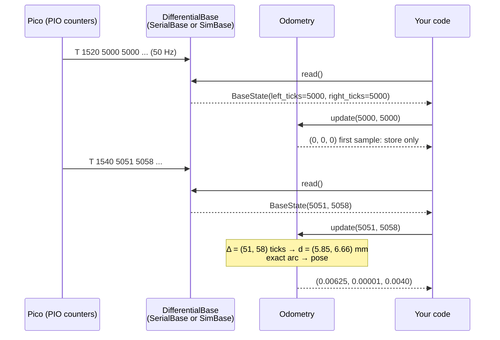

# 09.04 — Build an odometry system from scratch (tested against the simulator)

<!-- glance:start -->
<!-- generated by tools/build.py from curriculum/syllabus.yaml — edit the syllabus, not this block -->

| | |
|---|---|
| **Track** | Main path |
| **Difficulty** | Intermediate |
| **Time** | 1 h 30 min |
| **Hardware** | none |
| **Software** | python, pytest |
| **Prerequisites** | [09.02 The other way — cmd_vel to wheel speeds (with saturation)](09.02-inverse-kinematics-cmd-vel.md)<br>[09.03 Dead reckoning — integrating motion (Euler, midpoint, exact arcs)](09.03-dead-reckoning-integration.md)<br>[06.02 The course mini-simulator — physics in 100 lines of Python](../06-simulation/06.02-course-mini-simulator.md) |
| **Skip if** | Your odometry passes the course tests and runs on your robot. |

<!-- glance:end -->

## What you will learn

- Turn cumulative encoder counts into per-sample tick deltas, including across a counter rollover.
- Convert ticks to wheel travel and integrate the exact-arc pose update from [09.03](09.03-dead-reckoning-integration.md).
- Build an `Odometry` class with correct first-sample handling that runs unchanged on the simulator and on karmel.
- Pass the course's auto-graded checker: 5 mm / 0.5° against a perfect simulated robot, and bounded error on a realistic one.
- Diagnose the classic odometry bugs (integrating totals, jump on start, wrong sign, rollover) from their symptoms.

## Why it matters

This is the first piece of karmel's state estimation, and every later module sits on it. The
EKF of [10.06](../10-localization/10.06-extended-kalman-filter.md) uses it as its prediction step.
SLAM ([11.03](../11-slam/11.03-the-slam-problem.md)) uses it as the initial guess for scan matching.
Nav2 needs `odom → base_link` to exist at all. In [09.07](09.07-odometry-in-ros2.md) this same code
becomes a ROS 2 node, and in [P05](../projects/P05-autonomous-square-path.md) it drives a square.

The math is already done: [09.01](09.01-diff-drive-kinematics.md) for kinematics and 09.03 for
integration. What's left is engineering: the data arrives as *cumulative integer counts* from a
microcontroller, at an irregular rate, from counters that may wrap and may restart when the Pico
reboots. Getting those details right is the difference between odometry that works in a notebook
and odometry that works on the floor. You build it test-first against the course simulator, where
the ground truth is known exactly.

<!-- prereqs:start -->
## Prerequisites

You need these first:

- [09.02 The other way — cmd_vel to wheel speeds (with saturation)](09.02-inverse-kinematics-cmd-vel.md)
- [09.03 Dead reckoning — integrating motion (Euler, midpoint, exact arcs)](09.03-dead-reckoning-integration.md)
- [06.02 The course mini-simulator — physics in 100 lines of Python](../06-simulation/06.02-course-mini-simulator.md)

### Optional prerequisite links

None.

Check your readiness: `python course.py why 09.04`
<!-- prereqs:end -->

## Concept

Think of the Pico's encoder counters as two **odometers in a car**: they only ever report the total
since some starting point. To know how far you drove in the last 20 ms you subtract the previous
reading from the current one. That's the whole architecture:

1. **Remember the last counts.** The very first reading has nothing to subtract from, so it only
   sets the baseline. The counters might say 5000 when your program starts, because the robot was
   pushed by hand or an earlier program ran. That doesn't mean the robot just moved 57 cm.
2. **Delta:** current minus previous, per wheel. Like an event-sourced system: you store the
   *position* in the stream, not the events you already applied.
3. **Rollover:** a hardware counter with N bits wraps like a car odometer going from 99999 to 00000.
   If the difference looks huge and negative, it really went the short way around the wrap.
4. **Ticks → meters:** one revolution is 2464 ticks and one wheel circumference.
5. **Integrate:** the exact arc from 09.03, then wrap the heading.

State is small: the pose and the last counts. The logic is pure (no I/O), which is why it can be
tested in milliseconds and runs the same everywhere behind the `DifferentialBase` interface
([03.05](../03-robot-software/03.05-hardware-abstraction.md)).

> [!TIP]
> **Ask your teacher:** "Before I write any code, give me three encoder sequences, one with a rollover and one with a Pico reboot, and ask me what a correct odometry should output for each."

## Technical explanation

### Level 1 — Intuition: where the numbers come from

The Pico counts quadrature edges in a PIO state machine ([01.09](../01-first-robot/01.09-reading-encoders.md))
and sends them 50 times per second in the telemetry line
`T <ms> <lticks> <rticks> <l_mrad_s> <r_mrad_s> <batt_mV> <range_mm> <flags>`
([`labs/README.md`](../labs/README.md)). `SerialBase.read()` (real robot) and `SimBase.read()`
(simulator) both turn that into a `BaseState` with `left_ticks` and `right_ticks`. Your odometry only
ever sees those two integers.

### Level 2 — Practical: the pipeline with karmel's numbers

**Ticks to distance.** karmel: 11 pulses per motor revolution × 56:1 gearbox × 4 (quadrature) =
2464 ticks per wheel revolution, and wheel radius 0.045 m:

$$d = \frac{2\pi r}{N_{rev}}\,\Delta n = \frac{2\pi \cdot 0.045}{2464}\,\Delta n = 0.11475\ \text{mm} \times \Delta n$$

At the motor limit of 17 rad/s a wheel produces $17/(2\pi) \cdot 2464 \cdot 0.02 = 133$ ticks per
20 ms telemetry period. At a slow 0.05 m/s it's only 9 ticks, so the quantization of one tick is
11 % of the step. Integrate *counts*, never rounded distances or speeds, and that quantization never
accumulates.

**Resolution of heading.** A single tick of difference between the wheels is a heading change of
$0.11475\ \text{mm} / 200\ \text{mm} = 0.00057$ rad $= 0.033°$. That's karmel's heading resolution
per sample.

**A worked sample.** Previous counts $(5000, 5000)$, current $(6000, 6400)$, pose $(0, 0, 0)$:
deltas $(1000, 1400)$ ticks, distances $d_L = 0.11475$ m and $d_R = 0.16065$ m.
$\Delta s = 0.13770$ m, $\Delta\theta = 0.04590/0.2 = 0.22950$ rad (13.15°), $R = 0.6000$ m.
Exact arc: $x = 0.6\sin(0.2295) = 0.13649$ m, $y = 0.6(1 - \cos 0.2295) = 0.01573$ m. New pose
$(0.1365, 0.0157, 0.2295)$.

**The first sample.** `Odometry(0.045, 0.2, 2464)`: `update(5000, 5000)` returns $(0, 0, 0)$ and
stores the counts. `update(6232, 6232)` (half a revolution each) returns $(0.14137, 0, 0)$. If the
first call integrated from zero instead, the pose would jump to $x = 0.574$ m on start-up: the most
common odometry bug there is.

### Level 3 — Mathematics: counter rollover as modular arithmetic

An N-bit signed counter stores values in $[-2^{N-1}, 2^{N-1})$ and wraps modulo $M = 2^N$. If the true
change between two readings is guaranteed to be smaller than $M/2$ in magnitude, the true delta is
the unique value in $[-M/2, M/2)$ congruent to $c - p$ modulo $M$:

$$\Delta n = \big((c - p) + M/2\big) \bmod M \;-\; M/2$$

Python's `%` always returns a non-negative result for a positive modulus, so this one line is correct
for both directions. Example, 16-bit ($M = 65536$): previous 30000, current −30000. The raw difference
is −60000. $(-60000 + 32768) \bmod 65536 = 38304$, minus 32768 gives **+5536 ticks** (0.635 m forward),
not 6.9 m backward.

**How big is safe?** The assumption $|\Delta n| < M/2$ must hold between two *consecutive* samples.
At 133 ticks per sample an 8-bit counter (half-range 128) is already too small at full speed. A 16-bit counter (32768) is safe for 246 samples, about 5 s of lost telemetry at full speed.
karmel's firmware uses 32-bit counts (`to_signed32` in [`labs/firmware/pico/encoders.py`](../labs/firmware/pico/encoders.py)),
which wrap after $2^{31}$ ticks = 246 km of driving. So why bother? Because counters elsewhere are
narrower. STM32 hardware timers used as encoder interfaces are often 16-bit, some motor controllers
report 16-bit counts, and a checker that includes rollover proves your deltas are really modular. The
simulator can emulate it with `dataclasses.replace(DiffDriveParams.ideal(), encoder_bits=12)`.

**A reset is not a rollover.** When the Pico reboots, the counts restart at 0 from some arbitrary
value. Modular arithmetic can't detect that: from 150000 to 12 is just a large negative delta. Detect
it from the *clock* instead. The telemetry `ms` field goes backwards on a reboot.
`karmel_base/base_node.py` does exactly this in `on_telemetry`: if `t.ms < prev_ms`, it treats the
previous counts as 0 and continues.

**Pose update.** Unchanged from 09.03, with wheel distances instead of velocities:

$$\Delta s = \frac{d_L + d_R}{2},\quad \Delta\theta = \frac{d_R - d_L}{L},\quad
\begin{cases} x \mathrel{+}= \Delta s\cos\theta,\ y \mathrel{+}= \Delta s\sin\theta & |\Delta\theta| < 10^{-9} \\
x \mathrel{+}= R[\sin(\theta+\Delta\theta)-\sin\theta],\ y \mathrel{-}= R[\cos(\theta+\Delta\theta)-\cos\theta] & \text{otherwise, } R = \Delta s/\Delta\theta \end{cases}$$

then $\theta \leftarrow \operatorname{atan2}(\sin(\theta+\Delta\theta), \cos(\theta+\Delta\theta))$.

### Level 4 — Implementation: design decisions

- **Pure class, no I/O.** `Odometry.update(left_ticks, right_ticks) -> pose`. The loop that calls
  `base.read()` lives outside. The same class is used in the checker, in
  [`code/odometry_live.py`](code/odometry_live.py) and later inside a ROS node.
- **Tuple pose `(x, y, theta)`**, heading wrapped to $(-\pi, \pi]$. Keep an unwrapped heading
  separately if you need total rotation.
- **Robot numbers from `load_config()`**, never literals, so your robot's calibrated values
  ([09.05](09.05-calibrating-odometry.md)) flow in by editing `labs/config/karmel.yaml`.
- **Don't use the reported wheel speeds** (`left_rad_s`) for the pose. They're filtered estimates
  ([08.03](../08-control/08.03-wheel-speed-estimation.md)) and lag. Counts are exact. Speeds are fine
  for the *twist* you publish in 09.07.
- **Pace the loop by telemetry.** On the robot, `SerialBase.read()` returns the newest sample
  immediately. Calling it twice between samples is harmless (a zero delta), but a tight loop wastes
  CPU. `09-odometry/code/course_code.py:next_state()` uses `wait_for_telemetry(newer_than=...)`.

## Diagram



Inside `update`:

```text
 counts (int) ──► tick_delta (mod 2^N) ──► ticks_to_distance ──► integrate_pose ──► pose (x, y, θ)
     ▲                                                                   │
     └──────────── remember counts ◄─────────────────────────────────────┘
```

## Code

The exercise is [`labs/exercises/09.04/`](../labs/exercises/09.04/README.md). `student.py` gives
you the signatures and docstrings:

| Function | Does |
|---|---|
| `tick_delta(previous, current, encoder_bits=None)` | signed change in counts, correct across counter rollover |
| `ticks_to_distance(ticks, wheel_radius_m, ticks_per_rev)` | ticks → meters travelled by the wheel |
| `integrate_pose(pose, d_left, d_right, wheel_separation_m)` | exact-arc pose update, straight-line special case, heading wrapped to (−π, π] |
| `Odometry.update(left_ticks, right_ticks)` | first call only stores the counts; later calls integrate the deltas and return the pose |

The checker's end-to-end test drives the simulator through straights, arcs, spins and reversing
(about 4 m) and compares your pose with ground truth. This is the loop every robot program in the
course uses:

```python
def drive_and_compare(impl, params: DiffDriveParams, sensors: SensorParams, seed: int) -> tuple[float, float]:
    """Drive PLAN with SimBase, run the odometry on the telemetry; return (position, heading) error."""
    cfg = load_config()
    base = SimBase(DiffDriveSim(World(), params, sensors, pose=START, seed=seed))
    odom = impl.Odometry(
        cfg.drive.wheel_radius_m, cfg.drive.wheel_separation_m, cfg.drive.ticks_per_wheel_rev,
        encoder_bits=params.encoder_bits, initial_pose=START,
    )
    state = base.read()
    odom.update(state.left_ticks, state.right_ticks)
    for seconds, (left, right) in PLAN:
        for _ in range(round(seconds / base.dt)):
            base.set_wheel_velocity(left, right)
            state = base.read()
            odom.update(state.left_ticks, state.right_ticks)
    x, y, theta = odom.pose
    truth = base.sim.pose
    return math.hypot(x - truth.x, y - truth.y), abs(angle_diff(theta, truth.theta))
```

Run the checker:

```bash
python course.py check 09.04              # your student.py
python course.py check 09.04 --solution   # see what passing looks like
```

Then watch *your* odometry drive: [`09-odometry/code/odometry_live.py`](code/odometry_live.py)
loads `labs/exercises/09.04/student.py`, drives a 12 s plan on the simulator or on karmel, and prints
estimate vs truth twice a second:

```bash
python 09-odometry/code/odometry_live.py --ideal          # perfect robot
python 09-odometry/code/odometry_live.py --plot run.png   # realistic robot
python 09-odometry/code/odometry_live.py --port /dev/ttyACM0   # on the Pi, real robot
```

## Exercise

### Exercise 09.04-E1 — Deltas and rollover by hand `[numerical]`

Hardware: none. Compute `tick_delta` for: (a) 100 → 150, no wrap; (b) 16-bit, 30000 → −30000;
(c) 12-bit, 2040 → −2040; (d) 8-bit, 127 → −128; (e) 8-bit, 100 → −100. For (b), how far did the
wheel roll in meters? For which of these would an unwrapped subtraction give a wrong answer?

### Exercise 09.04-E2 — Predict the first-sample bug `[predict]`

Hardware: none. A robot's counters read (12 320, 12 320) when your program starts. Its odometry
integrates the first reading from zero instead of storing it. Predict the reported pose after the first
update, and what happens on a Pico reboot mid-run if the code has no reboot detection.

### Exercise 09.04-E3 — Build the odometry `[coding]`

Hardware: none. Implement the four pieces in `labs/exercises/09.04/student.py`, in the order of the
table. Run the checker after each one: the hand-computed tests for that function turn from *skipped*
to *passed*.

Check it: `python course.py check 09.04`

### Exercise 09.04-E4 — Your odometry on the simulator `[simulation]`

Hardware: none (simulation). Once the checker passes, run `odometry_live.py --ideal` and then without
`--ideal`. Before running, predict the final error for both. Then run the realistic version again with
the wheel separation in your `Odometry` changed to 0.208 m (edit the script's constructor call, or
pass `DiffDriveParams.realistic().true_wheel_separation_m`), and explain what changed.

### Exercise 09.04-E5 — Your odometry on karmel `[hardware]`

Hardware: `robot-base`.

> [!CAUTION]
> **Safety:** the robot drives by itself for 12 s (about 2.5 m of path within roughly a 1 m × 1 m area). Clear 1.5 m × 1.5 m of floor, keep pets and people out, have the power switch within reach. First run it with the robot on a stand (wheels in the air) to check that the wheels turn in the expected directions and the watchdog stops them when you press Ctrl+C.

1. Put a strip of tape on the floor marking base_link (midpoint of the axle) and the heading (a
   line along the robot's forward axis).
2. On the Pi: `python 09-odometry/code/odometry_live.py --port /dev/ttyACM0`.
3. Measure the final position of base_link relative to the start mark (x along the start heading,
   y to its left) and the final heading. Compare with the last printed odometry line.
4. Repeat 3 times.

### Exercise 09.04-E6 — Break it on purpose `[debugging]`

Hardware: none. Make three separate, deliberate bugs in a copy of your solution and run the checker
against each: (1) integrate totals instead of deltas; (2) swap `d_left` and `d_right`; (3) forget the
straight-line branch. For each, write down which tests fail and the failure message *before* running.
This builds the symptom → cause map you'll use on the robot.

## Expected result

**09.04-E1:** (a) +50. (b) +5536 ticks = 0.635 m forward. (c) +16 (12-bit, $M = 4096$). (d) +1. (e) +56.
Unwrapped subtraction is wrong for (b), (c), (d) and (e).

**09.04-E2:** The first update jumps the pose to $x = 12320 \times 0.11475\text{ mm} = 1.414$ m (5 wheel
revolutions) while the robot hasn't moved. On a reboot without detection, the counts drop from, say,
(80 000, 80 000) to (0, 0): a delta of −80 000 ticks, and odometry teleports 9.2 m backward. With a
32-bit modular delta that's still −80 000 (well inside the half-range), so modular arithmetic doesn't
catch it. Only the clock going backward does.

**09.04-E3:** `python course.py check 09.04` ends with `28 passed` and `✅ 09.04 checker passed — marked practiced.`
On the reference solution the simulator tests show errors of 0.07 mm / 0.02° (ideal, with and without
12-bit rollover) and 1.2–2.2 cm / 1.4–2.4° (realistic, seeds 1–3). The limits are 5 mm / 0.5° and
25 cm / 15°.

**09.04-E4:** `--ideal`: the last line shows `err 0.0 cm`, with odometry and truth equal to the
millimetre (final pose about `x=+0.759 y=-0.002 th=+156.8 deg`). Realistic: error grows to about
**4.7 cm** by the end and heading differs by under 1°. With the true wheelbase 0.208 m the heading
error shrinks noticeably but the position error doesn't vanish, because the wheel radii are still
nominal and there is random slip. That's exactly what 09.05 and 09.06 separate.

**09.04-E5:** On a hard floor, expect the measured and printed final positions to differ by **2–10 cm**
and **1–5°** before calibration, and the three runs to agree with each other within a few cm. A
difference of tens of centimetres, or a heading error that is exactly mirrored (turning left when
odometry says right), is a bug. See Troubleshooting.

**09.04-E6:** (1) totals: nearly every `Odometry` test fails. `test_updates_use_deltas_not_totals`
reports a pose far beyond one wheel revolution, and the simulator tests are off by meters. (2) swapped wheels: the
arc/spin tests fail with mirrored $y$ and negated $\theta$. The straight-line tests still pass, which
is why a straight test alone proves nothing. (3) no straight branch: `test_straight_line_along_x`
raises `ZeroDivisionError` (or returns `nan`), and nearly every simulator step is affected.

## Troubleshooting

### Symptom: the pose jumps on the first update

1. Print the first `BaseState`. Non-zero counts are normal.
2. Check `update()` stores the counts and returns the unchanged pose on the first call.
3. If you reset encoders at start (`SerialBase.reset_encoders()`), a telemetry line sent *before* the
   reset may still arrive with the old counts. Read one sample after the reset before creating the
   `Odometry`.

### Symptom: odometry turns the opposite way from the robot

1. Robot on a stand. Turn the *left* wheel forward by hand. `left_ticks` must increase.
2. If it decreases, the encoder direction is inverted in the firmware config (fix it there, see 01.09).
3. If counts are right, drive a left spin (`set_wheel_velocity(-3, 3)`). Odometry θ must increase.
   If not, `d_left` and `d_right` are swapped in your code.

### Symptom: sudden jumps of meters during a long run

1. Log `(t, left_ticks, right_ticks)` and the delta per sample. Find the sample where the delta is huge.
2. If the counts go from a large value to near 0 and `t` also went backward, the Pico rebooted
   (brown-out from motor current is typical). Add reboot detection and check the battery and wiring ([01.07](../01-first-robot/01.07-power-system.md)).
3. If counts jump from near $+2^{N-1}$ to near $-2^{N-1}$ with `t` increasing, you're missing rollover
   handling for an N-bit counter: pass `encoder_bits`.
4. If the delta is huge but neither pattern fits, look for a corrupted telemetry line that passed the
   checksum, or two processes reading the same serial port ([03.03](../03-robot-software/03.03-robust-serial-communication.md)).

### Symptom: straight lines are perfect in simulation but curve on the robot

1. Drive 2 m straight with the robot and measure. If the *robot* curved but odometry says straight,
   the wheel radii differ. Odometry is consistent, just not calibrated. Go to [09.05](09.05-calibrating-odometry.md).
2. If the robot went straight but odometry says it curved, one encoder is missing counts: compare
   both wheels' counts for one hand-turned revolution each (should be 2464 ± 2).

## Common mistakes

- **Integrating totals** (`ticks_to_distance(left_ticks)`) instead of deltas.
- **Treating the first reading as a delta from zero.**
- **Handling rollover with `abs(delta) > threshold` hacks** instead of modular arithmetic.
- **Using the filtered wheel speeds for the pose.** They lag and aren't exact. Integrate counts.
- **Hard-coding 0.045 / 0.2 / 2464.** Your calibrated robot will differ; read `load_config()`.
- **Not wrapping θ**, then comparing 359° with −1° in a controller.
- **Testing only straight lines.** Swapped wheels and wrong wheelbase are invisible when driving straight.

## Knowledge check

1. Why must the first call to `Odometry.update` only store the counts?
   <details><summary>Answer</summary>

   The counts are cumulative since an arbitrary starting point (power-up, last reset, earlier programs).
   The first reading carries no information about motion since *your* start. Integrating it would jump
   the pose by the whole history of the counter.
   </details>

2. A 16-bit counter goes from −32 700 to 32 700 between two samples. What is the correct delta, and in which direction did the wheel turn?
   <details><summary>Answer</summary>

   Raw difference 65 400. $(65400 + 32768) \bmod 65536 = 32632$, minus 32768 = **−136 ticks**. The
   wheel turned *backward* by 136 ticks (15.6 mm), going through the wrap at −32 768.
   </details>

3. How many ticks per 20 ms does karmel's wheel produce at 0.3 m/s, and what is the smallest counter width (bits) that handles that safely with some margin for a few lost samples?
   <details><summary>Answer</summary>

   $0.3/(2\pi \cdot 0.045) \cdot 2464 \cdot 0.02 = 52.3$ ticks. An 8-bit counter's half range is 128, so
   2 lost samples (157 ticks) already break it. 12-bit (half range 2048) survives ~39 lost samples at
   this speed; 16-bit survives ~5 s even at full speed. 16-bit or more is the practical minimum.
   </details>

4. Predict: in the checker's realistic-robot test your odometry ends 18 cm from truth. Is your code wrong?
   <details><summary>Answer</summary>

   Not necessarily. The realistic preset has mismatched wheel radii, a 4 % larger effective wheelbase
   and slip, which your nominal parameters don't know about. The limit is 25 cm. Check the ideal-robot
   test: if that passes within 5 mm, the code is right and the gap is calibration and noise (09.05, 09.06).
   The reference lands at 1–2 cm on the checker's seeds, so 18 cm is suspicious: look for small
   integration shortcuts such as Euler.
   </details>

5. How can odometry tell a Pico reboot from a counter rollover?
   <details><summary>Answer</summary>

   Rollover happens with time moving forward and a modular delta that is small. A reboot resets the
   firmware clock, so the telemetry `ms` goes backward (and the counts restart near 0). Check the
   timestamp; modular arithmetic alone can't tell.
   </details>

6. Debugging: the ideal-simulator test fails with a position error of 1.3 m while all hand-computed `integrate_pose` tests pass. Where do you look?
   <details><summary>Answer</summary>

   In `Odometry.update`: the pure functions are right, so the plumbing is wrong. Most likely deltas vs
   totals, not updating the stored counts, using `ticks_per_rev` or radius from the wrong config field,
   or passing `encoder_bits` inconsistently. Print the first few deltas: they should be 0–133 ticks.
   </details>

7. What is karmel's heading resolution per telemetry sample, and why doesn't quantization accumulate?
   <details><summary>Answer</summary>

   One tick of wheel difference: $0.11475/200$ rad $= 0.033°$. Quantization doesn't accumulate because
   the counts are cumulative integers. The fractional tick not counted in one sample shows up in a
   later one, so the *total* is always correct to one tick.
   </details>

## Practical challenge

**Odometry that survives the real world.** Extend your `Odometry` into a `RobustOdometry` wrapper that:
(a) takes the full `BaseState` (with `t`); (b) detects a Pico reboot (time going backward) and continues
without a jump; (c) rejects a physically impossible delta (faster than 1.5 × `max_wheel_speed_rad_s`
for the elapsed time), logs it and skips the sample; (d) exposes total distance travelled and total
unwrapped rotation.

Acceptance criteria:

- Unit tests for each behavior with hand-built `BaseState` sequences, running without the simulator.
- A simulator test: drive the checker's `PLAN`; in the middle, inject a fake reboot (subtract the
  current counts and reset `t`) and one corrupted sample (+50 000 ticks). Final error on the ideal robot
  stays under 5 mm.
- Runs unchanged on karmel with `SerialBase`: pull the Pico's USB cable for 2 s mid-run (robot on a stand!)
  and show the pose continues sensibly after reconnection.
- `python course.py check 09.04` still passes with your original functions.

## You can skip this if…

`python course.py check 09.04` passes with your own code, it runs on your robot, and you answer
knowledge-check questions 2, 5 and 6 without looking. Then:

`python course.py skip 09.04 --reason "My odometry passes the course tests and runs on my robot"`

## Go deeper

- ros2_controllers `diff_drive_controller` odometry (jazzy): https://github.com/ros-controls/ros2_controllers/blob/jazzy/diff_drive_controller/src/odometry.cpp. Compare its `update()` (positions → deltas → exact arc) with yours.
- Borenstein & Feng, "Correction of Systematic Odometry Errors in Mobile Robots" (IROS 1995), PDF: https://johnloomis.org/ece445/topics/odometry/borenstein/paper59.pdf. Section 2 defines odometry from encoder pulse increments exactly as here; the rest is 09.05.
- Probabilistic Robotics, MIT Press: https://mitpress.mit.edu/9780262201629/probabilistic-robotics/. Chapter 5.4 "Odometry motion model" treats odometry as a measurement of relative motion, the view the EKF needs.
- REP-105 Coordinate Frames for Mobile Platforms: https://www.ros.org/reps/rep-0105.html. Why odometry is a continuous but drifting frame, before 09.07.

## Progress checkpoint

- [ ] I can compute tick deltas correctly across counter rollover and tell rollover from a reboot.
- [ ] I can convert ticks to wheel travel and integrate the exact arc.
- [ ] My `Odometry` handles the first sample correctly and runs on SimBase and SerialBase unchanged.
- [ ] `python course.py check 09.04` passes with my code.
- [ ] I can map the classic odometry bugs to their symptoms.

`python course.py complete 09.04` (exercises done) · `python course.py master 09.04` (challenge done) · `python course.py struggle 09.04 "what was hard"`

Next: [09.05 — Calibrating odometry: wheel radius, wheelbase and UMBmark](09.05-calibrating-odometry.md).
