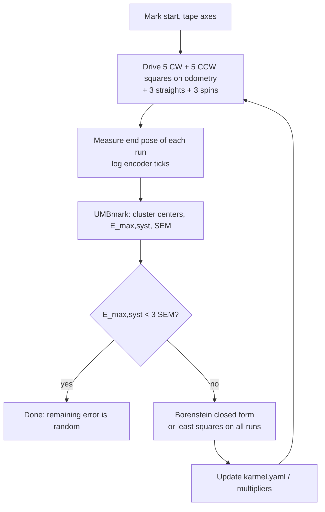

# 09.05 — Calibrating odometry: wheel radius, wheelbase and UMBmark

<!-- glance:start -->
<!-- generated by tools/build.py from curriculum/syllabus.yaml — edit the syllabus, not this block -->

| | |
|---|---|
| **Track** | Main path |
| **Difficulty** | Intermediate |
| **Time** | 1 h 15 min |
| **Hardware** | Stage 1 robot: Pi 5, Pico, encoder motors, driver, chassis, battery, distance sensors (stage 1) |
| **Software** | python |
| **Prerequisites** | [09.04 Build an odometry system from scratch (tested against the simulator)](09.04-odometry-from-scratch.md) |
| **Optional prerequisites** | [FM.21 Statistics for robot experiments: mean, spread, RMSE, outliers](../optional-foundations/mathematics/FM.21-statistics-for-experiments.md) |
| **Skip if** | You calibrated wheel radius and wheelbase from measured runs. |

<!-- glance:end -->

## What you will learn

- Separate systematic odometry errors (wrong radii, wrong wheelbase) from random errors (slip, bumps) using repeated runs.
- Run the UMBmark bidirectional square test, clockwise and counter-clockwise, and compute its error clusters and `E_max,syst`.
- Explain why a one-direction square test can hide large errors, and why the CW and CCW runs separate the two dominant ones.
- Compute Borenstein & Feng's closed-form corrections, and know when they need a second iteration.
- Calibrate `(r_left, r_right, b)` from logged runs with linear and nonlinear least squares, and check that the data can actually determine each parameter.
- Put the calibrated values into `karmel.yaml`, `karmel_base` and `diff_drive_controller`.

## Why it matters

After [09.04](09.04-odometry-from-scratch.md) your odometry is *correct code with wrong numbers*.
The 45 mm radius is what the wheel's box says. Under 1.6 kg of robot the tyre flattens, and the
two wheels are never identical. The 200 mm wheelbase is a ruler measurement between tyre centers,
but the robot turns about wherever the rubber actually grips. Those errors are **systematic**: the
same every run, so they add up in the same direction every meter. On the simulator's realistic
preset they put the robot **over a meter** away from where odometry thinks it is after a 2 m square.

Systematic errors are the cheap ones. Measure them once, change three numbers, and they're gone.
Borenstein and Feng reported at least a 10× improvement in the systematic error of a research robot
from exactly this procedure. Later modules depend on it: an EKF ([10.06](../10-localization/10.06-extended-kalman-filter.md))
assumes odometry errors are zero-mean noise. A biased odometry makes it overconfident in the wrong
direction, and scan matching in SLAM starts from a worse guess. Calibrate before you fuse.

<!-- prereqs:start -->
## Prerequisites

You need these first:

- [09.04 Build an odometry system from scratch (tested against the simulator)](09.04-odometry-from-scratch.md)

### Optional prerequisite links

New to any of these? Take the foundation lesson first; skip it if you already know it.

- [FM.21 Statistics for robot experiments: mean, spread, RMSE, outliers](../optional-foundations/mathematics/FM.21-statistics-for-experiments.md)

Check your readiness: `python course.py why 09.05`
<!-- prereqs:end -->

## Concept

Shoot five arrows at a target. If they land in a tight group 30 cm to the left of the bullseye, your
sight is misaligned: a **systematic** error. Fix the sight and the group moves to the center. If they
land all over the target around the bullseye, it's **random** error: your hands shake. Averaging
tells you where the sight points. The spread tells you how steady you are. Odometry works the same
way: repeat a run several times, and the *center* of the end positions is systematic error and the
*spread* is random.

For a two-wheeled robot, two systematic errors dominate:

- **Unequal wheel diameters** (ratio $E_d = D_R/D_L$). "Straight" lines are really gentle arcs. The
  robot curves toward the smaller wheel on every straight leg, in whichever direction it drives around a square.
- **Wrong wheelbase** (ratio $E_b = b_{actual}/b_{nominal}$). Every turn is too small or too large by the
  same fraction, left turns and right turns alike.

The trap: on a square driven in *one* direction, these two errors can cancel. Suppose the robot
curves slightly left on each straight (bigger right wheel) and under-turns each left corner (wider
wheelbase). The two effects oppose, and it comes back near the start. You'd conclude it's accurate.
Drive the same square clockwise and the two errors now *add up*. That's the insight of **UMBmark**
(University of Michigan Benchmark): always run the square both ways. The simulator's realistic
preset is built exactly like this. Its CCW error is 30 cm, its CW error over a meter.

Then there are two ways to get numbers out of the runs. **Borenstein's formulas** are a closed-form
recipe from the two cluster centers, designed for tape-measure data in 1995. **Least squares** is the
modern, general tool: find the three parameters whose odometry best explains every measured end pose.
You'll do both and compare.

> [!TIP]
> **Ask your teacher:** "Draw the CW and CCW squares of a robot whose right wheel is bigger, then of a robot whose wheelbase is too small, and show me why one direction can hide the error."

## Technical explanation

### Level 1 — Intuition: what each error does to a square

```text
 diameter ratio error (right wheel bigger)      wheelbase error (wheelbase wider than configured)
 every straight leg curves LEFT by β            every corner turns only 90° − α

 CCW square (left corners):                     CCW square:  under-turns every corner
   left curve ADDS to each left corner          CW square:   under-turns every corner
 CW square (right corners):                     → both directions err the same way in x,
   left curve SUBTRACTS from each right corner    mirrored in y
 → the two directions err in opposite x
```

In numbers, from a small-error simulation of a 2 m square starting at the origin facing +x:

| Error | CW end error $(\varepsilon_x, \varepsilon_y)$ | CCW end error $(\varepsilon_x, \varepsilon_y)$ |
|---|---|---|
| right wheel +0.5 % | (−0.170, −0.206) m | (+0.231, −0.187) m |
| wheelbase +4 % | (−0.225, −0.270) m | (−0.225, +0.270) m |

Wheelbase error moves both $\varepsilon_x$ the same way (Type A in Borenstein's terms). Diameter error
moves them opposite ways (Type B). So the sum of the two $x$ errors measures the wheelbase, and their
difference measures the diameter ratio.

### Level 2 — Practical: the UMBmark procedure for karmel

> [!NOTE]
> New to mean, standard deviation and repeated trials? → [FM.21 Statistics for robot experiments](../optional-foundations/mathematics/FM.21-statistics-for-experiments.md). New to least squares? → [FM.19 Linear systems and least squares](../optional-foundations/mathematics/FM.19-linear-systems-least-squares.md) and [FM.20 Optimization basics](../optional-foundations/mathematics/FM.20-optimization-basics.md). Skip them if you already know them.

1. **Mark the start.** Two strips of tape at right angles on a hard floor: one along the robot's start
   heading (+x), one to its left (+y). Mark base_link and the forward axis on the robot (a pointer
   stick at the front helps you read the heading).
2. **Drive the square on odometry.** Side 4 m in the original paper; 1.5–2 m fits a home. Drive each
   leg until *odometry* says the side is done, stop, turn in place until *odometry* says 90°, and repeat
   4 times. Slow: about 0.2 m/s on the legs, like the original experiment, to keep slip low.
3. **Measure the return position error** $\varepsilon = $ measured − odometry, at the end of each run:
   $x$ and $y$ of base_link relative to the start mark, and the heading.
4. **5 runs clockwise, 5 counter-clockwise.** Put the robot back on the mark each time.
5. **Also for least squares:** 3 straight runs (tape the distance) and 3 spins of about two turns
   (count turns, then measure the final angle against the tape line).

[`09-odometry/code/umbmark_run.py`](code/umbmark_run.py) does steps 2–5 on the simulator or on karmel
and writes a JSON log. On the robot it asks you to type in each measured pose.

**Cluster statistics.** For each direction, the **center of gravity** of the $n = 5$ errors

$$x_{cg} = \frac{1}{n}\sum_i \varepsilon_{x,i},\qquad y_{cg} = \frac{1}{n}\sum_i \varepsilon_{y,i},\qquad r_{cg} = \sqrt{x_{cg}^2 + y_{cg}^2}$$

and the benchmark number $E_{max,syst} = \max(r_{cg,cw},\ r_{cg,ccw})$.

The realistic simulator, recorded with `umbmark_run.py record --extra` (2 m square, nominal
parameters): $\text{cg}_{cw} = (-0.460, -1.010)$ m, $\text{cg}_{ccw} = (+0.283, -0.185)$ m, so
$E_{max,syst} = 1.110$ m. The spread of each cluster (random error, standard deviation) is 4–6 cm.

**Systematic or random?** Borenstein's rule of thumb: compute the standard error of the mean of a
cluster, $\text{SEM} = \sigma/\sqrt{n}$. If $E_{max,syst} < 3\,\text{SEM}$, the remaining offset is
indistinguishable from random scatter and a further calibration round won't help. The exercise log
has $\sigma \approx 4.6$ cm, so SEM $\approx 2.1$ cm and the threshold is about 6 cm.

### Level 3 — Mathematics

**Borenstein & Feng's correction.** With side $L$ and the square started facing +x (first leg along +x),
in radians:

$$\alpha = \frac{x_{cg,cw} + x_{cg,ccw}}{-4L} \qquad\qquad \beta = \frac{x_{cg,cw} - x_{cg,ccw}}{-4L}$$

$\alpha$ is the turn error per 90° corner (wheelbase) and $\beta$ the heading gained per straight leg
(diameter ratio). The curved leg has radius and the diameter ratio follows from the rotation about its ICC ([09.01](09.01-diff-drive-kinematics.md)):

$$R = \frac{L/2}{\sin(\beta/2)} \qquad E_d = \frac{D_R}{D_L} = \frac{R + b/2}{R - b/2} \qquad E_b = \frac{\pi/2}{\pi/2 - \alpha}$$

Correct the radii without changing their average, and the wheelbase:

$$c_L = \frac{2}{E_d + 1},\quad c_R = \frac{2}{1/E_d + 1},\qquad r_L \leftarrow c_L\,r_L,\quad r_R \leftarrow c_R\,r_R,\quad b \leftarrow E_b\,b$$

Worked example, a robot whose only error is a right wheel 0.5 % bigger ($x_{cg,cw} = -0.1702$,
$x_{cg,ccw} = +0.2313$, $L = 2$, $b = 0.2$): $\beta = -0.4015/-8 = 0.0502$ rad (2.88°), $R = 1/\sin(0.0251) = 39.85$ m,
$E_d = 39.95/39.75 = 1.0050$, as expected. $\alpha = 0.0611/(-8)$ gives $E_b = 0.995$: a small
cross-talk, because the formula is first order.

**When first order isn't enough.** On the realistic simulator the errors are large: 7° of curve per
leg and 3.5° per corner. One round of Borenstein gives $E_d = 1.0093$ (true 1.0131) and
$E_b = 1.0143$ (true 1.040). Re-driving UMBmark with those values brings $E_{max,syst}$ from 111 cm to
41 cm; a second round predicts 7 cm. The paper recommends exactly this: treat the compensated robot
as a new robot and repeat while $E_{max,syst} > 3\,\text{SEM}$.

**Linear least squares for one parameter.** Straight runs give pairs (mean wheel rotation $\varphi_i$ in
rad, measured distance $d_i$) with $d_i \approx r\,\varphi_i$. Minimize $S(r) = \sum_i (d_i - r\varphi_i)^2$:
$S'(r) = -2\sum_i \varphi_i(d_i - r\varphi_i) = 0$, so

$$\hat r = \frac{\sum_i \varphi_i d_i}{\sum_i \varphi_i^2}$$

Example: $\varphi = (10, 20, 40)$ rad, $d = (0.45, 0.91, 1.79)$ m → $\hat r = 94.3/2100 = 0.044905$ m.
Spins give the wheelbase the same way: $s_i = d_{R,i} - d_{L,i} \approx b\,\Delta\theta_i$, so
$\hat b = \sum s_i\Delta\theta_i / \sum \Delta\theta_i^2$. Example: $s = (1, 2)$ m, $\Delta\theta = (5.0, 10.1)$ rad → $\hat b = 25.2/127.01 = 0.19841$ m.

Those two fits can't see the *ratio* of the wheel radii. On the realistic robot, tape + spin fits
alone ($r = 45.02$ mm for both wheels, $b = 207.6$ mm) still leave $E_{max,syst} = 79$ cm, because the
1.3 % diameter mismatch is the biggest error on a square.

**Nonlinear least squares for all three.** Let $p = (r_L, r_R, b)$. For each logged run $j$, replay
odometry over the recorded ticks with $p$ ([09.04](09.04-odometry-from-scratch.md)) to get the end pose
$\hat{\mathbf{x}}_j(p)$, and stack the residuals

$$\mathbf{e}(p) = \big[\ \hat x_j - x_j,\ \ \hat y_j - y_j,\ \ w\cdot\operatorname{wrap}(\hat\theta_j - \theta_j)\ \big]_{j=1..N}$$

with a weight $w$ (1 m/rad here) so meters and radians can be summed. Minimize $\|\mathbf{e}(p)\|^2$ by
**Gauss–Newton**: linearize $\mathbf{e}(p + \delta) \approx \mathbf{e}(p) + J\delta$, where $J_{kj} = \partial e_k/\partial p_j$,
solve the linear least-squares problem $J\delta = -\mathbf{e}$, update $p \leftarrow p + \delta$, and
repeat. A numerical Jacobian is enough: nudge $p_j$ by $10^{-6} p_j$ and divide the change in $\mathbf{e}$ by
the nudge. With 16 runs that's 48 residuals and 3 unknowns. It converges in 3–5 iterations.

On the realistic simulator log: $r_L = 44.71$ mm, $r_R = 45.28$ mm, $b = 207.8$ mm (truth 44.78, 45.36, 208.0),
and $E_{max,syst}$ drops from 111 cm to **2.2 cm** in one step. Re-driving the squares with those values
measures 1.8 cm, well below the 3·SEM threshold of about 7 cm.

**Observability: can the data determine the parameter?** Multiply all three parameters by the same $k$:
every wheel distance scales by $k$ and every heading change stays the same, so the whole odometry path
is scaled by $k$ about the start. A *closed* square ends near the start at any scale. Squares therefore
say almost nothing about the overall size. The Jacobian of the squares-only problem has singular values
$(7116, 540, 8.8)$, with the smallest one pointing along "scale everything". On the exercise log,
squares-only least squares recovers the *ratio* $r_R/r_L$ correctly but all three values 1.2 % too
large. Adding three straight runs (known distance) raises the smallest singular value to 22 and pins
the scale to 0.26 %. Same lesson as in distributed systems monitoring: you can't learn about a code
path your traffic never exercises. Design the experiment so every parameter changes the measurements.

### Level 4 — Implementation: where the calibrated numbers go

| Consumer | Where | How |
|---|---|---|
| course Python code, simulator nominal values | [`labs/config/karmel.yaml`](../labs/config/karmel.yaml) | `wheel_radius_m` = mean of $r_L, r_R$; `wheel_separation_m` = $b$ (one radius only) |
| `diff_drive_controller` | `labs/ros2_ws/src/karmel_bringup/config/controllers.yaml` | keep `wheel_radius`/`wheel_separation`, set `left_wheel_radius_multiplier` $= r_L/r$, `right_wheel_radius_multiplier` $= r_R/r$, `wheel_separation_multiplier` $= b/L$ |
| `karmel_base` base_node | `wheel_radius`, `wheel_separation` parameters (from karmel.yaml) | a single radius: it can't represent the left/right ratio |
| your own odometry | constructor | per-wheel radii, as in `labs/exercises/09.05` |

For the realistic simulator values: multipliers $44.71/45 = 0.9936$, $45.28/45 = 1.0062$, $207.8/200 = 1.039$.

> [!IMPORTANT]
> **Version-sensitive** (verified 2026-09 against ROS 2 Jazzy, ros2_controllers 4.42.x).
> `diff_drive_controller` exposes `wheel_separation_multiplier`, `left_wheel_radius_multiplier` and `right_wheel_radius_multiplier` for calibration. Check the parameter names before editing: https://control.ros.org/jazzy/doc/ros2_controllers/diff_drive_controller/doc/userdoc.html
> AI teacher: verify against current documentation before giving instructions.

Calibration depends on the floor, the load and tyre wear. Re-run UMBmark after changing wheels, adding
the Jetson or the arm (weight flattens tyres), or moving to carpet. Keep the logs: they are cheap
regression data.

## Diagram

The calibration workflow:



Return-position errors of the realistic simulator before calibration (top view, meters; each cluster
is 5 runs):

```text
        ε_y
  +0.2 ┤
   0.0 ┼───────────────┼───────── ε_x
  -0.2 ┤               ┊    ○○○ CCW cluster, center (+0.28, −0.19)
       ┊               ┊
  -0.6 ┤               ┊         random spread: σ ≈ 4-5 cm within each cluster
       ┊               ┊
  -1.0 ┤    ●●●        ┊         systematic: E_max,syst = |(−0.46, −1.01)| = 1.11 m
       ┊    CW cluster, center (−0.46, −1.01)
       └────┬──────────┼────┬───
          -0.5         0   +0.3
```

## Code

The auto-graded exercise [`labs/exercises/09.05/`](../labs/exercises/09.05/README.md) gives you
`logged_runs.json`: 16 runs of a robot whose true geometry is hidden. You implement `fit_wheel_radius`,
`fit_wheel_separation`, `umbmark_summary`, `borenstein_correction`, `replay_odometry`, `pose_residuals`
and `calibrate_least_squares`. The Gauss–Newton loop you write looks like this:

```python
def calibrate_least_squares(runs, ticks_per_rev, initial, iterations=10, heading_weight_m=1.0):
    params = np.asarray(initial, dtype=float)
    for _ in range(iterations):
        residual = pose_residuals(params, runs, ticks_per_rev, heading_weight_m)
        jacobian = np.empty((residual.size, 3))
        for j in range(3):
            h = 1e-6 * params[j]
            bumped = params.copy()
            bumped[j] += h
            jacobian[:, j] = (pose_residuals(bumped, runs, ticks_per_rev, heading_weight_m) - residual) / h
        delta, *_ = np.linalg.lstsq(jacobian, -residual, rcond=None)
        params = params + delta
        if np.all(np.abs(delta) < 1e-9 * np.abs(params)):
            break
    return float(params[0]), float(params[1]), float(params[2])
```

Record and analyze your own runs with [`09-odometry/code/umbmark_run.py`](code/umbmark_run.py). It
drives with a small closed-loop segment driver (`drive_segments` in [`code/course_code.py`](code/course_code.py)):
lines hold their start heading, turns stop early by the predicted coast, and a correction pass follows
each segment.

```bash
# simulator, realistic preset (about 1.5 min)
python 09-odometry/code/umbmark_run.py record --out runs.json --extra
python 09-odometry/code/umbmark_run.py analyze runs.json            # uses YOUR 09.05 student.py
python 09-odometry/code/umbmark_run.py analyze runs.json --solution

# karmel (on the Pi): 1.5 m square, you type in each measured end pose
python 09-odometry/code/umbmark_run.py record --port /dev/ttyACM0 --side 1.5 --extra --out karmel_runs.json
```

`analyze` on the simulator log prints:

```text
as driven              r_L=45.00 mm r_R=45.00 mm b=200.0 mm | cg_cw=(-0.460, -1.010) cg_ccw=(+0.283, -0.185) E_max,syst=111.0 cm
Borenstein: E_d = c_R/c_L = 1.0093, E_b = 1.0143
Borenstein (replayed)  r_L=44.79 mm r_R=45.21 mm b=202.9 mm | cg_cw=(-0.103, -0.439) cg_ccw=(-0.018, +0.039) E_max,syst=45.0 cm
tape + spin fits       r_L=45.02 mm r_R=45.02 mm b=207.6 mm | cg_cw=(-0.249, -0.754) cg_ccw=(+0.495, -0.440) E_max,syst=79.4 cm
least squares (all)    r_L=44.71 mm r_R=45.28 mm b=207.8 mm | cg_cw=(+0.013, -0.006) cg_ccw=(-0.001, +0.022) E_max,syst=2.2 cm
```

"Replayed" means the same logged ticks re-integrated with the new parameters. To confirm a calibration
for real, record again *driving with* the new values (`--radius-left 0.04471 --radius-right 0.04528 --separation 0.2078`).

## Exercise

### Exercise 09.05-E1 — Borenstein by hand `[numerical]`

Hardware: none. A 1.5 m UMBmark on a robot with $b = 0.2$ m gives $x_{cg,cw} = -0.12$ m and
$x_{cg,ccw} = +0.06$ m. Compute $\alpha$, $\beta$ (in degrees), $R$, $E_d$, $E_b$, $c_L$, $c_R$ and the
corrected wheelbase. Which wheel is bigger?

### Exercise 09.05-E2 — Which direction hides it? `[predict]`

Hardware: none. The realistic simulator's right wheel is 1.3 % bigger than the left, and its effective
wheelbase is 4 % wider than nominal. Before looking at the numbers in this lesson, predict: which
UMBmark direction ends closer to the start, and why? And if the wheelbase were 4 % *narrower* instead?

### Exercise 09.05-E3 — Calibrate from the logged runs `[coding]`

Hardware: none. Implement the seven functions in `labs/exercises/09.05/student.py`. Then run your
`calibrate_least_squares` on the squares only, and on squares + straights, and compare the three
parameters with what `check` accepts.

Check it: `python course.py check 09.05`

### Exercise 09.05-E4 — Full calibration loop in the simulator `[simulation]`

Hardware: none (simulation). With `umbmark_run.py`:
1. `record --extra` with nominal values, then `analyze`.
2. `record` again, driving with Borenstein's values; `analyze` again. Iterate until $E_{max,syst} < 3\,\text{SEM}$.
3. Separately, `record` driving with the least-squares values.
Compare how many recording rounds each method needs and the final $E_{max,syst}$.

### Exercise 09.05-E5 — Calibrate karmel `[hardware]`

Hardware: `robot-base`, a tape measure and masking tape (`tools`).

> [!CAUTION]
> **Safety:** the robot drives 16 runs autonomously, about 1.5 m squares. Clear a 2.5 m × 2.5 m area of
> hard floor, keep people and pets out of the square while it runs, keep the power switch within reach,
> and check the battery is above 11 V (low voltage lowers top speed and changes slip). Ctrl+C stops
> the script and the motors.

1. Tape the start axes. `python 09-odometry/code/umbmark_run.py record --port /dev/ttyACM0 --side 1.5 --extra --out karmel_runs.json`.
2. After each run, measure base_link's position relative to the start mark and the heading, and type them in.
3. `analyze karmel_runs.json`. Put the least-squares values into `labs/config/karmel.yaml` and the multipliers into `controllers.yaml`.
4. Record the squares once more driving with the new values and confirm the improvement.

## Expected result

**09.05-E1:** $\alpha = (-0.06)/(-6) = 0.0100$ rad (0.573°), $\beta = (-0.18)/(-6) = 0.0300$ rad (1.719°).
$R = 0.75/\sin(0.015) = 50.00$ m, $E_d = 50.10/49.90 = 1.00401$, $E_b = 1.5708/1.5608 = 1.00641$.
$c_L = 0.99800$, $c_R = 1.00200$, $b_{new} = 0.20128$ m. $\beta > 0$: the robot curves left on straights,
so the **right** wheel is bigger.

**09.05-E2:** The bigger right wheel curves every leg *left*. A wider wheelbase makes every corner *too
small*. Counter-clockwise (left corners), the extra left curve partly makes up for the missing corner
angle, so **CCW ends closer** (30 cm vs 111 cm in the simulation). With a 4 % narrower wheelbase the
robot over-turns every corner, and the left curve adds to the over-turn on CCW, so CW would end closer.

**09.05-E3:** `python course.py check 09.05` ends with `15 passed`. Least squares on all 16 runs gives
about $(44.76, 45.39, 210.5)$ mm, within 0.3 % of the hidden truth, and replaying the squares
gives $E_{max,syst} \approx 1.7$ cm (from 131.7 cm). Squares only: the ratio is still right but all three
values come out about 1.2 % too large. Borenstein once: $E_{max,syst} \approx 65$ cm (replayed).

**09.05-E4:** Nominal 111 cm. Borenstein round 1 → re-driven 41 cm. Round 2 predicts 7 cm, right at the
3·SEM threshold (5–8 cm with the realistic preset's 2 % slip), so a third recording may or may not change anything. Least squares with
straights and spins: one analysis, re-driven $E_{max,syst} = 1.8$ cm. Values vary by ±1 cm with seeds.

**09.05-E5:** Uncalibrated karmel on a hard floor: $E_{max,syst}$ typically **10–40 cm** on a 1.5 m square,
with the CW and CCW clusters clearly separated; cluster spread 1–5 cm. After calibration,
$E_{max,syst}$ should drop at least 5× and be within about 3·SEM. Calibrated radii within ±2 % of 45 mm and
a wheelbase within ±8 % of 200 mm are plausible. Outside that, suspect a measurement or unit mistake
before believing the numbers.

## Troubleshooting

### Symptom: calibration makes it worse

1. Check the sign convention of your measurements: +x along the start heading, +y to the robot's
   *left*, heading positive counter-clockwise. A mirrored $y$ turns a left curve into a right one.
2. Check you used $\varepsilon = $ measured − odometry, not the other way around.
3. Check the square started facing +x with the first leg along +x. Borenstein's $x$ formulas assume it.
4. Re-analyze with least squares. It uses the full end poses and doesn't depend on those conventions
   beyond the frame itself.

### Symptom: CW and CCW clusters overlap and the spread is large

1. Random error dominates: compare the spread with the cluster offsets. If $E_{max,syst} < 3\,\text{SEM}$,
   calibration can't do better with this data.
2. Reduce slip: slower legs, gentler acceleration, clean wheels, a hard floor rather than carpet.
3. Increase $n$ (more runs) to shrink SEM, or increase the square size so systematic errors grow
   faster than random ones.

### Symptom: least squares returns absurd values (radius 250 mm, wheelbase 1.1 m)

1. You fitted squares only. The overall scale isn't observable (see Level 3). Add straight runs with
   a measured distance.
2. Check the singular values of the Jacobian (`np.linalg.svd(J, compute_uv=False)`). A smallest value
   hundreds of times below the largest means one parameter combination is unobservable.
3. Start from sensible initial values (the nominal geometry) and cap the iterations.

### Symptom: wheelbase from spins disagrees with wheelbase from squares by several percent

1. Spins in place and turns during squares load the tyres differently. The effective contact point
   moves. That's physical, not a bug.
2. Calibrate from the motion you care about. For navigation, use all runs together (least squares).
3. Check spin speed: fast spins slip more. Repeat at half speed.

## Common mistakes

- **Testing in one direction only.** Errors can cancel on a CCW square and add up on a CW one.
- **Measuring the end pose of the wrong point.** Always base_link (axle midpoint), not the chassis front.
- **Using $\varepsilon$ = odometry − measured.** Borenstein's formulas are defined for measured − odometry.
- **Changing the average radius while fixing the ratio.** Borenstein's $c_L, c_R$ keep the mean; your straight-line calibration sets it.
- **Fitting the scale from closed loops.** Include runs whose endpoint depends on the absolute distance.
- **Calibrating on carpet, then driving on tiles** (or with a new payload). Calibration is floor- and load-specific.
- **Chasing the last centimetre.** Below 3·SEM you're fitting noise.

## Knowledge check

1. What distinguishes a systematic odometry error from a random one, and how does UMBmark separate them?
   <details><summary>Answer</summary>

   Systematic errors repeat with the same sign every run (wrong radii, wrong wheelbase). Random errors
   vary run to run (slip, floor irregularities). UMBmark repeats each direction 5 times: the cluster
   *center* is the systematic part, the *spread* around it the random part.
   </details>

2. Why must the square be driven both clockwise and counter-clockwise?
   <details><summary>Answer</summary>

   A diameter-ratio error curves every leg the same way (e.g. left) regardless of direction, while a
   wheelbase error changes every corner by the same fraction. In one direction the curve adds to the
   corners, in the other it subtracts. So in one direction the two errors can cancel and hide, and the
   two directions together separate them (sum vs difference of the $x$ errors).
   </details>

3. UMBmark on a 2 m square gives $x_{cg,cw} = x_{cg,ccw} = -0.10$ m. What kind of error is it, and what is $E_b$?
   <details><summary>Answer</summary>

   Equal $x$ errors → $\beta = 0$, pure wheelbase (Type A) error. $\alpha = -0.2/(-8) = 0.025$ rad,
   $E_b = (\pi/2)/(\pi/2 - 0.025) = 1.0162$: the true wheelbase is 1.6 % larger than configured.
   </details>

4. Predict: you calibrate least squares using only the 10 UMBmark squares. Which parameters come out well and which don't?
   <details><summary>Answer</summary>

   The ratio $r_R/r_L$ and the ratio $b/r$ are determined, because they change the shape of the path.
   The overall scale (all three multiplied by the same factor) isn't, because a closed square ends at
   the start at any scale. Absolute radius and wheelbase can be off by percent. Add straight runs with
   a measured distance.
   </details>

5. Derive the least-squares estimate of $r$ from pairs $(\varphi_i, d_i)$ with the model $d = r\varphi$.
   <details><summary>Answer</summary>

   $S(r) = \sum (d_i - r\varphi_i)^2$. Setting $dS/dr = -2\sum\varphi_i(d_i - r\varphi_i) = 0$ gives
   $r = \sum\varphi_i d_i / \sum\varphi_i^2$. It's a line fit through the origin.
   </details>

6. After one calibration round, $E_{max,syst} = 4$ cm and the cluster standard deviation is 6 cm with 5 runs each. Recalibrate?
   <details><summary>Answer</summary>

   SEM $= 6/\sqrt5 = 2.7$ cm, 3·SEM = 8 cm. $E_{max,syst} = 4$ cm < 8 cm, so the remaining offset is
   within random scatter. Another round would fit noise. Reduce random error (slower, better floor) or
   do more runs if you need better.
   </details>

7. Debugging: your calibrated right-wheel multiplier is 0.98 and the left one 1.02, but the robot now curves *more* than before. What's the most likely cause?
   <details><summary>Answer</summary>

   A sign/convention flip: $y$ measured to the right instead of the left, $\varepsilon$ computed as
   odometry − measured, or left/right swapped when entering the multipliers. The magnitude is plausible,
   the direction isn't. Re-check the frame on one run by hand.
   </details>

## Practical challenge

**A calibration you can hand to someone else.** Calibrate karmel (or the realistic simulator with a
seed you don't look at: `dataclasses.replace(DiffDriveParams.realistic(), wheel_radius_scale_left=<secret>, ...)`
set by a friend or your AI teacher) end to end.

Acceptance criteria:

- A log file with ≥ 5 CW, ≥ 5 CCW, ≥ 3 straight and ≥ 3 spin runs, and an analysis script that regenerates all numbers from it.
- A before/after plot of both UMBmark clusters, from a re-*driven* (not replayed) run with the calibrated values.
- $E_{max,syst}$ after calibration $\le 3\,\text{SEM}$ of the after-runs, and at least a 5× improvement.
- The Jacobian's singular values for your data set, and one sentence on which parameter combination is least well determined.
- The final values written into `labs/config/karmel.yaml` and the `controllers.yaml` multipliers, and `python course.py check 09.04` still passes (its tests read the config).

## You can skip this if…

You have calibrated wheel radius and wheelbase of a differential-drive robot from measured runs, you
answer knowledge-check questions 2, 4 and 6 without looking, and `python course.py check 09.05` passes.
Then:

`python course.py skip 09.05 --reason "I calibrated wheel radius and wheelbase from measured runs"`

## Go deeper

- Borenstein & Feng, "Correction of Systematic Odometry Errors in Mobile Robots" (IROS 1995), PDF: https://johnloomis.org/ece445/topics/odometry/borenstein/paper59.pdf. Six pages: the UMBmark procedure, Type A/B errors and the correction equations used here.
- Borenstein & Feng, "UMBmark: A Benchmark Test for Measuring Odometry Errors in Mobile Robots" (SPIE 1995), PDF: https://johnloomis.org/ece445/topics/odometry/borenstein/paper60.pdf. The rationale for the bidirectional square in detail.
- Borenstein & Feng, "Measurement and Correction of Systematic Odometry Errors in Mobile Robots", IEEE Transactions on Robotics and Automation 12(6), 1996: https://doi.org/10.1109/70.544770. The journal version with the full derivation.
- diff_drive_controller parameters (Jazzy): https://control.ros.org/jazzy/doc/ros2_controllers/diff_drive_controller/doc/userdoc.html. The calibration multipliers.
- Introduction to Autonomous Mobile Robots (Siegwart et al.), MIT Press: https://mitpress.mit.edu/9780262015356/introduction-to-autonomous-mobile-robots/. Section 5.2.4 on odometric error models and systematic vs non-systematic errors.
- Probabilistic Robotics, MIT Press: https://mitpress.mit.edu/9780262201629/probabilistic-robotics/. Chapter 5 on motion-model parameters; the view that calibration estimates the model, noise estimation estimates its variance.

## Progress checkpoint

- [ ] I can separate systematic from random odometry error with repeated runs.
- [ ] I can run UMBmark in both directions and compute the cluster centers, `E_max,syst` and SEM.
- [ ] I can compute Borenstein's corrections and know when to iterate.
- [ ] I can calibrate `(r_left, r_right, b)` with least squares and check observability.
- [ ] My robot's calibrated values are in `karmel.yaml` and `controllers.yaml`, and `python course.py check 09.05` passes.

`python course.py complete 09.05` (exercises done) · `python course.py master 09.05` (challenge done) · `python course.py struggle 09.05 "what was hard"`

Next: [09.06 — Accumulated error: why odometry always drifts](09.06-accumulated-error.md).
