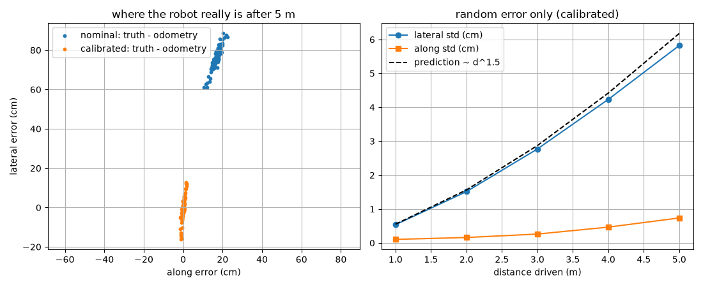
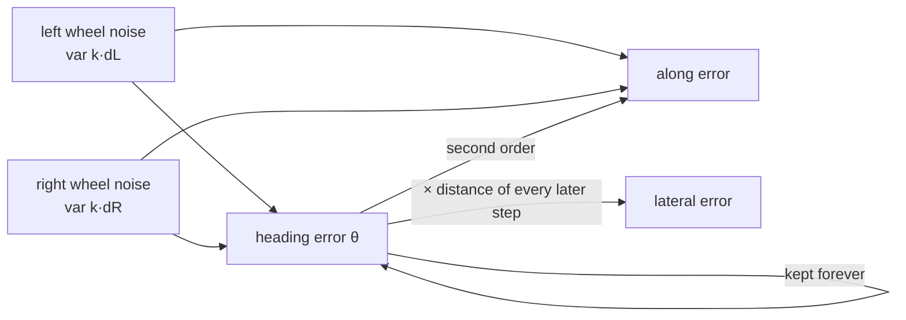

# 09.06 — Accumulated error: why odometry always drifts

<!-- glance:start -->
<!-- generated by tools/build.py from curriculum/syllabus.yaml — edit the syllabus, not this block -->

| | |
|---|---|
| **Track** | Main path |
| **Difficulty** | Intermediate |
| **Time** | 50 min |
| **Hardware** | none |
| **Software** | python |
| **Prerequisites** | [09.05 Calibrating odometry — wheel radius, wheelbase and UMBmark](09.05-calibrating-odometry.md) |
| **Optional prerequisites** | [FM.14 Distributions, Gaussians, uncertainty and noise](../optional-foundations/mathematics/FM.14-distributions-gaussians-noise.md)<br>[FM.15 Covariance and multivariate Gaussians](../optional-foundations/mathematics/FM.15-covariance-multivariate-gaussians.md) |
| **Skip if** | You can explain why heading error dominates position error over distance. |

<!-- glance:end -->

## What you will learn

- Explain why odometry error is unbounded: every error is integrated, and integrated again.
- Show with numbers why a small heading error dominates position error over distance.
- Predict how systematic errors (∝ d²) and random errors (lateral ∝ d^1.5, heading ∝ √d) grow with distance.
- Run a Monte Carlo experiment on the course simulator and read means, spreads and scatter plots correctly.
- Propagate wheel noise into a pose covariance with the Jacobians `F` and `G`, and check it against the Monte Carlo.
- Estimate the wheel-noise constant `k` of your own robot from repeated runs.

## Why it matters

After [09.05](09.05-calibrating-odometry.md) karmel's odometry has no *known* bias left, and it still
drifts. Drive it around the apartment for five minutes and odometry will put it in the wrong room.
That is not a bug. It's the nature of dead reckoning, and it's the reason modules 10 and 11 exist.
Localization ([10.01](../10-localization/10.01-what-is-localization.md)) corrects odometry with
landmarks and maps; SLAM corrects it with loop closures.

Those algorithms need more than "odometry drifts". They need *how much, in which direction, and how
fast*, as a covariance matrix. The EKF's prediction step ([10.06](../10-localization/10.06-extended-kalman-filter.md))
is exactly the covariance propagation you derive here. A particle filter ([10.08](../10-localization/10.08-particle-filter-mcl.md))
is the Monte Carlo experiment of this lesson run live, with a map. The ROS message you publish in
[09.07](09.07-odometry-in-ros2.md) has covariance fields that should come from this lesson rather
than from a guess. Understanding the shape of odometry error also changes design decisions: why a
gyro helps so much ([10.07](../10-localization/10.07-fusing-imu-and-odometry.md)), and why a 2 cm
position fix is worth less than a 1° heading fix.

<!-- prereqs:start -->
## Prerequisites

You need these first:

- [09.05 Calibrating odometry — wheel radius, wheelbase and UMBmark](09.05-calibrating-odometry.md)

### Optional prerequisite links

New to any of these? Take the foundation lesson first; skip it if you already know it.

- [FM.14 Distributions, Gaussians, uncertainty and noise](../optional-foundations/mathematics/FM.14-distributions-gaussians-noise.md)
- [FM.15 Covariance and multivariate Gaussians](../optional-foundations/mathematics/FM.15-covariance-multivariate-gaussians.md)

Check your readiness: `python course.py why 09.06`
<!-- prereqs:end -->

## Concept

Walk down a long straight corridor with your eyes closed. If your first step is 1° off, you don't
end up 1° wrong. You end up *sideways*, and the offset keeps growing with every meter you walk:
1.7 cm after one meter, 17 cm after ten. A step that's 1 % too short, by contrast, only costs you 1 %
of the distance. **Heading errors are paid for again on every meter that follows. Distance errors are
paid once.**

That's the first mechanism: position is the integral of heading, so heading errors become position
errors *times distance*. The second is that odometry errors never get corrected. Each sample adds a
little error and nothing ever removes any. There's no reference, only the robot's own wheels, so the
uncertainty only grows. It's like clock drift in a distributed system without NTP: every node's clock
is "almost right" and the disagreement between them grows forever.

Two kinds of error grow at different rates:

- **Systematic** (a calibration residual, a slightly soft tyre): the same bias every meter. A heading
  bias per meter grows the heading error linearly, and the lateral error *quadratically* with distance.
- **Random** (slip, floor bumps, encoder quantization): independent kicks. They partly cancel, so the
  heading error grows like a random walk ($\propto\sqrt d$), and the lateral error, the integral of a
  random walk, like $d^{1.5}$.

The result is an uncertainty region that is **long and thin across the direction of travel**. The
robot knows fairly well how far it drove, but not how far sideways it drifted.

> [!NOTE]
> New to variance, standard deviation and Gaussians? → [FM.14 Distributions, Gaussians and noise](../optional-foundations/mathematics/FM.14-distributions-gaussians-noise.md). New to covariance matrices? → [FM.15 Covariance and multivariate Gaussians](../optional-foundations/mathematics/FM.15-covariance-multivariate-gaussians.md). Skip them if you already know them.

> [!TIP]
> **Ask your teacher:** "Explain with a random walk why summing N independent heading kicks gives a standard deviation proportional to √N, then why integrating that heading again gives N^1.5."

## Technical explanation

### Level 1 — Intuition: a heading error is a lever

A heading error $\delta\theta$ made at the start of a straight run of length $d$ produces a lateral
error of $d\sin\delta\theta \approx d\,\delta\theta$.

| Heading error | after 1 m | after 5 m | after 10 m |
|---|---|---|---|
| 0.5° | 0.9 cm | 4.4 cm | 8.7 cm |
| 1° | 1.7 cm | 8.7 cm | 17.5 cm |
| 5° | 8.7 cm | 43.6 cm | 87.2 cm |

A 1 % distance error after 10 m is 10 cm, the same as a heading error of only 0.57°. karmel's
heading resolution is 0.033° per tick of wheel difference ([09.04](09.04-odometry-from-scratch.md)).
Heading is what you have to protect.

### Level 2 — Practical: the Monte Carlo experiment

[`code/drift_monte_carlo.py`](code/drift_monte_carlo.py) drives the realistic simulator 5 m straight
at 0.25 m/s (wheel command 5.5 rad/s) 100 times with different random seeds. Two odometries watch the
same encoder ticks: **nominal** (karmel.yaml geometry, so systematic + random error) and **calibrated**
(the simulated robot's true geometry, so random error only). Errors are expressed in the true robot's
frame: *along* the direction of travel and *lateral* to it.

```bash
python 09-odometry/code/drift_monte_carlo.py --runs 100 --plot drift.png     # about 4 minutes
```

| d | nominal: mean lateral | nominal: mean heading | calibrated: std lateral | calibrated: std along | calibrated: std heading |
|---|---|---|---|---|---|
| 1 m | −3.1 cm | −3.55° | 0.54 cm | 1.0 mm | 0.53° |
| 2 m | −12.4 cm | −7.14° | 1.51 cm | 1.6 mm | 0.78° |
| 3 m | −27.8 cm | −10.73° | 2.77 cm | 2.6 mm | 0.93° |
| 4 m | −49.0 cm | −14.35° | 4.23 cm | 4.7 mm | 1.07° |
| 5 m | −76.0 cm | −17.86° | 5.82 cm | 7.4 mm | 1.17° |

Read the table like a reviewer:

- **Systematic** (nominal, mean): heading error grows linearly (3.57° per meter). Lateral error grows
  quadratically: ×4 from 1 to 2 m, ×25 from 1 to 5 m. The 1.3 % larger right wheel curves the true path
  left while the nominal odometry believes it's straight.
- **Random** (calibrated, std): heading $\times 2.2$ from 1 to 5 m (≈ √5), lateral $\times 10.8$ (≈ 5^1.5 = 11.2),
  along only 7 mm at 5 m. **Lateral is 8× larger than along.**
- Calibration removed the mean, not the spread. After 5 m the robot is somewhere in a band about ±12 cm
  wide (2σ) and ±1.5 cm long.



### Level 3 — Mathematics

**Systematic heading bias.** Suppose odometry misjudges the heading change by $\kappa$ rad per meter
(from a wheel-radius ratio error: $\kappa \approx \frac{\Delta r}{\bar r\,b}$, since equal wheel rotations roll the wheels $\Delta r/\bar r$ apart per meter). On a straight run:

$$\delta\theta(d) = \kappa d \qquad\qquad \delta y(d) = \int_0^d \kappa s\,ds = \frac{\kappa d^2}{2}$$

Realistic preset: $\Delta r = 45.36 - 44.775 = 0.585$ mm, $\bar r = 45.07$ mm, $b = 0.208$ m, so
$\kappa = 0.585/(45.07 \cdot 0.208) = 0.0624$ rad/m = 3.57°/m. At 5 m: $\delta\theta = 17.9°$
(measured 17.86°), $\delta y = 0.0624 \cdot 25/2 = 0.78$ m (measured 0.76 m).

**Random wheel noise.** Model each wheel's travel error as independent with variance proportional to
the distance it rolled: $\sigma^2_{L} = k\,|d_L|$, $\sigma^2_{R} = k\,|d_R|$. The constant $k$ has units of
meters. This is the classic model of Chong and Kleeman. It's what you get from many small independent
slips: the variances add. In the simulator slip multiplies every 20 ms step's travel $\delta$ by
$1 + \mathcal N(0, s^2)$, so $k = s^2\delta = 0.02^2 \cdot 4.95\text{ mm} = 1.98\cdot10^{-6}$ m.

On a straight line of length $d$, both wheels roll $d$:

$$\sigma^2_\theta = \frac{\sigma_L^2 + \sigma_R^2}{b^2} = \frac{2k\,d}{b^2}
\qquad \sigma^2_{along} = \frac{\sigma_L^2 + \sigma_R^2}{4} = \frac{k\,d}{2}
\qquad \sigma^2_{lat} = \frac{2k}{b^2}\int_0^d (d - s)^2\,ds = \frac{2k}{b^2}\cdot\frac{d^3}{3}$$

The lateral formula says: a heading kick received at distance $s$ is levered by the remaining
$d - s$ meters. Numbers at $d = 5$ m, $b = 0.208$: $\sigma_\theta = \sqrt{2 \cdot 1.98\cdot10^{-6} \cdot 5}/0.208 = 0.0214$ rad = **1.23°**
(Monte Carlo 1.17°), $\sigma_{lat} = 0.0214 \cdot 5/\sqrt3 = $ **6.2 cm** (5.8 cm),
$\sigma_{along} = \sqrt{1.98\cdot10^{-6}\cdot 5/2} = $ **2.2 mm** (7.4 mm).

The first two match within 6 %. The along prediction is too small because it's first order. Once the
heading has wandered by a degree, part of the lateral error leaks into the along direction ($\approx\sigma_{lat}\,\sigma_\theta$
and similar second-order terms). It's still 8× smaller than the lateral error.

**General propagation: Jacobians.** For arbitrary paths, linearize the per-sample update
([09.03](09.03-dead-reckoning-integration.md), midpoint form) around the current estimate. State
$\mathbf{x} = (x, y, \theta)$, inputs $\mathbf u = (d_L, d_R)$, $\Delta s = (d_L+d_R)/2$,
$\Delta\theta = (d_R - d_L)/b$, $\mu = \theta + \Delta\theta/2$:

$$F = \frac{\partial \mathbf x'}{\partial \mathbf x} = \begin{bmatrix} 1 & 0 & -\Delta s\sin\mu \\ 0 & 1 & \Delta s\cos\mu \\ 0 & 0 & 1\end{bmatrix}
\qquad
G = \frac{\partial \mathbf x'}{\partial \mathbf u} = \begin{bmatrix}
\frac{\cos\mu}{2} + \frac{\Delta s\sin\mu}{2b} & \frac{\cos\mu}{2} - \frac{\Delta s\sin\mu}{2b} \\
\frac{\sin\mu}{2} - \frac{\Delta s\cos\mu}{2b} & \frac{\sin\mu}{2} + \frac{\Delta s\cos\mu}{2b} \\
-\frac1b & \frac1b\end{bmatrix}$$

$$\Sigma' = F\,\Sigma\,F^{\mathsf T} + G\,Q\,G^{\mathsf T}, \qquad Q = \begin{bmatrix} k|d_L| & 0 \\ 0 & k|d_R|\end{bmatrix}$$

The $-\Delta s\sin\mu$ and $\Delta s\cos\mu$ entries of $F$ are the lever: they copy heading
uncertainty into position uncertainty in proportion to the distance of each step. That coupling is
also why $\Sigma$ has off-diagonal terms: $x$, $y$ and $\theta$ errors are correlated.

One step by hand, starting from $\Sigma = 0$, heading 0, karmel wheels each rolling 5 mm with
$k = 2\cdot10^{-6}$ m: $Q = \text{diag}(10^{-8}, 10^{-8})$. $G$ has rows $(0.5, 0.5)$, $(-0.0125, 0.0125)$, $(-5, 5)$,
so $\Sigma'_{xx} = 0.5\cdot10^{-8}$, $\Sigma'_{yy} = 3.1\cdot10^{-12}$, $\Sigma'_{\theta\theta} = 5\cdot10^{-7}$, and $\Sigma'_{y\theta} = 1.25\cdot10^{-9}$.
After a single step, heading already dominates.

**Validity limits.** The Gaussian-ellipse picture assumes small heading uncertainty. When $\sigma_\theta$
reaches tens of degrees, the true cloud of possible positions bends into a banana shape along an arc, and
no ellipse describes it well. That's one reason particle filters exist ([10.08](../10-localization/10.08-particle-filter-mcl.md)).

### Level 4 — Implementation

- `propagate_covariance()` in [`code/drift_monte_carlo.py`](code/drift_monte_carlo.py) implements
  the equations above. The ROS node of [09.07](09.07-odometry-in-ros2.md) uses the same code
  (`course_odometry/odometry_core.py`) to publish a covariance that grows with distance.
- **Estimating $k$ for karmel.** Drive $n \ge 5$ straight runs of length $d$ with calibrated
  parameters and measure the final heading each time. Then $k = \sigma_\theta^2\, b^2 / (2d)$.
  Example: $\sigma_\theta = 1.5°$ (0.0262 rad) over 3 m with $b = 0.2$ m gives $k = 4.6\cdot10^{-6}$ m.
  Because heading is measured more easily and more precisely than lateral offset, use heading.
- **Rotation also costs.** Spins roll the wheels too ($|d_L| = |d_R| = b\,|\Delta\theta|/2$), so turning
  in place increases $\sigma_\theta$ without moving the robot. A path with many spins drifts more than
  its length suggests.

## Diagram

How the three error states feed each other in one odometry step:



The shape of the uncertainty after driving straight (top view, 2σ ellipses, calibrated karmel-like
robot):

```text
  y (lateral)
  ▲                                                  ╭╮  ±12 cm
  │                                    ╭╮            ││
  │                    ╭╮              ││            ││
  │         ·          ││              ││            ││
  ●─────────●──────────●───────────────●─────────────●────▶ x (travel)
  start    1 m        2 m             3 m           5 m
            ±1 cm      ±3 cm           ±6 cm         ±1.5 cm along

  heading 2σ:  1.1°     1.6°            1.9°          2.3°
```

## Code

The Monte Carlo core of [`09-odometry/code/drift_monte_carlo.py`](code/drift_monte_carlo.py): one
simulated robot, two odometries on the same ticks, errors rotated into the true robot frame:

```python
def run_once(params: DiffDriveParams, distance: float, seed: int, checkpoints: list[float]):
    """Drive straight; return {name: array (len(checkpoints), 3) of [along, lateral, heading] errors}."""
    cfg = load_config()
    sim = DiffDriveSim(World(), params, SensorParams.ideal(cfg), seed=seed)
    d = cfg.drive
    odoms = {
        "nominal": WheelOdometry(d.wheel_radius_m, d.wheel_radius_m, d.wheel_separation_m, d.ticks_per_wheel_rev),
        "calibrated": WheelOdometry(
            params.true_wheel_radius_left_m, params.true_wheel_radius_right_m,
            params.true_wheel_separation_m, d.ticks_per_wheel_rev,
        ),
    }
    for odom in odoms.values():
        odom.update(*sim.ticks)
    errors = {name: [] for name in odoms}
    travelled, last = 0.0, sim.pose
    sim.set_velocity(WHEEL_RAD_S, WHEEL_RAD_S)
    for target in checkpoints:
        while travelled < target:
            sim.step(DT)
            p = sim.pose
            travelled += math.hypot(p.x - last.x, p.y - last.y)
            last = p
            for odom in odoms.values():
                odom.update(*sim.ticks)
        c, s = math.cos(p.theta), math.sin(p.theta)
        for name, odom in odoms.items():
            x, y, theta = odom.pose
            dx, dy = x - p.x, y - p.y  # error in the world frame, rotated into the TRUE robot frame:
            along, lateral = c * dx + s * dy, -s * dx + c * dy  # along = direction of travel
            errors[name].append([along, lateral, math.remainder(theta - p.theta, 2 * math.pi)])
    return {name: np.asarray(e) for name, e in errors.items()}
```

It uses `DiffDriveSim` directly (no `SimBase`, no watchdog, no sensor calls) because it only needs
encoder ticks, which keeps 100 runs to a few minutes. `WheelOdometry` is the per-wheel-radius odometry
in [`code/course_code.py`](code/course_code.py). Tests: `python -m pytest 09-odometry/code`.

## Exercise

### Exercise 09.06-E1 — Heading vs distance errors `[numerical]`

Hardware: none. karmel drives 1 m, turns 90° left, and drives 6 m straight. (a) The turn is 3° too
small but odometry believes it was exact. How far off is the end position? (b) Instead, the turn is
exact but the wheel radius is 2 % too small in the odometry. How far off is the end position now?
(c) Which error would you fix first?

### Exercise 09.06-E2 — Extrapolate the drift `[predict]`

Hardware: none. The calibrated Monte Carlo gives, at 5 m, $\sigma_{lat} = 5.8$ cm, $\sigma_\theta = 1.17°$,
$\sigma_{along} = 7.4$ mm. Predict all three at 10 m and 20 m using the growth laws, *before* running
`drift_monte_carlo.py --runs 30 --distance 20`. Which prediction do you trust least, and why?

### Exercise 09.06-E3 — Your own Monte Carlo `[simulation]`

Hardware: none (simulation). Run `python 09-odometry/code/drift_monte_carlo.py --runs 40 --plot drift.png`.
Then fit the growth exponents: for the calibrated odometry, fit $\log\sigma$ against $\log d$ for lateral
and heading error (`numpy.polyfit`). Repeat with `slip_std` doubled
(`dataclasses.replace(DiffDriveParams.realistic(), slip_std=0.04)` passed to `monte_carlo(params=...)`).
Predict how each σ changes before you run it.

### Exercise 09.06-E4 — Covariance propagation vs Monte Carlo on a turning path `[coding]`

Hardware: none. Write a script that drives the realistic simulator open-loop with this plan: wheels
(5.5, 5.5) rad/s for 8 s, (−3, 3) for 1.6 s, (5.5, 5.5) for 8 s, 60 times (seeds 0–59), using
calibrated `WheelOdometry` on the ticks (true radii and wheelbase). Record the final odometry-minus-truth
error in world coordinates. For seed 0, also propagate a covariance with `propagate_covariance` at every
step, using the per-step wheel travels and $k = 1.98\cdot10^{-6}$ m. Compare the Monte Carlo standard
deviations and the x–y correlation with the propagated ones.

### Exercise 09.06-E5 — Measure karmel's k `[hardware]`

Hardware: `robot-base`, tape measure (`tools`).

> [!CAUTION]
> **Safety:** the robot drives 3 m straight on its own, 6 times. Clear a 4 m lane, nobody in it while driving, power switch within reach, and put something soft at the end in case it doesn't stop.

With your calibrated parameters, drive 3 m straight 6 times from the same start mark (use
`drive_segments(base, odom, [("line", 3.0)])` from `code/course_code.py` with `SerialBase`). After each
run measure the lateral offset of base_link from the start line's extension and the final heading
against it. Compute $\sigma_\theta$, $\sigma_{lat}$, estimate $k$, and predict $\sigma_{lat}$ with the
formula to compare.

## Expected result

**09.06-E1:** (a) The 6 m leg is driven 3° off: lateral error $6\sin 3° = 0.314$ m (31 cm), plus a
tiny along shortfall $6(1-\cos 3°) = 8$ mm. (b) Odometry under-reports every distance by 2 %: the
robot really drove 7.14 m in total, and the position error is about $0.02 \cdot 1 = 2$ cm on the first
leg and $0.02 \cdot 6 = 12$ cm on the second, $\sqrt{2^2 + 12^2} \approx 12.2$ cm. (c) The heading
error: 3° costs 31 cm here and keeps growing with every further meter.

**09.06-E2:** $\sigma_{lat} \propto d^{1.5}$: ×2.83 at 10 m (16.4 cm) and ×8 at 20 m (46.4 cm).
$\sigma_\theta \propto \sqrt d$: 1.65° and 2.34°. $\sigma_{along}$: first-order $\propto\sqrt d$ would
give 10.5 mm and 14.8 mm, but the measured along error already grows faster than $\sqrt d$ because of
second-order leakage. Trust it least. With 30 runs expect the Monte Carlo to agree with the lateral and
heading predictions within about ±20 % (few samples) and along to exceed the √d prediction.

**09.06-E3:** Fitted exponents close to **1.5** for lateral (1.4–1.6 with 40 runs) and **0.5** for
heading (0.4–0.6). Doubling `slip_std` multiplies $k$ by 4, so every σ **doubles** (all σ ∝ √k), and
the exponents don't change. The nominal odometry's means barely change: systematic error doesn't care
about slip.

**09.06-E4:** Seed 0's odometry ends near $(0.72, 1.64)$ m with heading about 133°. Across 60 runs:
Monte Carlo standard deviations about $(2.4, 1.5)$ cm in $(x, y)$ and 1.03° in heading, x–y correlation
0.64. Propagated: $(2.6, 1.5)$ cm, 1.13°, correlation 0.64. Agreement within ~10 %, which is what
60 samples allow. The strong correlation shows the ellipse is tilted: it's long across the *direction of
the last leg*, not along the world axes.

**09.06-E5:** On a hard floor at about 0.2 m/s expect $\sigma_\theta$ of 0.5–2° over 3 m, lateral spread
of 1–6 cm, and $k$ between $10^{-6}$ and $2\cdot10^{-5}$ m. Carpet, a dusty floor or fast acceleration
push it up. The measured $\sigma_{lat}$ should agree with $\sigma_\theta \cdot d/\sqrt3$ within a factor
of about 1.5 (6 runs give a rough standard deviation). If the *mean* lateral offset is several times
larger than the spread, your calibration has a residual: go back to 09.05.

## Troubleshooting

### Symptom: the Monte Carlo spread doesn't grow, or is zero

1. Check that the seeds differ between runs (`seed=seed` in the loop) and that `slip_std > 0`.
2. Check you're comparing odometry against `sim.pose` (truth), not odometry against itself.
3. If you use `DiffDriveParams.ideal()`, there's no random error by design: only quantization remains.

### Symptom: measured lateral spread is much larger than the k-based prediction

1. Look at the *mean* first. A mean offset larger than the spread means systematic error (a
   calibration residual). The formula only covers the random part.
2. Check heading measurement precision: a ±1° measuring error inflates $\sigma_\theta$ directly. Use a
   long pointer or measure two points 20 cm apart on the chassis.
3. Check that the runs are comparable: same speed, same start alignment. A start heading that varies by
   ±1° between runs adds ±5 cm at 3 m on its own.

### Symptom: the propagated covariance explodes or becomes negative

1. Print the eigenvalues of Σ each step. Negative ones mean a sign or transpose bug: the update must be
   $F\Sigma F^{\mathsf T}$, not $F^{\mathsf T}\Sigma F$ or $F\Sigma F$.
2. Use `abs(d_left)` in $Q$. Backward motion must not produce negative variance.
3. Check units: $k$ in meters, travel in meters, $b$ in meters.

## Common mistakes

- **Expecting calibration to stop drift.** It removes the bias; the random growth remains.
- **Reporting error in world x/y** after the robot has turned. Errors are easier to read along/across the direction of travel.
- **Treating heading and position errors as independent.** They're strongly correlated; drop the off-diagonal terms and your filter lies.
- **Publishing a constant covariance** for a quantity whose uncertainty grows without bound (the pose). It's acceptable only for *velocities* (twist).
- **Using a Gaussian ellipse when σθ is tens of degrees.** The real uncertainty is banana-shaped.
- **Estimating k from 2 runs.** A standard deviation from 2 samples is almost meaningless: use at least 5, better 10.

## Knowledge check

1. Why does a heading error matter more than a distance error of "the same size"?
   <details><summary>Answer</summary>

   A distance error affects position once. A heading error rotates every meter driven afterwards, so the
   lateral error grows with the remaining distance: $\delta y \approx d\,\delta\theta$. 1° over 10 m is
   17.5 cm; a 1 % distance error over 10 m is 10 cm, and 1° is a small heading error for a cheap robot.
   </details>

2. A robot has a systematic heading bias of 0.5°/m. What's its lateral error after 4 m and 8 m?
   <details><summary>Answer</summary>

   $\kappa = 0.00873$ rad/m, $\delta y = \kappa d^2/2$: 7.0 cm at 4 m and 27.9 cm at 8 m. Doubling the
   distance quadruples it.
   </details>

3. With random wheel noise, how do $\sigma_\theta$, $\sigma_{lat}$ and $\sigma_{along}$ scale with distance on a straight run?
   <details><summary>Answer</summary>

   $\sigma_\theta \propto \sqrt d$ (random walk of independent kicks), $\sigma_{lat} \propto d^{1.5}$
   (integral of that random walk), $\sigma_{along} \propto \sqrt d$ to first order.
   </details>

4. Predict: you double the robot's wheelbase $b$ with everything else unchanged. What happens to $\sigma_\theta$ and $\sigma_{lat}$ after 5 m?
   <details><summary>Answer</summary>

   Both halve: $\sigma_\theta = \sqrt{2kd}/b$ and $\sigma_{lat} = \sigma_\theta\,d/\sqrt3$. A wider robot
   turns the same wheel noise into smaller heading noise. That's one reason bigger robots have better odometry.
   </details>

5. In $\Sigma' = F\Sigma F^{\mathsf T} + GQG^{\mathsf T}$, which entries of $F$ are responsible for position uncertainty growing faster than heading uncertainty?
   <details><summary>Answer</summary>

   $F_{13} = -\Delta s\sin\mu$ and $F_{23} = \Delta s\cos\mu$. They copy the heading variance into $x$/$y$
   variance scaled by the step length, every step, and create the correlations between position and heading.
   </details>

6. Debugging: your EKF trusts odometry far too much on long runs. The odometry message has pose covariance diag(0.001, 0.001, …, 0.01), constant. What's wrong?
   <details><summary>Answer</summary>

   Pose uncertainty grows without bound, but a constant covariance says the pose is always known to ±3 cm
   and ±6°. Either publish a growing covariance (propagated as in this lesson), or, as `robot_localization`
   setups usually do, fuse only odometry *velocities*, whose uncertainty really is roughly constant.
   </details>

7. karmel spins 10 full turns in place. Using $k = 2\cdot10^{-6}$ m and $b = 0.2$ m, what's the heading standard deviation afterward?
   <details><summary>Answer</summary>

   Each wheel rolls $b/2 \cdot 20\pi = 6.28$ m. $\sigma_\theta^2 = (k\cdot6.28 + k\cdot6.28)/b^2 = 2.51\cdot10^{-5}/0.04 = 6.28\cdot10^{-4}$,
   so $\sigma_\theta = 0.025$ rad = 1.4°. Spinning costs heading certainty even without going anywhere.
   </details>

## Practical challenge

**An honest odometry uncertainty model for karmel.** Combine the calibration of 09.05 with this lesson.
Estimate $k$ from ≥ 6 straight runs, then validate the model on a different path: 8 runs of a 1.5 m
square (calibrated values), measuring the end pose each time.

Acceptance criteria:

- $k$ with the data it came from, and $\sigma_\theta$ / $\sigma_{lat}$ of the straight runs vs the formula.
- For the square: propagate the covariance along one logged run (`propagate_covariance` over its tick deltas) and draw the 2σ ellipse (`viz.draw_covariance_ellipse`) over the 8 measured end points.
- At least 6 of the 8 end points lie inside the 2σ ellipse (a correct 2σ ellipse contains about 86 % of points).
- A short note on what you would expect on carpet, with one measurement to back it up.

## You can skip this if…

You can explain why heading error dominates position error over distance, answer knowledge-check
questions 2, 4 and 7 correctly without looking, and write down $F$ for the odometry update. Then:

`python course.py skip 09.06 --reason "I can explain why heading error dominates and how odometry uncertainty grows"`

## Go deeper

- Chong & Kleeman, "Accurate odometry and error modelling for a mobile robot", ICRA 1997: https://doi.org/10.1109/ROBOT.1997.619270. The per-wheel error model used here, with closed-form covariance for arcs.
- Probabilistic Robotics (Thrun, Burgard, Fox), MIT Press: https://mitpress.mit.edu/9780262201629/probabilistic-robotics/. Chapter 5 (motion models, sampling from them) and chapter 3 (the EKF prediction step that uses $F$ and $G$).
- Introduction to Autonomous Mobile Robots (Siegwart et al.), MIT Press: https://mitpress.mit.edu/9780262015356/introduction-to-autonomous-mobile-robots/. Section 5.2.4 derives this error propagation for a differential drive, including the growing ellipses figure.
- Borenstein & Feng (IROS 1995), PDF: https://johnloomis.org/ece445/topics/odometry/borenstein/paper59.pdf. Why systematic errors dominate on smooth floors and non-systematic ones on rough floors.
- Modern Robotics, free PDF: https://hades.mech.northwestern.edu/images/2/25/MR-v2.pdf. Chapter 13.4 on odometry, as background for the kinematics being linearized.

## Progress checkpoint

- [ ] I can explain why odometry error is unbounded and why heading error dominates.
- [ ] I can predict the growth of systematic (d²) and random (d^1.5, √d) errors.
- [ ] I can run and read a Monte Carlo experiment on the simulator.
- [ ] I can propagate a pose covariance with F and G and check it against Monte Carlo.
- [ ] I can estimate my robot's wheel-noise constant k from repeated runs.

`python course.py complete 09.06` (exercises done) · `python course.py master 09.06` (challenge done) · `python course.py struggle 09.06 "what was hard"`

Next: [09.07 — Odometry in ROS 2: nav_msgs/Odometry, odom→base_link, comparing implementations](09.07-odometry-in-ros2.md).
