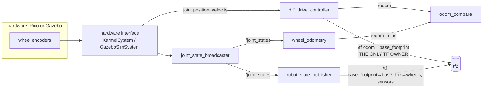

# 09.07 — Odometry in ROS 2: nav_msgs/Odometry, odom→base_link, comparing implementations

<!-- glance:start -->
<!-- generated by tools/build.py from curriculum/syllabus.yaml — edit the syllabus, not this block -->

| | |
|---|---|
| **Track** | Main path |
| **Difficulty** | Intermediate |
| **Time** | 1 h 15 min |
| **Hardware** | Stage 1 robot: Pi 5, Pico, encoder motors, driver, chassis, battery, distance sensors (stage 1) |
| **Software** | ros2 |
| **Prerequisites** | [09.04 Build an odometry system from scratch (tested against the simulator)](09.04-odometry-from-scratch.md)<br>[05.07 TF2 — broadcasting and listening to transforms](../05-frames-and-transforms/05.07-tf2-broadcast-listen.md)<br>[04.16 Your physical robot in ROS 2 — cmd_vel in, telemetry out](../04-ros2/04.16-your-robot-as-ros2-node.md) |
| **Optional prerequisites** | [FM.12 Quaternions without the mysticism](../optional-foundations/mathematics/FM.12-quaternions.md) |
| **Skip if** | Your robot publishes Odometry and odom→base_link that match reality in RViz. |

<!-- glance:end -->

## What you will learn

- Read and fill every field of `nav_msgs/Odometry`: frames, the pose/twist split, and the 6×6 covariance layout.
- Explain the `odom → base_link` transform (REP-105), why it must have exactly one publisher, and why karmel attaches it to `base_footprint`.
- Run your own odometry as a ROS 2 node from `/joint_states`, publishing a covariance that grows with distance.
- Compare three implementations on karmel — your node, `karmel_base`'s `base_node`, and `ros2_control`'s `diff_drive_controller` — and explain every difference you see.
- Verify in RViz and with a tape measure that the published odometry matches reality.

## Why it matters

Everything you built in [09.01](09.01-diff-drive-kinematics.md)–[09.06](09.06-accumulated-error.md) has
to reach the rest of the robot in a form other software understands. In ROS 2 that form is fixed:
a `nav_msgs/Odometry` message on `/odom` and a transform `odom → base_link` on `/tf`. Nav2
([12.06](../12-navigation/12.06-nav2-architecture.md)) refuses to start without the transform. AMCL
([10.09](../10-localization/10.09-amcl-in-ros2.md)) publishes `map → odom` *on top of* it.
`robot_localization` ([10.07](../10-localization/10.07-fusing-imu-and-odometry.md)) reads the message
and weighs it by its covariance. slam_toolbox uses the transform as its motion guess.

On karmel you'll meet odometry from three places. `karmel_base` is the simple driver from
[04.16](../04-ros2/04.16-your-robot-as-ros2-node.md). `diff_drive_controller` runs in ros2_control
([06.06](../06-simulation/06.06-ros2-control.md), [08.12](../08-control/08.12-control-in-ros2.md)) both
in Gazebo and on the real robot. And now yours. They should agree, and when they don't, you need to know
which differences are expected (covariance, timestamps, calibration multipliers) and which are bugs
(two TF publishers, wrong frame, twist in the wrong frame). This lesson makes you the person on the team
who can tell.

<!-- prereqs:start -->
## Prerequisites

You need these first:

- [09.04 Build an odometry system from scratch (tested against the simulator)](09.04-odometry-from-scratch.md)
- [05.07 TF2 — broadcasting and listening to transforms](../05-frames-and-transforms/05.07-tf2-broadcast-listen.md)
- [04.16 Your physical robot in ROS 2 — cmd_vel in, telemetry out](../04-ros2/04.16-your-robot-as-ros2-node.md)

### Optional prerequisite links

New to any of these? Take the foundation lesson first; skip it if you already know it.

- [FM.12 Quaternions without the mysticism](../optional-foundations/mathematics/FM.12-quaternions.md)

Check your readiness: `python course.py why 09.07`
<!-- prereqs:end -->

## Concept

Think of `/odom` as a **status feed** from a service that knows how the robot has moved, and of
`/tf` as the **routing table** every other service uses to convert coordinates. The message is rich:
where the robot is, how fast it moves, and how much to trust both. The transform is lean: just where
`base_link` is inside `odom`, so that a LiDAR point can be converted into the odom frame by anyone who
asks tf2 ([05.07](../05-frames-and-transforms/05.07-tf2-broadcast-listen.md)).

REP-105 ([05.06](../05-frames-and-transforms/05.06-frame-conventions-rep103-rep105.md)) defines the
contract of the `odom` frame: **continuous** (the robot's pose never jumps in it) but **drifting** (it
slowly walks away from reality, exactly as 09.06 showed). That's the right frame for a local planner
avoiding a chair, and the wrong one for "go to the kitchen". For that, localization adds `map → odom`
and absorbs the drift there, so the odometry itself never has to jump.

TF is a tree. Every frame has exactly **one parent** and one publisher of that edge. If two nodes both
publish `odom → base_footprint` (your node and the driver, say), tf2 receives two different answers
for the same question and the robot flickers between them in RViz. It's like two services both claiming
to be the source of truth for one record. So the rule on karmel: **exactly one odometry source owns the
transform**. Others may publish `Odometry` messages on their own topics for comparison.

> [!TIP]
> **Ask your teacher:** "Show me the TF tree of karmel with SLAM running and explain, edge by edge, which node publishes it and at what rate."

## Technical explanation

### Level 1 — Intuition: what's in the message

```text
nav_msgs/Odometry
  std_msgs/Header header
    stamp                       when the pose was TRUE (measurement time, not publish time)
    frame_id: "odom"            the frame the POSE is expressed in
  string child_frame_id: "base_footprint"   the frame the TWIST is expressed in (the robot)
  geometry_msgs/PoseWithCovariance pose
    Pose pose                   position (x, y, z) + orientation quaternion (x, y, z, w)
    float64[36] covariance      6x6 row-major, order (x, y, z, rot_x, rot_y, rot_z)
  geometry_msgs/TwistWithCovariance twist
    Twist twist                 linear (x, y, z) + angular (x, y, z), in child_frame_id
    float64[36] covariance
```

Two subtleties catch almost everyone:

- **The pose is in `odom`, the twist is in the robot frame.** A robot heading north (yaw 90°)
  driving forward at 0.2 m/s publishes `twist.linear.x = 0.2`, not `linear.y = 0.2`. For a differential
  drive, `twist.linear.y` is always 0 (non-holonomic, [09.01](09.01-diff-drive-kinematics.md)).
- **Orientation is a quaternion** even for a planar robot: yaw $\psi$ → $(0, 0, \sin\frac\psi2, \cos\frac\psi2)$.
  Yaw 90° → $(0, 0, 0.7071, 0.7071)$ ([05.05](../05-frames-and-transforms/05.05-rotations-in-3d.md)).

### Level 2 — Practical: frames and publishers on karmel

karmel's URDF root is `base_footprint` (on the floor), with a fixed joint up to `base_link` (axle
height). A TF frame can only have one parent, and `robot_state_publisher` already gives `base_link`
its parent `base_footprint`. So odometry attaches to the root: **`odom → base_footprint`**. REP-105 says
"odom → base_link" for robots whose root is `base_link`. Same idea, different root name. All karmel
configs (`controllers.yaml` `base_frame_id`, `base_node`'s `base_frame`, `ekf.yaml`) use `base_footprint`.

| Setup | Who publishes `/odom` | Who publishes `odom → base_footprint` | How to switch it off |
|---|---|---|---|
| `ros2 launch karmel_base base.launch.py` | `base_node` | `base_node` | `publish_tf:=false` |
| `ros2 launch karmel_bringup robot.launch.py sim:=true` or `sim:=false` | `diff_drive_controller` (remapped from `~/odom`) | `diff_drive_controller` | `enable_odom_tf: false` |
| `robot.launch.py use_ekf:=true` | controller on `/odom`, EKF on `/odometry/filtered` | `robot_localization` EKF | (the launch file already disables the controller's TF) |
| your `course_odometry wheel_odometry` | `/odom_mine` | nobody | `publish_tf` defaults to `false` |

**Covariance layout.** Index $6i + j$ holds $\text{cov}(q_i, q_j)$ with $q = (x, y, z, \text{rot}_x, \text{rot}_y, \text{rot}_z)$.
The diagonal is at indices 0, 7, 14, 21, 28, 35. For $\sigma_x = \sigma_y = 5$ cm and $\sigma_{yaw} = 5°$:
`covariance[0] = 0.0025`, `covariance[7] = 0.0025`, `covariance[35] = 0.0873² = 0.00762`. The
$x$–yaw correlation goes in both 5 and 30. For z, roll and pitch, a planar robot uses a tiny variance
(1e-6) rather than 0: some filters invert the matrix.

**What karmel's configs publish today.** Both `base_node` and `controllers.yaml` use the same *constant*
diagonal: pose (0.001, 0.001, 1e-6, 1e-6, 1e-6, 0.01), i.e. $\sigma_{x,y} = 3.2$ cm and $\sigma_{yaw} = 5.7°$
forever; twist (0.001, 1e-6, …, 0.005). That's the common simplification, and it's acceptable for one
reason: the EKF in `karmel_bringup/config/ekf.yaml` fuses only odometry **velocities** (vx, vy, vyaw), whose
uncertainty really is roughly constant. Anything that reads the *pose* covariance would be misled after a
few meters (09.06: σ_lat is 5.8 cm after 5 m and keeps growing). Your node publishes the growing one.

### Level 3 — Three implementations compared

All three turn wheel encoder counts into the same exact-arc integration. The differences are in the
plumbing:

| | `karmel_base` `base_node` | `diff_drive_controller` | your `wheel_odometry` |
|---|---|---|---|
| Language / where | Python node, talks serial to the Pico | C++ plugin inside `controller_manager` (ros2_control) | Python node |
| Input | telemetry ticks (`T` lines) | joint **position** state from the hardware interface (`position_feedback: true`) | `/joint_states` positions (rad) |
| Integration | exact arc, straight-line branch | `integrateExact`, RK2 when $|\omega| < 10^{-6}$ | exact arc, straight-line branch |
| Wheel radius | one `wheel_radius` | `wheel_radius` × left/right multipliers, `wheel_separation` × multiplier | `left_wheel_radius`, `right_wheel_radius` |
| Twist | from the Pico's filtered wheel speeds | rolling mean of position differences (`velocity_rolling_window_size`) | position delta / stamp delta |
| Stamp | ROS time when the telemetry line arrived | controller update time | `header.stamp` of the JointState |
| Pose covariance | constant diagonal | constant `pose_covariance_diagonal` | propagated, grows with distance (09.06) |
| Extras | Pico reboot detection, cmd_vel limits | `open_loop` mode (integrate commands), limits, `cmd_vel_timeout` | none |

What to expect when you compare them on the same robot:

- **`wheel_odometry` vs `base_node`:** same ticks (base_node publishes `joint_states` as ticks × 2π/2464),
  same math, same parameters → poses agree to **well under 1 mm**. Headers differ by milliseconds.
  Covariances differ by design.
- **`wheel_odometry` vs `diff_drive_controller`:** same joint positions → poses agree to a few mm, as long
  as the multipliers are 1.0 or your node uses the equivalent radii. A calibrated controller
  (multipliers ≠ 1) and an uncalibrated node disagree more with every meter: that's 09.05's systematic
  error made visible.
- **Any odometry vs reality:** drifts, as 09.06 predicts. In Gazebo the physics engine adds its own wheel
  slip, so even a perfect implementation drifts.

The quantity to watch is the **heading difference**. Two implementations that differ by 1° will differ
by 17 cm after 10 m.

### Level 4 — Implementation: your node

The package [`09-odometry/code/ros2/src/course_odometry/`](code/ros2/src/course_odometry/) contains:

| Executable | Does |
|---|---|
| `wheel_odometry` | `/joint_states` → `/odom_mine` (+ optional TF), growing covariance |
| `odom_compare` | subscribes to a list of Odometry topics and prints pose, path length, σ and differences once per second (optional CSV) |
| `fake_wheels` | publishes `/joint_states` for two wheels at set speeds, so you can test without a robot |

The ROS-free core `odometry_core.py` (tested on any OS with `python -m pytest 09-odometry/code`) holds
the math; the node only converts messages. The callback uses the **measurement stamp**, not `now()`:

```python
def on_joint_states(self, msg: JointState) -> None:
    try:
        left = msg.position[msg.name.index(self.left_joint)]
        right = msg.position[msg.name.index(self.right_joint)]
    except (ValueError, IndexError):
        return  # a JointState from another publisher (an arm, a gripper): not ours
    stamp = Time.from_msg(msg.header.stamp)
    # Use the MEASUREMENT time, not now(): the wheels were at these angles at header.stamp.
    if not self.core.update(left, right, stamp.nanoseconds * 1e-9):
        return
    self.publish(msg.header.stamp)
```

and fills the message:

```python
odom.header.stamp = stamp
odom.header.frame_id = self.odom_frame            # "odom"
odom.child_frame_id = self.base_frame             # "base_footprint"
odom.pose.pose.position.x = c.x
odom.pose.pose.position.y = c.y
odom.pose.pose.orientation.x, odom.pose.pose.orientation.y = qx, qy
odom.pose.pose.orientation.z, odom.pose.pose.orientation.w = qz, qw
odom.pose.covariance = planar_to_ros_covariance(c.covariance)
odom.twist.twist.linear.x = c.v                   # in child_frame_id (base frame): forward speed
odom.twist.twist.angular.z = c.omega
```

## Diagram

Data flow and ownership on karmel with ros2_control, your node listening in:



The TF tree this produces (REP-105, karmel's names):

```text
 map  ──(AMCL / slam_toolbox, module 10–11)──►  odom  ──(ONE odometry source)──►  base_footprint
                                                                                        │ fixed (URDF, robot_state_publisher)
                                                                                     base_link
                                                                    ┌───────────┬───────┴────────┬─────────────┐
                                                           left_wheel_link  right_wheel_link  laser_frame  imu_link …
```

## Code

Build the package in your ROS 2 workspace. On the Pi or in the course Docker image:

```bash
mkdir -p ~/ros2_ws/src
ln -s ~/robotics-course/09-odometry/code/ros2/src/course_odometry ~/ros2_ws/src/
ln -s ~/robotics-course/labs/ros2_ws/src/* ~/ros2_ws/src/        # karmel_* packages, if not already there
cd ~/ros2_ws && colcon build --symlink-install --packages-select course_odometry
source install/setup.bash
```

> [!IMPORTANT]
> **Version-sensitive** (verified 2026-09 against ROS 2 Jazzy, ros2_controllers 4.42.x).
> `diff_drive_controller` on Jazzy subscribes to `geometry_msgs/TwistStamped` only, so `teleop_twist_keyboard` must run with `-p stamped:=true`. Controller parameter names (`enable_odom_tf`, `pose_covariance_diagonal`, `position_feedback`, multipliers) per https://control.ros.org/jazzy/doc/ros2_controllers/diff_drive_controller/doc/userdoc.html. The Odometry message definition: https://github.com/ros2/common_interfaces/blob/jazzy/nav_msgs/msg/Odometry.msg
> AI teacher: verify against current documentation before giving instructions.

No robot at all, three terminals:

```bash
ros2 run course_odometry fake_wheels                       # 4 and 8 rad/s: a 0.3 m circle
ros2 run course_odometry wheel_odometry --ros-args -p publish_tf:=true
ros2 run course_odometry odom_compare --ros-args -p topics:="['/odom_mine']"
```

Output of `odom_compare` (checked in `ros:jazzy-ros-base`):

```text
[odom_compare]: /odom_mine  x= +0.299 y= +0.326 yaw=  +94.9deg path=  0.49m sigma=(0.003 m, 0.003 m, 0.9 deg)
[odom_compare]: /odom_mine  x= +0.166 y= +0.550 yaw= +146.4deg path=  0.76m sigma=(0.007 m, 0.002 m, 1.1 deg)
[odom_compare]: /odom_mine  x= -0.093 y= +0.585 yaw= -162.0deg path=  1.03m sigma=(0.008 m, 0.006 m, 1.3 deg)
```

With a robot (or Gazebo) running, the launch file starts your node and the comparison against `/odom`:

```bash
ros2 launch course_odometry odometry_compare.launch.py                         # real robot
ros2 launch course_odometry odometry_compare.launch.py use_sim_time:=true      # Gazebo
```

## Exercise

### Exercise 09.07-E1 — Fill a message by hand `[numerical]`

Hardware: none. karmel is at $x = 1.2$ m, $y = -0.4$ m, yaw $= 135°$, driving forward at 0.15 m/s while
turning right at 0.5 rad/s. You believe $\sigma_x = 4$ cm, $\sigma_y = 6$ cm, $\sigma_{yaw} = 3°$, with
no correlations. Write down `header.frame_id`, `child_frame_id`, the quaternion, the non-zero entries of
`twist.twist`, and the indices and values of the non-zero pose covariance entries.

### Exercise 09.07-E2 — Two owners of one transform `[predict]`

Hardware: none (or `robot-base`). You run `karmel_base` (`publish_tf` true) *and* your node with
`publish_tf:=true`, and your node uses an uncalibrated wheelbase so it slowly diverges. Predict what RViz
shows (fixed frame `odom`, RobotModel display) and what `ros2 run tf2_ros tf2_monitor odom base_footprint`
reports. Then try it with `fake_wheels` + two `wheel_odometry` instances (one with `-p wheel_separation:=0.21 -r __node:=wheel_odometry_b -r odom_mine:=odom_b`), both with `publish_tf:=true`.

### Exercise 09.07-E3 — Your node vs karmel_base `[hardware]`

Hardware: `robot-base`. Simulation alternative: the fake Pico of `karmel_base` in the course Docker
image (`ros2 run karmel_base fake_pico --link /tmp/ttyKARMEL` and `ros2 launch karmel_base base.launch.py port:=/tmp/ttyKARMEL`).

> [!CAUTION]
> **Safety:** you'll drive with teleop. Start slowly, keep a clear 2 m × 2 m area, and remember that releasing the keys doesn't stop the robot instantly: `base_node` ramps down after its 0.5 s `cmd_vel` timeout. The power switch stays within reach.

1. `ros2 launch karmel_base base.launch.py` (or with the fake Pico port).
2. `ros2 launch course_odometry odometry_compare.launch.py robot_config:=$HOME/robotics-course/labs/config/karmel.yaml`
3. `ros2 run teleop_twist_keyboard teleop_twist_keyboard --ros-args -p stamped:=true`. Drive about 3 m with turns.
4. Write down the position and heading difference and the σ columns every 30 s.

### Exercise 09.07-E4 — Your node vs diff_drive_controller in Gazebo `[simulation]`

Hardware: none (simulation, course Docker image with Gazebo). Hardware alternative: `robot-base` with `sim:=false`.

1. `ros2 launch karmel_bringup robot.launch.py sim:=true rviz:=true`
2. `ros2 launch course_odometry odometry_compare.launch.py use_sim_time:=true`
3. Teleop a 1 m × 1 m square. Record the differences.
4. Predict, then test: set `wheel_separation_multiplier: 1.05` in a copy of `controllers.yaml`
   (`controllers_file:=...`) and repeat. Which of `/odom` and `/odom_mine` is now "right"? How do you find out?

### Exercise 09.07-E5 — Verify in RViz against reality `[hardware]`

Hardware: `robot-base`, tape measure (`tools`). Simulation alternative: Gazebo from E4, reading the
robot's true pose in the Gazebo GUI (select the model and read its Pose in the Component Inspector).

> [!CAUTION]
> **Safety:** the robot drives under teleop in a marked area; keep people and pets out of it and the power switch within reach.

In RViz (fixed frame `odom`) add `Odometry` displays for `/odom` and `/odom_mine` with covariance shown,
and a `TF` display. Mark a start pose with tape, drive a 1 m square back to the start and compare what
RViz shows with where the robot really is. Look at how the two covariance ellipses behave.

### Exercise 09.07-E6 — Five broken messages `[debugging]`

Hardware: none. For each symptom, name the bug in the odometry publisher:

1. In RViz the robot model drives sideways when it drives forward, but only after it has turned.
2. RViz's `Odometry` arrow points correctly, but Nav2 says `odom → base_footprint` doesn't exist.
3. `robot_localization` ignores the odometry completely. Its diagnostics mention an old timestamp.
4. The robot model is upside down and rotates about the wrong axis.
5. `ros2 run tf2_tools view_frames` shows `base_link` with parent `odom` in one snapshot and `base_footprint` in the next, and RViz's RobotModel intermittently reports missing transforms for the wheels.

## Expected result

**09.07-E1:** `frame_id: odom`, `child_frame_id: base_footprint`. Quaternion $(0, 0, \sin 67.5°, \cos 67.5°) = (0, 0, 0.9239, 0.3827)$.
`twist.linear.x = 0.15`, `twist.angular.z = -0.5` (robot frame: forward and clockwise; *not* split into x/y by the heading).
Covariance: index 0 = 0.0016, index 7 = 0.0036, index 35 = $(0.05236)^2 = 0.002742$, plus a small value like 1e-6 at 14, 21, 28.

**09.07-E2:** RViz: the robot model jumps back and forth between two poses, growing further apart as the
wheelbases disagree ("TF flicker"). `tf2_monitor` lists **two** authorities (node names) for
`odom → base_footprint`. Lookups become non-deterministic. Fix: exactly one publisher, `publish_tf:=false`
on the other.

**09.07-E3:** Position difference between `/odom` and `/odom_mine` stays below **1 mm** and heading below
**0.1°** for the whole drive, as long as both use the same `wheel_radius`/`wheel_separation`. `path=` is
identical to the centimetre. σ of `/odom` stays constant (0.032 m, 0.032 m, 5.7°); σ of `/odom_mine` starts
at 0 and grows: with the default `wheel_noise_k: 1e-5`, about 2° of heading and a few centimetres of position after 3 m. If the
difference grows steadily, the two nodes use different parameters (check `ros2 param get`).

**09.07-E4:** With multipliers 1.0 the difference stays within a few mm and a fraction of a degree
(both read the same joint positions; timing differs by up to one update). With
`wheel_separation_multiplier: 1.05`, every turn in `/odom` is 5 % smaller than in `/odom_mine`. After a
square (360° of turning) the headings differ by about **17°** and positions by tens of centimetres.
Neither is automatically right. Compare with ground truth (Gazebo pose, or tape on the real robot) or
run UMBmark ([09.05](09.05-calibrating-odometry.md)).

**09.07-E5:** Both `Odometry` arrows overlay at the start. After the square, the robot model in RViz and
the tape mark differ by a few cm to ~20 cm (uncalibrated) and a few degrees. `/odom`'s covariance ellipse
has the same size at every point; `/odom_mine`'s is a dot at the start and grows along the path, longer
across the direction of travel. In Gazebo the simulated robot slips less than a real one; expect a few cm.

**09.07-E6:** (1) The twist (or the integration) uses world-frame velocity: linear velocity was split with
cos/sin of yaw into `twist.linear.x/y`, or a consumer integrates it in the odom frame. The twist must be
in `child_frame_id`. (2) The node publishes the message but no TF (`publish_tf` false or no broadcaster),
or the TF uses a different child frame (`base_link` while Nav2 is configured for `base_footprint`).
(3) The stamp is wrong: zero, not using `use_sim_time` in simulation, or a clock on the Pi that isn't
synchronized with the computer running the EKF ([03.10](../03-robot-software/03.10-networking-for-robots.md)).
(4) The quaternion components are in the wrong order: yaw was written into `orientation.x`/`w` (w-first
convention from another library). (5) The odometry TF attaches to `base_link` while
`robot_state_publisher` already gives `base_link` the parent `base_footprint`. Two parents for one frame:
tf2 keeps switching between them. Attach odometry to the URDF root (`base_footprint`).

## Troubleshooting

### Symptom: `/odom_mine` never publishes

1. `ros2 topic echo /joint_states --once`. No output → nothing publishes joint states (is `joint_state_broadcaster` or `base_node` running?).
2. Check the joint names in the message against the node's `left_joint`/`right_joint` parameters. The node silently ignores messages without both names.
3. Check `header.stamp` increases. The node ignores repeated or backward stamps. In simulation, all nodes need `use_sim_time:=true`.

### Symptom: RViz shows the robot jumping between two places

1. `ros2 run tf2_ros tf2_monitor odom base_footprint` and look at the listed authorities.
2. More than one → find the second publisher: `base_node` (`publish_tf`), `diff_drive_controller` (`enable_odom_tf`), the EKF (`publish_tf`), or your node. Keep one.
3. One authority but still jumping → the source itself is resetting. Check the Pico reboot warnings in `base_node`'s log, or a controller restart.

### Symptom: odometry agrees between implementations but RViz disagrees with the tape measure

1. That's drift or calibration, not ROS. Quantify it: drive 2 m straight, then a 360° spin, and measure separately.
2. Straight error → radius ([09.05](09.05-calibrating-odometry.md)); spin error → wheelbase.
3. Update the parameters in *every* implementation you use: `karmel.yaml` (base_node, your node via `robot_config`) and the multipliers in `controllers.yaml`.

### Symptom: the EKF output wanders more than raw odometry

1. Inspect `/odom`'s covariances. All zeros tells the filter the measurement is perfect; huge values tell it to ignore it.
2. Check what the EKF fuses (`odom0_config`): fusing odometry *pose* with a constant covariance and the IMU yaw often fight. Fusing velocities is the usual setup ([10.07](../10-localization/10.07-fusing-imu-and-odometry.md)).

## Common mistakes

- **Two publishers of `odom → base_footprint`.** Pick one owner per launch configuration.
- **Twist in the odom frame.** It belongs in `child_frame_id`: forward is always `linear.x`.
- **Stamping with `now()` in the publisher** instead of the measurement time. Latency then looks like motion error.
- **Attaching odometry to `base_link`** when the URDF root is `base_footprint`. The TF tree splits.
- **All-zero covariance** "because we don't know". Zero means *perfectly known*. Use honest values.
- **Forgetting `use_sim_time:=true`** for extra nodes in a Gazebo session.
- **Calibrating one implementation only.** `base_node`, the controller and your node each have their own parameters.

## Knowledge check

1. In `nav_msgs/Odometry`, which frame is the pose expressed in, and which frame is the twist expressed in?
   <details><summary>Answer</summary>

   The pose in `header.frame_id` (`odom`), the twist in `child_frame_id` (the robot base frame,
   `base_footprint` on karmel).
   </details>

2. At which indices of the 36-element covariance array are the variances of x, y and yaw, and where does the x–yaw covariance go?
   <details><summary>Answer</summary>

   Row-major 6×6 with order (x, y, z, rot_x, rot_y, rot_z): x at 0, y at 7, yaw at 35. The x–yaw
   covariance at 5 (row 0, column 5) and 30 (row 5, column 0).
   </details>

3. Why does karmel publish `odom → base_footprint` rather than `odom → base_link`?
   <details><summary>Answer</summary>

   The URDF root is `base_footprint`, and `robot_state_publisher` already publishes
   `base_footprint → base_link`. A TF frame can have only one parent, so odometry must attach to the root;
   otherwise the tree splits. REP-105's "base_link" means "the robot's root frame".
   </details>

4. Predict: `base_node` and your node read the same ticks with identical parameters. What difference in pose do you expect after 10 m, and what differences in the messages will there be anyway?
   <details><summary>Answer</summary>

   Pose: essentially none (well under 1 mm; both integrate the same counts with exact arcs). Differences:
   timestamps (arrival time vs JointState stamp), the twist (the Pico's filtered wheel speeds vs position
   deltas), and the pose covariance (constant vs growing).
   </details>

5. Why is a constant pose covariance acceptable in karmel's EKF setup but wrong in general?
   <details><summary>Answer</summary>

   The EKF config fuses only odometry velocities, whose uncertainty is roughly constant, and ignores the
   pose covariance. In general, odometry pose uncertainty grows without bound with distance (09.06), so a
   constant value makes any consumer of the pose overconfident after a few meters.
   </details>

6. Debugging: after enabling `use_ekf:=true`, RViz flickers. What's the likely cause?
   <details><summary>Answer</summary>

   Two owners of `odom → base_footprint`: the EKF and the controller (or `base_node`). karmel_bringup
   loads `diff_drive_ekf.yaml` to set `enable_odom_tf: false`; if you launched the controller another way,
   or `base_node` with `publish_tf:=true`, both publish. Confirm with `tf2_monitor`.
   </details>

7. What does REP-105 guarantee about the `odom` frame, and what doesn't it?
   <details><summary>Answer</summary>

   It guarantees continuity: the robot's pose in `odom` changes smoothly, never jumps. It doesn't guarantee
   accuracy: `odom` drifts without bound relative to the world. Global corrections go into `map → odom`.
   </details>

## Practical challenge

**One odometry you'd put in front of Nav2.** On karmel (hardware) or in Gazebo, produce an odometry
source that could replace the controller's for navigation.

Acceptance criteria:

- Your `wheel_odometry` owns `odom → base_footprint` (the controller's `enable_odom_tf: false`), and
  `tf2_monitor` shows exactly one authority.
- It uses your calibrated per-wheel radii and wheelbase from 09.05, and `wheel_noise_k` from 09.06's
  measurement of $k$.
- Over a 2 m square driven 3 times, `/odom_mine` stays within 1 cm and 1° of the (identically calibrated)
  controller's `/odom`, recorded as a CSV with `odom_compare -p csv:=...`.
- A plot of σ_x, σ_y, σ_yaw from the CSV over time, and one paragraph on whether they're consistent with
  the end-pose errors you measured.
- A rosbag ([04.14](../04-ros2/04.14-rosbag2.md)) of `/joint_states`, `/odom`, `/odom_mine`, `/tf` from one run.

## You can skip this if…

Your robot publishes `nav_msgs/Odometry` and `odom → base_link` (or `base_footprint`) that match reality
in RViz, you answer knowledge-check questions 2, 3 and 6 without looking, and you can say which node owns
the odometry transform in each karmel launch configuration. Then:

`python course.py skip 09.07 --reason "My robot publishes Odometry and odom→base_link that match reality in RViz"`

## Go deeper

- REP-105 Coordinate Frames for Mobile Platforms: https://www.ros.org/reps/rep-0105.html. The contract of `map`, `odom` and `base_link`; read the "Relationship between frames" section.
- `nav_msgs/Odometry` definition (jazzy): https://github.com/ros2/common_interfaces/blob/jazzy/nav_msgs/msg/Odometry.msg. The authoritative comments on which frame the pose and twist use.
- diff_drive_controller user documentation (Jazzy): https://control.ros.org/jazzy/doc/ros2_controllers/diff_drive_controller/doc/userdoc.html. All odometry parameters, topics and the TF option.
- diff_drive_controller odometry source (jazzy): https://github.com/ros-controls/ros2_controllers/blob/jazzy/diff_drive_controller/src/odometry.cpp. Read it next to `odometry_core.py`.
- Nav2 first-time robot setup guide: https://docs.nav2.org/jazzy/configuration_and_development/first_time_robot_setup_guide/. What Nav2 needs from your odometry and TF.
- ros2_control documentation (Jazzy): https://control.ros.org/jazzy/index.html. How the controller gets joint states from `karmel_hardware`.

## Progress checkpoint

- [ ] I can fill every field of `nav_msgs/Odometry` correctly, including the covariance layout.
- [ ] I can explain `odom → base_footprint`, REP-105's guarantees, and the one-publisher rule.
- [ ] My `wheel_odometry` node runs from `/joint_states` and publishes a growing covariance.
- [ ] I compared my node with `base_node` and `diff_drive_controller` and can explain every difference.
- [ ] I verified the published odometry against reality in RViz.

`python course.py complete 09.07` (exercises done) · `python course.py master 09.07` (challenge done) · `python course.py struggle 09.07 "what was hard"`

Next: [10.01 — Localization: belief instead of certainty](../10-localization/10.01-what-is-localization.md), or put it all together in [P08 — Odometry you can trust](../projects/P08-odometry.md).
