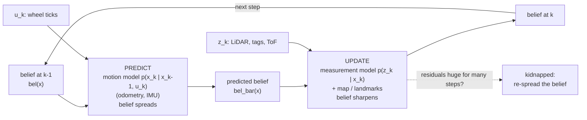

# 10.01 — Localization — belief instead of certainty

<!-- glance:start -->
<!-- generated by tools/build.py from curriculum/syllabus.yaml — edit the syllabus, not this block -->

| | |
|---|---|
| **Track** | Main path |
| **Difficulty** | Intermediate |
| **Time** | 40 min |
| **Hardware** | none |
| **Software** | none |
| **Prerequisites** | [09.06 Accumulated error — why odometry always drifts](../09-odometry/09.06-accumulated-error.md) |
| **Optional prerequisites** | [FM.13 Probability from zero](../optional-foundations/mathematics/FM.13-probability-basics.md) |
| **Skip if** | You can explain belief, tracking vs global localization and the kidnapped robot problem. |

<!-- glance:end -->

## What you will learn

- Explain why a robot must keep a *belief* (a probability distribution over poses) instead of a single pose.
- Tell apart position tracking, global localization and the kidnapped robot problem, and say which algorithm families handle each.
- Explain what a landmark measurement adds, and turn one range–bearing observation into a position fix with numbers.
- Read the recursive Bayes filter equation and name the motion model and measurement model in it.
- Run the module's belief-cloud experiment and detect a kidnapping from landmark residuals.

## Why it matters

Module 09 ended with an uncomfortable fact: karmel's odometry drifts without bound
([09.06](../09-odometry/09.06-accumulated-error.md)). After a few minutes in the apartment it can
believe it is in the kitchen while it is bumping into the sofa. Navigation ([module 12](../12-navigation/12.01-the-navigation-problem.md))
needs to know which room the robot is in and where the doorway is to within a few centimetres; a
docking station needs better than that.

Localization is the fix: combine what the robot did (odometry, IMU) with what it sees (LiDAR,
camera, landmarks) and a map, and keep an honest account of how sure it is. Every localizer you
will use — the Kalman filters of 10.04–10.06, `robot_localization` in [10.07](10.07-fusing-imu-and-odometry.md),
the particle filter in [10.08](10.08-particle-filter-mcl.md), Nav2's AMCL in [10.09](10.09-amcl-in-ros2.md) —
is a different way of storing and updating the same object: the belief. This lesson gives you the
vocabulary so the rest of the module is about *how*, not *what*.

<!-- prereqs:start -->
## Prerequisites

You need these first:

- [09.06 Accumulated error — why odometry always drifts](../09-odometry/09.06-accumulated-error.md)

### Optional prerequisite links

New to any of these? Take the foundation lesson first; skip it if you already know it.

- [FM.13 Probability from zero](../optional-foundations/mathematics/FM.13-probability-basics.md)

Check your readiness: `python course.py why 10.01`
<!-- prereqs:end -->

> [!NOTE]
> New to probability (conditional probability, distributions)? → [FM.13 Probability from zero](../optional-foundations/mathematics/FM.13-probability-basics.md). Skip it if you are comfortable with $P(A \mid B)$.

## Concept

Think of a service in a distributed system that has lost its connection to the source of truth. It
still serves requests from its cache, but a careful engineer tracks *how stale* that cache is and
refreshes it when fresh data arrives. Odometry is the cache: always available, getting staler with
every metre. Sensor readings that relate the robot to the world (a wall 1.2 m ahead, a tag on the
fridge at 40° to the left) are the refresh.

The mistake is to store only the cached value. A robot that says "I am at (2.93, 2.44)" hides the
crucial part: after 12 seconds of driving on uncalibrated wheels, the honest statement is "I am
*probably* within half a metre of (2.93, 2.44), and more likely along this diagonal than across
it". That statement is a **belief**: a probability for every pose the robot could be in.

A belief is useful for three reasons:

1. **It tells you how much to trust a new measurement.** If the belief is tight and the sensor is
   noisy, a surprising reading should move the estimate a little. If the belief is wide, the same
   reading should move it a lot. That trade-off *is* the Kalman gain of [10.04](10.04-kalman-filter-1d.md).
2. **It can hold several hypotheses.** In a corridor with identical doors, "I am at door 2 or door 5"
   is the correct answer until something distinguishes them. A single pose cannot say that.
3. **It lets the rest of the system make safe decisions.** A planner can slow down when the belief is
   wide; a docking routine can refuse to start until it is tight.

Three situations come up again and again:

- **Position tracking (local localization).** The robot knows roughly where it started and must not
  lose track. The belief is a single blob that odometry smears and measurements sharpen. Kalman
  filters are ideal here.
- **Global localization.** The robot is switched on somewhere in a known map and has no idea where.
  The belief must start spread over the whole map and collapse as evidence arrives. Grid (histogram)
  and particle filters can do this; a single Gaussian cannot.
- **The kidnapped robot.** The robot was localized, then someone picked it up and put it down
  elsewhere (or its wheels slipped on a rug so badly that it amounts to the same thing). Its belief
  is confidently wrong. It must notice ("my measurements no longer make sense") and recover. This is
  the hardest case, because a well-converged filter has, by construction, stopped considering other
  places.

A **landmark** is anything the robot can recognise and whose position in the map is known: an
AprilTag on the wall ([10.10](10.10-fiducial-landmarks.md)), a door frame, a corner in a LiDAR scan,
the charging dock. Measuring the range and bearing to one landmark pins the robot to a small region
if its heading is known; two landmarks can pin both position and heading.

> [!TIP]
> **Ask your teacher:** "Explain belief, tracking vs global localization and the kidnapped robot using a person walking through a dark apartment with a flashlight, then map each part to what karmel does."

## Technical explanation

### Level 1 — Intuition: the cloud

Imagine 500 copies of karmel, all driving the same encoder ticks, but each with slightly different
wheel radii, wheelbase and slip — all plausible for an uncalibrated robot. They start in one spot and
spread out as they drive. The cloud of their positions *is* the belief, drawn as samples. Nobody knows
which copy is the real robot. When a landmark comes into view, the copies whose predicted
observation disagrees with the real one are unlikely; the cloud effectively shrinks to the copies that
agree. That is, in one paragraph, the particle filter of [10.08](10.08-particle-filter-mcl.md), and
the Kalman filter is the same idea with the cloud summarised by a mean and a covariance.

### Level 2 — Practical: what the experiment shows

The script [`code/belief_cloud.py`](code/belief_cloud.py) drives the realistic simulator in a U
through the apartment's living room (about 5 m in 20 s) and builds exactly that 500-robot cloud from
the logged encoder ticks. Output (seed 7):

```text
Part 1 - the belief cloud (500 hypothetical robots, same encoder ticks)
 t (s) odom err (cm) sigma_x (cm) sigma_y (cm) sigma_th (deg) truth in 95%
   2.0           1.3          0.4          1.2            2.3         True
   7.0          12.5          1.6         12.9            7.7         True
  12.6          16.6         22.2         13.4           13.2         True
  19.7          11.8         25.2         36.3           20.4         True
```

Read it row by row:

- **Odometry's error does not tell you how wrong it could be.** At 19.7 s the actual error happens to
  be 11.8 cm, *smaller* than at 12.6 s — the errors partly cancelled on the way back. The spread
  (σ up to 36 cm) is what a careful robot must assume.
- **The spread is anisotropic.** At 7 s, after driving along x, σ_y (sideways) is 8× σ_x. The heading
  error is a lever ([09.06](../09-odometry/09.06-accumulated-error.md)).
- **Heading uncertainty grows to 20°.** At that point the cloud is no longer an ellipse but a curved
  banana (open `belief_cloud.png`). Gaussians — and therefore Kalman filters — start to struggle.
- **The truth is inside the 95 % region every time.** A belief that excludes the truth is worse than
  useless; it is *overconfident*. You will learn to test for that in [10.05](10.05-kalman-filter-multivariate.md).

Part 2 of the script kidnaps the robot at t = 8.1 s: it is teleported 0.9 m while the encoders keep
counting as if nothing happened. The script compares every landmark observation
(`sim.observe_landmarks()`: range and bearing to wall tags) with the observation predicted from the
odometry pose:

```text
Part 2 - kidnapped at t=8.1 s (moved 0.9 m, encoders see nothing)
  median |range residual|   before   4.1 cm   after  61.6 cm
  median |bearing residual| before   6.3 deg  after  11.2 deg
```

That jump in the **residual** (measured minus expected; in a Kalman filter it is called the
*innovation*) is how a localizer notices it has been kidnapped. Before the kidnap the residuals are a
few centimetres (sensor noise σ = 5 cm plus drift); afterwards they are 15× larger.

### Level 3 — Mathematics: the belief and its recursion

The state is the pose $\mathbf{x}_k = (x, y, \theta)$ at time step $k$. Odometry inputs are
$\mathbf{u}_{1:k} = \mathbf{u}_1, \dots, \mathbf{u}_k$, measurements $\mathbf{z}_{1:k}$. The belief is
the conditional distribution of the state given everything observed so far:

$$bel(\mathbf{x}_k) = p(\mathbf{x}_k \mid \mathbf{z}_{1:k}, \mathbf{u}_{1:k})$$

**Numerical example.** Along a corridor karmel's belief is $\mathcal{N}(2.0\,\text{m}, 0.15^2)$. The
probability that it is within ±10 cm of 2.0 m is $\operatorname{erf}\!\big(0.1 / (0.15\sqrt2)\big) = 0.495$.
A planner that needs 95 % confidence of being within 10 cm must not trust this belief yet.

Two modelling assumptions make the belief computable step by step (the **Markov assumptions**):

- the next pose depends only on the current pose and the control: $p(\mathbf{x}_k \mid \mathbf{x}_{k-1}, \mathbf{u}_k)$ — the **motion model**;
- a measurement depends only on the current pose (and the map): $p(\mathbf{z}_k \mid \mathbf{x}_k)$ — the **measurement model**.

With them, the belief updates recursively in two steps — the **Bayes filter**:

$$\overline{bel}(\mathbf{x}_k) = \sum_{\mathbf{x}_{k-1}} p(\mathbf{x}_k \mid \mathbf{x}_{k-1}, \mathbf{u}_k)\, bel(\mathbf{x}_{k-1}) \qquad \text{(predict)}$$

$$bel(\mathbf{x}_k) = \eta\; p(\mathbf{z}_k \mid \mathbf{x}_k)\; \overline{bel}(\mathbf{x}_k) \qquad \text{(update)}$$

(an integral instead of the sum for continuous states; $\eta$ normalises the result to sum to 1).
Predict is the law of total probability: every place the robot might have been, times the chance the
motion took it here. Update is Bayes' rule ([FM.16](../optional-foundations/mathematics/FM.16-bayes-rule.md)).
[10.03](10.03-bayes-filter.md) implements both on a grid, with numbers; here, one tiny example:

**Numerical example.** Three cells in a ring, uniform belief $[1/3, 1/3, 1/3]$. The robot moves one
cell right with probability 0.8 and stays with 0.2. Predict: cell 1 = 0.8·bel[0] + 0.2·bel[1] = 1/3
— a uniform belief stays uniform under motion. Now the sensor sees a door, and only cell 1 has a door
($p(z \mid \text{door}) = 0.9$, $p(z \mid \text{wall}) = 0.2$): unnormalised $[0.0667, 0.3, 0.0667]$,
sum 0.433, so $bel = [0.154, 0.692, 0.154]$. Evidence, not motion, creates certainty.

**Landmarks as geometry.** A landmark at known $(l_x, l_y)$ measured at range $r$ and bearing
$\varphi$ (relative to the robot's heading $\theta$) gives

$$x = l_x - r\cos(\theta + \varphi), \qquad y = l_y - r\sin(\theta + \varphi)$$

**Numerical example.** At the end of the drive the robot sees landmark 0 at $(0.0, 1.8)$ with
$r = 1.346$ m, $\varphi = 0.513$ rad, and believes $\theta = \pi$. Then
$x = 0 - 1.346\cos(3.655) = 1.173$ m, $y = 1.8 - 1.346\sin(3.655) = 2.461$ m — within 7 cm of the true
$(1.169, 2.531)$ (the rest is the 5 cm range noise and heading error). If the heading belief is 5°
off, the same numbers give $(1.111, 2.560)$: a 5° heading error moves the fix by 12 cm at 1.35 m.
Position and heading are coupled — which is why real localizers estimate them jointly.

### Level 4 — Implementation: how a belief is stored

| Representation | Memory for karmel's apartment | Handles global / kidnapping? | Lessons |
|---|---|---|---|
| Grid (histogram): a probability per cell | 6 m × 5 m at 5 cm × 72 headings = 864,000 cells = 6.9 MB of float64 per belief | Yes (with probability injection) | 10.03 |
| Gaussian: mean $\mathbf{x}$ + covariance $P$ | 3 + 9 numbers | No: one blob only | 10.04–10.07 |
| Particles: N weighted samples | N × 3 numbers (N ≈ 500–5000) | Yes (with random particles) | 10.08–10.09 |

In ROS 2 the output of a localizer is not the belief itself but its summary: a pose with a 6×6
covariance (`geometry_msgs/msg/PoseWithCovarianceStamped`, the `amcl_pose` topic), and a transform.
REP-105 splits the frames so that the two kinds of information stay separate
([05.06](../05-frames-and-transforms/05.06-frame-conventions-rep103-rep105.md)):
`odom → base_link` is continuous and drifts (odometry), `map → odom` is published by the localizer and
*jumps* when a correction arrives. A robot that is localizing well shows a small, slowly changing
`map → odom`; a kidnapping shows up as a sudden jump.

## Diagram



```text
Three localization problems (top view of the apartment)

 tracking                    global                      kidnapped
 +-----------------+         +-----------------+         +-----------------+
 |                 |         | . . . . . . . . |         |          (o)<-- belief: confident
 |     (o)         |         | . . . . . . . . |         |                 |   and WRONG
 |      ^ one blob |         | . . . . . . . . |         |   robot -> R    |
 |      R          |         | . .  R  . . . . |         |                 |
 +-----------------+         +-----------------+         +-----------------+
 start known, keep it        start unknown: belief       was localized, moved
 (Kalman filter)             everywhere (grid/particles) without odometry noticing
```

## Code

All module-10 scripts live in [`code/`](code/) and are tested headless with
`python -m pytest 10-localization/code`. The shared helpers are in [`code/loc_common.py`](code/loc_common.py);
the symbols used in every lesson are listed in [`code/NOTATION.md`](code/NOTATION.md).

Run the belief experiment (Windows: `py` instead of `python`):

```bash
python 10-localization/code/belief_cloud.py
```

It writes `localization_out/belief_cloud.png` (the living room, the true path in black, odometry
dashed red, and four coloured clouds with their 95 % ellipses) and `localization_out/kidnapped.png`
(range and bearing residuals over time with the kidnapping marked). The core of the cloud is 15 lines
of numpy — every hypothetical robot integrates the same ticks with its own calibration errors:

```python
# from 10-localization/code/loc_common.py (odometry_cloud)
rng = np.random.default_rng(seed)
scale_l = 1.0 + rng.normal(0.0, radius_std, n)     # each copy's left wheel radius error
scale_r = 1.0 + rng.normal(0.0, radius_std, n)
b = cfg.drive.wheel_separation_m * (1.0 + rng.normal(0.0, separation_std, n))
x, y, th = np.full(n, start[0]), np.full(n, start[1]), np.full(n, start[2])
for d in np.diff(ticks, axis=0) * cfg.drive.meters_per_tick:   # metres per wheel per step
    dl = d[0] * scale_l * (1.0 + rng.normal(0.0, slip_std, n))
    dr = d[1] * scale_r * (1.0 + rng.normal(0.0, slip_std, n))
    ds, dth = (dl + dr) / 2.0, (dr - dl) / b
    mid = th + dth / 2.0
    x, y, th = x + ds * np.cos(mid), y + ds * np.sin(mid), wrap_angle(th + dth)
```

And the kidnapping detector, which compares what the robot sees with what its estimate predicts:

```python
# from 10-localization/code/loc_common.py (expected_landmark_obs, landmark_residuals)
dx, dy = landmark_xy[0] - pose[0], landmark_xy[1] - pose[1]
expected_range = math.hypot(dx, dy)
expected_bearing = wrap_angle(math.atan2(dy, dx) - pose[2])
range_residual = obs.range_m - expected_range
bearing_residual = wrap_angle(obs.bearing_rad - expected_bearing)
```

## Exercise

All exercises need hardware: **none**.

### Exercise 10.01-E1 — Which problem is this? `[predict]`

Goal: recognise the three localization problems. For each scenario, name the problem (tracking,
global, kidnapped) and whether a single-Gaussian filter could handle it:
(a) karmel boots on its charging dock, whose position in the map is known;
(b) after a power cut the robot reboots wherever it stopped, and its saved pose was lost;
(c) your kid carries the robot from the kitchen to the bedroom while it is running;
(d) the robot drives over a rug fringe, one wheel spins for half a second, and odometry reports a 25° turn that never happened;
(e) the robot is in a hotel corridor with ten identical doors and was switched on facing one of them.

### Exercise 10.01-E2 — Read the belief cloud `[simulation]`

Goal: connect the numbers to the picture. Run `belief_cloud.py`, open `belief_cloud.png`, and answer:
(a) why is the 7.0 s cloud tall and thin, and why is it vertical rather than horizontal;
(b) why is the 12.6 s ellipse tilted;
(c) at 19.7 s, is an ellipse a good description of the cloud? Then rerun with a calibrated robot:
in `cloud_table`, call `lc.odometry_cloud(..., radius_std=0.002, separation_std=0.005)` and report σ_y at 19.7 s.

### Exercise 10.01-E3 — A position fix from one tag `[numerical]`

Goal: turn a landmark observation into a pose, and feel the heading coupling. Landmark 2 is at
$(3.5, 0.6)$. The robot believes its heading is $\theta = 0$ and measures $r = 2.10$ m,
$\varphi = -0.30$ rad. Compute its position. Then recompute with $\theta = +3°$ and give the
distance between the two fixes. Finally: how far does a 3° heading error move a fix from a landmark
4 m away?

### Exercise 10.01-E4 — Kidnap it yourself `[simulation]`

Goal: see what makes a kidnapping detectable. In `belief_cloud.py`, change `KIDNAP_S` and the
`kidnap_to` pose passed to `drive_living_room` (keep it inside the living room, e.g. `(2.4, 1.3, pi/2)`,
which is only 0.5 m away from the original track). **Predict first**: will the median range residual
after the kidnap be above or below 30 cm? Run it and compare. Then try a kidnap that only rotates the
robot by 20° in place.

## Expected result

- **10.01-E1:** (a) tracking — Gaussian OK (start pose known). (b) global — not a single Gaussian; grid
  or particles. (c) kidnapped — the filter must detect it (large residuals) and re-spread its belief.
  (d) effectively a kidnapping in heading: odometry was wrong by far more than its model allows; a
  filter with landmarks sees persistent bearing residuals of about 25°. (e) global with symmetric
  ambiguity: the belief is legitimately multi-modal (ten peaks) until the robot reaches a distinguishing
  feature; a single Gaussian would pick one door and could be confidently wrong.
- **10.01-E2:** (a) it drove 1.9 m along +x; the heading error swings the end point sideways (±y), while
  distance errors along x are small — σ_y 12.9 cm vs σ_x 1.6 cm. (b) after the left turn the heading
  errors accumulated on the first leg now show up along the new direction of travel, combined with the
  first leg's sideways error: x and y errors are correlated, so the ellipse is tilted (−30°). (c) no:
  with σ_θ ≈ 20° the cloud is a curved band; the 95 % ellipse still contains most points but also covers
  empty regions. With the calibrated numbers σ_y at 19.7 s drops from 36 cm to about 8 cm (σ_x about 6 cm) — calibration
  ([09.05](../09-odometry/09.05-calibrating-odometry.md)) shrinks the belief but never stops its growth.
- **10.01-E3:** $\theta + \varphi = -0.30$: $x = 3.5 - 2.10\cos(-0.30) = 1.494$ m, $y = 0.6 - 2.10\sin(-0.30) = 1.221$ m.
  With $\theta = 3° = 0.0524$ rad: $\theta + \varphi = -0.2476$, $x = 1.465$ m, $y = 1.115$ m; the fixes are
  0.110 m apart ($\approx r \cdot 0.0524$). At 4 m: $4 \cdot 0.0524 = 0.21$ m.
- **10.01-E4:** for `(2.4, 1.3, pi/2)` (seed 7) the median |range residual| after the kidnap is about 40 cm —
  above 30 cm, ten times the 4 cm before. No tag is in the camera's view while the robot drives up the room, so the
  first evidence arrives only at t = 13 s: a kidnap is detectable only when a landmark is visible. A 20° rotation in
  place gives bearing residuals of 20–33° from the very next sighting (t = 8.5 s) while the range residuals start
  small (9 cm) and grow to about 50 cm as the robot drives off in the wrong direction — heading kidnaps are caught by
  bearings first.

## Troubleshooting

### Symptom: the script fails with `ModuleNotFoundError: No module named 'robotlab'`

1. Run it from the repository root as shown (`python 10-localization/code/belief_cloud.py`); the helper
   adds `labs/python` to `sys.path` relative to its own file, so the script file must not be copied elsewhere.
2. If you copied it, `pip install -e labs/python` once.

### Symptom: the cloud does not grow, or is a single dot

1. Print `np.diff(drive.ticks, axis=0)[:5]`: all zeros means the robot did not move (a watchdog or a
   collision). `drive.sim.collided` tells you.
2. Check that the noise parameters are not zero (`radius_std`, `separation_std`, `slip_std`).
3. Check you index the cloud as `cloud[k, :, :2]` (time, robot copy, coordinate), not `cloud[:, k, :2]`.

### Symptom: residuals are large even without a kidnapping

1. Is the landmark matched by **id**? `obs.id` is the landmark id, not the index into a filtered list.
2. Is the bearing wrapped? A bearing residual of ±360° is a wrapping bug, not an error.
3. Are you comparing with the odometry pose at the **same time step** as the observation (`drive.landmarks`
   stores the step index)?
4. If all of that is right, the residuals grow slowly with time: that is drift, and it is exactly why
   the next lessons correct the estimate instead of just checking it.

## Common mistakes

- **Treating the odometry pose as the truth with "some error".** The error has a shape and a size that
  grow; a localizer needs both, not just the point.
- **Confusing "error is small right now" with "uncertainty is small".** Errors can cancel by luck (the
  11.8 cm at 19.7 s); the belief must still be wide.
- **Thinking global localization is just tracking with a big covariance.** A single Gaussian can't hold
  "door 2 or door 5". Use a grid or particles when the start is unknown.
- **Assuming a converged filter will fix a kidnapping by itself.** It has stopped considering other
  places; you need explicit recovery (probability injection, random particles, or a relocalization trigger).
- **Forgetting that landmarks measure relative to the robot's heading.** A position fix without a good
  heading is off by $r \cdot \delta\theta$.
- **Letting `map → odom` smooth corrections away.** That transform is supposed to jump when the localizer
  corrects; filtering it hides exactly the information you want.

## Knowledge check

1. Write the definition of the belief $bel(\mathbf{x}_k)$ and say in words what each part of the conditioning means.
   <details><summary>Answer</summary>

   $bel(\mathbf{x}_k) = p(\mathbf{x}_k \mid \mathbf{z}_{1:k}, \mathbf{u}_{1:k})$: the probability distribution over the robot's
   state at step $k$, given all measurements $\mathbf{z}$ (what it sensed) and all controls $\mathbf{u}$ (how it moved, e.g.
   odometry) up to and including step $k$.
   </details>

2. Name the three localization problems and give, for each, one representation of the belief that can solve it.
   <details><summary>Answer</summary>

   Position tracking — a Gaussian (Kalman filter). Global localization — grid/histogram or particles. Kidnapped
   robot — particles or grid **with** a recovery mechanism (injecting random particles / uniform probability,
   triggered by persistent large residuals).
   </details>

3. Predict: a converged Kalman filter tracking karmel at σ = 3 cm is kidnapped by 2 m. What happens to its innovations and its estimate over the next seconds if nothing special is done?
   <details><summary>Answer</summary>

   Innovations become huge (metres, many σ). A plain KF either rejects every measurement (if it gates on NIS) and
   stays wrong forever, or accepts them with a small gain because $P$ is small, crawling toward the truth slowly
   and possibly locking onto wrong landmarks. Either way it needs a detection-and-reset mechanism.
   </details>

4. The belief along a corridor is $\mathcal{N}(4.0, 0.2^2)$ m. What is the probability that the robot is within ±0.2 m of 4.0 m? Within ±0.4 m?
   <details><summary>Answer</summary>

   ±1σ: 68.3 %. ±2σ: 95.4 %.
   </details>

5. Which part of the Bayes filter makes the belief sharper, and which makes it wider? Why can a uniform belief not become peaked through motion alone?
   <details><summary>Answer</summary>

   The update (multiplying by the measurement likelihood and normalising) sharpens; the prediction (summing over
   where the robot might have come from, with motion noise) widens. Moving a uniform distribution gives a uniform
   distribution: motion carries no information about where you are, only evidence does.
   </details>

6. A tag 3 m away is measured with 1 cm range noise, but the robot's heading belief has σ = 4°. Roughly how precise is the resulting position fix, and in which direction is it worst?
   <details><summary>Answer</summary>

   Along the line of sight ≈ 1 cm; perpendicular to it ≈ $3 \cdot 0.0698 = 21$ cm. The heading uncertainty dominates,
   and it acts sideways to the line of sight.
   </details>

7. Debugging: in RViz the `map → odom` transform of your robot jumps by 40 cm every few seconds, back and forth, while the robot stands still. Is that a drifting odometry problem? What do you look at first?
   <details><summary>Answer</summary>

   No: odometry does not change while the robot stands still, so `odom → base_link` is steady. The localizer's
   corrections are inconsistent — it is alternating between hypotheses (ambiguous map, wrong measurement model, or
   too-small measurement noise). Look at the localizer's covariance and at which landmarks/scan features it is
   matching; residuals that alternate between two clusters point to a symmetric environment or wrong data association.
   </details>

## Practical challenge

Build a **kidnap detector** on top of the provided drive. Using `lc.drive_living_room(kidnap_at_s=...)` and
`lc.landmark_residuals`, write `detect_kidnap(drive, estimate) -> float | None` that returns the time at which it
declares "kidnapped" (or `None`).

Acceptance criteria:
- It uses only the estimate and the landmark observations (no ground truth), with a rule you can justify in σ units
  (landmark noise in the realistic sim: σ_r = 5 cm, σ_φ = 0.03 rad; add an allowance for odometry drift).
- On 10 seeds without a kidnap it raises no alarm; on 10 seeds with a kidnap of ≥ 0.5 m at a random time between 4 and
  12 s it raises the alarm within 2 s of the kidnap in at least 9 of 10 runs.
- You report the false-alarm/detection trade-off when you halve and double your threshold, and explain in two
  sentences why a single large residual must not trigger the alarm on its own.

## You can skip this if…

You can explain belief, tracking vs global localization and the kidnapped robot problem, answer
knowledge-check questions 3, 5 and 6 correctly without looking, and compute a position fix from a range–bearing
observation. Then:

`python course.py skip 10.01 --reason "I can explain belief, tracking vs global localization and the kidnapped robot"`

## Go deeper

- https://mitpress.mit.edu/9780262201629/probabilistic-robotics/ — Thrun, Burgard, Fox, *Probabilistic Robotics*: chapters 2 (recursive state estimation) and 7 (mobile robot localization, including the taxonomy used here). The reference for the whole module.
- https://www.youtube.com/@CyrillStachniss/playlists — Cyrill Stachniss's lectures; the "Bayes filter" and "localization" videos are short, rigorous and robotics-first.
- https://www.ipb.uni-bonn.de/sdc-2021/index.html — Stachniss, Self-Driving Cars course (Uni Bonn): localization lectures with slides.
- https://doi.org/10.1109/ROBOT.1999.772544 — Dellaert, Fox, Burgard, Thrun, "Monte Carlo Localization for Mobile Robots" (ICRA 1999): global localization with particles, the algorithm inside AMCL.
- https://doi.org/10.1016/S0004-3702(01)00069-8 — Thrun, Fox, Burgard, Dellaert, "Robust Monte Carlo Localization for Mobile Robots" (2001): the kidnapped-robot problem and how to recover from it.
- https://www.ros.org/reps/rep-0105.html — REP-105: why `map → odom` jumps and `odom → base_link` does not.
- https://mitpress.mit.edu/9780262015356/introduction-to-autonomous-mobile-robots/ — Siegwart, Nourbakhsh, Scaramuzza: chapter 5 gives a gentler introduction to belief representations.

## Progress checkpoint

- [ ] I can explain why a robot keeps a belief instead of a single pose.
- [ ] I can tell tracking, global localization and the kidnapped robot apart and pick a belief representation for each.
- [ ] I can compute a position fix from a range–bearing landmark observation and explain the heading coupling.
- [ ] I can read the recursive Bayes filter and name its motion and measurement models.
- [ ] I ran the belief-cloud experiment and can detect a kidnapping from residuals.

`python course.py complete 10.01` (exercises done) · `python course.py master 10.01` (challenge done) · `python course.py struggle 10.01 "what was hard"`

Next: [10.02 — Representing uncertainty: Gaussians and covariance ellipses](10.02-uncertainty-gaussians.md).
