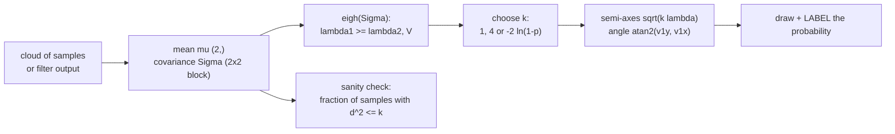

# 10.02 — Representing uncertainty — Gaussians and covariance ellipses

<!-- glance:start -->
<!-- generated by tools/build.py from curriculum/syllabus.yaml — edit the syllabus, not this block -->

| | |
|---|---|
| **Track** | Main path |
| **Difficulty** | Intermediate |
| **Time** | 1 h |
| **Hardware** | none |
| **Software** | python, numpy, matplotlib |
| **Prerequisites** | [10.01 Localization — belief instead of certainty](10.01-what-is-localization.md) |
| **Optional prerequisites** | [FM.14 Distributions, Gaussians, uncertainty and noise](../optional-foundations/mathematics/FM.14-distributions-gaussians-noise.md)<br>[FM.15 Covariance and multivariate Gaussians](../optional-foundations/mathematics/FM.15-covariance-multivariate-gaussians.md) |
| **Skip if** | You can draw a 2σ covariance ellipse from a 2×2 covariance matrix. |

<!-- glance:end -->

## What you will learn

- Represent a robot's belief as a Gaussian: a mean vector and a covariance matrix, and read σ and correlation from it.
- Turn any 2×2 position covariance into an ellipse: eigenvalues → axis lengths, eigenvectors → orientation.
- Choose and label the ellipse scale correctly: 1σ, 2σ or a probability (95 %) via the chi-square distribution — and know why "1σ" means 68 % in 1D but only 39 % in 2D.
- Watch the ellipse grow and rotate as the simulated robot drives, and check with samples whether the Gaussian is still an honest summary.
- Spot the plotting and labelling bugs that make uncertainty displays lie.

## Why it matters

In [10.01](10.01-what-is-localization.md) the belief was a cloud of 500 simulated robots. A cloud is
expensive to store, to send over ROS, and to reason about. Almost every localizer you will deploy
summarises it with two objects: a mean pose and a covariance matrix. The Kalman filters of
[10.04](10.04-kalman-filter-1d.md)–[10.06](10.06-extended-kalman-filter.md) *are* algorithms on means
and covariances, `robot_localization` ([10.07](10.07-fusing-imu-and-odometry.md)) publishes them, Nav2's
AMCL ([10.09](10.09-amcl-in-ros2.md)) reports its particle cloud as one, and RViz draws them as ellipses.

You will stare at those ellipses a lot: to decide whether the robot is localized well enough to dock,
to tune a filter, to debug why it thinks it is in the wall. That only works if you can go from a matrix
to a picture and back, and if you know what probability the picture shows. A "2σ ellipse" that someone
labels "95 %" silently promises coverage it does not have.

<!-- prereqs:start -->
## Prerequisites

You need these first:

- [10.01 Localization — belief instead of certainty](10.01-what-is-localization.md)

### Optional prerequisite links

New to any of these? Take the foundation lesson first; skip it if you already know it.

- [FM.14 Distributions, Gaussians, uncertainty and noise](../optional-foundations/mathematics/FM.14-distributions-gaussians-noise.md)
- [FM.15 Covariance and multivariate Gaussians](../optional-foundations/mathematics/FM.15-covariance-multivariate-gaussians.md)

Check your readiness: `python course.py why 10.02`
<!-- prereqs:end -->

> [!NOTE]
> This lesson uses Gaussians and covariance matrices. New to σ and the bell curve? → [FM.14 Distributions, Gaussians, uncertainty and noise](../optional-foundations/mathematics/FM.14-distributions-gaussians-noise.md). New to covariance, correlation and $J\Sigma J^\top$? → [FM.15 Covariance and multivariate Gaussians](../optional-foundations/mathematics/FM.15-covariance-multivariate-gaussians.md). Skip them if you already know them; this lesson does not repeat their derivations.

## Concept

Take the cloud of possible robot positions and ask two questions: *where is its centre?* and *how is
it spread?* The centre is the **mean**. The spread is described by the **covariance matrix**: how wide
the cloud is along x, along y, and whether x-errors and y-errors go together (a tilted cloud) or not.

For a cloud shaped like a smooth hill (a **Gaussian**), those two objects are *everything*: from them
you can recover the probability of every region. That's why a localizer can throw away 500 samples and
keep 2 + 3 numbers for a 2D position (a mean, two variances, one covariance).

Draw a contour line on that hill — "all positions exactly this improbable" — and you get an
**ellipse**. Its long axis points where the robot is most uncertain; its short axis where it is most
certain. The ellipse is a picture of the covariance matrix.

The subtle part is *which* contour you draw. In 1D, "within one standard deviation" holds 68 % of the
probability; many engineers carry that number into 2D. But in 2D the robot has to be within 1σ *in both
directions at once*, and the 1σ ellipse holds only 39 %. To draw "the region where the robot is with
95 % probability" you need a bigger scale factor, 2.45σ, taken from the chi-square distribution.

Finally, a Gaussian is a model, not a fact. When the heading uncertainty is large, the true cloud
bends into a banana and no ellipse fits it well. Knowing when to stop trusting the ellipse is part of
the skill; it is why particle filters ([10.08](10.08-particle-filter-mcl.md)) exist.

> [!TIP]
> **Ask your teacher:** "Show me why the 1σ ellipse in 2D contains only 39 % of samples: explain it without math first, then sample 10,000 points and count."

## Technical explanation

### Level 1 — Intuition: an ellipse is a stretched, rotated circle

Start with a circle of radius 1 around the origin: that is the 1σ contour of two independent standard
normal variables. Stretch it along one axis by $\sigma_{major}$ and along the other by $\sigma_{minor}$.
Rotate it so the long axis points in the direction of greatest uncertainty. Move it to the mean. Every
covariance ellipse is built exactly like that, and the recipe *is* the eigen-decomposition: the
eigenvectors are the rotation, the square roots of the eigenvalues are the stretches.

### Level 2 — Practical: reading a pose covariance

A 2D localizer's state is $(x, y, \theta)$ and its covariance is 3×3:

$$P = \begin{bmatrix} \sigma_x^2 & \operatorname{cov}(x,y) & \operatorname{cov}(x,\theta) \\ \operatorname{cov}(x,y) & \sigma_y^2 & \operatorname{cov}(y,\theta) \\ \operatorname{cov}(x,\theta) & \operatorname{cov}(y,\theta) & \sigma_\theta^2 \end{bmatrix}$$

For the position ellipse use only the top-left 2×2 block — marginals of a Gaussian are free (FM.15).
Heading uncertainty is shown separately (RViz's covariance display also draws it apart from the position ellipse).

**Numerical example (the 10.01 cloud at t = 12.6 s, rounded).**

$$\Sigma = \begin{bmatrix} 0.049 & -0.026 \\ -0.026 & 0.018 \end{bmatrix} \text{ m}^2$$

- $\sigma_x = \sqrt{0.049} = 22.1$ cm, $\sigma_y = \sqrt{0.018} = 13.4$ cm.
- $\rho = -0.026 / (0.221 \cdot 0.134) = -0.875$: strongly negative — when x is too large, y tends to be
  too small. The cloud runs from upper-left to lower-right.
- Reporting "±22 cm in x, ±13 cm in y" would be wrong in a practical way: along the diagonal the
  uncertainty is 25 cm, across it only 5.7 cm (computed next). A docking routine approaching along the
  narrow direction is in much better shape than the axis-aligned numbers suggest.

**The practical rules**

| You want to show | Use k (Mahalanobis $d^2$ threshold) | Scale on σ |
|---|---|---|
| the 1σ contour (39.3 % in 2D) | 1 | 1 |
| the 2σ contour (86.5 % in 2D) | 4 | 2 |
| a 90 % region | 4.605 | 2.146 |
| a 95 % region | 5.991 | 2.448 |
| a 99 % region | 9.210 | 3.035 |

`robotlab.sim.viz.draw_covariance_ellipse(ax, mean, cov, n_sigma=...)` takes the **σ scale** (right
column): `n_sigma=2` draws the 86.5 % ellipse, `n_sigma=2.448` the 95 % one. Always label which.

### Level 3 — Mathematics

**The Gaussian and its contours.** A 2D Gaussian with mean $\boldsymbol\mu$ and covariance $\Sigma$
has density $\propto \exp(-\tfrac12 d^2)$ with the squared **Mahalanobis distance**

$$d^2(\mathbf{p}) = (\mathbf{p} - \boldsymbol\mu)^\top \Sigma^{-1} (\mathbf{p} - \boldsymbol\mu)$$

Contours of constant density are the sets $d^2 = k$: ellipses.

**Numerical example.** With the Σ above ($\det\Sigma = 0.049 \cdot 0.018 - 0.026^2 = 2.06\times10^{-4}$),
a point 30 cm from the mean along +x has $d^2 = 0.3^2 \cdot \Sigma^{-1}_{11} = 0.09 \cdot 0.018 / 2.06\times10^{-4} = 7.86$
($d = 2.8$): outside the 95 % ellipse. A point 30 cm along the major axis direction ($-29.6°$) has
$d = 0.30/0.253 = 1.19$: comfortably inside. Same distance, different plausibility.

**Eigen-decomposition → axes.** Write $\Sigma = V \Lambda V^\top$ with orthonormal eigenvectors in the
columns of $V$ and eigenvalues $\lambda_1 \ge \lambda_2$ on the diagonal of $\Lambda$. In the rotated
coordinates $\mathbf{q} = V^\top(\mathbf{p} - \boldsymbol\mu)$ the ellipse becomes axis-aligned:
$q_1^2/\lambda_1 + q_2^2/\lambda_2 = k$. So

$$\text{semi-axes} = \sqrt{k\lambda_1},\ \sqrt{k\lambda_2}, \qquad \text{major-axis angle} = \operatorname{atan2}(v_{1,y}, v_{1,x})$$

For a 2×2 matrix $\begin{bmatrix} a & b \\ b & c \end{bmatrix}$ there is a closed form:

$$\lambda_{1,2} = \frac{a+c}{2} \pm \sqrt{\left(\frac{a-c}{2}\right)^2 + b^2}, \qquad \alpha = \tfrac12 \operatorname{atan2}(2b,\ a - c)$$

**Numerical example.** $a = 0.049$, $b = -0.026$, $c = 0.018$:
$\frac{a+c}{2} = 0.0335$, $\sqrt{0.0155^2 + 0.026^2} = 0.030268$, so $\lambda_1 = 0.063768$,
$\lambda_2 = 0.003232$ m² (check: sum = trace 0.067, product = det $2.06\times10^{-4}$). Standard
deviations along the axes: $\sqrt{\lambda_1} = 25.3$ cm and $\sqrt{\lambda_2} = 5.7$ cm. Angle
$\alpha = \tfrac12\operatorname{atan2}(-0.052, 0.031) = \tfrac12(-59.2°) = -29.6°$. Semi-axes: 1σ 25.3 × 5.7 cm,
2σ 50.5 × 11.4 cm, 95 % ($k = 5.991$) 61.8 × 13.9 cm.

**How much probability is inside.** If $\mathbf{p}$ is Gaussian, $d^2 = z_1^2 + z_2^2$ where $z_1, z_2$
are the coordinates along the axes in σ units — independent standard normals. A sum of $n$ squared
standard normals has the **chi-square distribution with $n$ degrees of freedom**. For $n = 2$ it has a
closed form, an exponential with mean 2:

$$P(d^2 \le k) = 1 - e^{-k/2} \qquad\Longleftrightarrow\qquad k = -2\ln(1 - p)$$

**Numerical example.** $k = 1$: $1 - e^{-0.5} = 0.393$. $k = 4$: $1 - e^{-2} = 0.865$. For $p = 0.95$:
$k = -2\ln 0.05 = 5.991$, scale $\sqrt{5.991} = 2.448$. Compare 1D, where $P(|z| \le 1) = 0.683$ and
$P(|z| \le 2) = 0.954$. In 3D, for a pose ellipsoid $(x, y, \theta)$, $P(d^2 \le 1) = 0.199$ and the 95 %
threshold is $k = 7.815$ (no closed form; `scipy.stats.chi2.ppf(0.95, 3)`). The more dimensions, the
emptier the "1σ" region.

| Region | 1D | 2D | 3D |
|---|---|---|---|
| $d \le 1$ ("1σ") | 68.3 % | 39.3 % | 19.9 % |
| $d \le 2$ ("2σ") | 95.4 % | 86.5 % | 73.9 % |
| 95 % threshold $k$ | 3.841 | 5.991 | 7.815 |

**How the ellipse grows.** [09.06](../09-odometry/09.06-accumulated-error.md) derived the growth laws
and the propagation $P' = F P F^\top + G Q G^\top$ for odometry; here we just look at the result. The
experiment in the Code section tracks the 1000-robot cloud of 10.01 every second:

```text
  t (s) major (cm) minor (cm)   angle  in 1sig  in 2sig  in 95%
    1.0        0.9        0.6    89.2    0.400    0.873   0.946
    3.0        6.3        1.5    88.8    0.397    0.872   0.950
    7.0       31.6        4.0    89.0    0.443    0.891   0.949
    9.0       31.6        5.3   -76.0    0.422    0.884   0.941
   13.0       59.5       12.4   -32.0    0.445    0.886   0.949
   15.0       51.6       16.5    -9.6    0.411    0.879   0.948
   19.0       88.1       24.1    53.0    0.468    0.900   0.938
```

(95 % semi-axes; angle of the major axis in degrees.) Three things to notice:

1. **The major axis grows much faster than linearly on the straight legs** (0.9 → 6.3 → 31.6 cm at
   1, 3, 7 s): heading error is integrated into sideways error. The minor axis grows slowly.
2. **The ellipse rotates and can even shrink along an axis** (59.5 → 51.6 cm from 13 to 15 s). Uncertainty
   never disappears without measurements, but correlated errors from different legs can partly cancel
   in a particular direction after a turn.
3. **The Gaussian is honest while the coverage matches theory** (39.3 / 86.5 / 95.0 %). At 19 s the 1σ
   region holds 46.8 % and the 95 % region 93.8 %: the cloud has a heavier centre and a curved tail — the
   banana. The covariance is still correct *as a covariance*; the Gaussian *shape* is what fails.

### Level 4 — Implementation

Points on an ellipse for plotting, with an explicit probability:

```python
import math
import numpy as np


def ellipse_points(mean, cov, probability=0.95, n=100):
    """(n, 2) points on the ellipse that contains `probability` of a 2D Gaussian."""
    k = -2.0 * math.log(1.0 - probability)             # chi-square, 2 dof
    eigvals, eigvecs = np.linalg.eigh(np.asarray(cov)[:2, :2])  # ascending, eigenvectors in COLUMNS
    t = np.linspace(0.0, 2.0 * math.pi, n)
    circle = np.vstack((np.cos(t), np.sin(t)))           # 2 x n unit circle
    return (np.asarray(mean)[:2, None] + eigvecs @ (np.sqrt(k * np.maximum(eigvals, 0.0))[:, None] * circle)).T


pts = ellipse_points([2.93, 2.44], [[0.049, -0.026], [-0.026, 0.018]])
print(pts.shape, pts[:, 0].min().round(3), pts[:, 0].max().round(3))
```

Output:

```text
(100, 2) 2.388 3.472
```

(Half-width in x: $\sqrt{k\,\Sigma_{xx}} = \sqrt{5.991 \cdot 0.049} = 0.542$ m, and $2.93 \pm 0.542$ gives 2.388 … 3.472.)

Implementation rules that prevent the classic bugs:

- Use `np.linalg.eigh` (symmetric matrices): sorted eigenvalues, real results. `eig` does neither.
- Eigenvectors are **columns**: `eigvecs[:, i]`.
- Clip tiny negative eigenvalues (−1e-18 from rounding) to 0 before `sqrt`.
- `ax.set_aspect("equal")`, otherwise every ellipse looks rotated and squashed.
- A zero or near-zero covariance means "no information about uncertainty", not "perfect" — draw nothing,
  or a warning, rather than an invisible ellipse.

## Diagram

```text
 Building the 95% ellipse of  Sigma = [[0.049, -0.026], [-0.026, 0.018]] m^2

  unit circle        stretch by sqrt(k*lambda)      rotate by V, move to mean
                       (k = 5.991)                   (major axis at -29.6 deg)

     .-.            .-----------------------.              y
    (   )   ---->  (       61.8 cm           )   ---->     ^     .--._
     `-'            `-----------------------'              |      `.   `--._   13.9 cm
                         13.9 cm (half-height)             |        `-._  mu `--.
                                                           |             `--._   `.
                                                           |                  `--._)
                                                           +----------------------------> x

 lambda1 = 0.06377 m^2 (sigma 25.3 cm)   lambda2 = 0.00323 m^2 (sigma 5.7 cm)

 Same matrix, three honest labels:
   k = 1      -> "1-sigma ellipse, 39% of the probability"      25.3 x  5.7 cm
   k = 4      -> "2-sigma ellipse, 86% of the probability"      50.5 x 11.4 cm
   k = 5.991  -> "95% ellipse"                                   61.8 x 13.9 cm
```



## Code

The experiment: [`code/uncertainty_ellipses.py`](code/uncertainty_ellipses.py) (tested by
`python -m pytest 10-localization/code`). It prints the worked example, the 1D/2D coverage table, and the
ellipse growth table above, and writes two figures.

```bash
python 10-localization/code/uncertainty_ellipses.py
```

Output (first two parts; the growth table is shown in Level 3):

```text
1) Worked example: Sigma = [[0.049, -0.026], [-0.026, 0.018]] m^2
   sigma_x=22.1 cm  sigma_y=13.4 cm  rho=-0.875
   eigenvalues=0.06377, 0.00323 m^2 (sum = trace 0.067, product = det 0.000206)
   sigma along axes: 25.3 cm (major, at -29.6 deg) and 5.7 cm
   1 sigma ellipse (k=1.000): semi-axes 25.3 x 5.7 cm
   2 sigma ellipse (k=4.000): semi-axes 50.5 x 11.4 cm
       95% ellipse (k=5.991): semi-axes 61.8 x 13.9 cm
2) Probability inside:      k      1D       2D
   1 sigma               1.000   68.3%    39.3%
   2 sigma               4.000   95.4%    86.5%
   3 sigma               9.000   99.7%    98.9%
       95%               5.991   98.6%    95.0%
       99%               9.210   99.8%    99.0%
```

- `localization_out/ellipses_example.png`: 2,000 samples of the worked example with the 1σ (blue), 2σ
  (orange) and 95 % (red) ellipses — count by eye: the blue one clearly holds fewer than half the dots.
- `localization_out/ellipses_growth.png`: the living-room drive with a 95 % ellipse every second — thin
  vertical ellipses on the first leg, tilted ones after the turn, big diagonal ones at the end.

The coverage check that decides whether a Gaussian is honest (from [`code/loc_common.py`](code/loc_common.py)):

```python
def fraction_inside(points, mean, cov, k):
    """Fraction of (N, 2) points with Mahalanobis distance^2 <= k."""
    d = np.asarray(points, dtype=float) - np.asarray(mean, dtype=float)
    m2 = np.einsum("ij,ij->i", d @ np.linalg.inv(cov), d)
    return float(np.mean(m2 <= k))
```

## Exercise

All exercises need hardware: **none**.

### Exercise 10.02-E1 — Ellipse by hand `[numerical]`

Goal: go from a matrix to a picture without code. A localizer reports
$\Sigma = \begin{bmatrix} 0.02 & 0.01 \\ 0.01 & 0.02 \end{bmatrix}$ m² for the robot's position.
Compute σ_x, σ_y, ρ, both eigenvalues (closed form), the major-axis angle, and the semi-axes of the 2σ
and 95 % ellipses in cm. Check with `np.linalg.eigh`.

### Exercise 10.02-E2 — Watch it grow `[simulation]`

Goal: connect the growth table to the motion. Run `uncertainty_ellipses.py` and open
`ellipses_growth.png`. (a) Between 1 s and 7 s the robot drives straight: by what factor does the 95 %
major axis grow while the distance driven grows 7×? (b) At which time does the major axis first point
diagonally, and what happened just before? (c) Why does the major axis get *shorter* between 13 and 15 s?

### Exercise 10.02-E3 — Is it really 95 %? `[coding]`

Goal: verify the chi-square scaling yourself. Using `np.random.default_rng(0)`, draw 100,000 samples from
$\mathcal{N}(\mathbf{0}, \Sigma)$ with the worked-example Σ. For $k = 1, 4, 5.991, 9.21$ compute the fraction
of samples with $d^2 \le k$. Then repeat with samples from the 10.01 cloud at 19 s (`uncertainty_ellipses.ellipse_growth()`
gives you `cloud`) using that cloud's own mean and covariance.

### Exercise 10.02-E4 — Three dimensions `[predict]`

Goal: feel the dimension effect. The EKF of 10.06 has a 3×3 pose covariance. **Predict before computing**:
what fraction of samples of a 3D Gaussian lie inside its "1σ ellipsoid" ($d^2 \le 1$)? Inside $d^2 \le 4$?
What threshold gives 95 %? Then check with 100,000 samples and `scipy.stats.chi2.cdf` (or by counting).

### Exercise 10.02-E5 — The ellipse that lies `[debugging]`

Goal: find the bugs. A teammate's dashboard draws localization uncertainty like this:

```python
vals, vecs = np.linalg.eig(P[:2, :2])
angle = math.degrees(math.atan2(vecs[0][1], vecs[0][0]))       # direction of the first eigenvector
width, height = 2 * 2 * np.sqrt(vals)                           # 2-sigma
ax.add_patch(Ellipse(mean, width, height, angle=angle, fill=False, label="95% confidence"))
```

The robot is often outside the drawn region even when it is well localized, and for some matrices the
ellipse points the wrong way. Find three problems and fix them.

## Expected result

- **10.02-E1:** σ_x = σ_y = 14.1 cm, ρ = 0.5. $\lambda_{1,2} = 0.02 \pm \sqrt{0 + 0.01^2} = 0.03, 0.01$ m²; major
  axis at $\tfrac12\operatorname{atan2}(0.02, 0) = 45°$ (eigenvector $[1, 1]/\sqrt2$). σ along axes 17.3 and 10.0 cm.
  2σ semi-axes 34.6 × 20.0 cm; 95 % semi-axes $\sqrt{5.991 \cdot 0.03} = 42.4$ × $\sqrt{5.991 \cdot 0.01} = 24.5$ cm.
  `eigh` returns `[0.01, 0.03]` (ascending) with eigenvectors ±[−0.707, 0.707] and ±[0.707, 0.707] in columns.
- **10.02-E2:** (a) 0.9 → 31.6 cm, about 35× for 7× the distance (faster than $d^{1.5}$ = 18.5×, because systematic
  wheelbase/radius errors, which grow like $d^2$ = 49×, dominate this uncalibrated cloud). (b) At 9 s (angle −76°),
  right after the first left turn at 7–8 s; by 13 s it is at −32°. (c) After the turn the robot drives in a new
  direction; the heading error of the second leg pushes positions sideways *relative to the new direction*, partly
  cancelling the correlated error from the first leg along one diagonal. The ellipse rotates (−32° → −10°) and its
  long axis shortens before it grows again.
- **10.02-E3:** Gaussian samples: about 0.393, 0.865, 0.950, 0.990 (±0.003). Cloud at 19 s: about 0.47, 0.90, 0.94,
  0.97 — more mass near the centre and a heavier outer tail than a Gaussian with the same covariance: the banana.
- **10.02-E4:** 19.9 % inside $d^2 \le 1$, 73.9 % inside $d^2 \le 4$, 95 % threshold $k = 7.815$ (2.80σ). Sampling agrees
  within ±0.3 %.
- **10.02-E5:** (1) `vecs[0]` is the first *row*; eigenvectors are the *columns* `vecs[:, i]`, so the angle is wrong
  unless the matrix happens to be symmetric about 45°. (2) `eig` does not sort: `vals[0]` may be the smaller eigenvalue,
  so width and height can be swapped relative to the angle; use `eigh` and take the largest explicitly. (3) The label:
  a 2σ ellipse in 2D holds 86.5 %, not 95 % — use $2\sqrt{5.991\,\lambda}$ (scale 2.448) for 95 %, or change the label.
  (Bonus: without `ax.set_aspect("equal")` the ellipse is distorted on screen.)

## Troubleshooting

### Symptom: the ellipse is rotated 90° from the cloud of samples

1. Print `eigvals, eigvecs = np.linalg.eigh(cov)` and check you pair the **largest** eigenvalue (last with `eigh`)
   with **its column** `eigvecs[:, -1]`.
2. Check the angle unit: `matplotlib.patches.Ellipse` wants **degrees**.
3. Check the axes aspect ratio (`ax.set_aspect("equal")`).
4. Check the covariance itself: `np.cov(points)` treats **rows** as variables by default; for an `(N, 2)` array use
   `np.cov(points.T)` or `rowvar=False`.

### Symptom: far fewer samples are inside "the 95 % ellipse" than 95 %

1. Is the scale 2σ (86.5 %) or 2.448σ (95 %)? See the table in Level 2.
2. Is the problem 3D (pose) while you use the 2D threshold? 5.991 is for 2 dimensions only.
3. Compute the coverage of the 1σ, 2σ and 95 % regions. If all are close to theory, the ellipse is fine and your
   count was wrong. If the inner region holds too *much* and the outer too little, the distribution is not
   Gaussian (curved or heavy-tailed): use samples or a particle filter.
4. If the samples come from a filter compared with ground truth, too few inside means the filter is
   **overconfident** — that is a tuning problem ([10.05](10.05-kalman-filter-multivariate.md) teaches NEES).

### Symptom: `sqrt` of a negative number, or `LinAlgError` when inverting the covariance

1. Print the eigenvalues. −1e-17 is rounding: symmetrize `(P + P.T) / 2` and clip at 0.
2. A clearly negative eigenvalue means the matrix is not a valid covariance (wrong entries, a copy-paste into
   the wrong index of a ROS 36-element array, or a filter bug). FM.15 has the validity checks.
3. An exactly zero eigenvalue (a direction with no uncertainty) makes `inv` fail: use `np.linalg.pinv` for the
   Mahalanobis distance, or add a tiny variance.

## Common mistakes

- **Calling a 1σ or 2σ ellipse a confidence region with the 1D percentages.** In 2D, 1σ is 39 % and 2σ is 86 %.
- **Summarising a tilted cloud with σ_x and σ_y.** You lose the correlation; along the narrow direction the robot may be
  four times more certain than either number suggests.
- **Using `np.linalg.eig` and row eigenvectors.** Use `eigh` and columns.
- **Plotting without equal aspect.** Ellipses change shape and angle on screen.
- **Trusting the ellipse after large heading uncertainty.** Beyond ~10–15° of heading σ, check the coverage against
  samples; the Gaussian shape fails before the covariance does.
- **Reading "the ellipse shrank" as "a measurement arrived".** Without measurements uncertainty can rotate and
  redistribute, but its total (the determinant, the area) does not come back down in a correct model.

## Knowledge check

1. $\Sigma = \operatorname{diag}(0.09, 0.01)$ m². What are the 1σ and 95 % semi-axes, and which way does the ellipse point?
   <details><summary>Answer</summary>

   1σ: 30 cm along x, 10 cm along y. 95 %: $\sqrt{5.991}\cdot(30, 10) = 73.4$ × 24.5 cm. Axis-aligned, long along x
   (no correlation, so the eigenvectors are the coordinate axes).
   </details>

2. What fraction of a 2D Gaussian lies inside its 1σ ellipse, and why is it not 68 %?
   <details><summary>Answer</summary>

   39.3 % ($1 - e^{-1/2}$). 68 % is the 1D probability of $|z| \le 1$. In 2D the point must satisfy $z_1^2 + z_2^2 \le 1$,
   a stricter condition than each coordinate being within 1σ, and $d^2$ follows a chi-square with 2 dof.
   </details>

3. For $\begin{bmatrix} 0.04 & 0 \\ 0 & 0.04 \end{bmatrix}$ what is the major-axis angle? What does the question even mean here?
   <details><summary>Answer</summary>

   The eigenvalues are equal, so every direction is an eigenvector: the ellipse is a circle (σ = 20 cm) and the angle is
   undefined. Code will return some arbitrary angle; it must not matter.
   </details>

4. Predict: a robot drives straight along +x for 3 m with only random wheel noise. Which axis of its position ellipse grows faster, and roughly how does each scale with distance (09.06)?
   <details><summary>Answer</summary>

   The sideways (y) axis: σ_lat ∝ $d^{1.5}$ (integrated heading random walk), while along-track σ ∝ $\sqrt d$. The ellipse
   becomes a thin vertical needle.
   </details>

5. Two observations are both 30 cm from the estimated position (worked-example Σ). One lies along −29.6°, the other along +x. Compute both Mahalanobis distances and say which a 95 % gate accepts.
   <details><summary>Answer</summary>

   Along the major axis: $d = 0.30/0.253 = 1.19$, $d^2 = 1.41 < 5.991$ → accept. Along +x: $d^2 = 0.09 \cdot \Sigma^{-1}_{11} = 0.09 \cdot 0.018/2.06\times10^{-4} = 7.86 > 5.991$ → reject.
   </details>

6. Debugging: your EKF's 95 % ellipse contains the true position only 60 % of the time in simulation. Name two different causes and how to tell them apart.
   <details><summary>Answer</summary>

   (a) The filter is overconfident: process/measurement noise too small — the errors are Gaussian-looking but too big for
   $P$; coverage of 1σ/2σ/95 % regions is uniformly low. Fix Q/R (10.05, NEES). (b) The belief is not Gaussian (large heading
   uncertainty, banana): inner regions are over-covered while the outer region is under-covered; check with samples, reduce
   heading uncertainty (gyro, landmarks) or use particles.
   </details>

7. Why is the 3D "1σ ellipsoid" of a pose covariance an especially misleading picture?
   <details><summary>Answer</summary>

   It holds only 19.9 % of the probability. Also θ is in radians and x, y in metres, so the "shape" depends on units;
   show position ellipses and heading uncertainty separately.
   </details>

## Practical challenge

Replace the Monte Carlo cloud by **propagated covariance** and find where the Gaussian breaks.

Acceptance criteria:
- Starting from $P_0 = 0$, propagate the 3×3 pose covariance along the logged encoder ticks of `lc.drive_living_room()` with
  $P_{k+1} = F_k P_k F_k^\top + G_k M_k G_k^\top$ ([09.06](../09-odometry/09.06-accumulated-error.md) gives $F$ and $G$), with a
  wheel-noise model $M_k$ you choose.
- Tune $M_k$ (and model the calibration uncertainty, e.g. as extra state or extra noise) so that at 7 s your 95 % ellipse matches the
  cloud's within 20 % on both semi-axes.
- Plot your ellipses over the cloud every second, and report the first time at which the cloud's coverage of your 95 % ellipse
  drops below 90 %, with one paragraph explaining why.

## You can skip this if…

You can draw a 2σ covariance ellipse from a 2×2 covariance matrix, answer knowledge-check questions 1, 2, 5 and 6 correctly without
looking, and explain why the 95 % ellipse in 2D uses a scale of 2.45σ. Then:

`python course.py skip 10.02 --reason "I can draw and correctly label covariance ellipses"`

## Go deeper

- https://cs229.stanford.edu/section/gaussians.pdf — Stanford CS229 notes on the multivariate Gaussian: the ellipse geometry, rigorously and briefly.
- https://github.com/rlabbe/Kalman-and-Bayesian-Filters-in-Python — Labbe, chapter "Multivariate Gaussians": interactive covariance ellipses, leading straight into the multivariate Kalman filter.
- https://numpy.org/doc/stable/reference/generated/numpy.cov.html — `np.cov` reference (note `rowvar`).
- https://mitpress.mit.edu/9780262201629/probabilistic-robotics/ — *Probabilistic Robotics*, chapter 3: Gaussian beliefs and why filters keep them.
- https://www.youtube.com/@CyrillStachniss/playlists — Stachniss's lectures on probabilistic state estimation, including Gaussian beliefs and their limits.

## Progress checkpoint

- [ ] I can represent a belief as mean + covariance and read σ and ρ from the matrix.
- [ ] I can compute an ellipse's axes and angle from a 2×2 covariance (by hand for 2×2).
- [ ] I can pick and label the scale: 1σ, 2σ or a probability using chi-square, in 1D, 2D and 3D.
- [ ] I watched the ellipse grow in simulation and can check coverage against samples.
- [ ] I can find the classic ellipse-plotting bugs.

`python course.py complete 10.02` (exercises done) · `python course.py master 10.02` (challenge done) · `python course.py struggle 10.02 "what was hard"`

Next: [10.03 — The Bayes filter: predict and update on a 1D grid](10.03-bayes-filter.md).
