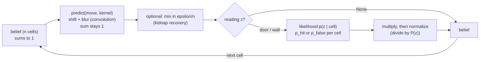

# 10.03 — The Bayes filter — predict and update on a 1D grid

<!-- glance:start -->
<!-- generated by tools/build.py from curriculum/syllabus.yaml — edit the syllabus, not this block -->

| | |
|---|---|
| **Track** | Main path |
| **Difficulty** | Intermediate |
| **Time** | 1 h |
| **Hardware** | none |
| **Software** | python, numpy |
| **Prerequisites** | [10.02 Representing uncertainty — Gaussians and covariance ellipses](10.02-uncertainty-gaussians.md) |
| **Optional prerequisites** | [FM.16 Bayes' rule — updating beliefs with evidence](../optional-foundations/mathematics/FM.16-bayes-rule.md) |
| **Skip if** | You have implemented a histogram filter. |

<!-- glance:end -->

## What you will learn

- Implement the two steps of the Bayes filter on a grid: a motion update (shift + blur) and a measurement update (multiply + normalize).
- Write a motion model as a kernel and a measurement model as a likelihood, and compute both by hand for a small corridor.
- Localize a simulated robot globally in a corridor with doors, starting from "no idea".
- Explain why prediction is a convolution, why normalization is not optional, and what a too-sharp or too-blurry motion model does.
- Make the filter recover from a kidnapping by injecting a little uniform probability, and state the price.

## Why it matters

The Bayes filter is the parent of every localizer in this module. The Kalman filter
([10.04](10.04-kalman-filter-1d.md)) is the Bayes filter when every belief is a Gaussian; the particle
filter ([10.08](10.08-particle-filter-mcl.md)) is the Bayes filter with the belief stored as samples;
AMCL ([10.09](10.09-amcl-in-ros2.md)) is that particle filter tuned for LiDAR maps. If you can do predict
and update on a grid, with numbers, you understand what all of them are trying to approximate and why
they fail when they do.

A grid is also the one representation that handles *global* localization and ambiguity without any
tricks. When karmel wakes up in a corridor of identical doors, a grid can hold "door 3, 9 or 23" at
once. You will build exactly that, test it against hand-computed numbers, and run it on the
simulated robot with its real encoders and LiDAR.

<!-- prereqs:start -->
## Prerequisites

You need these first:

- [10.02 Representing uncertainty — Gaussians and covariance ellipses](10.02-uncertainty-gaussians.md)

### Optional prerequisite links

New to any of these? Take the foundation lesson first; skip it if you already know it.

- [FM.16 Bayes' rule — updating beliefs with evidence](../optional-foundations/mathematics/FM.16-bayes-rule.md)

Check your readiness: `python course.py why 10.03`
<!-- prereqs:end -->

> [!NOTE]
> The update step is Bayes' rule. New to prior, likelihood, posterior and normalization? → [FM.16 Bayes' rule — updating beliefs with evidence](../optional-foundations/mathematics/FM.16-bayes-rule.md) (its 5-cell hallway example is this lesson's starting point). Skip it if you apply Bayes' rule to sensor updates already.

## Concept

karmel drives down a 10 m corridor cut into 40 cells of 25 cm. Some cells have a doorway on the left.
The robot has two sources of information, and each does one thing to the belief:

**Moving blurs.** The robot tells its wheels "one cell forward". The encoders are good, but a wheel can
slip or the count can be a hair short, so it probably moved one cell, possibly zero or two. Every
probability in the belief shifts one cell to the right *and* smears into its neighbours. If the robot
was sure it was in cell 12, after moving it is 90 % sure it is in 13, 5 % in 12, 5 % in 14. Motion
alone can only make the belief wider — it never tells you where you are.

**Sensing sharpens.** The LiDAR looks left and says "doorway". Every cell that has a doorway becomes
more plausible, every wall cell less plausible — multiply each cell's probability by how likely that
reading would be from there. Then rescale so everything sums to 1 again. Sensing creates certainty,
but only as much as the sensor deserves: a detector that is sometimes wrong can't make any cell
impossible.

Alternate the two — move, sense, move, sense — and something remarkable happens even though no single
reading says where the robot is. "Door" narrows it to 10 cells. "Wall, wall, wall, door" after moving
four cells narrows it to cells whose *pattern* of doors matches the sequence. After 15–20 cells, the
pattern is unique and the belief collapses onto one cell. Motion is what makes the history of readings
informative.

A distributed-systems analogy: each cell is a replica's vote on "where are we"; motion is replicating
the votes one step along with some noise; a measurement reweights votes by how well each explains
what was observed; normalization is re-computing the quorum.

> [!TIP]
> **Ask your teacher:** "Walk me through three predict/update steps of the corridor filter on paper with 5 cells, then show me the same steps in numpy."

## Technical explanation

### Level 1 — Intuition: two operations, one loop

```text
belief --(predict: shift by the commanded move, blur by motion noise)--> predicted belief
predicted belief --(update: multiply by likelihood of the reading, normalize)--> belief
```

Prediction conserves probability (it only moves it around). Update destroys and recreates it
(multiplying shrinks the total; normalizing restores 1). Forget normalization and your "probabilities"
shrink toward zero within a few steps.

### Level 2 — Practical: the corridor, step by step

A 5-cell circular corridor (leaving cell 4 re-enters cell 0) with doors at cells 0 and 3. Motion kernel
`[0.1, 0.8, 0.1]`: when told to move one cell, the robot moves 0, 1 or 2 cells with probability 0.1,
0.8, 0.1. The door detector says "door" with probability $p_{hit} = 0.8$ in a door cell and
$p_{false} = 0.3$ in a wall cell. Start with no idea: $[0.2, 0.2, 0.2, 0.2, 0.2]$.

**Step 1 — move 1, read "door".** Predict: a uniform belief stays uniform. Update: likelihood
$[0.8, 0.3, 0.3, 0.8, 0.3]$, product $[0.16, 0.06, 0.06, 0.16, 0.06]$, sum 0.50, belief
$[0.32, 0.12, 0.12, 0.32, 0.12]$. Two hypotheses, one per door.

**Step 2 — move 1, no reading** (the LiDAR returned only dropouts). Predict only. Each cell $j$ receives
0.1 of cell $j$ (didn't move), 0.8 of cell $j-1$ (moved 1) and 0.1 of cell $j-2$ (moved 2). Cell 1:
$0.1 \cdot 0.12 + 0.8 \cdot 0.32 + 0.1 \cdot 0.12 = 0.28$. All cells: $[0.16, 0.28, 0.14, 0.14, 0.28]$ — sum still 1,
peaks moved right by one and got lower.

**Step 3 — move 1, read "wall".** Predict: $[0.254, 0.184, 0.254, 0.154, 0.154]$ (cell 0: $0.1\cdot0.16 + 0.8\cdot0.28 + 0.1\cdot0.14$).
Likelihood of "wall" is $1 - 0.8 = 0.2$ at doors, $1 - 0.3 = 0.7$ at walls: $[0.2, 0.7, 0.7, 0.2, 0.7]$.
Product $[0.0508, 0.1288, 0.1778, 0.0308, 0.1078]$, sum 0.496, belief $[0.102, 0.260, 0.358, 0.062, 0.217]$.
The robot now believes cell 2 most (0.358) but cells 1 and 4 are still serious candidates: two
readings on a 5-cell corridor with two doors cannot settle the question, and the filter says so.

These exact numbers are the first tests of the auto-graded exercise.

**The corridor in the simulator.** [`labs/exercises/10.03/corridor_sim.py`](../labs/exercises/10.03/corridor_sim.py)
(provided) builds a 10 m × 1.2 m corridor with doorways at cells 3, 4, 9, 16, 17, 23, 30, 31, 32, 36,
drives the realistic karmel down it (steering by the right-hand wall using two LiDAR beams), and each
time odometry says "one more cell" it looks left with five LiDAR beams around +90°: median range above
1.0 m → door. Started at cell 5 without telling the filter, with kernel `[0.05, 0.9, 0.05]`,
$p_{hit} = 0.9$, $p_{false} = 0.1$:

```text
step  door?  true  peak  P(peak)  P(true)
   1  False     6    39    0.064    0.032
   4   True     9    16    0.140    0.139
  10  False    15    39    0.434    0.184
  11   True    16    30    0.365    0.361
  12   True    17    31    0.414    0.411
  13  False    18    18    0.662    0.662
  18   True    23    23    0.896    0.896
  20  False    25    25    0.805    0.805
```

For 12 cells the peak jumps around: the true cell is always among the top hypotheses, but the
door pattern so far also fits elsewhere (cells 30–31 look like 16–17). Step 13 — a wall right after a
double door — only fits one place. From then on the peak stays on the truth and the confidence climbs
to 0.9 at the next door. (Why is the early peak at cell 39? With end walls, probability that would
drive past the last cell piles up there — a real effect of the motion model; it fades as soon as
readings disagree with it.)

### Level 3 — Mathematics

**Predict (motion update).** For a discrete state, the law of total probability:

$$\overline{bel}(x_k = j) = \sum_i p(x_k = j \mid x_{k-1} = i,\ u_k)\ bel(x_{k-1} = i)$$

If the motion noise does not depend on where the robot is, $p(j \mid i, u) = \kappa(j - i - u)$ for a
kernel $\kappa$, and the sum becomes a **convolution**:

$$\overline{bel}(j) = \sum_{o} \kappa(o)\ bel(j - u - o) = (bel * \kappa)(j - u)$$

**Numerical example.** Belief $[0, 1, 0, 0, 0]$ (certain: cell 1), $u = 1$, $\kappa(-1, 0, +1) = (0.1, 0.8, 0.1)$.
Cell 2: $\kappa(0)\,bel(1) = 0.8$; cell 1: $\kappa(-1)\,bel(1) = 0.1$; cell 3: $\kappa(+1)\,bel(1) = 0.1$ →
$[0, 0.1, 0.8, 0.1, 0]$. A delta becomes the kernel, shifted: that is what convolution does.

Two consequences: probability is conserved ($\sum_j \overline{bel}(j) = \sum_i bel(i) \sum_o \kappa(o) = 1$), and the
belief can only get flatter — repeated prediction without measurements converges to uniform (on a circle)
or to piles at the walls (with ends).

**Update (measurement update).** Bayes' rule with the normalizer $\eta$:

$$bel(x_k = j) = \eta\ p(z_k \mid x_k = j)\ \overline{bel}(x_k = j), \qquad \eta = \Big(\sum_j p(z_k \mid j)\,\overline{bel}(j)\Big)^{-1}$$

For the door detector: $p(\text{"door"} \mid j) = p_{hit}$ if cell $j$ has a door, $p_{false}$ otherwise;
$p(\text{"wall"} \mid j) = 1 - $ that.

**Numerical example.** Step 1 above: $\eta^{-1} = 0.8\cdot0.2 \cdot 2 + 0.3\cdot0.2\cdot3 = 0.50$ — the probability of
reading "door" at all, given the prior. Posterior at a door cell $= 0.16/0.50 = 0.32$.

**How much one reading can do.** The ratio between two cells' beliefs changes by the **likelihood
ratio**: a "door" reading multiplies door cells against wall cells by $p_{hit}/p_{false}$; a "wall" reading by
$(1 - p_{hit})/(1 - p_{false})$. With 0.9/0.1 that is ×9 and ×1/9 per reading. After $n$ consistent readings
the ratio can reach $9^n$ — which is why a filter can become confident quickly, and also why a *wrong*
reading costs a factor of 9 that takes another reading to repay.

**Why a likelihood of 0 is dangerous.** If $p_{false} = 0$, one false "door" at a wall makes every wall
cell exactly 0 forever: multiplication can never bring a 0 back. If *every* cell becomes 0, $\eta$ is a
division by zero. The exercise's `normalize` raises `ValueError` for that; real systems never use exact
zeros in sensor models.

**Kidnapping and probability injection.** After 20 consistent cells the belief elsewhere is tiny
(in the experiment below, the cell the robot is carried to holds $3	imes10^{-29}$ of the peak's probability). If the robot is carried away, recovery needs enough contrary evidence to
overcome that ratio — in practice never. The standard fix mixes in a little uniform probability after
each prediction:

$$\overline{bel}'(j) = (1 - \varepsilon)\ \overline{bel}(j) + \varepsilon / n$$

**Numerical example.** $n = 40$, $\varepsilon = 0.05$: every cell gets at least $0.05/40 = 0.00125$ after each
prediction. A cell with that floor needs a likelihood ratio of about $0.9/0.00125 \approx 720$ — three
consistent readings at ×9 each — to become the peak. From the experiment below:

```text
2) Kidnapped after 20 cells (carried from cell 32 back to cell 1)
   epsilon=0.00: P(true) before kidnap 0.845, at the end 0.000; never recovers
   epsilon=0.01: P(true) before kidnap 0.837, at the end 0.781; peak correct again from step 36 of 44
   epsilon=0.05: P(true) before kidnap 0.799, at the end 0.707; peak correct again from step 35 of 44
   epsilon=0.20: P(true) before kidnap 0.585, at the end 0.344; peak correct again from step 35 of 44
```

The price of $\varepsilon$ is permanent under-confidence: with 0.20 the belief never exceeds about 0.6
even when the robot is well localized. (Recovery takes ~15 cells here because the corridor's first
doors at 3–4 and 9 must pass by before the pattern is unique again.) AMCL's `recovery_alpha_*`
parameters implement the adaptive version of the same idea ([10.09](10.09-amcl-in-ros2.md)).

**Motion model: sharp vs blurry.** The kernel must match the robot's real motion noise:

```text
3) Motion kernels. Clean drive, and the same drive with one cell missed by odometry
            sharp [0, 1, 0]: P(true) clean 0.996 | missed cell: 0.758, peak correct from step 17 of 19
     matched [.05, .9, .05]: P(true) clean 0.805 | missed cell: 0.788, peak correct from step 12 of 19
      blurry [.25, .5, .25]: P(true) clean 0.204 | missed cell: 0.201, peak never settles
```

On the clean drive the sharp kernel is the most confident (0.996) — the simulator's encoders really
are that good over 25 cm. But when odometry misses one cell (a wheel slip), the sharp kernel has no way
to explain it and needs 5 more cells to recover; the matched kernel absorbs it. The blurry kernel is
never wrong in a dramatic way and never useful either: it throws away the information in the motion.
Overconfident models fail suddenly; underconfident models fail quietly.

### Level 4 — Implementation

The whole filter is four small functions (the exercise asks you to write them):

```python
import numpy as np


def normalize(belief):
    total = belief.sum()
    if not np.isfinite(total) or total <= 0.0:
        raise ValueError(f"cannot normalize a belief that sums to {total}")
    return belief / total


def predict(belief, move, kernel, wrap=False):
    n, half = belief.size, len(kernel) // 2
    out = np.zeros(n)
    for i, p in enumerate(kernel):
        shift = move + i - half
        if wrap:
            out += p * np.roll(belief, shift)
        else:
            np.add.at(out, np.clip(np.arange(n) + shift, 0, n - 1), p * belief)  # walls stop the robot
    return out


def update(belief, likelihood):
    return normalize(likelihood * belief)


doors = np.array([True, False, False, True, False])
b = normalize(np.ones(5))
for move, z in [(1, True), (1, None), (1, False)]:
    b = predict(b, move, [0.1, 0.8, 0.1], wrap=True)
    if z is not None:
        p_door = np.where(doors, 0.8, 0.3)
        b = update(b, p_door if z else 1.0 - p_door)
    print(np.round(b, 3))
```

Output:

```text
[0.32 0.12 0.12 0.32 0.12]
[0.16 0.28 0.14 0.14 0.28]
[0.102 0.26  0.358 0.062 0.217]
```

Notes that matter in practice:

- `np.add.at` instead of `out[targets] += ...`: fancy-index assignment with repeated targets adds only once.
- Cost: predict is $O(n \cdot |\kappa|)$, update $O(n)$. A 2D pose grid for the apartment (120 × 100 cells at 5 cm × 72
  headings = 864,000 cells) with a 5×5×3 kernel is ~65 million multiply-adds per prediction in numpy — possible,
  but this is why 2D/3D robots use particles or Gaussians instead. `scipy.ndimage.convolve` or FFT-based convolution
  help if you do go there.
- Underflow: after hundreds of updates tiny probabilities become 0.0 in float64. Normalizing every step and an
  $\varepsilon$ floor both prevent it; the log domain (FM.16's log-odds idea) is the other option.

## Diagram



```text
Corridor seen from above (first 18 of 40 cells; D = doorway in the left wall)

 cell index    0   1   2   3   4   5   6   7   8   9  10  11  12  13  14  15  16  17
 left wall   |===|===|===| D | D |===|===|===|===| D |===|===|===|===|===|===| D | D |
                                                                                   
 robot  ->   o   drives +x along the middle; LiDAR beams at +90 deg look left
 right wall  |===|===|===|===|===|===|===|===|===|===|===|===|===|===|===|===|===|===|

 One step for the belief:
   before      . . . # . . .      (# = probable)
   predict     . . . - # - .      shifted by 1, blurred into neighbours
   update      . . . . # . .      reading agreed with that cell -> sharpened
```

## Code

- Exercise (auto-graded): [`labs/exercises/10.03/`](../labs/exercises/10.03/README.md) — `student.py` to fill in,
  `corridor_sim.py` provided.
- Experiment script: [`code/histogram_corridor.py`](code/histogram_corridor.py), tested by `python -m pytest 10-localization/code`.

Run the experiment with your implementation (after the exercise) or the reference:

```bash
python 10-localization/code/histogram_corridor.py              # uses labs/exercises/10.03/student.py
python 10-localization/code/histogram_corridor.py --solution   # reference solution
python 10-localization/code/histogram_corridor.py --solution --seed 1 --start-cell 0
```

It prints the step table, the kidnapping and kernel experiments shown above, and writes
`localization_out/histogram_global.png`: a heat map of the belief (cells horizontally, steps vertically) with the
true cell as red dots, and the door map underneath. You see several bright stripes early — competing hypotheses
moving right one cell per step — and one stripe surviving after step 13.

The kidnap-recovery variant is a three-line change around your `predict` and `update`:

```python
# from 10-localization/code/histogram_corridor.py (filter_with_mixing)
for move, z in zip(moves, readings):
    belief = ex.predict(belief, move, kernel, wrap=False)
    belief = (1.0 - epsilon) * belief + epsilon / belief.size
    if z is not None:
        belief = ex.update(belief, ex.door_likelihood(doors, z, P_HIT, P_FALSE))
```

## Exercise

All exercises need hardware: **none** (the simulator replaces the robot).

### Exercise 10.03-E1 — Three steps by hand `[numerical]`

Goal: do predict and update on paper. A 4-cell circular corridor with doors at cells 1 and 2, kernel
`[0.2, 0.6, 0.2]` (moved 0, 1, 2 cells), $p_{hit} = 0.9$, $p_{false} = 0.2$, prior uniform. The robot: moves 1 and reads
"door"; moves 1 and reads "door"; moves 1 and reads "wall". Write the predicted belief, the unnormalized product and
the posterior for each step. Which cell does it believe at the end, and does that make sense given the door layout?

### Exercise 10.03-E2 — Implement the histogram filter `[coding]`

Goal: build the filter that the rest of the module generalizes. Implement `normalize`, `predict`, `door_likelihood`,
`update` and `run_filter` in `labs/exercises/10.03/student.py`. The tests check the hand-computed corridor above, the
end walls, convolution on a circle, error handling, global localization on a synthetic corridor, and three runs of the
simulated robot.

Check it: `python course.py check 10.03`

### Exercise 10.03-E3 — Predict the heat map `[predict]`

Goal: build intuition before running. **Before running** `histogram_corridor.py --solution --seed 1 --start-cell 0`,
predict: (a) roughly after how many cells will the peak lock onto the truth, given the doorways at 3, 4 and 9 come
early; (b) will the early peak again sit at cell 39? Then run it and compare with the step table.

### Exercise 10.03-E4 — The detector that is never wrong `[debugging]`

Goal: see what zero likelihoods do. In a copy of the experiment, set `P_FALSE = 0.0` and `P_HIT = 1.0` ("the LiDAR door
detector never made a mistake in five test runs, so let's trust it fully"). Run the global localization: it works, and
the belief is very confident. Now simulate one misread, as happens when a beam grazes a door frame: flip
`run.readings[6]` before calling `run_filter`. Explain the `ValueError: cannot normalize a belief that sums to 0.0`
that follows, why the math has no way out, and fix the *model*, not the code.

### Exercise 10.03-E5 — Choose epsilon `[simulation]`

Goal: tune kidnap recovery against confidence. Using `filter_with_mixing` and the kidnap drive of the script, find the
largest $\varepsilon$ for which the belief in the true cell is still above 0.75 at step 20 (before the kidnap), and the
smallest $\varepsilon$ that recovers before step 38. Is there a value that does both?

## Expected result

- **10.03-E1:** Step 1: predict uniform $[0.25]\times4$; product $[0.05, 0.225, 0.225, 0.05]$, sum 0.55, posterior
  $[0.091, 0.409, 0.409, 0.091]$. Step 2: predict $[0.155, 0.155, 0.345, 0.345]$ (cell 2: $0.2\cdot0.409 + 0.6\cdot0.409 + 0.2\cdot0.091$);
  product $[0.031, 0.139, 0.311, 0.069]$, sum 0.550, posterior $[0.056, 0.253, 0.565, 0.126]$. Step 3: predict
  $[0.200, 0.109, 0.276, 0.415]$; "wall" likelihood $[0.8, 0.1, 0.1, 0.8]$; product $[0.160, 0.011, 0.028, 0.332]$, sum 0.531,
  posterior $[0.301, 0.021, 0.052, 0.626]$. Cell 3: "door, door, wall" fits "cell 1, cell 2, cell 3" — two doors in a row
  then a wall. (Numbers to ±0.002.)
- **10.03-E2:** `python course.py check 10.03` reports all 19 tests passed (`19 passed`) and no skips. The simulator
  tests need the belief peak within ±1 cell of the truth after 20 cells and > 80 % of the mass within ±1 cell.
- **10.03-E3:** With start cell 0 the robot passes the doors at 3–4 and 9 in the first 9 cells, which is distinctive:
  the step table shows the peak on the true cell from step 9 on (earlier than the default run's step 13), with
  P(true) between 0.4 and 0.8 afterwards (0.69 at step 20). The early peak is again at cell 39 for steps 1–2 (the
  end-wall pile-up) and leaves it at the first door reading (step 3).
- **10.03-E4:** With $p_{false} = 0$ a "door" reading makes every wall cell exactly 0; with $p_{hit} = 1$ a "wall" reading
  makes every door cell 0. The first time the LiDAR misclassifies a reading (a beam grazing a door frame, a dropout
  pattern) *every* cell is 0 — including the true one — and normalization divides by 0. Bayes cannot resurrect a zero.
  Fix the model: realistic $p_{hit} \le 0.95$, $p_{false} \ge 0.02$ (measured from logged readings), so no reading is
  impossible anywhere. (In the five test runs the detector was indeed never wrong — that proves the error rate is
  small, not that it is zero.)
- **10.03-E5:** With the script's drive: $\varepsilon = 0.05$ gives 0.80 before and recovery at step 35; 0.20 gives 0.59 (too
  low). Scanning 0.005, 0.01, 0.02, 0.05, 0.08, 0.1: P(true) at step 20 is 0.841, 0.837, 0.828, 0.799, 0.766, 0.741, so
  the largest value above 0.75 is about 0.08; every one of them recovers by step 35–36 (even 0.005). So yes: anything from
  0.005 to 0.08 does both here. Recovery speed is limited by the corridor (the distinctive doors must pass), not by
  $arepsilon$, once $arepsilon > 0$.

## Troubleshooting

### Symptom: the belief sums to less than 1 and shrinks every step

1. Assert `abs(belief.sum() - 1) < 1e-9` after every predict and update. Find the first step where it fails.
2. After **predict**: the kernel does not sum to 1, or `out[targets] += p * belief` with repeated targets lost mass
   (use `np.add.at`), or `wrap=False` drops probability off the ends instead of clipping.
3. After **update**: you forgot to normalize, or normalized before multiplying.

### Symptom: the peak moves the wrong way, or two cells too far

1. Predict a delta belief `[0, 1, 0, 0, 0]` with `move=1` and kernel `[0, 1, 0]` — the 1 must land in cell 2.
2. `np.roll(b, 1)` moves right; `np.roll(b, -1)` moves left. Check the sign convention of `shift`.
3. With an asymmetric kernel like `[0.1, 0.6, 0.3]`, index 0 must mean "moved *less*". Test `[1, 0, 0]` alone.

### Symptom: the filter is confident about the wrong cell in the simulator

1. Compare `run.readings` with `door_map()[run.true_cells]`: are the readings right? If not, the measurement model (or
   the detector threshold) is the problem, not the filter.
2. Check the start: the corridor sim's first reading is at `start_cell + 1`. An off-by-one between what the filter
   thinks "step 1" means and what the log means shifts the whole belief by a cell.
3. Check the kernel against reality: count how often odometry's "one cell" was really 0 or 2 cells (from
   `true_cells`). A kernel sharper than reality produces confident wrong answers after a slip.
4. Only then suspect symmetry in the map: some door patterns really are ambiguous for many cells.

## Common mistakes

- **Forgetting to normalize after the update.** Probabilities shrink toward 0 and eventually underflow.
- **Normalizing the likelihood instead of the posterior.** A likelihood over cells does not need to sum to 1; the
  posterior does.
- **Using exact zeros in the measurement model.** One misread and the truth is ruled out forever.
- **A motion kernel sharper than the real motion.** Confidence looks great until the first slip, then the filter is
  confidently wrong.
- **Updating twice with the same reading** (e.g. a LiDAR message processed by two callbacks). The evidence counts
  double and the belief becomes overconfident.
- **Treating the peak as the answer when the belief is multimodal.** Report the peak *and* its probability; a peak at
  0.3 is a guess.

## Knowledge check

1. What does the predict step do to a belief, and what does the update step do? Which one conserves total probability without normalization?
   <details><summary>Answer</summary>

   Predict shifts the belief by the commanded motion and blurs it with the motion noise (convolution); it conserves total
   probability because the kernel sums to 1. Update multiplies by the likelihood of the reading, which changes the total,
   so it needs normalization.
   </details>

2. Belief $[0.5, 0.5, 0, 0]$ on a 4-cell circle, move 1 with kernel $[0.2, 0.6, 0.2]$. What is the predicted belief?
   <details><summary>Answer</summary>

   Cell 0: $0.2\cdot0.5 = 0.1$; cell 1: $0.2\cdot0.5 + 0.6\cdot0.5 = 0.4$; cell 2: $0.6\cdot0.5 + 0.2\cdot0.5 = 0.4$; cell 3: $0.2\cdot0.5 = 0.1$.
   Result $[0.1, 0.4, 0.4, 0.1]$.
   </details>

3. A detector has $p_{hit} = 0.9$, $p_{false} = 0.1$. By what factor does one "door" reading change the ratio between a door cell's and a wall cell's belief? One "wall" reading?
   <details><summary>Answer</summary>

   Door reading: $0.9/0.1 = 9$ in favour of door cells. Wall reading: $(1-0.9)/(1-0.1) = 0.111$, i.e. 9 in favour of wall cells.
   </details>

4. Predict: a robot localized at 0.95 in one cell drives 30 cells in a featureless section (no doors, readings all "wall" everywhere). What happens to its belief, with kernel `[0.05, 0.9, 0.05]`?
   <details><summary>Answer</summary>

   Readings of "wall" everywhere have the same likelihood in every wall cell, so they carry no information; each prediction
   blurs the peak. The variance grows by 0.1 cell² per step, so after 30 cells σ ≈ 1.7 cells: the peak falls to about 0.24 and
   five cells hold more than 5 % each. The belief sharpens again at the next door.
   </details>

5. Why does a pure Bayes filter fail to recover from a kidnapping, and what does mixing in $\varepsilon/n$ cost?
   <details><summary>Answer</summary>

   After convergence the belief at other places is astronomically small (or exactly 0 after underflow); each reading changes
   ratios only by a bounded factor, so it would take impossibly many readings to recover. Mixing $\varepsilon/n$ gives every cell a
   floor that a few consistent readings can overcome. The cost: the belief can never be fully confident (max ≈ $1-\varepsilon$ before
   the update) and false alarms become possible in ambiguous maps.
   </details>

6. Debugging: your filter works in unit tests but in the simulator it is confidently off by exactly one cell, always in the direction of travel. What are the two most likely causes?
   <details><summary>Answer</summary>

   (1) An off-by-one in timing: the filter predicts one more (or one fewer) move before applying the first reading than the log
   implies (e.g. predicting before the first reading when the reading was taken at the start cell). (2) The kernel's index
   convention is reversed or shifted (index `half` is not "moved exactly `move`"), so every step moves one cell too many or too few
   — though that would grow over time rather than stay constant; a constant offset points to (1).
   </details>

7. Why do 2D and 3D robots rarely use grid Bayes filters, although the grid handles global localization perfectly?
   <details><summary>Answer</summary>

   The number of cells grows exponentially with dimensions: (x, y, θ) at 5 cm and 5° for a 6 × 5 m apartment is 864,000 cells, and
   predict is a 3D convolution over all of them every step. Particles concentrate computation where the probability is; Gaussians
   need only a few numbers.
   </details>

## Practical challenge

Extend the filter to **unknown direction of travel and noisy odometry distance**: the robot may be facing either way in the corridor,
and odometry reports a distance in metres (not whole cells) with 3 % error.

Acceptance criteria:
- State = (cell, direction ∈ {+x, −x}); belief is an array of shape `(2, 40)`. A reading of "door on the left" means the left wall for
  +x and the right wall for −x (put doorways on both walls in your own corridor map, e.g. by editing a copy of `corridor_sim.py`).
- Prediction handles fractional moves: distribute each move of $d$ metres between the two nearest integer cell shifts, then blur with a
  kernel whose width grows with $d$.
- Starting from a uniform belief over both directions, on 5 simulated runs (3 heading +x, 2 heading −x, different start cells) the filter
  identifies the direction and the cell (±1) within 25 cells of travel, with a pytest test for the fractional-move prediction.

## You can skip this if…

You have implemented a histogram filter, can answer knowledge-check questions 2, 4, 5 and 6 without looking, and your
`python course.py check 10.03` passes. Then:

`python course.py skip 10.03 --reason "I have implemented a histogram filter with predict/update and kidnap recovery"`

## Go deeper

- https://github.com/rlabbe/Kalman-and-Bayesian-Filters-in-Python — Labbe, chapter "Discrete Bayes Filter": the same dog-in-a-hallway-with-doors idea with interactive plots, and the bridge to the Kalman filter.
- https://mitpress.mit.edu/9780262201629/probabilistic-robotics/ — *Probabilistic Robotics*, chapter 2.4 (the Bayes filter algorithm) and chapter 8 (grid and Monte Carlo localization).
- https://www.youtube.com/@CyrillStachniss/playlists — Stachniss's "Bayes filter" and "Markov localization" lectures.
- https://doi.org/10.1016/S0004-3702(01)00069-8 — Thrun et al., "Robust Monte Carlo Localization for Mobile Robots": why injecting random hypotheses is needed for kidnapped-robot recovery.
- https://numpy.org/doc/stable/reference/generated/numpy.ufunc.at.html — `np.add.at`, unbuffered in-place addition with repeated indices.

## Progress checkpoint

- [ ] I can do predict (shift + blur) and update (multiply + normalize) by hand on a small grid.
- [ ] I can write a motion kernel and a measurement likelihood for a sensor.
- [ ] My histogram filter passes `python course.py check 10.03` and localizes the simulated robot globally.
- [ ] I can explain convolution in prediction, and what too-sharp and too-blurry kernels do.
- [ ] I can add probability injection for kidnap recovery and explain its cost.

`python course.py complete 10.03` (exercises done) · `python course.py master 10.03` (challenge done) · `python course.py struggle 10.03 "what was hard"`

Next: [10.04 — The Kalman filter in 1D: numbers first](10.04-kalman-filter-1d.md).
