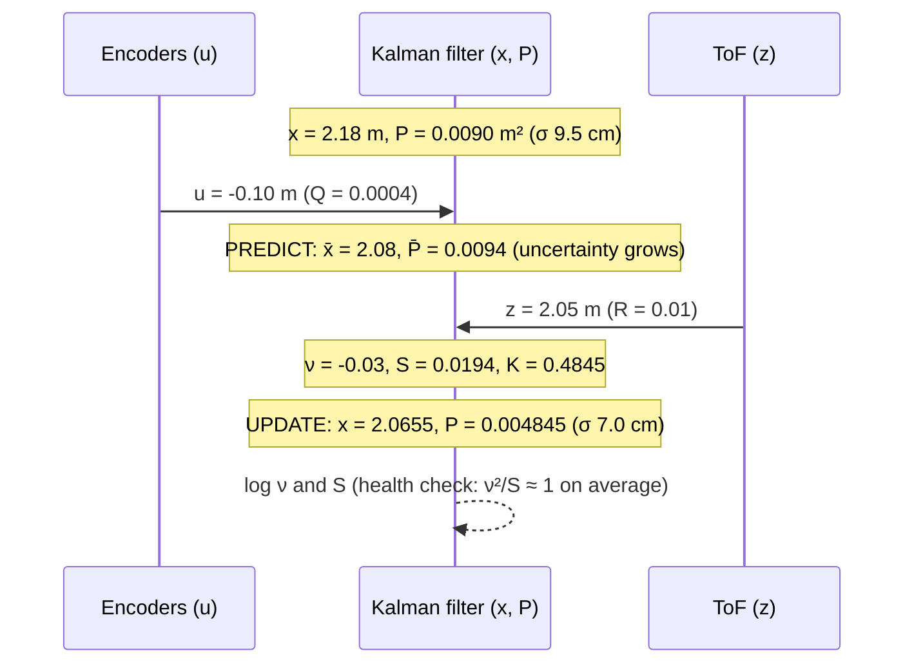

# 10.04 — The Kalman filter in 1D — numbers first

<!-- glance:start -->
<!-- generated by tools/build.py from curriculum/syllabus.yaml — edit the syllabus, not this block -->

| | |
|---|---|
| **Track** | Main path |
| **Difficulty** | Intermediate |
| **Time** | 1 h |
| **Hardware** | none |
| **Software** | python |
| **Prerequisites** | [10.03 The Bayes filter — predict and update on a 1D grid](10.03-bayes-filter.md) |
| **Skip if** | You know Kalman filters already — take the knowledge check and move on. |

<!-- glance:end -->

## What you will learn

- Run a 1D Kalman filter by hand: predict ($x \mathrel{+}= u$, $P \mathrel{+}= Q$) and update ($K = P/(P+R)$, $x \mathrel{+}= K\nu$, $P \mathrel{\times}= 1-K$), with every number.
- Explain the Kalman gain as a trust ratio, and derive it as the weight that minimises the posterior variance.
- Fuse wheel odometry and a noisy ToF sensor on the simulated robot so that the estimate beats the sensor by 5×.
- Tune Q and R with experiments, predict the steady-state gain from Q/R, and read the innovation to detect a biased model.
- Implement a tested `KalmanFilter1D` that the multivariate filter of 10.05 generalizes.

## Why it matters

karmel's front ToF sensor (VL53L1X) sees the wall ahead with centimetre noise; an ultrasonic sensor is
worse. Its wheel encoders know how far it drove to the millimetre over a metre — but not where it
started, and not if a wheel radius is off. Neither alone is good enough to stop 5 cm from a wall or to
dock. Together, weighted correctly, they are.

"Weighted correctly" is the whole Kalman filter. It is the most used estimator in engineering: every
IMU attitude filter, `robot_localization` ([10.07](10.07-fusing-imu-and-odometry.md)), GPS receivers,
the EKF of [10.06](10.06-extended-kalman-filter.md). Its equations look intimidating in matrix form
([10.05](10.05-kalman-filter-multivariate.md)); in 1D every symbol is a number you can check on a
calculator. Most real-world Kalman bugs — a variance typed as a standard deviation, a Q that makes the
filter ignore a biased odometry, an estimate that looks smooth but is 3 cm off — can be understood and
seen in 1D. Do them here, with numbers, before the matrices hide them.

<!-- prereqs:start -->
## Prerequisites

You need these first:

- [10.03 The Bayes filter — predict and update on a 1D grid](10.03-bayes-filter.md)

### Optional prerequisite links

None.

Check your readiness: `python course.py why 10.04`
<!-- prereqs:end -->

> [!NOTE]
> This lesson uses the Gaussian product from FM.16 (Level 4, "two Gaussians") and variances from FM.14. If $\mathcal{N}(\mu, \sigma^2)$ or "information adds" is new → [FM.14](../optional-foundations/mathematics/FM.14-distributions-gaussians-noise.md), [FM.16](../optional-foundations/mathematics/FM.16-bayes-rule.md).

## Concept

karmel believes the wall is 2.0 m away, give or take 30 cm (its map is rough). The ToF sensor reads
2.2 m, give or take 10 cm. What should it believe now?

Not 2.0 (ignoring a good sensor) and not 2.2 (ignoring what it knew). Something in between, closer to
the more trustworthy source. The sensor is 3× more precise (10 cm vs 30 cm), which in *variance* terms
is 9× (0.01 vs 0.09 m²). So the new estimate should move 9/10 of the way toward the reading: **2.18 m**.
And it should be *more* certain than either source alone, because two independent pieces of evidence
agree roughly: **±9.5 cm**. That fraction, 0.9, is the **Kalman gain**. That's the update step.

Then karmel drives 10 cm toward the wall. Odometry says "subtract 10 cm", so the estimate becomes
2.08 m. But odometry is not perfect either, so the uncertainty grows a little. That's the predict step.

Repeat forever: predict with odometry (estimate moves, uncertainty grows), update with the sensor
(estimate pulled toward the reading by the gain, uncertainty shrinks). The gain adapts by itself:
when the estimate is uncertain it trusts the sensor; after many readings, when the estimate is tight,
each new noisy reading nudges it only a little. The filter becomes a smart moving average whose window
length is set by how much you trust odometry (Q) versus the sensor (R).

Two quantities do the diagnostic work. The **innovation** ν = reading − prediction is the surprise. Its
expected size, $S = P + R$, says how big the surprise *should* be. If the surprises are consistently
bigger, or consistently on one side, the filter's model of the world is wrong — no matter how smooth its
output looks.

> [!TIP]
> **Ask your teacher:** "Explain the Kalman gain without equations, as a trust ratio between two colleagues who estimate the same thing, then with the 2.0 m / 2.2 m wall numbers."

## Technical explanation

### Level 1 — Intuition: a weighted average with a memory

The update is a weighted average of prediction and measurement,
$x = (1 - K)\,\bar{x} + K z$, with the weight $K$ between 0 and 1. The prediction carries the memory of all
previous readings (moved by odometry). Uncertainty $P$ is the bookkeeping that decides the weight: large
$P$ → weight on the new reading; small $P$ → weight on the memory. Predict adds $Q$ to $P$ ("my memory
is getting stale"); update multiplies $P$ by $(1-K)$ ("I just learned something").

### Level 2 — Practical: the filter on the simulated robot

The model (state = distance from the ToF sensor to the wall, metres):

| | Equation | karmel |
|---|---|---|
| motion | $x_k = x_{k-1} + u_k + w_k$, $w_k \sim \mathcal{N}(0, Q)$ | $u_k = -\Delta s_k$, distance driven since last step from encoders |
| measurement | $z_k = x_k + v_k$, $v_k \sim \mathcal{N}(0, R)$ | front ToF, here σ = 3 cm (a noisy ToF / ultrasonic), $R = 9\times10^{-4}$ m² |

[`labs/exercises/10.04/wall_sim.py`](../labs/exercises/10.04/wall_sim.py) (provided) drives the realistic
simulated karmel from 3.37 m to 1.21 m from the wall in 12 s (accelerate, cruise at 0.3 m/s, slow to 0.1 m/s,
stop) and logs `controls`, `measurements` (ToF, 20 Hz) and `truth`. The first three filter steps of
[`code/kf1d_wall.py`](code/kf1d_wall.py), starting from a deliberately bad guess $x_0 = 3.0$ m, $P_0 = 1$ m²,
with $Q = 10^{-6}$ m² per step:

```text
 k  u (mm)   x_pred     P_pred       z       nu          S       K        x          P   truth
 0   -0.11   2.9999   1.000001  3.3781   0.3782   1.000901  0.9991   3.3778   0.000899  3.3748
 1   -0.57   3.3772   0.000900  3.3967   0.0195   0.001800  0.5001   3.3870   0.000450  3.3743
 2   -1.09   3.3859   0.000451  3.3361  -0.0498   0.001351  0.3339   3.3693   0.000300  3.3731
```

- **Step 0.** $P$ is huge, so $K = 1/(1 + 0.0009) = 0.9991$: the filter essentially adopts the first reading.
  $P$ drops from 1 m² to $0.0009$ m² — exactly one sensor reading's variance.
- **Step 1.** Prediction and measurement are now equally uncertain ($P \approx R$), so $K = 0.5$: average them. $P$ halves.
- **Step 2.** $K = 1/3$: the filter now holds the equivalent of two readings of memory. The reading 3.336 is 5 cm
  low (1.7σ of the sensor noise); the estimate moves only 1.7 cm. After 3 steps the estimate is 4 mm from the
  truth while the last reading was 37 mm off.

Over the whole run (seed 5):

```text
2) Seed 5: ToF alone RMSE 28.0 mm | Kalman RMSE 4.5 mm (final sigma 5.4 mm, steady-state K = 0.0328)
   odometry alone, told the TRUE start: RMSE 1.9 mm; with a 5% wheel-radius error: 74.8 mm
```

The filter is 6× better than its sensor. Odometry alone looks even better (1.9 mm) — but only because the
script *gave* it the true starting distance, which a real robot does not have, and only because this
simulated robot's wheels are well calibrated. With a 5 % wheel-radius error odometry alone has a
75 mm RMSE. The filter needs neither the start nor perfect calibration, as long as Q admits that odometry can
be wrong (experiment 3a below).

### Level 3 — Mathematics

**Predict.** Adding independent Gaussians adds means and variances (FM.14):

$$\bar{x}_k = x_{k-1} + u_k, \qquad \bar{P}_k = P_{k-1} + Q$$

**Numerical example.** $x = 2.18$ m, $P = 0.009$ m²; drive 10 cm toward the wall ($u = -0.10$) with odometry
noise σ = 2 cm ($Q = 0.0004$): $\bar{x} = 2.08$ m, $\bar{P} = 0.0094$ m² (σ grows from 9.49 to 9.70 cm).

**Update.** Define the innovation and its variance, then the gain:

$$\nu_k = z_k - \bar{x}_k, \qquad S_k = \bar{P}_k + R, \qquad K_k = \frac{\bar{P}_k}{S_k}$$

$$x_k = \bar{x}_k + K_k\,\nu_k, \qquad P_k = (1 - K_k)\,\bar{P}_k$$

**Numerical example.** Continue: ToF reads $z = 2.05$ m, $R = 0.01$ (σ = 10 cm). $\nu = -0.03$ m,
$S = 0.0194$, $K = 0.0094/0.0194 = 0.4845$, $x = 2.08 - 0.4845 \cdot 0.03 = 2.0655$ m,
$P = 0.5155 \cdot 0.0094 = 0.004845$ m² (σ = 6.96 cm).

**Why this K? Minimum variance.** Any weighted average $x = (1-K)\bar{x} + Kz$ of two independent estimates has
error variance

$$P(K) = (1-K)^2\,\bar{P} + K^2 R \quad\Rightarrow\quad \frac{dP}{dK} = -2(1-K)\bar{P} + 2KR = 0 \quad\Rightarrow\quad K = \frac{\bar{P}}{\bar{P} + R}$$

**Numerical example.** $\bar{P} = 0.09$, $R = 0.01$: $P(0.8) = 0.04 \cdot 0.09 + 0.64 \cdot 0.01 = 0.0100$;
$P(0.9) = 0.0009 + 0.0081 = 0.0090$; $P(0.95) = 0.000225 + 0.009025 = 0.00925$; $P(1.0) = 0.0100$. The minimum is at
$K = 0.9$, and plugging it back gives $P = (1-K)\bar P$ — the update formula. It is also exactly the product of the
two Gaussians of FM.16 (information adds: $1/P = 1/\bar{P} + 1/R = 11.1 + 100$, $P = 0.009$). Three derivations,
one answer: under Gaussian noise the Kalman filter is the exact Bayes filter; under any noise with these
variances it is the best *linear* estimator.

**The gain depends only on Q/R — and settles.** Note that $P$ and $K$ never look at the values of $z$ or $u$. With
constant $Q$ and $R$ the predicted variance converges to a fixed point $M$ where predict and update balance:
$M = \frac{MR}{M+R} + Q$, i.e. $M^2 = QM + QR$:

$$M = \frac{Q + \sqrt{Q^2 + 4QR}}{2}, \qquad K_\infty = \frac{M}{M + R}, \qquad P_\infty = K_\infty R$$

**Numerical example.** $Q = 10^{-6}$, $R = 9\times10^{-4}$: $M = 3.05\times10^{-5}$, $K_\infty = 0.0328$,
$P_\infty = 2.95\times10^{-5}$ m² (σ = 5.4 mm). $1/K_\infty \approx 30$: the filter behaves like an exponential moving
average over about 30 readings — 1.5 s at 20 Hz. Multiply Q and R by the same factor and $K_\infty$ is unchanged
(for $Q = R$: $K_\infty = 0.618$, the inverse golden ratio). **Q/R sets the smoothing; the absolute values set the
reported uncertainty.** That's why tuning has two parts: get the ratio right for good estimates, and the scale right
for honest σ.

**Q depends on the time step.** If odometry error is a random walk with $q$ m² per second, then $Q = q\,\Delta t$.
**Numerical example.** 1 mm σ per 50 ms step → $q = (0.001)^2 / 0.05 = 2\times10^{-5}$ m²/s. Running the same filter at
100 Hz needs $Q = 2\times10^{-5} \cdot 0.01 = 2\times10^{-7}$ per step, not $10^{-6}$ — otherwise the filter at 100 Hz
trusts odometry 5× less than the one at 20 Hz for the same robot.

**Tuning experiments** (from `kf1d_wall.py`, same log, R = 9e-4; RMSE after the first second; mean ν = average innovation):

```text
3a) Q sweep (R = 9e-4).        correct odometry          |   odometry 5% short
       Q    K_ss |  RMSE mm mean nu mm |  RMSE mm mean nu mm
   0e+00  0.0000 |      3.7       3.77 |     37.9     -32.84
   1e-08  0.0033 |      3.6       3.67 |     36.8     -31.95
   1e-07  0.0105 |      3.6       2.97 |     30.4     -26.24
   1e-06  0.0328 |      4.5       1.29 |     16.4     -12.72
   3e-06  0.0561 |      5.6       0.72 |     11.8      -7.79
   1e-05  0.1000 |      7.4       0.42 |      9.9      -4.38
   1e-04  0.2824 |     12.7       0.34 |     13.0      -1.35
   1e-03  0.6360 |     20.1       0.34 |     20.1      -0.41
   1e-02  0.9233 |     26.2       0.34 |     26.2      -0.18
```

Read it:

- **Correct odometry:** smaller Q is better, down to "trust odometry completely" — the filter then averages *all*
  readings, and $0.03/\sqrt{240} = 1.9$ mm is the floor. Large Q → K near 1 → the estimate is just the noisy sensor (26 mm).
- **Odometry 5 % short** (a wrong wheel radius in `karmel.yaml`): with tiny Q the filter believes the biased odometry and
  ends 3–4 cm off — worse than the raw sensor (28 mm). The RMSE-vs-Q curve is U-shaped with its minimum near
  $Q = 10^{-5}$: enough process noise to let the sensor correct the drift, not so much that the noise gets through.
- **The innovation tells you which case you are in, without ground truth.** With the biased odometry and small Q the
  mean innovation is −33 mm: the sensor *consistently* reads less than predicted. A healthy filter's innovations
  average ≈ 0. On a real robot, a persistent innovation bias means "fix the model" (calibrate the wheel, 09.05)
  before "increase Q".

```text
3b) R sweep (true sensor sigma 3 cm, Q = 1e-6, correct odometry)
   assumed sigma  0.3 cm: RMSE  12.7 mm, filter's own sigma   1.6 mm, errors inside +/-2 sigma  19.5%
   assumed sigma  1.0 cm: RMSE   7.2 mm, filter's own sigma   3.1 mm, errors inside +/-2 sigma  59.5%
   assumed sigma  3.0 cm: RMSE   4.5 mm, filter's own sigma   5.4 mm, errors inside +/-2 sigma 100.0%
   assumed sigma 10.0 cm: RMSE   3.6 mm, filter's own sigma  10.1 mm, errors inside +/-2 sigma 100.0%
   assumed sigma 30.0 cm: RMSE   4.0 mm, filter's own sigma  21.2 mm, errors inside +/-2 sigma 100.0%
```

Assuming the sensor is better than it is (0.3 cm) makes the filter both noisier (12.7 mm) *and* dishonest: it claims
σ = 1.6 mm while only 19.5 % of its errors are inside ±2σ. Assuming it worse (10–30 cm) happens to give a smooth estimate
here (the odometry is excellent), but the reported σ is 2–4× too pessimistic, and with biased odometry the same choice
would lag (Exercise E5). The honest R (the sensor's real σ²) is the one where the reported σ matches the errors.

### Level 4 — Implementation

```python
class KalmanFilter1D:
    """x_k = x_{k-1} + u + w (var Q);  z = x + v (var R).  All Q, R, P are VARIANCES."""

    def __init__(self, x0: float, P0: float) -> None:
        self.x, self.P = float(x0), float(P0)
        self.K = self.nu = self.S = None      # last update, for diagnostics

    def predict(self, u: float = 0.0, Q: float = 0.0) -> tuple[float, float]:
        self.x += u
        self.P += Q
        return self.x, self.P

    def update(self, z: float, R: float) -> tuple[float, float]:
        self.nu = z - self.x                  # innovation, BEFORE changing x
        self.S = self.P + R
        self.K = self.P / self.S
        self.x += self.K * self.nu
        self.P *= 1.0 - self.K
        return self.x, self.P


kf = KalmanFilter1D(2.0, 0.09)
print(kf.update(2.2, 0.01))          # wall example
print(kf.predict(-0.10, 0.0004))
print(kf.update(2.05, 0.01), round(kf.K, 4))
```

Output:

```text
(2.18, 0.008999999999999998)
(2.08, 0.009399999999999997)
(2.065463917525773, 0.004845360824742268) 0.4845
```

Practical rules:

- **Store and log `nu` and `S`.** They are the only health signal available on the real robot. `nu**2 / S` should average 1
  (it is the NIS of [10.05](10.05-kalman-filter-multivariate.md)).
- **Missing measurement → skip the update, still predict.** `SimBase` reports `range_m = None` when the ToF has no valid
  reading; the uncertainty then grows until the next reading.
- **Initialise honestly.** A huge $P_0$ lets the first reading take over (step 0 above); a tiny wrong $P_0$ makes the filter
  ignore the sensor for a long time.
- **Reject impossible readings before the update**, e.g. $\nu^2 / S > 9$ (3σ) for a sensor that produces outliers
  (ultrasonic ghost echoes, [07.03](../07-sensors/07.03-ultrasonic-sensors.md)). The Kalman filter has no outlier resistance of its own.
- **Q and R per step, in SI units squared.** A variance typed as a σ is the most common Kalman bug there is.

## Diagram



```text
 The update as a product of two bells (numbers from the wall example)

   prior       N(2.00, 0.30^2)      ___________________
                                  _/                   \_
   sensor      N(2.20, 0.10^2)                  /\
                                               /  \
   posterior   N(2.18, 0.095^2)               /\  \    <- narrower than both, 9/10 of the way to z
                                             /  \
  -----+---------+---------+---------+---------+---------+----> distance to wall (m)
      1.6       1.8       2.0       2.2       2.4       2.6
                          prior     |  z
                          mean     2.18 = 2.00 + 0.9 * (2.20 - 2.00)
```

## Code

- Exercise (auto-graded): [`labs/exercises/10.04/`](../labs/exercises/10.04/README.md) — `student.py`, with the provided
  simulator log in `wall_sim.py`.
- Experiment: [`code/kf1d_wall.py`](code/kf1d_wall.py), tested by `python -m pytest 10-localization/code`.

```bash
python 10-localization/code/kf1d_wall.py              # your filter from labs/exercises/10.04/student.py
python 10-localization/code/kf1d_wall.py --solution   # the reference
python 10-localization/code/kf1d_wall.py --solution --seed 1
```

It prints the tables of this lesson and writes:

- `localization_out/kf1d_run.png` — top: grey ToF dots scattered ±3 cm around the black truth line, the blue estimate
  hugging the truth with a shaded ±2σ band that is wide at t = 0 and shrinks to about ±1 cm within a second; bottom:
  the gain K on a log scale, falling from 1 to about 0.03 and flattening.
- `localization_out/kf1d_q_sweep.png` — RMSE against Q on log-log axes: the "correct odometry" curve rises with Q, the
  "5 % short" curve is a U with its minimum near $10^{-5}$, both meeting the "ToF alone" dashed line at large Q.

The whole filter loop over a log:

```python
# labs/exercises/10.04/solution.py (run_kf_1d)
kf = KalmanFilter1D(x0, P0)
for u, z in zip(controls, measurements):
    kf.predict(u, Q)
    if z is not None:          # no valid ToF reading this step: predict only
        kf.update(z, R)
    xs.append(kf.x)
    Ps.append(kf.P)
```

## Exercise

All exercises need hardware: **none**. (On the real robot the same filter runs on `BaseState.range_m` and the encoder ticks;
the `robot-base` lessons of module 09 give you those.)

### Exercise 10.04-E1 — Two cycles on a calculator `[numerical]`

Goal: execute the equations without code. karmel believes the wall is at 1.50 m with σ = 5 cm. (a) The ToF reads 1.43 m with
σ = 2 cm: compute ν, S, K, x, P. (b) It drives 20 cm toward the wall; odometry σ = 1 cm: predict. (c) The ToF reads 1.26 m (σ = 2 cm):
update. Give the final estimate and its σ in cm.

### Exercise 10.04-E2 — Implement KalmanFilter1D `[coding]`

Goal: a tested filter for the rest of the module. Implement `kalman_gain`, `steady_state_gain`, `KalmanFilter1D` and `run_kf_1d` in
`labs/exercises/10.04/student.py`. The tests use hand-computed steps, invariants (K in [0, 1], P never grows in an update), the
steady-state formula, and two simulated drives where your filtered RMSE must be below half the sensor's.

Check it: `python course.py check 10.04`

### Exercise 10.04-E3 — Predict the Q sweep `[predict]`

Goal: build tuning intuition before seeing data. Run `kf1d_wall.py --solution --seed 1`, but **before** looking at section 3a
write down, for correct odometry and for 5 % short odometry: which of Q = 0, 1e-6 and 1e-2 gives the lowest RMSE, which the highest,
and the sign of the mean innovation with Q = 0 and short odometry. Then compare.

### Exercise 10.04-E4 — Honest σ `[simulation]`

Goal: tell a good estimate from an honest one. Using `run_kf_1d` on `wall_sim.drive_to_wall(5, range_noise_std_m=0.03)` with correct
odometry and $Q = 10^{-6}$, find the smallest assumed sensor σ for which at least 90 % of the errors (after the first second) lie within
±2σ of the filter's own P. Repeat for `range_noise_std_m=0.01` (a good VL53L1X). What is the relation between the answer and the true sensor σ?

### Exercise 10.04-E5 — σ where a variance belongs `[debugging]`

Goal: find the most common Kalman bug by its symptoms. A teammate's filter uses `R = 0.03` "because the sensor is ±3 cm" and
`Q = 1e-6`. On the robot with the 5 %-short odometry it "works but lags": the estimate is 3 cm off when the robot stops. (a) What
are the steady-state gains with their R and with the correct R? (b) Using `run_kf_1d` on seed 5 with controls × 0.95, give the RMSE and
final error for both. (c) Why does the filter's own σ not warn you in the buggy version?

## Expected result

- **10.04-E1:** (a) $\bar{P} = 0.0025$, $R = 0.0004$: ν = −0.07 m, S = 0.0029, K = 0.8621, x = 1.4397 m, P = 0.000345 m² (σ 1.86 cm).
  (b) x̄ = 1.2397 m, P̄ = 0.000445 m² (σ 2.11 cm). (c) ν = +0.0203 m, S = 0.000845, K = 0.5265, x = 1.2504 m, P = 0.000211 m² (**σ 1.45 cm**).
- **10.04-E2:** `python course.py check 10.04` → `13 passed`, no skips. On the simulated drives the reference reaches about 7 mm RMSE
  against the ToF's 28–31 mm.
- **10.04-E3:** Seed 1 behaves like seed 5: correct odometry — Q = 0 lowest (≈ 7 mm; the sensor noise of seed 1 happens to average
  −7 mm, which caps it), Q = 1e-2 highest (≈ 29 mm); 5 % short — Q = 1e-6 lowest of the three (≈ 9 mm), Q = 0 about 33 mm and Q = 1e-2
  about 29 mm; mean innovation with Q = 0 and short odometry clearly **negative** (≈ −38 mm): the robot is closer to the wall than the
  biased odometry predicts, so readings come in below the prediction.
- **10.04-E4:** With σ_true = 3 cm: assumed 1.5 cm → 80 %, 2 cm → 87.7 %, 2.5 cm → 95.5 %, so the threshold is between 2 and 2.5 cm; with
  σ_true = 1 cm it moves down proportionally (0.7 cm gives 90.5 %). The honest assumed σ is close to (slightly below, because the odometry here
  is better than the model says) the true sensor σ — a filter tuned for smooth output is not automatically tuned for honest σ.
- **10.04-E5:** (a) $K_\infty(Q{=}10^{-6}, R{=}0.03) = 0.0058$ vs $K_\infty(R{=}9\times10^{-4}) = 0.0328$ — 5.7× less trust in the sensor.
  (b) Buggy R: RMSE 34.9 mm, final error +32 mm; correct R: RMSE 16.4 mm, final error +1 mm. (c) P depends only on Q and R, never on the
  data: the buggy filter reports σ = 14 mm while it is 32 mm off. Only the innovation (mean ≈ −3 cm, and $\nu^2/S$) or ground truth reveal it.

## Troubleshooting

### Symptom: the estimate is smooth but consistently off by centimetres

1. Log the innovation ν. Mean clearly non-zero (more than $\sqrt{S/N}$ over N samples)? The model is biased.
2. Check odometry calibration: compare total odometry distance with a tape measure (09.05). A few percent explains centimetres.
3. Check the sensor for bias: park at a measured distance and average 200 readings; ToF sensors have offsets that depend on target colour.
4. Only if both are unbiased: Q is too small for the real motion (e.g. wheel slip at starts and stops). Increase Q until the innovation mean
   is near zero, and re-check RMSE.

### Symptom: the estimate is as noisy as the raw sensor

1. Print K after a few seconds. Near 1 means Q ≫ R or R is far too small.
2. Check units: R in m² (a 3 cm sensor is 9e-4, not 0.03 and not 3), Q per *step*, and whether the loop rate changed since you tuned Q.
3. Check that predict is actually called every step with the odometry increment, not the cumulative distance (which would jump the
   prediction far away and force K → 1 through huge innovations).

### Symptom: the filter ignores the sensor after a while, even when it is clearly right

1. Is Q = 0? Then P → 0 and K → 0: the filter has "learned" the answer and stops listening. Any real system needs Q > 0.
2. Did an outlier get rejected and then all later readings too? A gate on $\nu^2/S$ with a too-small P rejects everything after the
   estimate drifts. Log rejections; re-initialise P when many consecutive readings are rejected.
3. Is P₀ tiny while x₀ is wrong? Start with an honest P₀.

## Common mistakes

- **Using σ where a variance belongs** (R = 0.03 for a 3 cm sensor). K is off by the square, and nothing crashes.
- **Computing ν after updating x.** The innovation must use the *prediction*; afterwards it is just $(1-K)\nu$ and hides bias.
- **Q = 0 "because odometry is good".** P shrinks to zero, K to zero, and any bias becomes permanent.
- **Tuning only for smooth plots.** A filter can be smooth and wrong; check the innovation mean and the fraction of errors inside ±2σ.
- **Keeping Q when the loop rate changes.** Q is per step; scale it with Δt.
- **Feeding cumulative odometry as u.** u is the *increment* since the last predict.
- **No outlier handling.** One ultrasonic ghost echo 2 m long moves the estimate by K × 2 m.

## Knowledge check

1. Prior $\mathcal{N}(1.00, 0.04)$ m², measurement 1.10 m with R = 0.01. Compute K, the posterior mean and posterior σ.
   <details><summary>Answer</summary>

   K = 0.04/0.05 = 0.8. x = 1.00 + 0.8·0.10 = 1.08 m. P = 0.2·0.04 = 0.008 m², σ = 8.9 cm.
   </details>

2. Q = 1e-4, R = 1e-2. What gain does the filter converge to, and roughly how many readings does its "memory" span? What happens to K if you multiply both Q and R by 100?
   <details><summary>Answer</summary>

   $M = (10^{-4} + \sqrt{10^{-8} + 4\cdot10^{-6}})/2 = 1.051\times10^{-3}$, $K_\infty = M/(M + R) = 0.0951$ — a memory of about 1/K ≈ 10 readings.
   Scaling both by 100 leaves K unchanged (only Q/R matters); the reported P scales by 100.
   </details>

3. Predict: odometry under-reports distance by 5 %, and you set Q = 0. After driving 2 m toward a wall, what does the estimate do, and what does the innovation sequence look like?
   <details><summary>Answer</summary>

   The estimate trusts the biased odometry more and more (K → 0) and lags: it ends several centimetres too far from the wall (≈ 3 cm in the lesson's
   run). The innovations are consistently negative (readings below predictions), growing in magnitude as the bias accumulates — a clear
   signature of model bias.
   </details>

4. Why can you compute the whole sequence of P and K before the robot drives? What does that imply about using P to detect problems?
   <details><summary>Answer</summary>

   P and K depend only on P₀, Q, R and which steps have measurements — never on the values of z or u. So P cannot know that the data disagree with
   the model; a filter can report σ = 5 mm while being 3 cm off. Detection needs the innovations (ν, and ν²/S) or ground truth.
   </details>

5. The ToF returns no reading for 1 s (20 steps) at Q = 1e-6. What happens to x and P during the gap and at the first reading after it?
   <details><summary>Answer</summary>

   x follows odometry only; P grows linearly by 20·1e-6 = 2e-5 m² (from ~2.95e-5 to ~4.95e-5). At the first reading K is larger than the
   steady-state value (4.95e-5/(4.95e-5 + 9e-4) = 0.052 vs 0.033) — the filter trusts the sensor a bit more after the gap.
   </details>

6. Two readings of the same wall, 1.00 m and 1.20 m, each with R = 0.04, arrive with no motion in between, starting from P₀ = 10⁶. Result?
   <details><summary>Answer</summary>

   x = 1.10 m, P = 0.02 m²: the average, with half the variance of one reading (information adds: 1/0.04 + 1/0.04 = 50).
   </details>

7. Debugging: a filter works at 20 Hz. A teammate raises the loop to 100 Hz with the same Q and R, and the estimate becomes noticeably noisier. Why, and what is the fix?
   <details><summary>Answer</summary>

   Q is per step. Five times as many predicts add five times the process noise per second, so P stays larger, K is larger and more sensor noise
   gets through. Scale Q with Δt: Q₁₀₀ = Q₂₀ · (0.01/0.05) = Q₂₀/5. (R stays: it is per reading.)
   </details>

8. What is the innovation variance S, and what should the average of ν²/S be for a well-tuned filter?
   <details><summary>Answer</summary>

   S = P̄ + R is the variance the filter expects the innovation to have (uncertainty of the prediction plus of the sensor). For a consistent filter
   ν²/S averages 1; much larger means over-confident (Q or R too small, or a biased model), much smaller means under-confident.
   </details>

## Practical challenge

Fuse **two range sensors** of different quality into one distance estimate, and add outlier rejection.

Acceptance criteria:
- Create a log with `wall_sim.drive_to_wall(seed, range_noise_std_m=0.01)` (a VL53L1X) and a second, synthetic ultrasonic reading
  per step: truth + 1 cm bias + σ 3 cm noise + a 2 % chance of a ghost echo (a reading of 3.5 m).
- Your filter applies two sequential updates per step (one per sensor) with their own R, and rejects readings with ν²/S > 9 (log how many).
- The state stays 1D: calibrate the ultrasonic bias beforehand from 2 s of readings at a known distance (generate them the same way), and
  subtract it before the update.
- On 5 seeds: RMSE below 60 % of the VL53L1X-only filter's RMSE is *not* required (the ultrasonic is worse); what is required is that the fused
  filter is **never worse by more than 10 %** than the VL53L1X-only filter, that no ghost echo moves the estimate by more than 1 cm, and that the
  mean innovation of each sensor is within ±3 mm. Explain in a paragraph why adding a worse sensor still helps when the better one drops out.

## You can skip this if…

You know Kalman filters already — then prove it quickly: answer knowledge-check questions 2, 3, 4 and 7 correctly **without looking**, compute
Exercise E1 on paper within 10 minutes, and pass `python course.py check 10.04`. If any of these takes you longer, the lesson will pay for itself.
Then:

`python course.py skip 10.04 --reason "passed 1D Kalman knowledge check, E1 by hand and the checker"`

## Go deeper

- https://kalmanfilter.net/ — Alex Becker's numerical, step-by-step introduction: the same "numbers first" approach, with 1D examples before matrices.
- https://github.com/rlabbe/Kalman-and-Bayesian-Filters-in-Python — Labbe, chapters "One Dimensional Kalman Filters" and "Designing Kalman Filters": interactive tuning experiments.
- https://www.cs.utexas.edu/~pstone/Courses/393Rfall15/readings/Welch+Bishop-TR-95.pdf — Welch & Bishop, "An Introduction to the Kalman Filter": the classic short tutorial, including a 1D example and tuning discussion (course mirror of the UNC report).
- https://doi.org/10.1115/1.3662552 — R. E. Kalman, "A New Approach to Linear Filtering and Prediction Problems" (1960): the original paper, for historical depth.
- https://www.youtube.com/playlist?list=PLMrJAkhIeNNR20Mz-VpzgfQs5zrYi085m — Steve Brunton's Control Bootcamp: the Kalman filter from the state-space/control point of view.
- https://mitpress.mit.edu/9780262201629/probabilistic-robotics/ — *Probabilistic Robotics*, chapter 3.2: the Kalman filter derived as a Bayes filter.

## Progress checkpoint

- [ ] I can run predict and update by hand and explain every number.
- [ ] I can explain the Kalman gain as a trust ratio and derive it from minimum variance.
- [ ] My `KalmanFilter1D` passes `python course.py check 10.04` and beats the ToF on the simulated robot.
- [ ] I can predict the steady-state gain from Q/R and tune Q and R with experiments.
- [ ] I can detect a biased model from the innovations, even when the output looks smooth.

`python course.py complete 10.04` (exercises done) · `python course.py master 10.04` (challenge done) · `python course.py struggle 10.04 "what was hard"`

Next: [10.05 — The multivariate Kalman filter](10.05-kalman-filter-multivariate.md).
