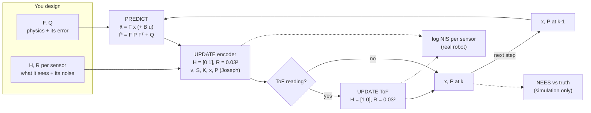

# 10.05 — The multivariate Kalman filter

<!-- glance:start -->
<!-- generated by tools/build.py from curriculum/syllabus.yaml — edit the syllabus, not this block -->

| | |
|---|---|
| **Track** | Main path |
| **Difficulty** | Advanced |
| **Time** | 1 h 15 min |
| **Hardware** | none |
| **Software** | python, numpy |
| **Prerequisites** | [10.04 The Kalman filter in 1D — numbers first](10.04-kalman-filter-1d.md) |
| **Optional prerequisites** | [FM.07 Matrices and matrix multiplication](../optional-foundations/mathematics/FM.07-matrices.md)<br>[FM.15 Covariance and multivariate Gaussians](../optional-foundations/mathematics/FM.15-covariance-multivariate-gaussians.md) |
| **Skip if** | You can write the KF predict/update equations from memory and explain each term. |

<!-- glance:end -->

## What you will learn

- Write a linear state-space model: choose the state $\mathbf{x}$, derive $F$ and $Q$ for constant velocity, and pick $H$ and $R$ for each sensor.
- Explain every term of the predict and update equations by mapping it to its 1D counterpart, then use them precisely with matrices.
- Show with numbers how a position-only sensor also corrects velocity through the covariance, and when a state is not observable at all.
- Fuse two asynchronous sensors (ToF position, encoder speed) on the simulated robot with sequential updates.
- Test a filter for consistency with NEES (simulation) and NIS (real robot), with chi-square bounds, and recognise over- and under-confidence.

## Why it matters

A robot's state is never one number. karmel's pose is $(x, y, \theta)$; its velocity matters for
prediction; an IMU adds a gyro bias worth estimating. The quantities are coupled: a heading error
becomes a position error, a velocity error becomes a position error one step later. The 1D filter of
[10.04](10.04-kalman-filter-1d.md) cannot represent that coupling; the matrix version can, and the
coupling is exactly what lets a position sensor improve a velocity estimate it never measures.

This lesson is the direct foundation of the EKF for karmel with landmarks ([10.06](10.06-extended-kalman-filter.md)),
which is this filter with $F$ and $H$ replaced by Jacobians, and of `robot_localization`
([10.07](10.07-fusing-imu-and-odometry.md)), whose configuration file is essentially a list of $H$
matrices (which sensor measures which state variables) and $R$ values. The consistency tests at the
end are how you know a filter is *honest* — without them a smooth-looking estimate can be confidently
wrong, and every consumer of its covariance (a planner, a docking routine, AMCL's initial pose) is
misled.

<!-- prereqs:start -->
## Prerequisites

You need these first:

- [10.04 The Kalman filter in 1D — numbers first](10.04-kalman-filter-1d.md)

### Optional prerequisite links

New to any of these? Take the foundation lesson first; skip it if you already know it.

- [FM.07 Matrices and matrix multiplication](../optional-foundations/mathematics/FM.07-matrices.md)
- [FM.15 Covariance and multivariate Gaussians](../optional-foundations/mathematics/FM.15-covariance-multivariate-gaussians.md)

Check your readiness: `python course.py why 10.05`
<!-- prereqs:end -->

> [!NOTE]
> This lesson multiplies matrices and propagates covariances. Rusty on $AB$, transpose and inverse? → [FM.07 Matrices](../optional-foundations/mathematics/FM.07-matrices.md) (its $FPF^T$ example is continued here). On covariance matrices and $\Sigma_y = A\Sigma_x A^\top$? → [FM.15](../optional-foundations/mathematics/FM.15-covariance-multivariate-gaussians.md). Skip them if you know them.

## Concept

Extend karmel's state from "distance" to **position and velocity**. Now the filter can predict: if the
robot is at 1.00 m moving at 0.5 m/s, in 0.1 s it will be at 1.05 m. If the velocity is uncertain, the
predicted position becomes uncertain too — and, crucially, the two uncertainties become **linked**: "if
the velocity was really higher than I think, the position is also further than I think".

That link is stored in the off-diagonal entry of the covariance matrix. It pays off at the next
measurement. The ToF says the robot is at 1.10 m, further than the predicted 1.05 m. The filter moves the
position estimate toward 1.10 — and *also raises the velocity estimate a little*, because "further than
expected" is partly explained by "faster than expected". No velocity sensor was involved. That's the
power of the multivariate filter: evidence about one variable flows to every correlated variable.

Four matrices describe the world to the filter:

- **F** — how the state evolves in one step without noise (physics: position += velocity × dt).
- **Q** — how wrong that physics can be per step (unmodelled accelerations, slip).
- **H** — what each sensor measures, as a combination of state variables (ToF: position; encoders: velocity).
- **R** — how noisy each sensor is.

Everything else — the gain, the covariance update — follows mechanically from these. Designing a Kalman
filter *is* choosing the state and these four matrices. The equations are the same for every robot.

The last idea is **consistency**. A filter reports its own uncertainty $P$. It is consistent if the real
errors are as big as $P$ says: not bigger (overconfident — dangerous), not smaller (underconfident —
wasteful). In simulation you know the truth and can measure that directly (NEES). On the real robot you
don't, but you can check whether the *surprises* in the measurements are as big as the filter predicted
(NIS). Both are "should average to the number of dimensions" tests with known statistical bounds.

> [!TIP]
> **Ask your teacher:** "Show me, with the 2×2 numbers of this lesson, why a position measurement changes the velocity estimate. Then set the off-diagonal of P to zero and show me it doesn't."

## Technical explanation

### Level 1 — Intuition: the 1D filter, with matrices in the same places

| 1D (10.04) | Multivariate | What changed |
|---|---|---|
| $\bar x = x + u$ | $\bar{\mathbf{x}} = F\mathbf{x} + B\mathbf{u}$ | the state evolves by physics, not only by an added control |
| $\bar P = P + Q$ | $\bar P = F P F^\top + Q$ | uncertainty is carried through the physics (and becomes correlated) |
| $\nu = z - \bar x$ | $\boldsymbol\nu = \mathbf{z} - H\bar{\mathbf{x}}$ | the sensor sees a *projection* of the state |
| $S = \bar P + R$ | $S = H\bar P H^\top + R$ | uncertainty of that projection, plus sensor noise |
| $K = \bar P / S$ | $K = \bar P H^\top S^{-1}$ | "divide" = multiply by the inverse; $\bar P H^\top$ spreads the correction to correlated states |
| $x = \bar x + K\nu$ | $\mathbf{x} = \bar{\mathbf{x}} + K\boldsymbol\nu$ | same |
| $P = (1 - K)\bar P$ | $P = (I - KH)\bar P$ | same |

If you understood 10.04, you already understand every line. The rest of the lesson is about choosing the
matrices and checking the result.

### Level 2 — Practical: karmel's [x, v] filter with two sensors

State: $\mathbf{x} = [x, v]^\top$ — position along the room (m) and forward speed (m/s) of karmel driving
toward the wall at $x = 4$ m ([`wall_sim.py`](../labs/exercises/10.04/wall_sim.py), same drive as 10.04).
Model: constant velocity with random acceleration (σ_a = 0.3 m/s²), $\Delta t = 0.05$ s.

| Sensor | Measures | $H$ | $R$ | Rate |
|---|---|---|---|---|
| Front ToF, converted with the map: $x = 4.0 - 0.125 - z_{ToF}$ | position | $[1\ \ 0]$ | $0.03^2$ m² | 20 Hz |
| Encoder speed estimate (`BaseState.left_rad_s`, `right_rad_s` × wheel radius, averaged) | velocity | $[0\ \ 1]$ | $0.03^2$ (m/s)² | 20 Hz |

Each step: predict, update with the encoder speed, update with the ToF if it has a reading. Two updates in a
row with different $H$ are fine — sequential updates with independent noise give exactly the same result as
one joint update (shown in Level 3). Results from [`code/kf_multivariate.py`](code/kf_multivariate.py), seed 2:

```text
2) Seed 2, ToF sigma 3 cm at 20 Hz, accel_std 0.3 m/s^2
   ToF alone as a position: RMSE 27.4 mm
   A: ToF only      : position RMSE  12.7 mm, velocity RMSE  3.3 cm/s, NIS(ToF) 0.88, NIS(enc) nan, NEES 1.24
   B: ToF + encoders: position RMSE   8.8 mm, velocity RMSE  1.2 cm/s, NIS(ToF) 0.89, NIS(enc) 0.08, NEES 2.00
```

- Filter A never measures velocity, yet estimates it to 3.3 cm/s — from how positions change over time, through
  the covariance.
- Filter B adds the encoders: velocity error drops to 1.2 cm/s, and because the prediction of position uses the
  better velocity, position improves too (12.7 → 8.8 mm, 3× better than the raw ToF).
- NIS(ToF) ≈ 0.9 (expected 1 for a 1D measurement) and NEES ≈ 2 (expected 2 for a 2D state): the filter's claimed
  uncertainty matches its real errors. NIS(enc) = 0.08 is a warning sign we return to in Level 3.

Compare with 10.04, where a 1D filter used odometry as the *control* $u$. Here the encoders are a *measurement*.
Both designs are legitimate. `robot_localization` ([10.07](10.07-fusing-imu-and-odometry.md)) treats wheel
odometry as a measurement (its pose, its pose changes in `differential` mode, or its twist) and can optionally take
commanded velocities as a control input. Using a sensor as a measurement lets the filter weigh and check it; using it
as a control means trusting it through Q.

### Level 3 — Mathematics

**The model.**

$$\mathbf{x}_k = F\mathbf{x}_{k-1} + B\mathbf{u}_k + \mathbf{w}_k,\ \ \mathbf{w}_k \sim \mathcal{N}(\mathbf{0}, Q) \qquad \mathbf{z}_k = H\mathbf{x}_k + \mathbf{v}_k,\ \ \mathbf{v}_k \sim \mathcal{N}(\mathbf{0}, R)$$

**Constant velocity: F, G and Q.** If acceleration $a$ is constant during a step, kinematics give
$x_k = x + v\Delta t + \tfrac12 a\Delta t^2$ and $v_k = v + a\Delta t$. Without acceleration that is $F$; the
acceleration enters through $G$; with $a \sim \mathcal{N}(0, \sigma_a^2)$ the process noise is $Q = G\sigma_a^2 G^\top$
(FM.15's linear-transformation rule):

$$F = \begin{bmatrix} 1 & \Delta t \\ 0 & 1 \end{bmatrix}, \quad G = \begin{bmatrix} \tfrac12\Delta t^2 \\ \Delta t \end{bmatrix}, \quad Q = \sigma_a^2 \begin{bmatrix} \tfrac14\Delta t^4 & \tfrac12\Delta t^3 \\ \tfrac12\Delta t^3 & \Delta t^2 \end{bmatrix}$$

**Numerical example.** $\Delta t = 0.05$ s, $\sigma_a = 0.3$ m/s²: $G = [0.00125,\ 0.05]^\top$,
$Q = 0.09\cdot\begin{bmatrix} 1.5625\times10^{-6} & 6.25\times10^{-5} \\ 6.25\times10^{-5} & 2.5\times10^{-3} \end{bmatrix} = \begin{bmatrix} 1.406\times10^{-7} & 5.625\times10^{-6} \\ 5.625\times10^{-6} & 2.25\times10^{-4} \end{bmatrix}$.
Per step, velocity σ grows by up to 1.5 cm/s and position by 0.4 mm, perfectly correlated ($\rho = 1$: one
acceleration causes both). This Q is rank 1 — it is still a valid covariance.

If a known acceleration is commanded, it enters as a control with $B = G$: $\bar{\mathbf{x}} = F\mathbf{x} + G a_{cmd}$.

**Predict.**

$$\bar{\mathbf{x}}_k = F\mathbf{x}_{k-1} + B\mathbf{u}_k, \qquad \bar P_k = F P_{k-1} F^\top + Q$$

**Numerical example (FM.07 continued).** $\mathbf{x} = [1.0, 0.5]^\top$, $P = \operatorname{diag}(0.04, 0.01)$, $\Delta t = 0.1$, $Q = 0$ for now:
$\bar{\mathbf{x}} = [1.05, 0.5]^\top$,

$$\bar P = \begin{bmatrix} 1 & 0.1 \\ 0 & 1 \end{bmatrix}\begin{bmatrix} 0.04 & 0 \\ 0 & 0.01 \end{bmatrix}\begin{bmatrix} 1 & 0 \\ 0.1 & 1 \end{bmatrix} = \begin{bmatrix} 0.0401 & 0.001 \\ 0.001 & 0.01 \end{bmatrix}$$

Position variance grew by $\Delta t^2 \sigma_v^2 = 0.0001$, and a covariance of 0.001 appeared: correlation
$\rho = 0.001/\sqrt{0.0401\cdot0.01} = 0.050$. Weak, but it is what the update will use.

**Update.**

$$\boldsymbol\nu = \mathbf{z} - H\bar{\mathbf{x}}, \quad S = H\bar P H^\top + R, \quad K = \bar P H^\top S^{-1}, \quad \mathbf{x} = \bar{\mathbf{x}} + K\boldsymbol\nu, \quad P = (I - KH)\bar P$$

Dimensions with $n$ states and $m$ measurements: $\boldsymbol\nu, \mathbf{z}$: $m$; $H$: $m\times n$; $S, R$: $m\times m$;
$K$: $n\times m$. $\bar P H^\top$ ($n\times m$) is "the covariance between each state variable and the predicted
measurement"; dividing by $S$ turns it into "how much each state should move per unit of surprise".

**Numerical example.** ToF position $z = 1.10$, $H = [1\ \ 0]$, $R = 0.01$:
$\nu = 1.10 - 1.05 = 0.05$; $S = 0.0401 + 0.01 = 0.0501$;
$\bar P H^\top = [0.0401,\ 0.001]^\top$, so $K = [0.8004,\ 0.01996]^\top$;
$\mathbf{x} = [1.05 + 0.8004\cdot0.05,\ 0.5 + 0.01996\cdot0.05] = [1.09002,\ 0.500998]$;

$$P = (I - KH)\bar P = \begin{bmatrix} 0.19960 & 0 \\ -0.01996 & 1 \end{bmatrix}\begin{bmatrix} 0.0401 & 0.001 \\ 0.001 & 0.01 \end{bmatrix} = \begin{bmatrix} 0.008004 & 0.0001996 \\ 0.0001996 & 0.009980 \end{bmatrix}$$

The velocity estimate rose by 1 mm/s and its variance fell slightly (0.01 → 0.00998), although nothing measured
velocity. Set the 0.001 correlation to zero and $K_v = 0$: no transfer.

**Two sensors at once equals two in a row.** With $\bar P = \begin{bmatrix} 0.04010625 & 0.001125 \\ 0.001125 & 0.0125 \end{bmatrix}$
(the same predict with $Q$ for σ_a = 0.5), ToF $z_1 = 1.10$ ($R_1 = 0.01$) and encoder speed $z_2 = 0.45$ ($R_2 = 0.0025$):
the joint update with $H = I$, $R = \operatorname{diag}(0.01, 0.0025)$ gives $\mathbf{x} = [1.08925, 0.45853]$ and
$P = \begin{bmatrix} 8.0009\times10^{-3} & 3.748\times10^{-5} \\ 3.748\times10^{-5} & 2.0826\times10^{-3} \end{bmatrix}$; updating with the ToF and
then the encoder gives identical numbers. Hence asynchronous sensors are easy: update with whatever arrived.

**Observability, in one example.** Measure only velocity ($H = [0\ \ 1]$) for 5 s from $P_0 = I$: the velocity
variance converges to 0.0039, the position variance stays at 1.005 — the filter can never learn where it is
from speeds alone. Measure only position ($H = [1\ \ 0]$, σ = 5 cm): after 5 s σ_x = 3 cm and σ_v = 10 cm/s — velocity
*is* recoverable from positions. Before adding a state, ask which sensor makes it observable.

**Joseph form.** $P = (I-KH)\bar P$ is correct only for the optimal $K$ and, in floating point, slowly loses
symmetry. The algebraically equivalent

$$P = (I - KH)\bar P(I - KH)^\top + K R K^\top$$

is symmetric by construction and positive semi-definite for *any* $K$. In a 3000-step test with a very precise sensor
($R = 10^{-6}$) the short form ends with $\max|P - P^\top| = 10^{-14}$, the Joseph form $2\times10^{-21}$. Small, but
EKFs with poorly conditioned $P$ do blow up from this; use Joseph (or symmetrize) by default.

**Consistency: NEES and NIS.** If the filter is right about its uncertainty, the estimation error
$\mathbf{e} = \mathbf{x}_{true} - \mathbf{x}$ is $\mathcal{N}(\mathbf{0}, P)$, and its normalized squared size

$$\epsilon = \mathbf{e}^\top P^{-1}\mathbf{e} \quad \text{(NEES)} \qquad\text{is}\ \chi^2_n, \text{ mean } n$$

The same holds for the innovation, available without ground truth:

$$\epsilon_\nu = \boldsymbol\nu^\top S^{-1}\boldsymbol\nu \quad \text{(NIS)} \qquad\text{is}\ \chi^2_m, \text{ mean } m$$

**Numerical example.** Error $[0.2, 0.3]$ with $P = \begin{bmatrix} 0.04 & 0.03 \\ 0.03 & 0.09 \end{bmatrix}$: $P^{-1} = \frac{1}{0.0027}\begin{bmatrix} 0.09 & -0.03 \\ -0.03 & 0.04 \end{bmatrix}$,
$\epsilon = (0.09\cdot0.04 - 2\cdot0.03\cdot0.06 + 0.04\cdot0.09)/0.0027 = 1.33$. The first ToF update above: $\epsilon_\nu = 0.05^2/0.0501 = 0.050$.

A single NEES value is very noisy (95 % of $\chi^2_2$ lies in [0.05, 7.38]). Average over $N$ Monte Carlo runs:
$N\bar\epsilon \sim \chi^2_{Nn}$. For $N = 50$, $n = 2$: `scipy.stats.chi2.ppf([0.025, 0.975], 100) / 50` = **[1.48, 2.59]**.
Over a single run of 240 steps, the time average should lie in [1.75, 2.26] if errors were independent in time
(they are not, so treat that as a looser guide). From the script, 50 model-exact runs × 100 steps:

```text
3) Monte Carlo NEES (50 runs x 100 steps, n = 2, 95% band for the average [1.48, 2.59])
   Q x 0.01  : mean NEES  81.87, steps inside band   2.0%  -> OVERconfident
   Q x 1     : mean NEES   2.05, steps inside band  94.0%  -> consistent
   Q x 100   : mean NEES   1.19, steps inside band   7.0%  -> UNDERconfident
```

The correct Q gives 2.05 with 94 % of the steps inside the 95 % band — as close to textbook as it gets. Q 100× too small:
the filter claims errors 6× smaller than they are ($\sqrt{82/2}$). Q 100× too big: NEES 1.19 — errors smaller than claimed.
Note the asymmetry: over-confidence explodes NEES; under-confidence only pushes it down toward the measurement-limited
floor, so under-confidence is easier to miss.

**The encoder trap: when NIS lies.** NIS checks measurements against predictions; it cannot see an error the sensor and
the model share. The simulated encoder speed is low-pass filtered and computed with the nominal wheel radius, so its
errors are small from sample to sample but correlated over seconds:

```text
4) How noisy is the encoder speed? (same run, filter B)
   sigma_v =  1.0 cm/s: NIS(enc) 0.10, NIS(ToF) 0.94, NEES 7.43, position RMSE 10.9 mm
   sigma_v =  3.0 cm/s: NIS(enc) 0.08, NIS(ToF) 0.89, NEES 2.00, position RMSE 8.8 mm
   sigma_v = 10.0 cm/s: NIS(enc) 0.05, NIS(ToF) 0.85, NEES 1.10, position RMSE 9.8 mm
```

NIS(enc) is far below 1 for every choice, which says "the encoder is quieter than you think — lower R". Following that
advice (σ_v = 1 cm/s) makes the filter **overconfident**: NEES 7.4, and position gets *worse*. The honest R for a
time-correlated sensor is larger than its sample-to-sample noise. Rules: use NIS on the real robot to catch gross
mistakes, use NEES in simulation (with a realistic simulator) to set R and Q, and distrust a sensor whose NIS is far
below its dimension.

**Gating.** Reject a measurement when its NIS exceeds $\chi^2_m(0.99)$: 6.63 for $m = 1$, 9.21 for $m = 2$. For the ToF
update above with $S = 0.0501$ that means $|\nu| > \sqrt{6.63\cdot0.0501} = 0.58$ m. [10.06](10.06-extended-kalman-filter.md)
uses the same test to reject wrong landmark associations.

### Level 4 — Implementation

```python
import numpy as np


class KalmanFilter:
    def __init__(self, x0, P0):
        self.x = np.asarray(x0, dtype=float).reshape(-1).copy()
        self.P = np.asarray(P0, dtype=float).copy()
        self.nu = self.S = self.K = None

    def predict(self, F, Q, B=None, u=None):
        self.x = F @ self.x if B is None else F @ self.x + B @ np.atleast_1d(u)
        self.P = F @ self.P @ F.T + Q
        return self.x, self.P

    def update(self, z, H, R):
        z, H, R = np.atleast_1d(z), np.atleast_2d(H), np.atleast_2d(R)
        self.nu = z - H @ self.x
        self.S = H @ self.P @ H.T + R
        self.K = np.linalg.solve(self.S, H @ self.P).T      # = P H^T S^-1 (P, S symmetric)
        self.x = self.x + self.K @ self.nu
        I_KH = np.eye(self.x.size) - self.K @ H
        self.P = I_KH @ self.P @ I_KH.T + self.K @ R @ self.K.T   # Joseph form
        return self.x, self.P


kf = KalmanFilter([1.0, 0.5], np.diag([0.04, 0.01]))
kf.predict(np.array([[1.0, 0.1], [0.0, 1.0]]), np.zeros((2, 2)))
x, P = kf.update([1.10], [[1.0, 0.0]], [[0.01]])
print(np.round(x, 6), np.round(kf.K.ravel(), 5))
print(np.round(P, 7))
nis = float(kf.nu @ np.linalg.solve(kf.S, kf.nu))
print(round(nis, 4))
```

Output:

```text
[1.09002  0.500998] [0.8004  0.01996]
[[0.008004  0.0001996]
 [0.0001996 0.00998  ]]
0.0499
```

Implementation rules:

- **Never `np.linalg.inv(S)` when you can `solve`.** Same result, better numerics, and it fails loudly when S is singular.
- **Check shapes at the boundary** (`H` must be $m\times n$). A (2,) array where a (1, 2) matrix belongs broadcasts silently into nonsense.
- **Keep Q, R and P in SI units squared**, with angles in radians. Mixed units make "small" meaningless.
- **Sequential updates per sensor**, in the order they arrived; predict to each measurement's timestamp first if sensors are
  not synchronized.
- **Log `nu`, `S` and NIS per sensor.** They are the filter's health telemetry, the same way a service logs latency percentiles.
- **Don't hand-edit P to "stabilize" a filter.** Fix Q and R; if P must be bounded, you are hiding a model error.

## Diagram



```text
 Why a position measurement moves the velocity (P̄ as an ellipse in (x, v) space)

   v ^
     |          .-""""-.
 0.6 +        /    .     \        P̄ = [[0.0401, 0.001], [0.001, 0.01]]  slight tilt (rho = 0.05)
     |       |   .   o   |        o = prediction (1.05, 0.50)
 0.5 +-------|---o-------|---     measurement says x = 1.10 (vertical line)
     |       |   .   .   |        the most probable point ON that line is slightly
 0.4 +        \   .     /         higher in v than 0.50 because the ellipse leans:
     |          `-....-'          v moves by K_v * nu = 0.01996 * 0.05 = +0.001
     +-------+-------+-------+---->  x
            1.0     1.05    1.10
```

## Code

- Exercise (auto-graded): [`labs/exercises/10.05/`](../labs/exercises/10.05/README.md) — `KalmanFilter`, `constant_velocity_model`,
  `nees`, `nis`; the checker includes the Monte Carlo NEES test.
- Experiment: [`code/kf_multivariate.py`](code/kf_multivariate.py), tested by `python -m pytest 10-localization/code`.
- Notation shared by the whole module (and by 10.06–10.10): [`code/NOTATION.md`](code/NOTATION.md).

```bash
python 10-localization/code/kf_multivariate.py              # your labs/exercises/10.05/student.py
python 10-localization/code/kf_multivariate.py --solution   # the reference
python 10-localization/code/kf_multivariate.py --solution --seed 5
```

Output, part 1 (parts 2–4 are shown in the Technical explanation):

```text
1) x = [1.0 m, 0.5 m/s], P = diag(0.04, 0.01), dt = 0.1 s, Q = 0; ToF says x = 1.10 m (R = 0.01)
   predict: x = [1.05 0.5 ], P = [[0.040100000000000004, 0.001], [0.001, 0.01]]
   update:  nu = [0.05], S = [[0.050100000000000006]], K = [0.800399 0.01996 ]
            x = [1.09002  0.500998], P = [[0.00800399, 0.0001996], [0.0001996, 0.00998004]]
```

Figures:

- `localization_out/kf_multivariate_run.png` — top: position error of filter A (orange) and B (blue) with their ±2σ bands; B's band is
  narrower and its error stays inside it. Bottom: the two velocity estimates over the true speed profile (ramp, 0.3 m/s cruise, slow-down, stop);
  A lags the steps by a few tenths of a second, B follows them.
- `localization_out/kf_nees.png` — average NEES per step on a log axis: red (Q × 0.01) far above the grey 95 % band, green (correct) inside it,
  blue (Q × 100) below it.

The filter loop with two sensors, from the script:

```python
F, Q = ex.constant_velocity_model(dt, ACCEL_STD)
kf = ex.KalmanFilter([0.5, 0.0], np.diag([0.05**2, 0.05**2]))
for k, (z, speed) in enumerate(zip(run.measurements, run.wheel_speed)):
    kf.predict(F, Q)
    kf.update([speed], [[0.0, 1.0]], [[encoder_std**2]])          # encoders: velocity
    nis_enc.append(ex.nis(kf.nu, kf.S))
    if z is not None:
        kf.update([ws.ROOM_W - RANGE_X - z], [[1.0, 0.0]], [[TOF_STD**2]])  # ToF + map: position
        nis_tof.append(ex.nis(kf.nu, kf.S))
    nees.append(ex.nees([x_true[k], run.velocity[k]], kf.x, kf.P))
```

## Exercise

All exercises need hardware: **none**.

### Exercise 10.05-E1 — One cycle with matrices, by hand `[numerical]`

Goal: execute the equations without code. $\mathbf{x} = [2.0, -0.2]^\top$ (m, m/s), $P = \operatorname{diag}(0.01, 0.04)$, $\Delta t = 0.5$ s, $Q = 0$.
(a) Predict $\bar{\mathbf{x}}$ and $\bar P$, and give the correlation $\rho$ of $\bar P$. (b) The ToF (converted to position) reads 1.80 m with
$R = 0.01$: compute $\nu$, $S$, $K$, $\mathbf{x}$ and $P$. (c) How much did the velocity estimate change, and why that direction?

### Exercise 10.05-E2 — Implement the filter and its consistency checks `[coding]`

Goal: the filter 10.06 builds on. Implement `constant_velocity_model`, `KalmanFilter` (with Joseph form), `nees` and `nis` in
`labs/exercises/10.05/student.py`. The tests cover hand-computed predict/update, shapes, symmetry over 3000 steps, the Monte Carlo NEES bounds,
and a two-sensor fusion on the simulated robot.

Check it: `python course.py check 10.05`

### Exercise 10.05-E3 — Mistune it on purpose `[predict]`

Goal: connect NEES numbers to tuning mistakes. **Before running**, predict whether mean NEES will be above 2.59, inside [1.48, 2.59] or below
1.48 for: (a) R × 10 (sensor noise assumed too large); (b) R × 0.1; (c) $P_0 = 10^{-6} I$ with a wrong initial state $[0.5, 0]$. Then run
`monte_carlo_nees` from the script with a modified filter for each case (copy the function and change one line).

### Exercise 10.05-E4 — Position only, velocity only `[simulation]`

Goal: see observability. In `fuse_run`, make a filter C that uses **only the encoder speed**. Run it on seed 2 and report position RMSE and
the final position σ from P. Then start filter C at $[0.7, 0.0]$ instead of $[0.5, 0.0]$ (20 cm wrong) and report the final position error.
Compare with filters A and B, and explain the results using $H$.

### Exercise 10.05-E5 — The filter that diverged `[debugging]`

Goal: find the classic matrix bugs. A teammate ported the 1D filter to matrices. The first ToF reading crashes it with
`ValueError: matmul: Input operand 0 does not have enough dimensions`:

```python
def update(self, z, H, R):
    nu = z - H @ self.x
    S = H @ self.P @ H + R                 # (1)
    K = self.P @ H.T / S                   # (2)
    self.x = self.x + K * nu
    self.P = self.P - K @ H @ self.P.T     # (3)
```

It is called as `kf.update(1.1, np.array([1.0, 0.0]), 0.03)` for a ToF with σ = 3 cm. Find what is wrong at (1), (2), (3) and in the call.

## Expected result

- **10.05-E1:** (a) $\bar{\mathbf{x}} = [1.90, -0.20]$; $\bar P = \begin{bmatrix} 0.01 + 0.25\cdot0.04 & 0.5\cdot0.04 \\ 0.02 & 0.04 \end{bmatrix} = \begin{bmatrix} 0.02 & 0.02 \\ 0.02 & 0.04 \end{bmatrix}$,
  $\rho = 0.02/\sqrt{0.02\cdot0.04} = 0.707$. (b) $\nu = -0.10$, $S = 0.03$, $K = [0.6667, 0.6667]^\top$, $\mathbf{x} = [1.8333, -0.2667]$,
  $P = \begin{bmatrix} 0.00667 & 0.00667 \\ 0.00667 & 0.02667 \end{bmatrix}$. (c) Velocity went from −0.20 to −0.267 m/s: the robot is closer to the wall than predicted,
  and with strong correlation (0.71) the filter concludes it was also moving toward the wall faster than it thought.
- **10.05-E2:** `python course.py check 10.05` → `14 passed`. In the Monte Carlo test the reference averages NEES 2.05 with 94 % of steps inside
  the band.
- **10.05-E3:** (a) R × 10: **below** 1.48 (about 1.12; underconfident: P too large). (b) R × 0.1: **above** 2.59 (about 12; overconfident). (c) tiny $P_0$ with a wrong start:
  enormous NEES at first (about 235,000 at step 1, still 580 at step 5), dropping as Q lets P grow and the measurements pull the state in; the mean
  over 100 steps is about 2,600, far **above** 2.59, although the last steps are back near 2 (the filter recovered). Exact numbers depend on your modifications; the directions must match.
- **10.05-E4:** filter C (encoder only), started at the true 0.50 m: position RMSE about 16 mm, final position σ 5.5 cm — its σ never decreases
  (from 5.0 cm it only grows, since $H = [0\ \ 1]$ carries no information about position). The RMSE looks acceptable only because it was
  handed the true start; started at 0.70 m, it ends about 20 cm wrong and stays that way. A: 12.7 mm, B: 8.8 mm. Position is not observable
  from speed alone: C is dead reckoning with a covariance.
- **10.05-E5:** The crash: `H` is a 1D array, so `P @ H.T` is a (2,) vector, `K @ H` is a *dot product* (a scalar) and `scalar @ P` fails in (3).
  Underneath there are four bugs: (1) `H @ P @ H` lacks the transpose — invisible with a 1D `H`, wrong as soon as H is (m, n); use `np.atleast_2d(H)`
  and `H @ P @ H.T`. (2) Dividing by `S` is only valid for a 1×1 S; use `P @ H.T @ inv(S)`, better `np.linalg.solve(S, H @ P).T`. (3) Even with correct
  shapes, `P - K @ H @ P` is the short form; use the Joseph form so P stays symmetric positive definite. (4) The call passes σ as R (`0.03` instead of
  `0.03**2` = 9e-4), which makes the filter trust the ToF 33× too little — not a crash, a silent tuning error.

## Troubleshooting

### Symptom: `ValueError: matmul: Input operand 1 has a mismatch in its core dimension`

1. Print shapes of `x`, `P`, `F`, `H`, `R`, `z` at the call. Expected: (n,), (n,n), (n,n), (m,n), (m,m), (m,).
2. A 1D `H` of shape (n,) must become (1, n): `np.atleast_2d`.
3. `z` given as a scalar where m = 2, or `R` as a scalar where m = 2: fix the call, don't broadcast.

### Symptom: P loses positive-definiteness (negative variance, `LinAlgError` in solve) after a while

1. Check symmetry each step: `np.abs(P - P.T).max()`. Growing asymmetry → switch to Joseph form (or `P = (P + P.T) / 2`).
2. Check Q and R are symmetric PSD (`np.linalg.eigvalsh(Q).min() >= 0`).
3. Very precise sensors (R ≪ P) are numerically hard; Joseph form is designed for them.
4. If P is fine but S is singular, two measurements are identical combinations of the state (duplicate rows in H with zero R).

### Symptom: the estimate is smooth, but NEES in simulation is 5–10× the state size

1. The filter is overconfident. First suspect: time-correlated measurement errors (filtered sensors, biases) modeled as white noise — inflate R for that sensor and re-check.
2. Second: Q too small for the real motion (e.g. the speed profile has steps the constant-velocity model calls impossible). Increase σ_a, or add known commands as `B u`.
3. Third: model mismatch in H or F (a sensor mounted 12.5 cm ahead of base_link and not converted; the wrong sign on a velocity).
4. Check NIS per sensor: the sensor whose NIS is far from m is the one to look at — but remember NIS can look fine while NEES is not (the encoder trap).

## Common mistakes

- **Forgetting that a measurement corrects unmeasured, correlated states.** It is a feature; zeroing off-diagonals "for simplicity" throws it away.
- **Adding a state no sensor can observe** (position from velocity only): its variance grows forever and any value is "consistent".
- **Treating filtered or biased sensor outputs as white noise with their sample σ.** The filter becomes overconfident while NIS looks healthy.
- **Tuning by making NIS ≈ 1 alone.** NIS is necessary, not sufficient; check NEES in a realistic simulation.
- **Using `inv` and hand-written transposes everywhere.** Use `solve`, and write the equations exactly as in NOTATION.md.
- **Dropping the Joseph form (or symmetrization)** in long-running filters.
- **One Q for all loop rates.** $Q$ for constant velocity scales with $\Delta t^2$ to $\Delta t^4$ per entry; recompute it from σ_a and Δt.

## Knowledge check

1. Write the predict and update equations from memory, then say in one sentence what each of $F$, $Q$, $H$, $R$, $S$, $K$ means.
   <details><summary>Answer</summary>

   $\bar{\mathbf{x}} = F\mathbf{x} + B\mathbf{u}$, $\bar P = FPF^\top + Q$; $\boldsymbol\nu = \mathbf{z} - H\bar{\mathbf{x}}$, $S = H\bar PH^\top + R$, $K = \bar PH^\top S^{-1}$, $\mathbf{x} = \bar{\mathbf{x}} + K\boldsymbol\nu$, $P = (I-KH)\bar P$.
   F: how the state evolves in one step. Q: covariance of what that model gets wrong per step. H: what the sensor measures as a linear
   function of the state. R: sensor noise covariance. S: expected covariance of the innovation. K: how much each state variable moves per unit of innovation.
   </details>

2. $\Delta t = 0.02$ s, σ_a = 1 m/s². Compute Q for the constant-velocity model.
   <details><summary>Answer</summary>

   $G = [0.0002, 0.02]^\top$, $Q = GG^\top = \begin{bmatrix} 4\times10^{-8} & 4\times10^{-6} \\ 4\times10^{-6} & 4\times10^{-4} \end{bmatrix}$.
   </details>

3. Predict: in the 2-state filter the off-diagonal of $\bar P$ is zero. A position measurement arrives. What happens to the velocity estimate and its variance?
   <details><summary>Answer</summary>

   Nothing: $K_v = \bar P_{vx}/S = 0$, so velocity and its variance are unchanged. Correlation is the only path from a position measurement to velocity.
   (After the next predict, $F\bar PF^\top$ creates correlation again.)
   </details>

4. What are the dimensions of $K$ for a pose state $(x, y, \theta)$ and a range–bearing landmark measurement? Of $S$?
   <details><summary>Answer</summary>

   $n = 3$, $m = 2$: $K$ is 3×2, $S$ is 2×2.
   </details>

5. In simulation over 50 runs your 2-state filter's average NEES is 9.3. What does that mean, and name two likely causes?
   <details><summary>Answer</summary>

   Far above the [1.48, 2.59] band: overconfident — actual errors are about $\sqrt{9.3/2} \approx 2.2×$ larger than P claims. Likely causes: Q too small
   (motion not captured by constant velocity), R too small for a sensor with correlated/biased errors, or a model error in F/H.
   </details>

6. Why can NIS be close to its expected value while NEES shows overconfidence? Give the example from this lesson.
   <details><summary>Answer</summary>

   NIS only compares measurements with predictions; errors that the sensor and the estimate share (a correlated or biased sensor that the filter has
   "absorbed") are invisible to it. In the lesson the encoder speed is low-pass filtered: sample-to-sample noise is tiny (NIS 0.1), but its slowly varying error
   is not in R; trusting it (σ_v = 1 cm/s) gave NEES 7.4.
   </details>

7. You measure a velocity only (H = [0 1]) for a minute. What happens to the position variance, and what does that tell you about the design?
   <details><summary>Answer</summary>

   It grows without bound (only predict adds to it; no update reduces it). Position is not observable from velocity measurements; add a position sensor
   (ToF + map, landmarks) or accept dead reckoning.
   </details>

8. Debugging: after replacing `np.linalg.solve` by a hand-written `P @ H.T / S` the filter works for the ToF but crashes for a 2D landmark measurement. Why?
   <details><summary>Answer</summary>

   Element-wise division by a 2×2 S is not multiplication by $S^{-1}$ (and with 1×1 S it happened to be equivalent). Use `P @ H.T @ np.linalg.inv(S)` or,
   better, `np.linalg.solve(S, H @ P).T`.
   </details>

## Practical challenge

Build a **3-state filter with a gyro bias** — the core of every IMU fusion filter.

Acceptance criteria:
- State $\mathbf{x} = [\theta, \omega, b]^\top$ (heading, yaw rate, gyro bias). Measurements: the simulator's gyro (`sim.gyro_z()` = true yaw rate + bias 0.01 rad/s
  + noise σ 0.005) as $z = \omega + b$, and wheel-odometry yaw rate ($(\omega_R r - \omega_L r)/b$ from `BaseState` wheel speeds) as $z = \omega$. Derive $F$, $Q$ (random
  walk for ω and a very small one for $b$) and both $H$ matrices.
- Drive the realistic simulator through spins and arcs for 60 s. Your filter estimates the gyro bias to within 0.002 rad/s of 0.01 after 20 s, and its heading error
  stays below 2° while the heading from integrating the raw gyro drifts by more than 30°.
- Report NEES over 30 simulated runs with the 95 % band for n = 3, and one paragraph on whether the bias is observable when the robot never turns.

## You can skip this if…

You can write the KF predict/update equations from memory and explain each term. Prove it: answer knowledge-check questions 1, 3, 5 and 6 **without looking**,
do Exercise E1 on paper, and pass `python course.py check 10.05`. Then:

`python course.py skip 10.05 --reason "wrote KF equations from memory, passed NEES/NIS questions and the checker"`

## Go deeper

- https://github.com/rlabbe/Kalman-and-Bayesian-Filters-in-Python — Labbe, chapters "Multivariate Kalman Filters" and "Designing Kalman Filters": the same constant-velocity model, Q derivations and filter consistency plots, with `filterpy` code.
- https://kalmanfilter.net/ — Becker's multivariate section: matrix dimensions and every equation with a worked example.
- https://www.cs.utexas.edu/~pstone/Courses/393Rfall15/readings/Welch+Bishop-TR-95.pdf — Welch & Bishop: the discrete Kalman filter in the notation most code uses.
- https://mitpress.mit.edu/9780262201629/probabilistic-robotics/ — *Probabilistic Robotics*, chapter 3: the Kalman filter as a Gaussian Bayes filter, leading into the EKF (chapter 3.3) you will use in 10.06.
- https://www.youtube.com/playlist?list=PLMrJAkhIeNNR20Mz-VpzgfQs5zrYi085m — Brunton, Control Bootcamp: observability and the Kalman filter as an optimal observer.
- https://doi.org/10.1115/1.3662552 — Kalman (1960): the original paper.

## Progress checkpoint

- [ ] I can choose a state and derive F, Q, H, R for a linear robot model.
- [ ] I can run a matrix predict/update by hand and explain how correlation moves unmeasured states.
- [ ] My `KalmanFilter` passes `python course.py check 10.05`, including the Monte Carlo NEES test.
- [ ] I can fuse asynchronous sensors with sequential updates and explain observability.
- [ ] I can judge a filter's consistency with NEES and NIS and recognise the encoder trap.

`python course.py complete 10.05` (exercises done) · `python course.py master 10.05` (challenge done) · `python course.py struggle 10.05 "what was hard"`

Next: [10.06 — The Extended Kalman Filter for a differential-drive robot](10.06-extended-kalman-filter.md).
