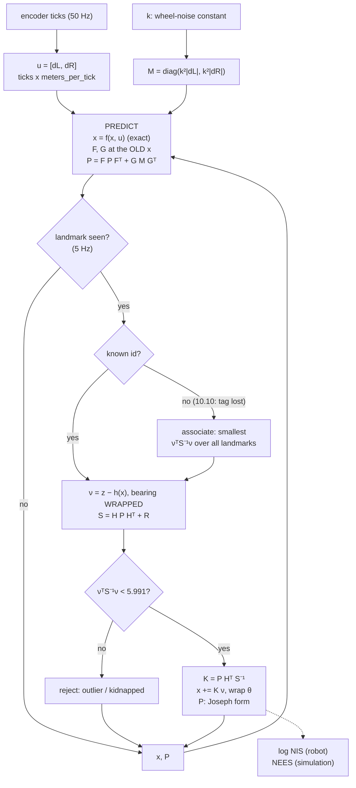

# 10.06 — The Extended Kalman Filter for a differential-drive robot

<!-- glance:start -->
<!-- generated by tools/build.py from curriculum/syllabus.yaml — edit the syllabus, not this block -->

| | |
|---|---|
| **Track** | Main path |
| **Difficulty** | Advanced |
| **Time** | 1 h 30 min |
| **Hardware** | none |
| **Software** | python, numpy |
| **Prerequisites** | [10.05 The multivariate Kalman filter](10.05-kalman-filter-multivariate.md)<br>[09.04 Build an odometry system from scratch (tested against the simulator)](../09-odometry/09.04-odometry-from-scratch.md) |
| **Optional prerequisites** | [FM.17 Calculus for robots: derivatives, rates and partial derivatives](../optional-foundations/mathematics/FM.17-derivatives.md) |
| **Skip if** | You have implemented EKF localization with range-bearing landmarks. |

<!-- glance:end -->

## What you will learn

- Write karmel's nonlinear odometry motion model $f(\mathbf{x}, \mathbf{u})$ from wheel travels and derive both its Jacobians, $F = \partial f/\partial\mathbf{x}$ and $G = \partial f/\partial\mathbf{u}$.
- Turn wheel-travel uncertainty into a process-noise matrix with $Q = G M G^\top$ instead of guessing a diagonal.
- Correct the pose with range–bearing observations of known landmarks: derive $H$, wrap the bearing innovation, and apply the Joseph-form update.
- Check every Jacobian against central differences before trusting it, and gate bad measurements with the Mahalanobis distance.
- Judge the filter with NIS and NEES, tune the wheel-noise constant, and say where linearization stops working.

## Why it matters

Everything in 10.04–10.05 assumed the state evolves linearly. karmel's does not: drive forward and
your $x$ changes by $\Delta s\cos\theta$ — a *product* of the control and a *cosine* of the state.
Look at a landmark and the sensor reports a range (a square root) and a bearing (an `atan2`).
A linear Kalman filter cannot represent either.

The Extended Kalman Filter is the smallest possible fix: at each step, replace the nonlinear
functions by their tangent planes *at the current estimate*, then run the ordinary Kalman equations
on those. That one idea is behind almost every pose estimator you will meet — `robot_localization`'s
`ekf_node` ([10.07](10.07-fusing-imu-and-odometry.md)), the AprilTag pose corrector
([10.10](10.10-fiducial-landmarks.md)), EKF-SLAM ([11.03](../11-slam/11.03-the-slam-problem.md)),
and the attitude filters inside every IMU chip.

By the end of this lesson karmel drives a 50-second tour of the simulated apartment and knows where
it is to about **1 cm**, while plain dead reckoning ends up **76 cm** wrong from the same encoder data.

<!-- prereqs:start -->
## Prerequisites

You need these first:

- [10.05 The multivariate Kalman filter](10.05-kalman-filter-multivariate.md)
- [09.04 Build an odometry system from scratch (tested against the simulator)](../09-odometry/09.04-odometry-from-scratch.md)

### Optional prerequisite links

New to any of these? Take the foundation lesson first; skip it if you already know it.

- [FM.17 Calculus for robots: derivatives, rates and partial derivatives](../optional-foundations/mathematics/FM.17-derivatives.md)

Check your readiness: `python course.py why 10.06`
<!-- prereqs:end -->

> [!NOTE]
> The only new mathematics here is the partial derivative. Rusty? → [FM.17 Derivatives](../optional-foundations/mathematics/FM.17-derivatives.md) (a Jacobian is just "all the partial derivatives, arranged in a table"). Covariance propagation $\Sigma_y = A\Sigma_x A^\top$ is from [FM.15](../optional-foundations/mathematics/FM.15-covariance-multivariate-gaussians.md).

## Concept

Picture the filter's belief as an ellipse in the $(x, y)$ plane, plus an uncertainty in heading. Now
the robot drives forward 10 cm. If the heading were known exactly, the whole ellipse would slide 10 cm
along a straight line — a linear operation, no problem. But the heading is *not* known exactly, and
each possible heading sends the robot in a slightly different direction. The set of possible new
positions is a little **arc**, not a straight smear. After 1 m with a heading uncertainty of 30°, that
arc is a visibly curved banana, and no ellipse describes it well.

The EKF's answer: don't try to be exact. At the current best-guess heading, the arc has a tangent
direction; use it. Slide the ellipse along the tangent, and stretch it sideways by as much as the arc
would bend over this *one small step*. Over 10 cm the arc and its tangent are indistinguishable, so
the approximation is excellent. Over 1 m with a 30° heading error it is not — and you will measure
exactly that failure in Exercise 10.06-E5.

The same trick handles the sensor. A landmark at 2 m directly ahead: a 1 cm error in $x$ changes the
measured range by 1 cm, and a 1 cm error sideways barely changes the range at all but rotates the
bearing by 0.005 rad. Those sensitivities — "how much does the measurement change per unit of state
error" — are the rows of $H$. They are recomputed at every update, because a landmark that is ahead
now will be to the left in five seconds.

So: **the Kalman filter's matrices become functions of where you currently think you are.** Everything
else — the gain, the Joseph update, NIS, NEES — is identical to 10.05.

One more thing is new, and it is the classic source of silent bugs: **angles wrap**. If the filter
predicts a bearing of $+179°$ and the sensor reports $-179°$, the true surprise is $2°$, not $-358°$.
Forget one `wrap` and the filter will occasionally receive an innovation 180 times too large and jerk
the robot's estimate across the room.

> [!TIP]
> **Ask your teacher:** "Draw the banana: what does the true distribution of poses look like after driving 1 m with a 30° heading uncertainty, and what ellipse does the EKF put there instead?"

## Technical explanation

### Level 1 — Intuition: the same five equations, with tangents

| Kalman filter (10.05) | Extended Kalman filter | What changed |
|---|---|---|
| $\bar{\mathbf{x}} = F\mathbf{x} + B\mathbf{u}$ | $\bar{\mathbf{x}} = f(\mathbf{x}, \mathbf{u})$ | predict the mean with the **exact** nonlinear model |
| $\bar P = FPF^\top + Q$ | $\bar P = FPF^\top + GMG^\top$ | $F$ is now $\partial f/\partial\mathbf{x}$ evaluated at $\mathbf{x}$; noise enters through $G = \partial f/\partial\mathbf{u}$ |
| $\boldsymbol\nu = \mathbf{z} - H\bar{\mathbf{x}}$ | $\boldsymbol\nu = \mathbf{z} - h(\bar{\mathbf{x}})$, bearing **wrapped** | predict the measurement with the exact model |
| $S = H\bar PH^\top + R$ | same, $H = \partial h/\partial\mathbf{x}$ at $\bar{\mathbf{x}}$ | — |
| $K = \bar PH^\top S^{-1}$, $\mathbf{x} = \bar{\mathbf{x}} + K\boldsymbol\nu$ | same, then wrap $\theta$ | — |

Rule of thumb, and it is worth memorising: **means through the nonlinear function, covariances through
the Jacobian.** Every EKF bug that is not an angle-wrapping bug is a violation of that rule (usually
`x_pred = F @ x`, which is wrong here — $F$ is a derivative, not a transition).

### Level 2 — Practical: the state, the control and the measurement

**State** — the pose in the `map` frame, exactly as in [05.03](../05-frames-and-transforms/05.03-rigid-transforms-2d.md):

$$\mathbf{x} = [x,\ y,\ \theta]^\top \quad (\mathrm{m},\ \mathrm{m},\ \mathrm{rad}),\ \theta \in (-\pi, \pi]$$

**Control** — *not* a velocity command. The EKF uses what actually happened: the wheel travels since
the last step, straight from the encoder ticks ([09.04](../09-odometry/09.04-odometry-from-scratch.md)):

$$\mathbf{u} = [d_L,\ d_R]^\top, \qquad d = \Delta\text{ticks} \times \texttt{meters\_per\_tick}$$

Using the *measured* motion as the control is what makes odometry a prediction rather than a
measurement. (The alternative — treating integrated odometry as a position measurement — is the single
most common `robot_localization` misconfiguration; see [10.07](10.07-fusing-imu-and-odometry.md).)

**Motion model** — the midpoint form: turn by half, drive straight, turn by half.

$$\Delta s = \frac{d_L + d_R}{2}, \qquad \Delta\theta = \frac{d_R - d_L}{b}, \qquad \theta_m = \theta + \frac{\Delta\theta}{2}$$
$$f(\mathbf{x}, \mathbf{u}) = \begin{bmatrix} x + \Delta s\cos\theta_m \\ y + \Delta s\sin\theta_m \\ \mathrm{wrap}(\theta + \Delta\theta)\end{bmatrix}$$

where $b$ is the wheel separation (`cfg.drive.wheel_separation_m`, 0.20 m on karmel). At $\Delta t =
0.02$ s and 0.25 m/s the step is 5 mm, so the midpoint form and the exact arc agree to well under a
micrometre — this is not where your error comes from.

**Measurement** — `sim.observe_landmarks()` returns, for each visible landmark, a range and a bearing
measured from `base_link`. With the landmark at a known map position $(l_x, l_y)$:

$$h(\mathbf{x}) = \begin{bmatrix} r \\ \varphi \end{bmatrix} = \begin{bmatrix} \sqrt{(l_x-x)^2 + (l_y-y)^2} \\ \mathrm{wrap}\big(\mathrm{atan2}(l_y-y,\ l_x-x) - \theta\big)\end{bmatrix}$$

$$R = \mathrm{diag}(\sigma_r^2,\ \sigma_\varphi^2) = \mathrm{diag}(0.05^2,\ 0.03^2)$$

(those are `SensorParams.realistic()`: 5 cm range noise, 0.03 rad ≈ 1.7° bearing noise). The landmarks
in `World.apartment()` are ten wall-mounted markers at known coordinates — think of them as printed
AprilTags, which is literally what [10.10](10.10-fiducial-landmarks.md) turns them into.

### Level 3 — Mathematics: the three Jacobians and the process noise

**$F = \partial f/\partial\mathbf{x}$.** Differentiate each row of $f$ with respect to $x$, $y$, $\theta$.
Only $\theta_m$ depends on $\theta$ (and $\partial\theta_m/\partial\theta = 1$):

$$F = \begin{bmatrix} 1 & 0 & -\Delta s\sin\theta_m \\ 0 & 1 & \ \ \Delta s\cos\theta_m \\ 0 & 0 & 1 \end{bmatrix}$$

Read it physically: a heading error of $\delta\theta$ turns into a *sideways* position error of
$\Delta s\,\delta\theta$ after driving $\Delta s$. That single entry is why heading uncertainty is the
enemy — it is the mechanism that converts 1° of heading error into 1.7 cm of position error per metre
driven.

**$G = \partial f/\partial\mathbf{u}$.** Here you must remember that $\theta_m$ depends on the wheel
travels too: $\partial\theta_m/\partial d_L = -1/(2b)$ and $\partial\theta_m/\partial d_R = +1/(2b)$.
With $c = \cos\theta_m$, $s = \sin\theta_m$:

$$G = \begin{bmatrix} \tfrac{1}{2}c + \tfrac{\Delta s\, s}{2b} & \tfrac{1}{2}c - \tfrac{\Delta s\, s}{2b} \\[2pt] \tfrac{1}{2}s - \tfrac{\Delta s\, c}{2b} & \tfrac{1}{2}s + \tfrac{\Delta s\, c}{2b} \\[2pt] -\tfrac{1}{b} & \tfrac{1}{b} \end{bmatrix}$$

**$M$, the wheel-travel noise.** A wheel that rolls further has more opportunity to slip, so model the
variance as proportional to the distance rolled:

$$M = \mathrm{diag}\big(k^2 |d_L|,\ k^2|d_R|\big), \qquad Q = G\,M\,G^\top$$

$k$ has units $\mathrm{m}^{1/2}$: $k = 0.01$ means each wheel's travel has $\sigma = 1$ cm after
rolling 1 m. This is the **only** tuning knob in the whole filter, and deriving $Q$ from it (rather
than guessing three diagonal numbers) means the noise automatically appears in the right directions —
mostly along the heading when the wheels differ, mostly forward when they agree.

**$H = \partial h/\partial\mathbf{x}$.** With $\delta_x = l_x - x$, $\delta_y = l_y - y$, $q = \delta_x^2 + \delta_y^2$, $r = \sqrt q$:

$$H = \begin{bmatrix} -\delta_x/r & -\delta_y/r & 0 \\ \ \ \delta_y/q & -\delta_x/q & -1 \end{bmatrix}$$

The $-1$ in the bottom right says the obvious thing: turn the robot 1 rad and every bearing drops by
1 rad. The top row is a unit vector pointing *from* the landmark *to* the robot: moving directly away
increases the range one-for-one, moving sideways does not change it at all (to first order).

**Worked numbers.** Robot at $(2.0, 1.5, 2.8\ \mathrm{rad})$, landmark at $(0.0, 1.8)$:
$\delta_x = -2$, $\delta_y = 0.3$, $q = 4.09$, $r = 2.0224$ m, so

$$H = \begin{bmatrix} 0.9889 & -0.1483 & 0 \\ 0.0733 & 0.4890 & -1 \end{bmatrix}$$

The robot is almost due east of the landmark, so range is nearly pure $x$ (0.9889) and bearing is most
sensitive to $y$ (0.4890 rad per metre = 1 cm of $y$ error → 0.005 rad of bearing error).

**Gating.** Before fusing, compute $d^2 = \boldsymbol\nu^\top S^{-1}\boldsymbol\nu$ — the same quantity
as NIS. Under a correct filter it is $\chi^2$ with $m = 2$ degrees of freedom, so 95 % of honest
measurements have $d^2 < 5.991$. Reject anything above that: it is a reflection, a mis-identified tag
or a robot that has been picked up. Gating is not optional on a real robot; one bad landmark fused at
full gain can throw the estimate a metre off and the filter will then reject the *good* measurements
that follow.

### Level 4 — Implementation: never trust a Jacobian you have not checked

Hand-derived Jacobians are wrong roughly half the time on the first try, and a wrong $F$ or $G$ does
not crash — it produces a filter that is quietly overconfident. Check them numerically:

$$\frac{\partial f_i}{\partial x_j} \approx \frac{f_i(\mathbf{x} + \varepsilon \mathbf{e}_j) - f_i(\mathbf{x} - \varepsilon \mathbf{e}_j)}{2\varepsilon}$$

with $\varepsilon = 10^{-6}$. Central differences (not forward) because the error is $O(\varepsilon^2)$
instead of $O(\varepsilon)$: expect agreement to about $10^{-10}$. **Rows that are angles must have
their difference wrapped** before dividing, or a heading that crosses $\pi$ between the two evaluations
gives a $2\pi/(2\varepsilon) = 3\times10^6$ spike and you will "fix" a Jacobian that was right.

Running the check at the operating point from the tour:

```text
Jacobian check, max |analytic - numerical|: F 1.4e-10, G 8.6e-11, H 1.6e-10
```

Four more implementation rules, each of which costs a day when ignored:

- **Evaluate $F$ and $G$ at the OLD state**, then overwrite the state. `self.x, F, G = motion_model(self.x, u, b)` does this in one line; computing $F$ after updating `self.x` is a subtle, small, permanent bias.
- **`K = np.linalg.solve(S, H @ P).T`** instead of `P @ H.T @ inv(S)`. $P$ and $S$ are symmetric, so this is the same matrix, computed more stably, and it raises instead of returning nonsense when $S$ is singular.
- **Joseph form**, $P = (I-KH)\bar P(I-KH)^\top + KRK^\top$, so $P$ stays symmetric positive definite over tens of thousands of updates.
- **Wrap $\theta$ after `x = x + K nu`.** The correction can push the heading past $\pi$.

## Diagram



```text
 Range-bearing geometry (everything in the map frame, REP-103: x right, y up, CCW positive)

        y ^                    L = (lx, ly) landmark, known
          |                   *
          |                  /|
          |            r    / | dy = ly - y
          |                /  |
          |               /phi'|          r   = sqrt(dx^2 + dy^2)
          |     theta    /_____|          phi = wrap(atan2(dy, dx) - theta)
          |         \   /  dx              ^-- measured FROM base_link, so the
          |          \ /                       robot's own heading is subtracted
          |           R ----> heading theta
          +-----------------------------> x

 H row 1 = d r  / d(x,y,theta) = [-dx/r, -dy/r, 0]     unit vector L -> R, heading irrelevant
 H row 2 = d phi/ d(x,y,theta) = [dy/q, -dx/q, -1]     q = r^2; turning 1 rad moves every bearing 1 rad
```

## Code

- Exercise (auto-graded): [`labs/exercises/10.06/`](../labs/exercises/10.06/README.md) — `motion_model`, `wheel_noise`, `range_bearing`, `numerical_jacobian`, `EKF`, `associate`.
- Provided: [`labs/exercises/10.06/tour_sim.py`](../labs/exercises/10.06/tour_sim.py) — `drive_tour()` drives karmel living room → kitchen → study and logs ticks, gyro, landmark observations, LiDAR scans and the ground truth. Lessons 10.07–10.10 reuse it.
- Experiment: [`code/ekf_landmarks.py`](code/ekf_landmarks.py), tested by `python -m pytest 10-localization/code`.
- Symbols: [`code/NOTATION.md`](code/NOTATION.md).

```bash
python course.py check 10.06                       # your student.py against the tests
python 10-localization/code/ekf_landmarks.py --solution
python 10-localization/code/ekf_landmarks.py --solution --seeds 5
```

The whole filter, once the Jacobians are right:

```python
def predict(self, u, b, M):
    """x = f(x, u);  P = F P F^T + G M G^T  (F and G evaluated at the OLD x)."""
    self.x, F, G = motion_model(self.x, u, b)
    self.P = F @ self.P @ F.T + G @ np.asarray(M, dtype=float) @ G.T
    return self.x, self.P

def update(self, z, landmark, R):
    """Fuse one range-bearing measurement (Joseph form). Returns its NIS."""
    R = np.asarray(R, dtype=float)
    nu, S, H = self.innovation(z, landmark, R)      # nu[1] is wrapped inside
    K = np.linalg.solve(S, H @ self.P).T            # == P H^T S^-1
    self.x = self.x + K @ nu
    self.x[2] = wrap_angle(self.x[2])
    I_KH = np.eye(3) - K @ H
    self.P = I_KH @ self.P @ I_KH.T + K @ R @ K.T
    self.nu, self.S, self.K = nu, S, K
    return float(nu @ np.linalg.solve(S, nu))
```

Running it on the 50-second apartment tour (seed 1, realistic robot and sensors):

```text
2) Apartment tour, seed 1, 50 s, 264 landmark updates at 5 Hz
   dead reckoning  : RMSE  43.1 cm, final  76.5 cm
   EKF, tags 5 Hz  : RMSE   0.9 cm, max  3.2 cm, heading RMSE 1.3 deg, NIS 1.85 (m = 2), NEES 1.03 (n = 3)
   EKF, tags 1 Hz  : RMSE   3.0 cm, max  6.6 cm, heading RMSE 1.9 deg, NIS 1.46 (m = 2), NEES 3.52 (n = 3)
```

Same encoder data, 48× less error — and NIS ≈ 2 with $m = 2$, NEES ≈ 1–3.5 with $n = 3$ say the filter
is honest about it. Figures written to `localization_out/`: `ekf_tour.png` (truth, dead reckoning and
the EKF path with 95 % ellipses magnified 5×) and `ekf_sigma.png` (error against the ±2σ band — the
sawtooth as each landmark update collapses the uncertainty and prediction grows it back).

Tuning the one knob, averaged over five seeds:

```text
3) Wheel-noise constant k, mean over 5 seeds (tags at 5 Hz)
   k = 0.002: RMSE 1.89 cm, heading 2.12 deg, NIS 3.01, NEES 19.18
   k = 0.005: RMSE 1.32 cm, heading 1.52 deg, NIS 2.04, NEES  3.85
   k = 0.01 : RMSE 1.21 cm, heading 1.35 deg, NIS 1.76, NEES  1.76
   k = 0.02 : RMSE 1.38 cm, heading 1.38 deg, NIS 1.54, NEES  1.28
   k = 0.05 : RMSE 2.12 cm, heading 1.58 deg, NIS 1.27, NEES  1.08
```

RMSE is nearly flat from 0.005 to 0.02 — but NEES is not. Too small a $k$ (0.002) gives NEES 19 with
$n = 3$: the filter is more than twice as wrong as it claims, because it trusts odometry it should not.
Too large (0.05) gives NEES 1.08: safe, but it is throwing away good odometry and the RMSE shows it.
**Tune on consistency, verify on RMSE** — that ordering is the lesson.

## Exercise

All exercises need hardware: **none** (the simulator provides the landmarks).

### Exercise 10.06-E1 — One predict and one update, by hand `[numerical]`

Goal: know the equations well enough to execute them without code.

(a) $\mathbf{x} = [1.0, 2.0, 0.0]^\top$, $P = 0.01 I$, $b = 0.20$ m, $\mathbf{u} = [0.10, 0.10]$ m,
$M = \mathrm{diag}(10^{-4}, 10^{-4})$. Write $F$ and $G$, then compute $\bar{\mathbf{x}}$, the diagonal
of $\bar P$, and $\bar P_{y\theta}$. Explain in one sentence why $\bar P_{y\theta}$ is non-zero after
driving perfectly straight.

(b) $\mathbf{x} = [0, 0, 0]^\top$, $P = \mathrm{diag}(0.04, 0.04, 0.01)$. A landmark at $(2.0, 0.0)$ is
measured as $\mathbf{z} = [1.90\ \mathrm{m},\ 0.05\ \mathrm{rad}]$ with $R = \mathrm{diag}(0.01, 0.001)$.
Compute $H$, $\boldsymbol\nu$, $S$, $K$, the new $\mathbf{x}$ and the NIS. Why does a *bearing*
measurement move $y$ but not $x$?

### Exercise 10.06-E2 — Implement the EKF and prove your Jacobians `[coding]`

Goal: the filter that 10.07–10.10 all build on. Implement `motion_model`, `wheel_noise`,
`range_bearing`, `numerical_jacobian`, `EKF` and `associate` in `labs/exercises/10.06/student.py`.

Write $F$, $G$ and $H$ on paper first. Then, before running the full test suite, use your own
`numerical_jacobian` at a random pose — it will tell you *which entry* is wrong, which paper cannot.

Check it: `python course.py check 10.06`

### Exercise 10.06-E3 — Predict the effect of mistuning `[predict]`

Goal: connect a tuning knob to a consistency number. **Before running**, predict for
$k \in \{0.002,\ 0.05\}$ whether mean NEES will be far above 3, near 3, or below 3, and whether RMSE
will be better or worse than at $k = 0.01$. Write your predictions down. Then run
`python 10-localization/code/ekf_landmarks.py --solution --seeds 5` and compare with section 3 of its
output. Finally answer: on a real robot you cannot compute NEES — which number would you have used,
and would it have pointed at the same $k$?

### Exercise 10.06-E4 — The bearing that was not wrapped `[debugging]`

Goal: recognise the signature of the most common EKF bug. A teammate's `innovation` reads:

```python
def innovation(self, z, landmark, R):
    _, H = range_bearing(self.x, landmark)
    dx, dy = landmark[0] - self.x[0], landmark[1] - self.x[1]
    z_hat = np.array([math.hypot(dx, dy), math.atan2(dy, dx) - self.x[2]])
    return np.asarray(z, float) - z_hat, H @ self.P @ H.T + R, H
```

(a) Find the bug. (b) Predict what happens to RMSE, to mean NIS and to mean NEES over the tour — and,
importantly, *how often* the bug fires. (c) Run section 4 of `ekf_landmarks.py` and check. (d) The
robot only ever drives in a 6 × 5 m apartment; explain why the bug still fires.

### Exercise 10.06-E5 — Where linearization breaks `[simulation]`

Goal: know the EKF's failure mode before it surprises you on hardware.

Run section 6 of `ekf_landmarks.py --solution`: a robot at the origin with a heading uncertainty of
$\sigma_\theta = 30°$ drives exactly 1 m forward with zero wheel noise. Compare the EKF's mean and
covariance with 100,000 sampled robots. Report the EKF's $\bar x$ and $\sigma_x$, the sample mean and
$\sigma_x$, and the fraction of samples inside the EKF's 95 % ellipse. Then re-run with
$\sigma_\theta = 5°$ (edit the constant) and report the same three numbers. Explain the trend in terms
of the tangent approximation, and state the practical rule it gives you.

### Exercise 10.06-E6 — Localize without landmark ids `[simulation]`

Goal: see why data association is the hard part of real localization. Section 5 of `ekf_landmarks.py`
runs the tour three ways: ids known, ids ignored from a good start, and ids ignored from a start that
is 36 cm and 11° wrong with an honest $P_0$. Run it, report `wrong` and `rejected` counts and the final
error for each, then answer: what would you change so that the third case recovers instead of diverging?
(Hint: the gate is a threshold on $d^2$; what else could a filter do when *every* landmark is outside it?)

## Expected result

- **10.06-E1:** (a) $\Delta s = 0.10$, $\Delta\theta = 0$, $\theta_m = 0$, so
  $F = \begin{bmatrix}1&0&0\\0&1&0.1\\0&0&1\end{bmatrix}$ and
  $G = \begin{bmatrix}0.5&0.5\\-0.25&0.25\\-5&5\end{bmatrix}$.
  $\bar{\mathbf{x}} = [1.10,\ 2.00,\ 0.00]$; $\mathrm{diag}\,\bar P = [0.01005,\ 0.010113,\ 0.015]$ and
  $\bar P_{y\theta} = 0.00125$. Straight-line driving still couples $y$ and $\theta$ because the two
  wheel travels are independently noisy: a little more on the right than the left both turns the robot
  *and* displaces it sideways, so the two errors are created together.
- **10.06-E1 (b):** $H = \begin{bmatrix}-1&0&0\\0&-0.5&-1\end{bmatrix}$, $\boldsymbol\nu = [-0.10,\ 0.05]$,
  $S = \mathrm{diag}(0.05,\ 0.021)$, $K = \begin{bmatrix}-0.8&0\\0&-0.952\\0&-0.476\end{bmatrix}$,
  $\mathbf{x} = [0.0800,\ -0.0476,\ -0.0238]$, NIS $= 0.2 + 0.119 = 0.319$. The bearing row of $H$ has a
  zero in the $x$ column (the landmark is straight ahead, so sliding along $x$ does not change its
  bearing) — so the bearing innovation moves $y$ and $\theta$ only.
- **10.06-E2:** `python course.py check 10.06` → `25 passed`. The Jacobian tests compare against central
  differences at random poses and expect agreement to ~1e-10; the tour tests require position RMSE
  < 5 cm, max error < 12 cm, heading RMSE < 4°, dead reckoning at least 5× worse, mean NIS in [1, 3.5],
  mean NEES < 6, and zero wrong associations when ids are hidden.
- **10.06-E3:** $k = 0.002$ → NEES ≈ 19 (far above 3, badly overconfident), RMSE 1.89 cm (worse).
  $k = 0.05$ → NEES ≈ 1.08 (below 3, underconfident), RMSE 2.12 cm (worse). Best consistency *and* best
  RMSE near $k = 0.01$. On a real robot you would use **NIS**, which moves the same way here
  (3.01 → 1.27 as $k$ grows, crossing its expected value of 2 near $k = 0.005$–0.01) and needs no truth.
- **10.06-E4:** (a) neither the predicted bearing nor the innovation is wrapped. (b) It fires only when
  the true bearing difference crosses ±π — a few times per tour — but each time the innovation is off by
  2π ≈ 6.28 rad, roughly 200 σ. Expect RMSE ~10×worse, and NIS/NEES in the hundreds. (c) Measured:
  `RMSE 8.8 cm, max 39 cm, heading RMSE 23.5 deg, NIS 571, NEES 497` versus 0.9 cm / 1.85 / 1.03 when
  wrapped. (d) The apartment is small, but *bearings* cover the full circle: any landmark that ends up
  roughly behind the robot has a bearing near ±π, and the robot turns through every heading on the tour.
- **10.06-E5:** With $\sigma_\theta = 30°$: EKF $\bar x = 1.000$ m, $\sigma_x = 0.1$ cm, $\sigma_y = 52.4$ cm;
  samples $\bar x = 0.872$ m (the true mean is $e^{-\sigma_\theta^2/2}$, the robot's *expected* forward
  progress is shortened by the spread of headings), $\sigma_x = 17.0$ cm, $\sigma_y = 45.9$ cm; only
  **11 %** of samples fall inside the EKF's 95 % ellipse. With $\sigma_\theta = 5°$ the EKF's mean is
  right to well under a millimetre and coverage is back near 95 %. The rule: the EKF is fine while the
  motion in one step is small compared with the *curvature* the heading uncertainty induces — in
  practice, predict often (every encoder tick, not every second) and keep heading uncertainty small with
  a gyro or frequent landmarks.
- **10.06-E6:** ids known or good start: 0 wrong, ~11 rejected, final error ≈ 1.3 cm. Bad start with ids:
  still 0 wrong, 0 rejected, final 1.4 cm — the filter pulls itself in within 10 s. Bad start *without*
  ids: 59 wrong associations, 202 rejections, 57.7 cm of error at 10 s and 87 cm at the end. It never
  recovers because a wrong association makes the estimate worse, which makes the next association worse.
  Fixes: keep the ids (an AprilTag has one — that is the point of 10.10); or accept only measurements
  whose *best* match is much better than the second best (a likelihood ratio, not just a gate); or, when
  everything is rejected for several seconds, stop trusting the Gaussian and switch to a global method —
  a particle filter, which is [10.08](10.08-particle-filter-mcl.md).

## Troubleshooting

### Symptom: the estimate is smooth but slowly drifts away from the truth

1. Print mean NIS per 100 updates. Near $m = 2$? Then the measurements agree with the filter and the drift is in a state nobody measures — check that landmark map coordinates match the ones the sensor sees.
2. NIS ≫ 2? The filter disagrees with its sensor and is losing. Suspect a wrong $R$, a wrong landmark position, or an unwrapped bearing (check `np.abs(nu[:,1]).max()` — anything above ~0.5 rad on a well-tracked robot is a wrap bug).
3. NIS ≪ 2 and drifting? The filter is ignoring measurements: $R$ too large, or $P$ collapsed so small that $K \approx 0$. Print $\mathrm{diag}(P)$ over time; if it only ever shrinks, $Q$ is too small — raise $k$.

### Symptom: NEES is huge in simulation but the plot looks fine

1. Compute the heading term separately: `e[2] = wrap_angle(e[2])`. Forgetting to wrap the *error* makes NEES explode at every ±π crossing while the trajectory looks perfect. (The same bug, one level up.)
2. If the heading error is genuinely large, look at $P_{\theta\theta}$: a filter that claims $\sigma_\theta = 0.2°$ after 50 s of driving is lying. Raise $k$.
3. Check $P_0$: starting from the true pose with $P_0 = 10^{-9}I$ makes the first few hundred NEES values enormous and poisons the average. Start with an honest $P_0$.

### Symptom: `LinAlgError: Singular matrix` in `solve(S, ...)`

1. $S = H\bar PH^\top + R$ is singular only if $R$ has a zero on the diagonal (a sensor with no noise) or $R$ was passed as σ instead of σ². Print `np.linalg.eigvalsh(R)`.
2. If $R$ is fine, $\bar P$ has gone non-finite. Walk back: print `np.isfinite(P).all()` after each predict. A `nan` usually comes from `range_bearing` at $r \approx 0$ (robot on top of a landmark) or from a tick log with a gap.

### Symptom: the filter jumps a metre, then never recovers

1. Almost always a wrong data association. Log the chosen landmark id and its $d^2$ for every update; a correct association usually has $d^2 < 3$.
2. Add the gate if it is missing (`d2 < 5.991`), and count rejections. A rejection rate above ~10 % means the filter, not the sensor, is wrong.
3. If everything is rejected for more than a second, the robot is lost in a way an EKF cannot fix; that is the kidnapped-robot problem from [10.01](10.01-what-is-localization.md), and it needs [10.08](10.08-particle-filter-mcl.md).

## Common mistakes

- **`x_pred = F @ x`.** $F$ is a *derivative*, not a transition matrix. Means go through $f$, covariances through $F$.
- **Evaluating $F$ or $G$ after updating the state.** Both must be evaluated at the state you are predicting *from*.
- **Forgetting that $\theta_m$ depends on $d_L$ and $d_R$**, so $G$ loses its $\Delta s\,s/(2b)$ terms. The filter still runs and is quietly overconfident during turns — exactly when it matters.
- **Any unwrapped angle**: in $h$, in $\boldsymbol\nu$, in the state after the update, in the NEES error vector, or in the numerical-Jacobian difference.
- **Passing σ where σ² belongs.** $R = \mathrm{diag}(0.05, 0.03)$ instead of $\mathrm{diag}(0.0025, 0.0009)$ makes the filter trust the sensor 20–30× too little. It never crashes.
- **Tuning $Q$ as three independent diagonal numbers.** Derive it from the physical source: $Q = GMG^\top$ with one $k$.
- **No gate.** One bad measurement is enough to lose a filter that has no gate.
- **Trusting a Jacobian because the filter "looks fine".** Check it numerically; it costs five lines.

## Knowledge check

1. Why can't a linear Kalman filter track a differential-drive robot's pose?
   <details><summary>Answer</summary>

   The motion model contains $\Delta s\cos\theta_m$ — a product of the control with a trigonometric
   function of the state — and the landmark model contains a square root and an `atan2`. Neither is a
   linear function of the state, so no constant $F$ or $H$ exists. The EKF supplies a *different*
   linear approximation at each step, taken at the current estimate.
   </details>

2. karmel drives 8 cm with both wheels equal, at $\theta = 90°$. Write $F$ and say what its only
   non-trivial entry means physically.
   <details><summary>Answer</summary>

   $\Delta\theta = 0$, $\theta_m = \pi/2$, $\Delta s = 0.08$: $F = \begin{bmatrix}1&0&-0.08\\0&1&0\\0&0&1\end{bmatrix}$.
   The $-0.08$ says a heading error of $\delta\theta$ rad becomes a position error of $0.08\,\delta\theta$ m
   in $x$ over this step — heading uncertainty leaking into position, at a rate of one step's distance
   per radian.
   </details>

3. You double the wheel-noise constant $k$. What happens to $Q$, to $K$, and to how fast $P$ shrinks
   after a landmark update?
   <details><summary>Answer</summary>

   $M \propto k^2$, so $Q = GMG^\top$ quadruples. $\bar P$ grows faster between updates, so
   $K = \bar PH^\top S^{-1}$ is larger — the filter leans more on each measurement and less on odometry.
   $P$ still collapses at each update, but re-grows faster, so the sawtooth in `ekf_sigma.png` gets taller.
   </details>

4. A landmark is 3 m away, directly to the robot's left. Which entries of $H$ are (nearly) zero, and
   what does the filter learn from a range measurement of it?
   <details><summary>Answer</summary>

   With the robot at the origin facing $+x$ and the landmark at $(0, 3)$: $\delta_x = 0$, $\delta_y = 3$,
   $r = 3$, $q = 9$. $H = \begin{bmatrix}0&-1&0\\1/3&0&-1\end{bmatrix}$. The range row has a zero in the
   $x$ column: a range measurement of a landmark directly to the side says nothing about forward
   position, only about lateral position. (This is why one landmark is never enough — you need them
   spread in bearing.)
   </details>

5. Over a tour your filter's mean NIS is 0.4 with $m = 2$, and its position RMSE is 8 cm. Diagnose.
   <details><summary>Answer</summary>

   NIS far *below* $m$ means the innovations are much smaller than the filter expected: $S$ is too big.
   Either $R$ is inflated (σ vs σ², or a copy-pasted pessimistic value) or $\bar P$ is too big
   ($k$ too large). The filter is underconfident — it is not diverging, but it is throwing away
   information, which is why the RMSE is 8 cm instead of 1 cm. Shrink $R$ to the measured sensor noise
   first, then re-tune $k$.
   </details>

6. Predict: you run the EKF with the gate set to $d^2 < 0.1$ instead of 5.991. What happens over a
   50 s tour, and what does the rejection count look like?
   <details><summary>Answer</summary>

   $d^2 < 0.1$ accepts only about 5 % of *honest* measurements (the $\chi^2_2$ CDF at 0.1 is 0.049),
   so ~95 % are rejected. With ~13 updates per second that leaves fewer than one per second; the filter
   degrades toward dead reckoning, $P$ grows, and — because a bigger $P$ makes $S$ bigger and $d^2$
   smaller — it eventually starts accepting again in a ragged cycle. Over-tight gates fail slowly, which
   is what makes them hard to spot.
   </details>

7. Your analytic $H$ and the numerical one agree everywhere except in the bearing row, where they differ
   by about $3\times 10^6$ at one particular pose. What is wrong?
   <details><summary>Answer</summary>

   Nothing is wrong with $H$. The numerical Jacobian evaluated $h$ at $\mathbf{x}\pm\varepsilon$ and the
   bearing wrapped across ±π between the two, so the difference was $\approx 2\pi$ instead of
   $\approx 0$, divided by $2\varepsilon = 2\times10^{-6}$. Wrap the difference for angle rows
   (`angle_rows=[1]`) before dividing.
   </details>

8. On the real robot you have no ground truth. Give a three-step procedure to decide whether your EKF
   is trustworthy enough to hand its covariance to a docking routine.
   <details><summary>Answer</summary>

   (1) Log NIS per landmark update over a long drive; it should average $m = 2$ and stay inside the
   $\chi^2_2$ 95 % band most of the time. (2) Log the rejection rate; it should be a few percent, not
   20 %. (3) Drive a closed loop back to a physically marked start pose and measure the real error with
   a tape; compare it with the filter's reported $2\sigma$. All three agreeing is the practical
   substitute for NEES. (And repeat after any change to wheels, tyres or payload.)
   </details>

## Practical challenge

**Add the gyro, and make the filter survive a kidnapping honestly.**

Acceptance criteria:

- Extend the state to $\mathbf{x} = [x, y, \theta, b_g]^\top$ with a gyro bias, and fuse
  `tour_sim`'s `gyro` channel as a second measurement ($z = \omega$, and $\omega$ comes from the
  odometry $\Delta\theta/\Delta t$ — or add $\omega$ to the state; justify your choice in two sentences).
  Derive the new $F$, $G$ and both $H$ matrices and verify all three numerically.
- On `drive_tour(seed=2, observe_every=50)` (landmarks at only 1 Hz), your 4-state filter beats the
  3-state filter of this lesson by at least 30 % in heading RMSE, and estimates the simulator's
  0.01 rad/s gyro bias to within 0.003 rad/s after 20 s.
- Run `drive_tour(seed=2, kidnap_at_s=25.0)`. Your filter must **detect** the kidnapping within 2 s
  (define the detector from the gate: e.g. ≥ 10 consecutive rejected landmarks) and publish a flag
  rather than silently drifting. Report the detection latency over 10 seeds.
- One paragraph: why detection is the best an EKF can do here, and what [10.08](10.08-particle-filter-mcl.md)
  does instead.

## You can skip this if…

You have implemented EKF localization with range–bearing landmarks. Prove it: answer knowledge-check
questions 1, 3, 5 and 7 **without looking**, do Exercise 10.06-E1 on paper, and pass
`python course.py check 10.06`. Then:

`python course.py skip 10.06 --reason "derived F/G/H from scratch, passed the checker, explained NIS-based tuning"`

## Go deeper

- https://www.cs.utexas.edu/~pstone/Courses/393Rfall15/readings/Welch+Bishop-TR-95.pdf — Welch & Bishop, *An Introduction to the Kalman Filter*: sections 2–3 are the EKF in exactly this notation, 16 pages.
- https://mitpress.mit.edu/9780262201629/probabilistic-robotics/ — Thrun, Burgard & Fox, *Probabilistic Robotics*, ch. 3.3 (EKF), 5.4 (odometry motion model) and 7.5 (EKF localization with known and unknown correspondences). The book's Table 7.2 is the algorithm you just implemented.
- https://github.com/rlabbe/Kalman-and-Bayesian-Filters-in-Python — Labbe, chapter "Extended Kalman Filters": the same robot, worked with `sympy` so you can watch the Jacobians being derived symbolically.
- https://doi.org/10.1109/JPROC.2003.823141 — Julier & Uhlmann, *Unscented filtering and nonlinear estimation*: what to use when the linearization of Exercise E5 is no longer good enough. `robot_localization` ships this as `ukf_node`.
- https://docs.ros.org/en/jazzy/Tutorials/Intermediate/Tf2/Tf2-Main.html — where the `map → odom → base_link` frames this filter lives in are defined; [10.09](10.09-amcl-in-ros2.md) makes it concrete.
- [`references/papers.md` §1.1–1.2](../references/papers.md#11-an-introduction-to-the-kalman-filter-tr-95-041) — the reading guide for both papers above, with prerequisites and what to take away.

## Progress checkpoint

- [ ] I can derive $F$, $G$ and $H$ for a differential-drive robot with range–bearing landmarks, and check them numerically.
- [ ] I can explain $Q = GMG^\top$ and tune the single wheel-noise constant using NIS.
- [ ] My EKF passes `python course.py check 10.06` and beats dead reckoning by an order of magnitude on the tour.
- [ ] I wrap every angle: in $h$, in $\boldsymbol\nu$, in the state, and in the NEES error.
- [ ] I can state where linearization breaks and what to do about it.

`python course.py complete 10.06` (exercises done) · `python course.py master 10.06` (challenge done) · `python course.py struggle 10.06 "what was hard"`

Next: [10.07 — Sensor fusion: IMU + wheel odometry with robot_localization](10.07-fusing-imu-and-odometry.md).
