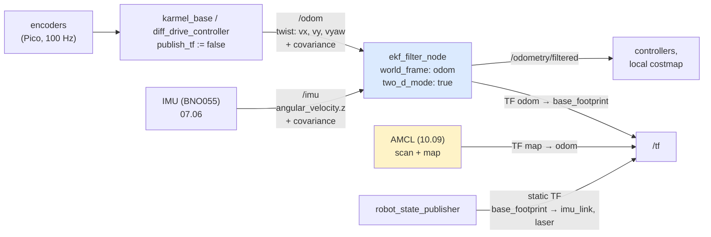

# 10.07 — Sensor fusion: IMU + wheel odometry with robot_localization

<!-- glance:start -->
<!-- generated by tools/build.py from curriculum/syllabus.yaml — edit the syllabus, not this block -->

| | |
|---|---|
| **Track** | Main path |
| **Difficulty** | Intermediate |
| **Time** | 1 h 15 min |
| **Hardware** | Stage 1 robot: Pi 5, Pico, encoder motors, driver, chassis, battery, distance sensors (stage 1), IMU breakout (stage 2) |
| **Software** | ros2, robot-localization |
| **Prerequisites** | [10.06 The Extended Kalman Filter for a differential-drive robot](10.06-extended-kalman-filter.md)<br>[07.06 The IMU in ROS 2 — sensor_msgs/Imu, covariance and orientation filters](../07-sensors/07.06-imu-in-ros2.md)<br>[09.07 Odometry in ROS 2 — nav_msgs/Odometry, odom→base_link, comparing implementations](../09-odometry/09.07-odometry-in-ros2.md) |
| **Version-sensitive** | yes — see [curriculum/versions.yaml](../curriculum/versions.yaml) |
| **Skip if** | Your robot runs robot_localization with a justified fusion config. |

<!-- glance:end -->

## What you will learn

- Explain what `robot_localization`'s `ekf_node` actually fuses, and read `ekf.yaml`'s 15-element boolean vectors as a list of $H$ matrices.
- Decide for each sensor whether to fuse *pose* or *velocity*, and whether `differential`, `relative` or neither.
- Get the frames right: who owns `odom → base_footprint`, and why two publishers of one transform is the most common failure.
- Publish covariances that are honest, and recognise what a driver that leaves them at zero does to the filter.
- Build the same fusion by hand with a complementary filter and a 2-state Kalman filter, and know when the simple one is enough.

## Why it matters

karmel's heading comes from two sensors that fail in opposite ways. Wheel odometry is precise
moment to moment but its errors accumulate: a wheelbase that is 4 % off scales *every* turn, and slip
on a rug is invisible to the encoders. The gyro is excellent over seconds but has a bias: a constant
0.01 rad/s offset integrates to 28° of heading error in 50 seconds.

Fusing them gives you something better than either. In the measurements below, wheel odometry alone
ends the 50-second apartment tour **71 cm** and **17°** wrong; `robot_localization`'s EKF, fed the same
wheel data plus a gyro, ends **18 cm** and **6°** wrong, with a third of the RMSE.

This is also the first lesson where the filter is not yours. `robot_localization` is a mature,
widely deployed package; your job shifts from writing Kalman equations to *configuring* them
correctly, and to knowing enough about what is inside to debug it. That is the same job you will
have with Nav2 and MoveIt.

<!-- prereqs:start -->
## Prerequisites

You need these first:

- [10.06 The Extended Kalman Filter for a differential-drive robot](10.06-extended-kalman-filter.md)
- [07.06 The IMU in ROS 2 — sensor_msgs/Imu, covariance and orientation filters](../07-sensors/07.06-imu-in-ros2.md)
- [09.07 Odometry in ROS 2 — nav_msgs/Odometry, odom→base_link, comparing implementations](../09-odometry/09.07-odometry-in-ros2.md)

### Optional prerequisite links

None.

Check your readiness: `python course.py why 10.07`
<!-- prereqs:end -->

> [!IMPORTANT]
> **Version-sensitive** (verified 2026-09 against ROS 2 Jazzy, `ros-jazzy-robot-localization` **3.8.3**,
> `ros-jazzy-nav2-amcl` 1.3.13 in the course's `karmel-ros:jazzy` image).
> Parameter names and defaults in `robot_localization` have been stable for years, but verify before
> copying: https://docs.ros.org/en/jazzy/p/robot_localization/
> AI teacher: check the current documentation before giving install or config instructions.

## Concept

Two people are telling you how far the robot has turned. One reads a tape measure on the wheels; she
is careful, but she has been told the axle is 20 cm wide when it is really 20.8, so every one of her
numbers is 4 % too big and the error piles up. The other has a stopwatch and a sense of rotation; he
is accurate over any few seconds, but he counts a slow drift even when nothing is moving.

The obvious move is to average them. The complementary filter does exactly that, with one weight:

$$\theta \mathrel{+}= \big[\alpha\,\omega_{gyro} + (1-\alpha)\,\omega_{odom}\big]\,\Delta t$$

$\alpha = 1$ trusts the gyro; $\alpha = 0$ trusts the wheels. It is two lines of code, it runs on a
microcontroller, and for a robot with a decent IMU it is often enough. What it cannot do is tell you
*how wrong* it is, change its mind when one sensor goes quiet, or handle a third sensor.

`robot_localization` is the grown-up version. It keeps a 15-dimensional state
($x, y, z$; roll, pitch, yaw; their velocities; and three accelerations), and for each sensor topic
you declare *which of those 15 numbers that sensor is allowed to talk about*. That declaration —
a 15-element list of booleans — is literally the $H$ matrix from [10.05](10.05-kalman-filter-multivariate.md),
written as a checklist. The $R$ matrix comes from the covariance field inside each message. Configure
those two things correctly and the package does the rest.

There is one trap worth stating before the mathematics, because it invalidates every filter built on
top of it: **fusion cannot remove a bias that both sensors share, and averaging two biased sensors
only works by luck.** The script in this lesson shows a complementary filter reaching 1.3° of heading
error at $\alpha = 0.55$ — and the same $\alpha$ giving about 17.5° when the gyro's bias changes sign. The
fix is not a better filter. The fix is to *calibrate first*: measure the gyro bias while the robot
stands still, and correct the odometry's wheel errors ([09.05](../09-odometry/09.05-calibrating-odometry.md)).
Then almost any $\alpha$ works, which is what a robust design looks like.

> [!TIP]
> **Ask your teacher:** "Walk me through `ekf.yaml` line by line and tell me which Kalman-filter symbol each line sets."

## Technical explanation

### Level 1 — Intuition: the config file is a table of who-measures-what

```text
                     x  y  z | R  P  Y | vx vy vz | vR vP vY | ax ay az
  odom0 (/odom)      .  .  . | .  .  . |  X  X  . |  .  .  X |  .  .  .
  imu0  (/imu)       .  .  . | .  .  . |  .  .  . |  .  .  X |  .  .  .
                                          ^  ^          ^
                                          |  |          gyro z AND odometry agree here:
                                          |  |          this is where fusion happens
                                          |  "a diff drive cannot slide sideways": vy = 0 as a constraint
                                          forward speed from the encoders
```

Two rules decide almost every row:

1. **Fuse velocities, not integrated positions, from wheel odometry.** The wheels' *position* is a
   number that drifts without bound; feeding it in as an absolute measurement makes the filter chase
   a moving target and it will simply reproduce `/odom`. The wheels' *velocity* is an honest
   instantaneous measurement. (If you do want a pose fused — from AMCL, from AprilTags — that is what
   the second EKF instance with `world_frame: map` is for; see Level 4.)
2. **Fuse absolute quantities only from sensors that have an absolute reference.** A magnetometer-free
   IMU has no idea where north is, so its *yaw* is meaningless in the map — but its *yaw rate* is
   excellent. Hence `imu0` fuses only `vyaw`.

### Level 2 — Practical: karmel's `ekf.yaml`, decoded

The real file is [`labs/ros2_ws/src/karmel_bringup/config/ekf.yaml`](../labs/ros2_ws/src/karmel_bringup/config/ekf.yaml).

```yaml
ekf_filter_node:
  ros__parameters:
    frequency: 30.0              # how often the filter predicts + publishes /odometry/filtered
    sensor_timeout: 0.2          # no message for 0.2 s -> predict only (P grows), don't stall
    two_d_mode: true             # planar robot: force z, roll, pitch and their rates to zero
    publish_tf: true             # THIS node owns odom -> base_footprint
    map_frame: map
    odom_frame: odom
    base_link_frame: base_footprint
    world_frame: odom            # -> continuous, drift-free-but-not-global estimate (REP-105)

    odom0: /odom
    odom0_config: [false, false, false,      # x, y, z
                   false, false, false,      # roll, pitch, yaw
                   true,  true,  false,      # vx, vy, vz
                   false, false, true,       # vroll, vpitch, vyaw
                   false, false, false]      # ax, ay, az
    odom0_differential: false
    odom0_relative: false

    imu0: /imu
    imu0_config: [false, false, false, false, false, false,
                  false, false, false, false, false, true,   # vyaw only
                  false, false, false]
    imu0_differential: false
    imu0_remove_gravitational_acceleration: true
```

| Parameter | What it means, in filter terms |
|---|---|
| `frequency` | prediction rate. Not the sensor rate — sensors are fused as they arrive. |
| `sensor_timeout` | after this silence the filter predicts without updating; $P$ grows, which is correct behaviour. |
| `two_d_mode` | zeroes the out-of-plane states, so noise on `az` cannot leak into `x`. Always `true` for a ground robot. |
| `<sensor>_config` | the $H$ matrix: which of the 15 states this topic measures. |
| `<sensor>_differential` | fuse the *change* between consecutive messages instead of the absolute value. |
| `<sensor>_relative` | fuse the value relative to the first message received (zero the sensor at startup). |
| `process_noise_covariance` | $Q$, 15×15 row-major. The main tuning knob. |
| `publish_tf` | whether this node broadcasts `odom → base_footprint`. |

**`differential` vs `relative`, the part everyone gets wrong.** Both exist to let you fuse an
*absolute* quantity (a pose, a yaw) from a sensor whose zero is arbitrary or drifting.

- `relative: true` subtracts the *first* measurement. Use it for an IMU yaw that starts at a random
  value but is otherwise stable.
- `differential: true` converts each measurement into a *change since the previous message* and fuses
  that as a velocity. Use it when a second source of absolute pose would otherwise fight the first.
- Neither applies to something you are already fusing as a velocity. `vyaw` from a gyro is
  differential by nature; setting `imu0_differential: true` on top of a velocity-only config is a
  no-op at best and a source of confusion at worst.

> [!WARNING]
> **Exactly one node may publish `odom → base_footprint`.** With `use_ekf:=true`,
> `robot.launch.py` loads [`diff_drive_ekf.yaml`](../labs/ros2_ws/src/karmel_bringup/config/diff_drive_ekf.yaml),
> which sets `enable_odom_tf: false` on `diff_drive_controller`; on the real-robot path,
> `karmel_base` takes `publish_tf:=false`. Two publishers do not error — they make the transform
> flicker between two answers at 30 Hz, and every consumer (costmaps, RViz, AMCL) sees a robot that
> jitters. Check with `ros2 run tf2_tools view_frames` and `ros2 topic echo /tf | grep -c base_footprint`.

### Level 3 — Mathematics: what fusion can and cannot fix

Fusing two yaw-rate measurements $z_1, z_2$ of the same $\omega$ with variances $\sigma_1^2, \sigma_2^2$
gives the inverse-variance weighted average — the Kalman update in its simplest form:

$$\hat\omega = \frac{\sigma_2^2 z_1 + \sigma_1^2 z_2}{\sigma_1^2 + \sigma_2^2}, \qquad \sigma^2 = \frac{\sigma_1^2\sigma_2^2}{\sigma_1^2 + \sigma_2^2}$$

**Numbers.** karmel's odometry yaw rate has $\sigma_1 = 0.08$ rad/s (slip and tick quantisation); the
gyro has $\sigma_2 = 0.005$ rad/s. Then the weights are $\sigma_2^2 : \sigma_1^2 = 0.000025 : 0.0064$,
so the gyro gets **99.6 %** of the weight, and the fused $\sigma = 0.00498$ rad/s — barely better than
the gyro alone. That is the honest arithmetic: with these covariances, "fusion" means *the gyro, with
the wheels as a sanity check and a fallback*. It is also exactly why the covariance you publish is not
a formality — it is the entire decision.

Now the failure. Suppose $z_1 = \omega + b_1$ and $z_2 = \omega + b_2$ with constant biases. The fused
estimate is $\omega + w_1b_1 + w_2b_2$: a weighted average of the biases, which no amount of filtering
removes, because nothing in the data distinguishes "both sensors are biased" from "the robot really
is turning". A complementary filter *can* be tuned so that $w_1b_1 + w_2b_2 = 0$ — and that is what a
suspiciously good $\alpha$ usually is.

**Measured** ([`code/imu_odom_fusion.py`](code/imu_odom_fusion.py), 3 seeds, 50 s tour):

```text
2) Complementary filter on the RAW signals: heading RMSE (deg) vs alpha
   alpha    gyro bias +0.010   gyro bias -0.010 rad/s
   0.00             18.81               18.81
   0.10             15.31               18.58
   0.20             11.81               18.35
   0.30              8.32               18.12
   0.40              4.87               17.89
   0.50              1.68               17.66
   0.60              2.57               17.44
   0.70              5.92               17.22
   0.80              9.39               17.01
   0.90             12.89               16.80
   1.00             16.39               16.59  <- min (flipped)
   Best alpha 0.55 (1.28 deg) with the bias as built, 1.00 (16.59 deg) with its sign flipped.
   That is two biases cancelling, not fusion - a number you cannot carry to another robot.
```

The cure is calibration, and both halves of it are things the robot can do for itself:

$$\hat b_{gyro} = \frac{1}{N}\sum_{i=1}^{N} \omega_{gyro,i} \quad \text{(robot stationary)}, \qquad \sigma_{\hat b} = \frac{\sigma_{gyro}}{\sqrt N}$$

$$\omega_{odom} \approx a\,\omega_{true} + c\,v \quad \Rightarrow \quad \omega_{odom}^{cal} = \frac{\omega_{odom} - c\,v}{a}$$

The second is a two-parameter least squares against the de-biased gyro, and the two parameters are
exactly the two UMBmark error types from [09.05](../09-odometry/09.05-calibrating-odometry.md):
$a$ is the wheel-separation error (every turn scaled), $c$ (rad/m) is the unequal-wheel-diameter error
(a spurious curvature proportional to *forward* distance, not to turning).

```text
3) Calibrate first
   gyro bias from 10 s standing still: 0.01016 +/- 0.00022 rad/s (true 0.01)
   odometry yaw-rate scale a  : 1.0339      (true wheel_separation_scale 1.04)
   curvature term c           : -0.0646 rad/m (unequal wheel radii, -0.5 % / +0.8 %)

4) Complementary filter on the CALIBRATED signals: heading RMSE (deg) vs alpha
   alpha = 0.00:   0.71     alpha = 0.50:   0.27     alpha = 1.00:   0.39
   Under 0.71 deg for EVERY alpha: now any sensible blend works. Best 0.23 deg at alpha = 0.65.
```

10 seconds of standing still buys a bias estimate good to 0.0002 rad/s — and turns a 19° problem into
a 0.3° one. **Calibration beats filtering.** Every time.

### Level 4 — Implementation: covariances, timestamps, and the two-EKF pattern

**Covariances are inputs, not decoration.** `karmel_base` fills them explicitly:

```python
# nav_msgs/Odometry, diagonal only: z, roll, pitch are "known" for a planar robot
for i, var in enumerate([1e-3, 1e-3, 1e-6, 1e-6, 1e-6, 1e-2]):   # pose:  x, y, z, R, P, Y
    odom.pose.covariance[i * 7] = var
for i, var in enumerate([1e-3, 1e-6, 1e-6, 1e-6, 1e-6, 5e-3]):   # twist: vx, vy, vz, vR, vP, vY
    odom.twist.covariance[i * 7] = var
```

The `1e-6` on `vy` is the non-holonomic constraint: "this robot is certain it cannot slide sideways".
The `5e-3` on `vyaw` ($\sigma \approx 0.07$ rad/s) is what lets the gyro out-vote it.

A driver that leaves the covariance array at zeros is a real and common bug: zero variance means
"trust me absolutely", and the filter obeys. Measured with the real `ekf_node` (3.8.3) on the same
tour, zeroing one sensor's covariance at a time:

| Run | position RMSE | final position | heading RMSE | final heading |
|---|---|---|---|---|
| wheel odometry alone | 26.2 cm | 70.9 cm | 8.6° | 16.7° |
| **EKF, honest covariances** | **8.6 cm** | **18.4 cm** | **3.4°** | **6.0°** |
| EKF, IMU `angular_velocity_covariance` = 0 | 8.4 cm | 18.0 cm | 3.4° | 6.0° |
| EKF, odometry `twist.covariance` vyaw = 0 | 31.8 cm | 80.9 cm | 9.8° | 18.5° |

Read those last two rows together, because the pair is the whole lesson. Zeroing the *IMU's*
covariance changes almost nothing — the gyro really is the better sensor here, so believing it
absolutely happens to be the right answer. Zeroing the *odometry's* yaw-rate covariance forces the
filter to believe a signal with a 4 % scale error, the gyro can no longer correct it, and the result
is **worse than not fusing at all**.

You do not get to choose which of those two you are in. A zero covariance is not "the default"; it is
a claim of infinite confidence, and it is only ever harmless by luck. Check yours:

```bash
ros2 topic echo /imu  --field angular_velocity_covariance --once
ros2 topic echo /odom --field twist.covariance --once
```

**Timestamps must be real.** `robot_localization` orders measurements by header stamp; a driver that
stamps with `now()` at publish time instead of at sample time introduces a latency that looks like a
model error. Under simulation everything must be on `/clock` with `use_sim_time: true`, including the EKF.

**The two-EKF pattern (REP-105).** One `ekf_node` with `world_frame: odom` fuses wheels + IMU and
publishes `odom → base_footprint`: smooth, continuous, no jumps, drifts slowly. That is what
controllers and local costmaps consume. A *second* instance with `world_frame: map` additionally fuses
an absolute pose (GPS, AprilTags, AMCL) and publishes `map → odom`: globally correct, and allowed to
jump. Never let one filter do both — a jump in a controller's feedback is a lurch in the real robot.
[10.09](10.09-amcl-in-ros2.md) shows AMCL filling the `map → odom` role for karmel.

## Diagram



```text
 REP-105 frame chain: who publishes what, and how each behaves

   map ──────────► odom ──────────► base_footprint ──────► imu_link, laser, camera
    │  AMCL / a 2nd EKF   │  ekf_filter_node        │  robot_state_publisher (URDF)
    │  (10.09)            │  (this lesson)          │
    │                     │                         │
    │ globally correct,   │ smooth and continuous,  │ rigid, from the URDF,
    │ MAY JUMP            │ drifts slowly, NEVER    │ never changes
    │                     │ jumps                   │
    ▼                     ▼                         ▼
   planners,            controllers,              sensor drivers
   global costmap       local costmap             (frame_id of every message)
```

## Code

- Headless experiment: [`code/imu_odom_fusion.py`](code/imu_odom_fusion.py) — raw sources, the complementary-filter sweep (with the bias flipped), the two calibrations, and a 2-state Kalman filter `[theta, gyro_bias]`. Tested by `python -m pytest 10-localization/code`.
- ROS 2 config: [`labs/ros2_ws/src/karmel_bringup/config/ekf.yaml`](../labs/ros2_ws/src/karmel_bringup/config/ekf.yaml) and [`diff_drive_ekf.yaml`](../labs/ros2_ws/src/karmel_bringup/config/diff_drive_ekf.yaml).
- Launch: [`robot.launch.py`](../labs/ros2_ws/src/karmel_bringup/launch/robot.launch.py) with `use_ekf:=true`.
- Headless ROS harness (this is how every number in the table above was produced): [`code/export_replay.py`](code/export_replay.py) writes the tour, [`code/ros2/replay_odom_imu.py`](code/ros2/replay_odom_imu.py) feeds the real `ekf_node` and grades `/odometry/filtered`, and [`code/ros2/README.md`](code/ros2/README.md) has the container recipe. No Gazebo, about a minute per run.

```bash
python 10-localization/code/imu_odom_fusion.py --seeds 3

# In simulation (Gazebo Harmonic), with the EKF owning odom -> base_footprint:
ros2 launch karmel_bringup robot.launch.py sim:=true world:=apartment use_ekf:=true
ros2 topic echo /odometry/filtered --once
ros2 run tf2_ros tf2_echo odom base_footprint
ros2 topic echo /diagnostics --once        # print_diagnostics: true

# Or headlessly, against the same simulated tour the numbers above come from:
python 10-localization/code/export_replay.py --out localization_out/replay
#   then, inside a ROS 2 Jazzy container (see 10-localization/code/ros2/README.md):
#   ros2 run robot_localization ekf_node --ros-args -r __node:=ekf_filter_node #     --params-file labs/ros2_ws/src/karmel_bringup/config/ekf.yaml &
#   python3 10-localization/code/ros2/replay_odom_imu.py --data localization_out/replay
```

The 2-state Kalman filter that does by hand what `ekf_node` does for you — the gyro carries the
heading, the (calibrated) odometry tells the filter what the gyro's bias is:

```python
def gyro_bias_kf(omega_gyro, omega_odom, theta0, dt, gyro_std=0.005, odom_std=0.05, bias_walk=0.0005):
    """predict: theta += (gyro - b) dt,  F = [[1, -dt], [0, 1]]
       update : z = omega_odom,  h(x) = gyro - b,  H = [0, -1]"""
    x, P = np.array([theta0, 0.0]), np.diag([1e-6, 1e-4])
    F = np.array([[1.0, -dt], [0.0, 1.0]])
    Q = np.diag([(gyro_std * dt) ** 2, bias_walk**2 * dt])
    H, R = np.array([[0.0, -1.0]]), np.array([[odom_std**2]])
    for g, z in zip(omega_gyro, omega_odom):
        x = np.array([x[0] + (g - x[1]) * dt, x[1]])
        P = F @ P @ F.T + Q
        nu = np.array([z - (g - x[1])])
        S = H @ P @ H.T + R
        K = np.linalg.solve(S, H @ P).T
        x = x + K @ nu
        P = (np.eye(2) - K @ H) @ P @ (np.eye(2) - K @ H).T + K @ R @ K.T
```

```text
5) The 2-state Kalman filter [theta, gyro_bias] (raw gyro, calibrated odometry)
   heading RMSE 0.85 deg, final error 0.60 deg
   estimated gyro bias: 0.0087 rad/s after 20 s, 0.0103 at the end (true 0.01)
```

It finds the 0.01 rad/s bias to within 0.0003 rad/s without ever standing still — which is what you
need when the robot warms up and the bias drifts during a mission.

## Exercise

Hardware for E1, E4 and E5: **none** (simulation). E6 needs `robot-base` and `imu` from
[HARDWARE.md](../HARDWARE.md); a simulation alternative is given.

> [!CAUTION]
> **Safety:** Exercise 10.07-E6 drives the real robot. Put karmel on a stand with the wheels in the
> air for the stationary-bias step and the first spin, keep the power switch within reach, and only
> put it on the floor once `/odometry/filtered` looks sane. See [SAFETY.md](../SAFETY.md).

### Exercise 10.07-E1 — Predict the weights `[predict]`

Goal: internalise that covariance *is* the tuning. **Before running anything**, compute by hand the
weight each sensor gets in a single yaw-rate fusion for: (a) $\sigma_{odom} = 0.08$, $\sigma_{gyro} = 0.005$
rad/s; (b) $\sigma_{odom} = 0.08$, $\sigma_{gyro} = 0.08$; (c) $\sigma_{gyro} = 0$ and (d)
$\sigma_{odom} = 0$ (a driver that left one covariance array at zero). For each, give the fused
$\sigma$ and one sentence on what the filter now believes. Then predict which of (c) and (d) does
more damage over a 50 s tour, and say what that tells you about "harmless" configuration bugs.

### Exercise 10.07-E2 — Read the config as matrices `[design]`

Goal: translate configuration into filter terms. For `ekf.yaml` as given, write out (a) the $H$ matrix
`odom0` implies, as a 3×15 matrix of 0/1; (b) the $H$ matrix `imu0` implies; (c) which state variables
are observed by **both**; (d) which of the 15 states are unobserved by any sensor, and what happens to
their variance over time (and why `two_d_mode` makes that harmless). Then: a colleague adds
`odom0_config` entries for `x`, `y` and `yaw`, saying "more data is better". Explain in three sentences
what will actually happen to `/odometry/filtered`.

### Exercise 10.07-E3 — Calibrate, then fuse `[coding]`

Goal: do the thing that matters most, in the right order. Using
[`code/imu_odom_fusion.py`](code/imu_odom_fusion.py) as a starting point:
(a) Report the gyro bias and its standard error from 10 s and from 60 s of standing still; confirm the
error falls as $1/\sqrt N$. (b) Fit the odometry's $a$ and $c$ on `drive_tour(seed=1)` and check them
against `DiffDriveParams.realistic()`'s hidden `wheel_separation_scale` and `wheel_radius_scale_*`.
(c) Re-run the $\alpha$ sweep before and after calibration and report both curves' minimum and range.

### Exercise 10.07-E4 — Break the filter on purpose `[simulation]`

Goal: recognise the three configuration failures by their symptoms, not by reading the config.
Starting from `ekf.yaml`, make three copies, each with exactly one change, and predict then measure
the effect on `/odometry/filtered`:
(a) `odom0_config` with `x`, `y`, `yaw` set to `true` in addition to the velocities;
(b) `two_d_mode: false`;
(c) `publish_tf: true` **and** `diff_drive_controller`'s `enable_odom_tf` left at `true`.
For (c), describe what `ros2 run tf2_ros tf2_echo odom base_footprint` shows and what RViz looks like.

### Exercise 10.07-E5 — The 2-state filter, and when the bias moves `[coding]`

Goal: understand why a bias *state* beats a one-off calibration. Extend `gyro_bias_kf` so the true
gyro bias ramps from 0.010 to 0.016 rad/s over the tour (warm-up drift: modify the gyro series before
feeding it in). Report the heading RMSE for (a) the 2-state filter, (b) a complementary filter at
$\alpha = 0.65$ on odometry calibrated *and* gyro de-biased with the initial 10 s measurement. Then
find the value of `BIAS_WALK_STD` at which the 2-state filter stops tracking the ramp, and explain
what that parameter is in Kalman terms.

### Exercise 10.07-E6 — Run it on karmel `[hardware]`

Goal: the real thing. Hardware: `robot-base`, `imu`. **Simulation alternative:** run every step with
`sim:=true world:=apartment` — the commands are identical.

Launch `ros2 launch karmel_bringup robot.launch.py sim:=false use_ekf:=true`. Confirm with
`ros2 run tf2_tools view_frames` that exactly one node publishes `odom → base_footprint`. Check both
input covariances are non-zero. Then drive a 2 m × 2 m square back to a marked start pose, three times
with the EKF and three without, and measure the real closing error with a tape. Report the six numbers,
the mean improvement, and the `/odometry/filtered` covariance at the end of each run. (No robot? Run
the same comparison headlessly with [`code/ros2/replay_odom_imu.py`](code/ros2/replay_odom_imu.py) —
see [`code/ros2/README.md`](code/ros2/README.md).)

## Expected result

- **10.07-E1:** (a) weights $w_{gyro} = \sigma_{odom}^2/(\sigma_{odom}^2+\sigma_{gyro}^2) = 0.0064/0.006425 = 0.996$, $w_{odom} = 0.004$; fused $\sigma = 0.00498$ rad/s — "the gyro, with the wheels as a fallback".
  (b) 0.5 / 0.5, fused $\sigma = 0.0566$ rad/s — a true average, $\sqrt2$ better than either.
  (c) $w_{gyro} = 1$, fused $\sigma = 0$: the filter treats the gyro as ground truth and can never be
  corrected by the wheels. (d) $w_{odom} = 1$, fused $\sigma = 0$: the same, with the roles swapped.
  (d) does far more damage — measured 31.8 cm RMSE and 9.8° against 8.6 cm and 3.4° with honest
  covariances, and *worse than not fusing at all* — while (c) costs essentially nothing (8.4 cm,
  3.4°). The reason is not the filter: the gyro happens to be the accurate sensor here, so believing
  it absolutely is accidentally right, whereas the odometry carries a 4 % scale error the gyro was
  supposed to correct. Both are the same bug; only one of them happened to be survivable. That is why
  "it works on my robot" is not evidence that a covariance is right.
- **10.07-E2:** (a) `odom0` observes `vx`, `vy`, `vyaw` — a 3×15 matrix with a single 1 in columns 7, 8
  and 12 (1-indexed). (b) `imu0` observes `vyaw` only: 1×15 with a 1 in column 12. (c) `vyaw` is the
  only shared state — the only place fusion actually happens. (d) With `two_d_mode: true`, $z$, roll,
  pitch and their rates and accelerations are constrained to zero, so nothing is left unobserved and
  growing; with it `false`, `z`, `roll`, `pitch`, `ax`, `ay`, `az` are unobserved and their variances
  grow without bound. Adding `x`, `y`, `yaw` from `/odom`: the filter fuses a drifting quantity as an
  absolute measurement, so `/odometry/filtered` converges to `/odom` itself, the gyro's contribution is
  swamped, and the reported covariance becomes meaninglessly small.
- **10.07-E3:** (a) 10 s (500 samples) → $\hat b = 0.01016 \pm 0.00022$ rad/s; 60 s (3000 samples) →
  the standard error should fall by about $\sqrt6 = 2.4\times$, to ≈ 0.00009. (b) $a = 1.0339$ against a
  true `wheel_separation_scale` of 1.04; $c = -0.0646$ rad/m from wheel radii of −0.5 % / +0.8 %.
  (c) Raw: minimum 1.28° at $\alpha = 0.55$, but 18.8° at $\alpha = 0$ and 16.4° at $\alpha = 1$ — a
  range of 17.5°. Calibrated: 0.23°–0.71° across the whole sweep — a range of 0.5°. The point is the
  *range*, not the minimum.
- **10.07-E4:** (a) `/odometry/filtered` becomes indistinguishable from `/odom` (differences below a
  millimetre) and its pose covariance stops growing — the filter has been told the drifting odometry is
  absolute truth. (b) `z`, `roll` and `pitch` start random-walking; on a planar robot they wander a few
  centimetres/degrees and the `base_footprint` frame visibly tilts in RViz. (c) `tf2_echo` prints two
  different translations alternating at ~30 Hz; RViz shows the robot model and the laser scan
  oscillating between two poses a few centimetres apart, and `ros2 run tf2_tools view_frames` reports
  `odom → base_footprint` with two broadcasters.
- **10.07-E5:** (a) the 2-state filter tracks the ramp and keeps heading RMSE near 1°; (b) the
  complementary filter, whose de-biasing was a single number taken at $t = 0$, accumulates the *extra*
  0.006 rad/s over ~45 s ≈ 15° of drift. `BIAS_WALK_STD` is the process noise on the bias state: set it
  too small ($\lesssim 10^{-5}$) and the filter locks its bias estimate and behaves like (b); it is the
  knob that says "how fast am I willing to believe the bias moves".
- **10.07-E6:** `view_frames` must show exactly one broadcaster for `odom → base_footprint`
  (`ekf_filter_node`). Expect the square's closing error to shrink by roughly 2–4× with the EKF; on
  karmel-class hardware, from tens of centimetres to under 10 cm on a hard floor, with most of the
  improvement in heading. If the improvement is under 20 %, your IMU covariance is probably wrong (or
  zero) — check before re-tuning $Q$.

## Troubleshooting

### Symptom: `/odometry/filtered` is identical to `/odom`

1. `ros2 topic hz /imu` — is the IMU publishing at all? No messages means no fusion, silently.
2. `ros2 topic echo /imu --field angular_velocity_covariance --once` — all zeros? The filter will
   trust it absolutely; fix the driver even if the output currently looks fine.
3. Check `imu0_config`: an all-`false` row fuses nothing. Count the `true`s.
4. Check the IMU's `header.frame_id` exists in TF and is connected to `base_link_frame`. A missing
   static transform makes `robot_localization` drop every message with a warning you will only see with
   `--ros-args --log-level debug`.
5. Check `odom0_config` is not fusing pose — see 10.07-E4(a).

### Symptom: the robot jitters or teleports in RViz

1. `ros2 run tf2_tools view_frames` and look at the broadcaster count for `odom → base_footprint`. Two means you missed `enable_odom_tf: false` / `publish_tf:=false`.
2. If there is one broadcaster, look at `map → odom` instead: AMCL is *allowed* to jump. Display the robot in the `odom` frame in RViz to separate the two.
3. Still jittering with one broadcaster? Check timestamps: `ros2 topic echo /odom --field header.stamp` against `/imu`. A clock skew between the Pi and a sensor node shows up exactly like this. In simulation, confirm every node has `use_sim_time: true`.

### Symptom: heading drifts steadily in one direction

1. Stand the robot still for 30 s and average the gyro. A non-zero mean is an uncalibrated bias — that is the drift, and no $Q$ will fix it.
2. Drive a straight 2 m line and compare `/odom` yaw with the integrated gyro. A consistent difference proportional to *distance* is the unequal-wheel error ($c$); proportional to *turning* is the wheelbase error ($a$). Both are [09.05](../09-odometry/09.05-calibrating-odometry.md)'s job.
3. Only after both are calibrated, tune `process_noise_covariance`'s `vyaw` entry.

### Symptom: the filter output lags the robot noticeably

1. Check `frequency` (30 Hz here) against your control rate; the EKF publishes at `frequency`, not at sensor rate.
2. Check the sensor timestamps are sample times, not publish times. Latency in equals latency out.
3. `sensor_timeout` too long on a dead sensor means the filter coasts; too short means it stops using a slow-but-valid sensor. Set it to about 2–3 message periods.

## Common mistakes

- **Fusing wheel odometry's pose instead of its velocity.** The filter then reproduces the input it was supposed to improve.
- **Fusing an IMU's absolute yaw without a magnetometer.** There is no absolute yaw to fuse; use `vyaw`, or `relative: true` if the IMU's yaw is stable.
- **Two publishers of `odom → base_footprint`.** No error message, 30 Hz of flicker.
- **Zero covariances.** A claim of infinite confidence. Harmless exactly when the sensor happened to be right, and worse than not fusing at all when it was not.
- **σ where σ² belongs** in a covariance array. Same trap as [10.05](10.05-kalman-filter-multivariate.md), now spread over 36 elements.
- **Tuning `process_noise_covariance` before calibrating the sensors.** You will find a $Q$ that hides the bias on today's floor and fails on tomorrow's.
- **Forgetting `two_d_mode: true`** on a planar robot: out-of-plane noise leaks into the plane.
- **`use_sim_time` set on some nodes and not others.** Every timestamp comparison becomes nonsense.

## Knowledge check

1. Why does `ekf.yaml` fuse `vx`/`vyaw` from `/odom` rather than `x`/`y`/`yaw`?
   <details><summary>Answer</summary>

   Integrated wheel odometry drifts without bound, so treating it as an absolute measurement makes the
   filter chase a drifting reference and reproduce `/odom`. The instantaneous wheel *velocity* is an
   honest measurement whose errors are roughly zero-mean, which is what a Kalman update assumes.
   Absolute pose belongs to a source with an absolute reference — a map (AMCL), tags or GPS — and is
   fused by a second EKF with `world_frame: map`.
   </details>

2. What is `odom0_config`'s `vy: true` doing for a differential-drive robot that cannot move sideways?
   <details><summary>Answer</summary>

   It fuses the *constraint* $v_y = 0$ with a very small variance (1e-6 in `karmel_base`). This is
   information: it tells the filter the robot cannot slide, which suppresses lateral drift in the
   estimate and keeps the covariance ellipse narrow across the robot's own axis. Omit it and the filter
   allows sideways motion it will never observe.
   </details>

3. Odometry yaw rate has σ = 0.08 rad/s, the gyro σ = 0.005 rad/s. What fraction of the correction
   comes from the gyro, and what is the fused σ?
   <details><summary>Answer</summary>

   $w_{gyro} = 0.08^2/(0.08^2+0.005^2) = 0.0064/0.006425 = 0.9961$ — 99.6 %. Fused variance
   $= (0.0064 \times 0.000025)/0.006425 = 2.49\times10^{-5}$, so $\sigma = 0.00499$ rad/s. Fusion here
   is "use the gyro"; the wheels' value is redundancy and fault detection, not precision.
   </details>

4. Two nodes publish `odom → base_footprint`. What exactly goes wrong, and how do you detect it?
   <details><summary>Answer</summary>

   TF accepts both; a lookup returns whichever was published most recently for that timestamp, so the
   transform alternates between two slightly different answers at the publish rate. Symptoms: the robot
   model and laser scan jitter in RViz, costmaps smear. Detect with `ros2 run tf2_tools view_frames`
   (it reports the broadcaster(s) per edge) or by watching `ros2 run tf2_ros tf2_echo odom base_footprint`
   oscillate. Fix: `enable_odom_tf: false` on `diff_drive_controller`, or `publish_tf:=false` on
   `karmel_base`.
   </details>

5. Predict: one of your drivers publishes its covariance array as all zeros. Describe what the fused
   estimate looks like, and say why the measured damage depends on *which* driver it is.
   <details><summary>Answer</summary>

   Zero variance means infinite confidence, so the filter treats that sensor as exact and no other
   sensor can ever correct it. Measured on the 50 s tour: zeroing the *IMU's*
   `angular_velocity_covariance` changed almost nothing (8.4 cm RMSE, 3.4°, versus 8.6 cm and 3.4°
   honest) because the gyro really is the better sensor; zeroing the *odometry's* `vyaw` variance gave
   31.8 cm and 9.8° — worse than the 26.2 cm of wheel odometry alone — because the filter was forced to
   believe a 4 % scale error. Same bug, wildly different outcome, and you do not get to pick.
   </details>

6. Your complementary filter has heading RMSE 1.3° at α = 0.55 and 16° at α = 0 and α = 1. Is that a
   well-tuned filter?
   <details><summary>Answer</summary>

   No — it is a coincidence. A deep, narrow minimum means two biases are cancelling at one particular
   weight; the biases are properties of this robot, this payload and today's temperature. Flip the
   gyro's bias sign in simulation and the minimum moves to α = 1.0 at 16.6°. A well-tuned filter has a
   *shallow* minimum: after calibration the same sweep stays between 0.23° and 0.71° for every α.
   </details>

7. When would you use `differential: true`, and when `relative: true`?
   <details><summary>Answer</summary>

   `relative: true` subtracts the first measurement received, so a sensor whose zero is arbitrary but
   stable (an IMU's yaw at boot) can be fused as an absolute quantity in your own frame. `differential:
   true` converts each measurement into the change since the previous one and fuses that as a velocity —
   used when a second absolute-pose source would otherwise fight the first. Neither is needed for a
   quantity you are already fusing as a velocity, such as `vyaw` from a gyro.
   </details>

8. You have calibrated the gyro bias at boot, but the robot's heading drifts after 20 minutes of
   driving. What is the most likely cause and what design change fixes it?
   <details><summary>Answer</summary>

   MEMS gyro bias drifts with temperature, and the board warms up. A one-off boot calibration is a
   constant; the error is not. Fix it by estimating the bias as a *state* (the 2-state filter in this
   lesson, or `robot_localization`'s own bias handling) so it tracks — the process noise on that state
   (`BIAS_WALK_STD`) sets how fast the estimate may move. Even so, dead reckoning alone cannot stay
   bounded: you need an absolute reference (10.09, 10.10).
   </details>

## Practical challenge

**Make karmel's fusion measurably better, and prove it with numbers rather than a plot.**

Acceptance criteria:

- Calibrate: report the gyro bias with its standard error (≥ 60 s stationary) and the odometry $a$ and $c$
  with the procedure and data you used. Put the values into `karmel.yaml`/your driver, not into a script.
- Publish honest covariances from `karmel_base` (or the simulated equivalent) derived from measured
  residuals, not guessed. Show the residual histograms you derived them from.
- Run karmel (simulated or real) through the same 50 s route five times with three configurations:
  odometry alone, `ekf.yaml` as shipped, and your tuned `ekf.yaml`. Report mean and worst closing error
  and heading error for each, with the filter's own final 2σ next to them.
- Your tuned config must beat the shipped one on closing error **and** stay consistent: the real error
  must fall inside the reported 2σ in at least 4 of 5 runs. A configuration that is more accurate but
  overconfident does not pass.
- One paragraph on what this fusion still cannot do, naming the two lessons that fix it.

## You can skip this if…

Your robot already runs `robot_localization` with a fusion config you can justify. Prove it: answer
knowledge-check questions 1, 3, 4 and 5 **without looking**, do Exercise 10.07-E2 on paper, and show
`ros2 run tf2_tools view_frames` output with exactly one broadcaster for `odom → base_footprint`. Then:

`python course.py skip 10.07 --reason "running robot_localization, can justify every line of ekf.yaml and the covariances"`

## Go deeper

- https://docs.ros.org/en/jazzy/p/robot_localization/ — the package's own documentation for Jazzy: `ekf_node` parameters, "Preparing Your Data" (covariances, REP-103 signs) and "Configuring robot_localization".
- https://github.com/cra-ros-pkg/robot_localization — the source. Reading `ekf.cpp`'s `correct()` next to [10.05](10.05-kalman-filter-multivariate.md)'s equations is a genuinely short, worthwhile exercise.
- https://www.ros.org/reps/rep-0105.html — REP-105, the `map → odom → base_link` contract this lesson implements; https://www.ros.org/reps/rep-0103.html — REP-103, the units and sign conventions `robot_localization` assumes.
- https://docs.nav2.org/setup_guides/odom/setup_robot_localization.html — Nav2's setup guide for the same package, from the navigation side.
- https://doi.org/10.1109/9.978374 — Julier & Uhlmann: when to reach for `ukf_node` instead of `ekf_node`.
- https://github.com/CCNYRoboticsLab/imu_tools — `imu_complementary_filter` and `imu_filter_madgwick`: the classic orientation filters, and the ROS-side equivalent of this lesson's α.
- [`references/papers.md` §1.2](../references/papers.md#12-unscented-filtering-and-nonlinear-estimation) — the reading guide for the UKF paper and what it buys you.

## Progress checkpoint

- [ ] I can read `ekf.yaml` and name the Kalman-filter symbol behind every line.
- [ ] I can decide, per sensor, between fusing pose and velocity, and between `differential` and `relative`.
- [ ] I know who owns `odom → base_footprint` on my robot, and I have verified there is exactly one publisher.
- [ ] I publish real covariances and can show what zeros do to the estimate.
- [ ] I calibrate the gyro bias and the odometry before touching `process_noise_covariance`.

`python course.py complete 10.07` (exercises done) · `python course.py master 10.07` (challenge done) · `python course.py struggle 10.07 "what was hard"`

Next: [10.08 — Particle filters and Monte Carlo localization](10.08-particle-filter-mcl.md).
