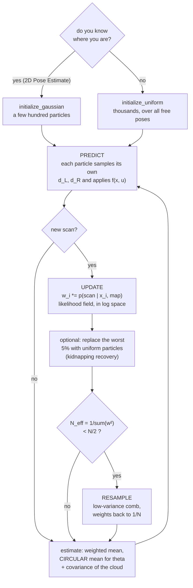

# 10.08 — Particle filters and Monte Carlo localization

<!-- glance:start -->
<!-- generated by tools/build.py from curriculum/syllabus.yaml — edit the syllabus, not this block -->

| | |
|---|---|
| **Track** | Main path |
| **Difficulty** | Advanced |
| **Time** | 1 h 30 min |
| **Hardware** | none |
| **Software** | python, numpy |
| **Prerequisites** | [10.03 The Bayes filter — predict and update on a 1D grid](10.03-bayes-filter.md)<br>[07.07 2D LiDAR — how it works, LaserScan data, and a ROS 2 driver](../07-sensors/07.07-2d-lidar.md) |
| **Optional prerequisites** | [FM.14 Distributions, Gaussians, uncertainty and noise](../optional-foundations/mathematics/FM.14-distributions-gaussians-noise.md) |
| **Skip if** | You have implemented MCL with low-variance resampling. |

<!-- glance:end -->

## What you will learn

- Represent a belief as a weighted cloud of pose hypotheses instead of a Gaussian, and say exactly what that buys you.
- Implement the three steps of MCL: sample the motion model, weight with a sensor model, resample.
- Write the likelihood-field and beam sensor models, both vectorised over all particles at once, and choose between them on evidence.
- Implement low-variance (systematic) resampling, prove its floor/ceil property, and gate resampling on the effective sample size.
- Localize karmel globally with no initial pose, recognise the symmetry failure, and recover from a kidnapping with random injection.

## Why it matters

The EKF of [10.06](10.06-extended-kalman-filter.md) is excellent at *tracking* — as long as you tell it
roughly where the robot starts and nothing surprising happens. It cannot represent "the robot is either
in the kitchen or in the study", because a Gaussian has one peak. Switch karmel on in an unknown spot and
the EKF has nothing to say.

A particle filter drops the Gaussian entirely. The belief becomes a few thousand concrete guesses, each
with a weight; the shape of the distribution is whatever the guesses happen to form — two peaks, a
banana, a ring around a doorway. That is what makes **global localization** and **kidnapped-robot
recovery** possible at all.

This is the algorithm inside Nav2's AMCL ([10.09](10.09-amcl-in-ros2.md)), inside the particle-filter
half of GMapping and FastSLAM ([11.03](../11-slam/11.03-the-slam-problem.md)), and — with a different
sensor model — inside most visual relocalization. You will implement it here so that AMCL's 25
parameters read as things you have already written.

In the measurements below, MCL with **1000 particles** localizes karmel to **4 mm RMSE** over a
50-second tour where dead reckoning ends 75 cm wrong — and finds the robot from scratch, anywhere in the
apartment, in **one second**.

<!-- prereqs:start -->
## Prerequisites

You need these first:

- [10.03 The Bayes filter — predict and update on a 1D grid](10.03-bayes-filter.md)
- [07.07 2D LiDAR — how it works, LaserScan data, and a ROS 2 driver](../07-sensors/07.07-2d-lidar.md)

### Optional prerequisite links

New to any of these? Take the foundation lesson first; skip it if you already know it.

- [FM.14 Distributions, Gaussians, uncertainty and noise](../optional-foundations/mathematics/FM.14-distributions-gaussians-noise.md)

Check your readiness: `python course.py why 10.08`
<!-- prereqs:end -->

> [!NOTE]
> This is the Bayes filter of [10.03](10.03-bayes-filter.md) with a different belief representation: there the belief was a histogram over a 1D grid, here it is a set of samples over a 3D pose space. Everything else — predict, update, normalise — is the same three lines. New to sampling and distributions? → [FM.14 Distributions, Gaussians and noise](../optional-foundations/mathematics/FM.14-distributions-gaussians-noise.md).

## Concept

Imagine 1000 copies of karmel, scattered through the apartment, each convinced it is the real one. They
all receive the same encoder readings and each moves accordingly — but each adds its own plausible dose
of slip, so after a metre they have fanned out. This is the same "belief cloud" you built by hand in
[10.01](10.01-what-is-localization.md), except now the cloud is the filter's actual data structure.

Then the real robot's LiDAR produces a scan. Every copy asks: *if I were really here, would I see that?*
The copy in the middle of the living room would see walls at 2 m in three directions and 4 m ahead — and
the scan says exactly that, so it scores high. The copy inside the kitchen counter would expect a wall
10 cm away; the scan says 4 m, so it scores essentially zero.

Now the trick that makes it work. Rather than keeping the bad copies around forever, **resample**: draw
a new set of 1000 copies, choosing each one with probability proportional to its score. Good hypotheses
get duplicated, bad ones vanish. The duplicates are identical for an instant — and then the next motion
step scatters them again, each with its own slip, so they explore slightly different futures. Over a few
seconds the cloud contracts onto the truth.

Three things fall out of this that no Gaussian filter can do:

- **Any shape of belief.** Two peaks, ten peaks, a smear along a corridor. The cloud just is that shape.
- **No linearization.** Particles go through the *exact* nonlinear motion model; there is no $F$, no $G$, no Jacobian to derive or get wrong.
- **Global localization.** Start with particles everywhere and the filter finds the robot by elimination.

And three prices you pay:

- **Cost.** 1000 particles × 60 beams of sensor model, several times a second, forever.
- **Randomness.** Two runs on identical data give slightly different answers.
- **Particle depletion.** Resampling throws hypotheses away. Throw away the right one and you cannot get it back — which is exactly why a kidnapped robot stays lost until you deliberately add fresh particles.

> [!TIP]
> **Ask your teacher:** "Draw the particle cloud at t = 0, after the first scan, and after five seconds of a global localization run — and tell me what the EKF's ellipse would be doing at each of those moments."

## Technical explanation

### Level 1 — Intuition: three lines, repeated forever

```text
  for every step:
      PREDICT   every particle moves by the odometry + its own random slip     (sampling)
      UPDATE    every particle is weighted by p(scan | that pose, the map)     (importance)
      RESAMPLE  draw N particles in proportion to weight — but only when the   (selection)
                effective sample size says the cloud has become lopsided
```

The EKF's "mean and covariance" become "where the particles are" and "how spread out they are". The
Kalman gain has no counterpart at all: a particle filter never *corrects* a hypothesis, it only keeps
or discards it.

| Extended Kalman filter (10.06) | Particle filter (this lesson) |
|---|---|
| belief = mean $\mathbf{x}$ + covariance $P$ | belief = $N$ poses + $N$ weights |
| predict: $f(\mathbf{x},\mathbf{u})$, $\bar P = FPF^\top + GMG^\top$ | predict: each particle samples its own $\mathbf{u}$ and applies $f$ |
| update: $K$, $\boldsymbol\nu$, Joseph form | update: multiply each weight by $p(\mathbf{z}\mid\mathbf{x}_i)$ |
| needs Jacobians | needs none |
| one peak only | any shape |
| ~10 µs per step | ~1 ms per step (1000 particles, likelihood field) |
| diverges silently when lost | *stays* lost unless you inject particles |

### Level 2 — Practical: the three steps on karmel

**Sampling the motion model.** Keep the same control as the EKF, $\mathbf{u} = [d_L, d_R]$ from the
encoder ticks, and the same noise model, $\sigma^2 = k^2|d|$ per wheel. The difference is that each
particle draws its *own* travels and applies the exact midpoint model:

$$d_L^{(i)} \sim \mathcal N(d_L,\ k^2|d_L|), \quad d_R^{(i)} \sim \mathcal N(d_R,\ k^2|d_R|), \quad \mathbf{x}^{(i)} \leftarrow f(\mathbf{x}^{(i)}, [d_L^{(i)}, d_R^{(i)}])$$

Use a **larger** $k$ than the EKF does (0.02 here versus 0.01). The noise is not only modelling slip: it
is also what keeps the cloud from collapsing to a single point after resampling. A particle filter with
too little motion noise is brittle; with too much it is merely imprecise.

**The likelihood field, which is what AMCL uses.** Take each beam's measured range $r_j$ at angle
$a_j$, project it into the map from the particle's pose, and ask how far that endpoint lands from the
nearest obstacle:

$$\mathbf{e}_j^{(i)} = \begin{bmatrix} x_i + r_j\cos(\theta_i + a_j) \\ y_i + r_j\sin(\theta_i + a_j)\end{bmatrix}, \qquad d_j^{(i)} = \mathrm{dist}(\mathbf{e}_j^{(i)},\ \text{nearest obstacle})$$

$$p_j = z_{hit}\exp\!\left(-\frac{d_j^2}{2\sigma_{hit}^2}\right) + \frac{z_{rand}}{z_{max}}, \qquad w_i \propto \prod_{j=1}^{K} p_j$$

A particle in the right place puts every endpoint *on* a wall, so every $d_j \approx 0$ and every
$p_j$ is large. The distance-to-obstacle field does not depend on the robot at all, so you compute it
**once** for the whole map and every later query is an array index. That is the entire reason this model
is the default: with 1000 particles and 40 beams, the likelihood field costs about a millisecond and ray
casting the same thing costs 200.

The constants are karmel's AMCL values from
[`nav2_params.yaml`](../labs/ros2_ws/src/karmel_bringup/config/nav2_params.yaml):
$\sigma_{hit} = 0.2$ m, $z_{hit} = 0.5$, $z_{rand} = 0.5$, $z_{max} = 12$ m. You will recognise all four
in [10.09](10.09-amcl-in-ros2.md).

**The beam model**, for comparison: ray cast from each particle, compare the expected range with the
measured one. Physically faithful (it models the beam travelling through space, so it can also model
short readings from people walking past), and 7× slower here — far more on a real map. `robotlab`'s
`World.raycast` takes one origin per ray, so all $N \times K$ rays go in **one** vectorised call.

**Resampling.** Do not use `np.random.choice`. Systematic (low-variance) resampling draws **one**
random number and lays $N$ evenly spaced comb teeth on the cumulative-weight axis:

$$u_j = \frac{u_0 + j}{N}, \quad j = 0\ldots N-1, \qquad u_0 \sim \mathcal U[0, 1)$$

and selects the first particle whose cumulative weight exceeds $u_j$. This guarantees a particle of
weight $w$ gets **exactly** $\lfloor Nw\rfloor$ or $\lceil Nw\rceil$ copies. Multinomial sampling only
gets that right on average, and its extra variance is pure noise added to your estimate.

**When to resample.** Not every step. Resampling costs diversity, so only do it when the weights have
actually become lopsided, measured by the effective sample size:

$$N_{eff} = \frac{1}{\sum_i w_i^2}$$

$N_{eff} = N$ when all weights are equal, 1 when one particle holds everything. Resample when
$N_{eff} < N/2$.

### Level 3 — Mathematics: why weighting and resampling is Bayes

The Bayes filter of [10.03](10.03-bayes-filter.md) says

$$bel(\mathbf{x}_k) = \eta\; p(\mathbf{z}_k \mid \mathbf{x}_k) \int p(\mathbf{x}_k \mid \mathbf{x}_{k-1}, \mathbf{u}_k)\, bel(\mathbf{x}_{k-1})\, d\mathbf{x}_{k-1}$$

The integral is what a Gaussian filter approximates with matrices. A particle filter approximates it by
**sampling**: if $\{\mathbf{x}^{(i)}_{k-1}\}$ are draws from $bel(\mathbf{x}_{k-1})$, then drawing each
$\mathbf{x}^{(i)}_k \sim p(\mathbf{x}_k \mid \mathbf{x}^{(i)}_{k-1}, \mathbf{u}_k)$ gives draws from the
integral. No approximation at all — just Monte Carlo error that shrinks as $1/\sqrt N$.

The measurement is handled by **importance sampling**. You cannot draw from the posterior directly, but
you have samples from the prior, so weight each one by the ratio of the two densities — which, when the
proposal is the motion model, is simply $w_i \propto p(\mathbf{z}_k \mid \mathbf{x}^{(i)}_k)$. Resampling
then converts weights back into sample density so the next round starts from equal weights.

**Numbers: why log space is not optional.** With $K = 40$ beams, $z_{hit} = 0.5$, $z_{rand} = 0.5$ and
$z_{max} = 12$, a hopeless particle scores about $p_j \approx z_{rand}/z_{max} = 0.042$ per beam, so
$w \approx 0.042^{40} = 10^{-55}$ — representable, but a run with 60 beams and a sharper $\sigma_{hit}$
reaches $10^{-200}$ and then $0.0$ exactly, and every particle's weight becomes zero at once. Sum the
logs, subtract the maximum, then exponentiate: the best particle becomes $e^0 = 1$ and everything is
expressed relative to it.

**Numbers: the floor/ceil property.** $N = 4$, $\mathbf{w} = [0.1, 0.6, 0.2, 0.1]$, cumulative
$[0.1, 0.7, 0.9, 1.0]$, $u_0 = 0.5$. Teeth at $0.125, 0.375, 0.625, 0.875$ select particles
$1, 1, 1, 2$. Particle 1 has $Nw = 2.4$ and got 3 copies ($\lceil 2.4\rceil$); particle 2 has
$Nw = 0.8$ and got 1 ($\lceil 0.8\rceil$); particles 0 and 3 have $Nw = 0.4$ and got 0
($\lfloor 0.4\rfloor$). Measured over 200 draws with $N = 200$ random weights:

```text
   copy-count variance over 200 draws: low-variance 0.168, multinomial 0.984 (5.9x)
   worst |copies - N*w|: low-variance 0.99 (never more than 1), multinomial 8.40
```

**How many particles?** Enough that at least a few land within the sensor's resolution of the truth. For
tracking, "a few" means dozens. For global localization you must cover the whole configuration space:
karmel's apartment has ≈ 25 m² of free floor, so at 0.25 m × 30° resolution that is
$25/0.0625 \times 12 \approx 4800$ cells — and 1000–3000 particles is enough only because a single
360-beam scan is so informative that one lucky particle per room suffices. KLD-sampling (Fox 2003, the
"A" in AMCL) automates exactly this trade-off: many particles while the cloud is spread, few once it has
converged.

### Level 4 — Implementation: vectorise everything, and never average an angle naively

```python
def likelihood_field_weights(particles, ranges, angles, field, sigma_hit=0.2,
                             z_hit=0.5, z_rand=0.5, max_range=12.0):
    pts = scan_endpoints(particles, ranges, angles)            # (N, K, 2), no Python loop
    d = field.query(pts.reshape(-1, 2)).reshape(pts.shape[:2])  # (N, K) array index
    p = z_hit * np.exp(-0.5 * (d / sigma_hit) ** 2) + z_rand / max_range
    log_w = np.log(p).sum(axis=1)
    log_w -= log_w.max()                                       # or 40 beams underflow to zero
    w = np.exp(log_w)
    return w / w.sum()
```

Four rules that separate a working filter from a mysterious one:

- **No loop over particles, ever.** Every operation is `(N, K)` numpy. A Python loop over 1000 particles turns a 1 ms update into 0.5 s and the filter stops being real-time.
- **The heading estimate needs a circular mean**: $\hat\theta = \mathrm{atan2}\big(\sum_i w_i\sin\theta_i,\ \sum_i w_i\cos\theta_i\big)$. Averaging $+179°$ and $-179°$ arithmetically gives $0°$, which is the opposite direction.
- **The reported mean is only meaningful when the cloud has one peak.** With two peaks the mean sits between them, in a wall. Always report the covariance (or the particle spread) with the mean, and be suspicious of a large one.
- **Subsample the beams.** Neighbouring LiDAR returns hit the same wall, so they are not independent, but the product formula assumes they are. Using all 360 beams makes the filter absurdly overconfident and it will reject the truth after one bad scan. AMCL's `max_beams` defaults to 60 for exactly this reason.

## Diagram



```text
 Low-variance (systematic) resampling: one random number, N evenly spaced teeth

   weights   w = [0.1,      0.6,          0.2,     0.1]
   cumsum      |----0.1----|------0.7------|--0.9--|-1.0|
               0          0.1             0.7    0.9   1.0

   comb (N = 4, u0 = 0.5), teeth at (u0 + j)/N:
                   |         |         |         |
                 0.125     0.375     0.625     0.875
   selects:        1         1         1         2

   particle 0: N*w = 0.4 -> 0 copies      particle 2: N*w = 0.8 -> 1 copy
   particle 1: N*w = 2.4 -> 3 copies      particle 3: N*w = 0.4 -> 0 copies
   Every count is floor(N*w) or ceil(N*w). Multinomial sampling can give particle 1
   anywhere from 0 to 4 copies; that extra variance is noise you did not have to add.
```

## Code

- Exercise (auto-graded): [`labs/exercises/10.08/`](../labs/exercises/10.08/README.md) — `low_variance_resample`, `effective_sample_size`, `sample_motion`, `scan_endpoints`, `likelihood_field_weights`, `beam_weights`, `initialize_uniform`/`initialize_gaussian`, `ParticleFilter`.
- Provided: [`labs/exercises/10.08/mcl_sim.py`](../labs/exercises/10.08/mcl_sim.py) — the precomputed likelihood field and beam subsampling.
- Experiment: [`code/mcl_apartment.py`](code/mcl_apartment.py), tested by `python -m pytest 10-localization/code`.
- Symbols: [`code/NOTATION.md`](code/NOTATION.md).

```bash
python course.py check 10.08
python 10-localization/code/mcl_apartment.py --solution
python 10-localization/code/mcl_apartment.py --solution --quick
```

**1. Tracking, and how many particles you need.** Same 50 s apartment tour as 10.06, LiDAR at 2 Hz,
40 beams per scan:

```text
   dead reckoning        : RMSE  45.1 cm, final  75.5 cm
   MCL,    50 particles : RMSE  0.84 cm, max   1.5 cm, heading  0.7 deg,  47 resamplings, 0.5 s
   MCL,   100 particles : RMSE  0.68 cm, max   1.4 cm, heading  0.7 deg,  50 resamplings, 0.6 s
   MCL,   300 particles : RMSE  0.61 cm, max   1.1 cm, heading  0.7 deg,  49 resamplings, 1.3 s
   MCL,   500 particles : RMSE  0.50 cm, max   0.9 cm, heading  0.7 deg,  49 resamplings, 1.6 s
   MCL,  1000 particles : RMSE  0.41 cm, max   0.9 cm, heading  0.7 deg,  49 resamplings, 2.4 s
   MCL,  3000 particles : RMSE  0.41 cm, max   0.9 cm, heading  0.6 deg,  49 resamplings, 7.4 s
```

Fifty particles already localize to 8 mm, and beyond 1000 nothing improves while the cost triples.
For *tracking*, particles are cheap and the interesting number is the smallest one that works.

**2. Global localization — no initial pose at all:**

```text
     500 particles: converged at    6.5 s, settled error  0.35 cm, 2.2 s
    1000 particles: converged at    1.0 s, settled error  0.19 cm, 2.8 s
    3000 particles: converged at    2.0 s, settled error  0.29 cm, 8.9 s
```

This is the capability the EKF simply does not have. One 360-beam scan in an asymmetric apartment is
almost enough on its own; 1000 particles find the robot at the **first** scan.

**3. And where it fails — a plain rectangular room:**

```text
   final error 213 cm, cloud sigma_x 1.6 cm
   particles near the truth: 0%, near the 180-degree mirror pose: 100%
```

A 4 × 3 m box looks identical rotated by 180°, and driving a symmetric loop does not break the tie. The
filter converged — confidently, with a 1.6 cm spread — onto the *wrong* one of the two poses. Read that
number again: **a small covariance is not evidence of a correct answer.** No filter fixes this; only a
feature that breaks the symmetry, or an initial pose you supply.

**5. Kidnapping, and the recovery that costs you accuracy:**

```text
   plain MCL           : error before 20 s   0.7 cm, after 40 s  122.9 cm
   + 5% random particles: error before 20 s   7.4 cm, after 40 s    6.7 cm
```

Plain MCL is 175× more accurate while it is right, and permanently lost once it is wrong. Injecting 5 %
fresh uniform particles every scan costs a factor of ten in accuracy and buys recovery. That trade-off,
with `recovery_alpha_slow`/`recovery_alpha_fast` deciding *when* rather than *always*, is the last two
parameters of AMCL.

The filter loop itself, from the script:

```python
for i in range(1, len(log.t)):
    pf.predict(travels[i - 1], b, k, rng)          # sample the motion model
    scan = scans.get(i)
    if scan is not None:
        ranges, angles = ms.subsample_scan(scan, beams)
        pf.update(ranges, angles, field)           # importance weights
        pf.resample(rng, ess_ratio)                # only if N_eff < ess_ratio * N
    x = pf.estimate()                              # weighted mean, circular in theta
```

Figures in `localization_out/`: `mcl_runs.png` (error and cloud σ for a tracking and a global run, log
scale — the global one starts at metres and drops off a cliff at the first scan), `mcl_symmetry.png`
(the rectangular room with the whole cloud sitting on the mirror pose), `mcl_kidnap.png`.

## Exercise

All exercises need hardware: **none**.

### Exercise 10.08-E1 — The comb, by hand `[numerical]`

Goal: know the resampling algorithm well enough to debug it.

(a) $N = 5$, $\mathbf{w} = [0.05, 0.35, 0.05, 0.50, 0.05]$, $u_0 = 0.3$. List the five tooth positions,
the cumulative weights, and the five selected indices. How many copies does each particle get, and does
each count match $\lfloor Nw\rfloor$ or $\lceil Nw\rceil$?
(b) Compute $N_{eff}$ for those weights. Would a filter with `ess_ratio = 0.5` resample?
(c) A particle has weight exactly 0. Prove from the algorithm that it can never be selected, for any
$u_0 \in [0, 1)$.

### Exercise 10.08-E2 — Implement MCL `[coding]`

Goal: the filter behind AMCL. Implement everything in `labs/exercises/10.08/student.py`: the two
resampling helpers, the sampled motion model, both sensor models, the two initialisers, and
`ParticleFilter`.

Check it: `python course.py check 10.08`

### Exercise 10.08-E3 — Predict the particle count `[predict]`

Goal: build intuition for the only knob that costs money. **Before running**, predict: (a) the smallest
number of particles that still tracks karmel to better than 5 cm RMSE on the tour; (b) the smallest
number that finds the robot globally within 10 s; (c) the ratio between the two. Write the numbers down,
then run `python 10-localization/code/mcl_apartment.py --solution` and compare. Explain the ratio in terms
of the volume each cloud has to cover.

### Exercise 10.08-E4 — Break it with symmetry `[simulation]`

Goal: learn the one failure that no amount of tuning fixes. Run part 3 of the script. Then:
(a) Report which pose the cloud settled on and what covariance it reported.
(b) Add one feature to the room that breaks the symmetry — a single box against one wall,
`World.from_segments(...)` — rerun, and report the new final error.
(c) Now put the feature exactly in the middle of the room. Does it help? Explain.
(d) Name two places in a real apartment where a 2D LiDAR sees this problem, and one sensor that fixes it.

### Exercise 10.08-E5 — Resample less, and more carelessly `[simulation]`

Goal: feel what resampling costs. Using the tracking run with 300 particles:
(a) Set `ess_ratio` to 1e9 (resample every scan) and to 0.0 (never resample). Report the RMSE and the
number of distinct particles left at the end for each, plus the ESS-gated default.
(b) Replace `low_variance_resample` with `rng.choice(n, size=n, p=w)` (multinomial) and report the RMSE
over five seeds for both. Is the difference visible above the run-to-run scatter?
(c) Run part 4 of the script (the robot standing still) and explain why depletion is worst exactly when
the robot is *not* moving.

### Exercise 10.08-E6 — Recover from the kidnapping, cheaply `[coding]`

Goal: get the recovery without paying for it all the time. Plain MCL: 0.7 cm before the kidnapping,
123 cm after. Constant 5 % injection: 7.4 cm before, 6.7 cm after. Do better: implement the AMCL
trigger — track a short-term and a long-term running average of the *unnormalised* mean particle
weight, $w_{slow} \mathrel{+}= \alpha_{slow}(w_{avg} - w_{slow})$ with $\alpha_{slow} = 0.001$,
$\alpha_{fast} = 0.1$, and inject $\max(0, 1 - w_{fast}/w_{slow})$ of the particles.
Report the error before and after the kidnapping and the detection latency, over five seeds.

### Exercise 10.08-E7 — The beam model's one advantage `[debugging]`

Goal: know when to pay for ray casting. Add a moving obstacle the map does not contain: after each
scan, overwrite 25 % of consecutive beams with a range of 0.5 m (a person standing next to the robot).
Run the tour with the likelihood field and with the beam model, report both RMSE values, and explain the
difference in terms of what each model does with a *short* reading. Then find the parameter in each
model that makes it more tolerant, and show it working.

## Expected result

- **10.08-E1:** (a) cumulative $[0.05, 0.40, 0.45, 0.95, 1.00]$; teeth at $0.06, 0.26, 0.46, 0.66, 0.86$;
  selected indices $[1, 1, 3, 3, 3]$. Counts: particle 0 → 0 ($Nw = 0.25$), particle 1 → 2 ($Nw = 1.75$,
  so $\lceil\cdot\rceil$), particle 2 → 0 ($Nw = 0.25$), particle 3 → 3 ($Nw = 2.5$, so
  $\lceil\cdot\rceil$), particle 4 → 0. Every count is the floor or ceiling.
  (b) $N_{eff} = 1/(0.0025 + 0.1225 + 0.0025 + 0.25 + 0.0025) = 1/0.38 = 2.63$; $N/2 = 2.5$, so
  $2.63 > 2.5$ and it would **not** resample — just.
  (c) A zero-weight particle $i$ has $\mathrm{cum}_i = \mathrm{cum}_{i-1}$. Selection picks the first
  index whose cumulative weight strictly exceeds the tooth; index $i$ can only be first if
  $\mathrm{cum}_{i-1} \le u_j < \mathrm{cum}_i$, an empty interval. So never.
- **10.08-E2:** `python course.py check 10.08` → `27 passed`. The end-to-end tests allow 10 cm mean
  tracking error; the reference achieves 0.5 cm, so a passing filter that is 10× worse than that is
  still telling you something is wrong.
- **10.08-E3:** (a) 50 particles already give 0.84 cm RMSE — tracking is far cheaper than most people
  guess. (b) 500 particles converge at 6.5 s, 1000 at 1.0 s; so "within 10 s" is met from about 500.
  (c) A ratio of roughly 10–20×. Tracking only has to cover the few cm³ of pose space the robot could
  have reached since the last scan; global localization has to cover 25 m² × 360°, which is four or five
  orders of magnitude larger — the ratio is small only because one full LiDAR scan eliminates almost all
  of it at once.
- **10.08-E4:** (a) The cloud settles on the 180°-rotated pose: 100 % of particles within 50 cm of it,
  0 % near the truth, final error 213 cm, reported $\sigma_x$ **1.6 cm**. (b) One asymmetric box drops the
  final error to a few centimetres, usually within the first two or three scans that see it. (c) A feature
  at the exact centre does *not* help: it is invariant under the same 180° rotation, so it appears in both
  hypotheses identically. Symmetry is broken by asymmetric features, not by any feature. (d) A long
  featureless corridor (translation along it is nearly unobservable) and a square/rectangular empty room
  or a row of identical doorways; a camera (AprilTags — [10.10](10.10-fiducial-landmarks.md) — or visual
  features) fixes both, because texture is almost never symmetric.
- **10.08-E5:** (a) Resampling every scan costs diversity without buying accuracy; never resampling lets
  one particle take all the weight and the estimate stops moving. On the standing-still test the script
  measures 40 resamplings → **4 distinct particles left**, versus 3 resamplings → 8 distinct, from the
  same 300. (b) Multinomial resampling is measurably noisier — the copy-count variance is 5.9× larger
  (0.168 vs 0.984 in the script) — but with 300 particles and a very informative LiDAR the RMSE
  difference is often inside the seed-to-seed scatter. That is the honest answer: low-variance resampling
  is free, so use it, but it is not what saves a broken filter. (c) Standing still, every scan is the same
  and the motion model adds no new samples, so each resampling can only delete hypotheses and nothing
  ever regenerates them.
- **10.08-E6:** The adaptive trigger should keep the pre-kidnapping error near the plain filter's
  (under ~2 cm, versus 7.4 cm for constant injection) and still recover after the kidnapping to within
  ~10 cm, with a detection latency of one to three seconds. If it never triggers, your $w_{avg}$ is
  normalised — the trigger needs the **unnormalised** mean likelihood, because normalised weights always
  average $1/N$ no matter how wrong the cloud is.
- **10.08-E7:** The likelihood field degrades gracefully (a few centimetres of extra error): a short
  reading lands its endpoint somewhere in free space, gets a distance of up to `max_dist`, and is simply
  scored low — the same as any other unexplained beam. The beam model degrades more sharply because a
  reading much shorter than the expected range is *strongly* penalised by the Gaussian unless you model
  it. The tolerance knobs are `z_rand` in both (raise it to let unexplained beams cost less) and, in a
  full beam model, the dedicated $z_{short}$ exponential term — which is exactly what AMCL's `z_short`
  and `lambda_short` parameters are for.

## Troubleshooting

### Symptom: every weight is `nan` or every weight is zero

1. You are multiplying probabilities. `np.log(p).sum(axis=1)`, subtract the max, then `np.exp`. Check with 40 beams: `0.042 ** 40` is 1e-55 and with 60 it is 0.0.
2. If the logs are fine but you still get `nan`: a `p` of exactly 0. The `z_rand / max_range` floor exists to make that impossible — check you added it.
3. Guard the normalisation: if `w.sum()` is 0 or non-finite, reset to uniform rather than dividing.

### Symptom: the filter tracks for a while and then jumps somewhere wrong

1. Log $N_{eff}$ at every update. If it sits near 1, the cloud has collapsed onto a single hypothesis and any bad scan takes it away. Raise the motion noise $k$ and/or the particle count.
2. If $N_{eff}$ is healthy, look at how many beams you are using. All 360 makes the product wildly overconfident; subsample to 40–60.
3. Check you are not resampling every step (`ess_ratio` too large).

### Symptom: global localization never converges

1. Print the fraction of particles within 50 cm of the truth after the first update. If it is 0, you do not have enough particles to have one *anywhere* near the right pose — raise $N$ before touching anything else.
2. Check `initialize_uniform` actually covers the headings: `particles[:, 2].std()` should be ≈ 1.8 rad, not 0.1.
3. Check $\sigma_{hit}$. Too small (0.02) and even a nearly-correct particle scores zero, so the filter has nothing to climb toward; 0.2 m is the AMCL default for a reason.
4. Check the map and the scan are in the same frame and the same units — a likelihood field built from a different world silently gives every particle the same terrible weight.

### Symptom: the reported pose is in a wall

1. The cloud is multimodal and you are printing its mean. Print the covariance too, or the largest cluster. A σ above ~50 cm means the mean is meaningless.
2. Check the heading estimate uses `atan2(Σ w sinθ, Σ w cosθ)`. An arithmetic mean of headings near ±π gives 0, which usually drags the position estimate with it in the next predict.

### Symptom: it is too slow

1. Look for a Python loop over particles. There must not be one.
2. Use the likelihood field, not ray casting (7× here, far more on a big map).
3. Subsample beams: 40 instead of 360 is 9× on its own and *improves* the filter.
4. Only then reduce the particle count — and measure, because 50 may well be enough for tracking.

## Common mistakes

- **Multiplying probabilities instead of summing logs.** Silent underflow to a cloud of zeros.
- **Using all 360 beams.** Treats correlated measurements as independent; the filter becomes so confident it rejects the truth.
- **Resampling every step.** Diversity is what lets the cloud follow the robot; each resampling spends some.
- **Too little motion noise.** The cloud collapses and cannot re-expand; particle filters want *more* noise than an EKF.
- **`np.random.choice` instead of the comb.** Works, adds variance for nothing.
- **Averaging headings arithmetically.** ±179° must average to 180°.
- **Trusting the mean of a multimodal cloud** — and trusting a small covariance as evidence of correctness (the rectangular room says 1.6 cm while being 2.1 m wrong).
- **Expecting recovery from a kidnapping without injecting particles.** The hypothesis is gone; nothing brings it back.

## Knowledge check

1. Name two things a particle filter can represent that an EKF cannot, and one thing the EKF does better.
   <details><summary>Answer</summary>

   A multimodal belief ("kitchen or study") and a belief of arbitrary shape (the banana after a long
   drive with heading uncertainty, or a ring around a doorway). It also needs no Jacobians, so the
   nonlinear motion model is used exactly. The EKF is orders of magnitude cheaper and deterministic, and
   its covariance is an exact, compact summary rather than a sampled one.
   </details>

2. $N = 4$, $\mathbf{w} = [0.1, 0.6, 0.2, 0.1]$, $u_0 = 0.5$. Which particles are selected?
   <details><summary>Answer</summary>

   Cumulative $[0.1, 0.7, 0.9, 1.0]$; teeth at $0.125, 0.375, 0.625, 0.875$ → indices $[1, 1, 1, 2]$.
   Particle 1 gets 3 copies ($Nw = 2.4$), particle 2 gets 1 ($Nw = 0.8$), particles 0 and 3 get none.
   </details>

3. Why is the likelihood-field model so much cheaper than the beam model, and what does it give up?
   <details><summary>Answer</summary>

   The obstacle-distance field is a property of the map alone, so it is computed once and every query is
   an array index; the beam model must cast a ray per particle per beam, every scan. It gives up any
   model of *how the beam travelled*: it cannot distinguish a short reading caused by an unmapped
   obstacle from a wrong pose, and it ignores occlusion. In practice that costs little indoors, which is
   why AMCL defaults to it.
   </details>

4. Predict: you switch from 60 beams to all 360. What happens to the filter and why?
   <details><summary>Answer</summary>

   Weights are a product over beams, which assumes independence. Neighbouring returns hit the same wall
   and are strongly correlated, so 360 beams multiply the same evidence six times over. The weight
   distribution becomes enormously peaked, $N_{eff}$ collapses to ~1 after every update, the filter
   resamples down to one hypothesis, and the first slightly-off scan throws it somewhere wrong. More data,
   worse filter.
   </details>

5. Your filter reports a pose with $\sigma_x = 1.6$ cm and it is 2.1 m from the truth. What happened, and
   what should you have logged?
   <details><summary>Answer</summary>

   The environment is symmetric (a plain rectangular room is identical under a 180° rotation), so the
   cloud collapsed onto one of two indistinguishable hypotheses — the wrong one — and is genuinely tightly
   clustered *there*. A small covariance says "the particles agree", not "the particles are right". Log
   the number of distinct clusters or the weight of the second-best mode before it collapses, and supply
   an initial pose in symmetric spaces.
   </details>

6. What is $N_{eff}$, what does it mean when it equals 1, and what do you do about it?
   <details><summary>Answer</summary>

   $N_{eff} = 1/\sum_i w_i^2$: how many particles are effectively contributing. $N_{eff} = 1$ means one
   particle holds all the weight, so the belief is a single point and any error in it is permanent.
   Respond by raising the motion noise $k$, raising $N$, or reducing the number of beams so each update
   is less peaked. Resampling does *not* fix it — resampling is what spent the diversity.
   </details>

7. A robot is picked up and moved 3 m. The particle filter keeps reporting the old location. Why, and
   what is the fix and its cost?
   <details><summary>Answer</summary>

   There are no particles at the new location, and the filter can only rank hypotheses it already has —
   it has no mechanism to invent one. The fix is to replace some particles with uniformly sampled ones
   (AMCL's `recovery_alpha_slow`/`recovery_alpha_fast`). The cost is accuracy while the robot is *not*
   lost: constant 5 % injection took the tracking error from 0.7 cm to 7.4 cm in the measurement above,
   which is why AMCL triggers it on a drop in average particle weight instead of doing it always.
   </details>

8. For the same robot and map, would you use more particles for tracking or for global localization, and
   by roughly what factor?
   <details><summary>Answer</summary>

   Far more for global localization: tracking only needs to cover the small pose volume reachable since
   the last scan, while global localization must cover every free pose of the map. Measured here: 50
   particles track to 8 mm, while 500–1000 are needed to find the robot reliably — about 10–20×. AMCL's
   `min_particles`/`max_particles` and KLD-sampling exist to move between the two automatically.
   </details>

## Practical challenge

**Build a localization system that survives being switched on in the wrong room.**

Acceptance criteria:

- Combine your MCL with the EKF from [10.06](10.06-extended-kalman-filter.md): run the particle filter
  until the cloud's position σ falls below 10 cm and stays there for 3 s, then hand its mean and
  covariance to the EKF as $\mathbf{x}_0$, $P_0$ and switch to landmark updates. Report the handover
  time and the error at handover.
- Add a watchdog that switches *back* to MCL: define it from the EKF's own telemetry (NIS, or the
  landmark rejection rate from 10.06's gate), not from ground truth. State your threshold and justify it.
- Evaluate over 10 seeds of `drive_tour(kidnap_at_s=20.0, kidnap_to=(5.0, 4.2, 0.0))`: report the mean
  and worst detection latency, the mean recovery time, and the position RMSE before the kidnapping.
  Your hybrid must beat both pure filters: better than constant-injection MCL before the kidnapping, and
  better than the EKF after it.
- One paragraph comparing your handover logic with what Nav2 actually does (AMCL for `map → odom`,
  `robot_localization` for `odom → base_link` — [10.07](10.07-fusing-imu-and-odometry.md),
  [10.09](10.09-amcl-in-ros2.md)), and why the real system splits the job by *frame* rather than by time.

## You can skip this if…

You have implemented MCL with low-variance resampling. Prove it: answer knowledge-check questions
2, 4, 5 and 6 **without looking**, do Exercise 10.08-E1 on paper, and pass `python course.py check 10.08`.
Then:

`python course.py skip 10.08 --reason "implemented MCL with low-variance resampling, ESS gating and kidnapping recovery"`

## Go deeper

- https://doi.org/10.1109/ROBOT.1999.772544 — Dellaert, Fox, Burgard & Thrun, *Monte Carlo Localization for Mobile Robots* (ICRA 1999): the original, and short.
- https://doi.org/10.1016/S0004-3702(01)00069-8 — Thrun, Fox, Burgard & Dellaert, *Robust Monte Carlo Localization for Mobile Robots*: the journal version, with the kidnapped-robot analysis and Mixture-MCL.
- https://doi.org/10.1177/0278364903022012001 — Fox, *Adapting the Sample Size in Particle Filters Through KLD-Sampling*: the "A" in AMCL, and where `min_particles`, `max_particles`, `pf_err` and `pf_z` come from.
- https://mitpress.mit.edu/9780262201629/probabilistic-robotics/ — *Probabilistic Robotics*, ch. 4 (particle filters), 6.3–6.4 (beam and likelihood-field models) and 8.3 (MCL, augmented MCL and KLD-sampling). Table 8.2 is the algorithm you implemented.
- https://arxiv.org/abs/1301.0607 — Thrun, *Particle Filters in Robotics*: a short overview of where else this shows up.
- https://github.com/rlabbe/Kalman-and-Bayesian-Filters-in-Python — Labbe, chapter "Particle Filters": the same algorithm with more plots and an interactive resampling comparison.
- [`references/papers.md` §1.3–1.4](../references/papers.md#13-monte-carlo-localization-for-mobile-robots) — the reading guide for the MCL and KLD-sampling papers.

## Progress checkpoint

- [ ] I can explain a particle filter as the Bayes filter with a sampled belief, and name what it buys and costs.
- [ ] I implemented sampling, weighting and low-variance resampling, and can prove the floor/ceil property.
- [ ] I can write both sensor models vectorised over all particles, and choose between them on evidence.
- [ ] I use $N_{eff}$ to decide when to resample, and I know what particle depletion looks like.
- [ ] I can localize globally, recognise the symmetry failure, and recover from a kidnapping.

`python course.py complete 10.08` (exercises done) · `python course.py master 10.08` (challenge done) · `python course.py struggle 10.08 "what was hard"`

Next: [10.09 — AMCL in ROS 2: localizing on a known map](10.09-amcl-in-ros2.md).
