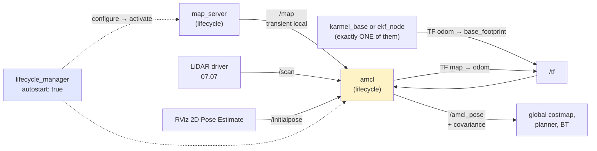

# 10.09 — AMCL in ROS 2: localizing on a known map

<!-- glance:start -->
<!-- generated by tools/build.py from curriculum/syllabus.yaml — edit the syllabus, not this block -->

| | |
|---|---|
| **Track** | Main path |
| **Difficulty** | Intermediate |
| **Time** | 1 h |
| **Hardware** | none |
| **Software** | ros2, nav2 |
| **Prerequisites** | [10.08 Particle filters and Monte Carlo localization](10.08-particle-filter-mcl.md)<br>[06.07 Simulated LiDAR, camera, depth and IMU — with realistic noise](../06-simulation/06.07-simulated-sensors-and-noise.md) |
| **Version-sensitive** | yes — see [curriculum/versions.yaml](../curriculum/versions.yaml) |
| **Skip if** | You localize a robot on a saved map with AMCL and can tune it. |

<!-- glance:end -->

## What you will learn

- Bring up `map_server` + `amcl` + `lifecycle_manager` and check that all three actually reached `active`.
- Explain the `map → odom → base_footprint` chain: what AMCL publishes, what it never touches, and why the split exists.
- Give AMCL an initial pose from RViz, from a launch argument or from a topic, and know why the first one you send can be silently lost.
- Read karmel's `amcl` parameter block as the particle filter you wrote in 10.08, and tune the handful that matter.
- Diagnose the four failures that account for almost every "AMCL doesn't work": no initial pose, a wrong initial pose, a broken TF tree, and a map that no longer matches the room.

## Why it matters

[10.08](10.08-particle-filter-mcl.md) gave you a particle filter. AMCL is that filter, written in
C++, wrapped in a ROS 2 lifecycle node, and depended on by every Nav2 stack that navigates a
pre-built map. You will not rewrite it. You *will* spend evenings working out why the robot model
sits confidently in the wrong room.

AMCL's job is one transform: **`map → odom`**. Wheel odometry (or `robot_localization`, from
[10.07](10.07-fusing-imu-and-odometry.md)) provides a smooth `odom → base_footprint` that drifts;
AMCL measures how far that drift has gone and publishes the correction. Everything downstream — the
global costmap, the planner, "go to the kitchen" — reads the composed `map → base_footprint`.

Measured below on karmel's simulated apartment: dead reckoning ends the 50-second tour **81 cm**
wrong; the same run with AMCL correcting it stays within **15 cm** throughout and ends **6 cm** out.
Given a wrong initial pose 1.4 m and 60° off, AMCL recovers in under 10 seconds. Given one in the
wrong room, it **never recovers** — and reports a 59 cm standard deviation while being 4.3 m wrong.

<!-- prereqs:start -->
## Prerequisites

You need these first:

- [10.08 Particle filters and Monte Carlo localization](10.08-particle-filter-mcl.md)
- [06.07 Simulated LiDAR, camera, depth and IMU — with realistic noise](../06-simulation/06.07-simulated-sensors-and-noise.md)

### Optional prerequisite links

None.

Check your readiness: `python course.py why 10.09`
<!-- prereqs:end -->

> [!IMPORTANT]
> **Version-sensitive** (verified 2026-09 against ROS 2 Jazzy, `ros-jazzy-nav2-amcl` **1.3.13**,
> `ros-jazzy-nav2-map-server` 1.3.13, Nav2 1.3.x).
> Parameter names, defaults and the lifecycle behaviour change between Nav2 releases. Check the
> current page before copying anything:
> https://docs.nav2.org/jazzy/configuration_and_development/configuration_guide/others/configuring_amcl/
> AI teacher: verify against current documentation before giving install or config instructions.

## Concept

You already wrote AMCL. In [10.08](10.08-particle-filter-mcl.md) you sampled a motion model,
weighted particles with a likelihood field, resampled with a comb and watched the cloud converge.
AMCL is the same three steps, plus four pieces of ROS plumbing:

1. **It gets its motion from TF, not from a topic.** AMCL looks up `odom → base_footprint` at each
   scan's timestamp and uses the *change* since the last scan as the control. It never integrates
   anything itself. This is why a broken or duplicated `odom → base_footprint` transform breaks AMCL
   in ways that look like a sensor problem.
2. **It publishes a correction, not a pose.** It computes where the robot is in `map`, subtracts
   where odometry thinks it is in `odom`, and broadcasts the difference as `map → odom`. The robot's
   pose in `map` is then whatever TF composes. Nothing in the chain jumps except `map → odom`.
3. **It is a lifecycle node.** It does nothing at all until something transitions it through
   `configure` and `activate` — that something is `lifecycle_manager`. A silent AMCL is far more
   often an inactive AMCL than a misconfigured one.
4. **It will not start without an initial pose.** By default `set_initial_pose: false`, and AMCL
   logs `AMCL cannot publish a pose or update the transform. Please set the initial pose...` forever
   until you send one — from RViz's *2D Pose Estimate*, from the `initial_pose` parameters, or on
   `/initialpose`.

The last point deserves its own warning, because it is the single most common way this lesson goes
wrong: **AMCL acts on an `/initialpose` only if its subscription has already matched, and it
transforms that pose through TF at the message's timestamp.** Publish too early and it is dropped
with no error; stamp it with `now()` and the TF lookup can fail with `Failed to transform initial
pose in time`. Both happened while producing the numbers in this lesson.

> [!TIP]
> **Ask your teacher:** "Draw the TF tree with AMCL running and tell me, for each edge, which node publishes it, how often, and whether it is allowed to jump."

## Technical explanation

### Level 1 — Intuition: the correction, not the answer

```text
   Without AMCL                              With AMCL
   odom ──► base_footprint                   map ──► odom ──► base_footprint
        (drifts 81 cm over 50 s)               ▲       ▲
                                               │       └ karmel_base / ekf_node
                                               └ amcl, "how wrong has odom become?"

   The robot's pose in map = (map→odom) ∘ (odom→base_footprint)
   odom→base_footprint : smooth, continuous, 30–50 Hz, NEVER jumps  — controllers use this
   map→odom            : a slow correction, ~2 Hz, ALLOWED to jump  — planners use the composition
```

A useful mental test: if AMCL dies, the robot keeps driving on stale odometry and gradually drifts —
it does not lurch. That is the whole reason REP-105 splits the chain here instead of having one node
publish `map → base_footprint`.

### Level 2 — Practical: bringing it up, and karmel's parameters

Three nodes, in this order:

| Node | Does | Key parameter |
|---|---|---|
| `nav2_map_server/map_server` | loads `apartment.yaml` + `.pgm`, publishes `/map` (transient local) | `yaml_filename` |
| `nav2_amcl/amcl` | the particle filter; subscribes `/scan` + `/map` + `/initialpose` + TF, publishes `/amcl_pose`, `/particle_cloud` and `map → odom` | see below |
| `nav2_lifecycle_manager/lifecycle_manager` | transitions both to `active` | `node_names`, `autostart` |

```bash
ros2 launch karmel_bringup robot.launch.py sim:=true world:=apartment
ros2 launch karmel_bringup navigation.launch.py                       # map_server + amcl + Nav2
ros2 launch karmel_bringup navigation.launch.py initial_pose:=true x:=-1.0 y:=0.0 yaw:=0.0
```

Always check the lifecycle state before believing anything else:

```bash
ros2 lifecycle get /map_server   # -> active [3]
ros2 lifecycle get /amcl         # -> active [3]
```

Three services are worth knowing (verified on `nav2_amcl` 1.3.13; `ros2 service list` shows them once
AMCL is active):

```bash
ros2 service call /set_initial_pose nav2_msgs/srv/SetInitialPose   "{pose: {header: {frame_id: map}, pose: {pose: {position: {x: 1.0, y: 1.3}, orientation: {w: 1.0}}}}}"
ros2 service call /reinitialize_global_localization std_srvs/srv/Empty   # scatter particles everywhere
ros2 service call /request_nomotion_update std_srvs/srv/Empty            # update without moving
```

`/particle_cloud` (`nav2_msgs/ParticleCloud`) is the cloud itself — add it to RViz and you are looking
at the same picture you plotted in [10.08](10.08-particle-filter-mcl.md). Watch it while the robot
drives; it tells you more than the covariance ever will.

Now karmel's `amcl` block from
[`nav2_params.yaml`](../labs/ros2_ws/src/karmel_bringup/config/nav2_params.yaml), read as the filter
you already wrote:

| Parameter | karmel | Nav2 default | What it is, in 10.08's words |
|---|---|---|---|
| `min_particles` / `max_particles` | 200 / 1000 | 500 / 2000 | the particle count, adapted by KLD-sampling; halved because a Pi 5 also runs the LiDAR driver and Nav2 |
| `pf_err`, `pf_z` | 0.05, 0.99 | same | the KLD bound: how much error at what confidence, which decides where between min and max the count sits |
| `laser_model_type` | `likelihood_field` | `likelihood_field` | your `likelihood_field_weights`; `beam` is your `beam_weights` |
| `max_beams` | 60 | 60 | subsample the scan — 360 correlated beams make the filter overconfident (10.08) |
| `sigma_hit`, `z_hit`, `z_rand`, `z_max`, `z_short` | 0.2, 0.5, 0.5, 0.05, 0.05 | same | exactly the constants in your weight formula |
| `laser_likelihood_max_dist` | 2.0 | 2.0 | where the precomputed distance field is clipped |
| `alpha1 … alpha5` | 0.2 | 0.2 | the motion-model noise — your `k`, split into rotation/translation cross-terms |
| `update_min_d` / `update_min_a` | 0.15 m / 0.2 rad | 0.25 / 0.2 | move this far before doing an update at all; lowered because karmel is slow |
| `resample_interval` | 1 | 1 | resample every update (AMCL does not use an ESS test) |
| `recovery_alpha_slow` / `_fast` | 0.0 / 0.0 | 0.0 / 0.0 | your `inject_random`, triggered by a drop in average particle weight. **0.0 disables it.** Nav2 suggests 0.001 / 0.1 |
| `transform_tolerance` | 1.0 | 1.0 | how far into the future the published `map → odom` is timestamped |
| `tf_broadcast` | true | true | publish `map → odom` at all |
| `set_initial_pose` | false | false | take the pose from `initial_pose.*` instead of waiting for a message |
| `save_pose_rate` | 0.5 | 0.5 | Hz at which the last pose is stored, so a restart resumes where it was |

The four you will actually change: `max_particles` (CPU), `update_min_d` (how often it works),
`alpha1…5` (how much the cloud spreads per metre), and `recovery_alpha_*` (whether it can come back
from being lost).

### Level 3 — Mathematics: what "AMCL is honest" means here

AMCL reports a pose *and* a 6×6 covariance on `/amcl_pose`, computed from the weighted particle
cloud — the same `covariance()` you wrote. It is a genuine second moment of the cloud, which means it
answers "do my particles agree?" and **not** "am I right". Those coincide only while the belief is
unimodal, which is exactly when you least need the warning.

The measurements. Same 50-second apartment tour as 10.06–10.08, replayed into the real `amcl` binary
with the real `map_server` (see the harness in the Code section). Odometry is the raw dead-reckoned
pose and drifts 81 cm; the LiDAR is 360 beams at 5 Hz; AMCL publishes 91 poses over the run.

| Initial pose given | how wrong | mean error | max | final | mean after 10 s | reported σ_x, start → end |
|---|---|---|---|---|---|---|
| (1.00, 1.30, 0°) — correct | 0 | **7.2 cm** | 15.0 cm | 6.4 cm | 6.8 cm | 46 cm → 16 cm |
| (2.00, 2.30, 60°) | 1.4 m, 60° | 18.0 cm | 133 cm | 3.4 cm | **7.4 cm** | 50 cm → 16 cm |
| (4.80, 4.20, 0°) — wrong room | 3.9 m | **290 cm** | 473 cm | 429 cm | 272 cm | 49 cm → **59 cm** |

Read the third row carefully. With `recovery_alpha_slow`/`_fast` at their default `0.0`, AMCL has no
mechanism to create particles anywhere it has not already placed them. The cloud never reaches the
living room, so no particle can ever explain the scan; the filter stays in the bedroom for the entire
run, 4.3 m wrong, while reporting a 59 cm standard deviation. Its covariance grew by 10 cm. **The
covariance is a measure of agreement, not of correctness** — the same lesson the rectangular room
taught in [10.08](10.08-particle-filter-mcl.md), now from a production implementation.

Row two is the cheerful one: AMCL only needs the initial pose to be *roughly* right. 1.4 m and 60°
off, it is 1.33 m wrong at worst and back under 15 cm within ten seconds. In practice, "click
approximately where the robot is in RViz, then drive it around a little" is a real procedure that
works.

### Level 4 — Implementation: the frames, the timing, and the failure I actually hit

**One publisher of `odom → base_footprint`.** While producing the table above, a stray
`robot_localization` `ekf_node` was left running next to the odometry replay. Both published
`odom → base_footprint`; AMCL saw a transform that alternated between two answers, computed enormous
motion deltas, and scattered its particles to a reported σ of **918 m** — on a 6 × 5 m map. The
symptom looked like a broken sensor model. The cause was [10.07](10.07-fusing-imu-and-odometry.md)'s
rule, ignored by one process nobody remembered starting:

```bash
ros2 run tf2_tools view_frames        # look at the broadcaster of every edge
ros2 node list | grep -E "ekf|base"   # who is still alive?
```

**Timestamps decide whether your initial pose is used.** AMCL's `initialPoseReceived` transforms the
message through `base_footprint → odom` *at the message's stamp*, and tf2 refuses to extrapolate into
the future. A pose stamped with `now()` loses that race:

```text
[WARN] [amcl]: Failed to transform initial pose in time (Lookup would require extrapolation into
the future. Requested time 1789828440.876446 but the latest data is at time 1789828440.863926,
when looking up transform from frame [base_footprint] to frame [odom])
```

Stamp it slightly in the past (the course's replay node backdates by 0.2 s), and only send it once
the subscription has matched:

```python
# 10-localization/code/ros2/replay_scan.py
if self.init_pub.get_subscription_count() == 0 and self.now() < self.deadline:
    return                                   # AMCL is not listening yet; the message would vanish
stamp = self.get_clock().now().nanoseconds - int(POSE_BACKDATE_S * 1e9)
```

And do **not** publish it repeatedly "to be sure": every `/initialpose` message resets the whole
particle cloud to a pose the robot has since driven away from. Sending it twelve times over six
seconds produced an estimate 800 m outside the map.

**Scan timing.** AMCL needs `odom → base_footprint` to *bracket* the scan's timestamp. Publish TF at
30–50 Hz and let the scan's stamp be its real acquisition time; if your driver stamps late, you will
see `Lookup would require extrapolation` on every scan and no updates at all.

**Map frame conventions.** `map_server` reads a PGM plus a YAML with `resolution`, `origin` and the
thresholds. `robotlab`'s `OccupancyGrid.save()` writes exactly that format, so a map made in the
simulator loads in ROS without conversion:

```text
map   : 132 x 112 cells at 0.05 m, origin (-0.3, -0.3), 2195 occupied / 12589 free
[INFO] [map_io]: Read map apartment.pgm: 132 X 112 map @ 0.05 m/cell
```

## Diagram



```text
 Bring-up order, and where it usually stops

   1. map_server loads the .pgm/.yaml ......... "Read map apartment.pgm: 132 X 112 @ 0.05 m/cell"
   2. lifecycle_manager configures + activates  "Managed nodes are active"     <- check this
   3. amcl subscribes to /map, /scan, TF ...... "Subscribed to map topic"
   4. an initial pose arrives ................. "initialPoseReceived" then "Setting pose (...)"
   5. the robot moves update_min_d = 0.15 m ... first /amcl_pose, first map->odom
                                                     ^
      Stuck at 4 forever?  "AMCL cannot publish a pose or update the transform.
                            Please set the initial pose..."   <- 90% of all AMCL problems
```

## Code

- Map + replay data (runs anywhere): [`code/export_replay.py`](code/export_replay.py) — writes `apartment.yaml` + `apartment.pgm` in `map_server` format, plus the tour log.
- The AMCL harness: [`code/ros2/replay_scan.py`](code/ros2/replay_scan.py) publishes `/scan`, the drifting `odom → base_footprint` and one `/initialpose`, then grades `/amcl_pose` against the truth. [`code/ros2/README.md`](code/ros2/README.md) has the container recipe.
- ROS 2 config: the `amcl:` block of [`nav2_params.yaml`](../labs/ros2_ws/src/karmel_bringup/config/nav2_params.yaml); launch: [`navigation.launch.py`](../labs/ros2_ws/src/karmel_bringup/launch/navigation.launch.py).
- The Python filter this wraps: [`labs/exercises/10.08/`](../labs/exercises/10.08/README.md).

```bash
# 1. make the map and the tour (no ROS needed)
python 10-localization/code/export_replay.py --out localization_out/replay

# 2. in a ROS 2 Jazzy environment: map_server + amcl + lifecycle_manager
ros2 run nav2_map_server map_server --ros-args \
  -p yaml_filename:=localization_out/replay/apartment.yaml -p use_sim_time:=false &
ros2 run nav2_amcl amcl --ros-args \
  --params-file labs/ros2_ws/src/karmel_bringup/config/nav2_params.yaml -p use_sim_time:=false &
ros2 run nav2_lifecycle_manager lifecycle_manager --ros-args -p autostart:=true \
  -p use_sim_time:=false -p "node_names:=['map_server','amcl']" &
ros2 lifecycle get /map_server && ros2 lifecycle get /amcl     # both must say active [3]

# 3. replay the tour and grade it
python3 10-localization/code/ros2/replay_scan.py \
  --data localization_out/replay --label good --init 1.0 1.3 0.0
```

```text
=== AMCL run 'good': 91 /amcl_pose messages ===
position error : mean   7.2 cm, max    15.0 cm, final   6.4 cm
heading error  : mean   4.2 deg, final   2.1 deg
after t = 10 s : mean   6.8 cm, max    14.9 cm
reported sigma : x    46.2 cm ->  16.1 cm
                 yaw  26.7 deg ->  14.6 deg
```

Each run also writes a CSV (`amcl_good.csv`) with the estimate, the truth, the per-sample errors and
the reported covariance, so you can plot the convergence yourself.

## Exercise

E1, E2, E3 and E5 need hardware: **none** (simulation or the headless replay). E4 needs
`robot-base` and `lidar` from [HARDWARE.md](../HARDWARE.md), with a simulation alternative.

> [!CAUTION]
> **Safety:** Exercise 10.09-E4 drives the real robot around a room with a LiDAR spinning. The
> RPLIDAR-class scanner is eye-safe Class 1 — say so and move on — but the robot is not: keep the
> power switch reachable, keep pets and children out of the area, and start with the wheels on the
> ground only after `/amcl_pose` looks sane on a stationary robot. See [SAFETY.md](../SAFETY.md).

### Exercise 10.09-E1 — Bring it up and read the tree `[simulation]`

Goal: the bring-up you will repeat for the rest of the course. Start the simulated robot and
`navigation.launch.py`, then answer with evidence: (a) `ros2 lifecycle get` for both managed nodes;
(b) the output of `ros2 run tf2_tools view_frames` — list every edge, its broadcaster and its rate;
(c) `ros2 topic hz /amcl_pose` before and after you give an initial pose; (d) what changes in
`ros2 run tf2_ros tf2_echo map odom` as the robot drives, and what changes in
`tf2_echo odom base_footprint`.

### Exercise 10.09-E2 — Predict the three initial poses `[predict]`

Goal: know what AMCL can and cannot recover from. **Before running**, predict for each of a correct
initial pose, one 1.4 m / 60° off, and one in the wrong room: (a) does it converge, and after how
long; (b) what the reported σ_x does; (c) whether the reported σ tells you which case you are in.
Then run all three with `replay_scan.py --init …` and compare with the table in Level 3.

### Exercise 10.09-E3 — Tune the four parameters that matter `[coding]`

Goal: connect each knob to a measurable effect. Using the replay harness, change **one parameter at a
time** from karmel's values and report mean error, max error and the number of `/amcl_pose` messages:
(a) `max_particles` 1000 → 200 → 5000; (b) `update_min_d` 0.15 → 0.5; (c) `alpha1…alpha5` 0.2 → 0.02
and → 1.0; (d) `max_beams` 60 → 360. For each, say which of the trade-offs in 10.08 you are moving
along. Then set `recovery_alpha_slow: 0.001` and `recovery_alpha_fast: 0.1` and rerun the wrong-room
case.

### Exercise 10.09-E4 — Localize in your own room `[hardware]`

Goal: the whole pipeline on real hardware. Hardware: `robot-base`, `lidar`. **Simulation
alternative:** use `sim:=true world:=apartment` and the map in `karmel_bringup/maps/`.

Map your room with [11.06](../11-slam/11.06-slam-toolbox-simulation.md)/[11.07](../11-slam/11.07-mapping-your-room.md)
(or use a map you already have), save it, then localize on it with `navigation.launch.py
map:=$HOME/maps/my_room.yaml use_sim_time:=false`. Drive a closed loop back to a taped mark on the
floor and measure the real error with a tape, three times. Report the three errors, AMCL's reported σ
at each finish, and whether the two are consistent.

### Exercise 10.09-E5 — Break it four ways `[debugging]`

Goal: recognise each failure from its symptom alone, without looking at the config. Produce each of
these deliberately, write down the *first* observable symptom, and the one command that identifies it:
(a) never send an initial pose; (b) run a second publisher of `odom → base_footprint` (start
`robot.launch.py` with `use_ekf:=true` *and* leave the controller's `enable_odom_tf` at `true`);
(c) point `map_server` at a map of a different room; (d) stop `lifecycle_manager` before it
activates. For (b), report AMCL's reported σ — the value measured while writing this lesson was
918 m on a 6 × 5 m map.

## Expected result

- **10.09-E1:** (a) both `active [3]`. (b) `map → odom` from `amcl` at about 2 Hz (it updates only
  after `update_min_d` of motion, but re-broadcasts at the AMCL rate); `odom → base_footprint` from
  exactly **one** node at 30–50 Hz; `base_footprint → laser`, `→ imu_link`, `→ camera_link` static,
  from `robot_state_publisher`. (c) `/amcl_pose` publishes nothing before an initial pose and roughly
  1–2 Hz after. (d) `map → odom` changes in small steps and stays near zero at first, growing as
  odometry drifts; `odom → base_footprint` changes smoothly and continuously the whole time.
- **10.09-E2:** correct pose → converged from the start, mean 7.2 cm, max 15.0 cm, σ_x 46 → 16 cm.
  1.4 m / 60° off → a maximum error of 1.33 m in the first seconds, under 15 cm after 10 s, final
  3.4 cm, σ_x 50 → 16 cm. Wrong room → **never** converges: mean 290 cm, final 429 cm, heading 141°
  out, and σ_x *grows only* from 49 cm to 59 cm. (c) No — the reported σ of the failed run is within
  a factor of four of the successful one. A tight covariance means the particles agree with each
  other, nothing more.
- **10.09-E3:** (a) 200 particles: slightly noisier estimate, visibly cheaper; 5000: no measurable
  accuracy gain for 5× the CPU — the same flat curve you measured in 10.08. (b) `update_min_d: 0.5`
  gives roughly a third as many updates, so the correction lags and the maximum error grows.
  (c) `alpha` × 0.1 makes the cloud too tight and it can lose the robot after a slip; `alpha` = 1.0
  keeps it permanently spread and the estimate becomes noisy. (d) `max_beams: 360` makes the weights
  wildly peaked, the cloud collapses, and a single bad scan can throw it — more data, worse filter.
  With `recovery_alpha_slow: 0.001` / `_fast: 0.1` the wrong-room case becomes recoverable, at the
  cost of accuracy while the robot is correctly localized (10.08 measured 0.7 cm → 7.4 cm for
  constant injection).
- **10.09-E4:** On a hard floor in a mapped room, expect a closing error of a few centimetres, and
  AMCL's reported 2σ to contain it. If the tape says 40 cm and AMCL says σ = 5 cm, your map or your
  `alpha` values are wrong — not your tape.
- **10.09-E5:** (a) `AMCL cannot publish a pose or update the transform. Please set the initial
  pose...` repeating, and no `/amcl_pose` at all → `ros2 topic hz /amcl_pose`. (b) the robot model
  and the scan jitter between two poses, and AMCL's covariance explodes (918 m measured) →
  `ros2 run tf2_tools view_frames` shows two broadcasters on one edge. (c) AMCL converges somewhere
  plausible-looking and is confidently wrong, or the scan visibly does not lie on the walls in RViz →
  overlay `/scan` on `/map` in RViz, which is the fastest check there is. (d) no `/map` topic and
  `ros2 lifecycle get /amcl` returns `unconfigured [1]` → always check the lifecycle state first.

## Troubleshooting

### Symptom: no `/amcl_pose`, and AMCL logs "Please set the initial pose"

1. `ros2 lifecycle get /amcl`. Not `active [3]`? The problem is `lifecycle_manager`, not AMCL.
2. Send a pose from RViz's *2D Pose Estimate*, or `ros2 launch … initial_pose:=true x:=… y:=… yaw:=…`.
3. Publishing `/initialpose` from your own node and nothing happens? Two causes, both silent:
   the subscription had not matched yet (check `get_subscription_count()` before publishing), or the
   stamp was in the future (`Failed to transform initial pose in time` — backdate it ~0.2 s).
4. Still nothing after a valid pose? AMCL only publishes after `update_min_d` (0.15 m) or
   `update_min_a` (0.2 rad) of motion. Drive the robot.

### Symptom: the robot jumps around the map, or the scan does not lie on the walls

1. `ros2 run tf2_tools view_frames` — count the broadcasters of `odom → base_footprint`. Two is the most common cause, and it produces exactly this. See [10.07](10.07-fusing-imu-and-odometry.md).
2. In RViz, display `/scan` with `/map`. If the scan is the right *shape* but offset or rotated, it is a localization error; if the shape does not match, the map is of a different room or the LiDAR frame is wrong.
3. Check the `base_footprint → laser` static transform against a tape measure. A 10 cm error there is a permanent 10 cm localization error that no tuning fixes.
4. Watch for `Lookup would require extrapolation` in AMCL's log: your scan timestamps and your TF are not compatible.

### Symptom: AMCL is confidently in the wrong place and never recovers

1. This is the wrong-initial-pose case, and with `recovery_alpha_*: 0.0` it is permanent by design. Send a correct initial pose.
2. To make it recoverable, set `recovery_alpha_slow: 0.001` and `recovery_alpha_fast: 0.1` — and re-measure accuracy, because random injection costs precision all the time (10.08).
3. Call the global relocalization service to restart from scratch: `ros2 service call /reinitialize_global_localization std_srvs/srv/Empty`, then drive the robot around until `/particle_cloud` collapses (watch it in RViz).
4. If it converges to a *symmetric* wrong place — a mirrored corridor, an identical row of rooms — no parameter fixes it. See [10.08](10.08-particle-filter-mcl.md) and add a tag ([10.10](10.10-fiducial-landmarks.md)).

### Symptom: CPU is pinned on the Pi and everything lags

1. `max_particles` is the first knob: 1000 → 500 costs little accuracy on a small map.
2. `max_beams`: 60 is already the default and is plenty. If someone raised it, lower it — it makes the filter both faster *and* better behaved.
3. `update_min_d`: raising it to 0.25 m does a third fewer updates. Acceptable on a slow robot.
4. Check you are not also running the beam model (`laser_model_type: beam`), which ray casts per particle.

## Common mistakes

- **Assuming AMCL is running because the node is alive.** A lifecycle node that was never activated does nothing and says nothing. Check `ros2 lifecycle get`.
- **No initial pose**, then hunting for the bug in the sensor model.
- **Publishing `/initialpose` repeatedly.** Each message resets the entire cloud to a stale pose.
- **Stamping `/initialpose` with `now()`** and losing it to a TF extrapolation error.
- **Two publishers of `odom → base_footprint`.** It destroys AMCL and the symptom points at the LiDAR.
- **Expecting recovery from a kidnapping with `recovery_alpha_*` at 0.0.** That is a deliberate default, not a bug.
- **Trusting `/amcl_pose`'s covariance as a correctness measure.** It measures particle agreement; a lost filter can report 59 cm while being 4.3 m wrong.
- **Using a map of a room that has since changed.** Furniture moved, doors closed: the likelihood field is out of date, and the filter degrades quietly.
- **Letting AMCL publish `map → base_footprint` by "simplifying" the tree.** Then every jump reaches the controllers.

## Knowledge check

1. Which transform does AMCL publish, and why that one rather than the robot's pose?
   <details><summary>Answer</summary>

   `map → odom` — the accumulated correction to odometry's drift. The robot's pose in `map` is the
   composition with `odom → base_footprint`, which some other node publishes smoothly. This keeps all
   the jumps on one edge: controllers and local costmaps consume the smooth `odom` frame and never
   lurch, while planners consume the globally correct composition.
   </details>

2. AMCL is running, the map is loaded, the LiDAR is publishing, and `/amcl_pose` is silent. Name the
   two most likely causes and the command that distinguishes them.
   <details><summary>Answer</summary>

   (1) The node was never activated — `ros2 lifecycle get /amcl` returns `unconfigured [1]` or
   `inactive [2]`. (2) It has no initial pose — the state is `active [3]` and the log repeats
   "AMCL cannot publish a pose or update the transform. Please set the initial pose...". Check the
   lifecycle state first; it takes one command and eliminates half the possibilities.
   </details>

3. You publish `/initialpose` from your own node and AMCL ignores it. Give two independent reasons.
   <details><summary>Answer</summary>

   (a) The publisher had no matched subscriber yet, so the message went nowhere — wait for
   `get_subscription_count() > 0`. (b) The message was stamped with `now()`, and AMCL's transform of
   that pose through `base_footprint → odom` needed data tf2 did not have yet:
   "Failed to transform initial pose in time … extrapolation into the future". Backdate the stamp by
   ~0.2 s. Both fail silently or with a warning you have to go looking for.
   </details>

4. In karmel's config, `recovery_alpha_slow` and `recovery_alpha_fast` are 0.0. What capability does
   that remove, and what does it buy?
   <details><summary>Answer</summary>

   It removes random-particle injection, so AMCL cannot recover from a kidnapping or from a badly
   wrong initial pose — measured here: a pose in the wrong room stayed 4.3 m wrong for the whole run.
   What it buys is accuracy and stability while the robot *is* localized: injection permanently
   sacrifices some particles to hypotheses that are almost always wrong (10.08 measured 0.7 cm → 7.4 cm
   for 5 % constant injection).
   </details>

5. `/amcl_pose` reports σ_x = 16 cm in one run and 59 cm in another. Which is localized, and how do
   you actually tell?
   <details><summary>Answer</summary>

   You cannot tell from σ alone — in this lesson's measurements the 16 cm run was 7 cm from the truth
   and the 59 cm run was 4.3 m from it. The covariance measures whether the particles agree. To tell,
   look at whether `/scan` overlays the walls of `/map` in RViz, or drive to a physically marked pose
   and measure with a tape.
   </details>

6. Predict: you raise `max_beams` from 60 to 360 "to use all the data". What happens?
   <details><summary>Answer</summary>

   The particle weights are a product over beams that assumes independence, and neighbouring LiDAR
   returns hit the same wall. Six times the correlated evidence makes the weight distribution
   enormously peaked; the effective sample size collapses, the cloud contracts to essentially one
   hypothesis after every update, and the first slightly-off scan can throw it somewhere wrong. It is
   also six times the CPU. More data, worse and slower filter.
   </details>

7. Your robot localizes perfectly in simulation and drifts 40 cm in the real room even though
   `/amcl_pose` says σ = 5 cm. Where do you look first?
   <details><summary>Answer</summary>

   At the things simulation does not model. In order: the `base_footprint → laser` static transform
   (measure it with a tape — an error there is a fixed localization error), the map itself (furniture
   moved, doors now closed), and the odometry calibration (09.05 — AMCL's motion model assumes the
   odometry is unbiased, and `alpha1…5` model *noise*, not a scale error). Only then touch AMCL's
   parameters.
   </details>

8. Why does AMCL take its motion from TF instead of subscribing to `/odom`?
   <details><summary>Answer</summary>

   Because TF is the one place where the whole system already agrees about frames and timing: AMCL can
   ask for `odom → base_footprint` *at a scan's exact timestamp* and get an interpolated answer,
   whatever produced it — the wheel driver, `robot_localization`, or a visual odometry node. A topic
   would tie AMCL to one producer, one message type and one rate. The price is that every TF problem
   becomes an AMCL problem.
   </details>

## Practical challenge

**Make karmel localize reliably from a cold start, and prove it with a repeatable measurement.**

Acceptance criteria:

- Write a launch file (your own, alongside `navigation.launch.py` — do not edit the course package)
  that brings up `map_server` + `amcl` + `lifecycle_manager`, waits for both to be `active`, and then
  publishes an initial pose correctly: only once the subscription has matched, and backdated. Prove
  the wait works by starting your node *before* AMCL.
- Add a small "am I localized?" monitor node: subscribe to `/amcl_pose` and `/scan`, and publish a
  boolean that is true only when the reported σ is below a threshold **and** the scan agrees with the
  map (project the scan into `map` with TF and compute the mean distance to the nearest occupied
  cell — the likelihood field from 10.08, reused as a health check). Justify both thresholds with data.
- Evaluate over 10 cold starts with initial poses drawn uniformly within 1 m and 45° of the truth:
  report the fraction that converge within 10 s, the mean converged error, and — most importantly —
  how many times your monitor said "localized" while the error was above 30 cm. That last number
  should be zero.
- One paragraph: how would you change the monitor for a robot that must run for a week in an office
  where furniture moves?

## You can skip this if…

You localize a robot on a saved map with AMCL and can tune it. Prove it: answer knowledge-check
questions 1, 3, 4 and 5 **without looking**, show a `view_frames` output with exactly one broadcaster
per edge and `map → odom` coming from `amcl`, and produce the three initial-pose runs of Exercise
10.09-E2 with their numbers. Then:

`python course.py skip 10.09 --reason "ran map_server + AMCL, tuned it, and can diagnose the initial-pose and TF failures"`

## Go deeper

- https://docs.nav2.org/jazzy/configuration_and_development/configuration_guide/others/configuring_amcl/ — the AMCL parameter reference for Jazzy: every parameter in the table above, with its default.
- https://docs.nav2.org/jazzy/configuration_and_development/configuration_guide/core_servers/map_server/configuring_map_server/ — `map_server`, `map_saver` and the PGM/YAML map format.
- https://docs.nav2.org/jazzy/configuration_and_development/configuration_guide/core_servers/configuring_lifecycle_manager/ — what `lifecycle_manager` does, and the bond mechanism that restarts a dead server.
- https://github.com/ros-navigation/navigation2/tree/jazzy/nav2_amcl — the source. `pf/pf.c` is the particle filter you wrote in 10.08, and `sensors/laser/likelihood_field_model.cpp` is your `likelihood_field_weights`.
- https://doi.org/10.1177/0278364903022012001 — Fox, *KLD-sampling*: where `min_particles`, `max_particles`, `pf_err` and `pf_z` come from.
- https://www.ros.org/reps/rep-0105.html — REP-105, the `map → odom → base_link` contract this lesson implements.
- [`references/papers.md` §1.3–1.4](../references/papers.md#13-monte-carlo-localization-for-mobile-robots) — the reading guide for MCL and KLD-sampling.

## Progress checkpoint

- [ ] I can bring up `map_server` + `amcl` + `lifecycle_manager` and verify all three are `active`.
- [ ] I can draw karmel's TF tree, name the publisher of every edge, and say which ones may jump.
- [ ] I can give AMCL an initial pose three different ways and explain why a published one can be lost.
- [ ] I can map each AMCL parameter onto the particle filter I wrote in 10.08 and tune the four that matter.
- [ ] I know that `/amcl_pose`'s covariance measures agreement, not correctness, and I check the scan against the map instead.

`python course.py complete 10.09` (exercises done) · `python course.py master 10.09` (challenge done) · `python course.py struggle 10.09 "what was hard"`

Next: [10.10 — Landmarks you can print: AprilTags for localization](10.10-fiducial-landmarks.md).
