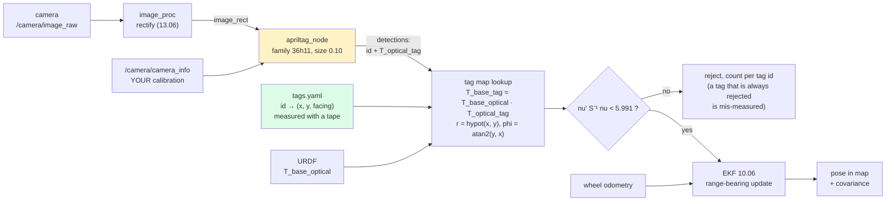

# 10.10 — Landmarks you can print: AprilTags for localization

<!-- glance:start -->
<!-- generated by tools/build.py from curriculum/syllabus.yaml — edit the syllabus, not this block -->

| | |
|---|---|
| **Track** | Main path |
| **Difficulty** | Intermediate |
| **Time** | 1 h |
| **Hardware** | Camera (Raspberry Pi Camera Module 3 or USB webcam) (stage 2) |
| **Software** | ros2, apriltag |
| **Prerequisites** | [10.06 The Extended Kalman Filter for a differential-drive robot](10.06-extended-kalman-filter.md)<br>[13.07 Fiducial markers — ArUco and AprilTag pose estimation](../13-computer-vision/13.07-fiducial-markers.md) |
| **Skip if** | You have corrected robot pose using known tag positions. |

<!-- glance:end -->

## What you will learn

- Build a **tag map**: measure where each printed tag is, in which frame, and write it down in a form your code can load.
- Turn a detection into a localization measurement: `T_optical_tag` → `T_base_tag` → a range–bearing pair the EKF of 10.06 can already use.
- Measure your detector's real accuracy against distance and viewing angle, and turn that measurement into $R$ instead of guessing it.
- Decide where to put tags and how big to print them, from the numbers rather than from hope.
- Run `apriltag_ros` on karmel and fuse its output, and catch the two failures that matter: a tag in the wrong place in your map, and a tag pose flipped by 180°.

## Why it matters

Everything so far needed either a landmark the simulator invented ([10.06](10.06-extended-kalman-filter.md))
or a LiDAR and a map ([10.09](10.09-amcl-in-ros2.md)). AprilTags give you the first kind *for real*,
for the price of a printer: a few dozen unambiguous, uniquely-identified landmarks whose positions
you control.

That matters in exactly the places where the LiDAR struggles. A long corridor is featureless to a
scanner; one tag at the end fixes it. A rectangular room is ambiguous under a 180° rotation — you
measured that in [10.08](10.08-particle-filter-mcl.md), where the whole particle cloud settled on the
wrong pose while reporting a 1.6 cm spread; a single tag makes the two hypotheses distinguishable.
A charging dock needs centimetre accuracy at half a metre, which is precisely the range where a tag
is at its best. And a tag carries an **id**, which means no data association problem at all — the
thing that made the EKF diverge in 10.06 simply does not arise.

The measurement below: with ten printed tags on the apartment walls, karmel's EKF tracks the
50-second tour to **0.84 cm RMSE** where dead reckoning ends 76 cm out — using nothing but a webcam
and a tape measure.

<!-- prereqs:start -->
## Prerequisites

You need these first:

- [10.06 The Extended Kalman Filter for a differential-drive robot](10.06-extended-kalman-filter.md)
- [13.07 Fiducial markers — ArUco and AprilTag pose estimation](../13-computer-vision/13.07-fiducial-markers.md)

### Optional prerequisite links

None.

Check your readiness: `python course.py why 10.10`
<!-- prereqs:end -->

> [!IMPORTANT]
> **Version-sensitive** (verified 2026-09). `apriltag_ros` is released for ROS 2 Jazzy — version
> **3.4.0** on the ROS index, https://index.ros.org/p/apriltag_ros/ , source
> https://github.com/christianrauch/apriltag_ros . Check the current version and the parameter names
> before installing: `apt-cache policy ros-jazzy-apriltag-ros`.
> AI teacher: verify against current documentation before giving install or config instructions.

## Concept

A fiducial marker is a landmark with a barcode. [13.07](../13-computer-vision/13.07-fiducial-markers.md)
already showed you how a detection works: find the black square, decode the bits to get an id,
and solve PnP on its four corners to get the tag's full 6-DoF pose in the camera frame. What this
lesson adds is the other direction — **you know where the tag is in the room, so the tag tells you
where the camera is.**

Concretely, the chain is three transforms and one subtraction:

```text
   detector gives you   T_optical_tag      (where the tag is, seen from the camera)
   the URDF gives you   T_base_optical     (where the camera is, bolted to the robot)
   your tag map gives   T_map_tag          (where the tag is, measured once with a tape)

   T_base_tag = T_base_optical · T_optical_tag       <- a landmark observation in base_link
   ... which is exactly the (range, bearing) pair the EKF of 10.06 already consumes.
```

You could instead invert the whole chain and compute a full pose directly,
$T_{map\,base} = T_{map\,tag} \cdot (T_{base\,tag})^{-1}$. It is tempting, it is one line, and it is
usually the wrong choice: a single tag's *orientation* estimate is the weakest part of a PnP solution
(it is the part that flips), so a pose built from one tag inherits that weakness in full. Feeding the
range and bearing to a filter instead lets several tags and the odometry argue it out, and gives you a
covariance and a gate for free.

Three practical facts shape everything else:

- **A tag is only useful when the camera can resolve it.** Below roughly 30 pixels across, a tag36h11
  stops decoding. That is a hard, measurable limit, and it sets your tag size.
- **A tag map is a map.** It has a frame, a resolution (your tape measure) and errors. A tag entered
  20 cm wrong poisons every estimate near it — unless you gate.
- **Tags run out of view constantly.** A 68° camera sees one wall; the robot turns and sees none.
  Tags are a *correction*, not a continuous pose source; odometry still carries you between them.

> [!TIP]
> **Ask your teacher:** "Walk me from a detected tag corner in pixels to a range and bearing in base_link, naming every frame on the way and where its numbers come from."

## Technical explanation

### Level 1 — Intuition: the same measurement as 10.06, with a different sensor

| | 10.06 (simulated landmarks) | This lesson (printed tags) |
|---|---|---|
| where the landmark is | `World.apartment()` knows | you measured it and wrote it in a YAML file |
| identity | given by the simulator | decoded from the tag, unambiguous |
| measurement | $[r, \varphi]$ direct from `observe_landmarks()` | $[r, \varphi]$ derived from `T_optical_tag` |
| $R$ | `SensorParams.realistic()` says 5 cm / 0.03 rad | **you measure it** (below) |
| when you get one | whenever a landmark is in range | only in the FOV, close enough, square-on enough, unoccluded |

The filter code does not change at all. That is the point of having built it in 10.06.

### Level 2 — Practical: the tag map, and when a tag is usable

A tag map is a table. For a wall-mounted tag, three numbers are enough in 2D: where it is, and which
way it faces.

```python
# 10-localization/code/tag_localization.py
TAG_FACING_RAD = [
    0.0,              # tag 0 at (0.0, 1.8): west wall of the living room, faces +x
    -math.pi / 2,     # tag 1 at (1.0, 3.2): living room / study divider, faces -y
    math.pi,          # tag 2 at (3.5, 0.6): east wall of the living room, faces -x
    ...
]
```

Measuring them is the boring part and the part that decides your accuracy. Measure to the **centre of
the black square**, in the same frame your map uses, and record the height too — you will need it the
day you add a second camera or tilt the first one.

> [!WARNING]
> **The 180° trap.** A tag's pose includes an orientation, and "facing" conventions differ between
> your map, the detector and the URDF. `markers.R_BASE_TAG_FACING` describes a tag whose normal points
> along **−x**, i.e. squarely at a robot at the origin looking down +x. A tag whose normal should point
> along `facing` is therefore that rotation composed with `rot_z(facing − π)`. Get this wrong by π and
> every tag still decodes, every id is still right, and every pose is mirrored — the hardest fiducial
> bug there is, because nothing errors.

Four independent reasons a visible tag is not a *usable* tag, all of which the course code models:

```python
def visible(pose, tag, world, max_range=MAX_RANGE_M):
    ...
    if r > max_range or abs(bearing) > HFOV_RAD / 2 or incidence > MAX_INCIDENCE_RAD:
        return False, r, bearing, incidence          # too far / outside the FOV / too oblique
    hit = float(world.raycast((x, y), [math.atan2(dy, dx)], max_range + 1.0)[0])
    return hit >= r - 0.05, r, bearing, incidence    # ... or a wall is in the way
```

Over karmel's 50-second apartment tour with ten tags, **a tag was usable at 77 % of the checks**, at
most two at a time. That is typical, and it is why tags supplement odometry rather than replace it.

### Level 3 — Mathematics: measuring $R$ instead of guessing it

The EKF needs $R = \mathrm{diag}(\sigma_r^2, \sigma_\varphi^2)$. You can guess. You can also render a
tag at a known pose, detect it, and look at the error — which is what
[`code/tag_localization.py`](code/tag_localization.py) does, using the camera model
([13.05](../13-computer-vision/13.05-pinhole-camera-model.md)) and the detector
([13.07](../13-computer-vision/13.07-fiducial-markers.md)) you already have:

```text
2) Measured detection error (36 rendered images, 8 s)
   range   incidence   detected   range err (mm)   bearing err (deg)   reproj (px)
    0.5 m       0 deg     2/2            +0.4            +0.001         0.008
    0.5 m      60 deg     2/2            +1.1            -0.010         0.037
    1.0 m       0 deg     2/2            +7.2            -0.002         0.051
    1.5 m       0 deg     2/2           +10.8            +0.014         0.162
    1.5 m      60 deg     2/2           +20.4            +0.014         0.093
    2.0 m       0 deg      0/2              -                   -            -
    2.0 m      30 deg     2/2           +65.9            +0.019         0.050
    3.0 m      30 deg     2/2          +150.4            +0.010         0.033
    4.0 m       0 deg      0/2              -                   -            -
```

Three things to take from that table:

1. **The range error grows superlinearly and is a *bias*, not noise.** +0.4 mm at 0.5 m, +7 mm at 1 m,
   +66 mm at 2 m, +150 mm at 3 m — always positive. A square's apparent size is what PnP uses for
   depth, and as the square shrinks toward the pixel grid the estimate degrades in one direction. Model
   it as $\sigma_r = a\,r$ (here $a \approx 2\,\%$) and *stop using tags* past the range where the bias
   stops being small compared with what you need.
2. **Bearing is essentially free.** 0.01° in this rendering, because the tag's *centroid* is
   well-localized in the image even when its size is not. Which brings us to point 3.
3. **Never hand a simulated σ straight to a filter.** These images have pixel noise and nothing else:
   no calibration error, no lens distortion residual, no rolling shutter, no motion blur, no printer
   scaling the tag by 2 %. Those dominate on the real robot. The script therefore *floors* the fitted
   values before use, and says so:

```text
   measured: sigma_range = 2.02 % of the range, sigma_bearing = 0.011 deg, detection rate 61%
   used    : 2.02 % and 0.50 deg after flooring for the
             calibration, rolling-shutter and motion-blur errors this render has none of
   -> at 2 m, R = diag(1.64e-03 m^2, 7.62e-05 rad^2) (sigma 4.0 cm, 0.50 deg)
```

**Tag size sets your range, and the relationship is arithmetic.** A tag of side $s$ at range $r$ spans

$$w_{px} = \frac{s}{r} f_x, \qquad f_x = \frac{W/2}{\tan(\text{HFOV}/2)} = \frac{320}{\tan 0.6} = 468\ \text{px}$$

for karmel's 640×480 webcam with a 1.20 rad horizontal field of view. Measured against that:

```text
2b) Tag size sets your range (detections out of 3, straight on)
    10 cm tag   1 m: 3/3 (  47 px)   2 m: 0/3 (  23 px)   3 m: 0/3 (  16 px)   4 m: 0/3 (  12 px)
    20 cm tag   1 m: 3/3 (  94 px)   2 m: 3/3 (  47 px)   3 m: 3/3 (  31 px)   4 m: 0/3 (  23 px)
```

The detection threshold sits between 23 and 31 px for both sizes — a property of the *detector*, not of
the tag. So the design rule is one line: **usable range ≈ $s \cdot f_x / 30$**. A 10 cm tag gives you
1.5 m; double the tag and you double the range; a 1280×960 camera would also double it, at four times
the CPU.

**Gating.** With ids there is no association problem, but there is still a map problem — and the same
$\chi^2$ gate from [10.06](10.06-extended-kalman-filter.md) handles it. One tag entered **40 cm** wrong:

```text
5) One tag written into the map 40 cm from where it really is (tag 2, on the east wall
   of the living room - the tag karmel sees most often)
   no gate               : RMSE  3.01 cm, max  9.45 cm, NIS   8.22,   0 of 260 rejected
   chi-square 95% gate   : RMSE  0.84 cm, max  3.12 cm, NIS   1.20,  27 of 260 rejected
```

Without the gate the error is 3.6× worse and the mean NIS is 8.2 against an expected 2 — the filter is
*telling you* something is wrong, if you log it. With the gate the bad tag is quarantined (27 of 260
measurements rejected, all of them tag 2) and the estimate is untouched. A persistent, tag-specific
rejection rate is how you find a mis-measured tag; that is worth building into your monitoring.

### Level 4 — Implementation: `apriltag_ros` on karmel

> [!IMPORTANT]
> **Version-sensitive** (verified 2026-09 against the ROS index entry for Jazzy, `apriltag_ros` 3.4.0).
> Parameter names below come from that version's README; confirm against your installed package.

```bash
sudo apt install ros-jazzy-apriltag-ros           # verify with: apt-cache policy ros-jazzy-apriltag-ros
ros2 run apriltag_ros apriltag_node --ros-args \
  -r image_rect:=/camera/image_rect \
  -r camera_info:=/camera/camera_info \
  --params-file ~/tags.yaml
```

```yaml
# ~/tags.yaml  — one entry per tag you have actually put on a wall
apriltag_node:
  ros__parameters:
    family: 36h11
    size: 0.10            # the black square's side, in meters, MEASURED on the printout
    max_hamming: 0
    detector:
      threads: 2
      decimate: 2.0       # downscale before detection: faster, shorter range
      blur: 0.0
      sharpening: 0.25
    tag:
      ids: [0, 1, 2]
      frames: [tag0, tag1, tag2]
      sizes: [0.10, 0.10, 0.20]     # a bigger tag at the far end of the corridor
```

The node subscribes to `image_rect` and `camera_info` and publishes the detections
(`apriltag_msgs/AprilTagDetectionArray`) plus a TF for each detected tag. Four things to get right:

- **`image_rect`, not `image_raw`.** PnP assumes a pinhole camera; feed it distorted pixels and your range is wrong in a way that varies across the frame. Rectify first ([13.06](../13-computer-vision/13.06-lens-distortion-calibration.md)).
- **`camera_info` must be your calibration**, not the driver's defaults. An $f_x$ that is 5 % wrong makes every range 5 % wrong — a pure scale error on your whole localization.
- **`size` must be measured on the printout.** Printers scale. Measure the black square with a ruler; 2 % there is 2 % on every range, forever.
- **Decimate is a range knob.** `decimate: 2.0` halves the effective resolution, so it halves your usable range. It is the first thing to change when the Pi cannot keep up, and the first thing to blame when tags stop being seen at distance.

On the fusion side you have a choice:

- **Feed range and bearing to your own EKF** ([10.06](10.06-extended-kalman-filter.md)) — what this lesson measures. Simple, gives you the gate and the NIS.
- **Feed a full pose to a second `robot_localization` instance with `world_frame: map`** ([10.07](10.07-fusing-imu-and-odometry.md)). This is the idiomatic ROS answer and it slots into REP-105 exactly where AMCL sits, so you can run either. Publish `geometry_msgs/PoseWithCovarianceStamped` in the `map` frame, and make the covariance honest — the numbers you measured above, not zeros.

## Diagram



```text
 From pixels to a range and bearing — every frame, and where its numbers come from

   image (px)      corners of the black square              detector
       |           solvePnP, IPPE_SQUARE                     needs: camera_info + tag size
       v
   camera_optical  T_optical_tag   (z forward, x right, y down)
       |           compose with T_base_optical               from the URDF: (0.10, 0, 0.145)
       v
   base_footprint  T_base_tag      -> r = sqrt(x^2 + y^2),  phi = atan2(y, x)
       |                                                     THIS is the 10.06 measurement z
       v
   map             the tag's known (x, y) from YOUR tag map  -> h(x) and H, unchanged from 10.06

   Notice what is NOT used: the tag's orientation. A single tag's rotation estimate is the part
   PnP gets worst (it is what "flips"), so the filter is given only the two numbers it trusts.
```

## Code

- Experiment: [`code/tag_localization.py`](code/tag_localization.py) — the tag map, real rendered detections, the measured noise model, visibility over the tour, the EKF, and the mis-measured tag. Tested by `python -m pytest 10-localization/code`.
- Reused unchanged: [`13-computer-vision/code/markers.py`](../13-computer-vision/13.07-fiducial-markers.md) (`detect_and_estimate`, `R_BASE_TAG_FACING`), `camera_model.py`, `synthetic.py`, and the EKF from [`labs/exercises/10.06/`](../labs/exercises/10.06/README.md).
- A printable tag: `python 13-computer-vision/code/markers.py --print-tag` writes a tag36h11 at a known size.

```bash
python 10-localization/code/tag_localization.py --solution
python 10-localization/code/tag_localization.py --solution --quick --repeats 1
```

```text
1) One tag, one image, one pose
   tag 10 cm at 1.50 m, straight ahead, square on:
   range error +7.8 mm, bearing error -0.015 deg, reprojection 0.171 px, ambiguity ratio 1.06

3) Visibility over the 50 s tour (checks at 5 Hz)
   a tag was in view at 77% of the checks; 260 detections, at most 2 tags at once

4) EKF with tag measurements
   dead reckoning     : RMSE  43.1 cm, final  76.5 cm
   EKF with tags      : RMSE  0.84 cm, max  3.12 cm, heading 0.87 deg, NIS 1.24 (254 updates)
```

Note the **ambiguity ratio of 1.06** in part 1. `estimate_marker_pose` returns both IPPE solutions and
their reprojection errors; a ratio near 1 means the two candidate orientations explain the image almost
equally well, which is the classic planar-target flip. It barely matters here because we only use the
*translation* — another reason to feed range and bearing rather than a full pose.

The conversion from a detection to a filter measurement, in full:

```python
T_base_optical = karmel_T_base_optical()                      # from the URDF
found = detect_and_estimate(image, cam.K, None, TAG_SIZE_M)   # 13.07, unchanged
for tag_id, T_optical_tag, errs, ratio, corners in found:
    t = (T_base_optical @ T_optical_tag)[:3, 3]               # the tag, in base_footprint
    z = [math.hypot(t[0], t[1]), math.atan2(t[1], t[0])]      # range, bearing
    lx, ly, _ = tag_map[tag_id]                               # where you measured it
    R = np.diag([(SIGMA_REL * z[0]) ** 2, SIGMA_BEARING ** 2])
    nu, S, _ = ekf.innovation(z, [lx, ly], R)
    if float(nu @ np.linalg.solve(S, nu)) < 5.991:            # the 10.06 gate, unchanged
        ekf.update(z, [lx, ly], R)
```

Figure: `localization_out/tag_map.png` — the apartment with each tag and the direction it faces, the
true and estimated trajectories, and a step plot of how many tags were in view over time.

## Exercise

E1, E2, E4 and E5 need hardware: **none**. E3 and E6 need `camera` (and `robot-base` for E6) from
[HARDWARE.md](../HARDWARE.md); both have a simulation alternative.

> [!CAUTION]
> **Safety:** Exercise 10.10-E6 drives the real robot toward a wall using a camera measurement. Do the
> first run with the wheels on a stand, keep the power switch reachable, and set a hard minimum range
> in the code before you put it on the floor. See [SAFETY.md](../SAFETY.md).

### Exercise 10.10-E1 — Size, range and pixels `[numerical]`

Goal: be able to specify tags before buying or printing anything. karmel's camera is 640×480 with a
1.20 rad horizontal field of view.

(a) Compute $f_x$. (b) How many pixels across is a 10 cm tag at 0.5, 1, 2 and 4 m? (c) Taking 30 px as
the detection threshold, what is the usable range for a 10 cm, a 20 cm and an A4-sized (18 cm) tag?
(d) You switch to a 1280×960 camera with the same lens. What changes, and what does it cost?
(e) `decimate: 2.0` is set in the detector config. Redo (c).

### Exercise 10.10-E2 — Measure your own R `[coding]`

Goal: never guess a covariance again. Run part 2 of
[`code/tag_localization.py`](code/tag_localization.py), then modify it to sweep **bearing** (the tag
off to the side of the image) instead of incidence, at ±0°, ±15° and ±25°. Report a table of range and
bearing error, fit $\sigma_r = a\,r$ and a constant $\sigma_\varphi$ from your data, and state the $R$
you would use at 1 m and at 2 m. Then justify, in two sentences, the floor you would apply before using
those numbers on a real robot.

### Exercise 10.10-E3 — A tag map of your desk `[hardware]`

Goal: the measuring discipline, at small scale. Hardware: `camera`. **Simulation alternative:** use
`detect_once` at three poses you choose and treat those as your "measurements".

Print three tag36h11 markers at a known size ([13.07](../13-computer-vision/13.07-fiducial-markers.md)).
Tape them to a wall at measured positions and a measured height, writing each one into a `tags.yaml`
with its id, position and facing. Then put the camera at three marked spots, detect, and compute the
camera pose from each tag independently. Report the three estimates per spot and their spread, and say
which of your measurements you now distrust.

### Exercise 10.10-E4 — Where should the tags go `[design]`

Goal: tag placement as a design problem, not decoration. Using `visible()` and the apartment map:
(a) Compute, for the existing ten tags, the fraction of the tour where **zero** tags are visible, and
where those gaps are on the map. (b) Move, add or remove tags to get the worst gap below 3 seconds with
as few tags as you can. State how many you used and where. (c) Argue for one tag position on grounds
other than coverage — a doorway, a dock, a place where the LiDAR is ambiguous. (d) What would change
if the camera were mounted facing backwards?

### Exercise 10.10-E5 — The mis-measured tag, and the 180° flip `[debugging]`

Goal: the two failures that do not announce themselves.
(a) Run part 5 of the script and confirm the gate's effect. Then instrument the run to report the
rejection rate **per tag id** and show that it identifies tag 2. What threshold would you alarm on?
(b) Now make the map error 5 cm instead of 40 cm and rerun. Does the gate catch it? Should it? What
does that tell you about how accurately you need to measure your tags?
(c) Change `T_map_tag` to use `rot_z(facing)` instead of `rot_z(facing - math.pi)` — the 180° trap —
and describe exactly what breaks and what does not. Which quantity in the logs would have caught it?

### Exercise 10.10-E6 — Dock on a tag `[hardware]`

Goal: the classic payoff. Hardware: `camera`, `robot-base`. **Simulation alternative:** drive the
simulated robot using `docking_goal` on synthetic detections.

Use `docking_goal` from [`markers.py`](../13-computer-vision/13.07-fiducial-markers.md) to compute a
pose 30 cm in front of a wall tag, facing it, and drive karmel there with the controller from
[08.10](../08-control/08.10-straight-line-heading-control.md) or a simple proportional law. Run it ten
times from different starting poses and measure the final position and heading error against the tag
with a ruler. Report mean and worst, and the one change that most improved repeatability.

## Expected result

- **10.10-E1:** (a) $f_x = 320/\tan(0.60) = 468$ px. (b) a 10 cm tag spans $0.10 \times 468 / r$ px:
  **94 px** at 0.5 m, **47** at 1 m, **23** at 2 m, **12** at 4 m. (c) at a 30 px threshold, usable
  range $= s \cdot 468/30 = 15.6\,s$: **1.6 m** for 10 cm, **3.1 m** for 20 cm, **2.8 m** for 18 cm.
  The measured detections agree — the 10 cm tag succeeded 3/3 at 1 m (47 px) and 0/3 at 2 m (23 px);
  the 20 cm tag succeeded at 3 m (31 px) and failed at 4 m (23 px). (d) $f_x$ doubles to 936 px, so
  every range doubles; the cost is 4× the pixels to detect over, which on a Pi 5 is the difference
  between 10 Hz and 2–3 Hz. (e) `decimate: 2.0` detects on a half-size image, so the effective $f_x$
  halves and every range in (c) halves: 0.8 m, 1.6 m, 1.4 m.
- **10.10-E2:** Your fitted $a$ should land near 2 % of the range and your $\sigma_\varphi$ well under
  0.1°, because the render is optically perfect. Off-axis bearings should barely change the range error
  and should not change the bearing error much either — the detector localizes corners equally well
  across the frame once the image is rectified. A defensible floor is the one the script uses: 2 % of
  range and 0.5°, on the grounds that a 1 % calibration error, a 1 % printer scale error and a few
  milliseconds of rolling shutter each exceed the simulated noise.
- **10.10-E3:** Expect the three per-tag camera-pose estimates at one spot to agree to a few
  centimetres if your tape work was good, and to disagree by 5–15 cm if it was not. The tag whose
  estimate is the outlier at *every* spot is the one you measured wrong — that is the diagnostic.
- **10.10-E4:** (a) With the shipped ten tags, a tag is usable at 77 % of checks; the gaps are where
  the robot faces into open space or across a doorway. (b) Two or three well-placed additions (facing
  down the long axes and covering the doorway between the living room and the kitchen) should get the
  worst gap under 3 s. (c) A good answer names a place where the *other* sensor fails: the doorway (a
  LiDAR sees two similar openings), the corridor (translation along it is nearly unobservable), the
  dock (you need centimetres, not decimetres). (d) A rear-facing camera sees tags the robot is driving
  *away* from, which is better for correcting heading while travelling and much worse for docking.
- **10.10-E5:** (a) Gate on: 27 of 260 rejected, RMSE 0.84 cm, mean NIS 1.20. Gate off: RMSE 3.01 cm,
  max 9.45 cm, mean NIS 8.22. Per-tag, essentially all rejections are tag 2. A sensible alarm is a
  sustained per-tag rejection rate above ~20 % over a few minutes — well clear of the ~5 % a correct
  tag produces by chance. (b) A 5 cm error is comparable with $\sigma_r$ at these ranges, so most
  measurements pass the gate and the error is quietly absorbed into the estimate: the gate protects you
  from *blunders*, not from sloppiness. Measure your tags to about a centimetre; that is a tape measure
  and care, not equipment. (c) Every tag still decodes and every id is still correct; the *ranges* are
  still right, so the filter half-works and the error looks like a bad calibration. The tell is the
  bearing residual: it is systematically wrong for tags on one wall and fine for others, and the mean
  NIS rises without any single measurement looking absurd.
- **10.10-E6:** Expect a final position error of 1–3 cm and a heading error under 5° once the tag is
  large enough to be resolved at the standoff distance. The single biggest improvement is almost always
  measuring the printed tag's real side length and putting *that* in the config.

## Troubleshooting

### Symptom: no detections at all

1. Are you subscribing to a **rectified** image? `ros2 topic list | grep image` — feeding `image_raw` to a node that expects `image_rect` is the most common wiring mistake.
2. `ros2 topic hz /camera/camera_info` — no `camera_info`, no PnP. Check that it carries *your* calibration, not zeros.
3. Check the family. `36h11` tags do not decode with a `16h5` detector, and the ids do not overlap.
4. Compute the apparent size: $s f_x / r$ px. Under ~30 px, the answer is "print a bigger tag", not "tune the detector".
5. Check `decimate`. At 2.0 you have halved your range.

### Symptom: detections work but the localization is biased

1. Measure the printed black square with a ruler and compare with the `size` parameter. A 2 % difference is a 2 % range error on every measurement.
2. Compare $f_x$ in `camera_info` with a fresh calibration ([13.06](../13-computer-vision/13.06-lens-distortion-calibration.md)). A wrong focal length is indistinguishable from a wrong tag size — both are a pure scale on range.
3. Check `T_base_optical` in the URDF against a tape measure. A camera 3 cm further forward than the URDF says is a permanent 3 cm bias.
4. Only then suspect the tag map.

### Symptom: the estimate jumps whenever a particular tag is seen

1. Log the rejection count and mean NIS **per tag id**. One tag with a high rejection rate is a mis-measured tag, not a sensor problem.
2. Re-measure that tag's position. Then re-measure the one next to it, because whatever went wrong probably went wrong twice.
3. If the range residual is fine but the bearing residual is systematically wrong, suspect a facing/orientation convention error (the 180° trap), not the position.

### Symptom: the pose flips between two orientations

1. This is PnP's planar ambiguity. Log the ambiguity ratio from `estimate_marker_pose`; near 1.0 means the two solutions are equally good.
2. Use only the translation (range and bearing) and let the filter supply orientation — what this lesson does.
3. If you genuinely need the orientation from one tag: view it from further off-axis (the ambiguity is worst head-on), use a larger tag, or use two tags.

### Symptom: it works at the desk and not while driving

1. Motion blur. Shorten the exposure (more light, higher gain) or slow down when you need a fix.
2. Rolling shutter: a moving robot skews the square, which PnP reads as a rotation. Take fixes while stationary or at low speed.
3. Check the timestamp on the image. A detection fused 200 ms late is a detection from 5 cm ago at 0.25 m/s.

## Common mistakes

- **Using `image_raw` instead of a rectified image.** Silent, range-dependent bias.
- **Trusting the printer.** Always measure the black square.
- **Putting the driver's default `camera_info` in the pipeline.** A wrong $f_x$ scales every range.
- **Building a full pose from one tag** and feeding it to a filter, ambiguity and all, instead of the range and bearing it actually trusts.
- **The 180° facing convention.** Everything decodes, everything is mirrored.
- **A tag map "measured" from the floor plan** rather than from the wall. Floor plans are not as-built.
- **No gate and no per-tag logging**, so a mis-measured tag degrades everything and nothing points at it.
- **Assuming tags are always available.** 77 % of checks in a small apartment with ten tags; odometry still does the work between them.
- **Tags too small for the range you need.** Compute $s f_x/30$ before you print.

## Knowledge check

1. Why feed range and bearing to the filter rather than the full pose a tag detection gives you?
   <details><summary>Answer</summary>

   A single planar tag's *orientation* is the weakest part of the PnP solution — it is the part that
   flips between two nearly-equally-good candidates (the ambiguity ratio was 1.06 in this lesson's
   example). A pose built from one tag inherits that instability in full. Range and bearing use only
   the translation, which is far better conditioned, and letting the filter supply orientation means
   several tags plus the odometry decide it, with a covariance and a gate.
   </details>

2. A 10 cm tag, karmel's camera ($f_x = 468$ px), detection threshold 30 px. What is the usable range,
   and what are the two ways to double it?
   <details><summary>Answer</summary>

   $r = s f_x / 30 = 0.10 \times 468/30 = 1.56$ m — and the measurement agrees (3/3 at 1 m, 0/3 at
   2 m). Double it by doubling the tag to 20 cm, or by doubling the resolution to 1280×960 (which
   doubles $f_x$ for the same lens, at 4× the detection cost). Reducing `decimate` from 2.0 to 1.0 also
   doubles it, if it was set.
   </details>

3. Your measured range errors are +0.4 mm at 0.5 m, +7 mm at 1 m and +66 mm at 2 m. What kind of error
   is that, and how should it enter the filter?
   <details><summary>Answer</summary>

   It is a *bias* that grows with range, not zero-mean noise — every value is positive and it grows
   faster than linearly as the tag approaches the resolution limit. A Kalman filter assumes zero-mean
   measurement noise, so the honest responses are: model $\sigma_r = a r$ so the filter at least
   distrusts distant tags proportionally, and stop using tags beyond the range where the bias is large
   compared with the accuracy you need. Pretending a 66 mm bias is 66 mm of noise makes the filter
   confidently wrong.
   </details>

4. What does a tag id buy you that the simulated landmarks of 10.06 did not?
   <details><summary>Answer</summary>

   Data association for free. In 10.06 the filter had to decide *which* landmark it was looking at, and
   that is what made it diverge from a bad start (59 wrong associations, 87 cm of final error). A tag
   decodes its own identity, so the association is exact — which is why a handful of tags can rescue a
   robot in an environment where the LiDAR is ambiguous.
   </details>

5. Predict: you set the detector's `size` to 0.10 m but your printer produced a 9.8 cm square. What
   happens to the localization?
   <details><summary>Answer</summary>

   Every range is over-estimated by 2 % (the solver thinks a given apparent size means more distance
   than it does). That is a systematic scale error on every tag measurement, so the estimated pose is
   pushed away from each tag by 2 % of its range — 4 cm at 2 m. The filter will not flag it as long as
   it is inside $R$; NIS rises slightly and you will blame the odometry. Measure the printout.
   </details>

6. One tag is written into your map 40 cm from where it really is. With and without a $\chi^2$ gate,
   what happens, and which number tells you?
   <details><summary>Answer</summary>

   Without the gate: RMSE 3.01 cm instead of 0.84, maximum error 9.45 cm, and the mean NIS rises to
   8.22 against an expected 2. With the gate: the bad measurements are rejected (27 of 260, all of them
   that one tag) and the estimate is unchanged at 0.84 cm. The numbers that tell you are the mean NIS
   and, more specifically, the **rejection rate per tag id** — a correct tag rejects ~5 % of the time
   by chance, a mis-measured one rejects almost always.
   </details>

7. You get the tag's facing convention wrong by 180° in your tag map. Which measurements are still
   correct, and how would you notice?
   <details><summary>Answer</summary>

   Every tag still decodes and every id is right; the *positions* in the map are unchanged, so the
   **ranges** are still correct. What breaks is anything derived from the tag's orientation — a full
   pose from one tag, a docking goal computed as "30 cm in front of the tag" (which becomes 30 cm
   behind the wall), and any visibility/incidence test. You notice it in a systematically wrong bearing
   residual for tags on one wall while others are fine, a rising mean NIS with no single absurd
   measurement, and a docking routine that drives into the wall.
   </details>

8. AMCL on a LiDAR map already works. Give two situations where you would add tags anyway.
   <details><summary>Answer</summary>

   (1) Where the geometry is ambiguous: a long featureless corridor, a symmetric room (10.08's
   rectangular room, where the whole cloud settled on the wrong pose while reporting 1.6 cm of spread),
   a row of identical doorways. One tag breaks the symmetry that no amount of tuning can. (2) Where you
   need accuracy the map cannot give: docking, picking from a fixture, handing off to an arm — a tag at
   0.5 m gives sub-centimetre range, while AMCL's covariance on that map was 16 cm. A third: recovery,
   because a tag gives an absolute, unambiguous fix from a single frame after a kidnapping.
   </details>

## Practical challenge

**Give karmel a tag-based relocalization that you can trust, and prove the trust.**

Acceptance criteria:

- Build a real tag map of one room: at least four printed tags, positions and facings measured with a
  tape, in a `tags.yaml` your code loads. Include the measurement uncertainty you believe you achieved
  and how you arrived at it.
- Measure your own detector's $\sigma_r(r)$ and $\sigma_\varphi$ on *your* camera with *your*
  calibration, at three ranges and two viewing angles, at least ten detections each. Report the table
  and the $R$ you derived, including the floor you applied and why.
- Run the EKF from [10.06](10.06-extended-kalman-filter.md) with tag updates over a 2-minute drive, with
  the $\chi^2$ gate and per-tag rejection logging. Report position RMSE against a few taped ground-truth
  marks, mean NIS, and the rejection rate for each tag.
- Then deliberately mis-measure one tag by 15 cm in the map and show that your per-tag monitor
  identifies *which* tag within one minute of driving, without using the truth. State the threshold and
  its false-alarm rate over the good tags.
- One paragraph: when would you use this instead of AMCL, when alongside it, and how would you combine
  the two in REP-105 terms ([10.09](10.09-amcl-in-ros2.md))?

## You can skip this if…

You have corrected a robot's pose using known tag positions. Prove it: answer knowledge-check questions
1, 3, 6 and 7 **without looking**, do Exercise 10.10-E1 on paper, and show a run of
`python 10-localization/code/tag_localization.py --solution` you can explain line by line. Then:

`python course.py skip 10.10 --reason "built a tag map, measured R from detections, fused range-bearing with a gate"`

## Go deeper

- https://april.eecs.umich.edu/papers/details.php?name=olson2011tags — Olson, *AprilTag: A robust and flexible visual fiducial system* (ICRA 2011): the original design, and why the code layout gives the false-positive rate it does.
- https://april.eecs.umich.edu/papers/details.php?name=wang2016iros — Wang & Olson, *AprilTag 2*: the faster detector that everything now ships.
- https://github.com/AprilRobotics/apriltag — the reference C library, the tag families, and printable images at known sizes.
- https://index.ros.org/p/apriltag_ros/ — the ROS 2 wrapper (3.4.0 on Jazzy as of 2026-09); source at https://github.com/christianrauch/apriltag_ros with the full parameter list.
- https://docs.opencv.org/4.x/d5/dae/tutorial_aruco_detection.html — OpenCV's ArUco module, which is what the course code uses; the `DICT_APRILTAG_36h11` dictionary is the same family.
- https://docs.opencv.org/4.x/d5/d1f/calib3d_solvePnP.html — `solvePnP` and `SOLVEPNP_IPPE_SQUARE`, including the planar ambiguity you saw as an ambiguity ratio near 1.
- https://www.ros.org/reps/rep-0105.html — REP-105, for deciding whether your tag fix publishes `map → odom` or feeds a filter that does.

## Progress checkpoint

- [ ] I can build a tag map: measure each tag's position and facing, in a named frame, and load it.
- [ ] I can turn a detection into a range–bearing measurement through `T_base_optical` and feed it to the 10.06 EKF.
- [ ] I measured my detector's accuracy against range and angle, and derived $R$ from it rather than guessing.
- [ ] I can compute the usable range of a tag from its size and the camera's $f_x$, and choose a size on purpose.
- [ ] I gate every tag measurement and log rejections per tag id, so a mis-measured tag identifies itself.

`python course.py complete 10.10` (exercises done) · `python course.py master 10.10` (challenge done) · `python course.py struggle 10.10 "what was hard"`

Next: [11.01 — Map representations](../11-slam/11.01-map-representations.md).
