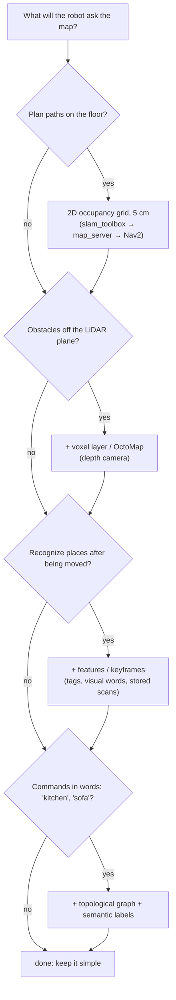

# 11.01 — Map representations — occupancy grids, features, point clouds, voxels, graphs

<!-- glance:start -->
<!-- generated by tools/build.py from curriculum/syllabus.yaml — edit the syllabus, not this block -->

| | |
|---|---|
| **Track** | Main path |
| **Difficulty** | Intermediate |
| **Time** | 40 min |
| **Hardware** | none |
| **Software** | none |
| **Prerequisites** | [10.01 Localization — belief instead of certainty](../10-localization/10.01-what-is-localization.md)<br>[07.07 2D LiDAR — how it works, LaserScan data, and a ROS 2 driver](../07-sensors/07.07-2d-lidar.md) |
| **Skip if** | You can choose a map representation for a given robot and task. |

<!-- glance:end -->

## What you will learn

- Name the six common map representations (occupancy grid, feature/landmark map, point cloud, voxel grid/OctoMap, topological graph, semantic map) and the question each one answers cheaply.
- Estimate the memory of a 2D grid, a 3D voxel grid and a point-cloud log for your own home, and predict how it scales with resolution.
- Choose a representation, or a stack of them, for a given robot task and defend the choice.
- Read the layout of a ROS occupancy grid: cell values 0/100/−1, the origin, row 0 at the bottom, and the PGM + YAML files `map_server` loads.

## Why it matters

"Go to the kitchen" hides three different map queries. Nav2 needs to know which floor cells are free so it can plan a path ([12.02](../12-navigation/12.02-grid-path-planning.md)). The robot needs something to match its LiDAR scans against so it knows where it is ([10.09](../10-localization/10.09-amcl-in-ros2.md)). Somebody needs to know that "kitchen" is a place, and which door leads there. No single data structure is good at all three. Real robots keep several maps side by side, the way a web backend keeps a relational database, a search index and a cache for the same data.

Every lesson in this module produces or consumes a map. 11.02 builds an occupancy grid. 11.04 aligns point clouds. 11.05 stores the trajectory as a graph. slam_toolbox ([11.06](11.06-slam-toolbox-simulation.md)) gives you a pose graph and an occupancy grid. Picking the wrong representation shows up later as a planner that cannot fit through a doorway, a map file too big for the Raspberry Pi, or a robot that drives into a table top its 2D LiDAR never saw.

<!-- prereqs:start -->
## Prerequisites

You need these first:

- [10.01 Localization — belief instead of certainty](../10-localization/10.01-what-is-localization.md)
- [07.07 2D LiDAR — how it works, LaserScan data, and a ROS 2 driver](../07-sensors/07.07-2d-lidar.md)

### Optional prerequisite links

None.

Check your readiness: `python course.py why 11.01`
<!-- prereqs:end -->

## Concept

### A map is a data structure chosen for its queries

As an architect you never ask "what is the best database?". You ask "what are the read and write patterns?". Maps work the same way. Before choosing one, list the questions the robot will ask:

| Question the robot asks | Representation that answers it cheaply |
|---|---|
| "Is the floor at (2.3 m, 1.1 m) free?" | **Occupancy grid**: a 2D array of cells, each free, occupied or unknown |
| "Where exactly is AprilTag 7?" | **Feature (landmark) map**: a list of distinct, recognizable points with positions |
| "What exactly did the sensor see?" | **Point cloud**: raw measured points, no interpretation |
| "Is there something at 60 cm height above this spot?" | **Voxel grid / OctoMap**: a 3D occupancy grid, often stored as an octree |
| "Which rooms connect to which?" | **Topological map**: a graph of places (nodes) and passages (edges) |
| "Where is the fridge?" | **Semantic map**: labels ("kitchen", "sofa", "charging dock") attached to any of the above |

Three distinctions make the table easier to remember:

- **Metric vs. topological.** Grids, point clouds, voxels and feature maps store coordinates in meters. A topological map stores only connectivity: "the study connects to the living room through door D". It has no geometry, like a subway map.
- **Dense vs. sparse.** A grid stores every cell, including empty floor. A feature map stores only the few things worth remembering. Dense maps answer "is it free?" directly. Sparse maps are tiny, but they cannot tell a planner where the walls are.
- **Raw vs. interpreted.** A point cloud keeps measurements as they arrived. A grid has already decided "this cell is occupied with probability 0.9". Raw data can be reprocessed later. Interpreted data is compact and fast to query.

### What karmel actually uses

karmel's main path uses a **2D occupancy grid** for navigation (built by slam_toolbox, stored as PGM + YAML, served by Nav2's map server). It keeps **point clouds** only for a moment: one LiDAR scan becomes a set of points, is matched and inserted, then thrown away. A **topological/semantic layer** of named waypoints ("kitchen", "dock") comes later with Nav2 missions ([12.09](../12-navigation/12.09-waypoints-and-missions.md)) and LLM agents (module 18). **Voxels** appear when a depth camera must see things the planar LiDAR misses, such as table tops and chair seats (Nav2's voxel layer in [12.04](../12-navigation/12.04-costmaps.md)).

> [!TIP]
> **Ask your teacher:** "For each of these tasks, which map would you store and why: vacuum every room; bring me a bottle from the fridge; patrol and report open doors; follow me."

## Technical explanation

### Level 1 — Six representations, one apartment

Run the lesson script and open `out/map_representations.png`: the course simulator's 6 m × 5 m apartment drawn four ways.

1. **Occupancy grid.** The floor is cut into square cells, here 5 cm. Each cell stores the probability that something occupies it. In ROS it is a `nav_msgs/OccupancyGrid`: an int8 per cell with 0 = free, 100 = occupied, −1 = unknown. The apartment at 5 cm with a 20 cm margin is 128 × 108 cells, **13.8 KB**. That is small enough to keep in RAM, send over Wi-Fi and plan on with A*.
2. **Feature / landmark map.** The apartment's 10 wall-mounted tags as 10 `(id, x, y)` entries. EKF localization with landmarks ([10.10](../10-localization/10.10-fiducial-landmarks.md)) and visual SLAM (ORB-SLAM3 map points, [11.08](11.08-visual-slam.md)) use this kind of map. It is tiny and makes place recognition easy, but it knows nothing about the walls between the tags.
3. **Point cloud.** 2,160 points from 6 LiDAR scans. Nothing is decided yet: a point is a measurement, not a verdict. ICP ([11.04](11.04-scan-matching-icp.md)) aligns clouds. PCL and Open3D process them. Depth cameras produce them 30 times a second ([07.09](../07-sensors/07.09-depth-cameras-and-point-clouds.md)).
4. **Voxel grid / OctoMap.** The 3D version of the grid: cubes instead of squares. A dense 3D array gets huge quickly, so OctoMap stores an **octree**: a cube splits into 8 children only where something interesting is, and large uniform regions stay one big node. The simulator is 2D, so this one is not in the figure. The memory math below shows why it matters.
5. **Topological graph.** Four places (living room, kitchen, bedroom, study) and four doors, eight edges. A planner on this graph answers "living room → study: through door D" in microseconds. Driving the metres in between still needs the grid.
6. **Semantic labels.** "Sofa", "bed", "kitchen table" attached to positions or regions. This is the layer a language model or a user interface talks to: "go to the sofa".

### Level 2 — Practical: choosing for a task

| | Occupancy grid | Feature map | Point cloud | Voxels / OctoMap | Topological | Semantic |
|---|---|---|---|---|---|---|
| Typical query | free/occupied at (x, y) | where is landmark k | nearest points, alignment | free/occupied at (x, y, z) | path between places | where is "fridge" |
| Memory | ∝ area / res² | ∝ number of landmarks | ∝ points kept | ∝ volume / res³ (octree: ∝ surface) | tiny | tiny |
| Unknown vs. free | yes (−1) | no | no | yes | no | no |
| Good for | 2D navigation, AMCL, costmaps | EKF/graph SLAM, relocalization | scan matching, 3D perception | 3D obstacles, drones, arms | mission logic, large buildings | human commands, LLM agents |
| ROS 2 / library | `nav_msgs/OccupancyGrid`, map_server, slam_toolbox | AprilTag, ORB-SLAM3 | `sensor_msgs/PointCloud2`, PCL, Open3D | OctoMap, nvblox, Nav2 voxel layer | Nav2 waypoints, your own graph | your own layer on top |

Rules of thumb that hold up in practice:

- **A ground robot with a 2D LiDAR navigating a home:** occupancy grid at 5 cm. That is slam_toolbox's and Nav2's default `resolution: 0.05`. 2 cm quadruples memory and planning time and gains little for a 25 cm robot.
- **Obstacles that are not at LiDAR height** (table tops, a cat, stairs going down): add a voxel layer from a depth camera, or a costmap layer that projects 3D points onto the grid.
- **"Go to the kitchen"** needs a semantic or topological layer that maps the word to a pose on the grid. It is a dictionary on top of the metric map, not a replacement for it.
- **Long-term operation and relocalization** favour sparse features or keyframes: after the robot is picked up and moved (the kidnapped robot problem, [10.01](../10-localization/10.01-what-is-localization.md)), you recognize a place from what is distinctive about it, not from empty floor.
- **Keep raw data when you might change your mind.** slam_toolbox stores the scans in its pose graph, not just the finished grid. That is why it can re-render the grid after a loop closure moves the poses ([11.05](11.05-pose-graphs-loop-closure.md)).

### Level 3 — Mathematics: memory scaling

For a bounding box of $W \times D$ metres at resolution $r$ metres per cell, with $b$ bytes per cell:

$$M_{2D} = \left\lceil \tfrac{W}{r} \right\rceil \left\lceil \tfrac{D}{r} \right\rceil b \qquad M_{3D} = \left\lceil \tfrac{W}{r} \right\rceil \left\lceil \tfrac{D}{r} \right\rceil \left\lceil \tfrac{H}{r} \right\rceil b$$

Halving $r$ multiplies a 2D map by 4 and a 3D map by 8.

**Numerical example: a 100 m² apartment at 5 cm.** Its bounding box is 12 m × 10 m, and the ceiling is 2.6 m. Computed by `map_representations.py`:

| Map | Cells | int8 | float32 log-odds |
|---|---|---|---|
| 2D grid, 5 cm | 240 × 200 = 48,000 | **48 KB** | 192 KB |
| 2D grid, 1 cm | 1,200 × 1,000 = 1.2 M | 1.2 MB | 4.8 MB |
| 3D voxels, 5 cm | 240 × 200 × 52 = 2.5 M | **2.5 MB** | 10 MB |
| 3D voxels, 2 cm | 600 × 500 × 130 = 39 M | 39 MB | 156 MB |
| 3D voxels, 1 cm | 1,200 × 1,000 × 260 = 312 M | 312 MB | **1.2 GB** |

Compare with the other representations:

- **Raw 2D LiDAR log:** 360 points × 10 Hz × 600 s = 2.16 M points × 8 bytes (two float32) = **17.3 MB** for ten minutes. That is more than 300 times the 2D grid, and it keeps growing for as long as the robot drives.
- **One depth-camera frame:** 640 × 480 points × 12 bytes = **3.7 MB**. At 30 Hz that is 110 MB per second, so nobody keeps raw depth clouds. They are voxelized or thrown away.
- **Landmark map:** 50 tags × (4-byte id + two 4-byte coordinates + a 2×2 float32 covariance) = 50 × 28 = **1.4 KB**.
- **Topological graph:** 10 places + 12 doors at about 32 bytes each ≈ **0.7 KB**.

**Why octrees help.** An octree with depth $d$ splits a cube of side $s$ into cells of side $s/2^d$. OctoMap uses $d = 16$, so at 1 cm leaves the tree covers a cube $2^{16} \times 0.01 = 655$ m on a side. The occupied surface of a room grows with area, not volume, and large free or unknown regions collapse into a single node. How much that saves depends on the scene, so measure it on your data. The dense 312 MB of the 1 cm table is only the worst case.

> [!NOTE]
> New to probabilities as numbers between 0 and 1? → [FM.13 Probability from zero](../optional-foundations/mathematics/FM.13-probability-basics.md). Skip it if you already know it.

### Level 4 — Implementation: the ROS occupancy grid layout

`nav_msgs/OccupancyGrid` and robotlab's `OccupancyGrid` share one layout. Get it wrong and your map appears mirrored or shifted in RViz.

- `data[row, col]`: `col` counts along +x and `row` along +y. **Row 0 is the bottom** (smallest y). In the ROS message the array is flattened row by row: index = `row * width + col`.
- `origin` is the world pose of the **bottom-left corner of cell (0, 0)**, not the cell's centre. A cell's centre is `origin + (col + 0.5, row + 0.5) * resolution`.
- Values: 0 free, 100 occupied, −1 unknown (1–99 are allowed and mean "probability in percent").
- On disk, `map_saver_cli` writes a **PGM image**, stored top row first so it looks right in an image viewer: pixel 254 = free, 0 = occupied, 205 = unknown. Next to it goes a **YAML** file with `image`, `resolution`, `origin`, `negate`, `occupied_thresh` and `free_thresh`. You write both in 11.02.

## Diagram



```text
 Same corridor, two maps

 occupancy grid (5 cm, top view)          topological graph
 row 3  # # # # # # # # # # # #
 row 2  . . . . . . . . . . . .            [living room]──door D──[study]
 row 1  . . . . . . . . . . . .                 │
 row 0  # # # # # # # # # # # #               door A
        ^ col 0, origin = bottom-left           │
          corner of this cell               [kitchen]
 . free (0)  # occupied (100)  ? unknown (-1)
```

## Code

[`code/map_representations.py`](code/map_representations.py) prints the memory table for any home size and draws the apartment as a grid, a landmark map, a point cloud and a topological/semantic graph. It is tested by `code/test_slam_code.py`. The memory part:

```python
def memory_table(width_m: float, depth_m: float, height_m: float, resolution: float) -> list[tuple[str, str, float]]:
    cols, rows = math.ceil(width_m / resolution), math.ceil(depth_m / resolution)
    layers = math.ceil(height_m / resolution)
    cells2d, cells3d = cols * rows, cols * rows * layers
    lidar_points = 360 * 10 * 600  # 360 points, 10 Hz, 10 minutes
    return [
        (f"2D occupancy grid, int8 ({cols}x{rows} cells)", "1 byte/cell", cells2d * 1),
        ("2D occupancy grid, float32 log-odds", "4 bytes/cell", cells2d * 4),
        (f"3D voxel grid, int8 ({cols}x{rows}x{layers})", "1 byte/voxel", cells3d * 1),
        ("3D voxel grid, float32 log-odds", "4 bytes/voxel", cells3d * 4),
        ("raw 2D LiDAR points, 10 min at 10 Hz", "2 x float32/point", lidar_points * 8),
        ("one depth-camera frame, 640x480 points", "3 x float32/point", 640 * 480 * 12),
        ("landmark map, 50 tags (id, x, y, 2x2 cov)", "28 bytes/landmark", 50 * 28),
        ("topological graph, 10 places + 12 doors", "~32 bytes/element", 22 * 32),
    ]
```

Run it from the repository root (numpy, matplotlib; no display needed):

```bash
python 11-slam/code/map_representations.py
python 11-slam/code/map_representations.py --area 9 7 2.5 --resolution 0.02 --no-plot
```

```text
Home bounding box 12.0 x 10.0 x 2.6 m at 5 cm resolution
  2D occupancy grid, int8 (240x200 cells)          1 byte/cell             48.0 KB
  2D occupancy grid, float32 log-odds              4 bytes/cell           192.0 KB
  3D voxel grid, int8 (240x200x52)                 1 byte/voxel             2.5 MB
  3D voxel grid, float32 log-odds                  4 bytes/voxel           10.0 MB
  raw 2D LiDAR points, 10 min at 10 Hz             2 x float32/point       17.3 MB
  one depth-camera frame, 640x480 points           3 x float32/point        3.7 MB
  landmark map, 50 tags (id, x, y, 2x2 cov)        28 bytes/landmark        1.4 KB
  topological graph, 10 places + 12 doors          ~32 bytes/element         704 B
wrote .../11-slam/code/out/map_representations.png
```

The figure has four panels: the black-and-white grid (walls 1–2 cells thick, round tables as blobs), gold stars labelled `tag 0`…`tag 9` over faint walls, red dots tracing the walls with gaps where no scan reached, and blue room nodes joined through green door squares with purple furniture labels.

## Exercise

All exercises need hardware: none.

### Exercise 11.01-E1 — Your home in bytes `[numerical]`

Measure (or estimate) the bounding box of your own home. Compute by hand, then check with `--area W D H`: (a) a 2D int8 grid at 5 cm and at 2 cm; (b) a dense 3D int8 voxel grid at 5 cm; (c) a float32 3D grid at 2 cm. Which of these fits comfortably in the 4 GB of karmel's Raspberry Pi 5 alongside ROS 2 and Nav2 (budget: 500 MB for maps)?

### Exercise 11.01-E2 — Pick the map `[design]`

For each task write the representation(s) you would store, one sentence of justification, and what would go wrong with the most tempting wrong choice:

1. karmel vacuums every room and must report "kitchen done".
2. A drone inspects the underside of a bridge.
3. karmel must find its charging dock after someone carries it to another room.
4. A warehouse robot follows fixed aisles between 200 shelves.
5. "Bring me the bottle from the kitchen table" through an LLM agent.

### Exercise 11.01-E3 — The doorway that shrinks `[predict]`

The study doorway in `World.apartment()` is 0.90 m wide (x from 1.6 to 2.5 m at y = 3.2 m). `World.to_occupancy_grid` marks a cell occupied if a wall passes within half a cell diagonal of its centre. **Predict** how wide the free gap in that row of cells is at 2, 5, 10 and 20 cm resolution. Then check:

```python
from robotlab.sim import World
w = World.apartment()
for res in (0.02, 0.05, 0.10, 0.20):
    g = w.to_occupancy_grid(res, 0.2)
    r, _ = g.world_to_cell(2.0, 3.2)
    free = [c for c in range(g.width) if g.data[r, c] == 0 and 1.4 < g.cell_to_world(r, c)[0] < 2.7]
    print(res, round(len(free) * res, 2))
```

karmel's footprint radius is 0.16 m, and Nav2 inflates obstacles by at least that. At which resolution does the planner stop fitting through?

### Exercise 11.01-E4 — Read a map file by hand `[coding]`

Run `python 11-slam/code/map_representations.py`, then save the apartment's ground-truth grid with `World.apartment().to_occupancy_grid(0.05, 0.5).save("apt.yaml")`. Open `apt.yaml` in a text editor. Using only `origin` and `resolution`, compute the `(row, col)` of the cell that contains the kitchen table centre (4.4, 1.2). Load the grid with `OccupancyGrid.load("apt.yaml")` and check that cell is 100. Then read the **PGM** with numpy (skip the 4 header tokens) and find the same cell. Why is the row index different in the image?

## Expected result

- **11.01-E1:** For the 12 × 10 × 2.6 m example: (a) 48 KB and 300 KB; (b) 2.5 MB; (c) 156 MB. Every 2D grid and the 5 cm voxel grid are trivial. A float32 grid at 2 cm fits the 500 MB budget for a flat of this size, but a 1 cm float32 grid (1.2 GB) does not. Your own numbers scale the same way: 2D with area/r², 3D with volume/r³.
- **11.01-E2:** Reasonable answers: (1) occupancy grid + semantic room polygons ("kitchen" = a region), because a topological map alone cannot plan coverage; (2) OctoMap/voxels (fully 3D; a 2D grid cannot represent "under"); (3) grid for driving plus features/keyframes (or slam_toolbox's stored scans) to relocalize, because empty floor cells cannot be recognized; (4) topological graph of aisles + a small local grid or line-following, since a full-warehouse fine grid is mostly wasted; (5) semantic labels → poses on the grid, grid for Nav2, and a depth/voxel check near the table (a table top is invisible to the 2D LiDAR).
- **11.01-E3:** Free gap ≈ **0.88 m** at 2 cm, **0.85 m** at 5 cm, **0.70 m** at 10 cm, **0.60 m** at 20 cm. The gap shrinks by about one cell on each side as cells grow. After inflating by 0.16 m on each side, 0.60 − 0.32 = 0.28 m is left at 20 cm, still passable in theory but with no margin. Add Nav2's usual extra inflation and cost falloff and the 20 cm map is where planning through doorways becomes unreliable. That is why 5 cm is the default.
- **11.01-E4:** The origin is (−0.5, −0.5) and the resolution 0.05, so col = ⌊(4.4 + 0.5)/0.05⌋ = **98** and row = ⌊(1.2 + 0.5)/0.05⌋ = **34**; `data[34, 98] == 100`. The grid is 140 wide and 120 tall. In the PGM the rows are stored top first, so the pixel is at image row 120 − 1 − 34 = **85**, and its value is **0** (black = occupied).

## Troubleshooting

### Symptom: the map in RViz is mirrored top-to-bottom or offset by a few metres

1. Check the row order first. If you wrote the PGM without flipping, or indexed `data[col, row]`, the map is mirrored. Load your file back with `OccupancyGrid.load` and compare one known wall cell.
2. Check `origin`. It is the corner of cell (0, 0), not the map centre. An offset of exactly half the map size means someone used the centre.
3. Check the `map` → `odom` frames ([05.06](../05-frames-and-transforms/05.06-frame-conventions-rep103-rep105.md)). If the map is right but the robot is wrong, it is localization, not the map.

### Symptom: the planner says "no path" through a doorway you can walk through

1. Measure the doorway's free width in cells: `(free cells in that row) × resolution`.
2. Subtract twice the inflation radius. If the result is ≤ 0, the resolution is too coarse or the inflation too large ([12.04](../12-navigation/12.04-costmaps.md)).
3. Only then suspect the map itself: a door that was closed while mapping leaves a wall.

### Symptom: the robot drives into a table or a chair seat

1. Put a box at LiDAR height where the table top is and look at the scan. If the LiDAR plane passes under the table top, a 2D map cannot contain it. Only the table legs appear.
2. The fix is a different representation, not better tuning: a depth camera feeding a voxel or obstacle layer.

### Symptom: map files grow until the Pi runs out of memory or disk

1. List what you store: grids (fixed size), or raw scans and point clouds (grow with driving time)?
2. Voxel-downsample point clouds, keep keyframes instead of every scan, or store a grid and discard the raw data.

## Common mistakes

- **Choosing the finest resolution "to be safe".** 1 cm costs 25 times the memory of 5 cm in 2D and 125 times in 3D, and the LiDAR's own noise (±1–3 cm) is already that large.
- **Treating unknown as free.** An unexplored room looks free if you store only 0/100. Keep −1, and plan through unknown space only on purpose.
- **Expecting a 2D LiDAR map to contain 3D obstacles.** Tables, overhangs and stairs going down are invisible to it.
- **Putting names into the grid.** "Kitchen" is not a cell value. Keep semantics in a separate layer that points to regions or poses.
- **Confusing cell corner and cell centre.** `origin` is a corner; `cell_to_world` returns centres. Half a cell error is 2.5 cm, enough to fail a unit test or clip a doorway.

## Knowledge check

1. Which representation distinguishes "free" from "never observed", and why does that matter for exploration?
   <details><summary>Answer</summary>

   The occupancy grid (and its 3D version, voxels/OctoMap), through the unknown value −1 (p = 0.5). Exploration drives toward the frontier between known-free and unknown cells. A map that stores only free/occupied would call unexplored rooms free, and the planner would route through space nobody has seen.
   </details>

2. A 2D grid of your home at 5 cm takes 60 KB. How big is it at 2.5 cm, and how big is a dense 3D grid at 2.5 cm if the ceiling is 2.5 m?
   <details><summary>Answer</summary>

   Halving the resolution multiplies 2D by 4: **240 KB**. The 5 cm grid has 60,000 cells. At 2.5 cm it has 240,000 cells per layer, and 2.5 m / 0.025 m = 100 layers, so **24 MB** in int8.
   </details>

3. Predict: you swap the 2D LiDAR map for a feature map of 30 AprilTags. What can the robot still do, and what can it no longer do?
   <details><summary>Answer</summary>

   It can still localize whenever it sees tags (EKF with landmarks). It can no longer plan collision-free paths, because the map says nothing about the walls and furniture between the tags. It also cannot tell free space from unknown space.
   </details>

4. Why does slam_toolbox store scans in its pose graph instead of only the finished occupancy grid?
   <details><summary>Answer</summary>

   A loop closure moves past poses. The grid was painted using the old poses, so every wall painted from a moved pose is now in the wrong place, and you cannot "un-paint" it. With the scans kept, the grid can be re-rendered from the corrected poses. It also allows serialization and continuing a map later (lifelong mapping, 11.07).
   </details>

5. Debugging: a teammate saves a map, reloads it and the walls are upside down but the robot's start pose is correct. What did they most likely do?
   <details><summary>Answer</summary>

   They wrote the PGM from `data` without flipping rows, or read it without flipping. ROS row 0 is the bottom (smallest y), and PGM row 0 is the top of the image. `OccupancyGrid.save`/`load` flip for you. Hand-written code must do it explicitly.
   </details>

6. Why does OctoMap use an octree instead of a dense 3D array?
   <details><summary>Answer</summary>

   Memory. A dense array stores every voxel, and a 1 cm home would be about 300 MB even in int8. In an octree, a big uniform region (all free or all unknown) stays one node, and subdivision happens only near surfaces. Memory then grows roughly with the observed surface instead of the volume. It also gives multi-resolution queries for free: stop descending at a coarser level.
   </details>

## Practical challenge

Write a one-page **map design** for karmel in your home (Markdown in your notes), for these tasks: navigate to any room on command, avoid the dining table top, return to the dock after being moved, and answer "which rooms did you visit today?".

**Acceptance criteria:**

- Every stored map is named, with its representation, resolution, update rate, producer (which node or package) and consumer.
- Memory per map is computed with `map_representations.py --area …` for your home, and the total fits in 500 MB.
- Each task is traced to the map query that serves it, including one task that needs two maps together (for example a semantic label → grid pose → Nav2 path).
- At least one explicit "not stored" decision with its reason (for example: no raw depth clouds, because 110 MB/s).

## You can skip this if…

You can answer knowledge-check questions 2, 4 and 6 without looking, and you can explain in two minutes why Nav2 uses a 5 cm occupancy grid while visual SLAM keeps a sparse feature map.

`python course.py skip 11.01 --reason "I choose map representations by query and memory already"`

## Go deeper

- ROS 2 Jazzy `nav_msgs/OccupancyGrid` definition: https://docs.ros.org/en/jazzy/p/nav_msgs/msg/OccupancyGrid.html — the exact message fields, cell values and origin semantics.
- Nav2 map server README: https://github.com/ros-navigation/navigation2/blob/main/nav2_map_server/README.md — the PGM + YAML format, trinary/scale/raw modes and `map_saver_cli`.
- Elfes, *Using occupancy grids for mobile robot perception and navigation* (IEEE Computer, 1989): https://doi.org/10.1109/2.30720 — the paper that made occupancy grids the default.
- Hornung et al., *OctoMap: an efficient probabilistic 3D mapping framework based on octrees* (Autonomous Robots, 2013): https://doi.org/10.1007/s10514-012-9321-0 — how octrees make 3D occupancy practical. Project site: https://octomap.github.io/
- Cadena et al., *Past, Present, and Future of SLAM* (T-RO 2016): https://arxiv.org/abs/1606.05830 — read the section on map representations: metric, topological, semantic.
- NVIDIA nvblox: https://github.com/nvidia-isaac/nvblox — GPU voxel mapping from depth cameras, what a Jetson-class robot would use for 3D obstacles.
- Cyrill Stachniss's lecture playlists: https://www.youtube.com/@CyrillStachniss/playlists — clear short lectures on occupancy grids and map representations.

## Progress checkpoint

- [ ] I can name six map representations and the query each answers cheaply.
- [ ] I can compute the memory of a 2D grid, a 3D voxel grid and a point-cloud log for my home.
- [ ] I can choose and justify a map stack for a robot task.
- [ ] I can read an occupancy grid's origin, row order, cell values and PGM + YAML files.

`python course.py complete 11.01` (exercises done) · `python course.py master 11.01` (challenge done) · `python course.py struggle 11.01 "what was hard"`

Next: [11.02 — Occupancy grid mapping with known poses](11.02-occupancy-grid-mapping.md).
