# 11.02 — Occupancy grid mapping with known poses (log-odds and ray casting)

<!-- glance:start -->
<!-- generated by tools/build.py from curriculum/syllabus.yaml — edit the syllabus, not this block -->

| | |
|---|---|
| **Track** | Main path |
| **Difficulty** | Intermediate |
| **Time** | 1 h 15 min |
| **Hardware** | none |
| **Software** | python, numpy |
| **Prerequisites** | [11.01 Map representations — occupancy grids, features, point clouds, voxels, graphs](11.01-map-representations.md)<br>[05.04 Homogeneous transforms in 2D and 3D](../05-frames-and-transforms/05.04-homogeneous-transforms.md) |
| **Optional prerequisites** | [FM.16 Bayes' rule — updating beliefs with evidence](../optional-foundations/mathematics/FM.16-bayes-rule.md) |
| **Skip if** | You have implemented log-odds occupancy mapping. |

<!-- glance:end -->

## What you will learn

- Turn one LiDAR beam into grid updates: trace the cells it crossed with Bresenham's algorithm, mark them free, mark the end cell occupied.
- Apply an inverse sensor model with log-odds, and explain with numbers why log-odds beats multiplying probabilities.
- Choose clamping limits and free/occupied thresholds, and predict how fast a map forgets a moved chair.
- Map the simulated apartment from known poses and save it as a ROS `map_server` PGM + YAML pair.
- Implement and pass the auto-graded mapper in `labs/exercises/11.02`.

## Why it matters

A map is what lets karmel plan "go to the kitchen" instead of wandering. slam_toolbox, Cartographer, GMapping and Nav2's costmaps all paint occupancy grids the way this lesson does. Nobody measures the walls. The robot drives around, and every LiDAR beam says two things: "the space I crossed is empty" and "something is where I stopped". Thousands of those small, noisy votes add up to a map.

This lesson assumes the robot's pose is **known** for every scan. That is not true on a real robot, and 11.03 shows what happens when you use odometry instead. It is still the right first step, for two reasons. The mapping half of SLAM is exactly this algorithm. And once a SLAM back end has corrected the poses ([11.05](11.05-pose-graphs-loop-closure.md)), the final map is re-rendered with it.

<!-- prereqs:start -->
## Prerequisites

You need these first:

- [11.01 Map representations — occupancy grids, features, point clouds, voxels, graphs](11.01-map-representations.md)
- [05.04 Homogeneous transforms in 2D and 3D](../05-frames-and-transforms/05.04-homogeneous-transforms.md)

### Optional prerequisite links

New to any of these? Take the foundation lesson first; skip it if you already know it.

- [FM.16 Bayes' rule — updating beliefs with evidence](../optional-foundations/mathematics/FM.16-bayes-rule.md)

Check your readiness: `python course.py why 11.02`
<!-- prereqs:end -->

## Concept

### Every beam is a vote about many cells

Picture karmel in the living room, firing one laser beam that returns 2.0 m. Along that beam:

- the cells the light **passed through** are probably free (light went through them);
- the cell where it **stopped** is probably occupied (something reflected it);
- cells **beyond** the hit say nothing (the light never got there).

One beam is weak evidence. The range has noise, the beam has width, a person may have walked through. So each cell keeps a running score: votes "occupied" push it up, votes "free" push it down. A cell that nobody voted on stays at "unknown". After a few hundred scans, walls have many occupied votes, the open floor has many free votes, and the space behind the sofa stays unknown.

It is the same pattern as event sourcing: the map is a fold over a stream of observations. The question is what number to add per vote, and why adding works at all.

### Known poses

To know which cells a beam crossed, you need to know where the sensor was and which way it pointed. In this lesson the simulator hands us the **true** pose for every scan. Holding that fixed lets you see the mapping algorithm on its own. Then 11.03 takes the true poses away.

> [!TIP]
> **Ask your teacher:** "Explain the inverse sensor model with one beam and five cells, then show me the log-odds of each cell after the same beam is seen three times."

## Technical explanation

### Level 1 — The inverse sensor model

A **forward** sensor model answers "given the map and the pose, what range would the LiDAR measure?". That is what the simulator's `raycast` does. Mapping needs the opposite, the **inverse** sensor model: "given this measurement and this pose, how likely is cell $i$ to be occupied?" The simplest useful version has two numbers:

| Cell relative to the beam | $p(m_i = \text{occ} \mid z, x)$ | Course default |
|---|---|---|
| crossed by the beam, before the end | $p_\text{miss}$ | 0.35 |
| contains the beam's end point | $p_\text{hit}$ | 0.70 |
| beyond the end, or not on the beam | no update (0.5) | none |

Special ranges from `sensor_msgs/LaserScan` ([07.07](../07-sensors/07.07-2d-lidar.md)):

- **`+inf`**, no return within `range_max`: the whole beam up to `range_max` is free, and nothing is hit.
- **`nan`** (a dropout) and **`-inf`** (too close): no information, so skip the beam.

The numbers are tuning knobs, not physics. Cartographer, for example, uses much gentler values (0.55/0.49). Gentle values need more observations before a cell counts as known, and they resist noise and moving people better.

### Level 2 — Practical: log-odds, thresholds, clamping

Store each cell as **log-odds** instead of a probability:

$$l = \ln\frac{p}{1-p} \qquad p = 1 - \frac{1}{1 + e^{l}}$$

$p = 0.5$ (unknown) is $l = 0$. $p > 0.5$ is positive, $p < 0.5$ negative. Then **every update is an addition**:

$$l_i \leftarrow l_i + \ln\frac{p(m_i \mid z, x)}{1 - p(m_i \mid z, x)}$$

With the defaults: a hit adds $\ln(0.7/0.3) = +0.847$, a miss adds $\ln(0.35/0.65) = -0.619$.

**Numerical example.** One cell sees hit, hit, miss:

| After | $l$ | $p$ |
|---|---|---|
| start | 0 | 0.500 |
| hit | 0.847 | 0.700 |
| hit | 1.695 | 0.845 |
| miss | 1.076 | **0.746** |

**Thresholds** turn log-odds into the trinary map that `map_server` stores. `map_saver_cli`'s defaults are $p \ge 0.65$ occupied, $p \le 0.25$ free, anything else unknown. In log-odds that is $l \ge 0.619$ and $l \le -1.099$. So with these defaults:

- one hit (0.70) is already **occupied**;
- one miss (0.35) is still **unknown**, and two misses (0.225) are **free**;
- a hit then a miss (0.557) is **unknown**, which is exactly what conflicting evidence should give.

**Clamping.** Keep $l$ within $[-4, 4]$ ($p$ between 0.018 and 0.982). Without a clamp, a wall seen in 30 scans reaches $l = 30 \times 0.847 = 25.4$. If that "wall" was a chair that is now gone, it takes $(25.4 + 1.099)/0.619 = 42.8$, so **43 scans** of misses before the cell reads free. With the clamp at 4 it takes $(4 + 1.099)/0.619 = 8.2$, so **9 scans**. The clamp is a memory limit: it decides how quickly the map can change its mind.

### Level 3 — Mathematics: where the addition comes from

We want the belief about one cell given all measurements, $p(m_i \mid z_{1:t}, x_{1:t})$. Apply Bayes' rule to the newest measurement ([FM.16](../optional-foundations/mathematics/FM.16-bayes-rule.md)), and assume the world is static and measurements are independent given the cell's state:

$$p(m_i \mid z_{1:t}) = \frac{p(z_t \mid m_i)\, p(m_i \mid z_{1:t-1})}{p(z_t \mid z_{1:t-1})}$$

The denominator is awkward. Write the same equation for $\neg m_i$ (the cell is free) and **divide** the two. The denominator cancels:

$$\frac{p(m_i \mid z_{1:t})}{p(\neg m_i \mid z_{1:t})} = \frac{p(z_t \mid m_i)}{p(z_t \mid \neg m_i)} \cdot \frac{p(m_i \mid z_{1:t-1})}{p(\neg m_i \mid z_{1:t-1})}$$

Odds multiply, so log-odds add. Rewriting the likelihood ratio with the inverse sensor model (Bayes again) gives the standard update (Thrun, Burgard & Fox, *Probabilistic Robotics*, ch. 9):

$$l_{t,i} = l_{t-1,i} + \underbrace{\ln\frac{p(m_i \mid z_t, x_t)}{1 - p(m_i \mid z_t, x_t)}}_{\text{inverse sensor model}} - l_0$$

With the prior $p_0 = 0.5$, $l_0 = 0$ and the last term drops out.

**Check against multiplying probabilities.** Start at 0.7 and apply a hit of 0.7 in probability form: $\frac{0.7 \cdot 0.7}{0.7 \cdot 0.7 + 0.3 \cdot 0.3} = 0.8448$. In log-odds, $0.847 + 0.847 = 1.695$ gives $p = 0.8448$. Same answer, but log-odds needs one addition per update, no division, and no loss of precision near 0 or 1, where probabilities crowd together (0.9999 and 0.99999 look almost equal, while their log-odds are 9.2 and 11.5).

**What the model ignores.** Cells are treated as independent (a wall is not "a line of cells"), and the world as static. Both are false, and both are why clamping and conservative $p_\text{hit}/p_\text{miss}$ values exist.

### Level 4 — Implementation: Bresenham ray casting

A beam from sensor cell $(x_0, y_0)$ to end cell $(x_1, y_1)$ crosses a set of grid cells. **Bresenham's algorithm** lists them using only integer additions. It steps one cell along the axis with the larger change every time, and an error term decides when to also step along the other axis:

```text
dx = |x1 - x0|, dy = -|y1 - y0|, err = dx + dy
repeat: output (x, y); stop at the end
        e2 = 2*err
        if e2 >= dy: err += dy; x += sx      (step in x)
        if e2 <= dx: err += dx; y += sy      (step in y)
```

**Numerical example: (0, 0) → (5, 2).** $dx = 5$, $dy = -2$, starting err = 3:

| Output cell | err | e2 | Steps taken |
|---|---|---|---|
| (0, 0) | 3 | 6 | x |
| (1, 0) | 1 | 2 | x and y |
| (2, 1) | 4 | 8 | x |
| (3, 1) | 2 | 4 | x and y |
| (4, 2) | 5 | 10 | x |
| (5, 2) | 3 | — | end |

Six cells, always $\max(|dx|, |dy|) + 1$ of them, each touching the previous one. For this beam the update is: miss for (0,0)…(4,2), hit for (5,2).

Practical details that matter:

1. **World → cell:** $\text{col} = \lfloor (x - o_x)/r \rfloor$, $\text{row} = \lfloor (y - o_y)/r \rfloor$, with the origin at the grid's bottom-left corner (11.01).
2. **Beam end in the map frame:** the sensor pose $(x_s, y_s, \theta_s)$ is the robot pose composed with the LiDAR mount ([05.04](../05-frames-and-transforms/05.04-homogeneous-transforms.md)). The end point is $(x_s + r_k\cos(\theta_s + \alpha_k),\ y_s + r_k\sin(\theta_s + \alpha_k))$ for beam angle $\alpha_k$.
3. **Speed:** 360 beams × ~40 cells × 10 Hz is 144,000 cell visits a second. Pure-Python Bresenham is fine for the exercise. The lesson code computes the same cells for all beams at once with numpy (`bresenham_many`). It matches Bresenham except occasionally on exact ties, 17 of 3,000 random lines.
4. **One vote per cell per scan.** Near the sensor, dozens of beams cross the same cell. The lesson code updates each cell once per scan, and a hit beats a miss in the same scan. That stops one scan from adding 30 misses to the cell next to the robot. The exercise uses the simpler per-beam textbook version, and both produce good maps.
5. **Grazing beams erode walls.** A beam nearly parallel to a wall can pass diagonally through a wall cell before hitting the wall further on, and vote "free" on it. Cells on thin walls then flicker. Remedies are the hit-beats-miss rule, not marking the last cell or two before a hit as free, or gentler $p_\text{miss}$.

## Diagram

```mermaid
flowchart LR
    S["LaserScan<br/>(ranges, angles)"] --> P["sensor pose in map<br/>= robot pose ∘ LiDAR mount"]
    P --> E["beam end points<br/>(x + r cos, y + r sin)"]
    E --> C["world → cell<br/>floor((x − origin)/res)"]
    C --> B["Bresenham<br/>sensor cell → end cell"]
    B --> U["log-odds update<br/>crossed: +l_miss · end: +l_hit"]
    U --> K["clamp to ±4"]
    K --> T["threshold<br/>p ≥ 0.65 → 100 · p ≤ 0.25 → 0 · else −1"]
    T --> F["OccupancyGrid.save()<br/>map.pgm + map.yaml"]
```



```text
 One beam, sensor S at cell (0,0), hit at cell (5,2)

 row 2   .   .   .   .  [-]  [#]     [#] end cell: + 0.847 (hit)
 row 1   .   .  [-]  [-]  .   .      [-] crossed:  - 0.619 (miss)
 row 0  [S]  [-]  .   .   .   .       .  untouched: no update (stays 0 = unknown)
        c0   c1  c2  c3  c4  c5
```

## Code

[`code/occupancy_grid_mapping.py`](code/occupancy_grid_mapping.py) (tested by `code/test_slam_code.py`) has `bresenham`, the vectorized `bresenham_many`, and `LogOddsGrid`. It maps the apartment from the true poses of a recorded tour, compares the result with the true walls, and saves the map. The core of the scan update:

```python
def integrate_scan(self, sensor_pose: SE2, scan: LaserScan, max_free_range: float | None = None) -> None:
    r = scan.ranges
    with np.errstate(invalid="ignore"):
        hit = np.isfinite(r) & (r >= scan.range_min) & (r <= scan.range_max)
        no_return = np.isposinf(r)
    cap = scan.range_max if max_free_range is None else max_free_range
    use = hit | no_return
    dist = np.where(hit, r, cap)[use]
    world_angles = scan.angles[use] + sensor_pose.theta
    ex = sensor_pose.x + dist * np.cos(world_angles)
    ey = sensor_pose.y + dist * np.sin(world_angles)
    c0, r0 = self.world_to_cell(sensor_pose.x, sensor_pose.y)
    c1, r1 = self.world_to_cell(ex, ey)
    xs, ys, ray = bresenham_many(int(c0), int(r0), c1, r1)
    is_end = np.r_[ray[1:] != ray[:-1], True]  # last cell of each ray
    inside = (xs >= 0) & (xs < self.cols) & (ys >= 0) & (ys < self.rows)
    flat = ys * self.cols + xs
    hit_cells = np.unique(flat[inside & is_end & hit[use][ray]])
    miss_cells = np.setdiff1d(np.unique(flat[inside & ~is_end]), hit_cells)
    l = self.logodds.reshape(-1)  # a view: updates go into self.logodds
    l[miss_cells] += self.l_miss
    l[hit_cells] += self.l_hit
    np.clip(l, self.l_min, self.l_max, out=l)
```

Run it from the repository root. The first run simulates a 52-second tour through all four rooms with the realistic robot and caches it in `11-slam/code/out/`; later runs reuse the cache.

```bash
python 11-slam/code/occupancy_grid_mapping.py
python 11-slam/code/occupancy_grid_mapping.py --every 10
```

```text
519 scans, grid 140 x 120 cells at 0.05 m
  occupied_cells       1100
  occupied_on_a_wall   1.000
  free_really_free     0.974
  known_fraction       0.599
saved apartment_known_poses.yaml + apartment_known_poses.pgm; reload identical: True
image: apartment_known_poses.pgm
mode: trinary
resolution: 0.05
origin:
- -0.5
- -0.5
- 0.0
negate: 0
occupied_thresh: 0.65
free_thresh: 0.196
wrote .../11-slam/code/out/occupancy_known_poses.png
```

How to read it: every occupied cell lies on a real wall, and 97.4% of free cells are really free. The other 2.6% are wall-edge cells that grazing beams voted free. `known_fraction` counts the whole 7 × 6 m grid, including the margin outside the apartment and the inside of furniture, which no beam can reach. The PNG has three panels: log-odds (deep blue floor, red wall lines, white = unknown), the trinary map, and the map overlaid with the true walls in red and the driven path in blue. The kitchen table casts a gray "shadow" of unknown cells behind it.

The saved pair loads in ROS: `ros2 run nav2_map_server map_server --ros-args -p yaml_filename:=apartment_known_poses.yaml` (then activate the lifecycle node, [12.06](../12-navigation/12.06-nav2-architecture.md)). robotlab writes `free_thresh: 0.196`, not 0.25: the unknown gray pixel 205 means $p = (255-205)/255 = 0.196$, which must not fall *below* the free threshold, or unknown space would load as free.

## Exercise

All exercises need hardware: none (course simulator).

### Exercise 11.02-E1 — Build the mapper `[coding]`

Implement `bresenham`, `logodds`, `probability`, `LogOddsMap.update_ray`, `LogOddsMap.integrate_scan` and `LogOddsMap.to_trinary` in [`labs/exercises/11.02/student.py`](../labs/exercises/11.02/student.py). The README there lists what is tested. The final test maps a known 3 m × 2 m room with a dividing wall and a round obstacle from five scans.

Check it: `python course.py check 11.02`

### Exercise 11.02-E2 — Log-odds by hand `[numerical]`

With $p_\text{hit} = 0.7$, $p_\text{miss} = 0.35$, clamp ±4, thresholds 0.25/0.65: give $l$, $p$ and the trinary value (0/100/−1) of a cell after each sequence: (a) miss; (b) miss, miss; (c) hit, miss; (d) miss ×4, hit; (e) hit ×10, miss. Then compute (f) the probability-form update for (c) and confirm it matches.

### Exercise 11.02-E3 — The chair that moved `[predict]`

A chair stood in one spot for the first 30 scans (each a hit on cell $c$). Then it is carried away, and every later scan passes through $c$ (a miss). **Predict** how many scans it takes until $c$ reads free with clamp ±4, and with no clamp. Then verify with a 1 × 10 `LogOddsMap` and `update_ray` in a loop. What would $p_\text{miss} = 0.45$ change?

### Exercise 11.02-E4 — Fewer scans, better walls? `[simulation]`

Run `occupancy_grid_mapping.py` with `--every 1`, `--every 10` and `--every 50`. Record `occupied_cells`, `free_really_free` and `known_fraction`. **Before looking**, predict which setting gives the highest `free_really_free`. Explain the result with "grazing beams". What does that say about how often slam_toolbox should add scans (`minimum_travel_distance`)?

### Exercise 11.02-E5 — The mirrored map `[debugging]`

A student's `update_ray` contains `self.logodds[col, row] += delta`. On a 40 × 40 test map everything "works", but the room map looks wrong, and on the 70 × 50 grid of the exercise it crashes. Predict both symptoms precisely, then fix the line.

## Expected result

- **11.02-E1:** `python course.py check 11.02` reports all 16 tests passed and nothing skipped. The known-world test needs more than 200 occupied cells, over 97% of them within 7.5 cm of a wall, over 97% of free cells containing no wall, and over 90% of the open floor mapped free.
- **11.02-E2:** (a) $l = -0.619$, $p = 0.350$, −1. (b) $-1.238$, $0.225$, **0**. (c) $0.228$, $0.557$, −1. (d) $-2.476 + 0.847 = -1.629$, $0.164$, 0. (e) ten hits clamp at $4.0$; a miss gives $3.381$, $p = 0.967$, **100**. (f) $\frac{0.7 \cdot 0.35}{0.7 \cdot 0.35 + 0.3 \cdot 0.65} = 0.245/0.440 = 0.557$, the same as (c).
- **11.02-E3:** Clamped: $l$ sits at 4.0, and free needs $l \le -1.099$, so $\lceil 5.099/0.619 \rceil = $ **9 scans**. Unclamped: $l = 25.42$, so $\lceil 26.52/0.619 \rceil = $ **43 scans**. With $p_\text{miss} = 0.45$ each miss adds only $-0.201$, and the clamped cell needs $\lceil 5.099/0.201 \rceil = 26$ scans. That makes the map calmer about moving people, but slower to forget.
- **11.02-E4:** Expected numbers: every scan: 1100 occupied, 0.974, 0.599. Every 10th (52 scans): 1104, **0.984**, 0.592. Every 50th (11 scans): 890, **0.987**, 0.558. Fewer scans give fewer grazing beams that erode wall cells, so `free_really_free` rises slightly, while coverage and the number of wall cells drop. Adding a scan every 0.2–0.5 m of travel (slam_toolbox's `minimum_travel_distance`) instead of at 10 Hz loses almost nothing and saves most of the work.
- **11.02-E5:** `logodds[col, row]` writes the transposed cell. The map is mirrored along the diagonal (x and y swapped), so a wall at x = 3 m shows up at y = 3 m. On a square test grid nothing crashes and a symmetric test may even pass. On a 70-column × 50-row grid (`logodds.shape == (50, 70)`), any cell with col ≥ 50 raises `IndexError`. Fix: `self.logodds[row, col] += delta`.

## Troubleshooting

### Symptom: walls are dotted or have holes

1. Plot the log-odds instead of the trinary map. If the wall cells are red but below the 0.65 threshold, the thresholds or $p_\text{hit}$ are too strict. If they alternate red and blue, beams disagree.
2. Look at the angle of the beams hitting the hole. Beams nearly parallel to the wall erode it (grazing). Apply "hit beats miss in the same scan", or stop the free update one cell before the end.
3. At long range, beam spacing exceeds the cell size (1° at 5 m is 8.7 cm, more than one 5 cm cell). Walls far away are thinly sampled. Map from more places, or use a coarser grid.

### Symptom: a "ghost" wall or a smeared double wall

1. Map one scan at a time and look at which scans put cells there.
2. If every scan agrees with itself but not with the others, the **poses** are wrong, not the mapper. That is 11.03's problem.
3. If only some scans, check timestamps: a scan paired with a pose from a different moment is rotated by the robot's turn rate × time offset.

### Symptom: the whole map is rotated 90° or mirrored

1. Swap test: place one known obstacle at (x = 2, y = 0) and see where it lands.
2. Check `logodds[row, col]` order and `atan2`/`cos`/`sin` pairs.
3. Check that beam angles are in the sensor frame and you added the sensor's heading exactly once.

### Symptom: unknown areas load as free in another tool

1. Open the YAML and check `mode` and `free_thresh`. For a trinary PGM, the gray 205 is $p = 0.196$. If `free_thresh` is above that, unknown loads as free.
2. Check `negate: 0`. With `negate: 1`, black means free.

## Common mistakes

- **Treating `+inf` as "ignore".** A no-return beam tells you the space in front of it is free up to `range_max`. Ignore only `nan` and `-inf`.
- **Marking cells beyond the hit.** The beam never got there, so those cells get no update.
- **Updating probabilities with averages.** Averaging 0.9 and 0.1 gives 0.5 "unknown" for a cell that saw strong but conflicting evidence. Log-odds sums are the Bayesian update.
- **No clamp.** The map becomes stubborn: a moved chair stays in it for minutes.
- **Forgetting the LiDAR mount offset.** karmel's LiDAR is at base_link, but most robots' are not. A 10 cm offset smears walls by 10 cm whenever the robot turns.
- **Mapping in the wrong frame.** Beam angles are relative to the sensor. Add the sensor's map-frame heading once, not zero times or twice.

## Knowledge check

1. What does the inverse sensor model give you that the forward model does not?
   <details><summary>Answer</summary>

   The forward model gives $p(z \mid m, x)$: the measurement you would expect from a known map. Mapping has the measurement and needs to update the map, so it uses the inverse model $p(m_i \mid z, x)$: how occupied cell $i$ is, given this beam. In practice that is "crossed → $p_\text{miss}$, end → $p_\text{hit}$".
   </details>

2. A cell starts unknown and receives miss, hit, hit, miss, hit. What are its log-odds and probability (defaults, no clamping needed)?
   <details><summary>Answer</summary>

   $3 \times 0.847 - 2 \times 0.619 = 2.542 - 1.238 = 1.304$, and $p = 1 - 1/(1 + e^{1.304}) = 0.786$: occupied. Order does not matter without clamping.
   </details>

3. Why does the log-odds update not need the normalizer $p(z_t \mid z_{1:t-1})$ that Bayes' rule has?
   <details><summary>Answer</summary>

   The update uses the **ratio** of the posterior for "occupied" and "free". Both share the same normalizer, so it cancels. That leaves "odds × likelihood ratio", which becomes an addition in log space.
   </details>

4. Bresenham from (2, 7) to (−1, 1): how many cells does it return, and which axis steps every time?
   <details><summary>Answer</summary>

   $|dx| = 3$, $|dy| = 6$: 7 cells ($\max + 1$). y changes more, so y steps (downwards) every time and x steps on about half of them.
   </details>

5. Predict: you set $p_\text{hit} = 0.55$ and $p_\text{miss} = 0.49$ (Cartographer-like), keeping thresholds 0.25/0.65. How many consistent hits until a cell is occupied? Why might you still choose these values?
   <details><summary>Answer</summary>

   Each hit adds $\ln(0.55/0.45) = 0.2007$, and occupied needs $l \ge 0.619$, so **4 hits** ($l = 0.803$, $p = 0.69$). Free needs $l \le -1.099$ with misses of $-0.040$ each: 28 misses. You choose gentle values when single scans are unreliable (people walking, glass, noisy sensor) and many scans per cell arrive anyway. The map converges more slowly but flickers less.
   </details>

6. Debugging: the map is perfect while the robot drives straight, and walls smear into fans whenever it turns in place. The poses are ground truth. What is the most likely bug?
   <details><summary>Answer</summary>

   A timing or frame mismatch that only shows under rotation. Either the scan is paired with a pose from a slightly different time (heading changes fast in a spin), or the LiDAR mount offset or heading is ignored. With a pure translation both errors are small; a spin rotates every beam by the error.
   </details>

7. Why can a map built with fewer scans have *fewer* wrongly free wall cells?
   <details><summary>Answer</summary>

   Grazing beams, those nearly parallel to a wall, pass through wall-edge cells before hitting the wall further on, and vote them free. More scans mean more grazing beams and more erosion. The E4 run shows it: `free_really_free` 0.974 with every scan, 0.984 with every 10th.
   </details>

## Practical challenge

Make the mapper robust to a **moving person**. Record a tour (`record_tour`), then corrupt it: in 60 consecutive scans, replace the ranges of a 10°-wide sector with a "person" 1.0 m from the robot (compute ranges to a 0.2 m circle that moves along the tour). Map it with the lesson code.

**Acceptance criteria:**

- Without changes, show the person's trail as occupied cells in the saved PGM (screenshot plus the count of occupied cells that are not within 7.5 cm of a true wall).
- Change only the sensor model parameters, the clamp and/or the thresholds (not the data) so that the trail disappears from the final map: fewer than 10 wrongly occupied cells.
- Keep `occupied_on_a_wall` ≥ 0.98 and `known_fraction` within 0.03 of the original.
- Explain in three sentences which parameter did the work and what it costs on a real robot.

## You can skip this if…

You have implemented log-odds occupancy mapping before, and you can answer knowledge-check questions 2, 3 and 5 without looking. Run `python course.py check 11.02 --solution` once so you know the course's API, then:

`python course.py skip 11.02 --reason "I have implemented log-odds occupancy mapping"`

## Go deeper

- Moravec & Elfes, *High resolution maps from wide angle sonar* (ICRA 1985): https://doi.org/10.1109/ROBOT.1985.1087316 — where occupancy grids started, with sonar instead of LiDAR.
- Elfes, *Using occupancy grids for mobile robot perception and navigation* (IEEE Computer 1989): https://doi.org/10.1109/2.30720 — the Bayesian cell update in its classic form.
- Thrun, Burgard & Fox, *Probabilistic Robotics* (MIT Press): https://mitpress.mit.edu/9780262201629/probabilistic-robotics/ — chapter 9 derives the log-odds update and the inverse sensor model used here.
- Wikipedia, Bresenham's line algorithm: https://en.wikipedia.org/wiki/Bresenham%27s_line_algorithm — the all-octant integer version implemented in this lesson.
- Nav2 map server README: https://github.com/ros-navigation/navigation2/blob/main/nav2_map_server/README.md — the YAML fields, trinary/scale/raw modes and how thresholds are applied on load.
- Cyrill Stachniss's lecture playlists: https://www.youtube.com/@CyrillStachniss/playlists — the "occupancy grid maps" lecture derives the same update on the whiteboard.

## Progress checkpoint

- [ ] I can trace a beam through a grid with Bresenham and say which cells get hit and miss updates.
- [ ] I can update and threshold a cell in log-odds by hand, and explain why log-odds is used.
- [ ] I can choose a clamp and predict how fast a map forgets a moved object.
- [ ] I mapped the apartment from known poses and saved a PGM + YAML map.
- [ ] `python course.py check 11.02` passes.

`python course.py complete 11.02` (exercises done) · `python course.py master 11.02` (challenge done) · `python course.py struggle 11.02 "what was hard"`

Next: [11.03 — The SLAM problem](11.03-the-slam-problem.md), where the true poses are taken away.
