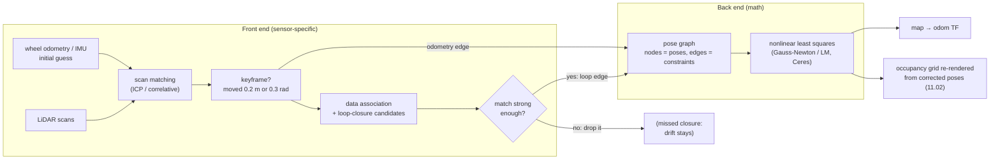

# 11.03 — The SLAM problem — front end, back end, and why it is hard

<!-- glance:start -->
<!-- generated by tools/build.py from curriculum/syllabus.yaml — edit the syllabus, not this block -->

| | |
|---|---|
| **Track** | Main path |
| **Difficulty** | Intermediate |
| **Time** | 45 min |
| **Hardware** | none |
| **Software** | none |
| **Prerequisites** | [11.02 Occupancy grid mapping with known poses (log-odds and ray casting)](11.02-occupancy-grid-mapping.md)<br>[10.06 The Extended Kalman Filter for a differential-drive robot](../10-localization/10.06-extended-kalman-filter.md) |
| **Skip if** | You can explain SLAM's chicken-and-egg problem and front/back-end split. |

<!-- glance:end -->

## What you will learn

- Explain SLAM's chicken-and-egg problem, and show with the simulator why mapping on wheel odometry alone smears the map.
- Write the full SLAM and online SLAM posteriors, and say which family of algorithms solves which.
- Split a SLAM system into a front end (odometry, scan matching, data association, loop-closure detection) and a back end (estimation), and name the matching parts of slam_toolbox.
- Gate a data association with the Mahalanobis distance, and explain why a wrong association is worse than a missed one.
- Predict how a heading error turns into a position error on walls far from the robot.

## Why it matters

In 11.02 the simulator handed you the true pose of every scan, and the map came out perfect. Your real robot has no such oracle. It has wheel odometry, which drifts ([09.06](../09-odometry/09.06-accumulated-error.md)), and a LiDAR. Put the drifting poses into the same mapper, and the apartment turns into a rotated, doubled, smeared mess. This lesson shows that happening, then takes apart the machinery every SLAM system uses to prevent it.

When slam_toolbox misbehaves on karmel in [11.07](11.07-mapping-your-room.md), you will need this vocabulary to diagnose it. "The walls double after I come back to the kitchen" is a missed loop closure. "The map folded onto itself" is a wrong data association. "The corridor got shorter" is a degenerate scan match. Those are three different parts of the system, with three different fixes.

<!-- prereqs:start -->
## Prerequisites

You need these first:

- [11.02 Occupancy grid mapping with known poses (log-odds and ray casting)](11.02-occupancy-grid-mapping.md)
- [10.06 The Extended Kalman Filter for a differential-drive robot](../10-localization/10.06-extended-kalman-filter.md)

### Optional prerequisite links

None.

Check your readiness: `python course.py why 11.03`
<!-- prereqs:end -->

## Concept

### Chicken and egg

Mapping needs poses: to paint a wall from a scan, you must know where the scan was taken. Localization needs a map: to know where you are, you match what you see against a map ([10.01](../10-localization/10.01-what-is-localization.md), [10.09](../10-localization/10.09-amcl-in-ros2.md)). With neither, you need both at once: **Simultaneous Localization And Mapping**.

A distributed-systems version of the same trap: you have event logs from servers whose clocks drift. To merge the logs into one timeline you need correct clocks. To correct the clocks you look for events that must line up across logs. You solve both together, by finding consistent anchors (the same request seen by two servers) and letting every other timestamp adjust around them. SLAM does exactly that. The anchors are places the robot recognizes, and the timestamps are poses.

### Why odometry alone smears

Wheel odometry is locally good: over half a meter it is off by millimeters. But its errors **accumulate**, and heading errors are the worst. A heading error rotates everything the robot sees afterwards around the robot. A wall 5 m away seen with a 3° heading error lands 26 cm from where it belongs. Revisit the room later with 20° of accumulated error, and the second copy of the room is painted on top of the first, rotated. Log-odds cannot fix that: both copies get plenty of "occupied" votes.

### What SLAM adds

Two things break the spiral:

1. **Scan matching.** Align the new scan with recent scans or with the map, and correct the odometry step by step. Drift slows down but never stops, because every match has a small error ([11.04](11.04-scan-matching-icp.md)).
2. **Loop closure.** Recognize a place you have seen before, like the living room after touring the apartment. That gives one constraint between "now" and "long ago", and an optimizer spreads the accumulated error over the whole trajectory ([11.05](11.05-pose-graphs-loop-closure.md)).

The part that turns sensor data into constraints is the **front end**. The part that turns constraints into the best poses is the **back end**.

> [!TIP]
> **Ask your teacher:** "Walk me through what happens inside a SLAM system in the ten seconds after the robot drives back into a room it has already mapped, from the LiDAR scan to the map→odom transform."

## Technical explanation

### Level 1 — The experiment: the same scans, two sets of poses

`smeared_map.py` takes the 52-second realistic tour from 11.02 (519 scans, 11.3 m through all four rooms) and builds two maps with the same 11.02 mapper. One uses the true poses, the other the wheel odometry that karmel would really have. The realistic preset has a right motor 6% weaker, wheel radii off by −0.5%/+0.8%, a wheelbase 4% wider than `karmel.yaml` says, and 2% wheel slip.

| Travelled | Odometry position error | Heading error |
|---|---|---|
| 1.0 m | 0.02 m | 3.3° |
| 2.0 m | 0.12 m | 8.2° |
| 4.0 m | 0.46 m | 15.4° |
| 8.0 m | 0.64 m | 21.4° |
| 11.3 m (back at the start) | **1.06 m** | **31.5°** |

| Map built with | Occupied cells | On a real wall | Free cells really free |
|---|---|---|---|
| true poses | 1,100 | 100% | 97.4% |
| wheel odometry | 1,539 | **37%** | 88.6% |

In the odometry map the apartment is rotated by up to 30°, every room overlaps a rotated copy of its neighbour, and the living room appears twice. The heading error grows almost linearly with distance, which shows it is systematic, not random. The position error wobbles up and down, because a rotated trajectory can pass close to the true one by chance.

### Level 2 — Practical: anatomy of a SLAM system

```text
 sensors ──► FRONT END ────────────────────────────► BACK END ─────────► outputs
             • odometry / motion prediction           • estimate poses      • map→odom TF
             • scan matching (11.04)                   (and landmarks)     • occupancy grid
             • keyframe selection                     • graph optimization  (re-rendered)
             • data association                        or filter update    • pose graph file
             • loop-closure detection + verification
             produces: constraints with uncertainty   produces: the most likely poses
```

**Front end: sensor-specific, heuristic, where most failures start.**

- **Motion prediction:** wheel odometry, IMU, or both ([10.07](../10-localization/10.07-fusing-imu-and-odometry.md)). It supplies the initial guess every other step needs.
- **Scan matching:** align scan $k$ with scan $k-1$, or with a local submap, to get a relative pose with an uncertainty. This is 11.04's ICP. slam_toolbox uses Karto's correlative matcher instead, which does the same job.
- **Keyframes:** do not store every scan. Add a node when the robot has moved enough. slam_toolbox's `minimum_travel_distance` and `minimum_travel_heading` set this; karmel's config uses 0.2 m and 0.3 rad.
- **Data association:** decide which past observation a new one corresponds to. Which landmark is this, and which old scan overlaps this one?
- **Loop-closure detection:** find old places the robot might be revisiting (candidates near the current estimate, or with similar appearance), then verify with a scan match that has strict acceptance rules.

**Back end: generic mathematics.** It receives "pose $j$ is $z_{ij}$ away from pose $i$, with this confidence" and computes the poses that best satisfy all constraints together. Three families:

| Family | Keeps | Example | Status |
|---|---|---|---|
| EKF-SLAM | current pose + all landmarks in one Gaussian | classic 1990s–2000s | teaching; poor scaling |
| Particle filter (Rao-Blackwellized) | many trajectory hypotheses, one map each | FastSLAM, GMapping (ROS 1 default) | legacy for 2D LiDAR |
| **Graph optimization** | all keyframe poses + constraints; re-solves | slam_toolbox, Cartographer, ORB-SLAM3, RTAB-Map | **current standard** |

Graph SLAM won because it can **change the past**. A filter commits to each estimate and moves on; a graph re-optimizes old poses whenever a loop closure arrives.

**How it shows up in ROS 2 (REP-105).** Odometry publishes `odom → base_link`: smooth, continuous, drifting. SLAM publishes `map → odom`: the correction that makes `map → base_link` globally right. When a loop closes, `map → odom` jumps and the robot appears to teleport in RViz. The odometry frame never jumps, which is why local controllers use `odom` ([05.06](../05-frames-and-transforms/05.06-frame-conventions-rep103-rep105.md)).

### Level 3 — Mathematics: full vs. online SLAM

Let $x_{1:t}$ be the poses, $m$ the map, $u_{1:t}$ the odometry and $z_{1:t}$ the measurements. **Full SLAM** estimates the whole trajectory and the map:

$$p(x_{1:t},\, m \mid z_{1:t},\, u_{1:t})$$

**Online SLAM** estimates only the current pose and the map, with the past poses integrated out:

$$p(x_t,\, m \mid z_{1:t},\, u_{1:t}) = \int \cdots \int p(x_{1:t},\, m \mid z_{1:t},\, u_{1:t})\; dx_1 \cdots dx_{t-1}$$

Filters (EKF, particles) solve the online problem: they marginalize each old pose as soon as it is replaced. Graph methods solve the full problem, and a robot that needs "now" just reads the newest node.

With the usual Markov assumptions the full posterior factors into small pieces:

$$p(x_{1:t}, m \mid z, u) \;\propto\; p(x_0) \prod_{k} \underbrace{p(x_k \mid x_{k-1}, u_k)}_{\text{motion / odometry}} \prod_{k} \underbrace{p(z_k \mid x_k, m)}_{\text{measurement}}$$

If every factor is Gaussian, maximizing this product is the same as minimizing the sum of squared, covariance-weighted errors, the negative logarithm:

$$x^* = \arg\min_x \sum_{\text{constraints}} e_{ij}(x)^\top \,\Omega_{ij}\, e_{ij}(x)$$

That is a nonlinear least-squares problem ([FM.20](../optional-foundations/mathematics/FM.20-optimization-basics.md)), and 11.05 solves it.

**Numerical example: why EKF-SLAM does not scale.** 50 landmarks give a state of $3 + 2 \times 50 = 103$ numbers and a covariance with $103^2 = 10{,}609$ entries, every one of them touched by every update ($O(n^2)$). A pose graph with 50 keyframes has $3 \times 50 = 150$ unknowns, but each odometry or loop constraint touches only two poses, so the matrix the solver factorizes is almost all zeros (you will see its sparsity pattern in 11.05).

**Numerical example: heading error on far walls.** A point at range $r$ seen with heading error $\delta\theta$ is displaced sideways by about $r\,\delta\theta$. At $r = 5$ m, $\delta\theta = 3° = 0.0524$ rad: $5 \times \sin 3° = 0.26$ m. The tour's final 31.5° at 3 m range gives about 1.6 m. That is why the odometry map above is unusable even though the position error is "only" 1 m.

### Level 3b — Data association

For each new observation the front end must answer: *is this something I already have, and which one?* With landmarks, compare the measured position $z$ with the predicted $\hat z$ of a candidate. The **innovation** $\nu = z - \hat z$ has covariance $S$ (prediction uncertainty + measurement noise, [10.06](../10-localization/10.06-extended-kalman-filter.md)). The squared **Mahalanobis distance**

$$d^2 = \nu^\top S^{-1} \nu$$

is compared with a $\chi^2$ threshold: 5.99 for 2 degrees of freedom at 95%.

**Numerical example.** $S = \operatorname{diag}(0.1^2, 0.1^2)\ \text{m}^2$.

- $\nu = (0.30, 0.05)$ m: $d^2 = 0.30^2/0.01 + 0.05^2/0.01 = 9 + 0.25 = 9.25 > 5.99$. **Reject**: probably a different landmark.
- $\nu = (0.12, 0.10)$ m: $d^2 = 1.44 + 1.00 = 2.44 < 5.99$. **Accept.**

The hard cases are not the numbers but the world:

- **Perceptual aliasing:** two identical doorways, two identical office rooms, a long corridor. Both candidates pass the gate.
- **Asymmetric cost:** a *missed* association (or loop closure) leaves drift uncorrected, and the map is a bit worse. A *wrong* one tells the optimizer that two different places are the same. It then bends the whole trajectory to make them meet, and the map folds. Robust systems therefore accept loop closures only with strong evidence (slam_toolbox: `loop_match_minimum_response_fine`, `loop_match_minimum_chain_size`), and use robust loss functions (`ceres_loss_function`) that limit how hard one bad constraint can pull.

### Level 4 — Implementation: slam_toolbox's parts by name

What you run in 11.06 maps onto this lesson's anatomy (parameter names from `labs/ros2_ws/src/karmel_bringup/config/slam_toolbox_online_async.yaml`):

| Anatomy | slam_toolbox / Karto | Parameters |
|---|---|---|
| Motion prediction | the `odom → base_footprint` TF from your odometry | `odom_frame`, `base_frame` |
| Keyframes | a scan becomes a node after enough motion | `minimum_travel_distance`, `minimum_travel_heading` |
| Scan matching | Karto correlative scan matcher against a buffer of recent scans | `use_scan_matching`, `scan_buffer_size`, `correlation_search_space_*` |
| Loop-closure detection | search old nodes near the current pose, then coarse-to-fine match | `do_loop_closing`, `loop_search_maximum_distance`, `loop_search_space_*`, `loop_match_*` |
| Back end | pose graph solved with Google Ceres (sparse Cholesky, Levenberg-Marquardt) | `solver_plugin: solver_plugins::CeresSolver`, `ceres_*` |
| Map | occupancy grid rendered from the optimized poses | `resolution`, `map_update_interval` |
| Output | `map → odom` TF, `/map`, serialized pose graph | `transform_publish_period`, `mode` |

## Diagram



```text
 Why a small heading error ruins far walls

            true wall  ─────────────────────────
                                    ↕ ≈ r·δθ = 5 m × sin 3° = 0.26 m
            mapped wall ─────────────────────────
                    ╲ δθ = 3°
     robot ●─────────────────────────────── r = 5 m
```

## Code

[`code/smeared_map.py`](code/smeared_map.py) reuses the recorded tour ([`code/slam_common.py`](code/slam_common.py)) and the mapper from 11.02 ([`code/occupancy_grid_mapping.py`](code/occupancy_grid_mapping.py)):

```python
log = load_tour(realistic=True, seed=args.seed)
maps = {}
for name, poses in (("true poses", log.truth), ("wheel odometry", log.odom)):
    grid, truth_grid = build_map(poses, log.scans, log.world, log.lidar_offset)
    occ = grid.to_occupancy_grid()
    maps[name] = occ
    q = compare_with_truth(occ, truth_grid)
    print(f"{name:15s}: {q['occupied_cells']:5d} occupied cells, {q['occupied_on_a_wall']:.0%} of them on a real wall, "
          f"{q['free_really_free']:.1%} of free cells really free")
```

`log.odom` is what a robot computes from its encoders: every 20 ms, the tick differences go through `arc_update` with the **nominal** wheel radius and wheelbase from `karmel.yaml` (the same exact-arc odometry you built in [09.04](../09-odometry/09.04-odometry-from-scratch.md)). The pilot that drives the tour steers with the true pose, the way a human with a joystick would. The mapper never sees that pose unless you pass `log.truth`.

```bash
python 11-slam/code/smeared_map.py
```

```text
travelled  position error  heading error
   1.01 m        0.023 m         3.3 deg
   2.00 m        0.121 m         8.2 deg
   4.00 m        0.461 m        15.4 deg
   6.00 m        0.490 m        17.3 deg
   8.01 m        0.635 m        21.4 deg
  10.01 m        0.536 m        26.3 deg
  11.26 m        1.061 m        31.5 deg
true poses     :  1100 occupied cells, 100% of them on a real wall, 97.4% of free cells really free
wheel odometry :  1539 occupied cells, 37% of them on a real wall, 88.6% of free cells really free
wrote .../11-slam/code/out/smeared_map.png
final odometry error: 1.06 m, 31.5 deg
```

`out/smeared_map.png`: left, the clean apartment with the blue path; middle, the same scans on odometry poses, with the outer walls fanned into rotated copies, interior walls crossing each other and the path ending a meter from its start; right, position error wobbling up to 1.06 m and heading error climbing steadily to 31.5°.

## Exercise

All exercises need hardware: none (course simulator).

### Exercise 11.03-E1 — Same robot, different luck `[simulation]`

Run `smeared_map.py --seed 1`, `--seed 2` and `--seed 3` (each simulates a new tour the first time, a few seconds each). Record final position and heading error and "on a real wall" for each. Is the drift mostly random or mostly systematic? Which number tells you?

### Exercise 11.03-E2 — Is it the robot or the algorithm? `[coding]`

Write `ideal_odometry_map.py` next to the lesson code. It uses `load_tour(realistic=False)`, builds the map from `log.odom` with `build_map`, and prints `compare_with_truth` plus the final odometry error. **Predict first:** will the ideal robot's odometry map be as good as the true-pose map from 11.02?

### Exercise 11.03-E3 — Heading error on the far wall `[numerical]`

karmel's LiDAR sees walls up to 6 m away in a typical Israeli apartment. (a) What heading error moves a wall at 6 m by one 5 cm cell? (b) The realistic tour accumulates about 2.8° per meter of travel. After how many meters does a wall at 3 m move by 10 cm? (c) A position error of 10 cm with no heading error moves every wall by how much?

### Exercise 11.03-E4 — Gate the association `[numerical]`

A landmark is predicted at $\hat z = (2.00, 1.00)$ m in the robot frame with $S = \begin{pmatrix}0.04 & 0.01\\ 0.01 & 0.02\end{pmatrix}$ m². Two tags are detected, at $z_A = (2.25, 1.05)$ and $z_B = (1.80, 1.30)$. Compute $d^2$ for both. Which pass the 95% gate (5.99)? If both pass, what should a careful front end do?

### Exercise 11.03-E5 — Diagnose three bad maps `[debugging]`

Three teammates show you maps of the same flat. **A**: every room is clean, but the hallway where the robot finished shows two copies of the same door, 40 cm apart. **B**: the map is clean except the kitchen, which appears rotated 90° and overlapping the bedroom. **C**: the 8 m hallway came out 6.5 m long, and all rooms are fine. For each, name the failing part of the system (odometry, scan matching, data association, loop closure, back end) and the first thing you would check.

## Expected result

- **11.03-E1:** Seed 0: 1.06 m / 31.5°. Seed 1: about 1.11 m / 30.1°. Seed 2: about 1.17 m / 33.8°. Seed 3: about 1.01 m / 30.2°. "On a real wall" is around 35–40% for all. The heading error is 30–34° in every run, which makes the drift mostly **systematic** (a wrong wheelbase and wheel radii, the same every time). Slip adds only a few degrees of scatter. Calibration ([09.05](../09-odometry/09.05-calibrating-odometry.md)) would remove most of it, and SLAM removes the rest.
- **11.03-E2:** Final odometry error below 0.1 mm and 0.02°. The map has 100% of its occupied cells on real walls, so it is as good as the true-pose map. (It has 937 occupied cells instead of 1,100 because the ideal preset also has noise-free ranges, which land exactly on wall lines and paint thinner walls.) The algorithm is fine. The smear comes from the robot's imperfections, and SLAM exists because every real robot has them.
- **11.03-E3:** (a) $\delta\theta = \arcsin(0.05/6) = 0.48°$. (b) $\delta\theta = \arcsin(0.10/3) = 1.91°$, and $1.91/2.8 \approx$ **0.7 m** of travel. (c) 10 cm: a pure translation shifts every wall equally, regardless of range. Heading error is the dangerous one.
- **11.03-E4:** $S^{-1} = \frac{1}{0.0007}\begin{pmatrix}0.02 & -0.01\\ -0.01 & 0.04\end{pmatrix}$. A: $\nu = (0.25, 0.05)$, $d^2 = (0.02 \cdot 0.0625 - 2 \cdot 0.01 \cdot 0.0125 + 0.04 \cdot 0.0025)/0.0007 = 0.00110/0.0007 = $ **1.57**, passes. B: $\nu = (-0.20, 0.30)$, $d^2 = (0.0008 + 0.0012 + 0.0036)/0.0007 = $ **8.0**, rejected. Had both passed: take the smaller $d^2$ only if it is clearly smaller (for example a ratio above 3), otherwise use neither. Ambiguous associations should be skipped, not guessed.
- **11.03-E5:** **A**: loop closure missed. Accumulated drift was never corrected when the robot returned. Check whether the loop search distance covers the drift (`loop_search_maximum_distance`) and whether match responses fell just below the thresholds. **B**: a wrong data association or loop closure. The kitchen was matched to a similar-looking place with the wrong rotation, and the back end bent the map to fit. Check the loop-closure edges near the kitchen, tighten the acceptance thresholds, or use a robust loss. **C**: degenerate scan matching in a featureless corridor. The matcher cannot observe motion along the corridor, so it believes the robot stood still ([11.04](11.04-scan-matching-icp.md)). Check odometry weighting and whether the hallway has any features.

## Troubleshooting

### Symptom: the map looks fine locally but rooms overlap or repeat

1. Plot the estimated trajectory over the map. Does the trajectory itself cross walls? Then it is a pose problem, not a mapping problem.
2. Compare odometry alone with the SLAM estimate. If they agree, the scan matcher is not correcting anything: check that it runs (`use_scan_matching`) and receives scans (topic names, TF).
3. If the error appears suddenly when re-entering a room, it is loop closure: missed (drift) or wrong (fold).

### Symptom: the map rotates slowly as you drive

1. Drive straight 3 m and turn 360° in place. Compare the odometry heading with a protractor or with the simulator's truth.
2. A consistent heading gain error points to the wheelbase ([09.05](../09-odometry/09.05-calibrating-odometry.md)). A drift while standing still points to gyro bias ([07.05](../07-sensors/07.05-imu-fundamentals.md)).
3. Only then tune SLAM: a better initial guess makes every scan match easier.

### Symptom: the robot "teleports" in RViz

1. Check whether `map → odom` changed at that moment (`ros2 run tf2_ros tf2_echo map odom`). A jump right after re-entering a known area is a loop closure working as designed.
2. If `odom → base_link` jumps, your odometry is broken (wheel slip, encoder rollover), not SLAM.

## Common mistakes

- **Thinking SLAM "removes" odometry.** Every SLAM front end needs a decent initial guess. Bad odometry makes scan matching fail, and then SLAM fails.
- **Treating a missed and a wrong loop closure as equally bad.** A missed one costs accuracy; a wrong one destroys the map. Tune for precision first.
- **Judging drift by position error alone.** Heading error is what smears far walls. Always log both.
- **Using the `map` frame for local control.** It jumps at loop closures. Controllers work in `odom`.
- **Blaming the mapper for pose errors.** Map a few scans with ground-truth or carefully measured poses first. If that map is clean, the mapper is fine.

## Knowledge check

1. In one sentence each: why does mapping need localization, and why does localization need a map?
   <details><summary>Answer</summary>

   To paint a scan into a map you must know where the sensor was when it took the scan. To estimate where you are you must compare what you see with a map of what is where.
   </details>

2. What is the difference between full SLAM and online SLAM, and which does slam_toolbox solve?
   <details><summary>Answer</summary>

   Full SLAM estimates the whole trajectory $x_{1:t}$ plus the map. Online SLAM estimates only the current pose $x_t$ plus the map, with past poses marginalized. slam_toolbox is graph-based: it keeps and re-optimizes all keyframe poses, so it solves full SLAM (over keyframes) and reports the newest pose for the robot to use.
   </details>

3. After 6 m of driving the heading is off by 12°. How far off is a wall 4 m to the robot's side?
   <details><summary>Answer</summary>

   About $4 \times \sin 12° = 0.83$ m (plus whatever the position error adds). That is more than 16 cells at 5 cm, so the wall is painted in a completely different place.
   </details>

4. Put these in front end or back end: keyframe selection, Gauss-Newton, loop-closure verification, scan matching, choosing information matrices, sparse Cholesky.
   <details><summary>Answer</summary>

   Front end: keyframe selection, scan matching, loop-closure verification, and choosing information matrices (the front end knows how good each match was). Back end: Gauss-Newton and sparse Cholesky.
   </details>

5. A candidate association has $d^2 = 4.1$ with 2 degrees of freedom, and a second candidate has $d^2 = 4.6$. Accept either?
   <details><summary>Answer</summary>

   Both pass the 95% gate (5.99), but they are nearly equally likely, so the association is ambiguous. A careful front end skips this observation, or waits for more evidence, instead of guessing. A wrong association can fold the map.
   </details>

6. Predict: you disable loop closure in slam_toolbox and map a single long corridor with no loops. How much worse is the map?
   <details><summary>Answer</summary>

   Hardly worse, because without loops there is nothing to close. The map quality then depends only on scan matching and odometry. Loop closure matters when the robot returns to places it has seen. (A long featureless corridor has its own scan-matching problem, 11.04.)
   </details>

7. Why did graph-based SLAM replace EKF-SLAM for LiDAR mapping?
   <details><summary>Answer</summary>

   It scales: each constraint touches only two poses, so the system is sparse, while the EKF's dense covariance costs $O(n^2)$ per update. It can relinearize and correct past poses when a loop closes, where a filter has committed to them. And it separates the front end cleanly from a generic back end (Ceres, g2o, GTSAM).
   </details>

## Practical challenge

Make wheel odometry good enough that the odometry-only map is *usable* (walls within a cell or two), **without** SLAM, and measure how far that gets you.

`load_tour(realistic=True, seed=…)` also logs the cumulative encoder counts at every scan (`log.ticks`, 10 Hz). Recompute odometry from them with calibrated values: find the effective left/right wheel radii and wheelbase by fitting them to the true poses on seed 0 (least squares, [FM.19](../optional-foundations/mathematics/FM.19-linear-systems-least-squares.md), or `scipy.optimize.least_squares`), then test on seeds 1–3. For reference, odometry with the simulator's *exact* hidden radii and wheelbase still ends 3–12 cm and 1–3° off on those seeds, because of slip.

**Acceptance criteria:**

- A table of final position/heading error and "occupied on a real wall" for nominal vs calibrated odometry on seeds 1–3.
- The calibrated map reaches ≥ 80% "on a real wall" on at least two seeds.
- A two-sentence explanation of why even perfect calibration does not reach 100%, and which SLAM component removes the rest.

## You can skip this if…

You can answer knowledge-check questions 2, 4 and 7 without looking, and diagnose all three maps in Exercise E5 correctly.

`python course.py skip 11.03 --reason "I know the SLAM problem, its formulations and the front/back-end split"`

## Go deeper

- Durrant-Whyte & Bailey, *Simultaneous Localization and Mapping: Part I* (IEEE RAM 2006): https://doi.org/10.1109/MRA.2006.1638022 and *Part II*: https://doi.org/10.1109/MRA.2006.1678144 — the classic tutorial. Part II covers data association and complexity.
- Cadena et al., *Past, Present, and Future of Simultaneous Localization and Mapping* (T-RO 2016): https://arxiv.org/abs/1606.05830 — the front-end/back-end anatomy, robustness, and why a wrong loop closure is catastrophic.
- Grisetti et al., *A Tutorial on Graph-Based SLAM* (IEEE ITS Magazine 2010): https://doi.org/10.1109/MITS.2010.939925 — the formulation used by slam_toolbox; read it before 11.05.
- SLAM Toolbox README (Jazzy branch): https://github.com/SteveMacenski/slam_toolbox/blob/jazzy/README.md — how the Karto front end, the Ceres back end and lifelong mapping fit together.
- REP-105, Coordinate Frames for Mobile Platforms: https://www.ros.org/reps/rep-0105.html — why SLAM publishes `map → odom` and not `map → base_link`.
- Cyrill Stachniss, Mobile Sensing and Robotics 2 course page: https://www.ipb.uni-bonn.de/msr2-2021/index.html — lectures on the SLAM problem, graph SLAM and front ends.
- Paper reading path: [references/papers.md, Track 2 — SLAM](../references/papers.md#track-2--slam).

## Progress checkpoint

- [ ] I can explain the chicken-and-egg problem, and I have seen odometry smear a map in the simulator.
- [ ] I can write the full and online SLAM posteriors and say which algorithm families solve each.
- [ ] I can sort SLAM components into front end and back end, and name them in slam_toolbox.
- [ ] I can gate a data association with the Mahalanobis distance and explain the cost of a wrong one.

`python course.py complete 11.03` (exercises done) · `python course.py master 11.03` (challenge done) · `python course.py struggle 11.03 "what was hard"`

Next: [11.04 — Scan matching with ICP](11.04-scan-matching-icp.md), the front end's workhorse.
