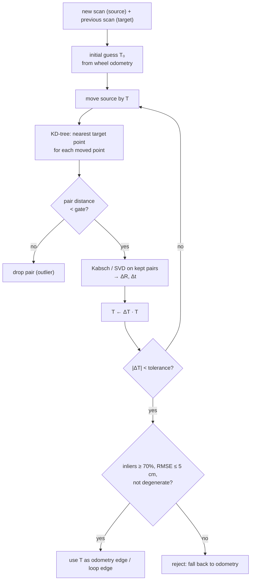

# 11.04 — Scan matching with ICP

<!-- glance:start -->
<!-- generated by tools/build.py from curriculum/syllabus.yaml — edit the syllabus, not this block -->

| | |
|---|---|
| **Track** | Main path |
| **Difficulty** | Advanced |
| **Time** | 1 h 15 min |
| **Hardware** | none |
| **Software** | python, numpy |
| **Prerequisites** | [11.03 The SLAM problem — front end, back end, and why it is hard](11.03-the-slam-problem.md) |
| **Optional prerequisites** | [FM.19 Linear systems and least squares](../optional-foundations/mathematics/FM.19-linear-systems-least-squares.md)<br>[FM.20 Optimization for robotics and ML: gradient descent to nonlinear least squares](../optional-foundations/mathematics/FM.20-optimization-basics.md) |
| **Skip if** | You have implemented point-to-point ICP. |

<!-- glance:end -->

## What you will learn

- Derive the least-squares rigid alignment of two point sets (Kabsch/Arun, via the SVD), and compute it by hand for three points.
- Implement point-to-point ICP: KD-tree nearest neighbours, correspondence rejection by distance, iterate to convergence.
- Measure ICP's convergence basin in the simulator and explain its failure cases: large initial errors, featureless corridors, dynamic clutter.
- Decide when to trust a match (inlier fraction, RMSE, degeneracy), and say why point-to-line ICP and correlative matching exist.
- Map your ICP pieces onto slam_toolbox's Karto scan matcher by parameter name.

## Why it matters

In 11.03, wheel odometry drifted to 1.06 m and 31.5° over an 11 m tour, and the map smeared. The fix every LiDAR SLAM system uses first is **scan matching**: compare the scan you just took with the previous one, and measure how the robot moved from what the walls did. Chained along the same tour, the ICP you build today cuts the final error to 10 cm and 2.7°. The same routine then verifies loop closures in 11.05.

Scan matching is also where SLAM fails most visibly on a real robot. A long hallway shrinks, a crowd drags the map along, a fast turn breaks tracking. You can only diagnose those when you know what the matcher is optimizing and where its basin ends.

<!-- prereqs:start -->
## Prerequisites

You need these first:

- [11.03 The SLAM problem — front end, back end, and why it is hard](11.03-the-slam-problem.md)

### Optional prerequisite links

New to any of these? Take the foundation lesson first; skip it if you already know it.

- [FM.19 Linear systems and least squares](../optional-foundations/mathematics/FM.19-linear-systems-least-squares.md)
- [FM.20 Optimization for robotics and ML: gradient descent to nonlinear least squares](../optional-foundations/mathematics/FM.20-optimization-basics.md)

Check your readiness: `python course.py why 11.04`
<!-- prereqs:end -->

## Concept

### Two transparencies

Draw the living room's walls, as seen by the LiDAR, on a transparent sheet. The robot drives 35 cm and turns 12°, and you draw the new scan on a second sheet. Lay the second sheet on the first: the walls do not line up. Slide and rotate the top sheet until they do. How far you slid and rotated it **is** the robot's motion. That is scan matching.

A computer cannot "see" the walls line up, so it needs a rule. ICP's rule:

1. For every point of the new scan, guess that its partner is the **closest** point of the old scan.
2. Compute the rotation and translation that best align those pairs: an exact, closed-form least-squares answer.
3. Apply it. The closest points are now different, so go back to 1, until nothing moves.

Step 2 is exact. Step 1 is a guess, right only when the scans are already roughly aligned. That one fact explains ICP's strengths (fast, accurate, simple) and its weaknesses (needs a good initial guess, can lock onto the wrong alignment).

### Where the initial guess comes from

Wheel odometry. It drifts over meters, but between two scans 0.3 m apart it is off by millimeters to a few centimeters, and that is well inside ICP's basin. Odometry and scan matching are complementary. Odometry is smooth and never "loses lock", but it drifts. Scan matching does not drift within a room, but it needs the starting point odometry gives it.

> [!TIP]
> **Ask your teacher:** "Draw two L-shaped scans offset by 20 cm and 10°, pair the points by nearest neighbour by hand, and show me why the first ICP step only gets part of the way."

## Technical explanation

### Level 1 — The ICP loop

```text
T ← initial guess (from odometry)
repeat:
    moved   ← T · source points
    pairs   ← nearest target point for each moved point      (KD-tree)
    keep    ← pairs closer than max_correspondence_distance  (outlier rejection)
    ΔT      ← best rigid fit of kept pairs                   (SVD)
    T       ← ΔT · T
until ΔT is tiny
report T, RMSE of kept pairs, inlier fraction
```

Frames: `source` is the new scan (in the LiDAR frame at time $k$), `target` is the old scan (at time $k-1$). The result $T$ maps new-scan points into the old scan's frame, which is exactly **the pose of the robot at $k$ expressed in the frame at $k-1$**: `truth_k_minus_1.between(truth_k)` in robotlab. On karmel the LiDAR sits at `base_link`, so no extra mount transform is needed. On other robots, conjugate by the mount ([05.04](../05-frames-and-transforms/05.04-homogeneous-transforms.md)).

### Level 2 — Practical: nearest neighbours, rejection, reliability

**Nearest neighbours.** Brute force compares every source point with every target point: 360 × 360 = 130,000 distances per iteration. A **KD-tree** splits space recursively along x and y, so a query is about $O(\log n)$. Build it once on the target and query all source points in one call:

```python
from scipy.spatial import KDTree
tree = KDTree(target_points)                 # once per scan pair
dist, idx = tree.query(moved_source_points)  # (N,), (N,)
```

**Correspondence rejection.** Some source points have no true partner. They were occluded in the other scan, a person walked through, the doorway revealed a new room. Their "nearest" point is wrong and pulls the solution. Drop pairs farther than `max_correspondence_distance`. Big gate: large basin, but outliers bias the result. Small gate: precise, but it needs a good initial guess. Solution: **coarse-to-fine**, run ICP with gates 1.0 → 0.5 → 0.25 → 0.1 m, each stage starting from the previous result.

**Reliability.** ICP *always* returns an answer. Before you use it, check:

| Check | Meaning | Course default |
|---|---|---|
| `converged` | the last correction was below tolerance | required |
| `inlier_fraction` | share of source points that found a partner within the gate | ≥ 0.7 |
| `rmse` | RMS distance of those partners | ≤ 5 cm |
| degeneracy | do the walls constrain every direction? | smallest/largest eigenvalue of $\sum n n^\top$ > 0.1 |

The first three catch a match into the wrong room. The fourth catches a match that fits perfectly and is still wrong: the corridor below.

**Measured on the simulator** (`icp.py`, apartment scans 35 cm and 12° apart, 1 cm range noise, initial guess = identity):

| Variant | Position error | Heading error | Iterations |
|---|---|---|---|
| point-to-point, gate 0.3 m | 18.1 mm | 0.32° | 32 |
| point-to-point, coarse-to-fine 1.0 → 0.1 m | 2.9 mm | 0.28° | 50 |
| point-to-line, gate 0.3 m | 1.5 mm | 0.11° | 11 |

Point-to-point has a **sampling bias**. The two scans sample a wall at different spots (1° beam spacing is 8.7 cm at 5 m), so even a perfect alignment leaves nonzero pair distances, and they pull slightly. A tight final gate reduces the bias. Point-to-line removes most of it (Level 4).

### Level 3 — Mathematics: the best rigid fit, derived

Given pairs $(p_i, q_i)$, $i = 1..N$, find the rotation $R$ and translation $t$ minimizing

$$E(R, t) = \sum_i \lVert R p_i + t - q_i \rVert^2 .$$

**Step 1, translation.** Setting $\partial E / \partial t = 0$ gives $\sum_i (R p_i + t - q_i) = 0$, so

$$t = \bar q - R \bar p, \qquad \bar p = \tfrac{1}{N}\sum p_i,\ \bar q = \tfrac{1}{N}\sum q_i .$$

The best translation moves the rotated source centroid onto the target centroid.

**Step 2, rotation.** Substitute $t$ and use centered points $p'_i = p_i - \bar p$, $q'_i = q_i - \bar q$:

$$E = \sum_i \lVert R p'_i - q'_i \rVert^2 = \sum_i \left(\lVert p'_i\rVert^2 + \lVert q'_i\rVert^2\right) - 2\sum_i q_i'^\top R\, p'_i .$$

(Rotations preserve length, so $\lVert R p'\rVert = \lVert p'\rVert$.) The first sum does not depend on $R$, so **maximize** $\sum_i q_i'^\top R p'_i = \operatorname{tr}(R H)$ with the cross-covariance

$$H = \sum_i p'_i\, q_i'^\top \quad (2 \times 2).$$

Take the SVD $H = U S V^\top$ ([FM.19](../optional-foundations/mathematics/FM.19-linear-systems-least-squares.md)). Then $\operatorname{tr}(RH) = \operatorname{tr}(V^\top R U\, S)$. Since $V^\top R U$ is a rotation and $S$ is diagonal and non-negative, the trace is largest when $V^\top R U = I$:

$$R = V U^\top, \quad\text{and if } \det(VU^\top) = -1:\ R = V \operatorname{diag}(1, -1)\, U^\top .$$

The determinant check matters. For nearly collinear or mirrored points, the best *orthogonal* matrix can be a reflection, and a robot cannot mirror itself. (This is the Kabsch algorithm, 1976, and Arun, Huang & Blostein, 1987.)

**In 2D there is a shortcut** that is handy for checking by hand: $\theta = \operatorname{atan2}(H_{xy} - H_{yx},\ H_{xx} + H_{yy})$.

**Numerical example.** Source $p = (0,0), (2,0), (2,1)$. The target is the source rotated 30° and moved by $(1.0, 0.5)$: $q = (1.0, 0.5), (2.7321, 1.5), (2.2321, 2.3660)$.

1. Centroids: $\bar p = (1.3333, 0.3333)$, $\bar q = (1.9880, 1.4553)$.
2. Centered: $p' = (-1.3333, -0.3333), (0.6667, -0.3333), (0.6667, 0.6667)$; $q' = (-0.9880, -0.9553), (0.7440, 0.0447), (0.2440, 0.9107)$.
3. $H = \sum p' q'^\top = \begin{pmatrix} 1.9761 & 1.9107 \\ 0.2440 & 0.9107 \end{pmatrix}$, with singular values 2.8685 and 0.4648.
4. $R = VU^\top = \begin{pmatrix} 0.8660 & -0.5 \\ 0.5 & 0.8660 \end{pmatrix}$, $\det = +1$, so $\theta = 30.00°$. Check with the shortcut: $\operatorname{atan2}(1.9107 - 0.2440,\ 1.9761 + 0.9107) = \operatorname{atan2}(1.6667, 2.8868) = 30.00°$.
5. $t = \bar q - R\bar p = (1.9880, 1.4553) - (0.9880, 0.9553) = (1.0, 0.5)$. Exact.

**Why iterate?** With the true pairs, one SVD solves the problem. ICP does not know the pairs. Nearest neighbours are right only near the solution, so each step fixes part of the error and re-pairs. In the `icp.py pair` demo (identity guess, truth 35 cm / 12°), the first step recovers only 6 cm and 0.34°, and it takes 28 iterations to converge.

### Level 3b — Convergence basin and failure cases

**Basin.** `icp.py basin` starts ICP from wrong guesses around the truth (6 random directions per cell) and counts success (< 5 cm, < 2°) on a living-room scan pair:

| Initial error | 0° | 15° | 30° | 45° | 60° | 75° | 90° |
|---|---|---|---|---|---|---|---|
| plain ICP (gate 0.5 m), 0.5 m | 1.00 | 1.00 | 1.00 | 0.83 | 0.33 | 0.17 | 0.00 |
| plain ICP (gate 0.5 m), 1.0 m | 0.83 | 1.00 | 0.83 | 0.17 | 0.17 | 0.00 | 0.00 |
| coarse-to-fine, 0.5 m | 1.00 | 1.00 | 1.00 | 1.00 | 0.50 | 0.00 | 0.00 |
| coarse-to-fine, 1.0 m | 1.00 | 1.00 | 1.00 | 0.83 | 0.83 | 0.17 | 0.00 |

In a furnished room, ICP reliably handles about 30–45° and up to a meter. Between consecutive keyframes (0.3 m, < 20°) that is a comfortable margin. For loop closure after 30° of drift it is marginal, which is why loop-closure search in real systems tries several starting guesses or uses an exhaustive correlative search.

**Failure 1: the featureless corridor.** Two scans 0.5 m apart in a 60 m corridor, 1.2 m wide (`icp.py corridor`):

```text
corridor     true dx=0.500 m  ICP dx=-0.001 dy=-0.000 theta=0.00 deg  rmse=11.7 mm inliers=100% reliable=True degeneracy ratio=0.036
living room  true dx=0.500 m  ICP dx=0.506 dy=-0.001 theta=0.19 deg  rmse=19.6 mm inliers=91% reliable=True degeneracy ratio=0.803
```

ICP reports **zero motion with a perfect fit**. Every point of one wall is as close to the other scan's wall wherever you slide it along the corridor, so motion along the axis is unobservable. RMSE and inlier checks cannot catch it. The **degeneracy check** can. All wall normals point across the corridor, so $\sum n n^\top$ has one tiny eigenvalue: ratio 0.036 against 0.80 in the living room. The right response is to trust odometry along the corridor, by giving that direction a large variance in the edge's information matrix.

**Failure 2: dynamic clutter.** People, pets, a door that moved. The distance gate removes most of it. The 11.04 checker adds 30% clutter points and still expects 3 cm / 1°.

**Failure 3: symmetric or repetitive places.** Two identical rooms, a square room rotated 90°. ICP converges happily to the wrong local minimum, with good RMSE. Only the initial guess (odometry) tells them apart.

### Level 4 — Implementation: point-to-line, correlative matching and Karto

**Point-to-line ICP** (Censi, 2008) measures the distance from each source point to the target's local *line* instead of to a target point: $e_i = n_i^\top (R p_i + t - q_i)$, where $n_i$ is the normal at $q_i$ (from a PCA of its neighbours). Sliding along a wall costs nothing, so the sampling bias disappears. The problem is no longer solvable by SVD. Linearize the rotation ($R p \approx p + \delta\theta\,(-p_y, p_x)$) and solve a 3×3 least-squares problem for $(t_x, t_y, \delta\theta)$ each iteration ([FM.20](../optional-foundations/mathematics/FM.20-optimization-basics.md)). It converges in far fewer iterations (11 against 32 above). It is `icp_point_to_line` in the lesson code.

**slam_toolbox does not use ICP.** Its Karto scan matcher is a **correlative** matcher (in the spirit of Olson, 2009). Instead of iterating from one guess, it renders recent scans into a small grid blurred by a Gaussian, then *exhaustively* scores candidate poses in a window around the odometry guess: coarse angles first, then fine. There are no nearest neighbours and no local minima inside the window. It costs more compute, and the result's quality comes out as a *response* (0–1) plus a covariance.

| Your ICP (this lesson) | slam_toolbox / Karto parameter | Meaning |
|---|---|---|
| initial guess from odometry | `odom_frame`, TF `odom → base_footprint` | where the search starts |
| basin / search window | `correlation_search_space_dimension: 0.5`, `coarse_search_angle_offset: 0.349` | ±0.25 m, ±20° searched exhaustively |
| step size / tolerance | `correlation_search_space_resolution: 0.01`, `coarse_angle_resolution: 0.0349`, `fine_search_angle_offset: 0.00349` | 1 cm, 2° coarse, 0.2° fine |
| distance gate (soft) | `correlation_search_space_smear_deviation: 0.1` | how blurred the target is, so near misses still score |
| target = previous scan | `scan_buffer_size: 10`, `scan_buffer_maximum_scan_distance`, `link_scan_maximum_distance` | match against a chain of recent scans, not only the last one |
| `match_is_reliable` | `link_match_minimum_response_fine: 0.1` | reject weak matches |
| sampling of scans | `minimum_travel_distance`, `minimum_travel_heading` | keyframes |
| degenerate direction | covariance from the response surface; `distance_variance_penalty`, `angle_variance_penalty` | wide response = uncertain direction |

The same machinery with a much larger window (`loop_search_space_dimension: 8.0`) does loop-closure matching in 11.05. Cartographer instead matches each scan to a *submap* with Ceres, which is point-to-map. KISS-ICP (2022) shows that carefully engineered point-to-point ICP still makes excellent 3D LiDAR odometry.

## Diagram



```text
 Why ICP needs a good start: nearest neighbours before and after

   target:   |‾‾‾‾‾‾‾‾‾‾‾‾‾‾‾‾|        corridor (degenerate):
   source:     |‾‾‾‾‾‾‾‾‾‾‾‾‾‾‾‾|        ════════════════════════
               ↑ pairs point left and          ↔ slide freely:
                 down: partly right            every shift fits equally well
   after 1 step: closer, re-pair, repeat   ════════════════════════
```

## Code

[`code/icp.py`](code/icp.py) (tested by `code/test_slam_code.py`) holds `best_fit_transform`, `icp`, `match_is_reliable`, `icp_coarse_to_fine`, `icp_point_to_line`, `degeneracy_ratio` and six demos. The heart of it:

```python
def best_fit_transform(src: np.ndarray, dst: np.ndarray) -> SE2:
    src = np.asarray(src, dtype=float).reshape(-1, 2)
    dst = np.asarray(dst, dtype=float).reshape(-1, 2)
    if len(src) != len(dst) or len(src) < 2:
        raise ValueError("need at least 2 corresponding point pairs")
    mu_s, mu_d = src.mean(axis=0), dst.mean(axis=0)
    H = (src - mu_s).T @ (dst - mu_d)
    U, _, Vt = np.linalg.svd(H)
    D = np.diag([1.0, np.sign(np.linalg.det(Vt.T @ U.T)) or 1.0])
    R = Vt.T @ D @ U.T
    t = mu_d - R @ mu_s
    return SE2(t[0], t[1], math.atan2(R[1, 0], R[0, 0]))


def icp(source, target, initial=SE2(), max_iterations=50, tolerance=1e-5,
        max_correspondence_distance=0.3, tree=None, history=None) -> IcpResult:
    source = np.asarray(source, dtype=float).reshape(-1, 2)
    target = np.asarray(target, dtype=float).reshape(-1, 2)
    tree = tree if tree is not None else KDTree(target)
    T = initial
    converged = False
    iterations = 0
    for iterations in range(1, max_iterations + 1):
        moved = T.apply(source)
        dist, idx = tree.query(moved)
        inliers = dist < max_correspondence_distance
        if inliers.sum() < 3:
            break
        step = best_fit_transform(moved[inliers], target[idx[inliers]])
        T = step @ T
        if history is not None:
            history.append(T)
        if math.hypot(step.x, step.y) < tolerance and abs(step.theta) < tolerance:
            converged = True
            break
    dist, _ = tree.query(T.apply(source))
    inliers = dist < max_correspondence_distance
    rmse = float(np.sqrt(np.mean(dist[inliers] ** 2))) if inliers.any() else math.inf
    return IcpResult(T, rmse, float(inliers.mean()) if len(source) else 0.0, iterations, converged)
```

Run from the repository root:

```bash
python 11-slam/code/icp.py example     # the 3-point Kabsch example above, step by step
python 11-slam/code/icp.py pair        # two apartment scans, iterations, out/icp_pair.png
python 11-slam/code/icp.py variants    # point-to-point vs coarse-to-fine vs point-to-line
python 11-slam/code/icp.py basin       # success tables + out/icp_basin.png (about a minute)
python 11-slam/code/icp.py corridor    # the degenerate corridor
python 11-slam/code/icp.py odometry    # chain ICP along the 11.03 tour, out/icp_odometry.png
```

`odometry` chains `icp_coarse_to_fine` between the tour's 50 keyframes, seeded with wheel odometry:

```text
wheel odometry  RMSE 0.539 m, end error 1.061 m, heading 31.5 deg
ICP odometry    RMSE 0.038 m, end error 0.104 m, heading 2.7 deg
```

In `out/icp_odometry.png` the dash-dotted ICP trajectory hugs the true path through all four rooms, while the dashed wheel odometry swings out through the walls. ICP odometry still drifts, 10 cm by the end, because every match adds a small error. Removing that last error takes a loop closure (11.05).

## Exercise

All exercises need hardware: none (course simulator).

### Exercise 11.04-E1 — Build ICP `[coding]`

Implement `best_fit_transform`, `icp` and `match_is_reliable` in [`labs/exercises/11.04/student.py`](../labs/exercises/11.04/student.py). The tests use the Kabsch example above, a mirror image, simulated apartment scans with noise, 30% clutter, and a forced match between two different rooms that must be rejected.

Check it: `python course.py check 11.04`

### Exercise 11.04-E2 — Kabsch by hand `[numerical]`

Source points $(0,0), (1,0), (0,1)$. Target points $(2,0), (2,1), (1,0)$, in the same order. Compute the centroids, the centered points, $H$, $\theta$ with the 2D shortcut, and $t$. Describe the motion in words. Check with `best_fit_transform`.

### Exercise 11.04-E3 — Where does the basin end? `[predict]`

Before running `icp.py basin`, predict for plain ICP with a 0.5 m gate: the largest initial rotation error (0.5 m translation error) that still succeeds in at least 80% of trials, and whether coarse-to-fine extends it. Run it, fill in the table and compare. Then give one physical reason why rotation errors hurt more than translation errors in a 6 × 5 m apartment.

### Exercise 11.04-E4 — Plain vs coarse-to-fine odometry `[simulation]`

In a copy of `scan_to_scan_odometry`, replace `icp_coarse_to_fine(..., gates=(0.5, 0.25, 0.1))` with plain `icp(..., max_correspondence_distance=0.3)`. Run it on the tour and compare RMSE, end error and end heading with the lesson's numbers. **Predict first:** better or worse, and by roughly how much?

### Exercise 11.04-E5 — Catch the corridor `[debugging]`

`icp.py corridor` shows a match that is wrong by 50 cm yet passes `match_is_reliable`. (a) Explain why RMSE and inlier fraction cannot detect it. (b) Add a degeneracy guard to a copy of `match_is_reliable` using `degeneracy_ratio(target)` and a threshold you choose. (c) Show that it rejects the corridor and accepts the living room. (d) Instead of rejecting outright, what would a better front end send to the back end?

## Expected result

- **11.04-E1:** `python course.py check 11.04` reports 13 tests passed, none skipped. On the apartment pair, your result is within 3 cm and 1° (the reference gets 1.3–1.7 cm and 0.1–0.2°).
- **11.04-E2:** $\bar p = (0.333, 0.333)$, $\bar q = (1.667, 0.333)$. $H = \begin{pmatrix}0.333 & 0.667\\ -0.667 & -0.333\end{pmatrix}$. $\theta = \operatorname{atan2}(0.667 - (-0.667),\ 0.333 - 0.333) = \operatorname{atan2}(1.333, 0) = $ **90°**. $t = \bar q - R\bar p = (1.667, 0.333) - (-0.333, 0.333) = $ **(2, 0)**. In words: rotate 90° counter-clockwise about the origin, then move 2 m along +x. `best_fit_transform` returns `SE2(x=2.0, y=0.0, theta=1.5708)`.
- **11.04-E3:** Plain ICP at 0.5 m succeeds at 0°, 15° and 30° every time, and 83% at 45°, then drops (33% at 60°). Coarse-to-fine reaches 100% at 45° and 50% at 60°. At 1.0 m it holds 83% at 60° against plain ICP's 17%. A rotation moves far walls a lot ($r\,\delta\theta$: 30° at 4 m is 2 m) and pairs points with the wrong walls. A translation moves every point by the same, smaller amount.
- **11.04-E4:** Plain ICP with a 0.3 m gate: RMSE **0.173 m**, end error **0.419 m**, heading **10.4°**. Coarse-to-fine: 0.038 m, 0.104 m, 2.7°. Plain is about 4× worse. The per-match sampling bias (1–2 cm, 0.2–0.3°) accumulates over 49 matches.
- **11.04-E5:** (a) In the corridor the misaligned scans overlap perfectly: every point has a partner on the same wall at the same distance. Both metrics measure fit, and the fit really is perfect along a direction the data cannot observe. (b)/(c) For example, reject if `degeneracy_ratio(target) < 0.1`: corridor 0.036 → rejected, living room 0.80 → accepted. (d) Send the match with an information matrix that is small (uncertain) along the corridor axis and large across it, so the back end uses odometry for the unobservable direction and ICP for the rest.

## Troubleshooting

### Symptom: ICP converges, but the result is visibly rotated or shifted

1. Plot source-after-T over target (`icp.py pair` style). Aligned but wrong usually means a local minimum: check the initial guess. Is odometry within ~30° and ~0.5 m?
2. Check the direction convention. If you matched old → new instead of new → old, you get the **inverse** transform: the robot appears to move backwards.
3. If the geometry is symmetric (square room, corridor), no ICP settings fix it. Rely on odometry, or add features.

### Symptom: ICP never converges (hits `max_iterations`)

1. Print the correction per iteration. If it oscillates between two values, the gate is so tight that the pair set flips. Loosen it, or use coarse-to-fine.
2. If it creeps slowly (tiny equal steps), you are in a shallow valley along a wall. Point-to-line converges much faster there.
3. Check units: a tolerance of `1e-5` rad with ranges in millimetres is a different tolerance than with metres.

### Symptom: matches are good in rooms and bad near doors or people

1. Count the inlier fraction. If it drops below ~70% near doors, the scans see different spaces (a new room opened up). That is expected, and the gate must reject those points.
2. Moving people cause the same symptom. Tighten the final gate, or remove points that change between scans.

### Symptom: "reliable" matches that are wrong in hallways

1. Compute `degeneracy_ratio` for the target scan. Below ~0.1 the scan cannot see motion along one axis.
2. Down-weight that direction, or skip the match and trust odometry for that step.

## Common mistakes

- **Forgetting the reflection check.** Nearly collinear point sets (one long wall) can produce $\det(VU^\top) = -1$. The result is a mirrored "rotation" and a nonsense pose.
- **Mixing up `H` order.** $H = \sum p' q'^\top$ with source first. The other order yields $R^\top$, the inverse rotation.
- **Composing the correction on the wrong side.** The step was computed on already-moved points, so it goes on the left: `T = step @ T`.
- **Rebuilding the KD-tree every iteration.** The target does not move. Build it once.
- **Trusting RMSE alone.** A wrong room can give low RMSE (a small inlier set) and a corridor can give perfect RMSE. Check inliers and degeneracy too.
- **Matching scans taken while spinning fast without de-skewing.** A 360° scan takes 0.1 s. At 2 rad/s the robot turns 11° during one scan, so the scan itself is bent.

## Knowledge check

1. Why is the optimal translation $t = \bar q - R\bar p$, and what does that mean geometrically?
   <details><summary>Answer</summary>

   Setting the derivative of the squared error with respect to $t$ to zero gives $\sum (R p_i + t - q_i) = 0$, so $t = \bar q - R\bar p$. Geometrically: after rotating, move the source centroid exactly onto the target centroid. That is why the rotation can be solved on centered points.
   </details>

2. $H = \begin{pmatrix}2 & 1\\ -1 & 2\end{pmatrix}$ for centered 2D pairs. What rotation does Kabsch give?
   <details><summary>Answer</summary>

   With the shortcut: $\theta = \operatorname{atan2}(H_{xy} - H_{yx},\ H_{xx} + H_{yy}) = \operatorname{atan2}(1 - (-1),\ 4) = \operatorname{atan2}(2, 4) = 26.6°$.
   </details>

3. Predict: you start ICP with the initial guess 90° off in a nearly square room. What happens, and would a tighter gate help?
   <details><summary>Answer</summary>

   It will very likely converge to the 90°-rotated alignment: walls pair with the perpendicular walls, and the fit is good. A tighter gate makes it worse: fewer pairs, a smaller basin. Only a better initial guess (odometry) or a global search (correlative or multi-start) avoids it.
   </details>

4. Why does a KD-tree matter for ICP on a Raspberry Pi, in numbers?
   <details><summary>Answer</summary>

   Brute force is $N \times M$ distances per iteration: 360 × 360 ≈ 130,000. Times 30 iterations times 10 scans a second, that is 39 million distance computations a second. A KD-tree query is about $\log_2 360 \approx 9$ comparisons per point: 360 × 9 × 30 × 10 ≈ 1 million a second, about 40 times less work, and it runs in compiled code.
   </details>

5. What is the difference between point-to-point and point-to-line ICP, and why does point-to-line give lower error on LiDAR scans?
   <details><summary>Answer</summary>

   Point-to-point minimizes distances to the paired target *points*. Point-to-line minimizes distances to the target's local *line* (the normal component only). Two scans sample a wall at different positions, so point-to-point is pulled by the along-wall offsets even when the alignment is perfect. Point-to-line ignores along-wall offsets, which removes that bias, and it converges in fewer iterations.
   </details>

6. Debugging: in a 10 m hallway, SLAM's estimate says the robot drove 6 m, while wheel odometry says 9.8 m. The scan matcher reports high confidence. Explain, and give the fix.
   <details><summary>Answer</summary>

   The hallway is degenerate along its axis. Consecutive scans look identical wherever you slide them, so the matcher reports "no motion" with a perfect fit and overrides odometry. Fix: detect degeneracy (normals or covariance), and give the match a large variance along the corridor so odometry wins in that direction. Adding features (a box, a door frame) also helps.
   </details>

7. Which slam_toolbox parameter plays the role of your ICP's convergence basin, and which one plays `match_is_reliable`?
   <details><summary>Answer</summary>

   The basin: the correlative search window, `correlation_search_space_dimension` (0.5 m) with `coarse_search_angle_offset` (±0.349 rad = ±20°). Reliability: `link_match_minimum_response_fine` for sequential matches (the loop-closure equivalents are `loop_match_minimum_response_coarse/fine` and `loop_match_maximum_variance_coarse`).
   </details>

## Practical challenge

Make **ICP odometry** better than the lesson's `scan_to_scan_odometry` without using loop closures.

Baseline (coarse-to-fine, gates 0.5 → 0.1 m) on `load_tour(realistic=True, seed=…)`:

| Seed | RMSE | End error | End heading |
|---|---|---|---|
| 0 | 0.038 m | 0.104 m | 2.68° |
| 1 | 0.021 m | 0.038 m | 0.58° |
| 2 | 0.030 m | 0.057 m | 1.22° |
| mean | 0.030 m | 0.066 m | 1.49° |

Ideas: point-to-line after a coarse-to-fine start; matching each keyframe against the *last three* keyframes (the idea behind `scan_buffer_size`); weighting points by range; skipping degenerate matches. Not every idea helps on every seed. A quick point-to-line refinement, for example, improves the mean end error to 0.051 m but worsens the mean heading to 1.75°. Measure, do not assume.

**Acceptance criteria:**

- A table like the one above for your method on seeds 0, 1 and 2.
- Mean end error below 0.066 m **and** mean end heading below 1.49°.
- Per-match runtime on your laptop below 20 ms (measure it; the baseline takes about 10–13 ms here), so it would run at keyframe rate on a Pi-class CPU.
- One paragraph on which change mattered most, and why.

## You can skip this if…

You have implemented point-to-point ICP before, and you can answer knowledge-check questions 1, 5 and 6 without looking. Run `python course.py check 11.04 --solution` to see the API, then:

`python course.py skip 11.04 --reason "I have implemented point-to-point ICP"`

## Go deeper

- Besl & McKay, *A method for registration of 3-D shapes* (IEEE TPAMI 1992): https://doi.org/10.1109/34.121791 — the original ICP paper.
- Arun, Huang & Blostein, *Least-Squares Fitting of Two 3-D Point Sets* (IEEE TPAMI 1987): https://doi.org/10.1109/TPAMI.1987.4767965 — the SVD solution derived in Level 3, including the reflection case.
- Censi, *An ICP variant using a point-to-line metric* (ICRA 2008): https://doi.org/10.1109/ROBOT.2008.4543181 — PL-ICP for 2D LiDAR. Code: https://github.com/AndreaCensi/csm
- Olson, *Real-time correlative scan matching* (ICRA 2009): https://doi.org/10.1109/ROBOT.2009.5152375 — the exhaustive, basin-free alternative that Karto-style matchers follow.
- Pomerleau, Colas & Siegwart, *A Review of Point Cloud Registration Algorithms for Mobile Robotics* (2015): https://doi.org/10.1561/2300000035 — every ICP design choice (matching, rejection, error metric) compared.
- Vizzo et al., *KISS-ICP: In Defense of Point-to-Point ICP* (2022): https://arxiv.org/abs/2209.15397 — modern 3D LiDAR odometry built on the same algorithm. Code: https://github.com/PRBonn/kiss-icp
- SciPy `KDTree`: https://docs.scipy.org/doc/scipy/reference/generated/scipy.spatial.KDTree.html — the `query` options (`k`, `distance_upper_bound`, `workers`).
- Open3D ICP registration tutorial: https://www.open3d.org/docs/release/tutorial/pipelines/icp_registration.html — point-to-point vs point-to-plane on real 3D data.
- Wikipedia, Kabsch algorithm: https://en.wikipedia.org/wiki/Kabsch_algorithm — a compact statement with the determinant correction.

## Progress checkpoint

- [ ] I can derive $t = \bar q - R\bar p$ and $R = VU^\top$, and compute Kabsch by hand for three points.
- [ ] I implemented ICP with a KD-tree and distance gating; `python course.py check 11.04` passes.
- [ ] I can state ICP's basin in the apartment and name three failure cases with their symptoms.
- [ ] I can decide whether to trust a match (inliers, RMSE, degeneracy).
- [ ] I can map ICP concepts onto slam_toolbox's scan-matcher parameters.

`python course.py complete 11.04` (exercises done) · `python course.py master 11.04` (challenge done) · `python course.py struggle 11.04 "what was hard"`

Next: [11.05 — Pose graphs and loop closure](11.05-pose-graphs-loop-closure.md).
