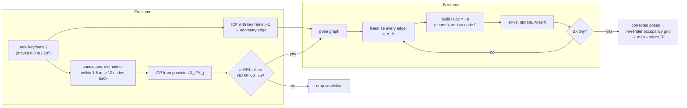

# 11.05 — Pose graphs and loop closure

<!-- glance:start -->
<!-- generated by tools/build.py from curriculum/syllabus.yaml — edit the syllabus, not this block -->

| | |
|---|---|
| **Track** | Main path |
| **Difficulty** | Advanced |
| **Time** | 1 h 15 min |
| **Hardware** | none |
| **Software** | python, numpy |
| **Prerequisites** | [11.04 Scan matching with ICP](11.04-scan-matching-icp.md) |
| **Optional prerequisites** | [FM.20 Optimization for robotics and ML: gradient descent to nonlinear least squares](../optional-foundations/mathematics/FM.20-optimization-basics.md) |
| **Skip if** | You can explain how a loop closure corrects an entire trajectory. |

<!-- glance:end -->

## What you will learn

- Model a SLAM run as a pose graph: nodes are keyframe poses, edges are relative-pose measurements with information matrices.
- Write the SE(2) edge error and its Jacobians, and optimize the graph with Gauss-Newton, checked against `scipy.optimize.least_squares`.
- Explain with numbers how one loop closure corrects the entire trajectory, and why the correction is spread according to confidence.
- Detect and verify loop closures with ICP, and show what a single false loop closure does to the map.
- Map your optimizer and front end onto slam_toolbox's pose graph, loop-closure search and Ceres solver by name.

## Why it matters

After 11.04, karmel's ICP odometry ends an 11 m tour 10 cm and 2.7° from the truth. That sounds small, but the error only grows: a larger home, a second lap or a longer day and the map doubles its walls again. Scan matching alone never removes drift. It only slows it down.

The robot does have something better than a scan matcher when it returns to the living room: it *recognizes* the room. That recognition is one measurement between "now" and "a minute ago". Put it into a pose graph with every odometry step, solve one least-squares problem, and the whole trajectory snaps into place. The end error drops from 10 cm to 3 mm. This is the back end of slam_toolbox, Cartographer, ORB-SLAM3 and RTAB-Map, and it is why a SLAM map can move after you have already driven through a room.

<!-- prereqs:start -->
## Prerequisites

You need these first:

- [11.04 Scan matching with ICP](11.04-scan-matching-icp.md)

### Optional prerequisite links

New to any of these? Take the foundation lesson first; skip it if you already know it.

- [FM.20 Optimization for robotics and ML: gradient descent to nonlinear least squares](../optional-foundations/mathematics/FM.20-optimization-basics.md)

Check your readiness: `python course.py why 11.05`
<!-- prereqs:end -->

## Concept

### A graph of springs

Pin a sheet of cardboard to the table: that is the start pose. Each keyframe pose is a nail on the cardboard. Between consecutive nails you attach a spring whose rest length and angle is what odometry or ICP measured. A stiff spring for a confident measurement, a soft one for a doubtful one. Let go, and the nails settle where every spring is as relaxed as possible. With only a chain of springs, the nails settle exactly at the odometry estimate, drift included, because nothing pulls against it.

Now the robot recognizes the start and adds one more spring, from the last nail back to the first, with rest length "almost zero". The chain is now a loop. It cannot satisfy every spring, so all of them stretch a little, and the drift gets shared around the loop. The soft springs give most. No single spring had to know where the error came from.

That is a pose graph, and "letting go" is nonlinear least squares ([FM.20](../optional-foundations/mathematics/FM.20-optimization-basics.md)).

### Front end proposes, back end disposes

- The **front end** creates edges: an odometry edge for each new keyframe (from ICP, 11.04), and a loop edge whenever it finds and *verifies* a revisit.
- The **back end** does not know what a LiDAR is. It gets numbers: "node $j$ seen from node $i$ is at $z_{ij}$, with information $\Omega_{ij}$". It returns the poses that disagree least with all of them.

If the front end lies, the back end believes it. A wrong loop closure is a strong spring between two different places, and the optimizer will bend the whole map to honour it. That asymmetry drives the design of every real loop-closure detector.

> [!TIP]
> **Ask your teacher:** "Solve a 1D pose graph with three nodes, two odometry edges and one loop edge by hand, then change the loop edge's variance and show me how the correction moves between the edges."

## Technical explanation

### Level 1 — What goes into a pose graph

| Element | Meaning | In `pose_graph.py` |
|---|---|---|
| node $x_i = (x, y, \theta)$ | pose of keyframe $i$ in the map frame | row $i$ of `poses` |
| odometry edge $(i, i{+}1)$ | motion between consecutive keyframes, from ICP (or wheels) | `Edge(i, i+1, z, Ω)` |
| loop edge $(i, j)$, $j \gg i$ | "I am here again", from a verified scan match | `Edge(i, j, z, Ω, "loop")` |
| measurement $z_{ij}$ | pose of $j$ expressed in the frame of $i$ | an `SE2` |
| information $\Omega_{ij}$ | inverse covariance: how much to trust $z_{ij}$ | `information_from_sigmas(0.02, 1°)` |
| anchor | node 0 fixed (the map frame's origin) | a huge prior on node 0 |

Relative measurements matter. An edge says nothing about where node $i$ is, only where $j$ is *relative to* $i$. That is why the graph needs an anchor: moving the whole map rigidly changes no edge error.

### Level 2 — Practical: loop closures in the front end

`build_graph` in the lesson code does, in miniature, what slam_toolbox does:

1. **Keyframes:** a node every 0.3 m or 20° of odometry motion. The 11 m tour gives 50 nodes.
2. **Odometry edges:** ICP between consecutive keyframes, seeded with wheel odometry. A reliable match gets $\sigma = 2$ cm and 1°. Otherwise the wheel-odometry step is used with $\sigma = 5$ cm and 3°.
3. **Loop-closure candidates:** for node $j$, every node $i$ at least 10 nodes older whose *current estimate* lies within 1.5 m. Take the nearest.
4. **Verification:** coarse-to-fine ICP from the relative pose predicted by the current estimates. Accept only a match with ≥ 80% inliers and RMSE ≤ 3 cm, stricter than for odometry edges, because a false loop closure is so costly.
5. **Optimize** and re-render the map from the corrected poses (11.02's mapper).

On the realistic tour it finds 8 loop closures as the robot comes back into the living room (nodes 42–49 against nodes 0–4). Every measured relative pose is within 4 mm and 0.4° of the truth:

```text
  loop  4 <- 42: measured (-0.037, +1.169, -93.1 deg), true (-0.034, +1.167, -93.1 deg)
  loop  0 <- 49: measured (+0.052, +0.052, -139.2 deg), true (+0.050, +0.055, -139.2 deg)
```

**Result** (`python 11-slam/code/pose_graph.py`):

| Graph | RMSE | End error |
|---|---|---|
| ICP odometry chain (no loop closures) | 0.038 m | 0.104 m / 2.7° |
| + 8 loop closures, Gauss-Newton | 0.039 m | **0.003 m / 0.0°** |
| wheel-odometry chain (`--odometry wheel`) | 0.539 m | 1.061 m / 31.5° |
| + 7 loop closures, Gauss-Newton | **0.047 m** | **0.004 m / 0.0°** |

Two lessons hide in this table. With wheel odometry, a handful of loop closures cuts the RMSE by more than 10×, and the smeared map from 11.03 becomes clean. With ICP edges, the RMSE barely changes while the *end* error collapses. The ICP chain was already good on average, and loop closures fix the part that grows: the error at the far end of the loop. On a bigger home or a second lap, that part dominates.

### Level 3 — Mathematics: error, Jacobians, Gauss-Newton on SE(2)

**Edge error.** The poses predict the relative pose $\hat z_{ij} = X_i^{-1} X_j$. The error is the measurement's disagreement with it, expressed in the measurement's frame:

$$e_{ij} = \operatorname{t2v}\!\left(Z_{ij}^{-1}\,(X_i^{-1} X_j)\right) = \begin{pmatrix} R_z^\top \left(R_i^\top (t_j - t_i) - t_z\right) \\ \operatorname{wrap}(\theta_j - \theta_i - \theta_z) \end{pmatrix}$$

**Numerical example.** $x_i = (1.0, 2.0, 90°)$, $x_j = (0.9, 3.2, 92.9°)$, measurement $z = (1.0, 0, 0)$: "j is 1 m straight ahead of i". Then $t_j - t_i = (-0.1, 1.2)$, and rotating by $-90°$ gives $(1.2, 0.1)$ in $i$'s frame. The error is $(1.2 - 1.0,\ 0.1 - 0,\ 0.05\ \text{rad}) = (0.2, 0.1, 0.05)$: j is 20 cm too far ahead, 10 cm to the left, and turned 2.9° too much.

**The cost** is the sum of squared errors, each weighted by its information matrix:

$$F(x) = \sum_{(i,j)} e_{ij}(x)^\top\, \Omega_{ij}\, e_{ij}(x)$$

With $\sigma = 2$ cm and 1°, $\Omega = \operatorname{diag}(2500, 2500, 3283)$. A 2 cm error then costs 1, and so does a 1° error. $\Omega$ puts meters and radians on a common scale of "how many standard deviations off".

**Jacobians.** Linearize each error around the current guess: $e_{ij}(x + \Delta x) \approx e_{ij} + A_{ij}\,\Delta x_i + B_{ij}\,\Delta x_j$, with (Grisetti et al., 2010)

$$A_{ij} = \begin{pmatrix} -R_z^\top R_i^\top & R_z^\top \frac{\partial R_i^\top}{\partial \theta_i} (t_j - t_i) \\ 0 & -1 \end{pmatrix}, \qquad B_{ij} = \begin{pmatrix} R_z^\top R_i^\top & 0 \\ 0 & 1 \end{pmatrix}$$

where $\frac{\partial R^\top}{\partial\theta} = \begin{pmatrix} -\sin\theta & \cos\theta \\ -\cos\theta & -\sin\theta \end{pmatrix}$. For the example: $A = \begin{pmatrix} 0 & -1 & 0.1 \\ 1 & 0 & -1.2 \\ 0 & 0 & -1 \end{pmatrix}$, $B = \begin{pmatrix} 0 & 1 & 0 \\ -1 & 0 & 0 \\ 0 & 0 & 1 \end{pmatrix}$. The last column of $A$ says: turning node $i$ by a small $\delta$ swings node $j$ (1.2 m ahead) sideways by $1.2\,\delta$.

**Gauss-Newton.** Each edge adds four blocks to a system $H\,\Delta x = -b$:

$$H_{ii} \mathrel{+}= A^\top \Omega A,\quad H_{ij} \mathrel{+}= A^\top \Omega B,\quad H_{ji} \mathrel{+}= B^\top \Omega A,\quad H_{jj} \mathrel{+}= B^\top \Omega B,\quad b_i \mathrel{+}= A^\top \Omega e,\quad b_j \mathrel{+}= B^\top \Omega e$$

Anchor node 0 (add a huge value to $H_{00}$), solve, update $x \leftarrow x + \Delta x$, wrap angles, and repeat until $\Delta x$ is tiny. On the tour: $\chi^2$ goes from 148.4 to 0.34 in 3 iterations with ICP edges, and from 15,769 to 3.0 in 5 iterations with wheel edges.

**Sparsity.** $H$ has a nonzero block only where an edge connects two nodes: the diagonal band (odometry chain) plus a few off-diagonal blocks (loop closures). 50 nodes give a 150 × 150 matrix, mostly zeros. slam_toolbox factorizes the same structure with sparse Cholesky (`ceres_linear_solver: SPARSE_NORMAL_CHOLESKY`), which scales to many thousands of nodes. The lesson code uses a dense solve because 150 × 150 is tiny.

### Level 3b — How one loop closure spreads the correction

A 1D example you can check by hand. Three nodes on a line, node 0 fixed at 0:

- odometry: $x_1 - x_0 = 1.0$, $\sigma = 0.1$ (weight 100)
- odometry: $x_2 - x_1 = 1.0$, $\sigma = 0.1$ (weight 100)
- loop closure: $x_2 - x_0 = 1.9$, $\sigma = 0.05$ (weight 400)

The odometry chain puts $x_2 = 2.0$, but the loop closure says 1.9. The normal equations ([FM.19](../optional-foundations/mathematics/FM.19-linear-systems-least-squares.md)):

$$\begin{pmatrix} 200 & -100 \\ -100 & 500 \end{pmatrix}\begin{pmatrix} x_1 \\ x_2 \end{pmatrix} = \begin{pmatrix} 0 \\ 860 \end{pmatrix} \;\Rightarrow\; x_1 = 0.9556,\ x_2 = 1.9111$$

The residuals are $-0.044$, $-0.044$ on the two odometry edges and $+0.011$ on the loop edge, and $\chi^2$ drops from 4.0 to 0.44. The 0.1 m disagreement is split: each odometry edge absorbs 4.4 cm, and the four-times-stiffer loop edge absorbs 1.1 cm. Node 1, which no loop edge touches, still moves by 4.4 cm. That is "one loop closure corrects the entire trajectory": every node between the two ends moves, in proportion to the uncertainty accumulated up to it.

### Level 4 — Implementation: robustness and what slam_toolbox does

**False loop closures.** Add a single wrong edge to the tour graph, "node 30 is at node 10" (they are really 2.27 m apart), with the same confidence as a real closure. Then optimize:

| | RMSE | $\chi^2$ after optimizing |
|---|---|---|
| correct graph | 0.039 m | 0.34 |
| + one false loop closure | **0.715 m** | **1,816** |

The map folds: the kitchen gets pulled into the living room. Two signals give the bad edge away. The final $\chi^2$ is 5,000 times larger than the correct graph's, and the per-edge contributions show the culprit: the false edge alone contributes 143, with the neighbouring odometry edges next at about 92 each. Remove it and re-optimize, and the RMSE is 0.039 m again. Real systems defend in layers:

1. **Strict verification** in the front end: slam_toolbox requires a strong correlative response (`loop_match_minimum_response_coarse: 0.35`, `loop_match_minimum_response_fine: 0.45`), a bounded coarse variance (`loop_match_maximum_variance_coarse`) and a chain of consistent scans (`loop_match_minimum_chain_size: 10`).
2. **Robust loss functions** in the back end: Huber or Cauchy losses grow more slowly than a square for large errors, so one outlier cannot dominate. That is Ceres' `ceres_loss_function` (None by default in slam_toolbox, `HuberLoss` or `CauchyLoss` available).
3. **Consistency checks** after optimization: $\chi^2$ per edge against a $\chi^2$ threshold (3 degrees of freedom, 95%: 7.81), and dropping edges that stay far out.

**Loop-closure search.** The lesson searches candidates within 1.5 m of the current estimate. slam_toolbox searches old nodes within `loop_search_maximum_distance: 3.0` m, then runs the correlative matcher over a large window (`loop_search_space_dimension: 8.0` m at `loop_search_space_resolution: 0.05`) so that even a drifted estimate finds the right alignment. Visual SLAM uses appearance instead (bag of words, [11.08](11.08-visual-slam.md)), because it has no metric range to search.

**The mapping between this lesson and slam_toolbox:**

| This lesson | slam_toolbox / Karto | Notes |
|---|---|---|
| `TourLog.keyframes()` (0.3 m / 20°) | `minimum_travel_distance`, `minimum_travel_heading` | karmel config: 0.2 m, 0.3 rad |
| `icp_coarse_to_fine` odometry edge | Karto scan matcher against `scan_buffer_size` recent scans | correlative, not ICP (11.04) |
| `information_from_sigmas` | covariance from the matcher's response surface | Karto computes it per match |
| candidates within `search_radius` | `loop_search_maximum_distance` | search around the current estimate |
| `match_is_reliable(0.8, 0.03)` | `loop_match_minimum_response_*`, `loop_match_maximum_variance_coarse`, `loop_match_minimum_chain_size` | strict on purpose |
| `optimize` (Gauss-Newton, dense) | `solver_plugin: solver_plugins::CeresSolver` | LM trust region, sparse normal Cholesky, `SCHUR_JACOBI` preconditioner |
| `optimize_with_scipy` | the same, through a library | Ceres is the C++ equivalent |
| anchor on node 0 | first node fixed | `map` frame origin = start pose |
| re-render map from optimized poses | occupancy grid rebuilt every `map_update_interval` | why the map "moves" after a loop |
| — | serialized pose graph (`.posegraph` + `.data`) | lifelong mapping, [11.07](11.07-mapping-your-room.md) |

## Diagram



```text
 Before and after one loop closure (8 keyframes around a room)

  odometry chain (drifted)              optimized
     3 ── 2                               3 ── 2
    ╱      ╲                              │    │
   4        1                             4    1
   │        │                             │    │
   5        0 ◄── start                   5    0 ◄─┐
    ╲                                     │        │ loop edge 7→0
     6 ── 7   ← 40 cm from 0               6 ── 7 ──┘  (closes to 3 mm)

  every node moves; nodes far from the anchor move most
```

## Code

[`code/pose_graph.py`](code/pose_graph.py) (tested by `code/test_slam_code.py`) holds the edge error, the Jacobians, Gauss-Newton, the scipy version and `build_graph`. The optimizer:

```python
def optimize(poses, edges, iterations=20, tolerance=1e-6, verbose=False):
    x = np.array(poses, dtype=float).reshape(-1, 3).copy()
    n = len(x)
    history = [total_error(x, edges)]
    H = np.zeros((3 * n, 3 * n))
    for it in range(iterations):
        H = np.zeros((3 * n, 3 * n))
        b = np.zeros(3 * n)
        for edge in edges:
            i, j, omega = edge.i, edge.j, edge.information
            e = edge_error(x[i], x[j], edge.measurement)
            A, B = edge_jacobians(x[i], x[j], edge.measurement)
            si, sj = slice(3 * i, 3 * i + 3), slice(3 * j, 3 * j + 3)
            H[si, si] += A.T @ omega @ A
            H[si, sj] += A.T @ omega @ B
            H[sj, si] += B.T @ omega @ A
            H[sj, sj] += B.T @ omega @ B
            b[si] += A.T @ omega @ e
            b[sj] += B.T @ omega @ e
        H[:3, :3] += np.eye(3) * 1e9  # anchor node 0
        dx = np.linalg.solve(H, -b)  # real systems: sparse Cholesky (H is block-sparse)
        x += dx.reshape(-1, 3)
        x[:, 2] = np.arctan2(np.sin(x[:, 2]), np.cos(x[:, 2]))
        history.append(total_error(x, edges))
        if verbose:
            print(f"  iteration {it + 1}: chi2 = {history[-1]:.4g}, |dx| = {np.linalg.norm(dx):.2e}")
        if np.linalg.norm(dx) < tolerance:
            break
    return x, history, H
```

Run from the repository root (the tour is cached from 11.02; the first run in a fresh checkout simulates it):

```bash
python 11-slam/code/pose_graph.py                      # ICP edges + loop closures
python 11-slam/code/pose_graph.py --odometry wheel     # wheel-odometry edges + loop closures
python 11-slam/code/pose_graph.py --no-loops           # the chain alone
```

```text
50 nodes, 49 odometry edges (icp), 8 loop closures
  loop  4 <- 42: measured (-0.037, +1.169, -93.1 deg), true (-0.034, +1.167, -93.1 deg)
  ...
  iteration 1: chi2 = 0.3457, |dx| = 3.00e-01
  iteration 2: chi2 = 0.3443, |dx| = 5.92e-03
  iteration 3: chi2 = 0.3443, |dx| = 2.56e-06
  iteration 4: chi2 = 0.3443, |dx| = 5.58e-09
before (odometry chain)    RMSE 0.038 m, end error 0.104 m / 2.7 deg
after Gauss-Newton         RMSE 0.039 m, end error 0.003 m / 0.0 deg
after scipy least_squares  RMSE 0.039 m, end error 0.003 m / 0.0 deg
chi2 148.4 -> 0.3; Gauss-Newton vs scipy max difference 0.00 mm
wrote .../11-slam/code/out/pose_graph_icp.png
```

`out/pose_graph_wheel.png` is the most instructive picture in the module. On the left, the smeared, rotated map from 11.03 with the wheel-odometry nodes (blue dots) swinging away from the green true path, and red loop-closure lines stretched across the living room. In the middle, the same scans re-rendered from the optimized poses: straight walls, blue dots on the green path, red loop edges shrunk to short stubs. On the right, the sparsity pattern of $H$: a narrow diagonal band plus two small off-diagonal clusters, one per group of loop closures.

## Exercise

All exercises need hardware: none (course simulator).

### Exercise 11.05-E1 — Build the back end `[coding]`

Implement `relative_pose`, `edge_error`, `edge_jacobians` and `optimize_pose_graph` in [`labs/exercises/11.05/student.py`](../labs/exercises/11.05/student.py). The tests check hand-computed errors, your Jacobians against finite differences, a square loop with biased odometry, and a realistic simulated robot driving a rectangle with one loop closure, where the optimized error must be at most half the odometry error.

Check it: `python course.py check 11.05`

### Exercise 11.05-E2 — The 1D graph, with a different loop `[numerical]`

Repeat the Level 3b example, but the loop closure measures $x_2 - x_0 = 2.1$ (same $\sigma = 0.05$). Solve the normal equations by hand, and give $x_1$, $x_2$, the three residuals and $\chi^2$ before and after. Then change the loop's $\sigma$ to 0.2 and describe (no full calculation needed) which way $x_2$ moves and why.

### Exercise 11.05-E3 — Jacobian column by feel `[predict]`

For $x_i = (1.0, 2.0, 90°)$, $x_j = (0.9, 3.2, 92.9°)$, $z = (1, 0, 0)$, **predict** the sign of $\partial e_y / \partial \theta_i$ before looking at $A$: if node $i$ turns a little further left, does node $j$ appear further left or further right in $i$'s frame? Then check with `edge_jacobians` and with a finite difference of `edge_error`.

### Exercise 11.05-E4 — How many loop closures do you need? `[simulation]`

In a copy of `pose_graph.py`'s `main`, build the graph with `--odometry wheel` (7 loop closures, in the order printed) and keep only the first $k$ loop edges for $k = 0, 1, 2, 4, 7$. Record RMSE and end error for each. **Predict first:** does one loop closure give most of the improvement, or does it take all of them?

### Exercise 11.05-E5 — Find the lie `[debugging]`

Add `Edge(10, 30, SE2(), information_from_sigmas(0.02, math.radians(1)), "loop")` to the ICP graph and optimize. (a) Report RMSE and final $\chi^2$. (b) Without using the truth, write the few lines that find the suspicious edge from the optimized poses. (c) Remove it, re-optimize, and report again. (d) Which slam_toolbox parameters exist so that this edge is never created?

## Expected result

- **11.05-E1:** `python course.py check 11.05` reports 11 tests passed, none skipped. The reference takes the square from 0.16–0.20 m RMSE to about 0.03 m. On the simulated rectangle it goes from 0.09 m to 0.03 m (seed 1) and from 0.07 m to 0.02 m (seed 2).
- **11.05-E2:** The right-hand side becomes $(0, 1040)$, giving $x_1 = 1.0444$, $x_2 = 2.0889$. Residuals $+0.044$, $+0.044$, $-0.011$; $\chi^2$ 4.0 → 0.44 (the mirror image of the lesson's case). With $\sigma_\text{loop} = 0.2$ (weight 25, now softer than each odometry edge), $x_2 = 2.033$ and $x_1 = 1.017$: $x_2$ stays much closer to the odometry's 2.0, because the soft loop edge absorbs most of the disagreement.
- **11.05-E3:** Negative: $A_{y,\theta} = -1.2$. If $i$ turns left by $\delta$, its frame rotates toward $j$, so $j$ appears $1.2\,\delta$ further **right** (negative $y$) in $i$'s frame. The finite difference matches to 6 decimal places.
- **11.05-E4:** $k = 0$: RMSE 0.539 m, end 1.061 m. $k = 1$: 0.224 m, 0.145 m. $k = 2$: 0.221 m, 0.104 m. $k = 4$: 0.174 m, 0.035 m. $k = 7$: **0.047 m, 0.004 m**. One closure removes most of the *end* error but only half the RMSE. The first closures (4 ← 43, 4 ← 44) tie the robot to node 4, not to the start, and with 31° of heading drift the middle of the trajectory is still bent. Closures at several places along the return pin down the heading too. With good ICP edges, one or two closures would be enough.
- **11.05-E5:** (a) RMSE **0.715 m**, $\chi^2$ **1,816** (the correct graph: 0.039 m, 0.34). (b) Compute `e @ edge.information @ e` per edge on the optimized poses and sort: the false edge tops the list at about **143**, ahead of odometry edges near 92. (c) Without it: RMSE 0.039 m, $\chi^2$ 0.34. (d) `loop_match_minimum_response_coarse`, `loop_match_minimum_response_fine`, `loop_match_maximum_variance_coarse`, `loop_match_minimum_chain_size`, and a robust `ceres_loss_function` as a second line of defence.

## Troubleshooting

### Symptom: the optimizer diverges or $\chi^2$ grows

1. Check the Jacobians against finite differences (the exercise test does exactly that). A wrong sign in the $\theta_i$ column is the classic bug.
2. Check angle wrapping in the error. An error of $2\pi - 0.01$ instead of $-0.01$ is a huge residual.
3. Check the anchor. Without it, $H$ is singular: `LinAlgError` or enormous $\Delta x$.
4. Start closer: initialize from the odometry chain, never from zeros. If it is still unstable, use Levenberg-Marquardt (scipy `method="lm"`, Ceres' default trust region).

### Symptom: loop closure found, but the map does not change

1. Print the loop edges. Is the measurement consistent with the chain? If so, there was no drift to correct.
2. Compare the information matrices. A loop edge 100× softer than odometry edges barely pulls.
3. Check that you re-rendered the map from the optimized poses. The old grid does not update itself.

### Symptom: after a loop closure the map folds or rooms overlap

1. Treat it as a false loop closure until proven otherwise. Rank edges by $e^\top \Omega e$ after optimization.
2. Look at the two scans of the top edge. Are they really the same place? Symmetric rooms and identical doorways are the usual suspects.
3. Tighten verification, or add a robust loss.

### Symptom: no loop closures are ever found

1. Print the distance between the current estimate and the true revisit. If drift exceeds the search radius, the candidate is never considered. Enlarge the radius (slam_toolbox: `loop_search_maximum_distance`).
2. If candidates exist but fail verification, print ICP's inlier fraction and RMSE. The initial guess may be outside the basin: try multiple starting headings.

## Common mistakes

- **Using absolute poses as measurements.** Edges must be relative ($X_i^{-1} X_j$). Absolute "measurements" from odometry carry all the drift into the graph.
- **Forgetting to wrap $\theta$** in the error and after the update.
- **Identity information matrices.** Then 1 rad counts the same as 1 m, and the optimizer trades 1 m of position for 1 rad of heading. Use $\Omega = \Sigma^{-1}$.
- **Equally confident odometry and loop edges** when they are not. The correction goes to the wrong place.
- **Accepting every loop-closure candidate.** One false positive is worse than ten missed closures.
- **Not anchoring the graph.** The solution is only defined up to a rigid motion.

## Knowledge check

1. What does an edge's information matrix encode, and what happens if you set it to the identity?
   <details><summary>Answer</summary>

   The inverse covariance of the relative-pose measurement: how strongly this edge should pull, per axis. The identity treats 1 m and 1 rad as equally uncertain, and every edge as equally good, so the optimizer shares corrections wrongly: odometry and loop edges get the same weight, and heading and position are mixed arbitrarily.
   </details>

2. Why can one loop closure between the last node and the first correct node 25 in the middle?
   <details><summary>Answer</summary>

   Node 25 is connected to both ends through the chain of odometry edges. When the loop edge pulls the last node toward the first, the least-squares solution spreads the disagreement over all chain edges according to their uncertainty. Every node in between shifts, by roughly the drift accumulated up to it. The 1D example moves node 1 by 4.4 cm, even though no loop edge touches it.
   </details>

3. Why does a pose graph need an anchor, and what goes wrong numerically without one?
   <details><summary>Answer</summary>

   All edges are relative, so translating and rotating every pose together leaves every error unchanged. $H$ then has a 3-dimensional null space (it is singular), and the linear solve fails or returns arbitrary huge corrections. Fixing node 0 (a strong prior) removes that freedom.
   </details>

4. For $\Omega = \operatorname{diag}(2500, 2500, 3283)$, which costs more: an error of (3 cm, 0, 0) or (0, 0, 1.5°)?
   <details><summary>Answer</summary>

   $2500 \times 0.03^2 = 2.25$ and $3283 \times (0.02618)^2 = 2.25$. Exactly the same: both are 1.5 standard deviations.
   </details>

5. Predict: you double every odometry edge's information matrix but keep the loop edges unchanged. Where does the correction go?
   <details><summary>Answer</summary>

   Odometry edges become stiffer relative to the loop edges, so more of the disagreement is absorbed by the loop edges. The optimized trajectory stays closer to the odometry chain, and the ends meet less exactly. With a correct loop closure that is worse, and with a false one it is safer.
   </details>

6. Debugging: $\chi^2$ after optimization is 1,800, where similar runs end below 1. What is your first diagnostic step, and why?
   <details><summary>Answer</summary>

   Compute $e^\top \Omega e$ per edge on the optimized poses and sort. A consistent graph spreads small errors everywhere. One false constraint leaves one edge, and the edges around it, far above the rest. Then inspect the scans of the top edge.
   </details>

7. Which slam_toolbox components correspond to `build_graph`'s loop-closure step and to `optimize`, by parameter name?
   <details><summary>Answer</summary>

   Loop closure: `do_loop_closing`, candidate search `loop_search_maximum_distance`, matching window `loop_search_space_dimension` / `loop_search_space_resolution` / `loop_search_space_smear_deviation`, acceptance `loop_match_minimum_response_coarse`, `loop_match_minimum_response_fine`, `loop_match_maximum_variance_coarse`, `loop_match_minimum_chain_size`. Optimization: `solver_plugin: solver_plugins::CeresSolver` with `ceres_linear_solver`, `ceres_preconditioner`, `ceres_trust_strategy` and `ceres_loss_function`.
   </details>

## Practical challenge

Make the back end **robust to false loop closures** without making the front end stricter.

Start from the tour graph with ICP edges and its 8 true loop closures. Add 3 false loop closures between random node pairs more than 1.5 m apart, each with loop-edge confidence. Implement *one* of: (a) a Huber or Cauchy loss inside Gauss-Newton (iteratively reweighted least squares: scale $\Omega$ per edge by the loss weight at the current error); (b) switchable constraints or dynamic covariance scaling; (c) optimize, remove the edge with the largest $e^\top\Omega e$ if it exceeds the 99% $\chi^2$ threshold (11.34 for 3 degrees of freedom), and repeat.

**Acceptance criteria:**

- For 5 random seeds of false-edge placement (`numpy.random.default_rng(seed)`, seeds 0–4), the robust optimizer's RMSE stays below 0.06 m on every seed. Report plain Gauss-Newton too: it lands at 1.6–2.1 m. For calibration: option (c) reaches 0.039 m on all five, while a plain Cauchy loss through `scipy.optimize.least_squares(loss="cauchy", f_scale=3)` gets only 0.04–0.10 m, so a bare loss function is not enough here.
- With no false edges, your robust version's RMSE is within 5 mm of plain Gauss-Newton's.
- The removed or down-weighted edges are listed, and every false edge is among them in at least 4 of 5 seeds.
- One paragraph on which slam_toolbox parameter plays the same role as your method.

## You can skip this if…

You can explain how a loop closure corrects a whole trajectory, and answer knowledge-check questions 2, 3 and 6 without looking. You have written a pose-graph optimizer before. Run `python course.py check 11.05 --solution` to see the API, then:

`python course.py skip 11.05 --reason "I have implemented pose-graph optimization with loop closures"`

## Go deeper

- Grisetti, Kümmerle, Stachniss & Burgard, *A Tutorial on Graph-Based SLAM* (IEEE ITS Magazine 2010): https://doi.org/10.1109/MITS.2010.939925 — the error function and Jacobians used here. Read all of it now.
- Lu & Milios, *Globally Consistent Range Scan Alignment for Environment Mapping* (Autonomous Robots 1997): https://doi.org/10.1023/A:1008854305733 — the original pose graph built from scan matches.
- Konolige et al., *Efficient Sparse Pose Adjustment for 2D mapping* (IROS 2010): https://doi.org/10.1109/IROS.2010.5649043 — the sparse 2D solver behind Karto, and the ancestor of slam_toolbox's back end.
- Kümmerle et al., *g2o: A general framework for graph optimization* (ICRA 2011): https://doi.org/10.1109/ICRA.2011.5979949 — how general graph optimizers exploit sparsity. Code: https://github.com/RainerKuemmerle/g2o
- Ceres Solver: https://github.com/ceres-solver/ceres-solver — the solver slam_toolbox and Cartographer use; its pose-graph examples solve this lesson's problem in C++.
- GTSAM: https://gtsam.org/ — factor graphs with Python bindings, a good next step when you want 3D poses and IMU factors.
- SciPy `least_squares`: https://docs.scipy.org/doc/scipy/reference/generated/scipy.optimize.least_squares.html — `loss="huber"` gives you the challenge's robust loss for free.
- SLAM Toolbox README (Jazzy): https://github.com/SteveMacenski/slam_toolbox/blob/jazzy/README.md — solver plugins, the Ceres settings and why they were chosen.
- Paper reading path: [references/papers.md, 2.2 Graph-based SLAM](../references/papers.md#22-a-tutorial-on-graph-based-slam).

## Progress checkpoint

- [ ] I can build a pose graph from keyframes, odometry edges and loop edges with information matrices.
- [ ] I can write the SE(2) edge error and Jacobians, and my Gauss-Newton optimizer passes `python course.py check 11.05`.
- [ ] I can explain, with the 1D example, how a loop closure spreads correction over the whole trajectory.
- [ ] I can detect a false loop closure from per-edge errors, and name slam_toolbox's defences against it.

`python course.py complete 11.05` (exercises done) · `python course.py master 11.05` (challenge done) · `python course.py struggle 11.05 "what was hard"`

Next: [11.06 — LiDAR SLAM with slam_toolbox in simulation](11.06-slam-toolbox-simulation.md), where Karto and Ceres do all of this for you at 10 Hz.
