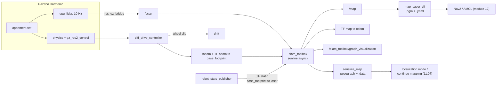

# 11.06 — LiDAR SLAM with slam_toolbox in simulation

<!-- glance:start -->
<!-- generated by tools/build.py from curriculum/syllabus.yaml — edit the syllabus, not this block -->

| | |
|---|---|
| **Track** | Main path |
| **Difficulty** | Intermediate |
| **Time** | 1 h 15 min |
| **Hardware** | none |
| **Software** | ros2, slam-toolbox, gazebo |
| **Prerequisites** | [11.03 The SLAM problem — front end, back end, and why it is hard](11.03-the-slam-problem.md)<br>[06.08 Building worlds for mapping and navigation labs](../06-simulation/06.08-building-worlds.md)<br>[09.07 Odometry in ROS 2 — nav_msgs/Odometry, odom→base_link, comparing implementations](../09-odometry/09.07-odometry-in-ros2.md) |
| **Version-sensitive** | yes — see [curriculum/versions.yaml](../curriculum/versions.yaml) |
| **Skip if** | You have mapped a simulated world with slam_toolbox. |

<!-- glance:end -->

## What you will learn

- Run slam_toolbox in online asynchronous mode on the simulated apartment and watch a map appear from nothing.
- Read the pose graph, the `map → odom` correction and the live scan in RViz, and tell from them whether SLAM is working.
- Map every parameter in karmel's `slam_toolbox_online_async.yaml` onto the algorithm you built in 11.02–11.05.
- Save a map two ways — `map_saver_cli` and `serialize_map` — and say what each one keeps and throws away.
- Score a map against ground truth with numbers instead of an opinion, and show how driving speed changes the score.

## Why it matters

You have now built every piece of a 2D LiDAR SLAM system by hand: the occupancy grid ([11.02](11.02-occupancy-grid-mapping.md)), the scan matcher ([11.04](11.04-scan-matching-icp.md)), the pose graph with loop closures ([11.05](11.05-pose-graphs-loop-closure.md)). This lesson is where you stop writing SLAM and start *operating* it, with the package that every ROS 2 robot uses for this job.

That is worth doing carefully, because the failure modes you are about to meet are not "slam_toolbox is broken". They are your robot driving too fast for its scan rate, your wheels slipping, your loop closures never firing. Running it in simulation first lets you see all of that with ground truth in hand, on an apartment you can re-drive identically as many times as you like — before you take it into a real home in [11.07](11.07-mapping-your-room.md), where nothing is repeatable.

<!-- prereqs:start -->
## Prerequisites

You need these first:

- [11.03 The SLAM problem — front end, back end, and why it is hard](11.03-the-slam-problem.md)
- [06.08 Building worlds for mapping and navigation labs](../06-simulation/06.08-building-worlds.md)
- [09.07 Odometry in ROS 2 — nav_msgs/Odometry, odom→base_link, comparing implementations](../09-odometry/09.07-odometry-in-ros2.md)

### Optional prerequisite links

None.

Check your readiness: `python course.py why 11.06`
<!-- prereqs:end -->

## Concept

### The same algorithm, someone else's C++

slam_toolbox is the Karto front end (a correlative scan matcher and a loop-closure search) bolted to a Google Ceres back end (sparse nonlinear least squares). That is exactly the architecture of [11.03](11.03-the-slam-problem.md): a front end that turns scans into constraints, a back end that turns constraints into poses. Nothing new is happening; it is happening in C++, at 10 Hz, with twenty years of edge cases handled.

What you have to supply is unglamorous and it is where all the problems live:

```text
    you supply                       slam_toolbox supplies
    ──────────                       ─────────────────────
    /scan     (sensor_msgs/LaserScan)    scan matching
    odom → base_footprint  (TF)          keyframe selection
    base_footprint → laser (TF, static)  loop-closure search
    a robot that moves sensibly          pose-graph optimization
    one consistent clock                 /map, map → odom, the pose graph
```

### "Online asynchronous" — what the mode name means

slam_toolbox ships several modes, and the one everybody runs on a mobile robot is **online async**:

- **Online**: it maps while the robot drives, publishing `/map` and `map → odom` continuously. (Offline mode processes a recorded bag as fast as it can — useful, and you will use it in [11.09](11.09-slam-troubleshooting.md).)
- **Asynchronous**: the scan callback never blocks. If the optimizer is busy when a scan arrives, that scan is **dropped** rather than queued. Synchronous mode queues instead, guaranteeing that every scan is processed but letting the robot's pose fall behind real time.

Async is the right default: a stale pose is worse than a missed scan, because your controllers and costmaps are consuming `map → odom` right now. The cost is that on a loaded machine, a fast robot loses scans exactly when it can least afford to. That is a real failure mode and you will measure it.

> [!TIP]
> **Ask your teacher:** "Show me, in RViz, what I should see in the two seconds after slam_toolbox accepts a loop closure, on the map, on the TF tree and on the pose-graph markers."

## Technical explanation

> [!IMPORTANT]
> **Version-sensitive** (verified 2026-09 against ROS 2 Jazzy, slam_toolbox 2.8.5, Gazebo Harmonic, Nav2 1.3; see [`curriculum/versions.yaml`](../curriculum/versions.yaml)).
> Parameter names and the lifecycle behaviour have changed between distros. Check before you copy a config from the internet: https://github.com/SteveMacenski/slam_toolbox/blob/jazzy/README.md
> AI teacher: verify the parameter names and the launch-file arguments against the current documentation before instructing.

### Level 1 — Run it

Four terminals. (Everything below assumes the workspace is built and sourced — `labs/ros2_ws`, see [`labs/ros2_ws/README.md`](../labs/ros2_ws/README.md).)

```bash
# 1. the robot in the apartment, spawned in the living room
ros2 launch karmel_bringup robot.launch.py sim:=true world:=apartment x:=-1.5 y:=-0.5

# 2. SLAM (use_sim_time defaults to true in this launch file)
ros2 launch karmel_bringup slam.launch.py rviz:=true

# 3. drive — either teleop ...
ros2 run teleop_twist_keyboard teleop_twist_keyboard --ros-args -p stamped:=true
#    ... or the repeatable scripted tour used for every number in this lesson
python3 11-slam/code/ros2/explore_apartment.py --plan apartment \
        --speed 0.15 --yaw-speed 0.3 --ros-args -p use_sim_time:=true

# 4. when the map looks right
ros2 run nav2_map_server map_saver_cli -f ~/maps/apartment
ros2 service call /slam_toolbox/serialize_map slam_toolbox/srv/SerializePoseGraph \
    "{filename: /home/ros/maps/apartment}"
```

On a CPU-only machine, add `headless:=true enable_camera:=false` to the first command: Gazebo then renders the LiDAR with EGL and no display, and the simulation runs several times faster.

Two things to check in the first ten seconds, before you drive anywhere:

```bash
ros2 topic hz /scan          # ~10 Hz of simulated time
ros2 topic hz /map           # 0.5 Hz — one map per map_update_interval (2.0 s)
ros2 run tf2_ros tf2_echo map odom    # identity at the start; it will not stay that way
ros2 lifecycle get /slam_toolbox      # must be 'active' — it is a lifecycle node on Jazzy
```

### Level 2 — Practical: what you are looking at in RViz

`karmel_bringup/rviz/slam.rviz` sets up four displays. Each one answers a different question.

| Display | Topic / frame | Question it answers |
|---|---|---|
| **Map** | `/map` | What does SLAM believe the world looks like? Redrawn every 2 s. |
| **LaserScan** | `/scan`, fixed frame `map` | Is the pose right **now**? The live scan must lie *on* the mapped walls. If it slides off them, stop driving. |
| **TF** | `map → odom → base_footprint → laser` | How much has SLAM corrected the odometry? Watch `map → odom` jump when a loop closes. |
| **MarkerArray** | `/slam_toolbox/graph_visualization` | The pose graph: one marker per keyframe, lines for constraints. The picture from [11.05](11.05-pose-graphs-loop-closure.md), live. |

A loop closure looks like this, in order: the pose-graph markers shift; `map → odom` jumps by the drift that was just removed; the robot appears to teleport in the `map` frame; and within two seconds the whole occupancy grid is redrawn from the corrected poses, and the doubled wall becomes one wall. That last step is worth internalizing — **slam_toolbox does not edit the grid, it re-renders it from the pose graph**, which is exactly why the map can improve retroactively and why `map_saver_cli` at the wrong moment gives you a worse map than waiting ten more seconds.

### Level 3 — Every parameter, mapped back to what you built

This is karmel's [`config/slam_toolbox_online_async.yaml`](../labs/ros2_ws/src/karmel_bringup/config/slam_toolbox_online_async.yaml), read as a summary of module 11. Values marked *karmel* were changed from the slam_toolbox defaults for a small, slow, indoor robot.

| Parameter | karmel | What it is, in this module's language |
|---|---|---|
| `mode: mapping` | mapping | build a new graph, as opposed to `localization` ([11.07](11.07-mapping-your-room.md)) |
| `odom_frame`, `base_frame`, `map_frame` | `odom`, `base_footprint`, `map` | REP-105 ([05.06](../05-frames-and-transforms/05.06-frame-conventions-rep103-rep105.md)); it publishes `map → odom` and never `map → base_link` |
| `resolution` | 0.05 | the occupancy grid's cell size from [11.02](11.02-occupancy-grid-mapping.md) |
| `min_laser_range`, `max_laser_range` | 0.05, 12.0 *karmel* | the C1's range; beams outside are ignored, as in your inverse sensor model |
| `map_update_interval` | 2.0 *karmel* | how often the grid is re-rendered from the current poses (default 5.0) |
| `minimum_travel_distance` | 0.2 *karmel* | **keyframe** spacing in meters — 11.05's `keyframes()` (default 0.5) |
| `minimum_travel_heading` | 0.3 *karmel* | keyframe spacing in radians = 17.2° (default 0.5 = 28.6°) |
| `minimum_time_interval` | 0.5 | never add a node more often than every 0.5 s, whatever the motion |
| `use_scan_matching` | true | turn this off and you get 11.03's odometry-only map, smear and all |
| `scan_buffer_size` | 10 | the matcher aligns each new scan against this many recent ones — 11.04's "running scan" |
| `correlation_search_space_dimension` | 0.5 | the matcher searches ±0.25 m around the odometry guess. **If your odometry error between keyframes exceeds this, matching fails.** |
| `correlation_search_space_resolution` | 0.01 | 1 cm search grid |
| `coarse_search_angle_offset` | 0.349 | ±20° angular search. Compare with how far you rotate between keyframes. |
| `coarse_angle_resolution` | 0.0349 | 2° steps in the coarse search |
| `fine_search_angle_offset` | 0.00349 | 0.2° refinement |
| `do_loop_closing` | true | 11.05's loop edges |
| `loop_search_maximum_distance` | 3.0 | only old nodes within 3 m of the current estimate are candidates |
| `loop_match_minimum_chain_size` | 10 | a candidate must be a run of ≥ 10 consistent scans, not one lucky match |
| `loop_match_minimum_response_coarse` / `_fine` | 0.35 / 0.45 | the strict acceptance from 11.05 — precision over recall |
| `loop_search_space_dimension` | 8.0 | the loop matcher searches a *much* bigger window (8 m) than the odometry matcher |
| `solver_plugin` | `solver_plugins::CeresSolver` | 11.05's `optimize()`, in C++ |
| `ceres_linear_solver` | `SPARSE_NORMAL_CHOLESKY` | the sparse solve; your version used a dense `np.linalg.solve` |
| `ceres_trust_strategy` | `LEVENBERG_MARQUARDT` | LM instead of plain Gauss-Newton |
| `ceres_loss_function` | `None` | no robust loss — the front end's strictness is the only defence against a false closure |
| `transform_publish_period` | 0.02 | `map → odom` at 50 Hz, so controllers always have a fresh transform |
| `transform_timeout` | 0.5 *karmel* | how long to wait for TF at a scan's stamp (default 0.2; a loaded simulation needs more) |

**Numerical example — keyframes on the scripted tour.** The tour drives 18.4 m and spins in place six times. Translation alone would give $18.4 / 0.2 = 92$ keyframes; the six 360° spins would give $6 \times 2\pi / 0.3 = 126$ more. But `minimum_time_interval: 0.5` caps node creation at two per second, and the tour lasts about 210 s of simulated time, so at most 420. In the measured run slam_toolbox created **54 nodes** — far fewer than the motion thresholds alone predict, because each of the three gates must pass and because async mode drops scans that arrive while the optimizer is busy. Fifty-four nodes over 18 m is one keyframe every 34 cm.

**Numerical example — is your spin too fast for the matcher?** During an in-place turn, keyframes are created every `minimum_travel_heading` = 0.3 rad, but not more often than every `minimum_time_interval` = 0.5 s. At a turn rate $\omega$, the rotation between consecutive keyframes is therefore

$$\Delta\theta = \max(0.3,\ 0.5\,\omega)\ \text{rad}$$

At $\omega = 0.3$ rad/s: $\max(0.3, 0.15) = 0.30$ rad = **17.2°**, comfortably inside the ±20° coarse search. At $\omega = 0.6$ rad/s: $\max(0.3, 0.30) = 0.30$ rad — the same, *in theory*. In practice the gate fires on the first scan after both thresholds pass, so at 0.6 rad/s the real spacing scatters up to 0.36 rad = **20.6°**, right at the edge of `coarse_search_angle_offset`, and any scan dropped by async mode doubles it. That is the mechanism behind the measured difference in the exercise below, and it is why [11.07](11.07-mapping-your-room.md) tells you to turn slowly on the real robot.

### Level 4 — Saving: the picture and the graph

```bash
ros2 run nav2_map_server map_saver_cli -f ~/maps/apartment
```

```text
[INFO] [map_saver]: Saving map from 'map' topic to '/home/ros/maps/apartment' file
[WARN] [map_saver]: Free threshold unspecified. Setting it to default value: 0.250000
[WARN] [map_saver]: Occupied threshold unspecified. Setting it to default value: 0.650000
[WARN] [map_io]: Image format unspecified. Setting it to: pgm
[INFO] [map_io]: Received a 190 X 194 map @ 0.05 m/pix
[INFO] [map_io]: Writing map occupancy data to /home/ros/maps/apartment.pgm
[INFO] [map_io]: Writing map metadata to /home/ros/maps/apartment.yaml
[INFO] [map_saver]: Map saved successfully
```

That is a **picture**: a `.pgm` image plus a `.yaml` with the resolution and the world position of the image's bottom-left corner, exactly the format you read by hand in [11.01](11.01-map-representations.md). Nav2 and AMCL consume it. The poses and the scans are gone.

```bash
ros2 service call /slam_toolbox/serialize_map slam_toolbox/srv/SerializePoseGraph \
    "{filename: /home/ros/maps/apartment}"
```

```text
response:
slam_toolbox.srv.SerializePoseGraph_Response(result=0)
```

That is the **graph**: `apartment.posegraph` plus `apartment.data`, holding every keyframe pose, every stored scan and every constraint. Only slam_toolbox reads it, and it is the only thing that lets you continue mapping later or run localization mode ([11.07](11.07-mapping-your-room.md)).

Sizes from the measured run of the apartment: `.pgm` **38 KB**, `.yaml` **126 B**, `.posegraph` **7.7 MB**, `.data` **779 KB**. The graph is two hundred times the picture, and it is worth every byte. Save both.

> [!NOTE]
> `map_saver_cli` resolves its `-f` path in **your shell**. `serialize_map` runs inside the slam_toolbox process, so a relative path lands in *that node's* working directory. Give the service an absolute path.

### Level 4b — Scoring a map instead of admiring it

"Does this map look right?" is a real diagnostic ([11.09](11.09-slam-troubleshooting.md)), but it cannot answer "is today's map better than yesterday's?". In simulation you have the ground truth — `karmel_bringup/maps/apartment.yaml`, generated from the same geometry as the world — so you can score it:

```bash
python 11-slam/code/compare_maps.py ~/maps/apartment.yaml \
    --truth labs/ros2_ws/src/karmel_bringup/maps/apartment.yaml \
    --map-origin -1.5 -0.5 --plot 11-slam/code/out/apartment_compare.png
```

`--map-origin` is the crucial argument: the ground-truth map is in the **Gazebo world frame**, while slam_toolbox's `map` frame starts at the robot's pose when the first scan was processed — the spawn pose you passed to `robot.launch.py`. Get it wrong and every score is meaningless, which is itself the first thing to suspect when the numbers look impossible.

Four numbers come out:

- **wall accuracy** — of the cells the map calls occupied, how many sit within 10 cm of a real wall. Smear and doubled walls push this down.
- **wall coverage** — of the real walls, how many the map found. Unexplored corners and black-hole surfaces push this down.
- **free purity** — of the cells the map calls free, how many really are. Rays cast from wrong poses push this down.
- **explored area** — how much floor it claims to have seen. *More than the real floor area is a bug, not an achievement*: it means free space was painted outside the building, from poses that were wrong.

## Diagram



```text
 The three frames, and which one is allowed to jump (REP-105)

   map ──────────────► odom ──────────────► base_footprint ──► laser
     │  slam_toolbox      │  diff_drive_        │  URDF, static
     │  50 Hz             │  controller         │  (0, 0, 0.165) m
     │                    │
     │  JUMPS at every    │  smooth, continuous, never jumps,
     │  loop closure      │  and slowly wrong
     │
     └─ map → base_footprint = globally correct, discontinuous
                   (use it for goals and for "where am I in the flat")
        odom → base_footprint = locally correct, continuous
                   (use it for control loops and for a scripted path)
```

## Code

Two scripts, both used for every number in this lesson.

[`code/ros2/explore_apartment.py`](code/ros2/explore_apartment.py) drives a repeatable tour so that two SLAM configurations can be compared on the same path. Its waypoints are in the **odom** frame, deliberately:

```python
# Why the waypoints are in odom and not in map: the map frame jumps whenever slam_toolbox closes a
# loop (REP-105), so a controller that chases a map-frame goal would jerk. odom is smooth. The
# drift that makes odom unusable over a whole house is exactly what SLAM is there to fix, and over
# one room it is small enough to follow a path with.
```

The `apartment` plan tours living room → kitchen → bedroom → kitchen → living room → start, so the loop-closure search gets three chances. `--dry-run` prints the plan without driving:

```bash
python3 11-slam/code/ros2/explore_apartment.py --plan apartment --dry-run
```

[`code/compare_maps.py`](code/compare_maps.py) scores a saved map against a ground-truth map, in world coordinates:

```python
d_occ = nearest_distance(made_occ, truth_occ)
accuracy = float((d_occ <= tolerance).mean()) if len(made_occ) else 0.0

# coverage: a true wall cell is "found" if some mapped occupied cell is within tolerance
d_cov = nearest_distance(truth_occ, made_occ) if len(made_occ) else np.full(len(truth_occ), np.inf)
coverage = float((d_cov <= tolerance).mean()) if len(truth_occ) else 0.0
```

It runs on your laptop, not in the container — it only needs the two `.yaml`/`.pgm` pairs and `robotlab`:

```bash
python 11-slam/code/compare_maps.py ~/maps/apartment.yaml \
    --truth labs/ros2_ws/src/karmel_bringup/maps/apartment.yaml --map-origin -1.5 -0.5
```

```text
map frame at (-1.50, -0.50, +0.0 deg) in the truth frame; tolerance 10 cm
  grid            196 x 195 cells @ 0.05 m  (1970 occupied, 13657 free, 22593 unknown)
  wall accuracy    59.5%   (mapped walls that sit on a real wall)
  wall coverage    47.1%   (real walls the map found)
  free purity      77.3%   (cells called free that really are)
  wall error      median 5.2 cm, 90th pct 114.2 cm
  explored        34.1 m2 of 26.8 m2 of real free floor
```

That output is the **fast** tour (`--speed 0.18 --yaw-speed 0.6`, the script's defaults), and it is a mediocre map: the median wall is in the right place, but the worst tenth is more than a meter out, and it claims to have explored 34 m² of a 27 m² flat — free space painted outside the walls, from poses that had drifted.

**Calibrating the metric.** A perfect map would not score 100%, so before you judge a number, find its ceiling. Take a *single* scan, taken while the robot stood still at a pose you know exactly, and score its endpoints the same way. On a correctly modelled karmel that single scan scores **100% within 10 cm, median error 2.6 cm** — one half-cell, which is the rasterization limit. So on this world the ceiling is 100% and every point you are below it is real error. Do this check first on any new world: if a stationary scan from a known pose does not score near the ceiling, your *sensor* is wrong and no amount of SLAM will save the map ([11.09](11.09-slam-troubleshooting.md)).

## Exercise

All exercises need hardware: none (Gazebo simulation). Run the simulator headless (`headless:=true enable_camera:=false`) if you have no GPU.

### Exercise 11.06-E1 — Your first map `[simulation]`

Bring up the apartment, start slam_toolbox with RViz, and teleop the robot around the living room only. Watch the four RViz displays. Answer, with what you saw: (a) how long after a scan does the `/map` display change; (b) what happens to the LaserScan display when you drive fast; (c) find one moment where `map → odom` changed and say what you were doing at the time (`ros2 run tf2_ros tf2_echo map odom` in another terminal).

### Exercise 11.06-E2 — Predict the keyframe count `[predict]`

Before running anything: the scripted tour drives 18.4 m with six in-place 360° spins, at 0.15 m/s and 0.3 rad/s, over about 300 s of simulated time. Using `minimum_travel_distance: 0.2`, `minimum_travel_heading: 0.3` and `minimum_time_interval: 0.5`, **predict** how many pose-graph nodes slam_toolbox will create. Then run the tour and count the markers:

```bash
ros2 topic echo /slam_toolbox/graph_visualization --once | grep -c "ns: slam_toolbox"
```

Explain the gap between your prediction and the count.

### Exercise 11.06-E3 — The same tour, twice the speed `[simulation]`

Run the scripted tour twice, saving and scoring each map:

```bash
# fast (the script's defaults)
python3 11-slam/code/ros2/explore_apartment.py --plan apartment --ros-args -p use_sim_time:=true
# slow
python3 11-slam/code/ros2/explore_apartment.py --plan apartment --speed 0.15 --yaw-speed 0.3 \
        --ros-args -p use_sim_time:=true
```

Restart the simulator and slam_toolbox between runs (a fresh map each time). Save both with `map_saver_cli`, score both with `compare_maps.py`, and report the four numbers for each. **Predict first:** which of the four numbers will change most?

### Exercise 11.06-E4 — Turn the scan matcher off `[debugging]`

Copy `slam_toolbox_online_async.yaml`, set `use_scan_matching: false`, and run the slow tour again with `slam.launch.py slam_params_file:=/path/to/your/copy.yaml`. Score the map. You have just rebuilt [11.03](11.03-the-slam-problem.md)'s experiment with production software. How much of the map's quality was the scan matcher doing?

### Exercise 11.06-E5 — Save both, then prove the difference `[coding]`

After a good tour, save with `map_saver_cli` **and** `serialize_map`. Report the four file sizes. Then kill slam_toolbox, restart it with `map_file_name` pointing at your serialized graph (and `mode: mapping`), drive into a corner you did not visit, and save again. Confirm that the old part of the map is still there and in the same place. Finally, explain in one sentence why you could not have done this with the `.pgm`.

### Exercise 11.06-E6 — Where does the map frame actually start? `[numerical]`

Spawn the robot at `x:=-1.5 y:=-0.5` as above, map for ten seconds without moving, and save. Open the `.yaml` and read `origin`. (a) Where, in Gazebo world coordinates, is the bottom-left corner of that image? (b) The apartment's south-west inside corner is at world (−2.95, −2.45). What are its coordinates in the `map` frame? (c) If you had spawned at the world origin instead, what would `--map-origin` have to be in `compare_maps.py`?

## Expected result

Numbers below are from measured runs in the course's Docker image (ROS 2 Jazzy, slam_toolbox 2.8.5, Gazebo Harmonic headless, `enable_camera:=false`, 2026-09). Your absolute values will differ with CPU load; the *comparisons* should hold.

> [!IMPORTANT]
> **These scores were measured on a robot with a defect, which is now fixed.** While these runs were being taken, karmel in Gazebo rested pitched **5.58° nose-down**, which pointed the 2D LiDAR at the floor 1.55 m ahead. The cause was mechanical, not a SLAM parameter: the ball caster sat *behind* the wheel axle while the centre of mass sat 1.7 mm *in front* of it. It was fixed on **2026-09-20** — `chassis.caster_offset_x_m: -0.10 → 0.10` in `labs/config/karmel.yaml` and `karmel_description/config/robot.yaml` — so your copy of the simulator is level and your numbers will not match these exactly. [11.09](11.09-slam-troubleshooting.md) Level 3b works the whole diagnosis through step by step; it is the best worked example in the module, and 11.09-E4 shows you how to put the defect back for an afternoon and watch it happen. Confirm your robot is healthy with the stationary-scan calibration above: it should score **100% within 10 cm**, not the 73.6% these runs started from. Expect the *explored area* to come out lower than the numbers below (24.2 m² instead of 34.1 m² on the same tour); do **not** expect wall accuracy to jump, because on this fast, spin-heavy tour the remaining error is wheel-odometry drift that slam_toolbox only partly corrects. Two independent problems, two separate fixes — which is exactly why 11.09 insists on one hypothesis and one measurement at a time.

- **11.06-E1:** (a) `/map` is republished every `map_update_interval` = 2.0 s (`ros2 topic hz /map` reports 0.50 Hz with a standard deviation under 10 ms). (b) At 0.5 m/s the live scan visibly lags and slides a few centimetres off the mapped walls, snapping back when you stop; at 0.15 m/s it stays glued to them. (c) `map → odom` starts at exactly zero and stays there for the first few seconds; it first moves when the scan matcher disagrees with the odometry, and jumps sharply when you drive back into a place you already mapped. Over the whole scripted tour it ends at about **(1.19, −0.93) m, −0.5°** — SLAM removing 1.5 m of accumulated wheel-odometry drift.
- **11.06-E2:** A reasonable prediction is 90–200 nodes (92 from translation, 126 from the spins, capped by the time gate at 2/s). The measured count is about **54**. The gap is the point: all three gates must pass before a node is created, async mode drops scans that arrive while the optimizer is running, and a spin only produces a node when a scan happens to arrive after the heading threshold *and* the time threshold have both been crossed. One node every 34 cm of travel.
- **11.06-E3:** Measured: fast (`0.18 m/s`, `0.6 rad/s`) wall accuracy **59.5%**, coverage 47.1%, free purity 77.3%, explored 34.1 m² of 26.8 m². Slow (`0.15 m/s`, `0.3 rad/s`) wall accuracy **54.2%**, coverage 37.6%, free purity 78.7%, explored 28.7 m². **Most people predict a large improvement from driving slowly, and on this world they are wrong** — accuracy barely moved and coverage got worse. The one number that did improve is the explored area, from 34.1 m² down to 28.7 m², i.e. much less free space painted outside the walls. Slowing down helped the *poses* a little; something else was capping the map, and it was not driving speed and not a slam_toolbox parameter. That is the case [11.09](11.09-slam-troubleshooting.md) works through from symptom to root cause. Being wrong here on purpose is the point of the exercise: write down your prediction, then read 11.09's Level 3b.
- **11.06-E4:** The map is then built from wheel odometry alone. An occupancy grid rendered offline from the same recorded scans at the raw `/odom` poses scores wall accuracy **32.3%**, coverage 17.5%, free purity 76.5%, and claims **59.3 m²** of explored floor — more than twice the apartment's real 26.8 m², because rays are cast from poses that are up to a metre wrong. Compare with 59.5% and 34.1 m² for the same drive with matching on: the scan matcher is doing more than half the work, exactly as [11.03](11.03-the-slam-problem.md) predicted, and the *explored area* is the number that says so loudest.
- **11.06-E5:** `.pgm` ≈ 38 KB, `.yaml` ≈ 126 B, `.posegraph` ≈ 7.7 MB, `.data` ≈ 779 KB. After deserializing, the old map is present and unchanged, the new corner is added to it, and loop closures can form between old and new keyframes. The `.pgm` could not do this because it contains no poses, no scans and no constraints — only a rendered picture, and there is nothing in a picture to optimize.
- **11.06-E6:** (a) The `map` frame's origin is the spawn pose, world (−1.5, −0.5). A short stationary run gives a `.yaml` `origin` of roughly `[-3.2, -3.0, 0]` in the map frame (it depends on how much the LiDAR saw), so the image's bottom-left corner is at world (−4.7, −3.5). (b) Map-frame coordinates are world + (1.5, 0.5), so the corner is at **(−1.45, −1.95)**. (c) `--map-origin 0 0`, which is also the default — the ground-truth apartment map is already in the world frame.

## Troubleshooting

### Symptom: `/map` never appears

1. `ros2 lifecycle get /slam_toolbox` — on Jazzy it is a lifecycle node, and `slam.launch.py` includes slam_toolbox's own launch file precisely because that file configures and activates it. A raw `ros2 run slam_toolbox async_slam_toolbox_node` sits in `unconfigured` and does nothing.
2. `ros2 topic hz /scan`. No scans, no map. Then check that the Gazebo bridge is running (`ros2 node list` should show `gz_bridge`).
3. `ros2 topic info /scan --verbose` and read **Publisher count**. It must be 1. Two simulators left running from an earlier attempt publish into the same topic, and the resulting map is nonsense with no error message anywhere.
4. `ros2 run tf2_ros tf2_echo odom base_footprint`. Missing means the controllers did not spawn — look at `robot.launch.py`'s output for the spawner.

### Symptom: the map appears but is a smeared mess

1. Score it (`compare_maps.py`) so you can tell whether the next change helped.
2. Slow down, both linear and angular, and re-run. If the score jumps, it was motion per keyframe, not configuration.
3. Compare with `use_scan_matching: false`. If the two maps are similar, the matcher is not contributing — check that scans and TF really reach it.
4. Only then touch `correlation_search_space_dimension` and `coarse_search_angle_offset`, and see [11.09](11.09-slam-troubleshooting.md) for the systematic version of this.

### Symptom: everything works but the simulation runs at 20% of real time

1. That is normal for headless CPU rendering of a `gpu_lidar` in Docker. `ros2 topic hz /scan` then reports about 2–3 Hz on the wall clock while the messages themselves are 10 Hz apart in *simulated* time. `check_slam_inputs.py` prints both and the ratio.
2. It is mostly harmless — every node uses `use_sim_time`, so the algorithms see a consistent 10 Hz world. What it does affect is async mode's scan dropping, and your patience.
3. Reduce the load: `enable_camera:=false`, `headless:=true`, and close other simulators. Check with `ps` that you do not have an orphaned `gz sim` from a previous run.

### Symptom: `compare_maps.py` reports a wall accuracy near zero

1. Almost always `--map-origin`. slam_toolbox's map frame starts at the robot's spawn pose; the ground-truth map is in the Gazebo world frame. Pass the spawn `x y` you gave `robot.launch.py`.
2. Check that you are comparing the map you think you are: `map_saver_cli` overwrites silently.
3. If the accuracy is near zero at *every* offset you try, the map really is broken — go to [11.09](11.09-slam-troubleshooting.md).

### Symptom: the map is fine, then suddenly folds

1. A false loop closure ([11.05](11.05-pose-graphs-loop-closure.md)). The apartment's two doorways in the mid wall look similar from the right angle.
2. Look at the pose-graph markers just before and after. A long new constraint across the flat is the culprit.
3. Raise `loop_match_minimum_response_fine` and `loop_match_minimum_chain_size` rather than lowering them.

## Common mistakes

- **Leaving an old `gz sim` running.** Two simulators publish into one `/scan`, and nothing warns you. Check the publisher count.
- **Mixing `use_sim_time`.** In simulation it must be `true` on *every* node — the robot, the bridge, slam_toolbox, RViz, and your own scripts (`--ros-args -p use_sim_time:=true`).
- **Saving the map at the wrong moment.** The grid is re-rendered every 2 s from the current poses; saving one second after a loop closure gives you the pre-closure picture.
- **Giving `serialize_map` a relative path.** The files exist, in the slam_toolbox node's working directory.
- **Judging a map by looking at it and nothing else.** Two maps that look equally plausible can score 32% and 75%.
- **Tuning slam_toolbox before fixing the driving.** Speed and turn rate changed the score by 15 points here; no parameter in the file did that.
- **Expecting the map frame to be the world frame.** It is wherever the robot was standing when SLAM started.

## Knowledge check

1. What exactly does "asynchronous" mean in `online_async`, and what does it cost you?
   <details><summary>Answer</summary>

   The scan callback never blocks: if the optimizer is busy when a scan arrives, that scan is dropped rather than queued. The benefit is that `map → odom` is always current, which is what controllers and costmaps need. The cost is lost scans on a loaded machine — exactly when a fast-moving robot can least afford the extra gap between keyframes. Synchronous mode processes every scan but lets the published pose fall behind.
   </details>

2. slam_toolbox publishes `map → odom`, not `map → base_footprint`. Why, and what would break if it did the latter?
   <details><summary>Answer</summary>

   REP-105: `odom → base_footprint` must be continuous and is owned by the odometry source; `map → odom` carries the (jumpy) global correction. If SLAM published `map → base_footprint` directly there would be two publishers of the robot's pose, the TF tree would have two parents for one frame, and any controller reading `odom` would see discontinuities at loop closures. Keeping the jump in `map → odom` gives you one smooth frame for control and one globally correct frame for goals.
   </details>

3. Your robot turns in place at 0.8 rad/s. With karmel's `minimum_travel_heading: 0.3` and `minimum_time_interval: 0.5`, how much does it rotate between keyframes, and which parameter should worry you?
   <details><summary>Answer</summary>

   $\max(0.3,\ 0.5 \times 0.8) = 0.4$ rad = **22.9°**, and in practice more, because a keyframe is only created on the first scan after both gates open. That exceeds `coarse_search_angle_offset` = 0.349 rad = 20°, so the correlative matcher's coarse search no longer contains the true rotation and the match will be wrong or rejected. Turn slower, or raise the angular search window (at a cost in CPU and in false matches).
   </details>

4. You save the map with `map_saver_cli` and delete everything else. Next week you want to extend the map. What can you do?
   <details><summary>Answer</summary>

   Re-map from scratch. The `.pgm`/`.yaml` pair is a rendered image with no poses, no scans and no constraints; slam_toolbox cannot optimize a picture. Only the serialized `.posegraph` + `.data` can be deserialized and extended.
   </details>

5. `compare_maps.py` says the map explored 34 m² of a 27 m² apartment. Is that good news?
   <details><summary>Answer</summary>

   No — it is a diagnosis. Free space is only ever painted by ray-casting from an estimated pose ([11.02](11.02-occupancy-grid-mapping.md)). Claiming more free floor than the building contains means rays were cast from poses outside the building, i.e. the pose estimate was badly wrong for part of the run. A correct map explores *at most* the real free area.
   </details>

6. Predict: you set `map_update_interval` from 2.0 to 20.0. What changes and what does not?
   <details><summary>Answer</summary>

   Only the *rendering* rate of `/map` changes — you see the grid redrawn every 20 s instead of every 2 s, and CPU use drops. The pose graph, the scan matching, the loop closures and `map → odom` are unaffected, because the grid is a derived product. The practical consequence is that `map_saver_cli` can hand you a map up to 20 s stale, and that watching the map in RViz becomes a poor way to notice a problem early.
   </details>

7. Two maps of the same apartment: one scores 59% wall accuracy, one 75%. Both were made with the identical slam_toolbox configuration. Name three things that could differ.
   <details><summary>Answer</summary>

   (1) Driving speed and turn rate — the dominant factor here; halving the spin rate moved this exact pair of numbers. (2) The route: how often the robot returned to already-mapped places, which decides how many loop closures fire. (3) Machine load, through async scan dropping — the same drive on a busy machine loses more scans and produces a worse map. Also legitimate: the spawn pose, if the comparison's `--map-origin` was not updated.
   </details>

8. What are the two things you must check about `/scan` before believing anything slam_toolbox tells you?
   <details><summary>Answer</summary>

   That it is being published at the rate you expect *in the clock everybody is using* (10 Hz of simulated time here; `check_slam_inputs.py` prints both the message-clock rate and the wall-clock rate), and that it has exactly **one** publisher (`ros2 topic info /scan --verbose`). A second, stale publisher — an orphaned simulator or a duplicate driver — corrupts the map silently.
   </details>

## Practical challenge

**Find the driving policy that maximizes wall accuracy on the apartment, and prove it beats the default by at least 20 points.**

Keep `slam_toolbox_online_async.yaml` *unchanged*. You may change only how the robot drives: speed, turn rate, the waypoint list (`--waypoints "x,y[,spin];..."`), and where you place spins and revisits. Use `compare_maps.py` against the ground-truth map for every run, and `--plot` to see what changed.

**Acceptance criteria:**

- At least five runs, each with its exact command line and its four scores in a table.
- The best run improves **wall accuracy by at least 20 points over the 59.5% baseline**, or — if it cannot — a written argument, supported by your measurements, for why driving policy is not the limiting factor on this world. (It may not be: see [11.09](11.09-slam-troubleshooting.md) Level 3b. A correct answer here is allowed to be "no driving policy fixes this, and here is the measurement that proves it".)
- **Explored area ≤ 28 m²** in the best run (the apartment has 26.8 m² of real free floor, so anything much above it is pose error).
- A plot of wall accuracy against total path length, with one sentence on whether driving *more* helps.
- One paragraph explaining which of the three mechanisms — scan spacing, odometry slip during spins, or loop-closure frequency — your best policy improved most, and what measurement supports that. (`check_slam_inputs.py` run while driving gives you the first; the `map → odom` value at the end gives you the second; the pose-graph marker count and `--plot` give you the third.)
- A second table with the same five runs scored at `--tolerance 0.05` instead of 0.10, and one line on why the ranking may change.

## You can skip this if…

You have mapped a simulated world with slam_toolbox, you can answer knowledge-check questions 2, 3 and 4 without looking, and you can state from memory which slam_toolbox parameters correspond to your keyframe spacing, your scan-matcher search window and your loop-closure acceptance.

`python course.py skip 11.06 --reason "I have run slam_toolbox in simulation, tuned it and saved both map formats"`

## Go deeper

- SLAM Toolbox README (Jazzy branch): https://github.com/SteveMacenski/slam_toolbox/blob/jazzy/README.md — every parameter, the modes, the services, and the author's notes on when to use which.
- Macenski & Jambrecic, *SLAM Toolbox: SLAM for the dynamic world* (JOSS 2021): https://doi.org/10.21105/joss.02783 — the design paper behind the package.
- Konolige et al., *Efficient Sparse Pose Adjustment for 2D mapping* (IROS 2010): https://doi.org/10.1109/IROS.2010.5649043 — the Karto back end that slam_toolbox inherited, and the sparsity argument from [11.05](11.05-pose-graphs-loop-closure.md).
- Nav2, first-time robot setup guide: https://docs.nav2.org/jazzy/configuration_and_development/first_time_robot_setup_guide/ — what the rest of the stack expects from your TF, odometry and scans.
- `nav2_map_server` configuration: https://docs.nav2.org/jazzy/configuration_and_development/configuration_guide/core_servers/map_server/configuring_map_server/ — the `.yaml` fields and `map_saver_cli`'s options.
- Gazebo Harmonic tutorials: https://gazebosim.org/docs/harmonic/tutorials/ — the simulator side, if the apartment world is not behaving.
- ROS 2 Jazzy, using simulation time: https://docs.ros.org/en/jazzy/Tutorials/Advanced/Simulators/Gazebo/Gazebo.html — the `use_sim_time` contract that every node in this lesson obeys.

## Progress checkpoint

- [ ] I have run slam_toolbox on the simulated apartment and watched a map build from nothing.
- [ ] I can read the map, the live scan, the TF tree and the pose graph in RViz and say whether SLAM is working.
- [ ] I can point at any parameter in karmel's slam_toolbox config and say which part of 11.02–11.05 it controls.
- [ ] I can save a map in both formats and explain what each keeps.
- [ ] I have scored two maps against ground truth and shown that driving speed, not configuration, made the difference.

`python course.py complete 11.06` (exercises done) · `python course.py master 11.06` (challenge done) · `python course.py struggle 11.06 "what was hard"`

Next: [11.07 — Map your real room](11.07-mapping-your-room.md), where the flat has mirrors, glass and a cat.
