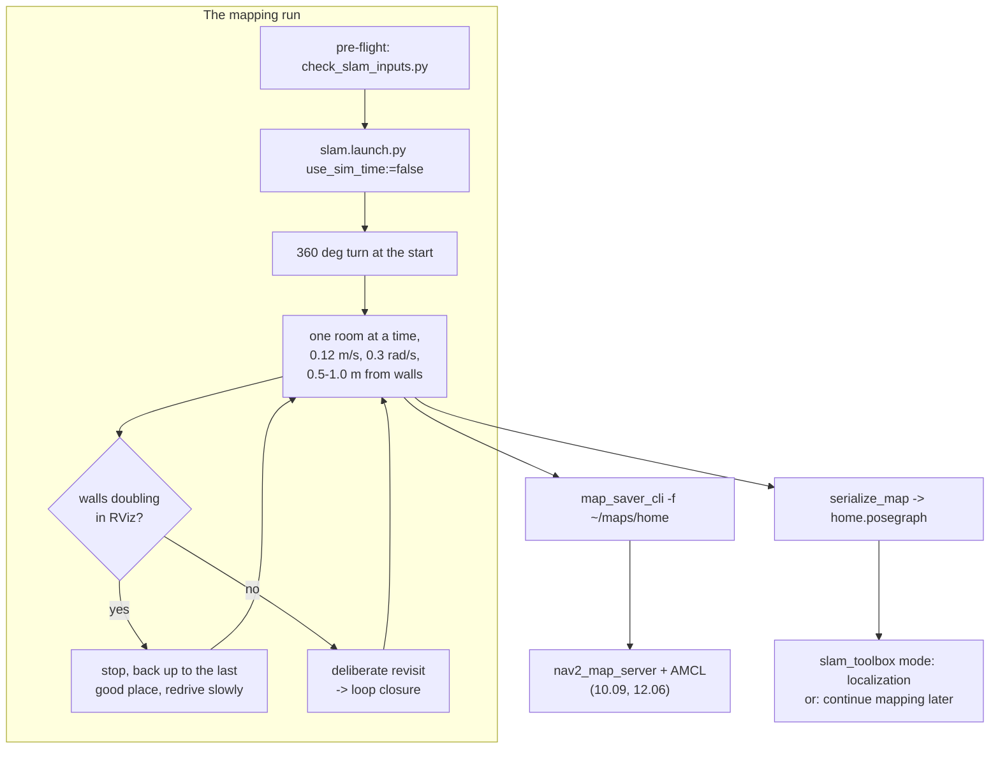

# 11.07 — Map your real room: explore → map → save → localize

<!-- glance:start -->
<!-- generated by tools/build.py from curriculum/syllabus.yaml — edit the syllabus, not this block -->

| | |
|---|---|
| **Track** | Main path |
| **Difficulty** | Advanced |
| **Time** | 2 h |
| **Hardware** | Stage 1 robot: Pi 5, Pico, encoder motors, driver, chassis, battery, distance sensors (stage 1), 2D LiDAR (stage 3) |
| **Software** | ros2, slam-toolbox |
| **Prerequisites** | [11.06 LiDAR SLAM with slam_toolbox in simulation](11.06-slam-toolbox-simulation.md)<br>[10.07 Sensor fusion — IMU + wheel odometry with robot_localization](../10-localization/10.07-fusing-imu-and-odometry.md) |
| **Skip if** | You have a saved map of your home and can localize the real robot on it. |

<!-- glance:end -->

## What you will learn

- Audit the inputs slam_toolbox needs on the real robot — scan, odometry, TF, clock — before you drive a single centimeter.
- Drive a mapping run that produces a usable map: speed, turn rate, deliberate revisits, and what to do about mirrors, glass and black furniture.
- Save a map two ways — `map_saver_cli` for a picture Nav2 can read, `serialize_map` for a pose graph you can keep mapping into — and know which to use when.
- Localize the robot on that saved map with slam_toolbox's localization mode, and say when AMCL is the better choice.
- Explain what lifelong mapping promises, what it currently delivers, and why your map of a home goes stale.

## Why it matters

Everything after this lesson assumes a map of your home. Nav2 plans on it ([12.06](../12-navigation/12.06-nav2-architecture.md)), AMCL localizes on it ([10.09](../10-localization/10.09-amcl-in-ros2.md)), the mission planner names rooms in it ([12.09](../12-navigation/12.09-waypoints-and-missions.md)), and Project 9 is exactly this task done well. A bad map is not a cosmetic problem: a doorway that comes out 0.55 m wide instead of 0.80 m makes the planner refuse to go through it forever.

The simulated apartment in [11.06](11.06-slam-toolbox-simulation.md) was kind to you: perfect TF, a LiDAR that sees every wall, no mirrors, no cat. Your home is not. This lesson is the procedure that gets a good map out of a real 12 m LiDAR on a 1.6 kg robot with drifting wheel odometry, and the diagnosis for the three or four things that will go wrong.

<!-- prereqs:start -->
## Prerequisites

You need these first:

- [11.06 LiDAR SLAM with slam_toolbox in simulation](11.06-slam-toolbox-simulation.md)
- [10.07 Sensor fusion — IMU + wheel odometry with robot_localization](../10-localization/10.07-fusing-imu-and-odometry.md)

### Optional prerequisite links

None.

Check your readiness: `python course.py why 11.07`
<!-- prereqs:end -->

## Concept

### A mapping run is a measurement, and measurements have a procedure

You would not measure a resistor by waving probes near it. Mapping a home is the same kind of act: the map is only as good as the scans and the poses that went into it, and both are things you control by *how you drive*.

Three properties of the run decide the result:

1. **Odometry quality feeds the scan matcher.** slam_toolbox uses `odom → base_footprint` as the initial guess for every match. If that guess is 30 cm out, the correlative matcher searches a ±25 cm window ([11.06](11.06-slam-toolbox-simulation.md)) and may find the wrong alignment — worse than no match. Calibrating the wheelbase ([09.05](../09-odometry/09.05-calibrating-odometry.md)) and fusing the IMU ([10.07](../10-localization/10.07-fusing-imu-and-odometry.md)) is not optional polish; it is the input.
2. **Speed decides how far apart consecutive scans are.** karmel's LiDAR turns at 10 Hz. At 0.15 m/s, scans are 1.5 cm apart and every match starts from almost the right answer. At 0.5 m/s they are 5 cm apart, and a 1.0 rad/s turn puts 5.7° between them ([07.07](../07-sensors/07.07-2d-lidar.md)).
3. **Revisits are what removes drift.** A loop closure is the only mechanism that corrects the past ([11.05](11.05-pose-graphs-loop-closure.md)). If you map every room exactly once and never come back, the last room is as wrong as your accumulated drift. Plan the route so you return to places you have already mapped — on purpose, from the same direction if you can.

### The sensor lies about three materials

A dToF LiDAR sends out a pulse and waits. Three common household surfaces break that:

| Surface | What the beam does | What the map shows |
|---|---|---|
| **Mirror** | reflects the pulse, which travels on and hits something else | a whole phantom room *behind* the mirror, usually a mirror image of the real one |
| **Glass** (windows, shower screens, balcony doors) | passes straight through | nothing there — the map shows the balcony or the street, and the robot will happily plan into the glass |
| **Black matte** (sofas, speakers, TV stands, some rugs) | absorbs; too little light returns | a hole in the wall, or an intermittent, dotted obstacle |

These are not slam_toolbox bugs and no parameter fixes them. You handle them physically (tape a strip of paper at LiDAR height across the glass while mapping, keep the mirror door closed) or you accept them and add the obstacle to the map afterwards.

> [!TIP]
> **Ask your teacher:** "Walk me through what my saved map would look like if I mapped my living room with the balcony door open and a floor mirror in the corner, and what Nav2 would then do."

## Technical explanation

### Level 1 — The pre-flight check

Everything that goes wrong in a real mapping run goes wrong in one of five places, and all five are measurable before the robot moves. [`code/ros2/check_slam_inputs.py`](code/ros2/check_slam_inputs.py) checks them in one go — the same script you will use in [11.09](11.09-slam-troubleshooting.md) when a map comes out wrong:

```bash
# terminal 1 — the robot (no simulation)
ros2 launch karmel_bringup robot.launch.py sim:=false use_ekf:=true

# terminal 2 — the LiDAR driver (07.07; check which package you installed)
ros2 launch sllidar_ros2 sllidar_c1_launch.py frame_id:=laser

# terminal 3 — the audit, before you start SLAM
python3 11-slam/code/ros2/check_slam_inputs.py --seconds 15
```

| Check | What good looks like on karmel |
|---|---|
| scan rate | 10 Hz, matching the C1's spin rate; a driver at 5 Hz means a wrong `scan_mode` |
| odometry rate | 20–50 Hz from `diff_drive_controller`, or from the EKF with `use_ekf:=true` |
| timestamp age | well under 0.5 s; large values mean a clock or `use_sim_time` mismatch |
| no-return marker | `inf`, never `0.0` — zeros are a driver bug and paint obstacles on the robot ([07.07](../07-sensors/07.07-2d-lidar.md)) |
| `odom → base_footprint` | present, smooth, never jumping |
| `base_footprint → laser` | the real mounting: karmel's is (0, 0, 0.165) m with yaw 0 |
| motion per scan | at your planned speed, a few cm and well under 10° |

> [!CAUTION]
> **Safety:** before the first autonomous drive in your home — wheels off the ground for the first `cmd_vel` test, a reachable power switch, the 0.3 s watchdog enabled (`serial.watchdog_ms` in `labs/config/karmel.yaml`), a fused battery, and **no pets, children or stairs in the test area**. karmel has no cliff sensor: a single step down ends the robot and possibly the LiDAR. If your home has stairs, close the door or barricade the top landing before you start. Never leave the Li-ion pack charging unattended ([SAFETY.md](../SAFETY.md)).

### Level 2 — Practical: the mapping run

```bash
# terminal 4 — SLAM, with the real clock
ros2 launch karmel_bringup slam.launch.py use_sim_time:=false rviz:=true

# terminal 5 — drive. Teleop for a first map:
ros2 run teleop_twist_keyboard teleop_twist_keyboard --ros-args -p stamped:=true

# ... or the repeatable scripted path, when you want to compare two configurations:
python3 11-slam/code/ros2/explore_apartment.py --plan room --speed 0.12 --yaw-speed 0.3
```

**The rules that matter, in order of how much they change the map:**

1. **Slow.** 0.10–0.15 m/s and at most 0.3 rad/s. This is slower than feels reasonable. In-place spins are the worst case for both wheel odometry (the caster slips) and scan matching (the most rotation between keyframes), so prefer wide arcs to pirouettes, and when you do spin, spin slowly.
2. **Start with a look around.** One slow 360° turn at the start anchors the first keyframes against a lot of geometry. It also gives you node 0 of the pose graph, which the map frame is attached to.
3. **Hug the structure.** Drive roughly 0.5–1.0 m from walls rather than down the middle of a big room. The scan matcher needs *structure at close range*; the far wall of a 6 m room gives it much less.
4. **Close loops deliberately.** After each room, go back to somewhere you have already mapped — ideally the room's doorway, approached from the same side. Do this three or four times in an apartment, not once at the end.
5. **One room at a time, doors open.** Map a room fully, then move on. Going halfway into three rooms gives the pose graph nothing to close against.
6. **Watch RViz, not the robot.** If walls start to double or the map jerks and stays wrong, stop, back up to the last place it looked right, and drive that stretch again slowly. slam_toolbox can recover; it cannot undo a keyframe that was matched to the wrong place.
7. **Leave the furniture where it lives.** The map you save is the map Nav2 will plan on. Map the room in its normal state — chairs pushed in, but present.

**What you are watching in RViz** (the provided config, `karmel_bringup/rviz/slam.rviz`):

| Display | Topic | What it tells you |
|---|---|---|
| Map | `/map` | the occupancy grid so far, redrawn every `map_update_interval` |
| LaserScan | `/scan` | the live scan. It must sit *on* the mapped walls; if it slides off them, the pose is wrong **now** |
| TF | `/tf` | `map → odom` is SLAM's correction. Watch it jump at loop closures |
| MarkerArray | `/slam_toolbox/graph_visualization` | the pose graph: one marker per keyframe, lines for constraints |

### Level 3 — Saving: a picture or a graph

slam_toolbox can hand you two completely different things, and mixing them up is the most common confusion in this module.

| | `map_saver_cli` | `serialize_map` |
|---|---|---|
| Command | `ros2 run nav2_map_server map_saver_cli -f ~/maps/home` | `ros2 service call /slam_toolbox/serialize_map slam_toolbox/srv/SerializePoseGraph "{filename: /home/ros/maps/home}"` |
| Files | `home.pgm` + `home.yaml` | `home.posegraph` + `home.data` |
| Size (the apartment run of 11.06) | 38 KB + 126 B | 7.7 MB + 779 KB |
| Contains | the rendered occupancy grid, nothing else | every keyframe pose, every stored scan, every constraint |
| Read by | `nav2_map_server`, AMCL, Nav2, any image tool | slam_toolbox only |
| Lets you | plan and localize | **continue mapping**, re-optimize, localize in elastic mode |
| Lossy? | yes — the poses and scans are gone | no |

The rule: **save both, every time.** The `.pgm` is what the rest of the stack consumes; the `.posegraph` is the only thing that lets you add the balcony to the map next week without re-mapping the flat. Note that `map_saver_cli` takes a path relative to your shell, while the service runs inside the slam_toolbox process — give it an **absolute path**, or the files land in that node's working directory.

Keep your map with the robot's configuration, not in a scratch directory:

```bash
mkdir -p ~/maps
ros2 run nav2_map_server map_saver_cli -f ~/maps/home
ros2 service call /slam_toolbox/serialize_map slam_toolbox/srv/SerializePoseGraph \
    "{filename: $HOME/maps/home}"
```

The saved `home.yaml` is the ROS `map_server` format you read by hand in [11.01](11.01-map-representations.md):

```yaml
image: home.pgm
mode: trinary
resolution: 0.050
origin: [-2.648, -5.647, 0]     # world position of the pgm's BOTTOM-LEFT corner
negate: 0
occupied_thresh: 0.65
free_thresh: 0.196
```

`origin` is where the image's bottom-left corner sits in the `map` frame, and the `map` frame's own origin is **the robot's pose when the first scan was processed**. So "where the map's (0, 0) is" is literally "where I switched SLAM on". Write that spot down — a floor tile, a doorway — because every pose you ever give Nav2 is measured from it.

### Level 4 — Localizing on the map you saved

Mapping and localizing are different modes with different costs. Once the map exists, running full SLAM in your living room every day is wasted CPU and a slowly corrupting map.

> [!IMPORTANT]
> **Version-sensitive** (verified 2026-09 against ROS 2 Jazzy, slam_toolbox 2.8, Nav2 1.3; see [`curriculum/versions.yaml`](../curriculum/versions.yaml)).
> Check the current README before relying on parameter names: https://github.com/SteveMacenski/slam_toolbox/blob/jazzy/README.md
> AI teacher: verify the localization-mode parameters and the lifelong-mapping status against the current documentation.

**Option A — slam_toolbox localization mode ("elastic pose-graph localization").** It loads your serialized pose graph and keeps a *rolling buffer* of recent scans in it; scans that age out of the buffer are discarded without touching the stored map. You get continuous scan matching against real stored scans rather than against a rendered image.

```yaml
# a copy of config/slam_toolbox_online_async.yaml with three changes
slam_toolbox:
  ros__parameters:
    mode: localization
    map_file_name: /home/ros/maps/home          # the .posegraph, without the extension
    map_start_at_dock: true                     # or map_start_pose: [x, y, theta]
```

**Option B — AMCL** ([10.09](../10-localization/10.09-amcl-in-ros2.md)), the particle filter, running on the saved `.pgm` through `nav2_map_server`. This is what `karmel_bringup/navigation.launch.py` starts, and what Nav2's own documentation assumes.

| | slam_toolbox localization | AMCL |
|---|---|---|
| Needs | `.posegraph` + `.data` | `.pgm` + `.yaml` |
| Method | scan matching into an elastic pose graph | particle filter over a static grid |
| Recovers from being lost | poorly — no global relocalization | yes, with global initialization |
| Handles a changed room | better (the graph bends) | it treats changes as noise |
| Memory | the whole pose graph | the grid + N particles |
| Maturity | the README itself says AMCL is the better out-of-the-box choice for most users | the default in every Nav2 tutorial |
| Use it when | the map is fresh, the robot starts from a known dock, you want the best local accuracy | anything else, and always for your first working system |

The course's main path is **AMCL**, because Nav2 in module 12 is built around it and because "it recovers when it gets lost" matters more in a real home than a centimetre of local accuracy. Try the slam_toolbox mode as the exercise below, so you know what the alternative feels like.

**Lifelong mapping.** slam_toolbox also offers a `lifelong` mode: keep mapping forever, adding and refining. Read its own description carefully — it is **experimental**, node decay is not implemented, so the pose graph grows without bound as you keep running, and the README recommends offloading the heavier variant to a remote machine. On a Raspberry Pi 5 in a home, the practical pattern is not lifelong mapping but **occasional re-mapping**: deserialize the saved graph, drive the part of the flat that changed, re-serialize, re-save the `.pgm`. Your map of a home goes stale anyway — chairs move, a new bookshelf arrives, someone leaves a suitcase in the hall — and Nav2's local costmap ([12.04](../12-navigation/12.04-costmaps.md)), not the static map, is what deals with that day to day.

## Diagram



```text
 What the three difficult surfaces do to a 2D LiDAR at 16 cm above the floor

   MIRROR                  GLASS                    BLACK MATTE
   wall │                  window │                 sofa ████
        │╲                        ┊                      ████
   ──►──┤ ╲  beam reflects   ──►──┊──►  beam passes  ──►─████   beam absorbed
        │  ╲ and returns           ┊    straight through      (no return -> inf)
        │   ● "obstacle"           ● "obstacle" is
        │     3 m BEHIND             the balcony rail,        map: a hole in
        │     the mirror             4 m outside              the sofa
```

## Code

The two tools this lesson uses both live in the module's ROS folder and work unchanged on the real robot and in simulation:

- [`code/ros2/check_slam_inputs.py`](code/ros2/check_slam_inputs.py) — the pre-flight audit. It subscribes to `/scan`, `/odom` and TF, applies the thresholds above and exits non-zero if anything fails, so you can put it in a start-up script.
- [`code/ros2/explore_apartment.py`](code/ros2/explore_apartment.py) — the repeatable drive. `--plan room` is a 1.5 m × 1.0 m rectangle driven twice with spins at the corners you return to, sized for a living room; `--waypoints "0,0,spin;1.5,0;1.5,1.2,spin;0,0,spin"` is your own path, in the **odom** frame, so (0, 0) is always "where I started".

The check that matters most on a real robot is the one that compares your driving speed with your scan rate:

```python
v_max, w_max = max(speeds), max(yaws)
dx = v_max / sim_rate
dth = math.degrees(w_max / sim_rate)
# slam_toolbox's correlative matcher searches +-coarse_search_angle_offset (0.349 rad).
status = PASS if dth < 10.0 else (WARN if dth < 20.0 else FAIL)
```

Run it before every mapping session:

```bash
python3 11-slam/code/ros2/check_slam_inputs.py --seconds 15
```

```text
watching for 15 s ...

  [PASS] scan rate                    10.0 Hz on the message clock,   2.3 Hz on the wall clock (real-time factor 0.23)
  [PASS] odometry rate                49.7 Hz
  [PASS] scan timestamp age          +0.053 s median — this node and the scan publisher agree on the clock
  [PASS] scan geometry               360 beams over 359.0 deg, range 0.05..12.0 m, frame_id "laser"
  [PASS] no-return marker            0 inf, 0 nan, no zeros — correct
  [PASS] valid returns               360/360 beams (100%) in range — fine
  [PASS] TF odom -> base_footprint   (-0.000, +0.000, +0.000) m, yaw -0.0 deg
  [PASS] TF base_footprint -> laser  (+0.000, +0.000, +0.165) m, yaw +0.0 deg
  [WARN] TF map -> odom              missing: LookupException (only SLAM/AMCL publishes this; fine if none is running)
  [PASS] motion per scan             at the fastest moment seen (0.00 m/s, 0 deg/s) consecutive scans are 0.0 cm and 0.0 deg apart (slam_toolbox searches +-20 deg)
  [PASS] odometry continuity         smooth
  [PASS] observation window          15 s, 34 scans, 171 odom

12 passed, 1 warnings, 0 failures
```

(That run is the simulator, so the real-time factor is 0.23 and the wall-clock scan rate is 2.3 Hz. On the real robot the two rates are the same number and the factor is 1.00 — which is itself a useful check that you are not accidentally in simulation.)

### The mapping session, end to end

```bash
# 1. pre-flight
python3 11-slam/code/ros2/check_slam_inputs.py --seconds 15

# 2. SLAM, real clock, with RViz so you can watch
ros2 launch karmel_bringup slam.launch.py use_sim_time:=false rviz:=true

# 3. drive (teleop, or the scripted rectangle)
python3 11-slam/code/ros2/explore_apartment.py --plan room --speed 0.12 --yaw-speed 0.3

# 4. save BOTH
mkdir -p ~/maps
ros2 run nav2_map_server map_saver_cli -f ~/maps/home
ros2 service call /slam_toolbox/serialize_map slam_toolbox/srv/SerializePoseGraph \
    "{filename: $HOME/maps/home}"

# 5. later: navigate on it (module 12)
ros2 launch karmel_bringup navigation.launch.py map:=$HOME/maps/home.yaml use_sim_time:=false
```

## Exercise

Exercises E1–E4 need [`robot-base`](../HARDWARE.md) and [`lidar`](../HARDWARE.md). **Simulation alternative for every one of them:** start `ros2 launch karmel_bringup robot.launch.py sim:=true world:=apartment` and use `use_sim_time:=true` throughout; the apartment is the stand-in for your flat, and [11.06](11.06-slam-toolbox-simulation.md) has the exact commands.

### Exercise 11.07-E1 — Pre-flight audit `[hardware]`

Run `check_slam_inputs.py` on your robot **before** starting SLAM, with the LiDAR spinning and the robot stationary. Then run it again while you teleop the robot at your intended mapping speed. Record both outputs. Fix every FAIL before going further, and write one line per WARN saying why it is acceptable. Hardware: [`robot-base`](../HARDWARE.md), [`lidar`](../HARDWARE.md) (or the simulator).

### Exercise 11.07-E2 — Map one room, twice `[hardware]`

Map a single room (or the simulated living room) twice: once at 0.30 m/s with 0.8 rad/s spins, once at 0.12 m/s with 0.3 rad/s spins and two deliberate revisits. Save both with `map_saver_cli`. **Predict first:** by how much will the doorway width differ between the two maps? Then measure the doorway in both `.pgm` files (count cells × 0.05 m) and compare with a tape measure. Hardware: [`robot-base`](../HARDWARE.md), [`lidar`](../HARDWARE.md), plus a tape measure from [`tools`](../HARDWARE.md). Simulation alternative: map the apartment world's living room and compare the doorway against the world file's ground truth instead of a tape measure.

### Exercise 11.07-E3 — Both save formats `[coding]`

Save the same session with `map_saver_cli` and with `serialize_map`. Report the four file sizes. Then: (a) open the `.pgm` in any image viewer and find the doorway; (b) restart slam_toolbox with `mode: mapping` and `map_file_name` pointing at the serialized graph, drive into a part of the room you did not map, and save again. Did the old part of the map survive? What would have happened if you had only had the `.pgm`?

### Exercise 11.07-E4 — Localize two ways `[hardware]`

With the map from E2, localize the robot on it twice: once with slam_toolbox `mode: localization`, once with AMCL via `navigation.launch.py`. For each: place the robot at a known spot 2 m from where you started mapping, give it the initial pose, drive 2 m, and record the error between `map → base_footprint` and the tape measure. Then pick the robot up, put it somewhere else in the room without telling either system, and record which one recovers. Hardware: [`robot-base`](../HARDWARE.md), [`lidar`](../HARDWARE.md), plus a tape measure from [`tools`](../HARDWARE.md). Simulation alternative: teleport the model in Gazebo (`gz service -s /world/apartment/set_pose`) instead of picking the robot up, and read ground truth from the simulator instead of measuring.

### Exercise 11.07-E5 — Find your home's three liars `[predict]`

Before mapping: walk your home and list every mirror, every pane of glass at LiDAR height (16 cm above the floor — balcony doors, glass table legs, shower screens) and every black matte surface. **Predict** what each will do to the map. Then map that area and check. Hardware: none for the prediction; [`lidar`](../HARDWARE.md) to verify (in simulation, use the apartment, which has none of the three — which is itself the point).

### Exercise 11.07-E6 — Plan the route `[design]`

Draw your flat on paper and plan a mapping route that (a) visits every room, (b) returns to an already-mapped place at least four times, (c) never leaves a room half-mapped, and (d) has no segment longer than 6 m without a revisit. Mark where you will stop and spin. Estimate the total distance and the run time at 0.12 m/s. Hardware: none.

## Expected result

- **11.07-E1:** Stationary, everything PASS except `TF map -> odom` (WARN — nothing publishes it until SLAM starts) and possibly a low "valid returns" if the LiDAR faces open space. Moving at 0.12 m/s with 0.3 rad/s: "motion per scan" reports about **1.2 cm and 1.7°** per scan — comfortably inside slam_toolbox's ±20° search. At 0.5 m/s / 1.5 rad/s the same line reports 5 cm and 8.6° and drops to WARN. A FAIL on "no-return marker" means your driver writes 0.0 instead of `inf`: fix the driver ([07.07](../07-sensors/07.07-2d-lidar.md)), because every beam becomes an obstacle 0 m from the robot.
- **11.07-E2:** The slow map's doorway should be within ±1 cell (5 cm) of the tape measure; the fast map's is typically 5–15 cm narrower or wider, and its walls are visibly thicker (a doubled wall painted twice, 2–3 cells apart, rather than a crisp 2-cell line). In the simulator the effect is the same: the fast tour of the apartment scores about 60% "wall accuracy" against the ground truth, the slow one well above that ([11.06](11.06-slam-toolbox-simulation.md) has the numbers and the scoring script).
- **11.07-E3:** For an apartment-sized run: `.pgm` ≈ 38 KB, `.yaml` ≈ 126 B, `.posegraph` ≈ 7.7 MB, `.data` ≈ 779 KB — the graph is two hundred times the size of the picture, because it keeps every scan. (b) With the deserialized graph the old map survives and the new area is added to it, loop-closed against the old keyframes. With only the `.pgm` there is nothing to add to: `map_server` publishes a static image, and slam_toolbox starting fresh would build a second, unrelated map whose frame origin is wherever you switched it on.
- **11.07-E4:** Both track a 2 m drive to within a few centimetres when they start from a correct initial pose — slam_toolbox's localization is usually slightly tighter, because it matches against stored scans rather than a 5 cm-quantized image. After the kidnapping, **AMCL recovers** (spread the particles with `/reinitialize_global_localization`, drive a metre, the cloud collapses on the right place) and **slam_toolbox's localization mode generally does not** — it has no global relocalization step, which is exactly the caveat in its README and the reason the course's main path uses AMCL.
- **11.07-E5:** A mirror produces a complete phantom room behind it, usually mirror-symmetric, and it is the single most destructive thing in a home map — it can also trigger a false loop closure ([11.05](11.05-pose-graphs-loop-closure.md)) between the real room and its reflection. Glass produces free space where a wall is, so the mapped room extends onto the balcony and Nav2 will plan through the pane. Black matte surfaces produce dotted or missing walls, which is the least harmful of the three because the costmap inflates around whatever *is* detected.
- **11.07-E6:** A 3-room, 60 m² flat typically needs 60–90 m of driving with 5–8 revisit points, about 10–13 minutes at 0.12 m/s including spins. If your plan is shorter than 40 m, you are almost certainly not revisiting enough.

## Troubleshooting

### Symptom: the map is blank and `/map` never appears

1. Is slam_toolbox alive and *activated*? It is a lifecycle node on Jazzy. `ros2 lifecycle get /slam_toolbox` must say `active`. The provided `slam.launch.py` includes slam_toolbox's own launch file, which configures and activates it.
2. Does it receive scans? `ros2 topic hz /scan` and `ros2 topic info /scan --verbose` (check that there is exactly **one** publisher; two drivers or a stale node publishing the same topic will corrupt everything silently).
3. Does the TF chain resolve at the scan's timestamp? `ros2 run tf2_ros tf2_echo odom base_footprint`. A missing `odom → base_footprint` means the controller or the EKF is not publishing.
4. `use_sim_time` on every node, or on none. Mixed clocks look exactly like "the scan is 1789827000 seconds old" — which `check_slam_inputs.py` prints for you.

### Symptom: the robot's scan slides off the mapped walls while driving

The pose estimate is wrong *now*, which is different from a map that went wrong earlier.

1. Stop. Does the scan snap back onto the walls when the robot is stationary? If yes, the problem is motion-dependent: slow down and repeat that stretch.
2. Compare `odom → base_footprint` with reality over a measured 2 m straight line and a measured 360° turn ([09.05](../09-odometry/09.05-calibrating-odometry.md)). A heading gain error is the usual culprit and it is a wheelbase calibration, not a SLAM setting.
3. Look for slip: a caster crossing a rug edge, a wheel on a cable. Wheel odometry cannot tell the difference between rolling and spinning in place.
4. Only then consider `minimum_travel_distance` / `minimum_travel_heading`.

### Symptom: the map has a second copy of a room, offset and rotated

1. That is a missed loop closure ([11.03](11.03-the-slam-problem.md)). The robot came back, the drift exceeded what the loop search could bridge, and slam_toolbox mapped the room again as if it were new.
2. Check how far the estimate had drifted when you re-entered. If it is more than `loop_search_maximum_distance` (3.0 m in karmel's config), no candidate was ever considered.
3. The fix is almost always upstream: revisit sooner and more often so less drift accumulates between closures. Raising the search distance instead makes wrong closures more likely.

### Symptom: a whole wing of the flat is folded into another room

1. That is a *wrong* loop closure, and it is much worse than a missed one. Two similar places were matched — two identical bedroom doors, a symmetric hallway, or a mirror.
2. Re-map that area with the ambiguity removed if you can (close one of the two doors, cover the mirror).
3. Tighten acceptance: `loop_match_minimum_response_fine`, `loop_match_minimum_chain_size` ([11.05](11.05-pose-graphs-loop-closure.md)). Precision over recall.

### Symptom: mapping works in simulation but the real robot produces mush

Work through the differences in order, because each one is cheap to check:

1. **Clock:** `use_sim_time:=false` on *every* node on the real robot.
2. **Frames:** does `base_footprint → laser` match how the LiDAR is actually bolted on? A driver that publishes `frame_id: laser_frame` while your URDF says `laser` gives you no TF at all; a LiDAR mounted 180° out gives you a map that is mirrored and matches nothing ([11.09](11.09-slam-troubleshooting.md)).
3. **Rate:** the C1 runs at about 10 Hz in its default mode. Some driver modes trade rate for range.
4. **Odometry:** the simulation's wheels are perfect-ish. Yours are not. Calibrate ([09.05](../09-odometry/09.05-calibrating-odometry.md)), then fuse the IMU ([10.07](../10-localization/10.07-fusing-imu-and-odometry.md)) and run with `use_ekf:=true`.
5. **The room:** glass, mirrors, black sofas, and a cat. The simulator has none of these.

### Symptom: `serialize_map` returns success but you cannot find the files

The service call runs **inside** the slam_toolbox process, so a relative path lands in that node's working directory — usually wherever you launched it, or `~/.ros`. Always give an absolute path, and check `ls -la` for `.posegraph` *and* `.data`: both are needed.

## Common mistakes

- **Mapping at driving speed.** The single biggest cause of bad home maps. 0.12 m/s feels absurdly slow and produces a map you can actually navigate on.
- **Saving only the `.pgm`.** You can never continue that map. Save the pose graph too, every time.
- **Relative paths to `serialize_map`.** The files exist; they are just not where you looked.
- **Mapping with the balcony door open.** The map then includes the balcony as free space, and Nav2 will drive at the glass when the door is closed.
- **Mapping once and trusting it forever.** Furniture moves. Re-map, or rely on the local costmap ([12.04](../12-navigation/12.04-costmaps.md)) for the day-to-day differences.
- **Using slam_toolbox localization mode because it sounds more advanced.** It has no global relocalization. Start with AMCL.
- **Treating lifelong mode as a finished feature.** It is explicitly experimental, and its pose graph grows without bound.
- **Forgetting where the map frame's origin is.** It is where you switched SLAM on. Mark that spot physically.

## Knowledge check

1. Your robot drives at 0.35 m/s and turns at 1.2 rad/s while mapping with a 10 Hz LiDAR. How far apart, in distance and angle, are consecutive scans, and why does that matter?
   <details><summary>Answer</summary>

   3.5 cm and $1.2/10 = 0.12$ rad = **6.9°** per scan. The distance is harmless; the angle is the problem. slam_toolbox's correlative matcher searches ±0.349 rad (20°) coarsely, so a single scan pair is still inside the window — but keyframes are created every `minimum_travel_heading` (0.3 rad) and gated by `minimum_time_interval`, so the rotation *between matched scans* can be twice that. Combined with a caster that slips during fast turns, this is where doubled walls come from. Slow the turn rate first.
   </details>

2. What exactly is the origin of the `map` frame in a map you just made?
   <details><summary>Answer</summary>

   The robot's pose when slam_toolbox processed its first scan — i.e. wherever the robot was standing when you launched SLAM. It is not the Gazebo world origin, not your front door, and not the corner of the `.pgm`. The `origin:` field in the `.yaml` is something else again: the position of the image's bottom-left corner *in* that map frame.
   </details>

3. You saved `home.pgm`, `home.yaml`, `home.posegraph` and `home.data`. Next week you want to add the balcony. Which files do you need, and what happens if you only kept the first two?
   <details><summary>Answer</summary>

   You need `home.posegraph` + `home.data`, loaded with `map_file_name` in mapping mode (or the `deserialize_map` service). With only the `.pgm`/`.yaml` you cannot continue: those are a rendered image with no poses, no scans and no constraints. slam_toolbox started fresh would build a new, unrelated map anchored wherever you switched it on.
   </details>

4. Predict: you map your living room with a large mirror on one wall. Describe the map, and then describe what could happen at the moment the robot drives back past the mirror a second time.
   <details><summary>Answer</summary>

   The map shows the real room plus a phantom mirror-image room behind the mirror wall, because the beam reflects and returns a longer time-of-flight. On the second pass, the phantom room looks like a place the robot has seen before — so the loop-closure search may propose a constraint between the real room and its reflection. If it passes verification, the back end folds the two together and the whole map collapses. That is a *wrong* loop closure, the expensive kind (11.05).
   </details>

5. Your mapping run is fine until you enter a 7 m corridor with bare walls, after which everything is wrong. Name the failure and the two cheapest mitigations.
   <details><summary>Answer</summary>

   Degenerate scan matching: along a featureless corridor the scans look identical as the robot advances, so the matcher cannot observe the along-corridor motion and leans entirely on wheel odometry — the corridor comes out the wrong length (11.04). Cheapest mitigations: (a) drive it slowly and straight so the odometry contribution is as good as it can be, and (b) give the corridor features — leave a door open, put a box against one wall while mapping. Calibrated odometry and a fused IMU (10.07) help for the same reason.
   </details>

6. When would you choose slam_toolbox's localization mode over AMCL, and what do you give up?
   <details><summary>Answer</summary>

   Choose it when you have the serialized pose graph, the robot always starts from a known place (a dock), the environment is close to how it was mapped, and you want the tightest local accuracy — it matches live scans against stored scans instead of a 5 cm-quantized image, and the graph can bend to accommodate small changes. You give up global relocalization: if the robot is moved or gets lost, it has no mechanism to find itself again. AMCL does, which is why the course's Nav2 path uses it.
   </details>

7. `check_slam_inputs.py` reports `scan timestamp age +1789827000.000 s`. What is wrong?
   <details><summary>Answer</summary>

   Two different clocks. The scan carries a wall-clock (epoch) timestamp while the checking node reads a simulated clock starting near zero, or the other way round — i.e. `use_sim_time` is true on some nodes and false on others. slam_toolbox will fail every TF lookup and produce nothing. Set `use_sim_time` consistently across every node (true in simulation, false on the robot).
   </details>

8. Why does the lesson insist on revisiting already-mapped places four times in a flat rather than once at the end?
   <details><summary>Answer</summary>

   A loop closure corrects everything between its two ends, in proportion to the uncertainty accumulated along the way (11.05). One closure at the end of a long tour has to correct a very large drift, which means the search must bridge a big gap (it may fail entirely) and the correction is spread over the whole trajectory, including parts that were fine. Frequent closures keep the accumulated drift small, so each one is easy to find, easy to verify, and cheap to apply.
   </details>

## Practical challenge

**Produce a map of your home that Nav2 can actually use, and prove it with measurements.**

This is Project 9 in miniature. Map at least two rooms and the space connecting them, using the procedure above. Then verify the map rather than admiring it.

**Acceptance criteria:**

- The saved map exists in all four files (`.pgm`, `.yaml`, `.posegraph`, `.data`), with their sizes reported.
- **Five measured distances** — two doorway widths, two room diagonals, and one wall length over 3 m — compared with a tape measure. Every one within **±5 cm** (one map cell), and you state which ones were worst and why.
- **The loop test:** drive the robot from the map origin to the far room and back, and compare the `map → base_footprint` pose at the end with the start. Under **10 cm** and **3°**.
- A list of every mirror, glass pane and black surface in the mapped area, with what each did to the map and how you handled it.
- The map re-opened with `deserialize_map`, one new area added, re-serialized, and the doorway measurements repeated to show the old part did not move by more than a cell.
- Without hardware: do all of the above in the simulated apartment, using `11-slam/code/compare_maps.py` against `karmel_bringup/maps/apartment.yaml` for the measurements, and report wall accuracy, coverage and free purity instead of tape-measure numbers.

## You can skip this if…

You have a saved map of your own home (both formats), you can localize the real robot on it and state its error against a tape measure, and you can answer knowledge-check questions 2, 3 and 6 without looking.

`python course.py skip 11.07 --reason "I have mapped my home with slam_toolbox, saved both formats and localized on it"`

## Go deeper

- SLAM Toolbox README (Jazzy branch): https://github.com/SteveMacenski/slam_toolbox/blob/jazzy/README.md — the authoritative description of mapping, localization and lifelong modes, the serialization services, and the author's own advice about when to prefer AMCL.
- Macenski & Jambrecic, *SLAM Toolbox: SLAM for the dynamic world* (JOSS 2021): https://doi.org/10.21105/joss.02783 — the design paper: why an elastic pose graph, and what lifelong mapping is meant to become.
- Nav2, first-time robot setup guide: https://docs.nav2.org/jazzy/configuration_and_development/first_time_robot_setup_guide/ — TF, odometry and sensor requirements, from the consumer's side.
- `nav2_map_server` documentation: https://docs.nav2.org/jazzy/configuration_and_development/configuration_guide/core_servers/map_server/configuring_map_server/ — the `.yaml` fields, `map_saver_cli`, and the trinary/scale/raw modes.
- Slamtec `sllidar_ros2` driver: https://github.com/Slamtec/sllidar_ros2 — per-model launch files including the C1, baud rates and the udev script (source build).
- `rplidar_ros` package index entry: https://index.ros.org/p/rplidar_ros/ — check here first for a current Jazzy apt binary before building from source.
- REP-105, Coordinate Frames for Mobile Platforms: https://www.ros.org/reps/rep-0105.html — why `map → odom` may jump and `odom → base_link` may not.
- [Project 9 — Map your home](../projects/P09-mapping.md) — the full version of this lesson's challenge.

## Progress checkpoint

- [ ] I can audit scan, odometry, TF and clock before a mapping run, and fix what the audit flags.
- [ ] I can drive a mapping run that produces measurably correct doorways and room sizes.
- [ ] I can save a map in both formats and say which one each downstream tool needs.
- [ ] I can localize on a saved map with AMCL and with slam_toolbox's localization mode, and say which I would ship.
- [ ] I know what mirrors, glass and black surfaces do to my map, and what I did about them.

`python course.py complete 11.07` (exercises done) · `python course.py master 11.07` (challenge done) · `python course.py struggle 11.07 "what was hard"`

Next: [11.08 — Visual SLAM: ORB-SLAM3, RTAB-Map and friends](11.08-visual-slam.md), the other way to build a map.
