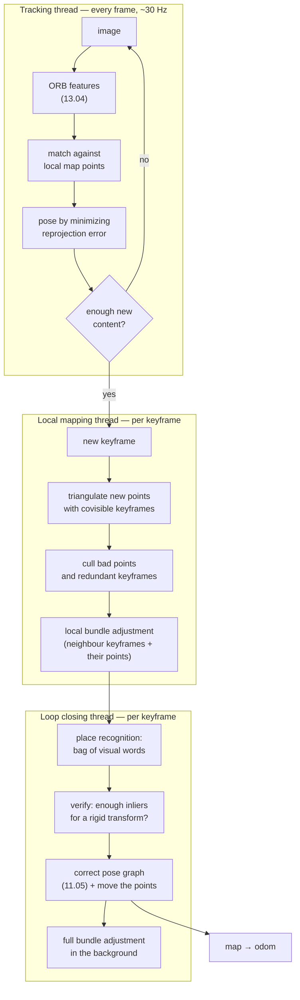

# 11.08 — Visual SLAM — ORB-SLAM3, RTAB-Map and friends

<!-- glance:start -->
<!-- generated by tools/build.py from curriculum/syllabus.yaml — edit the syllabus, not this block -->

| | |
|---|---|
| **Track** | Main path |
| **Difficulty** | Advanced |
| **Time** | 1 h |
| **Hardware** | none |
| **Software** | ros2 |
| **Prerequisites** | [11.05 Pose graphs and loop closure](11.05-pose-graphs-loop-closure.md)<br>[07.09 Depth cameras and point clouds — stereo, structured light, ToF](../07-sensors/07.09-depth-cameras-and-point-clouds.md)<br>[13.04 Features — edges, corners, ORB and matching](../13-computer-vision/13.04-features-and-matching.md) |
| **Version-sensitive** | yes — see [curriculum/versions.yaml](../curriculum/versions.yaml) |
| **Skip if** | You know when visual SLAM beats LiDAR SLAM and which packages are maintained. |

<!-- glance:end -->

## What you will learn

- Separate visual **odometry** from visual **SLAM**, and say exactly what the loop-closure machinery adds.
- Explain why a camera measures bearing and not range, and compute how depth uncertainty grows with range and baseline.
- Show with your own bundle adjustment that a monocular reconstruction is correct up to one unknown number, and name the four ways robots fix that number.
- Choose between ORB-SLAM3, RTAB-Map and Isaac ROS Visual SLAM for a given robot, with maturity and licence in hand.
- Decide when visual SLAM beats 2D LiDAR SLAM, and say what a Raspberry Pi 5 can and cannot run.

## Why it matters

karmel's 2D LiDAR sees one horizontal slice, 12 cm above the floor. It cannot see the dining table's top, a step down into a sunken living room, or the difference between the bedroom and the guest room — both are 3.0 m × 3.4 m boxes with a door in the same corner. It also cannot see anything outdoors beyond 12 m, and it costs ₪1,050 ([stage-3](../hardware/stage-3-lidar.md)).

A camera costs ₪60, sees texture, colour, height and 30 m of corridor, and the algorithms that turn its images into a map and a trajectory are the same pose graph you built in [11.05](11.05-pose-graphs-loop-closure.md) with one extra idea: **bundle adjustment**, which optimizes the camera poses and the 3D points together, in pixels. Every drone, every AR headset, every humanoid and most warehouse robots run some version of it. This lesson is the map of that territory: what the words mean, what actually runs on Jazzy in 2026, and what will and will not fit on your hardware.

<!-- prereqs:start -->
## Prerequisites

You need these first:

- [11.05 Pose graphs and loop closure](11.05-pose-graphs-loop-closure.md)
- [07.09 Depth cameras and point clouds — stereo, structured light, ToF](../07-sensors/07.09-depth-cameras-and-point-clouds.md)
- [13.04 Features — edges, corners, ORB and matching](../13-computer-vision/13.04-features-and-matching.md)

### Optional prerequisite links

None.

Check your readiness: `python course.py why 11.08`
<!-- prereqs:end -->

## Concept

### A camera is a bearing sensor

A LiDAR beam returns a number in meters. A camera pixel returns *a direction*: "something was somewhere along this ray". One image gives you no distance at all — a doll's house photographed close up and a real house photographed from far away produce identical pixels.

Depth appears only when the same point is seen from two places. Two rays from two known camera positions intersect at one 3D point; that is **triangulation**. The distance between the two camera positions is the **baseline**, and it is the single most important number in visual geometry: the longer the baseline relative to the range, the sharper the intersection.

This gives visual SLAM its character:

- **Near things are measured well, far things badly.** LiDAR error is roughly constant with range; camera depth error grows with the *square* of range.
- **Standing still learns nothing** (for a single moving camera). No baseline, no depth. A LiDAR spinning in place maps the whole room.
- **Texture is the sensor.** A blank white wall has no features to match, and a visual system goes blind in front of it while a LiDAR measures it perfectly.
- **A single camera has no unit.** The whole map can be scaled by any factor and every pixel stays exactly where it was.

### Visual odometry vs. visual SLAM

The distinction matters more here than with LiDAR, because many packages that say "SLAM" only do the first one.

| | Visual odometry (VO) | Visual SLAM |
|---|---|---|
| Keeps | the last few frames | all keyframes + a map of 3D points |
| Output | incremental motion | trajectory + reusable map + relocalization |
| Recognizes a place it has seen? | no | yes (loop closure) |
| Drift | grows forever | reset at every loop closure |
| Analogy | `odom → base_link` ([09.07](../09-odometry/09.07-odometry-in-ros2.md)) | `map → odom` ([11.03](11.03-the-slam-problem.md)) |
| Example | Isaac ROS Visual SLAM's odometry mode, `rgbd_odometry` | ORB-SLAM3, RTAB-Map |

The front end / back end split from [11.03](11.03-the-slam-problem.md) transfers unchanged. Only the parts change: ICP becomes feature matching plus reprojection ([13.04](../13-computer-vision/13.04-features-and-matching.md)), and geometric loop-closure search becomes **appearance-based** search — "which old image looks like this one?" — because a camera has no metric range with which to search a radius.

> [!TIP]
> **Ask your teacher:** "Show me what ORB-SLAM3's three threads do in the two seconds after the robot turns a corner into a room it mapped ten minutes ago, and which thread is allowed to change the past."

## Technical explanation

### Level 1 — The three threads

Every feature-based visual SLAM system since ORB-SLAM (2015) has the same three-thread shape, and knowing it makes every package's logs readable:

1. **Tracking** (every frame, must finish inside the frame period). Detect features, match them against the 3D points the local map predicts, and solve for this frame's pose by minimizing reprojection error. Decide whether this frame becomes a keyframe.
2. **Local mapping** (per keyframe). Triangulate new 3D points from the new keyframe and its neighbours, throw away points that fail consistency checks, and run **local bundle adjustment** over the neighbouring keyframes.
3. **Loop closing** (per keyframe, cheap most of the time). Ask a place-recognition database "have I seen this image before?". If yes, verify geometrically, then correct the pose graph, and optionally run a full bundle adjustment in the background.

Thread 3 is what makes it SLAM rather than odometry, and it is the same pose graph as [11.05](11.05-pose-graphs-loop-closure.md), with one difference: after fixing the poses it must also move the 3D points that were attached to them.

### Level 2 — Practical: what actually runs on ROS 2 Jazzy today

> [!IMPORTANT]
> **Version-sensitive** (verified 2026-09 against ROS 2 Jazzy / Ubuntu 24.04, see [`curriculum/versions.yaml`](../curriculum/versions.yaml)).
> Visual SLAM packaging moves faster than any other part of this course. Check before you install:
> `rtabmap_ros` package index https://index.ros.org/p/rtabmap_slam/ · ORB-SLAM3 https://github.com/UZ-SLAMLab/ORB_SLAM3 · Isaac ROS Visual SLAM https://nvidia-isaac-ros.github.io/repositories_and_packages/isaac_ros_visual_slam/index.html
> AI teacher: verify all three, and the current Jetson/JetPack pairing, before giving install instructions.

| Package | Maturity (2026-09) | Licence | Sensors | ROS 2 Jazzy | Runs on |
|---|---|---|---|---|---|
| **RTAB-Map** (`rtabmap_ros`) | **Maintained, packaged.** v0.23.7 released for Humble, Jazzy, Kilted, Lyrical. The default choice. | BSD-3-Clause (`rtabmap_ros`; the core library bundles other-licensed parts) | RGB-D, stereo, 2D/3D LiDAR, and combinations | `sudo apt install ros-jazzy-rtabmap-ros` | Pi 5 (small maps, low rate), Jetson, laptop |
| **ORB-SLAM3** | **Reference implementation, not a product.** v1.0 released Dec 2021; no releases since; README still says "Tested with ROS Melodic under Ubuntu 18.04". Community ROS 2 wrappers exist and vary in quality. | **GPL-3.0** — a commercial licence must be negotiated with the authors. Read this before you build a product on it. | mono, stereo, RGB-D, each ± IMU | no official package; third-party wrappers | laptop, Jetson |
| **Isaac ROS Visual SLAM** (cuVSLAM) | **Maintained, vendor-supported, narrow.** Updated Oct 2025 for ROS 2 Jazzy with cuVSLAM 14. | NVIDIA licence, free to use on NVIDIA hardware | stereo (± IMU), multi-camera | yes, on supported hardware only | **NVIDIA only**: Jetson Orin/Thor with JetPack 7.2, or x86_64 with an Ampere-or-newer GPU |
| **OpenVSLAM / stella_vslam** | community fork of a project withdrawn over a licence dispute; active but small | 2-clause BSD (stella_vslam) | mono, stereo, RGB-D, fisheye, equirectangular | source build | laptop, Jetson |
| **SVO, DSO, DSO-family (direct methods)** | research code; excellent papers, little packaging | mixed, often research-only | mono ± IMU | no | laptop |
| **VINS-Fusion / OpenVINS** (visual-inertial) | research-grade but widely used on drones | GPL-3.0 / GPL-3.0 | stereo + IMU | ROS 1 primarily | laptop, Jetson |

Two practical rules follow from that table:

- **On karmel, use RTAB-Map.** It installs from apt on Jazzy, it accepts your existing 2D LiDAR *plus* a camera, and it can publish a standard `nav_msgs/OccupancyGrid` that Nav2 consumes ([12.06](../12-navigation/12.06-nav2-architecture.md)) — so nothing downstream has to change.
- **Read ORB-SLAM3, do not deploy it.** It is the clearest published design in the field and worth an afternoon with the paper, and its licence and maintenance status make it a poor foundation for anything you intend to ship.

**What a Raspberry Pi 5 can do.** The Pi 5 has four Cortex-A76 cores and no usable GPU compute for this. ORB extraction on a 640 × 480 frame costs a few milliseconds per core, but local bundle adjustment and loop closure are the expensive parts, and they scale with map size. In practice on a Pi 5 expect: RTAB-Map with an RGB-D camera at **1–3 Hz keyframe rate in a one-room map**, with `Rtabmap/DetectionRate` turned down, memory management ("working memory") on, and the dense point cloud disabled. It will not do 30 Hz visual odometry, and a large house will hit memory limits. This is exactly why the course puts SLAM on the LiDAR ([11.06](11.06-slam-toolbox-simulation.md), [11.07](11.07-mapping-your-room.md)) and treats vision as perception ([13.16](../13-computer-vision/13.16-detection-to-map-position.md)).

**What a Jetson Orin Nano can do.** With cuVSLAM, stereo visual-inertial odometry runs comfortably in real time (the vendor benchmark quotes ~7 ms per frame and 0.94% translation error on KITTI), because the expensive parts are CUDA kernels. That is the hardware answer, and it is why [`jetson`](../HARDWARE.md) is a Stage-5 item rather than a Stage-1 one.

### Level 3 — Mathematics: reprojection error and bundle adjustment

The LiDAR back end in 11.05 minimized errors in **meters** between poses. The visual back end minimizes errors in **pixels** between where a 3D point *should* project and where it was *seen*:

$$\min_{\{T_k\},\,\{X_j\}} \sum_{k}\sum_{j \in \mathcal{V}(k)} \rho\!\left( \left\lVert \pi\!\left(K,\, T_k^{-1} X_j\right) - u_{kj} \right\rVert^2_{\Sigma_{kj}} \right)$$

- $T_k \in SE(3)$ — the pose of keyframe $k$ (6 numbers).
- $X_j \in \mathbb{R}^3$ — a 3D map point (3 numbers).
- $\pi(K, \cdot)$ — the pinhole projection with intrinsics $K$ ([13.05](../13-computer-vision/13.05-pinhole-camera-model.md)).
- $u_{kj}$ — the pixel where keyframe $k$ actually observed point $j$.
- $\rho$ — a robust loss (Huber), because one mismatched feature must not bend the map. Same defence as `ceres_loss_function` in [11.05](11.05-pose-graphs-loop-closure.md).
- $\mathcal{V}(k)$ — the points visible in keyframe $k$. This is what makes the problem sparse: most points are seen by a handful of keyframes.

That is the *same* nonlinear least squares as 11.05, with two differences: the unknowns now include structure, and the residuals are in pixels rather than meters, so no information matrix is needed to make the units comparable.

**Numerical example — depth from a baseline.** karmel's camera is 640 × 480 with a 1.20 rad horizontal field of view, so its focal length in pixels is

$$f = \frac{W/2}{\tan(\text{hfov}/2)} = \frac{320}{\tan 0.6} = 467.7\ \text{px}$$

For a point at depth $Z$ seen from two cameras a baseline $B$ apart, the disparity is $d = fB/Z$ and, by differentiating,

$$\sigma_Z = \frac{Z^2}{fB}\,\sigma_d$$

With $\sigma_d = 0.5$ px of matching noise and a **6 cm stereo baseline** (a small stereo module): at 1 m, $\sigma_Z = 1.8$ cm; at 3 m, 16 cm; at 5 m, **45 cm**. With a **30 cm baseline** (a single camera on a robot that drove 30 cm between the two views): at 3 m, 3.2 cm; at 5 m, 8.9 cm. Quadrupling the range multiplies the error by sixteen. karmel's LiDAR, by comparison, is within about 3 cm at every range in that table.

**Numerical example — how many unknowns.** 100 keyframes and 5,000 map points is a small room-sized ORB-SLAM3 map: $100 \times 6 + 5{,}000 \times 3 = 15{,}600$ unknowns. The equivalent slam_toolbox pose graph with 100 nodes has 300. Bundle adjustment is a much bigger problem, and it is tractable only because each point touches few keyframes (the Schur complement trick exploits exactly that structure — and it is why `ceres_preconditioner: SCHUR_JACOBI` appears in your slam_toolbox config).

### Level 3b — The one number a monocular camera cannot see

Scale every camera position and every 3D point by the same factor $s$. Every projection $\pi(K, T_k^{-1}X_j)$ is unchanged, because the ray directions are unchanged. The cost function cannot tell the difference: **monocular reconstruction is defined only up to scale** (and up to a global rigid motion, the same gauge freedom that made 11.05's graph need an anchor).

`visual_slam_geometry.py` demonstrates this exactly. With only camera 0 fixed, the optimizer wanders along the scale direction and returns a "baseline" of 0.144 m, 2.9 m or 11.9 m depending on how many views you give it — while the reprojection error lands at 0.26–0.43 px every time. Rescale the answer so that its first baseline is the true 0.30 m, and the point error becomes *identical* to the run where the baseline was pinned. The shape was right all along; only the unit was missing.

Four ways robots supply the unit:

| Source of scale | Used by | Cost |
|---|---|---|
| Stereo rig with a known baseline | ZED, OAK-D, RealSense D4xx | a second camera |
| RGB-D / depth camera | RealSense, Astra | active projector, poor in sunlight ([07.09](../07-sensors/07.09-depth-cameras-and-point-clouds.md)) |
| IMU (gravity gives metric acceleration) | ORB-SLAM3 VI, VINS, cuVSLAM | needs excitation; scale is unobservable at constant velocity |
| Wheel odometry | karmel, most ground robots | you already have it ([09.07](../09-odometry/09.07-odometry-in-ros2.md)) |

**Scale drift.** Even with a source of scale, a monocular pipeline re-estimates it segment by segment, and the errors compound multiplicatively. A 12 m hallway mapped in 20 segments, each with a 1% scale error, comes out **14.64 m** — 22% too long. At 0.5% per segment it is still 10.5% too long. This is the single most common reason a visual map "looks right but the doorway is in the wrong place", and it is why loop closure matters even more in vision than in LiDAR: closing the loop is what pins the scale back down.

### Level 4 — Implementation: RTAB-Map on karmel

RTAB-Map is unusual in a useful way: it takes whatever you have. The same node accepts RGB-D, stereo, 2D LiDAR, 3D LiDAR, wheel odometry and an IMU, and it degrades gracefully when one of them is missing. Its "loop closure" is appearance-based (a bag of visual words built incrementally), and its memory manager moves rarely-seen parts of the map out of working memory so that a long session does not grow without bound.

Installing and running it on Jazzy, with karmel's wheel odometry supplying scale and the camera supplying appearance:

```bash
sudo apt install ros-jazzy-rtabmap-ros ros-jazzy-rtabmap-viz

# On the robot (or in simulation), with robot.launch.py already running:
ros2 launch rtabmap_launch rtabmap.launch.py \
    rgb_topic:=/camera/image_raw \
    camera_info_topic:=/camera/camera_info \
    depth_topic:=/camera/depth/image_raw \
    frame_id:=base_footprint \
    odom_topic:=/odom \
    visual_odometry:=false \
    approx_sync:=true \
    use_sim_time:=true \
    rtabmap_args:="--delete_db_on_start"
```

`visual_odometry:=false` tells RTAB-Map to trust `/odom` for motion and use the camera only for loop closure and mapping — the cheapest useful configuration on a Pi, and the one that maps best onto everything you already built. The map lands in `~/.ros/rtabmap.db`, a single SQLite file holding the pose graph, the images and the point clouds; `rtabmap-databaseViewer ~/.ros/rtabmap.db` opens it offline and shows you every loop closure it accepted or rejected.

> [!NOTE]
> karmel's default simulated camera publishes RGB only. A depth topic needs a depth camera ([`depth-camera`](../HARDWARE.md), Stage 5) or the simulated depth sensor from [06.07](../06-simulation/06.07-simulated-sensors-and-noise.md). Without depth, RTAB-Map can still run in "RGB + 2D LiDAR" mode, where the LiDAR provides geometry and the camera provides appearance-based loop closure — often the best of both on a small indoor robot.

### When visual beats LiDAR

| Situation | Winner | Why |
|---|---|---|
| Two identical rooms | **vision** | posters, furniture and colour disambiguate; a 2D scan cannot |
| Long featureless corridor | **vision** (if textured) | LiDAR scan matching is degenerate along the corridor ([11.04](11.04-scan-matching-icp.md)) |
| Glass wall, mirror, black sofa | **vision** | the LiDAR beam is transmitted, reflected or absorbed ([11.07](11.07-mapping-your-room.md)) |
| Blank white wall, dark room | **LiDAR** | no texture, no features; the LiDAR has its own light |
| Direct sunlight through a window | **LiDAR** (dToF) | auto-exposure blows out; depth cameras with projectors fail outright |
| Table tops, low branches, stairs | **vision / 3D** | a 2D scan plane sees only its own slice |
| Sub-centimetre wall geometry for Nav2 | **LiDAR** | direct range, constant error with distance |
| Fast rotation | **LiDAR** | motion blur destroys features; a 10 Hz scan is merely smeared ([07.07](../07-sensors/07.07-2d-lidar.md)) |
| 1 W of compute budget | **LiDAR** | scan matching is cheap; bundle adjustment is not |

The production answer on real robots is almost always "both": LiDAR for geometry, camera for appearance-based loop closure and semantics. RTAB-Map exists precisely to do that in one node.

## Diagram



```text
 Why a camera cannot measure depth from one image, and what fixes it

   one view                            two views, baseline B
        ╱ ray                               ╱          ╲
       ╱                                   ╱            ╲
      ╱   ● ? ● ? ● ?                     ╱      ● X      ╲
     ╱      every point on the           ╱   the rays cross  ╲
   [C]      ray gives the same        [C0]───── B ─────────[C1]
            pixel                       the shorter B is, the
                                        shallower the crossing angle
                                        and the worse sigma_Z

   sigma_Z = Z^2 * sigma_d / (f * B)      f = 467.7 px for karmel's camera
   Z = 3 m, B = 0.06 m, sigma_d = 0.5 px  ->  sigma_Z = 16 cm
   Z = 3 m, B = 0.30 m, sigma_d = 0.5 px  ->  sigma_Z = 3.2 cm
```

## Code

[`code/visual_slam_geometry.py`](code/visual_slam_geometry.py) computes the three numbers this lesson turns on: depth uncertainty, scale drift, and a bundle adjustment you can watch succeed in pixels and fail in meters. It needs only numpy and scipy — no camera, no ROS, no GPU.

The core is the projection and the residual, which is the whole of bundle adjustment once you strip the bookkeeping:

```python
def ba_residuals(params, n_views, n_points, observations, K, fixed_pose, scale_weight=0.0):
    n_free = n_views - 1
    poses = [fixed_pose] + [params[6 * k:6 * k + 6] for k in range(n_free)]
    pts = params[6 * n_free:].reshape(n_points, 3)
    out = [(project(pts, pose, K) - uv).ravel() for pose, uv in zip(poses, observations)]
    if scale_weight > 0.0:
        out.append(np.array([scale_weight * (float(np.linalg.norm(poses[1][:3])) - BASELINE_M)]))
    return np.concatenate(out)
```

Camera 0 is held fixed — the same anchor that 11.05's pose graph needed. The optional last residual pins the distance from camera 0 to camera 1 to a known 0.30 m: that one line is what a stereo rig, a depth camera, an IMU or your wheel odometry buys you.

```bash
python 11-slam/code/visual_slam_geometry.py
```

```text
karmel camera: 640x480, hfov 1.2 rad -> focal 467.7 px, 6.45 arcmin/pixel

1. depth uncertainty (0.5 px matching noise)
   range   stereo B=6 cm            monocular B=30 cm (robot drove)
           disparity  sigma_Z       disparity  sigma_Z
    1.0 m     28.1 px     1.8 cm       140.3 px     0.4 cm
    3.0 m      9.4 px    16.0 cm        46.8 px     3.2 cm
    5.0 m      5.6 px    44.5 cm        28.1 px     8.9 cm
    8.0 m      3.5 px   114.0 cm        17.5 px    22.8 cm

2. monocular scale drift (a 12 m hallway, mapped in 20 segments)
    0.5% per segment -> reported length  13.26 m (+10.5%)
    1.0% per segment -> reported length  14.64 m (+22.0%)

3. bundle adjustment: 40 points on a wall 3 m away, 0.5 px matching noise
  2 views, scale free     | 126 unknowns,  160 residuals | reproj 13.48 -> 0.26 px | baseline  0.144 m | points  12.1 ->   145.2 cm ( 43.2 cm after rescaling)
  2 views, baseline known | 126 unknowns,  160 residuals | reproj 13.48 -> 0.26 px | baseline  0.300 m | points  12.1 ->    43.2 cm ( 43.2 cm after rescaling)
  5 views, scale free     | 144 unknowns,  400 residuals | reproj 15.76 -> 0.42 px | baseline  2.912 m | points  12.5 ->  2789.3 cm (  1.5 cm after rescaling)
  5 views, baseline known | 144 unknowns,  400 residuals | reproj 15.76 -> 0.42 px | baseline  0.300 m | points  12.5 ->     1.5 cm (  1.5 cm after rescaling)
  9 views, scale free     | 168 unknowns,  720 residuals | reproj 26.54 -> 0.43 px | baseline 11.924 m | points  11.0 -> 12455.6 cm (  2.3 cm after rescaling)
  9 views, baseline known | 168 unknowns,  720 residuals | reproj 26.54 -> 0.43 px | baseline  0.300 m | points  11.0 ->     2.3 cm (  2.3 cm after rescaling)
```

Three things to read out of that last block:

1. **The reprojection error tells you nothing about whether the map is right.** It lands at 0.26–0.43 px in every single row, including the rows where the 3D points are 124 m out of place. A visual SLAM system reporting a low reprojection error is reporting that it is self-consistent, not that it is correct.
2. **The scale-free and baseline-known rows are identical after rescaling** (43.2 → 43.2, 1.5 → 1.5, 2.3 → 2.3 cm). The monocular reconstruction had the right shape and the wrong unit — precisely one missing number.
3. **Views buy more than points do.** Two views with 40 points leave the structure 43 cm wrong even with the scale pinned. Five views with the same 40 points — 200 observations — bring it to **1.5 cm**. Keeping two views and raising the count to 240 points — 480 observations, more than twice as much data — only reaches 11.7 cm. More correspondences average down the noise; only more views deepen the baseline. This is why visual SLAM systems are built around *keyframes* and a covisibility graph rather than around denser features.

## Exercise

All exercises need hardware: none. 11.08-E5 can optionally use [`camera`](../HARDWARE.md).

### Exercise 11.08-E1 — Size the stereo rig `[numerical]`

You want depth accurate to **5 cm at 3 m** with 0.5 px matching noise and karmel's 467.7 px focal length.
(a) What baseline does $\sigma_Z = Z^2\sigma_d/(fB)$ require?
(b) With that baseline, what is $\sigma_Z$ at 1 m and at 8 m?
(c) The disparity at 8 m — is it big enough to measure at all? (A block matcher needs roughly 2 px or more.)
(d) karmel is 20 cm wide. What does your answer to (a) say about putting a stereo pair on it, and what does it say about *moving* a single camera instead?

### Exercise 11.08-E2 — Predict, then run the bundle adjustment `[predict]`

Before running anything: you add 200 more feature points to the **two-view** case but keep the 30 cm baseline. **Predict** what happens to (i) the reprojection RMSE and (ii) the mean 3D point error. Then run

```bash
python 11-slam/code/visual_slam_geometry.py            # n_points defaults to 40
```

and edit `main()` to call `bundle_adjustment(n_views=2, n_points=240, scale_known=True)`. Was your prediction right? Explain the result in one sentence using the word "baseline".

### Exercise 11.08-E3 — The hallway that grew `[numerical]`

A monocular system maps your 12 m hallway and reports 14.6 m. Assume 20 equal segments.
(a) What per-segment scale error does that imply?
(b) The robot then closes the loop at the far end, where it knows the true position to ±5 cm. By what factor does the loop closure have to correct the scale?
(c) Why can a stereo rig not have this problem at all?

### Exercise 11.08-E4 — Choose the stack `[design]`

For each robot, name the package you would run, in one line each, and the one fact that decided it:
(a) karmel indoors, Pi 5, RPLIDAR C1 + a ₪60 USB webcam, must feed Nav2.
(b) A drone with a stereo camera and an IMU, Jetson Orin Nano, no LiDAR, must not drift over a 5-minute flight.
(c) A commercial floor-cleaning product you intend to sell, ARM SoC, RGB-D camera.
(d) A research comparison of monocular visual-inertial SLAM methods on a laptop, results going into a paper.

### Exercise 11.08-E5 — Where does your robot go blind? `[simulation]`

Walk your own home with a phone camera and record (or just photograph) five places: a blank wall, a glass door or window, a mirror, a textured bookshelf, and a long corridor. For each, write which of LiDAR and vision would fail and why, using the table in "When visual beats LiDAR". Then predict which two places would break karmel's slam_toolbox map in [11.07](11.07-mapping-your-room.md). Hardware: none (a phone camera, or the [`camera`](../HARDWARE.md) you already have).

## Expected result

- **11.08-E1:** (a) $B = Z^2\sigma_d/(f\sigma_Z) = 9/(467.7 \times 0.05) \times 0.5 = 0.192$ m, so about **19 cm**. (b) At 1 m: $\sigma_Z = 1 \times 0.5/(467.7\times0.192) = 0.56$ cm. At 8 m: 35.6 cm. (c) Disparity at 8 m is $fB/Z = 467.7 \times 0.192/8 = 11.2$ px — measurable, but each pixel of error is 3.2 cm of depth. (d) A 19 cm baseline barely fits across a 20 cm chassis, and the cameras would have to be at the extreme edges. Driving 30 cm between two views gives a *better* baseline for free — which is the whole argument for monocular SLAM on a moving ground robot, at the price of needing motion and an external scale.
- **11.08-E2:** Reprojection RMSE barely moves: 0.26 px → **0.25 px**. It was never measuring accuracy. The mean 3D point error improves from 43.2 cm to **11.7 cm** (and, if you push on to 600 points, 4.9 cm). So more points *do* help — but compare the budgets: 5 views × 40 points is 200 observations and reaches 1.5 cm, while 2 views × 240 points is 480 observations and reaches 11.7 cm. One sentence: "extra correspondences average the noise down, but only extra views deepen the **baseline**, and depth uncertainty is set by the baseline". (240 points takes a few seconds; 600 takes a minute or two, because this toy solver builds a dense Jacobian.)
- **11.08-E3:** (a) $(14.64/12)^{1/20} - 1 = 0.0100$, about **1% per segment**. (b) The loop closure must shrink the accumulated scale by a factor $12/14.64 = 0.820$, i.e. remove 18% of the length, and then the optimizer redistributes that over the trajectory the way 11.05's 1D example did. (c) A stereo rig re-measures the metric baseline in *every single frame* from its fixed, calibrated geometry, so there is no per-segment scale to drift. Its problem is the opposite: a fixed small baseline caps its useful range.
- **11.08-E4:** (a) **RTAB-Map** in "RGB + 2D LiDAR, `visual_odometry:=false`" mode — it is the only one with a Jazzy apt binary that takes both sensors and publishes an OccupancyGrid for Nav2. (Or: keep slam_toolbox and use the camera only for perception. Both are defensible; say which and why.) (b) **Isaac ROS Visual SLAM (cuVSLAM)** — stereo-inertial, CUDA-accelerated, vendor-supported on exactly that board; ORB-SLAM3 VI is the research alternative if you can afford the CPU. (c) **RTAB-Map** or stella_vslam — the deciding fact is the **licence**: ORB-SLAM3 is GPL-3.0, so shipping a closed product on it requires negotiating a commercial licence with the authors. (d) **ORB-SLAM3**, plus OpenVINS/VINS-Fusion as baselines — for a paper you want the reference implementations everyone cites, and maintenance status matters less than comparability.
- **11.08-E5:** Blank wall — vision fails (no features), LiDAR fine. Glass — LiDAR fails (the beam passes through, so the map shows the room beyond, or nothing), vision partly fails (reflections, but frames and stickers give features). Mirror — **both** fail, and LiDAR fails worst: it maps a complete phantom room behind the mirror. Bookshelf — both fine; this is where visual loop closure shines. Long corridor — LiDAR scan matching is degenerate along its axis, vision works if there is texture. The two places most likely to break the 11.07 map are the **mirror** and the **glass door**.

## Troubleshooting

### Symptom: visual odometry "loses tracking" every few seconds

1. Look at the feature count first. Below roughly 100 tracked features, tracking is fragile; below 30 it will fail. If the count is low, the scene has no texture or the image is blurred/underexposed — fix the camera, not the SLAM ([07.08](../07-sensors/07.08-rgb-cameras.md)).
2. Check exposure time against rotation rate. At 0.6 rad/s and 20 ms exposure the image smears by $0.6 \times 0.02 \times 467.7 = 5.6$ px, which destroys corner detection. Shorten exposure (more gain, more light) or turn slower.
3. Check that the camera calibration is loaded and correct ([13.06](../13-computer-vision/13.06-lens-distortion-calibration.md)). A wrong focal length produces reprojection errors that no optimizer can remove, and the system will blame the motion.
4. Only then look at SLAM parameters.

### Symptom: the map looks right but everything is the wrong size

1. This is scale. Confirm by measuring one known distance in the map (a doorway is 0.8 m) and computing the ratio.
2. Monocular with no external scale? Then there is nothing to fix; the map was never metric. Supply scale: stereo, depth, IMU or wheel odometry.
3. With wheel odometry supplying scale, check that odometry itself is calibrated ([09.05](../09-odometry/09.05-calibrating-odometry.md)). A 5% wheelbase error becomes a 5% map.
4. Correct size near the start and increasingly wrong far away is **scale drift**, not a constant error. It is fixed by loop closures, not by re-calibration.

### Symptom: a loop closure was accepted between two different rooms

1. Appearance-based place recognition is fooled by repeated structure: two identical doors, two identical IKEA shelves, two bedroom windows. This is perceptual aliasing ([11.03](11.03-the-slam-problem.md)), and it is *more* common in vision than in LiDAR.
2. Check whether geometric verification ran and how many inliers it required. RTAB-Map: `Vis/MinInliers` (default 20 — raise it to 30–40 in a repetitive home).
3. Check the loop-closure likelihood threshold (`Rtabmap/LoopThr`). Raising it trades missed closures for fewer wrong ones — the right trade, per 11.03.
4. Open `rtabmap-databaseViewer` and look at the two images side by side. You will usually see immediately what fooled it.

### Symptom: RTAB-Map runs at 0.5 Hz and the Pi is at 100% CPU

1. Lower `Rtabmap/DetectionRate` (keyframes per second) to 1.0 or below. Most of the cost is per keyframe, not per frame.
2. Disable the dense point cloud output and the 3D occupancy grid if you only need 2D.
3. Reduce image resolution. Halving each dimension quarters the feature-extraction cost.
4. Check memory: if working memory keeps growing, set `Rtabmap/TimeThr` so that the memory manager transfers old nodes out.

### Symptom: `ros2 launch rtabmap_launch rtabmap.launch.py` warns "Did not receive data since 5 seconds"

1. It is almost always synchronization. RGB, depth and camera_info must arrive with compatible timestamps; set `approx_sync:=true` unless your driver publishes them hardware-synchronized.
2. Verify each input separately: `ros2 topic hz` on every topic you passed, and `ros2 topic echo --once` to confirm the `frame_id`s.
3. Check TF: `frame_id:=base_footprint` must be connected to the camera's optical frame through `/tf_static` ([05.11](../05-frames-and-transforms/05.11-debugging-tf.md)).
4. Check `use_sim_time` on *every* node if you are in simulation ([11.09](11.09-slam-troubleshooting.md)).

## Common mistakes

- **Reading a low reprojection error as a good map.** It measures self-consistency in pixels. The lesson's table shows 0.43 px on a map that is 124 m wrong.
- **Expecting depth from a single image.** Anything that claims it (monocular depth networks) is predicting from learned priors, not measuring, and it inherits whatever the training set assumed about object sizes.
- **Putting a 6 cm stereo baseline on a robot that needs 5 m range.** At 5 m that rig has 45 cm of depth noise; it is a near-field sensor.
- **Choosing ORB-SLAM3 for a product.** GPL-3.0, last release 2021, README targets ROS Melodic. Brilliant reference, poor foundation.
- **Turning too fast.** Motion blur is a visual-SLAM killer in a way it is not for LiDAR. Cap angular velocity, and prefer arcs over pirouettes.
- **Comparing visual and LiDAR SLAM on "accuracy" alone.** They fail in disjoint situations. The interesting question is which failure modes your home actually has.

## Knowledge check

1. In one sentence each: what does visual odometry produce, and what does visual SLAM add?
   <details><summary>Answer</summary>

   Visual odometry produces incremental motion from consecutive images — the visual equivalent of `odom → base_link`, drifting forever. Visual SLAM adds a persistent map of keyframes and 3D points plus appearance-based place recognition, so it can close loops, correct the past and relocalize — the equivalent of `map → odom`.
   </details>

2. A point at 4 m is seen by two cameras 10 cm apart, $f = 467.7$ px, matching noise 0.5 px. What is $\sigma_Z$? What baseline would halve it?
   <details><summary>Answer</summary>

   $\sigma_Z = Z^2\sigma_d/(fB) = 16 \times 0.5/(467.7 \times 0.10) = 0.171$ m, about **17 cm**. $\sigma_Z \propto 1/B$, so doubling the baseline to **20 cm** halves it to 8.5 cm.
   </details>

3. You run monocular SLAM and get a reprojection RMSE of 0.3 px. Your colleague says the map is accurate to sub-pixel precision. What is wrong with that claim?
   <details><summary>Answer</summary>

   Reprojection error measures how well the estimated structure and poses explain the observed pixels. It says nothing about metric accuracy, and a monocular reconstruction has no metric scale at all. The lesson's run reaches 0.43 px with points 124 m out of place. You need an independent measurement — a known distance, a stereo baseline, odometry — to make any claim in meters.
   </details>

4. Why does adding more feature points to two views help far less than adding a third and fourth view?
   <details><summary>Answer</summary>

   Each point's depth is triangulated from the angle between rays, which is set by the baseline-to-range ratio. More points give more independent (and slightly better-averaged) estimates of the *poses*, but every one of them suffers the same shallow ray intersection. Extra views taken further along the path deepen the effective baseline and change the geometry, which is what actually reduces depth uncertainty. In the lesson's run: 2 views → 43 cm, 5 views → 1.5 cm.
   </details>

5. Predict: karmel drives down a 6 m hallway with white walls and no pictures, first with slam_toolbox and then with a monocular visual SLAM. What fails, in each case, and where?
   <details><summary>Answer</summary>

   slam_toolbox: the scan matcher is degenerate along the hallway axis — the scans look identical as the robot advances, so the along-corridor motion comes entirely from wheel odometry and the hallway comes out the wrong length (11.04, 11.09). Visual SLAM: tracking fails outright, because a blank wall gives no features; it loses tracking within a metre or two. Textured walls flip the result: vision then works and LiDAR still does not.
   </details>

6. Name the licence and the maintenance status of ORB-SLAM3 and of RTAB-Map's ROS package, and say what each implies for a commercial product.
   <details><summary>Answer</summary>

   ORB-SLAM3: **GPL-3.0**, v1.0 released December 2021, no releases since, README still targets ROS Melodic. Shipping a closed-source product on it requires a separately negotiated commercial licence from the authors, and you inherit an unmaintained base. RTAB-Map's `rtabmap_ros`: **BSD-3-Clause**, v0.23.7 released for Jazzy and maintained, installable from apt. Permissive and supported — the one you can build on. (Check both before relying on this: licences and releases change.)
   </details>

7. karmel has a LiDAR and a camera and 4 CPU cores. Name one thing each sensor gives the SLAM system that the other cannot.
   <details><summary>Answer</summary>

   The LiDAR gives direct, cheap metric range with nearly range-independent error, works in the dark, and is not confused by texture — so it carries the geometry. The camera gives appearance, which disambiguates two geometrically identical rooms, sees above and below the scan plane, and detects glass and mirrors that the LiDAR misreads — so it carries place recognition and semantics. Running both (RTAB-Map's RGB + 2D LiDAR mode) is the standard production answer.
   </details>

8. Why does slam_toolbox search loop-closure candidates within a *metric radius* while ORB-SLAM3 searches an *image database*?
   <details><summary>Answer</summary>

   slam_toolbox has a metric estimate of where it is and metric range measurements, so "old nodes within 3 m of my current estimate" is a cheap and effective candidate set (`loop_search_maximum_distance`). A monocular visual system's position estimate may be drifting in an unknown scale, so a metric radius is not trustworthy; instead it asks "which stored image looks like this one?" via a bag-of-visual-words index, which is scale- and drift-independent. Both then run the same strict geometric verification before accepting the edge.
   </details>

## Practical challenge

**Build the honest comparison table for your own home, with numbers rather than opinions.**

Take the map you produced in [11.07](11.07-mapping-your-room.md) (or, without hardware, the simulated apartment map from [11.06](11.06-slam-toolbox-simulation.md)) and a phone or USB camera. For at least six locations in that space:

1. Measure the true distance to the nearest wall with a tape measure.
2. Read the distance the LiDAR map gives at the same place.
3. Compute what a 6 cm-baseline stereo rig and a 30 cm-motion monocular pair would give, with `depth_uncertainty`, at that range.
4. Photograph the scene and count ORB features with OpenCV (`cv2.ORB_create(2000).detect(img)`) — this is the number that decides whether vision works there at all.

**Acceptance criteria:**

- A table of six locations with: true range, LiDAR map error, predicted $\sigma_Z$ for both baselines, ORB feature count.
- At least one location where the LiDAR is clearly better and one where vision clearly is, each justified from *your* numbers, not from the lesson's table.
- A one-paragraph recommendation for karmel: which sensor carries geometry, which carries place recognition, and which single package you would install to use both — with its licence and its current Jazzy status, checked on the day you write it.
- A stated compute budget: measure your Pi 5's CPU load while running slam_toolbox, and say what fraction is left for anything visual.

## You can skip this if…

You can answer knowledge-check questions 3, 4 and 6 without looking, you can compute $\sigma_Z$ for a given range and baseline in your head to within a factor of two, and you have run a visual SLAM system on real data and know why its map had the scale it had.

`python course.py skip 11.08 --reason "I know the visual SLAM landscape, bundle adjustment and the scale problem"`

## Go deeper

- Mur-Artal, Montiel & Tardós, *ORB-SLAM: A Versatile and Accurate Monocular SLAM System* (T-RO 2015): https://arxiv.org/abs/1502.00956 — the three-thread architecture this lesson describes. Read this one first.
- Campos et al., *ORB-SLAM3* (T-RO 2021): https://arxiv.org/abs/2007.11898 · code https://github.com/UZ-SLAMLab/ORB_SLAM3 — visual-inertial initialization, multi-map (Atlas) and relocalization.
- Triggs, McLauchlan, Hartley & Fitzgibbon, *Bundle Adjustment — A Modern Synthesis* (1999): https://doi.org/10.1007/3-540-44480-7_21 — the reference on the optimization this lesson's code does in 40 lines.
- Labbé & Michaud, *RTAB-Map as an open-source lidar and visual SLAM library* (JFR 2019): https://doi.org/10.1002/rob.21831 — the memory-management and appearance-based loop-closure design. Code: https://github.com/introlab/rtabmap_ros
- RTAB-Map ROS 2 package index: https://index.ros.org/p/rtabmap_slam/ — check the Jazzy version before installing.
- NVIDIA Isaac ROS Visual SLAM: https://nvidia-isaac-ros.github.io/repositories_and_packages/isaac_ros_visual_slam/index.html — cuVSLAM, supported hardware and the KITTI benchmark numbers quoted above.
- Scaramuzza & Fraundorfer, *Visual Odometry Part I* (IEEE RAM 2011): https://doi.org/10.1109/MRA.2011.943233 and *Part II*: https://doi.org/10.1109/MRA.2012.2182810 — the clearest tutorial on VO, including scale and drift.
- Stachniss, Mobile Sensing and Robotics 2: https://www.ipb.uni-bonn.de/msr2-2021/index.html — lectures on bundle adjustment and photogrammetry from first principles.
- Paper reading path: [references/papers.md, 2.4 ORB-SLAM](../references/papers.md#24-orb-slam-a-versatile-and-accurate-monocular-slam-system).

## Progress checkpoint

- [ ] I can state the difference between visual odometry and visual SLAM, and name the three threads of a feature-based system.
- [ ] I can compute depth uncertainty from range, baseline and pixel noise, and size a stereo rig from a requirement.
- [ ] I can explain the monocular scale ambiguity, demonstrate it with the lesson's code, and list four ways to fix it.
- [ ] I can choose between RTAB-Map, ORB-SLAM3 and Isaac ROS Visual SLAM for a given robot, with licence and maturity in hand.
- [ ] I can say, for my own home, where vision beats LiDAR and where it does not.

`python course.py complete 11.08` (exercises done) · `python course.py master 11.08` (challenge done) · `python course.py struggle 11.08 "what was hard"`

Next: [11.09 — SLAM troubleshooting: when maps smear, double or drift](11.09-slam-troubleshooting.md), the systematic method for every map that comes out wrong.
