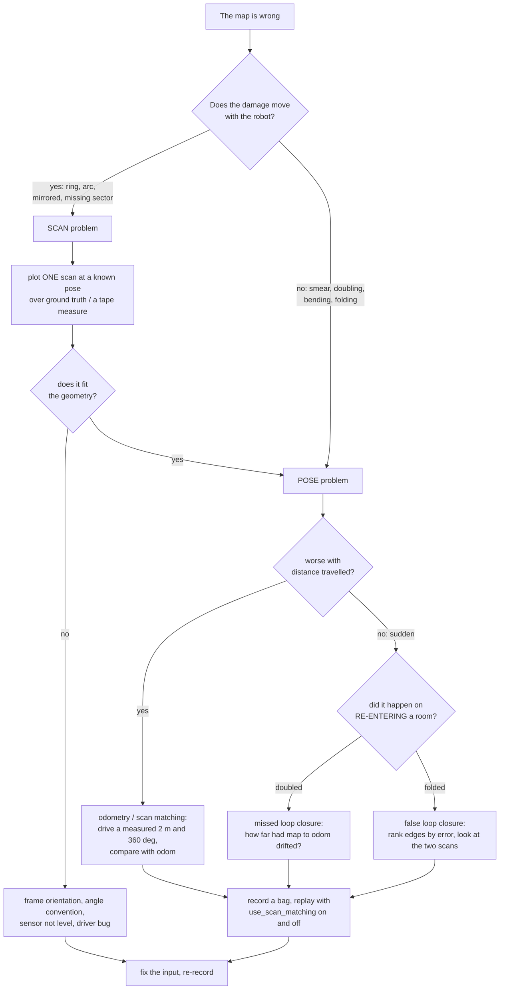

# 11.09 — SLAM troubleshooting — when maps smear, double or drift

<!-- glance:start -->
<!-- generated by tools/build.py from curriculum/syllabus.yaml — edit the syllabus, not this block -->

| | |
|---|---|
| **Track** | Main path |
| **Difficulty** | Intermediate |
| **Time** | 45 min |
| **Hardware** | none |
| **Software** | ros2 |
| **Prerequisites** | [11.07 Map your real room: explore → map → save → localize](11.07-mapping-your-room.md) |
| **Skip if** | You can diagnose a bad map from its appearance. |

<!-- glance:end -->

## What you will learn

- Name the failure from the map's appearance: smeared, doubled, bent, folded, ringed, or shrunken.
- Measure the six inputs SLAM depends on — scan, odometry, TF, frames, clock, motion — before changing any parameter.
- Do the arithmetic that links a small input error to a large map error: heading × range, timestamp skew × speed, rotation per keyframe versus the matcher's search window.
- Record one bag and replay it through many configurations, so every experiment is on identical data.
- Work a real case from symptom to root cause, including one where the LiDAR was measuring the floor.

## Why it matters

Your first real map will be wrong. So will your fifth. The difference between an hour and a week is whether you diagnose or guess, and the temptation to guess is enormous, because slam_toolbox has sixty parameters and the internet has an opinion about every one of them.

Almost none of those parameters will be your problem. In the runs measured for this module, the difference between a 32% map and a 60% map was whether the scan matcher was on at all; and what kept the map stuck at 60% no matter what was tuned turned out to be a sensor pointing 6° below the horizontal, measuring the floor 1.5 m ahead. No amount of `loop_match_minimum_response_fine` would have found either, and every automated input check passed the whole time. This lesson is the method that does: look at the shape of the wrongness, form one hypothesis, measure the input it names, and only then touch a config file.

<!-- prereqs:start -->
## Prerequisites

You need these first:

- [11.07 Map your real room: explore → map → save → localize](11.07-mapping-your-room.md)

### Optional prerequisite links

None.

Check your readiness: `python course.py why 11.09`
<!-- prereqs:end -->

## Concept

### A bad map is a measurement report about your robot

An occupancy grid is built by ray-casting from estimated poses ([11.02](11.02-occupancy-grid-mapping.md)). Every defect in it is therefore a defect in one of two things: **the scans** or **the poses**. And because the two produce visibly different damage, the map tells you which one before you measure anything.

- **Scan problems** are consistent *relative to the robot*: they move with it, appear at the same bearing or the same range in every scan, and look geometric — a ring, an arc, a mirrored room, a missing sector.
- **Pose problems** are consistent *relative to the world*: they accumulate with distance travelled, appear as smear, doubling, bending and folding, and get worse the further you are from where you started.

That single distinction resolves most cases in thirty seconds of looking.

### Fix inputs before parameters, and make it reproducible first

Two habits, in this order:

1. **Never tune on a live robot.** Record a bag of one run, then replay it as many times as you like. A parameter comparison on two different drives compares two different drives.
2. **Never change a parameter you cannot justify with a measurement.** "I raised the loop search distance" is only a fix if you first measured that the drift exceeded it.

> [!TIP]
> **Ask your teacher:** "I have a map where the corridor came out 1.5 m too short and everything else looks fine. Ask me the three questions you would ask, one at a time, and tell me what each answer rules out."

## Technical explanation

### Level 1 — The catalogue: what the map's appearance means

| What you see | What it is | First thing to measure |
|---|---|---|
| **Thick, fuzzy walls** (3–5 cells instead of 2) | small pose noise between keyframes | scan rate vs. speed; odometry noise |
| **Doubled walls**, two parallel copies 20–50 cm apart | the robot re-entered an area with drift and no loop closure fired | how far `map → odom` had moved; `loop_search_maximum_distance` |
| **A whole second copy of a room**, rotated | the same, but the drift was large | as above, plus the pose-graph markers at the moment of re-entry |
| **Bent or curved corridor** that is straight in reality | accumulating heading error; scan matcher not correcting it | heading gain (drive a measured 360°); is scan matching on? |
| **Corridor the wrong length** | degenerate scan matching along a featureless axis | features in the corridor; odometry calibration |
| **The map folds; two rooms merge** | a *false* loop closure | the pose graph edges near the fold; are two places identical? |
| **A ring or arc at a constant distance around the robot** | the LiDAR is measuring something attached to the robot, or it is not level | the `base_footprint → laser` transform, and the robot's pitch/roll |
| **Everything is mirrored** | the scan's angle convention or the laser frame's orientation | `angle_min`, `angle_increment` sign, the static transform's roll |
| **A phantom room beyond a wall** | a mirror, or glass ([11.07](11.07-mapping-your-room.md)) | walk over and look at the wall |
| **Free space outside the building** | rays cast from poses that were outside the building | `compare_maps.py`'s explored area versus the real floor area |
| **Nothing at all** | inputs missing: topic, QoS, TF, lifecycle state | `ros2 topic hz`, `ros2 lifecycle get`, `tf2_echo` |

### Level 2 — The six inputs, and how to measure each

Everything slam_toolbox consumes, with the one command that checks it. [`code/ros2/check_slam_inputs.py`](code/ros2/check_slam_inputs.py) runs all of them at once and applies the thresholds below.

| Input | Check | Failure looks like |
|---|---|---|
| **Scans arrive** | `ros2 topic hz /scan` | no map at all |
| **Exactly one publisher** | `ros2 topic info /scan --verbose` → *Publisher count* | silent corruption: two simulators or two drivers interleaving scans |
| **The scan is sane** | `ros2 topic echo /scan --once`: `range_min/max`, `angle_min`, zeros vs `inf` | obstacles on the robot (zeros), missing sectors, mirrored maps |
| **Odometry is smooth** | `ros2 topic hz /odom`; plot x,y | a jump in `odom` breaks every match after it |
| **TF resolves at the scan's stamp** | `ros2 run tf2_ros tf2_echo odom base_footprint`, `... base_footprint laser` | no map, or a map built at the wrong sensor offset |
| **One clock** | timestamp age (the script prints it) | "message filter dropping message"; nothing works |

Plus the one nobody checks: **is the sensor level?** A 2D LiDAR assumes its scan plane is horizontal. Measure the robot's pitch and roll with the IMU ([07.06](../07-sensors/07.06-imu-in-ros2.md)) on a flat floor, or in simulation read the model's true orientation.

### Level 3 — The arithmetic that turns small errors into big ones

**Heading error × range.** A point at range $r$ observed with a heading error $\delta\theta$ lands $r\sin\delta\theta$ from where it belongs.

$$\Delta = r \sin \delta\theta$$

At $r = 4$ m, a 1° error is 7 cm — one and a half cells, i.e. a fuzzy wall. A 5° error is 35 cm — a doubled wall. A 20° error is 1.37 m — a second copy of the room. This is why heading is the quantity to calibrate first ([09.05](../09-odometry/09.05-calibrating-odometry.md)) and why [11.03](11.03-the-slam-problem.md) insists on logging heading error, not just position error.

**Timestamp skew × speed.** If the scan's timestamp is off by $\delta t$, the pose used to place it is the pose $\delta t$ earlier or later:

$$\Delta x = v\,\delta t, \qquad \Delta\theta = \omega\,\delta t$$

At 0.15 m/s and 0.3 rad/s, a 50 ms skew is 0.75 cm and 0.86° — invisible. At 0.5 m/s and 1.5 rad/s, a 200 ms skew (a busy USB bus, a driver that stamps on receipt rather than on capture) is 10 cm and 17°, which is a ruined map. Slow robots forgive timing sins; fast ones do not.

**Rotation per keyframe versus the search window.** slam_toolbox creates a node when `minimum_travel_heading` (0.3 rad) *and* `minimum_time_interval` (0.5 s) have both passed, so during a turn at rate $\omega$:

$$\Delta\theta_{\text{keyframe}} \approx \max(0.3,\ 0.5\,\omega)\ \text{rad}$$

and the correlative matcher searches $\pm$ `coarse_search_angle_offset` = 0.349 rad = 20°. At $\omega = 0.3$ rad/s that is 17.2°, inside the window. At $\omega = 1.0$ rad/s it is 0.5 rad = **28.6°**, outside it: the true rotation is not in the search space, so the matcher returns the best wrong answer. Turn rate is a SLAM parameter that lives in your controller.

**Numerical example — the corridor that shrank.** An 8 m corridor came out 6.5 m: a scale error of $6.5/8 = 0.81$. Scan matching along a featureless corridor observes nothing, so the length came from wheel odometry, which under-reported by 19%. On a differential drive that is an effective-wheel-radius error: $r_{\text{eff}} = 0.045 \times 0.81 = 0.0365$ m instead of 0.045 — a 19% error, far too large for manufacturing tolerance, so suspect a wrong `gear_ratio` or `encoder_cpr_motor` in `labs/config/karmel.yaml` (the 205 RPM motor is 1:56, the 333 RPM one is 1:30 — mixing them up gives a factor of 1.87).

### Level 3b — Worked case: the map has a ring around the robot

This one was found while writing this module, in the course's own simulator. It was diagnosed, fixed and verified **in this repository** — the fix is in the copy of `labs/` you are reading, and the evidence is in [`labs/TESTED.md`](../labs/TESTED.md) §3.1. So you are not going to reproduce the symptom by accident; exercise 11.09-E4 puts the defect back on purpose so that you can. Follow it step by step anyway, because the method matters far more than the answer.

**Symptom.** Maps of the simulated apartment scored 54–60% "wall accuracy" ([11.06](11.06-slam-toolbox-simulation.md)) no matter what was changed: slower driving, more loop closures, different parameters. The living room near the start was crisp; everything further away smeared. Free space was painted several metres outside the building.

**Step 1 — is it the scans or the poses?** Take a single scan, from the very first second, with the robot stationary at a known spawn pose, and plot it over the ground-truth map. If the scan matches, the problem is poses; if it does not, the problem is scans. (In a bag: `rosbag2_py` or `ros2 bag play` plus `ros2 topic echo`.)

**Step 2 — read the residual.** Most of the scan landed exactly on the walls: the west wall at $x = -2.95$, the bookshelf's north face at $y = -2.15$, the TV stand's east face at $x = -2.55$ — all within one cell. But every beam within about ±50° of straight ahead stopped **0.39 m short** of the wall it should have hit, on a smooth arc.

**Step 3 — is the arc a real object?** Fit it. Ranges were 1.56 m at 0°, 1.59 m at ±7°, 1.69 m at ±21°, 2.10 m at ±42° — which is $r(\theta) = 1.56/\cos\theta$ to within a centimetre. That is the signature of a **flat plane perpendicular to the beam at 0°**, 1.56 m ahead. Nothing in the world file is there.

**Step 4 — what plane is always 1.56 m ahead?** The floor, if the sensor is tilted down. A LiDAR at height $h$ tilted down by a pitch $p$ hits the floor at

$$r(\theta) = \frac{h}{p \cos\theta} \quad (\text{small } p)$$

With $h = 0.165$ m (karmel's `base_footprint → laser`) and $r(0) = 1.56$ m, $p = 0.165/1.56 = 0.106$ rad = **6.1°**.

**Step 5 — confirm independently.** Read the robot's true orientation from the simulator: the quaternion gave a pitch of **5.6°** nose-down, with roll ≈ 0. Two independent measurements, one from the scan geometry and one from the physics engine, agreeing within half a degree.

**Step 6 — why is it pitched?** karmel's ball caster was *behind* the drive wheels (`caster_offset_x_m: -0.10` in `labs/config/karmel.yaml`), but the centre of mass is marginally *in front* of the axle — 1.7 mm, computed from the rendered URDF, because the camera and the front range sensor are ahead of it. The support polygon therefore did not cover the centre of mass, and the chassis tipped forward until its front edge touched the floor: the ground clearance is 12 mm and the chassis half-length is 125 mm, and $\arctan(0.012/0.125) = 5.5°$. The numbers close. This is [FP.07](../optional-foundations/physics/FP.07-center-of-mass-stability.md)'s subject arriving as a SLAM bug.

**Why it destroys the map.** The floor ring moves *with* the robot, so it is a large, high-contrast feature that translates exactly with the sensor. The correlative scan matcher sees it in every scan and it pulls every match toward "the robot did not move". Worse, the ring occupies the forward sector — precisely the direction the robot is travelling, where you need the real geometry most — and the chassis edge dragging on the floor adds wheel slip on top.

**Step 7 — fix it and re-measure.** Moving the caster in front of the wheels (`caster_offset_x_m: 0.10` in `labs/config/karmel.yaml`, and the copy in `karmel_description/config/robot.yaml`) puts the support polygon under the centre of mass. That is the value shipped in this repository today. Re-running the identical tour:

| | with the pitch (`-0.10`) | caster in front (`0.10`) |
|---|---|---|
| chassis pitch, from `/imu` orientation | +5.581° nose-down | **−0.000°** |
| `/imu` `linear_acceleration.x`, stationary | −1.0073 m/s² | **+0.0719 m/s²** |
| first scan, forward range at 0° | 1.551 m (the floor) | **1.947 m** (the wall, which is 1.95 m away) |
| first scan, range at 45° | 2.20 m (the floor) | **3.48 m** |
| first scan scored against ground truth | 73.6% within 10 cm | **100%**, median error 2.6 cm |
| map's explored area (real floor: 26.8 m²) | 34.1 m² | **24.2 m²** |

`karmel_description/test/test_description.py::test_centre_of_mass_is_inside_the_support_polygon` now computes the centre of mass from the rendered URDF and fails if it leaves the support polygon, so moving a sensor forward next year cannot quietly bring the pitch back. A regression test is the only part of a diagnosis that survives you.

**One residual, measured and accepted.** The centre of mass is only 1.7 mm ahead of the axle, and the caster is now the *front* contact — so nothing supports the robot behind the wheels. A full-rate acceleration step (`/cmd_vel` 0.5 m/s against the 1.0 m/s² limit) rocks the chassis to about **5.6° nose-UP** for the duration of the acceleration, then it settles level; braking causes no rocking at all. Nose-up is benign for a 2D LiDAR in a room with full-height walls — the beam still lands on wall, 0.19 m higher at 1.95 m — where nose-down was not, because it landed on the floor. "We swapped one 5.6° tilt for another" is the right thing to notice and the wrong thing to conclude: which direction a tilt points decides whether it destroys the map.

A single stationary scan going from 74% to 100% is the cleanest possible confirmation: the sensor now measures the room instead of the floor, and the map's explored area drops below the building's real floor area, which is what a sane map does.

**And the map is still not good.** Best-aligned wall accuracy after the fix was 55.8% — no better than before. That is not a failed diagnosis; it is a *second* problem, revealed by removing the first. With the sensor honest, the remaining error is wheel-odometry drift over a tour with six in-place spins, which slam_toolbox only partly corrects. Resist the urge to read one fix as "the" fix: a real robot has several faults at once, and the discipline is to confirm each one by the measurement that names it — here, the forward range and the explored area — rather than by whether the final score went up.

**What the method gave you.** Seven steps, one plot, two numbers, and a root cause in a mechanical property nobody would have guessed from a parameter file. Guessing at `correlation_search_space_dimension` would have taken a week.

**And the meta-lesson.** Every check in `check_slam_inputs.py` passed throughout. The scan rate was right, the clock was right, the TF chain was complete, `base_footprint → laser` reported exactly (0, 0, 0.165) m with zero yaw — because the URDF *was* right. The robot was tilted, and no transform in the system describes that. Automated checks find the failures you thought of; a single scan plotted against known geometry finds the ones you did not.

### Level 4 — The bag method: record once, replay many

Every experiment must be on identical data. Record what SLAM consumes, and nothing else:

```bash
# terminal 1: robot (simulated or real), NO slam_toolbox running
ros2 launch karmel_bringup robot.launch.py sim:=true world:=apartment headless:=true

# terminal 2: record the four inputs
ros2 bag record -o ~/bags/tour /clock /scan /tf /tf_static /odom

# terminal 3: drive the tour (or teleop)
python3 11-slam/code/ros2/explore_apartment.py --plan apartment --ros-args -p use_sim_time:=true
```

Then, with the robot shut down, replay it through whatever configuration you want to test:

```bash
ros2 launch karmel_bringup slam.launch.py use_sim_time:=true \
     slam_params_file:=/path/to/variant.yaml
ros2 bag play ~/bags/tour --clock --rate 1.0
ros2 run nav2_map_server map_saver_cli -f ~/maps/variant
python 11-slam/code/compare_maps.py ~/maps/variant.yaml \
     --truth labs/ros2_ws/src/karmel_bringup/maps/apartment.yaml --map-origin -1.5 -0.5
```

Four traps, all of which have cost people days:

1. **`--clock`**, or nothing that uses `use_sim_time` will ever get a clock. If your bag already contains `/clock` (recorded from Gazebo), playing it republishes that clock — do not also run the simulator.
2. **`--rate`**. A bag recorded from a simulation running at 0.4× real time contains, say, 210 s of simulated time spread over 500 s of wall time. Playing it at `--rate 3` gives slam_toolbox less wall-clock time per scan than it had live, and **online async mode silently drops the scans it cannot keep up with** — the map gets worse for a reason that has nothing to do with the parameter you were testing. Verify by counting pose-graph nodes: if the node count changes between runs of the *same* parameters at different rates, you are measuring your CPU.
3. **Leftover processes.** An orphaned `gz sim` or slam_toolbox from a previous attempt still publishes. `ros2 topic info /scan --verbose` must show exactly one publisher, and `ros2 node list` must show exactly one `/slam_toolbox`.
4. **Record `/tf_static`**, or the `base_footprint → laser` transform will be missing and nothing will work. It is latched, so it is recorded once and replayed once — which also means a bag player started *after* the subscriber is fine, but restarting the subscriber mid-replay is not.

## Diagram



```text
 The floor-ring signature: r(theta) = h / (p cos theta)

   side view                          top view (what the map shows)
        laser                              ╭─────────────╮
     ╔═══●═══╗   h = 0.165 m              │   ╭───────╮  │
     ║ robot ║╲   p = 6 deg               │  ╭╯ ring  ╰╮ │   the arc is 1.56 m
   ══╩═══════╩══╲═══════════════          │  │   ●robot│ │   ahead and moves
      floor      ╲                        │  ╰╮       ╭╯ │   WITH the robot
                  ● 1.56 m ahead          │   ╰───────╯  │
                                          ╰─────────────╯
   r(0)  = 0.165 / 0.106        = 1.56 m
   r(45) = 0.165 / (0.106*0.707)= 2.21 m      <- matches the measured 2.20 m
```

## Code

Two tools, both already used in [11.06](11.06-slam-toolbox-simulation.md) and [11.07](11.07-mapping-your-room.md), plus the replay recipe above.

[`code/ros2/check_slam_inputs.py`](code/ros2/check_slam_inputs.py) runs every input check in one pass and returns a non-zero exit code if anything fails, so it belongs in your start-up script:

Run it **while the robot is driving** — the "motion per scan" line reports the fastest motion it actually saw, so a stationary audit always reports 0.0 cm and 0.0°:

```bash
python3 11-slam/code/ros2/check_slam_inputs.py --seconds 15 --ros-args -p use_sim_time:=true
```

```text
  [PASS] scan rate                    10.0 Hz on the message clock,   7.1 Hz on the wall clock (real-time factor 0.71)
  [PASS] scan timestamp age          +0.025 s median — this node and the scan publisher agree on the clock
  [PASS] no-return marker            0 inf, 0 nan, no zeros — correct
  [PASS] TF base_footprint -> laser  (+0.000, +0.000, +0.165) m, yaw +0.0 deg
  [PASS] motion per scan             at the fastest moment seen (0.15 m/s, 17 deg/s) consecutive scans are 1.5 cm and 1.7 deg apart (slam_toolbox searches +-20 deg)
```

Note what it *cannot* see: it reads `base_footprint → laser` from TF, which is the URDF's idea of where the sensor is. If the whole robot is pitched, that transform is still (0, 0, 0.165) and still says `yaw +0.0 deg`. **A static transform is a claim, not a measurement.** Checking it against reality needs the IMU, a spirit level, or the simulator's ground truth.

[`code/compare_maps.py`](code/compare_maps.py) turns "does this look better?" into a number, which is what makes a parameter sweep possible:

```bash
python 11-slam/code/compare_maps.py ~/maps/variant.yaml \
    --truth labs/ros2_ws/src/karmel_bringup/maps/apartment.yaml --map-origin -1.5 -0.5
```

Read its **explored area** first. Free cells only appear where a ray passed, so claiming more free floor than the building has is proof that rays were cast from poses outside the building — a pose failure, stated as a number, before you have looked at a single wall.

## Exercise

All exercises need hardware: none (simulation). With [`robot-base`](../HARDWARE.md) and [`lidar`](../HARDWARE.md) you can run E1, E3 and E5 on the real robot instead, which is more instructive.

### Exercise 11.09-E1 — Diagnose six maps `[debugging]`

For each description, name the failure, name the subsystem, and give the **one measurement** you would make first.

(a) Every wall is 4–5 cells thick and slightly wavy; the map is otherwise correct.
(b) The flat is perfect except that the hallway where the robot finished shows two doors 45 cm apart.
(c) The 7 m corridor came out 5.6 m; all rooms are the right size.
(d) There is a smooth arc of "wall" 1.2 m in front of the robot in every part of the map.
(e) The kitchen has been rotated 90° and superimposed on the bedroom.
(f) `/map` exists but is entirely grey (unknown), and `ros2 topic hz /scan` shows 10 Hz.

### Exercise 11.09-E2 — Record once, replay three times `[simulation]`

Record a bag of the apartment tour as in Level 4. Then replay it three times, saving and scoring each map:

1. the stock `slam_toolbox_online_async.yaml`;
2. a copy with `use_scan_matching: false`;
3. a copy with `do_loop_closing: false`.

Report the four `compare_maps.py` numbers for each, plus the pose-graph node count. **Predict first:** which of (2) and (3) hurts more on this tour, and why?

### Exercise 11.09-E3 — The arithmetic `[numerical]`

(a) Your heading is off by 4°. How far is a wall at 5 m displaced? How many 5 cm cells is that?
(b) Your driver stamps scans on *receipt* instead of on capture, adding 120 ms. At 0.4 m/s and 1.0 rad/s, what pose error does that cause? Which of the two matters more, and why?
(c) You turn at 1.2 rad/s. With `minimum_travel_heading: 0.3` and `minimum_time_interval: 0.5`, how much rotation is there between keyframes, and is it inside `coarse_search_angle_offset` = 0.349 rad?
(d) A 6 m room maps as 5.4 m. If this is an odometry scale error, what effective wheel radius does it imply, given a nominal 0.045 m?

### Exercise 11.09-E4 — Put the ring back, then take it away `[debugging]`

The defect in Level 3b is fixed in this repository, so there is no ring in your bag from E2. Break it on purpose, measure it, and restore it — which is the only honest way to learn a failure whose fix already shipped.

**Step A — the healthy baseline.** From the E2 bag, extract the **first** scan (the robot is stationary at the spawn pose (−1.5, −0.5)) and plot its endpoints, in world coordinates, over `karmel_bringup/maps/apartment.yaml`. Record the range at 0° and the number of beams whose endpoint is more than 10 cm from any occupied cell in the truth map.

**Step B — reintroduce the defect.** Set `chassis.caster_offset_x_m` back to `-0.10` in **both** `labs/config/karmel.yaml` and `labs/ros2_ws/src/karmel_description/config/robot.yaml` (`python3 labs/ros2_ws/tools/check_config_sync.py` tells you if you missed one). Rebuild the workspace, relaunch, record a fresh bag of a stationary robot, and repeat Step A. Then:

(a) Identify every beam whose endpoint is more than 10 cm from any occupied cell in the truth map. What bearings are they at?
(b) Fit $r(\theta) = r_0/\cos\theta$ to them and report $r_0$.
(c) Using $h = 0.165$ m, compute the implied pitch. Confirm it against the simulator's ground truth (`gz model -m karmel -p`) and against the stationary `/imu` `linear_acceleration.x`, which should read $-g\sin p + b$.
(d) Name one check in `check_slam_inputs.py` that would *not* have caught this, and say why.

**Step C — restore and prove it.** `git checkout -- labs/config/karmel.yaml labs/ros2_ws/src/karmel_description/config/robot.yaml`, rebuild, and confirm that `colcon test` passes again — in particular `test_centre_of_mass_is_inside_the_support_polygon`, which is the regression guard this diagnosis left behind. Write one sentence on why that test, and not a tuned SLAM parameter, is the durable output of Level 3b.

### Exercise 11.09-E5 — Break it on purpose `[predict]`

For each sabotage, **predict** the map's appearance before running it, then run it in simulation and check:
(a) Launch slam_toolbox with `use_sim_time:=false` while everything else uses simulated time.
(b) Change `base_frame` to `base_link` instead of `base_footprint`.
(c) Set `max_laser_range: 2.0`.
(d) Start a second `robot.launch.py` in another terminal, in the same `ROS_DOMAIN_ID`, and map with both running.

### Exercise 11.09-E6 — A checklist you will actually use `[design]`

Write a one-page pre-flight checklist for your own robot: the commands, the expected outputs with tolerances, and the decision at each step ("if X, then Y"). It must fit on one screen and must not contain the words "try" or "maybe". Test it by handing it to `check_slam_inputs.py`'s output and confirming every line is covered.

## Expected result

- **11.09-E1:** (a) Pose *noise*, not drift — scan matching working but each match slightly off. Measure scan rate against driving speed (`check_slam_inputs.py` while moving); slow down first. (b) A **missed loop closure**. Measure how far `map → odom` had moved when the robot re-entered the hallway and compare with `loop_search_maximum_distance` (3.0 m). (c) **Degenerate scan matching** in a featureless corridor; the length came from odometry. Measure odometry over a tape-measured 5 m straight line. (d) A **scan** problem, not a pose problem: it moves with the robot. Measure the robot's true pitch and roll, and plot one scan against known geometry. (e) A **false loop closure**. Rank the pose-graph edges by $e^\top\Omega e$ after optimization ([11.05](11.05-pose-graphs-loop-closure.md)) and look at the two scans of the worst edge. (f) Scans arrive but nothing is mapped: check `ros2 lifecycle get /slam_toolbox` (it must be `active`) and then the TF chain at the scan's timestamp.
- **11.09-E2:** Measured on the apartment tour: stock **59.5%** wall accuracy / 47.1% coverage / 77.3% free purity / **34.1 m²** explored, with about **54** pose-graph nodes. Turning scan matching off leaves only wheel odometry; an occupancy grid rendered offline from the same recorded scans at the raw `/odom` poses scores **32.3%** / 17.5% / 76.5% / **59.3 m²**. The explored area nearly doubling, to more than twice the building's real floor, is the clearest single indicator that the poses are wrong — you can read it before looking at a single wall. Turning loop closing off costs much less *on this particular tour*, because its three revisits are all within one room and the drift between them is small; on a route that circles the whole flat before returning it becomes the larger loss. If your node counts differ between two runs of the *same* parameters, you are replaying at a rate your CPU cannot sustain (trap 2 above).
- **11.09-E3:** (a) $5\sin 4° = 0.349$ m = **7 cells**. (b) $0.4 \times 0.12 = 4.8$ cm and $1.0 \times 0.12 = 0.12$ rad = **6.9°**. The angle matters more: at a 4 m range it displaces a wall by $4\sin 6.9° = 48$ cm, ten times the translation error. (c) $\max(0.3,\ 0.5 \times 1.2) = 0.6$ rad = **34.4°**, which is well outside the ±20° coarse search — the matcher cannot find the true rotation. (d) $0.045 \times 5.4/6.0 = 0.0405$ m, a 10% error: too large for tolerance, so look for a wrong `gear_ratio`, a wrong `encoder_cpr_motor`, or systematic slip.
- **11.09-E4:** **Step A**, on the shipped robot: the forward range is **1.947 m** against a wall 1.95 m away, and essentially no beam is an outlier — the whole scan scores 100% within 10 cm, median error 2.6 cm, which is the half-cell rasterization limit. **Step B**, with `caster_offset_x_m: -0.10` put back: (a) the outliers are the beams within roughly ±50° of straight ahead — 95 of 360 in the measured scan — all about 0.35–0.42 m short of the wall behind them. (b) $r_0 \approx 1.55$ m (measured 1.5514 at 0°, 2.10 at 42°, and $1.5514/\cos 42° = 2.09$). (c) $p = 0.165/1.5514 = 0.106$ rad = **6.1°** from the scan geometry; `gz model -m karmel -p` gives a true pitch of **5.581°** and the stationary IMU gives $a_x = -1.0073$ m/s², i.e. $-9.81\sin(5.58°) + 0.05 = -0.90$ m/s² to within the noise and the bias. Three independent instruments, one geometry, agreement to half a degree. (d) The `TF base_footprint -> laser` check: it reports (0, 0, 0.165) m and yaw 0 and passes, because the URDF is correct — the *robot* is tilted, not the mount. A static transform describes where the sensor is bolted, not which way it is pointing in the world. **Step C:** with the caster back at `+0.10`, `colcon test` is 69 tests, 0 failures; with it at `-0.10`, `test_centre_of_mass_is_inside_the_support_polygon` fails with `centre of mass x=+0.0017 m is outside the support polygon [-0.100, +0.000]`. The test is the durable output because it fails on the *cause* — a centre of mass outside the support polygon — without needing a map, a tour or a human looking at a picture.
- **11.09-E5:** (a) Nothing is mapped at all; slam_toolbox's TF lookups fail because the scan's simulated timestamp (seconds since the simulation started) is decades away from wall-clock time. `check_slam_inputs.py` prints a timestamp age of about $1.79 \times 10^{9}$ s. (b) The map builds, but every scan is placed 4.5 cm too low in z and — more importantly — the odometry TF that `diff_drive_controller` publishes is `odom → base_footprint`, so `odom → base_link` may not exist at all and you get no map. If it does exist, the sensor offset is wrong by the `base_link` height. (c) Only geometry within 2 m of the robot is mapped: the map becomes a narrow corridor of explored space following the path, rooms are never closed, and loop closures have far less to match on. (d) Two simulators publish into one `/scan`: scans from two different robot poses interleave, every match is between two unrelated views, and the map is unrecognizable — with no error message anywhere. `ros2 topic info /scan --verbose` shows *Publisher count: 2*.
- **11.09-E6:** A good checklist has at most eight lines, each with a command, a number and a branch. If yours needs a paragraph, the check is not sharp enough.

## Troubleshooting

### Symptom: I changed a parameter and the map got better, but I do not know why

1. You may have measured your CPU. Re-run both configurations twice each, from a bag, at the same `--rate`, and compare the pose-graph node counts. If the node count varies between identical runs, the differences you saw are scan dropping, not the parameter.
2. Score both maps with `compare_maps.py` rather than eyeballing them. Two maps that look equally plausible can be 30 points apart.
3. Change one thing at a time. A diff of two YAML files with five differences proves nothing.

### Symptom: the same bag gives a different map every time

1. That is expected to a small degree in async mode — which scans get dropped depends on timing.
2. If it is a *large* difference, your machine is overloaded. Lower `--rate`, close other simulators, and check `ps` for orphaned processes.
3. For a deterministic comparison, use the synchronous node (`sync_slam_toolbox_node`) or slam_toolbox's offline mode, which processes every scan.

### Symptom: nothing is wrong with any input and the map is still bad

1. Re-read the map's appearance against the Level 1 catalogue. "Nothing is wrong" usually means a check is missing, not that all checks passed.
2. The commonest missing check is the one a static transform cannot make: **is the sensor actually level, and actually where the URDF says?** Put the robot on a flat floor, read the IMU's pitch and roll ([07.06](../07-sensors/07.06-imu-in-ros2.md)), and measure the LiDAR height with a ruler.
3. The second commonest is the environment: a mirror, a glass door, a room that is geometrically identical to another ([11.07](11.07-mapping-your-room.md)).
4. The third is that your odometry is fine *on the bench* and terrible *on the rug*. Repeat the calibration on the surface you actually map ([09.05](../09-odometry/09.05-calibrating-odometry.md)).

### Symptom: "Message Filter dropping message: frame 'laser' at time … for reason 'discarding message because the queue is full'"

1. This is a TF problem, always. slam_toolbox asked for `odom → laser` at the scan's timestamp and did not get it within `transform_timeout`.
2. Check that the TF chain is complete *and* that its timestamps bracket the scan's: `ros2 run tf2_ros tf2_monitor`.
3. In a slow simulation, raise `transform_timeout` (karmel uses 0.5 s instead of the default 0.2 s). On a real robot, a large value hides a real problem — find the lag instead.
4. Check `use_sim_time` everywhere. A single node on the wrong clock produces exactly this message.

### Symptom: the map is fine in RViz but the saved `.pgm` is worse

1. The grid is re-rendered from the pose graph every `map_update_interval` (2.0 s in karmel's config). `map_saver_cli` grabs the last published `/map`, which can be up to that old.
2. Wait a few seconds after the last loop closure before saving, and check `ros2 topic hz /map` to see when the next update lands.
3. If the saved map is *much* worse, confirm you saved the map you think: `map_saver_cli` overwrites silently, and a stale file from an earlier run looks exactly like a fresh one.

## Common mistakes

- **Tuning before measuring.** Sixty parameters, and your bug is almost never in them.
- **Comparing two different drives.** Record a bag; replay it.
- **Replaying faster than your CPU can process.** You then measure scan dropping, not the parameter.
- **Believing a static transform.** It says where the sensor is *bolted*, not where it is *pointing*.
- **Forgetting `--clock` or `/tf_static` when replaying.** Both produce "nothing works", with different error messages.
- **Leaving an orphaned simulator or driver running.** Two publishers on `/scan` corrupt everything silently. Check the publisher count.
- **Judging a map by eye only.** Score it, so that "better" is a number.
- **Assuming the environment is the one in your head.** Walk over and look at the wall the map is confused about.

## Knowledge check

1. A map defect moves with the robot. What class of problem is it, and what does that rule out?
   <details><summary>Answer</summary>

   A **scan** problem: the sensor is reporting something wrong in its own frame — a ring, a mirrored sweep, a missing sector, an obstacle at range 0. It rules out pose estimation, drift, scan matching and loop closure, all of which produce damage that is fixed in the *world* and grows with distance travelled from the start.
   </details>

2. Your heading is off by 3°. A wall 6 m away is displaced by how much, in centimetres and in 5 cm cells?
   <details><summary>Answer</summary>

   $6\sin 3° = 0.314$ m = 31 cm = **about 6 cells**. Same error at 1 m: 5 cm, one cell. This is why far walls smear first and why heading calibration comes before anything else.
   </details>

3. Why is replaying a bag at `--rate 3` a bad way to compare two slam_toolbox configurations?
   <details><summary>Answer</summary>

   Online async mode drops scans it cannot process in time. At a higher replay rate it drops more, so the two runs see different data and you are measuring CPU load rather than the parameter. Symptom to watch for: the pose-graph node count changes between two runs of the *same* configuration. Replay at a rate your machine sustains, or use the synchronous/offline node.
   </details>

4. `check_slam_inputs.py` reports `TF base_footprint -> laser (0.000, 0.000, 0.165) m, yaw +0.0 deg` and passes. Name a sensor-geometry failure this cannot detect.
   <details><summary>Answer</summary>

   Any failure where the *robot* is not level: a pitched or rolled chassis, a rug, a loose caster, an overloaded rear deck. TF reports the URDF's mounting, which is a claim about the robot's own frame. If the whole robot is pitched 6° nose-down, that transform is still exactly right and the scan plane is still pointing at the floor 1.5 m ahead. Detecting it needs the IMU, a level, or ground truth.
   </details>

5. Predict: you set `max_laser_range` to half the room's size. What happens to the map, and to loop closure?
   <details><summary>Answer</summary>

   The map only ever contains geometry within that radius of the path, so large rooms are never closed and the free space becomes a corridor following the trajectory. Scan matching gets less geometry per match and becomes less certain; loop closure suffers most, because a revisit is recognized by overlapping *structure*, and there is now much less of it in each scan.
   </details>

6. Two maps of the same drive: one has 40% more "occupied" cells than the other, and claims 30% more explored floor than the building contains. Which is worse, and what is the diagnosis?
   <details><summary>Answer</summary>

   The one claiming more floor than exists. Free cells are painted only by ray-casting from an estimated pose, so free space outside the building means rays were cast from poses outside the building — the pose estimate was badly wrong for part of the run. The extra occupied cells are the same story seen from the other side: walls painted more than once, in more than one place.
   </details>

7. You suspect a false loop closure. What do you measure, and what do you look at?
   <details><summary>Answer</summary>

   Compute $e^\top\Omega e$ per edge on the optimized pose graph and sort ([11.05](11.05-pose-graphs-loop-closure.md)); a consistent graph spreads small errors everywhere, while one bad constraint leaves itself and its neighbours far above the rest. Then look at the *two scans* of the worst edge side by side and ask whether they really are the same place. Two identical doorways and a mirror are the usual culprits.
   </details>

8. Which single number in `compare_maps.py`'s output would you look at first, and why?
   <details><summary>Answer</summary>

   **Explored area** against the real free-floor area. It needs no tolerance choice, no alignment subtleties and no interpretation: a correct map explores at most the real floor. Anything more is proof of a pose failure, and it tells you that immediately, before you start arguing about whether a wall is 5 or 10 cm out.
   </details>

## Practical challenge

**Plant three bugs, hand the robot to yourself a week later, and diagnose them from the map alone.**

Write a script that starts the simulated apartment with one of several sabotages applied at random — for example: `use_sim_time` wrong on one node; `max_laser_range` halved; a 150 ms delay added to the scan timestamps; the scan's `angle_min`/`angle_increment` sign flipped; a second simulator publishing on `/scan`; the robot spawned on a 5° ramp. Record a bag for each, label the bags by number only, and put the key away.

**Acceptance criteria:**

- At least four sabotages, each implemented without editing `labs/ros2_ws` (a relay node, a parameter override, a modified copy of a config file, a launch argument).
- For each bag: the saved map, its `compare_maps.py` scores, and a written diagnosis made **before** looking at the key — the failure class (scan or pose), the specific mechanism, and the measurement that identified it.
- At least three of four diagnosed correctly, with the measurement quoted.
- One case where your first hypothesis was wrong, with an honest note on which measurement ruled it out.
- A final version of your pre-flight checklist (E6) amended with whatever the exercise showed it was missing.

## You can skip this if…

You can look at a bad map and name the failing subsystem before touching a keyboard, you can answer knowledge-check questions 1, 3 and 4 without looking, and you have at least once diagnosed a SLAM failure that turned out to be a sensor or a frame rather than a parameter.

`python course.py skip 11.09 --reason "I can diagnose SLAM failures systematically from the map and the inputs"`

## Go deeper

- SLAM Toolbox README (Jazzy branch): https://github.com/SteveMacenski/slam_toolbox/blob/jazzy/README.md — the parameter reference you will need once you have actually localized the problem.
- Nav2, first-time robot setup guide: https://docs.nav2.org/jazzy/configuration_and_development/first_time_robot_setup_guide/ — the TF, odometry and sensor contract that most "SLAM bugs" violate.
- tf2 troubleshooting: https://docs.ros.org/en/jazzy/Tutorials/Intermediate/Tf2/Debugging-Tf2-Problems.html — `tf2_monitor`, `tf2_echo`, and reading the "message filter dropping message" error properly.
- `rosbag2` documentation: https://docs.ros.org/en/jazzy/Tutorials/Beginner-CLI-Tools/Recording-And-Playing-Back-Data/Recording-And-Playing-Back-Data.html — recording, `--clock`, `--rate`, and the storage formats.
- Cadena et al., *Past, Present, and Future of SLAM* (T-RO 2016): https://arxiv.org/abs/1606.05830 — section on robustness and failure modes, and why wrong data association is the expensive failure.
- Cyrill Stachniss, Mobile Sensing and Robotics 2: https://www.ipb.uni-bonn.de/msr2-2021/index.html — the theory behind every symptom in the catalogue.
- REP-105, Coordinate Frames for Mobile Platforms: https://www.ros.org/reps/rep-0105.html — half of all TF bugs are a disagreement with this document.

## Progress checkpoint

- [ ] I can name a SLAM failure from the map's appearance and say whether it is a scan or a pose problem.
- [ ] I can measure all six inputs before changing any parameter.
- [ ] I can compute how a heading error, a timestamp skew or a turn rate turns into map error.
- [ ] I can record a bag and replay it through several configurations without fooling myself about CPU load.
- [ ] I have diagnosed at least one failure end to end, from symptom to root cause, with measurements.

`python course.py complete 11.09` (exercises done) · `python course.py master 11.09` (challenge done) · `python course.py struggle 11.09 "what was hard"`

Next: [12.01 — The navigation problem](../12-navigation/12.01-the-navigation-problem.md), where the map you just learned to trust becomes something to drive on.
