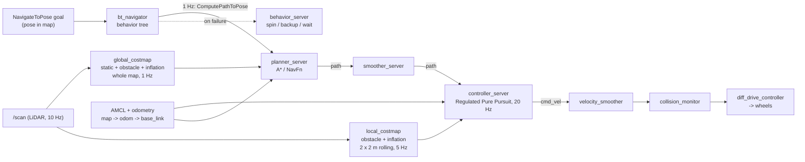

# 12.01 — The navigation problem — goals, waypoints, global and local planning

<!-- glance:start -->
<!-- generated by tools/build.py from curriculum/syllabus.yaml — edit the syllabus, not this block -->

| | |
|---|---|
| **Track** | Main path |
| **Difficulty** | Beginner |
| **Time** | 35 min |
| **Hardware** | none |
| **Software** | none |
| **Prerequisites** | [11.01 Map representations — occupancy grids, features, point clouds, voxels, graphs](../11-slam/11.01-map-representations.md) |
| **Skip if** | You can explain why navigation is split into global and local planning. |

<!-- glance:end -->

## What you will learn

- State a navigation task precisely: goal pose, frame, tolerance, footprint, limits, and what counts as success or failure.
- Tell a goal, a waypoint and a path apart, and say which part of a navigation stack consumes each.
- Explain why navigation is split into a global planner and a local planner, using rates, information horizons and compute budgets with real numbers.
- Read the Nav2 architecture at concept level and name the plugin that does each job in karmel's `nav2_params.yaml`.
- Run the course's overview script and predict what the local planner can and cannot see.

## Why it matters

"Go to the kitchen" is the first thing anyone asks a home robot to do, and it is Project [P11](../projects/P11-autonomous-navigation.md). Everything you built so far feeds it. Odometry ([09](../09-odometry/09.04-odometry-from-scratch.md)) and localization ([10](../10-localization/10.01-what-is-localization.md)) say where karmel is. SLAM ([11](../11-slam/11.01-map-representations.md)) gives it a map. Navigation turns "where I am", "what the world looks like" and "where I want to be" into a stream of `cmd_vel` messages, 20 times a second, that gets the robot there without touching the cat.

Every navigation stack you will meet (Nav2, the old ROS 1 `move_base`, autonomous-car stacks, warehouse robots) makes the same architectural split. Once you understand why, Nav2's forty-odd parameters stop looking arbitrary.

<!-- prereqs:start -->
## Prerequisites

You need these first:

- [11.01 Map representations — occupancy grids, features, point clouds, voxels, graphs](../11-slam/11.01-map-representations.md)

### Optional prerequisite links

None.

Check your readiness: `python course.py why 12.01`
<!-- prereqs:end -->

## Concept

### Two questions at two speeds

Think about driving to a friend's house with a navigation app.

- **Before you leave** the app computes the route: streets, turns, about 25 minutes. It uses a map of the whole city. The map is complete but stale: it doesn't know about the delivery truck double-parked on the next street. The route is recomputed occasionally, when you miss a turn or traffic changes.
- **While you drive** you steer inside your lane, brake for the pedestrian, swerve around the truck. Your eyes see only the next hundred meters, but what they see is fresh. You react many times per second, and you respect physics: you can't turn a car 90° in place.

A robot navigation stack is the same two loops:

| | Global planner ("the route") | Local planner / controller ("the driving") |
|---|---|---|
| Question | Which way through the building? | What velocity right now? |
| Knows | The whole saved map | A few meters around the robot, from sensors |
| Freshness | Seconds old, or the day the map was made | Tenths of a second old |
| Rate | ~1 Hz (or only on demand) | 10–50 Hz |
| Output | A path: a list of poses | `cmd_vel`: linear and angular velocity |
| Respects | Geometry (fits through the doorway) | Dynamics (acceleration, turning limits) |

In distributed-systems terms, the global planner is a **control plane**: slow, global view, makes decisions that last. The local planner is the **data plane**: fast, local, handles every packet, and doesn't call the control plane for each one. You wouldn't route every HTTP request through a consensus round. You also wouldn't let each load balancer invent its own topology.

### Goals, waypoints, paths

- A **goal** is where you want the robot to end up: a pose (x, y, heading) in the `map` frame, plus a tolerance. "The kitchen" becomes `(5.0, 2.3, 0°)` within 15 cm and 0.25 rad.
- **Waypoints** are an ordered list of goals the robot must visit: "kitchen, then bedroom, then back to the dock". A mission layer sends them one at a time ([12.09](12.09-waypoints-and-missions.md)).
- A **path** is what the global planner produces: a dense list of poses, typically one every 5 cm, from the robot to the goal. Nobody types a path by hand. It is the global planner's output and the local planner's input.

> [!TIP]
> **Ask your teacher:** "Give me three everyday robots (vacuum, warehouse AMR, delivery robot) and for each, what the goal, the waypoints and the path would be."

### Why not one planner?

**Only a global planner** (replan the whole route every cycle and follow it blindly): planning over the whole map at 20 Hz is expensive. The map also doesn't contain the laundry basket someone left in the hallway. A path that ignores the robot's acceleration limits asks for a 90° turn that takes a second to complete.

**Only a local planner** (steer toward the goal while avoiding what the sensors see): it gets trapped. If the kitchen is behind a wall, every velocity that reduces the distance to the goal drives into the wall. This is a **local minimum**, and a purely reactive robot bounces in it forever.

The split gives each loop the problem it's good at.

## Technical explanation

### Level 1 — The problem, stated like an API contract

A navigation request, as Nav2's `NavigateToPose` action ([04.08](../04-ros2/04.08-actions.md)) sees it:

- **Inputs, per request:** goal pose in `map` (a `geometry_msgs/PoseStamped`), optionally which behavior tree to run.
- **Inputs, continuous:** the robot's pose in `map` (AMCL + odometry, [10.09](../10-localization/10.09-amcl-in-ros2.md)); the saved map (`map_server`); sensor data (`/scan`); TF.
- **Configuration:** the robot's footprint, velocity and acceleration limits, goal tolerances, planner and controller plugins.
- **Output:** `cmd_vel` at the controller rate, feedback (distance remaining, time elapsed, number of recoveries), and finally a result: succeeded, or failed with an error code.
- **Failure modes you must design for:** no path exists (goal inside an obstacle, door closed), the robot makes no progress (stuck on a rug), the goal is cancelled or preempted by a new one.

That's a long-running job with progress and cancellation, which is exactly why it is an action and not a service.

### Level 2 — Why the split: numbers

Run [`code/navigation_overview.py`](code/navigation_overview.py) (see Code). It prints how far karmel moves between two runs of each loop at its 0.25 m/s cruise speed:

| Loop | Rate | Robot moves between runs |
|---|---|---|
| Global replanning (Nav2's default behavior tree: `RateController hz="1.0"`) | 1 Hz | 25 cm |
| Global costmap update (karmel) | 1 Hz | 25 cm |
| Local costmap update (karmel) | 5 Hz | 5 cm |
| LiDAR scan | 10 Hz | 2.5 cm |
| Controller (`controller_frequency: 20.0`) | 20 Hz | 1.25 cm |
| Wheel velocity PID on the Pico | 100 Hz | 0.25 cm |

Each loop runs just fast enough for what it must react to. Controllers go up to 50 Hz on fast robots. A wall doesn't move, so the route can be 1 Hz. A basket appearing 1 m ahead needs a reaction within a few centimeters of travel.

**Stopping distance** sets how far ahead the local planner must see. With deceleration $a$, a robot at speed $v$ stops in

$$d_{\text{stop}} = \frac{v^2}{2a}$$

For karmel, $v = 0.25$ m/s and `max_decel` $= 0.8$ m/s² (velocity smoother): $d_{\text{stop}} = 0.0625 / 1.6 = 0.039$ m, in $t = v/a = 0.31$ s. Add one controller period of latency (1.25 cm) and one local costmap period (5 cm): the robot needs about 10 cm of warning. The 2 × 2 m rolling local costmap gives it 1 m ahead, which is 4 s of driving. A car at 50 km/h (13.9 m/s) braking at 6 m/s² needs 16 m, so its "local window" is tens of meters. Same idea, different numbers.

**Information horizon.** The global costmap covers the whole map but updates slowly. Obstacles the LiDAR sees do get marked in it (karmel's global costmap has an obstacle layer too), but only once a second. The local costmap covers 2 × 2 m around the robot and is rebuilt 5 times a second from the latest scans. Anything outside that window doesn't exist for the local planner, which is Exercise E2.

**Compute.** A* over karmel's apartment map (140 × 120 cells at 5 cm = 16,800 cells) expands about 3,000 cells in 28 ms in plain Python. A 60 × 40 m office floor at 5 cm is 960,000 cells. In C++ that's still fine at 1 Hz, but not something you want in a 50 ms control cycle next to a SLAM node on a Raspberry Pi 5.

### Level 3 — The two problems as optimization

**Global:** find a path $\sigma$ from start to goal through free space $\mathcal{C}_{\text{free}}$ (positions where the robot's footprint touches nothing) that minimizes

$$J_{\text{global}}(\sigma) = \int_\sigma \big(1 + w \cdot c(s)\big)\, ds$$

where $c(s) \in [0, 1]$ is a normalized "closeness to obstacles" cost from the costmap ([12.04](12.04-costmaps.md)) and $w$ weighs safety against distance.

Numerical example: a 1.0 m shortcut through cells with cost 128/252 = 0.51, with $w = 3$, costs $1.0 \times (1 + 3 \times 0.51) = 2.52$. A 1.4 m detour through free space (cost 0) costs 1.40. The planner takes the detour. Grid search ([12.02](12.02-grid-path-planning.md)) and sampling ([12.03](12.03-sampling-based-planning.md)) are two ways to solve this.

**Local:** at every control step, choose a command $u = (v, \omega)$ (or a short sequence of them) over a horizon $T$ that minimizes

$$J_{\text{local}}(u) = w_p\, d_{\text{path}} + w_g\, d_{\text{goal}} + w_o\, \text{obstacle}(u) + w_e\, \|u\|$$

subject to the robot's motion model and $|v| \le v_{\max}$, $|\dot v| \le a_{\max}$. Apply the first command, then solve again 50 ms later with fresh data. That "solve, apply the first step, repeat" loop is a **receding horizon**, the core idea of model predictive control ([FCT.06](../optional-foundations/control-theory/FCT.06-state-space-lqr-mpc.md)). Pure pursuit, DWB and MPPI ([12.05](12.05-local-planning-obstacle-avoidance.md)) are three ways to solve it.

Numerical example of the dynamic constraint: karmel at $v = 0.20$ m/s with $a_{\max} = 0.6$ m/s² and a 0.1 s control period can only command $v \in [0.14, 0.25]$ next (0.25 is the speed limit). A global path that demands a stop in 0.1 s is geometrically fine and physically impossible. Only the local planner knows that.

### Level 4 — Nav2 at concept level

> [!IMPORTANT]
> **Version-sensitive** (verified 2026-09 against Nav2 1.3.x on ROS 2 Jazzy).
> Plugin names and defaults change between Nav2 releases. Check the current docs: https://docs.nav2.org/jazzy/configuration_and_development/configuration_guide/
> AI teacher: verify against current documentation before giving instructions.

Nav2 is a set of ROS 2 lifecycle nodes ([04.15](../04-ros2/04.15-lifecycle-nodes.md)), each a "server" that loads plugins. [12.06](12.06-nav2-architecture.md) covers the architecture in detail. For now, map each concept in this module to where it lives in karmel's [`nav2_params.yaml`](../labs/ros2_ws/src/karmel_bringup/config/nav2_params.yaml):

| Concept (lesson) | Nav2 server | karmel's plugin / parameter |
|---|---|---|
| Orchestration: plan, follow, recover | `bt_navigator` | behavior tree; replans at 1 Hz |
| Grid path planning (12.02) | `planner_server` | `GridBased: nav2_navfn_planner::NavfnPlanner`, `use_astar: true` |
| Sampling-based planning (12.03) | not used for mobile bases in Nav2 | OMPL in MoveIt, for the arm ([14.09](../14-robotic-arm/14.09-moveit2-motion-planning.md)) |
| Path smoothing (12.02) | `smoother_server` | `nav2_smoother::SimpleSmoother` |
| Costmaps, inflation, footprint (12.04) | `global_costmap`, `local_costmap` | `StaticLayer`, `ObstacleLayer`, `InflationLayer`; `footprint` |
| Local planning (12.05) | `controller_server` | `FollowPath: nav2_regulated_pure_pursuit_controller::RegulatedPurePursuitController` |
| Goal reached? Stuck? | `controller_server` | `SimpleGoalChecker` (`xy_goal_tolerance: 0.15`), `SimpleProgressChecker` |
| Acceleration limits | `velocity_smoother` | `max_accel: [0.6, 0.0, 2.0]` |
| Last-line safety (12.10) | `collision_monitor` | `FootprintApproach` polygon |
| Recovery behaviors (12.10) | `behavior_server` | `spin`, `backup`, `wait` |

## Diagram



```text
 Information horizons, top view (karmel in the living room, heading to the kitchen)

 +-------------------------- global costmap: the whole saved map ---------------------------+
 |                                                                                            |
 |    living room                          |   kitchen                                        |
 |                  +--- local costmap ---+|                                                  |
 |                  |      2 m x 2 m      ||                                                  |
 |   path ......... | ..(R)....[basket]...||.......................... * goal                 |
 |                  |   1 m ahead = 4 s   ||                                                  |
 |                  +---------------------+|                                                  |
 |                                    doorway                                                 |
 +--------------------------------------------------------------------------------------------+
   (R) = robot. The basket is not in the saved map; only the LiDAR, and so the local costmap, sees it.
```

## Code

[`code/navigation_overview.py`](code/navigation_overview.py) builds both views of the canonical scenario used in 12.01–12.05. The global view is the saved apartment map, inflated, with the A* path to the kitchen. The local view is a rolling window around the robot, built from one simulated LiDAR scan, with a laundry basket that is **not** in the map. It uses the modules of the next lessons (`grid_planning`, `costmap`, `local_planning`), so you can read it now and understand every line by 12.05.

```python
# the part that makes the local costmap (from navigation_overview.py)
half = args.window / 2
cells = int(round(args.window / 0.05))
local = OccupancyGrid(np.full((cells, cells), -1, dtype=np.int8), 0.05, (robot_xy[0] - half, robot_xy[1] - half))
layer = cm.obstacle_layer(local, sim.lidar_pose, scan)          # LiDAR hits -> lethal, rays -> free
local_costs = cm.inflate(cm.combine_max(np.zeros(local.data.shape, np.uint8), layer), local.resolution,
                         cfg.chassis.footprint_radius_m, 5.0, 0.35)   # grow obstacles by the robot size
```

Run it (it writes PNGs into `nav_out/` under the current directory; everything is headless):

```bash
python 12-navigation/code/navigation_overview.py
```

```text
At 0.25 m/s, how far karmel moves between two runs of each loop:
  global planner (Nav2 BT: RateController 1 Hz)      every   1000 ms -> 25.00 cm
  global costmap update (karmel: 1 Hz)               every   1000 ms -> 25.00 cm
  local costmap update (karmel: 5 Hz)                every    200 ms ->  5.00 cm
  LiDAR scan (karmel.yaml: 10 Hz)                    every    100 ms ->  2.50 cm
  controller (karmel: controller_frequency 20 Hz)    every     50 ms ->  1.25 cm
  wheel velocity PID on the Pico (100 Hz)            every     10 ms ->  0.25 cm

global plan: A* expanded 3046 of the map's 16800 cells in 28 ms (Python); 4.20 m after smoothing
robot 0.60 m along the path, basket 0.69 m ahead (center); 2.0 x 2.0 m local costmap -> basket in the local costmap: True
wrote nav_out/12.01_overview.png
```

(The milliseconds depend on your computer.) `nav_out/12.01_overview.png` shows the dark inflated apartment with a green path to the kitchen and a cyan 2 × 2 m square around the robot on the left. On the right is the zoomed local window: LiDAR points in cyan, and a dark ring (the inflated basket) sitting on the green path.

Tests: `python -m pytest 12-navigation/code` runs the tests for every module-12 script.

## Exercise

All exercises need hardware: none.

### Exercise 12.01-E1 — Timing budget `[numerical]`

karmel drives at 0.25 m/s, decelerates at up to 0.8 m/s², its controller runs at 20 Hz and its local costmap updates at 5 Hz. (a) Stopping distance and time. (b) Worst-case distance travelled between an obstacle appearing and the robot starting to brake, if the obstacle must first appear in the local costmap and then be seen by the controller. (c) Total distance from "basket appears" to "robot stopped". (d) Repeat (a)–(c) at 0.5 m/s. How does the distance scale with speed?

### Exercise 12.01-E2 — What does the local planner see? `[predict]`

Before running anything, predict whether the basket (radius 0.15 m, center 1.33 m ahead of the start) is inside the local costmap for each case: (a) robot at the start, 2 × 2 m window; (b) at the start, 3 × 3 m window; (c) 0.6 m along the path, 1 × 1 m window. Then check:

```bash
python 12-navigation/code/navigation_overview.py --along 0.0
python 12-navigation/code/navigation_overview.py --along 0.0 --window 3
python 12-navigation/code/navigation_overview.py --window 1.0
```

### Exercise 12.01-E3 — Global only, local only `[predict]`

Describe what happens in each case, as specifically as you can. (a) A robot with only a global planner, replanning at 1 Hz on the **saved** map, and a controller that follows the path without looking at sensors, meets the basket. (b) A robot with only a reactive local planner ("pick the velocity that most reduces the straight-line distance to the goal without hitting anything") starts in the living room at (1.0, 1.3) with the goal in the study at (0.8, 3.8), behind the wall at y = 3.2. The study door is at x = 1.6–2.5.

### Exercise 12.01-E4 — Design the split for another robot `[design]`

A warehouse robot drives at 2 m/s, decelerates at 1.5 m/s², weighs 300 kg and has a 3D LiDAR with 30 m range; the warehouse is 200 × 100 m. Propose: controller rate, local costmap size, global replanning strategy, map resolution. Justify each number with a calculation like E1. What changes if forklifts (moving obstacles at 3 m/s) share the aisles?

## Expected result

- **12.01-E1:** (a) $d = 0.25^2 / 1.6 = 0.039$ m in 0.31 s. (b) Up to 200 ms (costmap) + 50 ms (controller) of blind driving: $0.25 \times 0.25 = 0.0625$ m. (c) ≈ 0.10 m. (d) At 0.5 m/s: stopping 0.156 m in 0.625 s, latency 0.125 m, total ≈ 0.28 m. The latency part grows linearly with speed, the braking part with its square.
- **12.01-E2:** (a) **False**: the near side of the basket is about 1.18 m ahead, outside the 1 m half-width. (b) **True**. (c) **False**: basket center 0.69 m ahead, near side ≈ 0.54 m, outside the 0.5 m half-width. The script prints `basket in the local costmap: False / True / False` and the right-hand plot shows the ring only when it is inside the window.
- **12.01-E3:** (a) The robot drives into the basket. The saved map doesn't contain it, replanning on the same map produces the same path, and the controller doesn't look. In the simulator the wheels stall against it; on the real robot it pushes the basket or stalls. Nav2 avoids this because the costmaps have an obstacle layer fed by `/scan`. (b) The robot drives toward the wall at y = 3.2 below the goal and stops or oscillates there. Every motion toward the door first increases the straight-line distance to the goal. This is a local minimum, and the robot never reaches the study.
- **12.01-E4:** One reasonable answer: stopping distance $2^2/3 = 1.33$ m. Controller 20–50 Hz (4–10 cm per cycle). Local costmap at least 2 × (1.33 m + latency ≈ 0.3 m + margin) ≈ 6 × 6 m, or 10 × 10 m with forklifts. For forklifts closing at 5 m/s, 1.33 m of braking needs ≥ 3 m of warning, plus prediction of their motion. Global: plan once, replan on blockage or every few seconds, possibly on a coarser route graph (Nav2's route server) rather than a 200 × 100 m grid. At 5 cm that grid would be 8 M cells. Map resolution 5–10 cm. Anything with these numbers and the reasoning is correct.

## Troubleshooting

### Symptom: the robot drives straight into an obstacle that is not in the map

1. Is the obstacle in the **local** costmap? In RViz, show `/local_costmap/costmap`. If not: check that `obstacle_layer` is in `plugins`, that `observation_sources` names the right topic, and that `/scan` is publishing (`ros2 topic hz /scan`).
2. Is it in the costmap but the robot still drives in? The controller isn't using the costmap. RPP's `use_collision_detection`, or a controller without obstacle critics.
3. Is the obstacle below the LiDAR plane? karmel's LiDAR scans at ~0.165 m. A shoe is invisible to it, and no planner fixes a sensor that can't see.

### Symptom: "No valid path found" although the goal looks reachable

1. Is the goal inside an inflated or lethal cell? Planners refuse goals in cells ≥ 253 (12.04). Move the goal or check `tolerance`.
2. Is the goal in unknown space, with `allow_unknown: false`?
3. Is a doorway narrower than the inflated robot? Compute door width − 2 × inscribed radius (12.04).

### Symptom: the robot reaches the goal area but never reports success

1. Compare the final error with `xy_goal_tolerance` and `yaw_goal_tolerance`. A tolerance tighter than your localization noise (AMCL jitter is several cm) is never satisfied reliably.
2. Is the progress checker aborting first? `required_movement_radius` within `movement_time_allowance`.

## Common mistakes

- **Treating the path as a trajectory.** A path has no timing. Speeds and accelerations are the local planner's job.
- **Expecting the global planner to avoid new obstacles.** It avoids what is in its costmap, at its update rate.
- **Tuning the controller when the map is wrong.** If the global path goes through a wall, fix the map or the localization first ([11.09](../11-slam/11.09-slam-troubleshooting.md)).
- **Goal tolerances tighter than localization accuracy.** The robot spins near the goal forever.
- **Forgetting latency in stopping distance.** Blind travel at the sensor and control rates adds up.

## Knowledge check

1. Name three things the global planner knows that the local planner doesn't, and three the other way round.
   <details><summary>Answer</summary>

   Global knows the whole map, the topology (which doors lead where), and the distance to the goal along real routes. Local knows the latest sensor data (new or moving obstacles), the robot's current velocity, and its acceleration limits and dynamics.
   </details>

2. karmel's controller runs at 20 Hz and cruises at 0.25 m/s. How far does it move per control cycle? What if the controller ran at 2 Hz?
   <details><summary>Answer</summary>

   1.25 cm per cycle at 20 Hz; 12.5 cm at 2 Hz. At 2 Hz it would react to a new obstacle only after 12.5 cm and correct heading errors in coarse jerks.
   </details>

3. What is the difference between a goal, a waypoint and a path?
   <details><summary>Answer</summary>

   A goal is one target pose with a tolerance. Waypoints are an ordered list of goals (a mission). A path is the global planner's dense output (poses every few cm) connecting the robot to the current goal.
   </details>

4. Predict: a purely reactive robot must reach a point directly behind a U-shaped sofa (open side facing away from the robot). What happens?
   <details><summary>Answer</summary>

   It drives into the U, where every direction that reduces the distance to the goal is blocked. It stops or oscillates in the local minimum. A global planner routes around the sofa.
   </details>

5. Why is `NavigateToPose` an action rather than a service?
   <details><summary>Answer</summary>

   It takes seconds to minutes, needs progress feedback (distance remaining, recoveries), can be cancelled or preempted by a new goal, and ends with a success or failure result. A service is a blocking request/response with no feedback or cancellation.
   </details>

6. Debugging: in RViz the global path goes around a box, but the robot hits the box. Where do you look first?
   <details><summary>Answer</summary>

   The local side. Is the box in `/local_costmap/costmap`? Is the controller configured to use it (collision checking / obstacle critics)? Is the footprint correct? Is the controller being starved (rate much lower than `controller_frequency`, warnings in the log)? Also check that `collision_monitor` isn't bypassed.
   </details>

7. At 0.5 m/s with 0.8 m/s² deceleration and 0.25 s total latency, what is the minimum look-ahead to stop before an obstacle?
   <details><summary>Answer</summary>

   Latency 0.5 × 0.25 = 0.125 m plus braking 0.25/1.6 = 0.156 m, so ≈ 0.28 m, plus a safety margin. The local costmap must extend well beyond that ahead of the robot.
   </details>

## Practical challenge

Write a one-page **navigation design note** for karmel in your own home, the way you would write an architecture decision record:

1. Measure your narrowest doorway and the longest route (e.g. bedroom → kitchen).
2. From karmel's limits (`labs/config/karmel.yaml`, `nav2_params.yaml`) compute stopping distance with latency, the minimum local costmap size, and doorway clearance with the Nav2 footprint.
3. Decide: global replanning rate, local costmap size, goal tolerances, and whether 0.25 m/s cruise is appropriate for your home. Justify each decision with a number.
4. Run `navigation_overview.py` with your chosen window size and at least three `--along` positions, and include the plots.

**Acceptance criteria:** every parameter has a calculation behind it; the note names the Nav2 parameter for each decision (e.g. `local_costmap.width`, `controller_frequency`, `xy_goal_tolerance`); you can explain to your teacher what the robot would do if the window were half your chosen size.

## You can skip this if…

You answer knowledge-check questions 1, 4 and 7 correctly without looking, and you can draw the global/local split with rates and name the Nav2 server responsible for each box.

`python course.py skip 12.01 --reason "I can explain the global/local split with numbers"`

## Go deeper

- Nav2 navigation concepts: https://docs.nav2.org/jazzy/getting_started/navigation_concepts/ — the official overview of servers, behavior trees, costmaps and state estimation.
- Nav2 configuration guide (Jazzy): https://docs.nav2.org/jazzy/configuration_and_development/configuration_guide/ — every server and plugin with its parameters; bookmark it for 12.06–12.10.
- Macenski et al., "The Marathon 2: A Navigation System" (IROS 2020): https://arxiv.org/abs/2003.00368 — the Nav2 architecture paper and why it uses behavior trees and plugin servers.
- Macenski et al., "From the Desks of ROS Maintainers: A Survey of Modern & Capable Mobile Robotics Algorithms in ROS 2" (2023): https://arxiv.org/abs/2307.15236 — a map of which planners and controllers are actually deployed.
- Siegwart, Nourbakhsh, Scaramuzza, *Introduction to Autonomous Mobile Robots*, 2nd ed., MIT Press: https://mitpress.mit.edu/9780262015356/introduction-to-autonomous-mobile-robots/ — chapter 6 covers planning and navigation for wheeled robots.

## Progress checkpoint

- [ ] I can state a navigation request with frame, tolerance, inputs, outputs and failure modes.
- [ ] I can tell a goal, waypoints and a path apart.
- [ ] I can justify the global/local split with rates, horizons and compute numbers.
- [ ] I can name the Nav2 server and karmel's plugin for planning, control, costmaps and recovery.
- [ ] I ran `navigation_overview.py` and predicted what the local costmap contains.

`python course.py complete 12.01` (exercises done) · `python course.py master 12.01` (challenge done) · `python course.py struggle 12.01 "what was hard"`

Next: [12.02 — Grid path planning — BFS, Dijkstra and A*](12.02-grid-path-planning.md).
