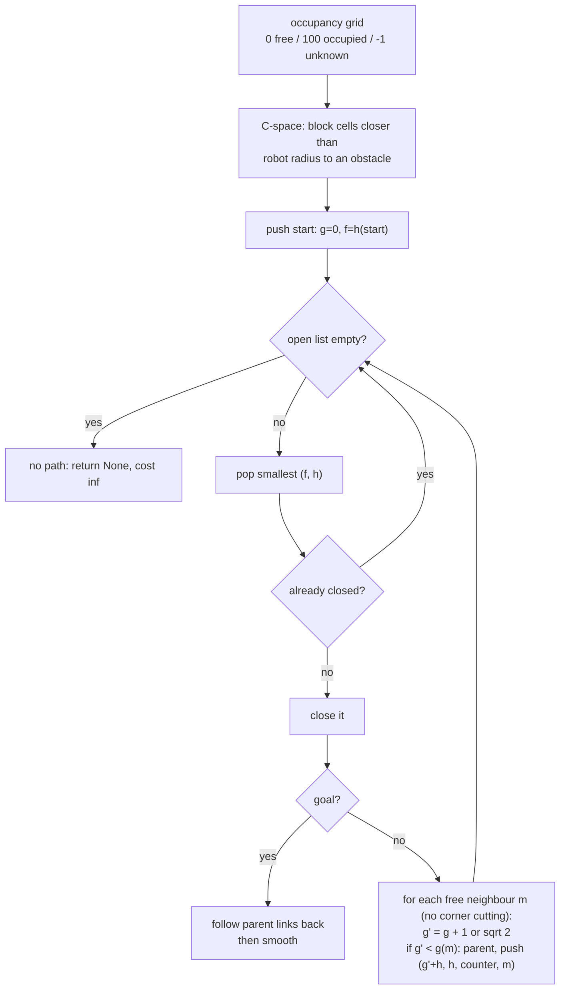

# 12.02 — Grid path planning — BFS, Dijkstra and A*

<!-- glance:start -->
<!-- generated by tools/build.py from curriculum/syllabus.yaml — edit the syllabus, not this block -->

| | |
|---|---|
| **Track** | Main path |
| **Difficulty** | Intermediate |
| **Time** | 1 h 15 min |
| **Hardware** | none |
| **Software** | python |
| **Prerequisites** | [12.01 The navigation problem — goals, waypoints, global and local planning](12.01-the-navigation-problem.md) |
| **Skip if** | You have implemented A* on an occupancy grid. |

<!-- glance:end -->

## What you will learn

- Turn an occupancy grid into a graph and grow the obstacles by the robot's radius, so the robot can be planned as a point (configuration space).
- Run BFS, Dijkstra and A* by hand on a small grid and explain why BFS is not shortest on an 8-connected grid.
- Choose a heuristic and prove it admissible and consistent; predict what an inadmissible one does.
- Implement A* with a binary heap, lazy deletion, tie-breaking and no corner cutting, and pass the auto-grader.
- Smooth a grid path and say how NavFn, Smac 2D and Theta* in Nav2 relate to what you built.

## Why it matters

karmel has a map of the apartment (module 11) and a pose on it (module 10). The first half of "go to the kitchen" is deciding **which way**: through which doorway, around which table. That's shortest-path search on the map, and it is what Nav2's `planner_server` does every second with karmel's `GridBased` planner: NavFn with `use_astar: true`. After this lesson, you have written that planner yourself, and a failed plan in Nav2 becomes a graph search question you can reason about.

<!-- prereqs:start -->
## Prerequisites

You need these first:

- [12.01 The navigation problem — goals, waypoints, global and local planning](12.01-the-navigation-problem.md)

### Optional prerequisite links

None.

Check your readiness: `python course.py why 12.02`
<!-- prereqs:end -->

## Concept

### A map is a graph

An occupancy grid ([11.01](../11-slam/11.01-map-representations.md)) is an image: each cell is free, occupied or unknown. Make every free cell a node. Connect each node to its 8 neighbours (up, down, left, right and the diagonals). Weight each edge by its length: 1 cell for a straight step, √2 ≈ 1.414 cells for a diagonal. Now "shortest route to the kitchen" is "shortest path in a weighted graph". Every backend engineer has met that problem, maybe as network routing (OSPF runs Dijkstra) or as a dependency resolver.

### The robot is not a point, until you make it one

karmel's footprint covers a 16 cm radius circle. Checking the whole disc against the map at every node would be slow. The trick: grow every obstacle by 16 cm and shrink the robot to a point. A cell where the grown obstacles don't reach is a place where the robot's **center** can be without touching anything. The space of robot positions (here just x, y) is the **configuration space**, or C-space. Grown obstacles are C-space obstacles. You will generalize this in [12.03](12.03-sampling-based-planning.md) and turn it into graded costs in [12.04](12.04-costmaps.md).

### Three searches, one skeleton

All three algorithms keep a frontier of cells to explore and grow outward from the start. They differ only in **which frontier cell to explore next**:

- **BFS** takes the oldest: it explores in rings of "number of moves". Shortest only if every move costs the same.
- **Dijkstra** takes the cheapest-so-far ($g$ = cost from the start): it explores in rings of true distance. Always shortest, but it explores in every direction, including away from the kitchen.
- **A\*** takes the one with the lowest $g + h$, where $h$ is an optimistic guess of the remaining distance. It still explores rings, but squashed toward the goal. Same answer as Dijkstra, far less work.

> [!TIP]
> **Ask your teacher:** "Walk me through the first five expansions of Dijkstra and of A* on the 6 × 10 map in this lesson, showing the open list after each step."

## Technical explanation

### Level 1 — The tiny map

The 6 × 10 grid used throughout (row 0 printed first, `#` blocked). S = (row 0, col 2), G = (row 4, col 8):

```text
     col 0123456789
row 0    ..S.......
row 1    ..........
row 2    ....###...
row 3    ......#...
row 4    ......#.G.
row 5    ..........
```

Three ways from S to G:

- Over the top of the wall: down-right diagonally to row 1, right along row 1, diagonally down to column 8, then down. That's 2 diagonal + 6 straight moves = $2(1.414) + 6 = $ **8.828 cells**.
- Under the wall: down the left side, diagonally to row 5, right, and up. BFS finds this one: **9.657 cells**, also 8 moves.
- Anything else is longer.

`python 12-navigation/code/grid_planning.py` prints:

```text
BFS        moves= 8  length=9.657 cells  expanded=53
Dijkstra   moves= 8  length=8.828 cells  expanded=52
A* octile  moves= 8  length=8.828 cells  expanded=14
```

BFS found **a** path with the fewest moves (8). It didn't care that four of them were diagonal (1.414 each). Dijkstra and A* found the shortest. A* closed 14 cells instead of 52.

### Level 2 — The algorithms

**Dijkstra.** Keep $g(n)$, the best known cost from start to $n$, and a priority queue ordered by $g$.

1. $g(\text{start}) = 0$; push start.
2. Pop the cell with the smallest $g$. If it is already closed, skip it. Otherwise close it: its $g$ is now final.
3. If it is the goal, walk the `parent` links back to the start. Done.
4. For each free neighbour $m$ with step length $\ell$: if $g(n) + \ell < g(m)$, set $g(m)$ and `parent[m] = n`, and push $m$.

Why is $g$ final when popped? Every other open cell has $g \ge$ the popped one, and edge costs are non-negative, so no detour through them can be cheaper.

**A\*.** Same loop, but order the queue by $f(n) = g(n) + h(n)$. For the tiny map with the octile heuristic (Level 3), $h(S) = \max(4, 6) + 0.414 \times \min(4, 6) = 7.657$. Every cell on the optimal route has $f$ between 7.657 and 8.828. Cells behind the start have $f$ well above 8.828, and A* never pops them before reaching the goal.

**Tie-breaking.** On an open floor, huge numbers of cells have exactly the same $f$ (every optimal route has the same total). Among equal $f$, pop the one with the **smaller $h$**, the one closer to the goal. On an empty 40 × 60 grid, A* then closes exactly the 60 cells of the path. Breaking ties arbitrarily (by insertion order) closes 523. The auto-grader checks this.

**Numbers from the apartment** (`grid_planning.py`, 5 cm grid, C-space for karmel's 0.160 m radius, living room (1.0, 1.3) → kitchen (5.0, 2.3)):

```text
planner                        length [m]  expanded time [ms]
BFS (fewest moves)                  4.394      5516     296.7
Dijkstra                            4.394      5230     549.2
A* octile                           4.394       112      24.9
A* octile, no tie-break             4.394       183      35.0
A* euclidean                        4.394      1336     174.1
A* manhattan (inadmissible)         4.394       447      51.5
weighted A* (w=2)                   4.725       131      24.3
```

A* with octile closes **47 times fewer** cells than Dijkstra and returns the same 4.394 m. Weighted A* (Level 3) returns a 7.5% longer path. Manhattan happened to return the optimal length here, but nothing guarantees it (Exercise E3).

### Level 3 — Heuristics, mathematically

Let $h^*(n)$ be the true cost of the best path from $n$ to the goal.

- **Admissible:** $h(n) \le h^*(n)$ for all $n$. It never overestimates.
- **Consistent (monotone):** $h(n) \le \ell(n, m) + h(m)$ for every edge $n \to m$, plus $h(\text{goal}) = 0$. It's the triangle inequality. Consistent implies admissible.

**Theorem (Hart, Nilsson, Raphael 1968).** With an admissible $h$, A* returns an optimal path. With a consistent $h$, every cell is closed at most once with its final $g$, so the simple "skip if closed" loop above is correct.

**Octile distance.** On an empty 8-connected grid, from $(0, 0)$ to $(\Delta r, \Delta c)$ with $\Delta r \le \Delta c$: take $\Delta r$ diagonal steps and $\Delta c - \Delta r$ straight ones.

$$h_{\text{oct}} = \Delta r\sqrt 2 + (\Delta c - \Delta r) = \max(\Delta r, \Delta c) + (\sqrt 2 - 1)\min(\Delta r, \Delta c)$$

Obstacles only make real paths longer, so $h_{\text{oct}} \le h^*$: admissible. Consistency holds because $h_{\text{oct}}$ is a distance (it obeys the triangle inequality) and each edge's cost equals the octile distance between its endpoints. Example: $(0, 0) \to (3, 5)$: $5 + 0.414 \times 3 = 6.243$.

**Other heuristics on the same grid:**

| $h$ | from (0,0) to (3,5) | Admissible? | Effect |
|---|---|---|---|
| 0 (Dijkstra) | 0 | yes | explores everything closer than the goal |
| Euclidean $\sqrt{\Delta r^2 + \Delta c^2}$ | 5.831 | yes | weaker than octile: 1336 vs 112 expansions |
| Octile | 6.243 | yes, and exact on empty grids | the best you can do without map knowledge |
| Manhattan $\Delta r + \Delta c$ | 8 | **no**: 8 > 6.243 | fewer expansions sometimes, suboptimal paths possible |

The closer an admissible $h$ is to $h^*$, the fewer cells A* expands. If $h = h^*$ exactly, A* walks straight down the optimal path.

**Weighted A\*** uses $f = g + w\,h$ with $w > 1$. Its path cost is guaranteed $\le w \times$ optimal. In the apartment: $4.725 \le 2 \times 4.394$, in practice only 7.5% worse. Useful when planning time matters more than a few centimeters.

**Complexity.** With $V$ cells and a binary heap, Dijkstra is $O(V \log V)$ (each cell has ≤ 8 edges). Halving the resolution quadruples $V$. Measured in the apartment: Dijkstra expands 1,287 cells at 10 cm, 5,230 at 5 cm and 22,074 at 2.5 cm. The path length barely changes (4.373 / 4.394 / 4.404 m).

### Level 4 — Implementation details that matter

**Configuration space from a map.** Compute each cell's distance to the nearest occupied cell (a Euclidean distance transform) and block cells within the robot radius. That's `configuration_space()` in [`code/grid_planning.py`](code/grid_planning.py):

```python
occupied = grid.data >= 65                                   # map_server occupied_thresh 0.65
distance_m = distance_transform_edt(~occupied) * grid.resolution
blocked = distance_m <= robot_radius_m                        # the robot's center may not be here
blocked |= grid.data < 0                                      # and unknown space is not trusted
```

**No corner cutting.** A diagonal step from $(r, c)$ to $(r+1, c+1)$ passes between $(r, c+1)$ and $(r+1, c)$. If either is blocked, the real robot would clip the corner, so forbid the step.

**Lazy deletion instead of decrease-key.** Python's `heapq` can't update a priority. Push the cell again with the better $f$, and when an outdated entry pops out, skip it because the cell is already closed.

**Heap entries** `(f, h, counter, cell)`: `h` second gives the tie-breaking, and the counter guarantees two cells are never compared.

**Path smoothing.** A grid path moves only in 45° increments and zig-zags (see the "A* cells" line in the plot). `shortcut()` keeps a waypoint only where the straight line to the next kept one would hit a blocked cell. In the apartment: 81 cells become 3 waypoints, and the path shrinks from 4.394 to 4.113 m, because it can now take any angle (the start and goal cell centers are 4.111 m apart, so it is almost a straight line). Nav2 splits this job: the planner makes the path, and a `smoother_server` plugin (karmel: `nav2_smoother::SimpleSmoother`) smooths it.

**Where this lives in Nav2.**

> [!IMPORTANT]
> **Version-sensitive** (verified 2026-09 against Nav2 1.3.x on ROS 2 Jazzy).
> Check the planner pages before configuring: https://docs.nav2.org/jazzy/configuration_and_development/configuration_guide/
> AI teacher: verify against current documentation before giving instructions.

| Nav2 planner plugin | What it is, in this lesson's terms |
|---|---|
| `nav2_navfn_planner::NavfnPlanner` | Wavefront Dijkstra (`use_astar: false`, the default) or A* (`use_astar: true`, karmel) over the costmap. Parameters: `tolerance`, `use_astar`, `allow_unknown`. |
| `nav2_smac_planner::SmacPlanner2D` | Cost-aware A* on an 8-connected grid, with `cost_travel_multiplier` (12.04) and built-in smoothing. |
| `nav2_theta_star_planner::ThetaStarPlanner` | A* that checks line of sight to the grandparent while searching, so paths come out any-angle: your `shortcut`, done during the search. |
| `SmacPlannerHybrid`, `SmacPlannerLattice` | Search over (x, y, θ) with motion primitives, for car-like or non-circular robots. |

Nav2's tuning guide recommends NavFn, Smac 2D or Theta* for circular differential-drive robots like karmel.

## Diagram



```text
 Octile distance: from S to G, dr = 4 rows, dc = 6 cols

   S . . . . . .
   . ↘ . . . . .        4 diagonal steps   4 × 1.414 = 5.657
   . . ↘ . . . .        2 straight steps   2 × 1.000 = 2.000
   . . . ↘ . . .                                     -------
   . . . . ↘ → → G      h(S) = 6 + 0.414 × 4       = 7.657  (true cost with the wall: 8.828)
```

## Code

[`code/grid_planning.py`](code/grid_planning.py) (tested by `code/test_grid_planning.py`) has BFS, Dijkstra, A* with any heuristic, weighted A*, costmap-aware step costs (used in 12.04), C-space, line of sight, shortcut smoothing and a demo. The heart of it:

```python
def astar(blocked, start, goal, heuristic=octile, *, weight=1.0, tie_break=True, connectivity=8, cell_cost=None):
    t0 = time.perf_counter()
    if blocked[start] or blocked[goal]:
        return PlanResult(None, math.inf, 0, [], time.perf_counter() - t0)
    g = {start: 0.0}
    parent = {start: None}
    closed, order, counter = set(), [], 0
    h0 = heuristic(start, goal)
    open_heap = [(weight * h0, h0 if tie_break else 0.0, counter, start)]
    while open_heap:
        _f, _h, _n, cell = heapq.heappop(open_heap)
        if cell in closed:
            continue  # stale entry: we already found a cheaper way here ("lazy deletion")
        closed.add(cell)
        order.append(cell)
        if cell == goal:
            path = _reconstruct(parent, goal)
            return PlanResult(path, g[goal], len(order), order, time.perf_counter() - t0)
        for nxt, step in neighbors(blocked, cell, connectivity):
            if nxt in closed:
                continue
            new_g = g[cell] + step * (1.0 + (float(cell_cost[nxt]) if cell_cost is not None else 0.0))
            if new_g < g.get(nxt, math.inf):
                g[nxt] = new_g
                parent[nxt] = cell
                h = heuristic(nxt, goal)
                counter += 1
                heapq.heappush(open_heap, (new_g + weight * h, h if tie_break else 0.0, counter, nxt))
    return PlanResult(None, math.inf, len(order), order, time.perf_counter() - t0)
```

Run the demo (writes `nav_out/12.02_planners.png`):

```bash
python 12-navigation/code/grid_planning.py
```

It prints the tiny-map results and the planner table from Level 2, then:

```text
shortcut smoothing: 81 cells -> 3 waypoints, length 4.394 m -> 4.113 m
```

The PNG has four panels: Dijkstra's expanded cells colored by expansion order (a blob filling most of the living room, study and kitchen), A*'s expanded cells (a thin band along the path), weighted A*'s longer path against the optimal one, and the three-waypoint smoothed path. The pink band around every wall is the C-space inflation.

## Exercise

All exercises need hardware: none.

### Exercise 12.02-E1 — A* by hand `[numerical]`

On the tiny map, compute $g$, $h$ (octile) and $f$ for S = (0, 2) and for each of its free neighbours. Which cell does A* pop second? Then compute $f$ for (1, 7) and (5, 5) as if reached along a shortest path. Which of them will A* ever close before reaching G (optimal cost 8.828)?

### Exercise 12.02-E2 — Implement A* `[coding]`

Implement `octile_distance`, `neighbors`, `astar` and `dijkstra` in [`labs/exercises/12.02/student.py`](../labs/exercises/12.02/student.py) (instructions in its [README](../labs/exercises/12.02/README.md)). The grader checks optimal cost against Dijkstra in the apartment, admissibility and consistency of your heuristic, the no-path cases, corner cutting and tie-breaking.

Check it: `python course.py check 12.02`

### Exercise 12.02-E3 — The inadmissible heuristic `[predict]`

On this map, from S = (5, 0) to G = (0, 9), the optimal cost is 11.071 cells:

```text
#.........
#.##......
..#..#....
.##.....#.
..#.......
......#...
```

**Predict** whether A* with the Manhattan heuristic returns 11.071, and whether it closes more or fewer cells than A* with octile (13). Then run:

```python
import numpy as np, grid_planning as gp   # from 12-navigation/code
rows = ["#.........", "#.##......", "..#..#....", ".##.....#.", "..#.......", "......#..."]
b = np.array([[ch == "#" for ch in r] for r in rows])
for h in (gp.zero, gp.octile, gp.manhattan):
    r = gp.astar(b, (5, 0), (0, 9), h)
    print(h.__name__, round(r.cost, 3), r.expanded)
```

### Exercise 12.02-E4 — Resolution and heuristics `[simulation]`

Write a short script in `12-navigation/code/` that builds the apartment grid at 0.10, 0.05 and 0.025 m (`World.apartment().to_occupancy_grid(res)`), makes the C-space with `gp.configuration_space(grid, cfg.chassis.footprint_radius_m)` and plans living room → **study** (`nav_common.STUDY_XY`) with `gp.dijkstra` and `gp.astar`. Print, per resolution: number of cells, path length in meters, expansions of each. What is the growth factor per halving of the cell size?

### Exercise 12.02-E5 — The planner that is almost right `[debugging]`

A colleague's A* passes every unit test on small maps, but in the apartment the path to the study is 3.547 m while Dijkstra says 3.518 m. Their neighbour loop:

```python
for nxt, step in neighbors(blocked, cell):
    if nxt in g:            # already seen
        continue
    g[nxt] = g[cell] + step
    parent[nxt] = cell
    if nxt == goal:
        return reconstruct(parent, goal)
    heapq.heappush(heap, (g[nxt] + octile(nxt, goal), counter, nxt))
```

Find both bugs, explain why each breaks optimality only sometimes, and fix them.

## Expected result

- **12.02-E1:** S: $g = 0$, $h = 6 + 0.414 	imes 4 = 7.657$, $f = 7.657$. Neighbours ($g$, $h$, $f$): (0, 3): 1, 6.657, **7.657**; (1, 3): 1.414, 6.243, **7.657**; (1, 2): 1, 7.243, 8.243; (0, 1): 1, 8.657, 9.657; (1, 1): 1.414, 8.243, 9.657. Two cells tie at $f = 7.657$; tie-breaking on the smaller $h$ pops **(1, 3)** second. (1, 7): $g = 5 + 0.414 = 5.414$, $h = 3 + 0.414 = 3.414$, $f = 8.828$, equal to the optimum, so it lies on the optimal route and **is closed**. (5, 5): shortest $g$ = 2 straight + 3 diagonal = 6.243, $h = 3.414$, $f = 9.657 > 8.828$, so it is **never closed**. The reference A* closes (0, 2), (1, 3), (1, 4), … and 14 cells in total.
- **12.02-E2:** `python course.py check 12.02` ends with `19 passed`. With `--solution` you see the same.
- **12.02-E3:** Manhattan returns **14.0** cells (path along the left edge and the bottom row, 14 moves) with 16 expansions. Octile returns 11.071 with 13. Dijkstra returns 11.071 with 49. The overestimate made A* commit to a route that looked cheap and close its goal before the better route's $f$ came up.
- **12.02-E4:** Living room → study: 4,200 / 16,800 / 67,200 cells; length 3.556 / 3.518 / 3.457 m (identical for Dijkstra and A*); Dijkstra expands 986 / 3,946 / 16,137 cells, A* 370 / 1,390 / 5,430. Both grow by about **×4 per halving** of the cell size, the same factor as the number of cells. The path gets a few cm shorter because finer cells hug the door edges more tightly. A*'s advantage is smaller here than for the kitchen (about ×3 instead of ×47): the study is behind a wall, so the straight-line heuristic points at the wall, and A* has to fill the region below it before it finds the door.
- **12.02-E5:** Bug 1: `if nxt in g: continue` treats the **first** $g$ found as final, but a cell first reached by a long route can later be reached by a shorter one before it is closed. Fix: `if new_g < g.get(nxt, inf)`. Bug 2: returning when the goal is **pushed** instead of when it is **popped**. A cheaper route to the goal may still be in the heap. Fix: check `cell == goal` after popping. Both only bite when two routes of different lengths meet at the same cell in a particular order, which small symmetric test maps rarely create. With both fixed, the study path is 3.518 m.

## Troubleshooting

### Symptom: A* returns a longer path than Dijkstra

1. Is the heuristic admissible? Evaluate `h(start, goal)` and compare with the Dijkstra cost. Manhattan on an 8-connected grid, or a heuristic in meters while costs are in cells (or the reverse), both overestimate.
2. Are costs and $h$ in the same units? If step costs include costmap penalties (12.04), octile distance is still admissible because penalties only add. If penalties can be **negative**, nothing is guaranteed.
3. Do you close cells at pop time and return at pop time? See E5.

### Symptom: A* is as slow as Dijkstra

1. Print $h$ at the start: is it 0 (wrong function passed)?
2. Tie-breaking: on open floors, count expansions on an empty grid. More than ~2× the path length means ties are broken badly.
3. The goal is unreachable: A* then expands every reachable cell anyway. Check the goal cell and the no-path case first.

### Symptom: the path clips walls or squeezes through diagonal gaps

1. Is the grid the C-space (obstacles grown by the robot radius), or the raw map?
2. Corner cutting: check that a diagonal step requires both orthogonal neighbours free.
3. Smoothing: a line-of-sight check that samples too coarsely can jump a thin corner. Sample at a fraction of a cell.

### Symptom: "no path" to a goal that is obviously reachable

1. Is the start or goal cell blocked in C-space? A robot parked 10 cm from a wall has its center inside the grown obstacle. Nav2 handles the goal side with a `tolerance` parameter.
2. Unknown cells blocked? Maps from SLAM often have unknown speckles in doorways.
3. Row/column swap: `grid.world_to_cell(x, y)` returns `(row, col)` = `(y index, x index)`.

## Common mistakes

- **Using BFS on an 8-connected grid and calling it shortest.** It minimizes moves, not meters.
- **Returning when the goal is first discovered** instead of when it is closed.
- **Swapping (row, col) and (x, y).** Rows are y. Keep a `world_to_cell` helper and never index with x first.
- **Planning on the raw map.** The robot is not a point: plan in C-space or on a costmap with inflation.
- **Mixing units** in $g$ (meters) and $h$ (cells). A 20× overestimate is a very greedy, very suboptimal A*.
- **Chasing expansions with an inadmissible heuristic** instead of fixing tie-breaking.

## Knowledge check

1. Why can BFS return a longer path than Dijkstra on an 8-connected grid, but not on a 4-connected one with unit costs?
   <details><summary>Answer</summary>

   BFS minimizes the number of moves. On a 4-connected grid every move costs 1, so fewest moves is shortest length. On 8-connected grids diagonal moves cost √2, so two paths with the same number of moves can have different lengths.
   </details>

2. Compute the octile distance from (2, 3) to (9, 5), and the Euclidean distance. Which is larger, and why is that good?
   <details><summary>Answer</summary>

   $\Delta r = 7$, $\Delta c = 2$: octile $= 7 + 0.414 \times 2 = 7.828$; Euclidean $= \sqrt{53} = 7.280$. Octile is larger but still admissible on an 8-connected grid (it is the exact cost with no obstacles), so it guides A* better and expands fewer cells.
   </details>

3. State admissibility and consistency. Give a heuristic that is admissible on a 4-connected grid but not on an 8-connected grid.
   <details><summary>Answer</summary>

   Admissible: $h(n) \le h^*(n)$. Consistent: $h(n) \le c(n, m) + h(m)$ for every edge. Manhattan distance is exact on an empty 4-connected grid (admissible), but overestimates when diagonal moves are allowed.
   </details>

4. Weighted A* with $w = 1.5$ returns a 6.1 m path. What can you say about the optimal path?
   <details><summary>Answer</summary>

   Optimal ≥ 6.1 / 1.5 = 4.07 m, and of course ≤ 6.1 m.
   </details>

5. Predict: you halve the grid cell size from 5 cm to 2.5 cm. Roughly how do Dijkstra's expansions and the path length change?
   <details><summary>Answer</summary>

   About 4× more cells, so ~4× more expansions (apartment: 5,230 → 22,074). The path length changes by a few millimeters to centimeters (4.394 → 4.404 m).
   </details>

6. Debugging: your planner says "no path" whenever the robot starts next to the sofa, although it can clearly drive away. What's happening and what do you do?
   <details><summary>Answer</summary>

   The start cell is inside the grown obstacle (the robot's center is closer than its radius to the inflated map, often because of map noise or a slightly too large radius). Options: let the search start from the nearest free cell, reduce inflation to the true inscribed radius, or, as Nav2 does, let a recovery behavior (back up) move the robot out first.
   </details>

7. How does Theta* differ from A* followed by shortcut smoothing?
   <details><summary>Answer</summary>

   Theta* checks line of sight to the grandparent **during** the search and sets the parent to the grandparent when visible, so $g$ values are any-angle distances and the search optimizes the smoothed length directly. Shortcutting after A* only straightens the one path A* found, which may not be the best any-angle path.
   </details>

## Practical challenge

Implement **Theta\*** on top of your `astar`: when relaxing neighbour $m$ of cell $n$, if `line_of_sight(parent[n], m)` holds, try `g[parent[n]] + euclid(parent[n], m)` with parent `parent[n]`; otherwise do the normal update. Use the Euclidean heuristic.

**Acceptance criteria:** living room → kitchen, study and bedroom in the apartment at 5 cm; your Theta* path is never longer than A* + `shortcut` and at least 5% shorter than raw A* on the kitchen route; every segment passes `line_of_sight` in C-space; a plot shows A*, A* + shortcut and Theta* paths together; you can explain why Theta* is not guaranteed optimal among all any-angle paths.

## You can skip this if…

You answer knowledge-check questions 2, 3 and 6 without looking and `python course.py check 12.02` passes with your own code.

`python course.py skip 12.02 --reason "I have implemented A* on occupancy grids"`

## Go deeper

- Red Blob Games, Introduction to the A* Algorithm: https://www.redblobgames.com/pathfinding/a-star/introduction.html — the best interactive explanation of BFS → Dijkstra → A*, with Python code.
- Hart, Nilsson, Raphael, "A Formal Basis for the Heuristic Determination of Minimum Cost Paths" (1968): https://doi.org/10.1109/TSSC.1968.300136 — the A* paper: admissibility and optimality.
- Dijkstra, "A Note on Two Problems in Connexion with Graphs" (1959): https://doi.org/10.1007/BF01386390 — three pages that started it all.
- LaValle, *Planning Algorithms* (free online): https://lavalle.pl/planning/ — chapter 2 (discrete planning) formalizes search on graphs.
- Nav2 NavFn planner parameters (Jazzy): https://docs.nav2.org/jazzy/configuration_and_development/configuration_guide/planners_plugins/configuring_navfn/ — `use_astar`, `tolerance`, `allow_unknown`.
- Macenski et al., "Open-Source, Cost-Aware Kinematically Feasible Planning for Mobile and Surface Robotics" (Smac planners, 2024): https://arxiv.org/abs/2401.13078 — how Nav2's modern planners extend A*.

## Progress checkpoint

- [ ] I can turn an occupancy grid into C-space and a weighted 8-connected graph.
- [ ] I can run BFS, Dijkstra and A* by hand and explain their differences in numbers.
- [ ] I can prove a heuristic admissible/consistent and predict the effect of an inadmissible one.
- [ ] My A* passes `python course.py check 12.02`.
- [ ] I can say which Nav2 planner plugin corresponds to what I built.

`python course.py complete 12.02` (exercises done) · `python course.py master 12.02` (challenge done) · `python course.py struggle 12.02 "what was hard"`

Next: [12.03 — Sampling-based planning — RRT and friends](12.03-sampling-based-planning.md).
