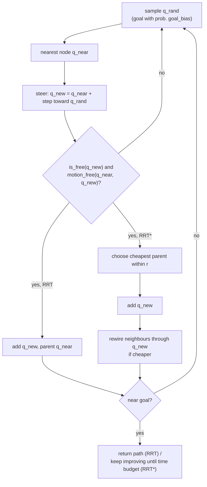

# 12.03 — Sampling-based planning — RRT and friends

<!-- glance:start -->
<!-- generated by tools/build.py from curriculum/syllabus.yaml — edit the syllabus, not this block -->

| | |
|---|---|
| **Track** | Main path |
| **Difficulty** | Intermediate |
| **Time** | 50 min |
| **Hardware** | none |
| **Software** | python |
| **Prerequisites** | [12.02 Grid path planning — BFS, Dijkstra and A*](12.02-grid-path-planning.md) |
| **Skip if** | You know when sampling-based planners beat grid search. |

<!-- glance:end -->

## What you will learn

- Define configuration space for any robot and build C-space obstacles for a disk robot and a two-link arm.
- Implement RRT with steering, nearest-neighbour search, goal bias and collision-checked motions.
- Explain how RRT* rewires the tree and why its path cost keeps falling with more samples.
- Explain probabilistic completeness and predict, with a probability estimate, when narrow passages make sampling slow.
- Decide when sampling-based planners beat grid search, and say where the course uses them (MoveIt for the arm), and why Nav2 plans karmel's base on a grid.

## Why it matters

A* on a 5 cm grid is perfect for karmel's base: two dimensions (x, y), 16,800 cells. In module 14 you add an arm with 5–6 joints. A grid over six joint angles at 5° resolution has $72^6 = 1.4 \times 10^{11}$ cells, and no computer searches that. Motion planning for arms (MoveIt 2 and its default library OMPL, [14.09](../14-robotic-arm/14.09-moveit2-motion-planning.md)) therefore uses **sampling**: throw random configurations at the problem, keep the collision-free ones, connect them into a tree. This lesson builds that idea where you can see it, in the apartment, and then moves it to an arm.

<!-- prereqs:start -->
## Prerequisites

You need these first:

- [12.02 Grid path planning — BFS, Dijkstra and A*](12.02-grid-path-planning.md)

### Optional prerequisite links

None.

Check your readiness: `python course.py why 12.03`
<!-- prereqs:end -->

## Concept

### Configuration space, again, but general

A **configuration** $q$ is the smallest set of numbers that pins down where every point of the robot is.

- karmel as a disk (heading doesn't change its shape): $q = (x, y)$, 2 numbers.
- karmel as its real 25 × 21 cm rectangle: $q = (x, y, \theta)$, 3 numbers.
- A two-link planar arm: $q = (\theta_1, \theta_2)$.
- A 6-joint arm: $q = (\theta_1, \dots, \theta_6)$.

The **configuration space** $\mathcal{C}$ is the set of all $q$; $\mathcal{C}_{\text{free}}$ is the collision-free part. Planning is always "find a continuous curve from $q_{\text{start}}$ to $q_{\text{goal}}$ inside $\mathcal{C}_{\text{free}}$". For a disk, $\mathcal{C}_{\text{free}}$ is just the floor minus obstacles grown by the radius (12.02). For an arm, a single round obstacle in the workspace becomes a strange curved band in $(\theta_1, \theta_2)$ (see the Code plot).

The key practical fact: **you rarely can compute $\mathcal{C}_{\text{free}}$ explicitly, but you can always ask "is this one $q$ free?"** Put the arm at those angles, run a collision check, answer yes or no. Sampling planners are built only on that question.

### RRT in one paragraph

Start a tree at $q_{\text{start}}$. Repeat: pick a random configuration $q_{\text{rand}}$; find the tree node nearest to it; take a small step from that node toward $q_{\text{rand}}$; if the step is collision-free, add the new node. Stop when a node lands near the goal. Because random samples fall more often into big empty regions, the tree grows fastest into unexplored space. That's the "rapidly exploring" part, known as the Voronoi bias.

An analogy: a crawler exploring an unknown website by following random links is hopeless. One that repeatedly picks a random URL pattern and extends from the nearest page it already knows covers the site evenly. RRT is the second crawler.

> [!TIP]
> **Ask your teacher:** "Explain the Voronoi bias of RRT with a picture: why do nodes on the frontier of the tree get extended more often than nodes in the middle?"

### What you give up

- **Optimality.** RRT returns the first path found, usually zig-zagging. RRT* fixes this slowly.
- **Determinism.** Different random seeds give different paths. Robots that must repeat the same route every day dislike that.
- **Completeness in the strict sense.** A* either finds a path or proves there is none. RRT is **probabilistically complete**: if a path exists, the probability of finding it goes to 1 as samples go to infinity. It can never prove that no path exists; it just runs out of time.

## Technical explanation

### Level 1 — The loop

```text
tree = {q_start}
repeat up to N times:
    q_rand = q_goal with probability goal_bias, else uniform random in the bounds
    q_near = nearest node in tree to q_rand
    q_new  = q_near + step_size * unit(q_rand - q_near)       (or q_rand if closer than step_size)
    if is_free(q_new) and motion_free(q_near, q_new):
        add q_new with parent q_near
        if |q_new - q_goal| < goal_tolerance: return path to q_new
```

Example of one step: $q_{\text{near}} = (1.0, 1.3)$, $q_{\text{rand}} = (3.0, 2.8)$, step 0.3 m. The direction is $(2.0, 1.5)/2.5 = (0.8, 0.6)$, so $q_{\text{new}} = (1.0 + 0.24,\ 1.3 + 0.18) = (1.24, 1.48)$.

### Level 2 — Practical knobs, measured

[`code/sampling_planning.py`](code/sampling_planning.py) plans living room → kitchen in the apartment with karmel as a 0.160 m disk. Results over 20 seeds with `step_size = 0.3`, `goal_bias = 0.05`:

```text
RRT, living room -> kitchen, 20 seeds: success 20/20, length 5.31 m (min 4.70, max 7.20), 104 samples, 23 ms
  after random shortcutting: 4.16 m on average (A* on the 5 cm grid: 4.39 m)
```

The raw RRT path is **21% longer** than A*'s on average, and it varies from 4.70 to 7.20 m. A cheap post-processing step, **random shortcutting** (pick two path points; if the straight segment between them is free, delete everything in between; repeat 100 times), brings it to 4.16 m. That's shorter than grid A*, because RRT paths aren't restricted to 45° moves. MoveIt applies the same kind of path simplification after OMPL plans.

The two knobs (20 seeds each, median samples to the first solution, mean raw length):

| `step_size` [m] | `goal_bias` 0 | 0.05 | 0.5 |
|---|---|---|---|
| 0.1 | 669 samples, 5.74 m | 216, 5.28 m | 81, 4.53 m |
| 0.3 | 302, 5.80 m | 79, 5.31 m | 26, 4.57 m |
| 1.0 | 179, 6.06 m | 40, 5.75 m | 12, 4.84 m |

Bigger steps explore faster but check longer motions and make coarser paths. Goal bias pulls the tree to the goal, which is great in open rooms and harmful in mazes, where the tree keeps bumping into the wall in front of the goal. Typical values are 0.05–0.1.

**Collision checking is the cost.** `DiskRobotChecker.motion_free` samples the segment every 3 cm and asks the world for the clearance at each sample. For an arm, each check is a mesh-mesh collision query (FCL in MoveIt), microseconds to milliseconds each. Sampling planners spend most of their time there, not in the tree logic.

### Level 3 — RRT*, completeness, dimensionality

**RRT\*** changes two lines of RRT (Karaman & Frazzoli, 2011):

1. **Choose parent.** Instead of connecting $q_{\text{new}}$ to $q_{\text{near}}$, look at all nodes within radius $r$ and connect to the one minimizing $\text{cost}(q) + \|q - q_{\text{new}}\|$ (if the motion is free).
2. **Rewire.** For each node $q$ within $r$: if going through $q_{\text{new}}$ is cheaper, $\text{cost}(q_{\text{new}}) + \|q_{\text{new}} - q\| < \text{cost}(q)$, make $q_{\text{new}}$ its parent and push the saving down to its descendants.

It is **asymptotically optimal**: the best path converges to the optimum as samples → ∞, provided $r$ shrinks no faster than

$$r_n = \gamma \left(\frac{\log n}{n}\right)^{1/d}$$

with $n$ nodes in $d$ dimensions. Example: $d = 2$, $\gamma = 3$, $n = 1000$: $r = 3\sqrt{6.91/1000} = 0.25$ m. The course code uses a fixed 0.6 m radius, which is fine for a few thousand samples in a 6 × 5 m apartment.

Measured, seed 0, apartment:

```text
RRT* seed 0: first solution at sample 69 (4.42 m), after 3000 samples 4.07 m, 1.3 s
  best cost within  500 samples: 4.09 m
  best cost within 1000 samples: 4.07 m
```

Cost falls fast, then very slowly: the last 2,000 samples bought nothing visible. In practice you either give RRT* a time budget, or run plain RRT and shortcut.

**Probabilistic completeness and narrow passages.** Suppose the only way through is a corridor whose free region (for the robot's center) has area $A_{\text{narrow}}$, inside a sampling region of area $A$. Each uniform sample lands there with probability $p = A_{\text{narrow}}/A$. The chance that none of $n$ samples lands there is

$$P(\text{miss}) = (1 - p)^n \approx e^{-pn}$$

Example: a 0.40 m corridor, 1 m long, and karmel's 0.32 m diameter leave a $0.08 \times 1.0 = 0.08$ m² strip for the center, in a 4 × 3 = 12 m² room: $p = 0.0067$. After 250 samples $P(\text{miss}) = e^{-1.67} = 0.19$; after 1000, $e^{-6.7} = 0.001$. RRT needs several nodes inside the corridor, not one, so real numbers are worse. Measured over 20 seeds:

```text
  corridor 1.00 m (free width for the centre 0.68 m): median 63 samples;  P(solved by 250) = 1.00
  corridor 0.50 m (free width for the centre 0.18 m): median 128 samples; P(solved by 250) = 0.70, by 1000 = 1.00
  corridor 0.40 m (free width for the centre 0.08 m): median 240 samples; P(solved by 250) = 0.55, by 1000 = 0.95
```

A grid planner doesn't care: the corridor is either open in C-space or not. This is the classic weakness of sampling, and why OMPL offers biased samplers and planners like BiRRT/RRTConnect (grow trees from both ends).

**Why sampling wins in high dimensions.** A grid with $k$ cells per axis in $d$ dimensions has $k^d$ cells:

```text
Grid size to cover every joint from -180 to 180 deg:
  2 joints: at 5 deg 5.18e+03 cells, at 1 deg 1.30e+05 cells
  3 joints: at 5 deg 3.73e+05 cells, at 1 deg 4.67e+07 cells
  6 joints: at 5 deg 1.39e+11 cells, at 1 deg 2.18e+15 cells
  7 joints: at 5 deg 1.00e+13 cells, at 1 deg 7.84e+17 cells
```

$1.4 \times 10^{11}$ cells at one byte each is 140 GB, before any search. RRT's cost depends on how hard the free space is to connect (narrow passages), not directly on $d$. It only ever touches the configurations it samples. The two-link arm demo finds a path in joint space after 969 samples, in a space where 17% of configurations collide.

| Situation | Better choice | Why |
|---|---|---|
| Mobile base, 2D map, circular robot | Grid A* / Dijkstra (Nav2 NavFn, Smac 2D) | Low dimension, optimal, deterministic, map already a grid |
| Car-like or big rectangular base | Search over (x, y, θ) with motion primitives (Smac Hybrid-A*, Lattice) | 3D is still searchable; kinematic constraints matter |
| Arm, 5–7 joints | Sampling (OMPL RRTConnect in MoveIt), then smoothing | $k^d$ explodes; collision checks are the only access to $\mathcal{C}_{\text{free}}$ |
| Must prove "no path exists" | Complete grid search | Sampling can only time out |
| Same path every day | Grid search, or sampling with a fixed seed + caching | Sampling is random |

### Level 4 — Implementation notes

- **Nearest neighbour** is the other hotspot. The course code does a vectorized `argmin` over all nodes, fine for a few thousand. OMPL uses a GNAT or k-d tree. For angles, distance must wrap ($359°$ and $1°$ are neighbours). The arm demo sidesteps this by keeping joints in $[-180°, 180°]$ without wrap.
- **Motion checking resolution** must be finer than the smallest obstacle and robot feature: 3 cm for a 16 cm disk; 2° per joint for the arm (at 0.55 m reach that's 1.9 cm at the tip).
- **Metric and scaling:** mixing meters and radians in one distance ($q = (x, y, \theta)$) needs a weight on $\theta$. Otherwise "nearest" means something silly.
- **Where it lives in the course's stacks:** Nav2 doesn't use sampling planners for the base (its planners are grid and lattice searches). MoveIt 2 uses OMPL, and `RRTConnect` is its default planner. That's [14.09](../14-robotic-arm/14.09-moveit2-motion-planning.md).

## Diagram



```text
 Workspace vs configuration space for a two-link arm

   workspace (x, y)                          C-space (theta1, theta2)
                                          theta2
       ( obstacle )                         ^   ████           ████
            \                               |    ████    ███    ████
   elbow o---\---o tip                      |     ████    ███    ████
        /                                   |      ███     ███    ███
  base o      one round obstacle      ->    +----------------------------> theta1
                                            one obstacle = a curved band of
                                            (theta1, theta2) pairs that collide
```

## Code

[`code/sampling_planning.py`](code/sampling_planning.py) (tested by `code/test_sampling_planning.py`). The planner takes `is_free` and `motion_free` callables, so the same function plans for the disk robot and the arm:

```python
for it in range(1, max_iterations + 1):
    q_rand = goal.copy() if rng.random() < goal_bias else rng.uniform(low, high)
    nodes = tree.nodes[: tree.size]
    nearest = int(np.argmin(np.sum((nodes - q_rand) ** 2, axis=1)))
    q_new = steer(nodes[nearest], q_rand, step_size)
    if not is_free(q_new) or not motion_free(nodes[nearest], q_new):
        continue
    parent, cost = nearest, float(tree.cost[nearest] + np.linalg.norm(q_new - nodes[nearest]))
    near = np.zeros(0, dtype=np.int64)
    if star:                                              # RRT*: cheapest collision-free parent nearby
        dist_new = np.linalg.norm(nodes - q_new, axis=1)
        near = np.flatnonzero(dist_new <= rewire_radius)
        for j in near[np.argsort(tree.cost[near] + dist_new[near])]:
            c = float(tree.cost[j] + dist_new[j])
            if c >= cost:
                break
            if motion_free(nodes[j], q_new):
                parent, cost = int(j), c
                break
    new = tree.add(q_new, parent, cost)
    if star:                                              # RRT*: rewire neighbours through q_new
        for j in near:
            c = cost + float(np.linalg.norm(tree.nodes[j] - q_new))
            if c + 1e-9 < tree.cost[j] and motion_free(q_new, tree.nodes[j]):
                _reparent(tree, int(j), new, c)
```

(The goal check and bookkeeping follow in the file.) Run everything (about 10 s; `--quick` uses 5 seeds):

```bash
python 12-navigation/code/sampling_planning.py
```

It prints the RRT, RRT*, narrow-passage and grid-size results quoted above, plus:

```text
Two-link arm: 17% of joint space in collision; RRT found a path with 56 nodes after 969 samples
```

and writes three PNGs to `nav_out/`:

- `12.03_rrt_vs_rrtstar.png`: left, a sparse RRT tree and a wiggly 4.79 m path; right, the dense RRT* tree after 3,000 samples, with long straight branches fanning out from the start (rewiring) and a nearly straight 4.07 m path.
- `12.03_cspace_disk.png`: the apartment with a red band of width 0.16 m around every wall and piece of furniture. The band is where karmel's center may not go. Doorways look noticeably narrower.
- `12.03_two_link_arm_cspace.png`: left, the arm at start and goal among three round obstacles; right, three black curved bands in $(\theta_1, \theta_2)$ with a blue RRT path weaving between them.

## Exercise

All exercises need hardware: none.

### Exercise 12.03-E1 — Numbers of sampling `[numerical]`

(a) Steer from $(2.0, 1.0)$ toward $(2.0, 3.0)$ with step 0.3 m, and toward $(2.1, 1.1)$. (b) A 5-joint arm, joints limited to ±150°, grid at 3°: how many cells? (c) A doorway leaves a 0.12 × 0.10 m region free for the robot's center inside a 6 × 5 m sampling area. How many uniform samples until the probability of never sampling it drops below 1%? (d) The RRT* radius for $d = 6$, $\gamma = 5$, $n = 10{,}000$.

### Exercise 12.03-E2 — Tune RRT `[simulation]`

Plan living room → **study** (`nav_common.STUDY_XY`, behind a wall) with `sp.rrt` for 20 seeds each with `goal_bias` 0.0, 0.05 and 0.5 (`step_size = 0.3`). **Predict first**: will goal bias 0.5 help as much as it did for the kitchen? Record success, median samples and mean length.

### Exercise 12.03-E3 — RRT* budget `[predict]`

Before running: with RRT* on the kitchen route, how much shorter will the path be after 300 samples compared with the first solution at sample 69 (4.42 m)? After 3,000? Then run RRT* with `keep_improving=True`, `max_iterations=300` and 3000 for seeds 0–4 and compare with your prediction.

### Exercise 12.03-E4 — Your own RRT for the narrow passage `[coding]`

Without looking at `sampling_planning.rrt`, write `my_rrt(start, goal, world, radius, rng)` (plain RRT, numpy only, `world.distance_to_obstacles` for collision checks) and run it on `sp.narrow_passage_world(0.5)` from (0.5, 0.5) to (3.5, 2.5) for 20 seeds. Then add **bidirectional** growth (a second tree from the goal; alternate extending each tree toward the other's newest node) and compare the median samples to a solution.

### Exercise 12.03-E5 — Choose the planner `[design]`

For each, choose grid search or sampling and name a concrete Nav2 or MoveIt plugin: (a) karmel's base in the apartment; (b) the SO-101-class arm on karmel reaching into a shelf; (c) a 2 × 1 m hospital bed robot that must turn in corridors; (d) karmel's arm moving while the base drives (base + arm = 8 DOF). Justify each in two sentences with numbers.

## Expected result

- **12.03-E1:** (a) $(2.0, 1.3)$; and $(2.1, 1.1)$ itself, because it is only 0.141 m away, less than a step. (b) $(300/3)^5 = 100^5 = 10^{10}$ cells. (c) $p = 0.012/30 = 4 \times 10^{-4}$; $e^{-pn} < 0.01 \Rightarrow n > \ln 100 / p = 4.605 / 0.0004 \approx 11{,}500$ samples just to hit it once. (d) $r = 5 \times (\ln 10^4 / 10^4)^{1/6} = 5 \times (9.21 \times 10^{-4})^{0.1667} = 5 \times 0.312 = 1.56$ (in joint-space units, radians).
- **12.03-E2:** All 20 seeds succeed for every bias. Reference numbers (median samples, mean length): bias 0.0: 209, 5.09 m; 0.05: 254, 4.97 m; **0.5: 355, 5.02 m**. The opposite of the kitchen, where 0.5 cut the samples from 79 to 26. The study is behind the wall at y = 3.2, so half the samples drag the tree straight into that wall instead of toward the door at x = 1.6–2.5. Goal bias helps only when the straight line to the goal is mostly free.
- **12.03-E3:** Reference, seeds 0–4 (first solution → best after 300 → best after 3,000 samples): 4.42 → 4.34 → 4.07; 6.16 → 6.16 → 4.08; 4.45 → 4.22 → 3.98; 5.61 → 5.07 → 4.07; 4.60 → 4.37 → 4.04. After 300 samples the gain depends heavily on how good the first solution was (seed 1 hasn't improved at all). After 3,000, every seed lands at 3.98–4.08 m. Paths slightly under 4.07 m end up to 0.15 m (the goal tolerance) short of the goal.
- **12.03-E4:** Plain RRT solves 20/20 within 4,000 samples, with a median of the same order as the reference (128 samples with `step_size` 0.3 and goal bias 0.05). Bidirectional growth should need fewer samples, because both trees approach the corridor from its two ends; measure it rather than assume it. Correctness check: every path segment passes `DiskRobotChecker(world, radius).motion_free`.
- **12.03-E5:** (a) Grid: 2D, 16,800 cells, deterministic and optimal. NavFn A* or Smac 2D. (b) Sampling: 5–6 DOF, $k^d$ grid impossible. MoveIt + OMPL `RRTConnect`. (c) Lattice search over (x, y, θ) with the real footprint: `SmacPlannerLattice` (or Hybrid-A*). A disk approximation of a 2 × 1 m bed would never fit through doors (radius 1.12 m). (d) Sampling in the 8-D joint + base space, or, more commonly, decompose: plan the base with Nav2 first, then the arm with MoveIt while the base is stopped (mobile manipulation, module 15).

## Troubleshooting

### Symptom: RRT never finds a path

1. Are start and goal free? Call `is_free` on both. A start inside the inflated wall fails immediately, like A*.
2. Are the sampling bounds right? Bounds that don't cover the goal region (e.g. swapped x/y limits) make the goal unreachable by sampling.
3. Is there a narrow passage? Estimate $p$ as in Level 3. If $p \cdot N < 3$, raise `max_iterations`, use bidirectional growth, or bias sampling toward the passage.
4. Is `motion_free` too strict? A check step larger than the gap, or a robot radius larger than half the door, makes the passage closed in C-space. Compare with A* on a grid: if A* finds no path either, the problem is geometry, not sampling.

### Symptom: paths go through thin obstacles

1. The motion check resolution is coarser than the obstacle. Halve the check step until paths stop crossing.
2. Only the endpoint is checked (`is_free(q_new)`) but not the segment.

### Symptom: RRT* is very slow

1. Rewire radius too large: every new node checks hundreds of neighbours. Use the $r_n$ formula or cap the number of neighbours.
2. Updating descendants by scanning all nodes is O(n) per rewire. Keep child lists (the course code does).

## Common mistakes

- **Expecting the same path every run.** Fix the seed for tests and demos; don't assume it in production.
- **Using raw RRT paths.** Always shortcut or smooth: raw paths are about 20% longer and jerky.
- **Mixing units in the distance metric** (meters with radians) without weights.
- **Forgetting angle wrap-around** for revolute joints without limits.
- **Using sampling for a 2D mobile base** because it sounds modern. A grid is optimal, deterministic and fast there.
- **Reading "probabilistically complete" as "will find it soon".** Narrow passages can make "eventually" very long.

## Knowledge check

1. What is the configuration space of karmel if you model it as its real rectangle? Why is the disk model 2D?
   <details><summary>Answer</summary>

   $(x, y, \theta)$, 3D: a rotated rectangle occupies different floor space. A disk looks the same at every heading, so $\theta$ doesn't affect collision and C-space is $(x, y)$.
   </details>

2. Why does RRT explore unexplored space quickly (Voronoi bias)?
   <details><summary>Answer</summary>

   A node is extended when a random sample is nearest to it. Nodes on the frontier next to large empty regions own large Voronoi cells (all points closer to them than to any other node), so they are chosen more often, and the tree grows into the empty space.
   </details>

3. State the two changes that turn RRT into RRT*.
   <details><summary>Answer</summary>

   Choose the parent of $q_{\text{new}}$ as the lowest-cost reachable node within radius $r$ (not just the nearest), and rewire neighbours within $r$ through $q_{\text{new}}$ when that lowers their cost.
   </details>

4. A corridor leaves 0.05 m² free for the robot's center in a 20 m² sampling area. Probability of missing it with 2,000 uniform samples?
   <details><summary>Answer</summary>

   $p = 0.0025$; $P \approx e^{-5} = 0.0067$. And RRT needs several nodes in the corridor, so the real failure rate is higher.
   </details>

5. Predict: you run RRT (not RRT*) with 10× more `max_iterations`. Does the path get shorter?
   <details><summary>Answer</summary>

   No. Plain RRT returns at the first solution, so more iterations only help find **a** path in hard cases. Shorter paths need RRT*, shortcutting or smoothing.
   </details>

6. Why can't a sampling planner report "no path exists"?
   <details><summary>Answer</summary>

   It only knows about the configurations it sampled. Failure after N samples means "not found yet"; a passage of tiny measure may still exist. Only complete methods (exhaustive grid search at a resolution, exact cell decomposition) can prove absence, and a grid can only prove it at its resolution.
   </details>

7. Debugging: your arm planner produces paths where the forearm passes through a thin shelf board, although every waypoint is collision-free. Cause and fix?
   <details><summary>Answer</summary>

   Motions between waypoints are checked too coarsely (or not at all). A 10° joint step moves a 0.5 m forearm tip by 8.7 cm, more than a 2 cm board. Reduce the motion-check resolution (MoveIt/OMPL: `longest_valid_segment_fraction`) so the tip moves less than the thinnest obstacle per check.
   </details>

## Practical challenge

Implement **PRM** (probabilistic roadmap, Kavraki et al. 1996) for the apartment: sample 600 free configurations, connect each to its k = 10 nearest neighbours when `motion_free`, then answer queries with your A* from 12.02 on the resulting graph (heuristic: Euclidean distance).

**Acceptance criteria:** the roadmap is built once and answers the kitchen, study and bedroom queries from the living room without resampling; each query's path is collision-free (checked with `DiskRobotChecker.motion_free`); with shortcutting, every path is within 10% of the grid A* length; you report build time vs per-query time and explain when a roadmap (multi-query) beats RRT (single-query), e.g. for a robot that plans between the same rooms all day.

## You can skip this if…

You answer knowledge-check questions 3, 4 and 6 correctly without looking, and can explain with numbers why MoveIt samples while Nav2 searches a grid.

`python course.py skip 12.03 --reason "I know when sampling-based planners beat grid search"`

## Go deeper

- LaValle, "Rapidly-Exploring Random Trees: A New Tool for Path Planning" (TR 98-11): http://msl.cs.illinois.edu/~lavalle/papers/Lav98c.pdf — the original RRT report, short and readable.
- Karaman & Frazzoli, "Sampling-based Algorithms for Optimal Motion Planning" (IJRR 2011): https://arxiv.org/abs/1105.1186 — RRT* and PRM*, and why plain RRT is not asymptotically optimal.
- LaValle, *Planning Algorithms* (free online): https://lavalle.pl/planning/ — chapters 4 (configuration space) and 5 (sampling-based planning).
- Kavraki, Švestka, Latombe, Overmars, "Probabilistic Roadmaps for Path Planning in High-Dimensional Configuration Spaces" (1996): https://doi.org/10.1109/70.508439 — PRM, for the practical challenge.
- OMPL, the Open Motion Planning Library: https://ompl.kavrakilab.org/ — the sampling planners MoveIt uses, with tutorials and benchmarks.

## Progress checkpoint

- [ ] I can define C-space for a disk robot, a rectangle and an arm, and explain C-space obstacles.
- [ ] I can implement RRT and explain step size, goal bias and motion checking with measured effects.
- [ ] I can explain RRT*'s choose-parent and rewire steps and its cost-vs-samples behavior.
- [ ] I can estimate narrow-passage difficulty with $e^{-pn}$.
- [ ] I can choose grid search or sampling for a robot and justify it with $k^d$.

`python course.py complete 12.03` (exercises done) · `python course.py master 12.03` (challenge done) · `python course.py struggle 12.03 "what was hard"`

Next: [12.04 — Costmaps, inflation and the robot footprint](12.04-costmaps.md).
