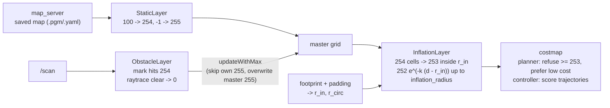

# 12.04 — Costmaps, inflation and the robot footprint

<!-- glance:start -->
<!-- generated by tools/build.py from curriculum/syllabus.yaml — edit the syllabus, not this block -->

| | |
|---|---|
| **Track** | Main path |
| **Difficulty** | Intermediate |
| **Time** | 50 min |
| **Hardware** | none |
| **Software** | python |
| **Prerequisites** | [12.02 Grid path planning — BFS, Dijkstra and A*](12.02-grid-path-planning.md) |
| **Skip if** | You can tune inflation radius and cost scaling with intent. |

<!-- glance:end -->

## What you will learn

- Explain a layered costmap (static, obstacle and inflation layers) and the meaning of Nav2's cost values 0, 1–252, 253, 254 and 255.
- Compute a footprint's inscribed and circumscribed radius exactly as Nav2 does, including `footprint_padding`.
- Compute inflation costs with Nav2's formula $252\,e^{-k(d - r_{\text{inscribed}})}$ and invert it to tune `inflation_radius` and `cost_scaling_factor` with intent.
- Build a costmap from a saved map plus a LiDAR scan, including raytrace clearing and unknown space, and plan a cost-aware path on it.
- Reimplement the inflation layer and pass the auto-grader against a line-by-line transcription of Nav2's code.

## Why it matters

The A* path of [12.02](12.02-grid-path-planning.md) is **shortest**, which means it scrapes every doorframe at exactly the robot's radius. One centimeter of localization error and karmel clips the wall. A human walks down the middle of a hallway, not along the wall. Costmaps are how Nav2 gets the same behavior: every cell gets a number that says "how bad is it to have the robot's center here", and planners and controllers trade distance against that cost. Both of karmel's costmaps in `nav2_params.yaml` are built from exactly the three layers in this lesson. `inflation_radius` and `cost_scaling_factor` are the two parameters people tune most and understand least.

<!-- prereqs:start -->
## Prerequisites

You need these first:

- [12.02 Grid path planning — BFS, Dijkstra and A*](12.02-grid-path-planning.md)

### Optional prerequisite links

None.

Check your readiness: `python course.py why 12.04`
<!-- prereqs:end -->

## Concept

### From "can I be here?" to "how much would I rather not be here?"

An occupancy grid answers a yes/no question per cell. A **costmap** answers a graded one:

| Cost | Nav2 name | Meaning for the robot's center in this cell |
|---|---|---|
| 0 | `FREE_SPACE` | nothing nearby |
| 1–252 | — | near an obstacle; the closer, the higher |
| 253 | `INSCRIBED_INFLATED_OBSTACLE` | **certain collision**: an obstacle is inside the inscribed circle of the footprint |
| 254 | `LETHAL_OBSTACLE` | the obstacle itself |
| 255 | `NO_INFORMATION` | unknown (never observed) |

Think of it as a heat map of danger. Planners refuse cells ≥ 253 and pay extra for high costs. Controllers score trajectories by the costs they cross.

### Layers, like middleware

A costmap is not built in one go. It's a stack of **layers**, each writing into a shared "master" grid in order, the way ASP.NET middleware or a chain of request filters each add their part:

1. **Static layer**: the saved map from SLAM ([11.07](../11-slam/11.07-mapping-your-room.md)). Walls → 254, free → 0, unknown → 255.
2. **Obstacle layer**: live sensor data. Each LiDAR beam **marks** its endpoint as 254 and **clears** the cells it passed through. This is how the laundry basket that isn't in the map gets in.
3. **Inflation layer**: looks at every 254 cell and paints decaying costs around it, using the robot's size.

Nav2 also has voxel layers (3D sensors), range layers (sonar/IR) and costmap **filters** (keepout zones, speed limits, [12.10](12.10-recovery-and-navigation-safety.md)).

### The footprint and its two circles

karmel's footprint in `nav2_params.yaml` is a 0.25 × 0.21 m rectangle around `base_link`. Two circles summarize it:

- **Inscribed circle**: the largest circle inside the footprint, radius 0.105 m. If an obstacle is closer than this to the center, the robot is **certainly** in collision, whatever its heading. Hence cost 253.
- **Circumscribed circle**: the smallest circle containing the footprint, radius 0.163 m. If every obstacle is farther than this, the robot is **certainly not** in collision, whatever its heading.

Between the two circles, collision depends on heading. The costmap alone can't tell, so controllers that care check the actual footprint polygon against the costmap.

> [!TIP]
> **Ask your teacher:** "Draw karmel's rectangle with its inscribed and circumscribed circles, then show me a wall position where the robot collides at heading 0° but not at 90°."

## Technical explanation

### Level 1 — Footprint radii, Nav2's way

Nav2 (`calculateMinAndMaxDistances` in `nav2_costmap_2d/footprint.cpp`) takes, over every vertex **and** every edge of the polygon, the distance from the origin (`base_link`):

$$r_{\text{inscribed}} = \min_{\text{vertices, edges}} \text{dist}, \qquad r_{\text{circumscribed}} = \max_{\text{vertices, edges}} \text{dist}$$

For a rectangle centered on the origin with half-sizes $a \ge b$: $r_{\text{in}} = b$, $r_{\text{circ}} = \sqrt{a^2 + b^2}$.

| Footprint | $r_{\text{in}}$ [m] | $r_{\text{circ}}$ [m] |
|---|---|---|
| `karmel.yaml` chassis 0.25 × 0.20 m | 0.100 | 0.160 (= `cfg.chassis.footprint_radius_m`, the simulator's collision radius) |
| `nav2_params.yaml` footprint 0.25 × 0.21 m | 0.105 | 0.163 |
| same, with `footprint_padding: 0.01` (every vertex pushed 1 cm out in x and y) | **0.115** | 0.177 |

The padded values are what the inflation layer uses. For footprints that aren't rectangles centered on `base_link`, the edge distance matters: a triangle $(0.2, 0), (-0.1, 0.15), (-0.1, -0.15)$ has vertex distances 0.2, 0.18, 0.18, but the slanted edges pass 0.0894 m from the origin. That's the inscribed radius.

### Level 2 — The inflation layer and its two knobs

For a cell whose center is at distance $d$ (between cell centers) from the nearest lethal cell, Nav2's `InflationLayer::computeCost` (Jazzy) is:

$$\text{cost}(d) = \begin{cases} 254 & d = 0 \\ 253 & 0 < d \le r_{\text{in}} \\ \left\lfloor 252 \cdot e^{-k\,(d - r_{\text{in}})} \right\rfloor & d > r_{\text{in}} \end{cases}$$

where $k$ is `cost_scaling_factor`, and only cells within `inflation_radius` get a cost at all. Two details from the source matter when you want exact numbers: the result is **truncated** to an integer (C++ `static_cast<unsigned char>`), and the radius is rounded **up** to whole cells (`ceil(inflation_radius / resolution)`).

With $r_{\text{in}} = 0.115$ m, from `costmap.py`:

```text
  d [m]   csf=10 (Nav2 default)  csf=5 (karmel)  csf=2
  0.00            254             254          254
  0.05            253             253          253
  0.10            253             253          253
  0.15            177             211          234
  0.20            107             164          212
  0.25             65             128          192
  0.30             39              99          174
  0.35             24              77          157
  0.45              8              47          128
  0.55              3              28          105
  0.70              0              13           78
```

Worked example: $k = 5$, $d = 0.20$: $252\,e^{-5 \times 0.085} = 252 \times 0.6538 = 164.7 \to 164$.

**Inverting the formula** is how you tune with intent. The distance where the cost falls to $c$:

$$d(c) = r_{\text{in}} + \frac{\ln(252 / c)}{k}$$

With $k = 5$: cost 128 at $0.115 + \ln(1.969)/5 = 0.250$ m, and cost 1 at $0.115 + \ln(252)/5 = 1.221$ m. With Nav2's default $k = 10$, cost 1 comes at 0.668 m.

**The two knobs:**

- `cost_scaling_factor` $k$ sets **how fast** cost decays. Large $k$: a thin, steep band; the robot happily passes 20 cm from walls. Small $k$: a wide, gentle slope; the robot prefers the middle of every space.
- `inflation_radius` sets **where the painting stops**. If it is smaller than $d(1)$, the cost drops off a cliff at the radius. With karmel's `inflation_radius: 0.35` and $k = 5$, cost jumps from 77 to 0 at 0.35 m. A path planner sees no difference between 0.36 m and 3 m from a wall.

Nav2's tuning guide recommends a smooth potential across the whole space: increase `inflation_radius` and decrease `cost_scaling_factor` together, so paths stay centered in hallways and doorways. A good starting point: set `inflation_radius` ≈ $d(\text{some small cost})$ for your $k$, and pick $k$ so a typical doorway's center still has a moderate cost.

**Doorways, numerically.** A 0.80 m door: the center is 0.40 m from each jamb. With $k = 5$ the formula gives cost 60 there (but karmel's 0.35 m radius cuts it to **0**); with $k = 10$, cost 14; with $k = 2$, cost 142. The robot's center can use a band $0.80 - 2 \times 0.115 = 0.57$ m wide before hitting 253. Doorways are passable in all these cases. The knobs decide how strongly the planner prefers the door's center.

**Cost-aware planning.** Plug the costs into A* from 12.02 as a step cost multiplier: a step into cell $n$ costs $\ell \cdot (1 + w \cdot \text{cost}_n / 252)$ (the course code uses $w = 3$; Nav2's Smac 2D calls this `cost_travel_multiplier`, and NavFn adds a neutral cost plus the cell cost). The octile heuristic stays admissible, because the multiplier is ≥ 1. On the apartment with an unmapped basket (`costmap.py`):

```text
karmel: cost_scaling_factor=5.0, inflation_radius=0.35 m
  shortest path in C-space : 4.39 m, min clearance 0.168 m (robot radius 0.160)
  cost-aware path          : 4.68 m, min clearance 0.346 m

smooth: cost_scaling_factor=3.0, inflation_radius=0.8 m
  shortest path in C-space : 4.39 m, min clearance 0.168 m (robot radius 0.160)
  cost-aware path          : 5.25 m, min clearance 0.426 m
```

The shortest path passes 8 mm from contact (0.168 − 0.160). The cost-aware path is 29 cm longer and keeps 19 cm more clearance. The smooth setting buys another 8 cm of clearance for 57 cm more path. That's a trade-off you choose deliberately, not a default you inherit.

### Level 3 — Layers, combination rules and unknown space

**Static layer** (`nav2_costmap_2d::StaticLayer`). With the default `trinary_costmap: true`, map values ≥ `lethal_cost_threshold` (default 100) → 254; unknown (−1) → 255 if `track_unknown_space: true`, otherwise 0; everything else → 0.

**Obstacle layer** (`nav2_costmap_2d::ObstacleLayer`), per observation source:

- **Marking**: a return closer than `obstacle_max_range` (karmel: 3.5 m) marks its cell 254.
- **Clearing**: raytracing from the sensor to each return, up to `raytrace_max_range` (karmel: 4.0 m), sets the cells in between to free. A beam with no return clears its whole raytrace range. This is how a person who walked away disappears from the costmap. A beam that only marks and never clears leaves "ghost" obstacles.
- The layer keeps its own grid (initialized to 255 when tracking unknown space) and combines into the master with **max**, with two twists (`CostmapLayer::updateWithMax`): the layer's own unknown cells are skipped, and a master cell that is unknown is overwritten. The LiDAR can therefore turn unmapped space into known free space, but it cannot erase a wall from the static map.

**Inflation layer** combination (from `inflation_layer.cpp`): for a master cell that is 255 (unknown), the inflated cost is written **only if it is ≥ 253** (unless `inflate_unknown: true`). "Near a wall" must not turn "never seen" into "seen and fairly safe". Otherwise the cell becomes max(old, new).

Worked example of the unknown rule, $r_{\text{in}} = 0.1$ m, $k = 5$, 5 cm cells, a wall at column 0: a known free cell at 0.30 m gets $\lfloor 252\,e^{-1.0} \rfloor = 92$; an unknown cell at 0.05 m becomes 253; an unknown cell at 0.20 m would get 152, but stays **255**.

**Where the robot's center may be.** For a circular robot, cost ≥ 253 is exactly C-space from 12.02 with the inscribed radius (the auto-grader checks this on the apartment). For karmel's rectangle, the cost at the circumscribed radius (0.177 m, $k = 5$: **184**) is the "possibly in collision" threshold. A footprint collision checker can skip the polygon test wherever the cost under the robot's center is below that value, since no heading can collide there. Nav2's footprint-aware planners and critics use this shortcut.

### Level 4 — Implementation and Nav2 mapping

> [!IMPORTANT]
> **Version-sensitive** (verified 2026-09 against Nav2 1.3.x on ROS 2 Jazzy: docs pages for Costmap 2D, the inflation, obstacle and static layers, and the Jazzy source of `inflation_layer.cpp`, `cost_values.hpp`, `footprint.cpp`).
> Check before tuning: https://docs.nav2.org/jazzy/configuration_and_development/configuration_guide/core_servers/costmap_2d/
> AI teacher: verify against current documentation before giving instructions.

| Parameter (karmel value) | Nav2 default | Effect |
|---|---|---|
| `footprint` (0.25 × 0.21 m polygon) | `[]` (then `robot_radius`, default 0.1) | defines $r_{\text{in}}$, $r_{\text{circ}}$ |
| `footprint_padding` (0.01) | 0.01 | pushes vertices out: $r_{\text{in}}$ 0.105 → 0.115 |
| `resolution` (0.05) | 0.1 | cell size |
| `track_unknown_space` (global: true) | false | unknown = 255 instead of free |
| `inflation_layer.inflation_radius` (0.35) | 0.55 | where painting stops |
| `inflation_layer.cost_scaling_factor` (5.0) | 10.0 | decay rate $k$ |
| `obstacle_layer.scan.obstacle_max_range` / `raytrace_max_range` (3.5 / 4.0) | 2.5 / 3.0 | marking / clearing range |
| `local_costmap.rolling_window` (true), `width`/`height` (2) | false, 5 | the 2 × 2 m window around the robot (12.01) |

Two couplings to remember for 12.05 and 12.08:

- karmel's controller, Regulated Pure Pursuit, slows down near obstacles by reading the cost under the robot and **inverting the inflation formula** to estimate the distance to the nearest obstacle (`costConstraint` in its Jazzy source, using `cost_scaling_dist` and `cost_scaling_gain`). karmel's file sets RPP's `inflation_cost_scaling_factor: 5.0` to the same value as the costmap's `cost_scaling_factor`. If they differ, the controller misjudges distances.
- MPPI's `CostCritic` scores sampled trajectories by these costs, so a steep, thin inflation band makes MPPI graze walls too.

The course implementation [`code/costmap.py`](code/costmap.py) computes exact Euclidean distances with a distance transform. Nav2 propagates a "brushfire" from the obstacle cells in distance order, which gives the same distances except in rare tie cases.

## Diagram



```text
 Cost across a wall, karmel's padded footprint (r_in = 0.115 m), cost_scaling_factor 5, 5 cm cells

 cost
 254 |█
 253 |█ ██ ██
 211 |        ██
 164 |           ██
 128 |              ██
  99 |                 ██
  77 |                    ██        <- inflation_radius 0.35 m: cliff to 0
   0 |________________________██ ██ ██ ██ ...        (with 0.8 m and k = 3: 124 at 0.35 m, 107 at 0.40 m ... a gentle slope)
      0   .05  .10  .15  .20  .25  .30  .35  .40  d [m]
     wall  |<- r_in ->|
           robot center here = certain collision
```

## Code

[`code/costmap.py`](code/costmap.py) (tested by `code/test_costmap.py`) implements footprint radii and padding, `inflation_cost`, `distance_for_cost`, `inflate` with Nav2's combination rule, `static_layer`, `obstacle_layer` (mark + raytrace clear), `combine_max`, and the cost-to-A*-penalty conversion used by 12.01 and 12.05. The inflation core:

```python
def inflate(master, resolution, inscribed_radius_m, cost_scaling_factor, inflation_radius_m, inflate_unknown=False):
    out = master.copy()
    lethal = master == LETHAL_OBSTACLE
    if not lethal.any():
        return out
    dist_cells = distance_transform_edt(~lethal)                            # to the nearest 254 cell, in cells
    cell_radius = max(0.0, math.ceil(inflation_radius_m / resolution))       # Costmap2D::cellDistance
    d = dist_cells * resolution
    cost = np.floor(MAX_NON_OBSTACLE * np.exp(-cost_scaling_factor * (d - inscribed_radius_m)))
    cost = np.where(d <= inscribed_radius_m, INSCRIBED_INFLATED_OBSTACLE, cost)
    cost = np.where(dist_cells == 0, LETHAL_OBSTACLE, cost)
    cost = np.where(dist_cells <= cell_radius, cost, FREE_SPACE).astype(np.uint8)
    unknown = master == NO_INFORMATION
    takes = cost > FREE_SPACE if inflate_unknown else cost >= INSCRIBED_INFLATED_OBSTACLE
    return np.where(unknown, np.where(takes, cost, out), np.maximum(out, cost)).astype(np.uint8)
```

Run it:

```bash
python 12-navigation/code/costmap.py
```

It prints the footprint table, the inflation table and the planning comparison quoted above, plus `csf= 5.0: cost drops below 128 at 0.250 m, below 10 at 0.760 m`, and writes:

- `nav_out/12.04_inflation_curves.png`: cost vs distance for (k = 10, 0.55 m), (5, 0.35 m) and (3, 0.8 m). The karmel curve visibly falls off a cliff at 0.35 m.
- `nav_out/12.04_costmap_karmel.png` and `12.04_costmap_smooth.png`: left, the static + obstacle layer: gray unknown outside the walls, black walls, LiDAR points in cyan and the unmapped basket at (2.2, 1.5). Right, after inflation: colored bands around every obstacle, the blue shortest path hugging the dark 253 band and the green cost-aware path through the middle of the doorway.

## Exercise

All exercises need hardware: none.

### Exercise 12.04-E1 — Tune with a calculator `[numerical]`

karmel's padded footprint has $r_{\text{in}} = 0.115$ m. (a) Cost at 0.30 m for $k$ = 10, 5, 3. (b) For $k = 5$, at what distance does the cost fall below 50? Below 1? (c) Choose an `inflation_radius` that removes the cliff for $k = 5$ (cost ≤ 5 at the edge). (d) Your hallway is 0.90 m wide. With $k = 5$ and your radius from (c), what cost does the planner see at the hallway's center line?

### Exercise 12.04-E2 — Reimplement Nav2's inflation layer `[coding]`

Implement `footprint_radii`, `inflation_cost`, `distance_for_cost` and `inflate` in [`labs/exercises/12.04/student.py`](../labs/exercises/12.04/student.py) ([README](../labs/exercises/12.04/README.md)). The tests compare against a transcription of Nav2's C++ for thousands of distances, footprints from `karmel.yaml` and `nav2_params.yaml`, unknown-cell handling and the apartment map.

Check it: `python course.py check 12.04`

### Exercise 12.04-E3 — Where does the path go? `[simulation]`

In `costmap.py`'s `main`, add a third setting `("steep", 10.0, 0.55)` (Nav2's defaults) next to `karmel` and `smooth`. **Predict** before running: path length and minimum clearance of the cost-aware path, compared with the two existing settings. Run and compare the three PNGs.

### Exercise 12.04-E4 — Unknown space and raytracing `[predict]`

In the apartment demo, the static map is unknown (255) outside the walls. (a) What cost does a cell just outside the outer wall, 0.05 m from it, have after inflation? And 0.30 m from it? (b) A beam hits the basket at 0.8 m. What does the obstacle layer write into the cells between the robot and the basket, and into the basket cell? (c) What happens to the costmap if the obstacle layer's `clearing` is set to false and the basket is removed?

### Exercise 12.04-E5 — "No valid path" through the bedroom door `[debugging]`

A classmate configured `robot_radius: 0.36` "to be safe" (no footprint), `cost_scaling_factor: 5.0` and `inflation_radius: 0.35`. Nav2 fails to plan from the kitchen into the bedroom, through the 0.80 m door at x = 4.5–5.3, y = 2.8. Use `inflation_cost` and the door geometry to show why, and propose two fixes with numbers. Check your answer with `cm.inflate(cm.static_layer(grid), 0.05, r, 5.0, 0.35)` on the apartment grid and print the costs along the door row (y = 2.8, x = 4.5–5.3).

## Expected result

- **12.04-E1:** (a) $d - r = 0.185$: $k = 10$: $\lfloor 252\,e^{-1.85}\rfloor = 39$; $k = 5$: 99; $k = 3$: 144. (b) $d(50) = 0.115 + \ln(5.04)/5 = 0.438$ m; $d(1) = 1.221$ m. (c) $d(5) = 0.115 + \ln(50.4)/5 = 0.899$ m, so `inflation_radius: 0.9`. (d) Center 0.45 m from each wall: $\lfloor 252\,e^{-5 \times 0.335} \rfloor = 47$. A moderate cost, enough to keep paths centered without blocking the hallway.
- **12.04-E2:** `python course.py check 12.04` ends with `20 passed`.
- **12.04-E3:** Reference: steep (10, 0.55 m): **4.68 m, clearance 0.376 m**; karmel (5, 0.35 m): 4.68 m, 0.346 m; smooth (3, 0.8 m): 5.25 m, 0.426 m. If you predicted "steeper decay → less clearance", the result surprises you: the steep setting keeps **more** clearance than karmel's. Its painted band reaches 0.55 m, while karmel's stops at 0.35 m. Beyond its radius the planner can't tell 0.36 m from 3 m. Here `inflation_radius` matters more than `cost_scaling_factor`, which is the cliff effect in action.
- **12.04-E4:** (a) At 0.05 m, inside the 0.115 m inscribed radius: 253 is written over 255. At 0.30 m the inflated cost (99) is < 253, so the cell stays **255**. (b) Between robot and basket: 0 (cleared). The basket's hit cell: 254. Around it, after inflation: 253, then 211, 164, … (c) Without clearing, the basket's 254 cells stay forever after it is removed ("ghost obstacle"), until the costmap is cleared (Nav2's clear-costmap recovery, 12.10).
- **12.04-E5:** The rasterized wall ends (jamb cells) are 16 cells apart along the door row, so the two middle cells are 7 cells = 0.35 m from the nearest lethal cell. With $r_{	ext{in}} = 0.36$ m every cell in the doorway is ≤ 0.36 m from a jamb, so all become 253, and A* finds no path. The door row reads `254, 253, 253, …, 253, 254`. Fixes: (1) the real footprint, $r_{	ext{in}} = 0.115$ m: the door row becomes `254, 253, 253, 211, 164, 128, 99, 77, 77, 99, 128, 164, 211, 253, 253, 254`, a clear corridor with the lowest cost in the middle; (2) if you insist on a circle, the circumscribed 0.177 m: middle costs 106. Even `robot_radius: 0.35` would pass, with middle costs 251: one centimeter decides. Keep the safety margin in the decay (smaller $k$, larger `inflation_radius`), never in the lethal radius.

## Troubleshooting

### Symptom: the robot hugs walls although inflation is configured

1. Is the planner cost-aware? NavFn and Smac use costs; a planner or controller configured to treat only ≥ 253 as blocked (or a very high `cost_scaling_factor`) behaves like pure C-space.
2. Look at the costmap in RViz with the "costmap" color scheme. Is the colored band visible and wide enough? Compute $d(c)$ for your $k$.
3. Is `inflation_radius` smaller than your intended safe distance (the cliff)? Raise it.

### Symptom: "no valid path" in narrow places

1. Compute the free band: gap width − 2 × $r_{\text{in}}$ (with padding). If that's under ~2 cells, map noise closes it.
2. Is the footprint much larger than the robot (a `robot_radius` set "to be safe")?
3. Is the path through unknown space, with `allow_unknown: false` or `track_unknown_space: true`? Check the static map for 205-gray speckles in doorways.

### Symptom: obstacles stay in the costmap after they are gone

1. `clearing: True` on the observation source?
2. `raytrace_max_range` ≥ `obstacle_max_range`? A hit marked at 3.5 m can only be cleared by rays that reach 3.5 m.
3. The sensor can't see the spot anymore (behind the robot, below the scan plane): nothing clears it. Use the clear-costmap recovery.

### Symptom: obstacles appear that aren't there

1. LiDAR sees the robot's own body or mast: set a minimum range (`obstacle_min_range`, `raytrace_min_range`) or a laser filter.
2. Wrong TF between `base_link` and the laser: marks land in the wrong place, typically rotating with the robot ([05.11](../05-frames-and-transforms/05.11-debugging-tf.md)).

## Common mistakes

- **Using `robot_radius` for a rectangular robot "to be safe".** It inflates the lethal zone and closes doorways. Use the real footprint and tune the decay for safety.
- **`inflation_radius` smaller than the footprint.** The 253 band is computed from $r_{\text{in}}$, but painting stops at the radius, leaving no gradient at all.
- **Tuning `cost_scaling_factor` without `inflation_radius`** (or the reverse). They define one curve together; compute $d(c)$.
- **Mismatched RPP `inflation_cost_scaling_factor`** and the costmap's `cost_scaling_factor`: the controller misjudges obstacle distance.
- **Forgetting footprint padding** when computing clearances by hand.
- **Rounding instead of truncating** when checking costs against Nav2 by hand (164.7 → 164).

## Knowledge check

1. What do 253, 254 and 255 mean, and which one does a planner never enter?
   <details><summary>Answer</summary>

   254 lethal: the obstacle cell. 253 inscribed: an obstacle within the inscribed radius of the robot's center, certain collision. 255: unknown. Planners never enter ≥ 253 cells; unknown is allowed or not depending on `allow_unknown`.
   </details>

2. Compute inscribed and circumscribed radii of a 0.40 × 0.30 m footprint centered on `base_link`, with 0.02 m padding.
   <details><summary>Answer</summary>

   Padded half-sizes 0.22 and 0.17 m: $r_{\text{in}} = 0.17$ m, $r_{\text{circ}} = \sqrt{0.22^2 + 0.17^2} = 0.278$ m.
   </details>

3. With $r_{\text{in}} = 0.2$ m and $k = 4$, what is the cost at 0.5 m? Where does the cost reach 100?
   <details><summary>Answer</summary>

   $\lfloor 252\,e^{-1.2} \rfloor = \lfloor 75.9 \rfloor = 75$. $d(100) = 0.2 + \ln(2.52)/4 = 0.431$ m.
   </details>

4. Predict: you halve `cost_scaling_factor` and leave `inflation_radius` unchanged at 0.35 m. What happens to paths through a 0.9 m hallway?
   <details><summary>Answer</summary>

   Costs near walls go up (slower decay), but the painted band still ends at 0.35 m, now with a higher cliff. The hallway center is 0.45 m from each wall, so its cost stays 0: the planner still can't tell the center from 0.36 m off a wall. Paths improve only if you also raise `inflation_radius`.
   </details>

5. Why doesn't an unknown cell 0.3 m from a wall get the inflated cost 99?
   <details><summary>Answer</summary>

   Nav2's inflation layer only overwrites `NO_INFORMATION` cells with costs ≥ 253 (unless `inflate_unknown`). Writing 99 would turn "never observed" into "observed, moderately risky", and planners with `allow_unknown: false` would suddenly plan through unexplored space.
   </details>

6. Debugging: a person walked past; ten seconds later the local costmap still shows a trail of lethal cells where they were. Name three possible causes.
   <details><summary>Answer</summary>

   `clearing: false` on the source; `raytrace_max_range` shorter than the marking range; the cells are outside the LiDAR's current field of view (behind the mast, below the scan plane) so no ray passes through them. Also possible: `observation_persistence` keeping old observations, or a wrong sensor frame so rays go elsewhere.
   </details>

7. What does the circumscribed-radius cost (184 for karmel with $k = 5$) let a controller skip?
   <details><summary>Answer</summary>

   Cells with cost below it are more than $r_{\text{circ}}$ from any obstacle, so the footprint cannot collide at any heading. The expensive polygon-vs-costmap check is only needed where cost ≥ 184 (and < 253).
   </details>

## Practical challenge

Write `tune_inflation.py` that, for karmel's padded footprint, sweeps `cost_scaling_factor` ∈ {2, 3, 5, 10} and `inflation_radius` ∈ {0.35, 0.55, 0.8, 1.2} on the apartment with the unmapped basket, plans cost-aware paths living room → kitchen, study and bedroom, and reports path length and minimum clearance to the **true** world (`world.distance_to_obstacles`) for each pair.

**Acceptance criteria:** a table and a scatter plot (length vs minimum clearance, one point per setting and goal); you pick one setting and justify it in three sentences with numbers (e.g. "≥ 0.30 m clearance everywhere for ≤ 10% extra length"); you state the matching `nav2_params.yaml` lines, including RPP's `inflation_cost_scaling_factor`; and you explain the cliff effect with one of your own numbers.

## You can skip this if…

You answer knowledge-check questions 3, 4 and 5 correctly without looking and `python course.py check 12.04` passes with your own code.

`python course.py skip 12.04 --reason "I tune inflation radius and cost scaling with intent"`

## Go deeper

- Nav2 Costmap 2D configuration (Jazzy): https://docs.nav2.org/jazzy/configuration_and_development/configuration_guide/core_servers/costmap_2d/ — every costmap parameter and the layer plugins.
- Nav2 inflation layer parameters: https://docs.nav2.org/jazzy/configuration_and_development/configuration_guide/core_servers/costmap_2d/costmap_plugins/inflation/ — `inflation_radius`, `cost_scaling_factor`, `inflate_unknown`, `inflate_around_unknown`.
- Nav2 obstacle layer parameters: https://docs.nav2.org/jazzy/configuration_and_development/configuration_guide/core_servers/costmap_2d/costmap_plugins/obstacle/ — marking, clearing and ranges per observation source.
- Nav2 tuning guide: https://docs.nav2.org/jazzy/configuration_and_development/tuning_guide/ — the "smooth potential field" advice and footprint vs radius.
- `inflation_layer.cpp` in the Nav2 source (Jazzy branch): https://github.com/ros-navigation/navigation2/blob/jazzy/nav2_costmap_2d/plugins/inflation_layer.cpp — the code the auto-grader transcribes.

## Progress checkpoint

- [ ] I can explain costs 0, 1–252, 253, 254, 255 and what each layer writes.
- [ ] I can compute inscribed/circumscribed radii with padding, as Nav2 does.
- [ ] I can compute and invert the inflation formula and tune both knobs with numbers.
- [ ] My inflation layer passes `python course.py check 12.04`.
- [ ] I can explain raytrace clearing and why unknown cells stay unknown.

`python course.py complete 12.04` (exercises done) · `python course.py master 12.04` (challenge done) · `python course.py struggle 12.04 "what was hard"`

Next: [12.05 — Local planning — pure pursuit, DWB, MPPI and obstacle avoidance](12.05-local-planning-obstacle-avoidance.md).
