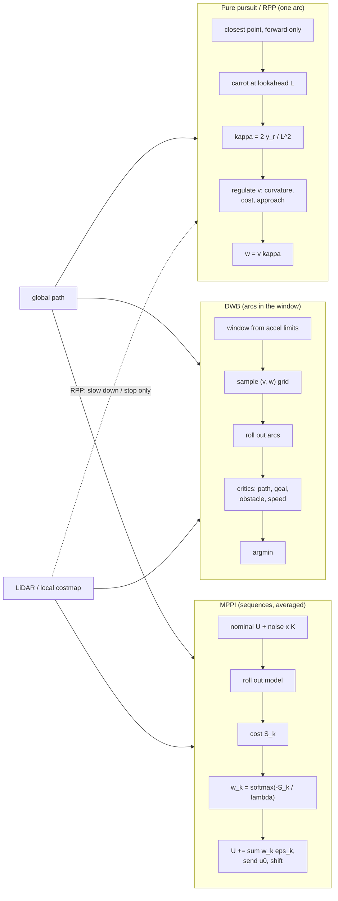

# 12.05 — Local planning — pure pursuit, DWB, MPPI and obstacle avoidance

<!-- glance:start -->
<!-- generated by tools/build.py from curriculum/syllabus.yaml — edit the syllabus, not this block -->

| | |
|---|---|
| **Track** | Main path |
| **Difficulty** | Advanced |
| **Time** | 1 h 15 min |
| **Hardware** | none |
| **Software** | python |
| **Prerequisites** | [12.04 Costmaps, inflation and the robot footprint](12.04-costmaps.md)<br>[09.02 The other way — cmd_vel to wheel speeds (with saturation)](../09-odometry/09.02-inverse-kinematics-cmd-vel.md) |
| **Optional prerequisites** | [FCT.06 State space, LQR and MPC — an introduction](../optional-foundations/control-theory/FCT.06-state-space-lqr-mpc.md) |
| **Skip if** | You have implemented pure pursuit and know how DWB and MPPI choose velocities. |

<!-- glance:end -->

## What you will learn

- Derive the pure pursuit curvature $\kappa = 2y/L^2$ and implement a pure pursuit controller that follows a path in the simulator and stops at the goal (auto-graded).
- Explain what Regulated Pure Pursuit adds (curvature, proximity and approach speed limits, rotate-to-heading) and compute each regulation by hand.
- Implement a dynamic-window planner that samples $(v, \omega)$, rolls out arcs and scores them against the path and the LiDAR points, and relate its terms to Nav2's DWB critics.
- Explain MPPI (sample noisy control sequences, cost them, softmax-weight and average) and predict the effect of its temperature.
- Choose a local planner for a robot and map its knobs to Nav2 parameter names.

## Why it matters

The global planner hands karmel a path: 87 points, 5 cm apart, from the living room to the kitchen. Something must turn that list into `cmd_vel` 20 times a second, cope with wheels that don't do exactly what they're told, and not drive into the laundry basket that appeared after the map was made. That's Nav2's `controller_server`, and its `FollowPath` plugin is the most consequential choice in the whole `nav2_params.yaml`. karmel uses Regulated Pure Pursuit, and the file's header explains why not MPPI. After this lesson you can read that justification critically, and you'll have run all three families side by side in the course simulator.

<!-- prereqs:start -->
## Prerequisites

You need these first:

- [12.04 Costmaps, inflation and the robot footprint](12.04-costmaps.md)
- [09.02 The other way — cmd_vel to wheel speeds (with saturation)](../09-odometry/09.02-inverse-kinematics-cmd-vel.md)

### Optional prerequisite links

New to any of these? Take the foundation lesson first; skip it if you already know it.

- [FCT.06 State space, LQR and MPC — an introduction](../optional-foundations/control-theory/FCT.06-state-space-lqr-mpc.md)

Check your readiness: `python course.py why 12.05`
<!-- prereqs:end -->

## Concept

### Three ways to drive a path

**Pure pursuit: chase a carrot.** Pick the point on the path one "lookahead distance" ahead of the robot (the carrot). Drive the circular arc that ends exactly there. Next cycle, pick a new carrot. It's how you ride a bicycle: look a few meters ahead, not at your front wheel. Short lookahead: tight tracking, twitchy. Long lookahead: smooth, cuts corners. It knows nothing about obstacles.

**Dynamic window (DWA/DWB): try all reachable velocities.** From the current speed, the motors can only reach a small window of $(v, \omega)$ in the next 0.1 s. Sample that window (say 8 speeds × 21 turn rates), imagine driving each constant command for 1.7 s, and score each imagined arc: close to the path? progressing toward the goal? far from obstacles? fast? Pick the best, send it, repeat. It's like choosing the next move by evaluating a small menu of options with a scoring function.

**MPPI: sample whole plans and average the good ones.** Keep a plan: a sequence of commands for the next 2 s. Make hundreds of noisy copies, simulate them all, compute a cost for each. Then **average** the copies, weighting cheap ones exponentially more (a softmax). Execute the first command, shift the plan, repeat. Think of an ensemble of forecasts where the most accurate models get the most say. No gradients needed, so any cost works, including "don't hit anything".

| | Pure pursuit / RPP | DWB | MPPI |
|---|---|---|---|
| Looks at obstacles | RPP: slows down near them, stops before collision; doesn't steer around | yes, scores arcs | yes, scores trajectories |
| Candidate motions | one arc | constant $(v, \omega)$ arcs | arbitrary command sequences |
| Compute | microseconds | hundreds of arc evaluations | thousands of rollouts (karmel's config comment: ~2000 × 56 steps at 20 Hz) |
| Tuning | a handful of geometric parameters | critic weights | critic weights, noise, temperature |
| In Nav2 | `nav2_regulated_pure_pursuit_controller::RegulatedPurePursuitController` | `dwb_core::DWBLocalPlanner` | `nav2_mppi_controller::MPPIController` |

> [!TIP]
> **Ask your teacher:** "Play the carrot game with me: give me a robot pose and a path, and let me compute the carrot, its coordinates in base_link and the curvature, step by step."

## Technical explanation

### Level 1 — Pure pursuit geometry

Put the robot at the origin of `base_link`, heading along $+x$. Transform the carrot into this frame ([05.03](../05-frames-and-transforms/05.03-rigid-transforms-2d.md)): $(x_r, y_r)$, at distance $L = \sqrt{x_r^2 + y_r^2}$. A differential-drive robot moving with constant $(v, \omega)$ drives a circle of radius $R = v/\omega$ tangent to its heading. So its center is at $(0, R)$. The circle must pass through the carrot:

$$x_r^2 + (y_r - R)^2 = R^2 \;\Rightarrow\; x_r^2 + y_r^2 = 2 y_r R \;\Rightarrow\; \kappa = \frac{1}{R} = \frac{2\,y_r}{L^2}$$

Then $\omega = v\,\kappa$, and wheel speeds follow from [09.02](../09-odometry/09.02-inverse-kinematics-cmd-vel.md).

Worked example (one of the auto-grader's cases): path along the x axis, robot at $(0.5, 0.1)$ heading 0, $L = 0.3$ m. The carrot is where the circle of radius 0.3 around the robot crosses the path: $x = 0.5 + \sqrt{0.09 - 0.01} = 0.7828$. In `base_link`: $(0.2828, -0.1)$. $\kappa = 2(-0.1)/0.09 = -2.222$ m⁻¹ (turn right, radius 0.45 m). At $v = 0.2$ m/s: $\omega = -0.444$ rad/s. Wheels ($r = 0.045$, $b = 0.2$): left $(0.2 + 0.0444)/0.045 = 5.43$ rad/s, right $(0.2 - 0.0444)/0.045 = 3.46$ rad/s.

**What a real implementation adds** (the auto-graded exercise requires all of it):

- **Progress index.** Search the closest path point only forward from the last one. A path that passes near itself would otherwise make the robot jump back.
- **Carrot on the path, not on a vertex.** Intersect the lookahead circle with the path segment.
- **Rotate in place** when the carrot is more than ~45° off the heading. A differential drive can, and the arc would be huge.
- **Approach slow-down** in the last 0.4 m and a **goal tolerance** that sets `done` and commands zero.
- **Angular limit that keeps the arc:** if $|\omega|$ exceeds the limit, scale $v$ down by the same factor, so $\kappa$ is unchanged.

**Lookahead, measured** (reference `PurePursuit`, perfect simulated robot, the 4.20 m global path):

| `lookahead_dist` [m] | max cross-track error | notes |
|---|---|---|
| 0.08 | 0.7 cm | most command jitter (std of Δω 0.019 rad/s per step) |
| 0.15 | 1.4 cm | |
| 0.30 | 3.1 cm | karmel-like |
| 0.60 | 7.7 cm | smooth, cuts corners |
| 1.00 | 11.5 cm | clearly cuts corners; minimum clearance drops from 25 to 22 cm |

On the real robot, small lookaheads also oscillate: latency, localization jitter and wheel slip turn the jitter into weaving. That's why RPP scales the lookahead with speed.

### Level 2 — Regulated Pure Pursuit, number by number

RPP (Macenski et al., 2023) keeps the geometry and **regulates the speed**. With karmel's parameters from `nav2_params.yaml`:

1. **Velocity-scaled lookahead** (`use_velocity_scaled_lookahead_dist: true`): $L = \text{clamp}(v \cdot \text{lookahead\_time},\ \text{min},\ \text{max})$. At 0.25 m/s: $0.25 \times 1.5 = 0.375$ m, within [0.25, 0.8].
2. **Curvature constraint** (`regulated_linear_scaling_min_radius: 0.5`): if the arc radius $R < R_{\min}$, then $v \leftarrow v\,(1 - |R - R_{\min}|/R_{\min})$, i.e. $v \cdot R/R_{\min}$, but not below `regulated_linear_scaling_min_speed: 0.08`. Example: $R = 0.3$ m: $v = 0.25 \times 0.6 = 0.15$ m/s.
3. **Cost (proximity) constraint** (`use_cost_regulated_linear_velocity_scaling: true`): read the costmap cost under the robot and invert the inflation formula of [12.04](12.04-costmaps.md) to estimate the obstacle distance: $d = (k\,r_{\text{in}} - \ln c + \ln 253)/k$. If $d <$ `cost_scaling_dist` (0.3), then $v \leftarrow v \cdot \text{gain} \cdot d / 0.3$. Example: cost 128, $k = 5$, $r_{\text{in}} = 0.115$: $d = (0.575 - 4.852 + 5.533)/5 = 0.251$ m, so $v = 0.25 \times 0.837 = 0.209$ m/s. This is why RPP's `inflation_cost_scaling_factor` must equal the costmap's `cost_scaling_factor`.
4. **Approach velocity** (`approach_velocity_scaling_dist: 0.4`, `min_approach_linear_velocity: 0.05`): with 0.2 m of path left, $v = 0.25 \times 0.2/0.4 = 0.125$ m/s.
5. **Rotate to heading** (`use_rotate_to_heading: true`, `rotate_to_heading_min_angle: 0.785`): turn in place at `rotate_to_heading_angular_vel` when the path direction is more than 45° off.
6. **Collision detection** (`use_collision_detection: true`): project the commanded arc forward for `max_allowed_time_to_collision_up_to_carrot` (1.5 s) and stop if the footprint would hit a lethal cell. RPP stops for the basket; it never steers around it. Around-steering is left to replanning (the global costmap sees the basket too) or to a different controller.

In the simulator (`local_planning.py`), plain pure pursuit and RPP both follow the clean path with ≤ 4.2 cm error and stop 4.6 cm from the goal (inside the 5 cm tolerance). Pure pursuit **without** any obstacle awareness drives into the basket and stalls there:

```text
pure pursuit (no basket)           reached=True t= 18.4 s  max CTE  3.1 cm  final error  4.6 cm  collided=False
regulated pure pursuit (no basket) reached=True t= 18.3 s  max CTE  4.2 cm  final error  4.6 cm  collided=False
pure pursuit (basket)              reached=False t=  7.1 s  min clearance   0.0 cm  max deviation from path  0.0 cm  collided=True
```

### Level 3 — Dynamic window and MPPI, mathematically

**Dynamic window.** With current $(v, \omega)$, acceleration limits $(a_v, a_\omega)$ and control period $\Delta t$, the reachable window is

$$V_d = [v - a_v\Delta t,\ v + a_v\Delta t] \cap [v_{\min}, v_{\max}], \qquad \Omega_d = [\omega - a_\omega\Delta t,\ \omega + a_\omega\Delta t] \cap [-\omega_{\max}, \omega_{\max}]$$

karmel ($a_v = 0.6$, $a_\omega = 2.0$, $\Delta t = 0.1$) at $v = 0.20$, $\omega = 0$: $V_d = [0.14, 0.25]$, $\Omega_d = [-0.2, 0.2]$. Each sample $(v, \omega)$ is rolled out as an exact arc, $x(t) = \frac{v}{\omega}\sin\omega t$, $y(t) = \frac{v}{\omega}(1 - \cos\omega t)$, and scored. The course's `dwa_choose`:

$$J = 2.0\, d_{\text{path}}(\text{end}) + 3.0\, d_{\text{carrot}}(\text{end}) + \frac{0.1}{\text{clearance}} + 1.0\,\frac{v_{\max} - v}{v_{\max}}, \quad J = \infty \text{ if clearance} < 3\text{ cm}$$

where clearance is the smallest distance from any rollout point to any LiDAR point, minus the robot radius. Nav2's DWB has the same structure, split into **critic plugins** with `scale` weights: `PathDist` (distance to path, default scale 32), `GoalDist` (24), `PathAlign` (32), `GoalAlign` (24), `BaseObstacle` (sum of costmap costs along the trajectory), plus `RotateToGoal`, `Oscillation`, `PreferForward` and `Twirling`. DWB reads obstacles from the **local costmap**, not raw points, and its defaults are `sim_time: 1.7`, `vx_samples: 20`, `vtheta_samples: 20`.

DWA's weakness is its short horizon and its restriction to constant arcs. It reacts late and locally. Measured with the basket: it avoids it with 13.3 cm clearance, but slows down near it, taking 30.9 s instead of 18.4 s.

**MPPI.** Keep a nominal control sequence $U = (u_0, \dots, u_{T-1})$. For $k = 1 \dots K$, sample noise $\varepsilon_k$ (Gaussian, std `vx_std`, `wz_std`), roll out $U + \varepsilon_k$ through the motion model, compute the trajectory cost $S_k$ (critics), then

$$w_k = \frac{\exp\!\big(-(S_k - S_{\min})/\lambda\big)}{\sum_j \exp\!\big(-(S_j - S_{\min})/\lambda\big)}, \qquad U \leftarrow U + \sum_k w_k\,\varepsilon_k$$

$\lambda$ is the **temperature**. Worked example with three samples, costs 1.0, 1.3, 2.0, $\lambda = 0.3$: $e^{0} = 1$, $e^{-1} = 0.368$, $e^{-3.33} = 0.036$; normalized weights 0.712, 0.262, 0.025. If the three samples perturbed $v$ by +0.05, −0.02, +0.10 m/s, the update is $0.712(0.05) + 0.262(-0.02) + 0.025(0.10) = +0.033$ m/s. A small $\lambda$ (→ 0) means "take the best sample" (greedy, jerky). A large $\lambda$ means "average everything" (smooth, indecisive). Measured in the basket scenario (course MPPI, 400 samples × 20 steps × 0.1 s):

| temperature | reached | time | min clearance | rms change of ω between cycles |
|---|---|---|---|---|
| 0.03 | yes | 34.8 s | 2.1 cm | 0.78 rad/s (jerky) |
| 0.3 | yes | 28.2 s | 6.1 cm | 0.14 rad/s |
| 3.0 | **no** (timeout 45 s) | — | 5.2 cm | 0.12 rad/s |

MPPI is sampling-based MPC ([FCT.06](../optional-foundations/control-theory/FCT.06-state-space-lqr-mpc.md)): a receding horizon, an explicit motion model, and costs that need not be differentiable, which is why "collision = +1000" is fine. Its cost is compute. Nav2's defaults are `batch_size: 1000` trajectories of `time_steps: 56` × `model_dt: 0.05` s = a 2.8 s horizon, and Nav2 notes "1000 @ 50 Hz or 2000 @ 30 Hz" as good settings on a laptop-class CPU. karmel's Raspberry Pi 5 also runs SLAM/AMCL, which is why its `nav2_params.yaml` chooses RPP.

### Level 4 — Obstacle avoidance with the simulated LiDAR, and the Nav2 map

The course controllers read obstacles straight from the scan: `scan_points_in_base` keeps valid returns within 1.5 m (karmel's LiDAR sits on the `base_link` z axis, so sensor frame = `base_link` in x, y) and thins them to 120 points. A k-d tree (`scipy.spatial.cKDTree`) gives every rollout point its nearest obstacle distance in one call. Nav2 does the equivalent through the local costmap. It's slower to update, but it merges several sensors, remembers obstacles that left the field of view, and already includes inflation.

All results with the unmapped basket (`python 12-navigation/code/local_planning.py`):

```text
global path 4.20 m, 87 points; laundry basket (r 0.15 m) at (2.35, 1.48), on the path
pure pursuit (basket)              reached=False t=  7.1 s  min clearance   0.0 cm  max deviation from path  0.0 cm  collided=True
DWA (basket)                       reached=True t= 30.9 s  min clearance  13.3 cm  max deviation from path 52.6 cm  collided=False
MPPI (basket)                      reached=True t= 28.2 s  min clearance   6.1 cm  max deviation from path 37.3 cm  collided=False
```

("max deviation" for the colliding run is 0.0 because it stalled on the path.)

> [!IMPORTANT]
> **Version-sensitive** (verified 2026-09 against Nav2 1.3.x on ROS 2 Jazzy: RPP, DWB and MPPI configuration pages and the Jazzy source of RPP's `regulation_functions.hpp`).
> Check before configuring: https://docs.nav2.org/jazzy/configuration_and_development/configuration_guide/
> AI teacher: verify against current documentation before giving instructions.

| Concept here | Nav2 parameter (plugin) | karmel / Nav2 default |
|---|---|---|
| lookahead, velocity scaling | `lookahead_dist`, `use_velocity_scaled_lookahead_dist`, `lookahead_time`, `min_/max_lookahead_dist` (RPP) | 0.4 / true / 1.5 s / 0.25–0.8 m |
| cruise speed | `desired_linear_vel` (RPP) | 0.25 m/s (default 0.5) |
| curvature regulation | `regulated_linear_scaling_min_radius`, `..._min_speed` (RPP) | 0.5 m, 0.08 m/s (defaults 0.9, 0.25) |
| proximity regulation | `use_cost_regulated_linear_velocity_scaling`, `cost_scaling_dist`, `cost_scaling_gain` (RPP) | true, 0.3, 1.0 |
| approach | `approach_velocity_scaling_dist`, `min_approach_linear_velocity` (RPP) | 0.4, 0.05 |
| rotate in place | `use_rotate_to_heading`, `rotate_to_heading_min_angle` (RPP) | true, 0.785 rad |
| stop before collision | `use_collision_detection`, `max_allowed_time_to_collision_up_to_carrot` (RPP) | true, 1.5 s (default 1.0) |
| goal tolerance | `general_goal_checker.xy_goal_tolerance` (controller server) | 0.15 m |
| dynamic window samples / horizon | `vx_samples`, `vtheta_samples`, `sim_time` (DWB) | defaults 20, 20, 1.7 s |
| critic weights | `PathDist.scale`, `GoalDist.scale`, `PathAlign.scale`, `GoalAlign.scale` (DWB) | 32, 24, 32, 24 |
| MPPI samples / horizon | `batch_size`, `time_steps`, `model_dt` | 1000, 56, 0.05 s |
| MPPI noise and temperature | `vx_std`, `wz_std`, `temperature`, `gamma` | 0.2, 0.2, 0.3, 0.015 |
| MPPI critics | `critics` | `ConstraintCritic`, `CostCritic`, `GoalCritic`, `GoalAngleCritic`, `PathAlignCritic`, `PathFollowCritic`, `PathAngleCritic`, `PreferForwardCritic` |
| acceleration limits (dynamic window) | `velocity_smoother.max_accel` | [0.6, 0.0, 2.0] |

## Diagram



```text
 Pure pursuit geometry in base_link (x forward, y left)

              y
              ^
      R = 1/κ |  center (0, R)
              +
              |  \
              |    \  R
              |      \
              |        \
   robot ---> O---------*---> x          carrot (x_r, y_r), L² = x_r² + y_r²
  (heading x)  arc of radius R through O and the carrot:  κ = 2 y_r / L²
```

## Code

[`code/local_planning.py`](code/local_planning.py) (tested by `code/test_local_planning.py`) has `PurePursuit` (with an RPP mode), `rollout`/`dynamic_window`/`dwa_choose`, `MPPI`, and `run_in_sim`, which drives `SimBase` at 50 Hz, calls the policy at 50 Hz (pure pursuit) or 10 Hz (DWA, MPPI, with a fresh LiDAR scan each time) and sends wheel speeds every cycle for the firmware watchdog. The MPPI core:

```python
def compute(self, path_r, carrot_r, obstacles_r):
    c, lim = self.cfg, self.limits
    eps = self.rng.normal(size=(c.batch_size, c.time_steps, 2)) * np.array([c.vx_std, c.wz_std])
    controls = self.u[None] + eps
    controls[..., 0] = np.clip(controls[..., 0], lim.v_min, lim.v_max)
    controls[..., 1] = np.clip(controls[..., 1], -lim.w_max, lim.w_max)
    x = np.zeros((c.batch_size, 3))                         # roll out the unicycle model for every sample
    states = np.empty((c.batch_size, c.time_steps, 3))
    for t in range(c.time_steps):
        x = x + np.column_stack([controls[:, t, 0] * np.cos(x[:, 2]), controls[:, t, 0] * np.sin(x[:, 2]), controls[:, t, 1]]) * c.model_dt
        states[:, t] = x
    pts = states[:, :, :2]
    path_cost = cKDTree(path_r).query(pts.reshape(-1, 2))[0].reshape(pts.shape[:2]).mean(axis=1)
    goal_cost = np.linalg.norm(pts[:, -1] - carrot_r, axis=1)
    clearance = min_clearance(pts, obstacles_r) - self.robot_radius
    obstacle_cost = c.obstacle_weight / np.maximum(clearance, 1e-3) + c.collision_cost * (clearance < c.safety_margin)
    cost = c.path_weight * path_cost + c.goal_weight * goal_cost + obstacle_cost
    weights = np.exp(-(cost - cost.min()) / c.temperature)
    weights /= weights.sum()
    self.u = np.einsum("k,ktj->tj", weights, controls)      # softmax-weighted average of the samples
    v, w = float(self.u[0, 0]), float(self.u[0, 1])
    self.u = np.vstack([self.u[1:], self.u[-1:]])           # warm start: shift one step
    return v, w, states
```

Run all controllers (about 15 s; `--no-gif` skips the animation):

```bash
python 12-navigation/code/local_planning.py
```

It prints the five result lines quoted above and writes:

- `nav_out/12.05_local_planners.png`: left, pure pursuit and RPP traces lying on top of the dashed global path; right, pure pursuit ending at the basket (marked COLLIDED), DWA and MPPI swinging about 35–50 cm to the left of the basket and rejoining the path before the doorway.
- `nav_out/12.05_dwa_window.png`: one DWA decision about 0.5 m before the basket, in `base_link`: light gray arcs for all velocities the robot could ever command, a narrow colored fan for the dynamic window, the LiDAR arc of the basket ahead, and the chosen command (the robot first **slows down**, v = 0.12 m/s; the swerve follows in the next cycles as the window shifts).
- `nav_out/12.05_mppi_basket.gif`: the MPPI run animated, with the scan.

## Exercise

Hardware for all exercises: none (simulation). The Practical challenge has an optional real-robot step.

### Exercise 12.05-E1 — Controllers by hand `[numerical]`

(a) Robot at $(2.0, 1.0, 90°)$, carrot at $(1.8, 1.3)$. Carrot in `base_link`, $L$, $\kappa$, and $\omega$ at $v = 0.25$ m/s. Wheel speeds for karmel ($r = 0.045$, $b = 0.2$). (b) RPP with karmel's parameters: the arc radius is 0.35 m and 0.3 m of path remain. Final $v$? (c) karmel at $v = 0.1$, $\omega = 1.1$, $\Delta t = 0.1$: the dynamic window. (d) MPPI with costs 2.0, 2.1, 2.6, 5.0 and $\lambda = 0.1$: the weights. And with $\lambda = 1.0$?

### Exercise 12.05-E2 — Implement pure pursuit `[coding]`

Implement `to_robot_frame`, `curvature`, `twist_to_wheel_speeds`, `lookahead_point` and `PurePursuitController.compute` in [`labs/exercises/12.05/student.py`](../labs/exercises/12.05/student.py) ([README](../labs/exercises/12.05/README.md)). The grader drives your controller through the apartment in `SimBase` (perfect and realistic robots): cross-track error < 8 cm on the doorway route and < 15 cm on the route with two 90° corners, no collisions, stopped within 8 cm of the goal.

Check it: `python course.py check 12.05`

### Exercise 12.05-E3 — Lookahead and corners `[simulation]`

Use your controller from E2 (or `lp.PurePursuit`) on the **study** path from the exercise tests, `[(1.0, 1.3), (2.05, 1.3), (2.05, 3.8), (0.8, 3.8)]`, densified to 5 cm, with lookahead 0.1, 0.3 and 0.6 m and `DiffDriveParams.realistic()`. **Predict** the ranking of max cross-track error and of time to goal first. Plot the three traces over `viz.draw_world`.

### Exercise 12.05-E4 — Your own dynamic window `[coding]`

Write `my_dwa(v, w, path_r, carrot_r, obstacles_r)` that uses `lp.dynamic_window` and `lp.rollout` but **your own** scoring function, with at least a path term, a goal term, an obstacle term with a hard collision cutoff, and a speed term. Plug it into the basket scenario in place of `dwa_choose` (copy `dwa_policy` from `main()`). Tune your weights until the robot reaches the kitchen without collision. Then set the obstacle weight to 0 (keeping only the hard cutoff) and describe the difference.

### Exercise 12.05-E5 — MPPI temperature `[predict]`

Before running: in the basket scenario, what happens with `MPPIConfig(temperature=0.03)` and `temperature=3.0` compared with 0.3? Predict smoothness, clearance and whether the goal is reached. Then run all three (copy `mppi_policy` from `main()`, create `lp.MPPI(lp.Limits(), radius, lp.MPPIConfig(temperature=T))`).

### Exercise 12.05-E6 — The robot that dances at the goal `[debugging]`

A student's pure pursuit reaches the kitchen but then spins back and forth for 20 s, never reporting success. Their settings: `goal_tolerance_m = 0.01`, no approach slow-down, `speed_m_s = 0.25`, `rotate_threshold_rad = π/4`. The motor time constant is 0.08 s. Explain the mechanism with numbers and give two fixes.

## Expected result

- **12.05-E1:** (a) Offset in map $(-0.2, 0.3)$; rotate by $-90°$: $x_r = 0.3$, $y_r = 0.2$. $L = 0.3606$, $\kappa = 0.4/0.13 = 3.077$ m⁻¹, $\omega = 0.769$ rad/s. Wheels: left $(0.25 - 0.0769)/0.045 = 3.85$ rad/s, right $(0.25 + 0.0769)/0.045 = 7.26$ rad/s. (Also check RPP's rotate rule: the carrot bearing $\text{atan2}(0.2, 0.3) = 33.7° < 45°$, so it drives.) (b) Curvature: $0.25 \times 0.35/0.5 = 0.175$. Approach: $0.175 \times 0.3/0.4 = 0.131$ m/s (above the 0.05 minimum). (c) $V_d = [0.04, 0.16]$, $\Omega_d = [0.9, 1.2]$ (clipped at `w_max` 1.2). (d) $\lambda = 0.1$: $e^{0}, e^{-1}, e^{-6}, e^{-30}$ → 0.730, 0.268, 0.002, ≈0. $\lambda = 1.0$: $e^{0}, e^{-0.1}, e^{-0.6}, e^{-3}$ → 0.399, 0.361, 0.219, 0.020.
- **12.05-E2:** `python course.py check 12.05` ends with `20 passed` (about 10 s). The reference reaches max cross-track error 3.5–3.7 cm on the doorway route and 8.3–8.4 cm on the corner route, stopping 4.5–4.6 cm from the goal.
- **12.05-E3:** Reference (`lp.PurePursuit`, `desired_linear_vel=0.2`, realistic robot, seed 1): lookahead 0.1 m: max error **2.8 cm**, 26.1 s; 0.3 m: **8.3 cm**, 24.6 s; 0.6 m: **17.2 cm**, 23.1 s; no collisions. Error grows roughly in proportion to the lookahead (≈ 0.3 L at the 90° corners), while time shrinks slightly: a long lookahead starts turning earlier and needs less rotating in place. With 17 cm of corner cutting, the 0.6 m setting would clip a door frame on a tighter route.
- **12.05-E4:** A working scoring function reaches the kitchen with several cm of clearance (reference weights: 13.3 cm, 30.9 s). With the reference scoring and obstacle weight 0 (only the 3 cm hard cutoff), the robot still arrives, faster (23.7 s), but passes the basket with **3.0 cm** clearance, exactly at the cutoff. It drives straight until the straight arcs become inadmissible, then skims along the edge of what is allowed. The obstacle term is what makes DWA avoid early and keep a margin. Your numbers will differ with your weights; the pattern should not.
- **12.05-E5:** Reference: $\lambda = 0.03$: reached in 34.8 s, clearance 2.1 cm, rms Δω 0.78 rad/s (jerky, greedy). $\lambda = 0.3$: 28.2 s, 6.1 cm, 0.14 rad/s. $\lambda = 3.0$: **did not reach** the goal within 45 s (averaging everything cancels the decisive "go left" samples), 0.12 rad/s. Temperature trades decisiveness for smoothness.
- **12.05-E6:** At 0.25 m/s the robot coasts ≈ $v\tau = 0.25 \times 0.08 = 2$ cm after a zero command, and moves 0.5 cm per 50 Hz cycle. A 1 cm tolerance is almost never hit exactly; the robot overshoots, the goal ends up behind it, the carrot bearing jumps past 45°, and the rotate-in-place rule spins it around. It approaches again, overshoots again. Fixes: approach slow-down to ≤ 0.05 m/s in the last 0.4 m (coast ≈ 4 mm); a goal tolerance larger than overshoot plus localization noise (karmel: `xy_goal_tolerance: 0.15`); optionally stop when the goal is behind the robot and within tolerance + margin (Nav2's goal checker is separate from the controller for exactly this reason).

## Troubleshooting

### Symptom: the robot weaves left and right along a straight path

1. Lookahead too short for the loop latency. Double it and see if the weave disappears (RPP: enable velocity-scaled lookahead).
2. Localization jitter: plot the pose estimate while standing still. Several cm of AMCL jumps make any short-lookahead controller weave.
3. Wheel velocity loop too slow or saturated ([08](../08-control/08.09-feedforward-exact-speed.md)): commanded vs measured wheel speeds.

### Symptom: the robot cuts corners into walls

1. Lookahead too long. Compute the corner cut: at a 90° corner, the arc toward a carrot $L$ ahead passes roughly $L(1 - 1/\sqrt 2) \approx 0.3L$ inside the corner.
2. The global path hugs the wall: fix inflation (12.04) rather than the controller.
3. RPP: enable `use_rotate_to_heading` or reduce `rotate_to_heading_min_angle` so sharp turns happen in place.

### Symptom: DWB/MPPI stops in front of an obstacle and never goes around

1. The horizon is too short to see a way around: `sim_time` (DWB) or `time_steps × model_dt` (MPPI) × speed must exceed the detour length.
2. The path term dominates: the planner prefers staying on the blocked path. Lower path weights or rely on global replanning (the global costmap also has an obstacle layer).
3. Dynamic window too small at low speed: with $v = 0$ and small acceleration limits, only tiny arcs are reachable, and all of them hit the cutoff.

### Symptom: MPPI is jerky or the controller misses its rate

1. Temperature too low or noise too high: raise `temperature`, lower `wz_std`.
2. The controller server logs "Control loop missed its desired rate": reduce `batch_size` or `time_steps`, or switch to RPP on small computers.

## Common mistakes

- **Computing the carrot in the map frame** and using its y as $y_r$. Transform into `base_link` first.
- **Searching the closest path point over the whole path**, so the robot jumps back on paths that pass near themselves.
- **Clamping ω without scaling v**, so the robot leaves the arc and cuts even more.
- **Goal tolerance tighter than overshoot + localization noise**: the dance at the goal.
- **Treating RPP as an obstacle-avoiding planner.** It slows down and stops; it doesn't steer around.
- **Copying MPPI laptop defaults to a Raspberry Pi** and wondering why the robot stutters.
- **Mismatched `inflation_cost_scaling_factor`** (RPP) and `cost_scaling_factor` (costmap).

## Knowledge check

1. Derive $\kappa = 2y_r/L^2$ in two lines.
   <details><summary>Answer</summary>

   The robot's arc is a circle tangent to $x$ at the origin, center $(0, R)$: $x^2 + (y - R)^2 = R^2 \Rightarrow x^2 + y^2 = 2yR$. At the carrot, $L^2 = 2y_r R$, so $\kappa = 1/R = 2y_r/L^2$.
   </details>

2. Carrot at $(0.4, 0.0)$ in `base_link`. What does pure pursuit command? And at $(0.0, 0.4)$?
   <details><summary>Answer</summary>

   $(0.4, 0)$: $\kappa = 0$, drive straight. $(0, 0.4)$: $\kappa = 0.8/0.16 = 5$ m⁻¹ (a half-circle of radius 0.2 m). A real controller rotates in place instead, since the bearing is 90°.
   </details>

3. With karmel's RPP settings, what speed does it command on an arc of radius 0.2 m, far from obstacles and the goal?
   <details><summary>Answer</summary>

   $0.25 \times 0.2/0.5 = 0.10$ m/s (above the 0.08 m/s minimum).
   </details>

4. karmel at $v = 0.05$, $\omega = 0$, $a_v = 0.6$, $a_\omega = 2.0$, $\Delta t = 0.1$. The dynamic window?
   <details><summary>Answer</summary>

   $V_d = [0.0, 0.11]$ (clipped at $v_{\min} = 0$), $\Omega_d = [-0.2, 0.2]$.
   </details>

5. Predict: MPPI with `temperature` → 0. What does the update become, and why is that bad?
   <details><summary>Answer</summary>

   All weight goes to the single cheapest sample, so $U$ jumps to that noisy sequence each cycle. Commands become jerky and noise-driven (like random search). Averaging over near-best samples is what smooths MPPI.
   </details>

6. Why can MPPI use a cost like "+1000 if the trajectory collides", while a gradient-based MPC can't easily?
   <details><summary>Answer</summary>

   MPPI only evaluates costs of sampled trajectories and weights them. It never differentiates the cost, so steps and discontinuities are fine. Gradient-based optimizers need smooth, differentiable costs and constraints.
   </details>

7. Debugging: with RPP, karmel stops 60 cm before a chair on the path and waits until the behavior tree aborts. Is RPP broken? What would you change?
   <details><summary>Answer</summary>

   No. RPP's collision detection stops when the projected arc would collide within `max_allowed_time_to_collision_up_to_carrot`. It doesn't steer around. The fix is at the system level: make sure the chair is in the global costmap so the 1 Hz replanning routes around it (obstacle layer in the global costmap, `update_frequency`), or use a controller that avoids locally (MPPI, DWB) if compute allows.
   </details>

8. Name the Nav2 plugin string and two key parameters for each of RPP, DWB and MPPI.
   <details><summary>Answer</summary>

   `nav2_regulated_pure_pursuit_controller::RegulatedPurePursuitController`: `lookahead_dist`, `desired_linear_vel` (also `regulated_linear_scaling_min_radius`). `dwb_core::DWBLocalPlanner`: `sim_time`, `vx_samples`/`vtheta_samples`, critic scales. `nav2_mppi_controller::MPPIController`: `batch_size`, `time_steps`, `model_dt`, `temperature`, `critics`.
   </details>

## Practical challenge

Build a **complete mini-navigation loop** in the simulator: every second, rebuild the global costmap from the static map plus the latest scan (`costmap.static_layer`, `obstacle_layer`, `combine_max`, `inflate`), replan with your A* from 12.02 (cost-aware), smooth and densify, and follow the newest path with your pure pursuit from E2 at 50 Hz, stopping if the lookahead arc would enter a cell ≥ 253 within 1 s (RPP-style collision detection).

**Acceptance criteria:** with the unmapped basket at 1.3 m along the path, karmel reaches the kitchen without collision on `DiffDriveParams.realistic()` for 3 seeds; the log shows the replanned path changing after the basket is first seen; you report time to goal and minimum clearance and compare them with the DWA and MPPI results above; you explain in three sentences why this "RPP + replanning" architecture is what karmel runs in Nav2 and what it costs compared with MPPI. Optional, on the real robot (`robot-base`, `lidar`) after 12.08: repeat with a cardboard box in a hallway.

> [!CAUTION]
> **Safety (optional real-robot step):** autonomous motion. Clear the test area of people, pets and cables, keep the power switch or e-stop within reach, start with `desired_linear_vel` ≤ 0.15 m/s, and verify the watchdog stops the motors when you kill the navigation process ([SAFETY.md](../SAFETY.md)).

## You can skip this if…

You answer knowledge-check questions 1, 5 and 7 correctly without looking and `python course.py check 12.05` passes with your own code.

`python course.py skip 12.05 --reason "I implemented pure pursuit and know how DWB and MPPI choose velocities"`

## Go deeper

- Coulter, "Implementation of the Pure Pursuit Path Tracking Algorithm" (CMU-RI-TR-92-01, 1992): https://publications.ri.cmu.edu/storage/publications/pub_files/pub3/coulter_r_craig_1992_1/coulter_r_craig_1992_1.pdf — the classic derivation and practical notes.
- Macenski et al., "Regulated Pure Pursuit for Robot Path Tracking" (Autonomous Robots, 2023): https://arxiv.org/abs/2305.20026 — the algorithm karmel runs in Nav2, with the regulation heuristics.
- Fox, Burgard, Thrun, "The Dynamic Window Approach to Collision Avoidance" (IEEE RAM, 1997): https://doi.org/10.1109/100.580977 — the DWA paper behind DWB.
- Williams et al., "Aggressive Driving with Model Predictive Path Integral Control" (ICRA 2016): https://doi.org/10.1109/ICRA.2016.7487277 — MPPI in practice.
- Nav2 Regulated Pure Pursuit parameters (Jazzy): https://docs.nav2.org/jazzy/configuration_and_development/configuration_guide/controller_plugins/configuring_regulated_pp/ — every RPP parameter.
- Nav2 MPPI controller parameters (Jazzy): https://docs.nav2.org/jazzy/configuration_and_development/configuration_guide/controller_plugins/mppi_controller/configuring_mppic/ — critics, noise, temperature, compute guidance.
- Nav2 DWB controller parameters (Jazzy): https://docs.nav2.org/jazzy/configuration_and_development/configuration_guide/controller_plugins/dwb_controller/dwb_params/controller/ — critics and trajectory generation.

## Progress checkpoint

- [ ] I can derive and compute pure pursuit curvature and wheel speeds for a given carrot.
- [ ] My pure pursuit passes `python course.py check 12.05`.
- [ ] I can compute RPP's curvature, cost and approach regulations by hand.
- [ ] I can explain and implement a dynamic window planner and relate its terms to DWB critics.
- [ ] I can explain MPPI's weighted averaging and predict the effect of temperature, and choose a controller for a given robot.

`python course.py complete 12.05` (exercises done) · `python course.py master 12.05` (challenge done) · `python course.py struggle 12.05 "what was hard"`

Next: [12.06 — Nav2 architecture — servers, lifecycle and behavior trees](12.06-nav2-architecture.md).
