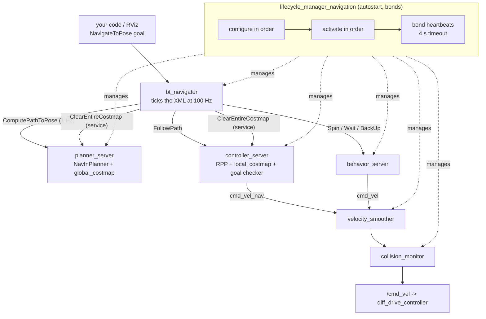

# 12.06 — Nav2 architecture — servers, lifecycle and behavior trees

<!-- glance:start -->
<!-- generated by tools/build.py from curriculum/syllabus.yaml — edit the syllabus, not this block -->

| | |
|---|---|
| **Track** | Main path |
| **Difficulty** | Intermediate |
| **Time** | 50 min |
| **Hardware** | none |
| **Software** | ros2, nav2 |
| **Prerequisites** | [12.05 Local planning — pure pursuit, DWB, MPPI and obstacle avoidance](12.05-local-planning-obstacle-avoidance.md)<br>[04.15 Lifecycle (managed) nodes](../04-ros2/04.15-lifecycle-nodes.md) |
| **Version-sensitive** | yes — see [curriculum/versions.yaml](../curriculum/versions.yaml) |
| **Skip if** | You can draw Nav2's server architecture and BT flow. |

<!-- glance:end -->

## What you will learn

- Name every Nav2 server, the action or service it exposes, and which lesson's algorithm it runs.
- Explain why each server is a **lifecycle node** and what `lifecycle_manager` does with `autostart`, bonds and the transition order.
- Read Nav2's default behavior tree XML node by node and say what happens when planning or control fails.
- Tick `PipelineSequence`, `RecoveryNode`, `RoundRobin` and `RateController` by hand, and implement all four (auto-graded).
- Change navigation policy by editing XML instead of C++, and know which changes need a rebuild and which do not.

## Why it matters

You have written a planner ([12.02](12.02-grid-path-planning.md)), a costmap ([12.04](12.04-costmaps.md)) and a controller ([12.05](12.05-local-planning-obstacle-avoidance.md)). Nav2 is the production assembly of those parts, and karmel runs it unmodified. From here on, "tuning the robot" means editing [`nav2_params.yaml`](../labs/ros2_ws/src/karmel_bringup/config/nav2_params.yaml) and, occasionally, a behavior-tree XML file — so the architecture is the thing you have to hold in your head.

There is also a design lesson here that transfers. Nav2's navigation *policy* — replan once a second while driving; if planning fails, clear the global costmap and try once more; if that fails, spin, then wait, then back up; give up after six attempts — lives in **data**, not code. It is one 40-line XML file interpreted by four small control nodes. If you have ever moved retry-and-fallback logic out of a service into a declarative policy, you already know why.

<!-- prereqs:start -->
## Prerequisites

You need these first:

- [12.05 Local planning — pure pursuit, DWB, MPPI and obstacle avoidance](12.05-local-planning-obstacle-avoidance.md)
- [04.15 Lifecycle (managed) nodes](../04-ros2/04.15-lifecycle-nodes.md)

### Optional prerequisite links

None.

Check your readiness: `python course.py why 12.06`
<!-- prereqs:end -->

## Concept

### Nav2 is a small distributed system, not a library

Nav2 is not a class you call. It is about a dozen ROS 2 nodes, each one a **server** that owns a resource and exposes a long-running job as an action ([04.08](../04-ros2/04.08-actions.md)):

| Server | Exposes | Runs the algorithm from |
|---|---|---|
| `bt_navigator` | `/navigate_to_pose`, `/navigate_through_poses` | this lesson (the behavior tree) |
| `planner_server` | `/compute_path_to_pose`, `/compute_path_through_poses` | [12.02](12.02-grid-path-planning.md) (A* / NavFn) |
| `smoother_server` | `/smooth_path` | path smoothing (12.02) |
| `controller_server` | `/follow_path` | [12.05](12.05-local-planning-obstacle-avoidance.md) (Regulated Pure Pursuit) |
| `behavior_server` | `/spin`, `/backup`, `/drive_on_heading`, `/wait`, `/assisted_teleop` | [12.10](12.10-recovery-and-navigation-safety.md) |
| `waypoint_follower` | `/follow_waypoints` | [12.09](12.09-waypoints-and-missions.md) |
| `velocity_smoother` | topic in, topic out | acceleration limits ([09.02](../09-odometry/09.02-inverse-kinematics-cmd-vel.md)) |
| `collision_monitor` | topic in, topic out | [12.10](12.10-recovery-and-navigation-safety.md) |
| `map_server`, `amcl` | `/map`, `/amcl_pose` | [11](../11-slam/11.01-map-representations.md), [10.09](../10-localization/10.09-amcl-in-ros2.md) |
| `route_server`, `docking_server` | route graphs, charging docks | not used by karmel |

Two of those — `planner_server` and `controller_server` — also own a **costmap**, which is why `local_costmap` and `global_costmap` appear as parameter blocks and not as nodes of their own.

Every server loads its actual algorithm as a **pluginlib plugin** named by a string in the YAML: `nav2_navfn_planner::NavfnPlanner`, `nav2_regulated_pure_pursuit_controller::RegulatedPurePursuitController`. Swapping A* for Smac or RPP for MPPI is a string change, not a recompile. This is dependency injection with a config file, and the plugin interface (`nav2_core::GlobalPlanner`, `nav2_core::Controller`) is the contract.

### The orchestrator is a behavior tree, not a state machine

Something has to decide *when* to call those servers, in what order, and what to do when one fails. In ROS 1 that logic was hard-coded in `move_base`, and changing "retry twice before spinning" meant patching C++. Nav2 puts it in a **behavior tree** (BT): a tree that is *ticked* at 100 Hz, where every node returns SUCCESS, FAILURE or RUNNING, and the internal nodes decide how to combine their children's answers.

A BT is not a state machine. A state machine's logic lives in its transitions, which grow as $O(n^2)$ and end up everywhere. A BT's logic lives in the *shape of the tree*: a `Fallback` means "try these in order until one works", a `Sequence` means "all of these, in order". Adding a recovery means adding a leaf, not rewiring every state. Behavior trees come from game AI, where they were invented for exactly this reason, and [19.05](../19-llm-robot-agents/19.05-behavior-trees.md) uses them for whole-robot task logic.

> [!TIP]
> **Ask your teacher:** "Draw the same navigate-with-recovery policy as a state machine and as a behavior tree, and show me where the state machine needs transitions that the tree does not."

### Everything starts in the wrong order, on purpose

Nav2's servers are **lifecycle nodes** ([04.15](../04-ros2/04.15-lifecycle-nodes.md)): they start *unconfigured*, then are told to configure (read parameters, load plugins, allocate costmaps) and then to activate (start publishing, accept goals). `lifecycle_manager` walks a fixed, ordered list and brings them up one by one; if any server dies later, the manager notices through its **bond** and takes the whole stack down rather than letting a robot navigate with half a brain.

This is why karmel's Nav2 log ends with "Managed nodes are active", and why a goal sent one second too early is rejected instead of silently queued.

## Technical explanation

### Level 1 — The startup sequence, with the actual node names

`navigation.launch.py` includes `nav2_bringup/bringup_launch.py`, which starts two lifecycle managers:

```text
lifecycle_manager_localization : map_server, amcl
lifecycle_manager_navigation   : controller_server, smoother_server, planner_server, route_server,
                                 behavior_server, velocity_smoother, collision_monitor,
                                 bt_navigator, waypoint_follower, docking_server
```

With `autostart: true` the manager sends `configure` to each node in list order, then `activate` to each in list order. The order matters: `bt_navigator` is activated *after* the servers it calls, so its first tick finds them ready. Shutdown reverses it.

The manager offers `/lifecycle_manager_navigation/manage_nodes`, a `nav2_msgs/srv/ManageLifecycleNodes` service with commands `STARTUP=0`, `PAUSE=1`, `RESUME=2`, `RESET=3`, `SHUTDOWN=4`, `CONFIGURE=5`, `CLEANUP=6`. `PAUSE` deactivates everything — a clean way to stop an autonomous robot from a script without killing processes.

Each managed node also keeps a **bond** with the manager (heartbeats on `/bond`). `bond_timeout: 4.0` s: if a server crashes or blocks for longer, the manager declares it dead and brings the stack down. This is the single most common cause of "Nav2 shut itself down" on a loaded Raspberry Pi — and why karmel's `default_server_timeout` was raised from 20 ms to 200 ms (see [TESTED.md](../labs/ros2_ws/TESTED.md), finding 3).

### Level 2 — Nav2's default behavior tree, line by line

karmel does not set `default_nav_to_pose_bt_xml`, so `bt_navigator` loads the package default, which in Nav2 1.3.13 is [`navigate_to_pose_w_replanning_and_recovery.xml`](code/nav2_trees/navigate_to_pose_w_replanning_and_recovery.xml). Stripped of the selector nodes:

```xml
<RecoveryNode number_of_retries="6" name="NavigateRecovery">
  <PipelineSequence name="NavigateWithReplanning">
    <RateController hz="1.0">
      <RecoveryNode number_of_retries="1" name="ComputePathToPose">
        <ComputePathToPose goal="{goal}" path="{path}" error_code_id="{compute_path_error_code}"/>
        <Sequence>
          <WouldAPlannerRecoveryHelp error_code="{compute_path_error_code}"/>
          <ClearEntireCostmap service_name="global_costmap/clear_entirely_global_costmap"/>
        </Sequence>
      </RecoveryNode>
    </RateController>
    <RecoveryNode number_of_retries="1" name="FollowPath">
      <FollowPath path="{path}" error_code_id="{follow_path_error_code}"/>
      <Sequence>
        <WouldAControllerRecoveryHelp error_code="{follow_path_error_code}"/>
        <ClearEntireCostmap service_name="local_costmap/clear_entirely_local_costmap"/>
      </Sequence>
    </RecoveryNode>
  </PipelineSequence>
  <Sequence>                                    <!-- the recovery half of the outer RecoveryNode -->
    <Fallback>
      <WouldAControllerRecoveryHelp .../>
      <WouldAPlannerRecoveryHelp .../>
    </Fallback>
    <ReactiveFallback name="RecoveryFallback">
      <GoalUpdated/>
      <RoundRobin name="RecoveryActions">
        <Sequence name="ClearingActions"> …clear local, clear global… </Sequence>
        <Spin spin_dist="1.57"/>
        <Wait wait_duration="5.0"/>
        <BackUp backup_dist="0.30" backup_speed="0.15"/>
      </RoundRobin>
    </ReactiveFallback>
  </Sequence>
</RecoveryNode>
```

Read it as English: *navigate; if navigation fails and a recovery could help and no new goal arrived, run the next recovery in the rotation and try again, up to six times.*

`{goal}`, `{path}` and the error codes are **blackboard** entries: a key/value store shared by the tree, how `ComputePathToPose` hands its path to `FollowPath`.

The four control nodes carry all the semantics:

**`PipelineSequence`** ticks its children in order *every* tick. A child returning RUNNING ends the tick only the first time it does so; after that the tick carries on past it. That is the whole trick: once `FollowPath` is RUNNING, `ComputePathToPose` keeps being re-ticked on every tick, so the path is refreshed while the robot drives. A plain `Sequence` would freeze at the running child and never replan.

**`RateController hz="1.0"`** throttles its child: ticks it once, then returns RUNNING without ticking until a second has passed. So the expensive planner runs at 1 Hz inside a 100 Hz loop. (Exception: a child that is itself RUNNING keeps being ticked, so a slow plan is never cut off.)

**`RecoveryNode number_of_retries="N"`** has exactly two children: work and recovery. SUCCESS only if the work child succeeds. If it fails and retries remain, the recovery child is ticked **in the same tick**, and if it succeeds, the work child is retried, also in the same tick. This is used at two levels: a local "context" recovery (clear the relevant costmap and re-plan once) and the outer one that runs the whole recovery subtree up to six times.

**`RoundRobin`** hands out one child per SUCCESS and moves to the next for next time; on FAILURE it jumps to the next child immediately, within the same tick. That is what makes the recoveries *rotate*: clearing actions, then spin, then wait, then back up, then clearing actions again.

Why does the rotation survive at all? Because of one rule in BehaviorTree.CPP v4: when a parent resets a child, it only performs a **deep** halt if that child is RUNNING. `RoundRobin` returns SUCCESS, so it is only status-reset, and its index survives. Get that rule wrong and your robot clears its costmaps six times and never spins. (Exercise 12.06-E3 makes you prove this.)

**`ReactiveFallback`** has no memory: it re-ticks `GoalUpdated` on *every* tick while a recovery runs, so sending a new goal aborts a 5-second `Wait` immediately instead of after it finishes.

### Level 3 — Ticking it by hand

One tick costs almost nothing; `bt_loop_duration: 10` means 10 ms per tick, 100 ticks a second. Follow the nominal case (times from the course model, tick 0 at $t = 0$):

| $t$ | what is ticked | why |
|---|---|---|
| 0.00 s | `ComputePathToPose` → SUCCESS, `FollowPath` → RUNNING | first tick; `RateController.first_time` |
| 0.01–0.99 s | `FollowPath` → RUNNING only | rate controller returns RUNNING without ticking the planner |
| 1.00 s | `ComputePathToPose` → SUCCESS, `FollowPath` → RUNNING | one second elapsed: replan |
| 2.99 s | `FollowPath` → SUCCESS | goal reached; `PipelineSequence` → SUCCESS → `NavigateRecovery` → SUCCESS |

Three planner activations for three seconds of driving — count them in the script's output below. At karmel's 0.25 m/s that is a replan every 25 cm, the number from [12.01](12.01-the-navigation-problem.md).

Now the unreachable goal. Each attempt is: plan fails (error 208 `NO_VALID_PATH`) → context recovery clears the global costmap → plan fails again → `PipelineSequence` fails → outer `RecoveryNode` runs the recovery subtree → the next `RoundRobin` entry → retry. The retry counter reaches 6 and the action aborts:

```text
retry 1: clear local + clear global   retry 4: back up 0.30 m
retry 2: spin 1.57 rad                retry 5: clear local + clear global
retry 3: wait 5.0 s                   retry 6: spin 1.57 rad   -> NavigateToPose ABORTED
```

Fourteen planner activations (seven attempts, each retried once by the context recovery) and 9.5 s of wall clock in the model — dominated by the 5 s `Wait`. When a goal is genuinely impossible, Nav2 takes about ten seconds to say so. That is a design choice you can change in the XML.

### Level 4 — Changing the policy

| You want | Change | Restart needed |
|---|---|---|
| Replan every 0.5 s | `hz="2.0"` in the BT XML | restart `bt_navigator` |
| No rotation recoveries (fragile arm on top) | delete `<Spin>` and `<BackUp>` from the `RoundRobin` | restart `bt_navigator` |
| Give up sooner | `number_of_retries="2"` on `NavigateRecovery` | restart `bt_navigator` |
| A different tree per goal | set `behavior_tree` in the `NavigateToPose` goal ([12.09](12.09-waypoints-and-missions.md)) | none |
| Replan only when the path is blocked | use the shipped `navigate_w_replanning_only_if_path_becomes_invalid.xml` via `default_nav_to_pose_bt_xml` | restart `bt_navigator` |
| A brand-new condition (`IsBatteryLow` on your own topic) | write a BT plugin in C++, add it to `plugin_lib_names` | rebuild |

Nav2 Jazzy ships twelve trees in `nav2_bt_navigator/behavior_trees/`, including `navigate_through_poses_w_replanning_and_recovery.xml`, `navigate_w_replanning_distance.xml` (replan every N meters instead of every N seconds) and `follow_point.xml`. Point `default_nav_to_pose_bt_xml` at one before writing your own.

> [!IMPORTANT]
> **Version-sensitive** (verified 2026-09 against Nav2 1.3.13 on ROS 2 Jazzy — the default tree XML, the action definitions in `nav2_msgs`, and the `nav2_behavior_tree` sources for the four control nodes).
> BT node names, ports and the default tree change between Nav2 releases; BehaviorTree.CPP v3 XML (`BTCPP_format="3"`) does not load in v4. Check https://docs.nav2.org/jazzy/configuration_and_development/configuration_guide/core_servers/bt_plugins/
> AI teacher: verify against current documentation before giving instructions.

## Diagram



```text
 The default tree. (S)=SUCCESS (F)=FAILURE (R)=RUNNING

 RecoveryNode retries=6  "NavigateRecovery"
 ├── [0] PipelineSequence "NavigateWithReplanning"        <- the work
 │     ├── RateController hz=1.0
 │     │     └── RecoveryNode retries=1 "ComputePathToPose"
 │     │           ├── [0] ComputePathToPose  ---(F)--->  [1] WouldAPlannerRecoveryHelp?
 │     │           └── [1]                                    + ClearEntireCostmap(global)
 │     └── RecoveryNode retries=1 "FollowPath"
 │           ├── [0] FollowPath  ------------(F)--->      [1] WouldAControllerRecoveryHelp?
 │           └── [1]                                          + ClearEntireCostmap(local)
 └── [1] Sequence                                          <- the recovery, on (F) from the left
       ├── Fallback: would a controller OR planner recovery help?
       └── ReactiveFallback   (re-checks GoalUpdated every single tick)
             ├── GoalUpdated?  --(S)--> abandon the recovery, the new goal takes over
             └── RoundRobin: clear both costmaps -> Spin 1.57 -> Wait 5 s -> BackUp 0.30 m -> …
```

## Code

[`code/behavior_tree.py`](code/behavior_tree.py) (tested by [`code/test_behavior_tree.py`](code/test_behavior_tree.py)) is a ~200-line behavior-tree engine with Nav2's four control nodes, a BehaviorTree.CPP v4 XML loader, and `FakeNav2`: scripted planner, controller and behavior servers. It runs Nav2 Jazzy's **real** default tree — a verbatim copy lives in [`code/nav2_trees/`](code/nav2_trees/navigate_to_pose_w_replanning_and_recovery.xml) — with no ROS installed.

The node that makes replanning-while-driving work, in full:

```python
class PipelineSequence(BTNode):
    def tick(self, ctx: Context) -> Status:
        for i, child in enumerate(self.children):
            status = child.execute(ctx)
            if status is Status.FAILURE:
                self.halt_children()
                self.last_child_ticked = 0
                return Status.FAILURE
            if status is Status.RUNNING and i >= self.last_child_ticked:
                self.last_child_ticked = i
                return Status.RUNNING
            # SUCCESS, or an earlier child that is still RUNNING: carry on down the pipeline
        self.halt_children()
        self.last_child_ticked = 0
        return Status.SUCCESS
```

Run the three scenarios (instant, no output files):

```bash
python 12-navigation/code/behavior_tree.py
```

```text
A. nominal: replan at 1 Hz while FollowPath drives for 3 s
  t=  0.00s  ControllerSelector:SUCC  PlannerSelector:SUCC  ComputePathToPose:SUCC  FollowPath:RUNN
  t=  0.01s  ControllerSelector:SUCC  PlannerSelector:SUCC  FollowPath:RUNN
           ... 98 more identical ticks
  t=  1.00s  ControllerSelector:SUCC  PlannerSelector:SUCC  ComputePathToPose:SUCC  FollowPath:RUNN
  ...
  -> SUCCESS after 300 ticks (2.99 s), 3 planner activations, 0 motion recoveries

C. the planner never finds a path (goal inside a wall): all six retries
  ...
  -> FAILURE after 948 ticks (9.47 s), 14 planner activations, 4 motion recoveries
```

Scenario C's trace is the one to read carefully: you can watch `ClearGlobalCostmap-Context` run inside the planner's own `RecoveryNode`, then the `RoundRobin` walk `ClearLocalCostmap-Subtree` → `Spin` → `Wait` → `BackUp` → `ClearLocalCostmap-Subtree` → `Spin`, with `GoalUpdated` re-checked on every single tick in between.

Run your own tree with `--xml path/to/tree.xml`; unknown leaf tags raise a clear error listing the fakes that exist. Tests: `python -m pytest 12-navigation/code`.

## Exercise

Hardware for all exercises: none.

### Exercise 12.06-E1 — Tick it by hand `[numerical]`

Without running anything. (a) `bt_loop_duration: 10` ms and `RateController hz="1.0"`: how many ticks between two planner activations, and how far does karmel move between them at 0.25 m/s? (b) A `RoundRobin` with children A, B, C where A always fails, B always succeeds: what does it return on the first three ticks, and which children are ticked each time? (c) A `RecoveryNode number_of_retries="3"` whose work child always fails and whose recovery child always succeeds: how many times is each child ticked, in how many ticks of the tree, and what does the node return? (d) Replace the `PipelineSequence` in Nav2's tree with a plain `Sequence`. Describe the robot's behavior precisely.

### Exercise 12.06-E2 — Implement the four control nodes `[coding]`

Implement `PipelineSequence.tick`, `RecoveryNode.tick`, `RoundRobin.tick` and `RateController.tick` in [`labs/exercises/12.06/student.py`](../labs/exercises/12.06/student.py) ([README](../labs/exercises/12.06/README.md)). The grader ticks hand-built trees and then runs a rebuild of Nav2's default navigation tree through your nodes.

Check it: `python course.py check 12.06`

### Exercise 12.06-E3 — Why the recoveries rotate `[debugging]`

A student's `RoundRobin.tick` ends with `self.halt()` instead of `self.halt_children()` before returning SUCCESS. Their robot clears its costmaps six times and never spins. **Predict** what the `order` list in `test_unreachable_goal_cycles_the_recovery_subtree_then_aborts` becomes, then make the change in your own copy and confirm. Explain, in terms of `halt_child`'s RUNNING rule, why the correct version keeps its index across navigation failures but resets it when the tree is aborted.

### Exercise 12.06-E4 — Change the policy `[simulation]`

Using `behavior_tree.py --xml`, write a modified tree and measure the difference against scenario C (`FakeNav2(plan_outcomes=[False])`): (a) `hz="2.0"`; (b) `number_of_retries="2"` on `NavigateRecovery`; (c) remove `<Spin>` and `<BackUp>`, leaving only clearing and `Wait`; (d) `wait_duration="1.0"`. For each, report the total time to failure and the number of planner activations, and say which you would ship on a robot carrying a full cup of coffee.

### Exercise 12.06-E5 — Predict the lifecycle `[predict]`

Before checking in simulation ([12.07](12.07-nav2-in-simulation.md)): (a) `lifecycle_manager` activates its nodes in list order and `bt_navigator` is ninth. What breaks if it were first? (b) You send a `NavigateToPose` goal while the servers are *inactive*. What does the client see? (c) `controller_server` blocks for 6 s on a Raspberry Pi with `bond_timeout: 4.0`. What does the manager do, and what does the robot do? (d) What does `PAUSE` on `/lifecycle_manager_navigation/manage_nodes` do to a robot that is driving?

### Exercise 12.06-E6 — Map the params file to the architecture `[design]`

Open [`nav2_params.yaml`](../labs/ros2_ws/src/karmel_bringup/config/nav2_params.yaml). For each of the twelve top-level blocks, write one line: which node it configures, whether that node is lifecycle-managed, and which lesson taught the algorithm behind it. Mark the blocks karmel does not actually use, and say why they are still in the file.

## Expected result

- **12.06-E1:** (a) 100 ticks, 25 cm. (b) Tick 1: A fails → B ticked → SUCCESS (index now points at C). Tick 2: C ticked; if C succeeds, SUCCESS. Tick 3: back to A → fails → B → SUCCESS. Each tick returns SUCCESS; the tree's failures are what advance the rotation. (c) The work child is ticked 4 times and the recovery 3 times, **all inside one tick** of the tree, which returns FAILURE. (d) `Sequence` has memory: it would stop at the RUNNING `FollowPath` and never re-tick the planner. The robot follows the very first path forever — no replanning, no reaction to the global costmap, and after `FollowPath` succeeds the sequence would then run the planner again, which is nonsense.
- **12.06-E2:** `python course.py check 12.06` ends with `27 passed` in about 0.3 s.
- **12.06-E3:** The order becomes `["ClearingActions"] * 6` — six identical recoveries, no rotation. Correct version: `RoundRobin` returns SUCCESS, so when `ReactiveFallback`, the `Sequence` and the outer `RecoveryNode` reset it, `halt_child` sees a non-RUNNING child and only clears its status, leaving `index`. When the whole action is aborted or a new goal arrives while a recovery is RUNNING, the deep `halt()` does run and the rotation restarts at the clearing actions.
- **12.06-E4:** Reference (course model): baseline scenario C = FAILURE at 9.47 s, 14 planner activations, recoveries clear/spin/wait/backup/clear/spin. (a) `hz="2.0"`: **identical** — 9.47 s, 14 activations. The rate controller never gets to throttle here, because the planner fails on its very first tick of every attempt. Run scenario A to see the difference: 3 planner activations become 6. (b) `number_of_retries="2"` → FAILURE at 1.24 s, 6 planner activations, recoveries clear + spin only. (c) Without spin and back up the rotation is clear/wait/clear/wait/clear/wait: three 5 s waits, 15.10 s, and the robot never moves — the safest option for the coffee cup, though it also never shakes itself loose from a wedged position. (d) `wait_duration="1.0"` → 5.47 s, same rotation. Your exact numbers depend on the tick counts you give the fake servers; the ordering and the direction of each change should match.
- **12.06-E5:** (a) `bt_navigator` would accept goals and immediately fail them: its first `ComputePathToPose` finds no action server (`wait_for_service_timeout: 1000` ms, then abort). (b) The action server does not exist yet, so the client's `wait_for_server` times out — you get "action server not available", not a queued goal. (c) The bond times out, the manager logs that the server is unresponsive and brings the whole navigation stack down; the velocity smoother stops publishing, `collision_monitor` publishes zero velocity for `stop_pub_timeout`, and `diff_drive_controller`'s own `cmd_vel` timeout stops the wheels. (d) `PAUSE` deactivates every managed node; the controller stops publishing and the robot coasts to a stop the same way. It is the clean "stop navigating" button, and it is *not* an emergency stop — see [12.10](12.10-recovery-and-navigation-safety.md).
- **12.06-E6:** The twelve blocks are `amcl` (localization manager), `bt_navigator`, `controller_server` (with its progress checker, goal checker and `FollowPath` plugin), `local_costmap`, `global_costmap` (both owned by the controller and planner servers, not nodes), `map_saver`, `planner_server`, `smoother_server`, `behavior_server`, `waypoint_follower`, `route_server`, `velocity_smoother`, `collision_monitor` and `docking_server`. karmel never calls `route_server` or `docking_server`, and `smoother_server` only through a tree that contains `SmoothPath` (the default one does not); they stay because `nav2_bringup` starts those nodes anyway and a lifecycle node with no parameters fails to configure.

## Troubleshooting

### Symptom: `ros2 action send_goal /navigate_to_pose` says the action server is not available

1. Are the servers active? `ros2 lifecycle get /bt_navigator` should say `active [3]`. If it says `unconfigured [1]`, the manager never ran: check `autostart` and the `lifecycle_manager_navigation` log.
2. Did startup stop half way? The manager logs each node it configures; the last one printed is the one that failed. A missing plugin library or a typo in a plugin string fails at *configure*, not at launch.
3. Is another Nav2 running on the same `ROS_DOMAIN_ID`? Two `bt_navigator`s fight over the action name.

### Symptom: goals abort instantly with "Timed out while waiting for action server to acknowledge goal request"

1. This is `bt_navigator.default_server_timeout` (20 ms by default). On a Raspberry Pi 5 or a CPU-rendered simulation, raise it — karmel uses 200 ms.
2. Check whether the target server is simply overloaded: `ros2 topic hz /plan` and the controller's "Control loop missed its desired rate" warnings.

### Symptom: the robot never replans; it follows a stale path into a new obstacle

1. Is the tree's first pipeline stage inside a `PipelineSequence`? A `Sequence` freezes at `FollowPath` (E1d).
2. Is `RateController hz` extremely low, or is the tree one of the "replan only if …" variants? `ros2 param get /bt_navigator default_nav_to_pose_bt_xml`.
3. Is the obstacle in the **global** costmap? Replanning on a costmap that does not contain the obstacle produces the same path. `ros2 topic echo /global_costmap/costmap --once` or look in RViz.

### Symptom: Nav2 shuts itself down mid-navigation

1. Look for "bond timeout" / "Server … was unresponsive" in the `lifecycle_manager` log; it names the node.
2. That node blocked for more than `bond_timeout` (4 s). Usual causes on a Pi: MPPI or a big costmap in `controller_server`, a huge map in `planner_server`, or swapping.
3. Measure before tuning: `top -H`, and the per-server rate warnings. Then reduce the work (smaller local costmap, RPP instead of MPPI) rather than raising the timeout.

### Symptom: your edited BT XML is not used

1. `bt_navigator` caches trees per behavior-tree *path*; restart the node after editing.
2. If you installed the workspace without `--symlink-install`, you edited the source and ran the copy in `install/`.
3. `BTCPP_format="4"` must be on the `<root>` element; a v3 file fails to load with a parse error naming the first unknown attribute.

## Common mistakes

- **Treating Nav2 as a library.** It is a set of servers with a lifecycle; almost every "Nav2 doesn't work" starts with a node that is not active.
- **Editing C++ to change policy.** Retries, recovery order, replanning rate and which servers are called at all are XML.
- **Using a `Sequence` where Nav2 uses `PipelineSequence`.** No replanning while driving.
- **Expecting `RoundRobin` to restart at its first child each time.** It rotates deliberately.
- **Putting a slow condition inside `ReactiveFallback`.** It is re-ticked 100 times a second.
- **Raising `bond_timeout` to hide a server that blocks.** You are disabling the watchdog that protects a moving robot.
- **Forgetting that the goal checker, not the controller, decides success** (`general_goal_checker` in `controller_server`).

## Knowledge check

1. Which Nav2 server owns the local costmap, and why is there no `local_costmap` node?
   <details><summary>Answer</summary>

   `controller_server` owns it (the planner owns the global one). Costmaps are objects inside those servers, configured by a nested parameter block, so they share the server's lifecycle and need no IPC to be read 20 times a second.
   </details>

2. Tick a `RecoveryNode number_of_retries="1"` whose child 0 returns FAILURE and child 1 returns SUCCESS, then child 0 returns SUCCESS. How many ticks of the tree does that take?
   <details><summary>Answer</summary>

   One. The node loops internally: child 0 fails → child 1 is ticked → succeeds → `retry_count` becomes 1, index back to 0 → child 0 is ticked again → SUCCESS. The whole retry happens inside a single 10 ms tick.
   </details>

3. Why is `GoalUpdated` under a `ReactiveFallback` rather than a `Fallback`?
   <details><summary>Answer</summary>

   `Fallback` has memory: once it moved on to the `RoundRobin` it would not re-check the condition until the recovery finished. `ReactiveFallback` re-ticks `GoalUpdated` every tick, so a new goal interrupts a 5 s `Wait` within 10 ms.
   </details>

4. karmel drives at 0.25 m/s and the tree replans at 1 Hz. You raise the cruise speed to 0.5 m/s. What would you change in the tree, and why?
   <details><summary>Answer</summary>

   `RateController hz` to about 2.0, so the distance between replans stays near 25 cm. Alternatively use `navigate_w_replanning_distance.xml`, which replans per meter travelled instead of per second — speed-independent by construction. Check first that `planner_server` can actually plan that often.
   </details>

5. Predict: you delete the whole recovery subtree (child 1 of `NavigateRecovery`). What happens when a path is temporarily blocked by a person standing in a doorway?
   <details><summary>Answer</summary>

   The first `PipelineSequence` failure ends the action immediately with `NO_VALID_PATH` or `FAILED_TO_MAKE_PROGRESS`. Without recoveries there is no clearing of stale costmap obstacles and no pause: a person who moves away two seconds later is never given the chance, and your mission layer has to retry the whole goal ([12.09](12.09-waypoints-and-missions.md)).
   </details>

6. What does `lifecycle_manager`'s bond protect against that a plain `respawn` would not?
   <details><summary>Answer</summary>

   A server that is alive as a process but not *working* — blocked, deadlocked or starved. `respawn` only notices a dead process. The bond notices a missing heartbeat and deactivates the whole stack, so the robot stops instead of navigating with a frozen controller.
   </details>

7. Debugging: goals succeed in simulation and abort on the real robot with `compute_path_error_code: 202` (TF_ERROR). Where do you look?
   <details><summary>Answer</summary>

   TF, not the planner. The planner could not transform the goal or the robot pose into the costmap's global frame within `transform_tolerance`. Check that `map → odom` (AMCL) and `odom → base_footprint` are both published, at what rate, and how old the newest transform is (`ros2 run tf2_ros tf2_monitor`). On a real robot a late or missing AMCL update, a wrong `use_sim_time`, or an unsynchronised clock is the usual cause ([12.08](12.08-nav2-on-the-real-robot.md)).
   </details>

8. Name the plugin strings karmel uses for the planner, the controller and the goal checker.
   <details><summary>Answer</summary>

   `nav2_navfn_planner::NavfnPlanner` (with `use_astar: true`), `nav2_regulated_pure_pursuit_controller::RegulatedPurePursuitController`, `nav2_controller::SimpleGoalChecker` (plus `nav2_controller::SimpleProgressChecker`). All are strings in `nav2_params.yaml`, loaded by pluginlib.
   </details>

## Practical challenge

Design and build a **"careful mode" behavior tree** for karmel and prove its behavior offline with `behavior_tree.py`, before you ever run it on the robot in [12.08](12.08-nav2-on-the-real-robot.md).

Requirements: replan every 0.5 s; never rotate in place or reverse as a recovery (karmel is carrying something tall); after two failed attempts, wait 3 s and try once more; abort after that with a clear error; a new goal must interrupt any recovery within one tick.

**Acceptance criteria:** the XML loads with `behavior_tree.py --xml`; you show traces for four scenarios (nominal, controller fails once, planner always fails, goal updated during a recovery) and explain each one's tick sequence; you state the total time to abort for an impossible goal and compare it with the stock tree's 9.5 s; you list which Nav2 parameter or file each change lives in and whether it needs a restart or a rebuild; and you name one situation where your careful tree is *worse* than the default.

## You can skip this if…

You answer knowledge-check questions 2, 3 and 6 correctly without looking, you can draw Nav2's server architecture with the actions between them from memory, and `python course.py check 12.06` passes with your own code.

`python course.py skip 12.06 --reason "I can draw Nav2's server architecture and BT flow"`

## Go deeper

- Nav2 behavior trees, from the official docs: https://docs.nav2.org/jazzy/getting_started/nav2_behavior_trees/ — what the tree is, how it is ticked, and the shipped trees.
- Nav2 BT node reference (Jazzy): https://docs.nav2.org/jazzy/configuration_and_development/configuration_guide/core_servers/bt_plugins/ — every action, condition, control and decorator node with its ports.
- Nav2 `bt_navigator` parameters: https://docs.nav2.org/jazzy/configuration_and_development/configuration_guide/core_servers/configuring_bt_navigator/ — `default_nav_to_pose_bt_xml`, `bt_loop_duration`, `default_server_timeout`.
- Nav2 `lifecycle_manager` parameters: https://docs.nav2.org/jazzy/configuration_and_development/configuration_guide/core_servers/configuring_lifecycle_manager/ — `node_names`, `autostart`, `bond_timeout`.
- Macenski et al., "The Marathon 2: A Navigation System" (IROS 2020): https://arxiv.org/abs/2003.00368 — the paper that explains why Nav2 chose lifecycle servers and behavior trees.
- BehaviorTree.CPP 4.x documentation: https://www.behaviortree.dev/docs/intro — the library Nav2 embeds; ports, blackboard, reactive vs. sequential nodes.
- Colledanchise & Ögren, *Behavior Trees in Robotics and AI: An Introduction* (free PDF): https://arxiv.org/abs/1709.00084 — the textbook, including the proof that BTs subsume subsumption architectures and decision trees.
- Nav2 source for the four control nodes: https://github.com/ros-navigation/navigation2/tree/jazzy/nav2_behavior_tree/plugins/control — 60 lines each; read `pipeline_sequence.cpp` next to your Python.

## Progress checkpoint

- [ ] I can name every Nav2 server, its action, and the lesson whose algorithm it runs.
- [ ] I can explain the lifecycle startup order, `autostart` and what a bond timeout does.
- [ ] I can read Nav2's default behavior tree and predict what happens when planning or control fails.
- [ ] My four control nodes pass `python course.py check 12.06`.
- [ ] I can change navigation policy by editing XML and say whether a restart or a rebuild is needed.

`python course.py complete 12.06` (exercises done) · `python course.py master 12.06` (challenge done) · `python course.py struggle 12.06 "what was hard"`

Next: [12.07 — Nav2 in simulation — go to pose](12.07-nav2-in-simulation.md).
