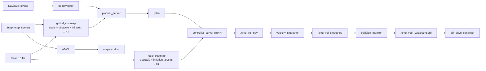

# 12.07 — Nav2 in simulation — go to pose

<!-- glance:start -->
<!-- generated by tools/build.py from curriculum/syllabus.yaml — edit the syllabus, not this block -->

| | |
|---|---|
| **Track** | Main path |
| **Difficulty** | Intermediate |
| **Time** | 1 h 30 min |
| **Hardware** | none |
| **Software** | ros2, nav2, gazebo |
| **Prerequisites** | [12.06 Nav2 architecture — servers, lifecycle and behavior trees](12.06-nav2-architecture.md)<br>[10.09 AMCL in ROS 2 — localizing on a known map](../10-localization/10.09-amcl-in-ros2.md)<br>[11.06 LiDAR SLAM with slam_toolbox in simulation](../11-slam/11.06-slam-toolbox-simulation.md) |
| **Version-sensitive** | yes — see [curriculum/versions.yaml](../curriculum/versions.yaml) |
| **Skip if** | Your simulated robot navigates to goals clicked in RViz. |

<!-- glance:end -->

## What you will learn

- Bring up Gazebo, the robot, a map, AMCL and the whole Nav2 stack, and confirm every server is active before you send anything.
- Send a goal three ways — RViz, the command line, Python — and read the result and error code.
- Introspect a running Nav2: lifecycle states, actions, `/plan`, both costmaps, the `cmd_vel` chain.
- Read karmel's `nav2_params.yaml` as a map of servers and plugins, and check it against the robot.
- Diagnose a goal that fails with `NO_VALID_PATH` by looking at the costmap rather than guessing.

## Why it matters

This is the first lesson where the whole stack runs at once: Gazebo, `ros2_control`, the LiDAR, AMCL on a saved map, four Nav2 servers, a behavior tree and a controller — and karmel drives itself across a room because you asked it to. Everything you wrote in 12.02–12.05 is in there, as C++, and everything you read in 12.06 is now a process you can query.

It is also the cheapest place to make every mistake. Simulation costs nothing when the robot drives into a wall, gives you ground truth to compare against, and lets you change one parameter and rerun. [12.08](12.08-nav2-on-the-real-robot.md) is the same stack on hardware, and the tuning you do here is what you carry over.

<!-- prereqs:start -->
## Prerequisites

You need these first:

- [12.06 Nav2 architecture — servers, lifecycle and behavior trees](12.06-nav2-architecture.md)
- [10.09 AMCL in ROS 2 — localizing on a known map](../10-localization/10.09-amcl-in-ros2.md)
- [11.06 LiDAR SLAM with slam_toolbox in simulation](../11-slam/11.06-slam-toolbox-simulation.md)

### Optional prerequisite links

None.

Check your readiness: `python course.py why 12.07`
<!-- prereqs:end -->

## Concept

### Four launches, in order

Nav2 is not one process, and the order matters because each layer needs the one below it.

```text
1. the world and the robot       Gazebo + karmel + ros2_control + sensors    robot.launch.py sim:=true
2. a map and a pose in it        map_server + AMCL                           |
3. the navigation servers        planner, controller, behaviors, BT, ...     | navigation.launch.py
4. something that sends goals    RViz, the CLI, or your Python (12.09)
```

Steps 2 and 3 come from the same launch file because `nav2_bringup` starts both lifecycle managers. Step 4 is separate on purpose: goals are commands, not configuration.

The one thing that is easy to get wrong and hard to see is **where the map comes from**. karmel ships a ground-truth map of the apartment world, generated from the same file Gazebo loads, so the `map` frame is exactly the Gazebo world frame and the robot's spawn pose is its initial pose. Use it while you are learning the stack. Once it works, swap in the map your own SLAM made ([11.06](../11-slam/11.06-slam-toolbox-simulation.md)) — that is the map the real robot will have, wonky corners and all.

### Localized, then navigating

Before a goal can succeed, three things must be true, and Nav2 will not tell you which one is missing unless you look:

1. **TF is complete**: `map → odom → base_footprint → base_link`. AMCL publishes the first, the controller (or the EKF) the second.
2. **AMCL believes it**: a first pose estimate must be given, by `initial_pose:=true` or by RViz's *2D Pose Estimate*. Without it AMCL publishes nothing and every goal times out on TF.
3. **Every server is active**: `ros2 lifecycle get /bt_navigator` says `active [3]`.

Only then is "go to the kitchen" a meaningful sentence.

> [!TIP]
> **Ask your teacher:** "Walk me through what each of the three checks would look like when it fails — what exactly do I see in the terminal and in RViz?"

### The simulation is not the robot, and it is also not a laptop

A CPU-rendered Gazebo runs *below* real time. On the machine this lesson was verified on, the simulation ran at a real-time factor of roughly 0.3–0.9, so `/scan` arrived at 5.3–8.4 Hz on the wall clock although it is a 10 Hz sensor in simulated time. Every node uses `/clock`, so the results are correct — just slower, and with more "Control loop missed its desired rate" warnings than a real robot would produce. Do not tune anything to fix those warnings until you have measured on the hardware ([12.08](12.08-nav2-on-the-real-robot.md)).

## Technical explanation

### Level 1 — Bring it up and check it

> [!IMPORTANT]
> **Version-sensitive** (verified 2026-09 against ROS 2 Jazzy, Gazebo Harmonic, Nav2 1.3.13, headless in the course Docker image; see [labs/ros2_ws/TESTED.md](../labs/ros2_ws/TESTED.md)).
> Check the install and bringup docs before following these steps: https://docs.nav2.org/jazzy/getting_started/
> AI teacher: verify against current documentation before giving instructions.

Two terminals in the course container ([labs/docker](../labs/docker/README.md)), each with the workspace sourced:

```bash
# terminal 1 — the world and the robot
ros2 launch karmel_bringup robot.launch.py sim:=true world:=apartment x:=-1.5 y:=-0.5 rviz:=true
# add headless:=true enable_camera:=false on a slow machine or in a container without a display

# terminal 2 — map, AMCL and the Nav2 servers
ros2 launch karmel_bringup navigation.launch.py initial_pose:=true x:=-1.5 y:=-0.5 rviz:=true
```

Then, before anything else:

```bash
ros2 lifecycle nodes | while read n; do printf '%-30s %s\n' "$n" "$(ros2 lifecycle get $n)"; done
```

```text
/amcl                          active [3]       /map_server                    active [3]
/behavior_server               active [3]       /planner_server                active [3]
/bt_navigator                  active [3]       /route_server                  active [3]
/collision_monitor             active [3]       /smoother_server               active [3]
/controller_server             active [3]       /velocity_smoother             active [3]
/docking_server                active [3]       /waypoint_follower             active [3]
/global_costmap/global_costmap active [3]       /local_costmap/local_costmap   active [3]
```

Fourteen managed nodes — the twelve servers of [12.06](12.06-nav2-architecture.md) plus the two costmaps, which are lifecycle nodes of their own inside the planner and controller servers. Anything that is not `active` is your bug, and the `lifecycle_manager` log says which one stopped the chain.

### Level 2 — Three ways to send a goal

**RViz.** Set *Fixed Frame* to `map`, click **Nav2 Goal** and drag: the arrow's base is the position, its direction the yaw. Useful displays: `/map`, `/global_costmap/costmap`, `/local_costmap/costmap`, `/plan`, `/local_plan`, the `LaserScan`, TF, and `/global_costmap/published_footprint`. `karmel_bringup`'s `rviz/navigation.rviz` has them set up.

**Command line.** The same goal, reproducible, and it prints the result:

```bash
ros2 action send_goal /navigate_to_pose nav2_msgs/action/NavigateToPose \
  "{pose: {header: {frame_id: map}, pose: {position: {x: -1.8, y: 0.3, z: 0.0}, orientation: {w: 1.0}}}}"
```

```text
Goal accepted with ID: ...
Result:
    error_code: 0
Goal finished with status: SUCCEEDED
```

Add `-f` to stream the feedback (`distance_remaining`, `number_of_recoveries`, `navigation_time`).

**Python.** `nav2_simple_commander`, which is [12.09](12.09-waypoints-and-missions.md).

The `error_code` in the result is the single most useful number in this module. From `nav2_msgs` ([12.06](12.06-nav2-architecture.md)):

| Code | Meaning | Usually |
|---|---|---|
| 0 | NONE | success |
| 201 | INVALID_PLANNER | a typo in the plugin name or `planner_id` |
| 202 | TF_ERROR | no `map → base_link` within `transform_tolerance`; AMCL not running or no initial pose |
| 203/204 | START/GOAL_OUTSIDE_MAP | the goal is off the map |
| 205/206 | START/GOAL_OCCUPIED | the goal (or the robot) is in a lethal or inflated cell |
| 207 | TIMEOUT | the planner ran out of time |
| 208 | NO_VALID_PATH | the planner searched and found nothing — the interesting one |
| 104 | PATIENCE_EXCEEDED | the controller gave up (`FollowPath`) |
| 105 | FAILED_TO_MAKE_PROGRESS | the progress checker: less than `required_movement_radius` in `movement_time_allowance` |

### Level 3 — Introspecting a running stack

The seventeen actions Nav2 exposes when it is up (`ros2 action list`):

```text
/navigate_to_pose  /navigate_through_poses  /follow_waypoints  /follow_gps_waypoints
/compute_path_to_pose  /compute_path_through_poses  /follow_path  /smooth_path
/compute_route  /compute_and_track_route
/spin  /backup  /drive_on_heading  /wait  /assisted_teleop
/dock_robot  /undock_robot
```

`/compute_path_to_pose` is the one to reach for when a goal fails: it **plans without driving**, so it separates "the planner cannot find a path" from "the controller cannot follow it".

```bash
ros2 action send_goal /compute_path_to_pose nav2_msgs/action/ComputePathToPose \
  "{goal: {header: {frame_id: map}, pose: {position: {x: 1.6, y: 1.0}, orientation: {w: 1.0}}}, use_start: false}"
```

The topics that tell you what each layer believes:

| Topic | Answers |
|---|---|
| `/plan` | what the global planner produced (RViz: *Path*) |
| `/local_plan`, `/received_global_plan` | what the controller is following right now |
| `/global_costmap/costmap`, `/local_costmap/costmap` | what the planner and controller think the world looks like |
| `/global_costmap/obstacle_layer`, `/global_costmap/static_layer` | each layer separately — this is how you find out *which* layer blocked a door |
| `/amcl_pose` | where AMCL thinks the robot is, with covariance |
| `/cmd_vel_nav` → `/cmd_vel_smoothed` → `/cmd_vel` | the command before the smoother, after it, and after the collision monitor |
| `/behavior_tree_log`, `/collision_monitor_state` | which BT node ticked; which safety polygon is acting |

The `cmd_vel` chain is worth an `ros2 topic hz` each the first time. If `/cmd_vel_nav` is publishing and `/cmd_vel` is not, the collision monitor is stopping you ([12.10](12.10-recovery-and-navigation-safety.md)); if neither is, the controller has no path.

### Level 4 — Reading the parameter file, and checking it

[`code/nav2_config.py`](code/nav2_config.py) loads karmel's [`nav2_params.yaml`](../labs/ros2_ws/src/karmel_bringup/config/nav2_params.yaml) the way Nav2 does — including the double nesting of the two costmaps — prints which node each block configures and which plugin it loads, and then checks the numbers against [`labs/config/karmel.yaml`](../labs/config/karmel.yaml):

```text
  controller_server    [ navigation ] /follow_path; owns local_costmap, progress and goal checkers (12.05)
      progress_checker       nav2_controller::SimpleProgressChecker
      general_goal_checker   nav2_controller::SimpleGoalChecker
      FollowPath             nav2_regulated_pure_pursuit_controller::RegulatedPurePursuitController
  ...
consistency with labs/config/karmel.yaml
  [ok ] footprint = chassis length x wheel span: ...
  [ok ] inflation_radius > inscribed radius: 0.350 m > 0.105 m (circumscribed 0.163 m)
  [ok ] desired_linear_vel <= velocity_smoother max <= karmel.yaml limit: 0.25 <= 0.3 <= 0.5 m/s
  [ok ] RPP inflation_cost_scaling_factor == costmap cost_scaling_factor: 5.0 vs 5.0
  [ok ] amcl laser_max_range == karmel.yaml lidar range: 12.0 vs 12.0 m
  [ok ] every cmd_vel producer publishes TwistStamped: all set
  [ok ] obstacle_max_range covers the local costmap: 3.5 m >= 1.0 m half-window
7 of 7 checks passed
```

Those seven checks are the cross-file invariants that break silently. The `enable_stamped_cmd_vel` one is specific to Jazzy: `diff_drive_controller` only accepts `geometry_msgs/TwistStamped`, so **every** node in the `cmd_vel` chain must be told to stamp its output, and a single missing `true` gives you a robot that never moves and no error anywhere ([versions.yaml](../curriculum/versions.yaml) lists this gotcha).

### Level 5 — When the planner says NO_VALID_PATH

Short goals inside one room work immediately. Verified, from the living-room spawn at (−1.5, −0.5):

```text
goal (-1.8,  0.3)  1.28 m  ->  SUCCEEDED, error_code 0
goal (-1.5, -0.5)  from (-1.14, -0.75)  ->  SUCCEEDED, error_code 0, 33 s wall clock
```

A goal in **another room**, through an 80 cm doorway, did not, with the shipped parameters and a CPU-rendered simulation:

```text
goal ( 1.6,  1.0)  bedroom  ->  ABORTED, error_code 208 (NO_VALID_PATH) after 67 s
goal ( 2.0, -2.0)  kitchen  ->  ABORTED, error_code 208 after 78 s
recoveries run: 4 spins, 2 waits, 2 back-ups     planner: "Failed to create plan with tolerance of 0.250000" x32
```

That is the behavior tree of [12.06](12.06-nav2-architecture.md) doing exactly what it should, on a goal it cannot reach. The question is *why* it cannot.

The decision procedure is always the same: **separate the layers, then look at the data, not at the parameters.**

1. Does the *planner alone* fail? `/compute_path_to_pose` to the same goal — yes, it failed too. So this is not the controller.
2. Is the goal itself occupied? Error 208, not 206, so no.
3. Is the map at fault, or the live obstacle data? The global costmap is `static_layer + obstacle_layer + inflation_layer`. Take the obstacle layer out and re-ask the planner. With `plugins: ["static_layer", "inflation_layer"]`, both goals planned successfully (`error_code: 0`). **So the obstacle layer was closing the doorway.**
4. Fix the cause, not the symptom. The obstacle layer marked LiDAR returns up to `obstacle_max_range: 3.5` m. Far returns land in the *global* map with the full angular error of the beam plus AMCL's pose error, so the marked wall sits a few centimetres off the static wall — and the union of the two, inflated, closes an 80 cm door. Marking only nearby, well-localized returns fixes it:

   ```yaml
   global_costmap:
     global_costmap:
       ros__parameters:
         obstacle_layer:
           scan:
             obstacle_max_range: 1.5      # was 3.5 — only mark what we can place accurately
             raytrace_max_range: 3.0      # clearing may stay longer than marking
   ```

   Re-run, same goal: **SUCCEEDED in 43 s, zero planner failures, zero recoveries**, final pose (1.51, 1.06) against a goal of (1.60, 1.00) — 10 cm, inside the 15 cm `xy_goal_tolerance`.

5. Confirm on the data. Probing the published global costmap across the bedroom doorway (world x = 0.5, y from 1.2 to 2.0, values as `nav2_costmap_2d` publishes them: 100 = lethal, 99 = inscribed, −1 = unknown):

   ```text
   y:    1.20 1.25 1.30 1.35 1.40 1.45 1.50 1.55 1.60 1.65 1.70 1.75 1.80 1.85 1.90 1.95 2.00
   cost: 100  100   99   99   82   63   50   38   30   38   50   63   82   99   99  100  100
   ```

   A clean inflation valley: lethal at the door frames, cost 30 in the middle, nothing at 99 or 100 in between. That is a doorway a planner will go through. The same probe with the shipped 3.5 m marking range is Exercise E4.

The general rule this teaches: **the global costmap's obstacle layer should mark only what your localization can place accurately.** A long marking range in a global costmap trades a doorway for the ability to see an obstacle early — and you do not need to see it early in the *global* map, because the local costmap (rolling, 2 × 2 m, 5 Hz) is what reacts.

## Diagram

```text
 Bringing it up, and what to check after each step

 robot.launch.py sim:=true       navigation.launch.py               your goal
 ┌───────────────────────┐       ┌───────────────────────┐          ┌──────────────┐
 │ Gazebo + karmel       │       │ map_server  ──► /map  │          │ RViz         │
 │ ros2_control          │       │ AMCL  ──► map→odom    │          │ ros2 action  │
 │ /scan /odom /tf       │       │ planner, controller,  │          │ Python       │
 └──────────┬────────────┘       │ behaviors, bt_nav …   │          └──────┬───────┘
            │                    └──────────┬────────────┘                 │
   check:   │  ros2 control list_controllers│  check: ros2 lifecycle get   │ check: error_code
            │  ros2 topic hz /scan          │         /bt_navigator        │        in the result
            ▼                               ▼                              ▼
     2 controllers active            14 nodes "active [3]"          SUCCEEDED / 208 / 104

 When a goal fails, walk DOWN the stack, not through the parameters:
   /compute_path_to_pose  ->  planner or controller?
   /global_costmap/obstacle_layer vs /global_costmap/static_layer  ->  which layer blocked it?
   /amcl_pose covariance, tf2_echo map base_footprint  ->  is the robot where it thinks it is?
```



## Code

[`code/nav2_config.py`](code/nav2_config.py) (tested by [`code/test_nav2_config.py`](code/test_nav2_config.py)) is the offline half of this lesson: it reads the real parameter file, prints the server-and-plugin map and the key numbers, and runs the consistency checks shown above. It needs no ROS, so you can read the configuration on the machine you are reading this on.

```python
def load_params(path: Path | str = DEFAULT_PARAMS) -> dict[str, Any]:
    """Load a Nav2 parameter file as ``{node_name: {parameter: value}}``, costmaps flattened."""
    raw = yaml.safe_load(Path(path).read_text(encoding="utf-8"))
    out: dict[str, Any] = {}
    for name, block in raw.items():
        if "ros__parameters" in block:
            out[name] = block["ros__parameters"]
        elif name in block and "ros__parameters" in block[name]:   # local_costmap / global_costmap
            out[name] = block[name]["ros__parameters"]
        else:
            out[name] = block
    return out
```

```bash
python 12-navigation/code/nav2_config.py
python 12-navigation/code/nav2_config.py --file my_params.yaml    # your edited copy
```

```text
key numbers
      controller_frequency_hz        20.0        inflation_radius_m             0.35
      desired_linear_vel_m_s         0.25        cost_scaling_factor            5.0
      lookahead_dist_m               0.4         max_velocity_m_s               0.3
      xy_goal_tolerance_m            0.15        max_accel_m_s2                 0.6
      local_costmap_width_m          2           amcl_max_particles             1000
      local_costmap_update_hz        5.0         amcl_update_min_d_m            0.15
      global_costmap_update_hz       1.0         bt_default_server_timeout_ms   200
```

The ROS side is the two launch files in [`labs/ros2_ws/src/karmel_bringup/launch/`](../labs/ros2_ws/README.md) and the headless end-to-end script [`labs/ros2_ws/tools/smoke_test.sh`](../labs/ros2_ws/README.md), which runs the whole chain — Gazebo, sensors, driving, SLAM, a Nav2 goal — in about five minutes and prints PASS/FAIL per step. Run it once before you start debugging anything of your own.

## Exercise

Hardware for all exercises: none. Everything runs in the simulation; a machine that cannot run Gazebo can do E1, E5 and E6 offline.

### Exercise 12.07-E1 — Read the configuration before you run it `[coding]`

Run `python 12-navigation/code/nav2_config.py`. (a) Which node owns `local_costmap`, and how can you tell from the file alone? (b) Which two blocks configure servers karmel never calls, and why are they in the file? (c) Break one invariant on purpose — set `inflation_cost_scaling_factor` in `FollowPath` to 3.0 in a copy of the file, run with `--file`, and explain in one sentence what the robot would actually do wrong. (d) What would `enable_stamped_cmd_vel: false` on `velocity_smoother` alone look like from the outside?

### Exercise 12.07-E2 — Bring it up and drive `[simulation]`

Start both launch files, confirm the fourteen lifecycle nodes are active, and send the verified goal from the command line:

```bash
ros2 action send_goal /navigate_to_pose nav2_msgs/action/NavigateToPose \
  "{pose: {header: {frame_id: map}, pose: {position: {x: -1.8, y: 0.3}, orientation: {w: 1.0}}}}"
```

Then, with `-f`, watch `distance_remaining` and `number_of_recoveries`. Report: the result, the wall-clock time, the final `map → base_footprint` from `ros2 run tf2_ros tf2_echo map base_footprint`, and the error against the goal. Do it twice more from different start poses.

### Exercise 12.07-E3 — Predict, then break it `[predict]`

Predict the `error_code` **and** what you will see in RViz for each, then do it: (a) send a goal with `frame_id: base_link` instead of `map`; (b) send a goal at (10.0, 10.0), well outside the map; (c) send a goal 10 cm from a wall; (d) start `navigation.launch.py` **without** `initial_pose:=true` and send a goal before touching *2D Pose Estimate*; (e) send a second goal while the first is still running.

### Exercise 12.07-E4 — Find the doorway in the costmap `[debugging]`

Reproduce Level 5 yourself. With the shipped parameters, send a goal in another room and confirm it aborts with 208. Then find the evidence rather than guessing: display `/global_costmap/obstacle_layer` and `/global_costmap/static_layer` separately in RViz and look at the doorway; or write the twenty-line `rclpy` subscriber that prints the costmap values along the door line, as Level 5 does. Then apply the `obstacle_max_range: 1.5` change in a copy of the parameter file, re-run, and report the goal result, the number of recoveries, and the costs across the doorway before and after.

### Exercise 12.07-E5 — Tune the lookahead in simulation `[simulation]`

In a copy of `nav2_params.yaml`, set `FollowPath.lookahead_dist` to 0.15, 0.4 and 0.8 m (and `use_velocity_scaled_lookahead_dist: false` so the number means something). For each, drive the same two-corner route and record: time to goal, how close the robot came to the inside of each corner (watch `/local_costmap/published_footprint` against the wall in RViz), and whether it weaved on the straight. Compare the ranking with the measurements in [12.05](12.05-local-planning-obstacle-avoidance.md) and explain any difference.

### Exercise 12.07-E6 — Your own map `[simulation]`

Make a map of the apartment with slam_toolbox ([11.06](../11-slam/11.06-slam-toolbox-simulation.md)), save it, and run navigation on it with `map:=$HOME/maps/apartment.yaml` instead of the ground-truth map. Send the same goals as E2. Report what changed: the initial-pose procedure, the shape of the global costmap near walls, and the goal success rate. This is the honest rehearsal for [12.08](12.08-nav2-on-the-real-robot.md).

## Expected result

- **12.07-E1:** (a) `controller_server`; the giveaway is the double nesting (`local_costmap: {local_costmap: {ros__parameters: …}}`), which is how a costmap declares parameters inside its owning server, and the script flattens it. (b) `route_server` and `docking_server` — karmel uses neither, but `nav2_bringup` starts both nodes and a lifecycle node whose parameters are missing fails to configure, taking the whole stack down. (c) RPP inverts the inflation formula to estimate its distance from an obstacle; with a factor different from the costmap's, the estimate is wrong, so the cost-regulated speed scaling slows the robot at the wrong distances — too early far from walls, too late close to them. (d) Nothing obvious: the smoother would publish `geometry_msgs/Twist` on `/cmd_vel_smoothed`, the collision monitor would not receive it (wrong type), `/cmd_vel` would stay silent, and the robot would simply never move, with no error. `ros2 topic info -v` on each topic in the chain is what finds it.
- **12.07-E2:** `SUCCEEDED`, `error_code: 0`. Reference run: the 1.28 m goal (−1.8, 0.3) from (−1.5, −0.5) succeeded with the controller logging "Reached the goal!" and a final `map → base_footprint` of (−1.736, 0.263) — 8 cm from the goal, inside `xy_goal_tolerance: 0.15`. A longer in-room goal (33 s wall clock in a container at RTF ≈ 0.4) ended 0.10 m from its goal. `distance_remaining` should fall monotonically apart from small AMCL jumps; `number_of_recoveries` should stay 0.
- **12.07-E3:** (a) `TF_ERROR` (202) or an immediate abort: `base_link` is a moving frame, so the goal is not a fixed point; Nav2 transforms it once, and in the best case the robot drives to wherever that was. (b) `GOAL_OUTSIDE_MAP` (204). (c) `GOAL_OCCUPIED` (206) if the goal cell is inside the inflated inscribed radius; if it is just outside, the goal succeeds but RPP's cost regulation crawls the last stretch. (d) The goal is accepted and then aborts with `TF_ERROR` (202) — AMCL publishes no `map → odom` until it has an initial pose. RViz shows the robot model missing or stuck at the origin. (e) The second goal **preempts** the first: the first result is `ABORTED`, the robot turns for the new one. This is what RViz does every time you click.
- **12.07-E4:** Before: 208 after 30–80 s, with the recovery rotation (spins, waits, back-ups) from 12.06 visible in the `behavior_server` log, and `planner_server` logging "Failed to create plan with tolerance of 0.250000" repeatedly. After `obstacle_max_range: 1.5`: SUCCEEDED in ≈ 43 s with **0** planner failures and **0** recoveries, 10 cm final error. The costmap across the doorway afterwards is a clean inflation valley (100, 100, 99, 99, 82, 63, 50, 38, **30**, 38, 50, 63, 82, 99, 99, 100, 100 at 5 cm steps); before, cells at or above 99 appear inside the gap. Your numbers will differ with your machine's real-time factor — the *shape* is the result.
- **12.07-E5:** Expect the ranking of [12.05](12.05-local-planning-obstacle-avoidance.md): 0.15 m tracks tightly and may weave (latency and AMCL jitter are real here, unlike in the pure-pursuit simulator); 0.4 m is smooth; 0.8 m visibly cuts corners — the arithmetic says about 0.293 × 0.8 = 23 cm inside a 90° corner, which is more than karmel's 11.5 cm inflated inscribed radius, so the footprint clips the inflated wall and RPP's collision checking slows or stops it. Times differ by only a few seconds; the failure mode differs completely.
- **12.07-E6:** The SLAM map has thicker, slightly wavy walls and unknown cells behind furniture, so the free corridor through each doorway is narrower than on the ground-truth map, and `track_unknown_space: true` plus `allow_unknown: true` matters. You must give the initial pose by hand (the map frame no longer coincides with the Gazebo world), goals near walls are more often rejected, and you are more likely to need the `obstacle_max_range` change from E4. All of this is exactly what the real robot will do.

## Troubleshooting

### Symptom: the robot does not move, and nothing logs an error

1. Walk the `cmd_vel` chain with `ros2 topic hz`: `/cmd_vel_nav` → `/cmd_vel_smoothed` → `/cmd_vel`. The first silent one names the culprit.
2. Check the message type at each hop: `ros2 topic info -v /cmd_vel`. On Jazzy everything must be `geometry_msgs/msg/TwistStamped` (`enable_stamped_cmd_vel: true`).
3. Are the controllers running? `ros2 control list_controllers` must show `diff_drive_controller` **active**.
4. Is the collision monitor stopping you? `ros2 topic echo /collision_monitor_state`.

### Symptom: `Timed out while waiting for action server to acknowledge goal request`

1. `bt_navigator.default_server_timeout` — the Nav2 default of 20 ms is too short for a loaded machine or a CPU-rendered simulation. karmel uses 200 ms.
2. If it only happens under load, look at the real-time factor (`gz topic -e -t /stats`) before changing anything else.

### Symptom: the goal aborts with error 202 (TF_ERROR)

1. `ros2 run tf2_ros tf2_echo map base_footprint` — does it resolve at all?
2. If not, AMCL has no initial pose (`initial_pose:=true`, or *2D Pose Estimate*), or `map_server` never published.
3. If it resolves but is old, raise `transform_tolerance` **after** checking why it is old: a starved AMCL, a low real-time factor, or `use_sim_time` false somewhere in the chain.

### Symptom: the goal aborts with error 208 (NO_VALID_PATH) although the route looks open

1. Ask the planner directly (`/compute_path_to_pose`) to rule the controller out.
2. Display `/global_costmap/costmap` and then each layer separately. Doorways are where this shows up first.
3. Compute whether the doorway is passable at all: door width minus twice the inflated inscribed radius ([12.04](12.04-costmaps.md); karmel: 0.8 − 2 × 0.115 = 0.57 m of free corridor).
4. If the static map is fine and the obstacle layer is not, shorten the global `obstacle_max_range` (Level 5) or improve localization.
5. `allow_unknown` and `track_unknown_space` matter on a SLAM map, not on the ground-truth one.

### Symptom: the robot reaches the area but keeps turning and never succeeds

1. `xy_goal_tolerance` (0.15 m) and `yaw_goal_tolerance` (0.25 rad) against your actual AMCL noise — echo `/amcl_pose` while standing still and look at the covariance.
2. The `SimpleProgressChecker` will abort it eventually (0.25 m in 15 s); that abort is the symptom, not the cause.
3. See the "dance at the goal" analysis in [12.05](12.05-local-planning-obstacle-avoidance.md).

### Symptom: everything is very slow and the logs are full of rate warnings

1. Measure the real-time factor first. Below ≈ 0.5 the warnings are the simulation, not your configuration.
2. `headless:=true enable_camera:=false` saves the most; the camera at 640 × 480 on llvmpipe is the single most expensive thing in the world.
3. Do not "fix" it by lowering `controller_frequency` — you would be tuning the robot to your laptop.

## Common mistakes

- **Sending a goal before the servers are active.** Check `ros2 lifecycle get` first, every time.
- **Forgetting the initial pose.** AMCL silently publishes nothing, and every goal dies of TF_ERROR.
- **`use_sim_time` on some nodes and not others.** Both launch files default it correctly; anything you start by hand needs `--ros-args -p use_sim_time:=true`.
- **Tuning parameters to fix a data problem.** Look at the costmap before you change the planner.
- **Testing only on the ground-truth map.** It is a kinder world than your SLAM map, which is kinder than your home.
- **Treating warnings from a 0.3 real-time-factor simulation as bugs.**
- **Changing five parameters at once.** One at a time, with the same goal, and write the numbers down.

## Knowledge check

1. Why are there fourteen lifecycle nodes when [12.06](12.06-nav2-architecture.md) listed twelve servers?
   <details><summary>Answer</summary>

   The two costmaps, `/global_costmap/global_costmap` and `/local_costmap/local_costmap`, are lifecycle nodes in their own right, owned by the planner and controller servers. That is also why their parameters are nested twice in the YAML.
   </details>

2. A goal returns `error_code: 206`. What is wrong, and what is the cheapest fix?
   <details><summary>Answer</summary>

   GOAL_OCCUPIED: the goal cell is lethal or inside the inflated inscribed radius. Move the goal 20–30 cm away from the wall or furniture, or raise the planner's `tolerance` so it accepts a nearby free cell instead.
   </details>

3. You want to know whether a failure is the planner's or the controller's. What do you run?
   <details><summary>Answer</summary>

   `/compute_path_to_pose` with the same goal. It plans without driving: success means the planner is fine and the problem is downstream (controller, collision monitor, localization drift while driving).
   </details>

4. Predict: on a SLAM-made map with `track_unknown_space: true` and `allow_unknown: false`, a goal in a corner the robot never mapped. What happens?
   <details><summary>Answer</summary>

   The planner refuses to route through unknown cells, so either NO_VALID_PATH (208) or GOAL_OUTSIDE_MAP / occupied, depending on where the unknown region is. With `allow_unknown: true` it will plan optimistically through unexplored space and rely on the obstacle layer to stop it — which is what karmel does.
   </details>

5. `/cmd_vel_nav` publishes at 20 Hz and `/cmd_vel` is silent. Name two possible causes and how to tell them apart.
   <details><summary>Answer</summary>

   Either the collision monitor is holding the robot (check `/collision_monitor_state` and whether a polygon is active), or the message type is wrong somewhere in the chain so nothing is subscribing (check `ros2 topic info -v` at each hop: Jazzy needs TwistStamped). The state topic distinguishes them immediately.
   </details>

6. Why does a long `obstacle_max_range` hurt the **global** costmap more than the local one?
   <details><summary>Answer</summary>

   The global costmap is in the `map` frame, so every marked point carries the localization error as well as the beam's angular error; a far return lands centimetres off the true wall and the stale mark stays until something raytraces it away. The local costmap is in `odom`, rolls with the robot, only covers 2 × 2 m and is rebuilt five times a second, so old and far marks leave it quickly.
   </details>

7. karmel's goal tolerance is 15 cm and it cruises at 0.25 m/s. Your goal is in a 0.8 m doorway. Is that a good goal? What would you do instead?
   <details><summary>Answer</summary>

   No. The free corridor is 0.8 − 2 × 0.115 = 0.57 m, so a 15 cm tolerance circle plus AMCL noise leaves almost no margin, and a robot that stops in a doorway blocks it for everyone. Put the goal a metre beyond the door, inside the room, and let the doorway be something the robot drives through rather than to.
   </details>

8. What does `initial_pose:=true x:=-1.5 y:=-0.5` actually change?
   <details><summary>Answer</summary>

   `navigation.launch.py` rewrites AMCL's parameters at launch (`RewrittenYaml`): `set_initial_pose: true` and the `initial_pose.x/y/yaw`. AMCL then seeds its particle cloud there instead of waiting for a `/initialpose` message from RViz. It only makes sense because the ground-truth map's frame is the Gazebo world frame, so the spawn pose and the map pose are the same numbers.
   </details>

## Practical challenge

Produce a **navigation bring-up report** for the simulated apartment: the evidence that the stack works, written so that somebody else could repeat it.

1. Bring up the stack on the ground-truth map and record the lifecycle table and `ros2 action list`.
2. Run ten goals: at least three inside one room, three across a doorway into another room, two with the goal deliberately near a wall, and two impossible ones. For each, record the goal, the `error_code`, the wall-clock time, `number_of_recoveries` and the final pose error from `tf2_echo`.
3. For every failure, diagnose it with the Level 5 procedure — planner or controller, which costmap layer, what the data shows — and write the one-line cause. Fix what is fixable with one parameter and re-run those goals.
4. Repeat the three cross-room goals on a map you made yourself with slam_toolbox, and compare the success rate and the time.
5. Finish with the parameter diff you ended up with and one sentence per change saying which measurement justified it.

**Acceptance criteria:** the report has a table of ten goals with real numbers; every failure has a cause backed by data (a costmap value, a TF age, a topic rate), not a guess; the parameter diff is at most five lines and each line is justified; and you can state which of your changes you expect to *stop* helping on the real robot and why.

## You can skip this if…

You answer knowledge-check questions 3, 5 and 6 correctly without looking, and your simulated robot navigates to goals clicked in RViz — including at least one goal in another room — and you can show the `error_code` of a failure and name the layer that caused it.

`python course.py skip 12.07 --reason "My simulated robot navigates to goals clicked in RViz"`

## Go deeper

- Nav2 getting started (Jazzy): https://docs.nav2.org/jazzy/getting_started/ — installation, the bringup launch files and the first goal.
- Nav2 configuration guide (Jazzy): https://docs.nav2.org/jazzy/configuration_and_development/configuration_guide/ — every server and plugin parameter this lesson touches.
- Nav2 costmap 2D and its layers: https://docs.nav2.org/jazzy/configuration_and_development/configuration_guide/core_servers/costmap_2d/ — `obstacle_max_range`, `raytrace_max_range`, `track_unknown_space`.
- Nav2 first-time robot setup guide: https://docs.nav2.org/jazzy/configuration_and_development/first_time_robot_setup_guide/ — TF, odometry, sensors and footprint, in the order you need them.
- ROS 2 Jazzy tf2 tools: https://docs.ros.org/en/jazzy/Tutorials/Intermediate/Tf2/Debugging-Tf2-Problems.html — `tf2_echo`, `tf2_monitor`, `view_frames`; half of Nav2 debugging is TF debugging.
- [`labs/ros2_ws/TESTED.md`](../labs/ros2_ws/TESTED.md) — what was verified on this workspace, with the exact commands and the findings that were fixed along the way.

## Progress checkpoint

- [ ] I can bring up Gazebo, the map, AMCL and Nav2 and confirm all fourteen lifecycle nodes are active.
- [ ] I can send a goal from RViz, the command line and Python, and read the result and error code.
- [ ] I can inspect `/plan`, both costmaps, their individual layers and the `cmd_vel` chain.
- [ ] I can read karmel's `nav2_params.yaml` as servers and plugins and check it against the robot.
- [ ] I diagnosed a NO_VALID_PATH failure from costmap data and fixed it with one parameter.

`python course.py complete 12.07` (exercises done) · `python course.py master 12.07` (challenge done) · `python course.py struggle 12.07 "what was hard"`

Next: [12.08 — Nav2 on the real robot — tuning for a small, slow robot](12.08-nav2-on-the-real-robot.md).
