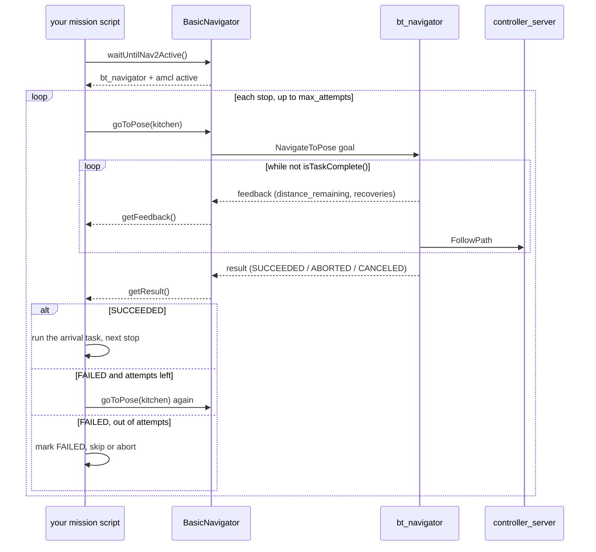

# 12.09 — Waypoints and missions with the Nav2 Simple Commander API

<!-- glance:start -->
<!-- generated by tools/build.py from curriculum/syllabus.yaml — edit the syllabus, not this block -->

| | |
|---|---|
| **Track** | Main path |
| **Difficulty** | Intermediate |
| **Time** | 1 h |
| **Hardware** | none |
| **Software** | ros2, nav2 |
| **Prerequisites** | [12.07 Nav2 in simulation — go to pose](12.07-nav2-in-simulation.md) |
| **Skip if** | You drive multi-waypoint missions from Python. |

<!-- glance:end -->

## What you will learn

- Drive Nav2 from Python with `nav2_simple_commander`: send a goal, poll, read feedback, cancel, and tell SUCCEEDED from CANCELED from FAILED.
- Choose between `goToPose`, `goThroughPoses` and `followWaypoints`, and say what each does when one stop fails.
- Keep named places ("the kitchen") in a file instead of coordinates in your code, and build them from the real robot.
- Write a mission state machine with per-stop retries, skip-or-abort policy and an arrival task (auto-graded), and run it in the simulator.
- Cancel a mission safely and report what happened.

## Why it matters

"Go to the kitchen" was one goal. A home robot does *missions*: check every room, deliver something and come back, patrol at night, return to the dock when the battery is low ([02.02](../02-robot-electronics/02.02-power-budget.md)). Nav2 gives you one primitive — drive to a pose, tell me when you are there — and deliberately no policy. Everything above it is your code, and this is the lesson where the robot stops being something you click at in RViz and becomes something a program commands.

It is also the join between this module and everything that comes after: the LLM agent in [19](../19-llm-robot-agents/19.02-robot-skill-api.md) that turns "bring me the thing from the bedroom" into goals, and the final robot in [20](../20-final-robot/20.02-hardware-integration.md), both talk to Nav2 through exactly the API in this lesson.

<!-- prereqs:start -->
## Prerequisites

You need these first:

- [12.07 Nav2 in simulation — go to pose](12.07-nav2-in-simulation.md)

### Optional prerequisite links

None.

Check your readiness: `python course.py why 12.09`
<!-- prereqs:end -->

## Concept

### One primitive, three shapes

Nav2's `bt_navigator` and `waypoint_follower` offer three ways to give it more than one pose, and they fail differently — which is the only thing that matters when you choose.

| | `goToPose(pose)` | `goThroughPoses([...])` | `followWaypoints([...])` |
|---|---|---|---|
| Action | `NavigateToPose` | `NavigateThroughPoses` | `FollowWaypoints` |
| Plans | one path to the goal | **one** path through all the poses | a separate goal per waypoint |
| Stops at each pose | — | no: they are via-points, driven through | yes, and runs a task executor |
| One pose unreachable | fails | the **whole** goal fails | `stop_on_failure: true` aborts, `false` records it in `missed_waypoints` and goes on |
| Good for | a single errand | a smooth route with via-points ("through the hall, not the kitchen") | a patrol: stop, photograph, continue |
| Retries | none | none | none |

Read the last row again. None of the three retries. If the kitchen door was shut for ten seconds, Nav2 tells you the goal failed and that is the end of it. A robot people live with needs "try again, and if it still fails, skip that room and say so at the end" — and that is not a Nav2 parameter, it is a state machine you write. That is what a *mission layer* is, and why this lesson has you build one.

> [!TIP]
> **Ask your teacher:** "Give me three home-robot errands and, for each, say whether I should use goToPose, goThroughPoses or followWaypoints, and what should happen when one stop fails."

### Names, not coordinates

`(5.0, 2.3, 1.57)` is meaningless in six months and wrong after you move a sofa. Keep a small **places file** — the whole "semantic map" a home robot needs at this stage — and let every layer above use names:

```yaml
frame_id: map
places:
  kitchen: {x: 5.0, y: 2.3, yaw: 1.5708}
  bedroom: {x: 5.0, y: 3.2}
```

A place is where the **robot stands**, not where the furniture is: 40–60 cm clear of everything, so the inflated costmap ([12.04](12.04-costmaps.md)) leaves a goal cell the planner will accept. `yaw` is which way the robot ends up facing — in front of the fridge, that matters for the camera ([13.10](../13-computer-vision/13.10-object-detection-models.md)).

### The polling contract

`nav2_simple_commander`'s `BasicNavigator` is not async and does not block. Every task is: send it, then poll.

```python
nav.goToPose(pose)
while not nav.isTaskComplete():      # 100 ms timeout per call, so this is not a spin loop
    feedback = nav.getFeedback()     # distance_remaining, navigation_time, number_of_recoveries
result = nav.getResult()             # TaskResult.SUCCEEDED / CANCELED / FAILED
```

If that shape looks like a long-running HTTP job with a status endpoint, it is, and for the same reasons: a request that takes minutes, needs progress, and must be cancellable. The loop body is where *your* policy lives: a timeout, a battery check, "stop if the user said stop", a progress log.

## Technical explanation

### Level 1 — `BasicNavigator`, method by method

> [!IMPORTANT]
> **Version-sensitive** (verified 2026-09 against `nav2_simple_commander` in Nav2 1.3.13 on ROS 2 Jazzy: the method list is from the installed `robot_navigator.py`).
> The names are camelCase and have changed between distros. Check https://docs.nav2.org/jazzy/configuration_and_development/simple_commander_api/simple_commander_api/
> AI teacher: verify against current documentation before giving instructions.

| Method | What it does |
|---|---|
| `waitUntilNav2Active(navigator='bt_navigator', localizer='amcl')` | blocks until both are `active`; always call it first |
| `setInitialPose(PoseStamped)` | what RViz's *2D Pose Estimate* button does |
| `goToPose(pose, behavior_tree='')` | `NavigateToPose`; `behavior_tree` picks a BT XML **per goal** ([12.06](12.06-nav2-architecture.md)) |
| `goThroughPoses(poses, behavior_tree='')` | `NavigateThroughPoses` |
| `followWaypoints(poses)` / `followGpsWaypoints(...)` | `FollowWaypoints`, with the `waypoint_task_executor_plugin` at each stop |
| `isTaskComplete()` | poll; **False** while running |
| `getFeedback()` / `getResult()` | the action feedback / `TaskResult` |
| `cancelTask()` | cancel the running task |
| `spin(spin_dist, time_allowance)`, `backup(...)`, `driveOnHeading(...)`, `assistedTeleop(...)` | the behavior server's primitives, directly |
| `getPath(start, goal, planner_id)`, `getPathThroughPoses(...)`, `smoothPath(...)` | plan **without** driving: "how far is it?" |
| `clearAllCostmaps()`, `clearLocalCostmap()`, `clearGlobalCostmap()`, `clearCostmapAroundRobot(d)` | what the BT's recovery does, on demand |
| `changeMap(path)` | switch floors or rooms |
| `getGlobalCostmap()`, `getLocalCostmap()` | the costmap as a message, for your own checks |
| `dockRobotByID(...)`, `undockRobot()` | the docking server, if you have a dock |
| `lifecycleStartup()`, `lifecycleShutdown()` | when you did not launch with `autostart` |

`getPath` deserves a note: it plans and returns the path without moving. "Is the kitchen reachable right now, and how far is it?" is one call, and it is how a mission layer decides the *order* of stops before it commits to any of them.

### Level 2 — The feedback you should actually use

`NavigateToPose.Feedback` has five fields, and three of them are how you tell a healthy goal from a doomed one:

```text
current_pose  navigation_time  estimated_time_remaining  number_of_recoveries  distance_remaining
```

- **`distance_remaining` that stops shrinking** is the real "am I stuck?" signal. Nav2's `SimpleProgressChecker` (karmel: 0.25 m in 15 s) will eventually abort, but your mission layer can notice sooner and cancel.
- **`number_of_recoveries` climbing** means the tree is spinning and clearing costmaps. One recovery is normal; five on a 4 m errand means something is wrong with the map, the localization or the doorway.
- **`navigation_time`** against your own estimate of distance / cruise speed. karmel at 0.25 m/s covers 4 m in about 16 s of driving; 60 s means it is fighting something.

Worked example, from the simulated mission below: living room → kitchen is 4.4 m of path. At 0.25 m/s with rotate-to-heading at each end, expect ≈ 17 s. Measured: 17.0 s, 0 recoveries. A mission layer that flags "more than 2× the distance estimate, or more than 2 recoveries" would have passed this one silently and caught the blocked-door case in E3.

### Level 3 — The mission state machine

The whole policy, as a table of what happens to one stop:

```text
              +---------+   go_to_pose rejected / result FAILED, attempts left
              | PENDING |------------------------------------------+
              +----+----+                                           |
                   | attempt                                        v
              +----v----+  result SUCCEEDED  +-----------+     (try again)
              | ACTIVE  |------------------->| SUCCEEDED |
              +----+----+                    +-----------+  -> run the arrival task
                   |  result CANCELED -> CANCELED  -> stop the whole mission
                   |  out of attempts -> FAILED    -> skip, or abort if stop_on_failure
                   v
     remaining stops: SKIPPED when the mission aborts
```

Three decisions are yours, and they are domain-specific:

1. **How many attempts.** A person standing in a doorway moves within seconds, so a second attempt is nearly free and often works. A locked door never opens, and three attempts just waste six minutes of battery.
2. **Skip or abort.** A delivery robot must abort — arriving nowhere is better than arriving at the wrong room. A room-checking patrol should skip and report.
3. **What "arrived" means.** Nav2's goal checker says the *pose* is reached within `xy_goal_tolerance`. Whether the errand is done ("the parcel is on the table") is your business.

A fourth thing is yours by default and should not be: **cancellation**. If your process dies mid-goal, Nav2 keeps driving — the action server does not know your client is gone. Catch `KeyboardInterrupt`, call `cancelTask()`, and make sure whatever supervises your mission script does too ([03.11](../03-robot-software/03.11-ci-and-reproducibility.md)).

### Level 4 — The same mission in two worlds

[`code/mission.py`](code/mission.py) defines a `Navigator` protocol with exactly `BasicNavigator`'s five mission-relevant methods. `WaypointMission` — the retries, the skip-or-abort policy, the report — is written against the protocol, so it is the same object in both places:

```text
            WaypointMission (your policy: retries, skip/abort, arrival tasks, report)
                     |
              Navigator protocol: go_to_pose / is_task_complete / get_feedback / get_result / cancel
                /                                          \
   SimNavigator (mission.py)                     Nav2Navigator (nav2_mission.py)
   A* on the apartment map + pure pursuit        BasicNavigator -> Nav2 -> Gazebo or karmel
   runs in pytest, no ROS, 3 s per mission       needs a running Nav2 (12.07 / 12.08)
```

This is the hardware-abstraction pattern of [03.05](../03-robot-software/03.05-hardware-abstraction.md) applied one level up: the interesting logic is tested offline in seconds, and the part that needs a robot is a thin adapter you can read in one screen.

## Diagram



## Code

Three files, and the interesting one runs on your laptop.

**[`code/mission.py`](code/mission.py)** (tested by [`code/test_mission.py`](code/test_mission.py)) — `Place`, `load_places`, the `Navigator` protocol, `WaypointMission`, and `SimNavigator`, which plans with the A* of [12.02](12.02-grid-path-planning.md) on the apartment map and drives with the pure pursuit of [12.05](12.05-local-planning-obstacle-avoidance.md). `SimNavigator` is deliberately *polling*, exactly like `BasicNavigator`: each `is_task_complete()` advances the simulation by 0.1 s.

```python
def is_task_complete(self) -> bool:
    """Poll: advance the simulation by 0.1 s (five 50 Hz control cycles) and report."""
    if self._done:
        return True
    base, controller = self._base, self._controller
    for _ in range(5):
        v, w = controller.compute(tuple(base.true_pose))
        base.set_wheel_velocity(*lp.twist_to_wheels(v, w, self.cfg.drive.wheel_radius_m,
                                                    self.cfg.drive.wheel_separation_m))
        base.read()
        self._collided |= base.sim.collided
        self._trace.append(tuple(base.true_pose))
        self.pose = tuple(base.true_pose)
        if controller.done and max(abs(s) for s in base.sim.wheel_rad_s) < 0.05:
            self._finish(TaskResult.FAILED if self._collided else TaskResult.SUCCEEDED)
            return True
        if base.sim.t > self._deadline_s:
            self._finish(TaskResult.FAILED)                        # the progress checker's job
            return True
    ...
```

**[`code/places/karmel_apartment.yaml`](code/places/karmel_apartment.yaml)** — six named places in the simulator's apartment, with the room map in the comments.

**[`code/nav2_mission.py`](code/nav2_mission.py)** — `Nav2Navigator`, the same protocol implemented over `BasicNavigator`, plus a command-line front end. It needs ROS 2, so it is not in the test suite; run it in the simulation from [12.07](12.07-nav2-in-simulation.md).

```bash
python 12-navigation/code/mission.py                          # kitchen -> bedroom -> study
python 12-navigation/code/mission.py --block bedroom          # the bedroom door is shut
python 12-navigation/code/mission.py --block bedroom --stop-on-failure
```

```text
mission: kitchen -> bedroom -> study  (skip failed stops)
-> kitchen (5.00, 2.30) attempt 1/2
   reached kitchen in 17.0 s
   waiting 2 s at kitchen
...
report
  kitchen        succeeded  attempts 1   17.0 s  recoveries 0
  bedroom        succeeded  attempts 1    5.5 s  recoveries 0
  study          succeeded  attempts 1   19.8 s  recoveries 0
  -> 3/3 stops, 42.3 s
```

It also writes `nav_out/12.09_mission.png`: the apartment with one blue trace per leg and a star per stop, green for reached and red for failed.

On the robot (or in the simulation of 12.07), the same mission:

```bash
ros2 launch karmel_bringup robot.launch.py sim:=true headless:=true world:=apartment x:=-1.5 y:=-0.5
ros2 launch karmel_bringup navigation.launch.py initial_pose:=true x:=-1.5 y:=-0.5
python3 12-navigation/code/nav2_mission.py --places my_home.yaml --wait 3 --attempts 2 kitchen home
```

> [!CAUTION]
> **Safety:** `nav2_mission.py` drives the real robot autonomously and for longer than a single goal — a mission is exactly when you walk away and stop watching. Wheels on a stand for the first run, a reachable power switch, the test area clear of people, pets and cables, and Ctrl-C tested *before* you trust it (the script cancels the goal on `KeyboardInterrupt`; verify the wheels actually stop). [SAFETY.md](../SAFETY.md)

## Exercise

Hardware: none for E1–E4 (simulation). E5 needs `robot-base` and `lidar` and should wait until [12.08](12.08-nav2-on-the-real-robot.md); it has a simulation alternative.

### Exercise 12.09-E1 — Pick the API `[design]`

For each errand, choose `goToPose`, `goThroughPoses` or `followWaypoints`, say what must happen when one stop is unreachable, and how many attempts you would allow: (a) "bring the remote from the sofa to me"; (b) "check that every room's light is off, then go back to the dock"; (c) "drive to the kitchen but go around the living room, not through it"; (d) "patrol the flat every hour and photograph the front door each time". For each, name the Nav2 parameter or the piece of your own code that implements the failure policy.

### Exercise 12.09-E2 — Implement the mission state machine `[coding]`

Implement `load_places`, `mission_from_names` and `WaypointMission.run` in [`labs/exercises/12.09/student.py`](../labs/exercises/12.09/student.py) ([README](../labs/exercises/12.09/README.md)). The grader drives your state machine with a fake navigator: clean runs, retries, skip-or-abort, cancellation, rejected goals, per-stop attempt limits and a task that never finishes.

Check it: `python course.py check 12.09`

### Exercise 12.09-E3 — Two failure policies, measured `[simulation]`

Run the three-stop mission with the bedroom door shut, under both policies, and with the door merely blocked on the first attempt:

```bash
python 12-navigation/code/mission.py --block bedroom --no-plot
python 12-navigation/code/mission.py --block bedroom --stop-on-failure --no-plot
python 12-navigation/code/mission.py --fail bedroom --no-plot
```

Report, for each: which stops were reached, total driving time, and how long was *wasted* on the bedroom. Then answer with numbers: for a delivery robot with a 45-minute battery, how many blocked stops per mission can you afford at two attempts each?

### Exercise 12.09-E4 — Your own arrival task and abort rule `[coding]`

Extend the mission in your own copy of the script. (a) Give each stop a real `task`: append a line to `nav_out/mission_log.csv` with the place, the arrival time and the final pose error. (b) Add a **battery rule**: `SimNavigator` exposes `pose` and each `Feedback` has `navigation_time`; treat 60 s of accumulated driving as "battery low", cancel the current goal and drive `home` instead of continuing. (c) Show the log for a mission that runs out of battery on the way to the study.

### Exercise 12.09-E5 — Your own places file `[hardware]`

Hardware: `robot-base`, `lidar` (after 12.08). Map your home ([11.07](../11-slam/11.07-mapping-your-room.md)), then drive the robot to five spots you actually care about and record each pose:

```bash
ros2 topic echo --once /amcl_pose --field pose.pose
```

Write them into `my_home.yaml`, check each is at least 40 cm clear of everything, and run `nav2_mission.py --places my_home.yaml` over three of them. **Simulation alternative:** do the same in the apartment world with RViz's *2D Nav Goal* and `/amcl_pose`, and compare your file with `places/karmel_apartment.yaml`.

### Exercise 12.09-E6 — Predict the cancel `[predict]`

`SimNavigator` is polling, like `BasicNavigator`. Predict, before running: if you call `go_to_pose(kitchen)`, poll 20 times and then `cancel_task()`, (a) roughly where is the robot, (b) what does `get_result()` return, (c) what does the next `is_task_complete()` return, and (d) what happens to the wheels on the *real* robot when your Python process is killed at that moment instead? Then check (a)–(c) with `test_cancelling_mid_leg_stops_the_robot_where_it_is` in `code/test_mission.py`.

## Expected result

- **12.09-E1:** (a) `goToPose` to the sofa, then `goToPose` to you: two errands, one attempt each, fail loudly — a remote that never arrives must be reported. (b) `followWaypoints` with `stop_on_failure: false`, or your own mission with skip: an unreachable room is recorded in `missed_waypoints` and the patrol finishes; two attempts. (c) `goThroughPoses` with a via-point in the hall — or better, a keepout zone over the living room ([12.10](12.10-recovery-and-navigation-safety.md)), because a via-point does not stop the planner from routing through the room afterwards. (d) `followWaypoints` with a `waypoint_task_executor_plugin` (`PhotoAtWaypoint` ships with Nav2), `stop_on_failure: false`, one attempt, run from a timer.
- **12.09-E2:** `python course.py check 12.09` ends with `19 passed` in well under a second.
- **12.09-E3:** Reference (ideal robot, seed 0): with `--block bedroom` and the default skip policy, kitchen and study succeed, the bedroom is FAILED after 2 attempts, `2/3 stops, 43.2 s`; the two bedroom attempts cost 2.0 s of "navigation time" in the model and no driving, while the study leg is 24.2 s (from the kitchen, not the bedroom). With `--stop-on-failure`, the study is SKIPPED and the mission ends `1/3 stops, 19.0 s`. With `--fail bedroom` the second attempt succeeds and the mission completes `3/3`. On a real robot each failed attempt costs the full recovery sequence — in the model of [12.06](12.06-nav2-architecture.md) that was 9.5 s per attempt — so two attempts at a blocked stop cost about 20 s plus the drive to it and back; on a 45-minute battery with a 30 % reserve you can afford on the order of a dozen, but the real limit is usually that the mission becomes useless long before the battery does.
- **12.09-E4:** Your CSV has one line per reached stop. The battery rule should fire on the way to the study (the mission has ≈ 42 s of driving, so a 60 s budget is reached during the last leg if you start counting from the first stop, and earlier if you include the retries of a blocked bedroom). The correct behavior is: `cancel_task()`, then a *new* goal to `home` — never "abandon everything", because a robot that stops in a doorway blocks it.
- **12.09-E5:** Five places, each at least 40 cm from the nearest obstacle (check the inscribed radius maths of [12.04](12.04-costmaps.md): karmel's inflated inscribed radius is 11.5 cm, so 40 cm is comfortable), and a three-stop mission that completes. Places closer than about 25 cm to a wall will be rejected by the planner as GOAL_OCCUPIED — a useful thing to see once on purpose.
- **12.09-E6:** (a) 2.0 s of simulated driving (20 polls x 0.1 s), about 0.52 m along the path — at (1.51, 1.36) from a start of (1.00, 1.30), still well short of the kitchen at (5.0, 2.3). (b) `TaskResult.CANCELED`. (c) `True` — a cancelled task is complete. (d) Nothing cancels the Nav2 goal: `controller_server` keeps publishing `cmd_vel` and the robot keeps driving until the goal finishes or the BT aborts. That is why `nav2_mission.py` catches `KeyboardInterrupt` and calls `cancelTask()`, and why the last line of defence is the firmware watchdog on the Pico ([01.10](../01-first-robot/01.10-pi-pico-protocol.md)) and the collision monitor ([12.10](12.10-recovery-and-navigation-safety.md)) — not your Python.

## Troubleshooting

### Symptom: the script hangs in `waitUntilNav2Active()`

1. Are the servers up? `ros2 lifecycle get /bt_navigator` must say `active [3]`, and so must `/amcl` ([12.06](12.06-nav2-architecture.md)).
2. `waitUntilNav2Active` also waits for an **initial pose**. If you launched without `initial_pose:=true` and never clicked *2D Pose Estimate*, it waits forever. Call `setInitialPose` first, or launch with the argument.
3. Different `ROS_DOMAIN_ID` between your shell and the launch, or a namespace on the Nav2 nodes that your `BasicNavigator(namespace=...)` does not have.

### Symptom: every goal is rejected immediately

1. `frame_id` empty or wrong: it must be `map` (or whatever `bt_navigator.global_frame` is), not `base_link`.
2. A stale `header.stamp`. Use `nav.get_clock().now().to_msg()`, and with a simulation remember `use_sim_time`.
3. An unnormalised quaternion — `orientation` left at all zeros is invalid. `w = 1.0` for "facing +x".

### Symptom: the mission goes on although the robot is stuck

1. You are not reading the result. `isTaskComplete()` returning True says *finished*, not *succeeded*; check `getResult()`.
2. You read the feedback inside the poll loop only, and the loop exited before the last feedback. Read `getFeedback()` once after the loop as well.
3. Your arrival test is "the goal finished", not "the robot is where I wanted". Compare the final pose with the place: a goal can succeed within `xy_goal_tolerance` (karmel: 15 cm) and still be on the wrong side of a doorway.

### Symptom: Ctrl-C leaves the robot driving

1. `cancelTask()` must be called, and it must be called on the same `BasicNavigator` that sent the goal.
2. If the process was killed with `SIGKILL`, nothing in Python runs. Design for it: the `collision_monitor` and the Pico watchdog stop the wheels, not your script.
3. Never rely on the cancel for safety. It is a tidy-up, not an e-stop ([12.10](12.10-recovery-and-navigation-safety.md)).

## Common mistakes

- **Treating `isTaskComplete()` as "succeeded".** It only means the task finished.
- **Polling without a timeout.** A goal that never finishes hangs the mission; count the polls and cancel.
- **Hard-coding coordinates.** They rot. A places file is five lines and survives a re-map.
- **Placing a goal against a wall.** Inside the inflated inscribed radius the planner refuses it (GOAL_OCCUPIED).
- **Retrying a CANCELED task.** Somebody cancelled on purpose; retrying fights the human.
- **Letting `goThroughPoses` stand in for a patrol.** One unreachable via-point fails the whole route, with no record of which one.
- **Forgetting that a mission runs unattended.** The failure you did not handle is the one that happens while you are out.

## Knowledge check

1. What is the difference between `goThroughPoses` and `followWaypoints`?
   <details><summary>Answer</summary>

   `goThroughPoses` plans **one** path through all the poses and drives through them without stopping; one unreachable pose fails the whole goal. `followWaypoints` sends them as separate goals, stops at each and runs a task executor plugin, and with `stop_on_failure: false` records the failures in `missed_waypoints` and carries on.
   </details>

2. Your poll loop calls `getFeedback()` and gets `None` on the first call. Bug or normal?
   <details><summary>Answer</summary>

   Normal. No feedback message has arrived yet. Keep the last non-None feedback you saw and read once more after the loop, because a task can finish before any feedback is published.
   </details>

3. karmel cruises at 0.25 m/s. A stop 4.4 m away reports `navigation_time` 62 s and `number_of_recoveries` 4. What do you conclude and what do you check first?
   <details><summary>Answer</summary>

   Expected is about 17–20 s, so it is taking three times too long and has run four recoveries: it is fighting something, not driving. Check the costmaps first (is an obstacle marked where there is none, closing a doorway?), then localization (is AMCL jumping?), then the doorway geometry (12.08).
   </details>

4. Why does a mission layer belong in your code rather than in Nav2?
   <details><summary>Answer</summary>

   Because the right failure policy is domain-specific. Skip-and-report is right for a patrol and wrong for a delivery; two attempts are right for a doorway and wrong for a locked door. Nav2 deliberately provides the mechanism (one goal, one result) and leaves the policy out, apart from `waypoint_follower`'s single `stop_on_failure` switch.
   </details>

5. Predict: you call `goToPose` and then, 2 seconds later, `goToPose` with a different pose, without cancelling. What happens?
   <details><summary>Answer</summary>

   The new goal **preempts** the old one: `NavigateToPose` accepts the new goal and the first one is aborted. The robot heads for the new pose. `BasicNavigator` tracks only the latest goal handle, so `getResult()` refers to the new goal. This is what RViz does every time you click a new Nav2 Goal.
   </details>

6. Where should "the kitchen is at (5.0, 2.3)" live, and why not in the Python?
   <details><summary>Answer</summary>

   In a places file loaded at run time, keyed by name. It changes when you re-map or move furniture, it is edited by a human (possibly not the programmer), and every layer above — mission scripts, a voice or LLM interface (19), a web UI — needs the same list. Coordinates in code mean a rebuild for a moved sofa.
   </details>

7. Your mission script dies with an unhandled exception during a goal. Is the robot safe?
   <details><summary>Answer</summary>

   No, and it is not even stopped. Nav2 keeps executing the goal; the controller keeps publishing `cmd_vel`. Safety comes from the layers below: the collision monitor, the velocity smoother's timeout, `diff_drive_controller`'s `cmd_vel` timeout and the Pico's 300 ms watchdog. Your script should still cancel on the way out — but never be the only thing that does.
   </details>

## Practical challenge

Write **`patrol.py`**: a real mission program for karmel, tested in the simulator first.

Requirements: it takes a places file and a list of stop names; it plans every leg with `getPath` **before** driving and refuses to start if any stop is unreachable right now, printing which; it drives the mission with two attempts per stop and a skip policy; at each stop it runs an arrival task (log the pose error and, if you have a camera, save an image); it enforces a wall-clock budget, cancelling and returning `home` when the budget is spent; it handles `KeyboardInterrupt` by cancelling; and it ends with a report — per stop: state, attempts, time, recoveries — plus totals.

**Acceptance criteria:** it runs against `SimNavigator` in a pytest you wrote (no ROS needed) and against Nav2 in the simulation of [12.07](12.07-nav2-in-simulation.md) with at least three stops; you demonstrate all four outcomes (all reached, one stop skipped, budget exceeded and return home, Ctrl-C mid-leg) and show the report for each; you explain which parts of the program would change and which would not if karmel had a real dock, and where the code would break if the map were replaced with a two-floor map.

> [!CAUTION]
> **Safety (real-robot run):** a patrol runs unattended, which is exactly when a robot finds the stairs. Do not run a real mission with the robot on the floor until [12.10](12.10-recovery-and-navigation-safety.md)'s collision monitor and keepout zones are configured, and never near an open staircase — karmel's 2D LiDAR at 16.5 cm cannot see a down step ([SAFETY.md](../SAFETY.md)).

## You can skip this if…

You answer knowledge-check questions 1, 4 and 7 correctly without looking, `python course.py check 12.09` passes with your own code, and you have driven a multi-stop mission from Python with per-stop retries.

`python course.py skip 12.09 --reason "I drive multi-waypoint missions from Python"`

## Go deeper

- Nav2 Simple Commander API (Jazzy): https://docs.nav2.org/jazzy/configuration_and_development/simple_commander_api/simple_commander_api/ — the method list and the canonical examples.
- `nav2_simple_commander` examples and demos in the source: https://github.com/ros-navigation/navigation2/tree/jazzy/nav2_simple_commander/nav2_simple_commander — `example_nav_to_pose.py`, `example_waypoint_follower.py`, `demo_inspection.py`, `demo_security.py`; the installed copies are in `/opt/ros/jazzy/lib/python3.12/site-packages/nav2_simple_commander/`.
- Nav2 waypoint follower parameters (Jazzy): https://docs.nav2.org/jazzy/configuration_and_development/configuration_guide/core_servers/waypoint_follower/ — `stop_on_failure`, the task-executor plugins (`WaitAtWaypoint`, `PhotoAtWaypoint`, `InputAtWaypoint`).
- `nav2_msgs` action definitions: https://github.com/ros-navigation/navigation2/tree/jazzy/nav2_msgs/action — the exact feedback and error-code fields this lesson quotes.
- ROS 2 actions, if the client pattern is still hazy: https://docs.ros.org/en/jazzy/Tutorials/Intermediate/Writing-an-Action-Server-Client/Py.html — what `BasicNavigator` wraps.

## Progress checkpoint

- [ ] I can send a goal from Python, poll it, read the feedback and tell the three results apart.
- [ ] I can choose between `goToPose`, `goThroughPoses` and `followWaypoints` and justify it by how each fails.
- [ ] I keep named places in a file and can build one from a real robot's `/amcl_pose`.
- [ ] My mission state machine passes `python course.py check 12.09`.
- [ ] I can cancel a mission safely and explain what stops the wheels when my script does not.

`python course.py complete 12.09` (exercises done) · `python course.py master 12.09` (challenge done) · `python course.py struggle 12.09 "what was hard"`

Next: [12.10 — Recovery behaviors, failure handling and navigation safety](12.10-recovery-and-navigation-safety.md).
