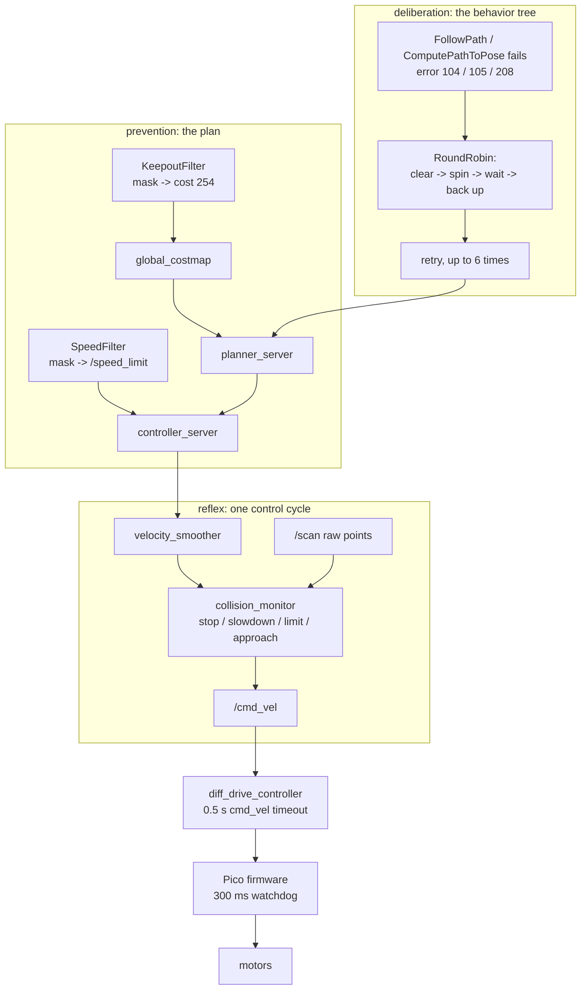

# 12.10 — Recovery behaviors, failure handling and navigation safety

<!-- glance:start -->
<!-- generated by tools/build.py from curriculum/syllabus.yaml — edit the syllabus, not this block -->

| | |
|---|---|
| **Track** | Main path |
| **Difficulty** | Intermediate |
| **Time** | 1 h |
| **Hardware** | none |
| **Software** | ros2, nav2 |
| **Prerequisites** | [12.08 Nav2 on the real robot — tuning for a small, slow robot](12.08-nav2-on-the-real-robot.md) |
| **Skip if** | You configure collision monitoring and keepout zones and handle navigation failures. |

<!-- glance:end -->

## What you will learn

- Configure and reason about Nav2's recovery behaviors, and decide which ones your robot may run.
- Read a navigation failure by its error code and turn it into a specific fix.
- Configure the collision monitor — stop, slowdown, limit and approach zones — and compute exactly when each fires (auto-graded).
- Add keepout zones and speed-limit zones with costmap filters, and show the plan changing.
- Lay out the safety layers of a home robot honestly, including what none of this protects against.

## Why it matters

Everything until now assumed navigation works. This lesson is about the other case, which on a real robot in a real home is most Tuesdays: a person in a doorway, a chair that moved, a rug the wheels slip on, a stale costmap, a map that no longer matches the flat. A navigation stack that cannot recover is a robot you have to go and rescue, and a robot people stop using.

It is also the lesson where "safety" stops being a paragraph at the top of a file and becomes configuration you can compute. karmel is 1.6 kg at 0.25 m/s and cannot really hurt anybody — but it can drive off a step, wedge itself under a sofa, or tangle a cable and pull a lamp over. The reasoning here is the same reasoning that scales to a 300 kg warehouse robot, where the numbers are not forgiving.

<!-- prereqs:start -->
## Prerequisites

You need these first:

- [12.08 Nav2 on the real robot — tuning for a small, slow robot](12.08-nav2-on-the-real-robot.md)

### Optional prerequisite links

None.

Check your readiness: `python course.py why 12.10`
<!-- prereqs:end -->

## Concept

### Three different things, often confused

| | Where it lives | Acts on | Reacts in | Protects against |
|---|---|---|---|---|
| **Recovery behaviors** | the behavior tree ([12.06](12.06-nav2-architecture.md)) | the *plan* | seconds | being stuck, stale costmaps, a temporary blockage |
| **Costmap filters** (keepout, speed) | the costmaps ([12.04](12.04-costmaps.md)) | the *plan*, before it exists | never — they are prevention | places the robot must not go or must go slowly |
| **Collision monitor** | between `cmd_vel_smoothed` and `/cmd_vel` | the *command* | one control cycle | hitting the thing in front of it, whatever the planner thinks |

The important distinction is the third column. A recovery is *deliberation*: something went wrong, let us try clearing the costmap and turning around. The collision monitor is a **reflex**: it looks at raw sensor points, not at a costmap, and it overrides whatever the planner asked for. Reflexes work when deliberation is confused, which is exactly when you need them.

None of the three is a functional-safety system. A certified robot has a safety-rated scanner, a hardware e-stop in the motor power path and a software stack that is not trusted with either. karmel has a power switch, a watchdog in the firmware and these three layers — appropriate for 1.6 kg at 0.25 m/s, and honest about what it is ([SAFETY.md](../SAFETY.md)).

> [!TIP]
> **Ask your teacher:** "For each of my robot's realistic failures — cat, rug, closed door, stale map, stairs — tell me which of the three layers is supposed to catch it, and which one actually would."

### Recoveries are a rotation, not a ladder

From [12.06](12.06-nav2-architecture.md): the default tree's recovery subtree is a `RoundRobin` that hands out one recovery per failure — clear both costmaps, spin 1.57 rad, wait 5 s, back up 0.30 m, then round again — up to six times. They are ordered by how much they disturb the world:

1. **Clear the costmaps.** Costs nothing, moves nothing, and fixes the commonest cause: a phantom obstacle marked when localization slipped.
2. **Spin.** Cheap, gives the LiDAR a fresh 360° view and re-seeds AMCL, and a diff-drive robot can do it anywhere it fits. It is also the recovery most likely to knock something over with an arm or a mast.
3. **Wait.** Does nothing on purpose. Perfect for the commonest *real* blockage: a person.
4. **Back up.** The only one that moves the robot into space it cannot see — karmel has no rear sensor — so it is last, short (0.30 m) and slow (0.15 m/s).

Which of these your robot may run is a design decision, not a default. A robot carrying an open cup should not spin. A robot with no rear sensor in a room with stairs behind it should not back up. You express that by deleting nodes from the XML ([12.06](12.06-nav2-architecture.md), E4).

### Error codes are a diagnosis, not a complaint

Nav2 tells you *why* it failed, in a number. Using it is the difference between "navigation is flaky" and a fix.

## Technical explanation

### Level 1 — The failure taxonomy

> [!IMPORTANT]
> **Version-sensitive** (verified 2026-09 against Nav2 1.3.13 on ROS 2 Jazzy: the error codes are from the `nav2_msgs` action definitions, the collision monitor and filter parameters from the Jazzy configuration guide and the `nav2_collision_monitor` / `nav2_costmap_2d` sources).
> Check https://docs.nav2.org/jazzy/configuration_and_development/configuration_guide/core_servers/collision_monitor/configuring_collision_monitor_node/
> AI teacher: verify against current documentation before giving instructions.

| Code | Name | What actually happened | First fix |
|---|---|---|---|
| 201 | INVALID_PLANNER | plugin name typo, or a `planner_id` that does not exist | the YAML |
| 202 | TF_ERROR | no `map → base_link` inside `transform_tolerance` | AMCL, initial pose, `use_sim_time` |
| 203/204 | START/GOAL_OUTSIDE_MAP | off the map | the goal, or the map |
| 205 | START_OCCUPIED | the **robot** is in a lethal cell — it is already touching something, or localization is wrong | clear the costmap; check the pose |
| 206 | GOAL_OCCUPIED | the goal is in a lethal or inflated cell | move the goal, or raise the planner `tolerance` |
| 207 | TIMEOUT | the planner ran out of time | a smaller map, a coarser resolution, more CPU |
| 208 | NO_VALID_PATH | it searched and found nothing | the costmap ([12.07](12.07-nav2-in-simulation.md), Level 5) |
| 101 | INVALID_CONTROLLER | plugin name typo | the YAML |
| 104 | PATIENCE_EXCEEDED | the controller could not produce a valid command for too long | clearance, footprint, inflation |
| 105 | FAILED_TO_MAKE_PROGRESS | the progress checker: less than `required_movement_radius` in `movement_time_allowance` | stuck on something; slip; a blocked doorway |
| 106 | NO_VALID_CONTROL | every candidate command collides | local costmap; footprint; speed |
| 701/711 | Spin/BackUp TIMEOUT | the recovery itself ran out of `time_allowance` | it is wedged |
| 703/714 | Spin/BackUp COLLISION_AHEAD | the recovery would hit something | it is wedged, and the recovery knows |

Two of these deserve names you will remember. **205 (START_OCCUPIED)** almost always means localization, not obstacles: the robot believes it is inside a wall. **105 (FAILED_TO_MAKE_PROGRESS)** is the honest "I am stuck" — karmel's progress checker wants 0.25 m of movement within 15 s, a deliberately generous setting for a slow robot.

### Level 2 — The collision monitor, number by number

`nav2_collision_monitor` subscribes to `cmd_vel_smoothed` and publishes `/cmd_vel`. Between the two it evaluates a list of **polygons**, each with an action type, against **raw** sensor points (`scan`, `pointcloud`, `range` or another polygon topic). The slowest requirement wins.

| Action | What it does | Key parameters |
|---|---|---|
| `stop` | zero velocity while ≥ `min_points` points are inside the polygon | `points`, `min_points` |
| `slowdown` | multiply the command by `slowdown_ratio` | `slowdown_ratio` |
| `limit` | clamp to `linear_limit` / `angular_limit` (sign preserved) | `linear_limit`, `angular_limit` |
| `approach` | project the **footprint** forward along the commanded twist and scale the speed so the time to collision is never less than `time_before_collision` | `time_before_collision`, `simulation_time_step`, `footprint_topic` |

`approach` is the clever one and the one karmel uses. From `Polygon::getCollisionTime`: starting at the robot's own pose, step forward by `simulation_time_step` along the commanded $(v, \omega)$, re-express the obstacle points in the robot's new frame, and stop at the first step where `min_points` points are inside the footprint. Call that time $t_c$. Then

$$\text{cmd}_{\text{out}} = \text{cmd}_{\text{in}} \cdot \frac{t_c}{T_{\text{before}}}$$

so the robot always keeps at least $T_{\text{before}}$ seconds of clearance. It is not a fixed distance: it scales with speed automatically, which is exactly what you want.

karmel's `FootprintApproach` is the costmap footprint (0.27 × 0.23 m with padding), `min_points: 6`, `time_before_collision: 1.2 s`, `simulation_time_step: 0.1 s`, fed by the `scan` source with `min_height: 0.05`. Commanded at 0.25 m/s straight at a wall ([`code/safety.py`](code/safety.py)):

```text
  distance   time to collision   /cmd_vel out
   1.500 m             never   0.250 m/s
   0.500 m             never   0.250 m/s
   0.400 m             1.0 s   0.208 m/s
   0.300 m             0.6 s   0.125 m/s
   0.200 m             0.2 s   0.042 m/s
   0.150 m             0.0 s   0.000 m/s
```

Check one by hand: the footprint's front edge is 0.135 m ahead of `base_link`, so a wall at 0.40 m is 0.265 m of travel away; at 0.25 m/s that is 1.06 s, which the 0.1 s simulation step reports as 1.0 s, and $0.25 \times 1.0/1.2 = 0.208$ m/s. The robot never brakes hard — it *leans off* the throttle, which is why the approach action feels smooth and a `stop` polygon feels like a wall.

The projection follows the commanded **arc**, not a straight line. The same wall 0.30 m to the left is never hit while driving straight or turning at 0.8 rad/s, and is hit at 1.1 s when turning at 1.2 rad/s. A stop zone drawn as a rectangle in front of the robot cannot know that; `approach` can.

### Level 3 — Costmap filters: keepout and speed zones

A **filter** is a second map — a "filter mask", an ordinary `OccupancyGrid` with its own YAML and image — merged into a costmap by a plugin listed under `filters:` (a separate list from `plugins:`). Two nodes serve it:

```yaml
keepout_filter_mask_server:            # nav2_map_server/map_server
  ros__parameters:
    topic_name: "keepout_filter_mask"
    yaml_filename: "/home/ros/maps/my_home_keepout.yaml"

keepout_costmap_filter_info_server:    # nav2_map_server/costmap_filter_info_server
  ros__parameters:
    type: 0                            # 0 keepout, 1 speed %, 2 speed m/s, 3 binary
    filter_info_topic: "keepout_costmap_filter_info"
    mask_topic: "keepout_filter_mask"
    base: 0.0
    multiplier: 1.0
```

and both go into a `lifecycle_manager` of their own. Then in **both** costmaps:

```yaml
global_costmap:
  global_costmap:
    ros__parameters:
      plugins: ["static_layer", "obstacle_layer", "inflation_layer"]
      filters: ["keepout_filter"]
      keepout_filter:
        plugin: "nav2_costmap_2d::KeepoutFilter"
        enabled: True
        filter_info_topic: "keepout_costmap_filter_info"
```

You draw the mask by copying your map's `.pgm` into an image editor and painting the zones black, then writing a YAML beside it with the **same `resolution` and `origin` as the map** (`mode: trinary`, `occupied_thresh: 0.65`, `free_thresh: 0.25`). Black becomes occupancy 100, which `base + multiplier * value` turns into filter-space 100, which the keepout filter writes into the costmap as 254 — lethal. The merge rule is *not* a plain maximum: a filter value replaces the costmap cell when it is greater, **or** when the cell was unknown.

The effect, measured on the course's apartment map with a 1.12 m² zone in front of the study door ([`code/safety.py`](code/safety.py)):

```text
keepout filter: 448 mask cells (1.12 m2) become cost 254 in the costmap
  living room -> study, without keepout   3.86 m
  living room -> study, with keepout      9.26 m
  with a keepout drawn over the goal itself:   NO VALID PATH (Nav2: error 206, GOAL_OCCUPIED)
```

A 1 m² zone turned a 3.9 m route into a 9.3 m one, because the apartment has exactly one door to the study and the zone made the robot approach it from the far side. Keepout zones are powerful and blunt: draw one across the only route and the room becomes unreachable, with no error message that says "because of your mask".

The **speed filter** (`type: 1`) works the same way but publishes a `nav2_msgs/SpeedLimit` on `speed_limit_topic`, which `controller_server` subscribes to. In percentage mode the mask value is a percentage of the maximum speed, and **0 means "no limit"** — so a mask value of 0 and a mask value of 100 both mean full speed, and 30 means 30 %:

```text
  mask value   0 % -> 0.30 m/s   (0 and 100 both mean 'full speed here')
  mask value  30 % -> 0.09 m/s
  mask value  50 % -> 0.15 m/s
```

Use keepout for "never" (the top of the stairs, the cat's water bowl, the cable nest behind the desk) and speed zones for "carefully" (the kitchen, a narrow hall, near the baby).

### Level 4 — What none of this protects against

Be honest about the gaps, because they decide where the robot is allowed to drive unattended.

- **Anything below the scan plane.** karmel's LiDAR sweeps at 16.5 cm. Socks, cables, a sleeping cat, a doorstep, and the near edge of a *down* step are all invisible to every layer above. A front range sensor at 5 cm ([07.05](../07-sensors/07.05-imu-fundamentals.md) module) and a downward-facing cliff sensor are the hardware answers; a keepout zone over the staircase is the software one, and it only works while localization is correct.
- **Glass and gloss.** A LiDAR sees through or past both. Mark them as keepout zones.
- **A wrong pose.** Every zone, keepout or speed, is defined in the `map` frame. If AMCL is 40 cm out, so is your staircase keepout. This is the strongest argument for the collision monitor: it works in `base_link` from raw points and does not care where the robot thinks it is.
- **Software failure.** If the Pi freezes, only the `diff_drive_controller` timeout (0.5 s) and the Pico's watchdog (300 ms) act — and only the latter survives the Pi dying ([01.10](../01-first-robot/01.10-pi-pico-protocol.md)).
- **Your own recovery behaviors.** A `backup` into space the robot cannot see is a small autonomous decision to drive blind. It is in the default tree, and on a robot near stairs it should not be.

So the layers, worst-case-first:

```text
   what fails            what still stops the robot
   a bad plan       ->   collision monitor, then diff_drive timeout, then watchdog
   a bad costmap    ->   collision monitor (raw points), then watchdog
   a bad pose       ->   collision monitor (raw points, base_link frame)
   your script      ->   Nav2 keeps driving; controller timeout; watchdog
   the Pi           ->   the Pico watchdog, 300 ms
   the firmware     ->   the power switch, in a human hand
```

## Diagram



```text
 The approach action, karmel at 0.25 m/s (footprint front edge 0.135 m ahead of base_link)

  v [m/s]
  0.25 ┤━━━━━━━━━━━━━━━━━━━━━━━━●━━━━━━━━━        no obstacle within 1.2 s of travel
       │                        ╲
  0.20 ┤                         ● 0.40 m, t_c = 1.0 s
       │                          ╲
  0.15 ┤                           ╲
       │                            ● 0.30 m, t_c = 0.6 s
  0.10 ┤                             ╲
       │                              ╲
  0.05 ┤                               ● 0.20 m, t_c = 0.2 s
       │                                ╲
  0.00 ┤                                 ●━━━━━  0.15 m and closer: stopped
       └────┬────────┬────────┬────────┬────────┬──► distance to the wall [m]
          0.60     0.45     0.30     0.15     0.00
              out = in x (t_c / 1.2 s):  a speed-scaled clearance, not a fixed distance
```

## Code

[`code/safety.py`](code/safety.py) (tested by [`code/test_safety.py`](code/test_safety.py)) models all of it: `SafetyPolygon` with the four action types, `CollisionMonitor.process`, the `project_state` / `transform_points` pair that Nav2 uses to sweep the footprint, and the filter side — `mask_cost`, `apply_keepout`, `speed_limit`, and `rasterize` to draw a mask from polygons.

```python
def collision_time(self, points, vel) -> float:
    """Seconds until the footprint would touch a point, or -1.0 if it would not."""
    if self.points_inside(points) >= self.min_points:
        return 0.0
    pose = (0.0, 0.0, 0.0)
    time = 0.0
    while time <= self.time_before_collision + 1e-9:
        pose = project_state(self.simulation_time_step, pose, vel)
        if self.points_inside(transform_points(pose, points)) >= self.min_points:
            return time
        time += self.simulation_time_step
    return -1.0
```

```bash
python 12-navigation/code/safety.py            # the tables above + nav_out/12.10_keepout.png
python 12-navigation/code/safety.py --no-plot
```

The PNG shows the apartment with the keepout zone shaded and the two plans — the 3.86 m direct route and the 9.26 m detour — on top of it.

## Exercise

Hardware: none for E1–E5 (simulation and offline). E6 needs `robot-base` and `lidar` and has a simulation alternative.

### Exercise 12.10-E1 — Collision-monitor arithmetic `[numerical]`

karmel's `FootprintApproach`: footprint 0.27 × 0.23 m centred on `base_link`, `time_before_collision: 1.2 s`, `simulation_time_step: 0.1 s`, `min_points: 6`. (a) Commanded 0.25 m/s at a wall 0.50 m away — output speed? (b) Same wall, commanded 0.15 m/s? (c) At what distance does a 0.25 m/s command first get scaled at all, and at what distance does it become zero? (d) A `slowdown` polygon with `slowdown_ratio: 0.4` and a `limit` polygon with `linear_limit: 0.1`, `angular_limit: 0.4` are both triggered. Which wins for a command of (0.25 m/s, 0.8 rad/s), and which for (0.25 m/s, 0.0)? (e) Why is `min_points: 6` there at all, and what breaks if you set it to 1?

### Exercise 12.10-E2 — Implement the collision monitor and the keepout filter `[coding]`

Implement `points_in_polygon`, `SafetyPolygon.collision_time`, `CollisionMonitor.process`, `mask_cost` and `apply_keepout` in [`labs/exercises/12.10/student.py`](../labs/exercises/12.10/student.py) ([README](../labs/exercises/12.10/README.md)). The grader uses karmel's real polygon and parameters, an arcing command, all four actions, and Nav2's unknown-space merge rule.

Check it: `python course.py check 12.10`

### Exercise 12.10-E3 — Design your robot's recoveries `[design]`

Write the recovery policy for three robots and, for each, the BT XML change that implements it: (a) karmel as it is, in a single-storey flat; (b) karmel with the arm of [14](../14-robotic-arm/14.01-arm-anatomy.md) mounted on top, carrying something; (c) karmel in a flat with an open staircase. For each, say which of clear / spin / wait / back up you keep, in what order, how many retries, and what you add instead of what you removed. Then say which of your three policies would have *prevented* an incident and which merely makes one less likely.

### Exercise 12.10-E4 — Keepout zones that help and keepout zones that hurt `[simulation]`

Using `safety.py`'s `rasterize` and `apply_keepout` on the apartment map, draw three zones and measure the effect on the living-room → study plan: (a) one that adds a modest detour; (b) one that makes the goal unreachable; (c) one over a doorway, so an entire room becomes unreachable. For each, report the path length (or the failure), the Nav2 error code you would expect on the real stack, and — this is the point — **what the operator would see and how they would diagnose it**. Then write the two-line check you would add to a bring-up script to catch a mask that disconnects a room.

### Exercise 12.10-E5 — Predict the reflex `[predict]`

Before running anything, predict the `/cmd_vel` output for each, then check with `safety.py`: (a) commanded (0.25, 0.0) with a wall 0.25 m ahead and only karmel's `FootprintApproach` configured; (b) the same, with an extra `stop` rectangle 0.55 × 0.45 m; (c) commanded (0.25, 0.8) with a wall 0.30 m to the **left**, and again at (0.25, 1.2); (d) commanded (−0.15, 0.0) (backing up) with a wall 0.25 m ahead, and then with the wall at 0.10 m — already inside the footprint. Does the monitor let the robot reverse out?

### Exercise 12.10-E6 — A safety review of your own robot `[hardware]`

Hardware: `robot-base`, `lidar` (simulation alternative below). Walk your flat with the robot and write down every hazard: steps, glass, cables, the cat's bowl, a rug edge, a door that swings. For each, put it in a table with: which layer is supposed to catch it, whether it actually would, and what you will do about it (a keepout zone, a speed zone, a sensor, a rule like "do not run unattended in this room"). Then implement the two most important ones — usually a keepout mask and a speed zone — and demonstrate them.
**Simulation alternative:** do the same for the apartment world, treating the dining table (whose top the LiDAR cannot see, only the legs) and the open doorways as the hazards, and demonstrate the keepout and speed masks there.

## Expected result

- **12.10-E1:** (a) The wall is 0.50 − 0.135 = 0.365 m of travel away, 1.46 s at 0.25 m/s, which is beyond the 1.2 s horizon: **no scaling, 0.250 m/s**. (b) At 0.15 m/s it is 2.4 s away: also no scaling. (c) Scaling starts when the travel distance falls below $0.25 \times 1.2 = 0.30$ m, i.e. at a wall distance of about 0.435 m, and reaches zero when the wall enters the footprint at 0.135 m — the script shows 0.250 at 0.50 m, 0.208 at 0.40 m, 0.125 at 0.30 m, 0.042 at 0.20 m and 0.000 at 0.15 m. (d) The monitor compares the **magnitude of the whole twist** and keeps the smaller. At (0.25, 0.8): slowdown gives (0.100, 0.320), magnitude 0.335; limit gives (0.100, 0.400), magnitude 0.412 — the slowdown wins. At (0.25, 0.0) both give (0.100, 0.000) and the tie goes to whichever polygon was evaluated first, because the comparison is a strict "is safer than". The rule is "the slowest requirement of all polygons", re-evaluated every control cycle. (e) `min_points` rejects single spurious returns — a dust mote, a reflection, one bad beam. At `min_points: 1` a single noisy range brings the robot to a halt, which on a real LiDAR happens several times a minute.
- **12.10-E2:** `python course.py check 12.10` ends with `28 passed` in about a second.
- **12.10-E3:** (a) Keep all four; the default rotation and six retries are right for a light robot on one floor. (b) Remove `Spin` (and keep `BackUp` only if the arm is stowed): a spin with a loaded arm is the most likely way to knock something off a table; add a longer `Wait` instead, and consider two retries rather than six so that a stuck robot reports sooner rather than thrashing with a payload. (c) Remove `BackUp` — karmel has no rear sensor and a staircase is the one mistake it cannot undo — and add a keepout zone over the stairs plus a rule that the robot never navigates that room unattended. Prevention: only (c)'s keepout zone and the "unattended" rule prevent anything; (a) and (b) change the probability of an incident, not its possibility, because every recovery still depends on the robot knowing where it is.
- **12.10-E4:** (a) The reference zone (1.0–2.4 m in x, 2.2–3.0 m in y) turns 3.86 m into 9.26 m — a 2.4× detour from a 1.12 m² zone, because the apartment has one route to the study. (b) A zone over the desk at the goal makes the plan fail: on the real stack that is `GOAL_OCCUPIED` (206) — the goal cell is lethal. (c) A zone across a doorway gives `NO_VALID_PATH` (208), and this is the nasty one: the operator sees the same error as a genuinely blocked door, with nothing pointing at the mask. Diagnosis: display `/global_costmap/costmap` and compare with `/global_costmap/static_layer`; a lethal rectangle with straight edges and no scan behind it is a filter, not an obstacle. The bring-up check: for every named place, call `/compute_path_to_pose` from the dock at start-up and refuse to start if any is unreachable ([12.09](12.09-waypoints-and-missions.md) uses `getPath` for exactly this).
- **12.10-E5:** (a) The wall at 0.25 m is 0.115 m of travel away, 0.46 s, reported as 0.4 s by the 0.1 s step → $0.25 \times 0.4/1.2 = 0.083$ m/s, action `approach`. (b) With the 0.55 × 0.45 m stop rectangle, the wall at 0.25 m is inside it (half-length 0.275 m) → **0.000 m/s, action `stop`**: the stop wins because it is slower. (c) At 0.8 rad/s the arc still misses the wall, so the command passes through untouched (0.250, 0.800). At 1.2 rad/s the arc sweeps into it: $t_c = 1.1$ s → (0.229, 1.100) — note that `approach` scales the **whole twist**, angular part included. (d) With the wall at 0.25 m, reversing is untouched (−0.150 m/s): the projection follows the commanded twist, which moves the footprint *away*, so there is no collision to find. With the wall at 0.10 m — already inside the footprint — `collision_time` returns 0.0 for **any** command, so the reverse is scaled to zero and the robot cannot back out. That is the standard objection to `approach` with a static footprint, and real configurations answer it with a separate rear polygon fed by a rear sensor, or by disabling the monitor during the `backup` recovery. Worth knowing before it happens to you at 2 a.m.
- **12.10-E6:** A real flat usually yields 6–12 hazards, of which the LiDAR sees two or three. The honest table has a lot of "no" in the "would it actually catch it" column — that is the point of the exercise. The two implementations should be a keepout mask (stairs, cable nest, the cat's bowl) and a speed zone (kitchen or hall), each demonstrated by a plan that changes and a `/cmd_vel` that slows.

## Troubleshooting

### Symptom: the robot stops for no visible reason and then continues

1. `ros2 topic echo /collision_monitor_state` — it names the polygon and the action type when one is active.
2. If it is the approach action, the culprit is usually a single noisy return: raise `min_points`, or check `min_height`/`max_height` on the source (karmel uses `min_height: 0.05` because its scan plane is 16.5 cm above the floor).
3. Compare `/cmd_vel_nav` and `/cmd_vel`. If they differ, it is the monitor; if both are zero, it is the controller.

### Symptom: the robot creeps everywhere at a fraction of its speed

1. A speed filter mask you forgot: `ros2 topic echo /speed_limit`. Remember that percentage mode means a mask value of 30 gives 30 % of maximum.
2. RPP's cost-regulated speed scaling reading a high costmap cost: check the inflation parameters ([12.08](12.08-nav2-on-the-real-robot.md)).
3. A `slowdown` polygon permanently triggered by the robot's own structure appearing in the scan — mask those angles in the LiDAR driver.

### Symptom: a keepout zone has no effect

1. Are the two filter nodes running *and* active? They need their own `lifecycle_manager`.
2. Does `filter_info_topic` match between the info server and the filter, exactly?
3. Is `filters:` present in the costmap block? It is a **separate** list from `plugins:`; adding the filter to `plugins:` silently does nothing useful.
4. Do the mask's `resolution` and `origin` match the map's? A mask with a different origin lands somewhere else entirely.
5. Is the mask in both costmaps? A keepout only in the global costmap stops the planner but not the controller.

### Symptom: navigation keeps running recoveries and eventually aborts

1. Read the error code first ([Level 1](#level-1--the-failure-taxonomy)); 105 and 208 have completely different fixes.
2. Count the recoveries in the feedback. More than two on a short errand means the cause is upstream — costmap, map or localization.
3. Watch `/behavior_tree_log` to see which node is failing, rather than inferring it from the robot's dance.

### Symptom: the robot wedges itself and no recovery frees it

1. Expected: `spin` and `backup` both refuse when they would collide (error 703/714). A wedged robot is a *human* recovery.
2. Prevent it instead: a keepout zone over the place it wedges (under the sofa, beside the fridge) is cheaper than any clever behavior.
3. Check whether the footprint is honest. A footprint smaller than the robot is the commonest cause of wedging.

## Common mistakes

- **Treating the collision monitor as an e-stop.** It is software on the same computer as everything else.
- **`min_points: 1`.** One noisy return stops the robot.
- **Putting a keepout filter under `plugins:` instead of `filters:`.**
- **A mask whose `origin` or `resolution` differs from the map's.**
- **Drawing a keepout zone across the only route.** The room becomes unreachable and the error says nothing about your mask.
- **Leaving `backup` in the tree on a robot with no rear sensor, near stairs.**
- **Believing a keepout zone protects you when localization is wrong.** Zones are in `map`; a lost robot takes them with it.
- **Diagnosing by watching the robot instead of reading the error code.**

## Knowledge check

1. What is the difference between a `stop` polygon and the `approach` action?
   <details><summary>Answer</summary>

   `stop` is geometric: if `min_points` points are inside a fixed polygon, the command becomes zero. `approach` is predictive: it projects the footprint along the commanded twist and scales the command so the time to collision never falls below `time_before_collision`. `approach` therefore adapts to speed and to turning, and slows smoothly instead of switching between full speed and stopped.
   </details>

2. karmel commands 0.25 m/s at a wall 0.30 m away. What comes out of the collision monitor, and where does the number come from?
   <details><summary>Answer</summary>

   0.125 m/s. The footprint's front edge is 0.135 m ahead of `base_link`, so there is 0.165 m of travel, 0.66 s at 0.25 m/s, which the 0.1 s simulation step reports as 0.6 s; $0.25 \times 0.6/1.2 = 0.125$ m/s.
   </details>

3. Your robot fails with error 205 (START_OCCUPIED). What is the most likely cause, and what is the *least* likely?
   <details><summary>Answer</summary>

   Most likely: localization — the robot believes it is inside a wall. Also possible: a stale costmap with an obstacle marked on top of the robot, which is why the BT's first recovery clears the costmaps. Least likely: that the robot is genuinely touching something, because it would have failed while driving there.
   </details>

4. Why does the collision monitor read raw sensor points instead of the local costmap?
   <details><summary>Answer</summary>

   To be independent of everything that can be wrong. The costmap depends on TF, on localization, on the layers being configured correctly and on an update cycle. Raw points in `base_link` depend only on the sensor and the driver, so the reflex still works when the deliberative stack is confused — which is exactly when it is needed.
   </details>

5. Predict: you add a keepout zone across your hallway while the robot is navigating through it. What happens?
   <details><summary>Answer</summary>

   The mask server publishes, the filter writes 254 into both costmaps, and at the next replan the global planner finds no path (208) — or a long detour if one exists. The robot stops, the BT runs its recovery rotation, and the goal eventually aborts. In the local costmap the cells under the robot become lethal too, so you can also get `START_OCCUPIED` on the next attempt until the robot is moved.
   </details>

6. Name three hazards in a normal flat that **none** of Nav2's safety layers detect.
   <details><summary>Answer</summary>

   Anything below the scan plane (cables, socks, a doorstep, a sleeping cat), a down step or open staircase, and glass or gloss-white surfaces the LiDAR sees through or past. Add: a moving obstacle faster than the reaction budget, and any hazard whose location is only known in the `map` frame while localization is wrong.
   </details>

7. karmel's recovery rotation includes `BackUp 0.30 m at 0.15 m/s`. Compute the risk, and say when you would remove it.
   <details><summary>Answer</summary>

   It drives 30 cm into space no sensor covers — karmel has no rear LiDAR or rear range sensor — at 0.15 m/s, so about 2 s of blind motion each time it runs, and it runs on every fourth recovery. On one floor with no drop-offs the worst case is bumping something. Remove it in any flat with an open staircase, a balcony step or a fragile object at floor level behind the usual routes, and replace it with a longer `Wait` plus a keepout zone.
   </details>

8. What actually stops karmel's wheels if the Raspberry Pi freezes mid-goal?
   <details><summary>Answer</summary>

   The Pico's firmware watchdog: no valid drive command for `watchdog_ms` (300 ms by default) and it cuts the motors. `diff_drive_controller`'s `cmd_vel` timeout and the collision monitor both live on the Pi and freeze with it. This is why the watchdog is tested before every session with the robot on the floor.
   </details>

## Practical challenge

Write a **navigation safety case** for karmel in your home, and implement it.

1. **Hazard table.** Every hazard in the flat: what it is, what would happen, which layer is supposed to catch it, whether it actually would, and your mitigation. Be honest in column four; it is the only column that matters.
2. **Implement two mitigations.** A keepout mask over the worst place (stairs, cables, the cat's bowl) and a speed zone over the one where slower is safer. Produce the mask images, the YAML for both filter servers and their lifecycle manager, and the `filters:` blocks for both costmaps.
3. **Demonstrate them.** A goal whose plan changes because of the keepout zone (before/after path, with lengths) and a `/cmd_vel` trace showing the speed drop in the speed zone.
4. **Tune the recovery policy.** Decide which recoveries karmel may run in your flat, implement it in a BT XML, and show the behavior on a goal you block deliberately: how long until it gives up, and which recoveries ran.
5. **Test the reflex.** With the wheels on a stand, then on the floor at 0.15 m/s, walk slowly in front of the robot and record `/cmd_vel` and `/collision_monitor_state`. Compare the measured slow-down with the `approach` arithmetic of this lesson.
6. **Write the residual risk** in three sentences: what can still go wrong, how likely, and what you do about it operationally (do not run unattended in room X; close the door to Y; charge on a hard floor).

**Acceptance criteria:** the hazard table has at least eight rows and at least three honest "no" answers; both filters work, demonstrated with numbers; the recovery policy is a diff of the XML with one sentence of justification per change; the measured collision-monitor slow-down matches the arithmetic within the resolution of `simulation_time_step`; and the residual-risk paragraph names at least one thing you decided **not** to solve in software.

> [!CAUTION]
> **Safety:** step 5 puts a person in front of a moving robot. Wheels on a stand first; on the floor at no more than 0.15 m/s; approach it walking, never suddenly; keep a hand on the power switch; and do not test the collision monitor on a child or a pet. If the monitor does not slow the robot on the stand, it will not on the floor — fix it there ([SAFETY.md](../SAFETY.md)).

## You can skip this if…

You answer knowledge-check questions 1, 4 and 6 correctly without looking, `python course.py check 12.10` passes with your own code, and you have a working keepout zone and collision-monitor configuration on your own robot or in the simulation.

`python course.py skip 12.10 --reason "I configure collision monitoring and keepout zones and handle navigation failures"`

## Go deeper

- Nav2 Collision Monitor parameters (Jazzy): https://docs.nav2.org/jazzy/configuration_and_development/configuration_guide/core_servers/collision_monitor/configuring_collision_monitor_node/ — every polygon and action parameter, with a full example.
- Nav2 Keepout Filter parameters (Jazzy): https://docs.nav2.org/jazzy/configuration_and_development/configuration_guide/core_servers/costmap_2d/costmap_filters/keepout_filter/ — `filters:`, `override_lethal_cost`, `lethal_override_cost`.
- Navigating with keepout zones (tutorial): https://docs.nav2.org/jazzy/tutorials/general_tutorials/navigation2_with_keepout_filter/navigation2_with_keepout_filter/ — drawing the mask, both servers, the lifecycle manager.
- Costmap Filter Info Server: https://docs.nav2.org/jazzy/configuration_and_development/configuration_guide/core_servers/map_server/configuring_costmap_filter_info_server/ — `type`, `base`, `multiplier` and the filter-space conversion.
- Nav2 Behavior Server: https://docs.nav2.org/jazzy/configuration_and_development/configuration_guide/core_servers/configuring_behavior_server/ — `spin`, `backup`, `drive_on_heading`, `wait`, `assisted_teleop` and their limits.
- ISO 3691-4 and ISO 13482 are the standards behind "functional safety" for industrial AMRs and personal-care robots; you do not need them for a 1.6 kg hobby robot, but they are what the words mean: https://www.iso.org/standard/70660.html
- [SAFETY.md](../SAFETY.md) — the course's standing rules, and the honest statement of what karmel's safety is and is not.

## Progress checkpoint

- [ ] I can name Nav2's recovery behaviors, their order, and decide which my robot may run.
- [ ] I can read an error code and turn it into a specific fix.
- [ ] My collision monitor and keepout filter pass `python course.py check 12.10`.
- [ ] I have a working keepout zone and speed zone, with the plan and the speed visibly changing.
- [ ] I can state what none of these layers protects against, and what I do about it operationally.

`python course.py complete 12.10` (exercises done) · `python course.py master 12.10` (challenge done) · `python course.py struggle 12.10 "what was hard"`

Next: [P11 — Go to the kitchen: autonomous navigation](../projects/P11-autonomous-navigation.md), the project that uses this whole module, and then [13 — Computer vision](../13-computer-vision/13.01-images-as-data.md).
