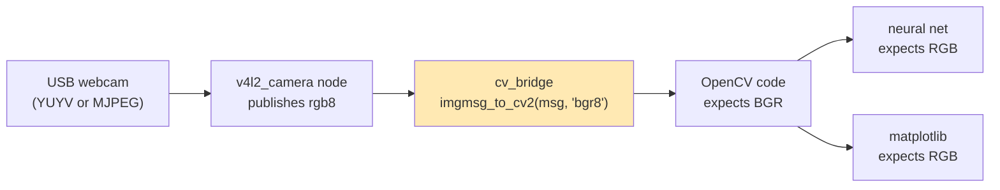

# 13.01 — Images as data — pixels, channels, RGB, grayscale, HSV

<!-- glance:start -->
<!-- generated by tools/build.py from curriculum/syllabus.yaml — edit the syllabus, not this block -->

| | |
|---|---|
| **Track** | Main path |
| **Difficulty** | Beginner |
| **Time** | 45 min |
| **Hardware** | none |
| **Software** | python, opencv |
| **Prerequisites** | [03.01 The Python robotics ecosystem (a map for C# developers)](../03-robot-software/03.01-python-robotics-ecosystem.md) |
| **Optional prerequisites** | [FCV.01 How cameras form images: light, sensors, Bayer filters, exposure](../optional-foundations/computer-vision/FCV.01-how-cameras-form-images.md)<br>[FPY.02 numpy essentials for robotics](../optional-foundations/python/FPY.02-numpy-essentials.md) |
| **Skip if** | You manipulate images as numpy arrays and know OpenCV's BGR convention. |

<!-- glance:end -->

## What you will learn

- Load or generate a camera frame and read its shape, dtype and memory cost like any other numpy array.
- Index pixels correctly (`img[row, col]` = `img[y, x]`) and take crops without copying by accident.
- Avoid OpenCV's BGR trap when data moves between OpenCV, ROS 2 (`rgb8`) and plotting libraries.
- Convert to grayscale and to HSV, compute both by hand for one pixel, and explain why HSV suits color detection.
- Predict uint8 overflow and choose between numpy arithmetic and OpenCV's saturating arithmetic.

## Why it matters

karmel's first vision job is concrete: find an orange ball on the floor, estimate how far away it is, and later
find the AprilTag on its charging dock and the objects on a table for the arm. Every one of those algorithms starts
by treating the camera frame as a 480 × 640 × 3 array of bytes. When something goes wrong in vision code, it's
usually not the clever algorithm. It's a swapped channel, a `(x, y)` vs `(row, col)` mix-up, a silent uint8 wrap-around,
or a threshold tuned in the wrong color space.

This lesson makes those basics automatic so that [13.02](13.02-opencv-preprocessing.md) (preprocessing) and
[13.03](13.03-classical-detection.md) (finding the ball) can focus on the ideas.

<!-- prereqs:start -->
## Prerequisites

You need these first:

- [03.01 The Python robotics ecosystem (a map for C# developers)](../03-robot-software/03.01-python-robotics-ecosystem.md)

### Optional prerequisite links

New to any of these? Take the foundation lesson first; skip it if you already know it.

- [FCV.01 How cameras form images: light, sensors, Bayer filters, exposure](../optional-foundations/computer-vision/FCV.01-how-cameras-form-images.md)
- [FPY.02 numpy essentials for robotics](../optional-foundations/python/FPY.02-numpy-essentials.md)

Check your readiness: `python course.py why 13.01`
<!-- prereqs:end -->

## Concept

A digital image is a **spreadsheet of brightness measurements**. The sensor has a grid of light-sensitive cells.
After exposure, each cell's charge becomes a number (how that happens, including the Bayer color filter that makes
two-thirds of every color image an interpolation, is [FCV.01](../optional-foundations/computer-vision/FCV.01-how-cameras-form-images.md)).
A color camera reports three numbers per cell, for red, green and blue light. So a frame is a 3D block: rows × columns ×
channels.

For you as a software engineer, the useful mental model is: **an image is a typed tensor with a naming convention**.
The tensor is a numpy `ndarray` (review [FPY.02](../optional-foundations/python/FPY.02-numpy-essentials.md) if views,
broadcasting and dtypes are hazy). The naming convention is where bugs hide:

- **Axis order.** Rows first. `img[y, x]`, not `img[x, y]`. Row 0 is the top of the image, so y grows *downward*.
- **Channel order.** OpenCV stores color as **B, G, R**, a historical choice from early camera drivers and Windows
  bitmaps. Almost everything else uses R, G, B: matplotlib, PIL, PyTorch models, and ROS 2 camera drivers.
  The `v4l2_camera` driver karmel uses publishes `rgb8` by default.
- **Value range.** 8-bit images are `uint8` in 0–255. Arithmetic wraps around silently. Some pipelines use `float32`
  in 0–1 instead.

Color has more than one useful coordinate system. RGB describes *how much of each primary light* is present. Under
brighter or dimmer light, all three numbers change together. **HSV** re-expresses the same color as **Hue** (which
color: orange, green...), **Saturation** (how vivid vs. grayish) and **Value** (how bright). A shadow on an orange ball
mostly changes V and barely changes H. That's why the ball detector in 13.03 thresholds in HSV.
[FCV.03](../optional-foundations/computer-vision/FCV.03-color-spaces.md) goes deeper, including Lab.

> [!TIP]
> **Ask your teacher:** "Show me one orange pixel in RGB, BGR, grayscale and HSV, then halve the lighting and show which numbers changed."

## Technical explanation

### Level 1 — Anatomy of a frame

```python
img.shape   # (480, 640, 3)  -> height, width, channels
img.dtype   # uint8
img.nbytes  # 921600 bytes = 480 * 640 * 3
img[291, 273]          # one pixel: array([B, G, R], dtype=uint8)
img[:, :, 2]           # the red channel, shape (480, 640)
img[200:260, 250:300]  # a crop: a VIEW, no copy
```

Memory adds up quickly. At 640 × 480 × 3 = 921,600 bytes per frame and 30 frames per second, an uncompressed stream
is **27.6 MB/s**. That's why ROS 2 image topics are often compressed and why [13.15](13.15-vision-in-ros2.md) worries
about copies.

A grayscale image has shape `(480, 640)`, with no channel axis. Many functions accept either, and many bugs come from
passing a 3-channel image where 1 channel is expected.

### Level 2 — Practical: conversions and the BGR trap

The conversions you'll use every day:

| Call | From → to | Notes |
|---|---|---|
| `cv2.cvtColor(img, cv2.COLOR_BGR2RGB)` | BGR → RGB | before matplotlib, PIL, most neural networks |
| `cv2.cvtColor(img, cv2.COLOR_BGR2GRAY)` | BGR → gray | weighted sum, not a plain average |
| `cv2.cvtColor(img, cv2.COLOR_BGR2HSV)` | BGR → HSV | **H in 0–179** (degrees ÷ 2), S and V in 0–255 |
| `img[..., ::-1]` | BGR ↔ RGB | a view with a negative stride; call `np.ascontiguousarray` before passing it to OpenCV |
| `cv2.split(img)` / `cv2.merge` | channels ↔ list | returns copies |

Where BGR/RGB bugs appear on the robot:



If you call `imgmsg_to_cv2(msg)` without `desired_encoding`, you get the message's own `rgb8` order. OpenCV then treats
red as blue. An orange ball looks light blue to your detector, and nothing crashes. Always pass
`desired_encoding="bgr8"` (details in [13.15](13.15-vision-in-ros2.md)).

The symptom of a swap is distinctive: skin and orange objects look blue, blue sky looks orange. Run the code below and
open `out/13.01-swapped-channels.png` once, so you'll recognize it later.

### Level 3 — Mathematics: grayscale and HSV for one pixel

**Grayscale** uses the ITU-R BT.601 luma weights, which roughly match how bright each primary looks to the human eye:

$$Y = 0.299\,R + 0.587\,G + 0.114\,B$$

For the ball's orange, $(R, G, B) = (235, 110, 20)$:
$Y = 0.299 \cdot 235 + 0.587 \cdot 110 + 0.114 \cdot 20 = 70.3 + 64.6 + 2.3 = 137.1 \rightarrow 137$.
If you forget BGR and feed $(20, 110, 235)$ as if it were RGB, you get $6.0 + 64.6 + 26.8 = 97.4$. The ball
turns 29% darker in gray, and every threshold tuned on correct data is now wrong.

**HSV** from RGB in 0–255. Let $M = \max(R,G,B)$, $m = \min(R,G,B)$, $C = M - m$:

$$V = M, \qquad S = 255 \cdot \frac{C}{M}, \qquad
H_{deg} = \begin{cases} 60 \cdot \dfrac{G - B}{C} & M = R \\[4pt] 120 + 60 \cdot \dfrac{B - R}{C} & M = G \\[4pt] 240 + 60 \cdot \dfrac{R - G}{C} & M = B \end{cases}$$

(Add 360 if $H_{deg}$ comes out negative.) OpenCV stores $H = H_{deg}/2$ so it fits in a byte.

Same pixel: $M = 235$, $m = 20$, $C = 215$. $V = 235$, $S = 255 \cdot 215/235 = 233$,
$H_{deg} = 60 \cdot (110 - 20)/215 = 25.1°$, so OpenCV's $H = 13$. `cv2.cvtColor` gives exactly `[13, 233, 235]`.

Now put the ball in half the light: $(R, G, B) = (118, 55, 10)$. OpenCV gives `[13, 233, 118]`. **Hue and saturation
are unchanged. Only V halved.** In RGB, all three numbers changed. That's the whole argument for HSV thresholds.

Two HSV caveats you'll meet in 13.03:

- **Red wraps around.** Pure red is H ≈ 0, and a slightly bluish red is H ≈ 173. A red object needs two ranges ORed together.
- **Hue is meaningless when S or V is low.** Gray, white and very dark pixels have noisy, arbitrary hue. Always put a
  minimum on S and V.

### Level 4 — Implementation details that bite

**uint8 wraps; OpenCV saturates.** `img + 100` on a pixel of 162 gives 6 (262 − 256).
`cv2.add(img, np.full_like(img, 100))` gives 255. Always pass an array of the same shape. A bare number is
converted to an OpenCV `Scalar`, and that conversion changed between versions: on OpenCV 4.6 (Ubuntu 24.04's
`python3-opencv`) `cv2.add(img, 100)` brightens **only the blue channel**, while on 4.14 and 5.0 it brightens all three.
The same line of code behaves differently on your laptop and on the robot.
For brightness changes, use `cv2.add`/`cv2.convertScaleAbs`, or convert to `float32`, compute, `np.clip`, and convert back.

**Views vs. copies.** `crop = img[y0:y1, x0:x1]` shares memory with `img`. Drawing on `crop` draws on the frame.
If the frame buffer is reused by the capture loop, your saved crop changes under you. Use `.copy()` when a crop must
outlive the frame.

**Coordinates in OpenCV functions are `(x, y)`.** `cv2.circle(img, (x, y), ...)` and every `cv2.KeyPoint.pt` are
`(x, y)`, while numpy indexing is `[y, x]`. The same line of code often mixes both.

**Integer vs. subpixel.** Pixel `(x, y)` covers the square from `x − 0.5` to `x + 0.5`, and the integer coordinate is
the pixel *center*. It matters in [13.05](13.05-pinhole-camera-model.md) and [13.06](13.06-lens-distortion-calibration.md),
where half a pixel is a measurable error.

> [!TIP]
> **Ask your teacher:** "Quiz me on five lines of image code: for each, tell me whether it's (x, y) or (row, col), and whether it copies."

## Diagram

```text
            x (columns) →   0   1   2  ...  639
          ┌───────────────────────────────────────┐
 y (rows) │ img[0,0]                     img[0,639]│   img.shape = (480, 640, 3)
    ↓     │                                        │
    0     │            img[291, 273] ──► [B, G, R] │   one pixel = 3 uint8 values
    1     │                   ● ball               │   OpenCV order: B=0, G=1, R=2
   ...    │                                        │
   479    │ img[479,0]                 img[479,639]│
          └───────────────────────────────────────┘
 OpenCV drawing / keypoints use (x, y) = (273, 291)
 numpy indexing uses        [y, x] = [291, 273]

 HSV cylinder (OpenCV 8-bit):   H 0..179 around the circle (0 = red, 30 = yellow, 60 = green, 120 = blue)
                                S 0..255 from the gray axis outward
                                V 0..255 from black (bottom) to bright (top)
```

## Code

The code for all of module 13's classical-vision lessons lives in
[`13-computer-vision/code/`](code/). Every script runs without a camera, because
[`synthetic.py`](code/synthetic.py) ray-traces scenes through karmel's camera model (640 × 480, horizontal field of
view 1.20 rad, from `labs/config/karmel.yaml`). Add `--camera 0` to use a USB webcam (hardware catalog id `camera`) instead.

Setup (any OS, Python ≥ 3.10):

```bash
cd 13-computer-vision/code
pip install numpy opencv-python-headless pyyaml pytest    # on the robot: sudo apt install python3-opencv python3-yaml
py images_as_data.py            # Linux/macOS/Pi: python3 images_as_data.py
```

The core of [`images_as_data.py`](code/images_as_data.py):

```python
import cv2
import numpy as np
from synthetic import ball_scene

img, truth = ball_scene(np.random.default_rng(0), ball_xy=(1.1, 0.1))   # ball 1.1 m ahead, 0.1 m left
u, v = int(round(truth.u)), int(round(truth.v))

print(img.shape, img.dtype, img.nbytes)                 # (480, 640, 3) uint8 921600
print("BGR at ball:", img[v, u].tolist())               # numpy: [row, col]
print("HSV at ball:", cv2.cvtColor(img, cv2.COLOR_BGR2HSV)[v, u].tolist())

gray_cv = cv2.cvtColor(img, cv2.COLOR_BGR2GRAY)
b, g, r = [img[..., i].astype(np.float32) for i in range(3)]
gray_np = np.clip(np.round(0.299 * r + 0.587 * g + 0.114 * b), 0, 255).astype(np.uint8)
print("max |cv2 - by hand|:", np.abs(gray_cv.astype(int) - gray_np.astype(int)).max())

print("wrap vs saturate:", (img + np.uint8(100))[40, 620].tolist(),
      cv2.add(img, np.full_like(img, 100))[40, 620].tolist())
```

Output on the synthetic scene (numbers depend only on the seed, so yours match):

```text
type=ndarray shape=(480, 640, 3) dtype=uint8 bytes=921600 (0.92 MB)
width=640 height=480  -> index as img[row=y, col=x]
pixel at (x=273, y=291) = [7, 58, 126]  <- order is B, G, R
same pixel after BGR->RGB = [126, 58, 7]
HSV of that pixel (H 0-179, S, V) = (13, 241, 126)
grayscale: shape=(480, 640), max |cv2 - by hand| = 1 gray level(s)
ball pixel gray: correct=73, with R and B swapped=51
wall pixel [162, 165, 173] +100: numpy=[6, 9, 17] cv2.add=[255, 255, 255]
crop shape=(40, 40, 3), shares memory with img: True
```

The ball center reads `[7, 58, 126]`, darker than the pure color `(20, 110, 235)`, because the synthetic light comes
from the upper left and the left of the scene is dimmer. Its hue is still 13. The script also writes the swapped-channel
image, grayscale and the H, S, V planes to `code/out/`.

## Exercise

### Exercise 13.01-E1 — Predict, then run `[predict]`

Hardware: none. Before running `images_as_data.py`, write down your predictions:

1. The dtype and shape of `cv2.cvtColor(img, cv2.COLOR_BGR2HSV)`.
2. What `img[100:110, 200:220].shape` is.
3. Whether `np.uint8(200) + np.uint8(100)` raises, warns, or returns a number, and which number.
4. The OpenCV hue of pure green `BGR = (0, 255, 0)` and pure blue `(255, 0, 0)`.

Then check each prediction in a Python shell.

### Exercise 13.01-E2 — Grayscale and HSV by hand `[numerical]`

Hardware: none. For the pixel `BGR = (40, 180, 220)` (a yellow-orange):

1. Compute gray $Y$ by hand with the BT.601 weights.
2. Compute OpenCV's $H$, $S$, $V$ by hand.
3. Verify both with `cv2.cvtColor` on a 1 × 1 image: `np.uint8([[[40, 180, 220]]])`.

### Exercise 13.01-E3 — Is my image BGR or RGB? `[debugging]`

Hardware: none (a webcam is optional). A teammate saved `mystery.png` with `cv2.imwrite(path, frame)`, but `frame` came
from a ROS `rgb8` message without conversion. Simulate it: take the synthetic image, swap channels with
`img[..., ::-1]`, and save it. Write a function `looks_swapped(bgr, known_orange_region) -> bool` that decides from the
hue inside a region you know contains the orange ball. Test it on both the correct and the swapped image.

### Exercise 13.01-E4 — The real camera `[hardware]`

Hardware: `camera` (USB webcam). Run `py images_as_data.py --camera 0` while holding an orange object in the middle
of the image. Record its HSV. Then move to a darker spot of the room (or cover half the window) and run again. Record
which of H, S, V changed and by how much.

No camera? Run `ball_scene(rng, light=(0.3, 0.5))` and `ball_scene(rng, light=(1.2, 1.6))` and compare the HSV
at `truth.u, truth.v`.

## Expected result

- **13.01-E1:** (1) `uint8`, `(480, 640, 3)`. (2) `(10, 20, 3)`. (3) It returns `44` (300 − 256). numpy 2.x prints
  `RuntimeWarning: overflow encountered in scalar add` for scalars, but array operations wrap silently. (4) Green H = 60, blue H = 120.
- **13.01-E2:** $Y = 0.299 \cdot 220 + 0.587 \cdot 180 + 0.114 \cdot 40 = 65.8 + 105.7 + 4.6 = 176.1 \rightarrow 176$.
  $M = 220, m = 40, C = 180$: $V = 220$, $S = 255 \cdot 180/220 = 208.6 \rightarrow 209$,
  $H_{deg} = 60 \cdot (180 - 40)/180 = 46.7°$, so $H = 23$. OpenCV returns `[23, 209, 220]` (±1 from rounding).
- **13.01-E3:** On the correct image, the ball region's median hue is ≈ 13 with S > 150. On the swapped image the same
  region has hue ≈ 108 (blue). A threshold such as "median H in 5–25 with median S > 100 means correct, H in 95–125 means swapped"
  classifies both.
- **13.01-E4:** H stays within about ±3 between the two lighting conditions, and S changes by less than about 30. V changes
  roughly in proportion to the light (for example 200 → 90). Webcam auto-exposure partly compensates, so the V change
  can be smaller than the light change. If H jumps a lot, the object is near-white or near-black (low S or V), where
  hue is unreliable, or the webcam's auto white balance shifted.

## Troubleshooting

### Symptom: colors look wrong (orange appears blue, faces look blue)
1. Print the pixel at a known orange spot. If the *first* value is the large one, you're looking at RGB data in a BGR
   pipeline (or the reverse).
2. Trace the image's path: where was it created? `cv2.imread`/`VideoCapture` → BGR. ROS message → check `msg.encoding`.
   PIL/matplotlib/`imageio` → RGB.
3. Fix at the boundary with one conversion, and document the convention in the variable name (`frame_bgr`, `frame_rgb`).

### Symptom: `IndexError` or the crop is in the wrong place
1. Print `img.shape`. Is it `(height, width, channels)`?
2. Check each index: numpy is `[y, x]`, OpenCV points are `(x, y)`.
3. Check whether the image was rotated or resized. A 480 × 640 image rotated 90° is 640 × 480.

### Symptom: brightened image has black speckles or strange colors in bright areas
1. Look for `+`, `*` or `-` applied directly to a `uint8` array. Wrap-around turns 260 into 4, which shows up as dark
   speckles in bright regions.
2. Replace with `cv2.add`/`cv2.subtract`, or convert to `float32`, compute, clip, convert back.

### Symptom: `cv2` function raises "unsupported format" or a depth assertion
1. Print `img.dtype` and `img.flags['C_CONTIGUOUS']`.
2. `float64` images are rejected by many OpenCV functions. Convert to `uint8` or `float32`.
3. Slices with steps (`img[..., ::-1]`, `img[::2]`) aren't contiguous. Use `np.ascontiguousarray`.
   OpenCV 5.x is stricter than 4.x here. For example, `cv2.putText` requires an 8-bit image.

## Common mistakes

- **Writing `img[x, y]`.** It works (no error) whenever both coordinates are in range, so the bug is silent. Name your
  variables `row, col` or `v, u` and keep the order.
- **Converting BGR→RGB twice.** Two conversions cancel out, so the image looks right in one tool and wrong in the next. Convert
  exactly once, at the boundary.
- **Thresholding hue on dark or gray pixels.** Hue of a gray floor is noise. Always combine with a minimum S and V.
- **Using 0–360 or 0–100 HSV ranges from a color picker in OpenCV.** OpenCV uses H 0–179, S and V 0–255. Divide
  degrees by 2 and scale percentages by 2.55.
- **Arithmetic on uint8.** Use float for math and `uint8` for storage and display.
- **Keeping a crop of a reused buffer.** Call `.copy()` when a crop must live longer than the frame.

## Knowledge check

1. A frame has shape `(480, 640, 3)`. How many bytes is it, and how many megabytes per second at 30 fps uncompressed?
   <details><summary>Answer</summary>

   480 × 640 × 3 = 921,600 bytes per frame. × 30 = 27.6 MB/s. That's why image topics get compressed and why
   unnecessary copies matter on a Raspberry Pi.
   </details>

2. What is `img[10, 20]` in terms of x and y, and what do `cv2.circle(img, (10, 20), ...)` coordinates mean?
   <details><summary>Answer</summary>

   `img[10, 20]` is row 10, column 20, so y = 10, x = 20. `cv2.circle(img, (10, 20), ...)` draws at x = 10, y = 20.
   The two refer to different pixels.
   </details>

3. Compute OpenCV's HSV for `BGR = (0, 128, 255)`.
   <details><summary>Answer</summary>

   R = 255, G = 128, B = 0. M = 255, m = 0, C = 255. V = 255, S = 255.
   $H_{deg} = 60 \cdot (128 - 0)/255 = 30.1°$, so H = 15. `cv2.cvtColor` returns `[15, 255, 255]`.
   </details>

4. Your ball detector works on images loaded with `cv2.imread`, but on the robot it never fires. The frames come
   from a ROS 2 topic via `bridge.imgmsg_to_cv2(msg)`. What's the most likely cause, and what's the one-line fix?
   <details><summary>Answer</summary>

   `v4l2_camera` publishes `rgb8`, and `imgmsg_to_cv2` without `desired_encoding` keeps that order. The detector's BGR→HSV
   conversion then reads red as blue, and the ball's hue lands near 108 instead of 13. Fix:
   `bridge.imgmsg_to_cv2(msg, desired_encoding="bgr8")`.
   </details>

5. Predict: `a = np.full((2, 2), 250, dtype=np.uint8); print(a + 10, cv2.add(a, np.full_like(a, 10)))`.
   <details><summary>Answer</summary>

   `a + 10` is all 4s, because numpy wraps modulo 256. `cv2.add` gives all 255s, because OpenCV saturates. Keep both
   operands as same-shaped arrays. OpenCV's Python bindings read a bare 1-D array or tuple of length ≤ 4 as a
   "scalar" (one value per channel), which gives surprising results.
   </details>

6. Why does halving the light change an orange pixel's V but not its H or S?
   <details><summary>Answer</summary>

   Halving the light scales R, G and B by the same factor. $V = \max$ scales by that factor. $S = C/M$ and
   $H \propto (G - B)/C$ are ratios in which the factor cancels. In practice it's only approximately true: noise, gamma,
   auto white balance and saturation at 255 break the perfect proportionality.
   </details>

7. Why is a red object harder to threshold in OpenCV HSV than an orange one?
   <details><summary>Answer</summary>

   Red sits at the hue wrap-around: slightly yellowish reds are H ≈ 0–5, slightly bluish reds are H ≈ 170–179.
   You need two `inRange` masks ORed together, or a hue shift before thresholding.
   </details>

## Practical challenge

Write `channel_report.py` that takes an image path (or `--camera 0`) and a rectangle, and prints for that region:
mean and standard deviation of B, G, R, H, S, V; the percentage of pixels with S < 40 (hue unreliable); and a verdict of
"likely BGR" or "likely RGB" given that you tell it the region contains an orange object.

Acceptance criteria:
- On the synthetic ball scene with the rectangle around the ball, it reports mean H within 11–15 and "likely BGR".
- On the same image with channels swapped, it reports "likely RGB".
- It never crashes on grayscale input (it should say "1 channel, no color information").
- No Python loops over pixels. Everything is vectorized.

## You can skip this if…

You can answer knowledge-check questions 2, 3 and 4 without looking, and you have already debugged a BGR/RGB mix-up
in real code. Then run `python course.py skip 13.01 --reason "fluent with numpy images and BGR"`.

## Go deeper

- OpenCV-Python tutorials: https://docs.opencv.org/4.x/d6/d00/tutorial_py_root.html. Start with "Core operations" and
  "Changing colorspaces".
- First Principles of Computer Vision (Shree Nayar, Columbia): https://fpcv.cs.columbia.edu/. The imaging lectures explain
  where pixel values come from.
- Szeliski, *Computer Vision: Algorithms and Applications*, 2nd ed., chapter 2 (image formation and color):
  https://szeliski.org/Book/
- Peter Corke, *Robotics, Vision and Control* (3rd ed.), the "Images and image processing" chapter:
  https://petercorke.com/rvc/
- ROS 2 `v4l2_camera` driver, including its `output_encoding` parameter: https://index.ros.org/p/v4l2_camera/

## Progress checkpoint

- [ ] I can read an image's shape, dtype and memory cost, and index it with `[row, col]`.
- [ ] I can recognize and fix a BGR/RGB swap, including at the ROS `rgb8` boundary.
- [ ] I can compute grayscale and OpenCV HSV by hand for one pixel.
- [ ] I know when uint8 arithmetic wraps and how to avoid it.

`python course.py complete 13.01` (exercises done) · `python course.py master 13.01` (challenge done) ·
`python course.py struggle 13.01 "what was hard"`

Next: [13.02 — OpenCV fundamentals and preprocessing](13.02-opencv-preprocessing.md).
