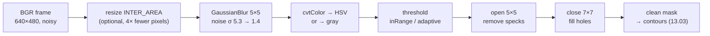

# 13.02 — OpenCV fundamentals and preprocessing

<!-- glance:start -->
<!-- generated by tools/build.py from curriculum/syllabus.yaml — edit the syllabus, not this block -->

| | |
|---|---|
| **Track** | Main path |
| **Difficulty** | Beginner |
| **Time** | 1 h |
| **Hardware** | none |
| **Software** | python, opencv |
| **Prerequisites** | [13.01 Images as data — pixels, channels, RGB, grayscale, HSV](13.01-images-as-data.md) |
| **Optional prerequisites** | [FCV.02 Image processing as array math: convolution and kernels](../optional-foundations/computer-vision/FCV.02-convolution-kernels.md) |
| **Skip if** | You build preprocessing pipelines with OpenCV. |

<!-- glance:end -->

## What you will learn

- Pick a smoothing filter (box, Gaussian, median, bilateral) for a given kind of noise, and measure what it did.
- Predict how much a filter reduces noise from its kernel, and check the prediction on a real image.
- Choose between a fixed threshold, Otsu and an adaptive threshold when the lighting is uneven.
- Clean a binary mask with erosion, dilation, opening and closing, and pick kernel sizes from object sizes.
- Time a preprocessing pipeline and use resolution as the first speed knob on the robot.

## Why it matters

A raw frame from karmel's webcam is noisy (more so in a dim living room), unevenly lit (a window on one side), and
full of small things you don't care about. Detectors like the ball finder in [13.03](13.03-classical-detection.md)
don't work on raw pixels. They work on a **cleaned-up intermediate**: a blurred image, a binary mask, a set of edges.
Preprocessing is where most classical-vision robustness comes from, and where most CPU time on a Raspberry Pi goes.

Each step is a trade-off: blur removes noise but also detail, and thresholds split the image but break when the light
changes. This lesson makes those trade-offs measurable instead of magic numbers copied from a tutorial.

<!-- prereqs:start -->
## Prerequisites

You need these first:

- [13.01 Images as data — pixels, channels, RGB, grayscale, HSV](13.01-images-as-data.md)

### Optional prerequisite links

New to any of these? Take the foundation lesson first; skip it if you already know it.

- [FCV.02 Image processing as array math: convolution and kernels](../optional-foundations/computer-vision/FCV.02-convolution-kernels.md)

Check your readiness: `python course.py why 13.02`
<!-- prereqs:end -->

## Concept

Think of preprocessing as the **ETL stage of a data pipeline**. Raw events (pixels) are noisy and inconsistent. You
normalize, filter and aggregate before the business logic (detection) runs. And as in ETL, every stage has a cost and can
silently destroy the signal you need.

Three families of operations cover 90% of classical preprocessing:

1. **Filtering (smoothing).** Replace each pixel by a combination of its neighbours. Random noise differs from pixel to
   pixel, so averaging cancels it. Real structure (a ball edge) is consistent across neighbours, so it survives,
   partially. *Which* combination you use (plain average, Gaussian weights, median, edge-aware) decides what survives.
   Filtering with a small weight matrix (a **kernel**) sliding over the image is **convolution**.
   [FCV.02](../optional-foundations/computer-vision/FCV.02-convolution-kernels.md) builds it from scratch.
2. **Thresholding.** Turn a grayscale (or one-channel) image into a yes/no mask: "is this pixel dark?", "is this pixel
   orange?". The hard part is choosing *the* threshold when lighting varies across the image.
3. **Morphology.** Operations on the *shape* of a mask. Erode shrinks white regions and kills specks. Dilate grows
   them and fills gaps. Combined, they remove noise from a mask without changing the size of real objects much.

> [!TIP]
> **Ask your teacher:** "Draw a 5×5 patch of numbers with one noisy pixel, and walk me through a 3×3 mean filter and a 3×3 median filter on it."

## Technical explanation

### Level 1 — The operations in one table

| Operation | OpenCV | Good for | Destroys |
|---|---|---|---|
| Box (mean) blur | `cv2.blur(img, (5, 5))` | cheap noise reduction | edges (blurs them evenly), creates blocky artifacts |
| Gaussian blur | `cv2.GaussianBlur(img, (5, 5), 1.1)` | sensor noise, before edges/thresholds | fine detail |
| Median blur | `cv2.medianBlur(img, 5)` | salt-and-pepper outliers (dead pixels, compression spikes) | thin lines, small dots |
| Bilateral | `cv2.bilateralFilter(img, 9, 40, 5)` | smoothing while keeping edges | CPU time (10–50× a Gaussian) |
| Fixed threshold | `cv2.threshold(g, 90, 255, THRESH_BINARY)` | controlled lighting | anything under uneven light |
| Otsu | `cv2.threshold(g, 0, 255, THRESH_BINARY + THRESH_OTSU)` | bimodal histograms, even lighting | scenes with gradients or many classes |
| Adaptive | `cv2.adaptiveThreshold(g, 255, ADAPTIVE_THRESH_GAUSSIAN_C, THRESH_BINARY, 31, 12)` | documents, lines, tags under uneven light | large uniform objects (their interior isn't "darker than its neighbourhood") |
| Erode / dilate | `cv2.erode(m, k)`, `cv2.dilate(m, k)` | shrinking/growing masks | small objects (erode), gaps between objects (dilate) |
| Open / close | `cv2.morphologyEx(m, MORPH_OPEN, k)` | removing specks / filling holes | objects smaller than the kernel |

### Level 2 — Practical: what the measurements say

Run [`code/preprocessing.py`](code/preprocessing.py). It uses the synthetic ball scene with noise σ = 8 gray levels
added per color channel. Results (noise measured as the standard deviation in a flat wall patch):

```text
1) smoothing a noisy frame (sigma = 8 gray levels added)
   none                 noise std  5.33
   box 5x5              noise std  1.07
   gaussian 5x5 s=1.1   noise std  1.42
   median 5             noise std  1.29
   bilateral d=9        noise std  0.75
   salt-and-pepper 2% -> gaussian pixels off by > 20 levels: 2988
   salt-and-pepper 2% -> median   pixels off by > 20 levels: 39
```

Three lessons are in those numbers:

- **All linear blurs reduce Gaussian noise**, and the box filter looks best by this metric. But the box filter treats
  a pixel 2 px away the same as the center, so it smears edges more and creates blocky ringing. The Gaussian is the
  usual default: nearly as good, smoother falloff, and *separable* (a 5×5 Gaussian is a 5-tap filter on rows, then on
  columns), which makes it fast.
- **Outliers need a median.** One 255-valued pixel inside a 5×5 Gaussian still shifts the output by about
  0.37² × 245 ≈ 33 levels. The median simply ignores it. That's 2,988 damaged pixels vs. 39.
- **Bilateral is the best smoother and the slowest.** On a Pi, it can cost more than your whole detector. Use it only
  when you need both smoothing and sharp edges.

Thresholding under the strong left-to-right lighting gradient (goal: mark only the dark tile grout lines):

```text
2) finding the dark grout lines under a strong lighting gradient
   fixed 90         % of floor marked 'dark' in left/middle/right third:  73.2   6.0   0.0
   otsu (121)       % of floor marked 'dark' in left/middle/right third: 100.0  32.5   2.1
   adaptive 31/12   % of floor marked 'dark' in left/middle/right third:   2.9   6.0   5.6
```

The grout covers about 3–6% of the floor. The fixed threshold marks the whole dim left side as "dark" and misses
the bright right side. Otsu picks one global value (121) and fails the same way, even worse. The adaptive threshold
compares each pixel with its *own neighbourhood* (a 31 × 31 Gaussian-weighted mean minus 12), so the gradient cancels
out and it finds the lines everywhere.

Morphology on a noisy color mask (σ = 14 noise, naive orange hue range):

```text
3) cleaning a color mask with morphology
   blobs before: 625, after open(5)+close(7): 2
```

The 625 "blobs" are mostly single noisy pixels on the brown box whose saturation crosses the threshold. Opening with a
5 × 5 ellipse deletes everything smaller than the kernel. Closing with 7 × 7 fills the dark specular gaps inside the ball.
The two survivors are the ball and a small orange bottle cap, which is 13.03's problem.

### Level 3 — Mathematics: convolution, noise reduction, Otsu, morphology

**Convolution.** A kernel $w$ of size $(2k+1) \times (2k+1)$ produces

$$I'(y, x) = \sum_{i=-k}^{k}\sum_{j=-k}^{k} w(i, j)\, I(y + i, x + j)$$

(Strictly, this is correlation, but for symmetric kernels there's no difference.) Example: a 3 × 3 box filter
($w = 1/9$) on a patch of 10s with one pixel of 200 gives $(8 \cdot 10 + 200)/9 = 31.1$ at and around the spike. The
spike isn't removed, just spread over nine pixels. A 3 × 3 median of the same neighbourhood is 10: the spike is gone.

**Noise reduction of a linear filter.** If each pixel has independent noise with standard deviation $\sigma$, the
output noise is

$$\sigma' = \sigma \sqrt{\sum_{i,j} w(i,j)^2}$$

- 5 × 5 box: $w = 1/25$, $\sqrt{25 \cdot (1/25)^2} = 1/5$. Predicted $5.33 / 5 = 1.07$. Measured: **1.07**.
- 5 × 5 Gaussian, σ = 1.1: the 1D weights are `[0.0708, 0.2445, 0.3695, 0.2445, 0.0708]`, and
  $\sqrt{\sum w^2}$ over the 2D outer product is $0.266$. Predicted $5.33 \times 0.266 = 1.42$. Measured: **1.42**.

(Why was the input noise 5.33 and not 8? Grayscale is $0.299R + 0.587G + 0.114B$ of three independent noisy channels:
$8\sqrt{0.299^2 + 0.587^2 + 0.114^2} = 5.34$.)

**Otsu's method** tries every threshold $t$ and picks the one that maximizes the *between-class variance*

$$\sigma_B^2(t) = \omega_0(t)\,\omega_1(t)\,\big[\mu_0(t) - \mu_1(t)\big]^2$$

where $\omega_{0,1}$ are the fractions of pixels below/above $t$ and $\mu_{0,1}$ their mean intensities. It's optimal
when the histogram has two clean peaks (dark objects on a bright floor, evenly lit). A lighting gradient smears both
peaks into one broad hump, and Otsu then splits "left half vs. right half" of the image. That's exactly the 100% / 2% you
saw above.

**Adaptive threshold:** $T(y, x) = \text{GaussianMean}_{31\times31}(y, x) - C$, and a pixel is "dark" if
$I(y,x) < T(y,x)$. With $C = 12$, a grout pixel of 70 among floor pixels of 95 is marked ($70 < 95 - 12 = 83$).
A floor pixel of 90 in a neighbourhood averaging 95 isn't ($90 > 83$), whether the neighbourhood is bright or dim.

**Morphology** with a structuring element $K$:
erosion keeps a pixel only if **all** pixels under $K$ are white; dilation sets it if **any** is white.
Opening = erode then dilate: it removes white regions that $K$ doesn't fit inside, and restores the others to
roughly their original shape. Closing = dilate then erode: it fills black holes and gaps smaller than $K$.

Sizing rule for the ball: at 3 m the ball's image radius is about $467.7 \cdot 0.035 / 2.9 \approx 5.6$ px
(you'll derive this in [13.05](13.05-pinhole-camera-model.md)). A 5 × 5 opening (radius 2) keeps it. A 13 × 13
opening (radius 6) erases it. **The kernel must be smaller than the smallest object you need to keep and larger
than the noise you want to remove.**

### Level 4 — Implementation: cost on the robot

- **Resolution first.** Most filters are O(pixels × kernel area). Halving width and height divides pixel count by 4.
  A ball 3 m away is 11 px wide at 640 × 480 and 5.5 px at 320 × 240, which is still detectable. Downscale with
  `cv2.resize(..., interpolation=cv2.INTER_AREA)` (averaging), not the default `INTER_LINEAR`, which aliases.
- **Separable and integer paths.** `GaussianBlur` and `blur` use separable, SIMD-optimized code. `medianBlur` is fast
  for size 3 and 5 on uint8. `bilateralFilter` isn't separable.
- **`ksize=(0, 0)`** lets OpenCV derive the kernel size from sigma (about 6σ + 1). Specifying both inconsistently
  (e.g. `(3, 3)` with σ = 3) silently truncates the Gaussian.
- **Borders.** Filters invent pixels outside the image (`BORDER_REFLECT_101` by default). Detections within half a kernel
  of the border are less reliable.
- **Threads.** OpenCV uses all cores by default (`cv2.getNumThreads()`). On a Pi that also runs ROS 2 nodes, a vision
  node hogging 4 cores starves the motor control loop. `cv2.setNumThreads(2)` is a legitimate tuning knob, covered
  in [13.15](13.15-vision-in-ros2.md).
- **Measure, don't guess.** Timing numbers on a laptop mean little for a Pi 5. Use the median of many runs
  (`time_ms` in the script) and run it *on the robot*.

> [!TIP]
> **Ask your teacher:** "My mask flickers between frames even though the ball doesn't move. Walk me through which preprocessing step to inspect first, and how to measure it."

## Diagram



```text
Opening = erode then dilate, 3×3 kernel (■ = white)

 mask            erode (all 9 white?)    dilate (any white?)
 . . . . . . .   . . . . . . .           . . . . . . .
 . ■ . . . . .   . . . . . . .           . . . . . . .     speck: gone
 . . . ■ ■ ■ .   . . . . . . .           . . ■ ■ ■ . .
 . . . ■ ■ ■ .   . . . . ■ . .   ──►     . . ■ ■ ■ . .     blob: back (slightly shifted
 . . . ■ ■ ■ .   . . . . . . .           . . ■ ■ ■ . .     at borders for odd shapes)
 . . . . . . .   . . . . . . .           . . . . . . .
```

## Code

[`13-computer-vision/code/preprocessing.py`](code/preprocessing.py) runs all four experiments and writes each stage's image
to `code/out/13.02-*.png`:

```bash
cd 13-computer-vision/code
py preprocessing.py               # synthetic scenes
py preprocessing.py --camera 0    # also times the pipeline on a real webcam frame
```

The reusable pieces, which 13.03 builds on:

```python
import cv2
import numpy as np

def noise_std(gray: np.ndarray, roi=(slice(20, 120), slice(20, 200))) -> float:
    """Noise estimate: std of a flat region after removing its smooth trend."""
    patch = gray[roi].astype(np.float32)
    trend = cv2.blur(patch, (15, 15))
    return float((patch - trend)[10:-10, 10:-10].std())

def clean_mask(mask: np.ndarray, open_k: int = 5, close_k: int = 7) -> np.ndarray:
    """Opening removes specks smaller than the kernel; closing fills holes and gaps."""
    k_open = cv2.getStructuringElement(cv2.MORPH_ELLIPSE, (open_k, open_k))
    k_close = cv2.getStructuringElement(cv2.MORPH_ELLIPSE, (close_k, close_k))
    m = cv2.morphologyEx(mask, cv2.MORPH_OPEN, k_open)
    return cv2.morphologyEx(m, cv2.MORPH_CLOSE, k_close)

def pipeline(bgr: np.ndarray) -> np.ndarray:
    blurred = cv2.GaussianBlur(bgr, (5, 5), 1.1)
    hsv = cv2.cvtColor(blurred, cv2.COLOR_BGR2HSV)
    return clean_mask(cv2.inRange(hsv, (5, 150, 60), (22, 255, 255)))
```

Timing (step 4 of the script) varies a lot between machines and even between runs. On a laptop, expect a few ms for
640 × 480 and several times less for 320 × 240. Exercise E4 has you measure it on the Pi.

## Exercise

### Exercise 13.02-E1 — Predict the noise after filtering `[numerical]`

Hardware: none. Using $\sigma' = \sigma\sqrt{\sum w^2}$, predict the output noise for input noise $\sigma = 5.33$ for:
(a) a 3 × 3 box filter, (b) a 7 × 7 box filter, (c) `cv2.GaussianBlur(g, (0, 0), 2.0)` (get the weights with
`cv2.getGaussianKernel(13, 2.0)`). Then add these filters to `blur_comparison()` in `preprocessing.py` and compare.

### Exercise 13.02-E2 — Break the threshold, then fix it `[predict]`

Hardware: none. In step 2 of the script, change `light=(0.35, 1.3)` to `light=(0.9, 1.0)` (almost even lighting).
**Before running**, predict which of fixed/Otsu/adaptive will now give a sensible result (3–6% "dark" in every third).
Run it and explain any surprise.

### Exercise 13.02-E3 — Kernel sizing for a far ball `[coding]`

Hardware: none. Generate `ball_scene(np.random.default_rng(2), ball_xy=(3.0, 0.0))` and build the naive orange mask. Apply opening with
elliptical kernels of size 3, 5, 7, 9, 11 and 13. For each, report whether the ball's blob survives
(`cv2.connectedComponentsWithStats`, check for a component near `truth.u, truth.v`) and its area. Find the largest
kernel that keeps the ball, and compare with the rule "kernel radius < object radius".

### Exercise 13.02-E4 — Measure on the robot `[hardware]`

Hardware: `robot-base` (the Raspberry Pi 5) and `camera`. Copy `13-computer-vision/code` to the Pi and install
`sudo apt install python3-opencv python3-yaml` (apt, not pip: Ubuntu 24.04 blocks system-wide pip under PEP 668).
Run `python3 preprocessing.py --camera 0` and record the pipeline time at 640 × 480 and 320 × 240. Then add
`cv2.setNumThreads(1)` at the top of `main()` and run again.

No robot yet? Run the same on your laptop with `cv2.setNumThreads(1)` vs. the default, and note how much the
multithreading helped.

## Expected result

- **13.02-E1:** (a) 3 × 3 box: $5.33/3 = 1.78$, measured 1.78. (b) 7 × 7 box: $5.33/7 = 0.76$, measured 0.74.
  (c) Gaussian σ = 2: $\sqrt{\sum w^2} = 0.141$, so ≈ 0.75, measured 0.74. For the largest kernels the measurement is
  slightly *below* the prediction because the 15 × 15 detrending inside `noise_std` also removes some low-frequency noise.
- **13.02-E2:** Typical output: fixed 90 → `1.4 2.7 0.6`, Otsu (≈135) → `40.7 8.8 10.2`, adaptive → `4.7 7.0 4.8`.
  Even with nearly even lighting, the fixed value catches only the darkest part of the grout (the lines get lighter with
  distance and blur), and Otsu still splits the floor's own shading, not "grout vs. tile", because grout is only ~5% of
  the pixels. Only the adaptive threshold lands in the 3–7% band everywhere. Lesson: adaptive thresholding is about
  *local contrast*, not only about gradients.
- **13.02-E3:** The ball's true image radius at 3 m is 5.6 px, and its naive-mask blob has an area of about 101 px
  (radius ≈ 5.7). With `rng = np.random.default_rng(2)`, openings with 3, 5, 7, 9 and 11 keep it (area 101, 97, 93, 91, 89),
  and 13 × 13 removes it. The largest safe elliptical kernel has radius 5, just below the blob radius, as the rule predicts.
  Other seeds shift the cut-off by one kernel size.
- **13.02-E4:** On a Pi 5, expect the 640 × 480 pipeline to take noticeably longer than on a laptop (typically several
  ms to tens of ms) and 320 × 240 to take roughly a quarter of that. Your exact numbers are the result. Single-threaded,
  the small image changes little (thread overhead dominates) and the large image gets slower. Record both. You'll need
  them to budget the CPU in 13.15.

## Troubleshooting

### Symptom: the mask flickers from frame to frame on a static scene
1. Save 10 consecutive raw frames and compute the per-pixel standard deviation (`np.std(stack, axis=0)`). If it's
   above ~3 gray levels in flat areas, it's sensor noise: blur more, or add light.
2. If the raw frames are stable but the mask flickers, the threshold sits right at the object's value. Print the HSV
   values of the flickering pixels and move the threshold away from them.
3. If the whole image brightness pulses, the webcam's auto-exposure is hunting (common under 50 Hz lighting in
   Israel). Fix exposure in the driver ([07.08](../07-sensors/07.08-rgb-cameras.md)).

### Symptom: after morphology the object disappeared
1. Save the mask before and after each operation.
2. Measure the object's size in the pre-morphology mask (`connectedComponentsWithStats`). If the opening kernel is
   as big as the object, reduce it.
3. If the object is thin (a cable, a table edge), opening will always destroy it. Use a line-shaped kernel
   (`MORPH_RECT, (15, 1)`) or skip opening.

### Symptom: adaptive threshold output is full of noise in flat regions
1. Flat regions have no local contrast, so noise alone crosses `mean − C`. Increase `C` (e.g. 5 → 12).
2. Blur before thresholding (Gaussian 5 × 5).
3. Increase `blockSize` if the pattern you want is large relative to the block.

### Symptom: pipeline too slow on the Pi
1. Time each stage separately. Don't assume which one is slow.
2. Downscale first. Check whether the detection still works at half resolution.
3. Replace bilateral with Gaussian, and check that you aren't converting color spaces twice or copying frames.
4. Limit OpenCV threads if other nodes starve.

## Common mistakes

- **Blurring after thresholding.** Blurring a binary mask produces gray values and undoes the threshold. Blur the
  image, threshold, *then* clean the mask with morphology.
- **Copying kernel sizes from tutorials** written for 1920 × 1080 images. Size kernels from your object's size in *your*
  image.
- **Using Otsu on scenes that aren't bimodal.** Print the histogram (`np.histogram(gray, 32)`) before trusting it.
- **Even kernel sizes.** Gaussian and median kernels must be odd. OpenCV raises for `GaussianBlur` and `medianBlur`,
  but `blur` accepts even sizes and shifts the image by half a pixel.
- **Timing the first call.** The first call allocates buffers and may be 10× slower. Warm up, then use the median of many runs.
- **Ignoring the border.** A ball cut by the image edge gets a distorted blob after filtering. Treat detections
  touching the border with suspicion.

## Knowledge check

1. Which filter would you use for isolated white and black dots (dead pixels, transmission glitches), and why?
   <details><summary>Answer</summary>

   A median filter. Isolated outliers don't change the median of a neighbourhood, while any linear filter (box, Gaussian)
   spreads their energy over the neighbours. In the experiment, the median left 39 damaged pixels vs. 2,988 for the Gaussian.
   </details>

2. Input noise σ = 6. What's the output noise of a 3 × 3 box filter? Of a 9 × 9 box filter?
   <details><summary>Answer</summary>

   $\sigma' = \sigma/\sqrt{N}$ with $N$ = kernel area: $6/3 = 2.0$ and $6/9 = 0.67$.
   </details>

3. Why did Otsu mark 100% of the dim left third as "dark" in the gradient scene?
   <details><summary>Answer</summary>

   Otsu picks one global threshold that best separates the histogram into two classes. With a strong gradient, the
   dominant split is "dim half vs. bright half", not "grout vs. tile". The threshold (121) is above every pixel on the dim side.
   </details>

4. You open a mask with an 11 × 11 kernel and the ball far away (a disc of radius 5 px in the mask) disappears. Why, and
   what are two fixes?
   <details><summary>Answer</summary>

   Erosion keeps only pixels where the whole radius-5 kernel fits inside the blob. For a radius-5 disc that's nothing,
   and dilation can't restore what's gone. (A 9 × 9 opening keeps 75 of its 81 pixels.)
   Fixes: use a smaller kernel (3 or 5), or process at higher resolution. You can also use a size-dependent kernel:
   small near the horizon, where far objects appear, larger at the bottom of the image.
   </details>

5. Predict: you apply `cv2.blur(mask, (5, 5))` to a binary mask and then `cv2.findContours`. What goes wrong?
   <details><summary>Answer</summary>

   The mask now contains intermediate values (51, 102...). `findContours` treats every non-zero pixel as foreground,
   so blobs grow by the kernel radius and nearby blobs merge. Threshold again or, better, use morphology instead of blur on masks.
   </details>

6. What's the difference between opening and closing, in one sentence each, with a robot example?
   <details><summary>Answer</summary>

   Opening (erode→dilate) removes white regions smaller than the kernel: it deletes speckle from a noisy "orange" mask.
   Closing (dilate→erode) fills black holes and gaps smaller than the kernel: it fills the specular highlight in the middle
   of the ball's blob so the contour is one solid disc.
   </details>

7. A 640 × 480 pipeline takes 12 ms on the Pi. Roughly how long at 320 × 240, and what's the risk?
   <details><summary>Answer</summary>

   About 3 ms (4× fewer pixels; fixed overhead makes it somewhat more). The risk: far objects shrink below kernel
   sizes and detection thresholds, so re-check the minimum detectable distance at the lower resolution.
   </details>

## Practical challenge

Build `robust_line_mask(bgr) -> mask` that extracts dark floor lines (the tile grout, or black tape for a
line-following robot) from `ball_scene` images under **any** of these lighting conditions: `(0.3, 0.5)`, `(0.35, 1.3)`,
`(0.9, 1.0)`, `(1.2, 1.6)`.

Acceptance criteria:
- In the bottom 180 rows (the floor), the fraction of pixels marked is between 1% and 12% in each image third,
  for all four lighting conditions. (In the darkest condition, the far grout lines have almost no contrast left, so
  expect the low end.)
- The ball and the box are not marked as lines (fewer than 10% of their pixels).
- Total runtime under 10 ms per frame on your laptop (median of 50 runs), measured with `time_ms`.
- Hint: threshold the V channel adaptively, then reject strongly colored pixels (high S).
- Write down the parameter values you chose and *why* (kernel size vs. line width, C vs. noise level).

## You can skip this if…

You can answer knowledge-check questions 2, 3 and 4 without looking, and you have tuned an adaptive threshold and
morphology kernels for a real camera before. Then: `python course.py skip 13.02 --reason "built OpenCV preprocessing pipelines before"`.

## Go deeper

- OpenCV tutorial, Smoothing Images: https://docs.opencv.org/4.x/d4/d13/tutorial_py_filtering.html
- OpenCV tutorial, Image Thresholding (includes Otsu and adaptive): https://docs.opencv.org/4.x/d7/d4d/tutorial_py_thresholding.html
- OpenCV tutorial, Morphological Transformations: https://docs.opencv.org/4.x/d9/d61/tutorial_py_morphological_ops.html
- First Principles of Computer Vision (Nayar), the image processing lectures (linear filters, non-linear filters):
  https://fpcv.cs.columbia.edu/
- Szeliski, *Computer Vision: Algorithms and Applications*, 2nd ed., chapter 3 "Image processing": https://szeliski.org/Book/

## Progress checkpoint

- [ ] I can choose a smoothing filter for Gaussian noise vs. outliers and predict its noise reduction.
- [ ] I can explain when fixed, Otsu and adaptive thresholds fail.
- [ ] I can size morphology kernels from the object size in pixels.
- [ ] I have timed a preprocessing pipeline and know which knob to turn first.

`python course.py complete 13.02` (exercises done) · `python course.py master 13.02` (challenge done) ·
`python course.py struggle 13.02 "what was hard"`

Next: [13.03 — Classical detection: find the ball](13.03-classical-detection.md).
