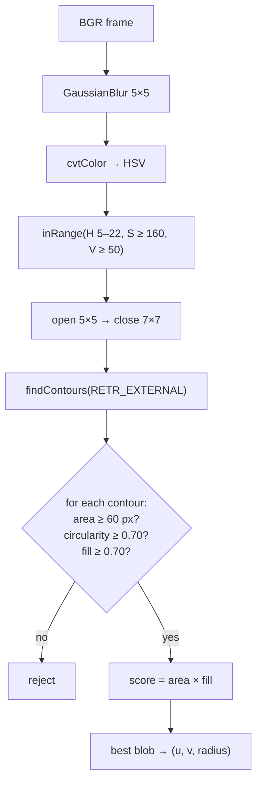

# 13.03 — Classical detection — color segmentation and contours (find the ball)

<!-- glance:start -->
<!-- generated by tools/build.py from curriculum/syllabus.yaml — edit the syllabus, not this block -->

| | |
|---|---|
| **Track** | Main path |
| **Difficulty** | Beginner |
| **Time** | 1 h |
| **Hardware** | none |
| **Software** | python, opencv |
| **Prerequisites** | [13.02 OpenCV fundamentals and preprocessing](13.02-opencv-preprocessing.md) |
| **Optional prerequisites** | [FCV.03 Color spaces: RGB, HSV, Lab](../optional-foundations/computer-vision/FCV.03-color-spaces.md) |
| **Skip if** | You can detect a colored object robustly under changing light. |

<!-- glance:end -->

## What you will learn

- Build a color-based object detector: HSV segmentation → mask cleanup → contours → shape tests → best candidate.
- Choose HSV thresholds from measured samples instead of guessing, and handle hue wrap-around for red objects.
- Reject look-alikes with contour geometry: area, circularity, fill ratio.
- Evaluate a detector systematically over lighting and distance, and report a detection rate and a pixel error.
- Run the same detector live on a USB webcam and read its frame rate.

## Why it matters

"Drive to the orange ball" is the first perception-driven behavior karmel gets. It needs a detector that returns the
ball's pixel position and apparent size every frame, fast enough for a control loop on a Raspberry Pi, and that
**doesn't** return the brown cardboard box, the orange bottle cap or the shadowed corner of the room. The pixel
position feeds the steering controller. The apparent size and position feed the distance estimate in
[13.05](13.05-pinhole-camera-model.md).

Modern learned detectors ([13.10](13.10-object-detection-models.md)) handle "any bottle" or "any person", but a colored
target in a known environment is still solved best by a 30-line classical pipeline: it needs no GPU and no training data,
it's explainable, and it runs at camera frame rate on a Pi. Knowing *why* it fails also tells you what the learned models
fix.

<!-- prereqs:start -->
## Prerequisites

You need these first:

- [13.02 OpenCV fundamentals and preprocessing](13.02-opencv-preprocessing.md)

### Optional prerequisite links

New to any of these? Take the foundation lesson first; skip it if you already know it.

- [FCV.03 Color spaces: RGB, HSV, Lab](../optional-foundations/computer-vision/FCV.03-color-spaces.md)

Check your readiness: `python course.py why 13.03`
<!-- prereqs:end -->

## Concept

A classical detector is a **funnel of cheap filters**, like a SQL query:

```sql
SELECT blob FROM image
WHERE color IN orange_range          -- segmentation
  AND area > min_area                -- not noise, not too far
  AND circularity > 0.7              -- round
  AND fill_ratio > 0.7               -- solid disc, not a ring or an L
ORDER BY area * fill_ratio DESC
LIMIT 1
```

Each stage is simple and each removes a class of false positives. Robustness comes from *combining* independent
evidence (color **and** shape **and** size), because each single cue has look-alikes:

- Color alone: the cardboard box has the same hue as the ball (H = 13 for both in the synthetic scene).
  It is less *saturated*, though.
- Shape alone: the round shadow of a chair leg, a round light reflection.
- Size alone: anything.

The first detector everyone writes is "threshold the hue, take the largest contour". On the synthetic scenes of this
lesson it finds the ball **3% of the time**: the box is always bigger. The robust version finds it 70% of the time out of
the box and 93% after the tuning you'll do in the exercises. The numbers make the point better than any argument.

Color thresholds depend on lighting, white balance and the camera. HSV makes them *less* sensitive to brightness
(see [13.01](13.01-images-as-data.md)), not immune. [FCV.03](../optional-foundations/computer-vision/FCV.03-color-spaces.md)
covers why Lab or normalized-rgb spaces are sometimes better.

> [!TIP]
> **Ask your teacher:** "Give me three real objects in a typical Israeli apartment that would fool an orange-ball detector, and which filter stage would reject each one."

## Technical explanation

### Level 1 — The pipeline



### Level 2 — Practical: build it, measure it, break it

The detector lives in [`code/find_ball.py`](code/find_ball.py). Its configuration is a frozen dataclass, so every
experiment is explicit:

```python
@dataclass(frozen=True)
class BallDetectorConfig:
    hsv_lo: tuple[int, int, int] = (5, 160, 50)      # H 0-179, S, V
    hsv_hi: tuple[int, int, int] = (22, 255, 255)
    min_area_px: float = 60.0
    min_circularity: float = 0.70
    min_fill: float = 0.70
```

`evaluate()` renders 30 scenes: 5 lighting conditions (from very dim `(0.25, 0.45)` to bright `(1.2, 1.6)`) × 6 distances
(0.5 m to 3.2 m), with the ball at a random lateral offset each time and the two distractors in view. A detection
counts as correct if its center is within max(3 px, 30% of the true radius) of the true center.

```text
$ py find_ball.py --naive
detection rate: 3%
$ py find_ball.py
light (L,R)   dist m true r px found r px center err px  ok
(0.25, 0.45)     0.5      40.9       40.8           2.6  yes
(0.25, 0.45)     0.8      23.4          -          miss  NO
...
(0.55, 1.15)     1.2      14.9       14.6           0.4  yes
(0.55, 1.15)     3.2       5.3          -          miss  NO
detection rate: 70%
```

The failures cluster in two places, and the diagnosis shows the method. **In the dim row**, the ball's V drops to
30–74 (median 50), so `V ≥ 50` cuts half the ball. **At 3.2 m**, the ball's contour area is ~48 px, below
`min_area_px = 60`. Both are threshold choices, not algorithm failures. Exercise E2 fixes them and reaches 93%.

When the detector does fire, it's accurate: center errors are 0.1–2.6 px, and the found radius is within about 1 px
of the true one. The found radius tends to be slightly *small* at long range (the darker rim fails the threshold) and
slightly *large* up close (blur plus closing). Remember this bias. It matters for distance estimation in 13.05.

**Choosing thresholds from data.** Don't pick HSV ranges from a color picker. Sample the object's pixels under the
lighting conditions you care about and set the range from the statistics:

```bash
py find_ball.py --camera 0 --sample      # hold the ball in the image center
center HSV  min [ 11 198  96]  median [ 13 231 142]  max [ 16 247 171]
```

Then choose H from roughly min − 3 to max + 3, S from somewhat below the minimum you saw in dim light, and V low enough
for the darkest condition you need. Record several lighting conditions (window side, lamp at night) and take the union.
These particular numbers are illustrative. Yours depend on your ball and camera.

### Level 3 — Mathematics: contour geometry

A **contour** is the ordered list of boundary pixels of a blob (`cv2.findContours`). From it:

**Area** (Green's theorem over the polygon, `cv2.contourArea`) and **perimeter** $P$ (`cv2.arcLength`).

**Centroid** from image moments $M_{pq} = \sum_{x,y} x^p y^q\, I(x, y)$:

$$\bar{u} = \frac{M_{10}}{M_{00}}, \qquad \bar{v} = \frac{M_{01}}{M_{00}}$$

`cv2.moments(contour)` returns them. For a partly occluded ball, the *enclosing circle's* center is often better than
the centroid, because the centroid is pulled toward the visible part.

**Circularity** compares area to perimeter:

$$c = \frac{4\pi A}{P^2}$$

A perfect disc gives $c = 1$ ($A = \pi r^2$, $P = 2\pi r$). A square gives $4\pi s^2/(4s)^2 = \pi/4 = 0.785$. A 3:1
rectangle gives $4\pi \cdot 3s^2/(8s)^2 = 0.589$. The box's image outline (a hexagon-ish rectangle) scores ~0.6–0.8,
which is why circularity *alone* isn't enough.

**Fill ratio** compares the area to the minimum enclosing circle of radius $r_e$:

$$f = \frac{A}{\pi r_e^2}$$

A disc gives $f \approx 1$, a square gives $s^2 / (\pi s^2/2) = 2/\pi = 0.637$, and a thin strip (the bottle cap seen from
the side) gives ≈ 0.4. Fill ratio rejects the box and the cap in this scene.

**Pixel quantization at small sizes.** For a disc of radius 5 px, the contour runs through boundary pixel *centers*, so
the polygon's area underestimates $\pi r^2$ and its staircase perimeter overestimates $2\pi r$. Numerically, the ball at
3.2 m (true $r = 5.3$ px, $\pi r^2 = 88$ px²) gives a contour area of 48.5 px². Circularity also degrades for small
blobs. Shape tests become unreliable below ~6 px radius, so set `min_area_px` from the farthest distance you need
(in 13.05 you'll compute $r = f R / Z$ for that) and loosen the shape tests there.

**Expected size as a filter.** On a flat floor with a level camera, a ball whose center is at image row $v$ is at a
known distance (13.05 derives $Z = f h / (v - c_y)$), so its radius must be $f R / Z$. A blob at row 350 with radius 40 px
can't be the 7 cm ball. That "geometric plausibility" check is one of the most effective false-positive filters in
robotics, and it's free once the camera is calibrated.

### Level 4 — Implementation details

- **`findContours` API.** OpenCV 4.x and 5.x return `(contours, hierarchy)`. OpenCV 3.x returned
  `(image, contours, hierarchy)`, so old snippets break with "too many values to unpack". `RETR_EXTERNAL` ignores holes
  (the ball's specular highlight). `CHAIN_APPROX_SIMPLE` compresses straight runs and is fine for area.
  `CHAIN_APPROX_NONE` keeps every pixel, which gives a more faithful perimeter for small blobs.
- **Red needs two ranges.** `cv2.inRange(hsv, (0, s, v), (8, 255, 255)) | cv2.inRange(hsv, (170, s, v), (179, 255, 255))`.
- **`HoughCircles`** is the other classical ball detector. It votes for circle centers from edge gradients and works on
  grayscale, so it's color-independent. It's sensitive to parameters, slower, and finds circles in textures (tiles,
  wheels). Use it to *verify* a color blob, not as the primary detector.
- **Temporal filtering.** A ball doesn't teleport. Requiring detections in 2 of the last 3 frames, or gating the new
  detection to within N px of the last one, removes one-frame glitches. Proper tracking is [13.12](13.12-tracking.md).
- **Auto white balance and auto exposure** move HSV values when the scene changes (a white wall enters the view). For
  a color detector, fix them on the camera (`v4l2-ctl`, or driver parameters in [07.08](../07-sensors/07.08-rgb-cameras.md)).
- **Speed.** Blur + HSV + inRange + two morphology ops + contours on 640 × 480 takes a few ms on a laptop. Measure it
  on the Pi (13.02-E4). If you need more speed, detect at 320 × 240 and refine the radius in a full-resolution crop.

> [!TIP]
> **Ask your teacher:** "My detector works at my desk and fails in the living room at night. Give me a step-by-step plan to find out which stage fails, using saved frames."

## Diagram

```text
 Why each filter stage exists (synthetic scene, ball at 1.1 m):

   image                      mask (H 5–22)          after S ≥ 160, open/close     after shape tests
 ┌─────────────────────┐    ┌──────────────────┐     ┌──────────────────┐        ┌──────────────────┐
 │           ┌──────┐  │    │          ██████  │     │                  │        │                  │
 │           │ box  │  │    │          ██████  │     │                  │        │                  │
 │    ●      └──────┘  │ ─► │   ●      ██████  │ ─►  │   ●              │  ─►    │   ◯ u=273 v=291  │
 │   ball              │    │                  │     │                  │        │     r=16.1 px    │
 │ ▬ cap               │    │ ▬                │     │ ▬                │        │                  │
 └─────────────────────┘    └──────────────────┘     └──────────────────┘        └──────────────────┘
   H: ball 13, box 13        box passes hue           box fails saturation         cap fails fill ratio
   S: ball 233, box 136      (naive picks the box)    (136 < 160)                  (0.4 < 0.7)

 circularity 4πA/P²:  disc 1.00   square 0.785   3:1 rectangle 0.589
 fill A/(π r_e²):     disc 1.00   square 0.637   thin strip ≈ 0.4
```

## Code

[`13-computer-vision/code/find_ball.py`](code/find_ball.py) (tested by
[`test_cv_code.py`](code/test_cv_code.py)):

```python
def segment(bgr: np.ndarray, cfg: BallDetectorConfig) -> np.ndarray:
    blurred = cv2.GaussianBlur(bgr, (cfg.blur_ksize, cfg.blur_ksize), 0)
    hsv = cv2.cvtColor(blurred, cv2.COLOR_BGR2HSV)
    mask = cv2.inRange(hsv, cfg.hsv_lo, cfg.hsv_hi)
    ko = cv2.getStructuringElement(cv2.MORPH_ELLIPSE, (cfg.open_ksize, cfg.open_ksize))
    kc = cv2.getStructuringElement(cv2.MORPH_ELLIPSE, (cfg.close_ksize, cfg.close_ksize))
    mask = cv2.morphologyEx(mask, cv2.MORPH_OPEN, ko)
    return cv2.morphologyEx(mask, cv2.MORPH_CLOSE, kc)


def describe(contour: np.ndarray) -> BallDetection:
    area = cv2.contourArea(contour)
    perimeter = cv2.arcLength(contour, True)
    (u, v), r = cv2.minEnclosingCircle(contour)
    circ = 4 * math.pi * area / (perimeter * perimeter) if perimeter > 0 else 0.0
    fill = area / (math.pi * r * r) if r > 0 else 0.0
    return BallDetection(u, v, r, area, circ, fill)


def find_ball(bgr: np.ndarray, cfg: BallDetectorConfig = BallDetectorConfig()) -> BallDetection | None:
    """The most ball-like blob that passes every check, or None."""
    mask = segment(bgr, cfg)
    contours, _ = cv2.findContours(mask, cv2.RETR_EXTERNAL, cv2.CHAIN_APPROX_NONE)
    best, best_score = None, 0.0
    for c in contours:
        d = describe(c)
        if d.area_px < cfg.min_area_px or d.circularity < cfg.min_circularity or d.fill < cfg.min_fill:
            continue
        score = d.area_px * d.fill                   # prefer big, round blobs
        if score > best_score:
            best, best_score = d, score
    return best
```

Commands:

```bash
cd 13-computer-vision/code
py find_ball.py --naive                     # 3%: hue only, largest blob
py find_ball.py                             # 70%: full pipeline, default thresholds
py find_ball.py --v-min 25 --min-area 30    # after tuning (Exercise E2)
py find_ball.py --camera 0 --sample         # live HSV statistics of the image center
py find_ball.py --camera 0                  # live detection, prints FPS, saves out/13.03-camera-*.png
```

The annotated synthetic detection and its mask are saved as `out/13.03-detection.png` and `out/13.03-mask.png`.

## Exercise

### Exercise 13.03-E1 — Why does the naive detector fail? `[predict]`

Hardware: none. **Before running**, predict what `find_ball_naive` returns for the default scene
(`ball_scene(np.random.default_rng(0), ball_xy=(1.1, 0.1))`): which object, and roughly what radius? Then run
`py find_ball.py --naive`, open `out/13.03-detection.png`, and print the HSV of the box's center pixel to explain the result.

### Exercise 13.03-E2 — Tune from failures, not by guessing `[coding]`

Hardware: none. Run `py find_ball.py`. For each missed case, render that scene (same light and distance) and
inspect it: print the HSV statistics inside the true ball circle (`truth.u, truth.v, truth.radius_px`) and the contour
properties of any blob near the ball *before* filtering. Change **only** the thresholds that the evidence points to,
using `--s-min`, `--v-min` and `--min-area`. Reach ≥ 90% without any false detection on the box or the cap.

### Exercise 13.03-E3 — A red ball `[coding]`

Hardware: none. Render `ball_scene(rng, ball_xy=(x, 0.0), ball_bgr=(40, 35, 215))` for x in 0.6, 1.0, 1.5, 2.0 (in this
scene the cap becomes red too). Show that `find_ball` with the orange range fails, print the hue values inside the ball,
and extend `segment()` to accept a list of hue ranges ORed together. Make `find_ball` detect the red ball at all four
distances without detecting the cap.

### Exercise 13.03-E4 — Live ball on the real camera `[hardware]`

Hardware: `camera` (USB webcam on your laptop or the Pi). Any orange or strongly colored ball works.

1. Run `py find_ball.py --camera 0 --sample` near a window and again in lamp light. Set your HSV range from both.
2. Run `py find_ball.py --camera 0 --frames 300` with those thresholds (edit `BallDetectorConfig` defaults or pass
   `--s-min/--v-min`). Roll the ball around 0.5–3 m from the camera.
3. Record FPS, the maximum distance at which it's still detected, and every false positive you see (and what object caused it).

No camera: record a short set of frames later, or treat E2 as your evaluation.

### Exercise 13.03-E5 — The detector jumps to the wrong object `[debugging]`

Hardware: none. A teammate "loosened" the shape tests to `BallDetectorConfig(min_fill=0.3, min_circularity=0.6)` so
that partly occluded balls are found. Render `ball_scene(np.random.default_rng(0), ball_xy=(2.6, -0.4))`. The detection
now lands on the bottle cap, not the ball. Diagnose it by printing every contour's `describe()` result and the score
`area × fill`, and explain which original rule rejected the cap. Then add a *plausibility* rule that doesn't depend on fill ratio: the blob's radius must be within
±50% of the radius expected for a 7 cm ball at the distance implied by its image row, $r_{exp} = f R (v - c_y) / (f h)$
with $f = 467.7$, $c_y = 240$, $h = 0.11$ m, $R = 0.035$ m (derived in 13.05).

## Expected result

- **13.03-E1:** The naive detector returns the brown box: center u ≈ 490, v ≈ 246, radius ≈ 74 px. The box's center pixel
  reads HSV ≈ `[14, 144, 124]`: the same hue as the ball, lower saturation. Across the sweep it's right in only 1 of 30
  scenes (3%): the dimmest lighting with the ball 0.5 m away, where the dim box falls below V = 50 and drops out of the mask.
- **13.03-E2:** Evidence from the misses: the dim-light ball has V down to ~30 (median ~50), and the 3.2 m ball has a
  contour area of ~48 px. `py find_ball.py --v-min 25 --min-area 30` reaches **93%** (28/30). The two remaining misses
  are at 3.2 m (one very dim, one very bright with saturated highlights). Lowering V further or the area below ~25 starts
  admitting noise. The box stays rejected by saturation and fill, and the cap by fill ratio.
- **13.03-E3:** Hue inside the red ball is 177–179 and 0–1 (the wrap-around). With ranges `[(0, 8), (170, 179)]`,
  S ≥ 160, V ≥ 25 and `min_area_px = 30`, the ball is found at all four distances with center error < 0.5 px. The red cap
  (a thin strip, contour area ≈ 354 px², fill ≈ 0.41) is bigger than the ball at 1.5–2.0 m (ball area 342 and 166 px²),
  so a "largest blob" rule would pick it. The fill-ratio test rejects it.
- **13.03-E4:** With a C920-class webcam at 640 × 480, the detector itself runs far faster than the camera, so FPS is
  limited by the camera (typically 30 fps in good light, lower in dim light when auto-exposure lengthens exposure).
  Maximum detection distance for a ~7 cm ball is typically 3–4 m with `min_area_px ≈ 30`. Typical false positives are
  skin (hands), wooden furniture, and warm-white lamps reflected on glossy surfaces. Write them down; E5 and 13.05 give
  you tools against them.
- **13.03-E5:** Two blobs: the cap at (96, 346) with area 386, circularity 0.67, fill 0.40 (score 154), and the ball at
  (395, 260) with area 90, circularity 0.89, fill 0.85 (score 76). The original `min_circularity = 0.7` and
  `min_fill = 0.7` both rejected the cap. With the loosened tests, it wins on score. The plausibility check fixes it
  without re-tightening: at row v = 346, the expected radius is $0.035 \cdot 106 / 0.11 = 33.7$ px (f cancels out).
  The cap's enclosing radius is 17.6 px, *just* inside the ±50% band [16.9, 50.6]. Its area-equivalent radius
  $\sqrt{386/\pi} = 11.1$ px is clearly outside, while the ball's (5.3 px vs. expected 6.5 px) is inside. Notice that
  the choice of size measure matters.

## Troubleshooting

### Symptom: nothing is ever detected
1. Save the mask (`segment()` output). If it's empty, the thresholds are wrong: print HSV inside the object
   (`--sample`) and compare with `hsv_lo/hsv_hi`.
2. If the mask has the ball but no detection, print `describe()` for every contour and see which test rejects it.
3. If HSV looks right but the mask is still empty, check the channel order (13.01): a BGR/RGB swap moves orange to H ≈ 108.

### Symptom: detections on skin, wood or lamps
1. Print the false blob's HSV. Skin and wood are usually lower saturation than a toy ball: raise S minimum.
2. Tighten shape tests or add the expected-size plausibility check.
3. If the false object is genuinely the same color, add a second cue (Hough circle verification, or motion).

### Symptom: works in the day, fails at night
1. Compare HSV samples day vs. night. Warm lamps (2700 K) shift the hue of everything toward orange, and auto white balance
   may or may not correct it.
2. Check V: at night V drops and noise rises. Lower V minimum, blur more, add light.
3. Fix white balance and exposure on the camera so the thresholds stay valid.

### Symptom: detection position jitters by several pixels on a still ball
1. Check whether the mask boundary flickers (noise near the threshold). If so, widen the range away from the ball's
   typical values, or blur more.
2. Use the enclosing-circle center rather than the centroid if the specular highlight comes and goes.
3. Smooth over time (exponential moving average) only after fixing the per-frame cause.

## Common mistakes

- **Picking the largest orange blob.** Big, orange things aren't rare. Always filter by shape and plausibility.
- **Tuning thresholds on one image.** Tune on a set covering the lighting you'll see, and keep that set as a regression
  test (that's what `evaluate()` is).
- **Ignoring saturation and value.** Hue on gray or dark pixels is random, and the mask fills with noise.
- **Trusting circularity for tiny blobs.** Below ~6 px radius, pixelation dominates. Relax shape tests at long range or
  use size plausibility.
- **Forgetting red's hue wrap-around.** One range covers only half of the red.
- **Measuring accuracy by eye.** Use ground truth (synthetic) or measured positions, and report numbers.

## Knowledge check

1. List the stages of the ball detector in order and name one false positive each stage removes.
   <details><summary>Answer</summary>

   Blur (sensor-noise specks) → HSV inRange (non-orange objects) → opening (isolated noisy pixels, e.g. on the box) →
   closing (fills the highlight hole; doesn't remove but fixes the ball's shape) → contours → area (tiny blobs, too-far noise) →
   circularity (irregular blobs) → fill ratio (squares, thin strips like the bottle cap) → best score.
   </details>

2. Compute circularity and fill ratio for a square of side 20 px.
   <details><summary>Answer</summary>

   $A = 400$, $P = 80$: $c = 4\pi \cdot 400 / 6400 = 0.785$. Enclosing circle radius $= 20/\sqrt2 = 14.14$:
   $f = 400/(\pi \cdot 200) = 0.637$.
   </details>

3. Why does the naive detector choose the box, even though the ball is orange and the box is brown?
   <details><summary>Answer</summary>

   In HSV both have hue 13. They differ in saturation (233 vs. 136), and the naive range starts at S = 50,
   so both pass. Then "largest contour" picks the box, which covers far more pixels.
   </details>

4. Predict: you process frames from a ROS topic without converting `rgb8` to BGR. What does the orange detector output?
   <details><summary>Answer</summary>

   Almost always `None`: the ball's hue becomes ≈ 108 (blue), outside 5–22. Blue objects in the scene would now pass the hue
   test instead, and might be detected if they're round.
   </details>

5. The ball is 7 cm in diameter and the camera has f = 467.7 px. What `min_area_px` would you set to detect it up to 4 m
   (Z ≈ 3.9 m along the optical axis)? What changes in practice?
   <details><summary>Answer</summary>

   $r = 467.7 \cdot 0.035 / 3.9 = 4.2$ px, so $\pi r^2 = 55$ px². But the contour area of a pixelated small disc is
   roughly half the ideal (48 vs. 88 px² in the experiment), and the rim fails the threshold, so set around 25 px² and
   relax circularity at that size. Noise blobs of that size must then be rejected by other means (plausibility, temporal consistency).
   </details>

6. Your detector reports the ball at u = 320, v = 200 with r = 30 px. The camera is level at 0.145 m above the floor.
   Why should you distrust this detection?
   <details><summary>Answer</summary>

   v = 200 is above the horizon (c_y = 240). A ball lying on the floor always appears *below* the horizon for a level
   camera higher than the ball. Something orange and round is on a shelf, a wall or a person. This plausibility test is formalized in 13.05.
   </details>

7. When is `HoughCircles` a better choice than color segmentation?
   <details><summary>Answer</summary>

   When the object has no distinctive color but a clear circular edge (a white ball on a colored floor, a round
   lid), or as a verification step on a color blob. It's slower and prone to false circles in textures.
   </details>

## Practical challenge

Make the detector **distance-aware**: `find_ball_on_floor(bgr, cam, T_base_optical)` that rejects every blob whose size is
implausible for a 7 cm ball on the floor at the blob's image row. Reuse `ground_point_from_pixel()` from
[`code/camera_model.py`](code/camera_model.py) (you'll understand it fully after 13.05; for now treat it as "pixel → floor
point").

Acceptance criteria:
- ≥ 93% on `evaluate()` (same 30 scenes).
- Add a new distractor to a copy of `ball_scene` (an orange disc on the wall at 0.5 m height, radius 5 cm): your detector
  never reports it, while `find_ball` does in at least some scenes.
- It returns `None`, not a wrong blob, when the ball is off-screen (`ball_xy=(1.0, 3.0)`) in all lighting conditions.
- A pytest file with at least these three checks.

## You can skip this if…

You can answer knowledge-check questions 3, 5 and 6 without looking, and you have built a color detector that works
under at least two lighting conditions with a measured detection rate. Then:
`python course.py skip 13.03 --reason "built and evaluated a color blob detector"`.

## Go deeper

- OpenCV tutorial, Changing Colorspaces (object tracking by HSV range): https://docs.opencv.org/4.x/df/d9d/tutorial_py_colorspaces.html
- OpenCV tutorials, Contours (features, properties, hierarchy): https://docs.opencv.org/4.x/d3/d05/tutorial_py_table_of_contents_contours.html
- First Principles of Computer Vision (Nayar), "Binary images" and "Image segmentation" lectures: https://fpcv.cs.columbia.edu/
- Szeliski, *Computer Vision: Algorithms and Applications*, 2nd ed., sections on binary image processing and segmentation:
  https://szeliski.org/Book/
- Peter Corke, *Robotics, Vision and Control* (3rd ed.), "Image feature extraction" chapter (blobs, moments, shape):
  https://petercorke.com/rvc/

## Progress checkpoint

- [ ] I can build HSV segmentation + contour filtering and explain what each stage rejects.
- [ ] I can set thresholds from sampled pixel statistics, including red's wrap-around.
- [ ] I can compute circularity and fill ratio and know when they become unreliable.
- [ ] I have measured a detection rate over lighting and distance, not just looked at one image.

`python course.py complete 13.03` (exercises done) · `python course.py master 13.03` (challenge done) ·
`python course.py struggle 13.03 "what was hard"`

Next: [13.04 — Features: edges, corners, ORB and matching](13.04-features-and-matching.md).
