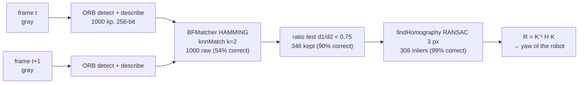

# 13.04 — Features — edges, corners, ORB and matching

<!-- glance:start -->
<!-- generated by tools/build.py from curriculum/syllabus.yaml — edit the syllabus, not this block -->

| | |
|---|---|
| **Track** | Main path |
| **Difficulty** | Intermediate |
| **Time** | 1 h |
| **Hardware** | none |
| **Software** | python, opencv |
| **Prerequisites** | [13.02 OpenCV fundamentals and preprocessing](13.02-opencv-preprocessing.md) |
| **Skip if** | You have matched ORB features between images with ratio test and RANSAC. |

<!-- glance:end -->

## What you will learn

- Explain what makes a point a good *feature* (edges vs. corners vs. flat regions) and compute the Harris response.
- Detect ORB keypoints and binary descriptors, and match them between two images with Hamming distance.
- Filter matches with Lowe's ratio test and a RANSAC homography, and measure how much each step improves precision.
- Estimate how far the camera rotated between two frames from matched features.
- Recognize the scenes where local features fail (repetitive textures, blank walls, motion blur) before you rely on them.

## Why it matters

The ball detector in 13.03 needed a *known color*. Most of the world has no such convenient property, yet a robot must
still answer questions like: "Did I turn 8° or 12° since the last frame?" (visual odometry), "Is this the same place I saw
before?" (loop closure in [11.05](../11-slam/11.05-pose-graphs-loop-closure.md)), "Where is the poster above my charging
dock in this image?" (recognizing a known planar object), and "Which pixel in the left image corresponds to this one in
the right?" (stereo, [13.08](13.08-depth-and-3d-vision.md)). All of these are **correspondence** problems, and local
features are the classical answer. Learned features and matchers exist, but they use the same pipeline (detect →
describe → match → verify geometrically), and the ratio test and RANSAC you learn here are still used with them.

<!-- prereqs:start -->
## Prerequisites

You need these first:

- [13.02 OpenCV fundamentals and preprocessing](13.02-opencv-preprocessing.md)

### Optional prerequisite links

None.

Check your readiness: `python course.py why 13.04`
<!-- prereqs:end -->

## Concept

Imagine two photos of a room taken a moment apart while the robot turned. To find how the image moved, you need
points you can **find again** in the second photo.

- A point in the middle of a **blank wall** is useless. Every nearby point looks the same, so you can't say where it went.
- A point on a **straight edge** (a door frame) is half useful. You can tell how it moved *across* the edge, but not *along* it
  (the "aperture problem").
- A point at a **corner** (the corner of a picture frame, a letter "K") is distinctive: any shift in any direction
  changes its surroundings. That's a good feature.

A feature pipeline has four stages, and they map nicely to a search engine:

1. **Detect** distinctive points (indexing: pick what's worth storing). Corner detectors: Harris, Shi–Tomasi, FAST.
2. **Describe** each point with a compact fingerprint of its neighbourhood (a document embedding). ORB uses a
   256-bit binary string, compared with Hamming distance (XOR + popcount, very fast).
3. **Match** fingerprints between images (nearest-neighbour search). Many matches will be wrong.
4. **Verify geometrically** (re-ranking with a hard constraint). Correct matches all agree on *one* geometric
   transformation. RANSAC finds that transformation and discards the matches that disagree.

**ORB** (Oriented FAST and Rotated BRIEF) is the practical default on a Raspberry Pi: fast, rotation-invariant, and
free of patents. SIFT has been free since 2020 (`cv2.SIFT_create`) and is more robust to scale and viewpoint change,
but it's several times slower.

> [!TIP]
> **Ask your teacher:** "Show me a flat patch, an edge patch and a corner patch as 5×5 number grids, and compute how the sum of squared differences changes when I shift each one by one pixel in x and in y."

## Technical explanation

### Level 1 — Edges and corners in OpenCV

| Task | Call | Output |
|---|---|---|
| Edges | `cv2.Canny(blurred, 50, 150)` | binary edge map, 1-px-wide edges |
| Harris corner response | `cv2.cornerHarris(np.float32(g), 2, 3, 0.04)` | float map, large positive at corners |
| Best corners to track | `cv2.goodFeaturesToTrack(g, 300, 0.01, 8)` | up to 300 (x, y) points ≥ 8 px apart |
| ORB keypoints + descriptors | `orb = cv2.ORB_create(1000); kp, des = orb.detectAndCompute(g, None)` | `KeyPoint`s, `(N, 32)` uint8 = 256 bits each |
| Brute-force matching | `cv2.BFMatcher(cv2.NORM_HAMMING).knnMatch(des1, des2, k=2)` | 2 nearest neighbours per descriptor |
| Robust homography | `cv2.findHomography(src, dst, cv2.RANSAC, 3.0)` | 3×3 H and an inlier mask |

**Canny** runs a Gaussian blur, Sobel gradients, keeps only local maxima along the gradient direction
(non-maximum suppression), then applies two thresholds with *hysteresis*: strong edges (> 150) are kept, and weak edges (50–150)
are kept only if connected to a strong edge. A ratio of 1:2 or 1:3 between the thresholds is the usual starting point.

### Level 2 — Practical: matching with the truth known

[`code/features.py`](code/features.py) renders a cluttered poster (shapes, lines, text) and creates the second view by
warping it with the homography a camera would see if the robot **turned 8° (yaw), tilted 3° and rolled 4°**, then
darkens it by 20% and adds noise. Because the true homography is known, each match can be graded: a match is *correct*
if it lands within 3 px of where the true homography maps the first point.

```text
$ py features.py
Canny edge pixels: 12049   Harris strong responses: 1663   Shi-Tomasi corners: 300
--- textured poster, camera turned 8 deg
keypoints 1000/1000
     raw: 1000 matches,  539 correct (<3 px) =  53.9%
    good:  346 matches,  310 correct (<3 px) =  89.6%
 inliers:  306 matches,  303 correct (<3 px) =  99.0%
estimated H vs true H: mean 0.27 px where the features are, max 5.78 px at the image corners
--- repetitive checkerboard, camera turned 3 deg
keypoints 510/1000
     raw:  510 matches,    6 correct (<3 px) =   1.2%
    good:  120 matches,    1 correct (<3 px) =   0.8%
 inliers:   21 matches,    0 correct (<3 px) =   0.0%
estimated H vs true H: mean 172.52 px where the features are, max 468.46 px at the image corners
```

Read it as a funnel:

- **Raw nearest-neighbour matching is a coin flip:** 54% correct. Some features left the image, some are
  ambiguous (the letters of "KARMEL" repeat), and some were changed by noise.
- **The ratio test** keeps a match only if the best candidate is clearly better than the second best. It throws away
  2/3 of the matches, but precision jumps to 90%.
- **RANSAC** keeps only matches consistent with one homography: 99% precision, and the estimated homography is within
  0.27 px of the truth where the features are. It's worse (5.8 px) at the image corners, where it's extrapolating beyond
  the matched region.
- **The checkerboard is a trap.** Every corner looks like every other corner, so descriptors can't tell them apart.
  The ratio test can't save you (the best and second-best candidates are equally good), and RANSAC still *returns a
  homography*: a confidently wrong one supported by 21 "inliers". **A returned result isn't a correct result.** Check the
  inlier count and inlier ratio (21/120 = 18% is a red flag), and sanity-check the motion against odometry.

Timing on a laptop is tens of milliseconds for 1,000 ORB features plus matching. RANSAC runs longer when the inlier
ratio is low (the checkerboard case), for the reason in Level 3.

### Level 3 — Mathematics: Harris, Hamming, the ratio test, RANSAC

**Harris corner response.** Shift a window by $(\Delta x, \Delta y)$ and measure the change
$E(\Delta x, \Delta y) = \sum_{w} [I(x + \Delta x, y + \Delta y) - I(x, y)]^2$. A first-order Taylor expansion gives

$$E \approx \begin{bmatrix}\Delta x & \Delta y\end{bmatrix} M \begin{bmatrix}\Delta x \\ \Delta y\end{bmatrix},\qquad
M = \sum_{w}\begin{bmatrix} I_x^2 & I_x I_y \\ I_x I_y & I_y^2 \end{bmatrix}$$

where $I_x, I_y$ are image gradients. The eigenvalues $\lambda_1, \lambda_2$ of $M$ say how fast $E$ grows in the two
principal directions: both small means flat, one large means edge, both large means corner. Harris avoids computing
eigenvalues with $R = \det M - k\,(\operatorname{tr} M)^2 = \lambda_1\lambda_2 - k(\lambda_1 + \lambda_2)^2$, $k \approx 0.04$.

Example: a vertical edge with $\lambda_1 = 1000$, $\lambda_2 = 5$ gives $R = 5000 - 0.04 \cdot 1005^2 = 5000 - 40401 = -35401$
(negative: edge). A corner with $\lambda_1 = 1000$, $\lambda_2 = 800$ gives $R = 800000 - 0.04 \cdot 1800^2 = 800000 - 129600 = 670400$
(large positive: corner). Shi–Tomasi (`goodFeaturesToTrack`) uses $\min(\lambda_1, \lambda_2)$ directly.

**Hamming distance** between two 256-bit ORB descriptors is the number of differing bits: `popcount(a XOR b)`, from 0
(identical) to 256. Unrelated patches differ in about 128 bits. Good matches are typically well below 64.

**Lowe's ratio test.** With $d_1$ the distance to the best candidate and $d_2$ to the second best, keep the match if

$$\frac{d_1}{d_2} < \rho,\qquad \rho \approx 0.7\text{–}0.8$$

Example: $d_1 = 20$, $d_2 = 60$ gives 0.33, a distinctive match, so keep it. $d_1 = 40$, $d_2 = 44$ gives 0.91: two
almost equally good candidates, so it's probably a repeated pattern and gets rejected. On the poster, raising $\rho$ trades
precision for quantity: 0.6 → 213 matches at 94% correct, 0.7 → 305 at 91%, 0.8 → 413 at 88%, 0.9 → 554 at 80%.

**Homography.** Points on a plane, or *any* points when the camera only rotates, map between two images by a 3×3
matrix in homogeneous coordinates (review in [FCV.04](../optional-foundations/computer-vision/FCV.04-projective-geometry.md)):

$$\begin{bmatrix}u' \\ v' \\ 1\end{bmatrix} \sim H \begin{bmatrix}u \\ v \\ 1\end{bmatrix},\qquad
H = K R K^{-1}\ \text{(pure rotation)}$$

$K$ is the camera matrix you'll meet properly in [13.05](13.05-pinhole-camera-model.md). $H$ has 8 degrees of freedom,
so 4 point matches determine it.

**RANSAC** (random sample consensus): repeat — pick the minimal sample (4 matches), fit $H$, count matches whose
reprojection error is below a threshold (3 px). Keep the model with the most inliers, then refit on all inliers. The
number of iterations needed to draw at least one all-inlier sample with confidence $p$, when a fraction $w$ of matches
are inliers and each sample has $s$ points, is

$$N = \frac{\log(1 - p)}{\log(1 - w^s)}$$

For a homography ($s = 4$), $p = 0.99$: $w = 0.5$ gives $N = \log 0.01 / \log(1 - 0.0625) = 72$ iterations.
$w = 0.1$ gives $N = 46{,}049$. That's why the ratio test goes *before* RANSAC: raising $w$ from 54% to 90% makes RANSAC fast
and reliable. OpenCV's `findHomography` caps iterations at 2,000 by default, so at very low inlier ratios it may never
find the right model.

**From homography to robot rotation.** For pure rotation, $R = K^{-1} H K$ (up to scale; project it to the nearest
rotation with an SVD). The yaw about the camera's vertical (y) axis is then $\operatorname{atan2}(R_{02}, R_{22})$.

### Level 4 — Implementation details

- **Binary descriptors need `NORM_HAMMING`.** Using the default `NORM_L2` with ORB silently gives garbage matches.
  SIFT uses `NORM_L2`.
- **`crossCheck=True`** in `BFMatcher` keeps only mutual nearest neighbours. It's a simpler alternative to the ratio test,
  but you can't combine it with `knnMatch(k=2)`.
- **FLANN** (`cv2.FlannBasedMatcher`) with LSH indexing speeds up matching for many thousands of descriptors. For 1,000 × 1,000 on a
  Pi, brute force is fine and deterministic.
- **RANSAC is random.** Call `cv2.setRNGSeed(0)` in tests. In production, don't depend on one run being identical.
- **Keypoint count vs. time.** ORB's cost grows with `nfeatures`. 500 features at 320 × 240 is often enough for motion
  estimation on a Pi.
- **Homography vs. fundamental matrix.** A homography is valid only for planar scenes or pure rotation. When the robot
  *translates* through a 3D room, nearby and far points move differently (parallax), and a single $H$ can't fit them.
  Use `cv2.findEssentialMat` with calibrated $K$ instead. Visual odometry builds on that ([FCV.05](../optional-foundations/computer-vision/FCV.05-stereo-epipolar.md)
  covers epipolar geometry).
- **Motion blur kills corners.** At 30 fps with auto-exposure in a dim room, a robot turning at 1 rad/s smears the image by
  tens of pixels. Features vanish exactly when the robot turns fastest. Fuse with the IMU and wheel odometry.

> [!TIP]
> **Ask your teacher:** "Why does RANSAC need 72 iterations at 50% inliers but 46,000 at 10%? Derive the formula with me from the probability of one good sample."

## Diagram



```text
 Structure tensor eigenvalues λ1, λ2 of M:

     λ2 ▲
        │  edge          corner
        │  (λ2 ≫ λ1)     (both large)
        │                 R = λ1λ2 − k(λ1+λ2)² > 0
        │
        │  flat          edge
        │  (both small)  (λ1 ≫ λ2)   R < 0
        └──────────────────────────► λ1

 Ratio test:  best d1=20, second d2=60 → 0.33 keep       best d1=40, second d2=44 → 0.91 reject
```

## Code

[`13-computer-vision/code/features.py`](code/features.py) (tested by `test_orb_homography_recovers_rotation` in
[`test_cv_code.py`](code/test_cv_code.py)):

```python
def match_orb(img1, img2, n_features=1000, ratio=0.75, ransac_px=3.0) -> dict:
    orb = cv2.ORB_create(nfeatures=n_features)
    kp1, des1 = orb.detectAndCompute(img1, None)
    kp2, des2 = orb.detectAndCompute(img2, None)
    result = {"kp1": kp1, "kp2": kp2, "raw": [], "good": [], "inliers": [], "H": None}
    if des1 is None or des2 is None or len(kp2) < 2:
        return result
    bf = cv2.BFMatcher(cv2.NORM_HAMMING)
    knn = bf.knnMatch(des1, des2, k=2)
    raw = [m[0] for m in knn if len(m) >= 1]
    good = [m for m, n in (p for p in knn if len(p) == 2) if m.distance < ratio * n.distance]
    result.update(raw=raw, good=good)
    if len(good) >= 4:
        src = np.float32([kp1[m.queryIdx].pt for m in good]).reshape(-1, 1, 2)
        dst = np.float32([kp2[m.trainIdx].pt for m in good]).reshape(-1, 1, 2)
        H, inl = cv2.findHomography(src, dst, cv2.RANSAC, ransac_px)
        if H is not None:
            result["H"] = H
            result["inliers"] = [m for m, keep in zip(good, inl.ravel()) if keep]
    return result


def rotation_homography(K, yaw, pitch, roll):
    """Pixels move by H = K R K^-1 when the camera only rotates (no translation -> no parallax)."""
    R = rot_z(roll) @ rot_x(pitch) @ rot_y(yaw)
    return K @ R @ np.linalg.inv(K)
```

Commands:

```bash
cd 13-computer-vision/code
py features.py                 # synthetic poster + checkerboard, prints the funnel, writes out/13.04-*.png
py features.py --ratio 0.9     # looser ratio test
py features.py --camera 0      # two webcam frames; turn the camera ~5 degrees when asked
```

`out/13.04-matches.png` shows the first 60 inlier matches side by side, and `out/13.04-edges.png` the Canny edges.

## Exercise

### Exercise 13.04-E1 — Harris by hand `[numerical]`

Hardware: none. For $k = 0.04$, compute $R$ for three structure tensors and classify each as flat, edge or corner:
(a) $M = \begin{bmatrix}2 & 0\\0 & 3\end{bmatrix}$, (b) $M = \begin{bmatrix}900 & 0\\0 & 10\end{bmatrix}$,
(c) $M = \begin{bmatrix}500 & 100\\100 & 400\end{bmatrix}$ (use $\det$ and trace, no eigenvalues needed).

### Exercise 13.04-E2 — The ratio-test / RANSAC funnel `[predict]`

Hardware: none. **Predict before running:** with `--ratio 1.0` (ratio test disabled), will (a) the number of RANSAC inliers go up or down,
(b) the precision of the inliers change, (c) the homography accuracy change? Then run `py features.py --ratio 1.0` and
`py features.py --ratio 0.6` and explain the numbers.

### Exercise 13.04-E3 — How much did the robot turn? `[coding]`

Hardware: none. Write `yaw_from_homography(H, K) -> float` (degrees): compute $M = K^{-1} H K$, project to a rotation with
`U, S, Vt = np.linalg.svd(M); R = U @ Vt`, and return `atan2(R[0, 2], R[2, 2])`. Test it on synthetic pairs made with
`rotation_homography(K, yaw, 0, 0)` for yaw = 8°, 20° and 35° (use `poster(np.random.default_rng(4))` and
`second_view`). Report the estimated yaw and the number of inliers for each.

### Exercise 13.04-E4 — Features on your own camera `[hardware]`

Hardware: `camera`. Run `py features.py --camera 0` three times: (1) pointing at a bookshelf or a cluttered desk, turning
~5° between frames, (2) pointing at a blank wall, (3) pointing at the cluttered scene while moving the camera quickly
during the second capture. Record keypoints, good matches and inliers each time. Open `out/13.04-camera-matches.png`.

No camera: use `second_view` with a strong blur (`cv2.GaussianBlur(img2, (0, 0), 4)`) to simulate case (3), and a
flat gray image with noise for case (2).

## Expected result

- **13.04-E1:** (a) $\det = 6$, $\operatorname{tr} = 5$, $R = 6 - 0.04 \cdot 25 = 5$: tiny, so flat. (b) $\det = 9000$,
  $\operatorname{tr} = 910$, $R = 9000 - 0.04 \cdot 828100 = -24124$: negative, so edge. (c) $\det = 200000 - 10000 = 190000$,
  $\operatorname{tr} = 900$, $R = 190000 - 32400 = 157600$: large positive, so corner.
- **13.04-E2:** With `--ratio 1.0`: 939 "good" matches (only 56% correct), and RANSAC inliers go *up* to 526 at 99%
  precision. With `--ratio 0.6`: 213 good matches (94% correct) and 202 inliers at 99.5%. (a) Inliers go up without the
  ratio test, (b) inlier precision stays ≈ 99% in every case, because RANSAC's 3 px threshold decides it, and (c) accuracy
  where the features are stays 0.22–0.28 px. The error *extrapolated to the image corners* jumps around (2.78 px at 1.0,
  5.78 px at 0.75, 1.44 px at 0.6) because it depends on which few edge-of-region inliers get in, so don't judge a
  homography by extrapolation. On this strongly textured pair RANSAC alone copes with 45% outliers. The ratio test
  matters when outliers dominate or when you can't afford thousands of RANSAC iterations.
- **13.04-E3:** Estimated yaw 7.97°, 20.45° and 35.14° with about 388, 319 and 223 inliers. Errors stay below 0.5°. Inliers
  drop as yaw grows because more of the poster leaves the field of view and perspective distortion changes the patches.
- **13.04-E4:** Cluttered scene: hundreds to 1,000 keypoints, typically 100+ inliers, and a matches image with parallel,
  consistent lines. Blank wall: few keypoints (often < 100) and few or no inliers; the homography may be `None` or nonsense.
  Fast motion: keypoints drop sharply and inlier counts collapse. This is the failure mode that makes visual odometry
  lose track while turning.

## Troubleshooting

### Symptom: lots of matches, but the drawn matches criss-cross randomly
1. Check the norm: ORB/BRIEF/AKAZE binary descriptors need `cv2.NORM_HAMMING`.
2. Check that you apply the ratio test and RANSAC, and that you draw *inliers*, not raw matches.
3. Check for repetitive texture (tiles, checkerboards, text). If present, expect ambiguity and verify with another cue.

### Symptom: `findHomography` returns `None` or crashes
1. Print `len(good)`. Fewer than 4 matches means no homography. Fewer than ~15 means an unreliable one.
2. Check `des1 is None`: a blank or saturated image produces no keypoints.
3. Check dtypes and shapes: `src` and `dst` must be `float32` with shape `(N, 1, 2)` or `(N, 2)`.

### Symptom: the homography looks right in the middle but the warped image is badly off at the edges
1. Features only cover part of the image, so the model extrapolates. Check the spatial spread of inliers.
2. For real 3D scenes with camera translation, a homography is the wrong model (parallax). Use the essential matrix.
3. Increase `nfeatures` or use a grid-based detection to spread features.

### Symptom: works on the laptop, too slow on the Pi
1. Time detection and matching separately.
2. Reduce resolution (320 × 240) and `nfeatures` (300–500).
3. Match only against the previous keyframe, not a growing database. Use FLANN-LSH if the database is large.

## Common mistakes

- **Trusting RANSAC's output without checking inlier count and ratio.** It always returns the best model it found, even
  when every candidate is wrong (the checkerboard case).
- **Applying the ratio test to cross-checked matches.** `crossCheck=True` returns one match per query, so there's no second
  neighbour to compare with.
- **Using a homography for a translating robot in a 3D room.** It only fits planes or pure rotation.
- **Mixing up `queryIdx` and `trainIdx`.** `queryIdx` indexes the first argument of `match/knnMatch` (`des1`),
  `trainIdx` the second.
- **Evaluating matches by eye on one image pair.** Use synthetic ground truth or a known motion to measure precision.
- **Thinking more features are always better.** Past a few hundred good features, time grows faster than accuracy.

## Knowledge check

1. Why is a corner a better feature than a point on an edge? Answer with the eigenvalues of $M$.
   <details><summary>Answer</summary>

   At a corner both eigenvalues are large: shifting the window in any direction changes its content, so the position is
   determined in 2D. On an edge only one eigenvalue is large: shifting along the edge changes nothing, so the position
   along the edge is undetermined (the aperture problem).
   </details>

2. What is the Hamming distance between the bytes `0b10110010` and `0b10011011`?
   <details><summary>Answer</summary>

   XOR = `0b00101001`, which has 3 set bits. Distance = 3.
   </details>

3. Best candidate distance 30, second best 35. Does the match pass a 0.75 ratio test? What does that suggest about the scene?
   <details><summary>Answer</summary>

   30/35 = 0.857 > 0.75, so it's rejected. Two candidates are nearly equally similar, typical of repeated structure
   (tiles, text, windows), where a nearest-neighbour match is unreliable.
   </details>

4. How many RANSAC iterations are needed for a homography with 30% inliers and 99% confidence?
   <details><summary>Answer</summary>

   $N = \log(0.01)/\log(1 - 0.3^4) = -4.605/\log(0.9919) = -4.605 / -0.00813 \approx 567$.
   </details>

5. Predict: you match ORB features between two frames while karmel drives 1 m forward down a corridor, and you fit a homography.
   What goes wrong?
   <details><summary>Answer</summary>

   The camera translated in a 3D scene: near walls move a lot in the image, far walls very little (parallax). No single
   homography explains all matches, so RANSAC keeps only one depth layer (e.g. the far wall) and the rest become "outliers".
   The resulting H doesn't describe the robot's motion. Use the essential matrix (with K) or depth.
   </details>

6. In the checkerboard experiment RANSAC returned a homography with 21 inliers. Name two checks that would have flagged it as wrong.
   <details><summary>Answer</summary>

   (1) Inlier ratio 21/120 = 18%, far below the 80–90% of a good pair. (2) Plausibility: the implied rotation (from
   $K^{-1}HK$) is inconsistent with the wheel odometry/IMU, or H isn't close to a rotation at all (its singular values
   after normalization aren't ≈ 1). (3) Spatial check: the inliers cover only a small part of the image or form a regular
   grid, the signature of a repeated pattern.
   </details>

7. Why is the ratio test placed *before* RANSAC rather than after?
   <details><summary>Answer</summary>

   It raises the inlier fraction $w$ of RANSAC's input, and the required number of iterations falls steeply with
   $w^4$. After RANSAC it would add little, because inliers are already geometrically consistent.
   </details>

## Practical challenge

Build a **dock poster recognizer**: given a reference image of a poster that hangs above karmel's charging dock
(use `poster(np.random.default_rng(99))`), find it in a camera frame and draw its outline.

Acceptance criteria:
- Test frames are made by pasting the poster, scaled 40–70% and rotated/perspective-warped by a random homography,
  into a cluttered background (another `poster()` with a different seed). Generate 20 such frames with known homographies.
- Report found/not found and the corner error of the outline. ≥ 18/20 found with a max corner error < 5 px.
- Zero false "found" on 10 frames that contain only the background (define a minimum inlier count and inlier ratio,
  and justify the numbers).
- Median runtime per frame printed. It must stay under 100 ms on your laptop at 640 × 480.

## You can skip this if…

You can answer knowledge-check questions 3, 4 and 5 without looking, and you have matched ORB (or SIFT) features with a
ratio test and RANSAC in a real project. Then: `python course.py skip 13.04 --reason "used feature matching + RANSAC before"`.

## Go deeper

- OpenCV tutorial, ORB: https://docs.opencv.org/4.x/d1/d89/tutorial_py_orb.html
- OpenCV tutorial, Feature Matching (brute force, ratio test, FLANN): https://docs.opencv.org/4.x/dc/dc3/tutorial_py_matcher.html
- OpenCV tutorial, Harris Corner Detection: https://docs.opencv.org/4.x/dc/d0d/tutorial_py_features_harris.html
- Lowe, "Distinctive Image Features from Scale-Invariant Keypoints" (IJCV 2004), the SIFT paper that introduced the
  ratio test: https://www.cs.ubc.ca/~lowe/papers/ijcv04.pdf
- Rublee et al., "ORB: An efficient alternative to SIFT or SURF" (ICCV 2011): https://ieeexplore.ieee.org/document/6126544
- Fischler & Bolles, "Random Sample Consensus" (CACM 1981), the RANSAC paper: https://dl.acm.org/doi/10.1145/358669.358692
- Szeliski, *Computer Vision: Algorithms and Applications*, 2nd ed., chapter 7 "Feature detection and matching":
  https://szeliski.org/Book/
- First Principles of Computer Vision (Nayar), "Features" lectures (Harris, SIFT, RANSAC): https://fpcv.cs.columbia.edu/

## Progress checkpoint

- [ ] I can explain flat/edge/corner with the structure tensor and compute a Harris response.
- [ ] I can detect and match ORB features with the correct norm and a ratio test.
- [ ] I can estimate a homography with RANSAC and judge whether to trust it.
- [ ] I can recover the camera's rotation from a homography and know when a homography is the wrong model.

`python course.py complete 13.04` (exercises done) · `python course.py master 13.04` (challenge done) ·
`python course.py struggle 13.04 "what was hard"`

Next: [13.05 — The pinhole camera model](13.05-pinhole-camera-model.md).
