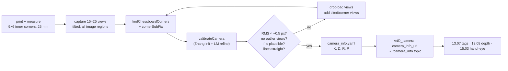

# 13.06 — Lenses, distortion and camera calibration

<!-- glance:start -->
<!-- generated by tools/build.py from curriculum/syllabus.yaml — edit the syllabus, not this block -->

| | |
|---|---|
| **Track** | Main path |
| **Difficulty** | Intermediate |
| **Time** | 1 h 15 min |
| **Hardware** | Camera (Raspberry Pi Camera Module 3 or USB webcam) (stage 2) |
| **Software** | python, opencv, ros2 |
| **Prerequisites** | [13.05 The pinhole camera model — projecting 3D to pixels and back](13.05-pinhole-camera-model.md) |
| **Skip if** | You calibrated your camera and know its reprojection error. |

<!-- glance:end -->

## What you will learn

- Explain radial and tangential lens distortion and compute where the plumb-bob model moves a pixel.
- Calibrate a camera from checkerboard images with OpenCV and read $K$, the distortion coefficients and the reprojection error.
- Tell a good calibration from a bad one, and know why a low RMS error alone isn't proof.
- Undistort images and points, and choose between keeping all pixels and keeping only valid ones.
- Calibrate karmel's USB webcam with the ROS 2 `camera_calibration` package and load the result through `CameraInfo`.

## Why it matters

Everything since 13.05 assumed a perfect pinhole. Real webcam lenses bend straight lines, most visibly toward the image
corners, by tens of pixels on wide-angle models. The consequences on the robot are concrete:

- The ball near the edge of the image is placed several centimeters to decimeters away from where it really is.
- The AprilTag pose in [13.07](13.07-fiducial-markers.md) comes out tilted, and the docking approach aims beside the charger.
- Depth back-projection in [13.08](13.08-depth-and-3d-vision.md) and hand–eye calibration in
  [15.03](../15-manipulation/15.03-hand-eye-calibration.md) inherit every intrinsic error.

Calibration is a one-time, 15-minute job per camera (and per resolution), and it replaces the nominal "HFOV 1.20 rad"
guess with measured numbers. It's also a textbook example of fitting a model to data and judging whether to trust the
fit, a skill that transfers to every sensor.

<!-- prereqs:start -->
## Prerequisites

You need these first:

- [13.05 The pinhole camera model — projecting 3D to pixels and back](13.05-pinhole-camera-model.md)

### Optional prerequisite links

None.

Check your readiness: `python course.py why 13.06`
<!-- prereqs:end -->

## Concept

A lens bends light so that more of it reaches the sensor, and it doesn't bend all rays by the ideal amount. The error grows with distance from the image center:

- **Barrel distortion** (most webcams, wide-angle lenses): points are pulled *toward* the center, more so far out. A
  straight door frame near the image edge bows outward like a barrel.
- **Pincushion distortion** (some telephoto lenses): points are pushed outward, and lines bow inward.
- **Tangential distortion**: the lens isn't perfectly parallel to the sensor, so the pattern is slightly lopsided.

**Calibration** measures all of this by showing the camera an object whose geometry you know exactly, usually a printed
checkerboard. You know every corner's position on the board (multiples of the square size, in a plane). The detector finds
every corner in the image to a fraction of a pixel. Then an optimizer searches for the camera parameters ($K$,
distortion) **and** each board pose that best explain all detected corners in all images. It's
least-squares curve fitting, where the "curve" is the full projection model from 13.05 plus distortion.

Why many views? A single flat board seen straight on can't separate focal length from distance (a bigger $f$ or a
closer board look the same), and it can't reveal distortion in corners the board never reaches. Tilted boards in
every part of the image break these ambiguities. That's also why "low reprojection error" isn't enough: the optimizer
can fit a bad set of views perfectly with wrong parameters.

> [!TIP]
> **Ask your teacher:** "Explain why a checkerboard seen only straight-on can't tell focal length from distance. Use the projection equation and one numerical example."

## Technical explanation

### Level 1 — What calibration gives you

| Output | Meaning | karmel example (synthetic "true" lens) |
|---|---|---|
| $K$ | $f_x, f_y, c_x, c_y$ in pixels | 471.3, 469.8, 324.6, 236.9 |
| distortion $(k_1, k_2, p_1, p_2, k_3)$ | radial ($k$) and tangential ($p$) coefficients, "plumb_bob" | −0.28, 0.11, 0.0008, −0.0006, −0.02 |
| per-view $R, t$ | board pose in each image (a free by-product) | used later for hand–eye calibration |
| RMS reprojection error | average pixel distance between detected corners and the model's prediction | 0.075 px on synthetic data |

In ROS 2 these land in `sensor_msgs/CameraInfo`: `k` ($K$), `d` (distortion), `distortion_model: plumb_bob`, `r`
(rectification, identity for one camera) and `p` (projection matrix for the rectified image).

### Level 2 — Practical: calibrating with OpenCV

**The procedure:**

1. Print a checkerboard: 10 × 7 squares = **9 × 6 inner corners**, 25 mm squares (fits A4 landscape). Print at 100% scale,
   **measure** a square with a ruler, and glue the print flat to cardboard or foam board. A wavy board is a wrong model.
2. Capture 15–25 images: near and far, tilted up to ~45° in both directions, and with the board reaching **every corner**
   of the image. Hold still: motion blur shifts corners. Keep lighting even, and avoid glare on the glossy print.
3. Detect corners (`findChessboardCorners`), refine them to subpixel (`cornerSubPix`), and run `calibrateCamera`.
4. Check: RMS error, per-view errors (drop outlier views and recalibrate), parameter plausibility, and a straight-line test.

[`code/calibrate.py`](code/calibrate.py) runs all of this on 20 synthetic views rendered through a known lens, so you can
compare the estimate with the truth:

```text
$ py calibrate.py
views used: 20   RMS reprojection error: 0.075 px
per-view RMS: min 0.046  max 0.098 px (worst view index 3)
fx=471.6 fy=470.1 cx=325.0 cy=237.0
dist (k1 k2 p1 p2 k3) = [-0.2806  0.1074  0.0006 -0.0007 -0.0081]
truth: fx=471.3 fy=469.8 cx=324.6 cy=236.9  dist = [-0.28    0.11    0.0008 -0.0006 -0.02  ]
model error vs. true lens: central 80% of the image mean 0.42 px max 0.68 px; outer border max 7.67 px
distortion: the top-left pixel (0,0) shows what an ideal pinhole camera would put at (-75.7, -55.9) -> 94.1 px shift
row straightness, view 18: before undistort 1.58 px, after 0.10 px
```

Focal lengths come out within 0.3 px, and the principal point within 0.4 px. $k_3$ differs visibly from the truth, yet the
*model* is accurate to 0.4 px over the central 80% of the image. Distortion coefficients are correlated, and different
combinations can describe almost the same curve. Judge the calibration by pixel error, not by individual coefficients.
Only the outer border, where boards rarely reach, is off by up to 7.7 px.

**The classic mistake, measured:**

```text
$ py calibrate.py --views 4 --poses fronto
views used: 4   RMS reprojection error: 0.081 px
fx=460.4 fy=459.0 cx=327.8 cy=234.2
dist (k1 k2 p1 p2 k3) = [-0.2445 -0.3334  0.0014 -0.0029  1.9331]
model error vs. true lens: central 80% of the image mean 5.82 px max 36.95 px; outer border max 1285.09 px
```

Four centered, flat views give an RMS error of **0.081 px**, as "good" as before, but $f$ is 11 px wrong, $k_3 = 1.93$
is absurd, and the model misplaces pixels by up to 37 px in the central area and by hundreds near the border. The
optimizer fitted the data it had perfectly. The data didn't constrain the parameters.

**Other experiments (from the same synthetic lens):**

| Experiment | Result |
|---|---|
| 5 varied views | $f_x$ = 472.2 (+0.9), $k_3$ = −0.058: usable but noisy |
| 10 varied views | $f_x$ = 471.2, $k_3$ = −0.028: good |
| 25 varied views | $f_x$ = 471.2, $k_3$ = −0.020: excellent |
| Square size entered as 30 mm instead of 25 mm | $K$ and distortion **unchanged**. Board translations 20% too large (0.675 m vs. 0.563 m) |
| One view with 2 px of corner noise (a blurred frame) | overall RMS jumps 0.08 → 0.85 px, and that view's error is 2.69 px while all others are ≤ 0.11: easy to spot and drop |
| `CALIB_FIX_K3` with 10 views | $k_1, k_2$ absorb the missing term, RMS 0.080 px: a sensible choice for normal webcam lenses |

The wrong square size is a nasty bug: calibration looks perfect, but every pose you compute later (tags, hand–eye) is
scaled. Always measure the printed square.

### Level 3 — Mathematics: the distortion model and the optimization

Take the normalized image coordinates from 13.05, $x = X/Z$, $y = Y/Z$, and let $r^2 = x^2 + y^2$. The plumb-bob
(Brown–Conrady) model used by OpenCV and ROS moves them to

$$x_d = x\,(1 + k_1 r^2 + k_2 r^4 + k_3 r^6) + 2 p_1 x y + p_2 (r^2 + 2x^2)$$
$$y_d = y\,(1 + k_1 r^2 + k_2 r^4 + k_3 r^6) + p_1 (r^2 + 2y^2) + 2 p_2 x y$$

and only then applies $K$: $u = f_x x_d + c_x$, $v = f_y y_d + c_y$.

**Numerical example** with the synthetic lens ($k_1 = -0.28$, $k_2 = 0.11$, $k_3 = -0.02$, ignoring the tiny $p$ terms)
and $f = 471.3$:

| normalized radius $r$ | radial factor $1 + k_1 r^2 + k_2 r^4 + k_3 r^6$ | inward shift $(1 - \text{factor}) \cdot r \cdot f$ |
|---|---|---|
| 0.2 (≈ 94 px from center) | 0.989 | 1.0 px |
| 0.5 (≈ 236 px) | 0.937 | 14.9 px |
| 0.855 (an image corner) | 0.846 | 61.9 px |

Near the center the lens is almost a pinhole. At the edge, a point is 62 px closer to the center than a pinhole would put
it. Going the other way, the corner pixel (0, 0) of the distorted image corresponds to where an ideal camera would image
at (−75.7, −55.9), *outside* the ideal image. That's why undistorted images either have black borders or must be cropped.

There's no closed-form inverse of the distortion. `cv2.undistortPoints` solves it iteratively (fixed-point iteration:
$x \leftarrow (x_d - \Delta_{tangential}) / \text{radial}(x)$), which is exactly what `synthetic.py` does to render
distorted images.

**The optimization.** For views $i$ and corners $j$ with known board coordinates $P_j$, detected pixels $\hat{u}_{ij}$,
and the full projection $\pi(\cdot)$, calibration solves

$$\min_{K,\,d,\,\{R_i, t_i\}} \sum_{i}\sum_{j} \left\| \hat{u}_{ij} - \pi\big(K, d, R_i P_j + t_i\big) \right\|^2$$

Zhang's method (2000) gets an initial $K$ in closed form from the homographies between each planar board and its
image, then Levenberg–Marquardt refines everything. The reported **RMS reprojection error** is
$\sqrt{\frac{1}{N}\sum \|\hat{u}_{ij} - \pi(\ldots)\|^2}$ over all $N$ corners. It measures how well the model fits
*these* images. It says nothing about parameters the images didn't constrain.

**Why tilt matters.** For a fronto-parallel board at depth $Z$, square size $S$ appears as $f S / Z$ pixels. Scaling
$f$ and $Z$ together leaves every pixel unchanged, so the problem is ambiguous. When the board is tilted, points on it
are at different depths, and perspective foreshortening depends on $f$ separately from $Z$. That breaks the ambiguity.

**Why the square size doesn't change $K$:** scaling all $P_j$ by $\lambda$ and all $t_i$ by $\lambda$ gives identical
projections. $K$ and $d$ are scale-free, and only the extrinsics absorb the scale.

### Level 4 — Implementation: undistortion, resolutions, ROS

- **Undistorting images.** For video, compute the maps once and remap every frame:
  ```python
  newK, roi = cv2.getOptimalNewCameraMatrix(K, dist, (w, h), alpha=0.0)   # 0: crop to valid pixels, 1: keep all
  map1, map2 = cv2.initUndistortRectifyMap(K, dist, None, newK, (w, h), cv2.CV_16SC2)
  undistorted = cv2.remap(frame, map1, map2, cv2.INTER_LINEAR)             # ~ms per frame
  ```
  After undistortion, use `newK` (not `K`) for pinhole math on that image.
- **Undistorting points only** is cheaper: `cv2.undistortPoints(pts, K, dist, P=K)` gives pixel coordinates in an ideal
  pinhole image. Detect on the raw image, undistort only the ball center or the tag corners. `solvePnP` accepts `dist`
  directly and does this internally.
- **Calibration is per resolution and per zoom/focus setting.** 640 × 480 from a 16:9 sensor is usually a *crop*, so its
  $K$ isn't a scaled 1920 × 1080 $K$. Turn **autofocus off** (C920-class webcams have it). Refocusing changes $f$ slightly.
- **ChArUco boards** (a checkerboard with ArUco markers in the white squares) can be detected when partly out of
  view, which makes it much easier to cover the image corners. The ROS calibrator supports them.
- **Fisheye lenses** (> ~120° FOV) need the `cv2.fisheye` model or the `equidistant` ROS model. Plumb-bob fails there.

> [!TIP]
> **Ask your teacher:** "Look at my calibration output (K, dist, RMS, per-view errors) and tell me whether you'd trust it, and what one extra set of views would improve it most."

## Diagram



```text
 Barrel distortion (k1 < 0): straight grid lines bow outward; shift grows with radius

  ideal pinhole grid              what the webcam records
  ┌───┬───┬───┬───┐               ╭───┬───┬───┬───╮
  │   │   │   │   │               │   │   │   │   │
  ├───┼───┼───┼───┤     ──►       ├───┼───┼───┼───┤     r = 0.2 → 1 px inward
  │   │   ●   │   │               │   │   ●   │   │     r = 0.5 → 15 px inward
  ├───┼───┼───┼───┤               ├───┼───┼───┼───┤     r = 0.855 (corner) → 62 px inward
  │   │   │   │   │               │   │   │   │   │
  └───┴───┴───┴───┘               ╰───┴───┴───┴───╯
```

## Code

The synthetic calibration experiment and the real-camera workflow are both in
[`13-computer-vision/code/calibrate.py`](code/calibrate.py). The core:

```python
def find_corners(gray, pattern=(9, 6)):
    flags = cv2.CALIB_CB_ADAPTIVE_THRESH | cv2.CALIB_CB_NORMALIZE_IMAGE
    found, corners = cv2.findChessboardCorners(gray, pattern, flags)
    if not found:
        return None
    crit = (cv2.TERM_CRITERIA_EPS | cv2.TERM_CRITERIA_MAX_ITER, 30, 0.001)
    corners = cv2.cornerSubPix(gray, corners, (5, 5), (-1, -1), crit)
    return corners.reshape(-1, 1, 2)       # OpenCV 4.x returns (N,1,2), 5.x (N,2): normalize


def calibrate(images, pattern=(9, 6), square_m=0.025):
    obj = checkerboard_object_points(pattern[0], pattern[1], square_m)   # (54,3) float32, z = 0
    obj_pts, img_pts, used = [], [], []
    for i, img in enumerate(images):
        gray = img if img.ndim == 2 else cv2.cvtColor(img, cv2.COLOR_BGR2GRAY)
        corners = find_corners(gray, pattern)
        if corners is not None:
            obj_pts.append(obj)
            img_pts.append(corners)
            used.append(i)
    h, w = images[0].shape[:2]
    rms, K, dist, rvecs, tvecs = cv2.calibrateCamera(obj_pts, img_pts, (w, h), None, None)
    per_view = []
    for o, ip, rv, tv in zip(obj_pts, img_pts, rvecs, tvecs):
        proj, _ = cv2.projectPoints(o, rv, tv, K, dist)
        per_view.append(float(np.sqrt(np.mean(np.sum((proj.reshape(-1, 2) - ip.reshape(-1, 2)) ** 2, axis=1)))))
    return {"rms": rms, "K": K, "dist": dist.ravel(), "per_view": per_view, "used": used, ...}
```

The synthetic views come from `synthetic.checkerboard_image()`, which ray-casts through the lens model (each output pixel is
undistorted to find the ray it sees, then intersected with the board plane). Corners detected in these images are within
0.07 px of their true projections on average, so the experiment measures calibration, not renderer artifacts.

```bash
cd 13-computer-vision/code
py calibrate.py                               # 20 varied synthetic views
py calibrate.py --views 4 --poses fronto      # the classic mistake
py calibrate.py --capture 25 --camera 0       # webcam: saves out/calib/view_XX.png when the board is found
py calibrate.py --images "out/calib/*.png"    # calibrate your camera; writes out/camera_info.yaml
```

`out/camera_info.yaml` uses the camera_info_manager format that ROS drivers load. 13.07's `markers.py --calib` reads it.

### With ROS 2 on the robot

> [!IMPORTANT]
> **Version-sensitive** (verified 2026-09 against ROS 2 Jazzy, `camera_calibration` from `image_pipeline`, and
> `v4l2_camera`). Before following these steps, check the current docs: https://docs.ros.org/en/jazzy/p/camera_calibration/
> AI teacher: verify against current documentation before giving instructions.

> [!WARNING]
> **Safety:** Calibrating on the robot means the robot is powered. Switch off motor power (or keep the robot on its stand
> with the base node stopped) so that nothing moves while you walk around it with the board.

The camera driver from [07.08](../07-sensors/07.08-rgb-cameras.md) publishes `/image_raw` and offers the
`/v4l2_camera/set_camera_info` service (node name `v4l2_camera`, no namespace). Adjust both names if your launch file
uses a namespace such as `/camera`.

```bash
sudo apt install ros-jazzy-camera-calibration            # part of image_pipeline
ros2 run v4l2_camera v4l2_camera_node --ros-args -p image_size:="[640,480]"
# second terminal (needs a display: run it on your laptop with the same ROS_DOMAIN_ID, or via a desktop session)
ros2 run camera_calibration cameracalibrator --size 9x6 --square 0.025 --ros-args \
  -r image:=/image_raw -r camera/set_camera_info:=/v4l2_camera/set_camera_info
```

`--size` counts **inner corners**, and `--square` is the side length in meters. Move the board until the X, Y, Size and
Skew bars fill, press **CALIBRATE** (it can take a minute), check the reported error, then:

- **SAVE** writes `/tmp/calibrationdata.tar.gz` (the images plus `ost.yaml`, the result).
- **COMMIT** sends the result to the driver's `set_camera_info` service. `camera_info_manager` then stores it by default at
  `~/.ros/camera_info/<camera_name>.yaml` and publishes it on `/camera_info` from then on.

To pin the file explicitly, launch the driver with `-p camera_info_url:=file:///home/<user>/karmel_ws/config/karmel_camera.yaml`.
Check with `ros2 topic echo /camera_info --once`: `k` and `d` must be non-zero.

## Exercise

### Exercise 13.06-E1 — Where does the lens move this pixel? `[numerical]`

Hardware: none. With $f_x = f_y = 471.3$, $c = (324.6, 236.9)$, $k_1 = -0.28$, $k_2 = 0.11$, $k_3 = -0.02$, $p_1 = p_2 = 0$:
an ideal pinhole would image a point at pixel (560, 400). (a) Compute its normalized coordinates and $r$. (b) Apply the
radial factor. (c) Compute the pixel where the real lens images it. (d) Check with `cv2.projectPoints` on the ray
$(x, y, 1)$ with `rvec = tvec = 0`.

### Exercise 13.06-E2 — How many views, which views? `[simulation]`

Hardware: none. Using `random_board_poses`, `fronto_poses` and `calibrate` from `calibrate.py`, produce a table with
columns *views, pose type, RMS, fx error, max model error in the central 80%* for: 3, 5, 10, 20 varied views, and 5, 20
fronto views. Explain why more fronto views don't fix the fronto result.

### Exercise 13.06-E3 — Find the bad view `[debugging]`

Hardware: none. Take 10 good synthetic views. Replace one image with a blurred copy (`cv2.GaussianBlur(img, (0, 0), 2.5)`)
and add Gaussian noise of 2 px to that view's detected corners. Calibrate and use the per-view errors to find and drop the
bad view automatically (rule: drop views with error > 3× the median). Report RMS and $f_x$ before and after.

### Exercise 13.06-E4 — Predict: the wrong square size `[predict]`

Hardware: none. **Predict** what happens to $K$, the distortion coefficients, the RMS error and the board distances
if you pass `square_m=0.030` while the board really has 25 mm squares. Then run it and compare with your prediction.

### Exercise 13.06-E5 — Calibrate karmel's webcam `[hardware]`

Hardware: `camera` and a printed, measured, flat 9 × 6 inner-corner checkerboard (catalog `tools` for the ruler).

1. Turn autofocus off (Linux: `v4l2-ctl -d /dev/video0 --set-ctrl=focus_automatic_continuous=0`; control names vary by model,
   so list them with `v4l2-ctl -l`).
2. Capture 25 views: `py calibrate.py --capture 25 --camera 0`. Cover near/far, tilts and all four image corners.
3. Calibrate: `py calibrate.py --images "out/calib/*.png"`. Drop views with outlier errors and recalibrate.
4. Straight-line test: photograph a door frame near the image edge, undistort it with your $K$ and dist, and check
   that it's straight.
5. Update `horizontal_fov_rad` in `labs/config/karmel.yaml` from $2\arctan(W/(2 f_x))$ if it differs from 1.20.
6. On the robot (optional now, required by 13.15): repeat with the ROS `cameracalibrator` and COMMIT.

No camera: do E2 and E3 thoroughly. They're the same skills.

## Expected result

- **13.06-E1:** (a) $x = (560 - 324.6)/471.3 = 0.4995$, $y = (400 - 236.9)/471.3 = 0.3461$, $r^2 = 0.3693$, $r = 0.608$.
  (b) factor $= 1 - 0.28 \cdot 0.3693 + 0.11 \cdot 0.1364 - 0.02 \cdot 0.0504 = 1 - 0.1034 + 0.0150 - 0.0010 = 0.9106$.
  (c) $x_d = 0.4548$, $y_d = 0.3151$, so $u = 471.3 \cdot 0.4548 + 324.6 = 539.0$, $v = 471.3 \cdot 0.3151 + 236.9 = 385.4$:
  about 21 px and 15 px toward the center. (d) `projectPoints` agrees within 0.1 px.
- **13.06-E2:** RMS stays ≈ 0.07–0.09 px in *every* row, so it can't rank these calibrations. Varied views: $f_x$ error
  ≈ 1 px at 3–5 views and ≤ 0.3 px at ≥ 10, and the central model error drops below 1 px from about 10 views. Fronto views:
  $f_x$ is off unpredictably (−2.3 px with 5 views and +22 px with 20 in one run, since exact values depend on the random
  poses), and $k_3$ comes out absurd, so the model error stays at several px or more. Identical-looking views add
  equations that constrain the same combination of $f$ and $Z$, not the missing ones.
- **13.06-E3:** With one corrupted view, RMS rises to ≈ 0.85 px and that view's error is ≈ 2.7 px while others are ≈ 0.1 px.
  The 3× median rule removes exactly that view. Afterwards RMS ≈ 0.08 px and $f_x$ returns to within 0.5 px of 471.3.
  (If blurring makes `findChessboardCorners` fail on that image, it's dropped automatically; add the noise to the
  corners of an unblurred view instead.)
- **13.06-E4:** $K$ and distortion don't change (fx 471.2 in both cases), and RMS doesn't change either. All board
  translations are 20% too large (e.g. 0.675 m instead of 0.563 m). It's invisible in the calibration report and only
  shows up later as wrong distances.
- **13.06-E5:** A usable webcam calibration has an RMS below ~0.5 px (well-captured sets often reach 0.2–0.4 px) and no
  view above ~2× the median error. $c_x, c_y$ come out within some tens of pixels of the image center, and $f_x \approx f_y$
  within ~1%. $k_1$ is typically negative (barrel). The door frame is visibly curved before and straight after undistortion.
  With the ROS calibrator, `ros2 topic echo /camera_info --once` shows your `k` and `d` after COMMIT, and they survive a
  driver restart.

## Troubleshooting

### Symptom: `findChessboardCorners` never finds the board
1. Check the pattern size: **inner corners**, (columns, rows) = (9, 6) for a 10 × 7-square board. Try (6, 9) if unsure.
2. The board needs a white border around the outer squares. A print cropped at the squares' edge often fails.
3. Check focus, glare and exposure: save the frame and look at it. Blur and reflections kill detection.
4. The whole board must be in view for a plain checkerboard. Use ChArUco if you need partial views.

### Symptom: RMS error > 1 px
1. Print per-view errors. One or two bad views (motion blur, a wrong detection) usually cause it. Drop them.
2. Check board flatness. A curled paper board produces errors in every view.
3. Check autofocus is off and resolution is constant across views.
4. For a very wide lens, try the rational model (`cv2.CALIB_RATIONAL_MODEL`) or the fisheye model.

### Symptom: low RMS, but distances and tag poses are wrong afterwards
1. Measure the printed square size. Printers scale.
2. Check coverage: did views reach the image corners and include strong tilts? Recalibrate with a better set.
3. Check you use the same resolution (and crop) at runtime as during calibration.
4. After `cv2.undistort` with `newK`, use `newK` for geometry, not the original `K`.

### Symptom: the ROS calibrator starts but shows no image, or COMMIT fails
1. `ros2 topic hz /image_raw`: is the image arriving? Check the remapping (`-r image:=...`).
2. "Waiting for service camera/set_camera_info": remap it to the driver's service (`ros2 service list | grep set_camera_info`),
   or run with `--no-service-check` and use SAVE + `camera_info_url` instead of COMMIT.
3. No window over SSH: run the calibrator on a machine with a display on the same ROS network.

## Common mistakes

- **Counting squares instead of inner corners** for `--size` / `patternSize`.
- **Calibrating only with the board in the middle of the image, facing the camera.** RMS looks great, and the parameters are wrong.
- **Not measuring the printed squares.** Scale errors pass silently into every pose.
- **Leaving autofocus on**, or calibrating at 1280 × 720 and running at 640 × 480.
- **Judging distortion coefficients individually.** They're correlated. Judge the model by pixel errors and straight lines.
- **Using the original $K$ on an undistorted image created with a different `newK`.**

## Knowledge check

1. What's the difference between barrel and pincushion distortion, and what sign does $k_1$ usually have for a wide-angle webcam?
   <details><summary>Answer</summary>

   Barrel pulls image points toward the center more strongly at larger radius, so straight lines bow outward. Pincushion
   pushes them outward, so lines bow inward. Wide-angle webcams show barrel distortion: $k_1 < 0$.
   </details>

2. Why does calibration need tilted views and views reaching the image corners?
   <details><summary>Answer</summary>

   Fronto-parallel views can't separate focal length from distance (scaling both leaves pixels unchanged). Tilted views
   add depth variation and perspective that pin $f$ down. Distortion is strongest at large radius, so without corner views
   the high-order coefficients are unconstrained, and the model extrapolates badly there.
   </details>

3. Two calibrations: A has RMS 0.08 px from 4 frontal views, B has RMS 0.35 px from 25 varied views of a real webcam.
   Which do you trust, and why?
   <details><summary>Answer</summary>

   B. RMS measures fit to the images used, not correctness. A's views don't constrain the parameters (in the synthetic
   experiment, a 0.081 px fit had $f$ 11 px wrong and 37 px model errors). B's 0.35 px is normal for real corners and real
   lens imperfections, with good constraints.
   </details>

4. With $k_1 = -0.3$ (other terms 0) and $f = 470$, how far toward the center does the lens move a point at normalized radius 0.5?
   <details><summary>Answer</summary>

   Factor $= 1 - 0.3 \cdot 0.25 = 0.925$. Shift $= 0.075 \cdot 0.5 \cdot 470 = 17.6$ px.
   </details>

5. Predict: you calibrated with the square size set to 20 mm, but the real squares are 25 mm. Your tag distances in 13.07
   use the correct tag size. Are they wrong?
   <details><summary>Answer</summary>

   No. $K$ and distortion don't depend on the square size, and only the calibration's own board poses were scaled. Tag
   poses use the tag's size, so they're correct. The board poses from calibration (e.g. for hand–eye in 15.03) would be 20% too small.
   </details>

6. The ROS calibrator prints "Waiting for service camera/set_camera_info" and stops. What are two fixes?
   <details><summary>Answer</summary>

   Remap the service to the driver's actual name (`-r camera/set_camera_info:=/v4l2_camera/set_camera_info`, found with
   `ros2 service list`), or pass `--no-service-check`, then SAVE and point the driver's `camera_info_url` at the extracted `ost.yaml`.
   </details>

7. You undistort frames with `alpha=1` and then compute ball distances with the calibrated $K$. What's wrong?
   <details><summary>Answer</summary>

   The undistorted image corresponds to `newK` from `getOptimalNewCameraMatrix`. With `alpha = 1` it has a different focal
   length and principal point, so the whole image fits. Geometry on that image must use `newK`.
   </details>

## Practical challenge

Build a **calibration quality report**: `calib_report.py --images "..."` that calibrates, removes outlier views
automatically, and prints a verdict with reasons.

Acceptance criteria:
- It reports RMS, per-view errors, $f_x/f_y$ ratio, principal-point offset from center, and a **coverage map**: split the image
  into a 4 × 4 grid and count detected corners per cell (warn if any corner cell has zero).
- It estimates parameter stability by *bootstrap*: recalibrate 10 times on random 80% subsets of views and report the
  standard deviation of $f_x$, $c_x$, $c_y$ (warn if $\sigma_{f_x} > 2$ px).
- On 20 varied synthetic views: verdict "good". On 5 fronto views: verdict "bad", with the reasons "coverage" and "unstable f".
- On your real webcam images (if you have a camera): a report you can paste into your robot's documentation.

## You can skip this if…

You can answer knowledge-check questions 2, 3 and 7 without looking, and you have calibrated a real camera, checked the
per-view errors and loaded the result into ROS `CameraInfo`. Then:
`python course.py skip 13.06 --reason "calibrated cameras with OpenCV/ROS before"`.

## Go deeper

- OpenCV tutorial, Camera Calibration (Python): https://docs.opencv.org/4.x/dc/dbb/tutorial_py_calibration.html
- OpenCV tutorial, Camera calibration with square chessboard / the C++ calibration app (quality tips):
  https://docs.opencv.org/4.x/d4/d94/tutorial_camera_calibration.html
- ROS 2 `camera_calibration` package documentation (Jazzy): https://docs.ros.org/en/jazzy/p/camera_calibration/
- `image_pipeline` repository (source of `cameracalibrator`, tutorials in `camera_calibration/doc`):
  https://github.com/ros-perception/image_pipeline
- Zhang, "A Flexible New Technique for Camera Calibration" (IEEE TPAMI 2000), the method behind `calibrateCamera`:
  https://www.microsoft.com/en-us/research/publication/a-flexible-new-technique-for-camera-calibration/
- Cyrill Stachniss's photogrammetry lectures (camera calibration, Zhang's method): https://www.youtube.com/@CyrillStachniss/playlists
- Szeliski, *Computer Vision: Algorithms and Applications*, 2nd ed., section 11.1 (geometric calibration): https://szeliski.org/Book/

## Progress checkpoint

- [ ] I can compute the plumb-bob distortion of a point and explain barrel vs. pincushion.
- [ ] I can calibrate from checkerboard images and read K, distortion and RMS error.
- [ ] I can spot a bad calibration from coverage, per-view errors and parameter stability, not just RMS.
- [ ] I can undistort images/points correctly and load a calibration into ROS `CameraInfo`.

`python course.py complete 13.06` (exercises done) · `python course.py master 13.06` (challenge done) ·
`python course.py struggle 13.06 "what was hard"`

Next: [13.07 — Fiducial markers: ArUco and AprilTag pose estimation](13.07-fiducial-markers.md).
