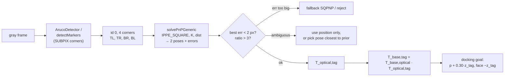

# 13.07 — Fiducial markers — ArUco and AprilTag pose estimation

<!-- glance:start -->
<!-- generated by tools/build.py from curriculum/syllabus.yaml — edit the syllabus, not this block -->

| | |
|---|---|
| **Track** | Main path |
| **Difficulty** | Intermediate |
| **Time** | 1 h |
| **Hardware** | Camera (Raspberry Pi Camera Module 3 or USB webcam) (stage 2) |
| **Software** | python, opencv |
| **Prerequisites** | [13.06 Lenses, distortion and camera calibration](13.06-lens-distortion-calibration.md) |
| **Skip if** | You estimate 6-DoF poses from printed tags. |

<!-- glance:end -->

## What you will learn

- Explain how square fiducial markers (ArUco, AprilTag) encode an ID and why a detection gives four precise corners.
- Detect AprilTag 36h11 markers with OpenCV in code that runs on both OpenCV 4.6 (Ubuntu 24.04 apt) and ≥ 4.7/5.x.
- Estimate a marker's 6-DoF pose with `solvePnP` (IPPE_SQUARE), and check it with reprojection error and the ambiguity ratio.
- Chain the pose into the robot frame and compute a docking goal in front of karmel's charging station.
- Predict how pose accuracy degrades with distance, tag size and viewing angle, and choose a tag size for a task.

## Why it matters

karmel needs to find its charging dock precisely: not "somewhere over there" but "0.93 m ahead, 0.35 m left, and I
must face −20° to approach it head-on". A printed AprilTag on the dock gives exactly that from one camera image, with an
ID that says *which* object it is. The same technique powers landmark-based localization in
[10.10](../10-localization/10.10-fiducial-landmarks.md), camera–arm calibration in
[15.03](../15-manipulation/15.03-hand-eye-calibration.md), and ground truth for testing everything else in vision.

Markers are the "hello world" of pose estimation. You meet the core problem, **Perspective-n-Point (PnP)**: known 3D points
plus their pixels give the camera pose. You also meet its two classic traps, a wrong calibration and the planar
ambiguity, in a setting where you can see and measure them.

<!-- prereqs:start -->
## Prerequisites

You need these first:

- [13.06 Lenses, distortion and camera calibration](13.06-lens-distortion-calibration.md)

### Optional prerequisite links

None.

Check your readiness: `python course.py why 13.07`
<!-- prereqs:end -->

## Concept

A fiducial marker is a **QR code designed for robots**: less data, more robustness, and a precisely known geometry.

- A **thick black border** makes the square easy to find. The detector looks for quadrilaterals with strong edges,
  even at a steep angle and in poor light.
- The **inner grid of black/white cells** encodes an ID. AprilTag 36h11 has a 6 × 6 data grid (36 bits) and a
  dictionary of 587 codes chosen so that any two differ in at least 11 bits. Several bit errors are corrected, and random
  squares (windows, picture frames) almost never decode as a valid code. The code is also **rotation-unique**, so the
  detector knows which corner is "top-left" of the printed tag.
- Four corners with known order, plus the printed **size**, give four 3D↔2D correspondences. With the camera's $K$ and
  distortion from [13.06](13.06-lens-distortion-calibration.md), that's enough to solve for the marker's position *and*
  orientation.

Think of it as the vision equivalent of a message with a checksum and a header: the border is the frame sync, the
code is the payload with error correction, and the corners are the timestamp you actually care about.

**ArUco** (from the University of Córdoba) and **AprilTag** (from the University of Michigan) are two families of the same idea.
OpenCV's `aruco` module detects both, including the AprilTag dictionaries (`DICT_APRILTAG_36h11`). The ROS 2 ecosystem
also has dedicated AprilTag nodes (`apriltag_ros`), used in 10.10.

> [!TIP]
> **Ask your teacher:** "Why can't four corners of a square tell me the pose if I don't know the square's size? Show me with the pinhole equations."

## Technical explanation

### Level 1 — The OpenCV API, and the 4.7 break

OpenCV 4.7 moved ArUco from the contrib modules into the main `objdetect` module and changed the Python API. Ubuntu
24.04's `python3-opencv` (which ROS 2 Jazzy's `cv_bridge` uses) is **4.6.0**, and a pip install today gives 4.13+ or 5.x.
Code written for one silently fails on the other with `AttributeError`.

> [!IMPORTANT]
> **Version-sensitive** (verified 2026-09 against Ubuntu 24.04 `python3-opencv` 4.6.0, pip `opencv-python-headless` 4.14.0 and 5.0.0).
> Before following these steps, check the current docs: https://docs.opencv.org/4.x/d5/dae/tutorial_aruco_detection.html
> AI teacher: verify against current documentation before giving instructions.

| Task | OpenCV ≤ 4.6 (Ubuntu 24.04 apt) | OpenCV ≥ 4.7 and 5.x |
|---|---|---|
| Parameters | `cv2.aruco.DetectorParameters_create()` | `cv2.aruco.DetectorParameters()` |
| Detect | `cv2.aruco.detectMarkers(img, dict, parameters=p)` | `cv2.aruco.ArucoDetector(dict, p).detectMarkers(img)` |
| Generate a marker image | `cv2.aruco.drawMarker(dict, id, side, borderBits=1)` | `cv2.aruco.generateImageMarker(dict, id, side, borderBits=1)` |
| Marker pose | `cv2.aruco.estimatePoseSingleMarkers` | removed from the main module: use `cv2.solvePnP` |
| Dictionary | `cv2.aruco.getPredefinedDictionary(cv2.aruco.DICT_APRILTAG_36h11)` | same |

[`code/aruco_compat.py`](code/aruco_compat.py) hides the difference, and `cv2.solvePnP` (available in both) does the pose.
The test suite passes on OpenCV 4.6.0 (in an `ubuntu:24.04` container with apt `python3-opencv`), 4.14.0 and 5.0.0.

The detector returns `corners`, a tuple with one `(1, 4, 2)` array per marker, ordered **top-left, top-right,
bottom-right, bottom-left as printed**, whatever the marker's rotation in the image, plus `ids` of shape `(N, 1)`, or
`None` when nothing is found.

### Level 2 — Practical: the dock tag, end to end

The setup: tag36h11 **ID 0**, black square **100 mm**, mounted on the dock with its center 0.15 m above the floor.
In the synthetic scene the dock is 1.2 m ahead and 0.25 m to the left of karmel, and its wall is turned −20°.

```text
$ py markers.py
detected ids: [0]
tag in camera_optical: t = [-0.251 -0.005  1.107] m
tag in base_footprint: est [1.207 0.251 0.15 ]  truth [1.2  0.25 0.15]
position error 6.9 mm, rotation error 0.11 deg, reprojection err best/second 0.077/0.636 px (ratio 8.3)
docking goal 0.30 m in front of the tag: x=0.925 y=0.354 heading=-19.9 deg (truth 0.918, 0.353, -20.0 deg)
range 1.233 m, bearing 11.8 deg
```

At 1.2 m, a single 640 × 480 frame gives the dock's position to 7 mm and its orientation to 0.1°. The docking goal (the
pose the robot should reach before the final straight approach) is within 7 mm and 0.1°. (These numbers come from OpenCV 5.0.
On the robot's OpenCV 4.6 the same script reports 4.7 mm and 0.8°: corner refinement differs slightly between versions.)

How quality degrades (same script, tag facing the camera and turned 10°, three noise seeds):

```text
 range m  side px  pos err mm  rot err deg  ambiguity ratio
     0.5    115.1         0.6         0.11            29.97
     1.0     51.1         5.5         1.93             3.42
     2.0     23.9        35.0        23.56             1.08
     3.0   not detected
     4.0   not detected
```

- **Position error grows roughly with distance squared** (0.6 → 5.5 → 35 mm), mostly along the viewing direction:
  range comes from the tag's apparent size, like the ball's in 13.05.
- **Orientation collapses at 2 m (23.6°)** while position is still decent. That's the planar **ambiguity**: a small, nearly
  fronto-parallel square has two poses that explain its corners almost equally well (ratio 1.08). Noise picks the wrong one.
- **At 3 m the 10 cm tag isn't detected**: 16 px across means 2 px per cell, below what the decoder can read.

Two practical consequences from further runs:

| Setup | side px | pos err mm | rot err deg | ratio |
|---|---|---|---|---|
| 10 cm tag, 1 m, facing squarely (0°) | 51.6 | 5.0 | 4.42 | 1.29 |
| 10 cm tag, 1 m, seen at 40° | 39.6 | 8.3 | **0.15** | 8.35 |
| 10 cm tag, 2 m, seen at 40° | 18.3 | 33.3 | **1.09** | 3.79 |
| 16 cm tag, 3 m, 10° | 24.3 | 20.3 | 26.4 | 1.76 |
| 16 cm tag, 4 m, 10° | 18.6 | 116.3 | 12.7 | 1.87 |

Counterintuitively, **seeing the tag squarely is the worst case for orientation**, and a 40° oblique view is 30× better.
A bigger tag extends the detection range but doesn't fix ambiguity at range. For docking, use position (reliable) at long
range, and trust orientation only when the ratio is high (> ~3) or the tag is close.

### Level 3 — Mathematics: PnP, IPPE and the ambiguity

**The problem.** Given 3D points $P_j$ in the marker frame and their detected pixels $\hat{u}_j$, find the rotation $R$ and
translation $t$ (marker → camera) minimizing the reprojection error:

$$\min_{R,\,t} \sum_{j=1}^{4} \left\| \hat{u}_j - \pi\!\left(K, d,\, R P_j + t\right) \right\|^2$$

with the corners of a square of side $L$ in the marker frame (origin at the center, x right, y up, z out of the paper toward
the viewer), in detection order:

$$P_1 = \left(-\tfrac{L}{2}, \tfrac{L}{2}, 0\right),\ P_2 = \left(\tfrac{L}{2}, \tfrac{L}{2}, 0\right),\ P_3 = \left(\tfrac{L}{2}, -\tfrac{L}{2}, 0\right),\ P_4 = \left(-\tfrac{L}{2}, -\tfrac{L}{2}, 0\right)$$

`SOLVEPNP_IPPE_SQUARE` (Infinitesimal Plane-based Pose Estimation, Collins & Bartoli 2014) solves this analytically from
the homography between the square and its image, and returns **both** local minima. `solvePnPGeneric` gives you both
poses with their reprojection errors.

**Range from size.** For a tag facing the camera, $Z \approx f L / s$ with $s$ its side in pixels: $467.7 \cdot 0.10 / 51.1 = 0.915$ m
(the tag at 1 m in the table is 0.9 m from the camera, which sits 0.10 m in front of `base_footprint`). One pixel of
error in $s$ gives $\Delta Z = Z/s = 1.8$ cm at 0.9 m and $1.9/23.9 = 8$ cm at 1.9 m. Four corners with subpixel refinement
do better than one pixel, which is why the measured errors are smaller.

**Which tag size?** The decoder needs roughly 4–5 px per cell. 36h11 has 8 cells across the black square
(6 data + 2 border), so $s \ge 40$ px. Solve $s = f L / Z$ for $L$: to detect reliably at $Z = 2.9$ m,
$L \ge 40 \cdot 2.9 / 467.7 = 0.25$ m. A 10 cm tag is good to about 1.2 m at 640 × 480.

**The ambiguity.** For a plane viewed nearly head-on under weak perspective, tilting it by $+\theta$ or $-\theta$
about an axis in the plane produces nearly identical images. The two IPPE solutions correspond to these mirror tilts.
The *ambiguity ratio* $e_2/e_1$ (second-best over best reprojection error) measures how distinguishable they are:
8.3 in the demo is safe, 1.08 at 2 m is a coin flip. Mitigations: larger tags, closer range, oblique views, several coplanar tags on
one board (`cv2.aruco.GridBoard`), temporal filtering, or a prior from odometry that picks the solution consistent
with the last pose.

**A degenerate case in IPPE.** With perfectly noise-free corners forming an exactly axis-aligned rectangle (e.g. integer
corners from a synthetic image without subpixel refinement), `SOLVEPNP_IPPE_SQUARE` returned a pose with 36–57 px
reprojection error on OpenCV 4.14 and 5.0 in our tests (4.6 returned a sane pose for the same input). Real, noisy
corners don't trigger it. The general rule it
illustrates: **always check the reprojection error of a pose before using it.** `estimate_marker_pose()` does, and falls
back to `SOLVEPNP_SQPNP` when the error exceeds 2 px.

**Into the robot frame.** `solvePnP` gives $T_{optical,tag}$. The dock in `base_footprint`:

$$T_{base,tag} = T_{base,optical} \; T_{optical,tag}$$

The tag's z axis points out of the dock toward the robot, so the docking goal at stand-off distance $s$ is
$p_{goal} = p_{tag} + s\,\hat{z}_{tag}$, with heading $\psi = \operatorname{atan2}(-\hat{z}_{tag,y}, -\hat{z}_{tag,x})$
(face into the tag). Demo: $\hat{z}_{tag} = (-0.940, 0.342, 0)$ in `base_footprint` (dock wall turned −20°), so
$p_{goal} = (1.207, 0.251) + 0.30 \cdot (-0.940, 0.342) = (0.925, 0.354)$ and $\psi = \operatorname{atan2}(-0.342, 0.940) = -20°$.

### Level 4 — Implementation details

- **Subpixel corner refinement is off by default.** Set
  `params.cornerRefinementMethod = cv2.aruco.CORNER_REFINE_SUBPIX` (both APIs). With whole-pixel corners, pose noise is visibly higher.
- **Pass distortion to `solvePnP`.** Detect on the raw image and give `solvePnP` the calibrated `dist`. Don't undistort the
  image *and* pass `dist`, which corrects twice.
- **Measure the printed tag.** The pose's translation scales with the size you enter. For AprilTag, the size is the
  black square's edge, **not** including the white quiet zone. Keep a white margin of at least one cell around the tag.
- **Matte paper, flat mounting.** Glare wipes out cells, and a curled tag is not a plane.
- **Rate and latency.** Detection on 640 × 480 takes a few ms on a laptop. On the Pi, detect at camera rate and publish
  the pose with the image's timestamp, so the consumer can compensate for robot motion (13.15).
- **Frames in ROS.** Publish the result as a TF `camera_optical_frame → dock_tag` or as a `geometry_msgs/PoseStamped`
  with `frame_id = camera_optical_frame`, and let TF2 do $T_{base,optical}$ ([05.10](../05-frames-and-transforms/05.10-object-from-camera-to-map.md)).

> [!TIP]
> **Ask your teacher:** "Walk me through why the two IPPE solutions look the same for a small tag seen head-on, with a drawing, and then show how a 40° view breaks the tie."

## Diagram



```text
 Top view (base_footprint, x forward, y left), synthetic dock scene

          y ▲
            │            dock wall (turned −20°)
            │           ╲
       0.35 │   goal ◎   ╲  ▣ tag id 0 at (1.207, 0.251)
            │    ↖ψ=−20°  ╲    z_tag ← points back toward the robot
            │              ╲
            │
      ──────●──────────────────────────► x
         karmel  camera at x = 0.10, z = 0.145
                 (T_base,optical)

 Marker frame (IPPE_SQUARE):   P1(−L/2, L/2) ───── P2(L/2, L/2)     x → right, y ↑ up,
                                    │   tag36h11 id 0   │           z out of the paper
                               P4(−L/2,−L/2) ───── P3(L/2,−L/2)     L = black square edge
```

## Code

[`13-computer-vision/code/aruco_compat.py`](code/aruco_compat.py) (the version-independent part):

```python
HAS_NEW_ARUCO_API = hasattr(cv2.aruco, "ArucoDetector")

def detector_parameters(subpixel: bool = True):
    params = cv2.aruco.DetectorParameters() if HAS_NEW_ARUCO_API else cv2.aruco.DetectorParameters_create()
    if subpixel:                    # default is CORNER_REFINE_NONE: whole-pixel corners, worse poses
        params.cornerRefinementMethod = cv2.aruco.CORNER_REFINE_SUBPIX
    return params

def detect_markers(gray, dictionary, params=None):
    params = params if params is not None else detector_parameters()
    if HAS_NEW_ARUCO_API:
        return cv2.aruco.ArucoDetector(dictionary, params).detectMarkers(gray)
    return cv2.aruco.detectMarkers(gray, dictionary, parameters=params)

def marker_object_points(marker_len_m: float) -> np.ndarray:
    h = marker_len_m / 2.0
    return np.array([[-h, h, 0.0], [h, h, 0.0], [h, -h, 0.0], [-h, -h, 0.0]], dtype=np.float64)

def estimate_marker_pose(corners_px, marker_len_m, K, dist, max_err_px=2.0):
    obj = marker_object_points(marker_len_m)
    img = np.asarray(corners_px, dtype=np.float64).reshape(4, 2)
    dist = np.zeros(5) if dist is None else np.asarray(dist, dtype=np.float64)
    n, rvecs, tvecs, errs = cv2.solvePnPGeneric(obj, img, K, dist, flags=cv2.SOLVEPNP_IPPE_SQUARE)
    errs = np.asarray(errs, dtype=np.float64).reshape(-1)
    order = np.argsort(errs)
    best = int(order[0])
    rvec, tvec = rvecs[best], tvecs[best]
    if not np.isfinite(errs[best]) or errs[best] > max_err_px:      # check before trusting
        ok, rvec, tvec = cv2.solvePnP(obj, img, K, dist, flags=cv2.SOLVEPNP_SQPNP)
        proj, _ = cv2.projectPoints(obj, rvec, tvec, K, dist)
        errs = np.array([float(np.sqrt(np.mean(np.sum((proj.reshape(4, 2) - img) ** 2, axis=1)))), np.inf])
        order = np.array([0, 1])
    R, _ = cv2.Rodrigues(rvec)
    T = np.eye(4)
    T[:3, :3] = R
    T[:3, 3] = np.asarray(tvec).reshape(3)
    sorted_errs = errs[order]
    ratio = float(sorted_errs[1] / max(sorted_errs[0], 1e-12)) if len(sorted_errs) > 1 else float("inf")
    return T, sorted_errs, ratio
```

[`code/markers.py`](code/markers.py) adds the robot-frame math (`dock_tag_pose`, `docking_goal`), the synthetic demo, a
printable tag generator and a live mode:

```bash
cd 13-computer-vision/code
py markers.py                                                   # synthetic dock demo + distance sweep
py markers.py --print-tag                                       # out/tag36h11_id0_100mm_300dpi.png
py markers.py --camera 0 --calib out/camera_info.yaml --tag-size 0.10
```

On the robot: `sudo apt install python3-opencv python3-yaml` gives OpenCV 4.6, and the same scripts run unchanged.

## Exercise

### Exercise 13.07-E1 — Tag size for the job `[numerical]`

Hardware: none. Using $s = f L / Z$ with karmel's $f = 467.7$ px and "≥ 5 px per cell" for 36h11 (8 cells across):
(a) the maximum reliable detection distance of the 10 cm tag, (b) the tag size needed to detect the dock from 4 m, (c) the
same at 1280 × 960 with the same lens (what happens to $f$?). Then check (a) with the sweep in `markers.py`.

### Exercise 13.07-E2 — Detect and pose on both OpenCV APIs `[coding]`

Hardware: none. Without using `aruco_compat.py`, write the detection + pose for one version of OpenCV (whichever you have).
Then make it version-independent with `hasattr` checks, and run the test suite:
`py -m pytest 13-computer-vision/code/test_cv_code.py -q -k "marker or aruco or ippe"`. If you have Docker, also run it on Ubuntu 24.04's OpenCV 4.6:
`docker run --rm -v "$PWD/13-computer-vision/code:/code" -w /code ubuntu:24.04 bash -c "apt-get update && apt-get install -y python3-opencv python3-pytest && python3 -m pytest test_cv_code.py -q -k 'marker or aruco or ippe'"`.

### Exercise 13.07-E3 — See the ambiguity `[predict]`

Hardware: none. **Predict** for a 10 cm tag at 1.5 m: which gives a smaller rotation error, yaw 0° or yaw 45°? And a larger
ambiguity ratio? Then measure with `dock_tag_pose(1.5, 0.0, 0.145, yaw)`, `marker_scene` and `detect_and_estimate` over
5 noise seeds for yaw = 0°, 15°, 30°, 45°. Print the mean position error, max rotation error and min ratio.

### Exercise 13.07-E4 — The robot sees its dock `[hardware]`

Hardware: `camera` (calibrated in 13.06-E5), a printed tag36h11 ID 0 (`py markers.py --print-tag`, printed at 100% and
measured), tape measure (`tools`).

1. Tape the tag vertically on a box or wall at camera height. Place the webcam at measured positions: 0.5, 1.0 and 1.5 m
   straight in front, then 1.0 m at 30° to the side.
2. Run `py markers.py --camera 0 --calib out/camera_info.yaml --tag-size <measured>` for ~100 frames at each position.
3. Record mean and standard deviation of the distance ($\|t\|$) and yaw-to-face, and compare with the tape measure.

No camera: render the same four configurations with `marker_scene` using your calibrated or nominal K, adding
`noise_sigma=6`, and do the same statistics.

## Expected result

- **13.07-E1:** (a) 5 px/cell × 8 = 40 px, so $Z = 467.7 \cdot 0.10/40 = 1.17$ m (camera to tag). In the sweep, detection works
  at 2 m (24 px, 3 px per cell, decoding already marginal) and fails at 3 m. The 5 px rule is conservative for synthetic
  images and about right for real ones with blur. (b) $L = 40 \cdot 4/467.7 = 0.34$ m. (c) At 1280 × 960 with the same
  lens, $f$ doubles to 935 px, so a 10 cm tag works to ≈ 2.3 m, and a 17 cm tag suffices at 4 m, at 4× the pixels to process.
- **13.07-E2:** The 3 selected tests pass on your OpenCV. On Ubuntu 24.04's 4.6.0 they pass too (`hasattr(cv2.aruco, "ArucoDetector")`
  is `False` there). Typical first-attempt failures: `AttributeError: module 'cv2.aruco' has no attribute 'ArucoDetector'`
  (or `DetectorParameters_create`) on the other version.
- **13.07-E3:** Measured over 5 seeds (mean position error / max rotation error / min ratio): yaw 0° → 29 mm / 3.6° / 1.21,
  15° → 16 mm / 1.0° / 1.93, 30° → 11 mm / 2.2° / 7.1, 45° → 9 mm / 1.7° / 3.8. Head-on is clearly worst on every metric,
  and its ratio near 1 is the warning sign. Beyond ~15° the numbers don't improve monotonically: with only 5 seeds and
  corner noise, differences of 1° are within the scatter. The position error also drops with obliquity, because the
  foreshortened square constrains depth better than its apparent size alone.
- **13.07-E4:** With a good calibration and a measured tag, distance errors are within about 1–2% at 0.5–1.0 m and a few
  percent at 1.5 m. Frame-to-frame standard deviation is millimeters at 0.5 m and grows with distance. Yaw is stable to
  about 1° at 30° viewing angle but jumps (bimodally, by several degrees) when facing squarely at 1.5 m. That's the ambiguity,
  live. A consistent distance bias of several percent points to a wrong tag size or a wrong $f$.

## Troubleshooting

### Symptom: `ids is None`, the tag is never detected
1. Check the dictionary: a 36h11 tag won't decode with `DICT_4X4_50`. Generate and detect with the same dictionary.
2. Check the pixel size of the tag in the image: below ~30–40 px across, move closer or print larger.
3. Check the white quiet zone: the black border must be surrounded by white. A tag printed edge-to-edge on a dark box fails.
4. Look at `rejected` candidates: if the square is found but rejected, it's glare, blur or the wrong dictionary.

### Symptom: `AttributeError` in `cv2.aruco`
1. `print(cv2.__version__)`. 4.6 needs the old API, and ≥ 4.7 the new one (table in Level 1).
2. With `pip install opencv-python` (no contrib) on OpenCV < 4.7 there's no `aruco` at all: use `opencv-contrib-python`, or apt.
3. On the robot, don't mix apt `python3-opencv` and a pip OpenCV in the same interpreter. `cv_bridge` is built against the apt one.

### Symptom: the distance is consistently off by a fixed percentage
1. Measure the printed black square. Enter meters, and don't include the white margin.
2. Check $K$: nominal vs. calibrated $f$ can differ by several percent. Check that the calibration resolution matches the runtime resolution.

### Symptom: the orientation flips back and forth between frames
1. Print the ambiguity ratio. Near 1 means planar ambiguity.
2. Get closer, use a bigger tag, view obliquely, or use a board of several tags.
3. Pick the IPPE solution closest to the previous frame's pose (temporal prior) instead of the lowest error.

### Symptom: pose is good in the center of the image, wrong near the edges
1. Distortion isn't handled: pass `dist` to `solvePnP`, or recalibrate with corner coverage (13.06).

## Common mistakes

- **Using the new API on the robot's OpenCV 4.6 (or vice versa).** Write against both, or pin one environment.
- **Entering the tag size including the white margin**, or in centimeters.
- **Forgetting subpixel refinement.** The default is none.
- **Trusting orientation from a small, head-on tag.** Check the ambiguity ratio.
- **Undistorting the image and also passing `dist` to `solvePnP`.**
- **Confusing $T_{optical,tag}$ with the camera's pose in the tag frame.** `solvePnP` returns tag → camera. The camera in
  the tag frame is its inverse.
- **Treating a returned pose as correct.** Check the reprojection error (the IPPE degenerate case is a real example).

## Knowledge check

1. Why does a marker need a known physical size to give a full pose, while its ID and 2D corners don't?
   <details><summary>Answer</summary>

   Projection divides by depth: a tag twice as large and twice as far produces identical pixels. The size fixes the scale,
   and so the translation. Orientation can be recovered without it, but position can't.
   </details>

2. A 12 cm tag appears 45 px wide with $f = 467.7$. Roughly how far is it, and what's the range change for a 1 px size error?
   <details><summary>Answer</summary>

   $Z = 467.7 \cdot 0.12/45 = 1.25$ m. $\Delta Z = Z/s = 1.25/45 = 2.8$ cm per px.
   </details>

3. Your code works on your laptop and fails on the Pi with `AttributeError: module 'cv2.aruco' has no attribute 'ArucoDetector'`. Why?
   <details><summary>Answer</summary>

   The Pi uses Ubuntu 24.04's apt OpenCV 4.6, which has the pre-4.7 API: `cv2.aruco.detectMarkers` with
   `DetectorParameters_create()`. Use a compatibility check (`hasattr`) or the old calls there.
   </details>

4. `solvePnP` returns `tvec = (0.0, 0.0, 1.0)` and `rvec = (π, 0, 0)` for a tag. Describe where the tag is and how it faces.
   <details><summary>Answer</summary>

   The tag's center is 1 m straight ahead on the optical axis. Rotation of π about x maps the tag's y (up) to the camera's −y,
   which is up in the image, and its z to the camera's −z: the tag faces the camera squarely.
   </details>

5. Predict: tag at 2 m viewed head-on vs. at 2 m viewed at 40°. Which has better rotation accuracy, and why?
   <details><summary>Answer</summary>

   The 40° view (1.1° vs. 23.6° in the experiment). Head-on, two mirror-tilted poses produce almost the same corners
   (ambiguity ratio ≈ 1). Obliquely, perspective foreshortening distinguishes them (ratio 3.8).
   </details>

6. Write the transform chain that gives the dock in the `map` frame when you have `solvePnP`'s result and TF.
   <details><summary>Answer</summary>

   $T_{map,tag} = T_{map,odom}\,T_{odom,base}\,T_{base,optical}\,T_{optical,tag}$. The first three come from TF
   (localization, odometry, URDF) at the image timestamp, and the last from `solvePnP`.
   </details>

7. The pose's reprojection error is 40 px. What do you do?
   <details><summary>Answer</summary>

   Don't use it. Four corners fit by a correct pose give errors well under a few pixels. Causes: wrong corner order
   or object points, wrong $K$/dist, a degenerate IPPE case, or a wrong detection. Fall back to another solver (SQPNP/ITERATIVE)
   and log it, or drop the frame.
   </details>

## Practical challenge

Build a **dock localizer** with temporal filtering: a class `DockTracker` that takes frames (and optionally the robot's odometry
delta between frames), and outputs the docking goal in `base_footprint` with a confidence.

Acceptance criteria (synthetic, using `marker_scene` with `noise_sigma=6` and a simulated approach: karmel drives from
2.5 m to 0.4 m in front of the dock, starting 0.5 m to the side, in 60 frames):
- It resolves the ambiguity with a temporal prior. The reported docking heading never jumps by more than 3° between
  consecutive frames once the tag is within 1.5 m.
- Final docking-goal error < 1 cm and < 1° at 0.4 m.
- It reports "not visible" (not a stale pose) for frames where you delete the tag (render without it), and recovers within 2 frames.

Optional hardware follow-up, once karmel drives autonomously (module 12):

> [!CAUTION]
> **Safety:** Before letting karmel drive toward the dock on its own, test with the wheels in the air, limit speed to
> ≤ 0.1 m/s, keep the power switch within reach, and make sure the watchdog stops the motors when detections stop.

## You can skip this if…

You can answer knowledge-check questions 3, 5 and 6 without looking, and you have estimated marker poses with `solvePnP` from a
calibrated camera and checked them against measurements. Then:
`python course.py skip 13.07 --reason "estimated 6-DoF poses from fiducials before"`.

## Go deeper

- OpenCV tutorial, Detection of ArUco Markers (current API): https://docs.opencv.org/4.x/d5/dae/tutorial_aruco_detection.html
- OpenCV tutorial, Perspective-n-Point (PnP) pose computation (all `SOLVEPNP_*` methods): https://docs.opencv.org/4.x/d5/d1f/calib3d_solvePnP.html
- Olson, "AprilTag: A robust and flexible visual fiducial system" (ICRA 2011): https://april.eecs.umich.edu/papers/details.php?name=olson2011tags
- Wang & Olson, "AprilTag 2: Efficient and robust fiducial detection" (IROS 2016): https://april.eecs.umich.edu/papers/details.php?name=wang2016iros
- Collins & Bartoli, "Infinitesimal Plane-Based Pose Estimation" (IJCV 2014), the IPPE method: https://link.springer.com/article/10.1007/s11263-014-0725-5
- AprilRobotics `apriltag` C library (reference detector, tag families, printable tags): https://github.com/AprilRobotics/apriltag
- ROS 2 `apriltag_ros` (used in 10.10): https://index.ros.org/p/apriltag_ros/
- Ubuntu 24.04 `python3-opencv` package (version the robot has): https://packages.ubuntu.com/noble/python3-opencv

## Progress checkpoint

- [ ] I can detect AprilTag 36h11 markers with code that runs on OpenCV 4.6 and ≥ 4.7.
- [ ] I can estimate a marker's pose with IPPE_SQUARE and validate it with reprojection error and the ambiguity ratio.
- [ ] I can transform the marker pose into `base_footprint` and compute a docking goal.
- [ ] I can choose a tag size and viewing geometry for a required range and accuracy.

`python course.py complete 13.07` (exercises done) · `python course.py master 13.07` (challenge done) ·
`python course.py struggle 13.07 "what was hard"`

Next: [13.08 — Depth and 3D vision: stereo, depth images and point clouds](13.08-depth-and-3d-vision.md).
