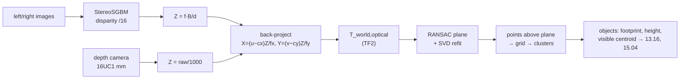

# 13.08 — Depth and 3D vision — stereo, depth images and point clouds

<!-- glance:start -->
<!-- generated by tools/build.py from curriculum/syllabus.yaml — edit the syllabus, not this block -->

| | |
|---|---|
| **Track** | Main path |
| **Difficulty** | Intermediate |
| **Time** | 1 h 15 min |
| **Hardware** | none |
| **Software** | python, numpy, open3d |
| **Prerequisites** | [13.05 The pinhole camera model — projecting 3D to pixels and back](13.05-pinhole-camera-model.md)<br>[07.09 Depth cameras and point clouds — stereo, structured light, ToF](../07-sensors/07.09-depth-cameras-and-point-clouds.md) |
| **Optional prerequisites** | [FCV.05 Stereo vision and epipolar geometry intuition](../optional-foundations/computer-vision/FCV.05-stereo-epipolar.md) |
| **Skip if** | You convert depth images to point clouds and segment planes. |

<!-- glance:end -->

## What you will learn

- Compute depth from stereo disparity, and predict depth resolution from baseline, focal length and range.
- Run OpenCV's semi-global block matcher on a rectified pair and measure its error against ground truth.
- Convert a depth image (ROS/RealSense `16UC1` millimeters or `32FC1` meters) into a 3D point cloud with vectorized numpy.
- Find the dominant plane (a table or the floor) with RANSAC, and segment the objects standing on it.
- Explain why the centroid of visible points isn't an object's center, and what that means for grasping later.

## Why it matters

A single camera loses depth (13.05). The ball trick needed a known size and a flat floor. The arm in module 15 has
neither: to pick up an unknown object from a table, karmel must know **where the table surface is** and **which 3D
points stick out of it**. That's this lesson's pipeline: depth → points → plane → objects. It feeds
[13.16](13.16-detection-to-map-position.md) (a detection's 3D position on the map) and
[15.04](../15-manipulation/15.04-object-pose-estimation.md) (object pose for grasping).

Depth comes from stereo cameras, structured light or time-of-flight sensors. Which technology fails where (sunlight,
glass, black surfaces) is covered in [07.09](../07-sensors/07.09-depth-cameras-and-point-clouds.md). Here you work
with the data: stereo matching yourself, then depth images as a depth camera (catalog `depth-camera`) delivers them.
Everything runs on synthetic data with exact ground truth, so no depth camera is required.

<!-- prereqs:start -->
## Prerequisites

You need these first:

- [13.05 The pinhole camera model — projecting 3D to pixels and back](13.05-pinhole-camera-model.md)
- [07.09 Depth cameras and point clouds — stereo, structured light, ToF](../07-sensors/07.09-depth-cameras-and-point-clouds.md)

### Optional prerequisite links

New to any of these? Take the foundation lesson first; skip it if you already know it.

- [FCV.05 Stereo vision and epipolar geometry intuition](../optional-foundations/computer-vision/FCV.05-stereo-epipolar.md)

Check your readiness: `python course.py why 13.08`
<!-- prereqs:end -->

## Concept

**Stereo is two eyes.** Hold a finger close to your face and blink one eye, then the other: the finger jumps a lot
against the background, and distant objects barely move. That shift is **disparity**, and it's inversely proportional
to distance. Two cameras a known distance apart (the **baseline**), looking in the same direction, turn disparity into
depth by similar triangles. The hard part isn't the geometry. It's **correspondence**: finding, for every pixel in
the left image, the same scene point in the right image. After *rectification*, that point lies on the **same row**,
so the search is 1-D. The epipolar geometry that makes this true is in
[FCV.05](../optional-foundations/computer-vision/FCV.05-stereo-epipolar.md). Textureless surfaces (a white wall)
give nothing to match, which is why active depth cameras project their own texture (an IR dot pattern).

**A depth image is an image whose pixels are distances.** Each pixel stores $Z$, the depth along the optical axis.
Combined with $K$, each pixel back-projects to one 3D point (13.05). A 640 × 480 depth image *is* a 307,200-point
cloud, organized in a grid.

**A point cloud is a bag of 3D points.** To make sense of it, fit models. Indoors, the most useful model is a plane:
floors, tables and walls. RANSAC (from [13.04](13.04-features-and-matching.md)) finds the plane supported by the most
points, even when a third of the points belong to other things. Remove the plane's points, and what remains *on top of*
the table is the stuff the arm can grab.

In software terms, this is a classic query pipeline: raw sensor rows → projection into a common schema (3D points in a
world frame) → a `GROUP BY` on geometry (plane vs. not-plane, then connected clusters) → per-group aggregates (centroid,
size, height).

> [!TIP]
> **Ask your teacher:** "Draw the stereo similar triangles for a point 1 m away with a 7.5 cm baseline, and show why doubling the distance quarters the depth resolution."

## Technical explanation

### Level 1 — Three representations of 3D

| Representation | Shape / type | Produced by | ROS 2 message |
|---|---|---|---|
| Disparity image | `(H, W)` float, pixels | stereo matcher | `stereo_msgs/DisparityImage` |
| Depth image | `(H, W)` `uint16` mm (0 = invalid) or `float32` m (NaN = invalid) | depth camera, or disparity → depth | `sensor_msgs/Image`, encoding `16UC1` or `32FC1` (REP 118) |
| Point cloud | `(N, 3)` float32, meters, plus optional color | back-projection | `sensor_msgs/PointCloud2` |

A depth image keeps the pixel grid (neighbours are known, so filtering is cheap). A point cloud is frame-independent and
easy to transform and merge, but loses the grid. The ROS `depth_image_proc` package converts depth images to
`PointCloud2` on the robot.

### Level 2 — Practical: the tabletop pipeline

[`code/depth3d.py`](code/depth3d.py) renders a tabletop seen by a camera 0.40 m above the table and 0.45 m behind its
center, looking down at it: an 80 × 60 cm table, an 8 × 6 × 10 cm box and the 7 cm ball, with the floor 0.75 m below.
The surfaces are textured so stereo has something to match.

```text
$ py depth3d.py
1) stereo, baseline 7.5 cm, f = 467.7 px
   SGBM 50 ms, valid pixels 79%, depth error median 2.6 mm, 90th pct 63.6 mm
   at Z=0.5 m: disparity  70.2 px; a 0.25 px disparity error =   1.8 mm
   at Z=1.0 m: disparity  35.1 px; a 0.25 px disparity error =   7.1 mm
   at Z=2.0 m: disparity  17.5 px; a 0.25 px disparity error =  28.5 mm
2) depth image -> point cloud
   304122 points from a 640x480 depth image in 30.9 ms
3) RANSAC table plane
   iterations for 60% inliers, 99% confidence: 19
   normal [-0.  0.  1.] (tilt from vertical 0.00 deg), height +0.0 mm, inliers 96%, 124 ms
4) objects above the table
   object: centroid [ 0.016 -0.087  0.072]  footprint 8.3 x 6.0 cm  height 10.1 cm  (5054 pts) -> nearest truth: box center [ 0.04 -0.09  0.05]
   object: centroid [0.031 0.096 0.049]  footprint 5.3 x 6.7 cm  height 7.0 cm  (2226 pts) -> nearest truth: ball center [0.05  0.1   0.035]
```

**Stereo.** Median error 2.6 mm, but the 90th percentile is 64 mm. The errors concentrate at depth discontinuities
(object edges, where one camera sees a surface the other can't: *occlusion*) and at the far floor. 21% of pixels are
invalid (occluded, too far, or rejected by the uniqueness check). Real stereo cameras show the same pattern: good on
textured surfaces, holes and "flying pixels" at edges.

**Depth → points** is a vectorized one-liner per axis, 31 ms for 304k points here. Stride 2 (every other row and
column) gives 4× fewer points, which is usually plenty for a table.

**RANSAC** finds the table plane: normal exactly vertical, height 0 mm, with 96% of the nearby points (the rest are the
box and the ball). 19 iterations suffice for 60% inliers. Over *all* points including the floor (55% table, 42% floor),
5 iterations picked the table in only 13 of 20 runs, and 19 iterations picked it in 20 of 20.

**Objects** come out with the right footprint (8.3 × 6.0 cm box, 5–7 cm ball) and height (10.1 cm, 7.0 cm). But look at the
**centroids**: the box's is at x = 0.016 m while its true center is at x = 0.04 m. The camera only sees the front and top
faces, so the visible points are biased toward the camera, by up to half the object's depth. The same holds for the ball.
A grasp aimed at this centroid would hit the front edge of the box. [15.04](../15-manipulation/15.04-object-pose-estimation.md) fixes this
with shape priors (fit a box or cylinder) and principal axes.

**Baseline trade-off** (same scene, `--baseline`):

| baseline | valid pixels | median error | 90th pct | minimum depth for 128 (or 256) disparities |
|---|---|---|---|---|
| 3 cm | 80% | 5.4 mm | 171 mm | 0.11 m |
| 7.5 cm | 79% | 2.6 mm | 64 mm | 0.27 m |
| 15 cm (256 disparities) | 59% | 1.4 mm | 31 mm | 0.27 m |

A longer baseline halves the error but needs a larger disparity search, which costs time and loses close range, and
causes more occlusion (fewer valid pixels). Commercial depth cameras use a few centimeters of baseline for close-range
manipulation and more for navigation.

### Level 3 — Mathematics: triangulation, back-projection, planes

**Stereo depth.** Two identical, rectified cameras with baseline $B$ see a point at depth $Z$. Its x-coordinates differ by
the disparity $d = u_L - u_R$:

$$d = \frac{f\,B}{Z} \quad\Longleftrightarrow\quad Z = \frac{f\,B}{d}$$

With $f = 467.7$ px, $B = 0.075$ m: at $Z = 1.0$ m, $d = 35.1$ px, and at $Z = 0.5$ m, $d = 70.2$ px.

**Depth resolution.** Differentiate with respect to $d$:

$$\left|\frac{\partial Z}{\partial d}\right| = \frac{f B}{d^2} = \frac{Z^2}{f B}$$

A matcher accurate to 0.25 px gives $\Delta Z = 0.25 \cdot 1.0^2 / (467.7 \cdot 0.075) = 7.1$ mm at 1 m and 28.5 mm at 2 m.
**Depth error grows with $Z^2$.** It's the same law as the ball's size-based distance in 13.05, because both come from
dividing by a small pixel quantity. The same formula limits the *minimum* depth: a matcher searching $D$ disparities
can't see closer than $Z_{min} = fB/D$ (0.27 m for 128 disparities at $B$ = 7.5 cm).

**Back-projection of a depth image.** For pixel $(u, v)$ with depth $Z$ (13.05):

$$X = \frac{(u - c_x)\,Z}{f_x}, \quad Y = \frac{(v - c_y)\,Z}{f_y}$$

Example: pixel (400, 300) with depth 0.600 m gives $X = 80 \cdot 0.6/467.7 = 0.103$ m, $Y = 60 \cdot 0.6/467.7 = 0.077$ m.
Then transform all points with $T_{world,optical}$: $p_w = R\,p_c + t$ for all rows at once (`pts @ R.T + t`).

**Planes.** A plane is $\mathbf{n} \cdot \mathbf{p} + d = 0$ with unit normal $\mathbf{n}$. The signed distance of a point is
$\mathbf{n} \cdot \mathbf{p} + d$. From three points: $\mathbf{n} = \frac{(\mathbf{p}_2 - \mathbf{p}_1) \times (\mathbf{p}_3 - \mathbf{p}_1)}{\|\cdot\|}$,
$d = -\mathbf{n} \cdot \mathbf{p}_1$. Example: $(0,0,0), (1,0,0), (0,1,0)$ give $\mathbf{n} = (1,0,0) \times (0,1,0) = (0,0,1)$, $d = 0$:
the plane $z = 0$. A point at $(0.2, 0.1, 0.07)$ is 7 cm above it.

**RANSAC iterations** for $s = 3$ points: $N = \log(1-p)/\log(1-w^3)$. With $w = 0.6$ and $p = 0.99$: $N = -4.605/\log(0.784) = 18.9 \rightarrow 19$.
With $w = 0.3$ (a table filling a third of the view): $N = 168$. After RANSAC, **refit** the plane to all inliers by
least squares: the normal is the singular vector of the smallest singular value of the centered inlier matrix. That
averages out the noise that the 3-point sample kept.

**Threshold choice.** The inlier threshold must exceed the sensor noise at the table's distance. A depth camera with
$\sigma_Z \approx k Z^2$ ($k$ = 0.002 in the simulation, so 0.7 mm at 0.6 m) is comfortable with 8 mm. The threshold also sets the
smallest object you can separate from the table: anything flatter than the threshold (a coin, a sheet of paper)
becomes "table".

### Level 4 — Implementation details

- **Invalid depth.** 0 (uint16) or NaN (float) means "no measurement". Filter it *before* back-projection, or you get a
  cloud of points at the camera origin.
- **Units.** RealSense and most ROS drivers publish `16UC1` in millimeters (REP 118 also allows `32FC1` in meters).
  Divide by 1000 once, at the boundary. Some SDKs report a depth *scale* that isn't exactly 0.001, so read it.
- **Depth vs. range.** Depth images store $Z$ (along the optical axis), not the Euclidean distance $\sqrt{X^2 + Y^2 + Z^2}$.
  Some simulators and LiDAR-style sensors give range. Mixing them bends planes into bowls.
- **Registration.** RGB-D cameras have separate color and depth sensors. Use the driver's *aligned* depth
  (`aligned_depth_to_color`) with the *color* camera's $K$ when you need a color per point.
- **Downsampling.** Voxel grids (Open3D `voxel_down_sample`) keep one point per cube, so the density doesn't depend on distance. Plain
  striding keeps more points close to the camera.
- **SGBM parameters.** `numDisparities` (divisible by 16) sets the minimum depth, `blockSize` (odd, 3–11) trades detail
  for robustness, `P1`/`P2` smoothness penalties (8·b² and 32·b² for gray images is the usual starting point), and
  `uniquenessRatio`/`speckleWindowSize` remove unreliable matches. The output is fixed-point: divide by 16.
- **Open3D (optional).** `pip install open3d` (0.20.0, wheels for Python 3.10–3.14 including Linux aarch64, verified
  2026-09) gives `segment_plane`, `cluster_dbscan`, voxel grids, normals and visualization.
  `py depth3d.py --open3d` runs the same plane and clustering with it. On this scene Open3D also found the table plane
  and two clusters. The numpy version in this lesson is enough for the course and runs anywhere.

> [!TIP]
> **Ask your teacher:** "My point cloud of a flat table looks slightly curved. List the possible causes (depth vs. range, distortion, wrong K, scale) and how to tell them apart with one measurement each."

## Diagram

```text
 Rectified stereo, top view                                    depth resolution ΔZ = Z²·Δd/(f·B)

   left camera ●───── B = 0.075 m ─────● right camera              Z (m)   d (px)   ΔZ for Δd = 0.25 px
              │╲                      ╱│                           0.5     70.2      1.8 mm
              │  ╲                  ╱  │                           1.0     35.1      7.1 mm
       f      │    ╲              ╱    │                           2.0     17.5     28.5 mm
  image rows: u_L    ╲          ╱   u_R
              │        ╲      ╱        │   d = u_L − u_R = f·B/Z
              │          ╲  ╱          │
              │            ◯ point at depth Z

 Tabletop pipeline (world frame: table surface z = 0)

   depth image (uint16 mm) ──► /1000 ──► back-project (K) ──► T_world,optical ──► points (N,3)
         │                                                                             │
         └── 0 = invalid, dropped                              RANSAC plane (19 iters, 8 mm)
                                                                    │                 │
                                                         inliers: table      outliers above table
                                                                             by 1–40 cm
                                                                                  │
                                                        1 cm grid ──► connected components ──► objects:
                                                                      box 8.3×6.0 cm, h 10.1 cm
                                                                      ball 5.3×6.7 cm, h 7.0 cm
```



## Code

[`13-computer-vision/code/depth3d.py`](code/depth3d.py) (tested by `test_depth_pipeline_finds_table_and_objects` and
`test_stereo_depth` in [`test_cv_code.py`](code/test_cv_code.py)). The core functions:

```python
def disparity_sgbm(left, right, num_disp=128, block=5):
    sgbm = cv2.StereoSGBM_create(minDisparity=0, numDisparities=num_disp, blockSize=block,
                                 P1=8 * block * block, P2=32 * block * block, uniquenessRatio=10,
                                 speckleWindowSize=100, speckleRange=2, disp12MaxDiff=1,
                                 mode=cv2.STEREO_SGBM_MODE_SGBM_3WAY)
    return sgbm.compute(left, right).astype(np.float32) / 16.0      # SGBM returns fixed-point x16


def disparity_to_depth(disp, f_px, baseline_m):
    with np.errstate(divide="ignore"):
        z = np.where(disp > 0.5, f_px * baseline_m / disp, 0.0)
    return z.astype(np.float32)


def depth_to_points(depth_m, cam, stride=1):
    d = depth_m[::stride, ::stride]
    v, u = np.nonzero(d > 0)                       # drop invalid pixels first
    z = d[v, u].astype(np.float64)
    u = u * stride
    v = v * stride
    return np.column_stack(((u - cam.cx) / cam.fx * z, (v - cam.cy) / cam.fy * z, z))


def ransac_plane(points, threshold_m, iterations, rng):
    best_count, best = -1, None
    n_pts = len(points)
    for _ in range(iterations):
        p0, p1, p2 = points[rng.choice(n_pts, 3, replace=False)]
        n = np.cross(p1 - p0, p2 - p0)
        norm = np.linalg.norm(n)
        if norm < 1e-9:                            # collinear sample
            continue
        n /= norm
        count = int(np.count_nonzero(np.abs(points @ n - n @ p0) < threshold_m))
        if count > best_count:
            best_count, best = count, (n, float(-n @ p0))
    n, d = best
    inl = np.abs(points @ n + d) < threshold_m
    n, d = fit_plane_svd(points[inl])              # least-squares refit on all inliers
    inl = np.abs(points @ n + d) < threshold_m
    return Plane(n, d, inl)
```

`objects_on_plane()` keeps points 1–40 cm above the plane, rasterizes them onto a 1 cm grid in table coordinates, and
labels connected cells with `cv2.connectedComponents`, a cheap 2D substitute for 3D clustering that works because objects
stand on the table.

```bash
cd 13-computer-vision/code
py depth3d.py                      # numpy + OpenCV only; writes out/13.08-*.png and out/tabletop.ply
py depth3d.py --baseline 0.15      # longer stereo baseline
py depth3d.py --open3d             # same with Open3D, if installed
```

Open `out/tabletop.ply` in MeshLab, CloudCompare or `open3d.visualization.draw_geometries`.

## Exercise

### Exercise 13.08-E1 — Pick a stereo baseline `[numerical]`

Hardware: none. karmel's arm must localize objects 0.3–0.8 m away with depth error ≤ 3 mm (1σ), assuming a matcher
accurate to 0.2 px and $f = 467.7$ px. (a) What minimum baseline meets the requirement at 0.8 m? (b) With that baseline,
how many disparities must the matcher search to see down to 0.3 m? (c) What depth error does the same camera give at
3 m, for navigation?

### Exercise 13.08-E2 — Back-project by hand, then vectorized `[coding]`

Hardware: none. Render `z, gray = tabletop(karmel_camera(), tabletop_camera_pose())`. (a) Pick pixel (320, 400), read its depth,
back-project it by hand, and transform it to the world frame with `transform_points`. Which surface is it on (check
$z_{world}$)? (b) Write `depth_to_points` yourself without looking, and compare with the provided one on the whole image
(same count, max difference < 1e-9). (c) Time a pure-Python double loop over all pixels vs. the vectorized version.

### Exercise 13.08-E3 — Predict: baseline vs. valid pixels `[predict]`

Hardware: none. **Before running**, predict for baselines 3 cm, 7.5 cm and 15 cm: which gives the lowest median error, and
which gives the *most* valid pixels, and why? Then run `py depth3d.py --baseline 0.03` and `--baseline 0.15` (the script
uses 128 disparities, so for 15 cm change `num_disp` to 256 in the call) and compare.

### Exercise 13.08-E4 — Obstacle on the table for the arm `[coding]`

Hardware: none. Write `table_report(depth_mm: np.ndarray, cam, T_world_optical) -> dict` that returns the table plane
(normal, height), the number of objects, and for each object: footprint, height and the *visible* centroid. Then:
(a) move the box to `box_min=(-0.2, 0.1, 0.0)`, `box_max=(-0.12, 0.16, 0.10)` in a `TabletopWorld` and check the report;
(b) add noise with `noisy_depth(z, rng, k=0.01)` (5× worse) and find the smallest RANSAC threshold that still keeps
≥ 90% of the nearby points as table inliers, then go to `k=0.02` (10× worse) and make the report find exactly two objects again; (c) quantify the visible-centroid bias for the box: compare with the true center.

### Exercise 13.08-E5 — A real depth camera (optional) `[hardware]`

Hardware: `depth-camera` (e.g. an Intel RealSense D435i or OAK-D Lite, see [07.09](../07-sensors/07.09-depth-cameras-and-point-clouds.md)).
Record one aligned depth frame of a table with two objects (in ROS 2: `ros2 topic echo --once` isn't practical for images,
so record a bag or save the frame from a small `rclpy` subscriber with `cv_bridge`, `desired_encoding="passthrough"`),
together with its `CameraInfo`. Run `table_report()` from E4 on it, with `T_world_optical` = identity (the report is then in
the camera frame, and the plane normal points toward the camera). Measure the objects with a ruler and compare.

No depth camera: the synthetic data *is* the exercise. Do E4(b) with `k = 0.02` and several camera poses to feel what a cheap
sensor at the edge of its range looks like.

## Expected result

- **13.08-E1:** (a) $\Delta Z = Z^2 \Delta d/(fB) \le 3$ mm at $Z = 0.8$: $B \ge 0.64 \cdot 0.2/(467.7 \cdot 0.003) = 0.091$ m, so about 9 cm.
  (b) $d_{max} = fB/Z_{min} = 467.7 \cdot 0.091/0.3 = 142$ px, so search 144 (a multiple of 16) or more. (c) At 3 m: $\Delta Z = 9 \cdot 0.2/(467.7 \cdot 0.091) = 42$ mm.
- **13.08-E2:** (a) Pixel (320, 400) has depth 0.4485 m, and its world point is (−0.196, 0.000, 0.000): on the table,
  about 20 cm in front of its center. Your hand result matches `depth_to_points` + `transform_points` to < 1 µm. (b) Same point count,
  since zero-depth pixels are excluded in both, and max difference < 1e-9. (c) The Python loop takes about 1.2 s, and numpy about 33 ms: roughly 35× faster on a laptop.
- **13.08-E3:** Median error falls with baseline (5.4 → 2.6 → 1.4 mm), as $1/B$ predicts. Valid pixels *fall* too
  (80% → 79% → 59%): a longer baseline means more occlusion (each camera sees parts the other can't), larger
  appearance differences between the views, and with a fixed disparity range, close points fall out of the search window.
  The 3 cm baseline has the most valid pixels and a 90th-percentile error of 171 mm.
- **13.08-E4:** (a) Two objects: the box at centroid ≈ (−0.178, 0.125, 0.075) with footprint 8 × 6 cm and height
  10 cm, and the ball unchanged. (b) With $k = 0.01$ ($\sigma_Z \approx 4$ mm at 0.65 m), the inlier fraction is 59% at 2 mm,
  88% at 4 mm, 94% at 6 mm and 96% at 10 mm, so ≈ 6 mm (about 1.5σ) is the smallest threshold that passes. The object count
  stays 2 throughout, because `objects_on_plane` ignores points less than 1 cm above the plane. With $k = 0.02$ the report
  collapses to **one** 54 × 59 cm "object": noise points 1–2 cm above the table link everything on the 1 cm grid. Raising
  `min_h` to 2.5 cm restores both objects (heights 11.3 and 7.8 cm, inflated by noise). The height band is a noise filter too. (c) The box's visible centroid is
  shifted 1–3 cm toward the camera from the true center (0.04, −0.09, 0.05). The top face pulls it up, and the front face pulls it forward.
- **13.08-E5:** Expect plane normal noise under ~2° and object heights within ~1 cm on a matte table at 0.5–0.8 m with a
  D435-class camera. Dark or shiny objects (a black phone, a glass) have holes or wrong depth, and edges show flying pixels
  between object and table. Those become false small "objects" unless you raise `min_points` or erode the depth mask.

## Troubleshooting

### Symptom: the point cloud is a cone of points starting at the camera
1. Invalid depth (0) was back-projected. Filter `depth > 0` (and finite) before computing X, Y.
2. Check units: millimeters treated as meters make a cloud 1000× too big, and the reverse makes it tiny around the origin.

### Symptom: the table isn't flat (curved or tilted) in the cloud
1. Check depth vs. range: if the sensor gives Euclidean range, $Z = r / \|(x_n, y_n, 1)\|$.
2. Check $K$: a wrong $f$ scales X and Y relative to Z, which tilts off-center surfaces. With a wrong $c_x, c_y$, planes tilt.
3. Check distortion: an undistorted depth image with raw $K$ (or the reverse) bends the edges.
4. Check the extrinsic: a tilted "world" plane in a correct cloud usually means $T_{world,optical}$ is off.

### Symptom: RANSAC picks the wrong plane (the wall or the floor)
1. Print the inlier fraction of each candidate. Several large planes compete.
2. Restrict the points first: a region of interest in front of the robot, or a height band.
3. Constrain the normal: reject candidate planes whose normal is more than ~10° from the expected "up".
4. Increase iterations if the table's inlier fraction is small ($N$ grows fast as $w$ drops).

### Symptom: stereo disparity is black (invalid) almost everywhere
1. Check the image order: `compute(left, right)`. Swapped images give negative disparities.
2. Check rectification: the same point must be on the same row in both images (draw horizontal lines).
3. Check texture: blank surfaces can't be matched. Increase `blockSize` or add projected texture.
4. Check `numDisparities`: too small cuts close objects, and `minDisparity` too large cuts far ones.

### Symptom: many small false "objects" around the real ones
1. They're flying pixels at depth edges. Remove points whose depth differs strongly from their neighbours
   (a depth-gradient mask), or erode the valid-depth mask by 1–2 px.
2. Raise `min_points` per object and the minimum height above the plane.

## Common mistakes

- **Back-projecting invalid depth pixels.**
- **Mixing depth ($Z$) and range ($\|p\|$).** Both are "distance".
- **Using the depth camera's $K$ with an RGB-aligned depth image** (or the color $K$ with raw depth).
- **Choosing a RANSAC threshold below the sensor noise** (the table falls apart) or above object heights (small objects disappear).
- **Treating the visible centroid as the object's center** for grasping.
- **Assuming stereo works everywhere.** Textureless, shiny and transparent surfaces fail, and error grows with $Z^2$.
- **Forgetting SGBM's fixed-point output** (divide by 16), which makes every depth 16× too small.

## Knowledge check

1. A stereo camera has $f = 600$ px and $B = 0.05$ m. What's the disparity at 1.5 m, and the depth error for 0.25 px disparity error?
   <details><summary>Answer</summary>

   $d = 600 \cdot 0.05/1.5 = 20$ px. $\Delta Z = Z^2 \Delta d/(fB) = 2.25 \cdot 0.25/30 = 0.019$ m ≈ 19 mm.
   </details>

2. Why does doubling the distance quadruple the stereo depth error?
   <details><summary>Answer</summary>

   $Z = fB/d$, so $\partial Z/\partial d = -fB/d^2 = -Z^2/(fB)$. Disparity halves when distance doubles, and a fixed pixel
   error is then a larger fraction of it, by a factor that goes as $Z^2$.
   </details>

3. Back-project pixel (100, 50) with depth 2.0 m using $f = 467.7$, $c = (320, 240)$.
   <details><summary>Answer</summary>

   $X = (100 - 320) \cdot 2.0/467.7 = -0.941$ m, $Y = (50 - 240) \cdot 2.0/467.7 = -0.812$ m, $Z = 2.0$ m (optical frame:
   left and up of the optical axis).
   </details>

4. A depth image arrives as `16UC1`. Pixel value 1234. What's $Z$? What does value 0 mean?
   <details><summary>Answer</summary>

   1.234 m (millimeters, per REP 118 and most drivers). 0 means no valid measurement, and it must be excluded, not treated as 0 m.
   </details>

5. The table fills 30% of the depth points. How many RANSAC iterations for 99% confidence? And for 99.9%?
   <details><summary>Answer</summary>

   $w^3 = 0.027$. $N = \log(0.01)/\log(0.973) = 168$. For 99.9%: $\log(0.001)/\log(0.973) = 252$.
   </details>

6. Predict: you run plane RANSAC with an 8 mm threshold on a table with a 5 mm thick coaster and a 10 cm box. What does the
   object segmentation report?
   <details><summary>Answer</summary>

   The coaster's points are within 8 mm of the plane, so they become table inliers and the coaster is invisible. Only the box
   is reported. Detect thin objects with color/appearance (13.03, 13.10) or a tighter threshold with a better sensor.
   </details>

7. Why is the visible-points centroid of a box biased, and in which direction?
   <details><summary>Answer</summary>

   The camera sees only the surfaces facing it (front and top). Their points are closer to the camera and higher than the
   box's volumetric center, so the centroid shifts toward the camera and up. In the demo, the box's x was 0.016 m vs. 0.04 m true.
   </details>

## Practical challenge

Build `find_graspable_objects(depth_m, cam, T_world_optical) -> list[ObjectEstimate]` that improves on the visible centroid.

Acceptance criteria:
- For each object, estimate its **true** center and size by assuming it's either a box (fit an axis-aligned bounding box in table
  coordinates, extending the unseen back half by symmetry: the far faces aren't visible, so use the visible footprint's extent
  away from the camera plus the height) or a sphere (fit a sphere to the points by least squares). Pick the better-fitting model.
- On the default `TabletopWorld` with `noisy_depth(k=0.002)`: box center error < 1.5 cm, ball center error < 1 cm, ball
  radius within 5 mm, and the model type correct for both.
- Works for three different camera poses (`tabletop_camera_pose(eye=...)` from the front, the left, and higher up).
- Runs in under 1 s per frame on your laptop (use stride 2).
- Bonus: compare against Open3D's `segment_plane` + `cluster_dbscan` on the same data.

## You can skip this if…

You can answer knowledge-check questions 1, 5 and 7 without looking, and you have converted real depth images to point clouds,
segmented a plane and extracted objects before. Then:
`python course.py skip 13.08 --reason "worked with depth images, point clouds and plane segmentation"`.

## Go deeper

- OpenCV tutorial, Depth Map from Stereo Images: https://docs.opencv.org/4.x/dd/d53/tutorial_py_depthmap.html
- Hirschmüller, "Stereo Processing by Semiglobal Matching and Mutual Information" (IEEE TPAMI 2008), the SGM algorithm: https://ieeexplore.ieee.org/document/4359315
- Middlebury Stereo Vision benchmark (datasets with ground truth, algorithm rankings): https://vision.middlebury.edu/stereo/
- REP 118, Depth Images (encodings, units, invalid values): https://www.ros.org/reps/rep-0118.html
- ROS 2 `depth_image_proc` (depth → PointCloud2 on the robot): https://index.ros.org/p/depth_image_proc/
- Open3D tutorials, Point cloud (voxel downsampling, plane segmentation, DBSCAN): https://www.open3d.org/docs/release/tutorial/geometry/pointcloud.html
  and RGBD images: https://www.open3d.org/docs/release/tutorial/geometry/rgbd_image.html
- First Principles of Computer Vision (Nayar), "Stereo" and "3D reconstruction" lectures: https://fpcv.cs.columbia.edu/
- Szeliski, *Computer Vision: Algorithms and Applications*, 2nd ed., chapter 12 "Depth estimation": https://szeliski.org/Book/

## Progress checkpoint

- [ ] I can compute depth and depth resolution from disparity, baseline and focal length.
- [ ] I can run SGBM and evaluate its errors, including where and why it fails.
- [ ] I can convert a depth image into a point cloud in the world frame, handling units and invalid pixels.
- [ ] I can find the table plane with RANSAC and segment objects on it, and I know the visible-centroid bias.

`python course.py complete 13.08` (exercises done) · `python course.py master 13.08` (challenge done) ·
`python course.py struggle 13.08 "what was hard"`

Next: [13.09 — CNNs for robot vision](13.09-cnns-for-robot-vision.md).
