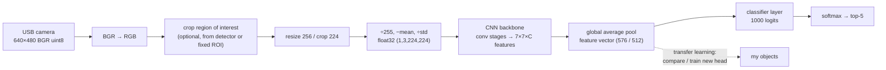

# 13.09 — CNNs for robot vision — using pretrained networks

<!-- glance:start -->
<!-- generated by tools/build.py from curriculum/syllabus.yaml — edit the syllabus, not this block -->

| | |
|---|---|
| **Track** | Main path |
| **Difficulty** | Intermediate |
| **Time** | 1 h |
| **Hardware** | none |
| **Software** | python, pytorch |
| **Prerequisites** | [13.02 OpenCV fundamentals and preprocessing](13.02-opencv-preprocessing.md) |
| **Optional prerequisites** | [FML.06 Neural networks from zero](../optional-foundations/machine-learning/FML.06-neural-networks.md)<br>[FML.08 Convolutional neural networks](../optional-foundations/machine-learning/FML.08-cnns.md) |
| **Skip if** | You run pretrained CNNs in PyTorch and understand their outputs. |

<!-- glance:end -->

## What you will learn

- Load a pretrained torchvision classifier and run it on a camera frame with the exact preprocessing it was trained with.
- Read what the network returns (logits, softmax probabilities, top-5) and know what those numbers do and don't promise.
- Spot the three preprocessing bugs that silently wreck accuracy: BGR vs RGB, missing normalisation, wrong resize.
- Measure inference latency properly (warm-up, median and p90, thread count) and turn it into a robot loop-rate budget.
- Pick a backbone for a Pi 5, a laptop or a Jetson from parameters, FLOPs and measured milliseconds.
- Reuse a pretrained network as a feature extractor, the first step of transfer learning.

## Why it matters

karmel's classical ball finder from [13.03](13.03-classical-detection.md) works because the ball is orange and nothing
else is. The tasks that come later are not that kind: "bring me the bottle" ([15.08](../15-manipulation/15.08-pick-and-place-pipeline.md)),
"is there a cup on the table?" from the LLM agent ([19.07](../19-llm-robot-agents/19.07-perception-action-loops.md)).
Bottles come in every colour and shape. No HSV threshold describes "bottle". A convolutional neural network (CNN)
trained on millions of labelled photos does.

You will not train one from scratch for this robot. Nobody does. You download a network someone trained on
ImageNet or COCO and use it as a component, the way you'd pull a well-tested library from NuGet. This lesson is about
using that component correctly: its input contract, its output, and its cost in milliseconds. Every model in
the next five lessons (detectors, SAM, CLIP, VLMs) has the same three questions, and they start here.

<!-- prereqs:start -->
## Prerequisites

You need these first:

- [13.02 OpenCV fundamentals and preprocessing](13.02-opencv-preprocessing.md)

### Optional prerequisite links

New to any of these? Take the foundation lesson first; skip it if you already know it.

- [FML.06 Neural networks from zero](../optional-foundations/machine-learning/FML.06-neural-networks.md)
- [FML.08 Convolutional neural networks](../optional-foundations/machine-learning/FML.08-cnns.md)

Check your readiness: `python course.py why 13.09`
<!-- prereqs:end -->

## Concept

> [!NOTE]
> New to neural networks or convolutions? → [FML.06 Neural networks from zero](../optional-foundations/machine-learning/FML.06-neural-networks.md)
> and [FML.08 Convolutional neural networks](../optional-foundations/machine-learning/FML.08-cnns.md). Skip them if you
> know what a layer, an activation and a convolution kernel are. This lesson uses CNNs; those lessons explain them.

**A CNN is the preprocessing pipeline from 13.02, but learned.** In [13.02](13.02-opencv-preprocessing.md) you chose a
Gaussian kernel to blur and a Sobel kernel to find edges. A CNN's first layer is also a stack of 3×3 kernels, but
nobody chose their values: training did. Layer 1 learns edge and colour-blob detectors. Layer 5 combines them into
textures and corners. Layer 15 combines those into "rounded glass shoulder" and "screw cap". The last layer turns that
description into one score per class.

**A pretrained network is a function with a strict contract.** MobileNetV3 trained on ImageNet expects:
a 224×224 image, RGB channel order, pixel values scaled to 0–1 and then normalised by ImageNet's mean and standard
deviation, float32, in a batch. Violate the contract and it still returns an answer, with the same confidence
and the same speed. It is just wrong. There is no exception, which is why preprocessing bugs are the most common
failure in robot vision code. Think of it as an API that accepts any JSON and never returns 400.

**The output is a ranking, not a truth.** ImageNet has 1,000 classes: 120 dog breeds, "water bottle", "beer bottle",
"pop bottle", "wine bottle", "coffee mug", but no "table" and no "robot". Give it a photo of a pizza on a table
and it says "pizza 0.97". Give it a photo of your cable drawer and it will still spread 100% of the probability over
classes it knows. A softmax probability of 0.9 means "this class wins by a lot among the 1,000 it knows". It does not
mean "90% chance this is correct in your kitchen".

**Speed is part of correctness.** A robot driving at 0.3 m/s moves 3 cm during a 100 ms inference. If the network
takes 400 ms on the Pi, the detection describes where the object *was* 12 cm ago. So you measure latency
as carefully as accuracy, on the hardware that will run it.

> [!TIP]
> **Ask your teacher:** "Show me what the first-layer filters of ResNet-18 look like, and explain why they resemble the Sobel and colour kernels from 13.02."

## Technical explanation

### Level 1 — What goes in, what comes out

```text
camera frame (H×W×3, uint8, BGR from OpenCV)
  → convert to RGB
  → resize short side to 256, center-crop 224×224
  → scale to [0,1], subtract mean, divide by std  (per channel)
  → tensor (1, 3, 224, 224) float32
  → network  → logits (1, 1000)
  → softmax  → probabilities (sum to 1)
  → top-k    → [("pizza", 0.97), ("frying pan", 0.012), …]
```

**Logits** are raw scores, any real number. **Softmax** turns them into probabilities. **Top-5** reports
the five best classes. ImageNet accuracy is quoted as top-1 (the best class is right) and top-5 (the right class is
among the five).

### Level 2 — Practical: the code that matters

torchvision ships each pretrained network together with its weights *and* the preprocessing those weights expect.
Always take the preprocessing from the weights object. Don't retype it from a blog post:

```python
from torchvision import models
weights = models.MobileNet_V3_Small_Weights.DEFAULT      # best available ImageNet weights for this builder
model = models.mobilenet_v3_small(weights=weights).eval() # eval(): dropout off, batch-norm uses stored statistics
preprocess = weights.transforms()                          # resize 256 → crop 224 → normalise
categories = weights.meta["categories"]                    # index → "water bottle"

with torch.inference_mode():                               # no autograd bookkeeping: faster, less memory
    logits = model(preprocess(pil_rgb_image).unsqueeze(0)) # unsqueeze: add the batch dimension
```

Four details that bite:

1. **`.eval()`**. Without it, batch-normalisation layers use the statistics of your single-image "batch", and
   the outputs change from run to run.
2. **RGB, not BGR.** OpenCV frames are BGR ([13.01](13.01-images-as-data.md)). Convert with
   `cv2.cvtColor(frame, cv2.COLOR_BGR2RGB)` or `frame[:, :, ::-1]` before building a PIL image.
3. **Normalisation.** The network saw inputs with roughly zero mean and unit variance per channel. Raw 0–255 values
   are about 200× too large.
4. **Resize policy.** "Short side to 256, then center crop 224" throws away the edges of a wide 640×480 frame. An object
   at the left edge of the image is simply not in the tensor. For a robot, crop the region you care about first.

The network sizes you'll meet, from the torchvision model table (ImageNet-1K, verified 2026-09):

| Model | Params | GFLOPs | Top-1 | Where it fits |
|---|---|---|---|---|
| MobileNetV3-Small | 2.5 M | 0.06 | 67.7 % | Pi 5 CPU, many crops per frame |
| MobileNetV3-Large | 5.5 M | 0.22 | 75.3 % | Pi 5 CPU |
| EfficientNet-B0 | 5.3 M | 0.39 | 77.7 % | Pi 5 (slower than its FLOPs suggest), Jetson |
| ResNet-18 | 11.7 M | 1.81 | 69.8 % | Jetson/laptop; the backbone inside ACT ([18.04](../18-embodied-ai/18.04-action-chunking-transformers.md)) |

FLOPs (floating-point operations per image) predict latency only roughly. Memory access and how well an operation is
optimised for your CPU matter as much. ResNet-18 has 30× the FLOPs of MobileNetV3-Small, but on a laptop CPU it is only
about 2–4× slower, because its plain 3×3 convolutions are the best-optimised kernels in every library. Always measure.

### Level 3 — Mathematics

**Normalisation.** For channel $c$ with ImageNet mean $\mu_c$ and standard deviation $\sigma_c$:

$$x'_c = \frac{x_c/255 - \mu_c}{\sigma_c}, \qquad \mu = (0.485, 0.456, 0.406),\ \sigma = (0.229, 0.224, 0.225)$$

Worked example: an orange pixel $(R,G,B) = (200, 120, 40)$ becomes $(0.784, 0.471, 0.157)$ after scaling, then
$\big(\frac{0.784-0.485}{0.229}, \frac{0.471-0.456}{0.224}, \frac{0.157-0.406}{0.225}\big) = (1.307, 0.065, -1.107)$.
If you forget to swap BGR→RGB, the network receives $(-1.433, 0.065, 1.681)$: a strongly *blue* pixel. The whole
image's colour story is inverted, and every "orange" feature detector stays silent.

**Softmax.** For logits $z_1 \dots z_K$:

$$p_i = \frac{e^{z_i}}{\sum_{j=1}^{K} e^{z_j}}$$

Worked example with three classes, $z = (2.0, 1.0, 0.1)$: $e^z = (7.39, 2.72, 1.11)$, sum $11.21$, so
$p = (0.659, 0.242, 0.099)$. Softmax only compares logits with each other. Add 100 to every logit and the probabilities
don't change. That is why it cannot say "none of the above".

**Convolution output size.** A convolution with kernel $k$, padding $p$ and stride $s$ on an input of width $W$ gives

$$W_{out} = \left\lfloor \frac{W + 2p - k}{s} \right\rfloor + 1$$

MobileNetV3's first layer: $W=224, k=3, p=1, s=2$ gives $\lfloor 223/2 \rfloor + 1 = 112$. Five stride-2 stages take
224 px down to a 7×7 grid, so each cell of the final feature map summarises a 32×32 px patch. An object smaller than
roughly one cell (about 30 px in the 224 px tensor) is hard for the network to see. Resizing a 640×480 frame to 224 px
shrinks objects about 2.1×, so a 40 px bottle becomes 19 px and is lost.

**Parameter count.** A 3×3 convolution from 16 to 32 channels has $3 \cdot 3 \cdot 16 \cdot 32 + 32 = 4{,}640$
parameters (weights plus one bias per output channel). Parameters set the download size and RAM (float32: 4 bytes each,
so ResNet-18's 11.7 M parameters take 45 MB). FLOPs set the compute per frame.

### Level 4 — Implementation: latency, budgets and reuse

**Measuring latency.** The first call to a network is slow: memory gets allocated, kernels are selected, lazy
initialisation runs. Warm up 2–3 calls, then time 20 or more and report the **median** (typical) and the **p90**
(what your control loop must survive). A mean hides the spikes that make a robot stutter. Measure preprocessing
too: resizing a 640×480 image in Python can cost as much as MobileNetV3-Small itself.

**Threads.** PyTorch uses one thread per core by default. A Raspberry Pi 5 has 4 cores, and the rest of the robot (ROS
nodes, camera driver, Nav2) needs some of them. Pin the vision node with `torch.set_num_threads(2)` or `(3)` and
measure again. On laptops with a mix of performance and efficiency cores, *more* threads can be slower.

**Loop-rate budget.** If perception takes $t_p$ and the controller needs results at rate $f$, you need $t_p < 1/f$ with
margin for the p90. MobileNetV3-Small at a 25 ms median and a 40 ms p90 supports 10 Hz comfortably. At 400 ms you
can only run at about 2 Hz, and the robot must slow down, or stop while it looks.

**Transfer learning, first step.** Remove the final classification layer and the network outputs a feature vector
(576 numbers for MobileNetV3-Small, 512 for ResNet-18) describing the image. Two photos of the same mug give nearby
vectors. That lets you recognise *your* objects with a handful of examples: store the vector of "my blue mug" and
compare new crops to it by cosine similarity. [13.13](13.13-embeddings-open-vocabulary.md) does this with CLIP.
[16.03](../16-machine-learning/16.03-fine-tuning-a-detector.md) goes further and fine-tunes the network.

**Classification vs detection.** A classifier answers "what is this image?", one label for the whole input. That is
enough when *you* control the crop: the region inside a detector's box, the view of the gripper jaws ("holding
something?"), a fixed shelf slot. It is useless for "where is the bottle?". That needs a detector ([13.10](13.10-object-detection-models.md)).

> [!TIP]
> **Ask your teacher:** "Walk me through why a softmax classifier is overconfident on images from outside its training distribution, and what a robot can do about it (thresholds, 'unknown' class, embeddings)."

## Diagram



```text
Latency budget for a 10 Hz perception loop on karmel (numbers illustrative)
|<----------------------------- 100 ms ------------------------------>|
| grab 5 | BGR→RGB+resize 5 | network 25 (p90 40) | post 1 | publish 2 | slack ~40 |
```

## Code

All code for 13.09–13.14 lives in [`13-computer-vision/code/modern/`](code/modern/). Install the CPU build of
PyTorch once (a GPU build also works):

```bash
python -m pip install torch torchvision --index-url https://download.pytorch.org/whl/cpu
python -m pip install pillow numpy scipy pytest
cd 13-computer-vision/code/modern
python classify.py --compare-preprocessing --bgr-bug --bench --threads 4
```

The first run downloads MobileNetV3-Small weights (~10 MB) to `~/.cache/torch/hub` and a CC BY 2.0 sample photo from
the COCO dataset to `code/modern/out/cache/`. Nothing large is committed to the repository.

The core of [`classify.py`](code/modern/classify.py):

```python
class Classifier:
    """A pretrained ImageNet classifier with its own preprocessing. Load once, call per frame."""

    def __init__(self, name: str = "mobilenet_v3_small") -> None:
        builder, weights = MODELS[name]
        self.name = name
        self.weights = weights
        self.model = builder(weights=weights).eval()   # eval(): dropout off, batch-norm frozen
        self.transform = weights.transforms()           # resize -> center crop -> tensor -> normalise
        self.categories: list[str] = weights.meta["categories"]

    def preprocess(self, img: Image.Image) -> torch.Tensor:
        return self.transform(img).unsqueeze(0)          # (1, 3, 224, 224) float32

    @torch.inference_mode()
    def logits(self, batch: torch.Tensor) -> torch.Tensor:
        return self.model(batch)

    def top_k(self, img: Image.Image, k: int = 5) -> list[Prediction]:
        probs = torch.softmax(self.logits(self.preprocess(img))[0], dim=0)
        p, idx = probs.topk(k)
        return [Prediction(self.categories[i], float(v)) for v, i in zip(p, idx)]


def manual_preprocess(img: Image.Image, resize: int = 256, crop: int = 224) -> torch.Tensor:
    """The same steps as weights.transforms(), written out so nothing is magic."""
    img = TF.resize(img, resize, interpolation=TF.InterpolationMode.BILINEAR)  # short side -> 256
    img = TF.center_crop(img, crop)                                             # 224 x 224 middle
    x = torch.from_numpy(np.asarray(img, dtype=np.float32) / 255.0)             # HWC in [0, 1]
    x = x.permute(2, 0, 1)                                                      # -> CHW
    mean = torch.tensor(IMAGENET_MEAN).view(3, 1, 1)
    std = torch.tensor(IMAGENET_STD).view(3, 1, 1)
    return ((x - mean) / std).unsqueeze(0)
```

From an OpenCV camera frame, convert first. `bgr_to_pil` is in [`common.py`](code/modern/common.py):

```python
import cv2
from common import bgr_to_pil
from classify import Classifier

clf = Classifier("mobilenet_v3_small")
cap = cv2.VideoCapture(0)
ok, frame = cap.read()                 # BGR uint8
print(clf.top_k(bgr_to_pil(frame)))
```

To measure every model from 13.09–13.13 on your own machine in one table, run `python bench_cpu.py`. It takes several
minutes and downloads about 1 GB of weights.

## Exercise

### Exercise 13.09-E1 — Predict the BGR damage `[predict]`

Hardware: none. **Before running anything**, write down: if you feed the sample photo with red and blue swapped, will
the top-1 class change? Will its probability go up or down? Then run
`python classify.py --bgr-bug` and compare with your prediction. Repeat with `--model resnet18`.

### Exercise 13.09-E2 — Prove the preprocessing contract `[coding]`

Hardware: none. Run `python classify.py --compare-preprocessing`. Then break `manual_preprocess` three ways, one at a
time: (a) skip the division by `std`, (b) skip `/ 255.0`, (c) resize to 224×224 directly without keeping the aspect
ratio. For each, pass the tensor to `clf.logits` yourself and record the top-1 class and probability.

### Exercise 13.09-E3 — Crop before you classify `[coding]`

Hardware: none. The sample photo has a bottle at `413,1,503,190` (x1,y1,x2,y2). Run
`python classify.py --crop 413,1,503,190` and `python classify.py` (whole image). Then crop the glass at
`463,13,567,135`. Which ImageNet classes come out for each crop, and why is none of them simply "bottle" or "glass"?

### Exercise 13.09-E4 — Latency budget for karmel `[numerical]`

Hardware: none (a Raspberry Pi 5 from `robot-base` makes it real, see the note in Expected result). Run
`python classify.py --bench --threads 4` for `mobilenet_v3_small`, `resnet18` and `efficientnet_b0`. For each, compute:
(a) the maximum loop rate using the p90, (b) how far karmel travels at 0.3 m/s during one p90 inference, and (c) whether
it fits a 10 Hz loop with 30% slack.

### Exercise 13.09-E5 — "It says 'soap dispenser' with 26%" `[debugging]`

Hardware: none. A teammate's node classifies bottle crops and publishes the top-1 label only if its probability is
> 0.2. On the sample bottle crop it publishes "soap dispenser". List three different causes that could each produce
this (think contract, crop, label set), and one measurement that separates them.

## Expected result

**13.09-E1:** Measured on an Intel Core Ultra 7 255H laptop (Windows 11, torch 2.14 CPU, 2026-09):
MobileNetV3-Small keeps **pizza** as top-1, but its probability drops from **0.97** to about **0.44**, and the runners-up
change (frying pan 0.19, trifle 0.06). ResNet-18 behaves similarly (pizza 0.85 unswapped). The lesson: a colour-order bug
rarely produces an obviously absurd class on an easy image. It quietly destroys confidence and flips borderline cases.

**13.09-E2:** `max |weights.transforms() - manual| = 0.00e+00`, shape `(1, 3, 224, 224)`, per-channel mean around
`[-0.10 -0.31 -0.30]` and std around 1.0–1.1. Measured on the sample photo (MobileNetV3-Small / ResNet-18):
(a) no `std`: pizza 0.82 / **eggnog 0.29**. The smaller network survives, the bigger one is already confused.
(b) no `/255`: **badger 1.00 / plunger 1.00**. Inputs in the hundreds give absurd classes with *total* confidence.
(c) squash to 224×224: pizza 0.87 / 0.89. Aspect distortion is mild for this image, but it is not free for
thin objects such as bottles. Exact classes can vary by torch version. The *pattern* is what matters: the bigger the
contract violation, the more confident the nonsense.

**13.09-E3:** The bottle crop (90×189 px) gives low, spread-out probabilities. Measured: soap dispenser 0.26,
cocktail shaker 0.19, whiskey jug 0.09, beaker 0.06. The whole image gives pizza. ImageNet has "water bottle",
"wine bottle", "beer bottle", "pop bottle", but no oil cruet and no generic "bottle", so the probability spreads over
look-alike containers. The glass crop gives beaker 0.16, perfume 0.03, saltshaker 0.03 (ResNet-18: beaker, pitcher, water jug). A classifier can
only answer in its own vocabulary.

**13.09-E4:** Measured on the laptop above with 4 threads, on a busy machine (other workloads were running, so expect
your numbers to be *lower* on an idle one): MobileNetV3-Small network **~25 ms median, ~40 ms p90**, plus preprocessing
**~4 ms**. ResNet-18 **~45–50 ms median, ~70 ms p90**. With p90 = 40 ms: max rate 25 Hz, travel 0.3 × 0.040 = **1.2 cm**,
fits 10 Hz with slack. ResNet-18 at p90 ≈ 70 ms: ~14 Hz, 2.1 cm, fits 10 Hz but with barely 30% slack.
*Approximate* expectations elsewhere (not measured for this lesson; derived from published Pi 5 and Jetson Orin Nano
benchmarks of similar-size networks): **Raspberry Pi 5, PyTorch CPU, 4 threads: roughly 3–6× the laptop milliseconds**
(MobileNetV3-Small around 60–150 ms, ResNet-18 around 150–300 ms). ONNX Runtime or NCNN is typically 2–4× faster than
PyTorch on the Pi ([16.04](../16-machine-learning/16.04-models-on-edge-compute.md)). **Jetson Orin Nano Super GPU: a few
ms per image for either network**, lower still with TensorRT FP16.

**13.09-E5:** Causes: (1) the contract is broken upstream (BGR input, missing normalisation), (2) the crop is too
tight or too loose, or the object is small after resizing, (3) the label set has no matching class, and the 0.2
threshold is meaningless for a 1,000-way softmax on out-of-vocabulary objects. Separating measurement: run the same
crop through `classify.py`, which has a known-good contract. If you get the same result, it is (2) or (3). Then classify
a clean studio photo of a water bottle. If *that* works, the problem is (3) for your oil bottle.

## Troubleshooting

### Symptom: every image gets the same class or near-uniform probabilities

1. Print the input tensor's per-channel mean and std. Expect roughly −1…+1 and ~1. Values in the hundreds mean you
   skipped `/255`. Values in 0–1 mean you skipped normalisation.
2. Check `model.training` is `False`. If `True`, you forgot `.eval()`.
3. Check the tensor shape is `(N, 3, H, W)`, not `(N, H, W, 3)`. A permuted tensor sometimes still runs when H = W = 3…
   rarely, but a wrong `view` instead of `permute` scrambles pixels silently.
4. Verify the weights loaded: `sum(p.abs().sum() for p in model.parameters())` should be the same number every run.
   A model built with `weights=None` has random weights and gives near-uniform output.

### Symptom: results differ between my laptop script and the robot node

Decide by elimination. Save the exact frame the robot node received (`cv2.imwrite`) and run it through the laptop
script. Same result: the camera or scene differs (exposure, blur, [07.08](../07-sensors/07.08-rgb-cameras.md)), not
the code. Different result: diff the preprocessing. Check colour order first (ROS `bgr8` vs `rgb8` encodings,
[13.15](13.15-vision-in-ros2.md)), then resize and crop, then dtype.

### Symptom: inference is much slower than the numbers above

1. Is the first call included in your timing? Warm up.
2. Count threads: `torch.get_num_threads()`. Try 1, 2, 4. Oversubscription (several processes each using all cores)
   is the usual cause on a robot.
3. Is autograd on? Wrap inference in `torch.inference_mode()`.
4. Is the machine throttling? Laptops on battery and a Pi 5 without a cooler both slow down after about a minute.
   Watch `vcgencmd measure_temp` on the Pi.
5. Is preprocessing in PIL at full resolution the bottleneck? Time it separately. `classify.py --bench` does.

## Common mistakes

- **Passing OpenCV frames straight in.** BGR order. Convert at the boundary where frames enter your ML code, once.
- **Treating softmax probability as calibrated confidence.** It is a relative ranking inside a closed vocabulary.
  Calibrate thresholds on your own images ([13.10](13.10-object-detection-models.md) shows how).
- **Benchmarking the first call, or a mean of three runs.** Warm up, take 20+ runs, report median and p90.
- **Center-cropping a wide frame and losing the object at the edge.** Crop the region of interest yourself.
- **Choosing a model by ImageNet top-1 alone.** 2% accuracy is worthless if the model triples latency and your
  loop drops to 3 Hz.
- **Forgetting `.eval()`,** so batch-norm and dropout behave as in training and outputs jitter.

## Knowledge check

1. What four things does a torchvision ImageNet classifier expect of its input tensor?
   <details><summary>Answer</summary>

   RGB channel order; spatial size produced by its transform (resize 256, center crop 224 for these models); values
   scaled to [0, 1] then normalised per channel with ImageNet mean (0.485, 0.456, 0.406) and std (0.229, 0.224, 0.225);
   float32 shape (N, 3, H, W) with a batch dimension. `weights.transforms()` encodes all of it except the batch
   dimension and colour order of your source.
   </details>

2. Logits are $(3.0, 1.0, 1.0)$. Compute the softmax. What happens if you add 5 to all three?
   <details><summary>Answer</summary>

   $e^3 = 20.09$, $e^1 = 2.72$ twice; sum $25.52$; $p = (0.787, 0.107, 0.107)$. Adding 5 to every logit multiplies
   every $e^{z}$ by $e^5$, which cancels in the ratio: the probabilities are unchanged. Softmax only encodes
   differences between classes, so it cannot express "none of these".
   </details>

3. A pixel arrives as BGR (40, 120, 200) and you forget to convert. What normalised values does the red channel input
   receive, and what should it have received?
   <details><summary>Answer</summary>

   The network's "R" slot gets 40: $(40/255 - 0.485)/0.229 = -1.433$. It should have received 200:
   $(0.784 - 0.485)/0.229 = 1.307$. The sign flips, so a strongly red-orange pixel looks strongly un-red.
   </details>

4. ResNet-18 has 11.7 M parameters. How much RAM do its weights take in float32 and in int8?
   <details><summary>Answer</summary>

   float32: 4 bytes × 11.7 M ≈ 46.8 MB (≈ 44.6 MiB, the checkpoint is 45 MB). int8: about 11.7 MB. Quantisation
   ([16.04](../16-machine-learning/16.04-models-on-edge-compute.md)) cuts memory 4× and often speeds up CPU inference.
   </details>

5. Your perception node has a median latency of 60 ms and a p90 of 190 ms. The controller runs at 10 Hz and uses the
   latest result. Predict the behaviour you will see on the robot.
   <details><summary>Answer</summary>

   Most cycles get a fresh result, but roughly every tenth cycle or more the result is one or two cycles old. The robot
   steers on stale positions, so you see occasional twitches or overshoot when tracking a moving target. Fix the
   spikes (thread contention, GC, other processes) or design the controller to use result timestamps and
   predict forward. The median alone would have told you "fine".
   </details>

6. Why does a bottle 40 px tall in a 640×480 frame often go undetected by a classifier run on the whole frame?
   <details><summary>Answer</summary>

   Resize 480 → 256 on the short side, then crop 224: the bottle shrinks to about 21 px, smaller than one 32×32 px cell of
   the final 7×7 feature map. The network has no spatial resolution left to represent it, and the rest of the image
   dominates the pooled features. Crop around the object, or use a detector that works at higher resolution.
   </details>

7. When is a classifier (not a detector) the right tool on karmel? Give two examples.
   <details><summary>Answer</summary>

   When the crop is known in advance or given by another stage: (a) classify the region between the gripper
   jaws as "empty / holding object", (b) classify a detector's box to refine "bottle" into "my water bottle vs olive oil",
   (c) whole-scene classification such as "kitchen / hallway" for coarse place recognition. Not for locating objects.
   </details>

## Practical challenge

Build a **grasp-check classifier** without training a network: decide whether karmel's gripper is holding an object.

1. Take 20 photos of the gripper region empty and 20 holding different objects (bottle, cup, ball). Use the `camera`
   if you have it, or a phone photo of any "container open vs holding something" scene if you don't.
2. Use `Classifier("mobilenet_v3_small").embedding(img)` as a feature vector. Store the mean vector of 10 "empty" and
   10 "holding" images (a nearest-centroid classifier).
3. Classify the remaining 20 photos by cosine similarity to the two centroids.

Acceptance criteria:
- ≥ 90% accuracy on the 20 held-out photos, reported as a confusion matrix.
- Median + p90 latency for embedding + comparison, measured with 4 threads, and the loop rate it supports.
- One paragraph on a failure case you found (lighting, a transparent object, background change) and how you'd fix it.

## You can skip this if…

You answer knowledge-check questions 2, 5 and 6 correctly without looking, and you have previously run a pretrained
PyTorch model on your own images with correct preprocessing and measured its latency. Then:

`python course.py skip 13.09 --reason "run pretrained CNNs in PyTorch with correct preprocessing and latency measurement"`

## Go deeper

- https://docs.pytorch.org/vision/stable/models.html — torchvision models and pre-trained weights: the table of accuracy, parameters and GFLOPs, and the `weights.transforms()` / `meta` API used here.
- https://docs.pytorch.org/tutorials/ — official PyTorch tutorials; start with the tensors and "Learn the Basics" pages if PyTorch syntax still slows you down.
- https://cs231n.github.io/ — Stanford CS231n notes: the clearest explanation of convolution layers, receptive fields and why CNNs work.
- https://arxiv.org/abs/1512.03385 — He et al., *Deep Residual Learning for Image Recognition* (ResNet). Read the introduction and the architecture section; ResNet-18 is still the default robot-learning encoder.
- https://huggingface.co/learn/computer-vision-course/unit0/welcome/welcome — Hugging Face community computer vision course, for a broader tour of modern vision models.
- https://d2l.ai/ — *Dive into Deep Learning*, chapters on CNNs and modern CNN architectures, with runnable PyTorch code.

## Progress checkpoint

- [ ] I can load a pretrained torchvision classifier and run it with the preprocessing from its weights object.
- [ ] I can explain logits, softmax and top-5, and why softmax confidence is not a calibrated probability.
- [ ] I can find BGR, normalisation and resize bugs by inspecting the input tensor.
- [ ] I can measure median and p90 latency with a chosen thread count and convert it into a loop-rate budget.
- [ ] I can use a network's feature vector for simple recognition of my own objects.

`python course.py complete 13.09` (exercises done) · `python course.py master 13.09` (challenge done) ·
`python course.py struggle 13.09 "what was hard"`

Next: [13.10 — Object detection with modern models](13.10-object-detection-models.md).
