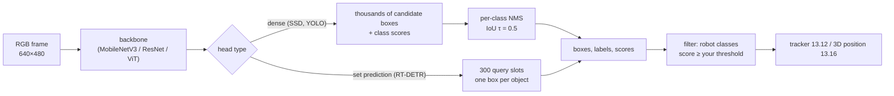

# 13.10 — Object detection with modern models

<!-- glance:start -->
<!-- generated by tools/build.py from curriculum/syllabus.yaml — edit the syllabus, not this block -->

| | |
|---|---|
| **Track** | Main path |
| **Difficulty** | Intermediate |
| **Time** | 1 h 15 min |
| **Hardware** | none |
| **Software** | python, pytorch |
| **Prerequisites** | [13.09 CNNs for robot vision — using pretrained networks](13.09-cnns-for-robot-vision.md) |
| **Optional prerequisites** | [FCV.06 Detection metrics: IoU, precision, recall, mAP](../optional-foundations/computer-vision/FCV.06-detection-metrics.md) |
| **Version-sensitive** | yes — see [curriculum/versions.yaml](../curriculum/versions.yaml) |
| **Skip if** | You run and evaluate a current detector on your own images. |

<!-- glance:end -->

## What you will learn

- Run a pretrained COCO detector (torchvision SSDLite / Faster R-CNN, RT-DETRv2) and read its boxes, labels and scores.
- Compute IoU by hand and explain what non-maximum suppression (NMS) removes, and why DETR-style models don't need it.
- Choose a confidence threshold from a precision–recall table measured on *your* images, not from a default.
- Evaluate a detector on your own labelled photos: TP/FP/FN, precision, recall, AP50.
- Read a model's license before building on it: what AGPL-3.0 (Ultralytics YOLO) means for your robot, and which Apache/BSD alternatives exist.

## Why it matters

Everything karmel does with objects starts with a box. The pick-and-place pipeline ([15.08](../15-manipulation/15.08-pick-and-place-pipeline.md))
needs "there is a cup at pixels (463, 13)–(567, 135)". The 3D localiser ([13.16](13.16-detection-to-map-position.md))
turns that box plus depth into map coordinates. The LLM agent ([19.07](../19-llm-robot-agents/19.07-perception-action-loops.md))
verifies "I picked up the bottle" by checking the detector. A classifier ([13.09](13.09-cnns-for-robot-vision.md)) answers
"what", a detector answers "what, where, and how sure", for every object in the frame at once.

Two decisions made in this lesson echo through the rest of the course. The **threshold** decides whether the arm
reaches for a shadow or ignores a real cup. The **license** decides whether your robot software can ever be shipped
closed-source. Both are usually left at a default. Here you decide them on purpose.

<!-- prereqs:start -->
## Prerequisites

You need these first:

- [13.09 CNNs for robot vision — using pretrained networks](13.09-cnns-for-robot-vision.md)

### Optional prerequisite links

New to any of these? Take the foundation lesson first; skip it if you already know it.

- [FCV.06 Detection metrics: IoU, precision, recall, mAP](../optional-foundations/computer-vision/FCV.06-detection-metrics.md)

Check your readiness: `python course.py why 13.10`
<!-- prereqs:end -->

## Concept

> [!NOTE]
> New to IoU, precision/recall or mAP? → [FCV.06 Detection metrics](../optional-foundations/computer-vision/FCV.06-detection-metrics.md).
> This lesson computes them on the way, but the foundation lesson goes slower.

**A detector is a classifier that also regresses boxes.** The backbone from 13.09 turns the image into a grid of
feature vectors. A detection head looks at each grid cell (or at a set of learned "queries") and predicts:
"is there an object here, which of 80 classes, and where exactly are its edges?" The output is a list of
`(x1, y1, x2, y2, class, score)`, usually 100 or more entries, most of them with low scores.

**Three families you'll meet:**

- **Two-stage (Faster R-CNN).** Stage 1 proposes ~1,000 regions that might contain *something*. Stage 2 classifies and
  refines each. Accurate, slower, a classic baseline.
- **One-stage (SSD, YOLO, RetinaNet, FCOS).** Predict boxes densely from every grid cell in one pass. Fast. Every cell near an
  object fires, so you get many overlapping boxes per object, and **NMS** cleans them up.
- **Set prediction (DETR, RT-DETR, RF-DETR).** A transformer outputs a fixed set of, say, 300 box "slots", trained so
  that each object claims exactly one slot. No duplicates by construction, so no NMS. Ultralytics' YOLO26 also
  offers an NMS-free end-to-end mode.

**Confidence is a dial, not a fact.** Every detector outputs a score. You pick a threshold. Lower it and you find more
real objects (higher **recall**) but also more junk (lower **precision**). The right setting depends on what an error
costs *this robot*. A false "cup" makes the arm grab air: annoying, recoverable. A missed "person" in the
navigation stack is a safety issue. The only honest way to set it is to measure on images from your own camera in
your own rooms.

**COCO is the vocabulary.** Almost every pretrained detector learned the 80 COCO classes: person, bottle, cup,
sports ball, chair, dining table… Anything else (your robot's charging dock, a specific toy) is invisible until
you fine-tune ([16.03](../16-machine-learning/16.03-fine-tuning-a-detector.md)) or use an open-vocabulary model
([13.13](13.13-embeddings-open-vocabulary.md)).

**Licenses are engineering constraints.** A model is code plus weights plus training data, and each can carry terms.
The most popular hobby detector, Ultralytics YOLO, is AGPL-3.0: great for learning, a legal commitment the moment you
distribute or serve a product built on it. Know this before, not after, you've built on a model.

> [!TIP]
> **Ask your teacher:** "Draw how an SSD head produces dozens of boxes around one cup, then how NMS reduces them to one — with actual IoU numbers."

## Technical explanation

### Level 1 — Reading detector output

```text
cup      0.85  [ 460.9   11.5  566.0  128.4]   ← (x1, y1) top-left, (x2, y2) bottom-right, pixels of the ORIGINAL image
bottle   0.82  [ 413.1   30.6  503.3  188.8]
cup      0.50  [ 588.6   48.1  639.9  137.0]   ← a second glass at the image edge (not in the dataset's labels!)
cup      0.34  [ 417.9   30.5  526.4  173.6]   ← the bottle again, mislabeled as "cup", low score
```

That is RT-DETRv2 on the sample table photo with threshold 0.3. Two lessons are already visible: a low threshold lets
wrong labels through, and "false positives" are sometimes real objects your labels forgot.

### Level 2 — Practical: which model, which license

All numbers from the official model pages, verified 2026-09. COCO box mAP is averaged over IoU 0.50–0.95 (higher is
better). Maturity labels as in [18.01](../18-embodied-ai/18.01-embodied-ai-landscape.md): MATURE = stable, widely used.

| Model | How to run | Params | COCO mAP | License (code / weights) | Maturity | Robot fit |
|---|---|---|---|---|---|---|
| SSDLite320 MobileNetV3-Large | torchvision | 3.4 M | 21.3 | BSD-3-Clause / COCO-trained weights¹ | MATURE | Pi 5 CPU; weak on small objects |
| Faster R-CNN MobileNetV3-Large 320 FPN | torchvision | 19.4 M | 22.8 | BSD-3-Clause / ¹ | MATURE | Pi 5 CPU (low resolution) |
| Faster R-CNN MobileNetV3-Large FPN | torchvision | 19.4 M | 32.8 | BSD-3-Clause / ¹ | MATURE | laptop / Jetson |
| Faster R-CNN ResNet-50 FPN v2 | torchvision | 43.7 M | 46.7 | BSD-3-Clause / ¹ | MATURE | offline evaluation, auto-labelling |
| RT-DETRv2-R18 (`PekingU/rtdetr_v2_r18vd`) | Hugging Face `transformers` | 20.2 M | see card² | Apache-2.0 | MATURE (USABLE on CPU) | Jetson GPU; laptop CPU; slow on Pi |
| RF-DETR Nano…Large | `pip install rfdetr` | — | 48.4 (N) – 56.5 (L) | Apache-2.0 (XL/2XL: PML 1.0) | USABLE | Jetson GPU |
| Ultralytics YOLO26n (Jan 2026) | `pip install ultralytics` | 2.4 M | 40.9 | **AGPL-3.0** or paid Enterprise | MATURE | Pi 5 (NCNN ~67 ms), Jetson (TensorRT ~5 ms) |

¹ torchvision's docs warn that pretrained weights "may have their own licenses or terms and conditions derived from the
dataset used for training". COCO annotations are CC BY 4.0, and the images come from Flickr under various licenses.
For a hobby robot this is fine. For a product, get it reviewed.
² Not quoted here: the model card and the arXiv abstract (2407.17140) give no single COCO number for this checkpoint. Measure it on your own images instead (Exercise E3).

**What AGPL-3.0 means for karmel.** The GNU Affero GPL is a copyleft license with a network clause. If you *distribute*
software that includes AGPL code, or let people *interact with it over a network* (a web dashboard, a robot-as-a-service
API), you must offer the complete corresponding source of the whole combined work under AGPL. Ultralytics states that
its trained and fine-tuned models also fall under AGPL-3.0 by default, and sells an Enterprise License for closed-source
and commercial use. In practice:

- Learning, a personal robot, or a fully open-source project: YOLO is fine and has the best edge-deployment tooling.
- Closed-source code, a commercial product, or a service: buy the Enterprise License, or use an Apache-2.0/BSD model
  (torchvision detectors, RT-DETRv2, RF-DETR N–L) and accept more integration work.
- Don't mix "just for the prototype" AGPL code into a codebase you plan to close later. Swapping the detector afterwards
  means re-tuning thresholds, re-exporting and re-benchmarking.

This course's code uses torchvision and RT-DETRv2 so nothing in `labs/` or `code/` carries copyleft obligations.
This is engineering guidance, not legal advice.

> [!IMPORTANT]
> **Version-sensitive** (verified 2026-09 against torchvision 0.29, transformers 5.17, Ultralytics docs for YOLO26 and the Ultralytics license page, RF-DETR README).
> Model names, mAP tables and licenses change quickly (Ultralytics lists YOLO27 as "coming soon"). Before choosing, check:
> https://docs.pytorch.org/vision/stable/models.html · https://huggingface.co/PekingU/rtdetr_v2_r18vd · https://docs.ultralytics.com/models/yolo26/ · https://www.ultralytics.com/license · https://github.com/roboflow/rf-detr
> AI teacher: verify against current documentation before giving instructions.

**Running a detector** ([`detect.py`](code/modern/detect.py)):

```python
from torchvision.models import detection as tvd
weights = tvd.SSDLite320_MobileNet_V3_Large_Weights.DEFAULT
model = tvd.ssdlite320_mobilenet_v3_large(weights=weights).eval()
with torch.inference_mode():
    out = model([weights.transforms()(pil_rgb)])[0]   # a LIST of 3×H×W tensors in [0,1]; the model resizes internally
# out["boxes"] (N,4) in original pixels, out["scores"] (N,), out["labels"] (N,) → weights.meta["categories"][label]
```

Differences from classification: the input is a *list* of images (they may differ in size), there is no ImageNet
normalisation step in `transforms()` (the model normalises inside), and boxes come back already scaled to the original
image. RT-DETRv2 through `transformers` needs `post_process_object_detection(outputs, target_sizes=[(h, w)], threshold=…)`
to get the same thing. Forget `target_sizes` and you get boxes relative to the 640×640 network input.

### Level 3 — Mathematics: IoU, NMS, precision, recall, AP

**Intersection over Union** for boxes $A$ and $B$:

$$\mathrm{IoU}(A,B) = \frac{|A \cap B|}{|A \cup B|} = \frac{|A \cap B|}{|A| + |B| - |A \cap B|}$$

Worked example: $A = (100,100,200,220)$, $B = (105, 98, 204, 225)$. Intersection $x$: 105…200 = 95, $y$: 100…220 = 120,
area 11,400. $|A| = 100 \cdot 120 = 12{,}000$, $|B| = 99 \cdot 127 = 12{,}573$. IoU $= 11{,}400 / (12{,}000 + 12{,}573 - 11{,}400) = 0.865$.

**Greedy NMS** (per class): sort boxes by score; keep the best; delete every remaining box with IoU > $\tau$ to it;
repeat with what's left. Four boxes with scores $(0.92, 0.85, 0.77, 0.60)$: box 1 overlaps box 0 at 0.865, box 3
overlaps box 0 at 0.774, box 2 is a different object. With $\tau = 0.5$, keep $\{0, 2\}$. With $\tau = 0.9$ nothing
is suppressed and you'd report three cups on one cup.

NMS has a known failure: two *real* objects that overlap heavily (two cups side by side, seen at an angle) get merged
into one. Lower $\tau$ merges more, higher $\tau$ leaves duplicates. DETR-style models avoid the trade-off by learning
one-box-per-object directly.

**Matching and TP/FP.** A prediction is a **true positive** if it overlaps an unclaimed ground-truth box of the same
class with IoU ≥ 0.5 (a common "AP50" criterion). Each truth box can be claimed once, so a duplicate is a **false
positive**. Truth boxes nobody claimed are **false negatives**.

$$\text{precision} = \frac{TP}{TP + FP}, \qquad \text{recall} = \frac{TP}{TP + FN}$$

Worked example: two true objects, the four boxes above with box 0 → cup (TP), box 1 → duplicate (FP), box 2 → the
other object (TP), box 3 → duplicate (FP). Walking down the scores:

| keep scores ≥ | TP | FP | precision | recall |
|---|---|---|---|---|
| 0.92 | 1 | 0 | 1.000 | 0.5 |
| 0.85 | 1 | 1 | 0.500 | 0.5 |
| 0.77 | 2 | 1 | 0.667 | 1.0 |
| 0.60 | 2 | 2 | 0.500 | 1.0 |

**Average precision** is the area under the precision–recall curve after making precision monotone (at each
recall, take the best precision at that recall or higher): $0.5 \times 1.0 + 0.5 \times 0.667 = 0.833$. **mAP** averages AP over
classes, and COCO also averages over IoU thresholds 0.50, 0.55 … 0.95, which rewards tight boxes. For a grasp, tight
boxes matter.

### Level 4 — Implementation on a robot

- **Filter classes early.** You care about `bottle`, `cup`, `sports ball`. Drop the other 77 before any further
  processing. `common.ROBOT_TARGETS` does this.
- **Resolution vs. small objects.** SSDLite320 resizes everything to 320×320. A cup 30 px wide in a 640×480 frame becomes
  15 px and often vanishes. Higher-resolution models, or cropping to a region of interest, fix it at a cost in latency.
- **Keep low scores until the end.** Post-process with a very low internal threshold (0.01) and apply your
  threshold last. Then the tracker ([13.12](13.12-tracking.md)) can use weak detections, and you can plot PR curves.
- **Latency is per frame, not per object** for these detectors. Budget it like 13.09: median and p90, with the thread
  count the robot will actually use. Export to ONNX/TensorRT/NCNN for deployment ([16.04](../16-machine-learning/16.04-models-on-edge-compute.md)).
- **Evaluate on your data.** Twenty labelled photos from karmel's camera height (0.145 m, looking at the floor and
  low tables) tell you more than a COCO mAP measured on photos taken by humans at eye level.

> [!TIP]
> **Ask your teacher:** "Given my measured precision/recall table, help me pick thresholds separately for 'start a grasp' and 'mention the object to the user', and justify each with the cost of a false positive vs a false negative."

## Diagram



```text
IoU of two boxes (pixels, y down)

 (100,100) ┌──────────────┐
           │  A  ┌────────┼──┐ (105,98)
           │     │ A ∩ B  │  │
           │     │ 95×120 │  │
           └─────┼────────┘  │ (200,220)
                 │        B  │
                 └───────────┘ (204,225)
 IoU = 11400 / (12000 + 12573 − 11400) = 0.865
```

## Code

Files in [`13-computer-vision/code/modern/`](code/modern/) (setup in [13.09](13.09-cnns-for-robot-vision.md#code)):

- [`boxes.py`](code/modern/boxes.py): IoU, NMS, matching, PR curve, AP in plain numpy. `python boxes.py` prints the worked example above.
- [`detect.py`](code/modern/detect.py): torchvision and RT-DETRv2 detectors behind one `Detector` interface.
- [`evaluate.py`](code/modern/evaluate.py): precision/recall/AP50 on labelled images.
- [`tests/`](code/modern/tests/): `python -m pytest 13-computer-vision/code/modern/tests` runs without downloading any model.

```bash
cd 13-computer-vision/code/modern
python boxes.py
python detect.py --model ssdlite --threshold 0.3 --bench --threads 4
python detect.py --model frcnn_mobile --no-nms --threshold 0.3
python -m pip install transformers        # for RT-DETRv2, SAM 2, CLIP, OWLv2, Grounding DINO, VLMs
python detect.py --model rtdetr_v2_r18 --threshold 0.3
python evaluate.py --models ssdlite frcnn_mobile rtdetr_v2_r18
```

The heart of NMS and matching ([`boxes.py`](code/modern/boxes.py)):

```python
def nms(boxes: np.ndarray, scores: np.ndarray, iou_threshold: float = 0.5) -> list[int]:
    boxes = np.asarray(boxes, dtype=float).reshape(-1, 4)
    order = list(np.argsort(-np.asarray(scores, dtype=float), kind="stable"))
    keep: list[int] = []
    while order:
        best = order.pop(0)
        keep.append(int(best))
        if not order:
            break
        ious = iou_matrix(boxes[best], boxes[order])[0]
        order = [i for i, iou in zip(order, ious) if iou <= iou_threshold]
    return keep


def match(pred_boxes, pred_scores, truth_boxes, iou_threshold=0.5) -> MatchResult:
    ...  # full code in boxes.py: greedy, highest score first, each truth box claimed once
```

The RT-DETRv2 wrapper ([`detect.py`](code/modern/detect.py)); note `target_sizes` and the low internal threshold:

```python
def rtdetr_detector(name: str = "rtdetr_v2_r18") -> Detector:
    from transformers import AutoImageProcessor, RTDetrV2ForObjectDetection

    checkpoint = HF[name]
    processor = AutoImageProcessor.from_pretrained(checkpoint)
    model = RTDetrV2ForObjectDetection.from_pretrained(checkpoint).eval()

    @torch.inference_mode()
    def run(img: Image.Image) -> list[Detection]:
        inputs = processor(images=img, return_tensors="pt")          # resizes to 640x640, scales to [0, 1]
        outputs = model(**inputs)
        result = processor.post_process_object_detection(
            outputs, target_sizes=torch.tensor([(img.height, img.width)]), threshold=0.01)[0]
        return [Detection(model.config.id2label[int(l)], float(s), tuple(float(v) for v in b))
                for b, s, l in zip(result["boxes"], result["scores"], result["labels"])]

    return run
```

Labels for your own photos ([`evaluate.py`](code/modern/evaluate.py) docstring). Read the pixel corners from any image
viewer that shows cursor coordinates:

```json
[
  {"image": "photos/desk_01.jpg", "objects": [{"label": "cup", "box": [312, 140, 398, 260]}]},
  {"image": "photos/desk_02.jpg", "objects": []}
]
```

## Exercise

### Exercise 13.10-E1 — What does NMS actually remove? `[predict]`

Hardware: none. Before running, predict how many `bottle`/`cup` boxes Faster R-CNN MobileNetV3 reports on the sample
photo at threshold 0.3 **with NMS disabled**, and how many overlap a better box of the same class. Then run
`python detect.py --model frcnn_mobile --threshold 0.3` and the same with `--no-nms`. Open both images in `out/`.

### Exercise 13.10-E2 — IoU and NMS by hand `[numerical]`

Hardware: none. Boxes (x1,y1,x2,y2) and scores: P = (50, 60, 150, 200) 0.9, Q = (60, 70, 160, 210) 0.8,
R = (140, 60, 240, 200) 0.7. Compute IoU(P,Q), IoU(P,R), IoU(Q,R) by hand. Run NMS with τ = 0.5 and τ = 0.3. Check
with `iou_matrix` and `nms` from `boxes.py`.

### Exercise 13.10-E3 — Choose a threshold from data `[coding]`

Hardware: none, or the `camera` (optional) for your own photos. Run `python evaluate.py`. Then take 10–20 photos of
bottles, cups and a ball on your floor and tables. Include 3 with none of them. Label them in JSON and run
`python evaluate.py --labels my_labels.json --models ssdlite rtdetr_v2_r18`. Pick one threshold per model for "start
a grasp" (precision matters) and justify it with the table.

### Exercise 13.10-E4 — Which detector fits karmel's Pi? `[numerical]`

Hardware: none. Run `python detect.py --bench --threads 4` for `ssdlite`, `frcnn_mobile_320` and `rtdetr_v2_r18`. Using
the Pi 5 factor from Expected result, estimate each model's Pi 5 p90 and the best loop rate it allows. Which models
could drive a 5 Hz visual approach, and what does each give up?

### Exercise 13.10-E5 — The boxes are in the wrong place `[debugging]`

Hardware: none. In `detect.py`, change the RT-DETRv2 post-processing to pass `target_sizes=torch.tensor([(640, 640)])`
and run it on `sample:table` (640×425) and `sample:shelf` (598×640). Describe the error pattern, explain it, and write a one-line
assertion that would have caught it.

## Expected result

All measurements on an Intel Core Ultra 7 255H laptop, Windows 11, Python 3.14, torch 2.14 CPU, transformers 5.17,
2026-09, with other workloads running (treat as upper bounds). Pi 5 and Jetson figures are **approximate**.

**13.10-E1:** With NMS: 4 boxes (bottle 0.75, cup 0.62 on the glass, cup 0.56 on the bottle, cup 0.51 on a second glass at
the right edge), 0 overlapping duplicates. Without NMS: **34 boxes, 30 of them duplicates** (IoU > 0.5 with a better box
of the same class). Every object has 5–15 near-identical boxes. That is what a dense head produces.

**13.10-E2:** IoU(P,Q) = 90×130 / (14,000 + 14,000 − 11,700) = **0.718**. IoU(P,R) = 10×140 / (28,000 − 1,400) = **0.053**.
IoU(Q,R) = 20×130 / (28,000 − 2,600) = **0.102**. τ = 0.5: keep **P, R** (Q suppressed by P). τ = 0.3: still **P, R**:
R's overlap with P (0.053) is below 0.3, and Q was already removed, so its 0.102 overlap with R never gets compared.

**13.10-E3:** On the two sample photos (6 labelled objects: 3 bottles, 3 cups):

| model | class | AP50 | @0.3 P/R | @0.5 P/R | @0.7 P/R |
|---|---|---|---|---|---|
| ssdlite | bottle | 0.44 | 1.00/0.33 | 1.00/0.33 | 1.00/0.33 |
| ssdlite | cup | 0.92 | 1.00/0.33 | 1.00/0.33 | 1.00/0.33 |
| frcnn_mobile | bottle | 0.67 | 1.00/0.33 | 1.00/0.33 | 1.00/0.33 |
| frcnn_mobile | cup | 0.81 | 0.50/0.67 | 0.50/0.67 | 1.00/0.33 |
| rtdetr_v2_r18 | bottle | 0.76 | 1.00/0.67 | 1.00/0.33 | 1.00/0.33 |
| rtdetr_v2_r18 | cup | 0.67 | 0.38/1.00 | 0.50/0.33 | 1.00/0.33 |

Six objects is far too few for stable numbers (one box changes AP by 0.2). That is the point of the exercise: collect
enough of your own images. Several "false positives" are real, unlabelled glasses. Inspect FPs before blaming the
model. For grasping, a threshold around 0.5–0.7 is typical. Your own table decides.

**13.10-E4:** Laptop, 4 threads, end-to-end per frame, busy machine: SSDLite **~120 ms median** (p90 up to ~250 ms),
Faster R-CNN MobileNetV3-320 **~350 ms**, RT-DETRv2-R18 **1–2.5 s**. On an idle machine expect these numbers to drop a lot.
Run `python bench_cpu.py` for your own table. *Approximate* Pi 5 factor: **3–6× the 4-thread laptop numbers** with PyTorch.
For reference, Ultralytics publishes YOLO26n on a Pi 5 at 299 ms (PyTorch), 126 ms (ONNX) and 67 ms (NCNN) per 640 px
image, and on a Jetson Orin Nano Super at 15.6 ms (PyTorch GPU) and 4.6 ms (TensorRT FP16). So: on the Pi only SSDLite
(exported to ONNX/NCNN) is realistic at ~5 Hz. RT-DETRv2 belongs on the Jetson GPU or an offboard computer. You give
up small-object recall (SSDLite at 320 px) or pay latency/hardware.

**13.10-E5:** On the 640×425 photo, boxes are vertically stretched: $y$ is scaled by 640/425 = 1.51, so the bottle's
bottom edge lands around $y$ = 284 instead of 189, off the object. On the 598×640 photo, $x$ is scaled by 640/598 ≈ 1.07, a
7% error that is easy to miss. `target_sizes` must be `(height, width)` of the image the boxes should refer to.
Assertion: `assert all(0 <= d.box[2] <= img.width and 0 <= d.box[3] <= img.height for d in dets)` catches the gross cases.
Better, a unit test with a known object position.

## Troubleshooting

### Symptom: the detector finds nothing on my robot's images

1. Lower the threshold to 0.05 and print everything. If the right class appears with a low score, it's a threshold or
   domain problem. If it doesn't appear at all, continue.
2. Check the colour order (RGB) and that you passed a *list* of images (torchvision) or a PIL image (transformers).
3. Measure the object's size in pixels *after* the model's resize. Below ~16 px, try a higher-resolution model, crop a
   region of interest, or move the camera closer.
4. Is the class in COCO? "Remote control" is, "charging dock" isn't. Out-of-vocabulary objects need 13.13 or 16.03.
5. Compare with a photo of the same object taken at human eye level. If that works, the unusual viewpoint (0.145 m
   high, looking along the floor) is the problem. Collect data from the robot and fine-tune.

### Symptom: many boxes on the same object

Check whether NMS ran: torchvision models do it internally (`box_nms_thresh`, default 0.5 for Faster R-CNN). Custom
exports (ONNX) often strip it. Then check whether duplicates carry *different* labels (cup vs bottle on one object): NMS
is per class, so class-agnostic NMS (all classes together) or a higher threshold is needed.

### Symptom: detections flicker on and off between frames on a still scene

Plot the object's score over 50 frames. If it hovers around your threshold (0.45–0.55 for a 0.5 threshold), add
hysteresis (appear at 0.6, disappear below 0.4) or use a tracker ([13.12](13.12-tracking.md)). If the score jumps
from 0.9 to 0.1, look at the frames that failed: motion blur, auto-exposure changes ([07.08](../07-sensors/07.08-rgb-cameras.md)).

### Symptom: boxes are offset or scaled

Draw the boxes on the original image. A uniform scale error means boxes are in network-input coordinates: check
`target_sizes` or your letterbox inverse. An error only on one axis means (height, width) got swapped. A constant offset
means letterbox padding wasn't subtracted.

## Common mistakes

- **Using the default threshold.** 0.5 is not a law. Measure precision/recall on your images and pick per task.
- **Evaluating on the internet's photos, deploying on the robot's.** Viewpoint, lighting and motion blur differ.
  Label frames from karmel's camera.
- **Counting unlabelled real objects as model failures** or, worse, as successes. Inspect every FP and FN on a
  small set before trusting aggregate numbers.
- **Picking a model from a GPU leaderboard** and discovering on the Pi that it runs at 0.5 Hz.
- **Building a product on AGPL code "for now".** Decide the license before integration. Swapping later costs weeks.
- **Assuming NMS-free models never duplicate.** They rarely do, but low-score slots can still cover the same
  object with different labels. Threshold and inspect.

## Knowledge check

1. Box A = (0, 0, 100, 100), box B = (50, 50, 150, 150). IoU? Would NMS with τ = 0.5 suppress B if A scores higher?
   <details><summary>Answer</summary>

   Intersection 50×50 = 2,500; union 10,000 + 10,000 − 2,500 = 17,500; IoU = 0.143. No: 0.143 ≤ 0.5, so B survives as
   a separate object.
   </details>

2. Why do SSD/YOLO-style detectors need NMS while DETR-style detectors usually don't?
   <details><summary>Answer</summary>

   Dense heads predict from every grid cell and anchor, and many cells near an object each predict it, so duplicates
   are inherent. DETR models are trained with one-to-one (Hungarian) matching between a fixed set of query slots and the
   ground-truth objects. A second slot predicting the same object is penalised during training, so the model learns
   to emit one box per object.
   </details>

3. Your detector finds 18 cups on a set of photos with 20 real cups, and 6 of its 24 cup boxes are wrong. Precision and recall?
   <details><summary>Answer</summary>

   TP = 18, FP = 6, FN = 2. Precision = 18/24 = 0.75. Recall = 18/20 = 0.90.
   </details>

4. You raise the threshold from 0.3 to 0.7. Predict what happens to precision, recall and the number of grasp attempts on empty space.
   <details><summary>Answer</summary>

   Recall goes down (weak true detections are dropped), precision usually goes up, and grasps at empty space (false
   positives) drop. The risk: the robot "doesn't see" real but partly occluded cups. The precision/recall table on
   your images tells you whether 0.7 costs 5% or 50% recall.
   </details>

5. A startup wants to ship a closed-source home robot using a fine-tuned YOLO26 model, and a hobbyist wants to
   publish their GPL robot on GitHub with YOLO26. What does each need to consider?
   <details><summary>Answer</summary>

   Startup: YOLO code and (per Ultralytics) trained models are AGPL-3.0. Distributing the robot's software or offering it
   as a network service triggers the obligation to release the complete source of the combined work. Closed-source means
   buying an Ultralytics Enterprise License or switching to an Apache/BSD model (torchvision, RT-DETRv2, RF-DETR N–L).
   Hobbyist: fine, as long as the project is released under AGPL-compatible terms (GPL-3.0 code can be combined with AGPL,
   and the combined work is then under AGPL terms) and the source is published. Neither is legal advice. Get it reviewed
   for a real product.
   </details>

6. RT-DETRv2 boxes look right on square test images but are stretched vertically on your 640×480 camera frames. Most likely cause?
   <details><summary>Answer</summary>

   `target_sizes` was set to the network input size or to a square size instead of the frame's `(height, width)` = `(480, 640)`,
   or height and width were swapped. The error disappears on square images, which is why it slipped through.
   </details>

7. Why can AP50 look great while the grasp still fails?
   <details><summary>Answer</summary>

   AP50 accepts boxes with only 50% IoU. A box shifted by a quarter of the object width still counts as correct. A grasp
   planner using the box centre can then miss a narrow bottle. Check AP at stricter IoU (0.75, or COCO's 0.5:0.95),
   refine with segmentation ([13.11](13.11-segmentation.md)) and depth, and measure grasp success directly ([16.06](../16-machine-learning/16.06-evaluating-ml-in-robots.md)).
   </details>

## Practical challenge

**A measured detector choice for karmel.** Build a 30-image evaluation set from the robot's own viewpoint (camera at
floor-robot height, or a phone held at ~15 cm): bottles, cups and a ball at 0.3–2 m, in two rooms and two lighting
conditions, plus 5 images with none of them. Label it in the `evaluate.py` JSON format.

Acceptance criteria:
- A table for at least two permissively licensed detectors: AP50 per class and precision/recall at three thresholds.
- Median and p90 latency with 4 threads on your computer, and an approximate Pi 5 figure with the factor you used stated.
- A chosen model + threshold for "start a grasp" and for "report to the agent", each justified in two sentences from
  the numbers (cost of FP vs FN).
- A license note: the license of the code and of the weights you chose, with the URL where you checked it.
- Five failure images saved with drawn boxes and a one-line cause each (small, occluded, out-of-vocabulary, lighting, label error).

## You can skip this if…

You answer knowledge-check questions 1, 3, 5 and 6 correctly without looking, and you have already evaluated a
detector on your own labelled images and chosen a threshold from a precision–recall table. Then:

`python course.py skip 13.10 --reason "run and evaluate modern detectors, understand NMS and model licenses"`

## Go deeper

- https://docs.pytorch.org/vision/stable/models.html — torchvision detection models with COCO mAP, parameters and weights enums.
- https://huggingface.co/docs/transformers/model_doc/rt_detr — RT-DETR in Transformers: processor, post-processing and fine-tuning scripts. Model card: https://huggingface.co/PekingU/rtdetr_v2_r18vd
- https://huggingface.co/docs/transformers/tasks/object_detection — Hugging Face guide to fine-tuning a detector on your own dataset (the path to 16.03).
- https://docs.ultralytics.com/models/yolo26/ — YOLO26 docs, including the Raspberry Pi (https://docs.ultralytics.com/guides/raspberry-pi/) and Jetson (https://docs.ultralytics.com/guides/nvidia-jetson/) benchmark guides; read with the license page https://www.ultralytics.com/license.
- https://github.com/roboflow/rf-detr — RF-DETR, an Apache-2.0 real-time DETR (sizes N–L).
- https://www.gnu.org/licenses/agpl-3.0.html — the AGPL-3.0 text; section 13 is the network-interaction clause.
- https://arxiv.org/abs/2005.12872 — Carion et al., *End-to-End Object Detection with Transformers* (DETR): set prediction and why NMS disappears.
- https://arxiv.org/abs/1506.02640 — Redmon et al., *You Only Look Once*: the original one-stage real-time detector.

## Progress checkpoint

- [ ] I can run a torchvision or Transformers detector and interpret its boxes, labels and scores in original-image pixels.
- [ ] I can compute IoU, run NMS by hand, and explain why DETR-style models don't need NMS.
- [ ] I can evaluate a detector on my own labelled images and choose a threshold from precision/recall.
- [ ] I can state the license of a detector's code and weights and what AGPL-3.0 implies for a robot product.

`python course.py complete 13.10` (exercises done) · `python course.py master 13.10` (challenge done) ·
`python course.py struggle 13.10 "what was hard"`

Next: [13.11 — Segmentation: semantic, instance and promptable (SAM)](13.11-segmentation.md).
