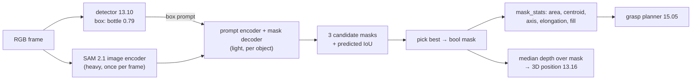

# 13.11 — Segmentation — semantic, instance and promptable (SAM)

<!-- glance:start -->
<!-- generated by tools/build.py from curriculum/syllabus.yaml — edit the syllabus, not this block -->

| | |
|---|---|
| **Track** | Main path |
| **Difficulty** | Intermediate |
| **Time** | 1 h |
| **Hardware** | none |
| **Software** | python, pytorch |
| **Prerequisites** | [13.10 Object detection with modern models](13.10-object-detection-models.md) |
| **Version-sensitive** | yes — see [curriculum/versions.yaml](../curriculum/versions.yaml) |
| **Skip if** | You produce instance masks and know promptable segmentation models. |

<!-- glance:end -->

## What you will learn

- Tell semantic, instance and promptable segmentation apart, and pick the one a robot task actually needs.
- Run DeepLabV3 (semantic) and Mask R-CNN (instance) from torchvision, and SAM 2.1 (promptable) from Hugging Face Transformers.
- Prompt SAM with a detector's box or a single click and choose among its candidate masks.
- Turn a mask into grasp-relevant numbers: area, centroid, principal axis, elongation and box fill ratio.
- Judge the SAM family on license, size and hardware: SAM 2.1 (Apache-2.0) vs SAM 3 (custom SAM License, gated, GPU).

## Why it matters

A bounding box is a crude description of a bottle lying on its side at 30°: most of the box is floor. If karmel's
gripper aims at the box centre, it may close on nothing. If the 3D localiser ([13.16](13.16-detection-to-map-position.md))
averages depth over the box, half the depth pixels belong to the wall behind. A **mask**, the exact set of pixels
belonging to the object, fixes both. The grasp planner ([15.05](../15-manipulation/15.05-grasp-planning.md)) wants
the object's centroid and long axis. Pose estimation ([15.04](../15-manipulation/15.04-object-pose-estimation.md)) wants only
the object's depth pixels. Navigation wants "which pixels are floor?".

Segmentation used to mean "train a model for your classes". Since Meta's Segment Anything (SAM), you can get a
high-quality mask for almost *anything* by pointing at it, with a click, a box or, in SAM 3, a short phrase. That changes robot
perception pipelines: a cheap detector says roughly where, SAM says exactly which pixels.

<!-- prereqs:start -->
## Prerequisites

You need these first:

- [13.10 Object detection with modern models](13.10-object-detection-models.md)

### Optional prerequisite links

None.

Check your readiness: `python course.py why 13.11`
<!-- prereqs:end -->

## Concept

**Three questions, three kinds of segmentation.**

- **Semantic segmentation** answers "what class is every pixel?": floor, wall, table, bottle. Two bottles touching become
  one blob of "bottle" pixels. Good for "where can I drive?" and "how much of the table is free?".
- **Instance segmentation** answers "which pixels belong to *each* object?": bottle #1, bottle #2, cup #1. It is a detector
  whose output also has a mask per box (Mask R-CNN, YOLO-seg). Good for picking one specific object.
- **Promptable segmentation** answers "which pixels belong to the thing *I'm pointing at*?". You give a point, a box or
  (SAM 3) a phrase. The model returns a mask. It doesn't need to know the class at all. It knows what "a coherent
  object" looks like.

**Why a prompt helps.** "Segment the object at this pixel" is ambiguous: the label on the bottle, the bottle, or the
bottle and the tray it stands on? SAM answers with up to three candidate masks (part, object, whole) plus a predicted
quality score for each. You choose. A *box* prompt removes most of the ambiguity, which is why "detector box →
SAM" is the standard robot recipe.

**Encode once, prompt many times.** SAM has a heavy image encoder (a vision transformer) and a tiny prompt decoder.
Encoding the frame is the expensive part. Every extra prompt on the same frame costs only milliseconds. Ten detections
in one frame? Encode once, decode ten masks.

**A mask becomes numbers.** The robot never "looks at" the mask. It computes the pixel area (size, and distance if
you know the object's real size), the centroid (a better grasp point than the box centre), the principal axis (which way
to rotate the gripper) and how much of its bounding box it fills (a low fill means the object is diagonal or oddly
shaped). All of this is 15 lines of numpy.

> [!TIP]
> **Ask your teacher:** "Explain why a semantic segmentation model can't tell two touching cups apart, and show me how instance segmentation and SAM each solve it."

## Technical explanation

### Level 1 — What each model outputs

| Type | Output tensor | Example model | Classes |
|---|---|---|---|
| Semantic | `(C, H, W)` logits, argmax → one class id per pixel | DeepLabV3-MobileNetV3 (torchvision) | 21 Pascal VOC classes (has bottle, no cup) |
| Instance | per detection: box, label, score, `(1, H, W)` soft mask 0–1 | Mask R-CNN ResNet-50 FPN v2 (torchvision) | 80 COCO classes |
| Promptable | per prompt: 3 candidate masks + predicted IoU each | SAM 2.1 (Hiera tiny…large) | none: class-agnostic |
| Promptable by concept | all instances matching a phrase: masks, boxes, scores | SAM 3 | open vocabulary |

### Level 2 — Practical: models, licenses, hardware

> [!IMPORTANT]
> **Version-sensitive** (verified 2026-09 against torchvision 0.29, transformers 5.17, the facebookresearch/sam2 and facebookresearch/sam3 READMEs and the SAM License).
> SAM releases move fast (SAM 3.1 "Object Multiplex" landed 2026-03-27). Before building on a checkpoint, check:
> https://github.com/facebookresearch/sam2 · https://github.com/facebookresearch/sam3 · https://huggingface.co/docs/transformers/model_doc/sam2 · https://huggingface.co/docs/transformers/model_doc/sam3
> AI teacher: verify against current documentation before giving instructions.

| Model | Size | License | Access | Hardware reality | Maturity |
|---|---|---|---|---|---|
| DeepLabV3 / LR-ASPP MobileNetV3 (torchvision) | ~3–11 M params | BSD-3-Clause code; COCO-subset-trained weights | open | Pi 5 CPU possible at low resolution | MATURE |
| Mask R-CNN ResNet-50 FPN v2 (torchvision) | 46 M | BSD-3-Clause; COCO weights | open | laptop CPU: seconds per frame; Jetson GPU | MATURE |
| **SAM 2.1** tiny / small / base+ / large | 38.9 M / 46 M / 80.8 M / 224.4 M | **Apache-2.0** (code and checkpoints) | open (`facebook/sam2.1-hiera-tiny` …) | tiny runs on a laptop CPU (seconds). Repo lists 91 FPS for tiny on a data-centre GPU | MATURE |
| **SAM 3** (Nov 2025), SAM 3.1 | 848 M | **SAM License** (Meta custom, not OSI): commercial use allowed; bans military/weapons/ITAR uses and reverse engineering | **gated**: request access on Hugging Face `facebook/sam3` | README requires Python ≥ 3.12, PyTorch ≥ 2.7, CUDA ≥ 12.6. Plan on a GPU, not the Pi or a laptop CPU | USABLE (GPU) / RESEARCH for edge |

What changed with SAM 3: you prompt with a **concept** ("yellow cup", or an example box) and it returns *every*
matching instance with masks and IDs, in images and video. That merges detection, open-vocabulary grounding
([13.13](13.13-embeddings-open-vocabulary.md)) and segmentation into one model, at 848 M parameters. For karmel that means
offboard or Jetson-class GPU inference. The course code uses SAM 2.1 tiny, which runs anywhere and is Apache-2.0. The
SAM 3 call through Transformers, per its docs, looks like this (not run for this lesson: gated weights, GPU):

```python
from transformers import Sam3Model, Sam3Processor
model = Sam3Model.from_pretrained("facebook/sam3", device_map="auto")   # after access is granted + `hf auth login`
processor = Sam3Processor.from_pretrained("facebook/sam3")
inputs = processor(images=image, text="water bottle", return_tensors="pt").to(model.device)
with torch.no_grad():
    outputs = model(**inputs)
results = processor.post_process_instance_segmentation(
    outputs, threshold=0.5, mask_threshold=0.5, target_sizes=inputs.get("original_sizes").tolist())[0]
# results["masks"], results["boxes"] (xyxy pixels), results["scores"]
```

**Detector box → SAM 2.1** ([`segment.py`](code/modern/segment.py)):

```python
from transformers import Sam2Model, Sam2Processor
processor = Sam2Processor.from_pretrained("facebook/sam2.1-hiera-tiny")
model = Sam2Model.from_pretrained("facebook/sam2.1-hiera-tiny").eval()
inputs = processor(images=img, input_boxes=[[box_xyxy]], return_tensors="pt")        # [image][box][4 numbers]
# or a click: input_points=[[[[u, v]]]], input_labels=[[[1]]]                          # 1 = "this", 0 = "not this"
with torch.inference_mode():
    outputs = model(**inputs)
masks = processor.post_process_masks(outputs.pred_masks.cpu(), inputs["original_sizes"])[0]  # (objects, 3, H, W)
best = outputs.iou_scores[0, 0].argmax()                                              # model's own quality estimate
```

The nesting depth of `input_points` (image → object → point → coordinates) is the most common source of shape errors.
Copy it from the docs, and don't guess.

### Level 3 — Mathematics: from mask to grasp numbers

Let the mask contain $N$ pixels at coordinates $(u_i, v_i)$ (u right, v down).

**Area and centroid** (zeroth and first moments):

$$A = N, \qquad \bar u = \frac{1}{N}\sum_i u_i, \qquad \bar v = \frac{1}{N}\sum_i v_i$$

**Principal axis** (second central moments): the covariance of the pixel coordinates

$$\Sigma = \frac{1}{N-1}\sum_i \begin{pmatrix} u_i - \bar u \\ v_i - \bar v \end{pmatrix}\begin{pmatrix} u_i - \bar u & v_i - \bar v \end{pmatrix}$$

has eigenvalues $\lambda_1 \ge \lambda_2$. The eigenvector of $\lambda_1$ points along the object's long axis.
**Elongation** $= \sqrt{\lambda_1/\lambda_2}$. For a uniform rectangle of length $L$ and width $W$, the variance along
the length is $L^2/12$ and across it $W^2/12$, so elongation $= L/W$.

Worked example (computed with `mask_stats`): a bottle lying on the table, drawn as a 120×30 px rectangle tilted 30°
counter-clockwise, 3,630 px after rasterisation.

$$\Sigma = \begin{pmatrix} 934.5 & -494.5 \\ -494.5 & 359.7 \end{pmatrix},\quad \lambda = (1219.1,\ 75.1)$$

Check: $120^2/12 = 1200$ and $30^2/12 = 75$. The major eigenvector is $(-0.867, 0.499)$. Flip $v$ (image y points down)
and $\operatorname{atan2}(0.499, 0.867) = 29.9°$. Elongation $\sqrt{1219.1/75.1} = 4.03 \approx 120/30$. Its bounding box is
120×86 px, so **box fill** $= 3630 / 10{,}320 = 0.35$: two-thirds of the box is table. The gripper should approach at
$29.9° + 90°$ (close across the short axis), centred on the centroid.

**Mask IoU** is the same formula as box IoU, over pixel sets: $|M_1 \cap M_2| / |M_1 \cup M_2|$. It is much stricter:
two boxes around the diagonal bottle can have IoU 0.8 while their masks overlap far less.

### Level 4 — Implementation on a robot

- **Resolution.** Masks from Mask R-CNN and SAM come back at full image size as floats. Threshold at 0.5 and store as
  `bool` (640×480 bool = 300 kB). Publish the polygon or RLE, not the raw array, over ROS ([13.15](13.15-vision-in-ros2.md)).
- **Choose among SAM's three masks deliberately.** For box prompts take the highest predicted IoU. For click prompts
  on small objects, the "whole" mask often swallows the table. Reject masks whose area is more than ~1.2× the box area.
- **Depth through the mask.** In 13.16 take the median depth of *mask* pixels, not box pixels. For a thin bottle in
  front of a wall this is the difference between 0.6 m and 1.8 m.
- **Video.** SAM 2 and SAM 3 have video predictors with memory that track a mask through frames. On a CPU-only robot, re-run
  detection + SAM every N frames and track boxes in between ([13.12](13.12-tracking.md)).
- **Budget.** On a CPU, promptable segmentation is a "when needed" operation (before a grasp), not a per-frame one.

> [!TIP]
> **Ask your teacher:** "Help me decide when karmel should call SAM: every frame, on every new track, or only right before a grasp? Use my measured latencies."

## Diagram



```text
Box vs mask for a bottle lying at 30°

 ┌───────────────────────────┐   bounding box 120×86 px = 10,320 px²
 │                   ▄▄▀▀▀   │
 │            ▄▄▀▀▀▀▀     ▄▀ │   mask = 3,630 px²  → box fill 0.35
 │     ▄▄▀▀▀▀▀     ● ▄▄▀▀    │   ● centroid = grasp centre
 │ ▄▀▀▀▀     ▄▄▀▀▀▀▀         │   long axis 29.9°  → close gripper at 119.9°
 │  ▀▄▄▄▀▀▀▀▀                │
 └───────────────────────────┘
```

## Code

[`13-computer-vision/code/modern/segment.py`](code/modern/segment.py) (setup in [13.09](13.09-cnns-for-robot-vision.md#code), plus
`python -m pip install transformers`):

```bash
cd 13-computer-vision/code/modern
python segment.py --mode semantic --threads 4       # DeepLabV3-MobileNetV3, VOC classes
python segment.py --mode instance --threads 4       # Mask R-CNN v2: masks + mask_stats for robot targets
python segment.py --mode sam                        # SSDLite box → SAM 2.1 tiny mask
python segment.py --mode sam --point 458,120        # a click on the bottle instead
```

Output images go to `code/modern/out/`. The mask statistics:

```python
def mask_stats(mask: np.ndarray) -> MaskStats:
    """Moments of a binary mask: centroid and principal axis (PCA of the pixel coordinates)."""
    vs, us = np.nonzero(mask)
    if len(us) == 0:
        raise ValueError("empty mask")
    cu, cv = us.mean(), vs.mean()
    cov = np.cov(np.stack([us - cu, vs - cv]))
    evals, evecs = np.linalg.eigh(cov)                     # ascending eigenvalues
    major = evecs[:, 1]
    # image v points down, so flip the sign to report a conventional counter-clockwise angle
    angle = float(np.degrees(np.arctan2(-major[1], major[0])))
    angle = (angle + 90.0) % 180.0 - 90.0                  # an axis has no direction: keep (-90, 90]
    box_area = (us.max() - us.min() + 1) * (vs.max() - vs.min() + 1)
    return MaskStats(int(len(us)), (float(cu), float(cv)), angle,
                     float(np.sqrt(evals[1] / max(evals[0], 1e-9))), float(len(us) / box_area))
```

## Exercise

### Exercise 13.11-E1 — Which segmentation finds the bottle? `[predict]`

Hardware: none. The sample photo shows a pizza on a dining table, an oil bottle and two glasses. Predict: (a) what
fraction of pixels the VOC-trained DeepLabV3 labels "bottle", and what it calls the pizza; (b) whether Mask R-CNN finds
the glasses. Then run `--mode semantic` and `--mode instance`, and open the images in `out/`.

### Exercise 13.11-E2 — Moments by hand `[numerical]`

Hardware: none. A mask is the set of pixels with $u \in \{10,11,12,13\}$, $v \in \{20, 21\}$ (a 4×2 block). Compute the
area, the centroid, $\Sigma$, elongation and axis angle by hand. Verify with `mask_stats`. Then predict how elongation
changes for a 40×20 block and check.

### Exercise 13.11-E3 — Box prompt vs click prompt `[coding]`

Hardware: none. Run `python segment.py --mode sam` (box from SSDLite) and `--point 458,120` (click on the bottle's
body), then click on the bottle's cap (`--point 457,40`). For each, record the three predicted IoUs, the chosen mask's
area and box fill. When does the click select a part instead of the whole object?

### Exercise 13.11-E4 — Mask-based grasp angle `[coding]`

Hardware: none, or the `camera` (optional). Photograph a bottle lying on a table at four orientations (0°, 45°, 90°,
135°, measured roughly with a protractor on the table). If you have no camera, generate the masks synthetically with
`cv2.boxPoints` + `cv2.fillPoly` as in the Level 3 example. For each image, get a mask (SAM from a box you type in) and
report `major_axis_deg`.

### Exercise 13.11-E5 — "SAM returned the wrong thing" `[debugging]`

Hardware: none. A teammate prompts SAM with a single *point* taken from wherever the detector box's top quarter is (the
bottle's neck), and the grasp planner sometimes gets a mask a fraction of the bottle's size. Other times, clicks on flat
regions return a mask much larger than the object. Using `segment.py`, reproduce both on `sample:table`: `--point 457,40`
(the stopper) and a click on the pizza's crust, for example `--point 150,300`. Propose two code-level guards that use the
detector box and show one working.

## Expected result

Measured on an Intel Core Ultra 7 255H laptop (Windows 11, torch 2.14 CPU, transformers 5.17, 2026-09), with other
workloads running. Treat latencies as upper bounds and run `python bench_cpu.py` for your own table.

**13.11-E1:** DeepLabV3-MobileNetV3: dining table **71.5%**, background 19.4%, chair 9.1%, bottle **< 0.1%** of pixels.
The pizza becomes "diningtable" because VOC has no food classes, and the oil bottle is essentially missed. Mask R-CNN v2
(threshold 0.5) finds **cup 1.00** (the glass, area ≈ 6,000 px), **bottle 0.97** (area ≈ 10,600 px, centroid (456, 119),
axis −85°, i.e. upright, elongation 1.9, box fill 0.76) and **cup 0.90** (the second glass at the right edge). Instance
segmentation with COCO classes is the right tool here. Mask R-CNN took several seconds per frame on this CPU.

**13.11-E2:** Area 8. Centroid (11.5, 20.5). $\Sigma = \begin{pmatrix}1.429 & 0 \\ 0 & 0.286\end{pmatrix}$ (with the
$N-1$ divisor: $u$ deviations ±0.5, ±1.5 twice each give $10/7$; $v$ deviations ±0.5 four times each give $2/7$).
Elongation $\sqrt{1.429/0.286} = \sqrt{5} = 2.24$, axis 0°. The 40×20 block gives elongation **2.00**: with more pixels the
discrete grid stops mattering and the ratio approaches $L/W$.

**13.11-E3:** Box prompt from SSDLite's `bottle 0.79 [412, 27, 501, 198]`: predicted IoUs about **[0.95, 0.96, 0.98]**,
chosen mask area **≈ 10,400 px** vs box area 15,100 px, box fill **0.75**, centroid (457, 117), axis −85°. That matches
Mask R-CNN within a few percent. Measured click on the body (458, 120): predicted IoUs **[0.73, 0.78, 0.83]** (less
certain than with a box), chosen mask **8,777 px**, centroid (458, 129), elongation 1.5, box fill 0.64. It is smaller and
rounder than the box-prompted mask, so part of the bottle (the neck) is missing. Click on the cap (457, 40): IoUs
**[0.19, 0.84, 0.53]**, chosen mask only **2,074 px**, elongation 1.0: SAM picked the *part* (the glass stopper and neck),
not the bottle. A click is a question with three possible answers. A box is a much clearer question. SAM 2.1 tiny took
**20–36 s** per call on this busy CPU (encoder plus decoder). On an idle laptop expect a few seconds. Jetson Orin
GPU: *approximately* well under a second.

**13.11-E4:** Within about ±5° of your protractor angles for a clearly elongated bottle (elongation > 2). The angle is
reported in (−90°, 90°], so 135° shows as −45°. For a nearly round object (elongation < 1.3) the axis is meaningless.
Your code should say so instead of rotating the gripper.

**13.11-E5:** The stopper click is measured in E3: the highest-scored mask (predicted IoU 0.84) is **2,074 px**, only
about 14% of the 15,100 px detector box. A grasp aimed at it closes on the glass stopper. The crust click was not measured
for this lesson. Expect the candidates to range from a crust fragment to the whole pizza or plate, so the top candidate's
area can far exceed any object box near the click. Guards: (1) prompt with the detector *box*, not a point (E3: 10,400 px,
box fill 0.75); (2) accept a mask only if its area is between ~0.3× and ~1.2× the box area and ≥ 90% of its pixels lie
inside the box (padded 5%), otherwise try the next candidate and report `mask-rejected` if none passes; (3) add a negative
click (label 0) on the surface the mask leaked into.

## Troubleshooting

### Symptom: SAM raises a shape or dimension error

Print the nesting of your prompt lists. Points: `[[[[u, v]]]]` = image → object → point → coordinates, labels
`[[[1]]]`. Boxes: `[[[x1, y1, x2, y2]]]` = image → box → coordinates. Compare against the Transformers SAM 2 docs example,
then add one level at a time. The warning "You are using a model of type `sam2_video` to instantiate a model of type
`sam2`" when loading `facebook/sam2.1-hiera-tiny` is expected: image inference works with it.

### Symptom: the mask is much bigger or smaller than the object

1. Print all three candidate masks' areas and predicted IoUs. Is a better candidate there?
2. Box prompt too loose (includes neighbours)? Tighten or pad by at most ~5%.
3. Low contrast (glass on a white table, black mug on black floor)? Add a positive click inside the object and a negative
   click outside, or improve lighting ([07.08](../07-sensors/07.08-rgb-cameras.md)).
4. Wrong coordinates? Draw the prompt on the image. Swapped x/y or coordinates from a resized image are common.

### Symptom: semantic segmentation labels everything as one class

Check the class list first (`weights.meta["categories"]`): VOC has 21 classes. Objects outside it are forced into the
closest one or background. Then check the input: the torchvision segmentation transform resizes to 520 px. A tiny object
there covers a handful of pixels.

### Symptom: segmentation is far too slow for the control loop

Don't run it per frame. Measure encoder vs decoder time separately. Cache the image embedding and decode several
prompts. Segment only right before a grasp, run on the Jetson GPU or offboard, or fall back to the detector box for
coarse approach and segment at close range.

## Common mistakes

- **Using semantic segmentation to pick one object.** Touching objects merge. Use instance or promptable masks.
- **Averaging depth over the box instead of the mask**, which mixes object and background depth.
- **Taking SAM's first mask instead of the best-scored one**, or trusting the best score blindly without an area check.
- **Deploying SAM 3 like SAM 2.** It is ~20× larger, gated, and under a different, non-OSI license with use restrictions.
  Read the SAM License before a product decision.
- **Computing orientation for round objects.** An axis is only meaningful when elongation is clearly above 1.
- **Forgetting that angles in image coordinates have y pointing down.** Flip the sign or you rotate the gripper the wrong way.

## Knowledge check

1. For "which part of the floor is free to drive on?" and for "pick up the left one of two touching cups", which
   segmentation type fits each, and why?
   <details><summary>Answer</summary>

   Floor: semantic. Every pixel needs a class and individual floor "instances" don't exist. Two touching cups:
   instance or promptable. Semantic would merge them into one "cup" blob with no way to pick the left one.
   </details>

2. Why does SAM return three masks for a single click, and how should a robot choose?
   <details><summary>Answer</summary>

   A click is ambiguous: part, object or larger group. SAM outputs a mask for each interpretation plus a predicted IoU.
   Use a box prompt when you have one. Then take the highest predicted IoU, subject to sanity checks such as area relative
   to the detector box and fraction inside the box.
   </details>

3. A mask has covariance eigenvalues 900 and 100 (px²). Elongation? If the object is a uniform rectangle, estimate its
   length and width.
   <details><summary>Answer</summary>

   Elongation $\sqrt{900/100} = 3$. $L^2/12 = 900 \Rightarrow L = \sqrt{10800} \approx 104$ px. $W^2/12 = 100 \Rightarrow
   W \approx 34.6$ px. Ratio 3 ✓.
   </details>

4. A bottle's box fill ratio is 0.35. What does that tell you, and what could go wrong if you used the box centre and box depth?
   <details><summary>Answer</summary>

   The object occupies only a third of its box: it is diagonal or thin. The box centre may not lie on the object (for an
   L-shape or a lying bottle it can be on the table), and depth averaged over the box is dominated by the background.
   The grasp misses or the 3D position is wrong. Use the mask centroid and mask depth.
   </details>

5. Your team wants SAM 3 on karmel's Raspberry Pi 5 for "segment the red cup" commands. List three concrete obstacles.
   <details><summary>Answer</summary>

   (1) Size/compute: 848 M parameters and a README that assumes CUDA ≥ 12.6. A Pi 5 CPU would take far too long per frame
   and may not fit comfortably in RAM with the rest of the stack. (2) Access: checkpoints are gated on Hugging Face and
   need an approved account. (3) License: the SAM License is custom, with use restrictions and conditions to review for
   a product. Alternatives: run it offboard or on a Jetson-class GPU, or use Grounding DINO/OWLv2 (13.13) + SAM 2.1 tiny.
   </details>

6. You prompt SAM with a box and get a mask 3× the box area. Predict the likely cause and the fix.
   <details><summary>Answer</summary>

   The selected candidate is the "whole" interpretation that leaked into a similar-coloured neighbour or the surface.
   Choose another candidate whose area is ≤ box area, clip the mask to a slightly padded box, add a negative click on the
   leaked region, and log the case.
   </details>

## Practical challenge

**Grasp description for a lying bottle.** Write `describe_grasp(img, box) -> dict` that prompts SAM 2.1 tiny with a
detector box, validates the mask, and returns centroid (u, v), gripper closing angle in degrees (perpendicular to the
long axis), elongation, box fill, and a `confidence` string (`ok`, `round-object`, `mask-rejected`).

Acceptance criteria:
- Tested on at least 8 images (real photos with the `camera` or phone, or synthetic masks): bottles at ≥ 4 orientations,
  one ball, one bad prompt.
- Angle error ≤ 10° versus a hand-measured angle for elongated objects. The ball reports `round-object`.
- The bad prompt (box covering two objects, or a box on empty table) reports `mask-rejected` instead of a wrong grasp.
- Median latency of encoder and decoder measured separately, with a one-sentence plan for when karmel should call it.

## You can skip this if…

You answer knowledge-check questions 2, 3 and 5 correctly without looking, and you have produced instance or SAM masks in
your own code and derived a centroid and orientation from them. Then:

`python course.py skip 13.11 --reason "produce instance/SAM masks and derive grasp geometry from them"`

## Go deeper

- https://github.com/facebookresearch/sam2 — SAM 2 / 2.1 code, checkpoint sizes and speeds, image and video predictors (Apache-2.0).
- https://huggingface.co/docs/transformers/model_doc/sam2 — SAM 2 in Transformers: point, box and multi-object prompt examples used here.
- https://github.com/facebookresearch/sam3 — SAM 3 / 3.1: promptable concept segmentation, requirements and the SAM License. Transformers docs: https://huggingface.co/docs/transformers/model_doc/sam3
- https://arxiv.org/abs/2304.02643 — Kirillov et al., *Segment Anything*: read the task definition and the model (heavy encoder, light decoder).
- https://arxiv.org/abs/2408.00714 — Ravi et al., *SAM 2: Segment Anything in Images and Videos*: the streaming memory that tracks masks through video.
- https://arxiv.org/abs/2511.16719 — Carion et al., *SAM 3: Segment Anything with Concepts*.
- https://docs.pytorch.org/vision/stable/models.html — torchvision semantic segmentation (DeepLabV3, LR-ASPP) and Mask R-CNN tables.
- https://docs.opencv.org/4.x/d6/d00/tutorial_py_root.html — OpenCV tutorials: contours and image moments, the classical tools for mask geometry.

## Progress checkpoint

- [ ] I can explain semantic vs instance vs promptable segmentation and pick one for a robot task.
- [ ] I can run Mask R-CNN and SAM 2.1 (box and point prompts) and choose among candidate masks with sanity checks.
- [ ] I can compute area, centroid, principal axis, elongation and box fill from a mask, and use them for a grasp.
- [ ] I can state SAM 2.1's and SAM 3's license, access and hardware constraints.

`python course.py complete 13.11` (exercises done) · `python course.py master 13.11` (challenge done) ·
`python course.py struggle 13.11 "what was hard"`

Next: [13.12 — Tracking objects over time](13.12-tracking.md).
