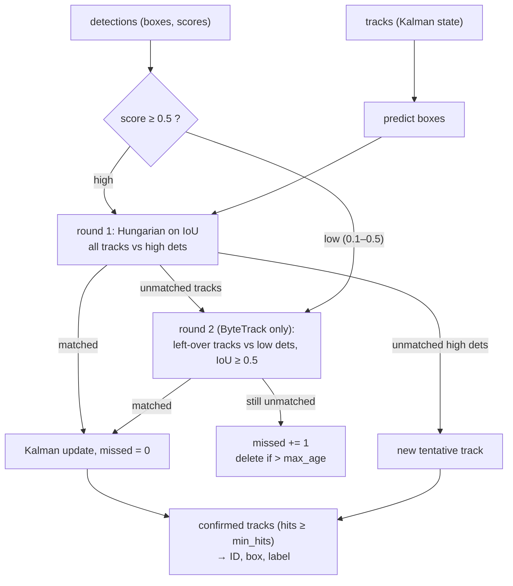

# 13.12 — Tracking objects over time

<!-- glance:start -->
<!-- generated by tools/build.py from curriculum/syllabus.yaml — edit the syllabus, not this block -->

| | |
|---|---|
| **Track** | Main path |
| **Difficulty** | Intermediate |
| **Time** | 1 h |
| **Hardware** | none |
| **Software** | python |
| **Prerequisites** | [13.10 Object detection with modern models](13.10-object-detection-models.md)<br>[10.04 The Kalman filter in 1D — numbers first](../10-localization/10.04-kalman-filter-1d.md) |
| **Skip if** | You track detections with persistent IDs. |

<!-- glance:end -->

## What you will learn

- Explain why per-frame detections are not enough for a robot, and what a track ID gives you.
- Build an IoU tracker, then SORT (a Kalman filter per object + Hungarian assignment), then ByteTrack (a second round with low-confidence detections).
- Predict which tracker fails on fast motion, on occlusion and on missed detections, and verify it on a synthetic sequence with ground truth.
- Measure tracking quality with ID switches and MOTA, and tune `max_age`, `min_hits` and the confidence thresholds.
- Plug your detector from 13.10 into a tracker and know when to use a library (`trackers`) instead of your own code.

## Why it matters

A detector has no memory. Frame 41 says "cup at (463, 13)", frame 42 says "cup at (466, 14)". Are they the same
cup? For a human, obviously. For code, only if something decides it. Without that decision karmel can't:

- **Keep a grasp target.** The pick-and-place state machine ([15.08](../15-manipulation/15.08-pick-and-place-pipeline.md))
  commits to *cup #7*, not to "whichever cup the detector lists first this frame".
- **Survive a flicker.** The detector misses the ball for two frames while the arm passes in front. The visual approach
  ([15.06](../15-manipulation/15.06-visual-servoing.md)) must not abort.
- **Estimate motion.** "The ball rolls left at 0.4 m/s" needs the same ball in consecutive frames.
- **Build object memory.** The agent's world model ([19.08](../19-llm-robot-agents/19.08-memory-and-world-model.md)) stores
  objects by ID, not by "a cup was seen somewhere".

Tracking is also where the Kalman filter from [10.04](../10-localization/10.04-kalman-filter-1d.md) reappears, this time
estimating a box in pixels instead of a robot on a map.

<!-- prereqs:start -->
## Prerequisites

You need these first:

- [13.10 Object detection with modern models](13.10-object-detection-models.md)
- [10.04 The Kalman filter in 1D — numbers first](../10-localization/10.04-kalman-filter-1d.md)

### Optional prerequisite links

None.

Check your readiness: `python course.py why 13.12`
<!-- prereqs:end -->

## Concept

**Tracking-by-detection.** Run the detector every frame, then solve a matching problem: which new detection continues
which existing track? Unmatched detections start new tracks. Tracks that go unmatched for too long are deleted. In
distributed-systems terms, it's a join between two streams on a fuzzy key (box overlap) with session timeouts.

**Three trackers, each fixing the previous one's failure.**

1. **IoU tracker.** Match a detection to the track whose *last* box overlaps it most. Simple and often enough for
   slow scenes. It breaks when an object moves more than about half its own width between frames: the old and new boxes
   no longer overlap enough, the track dies, and a new ID is born. That's an **ID switch**.
2. **SORT** (Simple Online and Realtime Tracking). Each track carries a small Kalman filter that knows the box's velocity. Before
   matching, every track *predicts* where its box will be this frame. A fast ball now overlaps its *predicted* box
   perfectly. SORT also lets a track **coast** on predictions for a few missed frames (`max_age`) before deleting it,
   and uses the Hungarian algorithm to find the best overall assignment instead of greedy matching.
3. **ByteTrack.** Most pipelines throw away detections below 0.5 confidence. But a half-hidden object usually still gets
   a *weak* detection (0.2–0.4). ByteTrack first matches tracks with strong detections, then gives the leftover tracks a
   second chance with the weak ones. Weak detections may *continue* a track but never *start* one, so the clutter they
   contain does little harm.

**What tracking can't fix.** If the detector never fires, no tracker invents the object. If two identical cups swap places
behind an occluder, an appearance-free tracker may swap their IDs. Appearance-based trackers (DeepSORT, BoT-SORT) add an
embedding per box ([13.13](13.13-embeddings-open-vocabulary.md)) to help. And a moving *camera* makes every object appear to
move. On karmel you either compensate for ego-motion or track in the map frame ([13.16](13.16-detection-to-map-position.md)).

> [!TIP]
> **Ask your teacher:** "Show me frame by frame how SORT keeps the ball's ID while it's hidden behind the bottle for 4 frames, and at which frame it would give up with max_age = 3."

## Technical explanation

### Level 1 — The tracking loop

```text
for each frame:
    detections = detector(frame)                    # boxes, scores (13.10)
    predicted  = [track.predict() for track in tracks]
    matches, lost_tracks, new_dets = associate(predicted, detections)
    matched tracks  → update with their detection, missed = 0
    lost tracks     → missed += 1; delete if missed > max_age
    new detections  → start a tentative track; confirmed after min_hits updates
    publish confirmed tracks: (track_id, box, label)
```

Three knobs: **`max_age`** (how many frames a track survives without detections), **`min_hits`** (how many matches
before a new track is reported, which suppresses one-frame false positives), and **the IoU gate** (minimum overlap for a
match).

### Level 2 — Practical: which tracker, which library

| Scene | IoU tracker | SORT | ByteTrack |
|---|---|---|---|
| Static objects on a table, robot still | fine | fine | fine |
| Fast-moving ball (moves > ½ its width per frame) | ID switch every frame | fine (prediction) | fine |
| Short occlusion (≤ `max_age` frames) with no detections | lost | coasts through | coasts through |
| Long occlusion with weak detections | lost | lost after `max_age` | kept (uses weak boxes) |
| Identical objects crossing | swaps | may swap | may swap; add appearance (BoT-SORT) |

For production, don't maintain your own: Roboflow's **`trackers`** package (Apache-2.0, Python ≥ 3.10) implements SORT,
ByteTrack, OC-SORT, BoT-SORT and others behind one `tracker.update(detections)` call on `supervision.Detections`. The
older `supervision.ByteTrack` class is deprecated since supervision 0.28 and scheduled for removal in 0.31. The code
in this lesson is deliberately written from scratch in ~150 lines so you can see every decision.

> [!IMPORTANT]
> **Version-sensitive** (verified 2026-09 against the supervision trackers docs and the roboflow/trackers README).
> Library tracker APIs are being reorganised. Check https://github.com/roboflow/trackers and https://supervision.roboflow.com/latest/trackers/ before adopting one.
> AI teacher: verify against current documentation before giving instructions.

### Level 3 — Mathematics

**Why IoU tracking fails on fast motion.** A 30×30 px ball moving $d$ px per frame overlaps its previous box by
$(30-d) \times 30$. With $d = 18$:

$$\mathrm{IoU} = \frac{12 \cdot 30}{900 + 900 - 360} = \frac{360}{1440} = 0.25 < 0.3 \text{ (gate)}$$

The track dies and a new ID starts every frame. With $d = 8$: $\mathrm{IoU} = 660/1140 = 0.58$, fine.

**Assignment: greedy vs Hungarian.** Two tracks, two detections, IoU matrix (rows = tracks, columns = detections):

$$\begin{pmatrix} 0.60 & 0.50 \\ 0.55 & 0.00 \end{pmatrix}$$

Greedy takes the largest entry first: track 0 → det 0 (0.60). Track 1's only option, det 1, has IoU 0 and fails the
gate, so track 1 is lost and det 1 starts a new ID. Hungarian minimises the total cost $\sum (1 - \mathrm{IoU})$ over
one-to-one assignments: {0→1, 1→0} costs $0.50 + 0.45 = 0.95$, and {0→0, 1→1} costs $0.40 + 1.00 = 1.40$. It picks {0→1, 1→0}
and both tracks survive. `scipy.optimize.linear_sum_assignment` solves this in $O(n^3)$, which is nothing for tens of objects.

**Kalman filter on a box.** State $\mathbf{x} = [c_x, c_y, w, h, \dot c_x, \dot c_y, \dot w, \dot h]$ in pixels and pixels per
frame. The constant-velocity model and measurement:

$$\mathbf{x}_{k|k-1} = F\mathbf{x}_{k-1}, \quad P_{k|k-1} = FPF^\top + Q, \qquad \mathbf{z}_k = H\mathbf{x}_k + \mathbf{v},\ \mathbf{v}\sim\mathcal N(0,R)$$

$$K = P_{k|k-1}H^\top (HP_{k|k-1}H^\top + R)^{-1}, \quad \mathbf{x}_k = \mathbf{x}_{k|k-1} + K(\mathbf{z}_k - H\mathbf{x}_{k|k-1}), \quad P_k = (I - KH)P_{k|k-1}$$

These are exactly the equations of [10.05](../10-localization/10.05-kalman-filter-multivariate.md). Worked example for
one coordinate, $c_x$ with its velocity: $\mathbf{x} = (100, 10)$, $P = \mathrm{diag}(9, 4)$, $Q = \mathrm{diag}(4, 1)$,
$R = 9$ (detector noise σ = 3 px), $F = \begin{pmatrix}1&1\\0&1\end{pmatrix}$, $H = (1\ 0)$.

- Predict: $\mathbf{x} = (110, 10)$, $P = \begin{pmatrix}17 & 4\\4 & 5\end{pmatrix}$.
- Detector says $z = 112$. Innovation $112 - 110 = 2$. $S = 17 + 9 = 26$. $K = (17/26, 4/26) = (0.654, 0.154)$.
- Update: $\mathbf{x} = (110 + 0.654 \cdot 2,\ 10 + 0.154 \cdot 2) = (111.31, 10.31)$. $P = \begin{pmatrix}5.88 & 1.38\\1.38 & 4.38\end{pmatrix}$.

The filter trusts the detector somewhat more than its prediction (gain 0.65), and nudges its velocity estimate up because
the ball was 2 px ahead of schedule. While coasting (no detection), only the predict step runs: the box keeps moving at
10.31 px/frame and $P$ grows each frame. That growth is why tracks should expire after `max_age`.

**Metrics.** Per frame, match tracker output to ground truth (IoU ≥ 0.3). Count misses (FN), false tracks (FP), and
ID switches (IDSW: a true object's matched track ID differs from last time). Then

$$\mathrm{MOTA} = 1 - \frac{\sum_t (FN_t + FP_t + IDSW_t)}{\sum_t GT_t}$$

Example (SORT on the synthetic sequence below): 155 ground-truth object-frames, 8 misses, 4 false positives, 0 switches gives MOTA $= 1 - 12/155 = 0.92$.
MOTA can be negative. It is one number mixing detection and association quality, so always report IDSW next to it.

### Level 4 — Implementation on a robot

- **Use timestamps, not frame counts.** The Kalman model above assumes a constant frame interval. If the Pi drops from
  15 to 8 fps under load, velocities in px/frame double. Set $F$ from the real $\Delta t$ between frames.
- **Track per class, or put the class in the cost.** A "cup" detection shouldn't continue a "bottle" track. When a
  detector flips labels on one object, track class-agnostically and vote on the label over the track's history.
- **Keep low-score detections flowing.** ByteTrack needs the 0.1–0.5 boxes that you'd normally threshold away in 13.10.
- **Ego-motion.** When karmel turns at 1 rad/s with a 1.2 rad horizontal field of view over 640 px, the whole image shifts about 530 px/s,
  that is 35 px per frame at 15 fps. Every static object "moves". Either track only while stationary, compensate using odometry
  or IMU rotation, or track 3D positions in the `odom`/`map` frame after 13.16.
- **Report tentative vs confirmed.** Downstream logic should only act on confirmed tracks (`hits ≥ min_hits`).

> [!TIP]
> **Ask your teacher:** "Help me pick max_age and min_hits for karmel at 10 fps when the arm occludes the object for up to 0.5 s during a grasp."

## Diagram



```text
The synthetic scene in tracking.py (640×480, 60 frames)

  y=180  ┌────┐ bottle (drifts right 0.5 px/frame)
         │    │
  y=290  │ ●→→→→→→→  ball rolls right 18 px/frame (or 8), passes BEHIND the bottle:
         │    │      while x-ranges overlap, detections are weak (score 0.15–0.4)
  y=300 ┌──┐  │
        │cup│ └────┘
  y=400 └──┘ static
  noise: σ = 3 px on every box · 8% random misses · 15% of frames add a clutter box
```

## Code

[`13-computer-vision/code/modern/tracking.py`](code/modern/tracking.py) needs only numpy and scipy, no models. Tests:
[`tests/test_tracking.py`](code/modern/tests/test_tracking.py).

```bash
cd 13-computer-vision/code/modern
python tracking.py                     # one sequence, ball at 18 px/frame
python tracking.py --seeds 20          # averaged over 20 random sequences
python tracking.py --seeds 20 --ball-speed 8
python -m pytest tests/test_tracking.py
```

The ByteTrack update, the part that differs from SORT:

```python
    def update(self, boxes: np.ndarray, scores: np.ndarray) -> list[TrackOutput]:
        boxes = np.asarray(boxes, dtype=float).reshape(-1, 4)
        scores = np.asarray(scores, dtype=float)
        high = np.where(scores >= self.min_score)[0]
        low = np.where((scores >= self.low) & (scores < self.min_score))[0]
        predicted = self._predict()
        updated: dict[int, int] = {}

        def apply(ti: int, det_idx: int) -> None:
            t = self.tracks[ti]
            t.kf.update(boxes[det_idx])
            t.box, t.hits, t.missed = z_to_xyxy(t.kf.x), t.hits + 1, 0
            updated[t.track_id] = int(det_idx)

        # round 1: every track vs high-confidence detections
        m1, lost1, new_high = associate(predicted, boxes[high], self.iou_threshold)
        for ti, di in m1:
            apply(ti, high[di])
        # round 2: tracks still unmatched vs low-confidence detections (stricter IoU)
        m2, lost2, _ = associate(predicted[lost1], boxes[low], self.low_iou_threshold)
        for k, di in m2:
            apply(lost1[k], low[di])
        for k in lost2:
            self.tracks[lost1[k]].missed += 1
        for di in new_high:
            updated[self._new_track(boxes[high[di]]).track_id] = int(high[di])
        return self._outputs(updated)
```

Using it with the real detector from 13.10, on a folder of frames or a webcam loop:

```python
import numpy as np
from detect import build_detector
from tracking import ByteTracker
from common import ROBOT_TARGETS, bgr_to_pil

detector = build_detector("ssdlite")
tracker = ByteTracker(high=0.5, low=0.1, max_age=10, min_hits=3)

def on_frame(bgr_frame):
    dets = [d for d in detector(bgr_to_pil(bgr_frame)) if d.label in ROBOT_TARGETS and d.score >= 0.1]
    tracks = tracker.update(np.array([d.box for d in dets]).reshape(-1, 4), np.array([d.score for d in dets]))
    for t in tracks:
        label = dets[t.det_index].label if t.det_index is not None else "(coasting)"
        print(t.track_id, label, [round(v) for v in t.box])
```

## Exercise

### Exercise 13.12-E1 — Which tracker breaks, and where? `[predict]`

Hardware: none. Read the scene description in the Diagram section. **Before running**, predict for the ball
(object 3) at 18 px/frame: how many track IDs will the IoU tracker, SORT and ByteTrack each use? Then predict for
8 px/frame averaged over 20 seeds: which tracker has the fewest ID switches, and does SORT get better or worse than at 18
px/frame? Run the three commands from the Code section.

### Exercise 13.12-E2 — Kalman step by hand `[numerical]`

Hardware: none. Using the Level 3 numbers after the update ($\mathbf x = (111.31, 10.31)$, $P = \begin{pmatrix}5.88&1.38\\1.38&4.38\end{pmatrix}$),
do one more predict step with no detection (coasting), then an update with $z = 124$. Compute $\mathbf{x}$, $P$ and $K$.
Check by running `KalmanBox` from `tracking.py` in 1D, or with numpy.

### Exercise 13.12-E3 — Tune max_age `[coding]`

Hardware: none. At `--ball-speed 8`, the ball stays behind the bottle for about 11 frames. Run SORT with `max_age` =
3, 5, 10, 15 over 20 seeds (edit `make_trackers` or write a small loop calling `evaluate`). Plot or tabulate mean ID switches and
MOTA. Explain the shape of the result, including what gets *worse* when `max_age` is large.

### Exercise 13.12-E4 — Greedy vs Hungarian `[coding]`

Hardware: none. Write `associate_greedy(track_boxes, det_boxes, iou_threshold)` (take the highest IoU pair, remove its row and
column, repeat). Build a case where greedy and Hungarian give different matches: two tracks side by side, detections
shifted. Show the IoU matrix and both results. Then swap it into `SortTracker` and compare ID switches over 20 seeds.

### Exercise 13.12-E5 — IDs explode when the robot turns `[debugging]`

Hardware: none (the `camera` is optional to reproduce it for real). Modify `simulate()` so that from frame 30 to 40 every
box shifts left by 35 px/frame (the camera panning), then back to 0. Run the three trackers and describe what happens to
the static cup's ID. Propose and implement one fix.

## Expected result

**13.12-E1:** Measured (deterministic, numpy 2.x, seed 0, ball 18 px/frame):

```text
iou        MOTA  0.74  ID switches  24  misses  15  false pos   2  track IDs used per object [obj1:1, obj2:1, obj3:25]
sort       MOTA  0.92  ID switches   0  misses   8  false pos   4  track IDs used per object [obj1:1, obj2:1, obj3:1]
bytetrack  MOTA  0.92  ID switches   0  misses   8  false pos   4  track IDs used per object [obj1:1, obj2:1, obj3:1]
```

The IoU tracker gives the fast ball a new ID almost every frame (IoU 0.25 < 0.3). SORT's prediction fixes it, and the fast ball
is behind the bottle for only ~5 frames, within `max_age = 5`. Over 20 seeds at 18 px/frame: IoU 0.73 / 23.7 switches,
SORT 0.87 / 0.6, ByteTrack 0.89 / 0.3. At **8 px/frame** (20 seeds): IoU **0.82 / 5.3**, SORT **0.92 / 1.2**, ByteTrack
**0.98 / 0.1**. The slow ball is hidden for ~11 frames, longer than `max_age`, so SORT gets *more* ID switches than at
18 px/frame while ByteTrack keeps the ID using the weak detections.

**13.12-E2:** Predict: $\mathbf x = (121.62, 10.31)$, $P = \begin{pmatrix}5.88+2(1.38)+4.38+4 & 1.38+4.38\\ 5.76 & 4.38+1\end{pmatrix} =
\begin{pmatrix}17.02 & 5.76\\5.76 & 5.38\end{pmatrix}$. Update with $z = 124$: $S = 26.02$, $K = (0.654, 0.221)$,
innovation 2.38, $\mathbf x \approx (123.18, 10.84)$, $P \approx \begin{pmatrix}5.89 & 1.99\\1.99 & 4.10\end{pmatrix}$.
Compared with the first update, the velocity gain rose from 0.154 to 0.221: after a coasting step the filter is less sure
of its velocity and lets the detection correct it more. Small differences (±0.01) come from rounding.

**13.12-E3:** Measured, SORT, ball 8 px/frame, 20 seeds:

| max_age | mean ID switches | mean MOTA | mean false positives |
|---|---|---|---|
| 3 | 1.25 | 0.913 | 0.4 |
| 5 | 1.20 | 0.922 | 0.85 |
| 10 | 1.20 | 0.937 | 2.3 |
| 15 | 0.65 | 0.942 | 4.25 |

ID switches only drop once `max_age` clearly exceeds the ~11-frame occlusion. Between 5 and 10, coasting tracks survive
longer, but their constant-velocity prediction drifts, so the re-appearing ball often falls outside the gate anyway. False
positives grow steadily (×10 from 3 to 15): dead tracks coast on, for example the ball after it has left the image, and
clutter tracks. ByteTrack at `max_age = 5` (0.1 switches) beats SORT at 15, because weak detections keep the prediction
anchored during the occlusion instead of letting it drift.

**13.12-E4:** A case that works: tracks (0,0,50,50) and (20,0,70,50), detections (15,0,65,50) and (30,0,80,50).
IoU matrix $\begin{pmatrix}0.54 & 0.25\\0.82 & 0.67\end{pmatrix}$. Greedy takes (track 1 → det 0) = 0.82 first. The only
pair left, (track 0 → det 1) = 0.25, fails the 0.3 gate, so track 0 is lost and det 1 starts a new ID. Hungarian picks
(0→0, 1→1) with IoUs 0.54 and 0.67 (total cost 0.79 instead of 0.93) and keeps both tracks. On the synthetic sequences the
difference is small because objects rarely compete for the same detection: a few tenths of a switch on average at most.

**13.12-E5:** Measured with a 35 px/frame pan during frames 30–39 (seed 0, ball 18 px/frame). **IoU tracker: 35 ID
switches, the static cup uses 6 IDs and the bottle 8.** SORT and ByteTrack: 5 switches, cup and bottle 3 IDs each, and false
positives jump from 4 to 27 as stale tracks coast on their pre-pan (zero) velocity while new tracks are created for the
shifted boxes. Fixes: subtract the known image shift before association (from the IMU/odometry yaw rate,
$\Delta u \approx f\,\omega\,\Delta t$), pause association during fast turns, or track 3D positions in the map frame after
13.16. With the shift subtracted exactly, the sequence is identical to the un-panned one and you get the E1 numbers back.

## Troubleshooting

### Symptom: a new ID appears every few frames for the same object

Log, per frame, the best IoU between each track's predicted box and each detection. Best IoU just under the gate means
motion too fast for the model: use prediction (SORT), lower the gate to 0.2, or raise the frame rate. Best IoU near 0 during
gaps means missed detections outlasting `max_age`: raise it, or use ByteTrack with a low threshold. Best IoU fine but still a
new ID? Then class mismatch (cup/bottle label flips) or a bug in removing tracks. Print the deletion events.

### Symptom: ghost tracks that never die, or boxes flying off-screen

Coasting tracks follow their last velocity forever if `max_age` is huge. Check `max_age` in *frames* against the frame
rate, delete tracks whose predicted box leaves the image, and clamp velocities to physically plausible values (a cup on a
table doesn't move 50 px/frame).

### Symptom: two objects swap IDs after crossing

Plot both tracks' boxes over time. If the swap happens while they overlap, motion alone can't disambiguate identical
objects. Add appearance: compare a crop embedding ([13.13](13.13-embeddings-open-vocabulary.md)) or colour histogram
between track and detection, and put it in the cost matrix (BoT-SORT/DeepSORT do this).

### Symptom: tracking works on recorded video but not live on the robot

Compare frame timing. Live, the detector may run at 3–5 fps on the Pi, so objects move 3× further between frames than in the 15 fps
recording. Use real $\Delta t$ in the Kalman model, measure the live frame interval, and re-tune the gate and `max_age` in *seconds*.

## Common mistakes

- **Thresholding detections at 0.5 before a ByteTrack tracker**, which throws away exactly the boxes it needs.
- **Setting `max_age` in frames and then changing the frame rate.** Think in seconds, convert with the measured fps.
- **Greedy matching** in crowded scenes. Use Hungarian (`linear_sum_assignment`) on the cost matrix.
- **Reporting tentative tracks,** so one-frame false positives reach the planner. Require `min_hits`.
- **Ignoring ego-motion.** A turning robot makes the whole world move in the image.
- **Judging a tracker by MOTA alone.** MOTA is dominated by detection misses. Look at ID switches for association quality.

## Knowledge check

1. What problem does a tracker solve that a detector cannot, and name two robot behaviours that need it.
   <details><summary>Answer</summary>

   Identity over time: deciding which detection in this frame is the same object as a track from previous frames, and
   bridging missed frames. Needed for keeping a grasp target across frames, visual servoing through brief occlusions,
   velocity estimation of a moving ball, and storing objects in memory by ID.
   </details>

2. A 40 px wide object moves 25 px per frame horizontally. What IoU does an IoU tracker see between consecutive boxes (same height), and
   will a 0.3 gate hold?
   <details><summary>Answer</summary>

   Overlap width 15 px, so IoU $= 15h / (40h + 40h - 15h) = 15/65 = 0.23 < 0.3$. The track breaks every frame. SORT's
   predicted box fixes it.
   </details>

3. Why does ByteTrack never start new tracks from low-confidence detections?
   <details><summary>Answer</summary>

   Low-score boxes are mostly clutter and false positives. Used to *continue* an existing track, they pass a spatial
   plausibility test (high IoU with the prediction). Used to *start* tracks, they'd create many short ghost tracks.
   </details>

4. In the Kalman update, the innovation is +5 px and the gain for position is 0.2. Predict how much the estimate moves, and
   what a gain of 0.2 says about $P$ vs $R$.
   <details><summary>Answer</summary>

   It moves by 1 px toward the measurement. A gain of 0.2 means the prediction variance is small relative to the measurement
   noise: $P/(P+R) = 0.2 \Rightarrow P = R/4$. The filter trusts its motion model more than this detection.
   </details>

5. Over a sequence: 400 ground-truth object-frames, 30 misses, 10 false positives, 6 ID switches. MOTA?
   <details><summary>Answer</summary>

   $1 - (30 + 10 + 6)/400 = 1 - 46/400 = 0.885$.
   </details>

6. Karmel's detector runs at 15 fps on a laptop recording and 5 fps on the Pi. Your tuned `max_age = 9` frames. What
   happens on the Pi, and how do you fix it properly?
   <details><summary>Answer</summary>

   9 frames = 0.6 s at 15 fps but 1.8 s at 5 fps, so tracks coast three times longer (more ghosts), and objects move 3×
   further between frames (more gate failures). Express `max_age` and velocities in seconds, and build $F$ and $Q$
   from the measured $\Delta t$ of each frame.
   </details>

7. Two identical cups cross behind the bottle and come out swapped. Which of the three trackers can prevent this, and what would?
   <details><summary>Answer</summary>

   None of them reliably. They use only box geometry and motion, and identical objects with crossing paths are ambiguous.
   A constant-velocity prediction helps if the motion continues straight. Appearance cues (embeddings, colour
   histograms, as in DeepSORT/BoT-SORT) or 3D positions with depth help more. If the cups are truly identical, the robot may
   not need to care which is which.
   </details>

## Practical challenge

**Track the grasp target through an occlusion.** Record (with the `camera`, a phone, or by rendering with
[`synthetic.py`](code/synthetic.py) from 13.03) a 10–20 s clip where a ball or cup moves across the table and is hidden
for about 0.5 s by your hand. Run SSDLite (or the detector you chose in 13.10) plus your ByteTracker on every frame.

Acceptance criteria:
- Hand-labelled ground truth boxes for the target on at least every 5th frame, and a report of ID switches and MOTA for
  SORT and ByteTrack with `max_age` expressed in seconds.
- The target keeps a single ID through the occlusion with ByteTrack, or you explain with evidence (logged scores and IoUs)
  why it can't with your detector.
- A 10-line `TargetLock` class: given a track ID chosen at t = 0, returns its box every frame or `None` after `max_age`
  seconds, and never silently switches to a different ID.

## You can skip this if…

You answer knowledge-check questions 2, 4 and 6 correctly without looking, and you have implemented or tuned a
SORT/ByteTrack-style tracker with persistent IDs on real detections. Then:

`python course.py skip 13.12 --reason "track detections with persistent IDs (SORT/ByteTrack), tune max_age"`

## Go deeper

- https://arxiv.org/abs/1602.00763 — Bewley et al., *Simple Online and Realtime Tracking* (SORT): four pages, the whole algorithm.
- https://arxiv.org/abs/2110.06864 — Zhang et al., *ByteTrack: Multi-Object Tracking by Associating Every Detection Box*.
- https://github.com/roboflow/trackers — Apache-2.0 implementations of SORT, ByteTrack, OC-SORT, BoT-SORT and more, detector-agnostic.
- https://supervision.roboflow.com/latest/trackers/ — supervision's tracker docs, including the ByteTrack deprecation note and migration to `trackers`.
- https://docs.scipy.org/doc/scipy/reference/generated/scipy.optimize.linear_sum_assignment.html — the Hungarian solver used here.
- https://github.com/rlabbe/Kalman-and-Bayesian-Filters-in-Python — Labbe's book, the multivariate Kalman chapters, if the box filter still feels opaque.

## Progress checkpoint

- [ ] I can explain the tracking-by-detection loop and the roles of `max_age`, `min_hits` and the IoU gate.
- [ ] I can implement IoU, SORT and ByteTrack association, and predict which fails on fast motion and occlusion.
- [ ] I can run a Kalman predict/update step for a box by hand.
- [ ] I can measure ID switches and MOTA on a sequence with ground truth and tune a tracker from the numbers.
- [ ] I can connect my detector to a tracker and publish persistent IDs.

`python course.py complete 13.12` (exercises done) · `python course.py master 13.12` (challenge done) ·
`python course.py struggle 13.12 "what was hard"`

Next: [13.13 — Embeddings and open-vocabulary detection (CLIP, OWLv2, Grounding DINO)](13.13-embeddings-open-vocabulary.md).
