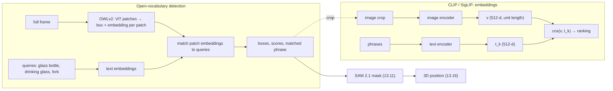

# 13.13 — Embeddings and open-vocabulary detection (CLIP, OWLv2, Grounding DINO)

<!-- glance:start -->
<!-- generated by tools/build.py from curriculum/syllabus.yaml — edit the syllabus, not this block -->

| | |
|---|---|
| **Track** | Main path |
| **Difficulty** | Advanced |
| **Time** | 1 h |
| **Hardware** | none |
| **Software** | python, pytorch, transformers |
| **Prerequisites** | [13.10 Object detection with modern models](13.10-object-detection-models.md) |
| **Optional prerequisites** | [FML.09 Embeddings](../optional-foundations/machine-learning/FML.09-embeddings.md) |
| **Version-sensitive** | yes — see [curriculum/versions.yaml](../curriculum/versions.yaml) |
| **Skip if** | You detect objects by text query with an open-vocabulary model. |

<!-- glance:end -->

## What you will learn

- Explain an image–text embedding space and compute cosine similarity between images and phrases.
- Use CLIP or SigLIP 2 for zero-shot classification of detector crops, and image-to-image similarity to recognise *your* object.
- Detect objects from a text query ("a glass bottle", "the red mug") with OWLv2 and Grounding DINO, and read their scores.
- Design queries and thresholds that survive a real scene: distractor queries, per-query thresholds, verification.
- Choose between closed-set detectors, open-vocabulary detectors and SAM 3 for a robot, knowing license, maturity and CPU/GPU cost.

## Why it matters

The COCO detector from [13.10](13.10-object-detection-models.md) knows 80 words. The user of karmel knows thousands:
"bring me the *olive oil*", "is my *blue water bottle* in the kitchen?", "push the *charging cable* out of the way".
The LLM agent in [19.03](../19-llm-robot-agents/19.03-tool-calling-sim-robot.md) will call a tool like
`find_object(description: str)`. Behind that tool you need a model that turns an arbitrary phrase into boxes, without
collecting and labelling a dataset for every new word.

Open-vocabulary detectors do exactly that, and the embeddings underneath them do more. They let the robot recognise
"*this* mug, not any mug" from one photo, deduplicate objects in its memory ([19.08](../19-llm-robot-agents/19.08-memory-and-world-model.md)),
and add appearance to a tracker ([13.12](13.12-tracking.md)). They are also the vision half of every vision-language
model in [13.14](13.14-vision-language-models.md) and every VLA in [18.07](../18-embodied-ai/18.07-vision-language-action-models.md).

<!-- prereqs:start -->
## Prerequisites

You need these first:

- [13.10 Object detection with modern models](13.10-object-detection-models.md)

### Optional prerequisite links

New to any of these? Take the foundation lesson first; skip it if you already know it.

- [FML.09 Embeddings](../optional-foundations/machine-learning/FML.09-embeddings.md)

Check your readiness: `python course.py why 13.13`
<!-- prereqs:end -->

## Concept

> [!NOTE]
> New to embeddings and cosine similarity? → [FML.09 Embeddings](../optional-foundations/machine-learning/FML.09-embeddings.md).
> If you've built semantic search with text embeddings, you already know the idea. Here the same space also holds images.

**One space for pictures and words.** CLIP was trained on 400 million image–caption pairs from the web with a
simple game: given a batch of images and captions, pull each image's vector toward its own caption's vector and
push it away from all the others. After training, the image encoder maps a photo of an oil bottle to a 512-number
vector, and the text encoder maps "a photo of a bottle of oil" to a nearby vector. "Nearby" means high cosine similarity.
If you've used text embeddings for RAG, this is the same retrieval trick, with images as documents.

**Zero-shot classification** falls out for free: embed the image crop, embed a list of candidate phrases, pick the
phrase with the highest similarity. No training, and the label list is a runtime parameter. The limits come from how it
was trained. Web captions rarely describe exact positions or counts, so CLIP is weak at "left of", "three cups"
and "upside down". The vector describes the *whole* crop, so background objects leak in.

**Open-vocabulary detection** puts that idea inside a detector. **OWLv2** (Google) runs a CLIP-like vision transformer
over the image and gives *every patch* a box plus an embedding. A text query's embedding is compared with every patch
embedding, and patches that match strongly become detections. **Grounding DINO** (IDEA Research) fuses text and image
features early, through cross-attention inside the transformer, and is usually better at longer referring phrases
("the glass bottle next to the pizza"). Both return boxes, scores and the phrase each box matched.

**Scores are not probabilities, and not comparable across queries.** "A fork" might peak at 0.70 and "a drinking glass"
at 0.30 in the same image, both correct. Each query needs its own threshold, measured on your images. Always add
**distractor queries** (things that look similar but aren't the target) so a weak match to the wrong concept doesn't
become a confident detection by elimination.

**Where SAM 3 fits.** SAM 3 ([13.11](13.11-segmentation.md)) now does "phrase → every matching instance, with masks" in one
model. It is bigger, gated and GPU-bound. On karmel's budget, the typical pipeline is still "OWLv2 or Grounding DINO
(maybe offboard) → SAM 2.1 tiny for masks → depth".

> [!TIP]
> **Ask your teacher:** "Explain CLIP's contrastive loss with a batch of 3 image–caption pairs and actual numbers, then tell me why that training makes CLIP bad at counting and spatial relations."

## Technical explanation

### Level 1 — Three ways a robot uses embeddings

| Task | Model | Input | Output |
|---|---|---|---|
| "Is this crop an oil bottle or a water bottle?" | CLIP / SigLIP 2 (zero-shot) | image crop + list of phrases | similarity per phrase |
| "Is this the same mug as my reference photo?" | CLIP / SigLIP 2 / DINOv2 image embeddings | two images | cosine similarity |
| "Find a glass bottle in the frame" | OWLv2, Grounding DINO | full frame + phrases | boxes, scores, matched phrase |

### Level 2 — Practical: models, licenses, cost

> [!IMPORTANT]
> **Version-sensitive** (verified 2026-09 against the Hugging Face model cards and Transformers 5.17 docs for CLIP, SigLIP 2, OWLv2 and Grounding DINO).
> Open-vocabulary models are released and superseded quickly. Check the model card, license and post-processing API before use:
> https://huggingface.co/docs/transformers/model_doc/owlv2 · https://huggingface.co/docs/transformers/model_doc/grounding-dino · https://huggingface.co/google/siglip2-base-patch16-224 · https://huggingface.co/openai/clip-vit-base-patch32
> AI teacher: verify against current documentation before giving instructions.

| Checkpoint | Params | Input size | License | Card's intended use | Maturity | Where it runs |
|---|---|---|---|---|---|---|
| `openai/clip-vit-base-patch32` | ~150 M | 224 px | MIT | research; *deployed use out of scope* | MATURE (as a research baseline) | CPU fine (embedding ~tens of ms) |
| `google/siglip2-base-patch16-224` | ~0.4 B | 224 px | Apache-2.0 | classification, retrieval, VLM encoder | MATURE | CPU fine |
| `google/owlv2-base-patch16-ensemble` | ~0.2 B | 960×960 (padded square) | Apache-2.0 | research output | USABLE | laptop CPU: seconds; Jetson GPU |
| `IDEA-Research/grounding-dino-tiny` | ~0.2 B | short side 800, long ≤ 1333 | Apache-2.0 | zero-shot detection | USABLE | laptop CPU: seconds to tens of seconds; Jetson GPU |
| SAM 3 (`facebook/sam3`) | 848 M | — | SAM License, gated | concept segmentation | USABLE on GPU | GPU (see 13.11) |

Two license notes worth acting on: CLIP's own model card says *any deployed use case is currently out of scope*, so for a
product prefer SigLIP 2 (Apache-2.0). And "research output" on the OWLv2 card is a statement of intent, not a license
restriction (the license is Apache-2.0). It still tells you the model wasn't validated for your deployment.

**Zero-shot classification of a crop** ([`open_vocab.py`](code/modern/open_vocab.py)):

```python
emb = ImageTextEmbedder("openai/clip-vit-base-patch32")
ranked = emb.zero_shot(crop, ["a photo of a bottle of oil", "a photo of a water bottle", "a photo of a coffee mug"])
```

**Text-query detection with Grounding DINO** (as in the Transformers docs):

```python
processor = AutoProcessor.from_pretrained("IDEA-Research/grounding-dino-tiny")
model = AutoModelForZeroShotObjectDetection.from_pretrained("IDEA-Research/grounding-dino-tiny")
text_labels = [["a glass bottle", "a drinking glass", "a fork"]]          # lower-case phrases
inputs = processor(images=img, text=text_labels, return_tensors="pt")
outputs = model(**inputs)
result = processor.post_process_grounded_object_detection(
    outputs, inputs.input_ids, threshold=0.3, text_threshold=0.25, target_sizes=[(img.height, img.width)])[0]
# result["boxes"], result["scores"], result["text_labels"]
```

Grounding DINO has two thresholds: `threshold` on the box score and `text_threshold` on how strongly the box attends to
the words of a phrase. OWLv2 has one `threshold`, and its processor pads the image to a square before resizing to 960
(post-processing maps boxes back, as long as you pass `target_sizes`).

### Level 3 — Mathematics

**Cosine similarity** between vectors $\mathbf a, \mathbf b$:

$$\cos(\mathbf a, \mathbf b) = \frac{\mathbf a \cdot \mathbf b}{\lVert\mathbf a\rVert\,\lVert\mathbf b\rVert}$$

Example: $\mathbf a = (0.2, 0.9, 0.1)$, $\mathbf b = (0.25, 0.8, 0.3)$: $\mathbf a\cdot\mathbf b = 0.05 + 0.72 + 0.03 = 0.80$,
$\lVert\mathbf a\rVert = 0.927$, $\lVert\mathbf b\rVert = 0.891$, cosine $= 0.969$. The code L2-normalises every
embedding once, so cosine is a plain dot product, and a matrix product gives all pairs at once.

**CLIP zero-shot probabilities.** With image embedding $\mathbf v$, text embeddings $\mathbf t_k$ (all unit length) and
the learned temperature $s = e^{\text{logit\_scale}} = 100$:

$$p_k = \frac{e^{s\,\cos(\mathbf v, \mathbf t_k)}}{\sum_j e^{s\,\cos(\mathbf v, \mathbf t_j)}}$$

Measured on the glass crop from the sample photo: cosines 0.274 (bottle of oil), 0.264 (drinking glass), 0.239 (water
bottle). Multiplied by 100: 27.4, 26.4, 23.9. Softmax $\propto e^{0}, e^{-1}, e^{-3.5} = 1 : 0.368 : 0.030$, giving
$p \approx (0.71, 0.26, 0.02)$. A cosine difference of just **0.01** became a 71% vs 26% "decision". The temperature
amplifies tiny differences, so treat CLIP softmax values as rankings, never as confidence.

**SigLIP** trains with a sigmoid per image–text pair instead of a softmax over the batch:
$p = \sigma(s\cos + b)$ with learned bias $b$. Each phrase gets an independent yes/no score. It can say "none of these
match" (all low), which a softmax cannot.

**Contrastive training in one line.** For a batch of $N$ pairs, CLIP minimises the cross-entropy of picking the right
caption for each image among the $N$ captions (and vice versa):
$\mathcal L = -\frac{1}{N}\sum_i \log \frac{e^{s\cos(\mathbf v_i,\mathbf t_i)}}{\sum_j e^{s\cos(\mathbf v_i,\mathbf t_j)}}$.
Nothing in that objective rewards encoding "left of" unless captions happen to distinguish it within a batch.

### Level 4 — Implementation on a robot

- **Query design.** Use short noun phrases ("a glass bottle"). For CLIP, "a photo of a …" templates help slightly. For
  Grounding DINO, lower-case phrases. Put 3–5 distractors in the same call: `["a water bottle", "a glass", "a vase", "a
  can"]`. A target that only wins because nothing else was offered is a false positive waiting to happen.
- **Per-query thresholds, calibrated.** Collect 20 frames, run your fixed query list, label true/false, and pick each
  threshold as in 13.10. Store thresholds next to the query string.
- **Crops leak context.** A detector box around a glass standing next to a bottle contains both. CLIP then answers for the
  mixture. Pad crops little, or use the SAM mask to blank the background before embedding.
- **Recognise *your* object.** Store one to five reference embeddings of "karmel's charging dock" and accept a crop if
  its best cosine exceeds a threshold measured on negatives. This is a nearest-neighbour search. With hundreds of objects, use a
  vector index, as in RAG.
- **Cost placement.** CLIP/SigLIP embeddings of small crops are cheap enough for the Pi at low rates. OWLv2/Grounding DINO
  on a CPU take seconds. Run them on demand (when the agent asks), on the Jetson GPU, or offboard, and then track the result with a
  cheap tracker instead of re-running the big model each frame.
- **Verify before acting.** An open-vocabulary box is a hypothesis. Before a grasp, confirm with a second signal: a
  closed-set detector's class, depth consistency (a "bottle" 3 mm tall is wrong), or a second view.

> [!TIP]
> **Ask your teacher:** "Design the find_object(description) tool for karmel: which model runs where, how thresholds and distractors are chosen, and what the tool returns when it isn't sure."

## Diagram



```text
Embedding space (2-D sketch of a 512-D space; angle = dissimilarity)

            "a photo of a bottle of oil"  ▲ t1
                                          │   ● glass crop (contains part of the bottle!)
     "a photo of a drinking glass" t2 ◄───┼──● oil-bottle crop
                                          │
                                          │            ● plate/pizza crop
                                          └──────────────────────► "a photo of a pizza" t6
  cos(glass crop, t1) = 0.274   cos(glass crop, t2) = 0.264   → softmax(100·cos) = 0.71 vs 0.26
```

## Code

[`13-computer-vision/code/modern/open_vocab.py`](code/modern/open_vocab.py). Setup as in [13.09](13.09-cnns-for-robot-vision.md#code) plus
`python -m pip install transformers`. The first run of each model downloads 0.6–0.9 GB to `~/.cache/huggingface`.

```bash
cd 13-computer-vision/code/modern
python open_vocab.py clip                                            # zero-shot on three crops of the sample photo
python open_vocab.py clip --model google/siglip2-base-patch16-224
python open_vocab.py similar                                         # crop-to-crop cosine matrix
python open_vocab.py owlv2 --queries "a glass bottle" "a drinking glass" "a fork"
python open_vocab.py gdino --queries "a glass bottle" "a drinking glass" "a fork"
python open_vocab.py gdino --image sample:shelf --queries "a cup" "a bottle" "a toothbrush"
```

The embedder, where CLIP and SigLIP differ only in the last step:

```python
    @torch.inference_mode()
    def image_vectors(self, images: list[Image.Image]) -> torch.Tensor:
        inputs = self.processor(images=images, return_tensors="pt")
        v = self.model.get_image_features(**inputs)
        v = v if isinstance(v, torch.Tensor) else v.pooler_output
        return torch.nn.functional.normalize(v, dim=-1)       # unit length: dot product = cosine

    @torch.inference_mode()
    def zero_shot(self, image: Image.Image, labels: list[str]) -> list[tuple[str, float, float]]:
        """(label, cosine similarity, probability). CLIP: softmax over labels. SigLIP: independent sigmoids."""
        cos = (self.image_vectors([image]) @ self.text_vectors(labels).T)[0]
        scale = self.model.logit_scale.exp()
        if self.is_siglip:
            probs = torch.sigmoid(cos * scale + self.model.logit_bias)
        else:
            probs = torch.softmax(cos * scale, dim=0)
        return sorted(zip(labels, cos.tolist(), probs.tolist()), key=lambda t: -t[1])
```

OWLv2 with the post-processing that maps boxes back to the original image:

```python
def owlv2(img: Image.Image, queries: list[str], threshold: float) -> list[Detection]:
    from transformers import Owlv2ForObjectDetection, Owlv2Processor
    ckpt = "google/owlv2-base-patch16-ensemble"
    processor = Owlv2Processor.from_pretrained(ckpt)
    model = Owlv2ForObjectDetection.from_pretrained(ckpt).eval()
    text_labels = [queries]
    inputs = processor(text=text_labels, images=img, return_tensors="pt")
    with torch.inference_mode():
        outputs, ms = timed(model, **inputs)
    # OWLv2 pads the image to a square before resizing; post-processing maps boxes back to target_sizes
    result = processor.post_process_grounded_object_detection(
        outputs=outputs, target_sizes=torch.tensor([(img.height, img.width)]), threshold=threshold,
        text_labels=text_labels)[0]
    print(f"OWLv2 network {ms:.0f} ms")
    return [Detection(lbl, float(s), tuple(float(v) for v in b))
            for b, s, lbl in zip(result["boxes"], result["scores"], result["text_labels"])]
```

## Exercise

### Exercise 13.13-E1 — Predict CLIP's mistake `[predict]`

Hardware: none. The glass in the sample photo stands right next to the oil bottle, and its ground-truth box
(463, 13, 567, 135) contains part of the bottle. **Before running**, predict which of "a bottle of oil", "a water bottle",
"a coffee mug", "a drinking glass" CLIP ranks first for that crop, and whether SigLIP 2 agrees. Run
`python open_vocab.py clip` and `python open_vocab.py clip --model google/siglip2-base-patch16-224`.

### Exercise 13.13-E2 — Softmax temperature by hand `[numerical]`

Hardware: none. Cosines for a crop are 0.31, 0.29 and 0.20 for three phrases. Compute CLIP softmax probabilities with
$s = 100$, then with $s = 10$. Then compute SigLIP-style sigmoids $\sigma(s\cos + b)$ with $s = 10$, $b = -3$. What does each
say about "none of the above"?

### Exercise 13.13-E3 — Open-vocabulary detection with distractors `[coding]`

Hardware: none. Run OWLv2 and Grounding DINO on `sample:table` with (a) only `"a bottle"`, (b) `"a bottle" "a glass" "a vase" "a jar"`.
Record the scores and which box each phrase got. Then query something that isn't there (`"a tennis ball"`) with and
without distractors. Which model is more prone to answering a query that has no true object?

### Exercise 13.13-E4 — "Is this *my* mug?" `[coding]`

Hardware: the `camera` (optional), or phone photos. Photograph your own mug 5 times (different angles) and 5 other mugs or
cups. Embed all 10 with SigLIP 2 (`ImageTextEmbedder("google/siglip2-base-patch16-224").image_vectors`). Use 2 photos of your
mug as references. Compute each other photo's best cosine to the references and pick a threshold that separates them.
No camera? Use crops of the two sample photos: the glass from `sample:table` as the reference, and the two cups from
`sample:shelf` plus the bottle crop as candidates.

### Exercise 13.13-E5 — The agent grabbed a vase `[debugging]`

Hardware: none. An agent calls `find_object("a cup")` backed by OWLv2 with threshold 0.1 and a single query, and treats
every returned box as a cup. On `sample:shelf` (cups, bottles, a vase, a toothbrush holder) it reports five "cups".
Reproduce it, find which "cups" are something else by adding distractor queries, explain the two design flaws, and fix the
tool so it returns "not sure" instead of a wrong box.

## Expected result

Measured on an Intel Core Ultra 7 255H laptop (Windows 11, torch 2.14 CPU, transformers 5.17, 2026-09) with other
workloads running. Treat latencies as upper bounds.

**13.13-E1:** CLIP ViT-B/32 ranks **"a bottle of oil" first for the glass crop** (cos 0.274, p 0.71), "a drinking glass" second
(0.264, p 0.26). The crop includes part of the bottle, and the bottle is the more distinctive object. The bottle crop gives
"bottle of oil" (0.307, p 0.98) and the plate region "pizza" (p 1.00). SigLIP 2 base gets the glass right: **"a drinking
glass" first** (cos 0.123), then "a bottle of oil" (0.104). Its sigmoid probabilities are small in absolute terms (0.05, 0.07,
0.06 for the three top matches), because SigLIP's scores are independent and calibrated differently. Compare rankings,
not raw numbers, across models. Image-to-image cosine (`similar`): glass crop vs bottle crop **0.93**, glass vs plate 0.65,
bottle vs plate 0.58. Overlapping crops look alike to the embedding.

**13.13-E2:** $s = 100$: logits 31, 29, 20 → $p \approx (0.881, 0.119, 0.00001)$. $s = 10$: 3.1, 2.9, 2.0 →
$p \approx (0.465, 0.381, 0.155)$. Sigmoids with $s = 10, b = -3$: $\sigma(0.1) = 0.525$, $\sigma(-0.1) = 0.475$, $\sigma(-1.0) = 0.269$.
Softmax always sums to 1, so "none of the above" is impossible to express. The sigmoid scores could all be low if no
phrase matched.

**13.13-E3:** Measured on `sample:table` (threshold 0.1 for OWLv2, 0.2 for Grounding DINO):

| query set | OWLv2 | Grounding DINO tiny |
|---|---|---|
| `"a bottle"` | bottle 0.39 on the oil bottle, plus four weaker "bottles" (0.10–0.20) on background shapes | bottle **0.85** on the oil bottle, nothing else |
| `+ "a glass" "a vase" "a jar"` | glass 0.45 and 0.35 on the two glasses, bottle 0.39, background "bottles" unchanged | glass 0.41, and the bottle labelled **"a bottle a vase a jar" 0.38**, plus three boxes with an empty label |
| `"a tennis ball"` (absent) | **nothing** | **tennis ball 0.46** on a box covering the whole pizza |
| `"a tennis ball" "a plate" "a glass" "a bottle"` | plate 0.50/0.47, glass 0.45, bottle 0.39, no ball | bottle 0.92, glass 0.62, plate 0.61, **no ball** |

On this image, Grounding DINO is the one that answers a query with no true object (0.46 is above many thresholds you'd
pick), and distractors fix it. OWLv2's scores are lower and flatter, so it needs per-query thresholds more. Grounding DINO
merges similar phrases into one label ("a bottle a vase a jar"), see Troubleshooting. With
`"a glass bottle" "a drinking glass" "a fork"` at threshold 0.3: OWLv2 gave fork 0.70, glass bottle 0.54 [413, 7, 502, 192],
drinking glass 0.30 [462, 11, 569, 133], with **~17 s** network time on this busy CPU (960×960 input). Grounding DINO gave
glass bottle **0.95** [410, 28, 505, 189], drinking glass **0.81** [458, 9, 568, 134], fork 0.65, **~25 s**. On
`sample:shelf` with `"a cup" "a bottle" "a toothbrush"`: bottle 0.93, cup 0.85, toothbrush 0.84.
*Approximate* elsewhere: a Jetson Orin Nano GPU runs these ~0.2 B models in well under a second per image. On a Pi 5 CPU
expect tens of seconds or more, so don't.

**13.13-E4:** With real photos, same-object cosines are usually clearly higher than other-mug cosines, but the gap shrinks
with cluttered backgrounds. Pick the threshold halfway between the lowest positive and the highest negative, then check it on
10 more photos. With the sample crops (SigLIP 2, measured): glass reference vs **table bottle 0.875**, vs shelf cup A 0.722,
vs shelf cup B 0.737, vs shelf bottle 0.528. The two shelf cups vs each other: 0.821. The glass crop is "most similar" to the
bottle *next to it*: the crop shares background and even part of the bottle. That is exactly how instance recognition fails
on a robot. Mask the background (SAM, 13.11) or crop tightly before embedding.

**13.13-E5:** Measured, OWLv2 on `sample:shelf`, `"a cup"` alone at 0.1: five "cups" with scores 0.29 (the real cup at
[380, 294, 451, 400]), 0.22 (the other real cup), 0.16 (a thin sliver [399, 413, 472, 438]), 0.14 ([473, 328, 588, 459]) and
0.12. With `"a cup" "a vase" "a bottle" "a toothbrush"`, the box at [473, 328, 588, 459] becomes **"a vase" 0.24**, higher
than its "cup" score. The vase itself scores 0.68 and the toothbrush holder 0.63. Flaws: (1) no distractors, so any cup-like
shape can only be "a cup" or nothing; (2) an uncalibrated threshold of 0.1 with no margin check. Fix: always query the target
plus look-alikes, keep a "cup" box only if its score ≥ a calibrated per-phrase threshold (≈ 0.2 for OWLv2 on this image)
*and* no other phrase scores higher on an overlapping box (IoU > 0.5). Otherwise return
`{"status": "not_sure", "candidates": [...]}` and let the agent look again or ask.

## Troubleshooting

### Symptom: the open-vocabulary detector returns boxes for things that aren't there

Lower scores are normal for absent objects. Check: (1) are you applying a threshold at all (OWLv2 examples often use 0.1)?
(2) Add distractor phrases and see which phrase the box moves to. (3) Plot scores for the query over 20 frames with and
without the object present, and set the threshold between the two distributions. (4) If absent and present scores overlap,
the phrase is too vague. Make it more specific ("a white ceramic mug") or switch models.

### Symptom: CLIP ranks labels in a way that makes no sense

Print cosines, not softmax. If all are within 0.02 of each other, CLIP isn't discriminating. Improve the crop (tighter,
mask the background), use "a photo of a …" templates, average several templates per class, or try SigLIP 2. Check the
image is RGB and not a tiny crop. Crops under ~50 px upscaled to 224 lose detail.

### Symptom: Grounding DINO returns an empty or odd `text_labels` value

Grounding DINO labels a box with the words whose attention passes `text_threshold`. Similar phrases can merge ("a bottle a
vase a jar"), and if no word passes, the label is empty even though the box passed `threshold`. Check in order: phrases
lower-case; phrases distinct (avoid four near-synonyms of one object in one call); when passing a single string, separate
phrases with periods (`"a cup. a bottle."`); then lower `text_threshold` to 0.2. Treat an empty or merged label as "unknown",
never as the first phrase.

### Symptom: seconds per frame, the robot can't wait

Don't run open-vocabulary detection in the control loop. Run it once per request, hand the box to a tracker
([13.12](13.12-tracking.md)) and a fast closed-set detector, run it on the Jetson GPU or offboard, or downscale the input
(accuracy drops for small objects). Measure with `timed()`. The first call includes loading and warm-up.

## Common mistakes

- **Reading CLIP softmax values as confidence.** A 0.01 cosine gap can become 71% vs 26%.
- **One query, no distractors,** then a best-match box accepted as truth.
- **Reusing a threshold across phrases or models.** Scores aren't comparable. Calibrate per phrase.
- **Crops that include the neighbour object,** so the embedding describes the wrong thing.
- **Deploying CLIP in a product** despite its card placing deployed use out of scope, when an Apache-2.0 alternative exists.
- **Running OWLv2 or Grounding DINO every frame on a CPU.** Detect once, then track.
- **Expecting CLIP to understand "left of" or "three".** Use geometry from boxes for spatial relations.

## Knowledge check

1. Two unit vectors have dot product 0.2. What is their cosine similarity, and what does L2-normalising embeddings buy you computationally?
   <details><summary>Answer</summary>

   Cosine = 0.2 (for unit vectors, cosine = dot product). Normalising once lets you compute all pairwise similarities
   between N images and M phrases as one matrix product, $V T^\top$, instead of dividing by norms each time.
   </details>

2. CLIP cosines are 0.250 and 0.240 for two phrases. With $s = 100$, what are the softmax probabilities, and what should a robot conclude?
   <details><summary>Answer</summary>

   Logits 25 and 24: $p = e^1/(e^1 + 1) = 0.731$ and 0.269. The robot should conclude almost nothing: a 0.01 cosine
   difference is within noise from crop and lighting changes. Treat it as "ambiguous", look again or use another signal.
   </details>

3. How do OWLv2 and Grounding DINO differ in where text and image information meet, and when does it matter?
   <details><summary>Answer</summary>

   OWLv2 encodes image patches and text separately and compares embeddings at the end (late fusion, CLIP-style). Grounding
   DINO fuses text and image features through cross-attention inside the network (early/deep fusion). Deep fusion
   usually handles longer referring expressions and attributes better. Late fusion is simpler and lets you cache
   image features for many queries.
   </details>

4. Why must you add distractor queries to an open-vocabulary detector call? Give a karmel example.
   <details><summary>Answer</summary>

   Without alternatives, the most similar object gets the query's box, even if it's a different thing, and a low
   threshold turns that into a detection. Distractors give the look-alike a better-matching phrase. Example: "a cup" on a
   shelf with a vase, a glass and a toothbrush holder. Add "a vase", "a glass", "a toothbrush holder" and accept "a cup"
   only if it wins.
   </details>

5. Your product uses `openai/clip-vit-base-patch32` to recognise household objects. A reviewer flags it. What's the issue and the fix?
   <details><summary>Answer</summary>

   The code/weights are MIT-licensed, but the model card states that any deployed use case is out of scope and that the
   model was released for research. Using it in a shipped product goes against the publisher's stated intended use and
   unvalidated behaviour becomes your liability. Switch to an Apache-2.0 model intended for such use (SigLIP 2) and
   validate it on your data.
   </details>

6. Predict: you ask CLIP whether an image shows "a cup to the left of a bottle" vs "a cup to the right of a bottle". What happens, and what should you use instead?
   <details><summary>Answer</summary>

   Cosines will be nearly equal and the ranking close to random, because contrastive web training barely encodes spatial
   relations. Detect both objects (closed-set or open-vocabulary), then compare box centres: $u_\text{cup} < u_\text{bottle}$
   means "left of" in the image.
   </details>

## Practical challenge

**Implement karmel's `find_object(description)` tool.** Input: an RGB frame and a free-text description. Output JSON:
`{"status": "found" | "not_found" | "not_sure", "box": [...], "score": ..., "matched": "...", "alternatives": [...]}`.

Requirements:
- Uses Grounding DINO or OWLv2 with an automatically added distractor list (for example, from a small table of look-alikes per
  category, or the COCO class names nearest to the description in CLIP text-embedding space).
- Per-phrase thresholds and a margin rule, calibrated on ≥ 20 labelled frames (your photos or the two samples plus crops).
- Returns `not_sure` when the best box's phrase doesn't beat the next phrase by the margin.

Acceptance criteria:
- On your labelled frames: precision ≥ 0.9 for `found`. Every wrong answer becomes `not_sure` or `not_found`.
- Median latency reported, with a sentence on where it should run for karmel (Pi, Jetson, offboard).
- A test file with at least 5 cases, including an absent object and a look-alike, that runs on the two sample images.

## You can skip this if…

You answer knowledge-check questions 2, 4 and 6 correctly without looking, and you have already built text-query object
detection with an open-vocabulary model, including thresholds calibrated on your own images. Then:

`python course.py skip 13.13 --reason "use CLIP/SigLIP embeddings and OWLv2/Grounding DINO with calibrated thresholds"`

## Go deeper

- https://arxiv.org/abs/2103.00020 — Radford et al., *Learning Transferable Visual Models From Natural Language Supervision* (CLIP): read the approach and the limitations section.
- https://huggingface.co/google/siglip2-base-patch16-224 — SigLIP 2 model card (Apache-2.0), with links to the paper and the sigmoid-loss explanation.
- https://arxiv.org/abs/2306.09683 — Minderer et al., *Scaling Open-Vocabulary Object Detection* (OWLv2); Transformers docs: https://huggingface.co/docs/transformers/model_doc/owlv2
- https://arxiv.org/abs/2303.05499 — Liu et al., *Grounding DINO*; Transformers docs: https://huggingface.co/docs/transformers/model_doc/grounding-dino
- https://github.com/IDEA-Research/GroundingDINO — original Grounding DINO code and demos, including the Grounded-SAM combination.
- https://huggingface.co/openai/clip-vit-base-patch32 — CLIP model card: read the intended-use and out-of-scope sections before deploying.
- https://huggingface.co/learn/computer-vision-course/unit0/welcome/welcome — Hugging Face computer vision course, multimodal and zero-shot units.

## Progress checkpoint

- [ ] I can compute cosine similarity and explain how CLIP's temperature turns tiny cosine gaps into large softmax gaps.
- [ ] I can classify crops zero-shot with CLIP or SigLIP 2 and recognise a specific object from reference embeddings.
- [ ] I can detect objects from text with OWLv2 and Grounding DINO, using distractors and per-phrase thresholds.
- [ ] I can state license, intended use and CPU/GPU cost for each model and place it on karmel's hardware.

`python course.py complete 13.13` (exercises done) · `python course.py master 13.13` (challenge done) ·
`python course.py struggle 13.13 "what was hard"`

Next: [13.14 — Vision-language models on a robot](13.14-vision-language-models.md).
