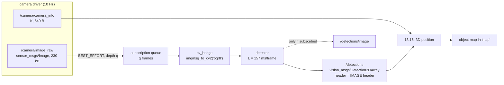

# 13.15 — Vision in ROS 2: cv_bridge, vision_msgs and performance on the robot

<!-- glance:start -->
<!-- generated by tools/build.py from curriculum/syllabus.yaml — edit the syllabus, not this block -->

| | |
|---|---|
| **Track** | Main path |
| **Difficulty** | Intermediate |
| **Time** | 1 h 15 min |
| **Hardware** | Camera (Raspberry Pi Camera Module 3 or USB webcam) (stage 2) |
| **Software** | ros2, opencv, cv-bridge |
| **Prerequisites** | [13.10 Object detection with modern models](13.10-object-detection-models.md)<br>[07.08 RGB cameras on the robot — exposure, rolling shutter, ROS image topics](../07-sensors/07.08-rgb-cameras.md) |
| **Skip if** | You have a detection node publishing vision_msgs at a known rate on robot hardware. |

<!-- glance:end -->

## What you will learn

- Convert between `sensor_msgs/Image` and OpenCV arrays with `cv_bridge`, for colour and for 16-bit depth, without the red/blue swap.
- Publish detections as `vision_msgs/Detection2DArray` stamped with the *capture* time, so every consumer downstream can use them.
- Choose the QoS of an image subscription on purpose, and measure what the wrong choice costs: 220 ms versus 1,133 ms of staleness, or no images at all.
- Measure the pipeline the way the robot experiences it: frames per *decision*, detection age p50/p90, and how many frames were never looked at.
- Explain why a 640×480 raw stream is a bandwidth problem on a Pi, and name the three fixes.

## Why it matters

Everything from 13.01 to 13.14 ran on files. On karmel the detector is a **node**: images arrive from
a driver at 10–30 Hz, inference takes 100–1,000 ms, and something downstream
([13.16](13.16-detection-to-map-position.md), [15.08](../15-manipulation/15.08-pick-and-place-pipeline.md),
[19.07](../19-llm-robot-agents/19.07-perception-action-loops.md)) has to act on the answer while it is still true.

Two things go wrong here, and neither produces an error message. The first is **the border crossing**:
a ROS `Image` is a byte array plus an encoding string, OpenCV wants a numpy array in BGR, and getting
that conversion wrong gives you a picture that looks fine and a detector that fails on red objects.
The second is **staleness**: the pipeline runs, the rate looks healthy, and the robot still reaches for
where the cup was a second ago. In this lesson you will build the node and then measure both.

<!-- prereqs:start -->
## Prerequisites

You need these first:

- [13.10 Object detection with modern models](13.10-object-detection-models.md)
- [07.08 RGB cameras on the robot — exposure, rolling shutter, ROS image topics](../07-sensors/07.08-rgb-cameras.md)

### Optional prerequisite links

None.

Check your readiness: `python course.py why 13.15`
<!-- prereqs:end -->

## Concept

### Three contracts and one conversion

A vision node in ROS 2 is small. Almost all of its code is contracts:

1. **In:** `sensor_msgs/Image` (or `CompressedImage`) plus `sensor_msgs/CameraInfo`, both stamped with
   the moment the shutter opened and both in `camera_optical_frame` ([07.08](../07-sensors/07.08-rgb-cameras.md)).
2. **Convert:** `cv_bridge` turns the message's `data` into a numpy array and back. It is the only
   place in your code that knows about encodings.
3. **Out:** `vision_msgs/Detection2DArray` — boxes, class ids and scores, with the **input image's
   header copied over unchanged**.

That last point is the whole design. The detector does not know where the robot is, does not
transform anything and does not decide anything. It says *what it saw, where in the image, and
when* — and "when" is the capture stamp, never `now()`. [05.10](../05-frames-and-transforms/05.10-object-from-camera-to-map.md)
built the consumer side of exactly this contract; this lesson builds the producer side.

If you have built event-driven systems, this is the familiar rule that an event carries its own
occurrence time. Here the join key is time and the join partner is TF, and joining on the wrong
time costs centimetres instead of wrong totals.

### The robot's two scarce resources

On a laptop the detector reads a file and prints boxes. On karmel's Raspberry Pi 5 two things are
scarce, and both are invisible in a demo:

- **Bandwidth.** A 640×480 `bgr8` image is 921,600 bytes. At 10 Hz that is 9.2 MB/s — 74 Mbit/s —
  crossing the DDS middleware. Over Wi-Fi it simply does not fit, and even locally it will make you
  meet your middleware's fragmentation limits.
- **Staleness.** The camera produces frames faster than the network consumes them. Whether the extra
  frames are *queued* or *dropped* is decided by one QoS setting, and it changes the age of the
  answer by a factor of five.

> [!TIP]
> **Ask your teacher:** "Draw the queue between a 10 Hz camera and a detector that takes 150 ms per frame, for queue depth 1, 5 and 10, and show me where the latency comes from in each case."

## Technical explanation

### Level 1 — The messages

```text
sensor_msgs/Image              sensor_msgs/CompressedImage     vision_msgs/Detection2DArray
  header (stamp, frame_id)       header                          header          <- copied from the image
  height, width                  format  "jpeg" / "png"          detections[]
  encoding  "bgr8" "rgb8"        data    the JPEG bytes            header
            "mono8" "16UC1"                                        results[]     <- ObjectHypothesisWithPose
  is_bigendian, step                                                 hypothesis.class_id  "bottle"
  data      H*step bytes                                             hypothesis.score     0.87
                                                                     pose          (unused in 2D)
                                                                   bbox
                                                                     center.position.x, .y   pixels
                                                                     center.theta            radians
                                                                     size_x, size_y          pixels
                                                                   id            <- your tracking id
```

Two things surprise people. The box centre is a **`vision_msgs/Pose2D`** (with a nested `Point2D`
and a rotation `theta`), not `geometry_msgs/Pose2D` — so it is `bbox.center.position.x`, not
`bbox.center.x`. And the box is **centre + size**, while every detector you have used so far
returns corners; converting in the wrong direction is a silent half-box error.

> [!IMPORTANT]
> **Version-sensitive** (verified 2026-09 in the course's ROS 2 Jazzy container: `vision_msgs` 4.1.1,
> `cv_bridge` 4.1.0, `image_transport` 5.1.8, OpenCV 4.6.0, Fast DDS 2.14.6, Python 3.12.3).
> `vision_msgs` 4.0 replaced the deprecated `geometry_msgs/Pose2D` in `BoundingBox2D.center` with its
> own `vision_msgs/Pose2D` (holding a `Point2D`), and 3.0 had already renamed
> `ObjectHypothesis.id` to `class_id`, removed `is_tracking` and renamed `tracking_id` to `id`.
> Code written against 2.x or 3.x does not compile against 4.x. Check the message with
> `ros2 interface show vision_msgs/msg/Detection2DArray` on *your* machine before writing code:
> https://github.com/ros-perception/vision_msgs
> AI teacher: verify against current documentation before giving instructions.

### Level 2 — cv_bridge, practically

```python
from cv_bridge import CvBridge
bridge = CvBridge()

frame  = bridge.imgmsg_to_cv2(msg, desired_encoding="bgr8")        # -> HxWx3 uint8, BGR
depth  = bridge.imgmsg_to_cv2(dmsg, desired_encoding="passthrough")  # -> HxW uint16 (16UC1) or float32
out    = bridge.cv2_to_imgmsg(annotated, encoding="bgr8")          # -> sensor_msgs/Image
jpeg   = bridge.compressed_imgmsg_to_cv2(cmsg, desired_encoding="bgr8")
```

| Encoding | numpy dtype and shape | Where it comes from |
|---|---|---|
| `bgr8` / `rgb8` | `(H, W, 3)` uint8 | colour cameras; `v4l2_camera` publishes `rgb8` by default |
| `mono8` | `(H, W)` uint8 | greyscale, IR |
| `16UC1` | `(H, W)` uint16 | depth in **millimetres** (RealSense, most RGB-D) |
| `32FC1` | `(H, W)` float32 | depth in **metres** (`depth_image_proc`, simulators) |
| `bayer_rggb8` | `(H, W)` uint8 | raw sensor mosaic; `desired_encoding="bgr8"` debayers it for you |

**`desired_encoding="bgr8"` converts; `"passthrough"` does not.** Passthrough hands you the
driver's own byte order. If the driver publishes `rgb8` and you treat it as BGR, red and blue swap:
the image still looks like a room, `cv2.imwrite` still writes a file, and your HSV thresholds from
[13.03](13.03-classical-detection.md) quietly select the wrong hue. Use `passthrough` only for
depth, where there is no colour order to get wrong and where converting would destroy the units.

**Depth needs `passthrough` and a unit check.** `16UC1` is millimetres, `32FC1` is metres, and `0`
means "no reading" in both. Dividing by 1,000 without checking the encoding is a 1,000× error that
looks like a detector bug.

**On the robot, do not mix OpenCVs.** `cv_bridge` on Jazzy is built against Ubuntu 24.04's
`python3-opencv` (4.6.0). A `pip install opencv-python` in the same interpreter gives you two
OpenCV libraries and an import-order-dependent crash ([13.07](13.07-fiducial-markers.md) hit this
too). On the robot, use apt; in a venv, keep ROS out of it ([03.02](../03-robot-software/03.02-environments-and-pinning.md)).

### Level 3 — Mathematics: bandwidth and the age of an answer

**Bandwidth.** A raw frame is

$$B = H \times W \times c \quad\text{bytes},\qquad \text{rate} = B \cdot f$$

with $c$ = 3 for `bgr8`, 1 for `mono8`, 2 for `16UC1`. karmel's 640×480 colour stream at 10 Hz is
$640 \cdot 480 \cdot 3 = 921{,}600$ B per frame and 9.2 MB/s; adding an aligned 640×480 depth stream
(`16UC1`, 614 kB per frame) makes it 15.4 MB/s. At 320×240 the colour stream is 230,400 B and
2.3 MB/s. JPEG at quality 80 typically gives 15–40 kB per frame — a factor of 25–60.

**The age of an answer.** Let the camera publish at $f$ Hz and the detector take $L$ seconds per
frame. If $L > 1/f$ the detector is the bottleneck and the subscription queue of depth $q$ fills up.
In steady state, a frame is taken from the back of a full queue, so the detection is published

$$\text{age} \approx q \cdot L \quad (\text{and } \approx L \text{ when } q = 1)$$

seconds after the shutter opened. With $L = 0.157$ s (measured below): $q = 1$ gives 157 ms,
$q = 5$ gives 785 ms, $q = 10$ gives 1.6 s. **The throughput is identical in all three cases** —
$1/L = 6.4$ Hz — and only the staleness changes. That is why "it runs at 6 Hz" tells you nothing.

Turn staleness into geometry with the rule from [05.10](../05-frames-and-transforms/05.10-object-from-camera-to-map.md):
a robot turning at $\omega$ misplaces an object $r$ away by $e \approx r\,\omega\,\Delta t$. At
$\omega = 0.4$ rad/s and $r = 2$ m, the $q = 5$ queue costs $2 \times 0.4 \times 0.623 = 0.50$ m of
error if the consumer uses the current pose — and **nothing at all** if it uses the capture stamp.
Latency you can compensate for; latency you have not measured you cannot.

### Level 4 — Implementation: the four decisions

1. **QoS: best effort, depth 1.** A camera publishes with `qos_profile_sensor_data`
   (BEST_EFFORT, depth 5). A detector that cannot keep up wants the *newest* frame, not the oldest,
   so subscribe with BEST_EFFORT and **depth 1**. And beware the asymmetry rule: a RELIABLE
   subscription to a BEST_EFFORT publisher is **incompatible** and receives nothing, silently.
   That is the single most common "my detector sees no images" bug.
2. **Publish the debug image only when someone is watching.** `self.pub_debug.get_subscription_count() > 0`.
   Drawing and encoding an annotated frame costs as much as a small detector, and on the robot
   nobody is looking 99% of the time. `image_transport` does this for compression automatically;
   in rclpy you check the count yourself.
3. **Do the conversion once.** `imgmsg_to_cv2` copies. Converting twice, or converting and then
   resizing back and forth, doubles the per-frame cost for nothing.
4. **Know what Python cannot do.** ROS 2's zero-copy intra-process transport works for **C++
   components** loaded into one container process (`rclcpp_components`, `use_intra_process_comms`);
   rclpy has no intra-process path, so every image between two Python nodes is serialized, copied
   and fragmented. On a Pi the practical options are: shrink the stream (320×240), compress it
   (`image_transport` republish), or move the camera driver and the detector into one C++ component
   container. The course keeps Python and shrinks the stream.

## Diagram



```text
what the queue depth does (camera 10 Hz, detector 157 ms/frame, both measured)

 q = 1   [n]                         -> publishes frame n        age  220 ms
 q = 5   [n-4][n-3][n-2][n-1][n]     -> publishes frame n-4      age  623 ms
 q = 10  [n-9] ..................[n] -> publishes frame n-9      age 1133 ms
          ^ the detector always works on the OLDEST frame in the queue
```

## Code

Everything lives in [`13-computer-vision/code/ros2/src/karmel_vision/`](code/ros2/src/karmel_vision/)
and runs in the course's ROS 2 container ([03.02](../03-robot-software/03.02-environments-and-pinning.md)),
with no camera and no robot:

| Executable | Role |
|---|---|
| `fake_camera` | karmel's camera, depth camera and TF chain, rendered from geometry. Parameters: `rate_hz`, `width`, `height`, `spin_rad_s`, `drive_m_s`, `image_qos`, `objects` |
| `detector_node` | this lesson: `Image` → `Detection2DArray`. Parameters: `image_qos`, `inference_ms`, `scale`, `detector` |
| `latency_probe` | measures rate, detection age and frames never looked at |
| `detection_3d_node`, `object_map_node` | [13.16](13.16-detection-to-map-position.md) |

`ros:jazzy-ros-base` does not ship the vision packages, so the module has its own two-line image
([`Dockerfile`](code/ros2/Dockerfile)) that adds `cv_bridge`, `vision_msgs` and `image_transport`
from apt — never from pip ([13.07](13.07-fiducial-markers.md)). From the repository root:

```bash
docker build -t karmel-vision:jazzy 13-computer-vision/code/ros2
docker run -it --rm --name vision -e ROS_DOMAIN_ID=73     -v "${PWD}/13-computer-vision/code/ros2:/ws" karmel-vision:jazzy bash
```

```bash
# inside the container
cd /ws && colcon build --symlink-install && source install/setup.bash

ros2 run karmel_vision fake_camera --ros-args -p width:=320 -p height:=240 -p spin_rad_s:=0.4 &
ros2 run karmel_vision detector_node --ros-args -p inference_ms:=150.0 -p image_qos:=sensor &
ros2 run karmel_vision latency_probe --ros-args -p seconds:=20.0
```

`ROS_DOMAIN_ID` keeps your DDS traffic out of everyone else's ([04.01](../04-ros2/04.01-why-middleware.md));
on a shared machine, pick a number and stick to it.

The heart of the detector node ([`detector_node.py`](code/ros2/src/karmel_vision/karmel_vision/detector_node.py)) —
conversion, inference, and the header that carries the capture time:

```python
def on_image(self, msg: Image) -> None:
    frame = self.bridge.imgmsg_to_cv2(msg, desired_encoding="bgr8")   # convert, never passthrough
    dets = self.detect(frame)                                          # [(name, score, (x1,y1,x2,y2))]

    out = Detection2DArray()
    out.header = msg.header                    # capture time + camera_optical_frame: never "now"
    for name, score, (x1, y1, x2, y2) in dets:
        d = Detection2D()
        d.header = msg.header
        d.id = name
        hyp = ObjectHypothesisWithPose()
        hyp.hypothesis.class_id = name
        hyp.hypothesis.score = score
        d.results.append(hyp)
        bbox = BoundingBox2D()
        bbox.center.position.x = (x1 + x2) / 2     # vision_msgs/Pose2D -> Point2D -> x
        bbox.center.position.y = (y1 + y2) / 2
        bbox.size_x, bbox.size_y = x2 - x1, y2 - y1
        d.bbox = bbox
        out.detections.append(d)
    self.pub.publish(out)
```

and the QoS switch the exercises turn:

```python
if qos_name == "sensor":                       # rclpy's sensor profile: BEST_EFFORT, depth 5
    qos = qos_profile_sensor_data
elif qos_name == "latest":                     # BEST_EFFORT, depth 1: always the newest frame
    qos = QoSProfile(depth=1, reliability=ReliabilityPolicy.BEST_EFFORT)
elif qos_name == "reliable10":                 # what a tutorial's default gives you
    qos = QoSProfile(depth=10, reliability=ReliabilityPolicy.RELIABLE)
```

The default detector is the colour segmentation of [13.03](13.03-classical-detection.md) — no
download, deterministic, ~4 ms — with `inference_ms` standing in for a network's cost so a laptop
can reproduce a Pi's behaviour. `-p detector:=ssdlite` swaps in the real torchvision model from
[13.10](13.10-object-detection-models.md) where torch is installed.

## Exercise

Hardware for E1–E4: **none** (the container). E5 needs the `camera`.

### Exercise 13.15-E1 — Predict the three QoS outcomes `[predict]`

Before running anything, write down your prediction for each of these, with the camera at 10 Hz
(320×240) and `inference_ms:=150`:

| detector `image_qos` | detections/s | age p50 |
|---|---|---|
| `sensor` (BEST_EFFORT, depth 5) | ? | ? |
| `latest` (BEST_EFFORT, depth 1) | ? | ? |
| `reliable10` (RELIABLE, depth 10) against the camera's default BEST_EFFORT publisher | ? | ? |

Then measure each with `latency_probe` for 20 s.

### Exercise 13.15-E2 — The detector that sees nothing `[debugging]`

Run the camera normally and the detector with `-p image_qos:=reliable10`. The detector logs its
start-up line and then nothing: no errors, no detections. Find the cause **from the command line
only** — `ros2 topic info -v /camera/image_raw` is the tool. Write down what the output tells you,
then fix it in two different ways (one on the publisher side, one on the subscriber side) and say
which one belongs on a real robot and why.

### Exercise 13.15-E3 — The bandwidth wall `[simulation]`

Predict first: what fraction of frames arrives if the camera publishes 640×480 `bgr8` at 10 Hz with
BEST_EFFORT? Then measure with `latency_probe` at 320×240 and at 640×480, and again at 640×480 with
`-p image_qos:=reliable` on the camera (the probe subscribes BEST_EFFORT — you will need to make it
RELIABLE too, one line). Report frames delivered and age for all three, and explain the mechanism.
Finally, compute the byte rate of each configuration and compare it with a Pi 5's realistic budget.

### Exercise 13.15-E4 — Stamp it with `now()` and watch nothing break `[coding]`

In `detector_node.py`, replace `out.header = msg.header` with

```python
out.header.stamp = self.get_clock().now().to_msg()
out.header.frame_id = msg.header.frame_id
```

Run the full pipeline (`ros2 launch karmel_vision vision_pipeline.launch.py spin_rad_s:=0.8`) and
watch `object_map_node`'s reported error against the ground truth, with `inference_ms` at 50 and at
400. Explain the pattern, and say which of the two nodes you would have blamed if you had not known.

### Exercise 13.15-E5 — Your own webcam through the same node `[hardware]`

Hardware: `camera`. Simulation alternative: `fake_camera`, as above.

> [!CAUTION]
> **Safety:** If you mount the webcam on karmel rather than holding it, put the robot on a stand with
> the wheels in the air before you start any node that can publish `/cmd_vel`, keep the power switch
> within reach, and route the USB cable so it cannot catch in a wheel ([SAFETY.md](../SAFETY.md)).

Bring up a USB webcam as in [07.08](../07-sensors/07.08-rgb-cameras.md):

```bash
ros2 run v4l2_camera v4l2_camera_node --ros-args -p image_size:="[320,240]" -p output_encoding:=rgb8
ros2 run karmel_vision detector_node --ros-args -p image_qos:=latest -p detector:=colour
ros2 run karmel_vision latency_probe --ros-args -p seconds:=30.0
```

Point the camera at something green and something blue. Report: the detection age p50/p90 on your
machine, whether the colour detector finds your objects, and what `imgmsg_to_cv2(msg, "bgr8")` did
with the driver's `rgb8` (check by saving one frame and looking at it).

## Expected result

All numbers measured in the course's Jazzy container (`ros:jazzy-ros-base` + `cv_bridge` 4.1.0,
`vision_msgs` 4.1.1, Fast DDS 2.14.6) on an Intel Core Ultra 7 255H laptop under Docker Desktop,
with other work running, 2026-09. Your absolute numbers will differ; the **ratios** are the lesson.

**13.15-E1:** camera 320×240 at 10 Hz, `inference_ms:=150` (measured work per frame 157 ms):

| `image_qos` | detections/s | frames processed | age p50 | age p90 | age max |
|---|---|---|---|---|---|
| `sensor` (BE, depth 5) | 6.35 | 116 of 189 (61%) | **623 ms** | 661 ms | 704 ms |
| `latest` (BE, depth 1) | 6.15 | 114 of 180 (63%) | **220 ms** | 262 ms | 290 ms |
| `reliable10` vs BE publisher | **0.00** | 0 of 200 (0%) | — | — | — |
| both sides RELIABLE, depth 10 | 6.00 | 146 of 243 (60%) | **1,133 ms** | 1,180 ms | 1,906 ms |

Three lessons in one table. The throughput is the same 6 Hz everywhere the data arrives at all —
it is set by the inference time, not by QoS. The staleness changes by **5×** between depth 1 and
depth 10, which is 0.9 m of error on a 2 m object while turning at 0.5 rad/s. And an incompatible
QoS pair delivers *nothing*, with no error anywhere.

**13.15-E2:** `ros2 topic info -v /camera/image_raw` lists the publisher with
`Reliability: BEST_EFFORT` and your subscription with `Reliability: RELIABLE`. A RELIABLE
subscription requires at least a RELIABLE publisher, so the pair is incompatible and no data flows.
Fixes: make the subscriber BEST_EFFORT (right for a robot: a dropped frame is better than a late
one), or make the publisher RELIABLE (wrong for a camera; it costs retransmissions and, as the
table above shows, another 500 ms of age). On Jazzy you can also see the mismatch as a
`requested incompatible qos` event if you install a QoS event callback.

**13.15-E3:** measured over 12 s with a 10 Hz camera (120 frames published):

| stream | bytes/frame | byte rate | frames delivered | note |
|---|---|---|---|---|
| 320×240 `bgr8`, BEST_EFFORT | 230,400 | 2.3 MB/s | **100 of 100** | fits in the transport comfortably |
| 640×480 `bgr8`, BEST_EFFORT | 921,600 | 9.2 MB/s | **30 of 120 (25%)** | `camera_info` on the same graph: 120 of 120 |
| 640×480 `bgr8`, RELIABLE both sides | 921,600 | 9.2 MB/s | **84 of 120 (70%)** | age p50 **101 ms**, p90 154 ms |

A message larger than a UDP datagram is fragmented, and losing one fragment loses the whole frame;
BEST_EFFORT never retransmits, so most big frames die. RELIABLE retransmits — that is where the
extra 100 ms and the remaining 30% queue overflow come from. The three real fixes, in the order you
should try them: send fewer pixels, compress (`image_transport` `compressed`, 15–40 kB/frame), or
put the producer and consumer in one C++ component container so nothing is serialized at all. Note
that `camera_info` always arrives: small messages are not affected, which is exactly why this bug
presents as "the intrinsics are fine but the images stutter".

**13.15-E4:** with `inference_ms:=50` and the robot spinning at 0.8 rad/s the bottle's map position
is wrong by roughly $r\,\omega\,\Delta t \approx 2.6 \times 0.8 \times 0.06 \approx 0.12$ m and the
object map usually still holds one object; at `inference_ms:=400` the error grows past the
association gate and the map fills with **several phantom bottles smeared along the arc the camera
swept**. Nothing logs an error, and the obvious suspect is `object_map_node` or TF — the fault is in
the one line you changed, three nodes upstream. This is why the capture stamp is a contract, not a
detail.

**13.15-E5:** on a USB webcam at 320×240, expect an age p50 of 60–150 ms with `latest`
(driver + USB + conversion), and 3–10× that with `sensor` if your detector is slow. `v4l2_camera`
publishes `rgb8`; `imgmsg_to_cv2(msg, "bgr8")` converts it, so a saved frame has correct colours. If
you use `passthrough` instead, the saved frame has red and blue swapped and the "bottle" HSV window
starts matching the sky.

## Troubleshooting

### Symptom: the node runs, no callback ever fires

1. `ros2 topic list` — is the topic there, spelled exactly as you subscribed (leading slash,
   namespace)?
2. `ros2 topic info -v <topic>` — compare **Reliability** and **Durability** on both sides. RELIABLE
   subscriber + BEST_EFFORT publisher = no data, no error. This is the first thing to check, always.
3. `ros2 topic hz <topic>` — if the publisher is silent, the problem is upstream (camera driver,
   permissions, `ROS_DOMAIN_ID`).
4. Different `ROS_DOMAIN_ID`, or one container without network access to the other? Check with
   `ros2 node list` from each side.

### Symptom: detections arrive but the robot acts on the wrong place

1. Look at the **age**, not the rate: `latency_probe`, or print `now - header.stamp` in the consumer.
2. If the age is hundreds of milliseconds, reduce the queue depth to 1 before optimising the model.
   It is one line and usually the biggest win available.
3. If the age is fine, check that the detector copies the image header instead of stamping `now()`,
   and that the consumer looks TF up at that stamp ([05.10](../05-frames-and-transforms/05.10-object-from-camera-to-map.md)).

### Symptom: `cv_bridge.CvBridgeError: encoding ... is not a color format`

You asked for `bgr8` on a depth image. Depth is `16UC1` (millimetres) or `32FC1` (metres) — use
`desired_encoding="passthrough"` and convert units yourself, after reading `msg.encoding`.

### Symptom: the colours are inverted / the detector only works on files

You used `passthrough` on a colour image from a driver that publishes `rgb8`. Convert explicitly
with `desired_encoding="bgr8"`, and save one frame with `cv2.imwrite` to confirm.

### Symptom: the Pi's CPU is pinned and the control loop stutters

In order: (1) is a debug image being published to nobody? (2) is the raw stream larger than it needs
to be? (3) is `image_transport` compressing for a subscriber you forgot about
([07.08](../07-sensors/07.08-rgb-cameras.md))? (4) only then: make the model smaller
([16.04](../16-machine-learning/16.04-models-on-edge-compute.md)).

## Common mistakes

- **RELIABLE subscription to a sensor topic.** No data, no error. Cameras publish BEST_EFFORT.
- **Leaving the queue at the default depth.** You get the oldest frame in the queue every time, and
  pay for it in centimetres. Depth 1 for anything the robot acts on.
- **Stamping the detection with `now()`.** Invisible while the robot is still, wrong the moment it turns.
- **`passthrough` on colour images.** The red/blue swap that survives every visual inspection.
- **Treating `16UC1` as metres.** A 1,000× error that looks like a broken detector.
- **`bbox.center.x` instead of `bbox.center.position.x`** on `vision_msgs` 4.x — or feeding corner
  coordinates into a centre+size field.
- **Publishing the annotated debug image unconditionally.** It can cost more than the detector.
- **Expecting zero-copy between two Python nodes.** There is none; plan the stream size accordingly.

## Knowledge check

1. A camera publishes `rgb8` and your node calls `imgmsg_to_cv2(msg, desired_encoding="passthrough")`, then `cv2.cvtColor(img, cv2.COLOR_BGR2HSV)`. What exactly is wrong, and what will you observe?
   <details><summary>Answer</summary>

   `passthrough` returns the driver's RGB byte order, and you then interpret it as BGR: red and blue
   are swapped. The image still looks like a plausible photo (blue objects look orange-ish), so
   nothing fails. In HSV the hue of every object is wrong, so colour thresholds select the wrong
   things. Fix: `desired_encoding="bgr8"`, which makes cv_bridge convert.
   </details>

2. Your detector takes 200 ms per frame on a 15 Hz camera, subscribed with depth 8. What throughput and what detection age do you expect?
   <details><summary>Answer</summary>

   Throughput is set by the inference time: $1/0.2 = 5$ Hz. Age ≈ $q \cdot L = 8 \times 0.2 = 1.6$ s,
   because the detector always takes the oldest frame from a full queue. Changing the depth to 1
   leaves the throughput at 5 Hz and cuts the age to about 200 ms.
   </details>

3. Why does the same table show 6 Hz of detections for depth 1, depth 5 and depth 10?
   <details><summary>Answer</summary>

   The queue does not make the detector faster. It only decides *which* frames are processed — the
   newest (depth 1) or a backlog (depth 10). Throughput is $\min(f, 1/L)$ either way. Queues buy
   smoothness for bursty producers; for a steady camera feeding a slow consumer they buy only latency.
   </details>

4. karmel streams 640×480 `bgr8` at 15 Hz plus an aligned `16UC1` depth image at the same rate. What is the byte rate, and what is your first move?
   <details><summary>Answer</summary>

   Colour: $640 \times 480 \times 3 = 921{,}600$ B; depth: $640 \times 480 \times 2 = 614{,}400$ B.
   Together 1.536 MB per frame, 23 MB/s ≈ 184 Mbit/s. First move: reduce resolution (320×240 cuts it
   4×), and compress anything that leaves the robot. Only then think about the middleware.
   </details>

5. Predict: you subscribe to `/camera/image_raw` with RELIABLE QoS and get nothing. You "fix" it by adding `time.sleep(1.0)` before creating the subscription. What happens?
   <details><summary>Answer</summary>

   Nothing changes. The problem is a QoS incompatibility, not a discovery race: a RELIABLE
   subscription will never match a BEST_EFFORT publisher, however long you wait. `ros2 topic info -v`
   shows both endpoints' QoS and settles it in one command.
   </details>

6. Why must the detection carry the image's `header.stamp` rather than the time the inference finished, given that the consumer could subtract the latency itself?
   <details><summary>Answer</summary>

   Because the latency is not constant (queueing, CPU contention, image content) and the consumer has
   no way to know it. The capture stamp is the only time at which the geometry was true, and TF is
   indexed by exactly that time. Carrying it costs one line; reconstructing it downstream is impossible.
   </details>

7. You want to see the annotated detections in RViz occasionally, but not pay for them on every frame. What do you do, and what does `image_transport` do for the same problem?
   <details><summary>Answer</summary>

   Check `publisher.get_subscription_count() > 0` and only draw and publish the debug image when
   someone is subscribed. `image_transport` applies the same idea to compression: the `compressed`
   plugin does not encode anything until a subscriber appears on `<topic>/compressed`.
   </details>

## Practical challenge

**Make the pipeline honest about its own performance.** Extend `detector_node` so that it publishes
a `diagnostic_msgs/DiagnosticArray` at 1 Hz with: processed frames per second, detection age p50 and
p90, the fraction of camera frames it never looked at, and a status level that goes WARN above an
age threshold you choose and ERROR when no image has arrived for 2 s. Then add a `drop_if_older_ms`
parameter: a frame older than that when it reaches the callback is discarded *without running the
detector*, so the node recovers instead of falling further behind.

**Acceptance criteria:**

- With `inference_ms:=150` and `image_qos:=sensor`, the diagnostics reproduce the numbers
  `latency_probe` reports, within 10%.
- With `drop_if_older_ms:=250`, the age p90 falls to roughly one inference time and the diagnostics
  show the discarded fraction. Explain in two sentences why this is *not* the same as depth 1, and
  when each is the right tool.
- Killing the camera makes the status go ERROR within 3 s, and restarting it clears it.
- Your threshold choice is justified in one sentence from karmel's maximum turn rate and the object
  distances the robot cares about.

## You can skip this if…

You answer knowledge-check questions 1, 3 and 5 correctly without looking, and you already have a
detection node publishing `vision_msgs` at a known rate on robot hardware, with a measured detection
age and a deliberate QoS choice.

`python course.py skip 13.15 --reason "I run a cv_bridge + vision_msgs detection node with measured latency"`

## Go deeper

- `vision_msgs`: https://github.com/ros-perception/vision_msgs — the message definitions, the RViz
  display plugins, and the changelog that explains the 3.x → 4.x break.
- ROS 2 Jazzy, About Quality of Service settings: https://docs.ros.org/en/jazzy/Concepts/Intermediate/About-Quality-of-Service-Settings.html —
  the compatibility table you will come back to every time a topic is silent.
- `image_transport`: https://github.com/ros-perception/image_common/tree/rolling/image_transport —
  transport plugins, lazy encoding, and the `republish` tool.
- `image_pipeline`: https://github.com/ros-perception/image_pipeline — `image_proc`, `depth_image_proc`
  and `camera_calibration`; the nodes you should reuse instead of writing them.
- ROS 2 Jazzy, Composing multiple nodes in a single process: https://docs.ros.org/en/jazzy/Tutorials/Intermediate/Composition.html —
  what C++ components buy you, and why an image pipeline is the textbook case for them.
- ROS 2 Jazzy, cv_bridge package documentation: https://docs.ros.org/en/jazzy/p/cv_bridge/ — the full
  encoding list and the C++ API.
- REP-103, units and coordinate conventions: https://www.ros.org/reps/rep-0103.html — the definition
  of the `_optical` frame your detections are published in.

## Progress checkpoint

- [ ] I can convert `Image` and `CompressedImage` to OpenCV arrays, and handle 16-bit depth correctly.
- [ ] I can publish `vision_msgs/Detection2DArray` with the capture stamp and the right box fields.
- [ ] I can diagnose a silent topic with `ros2 topic info -v` and choose QoS deliberately.
- [ ] I can measure detection age p50/p90 and frames never processed, and say what they cost in metres.
- [ ] I can budget a camera stream's bandwidth and name the three ways to make it fit.

`python course.py complete 13.15` (exercises done) · `python course.py master 13.15` (challenge done) ·
`python course.py struggle 13.15 "what was hard"`

Next: [13.16 — From detection to a 3D position in the map frame](13.16-detection-to-map-position.md).
