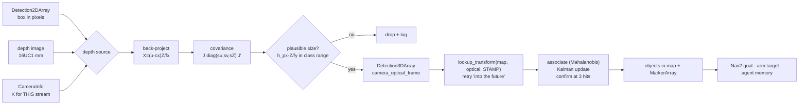

# 13.16 — From detection to a 3D position in the map frame

<!-- glance:start -->
<!-- generated by tools/build.py from curriculum/syllabus.yaml — edit the syllabus, not this block -->

| | |
|---|---|
| **Track** | Main path |
| **Difficulty** | Advanced |
| **Time** | 1 h 30 min |
| **Hardware** | Camera (Raspberry Pi Camera Module 3 or USB webcam) (stage 2) |
| **Software** | ros2, tf2 |
| **Prerequisites** | [13.15 Vision in ROS 2 — cv_bridge, vision_msgs and performance on the robot](13.15-vision-in-ros2.md)<br>[13.08 Depth and 3D vision — stereo, depth images and point clouds](13.08-depth-and-3d-vision.md)<br>[05.10 Worked example: an object seen by the camera, expressed in base_link and map](../05-frames-and-transforms/05.10-object-from-camera-to-map.md) |
| **Skip if** | Your robot reports the map coordinates of detected objects. |

<!-- glance:end -->

## What you will learn

- Explain why a bounding box is a *ray*, and recover the missing depth four different ways: a depth image, the object's known size, the floor plane, or a range sensor.
- Back-project a box to a 3D point in `camera_optical_frame` and attach an honest 3×3 covariance to it.
- Publish `vision_msgs/Detection3DArray`, transform it into `map` at the capture stamp, and rotate the covariance with it.
- Fuse repeated detections into a semantic object map with a Mahalanobis gate, a confirmation rule and a forgetting rule.
- Say, with numbers, why the same pipeline places a bottle to 1 cm with a depth camera and to 25 cm with a known-size estimate.

## Why it matters

This is where computer vision stops being image processing and becomes robotics. Nav2 needs a goal
in `map` ([12.09](../12-navigation/12.09-waypoints-and-missions.md)). The arm needs a target in
`base_link` ([14.10](../14-robotic-arm/14.10-move-gripper-to-position.md)). The LLM agent needs to
answer "is there a bottle in the kitchen?" ten minutes after driving past it
([19.06](../19-llm-robot-agents/19.06-task-planning-decomposition.md)). All three need the same thing: a
detection turned into a position in a world-fixed frame, with an uncertainty that is not a lie.

[05.10](../05-frames-and-transforms/05.10-object-from-camera-to-map.md) did the second half of this
with a point handed to it on a plate. This lesson produces that point — and the point is where most
of the error lives. A 5-pixel box error is nothing; the depth you invented to go with it can be 25%
wrong, and no amount of correct TF will save you.

<!-- prereqs:start -->
## Prerequisites

You need these first:

- [13.15 Vision in ROS 2 — cv_bridge, vision_msgs and performance on the robot](13.15-vision-in-ros2.md)
- [13.08 Depth and 3D vision — stereo, depth images and point clouds](13.08-depth-and-3d-vision.md)
- [05.10 Worked example: an object seen by the camera, expressed in base_link and map](../05-frames-and-transforms/05.10-object-from-camera-to-map.md)

### Optional prerequisite links

None.

Check your readiness: `python course.py why 13.16`
<!-- prereqs:end -->

## Concept

### A box is a ray

The pinhole model ([13.05](13.05-pinhole-camera-model.md)) projects 3D to 2D, and it throws depth
away. Inverting it gives you a **ray**, not a point: every object along that line produces the same
pixel. A detector that says "cup at (240, 140)" has told you a direction and nothing more.

So the entire job is: **find one more number**. There are exactly four ways to get it on a robot
like karmel, and they are not interchangeable:

| # | Source | Needs | Typical error at 2 m | Fails when |
|---|---|---|---|---|
| 1 | **Depth image** | RGB-D camera (`depth-camera`), aligned to colour | 1–3 cm | shiny, transparent, dark, or closer than ~0.3 m |
| 2 | **Known object size** | a class whose real height you know | **40–50 cm** | the object is truncated, tilted, or just an unusual size |
| 3 | **The floor plane** | the object stands on the floor, camera height and pitch known | 5–30 cm, worse with distance | objects on tables, a mis-measured camera pitch |
| 4 | **Range sensor along the bearing** | LiDAR or ToF pointing that way | 2–5 cm | the beam misses the object (karmel's LiDAR scans at z = 0.12 m) |

A plain webcam robot has only 2 and 3. That is the honest reason karmel's bill of materials has a
depth camera as an upgrade path, and why 15's grasping work assumes one.

### The three checks that must pass

Once you have a 3D point, three engineered checks stand between it and the robot's behaviour — the
pattern from [16.01](../16-machine-learning/16.01-where-ml-helps-robots.md):

1. **Is it physically possible?** The box height and the depth imply a real height. A "bottle" that
   would be 0.74 m tall is a poster, a floor lamp, or a depth reading that hit the wall behind it.
2. **Is it the same object I already know?** Association, with a gate that uses the uncertainty
   rather than a fixed radius.
3. **Have I seen it enough times?** One frame is a rumour. Three agreeing frames are an object.

> [!TIP]
> **Ask your teacher:** "Give me five detections as (box, depth) with karmel's intrinsics and quiz me on which ones the plausibility gate should reject and why."

## Technical explanation

### Level 1 — Back-projection

With the intrinsics $K$ and a depth $Z$, the pixel $(u, v)$ becomes a point in
`camera_optical_frame` (z forward, x right, y down):

$$X = \frac{(u - c_x)\,Z}{f_x}, \qquad Y = \frac{(v - c_y)\,Z}{f_y}, \qquad Z = Z$$

Use the **box centre** for the position (that is what a gripper aims at) and the **box bottom edge**
for the floor-plane method (that is where the object touches the ground).

> [!CAUTION]
> **Scale K when you resize the image.** If you run the detector on a half-size image and report boxes
> in half-size pixels, you must use $f_x/2, f_y/2, c_x/2, c_y/2$. karmel's camera at 640×480 has
> $f_x = f_y = 467.7$; the same camera at 320×240 has $233.9$. Mixing them up is a clean factor-of-two
> error in every distance, and the boxes still look perfect in RViz's image view. The course's
> detector reports boxes in original-image pixels and the node uses the `CameraInfo` that came with
> the stream, so the two can never disagree.

### Level 2 — The four depths, practically

**1. Depth image.** Take the **median of the valid pixels in the central half of the box**. Not the
mean (one wall pixel at 4 m ruins it), not the centre pixel (RGB-D cameras leave holes exactly on
object edges and shiny surfaces). Remember `16UC1` is millimetres and `0` means "no reading"
([13.15](13.15-vision-in-ros2.md)). If fewer than ~10 valid pixels remain, return nothing — a
missing detection is much cheaper than a confident wrong one.

**2. Known size.** $Z = f_y H / h_{px}$. Simple, and much less accurate than it looks, for two
reasons that compound: real bottles are 0.15–0.35 m tall, and detector boxes are not tight. Skip it
entirely when the box touches the image border, because then $h_{px}$ is a lower bound and $Z$ is
over-estimated with no warning.

**3. Floor plane.** For a level camera at height $h$, the bottom edge of the box at row $v$ gives

$$Z = \frac{h\,f_y}{v - c_y}$$

This is free (no depth sensor, no size assumption) and it degrades dramatically with distance,
because $v \to c_y$ is the horizon.

**4. Range sensor.** karmel has a 2D LiDAR at $z = 0.12$ m and a ToF at $z = 0.05$ m
([07.07](../07-sensors/07.07-2d-lidar.md), [07.03](../07-sensors/07.03-ultrasonic-sensors.md)). Take the
range at the box centre's bearing $\beta = \arctan((u - c_x)/f_x)$ and use $Z = r\cos\beta$. It is
accurate *when the beam hit the object*, which for a 0.10 m mug at LiDAR height it did not. Use it
to cross-check tall objects and to run the plausibility gate, not as the primary source.

### Level 3 — Mathematics: how wrong is each one?

**The floor plane near the horizon.** Differentiating $Z = h f_y/(v - c_y)$:

$$\frac{dZ}{dv} = -\frac{h f_y}{(v - c_y)^2} = -\frac{Z^2}{h f_y}$$

The error grows with the **square** of the distance. With karmel's 320×240 stream ($f_y = 233.9$,
$c_y = 120$, $h = 0.145$ m):

| bottom edge $v$ | $Z$ | one pixel is worth |
|---|---|---|
| 240 | 0.28 m | 0.24 cm |
| 200 | 0.42 m | 0.53 cm |
| 160 | 0.85 m | 2.1 cm |
| 140 | 1.70 m | 8.5 cm |
| 130 | 3.39 m | 34 cm |
| 125 | 6.78 m | 1.36 m |

Beyond about 2 m this method is a rough bearing plus a guess. It is genuinely good under 1 m — which
is exactly the range where a robot is about to touch something.

**And it is brutally sensitive to pitch.** The camera's mounting angle enters as an additive term:
$Z = h / (\cos\theta \frac{v - c_y}{f_y} + \sin\theta)$. At $Z = 2$ m the pixel term is only 0.0725,
so a camera you *think* is level but is actually pitched down by

| real pitch | reported $Z$ | error |
|---|---|---|
| 0° | 2.000 m | — |
| 1° | 1.611 m | −19% |
| 2° | 1.351 m | −32% |
| 5° | 0.910 m | −55% |

One degree is a millimetre of shim under a camera bracket. Measure the pitch (or read it from TF,
which reads it from the URDF, which you measured in [05.08](../05-frames-and-transforms/05.08-urdf-and-xacro.md)) —
never assume it.

**Known size.** Relative errors add in quadrature:

$$\frac{\sigma_Z}{Z} = \sqrt{\left(\frac{\sigma_H}{H}\right)^2 + \left(\frac{\sigma_h}{h_{px}}\right)^2}$$

Treating "a bottle is 0.15–0.35 m" as a 95% interval gives $\sigma_H/H \approx 0.21$, and that term
alone sets the floor:

| $Z$ | box height | $\sigma_Z$ | relative |
|---|---|---|---|
| 0.5 m | 112 px | 10.7 cm | 21.4% |
| 1.0 m | 56 px | 21.8 cm | 21.8% |
| 2.0 m | 28 px | 47.1 cm | 23.5% |
| 3.0 m | 19 px | 78.3 cm | 26.1% |

**Box tightness is a bias, not noise.** The course's colour detector draws boxes about 2.7 px taller
than the true object (it includes the drawn outline; a real detector has its own systematic bias).
That looks harmless and is not:

| true $Z$ | true box | detected box | estimated $Z$ | error |
|---|---|---|---|---|
| 1.00 m | 56.1 px | 58.8 px | 0.955 m | −4.5% |
| 2.00 m | 28.1 px | 30.7 px | 1.827 m | −8.7% |
| 2.66 m | 21.1 px | 23.8 px | 2.362 m | −11.2% |

Averaging over a hundred frames does not remove it, because it is the same every frame. This is the
main reason the measured errors at the end of this lesson are 24–30 cm rather than the 47 cm that
$\sigma_Z$ would predict *and* not the 2 cm the depth camera achieves.

**Propagating into a covariance.** With $p = (X, Y, Z)$ and inputs $(u, v, Z)$,

$$J = \begin{bmatrix} Z/f_x & 0 & (u - c_x)/f_x \\ 0 & Z/f_y & (v - c_y)/f_y \\ 0 & 0 & 1\end{bmatrix},
\qquad \Sigma_p = J \, \mathrm{diag}(\sigma_u^2, \sigma_v^2, \sigma_Z^2) \, J^{\mathsf T}$$

For a box 80 px right of centre at 2 m with $\sigma_u = \sigma_v = 2$ px:

| depth source | $\sigma_Z$ | $\sigma_X$ | $\sigma_Y$ |
|---|---|---|---|
| depth camera | 2.0 cm | 1.8 cm | 1.7 cm |
| known size | 47.1 cm | 16.2 cm | 4.4 cm |

Read the second row carefully: depth error **leaks sideways**. An object at the edge of the frame
gets a lateral error proportional to its depth error, which is why a robot with a known-size
estimate reaches past the object *and* to the side of it.

**Association.** Two estimates with covariances $P$ and $R$ belong to the same object if the squared
Mahalanobis distance is inside a chi-square gate with 3 degrees of freedom:

$$d^2 = (p_1 - p_2)^{\mathsf T}(P + R)^{-1}(p_1 - p_2) < \chi^2_{3, \alpha}$$

with $\chi^2_{3, 0.95} = 7.815$ and $\chi^2_{3, 0.99} = 11.345$. A 95% gate rejects 5% of the
detections that really do belong — and every rejection creates a twin in your map. The course uses
the 99% gate plus a merge pass. This is the same gate as the EKF's in
[10.05](../10-localization/10.05-kalman-filter-multivariate.md); the only difference is that here the "state"
is an object instead of the robot.

### Level 4 — Implementation: three nodes, one contract each

```text
detector_node      Image                -> Detection2DArray  (camera_optical_frame, capture stamp)   13.15
detection_3d_node  Detection2DArray     -> Detection3DArray  (camera_optical_frame, same stamp)      geometry only
object_map_node    Detection3DArray     -> objects in map + MarkerArray                              TF + fusion
```

Keeping the geometry node free of TF is worth insisting on: it needs no robot pose, so it is a pure
function of the image data, and it is testable without ROS. The transform lives in exactly one
place, and that place does it correctly — looking up at `msg.header.stamp`, retrying "into the
future" errors and dropping "into the past" ones, exactly as [05.10](../05-frames-and-transforms/05.10-object-from-camera-to-map.md)
taught.

Two details people get wrong:

- **Put the covariance in the message.** `Detection3D.results[0].pose` is a
  `geometry_msgs/PoseWithCovariance` — a 6×6 row-major array. Fill the top-left 3×3 block and leave
  the orientation block zero: you do not know the object's orientation from a box.
- **Rotate the covariance with the point.** Transforming a position is $p' = Rp + t$; transforming
  its uncertainty is $\Sigma' = R\,\Sigma\,R^{\mathsf T}$. Skipping this makes the error ellipse
  point the wrong way after every turn, and the association gate then rejects good detections.

## Diagram

```text
one box, four ways to find the missing number (side view, camera optical frame)

            camera at h = 0.145 m
              o──────────────────────────────────────────────  optical axis (v = cy = horizon)
             /│\ ray through the box CENTRE  ->  position
            / │ \
           /  │  \  ray through the box BOTTOM edge
          /   │   \
   ______/____│____\_●________________________________________  floor
        ^     ^      ^
        |     |      └─ 3. floor plane:  Z = h·fy / (v - cy)
        |     └──────── 2. known size:   Z = fy·H / h_px
        └────────────── 1. depth image:  Z = median of valid depth pixels in the box
                        4. LiDAR/ToF:    Z = r·cos(beta),  beta = atan((u - cx)/fx)
```



## Code

The geometry is pure Python and unit-tested without ROS
([`geometry.py`](code/ros2/src/karmel_vision/karmel_vision/geometry.py),
[`objects.py`](code/ros2/src/karmel_vision/karmel_vision/objects.py)):

```bash
python 13-computer-vision/code/ros2/src/karmel_vision/karmel_vision/geometry.py
python -m pytest 13-computer-vision/code/ros2/src/karmel_vision/tests -q      # 23 tests, no ROS
```

```text
karmel 640x480, hfov 1.20 rad: fx = fy = 467.7 px, (cx, cy) = (320, 240)
downscaled to 320x240:         fx = 233.9 px
a 0.24 m bottle 1.00 m away, 0.17 m to the right: box x 383.1..415.9 y 195.6..307.8  (32.7 x 112.3 px)
depth camera   Z = 1.000 m -> optical (x, y, z) = (+0.170, +0.025, 1.000)
known size     Z = 1.000 m -> optical (x, y, z) = (+0.170, +0.025, 1.000)
ground plane   Z = 1.000 m -> optical (x, y, z) = (+0.170, +0.025, 1.000)
LiDAR range    Z = 1.000 m -> optical (x, y, z) = (+0.170, +0.025, 1.000)
known-size 1 sigma at 1 m: depth 21.4 cm, lateral 3.7 cm
```

All four agree **exactly** on a perfect box — which is the point: the methods are not approximations
of each other, they are the same geometry fed different information. Everything that follows is
about how that information degrades.

The three depth functions, in full:

```python
def depth_from_depth_image(depth_m, box, inner=0.5, min_valid=10):
    b = box.shrunk(inner)                         # the central half: object, not background
    patch = depth_m[int(b.y1):int(b.y2), int(b.x1):int(b.x2)].ravel()
    valid = patch[np.isfinite(patch) & (patch > 0.0)]
    return float(np.median(valid)) if valid.size >= min_valid else None

def depth_from_known_size(box, intr, real_height_m):
    return intr.fy * real_height_m / box.height

def depth_from_ground_plane(box, intr, camera_height_m, pitch_rad=0.0):
    u, v = box.center[0], box.y2                  # the BOTTOM edge: where it touches the floor
    ray = np.array([(u - intr.cx) / intr.fx, (v - intr.cy) / intr.fy, 1.0])
    normal = np.array([0.0, math.cos(pitch_rad), math.sin(pitch_rad)])
    denom = float(normal @ ray)
    return None if denom <= 1e-9 else float(camera_height_m / denom * ray[2])
```

Run the whole pipeline in the container ([13.15](13.15-vision-in-ros2.md) has the image and build commands):

```bash
export ROS_DOMAIN_ID=73
ros2 launch karmel_vision vision_pipeline.launch.py method:=depth spin_rad_s:=0.4
```

```text
[fake_camera] ground truth: bottle centre in map (2.050, 1.700, 0.120), height 0.240 m
[fake_camera] ground truth: cup    centre in map (1.200, 0.350, 0.050), height 0.100 m
[detection_3d_node] intrinsics: fx 233.9 fy 233.9 cx 160.0 cy 120.0 (320x240)
[object_map_node] #1 cup     hits   50 map (+1.200, +0.348, +0.048) sigma   2.0 cm score 0.95
[object_map_node] #2 bottle  hits   39 map (+2.054, +1.698, +0.114) sigma   2.0 cm score 0.93  error   0.8 cm
```

`method:=size` and `method:=ground` run the same pipeline with a different line of geometry, and
`use_latest:=true` reproduces the stale-transform bug of 05.10 with the same command.

## Exercise

Hardware for E1–E5: **none**. E6 needs `camera` (and optionally `depth-camera`).

### Exercise 13.16-E1 — The chain by hand `[numerical]`

karmel's 320×240 stream ($f_x = f_y = 233.9$, $c_x = 160$, $c_y = 120$, camera 0.145 m above the
floor, level). The detector reports a `cup` box with centre (208.0, 133.5) and size (17, 19) pixels.

1. Compute the depth three ways: known size (a cup is 0.10 m tall), the floor plane, and a depth
   image whose median inside the box is 1.15 m.
2. Back-project the box centre with the depth-image value and give the point in `camera_optical_frame`.
3. The robot is at map $(0.0, 0.0)$ with yaw $16.3°$. Give the cup's position in `map`
   (use the chain of [05.10](../05-frames-and-transforms/05.10-object-from-camera-to-map.md): the
   camera is 0.10 m forward of `base_link`, which is 0.045 m above the floor).
4. Check the invariant: the distance from the robot must be the same in both frames.

Use Python, not mental arithmetic.

### Exercise 13.16-E2 — Which method wins where? `[predict]`

Before running anything, predict the final position error of the bottle (true position
map (2.05, 1.70)) for `method:=depth`, `method:=size` and `method:=ground`, and rank them. Then
predict what happens to each if you move the bottle to `-p objects:="['bottle 1.0 0.3 0.07']"`
(much closer). Write both predictions down *before* Exercise E3.

### Exercise 13.16-E3 — Measure the three methods `[simulation]`

Run each of these for about 45 s and record the final `object_map_node` line:

```bash
ros2 launch karmel_vision vision_pipeline.launch.py method:=depth
ros2 launch karmel_vision vision_pipeline.launch.py method:=size
ros2 launch karmel_vision vision_pipeline.launch.py method:=ground
```

Then explain the *sign* of the error for `size` and `ground` — both are biased in the same
direction. Find the cause by comparing one detected box with the true box: add a log line in
`detection_3d_node` printing `box.height`, or compute the true box with
`karmel_vision.scene.visible_box`. How many pixels of bias would you need to remove to get the
known-size error under 5 cm at 2.5 m?

### Exercise 13.16-E4 — The map fills with phantoms `[debugging]`

```bash
ros2 launch karmel_vision vision_pipeline.launch.py spin_rad_s:=1.2 use_latest:=true
```

Predict first, then run it. Report how many objects the map ends up with and where they lie.
Then answer: (a) why does raising `spin_rad_s` make it worse while raising `inference_ms` has the
same effect, (b) why does the association gate *not* protect you here, and (c) which single line
fixes it.

### Exercise 13.16-E5 — Write the geometry yourself `[coding]`

Implement the back-projection, the four depth methods, the covariance and the association gate from
scratch. Check it: `python course.py check 13.16`.

The tests use karmel's real intrinsics and the same consistency property you saw above: on a
perfect box, all four methods must return the same depth to 1e-6.

### Exercise 13.16-E6 — Your own object, your own room `[hardware]`

Hardware: `camera` (a `depth-camera` makes it much easier). Simulation alternative: E3.

> [!CAUTION]
> **Safety:** If you drive the robot while measuring, keep it at the indoor limit of 0.3 m/s with the
> watchdog active, keep the power switch within reach, and keep children and pets out of the area
> ([SAFETY.md](../SAFETY.md)).

Put a bottle at a measured spot on the floor, 1.0 m and then 2.5 m from the robot. Run the detector
from [13.15](13.15-vision-in-ros2.md) (colour or `ssdlite`) and your 3D node with `method:=size` and
`method:=ground`, and compare the reported `base_link` position with a tape measure. Report the
error at both distances for both methods, and the pitch you measured for your camera bracket.

## Expected result

Measured in the course's Jazzy container, 320×240 at 10 Hz, robot spinning at 0.4 rad/s, colour
detector, 45 s per run. Ground truth: bottle (2.05, 1.70, 0.12), cup (1.20, 0.35, 0.05).

**13.16-E1:** known size $Z = 233.9 \times 0.10 / 19 = 1.231$ m; floor plane
$Z = 0.145 \times 233.9 / (143 - 120) = 1.474$ m; depth image 1.150 m. Back-projecting the centre
with 1.150 m: $X = (208 - 160)\times1.15/233.9 = 0.236$, $Y = (133.5 - 120)\times1.15/233.9 = 0.066$,
$Z = 1.150$ → optical $(0.236, 0.066, 1.150)$. In `base_link` that is
$(1.150 + 0.10,\ -0.236,\ 0.145 - 0.066 - 0.045) = (1.250, -0.236, 0.034)$, and at yaw 16.3° from
the origin, map $(1.250\cos16.3° + 0.236\sin16.3°,\ 1.250\sin16.3° - 0.236\cos16.3°, 0.079) =
(1.266, 0.124, 0.079)$. Invariant: $\sqrt{1.250^2 + 0.236^2} = 1.272$ m in both frames. The three
depths disagree by up to 28% — that disagreement *is* the exercise.

**13.16-E2:** the ranking you should have predicted is depth ≪ ground ≈ size, and the two
assumption-based methods should get *relatively* better when the object comes closer (the pixel
errors and the box bias cost less in metres, and the floor-plane method leaves the horizon region).
Full credit for predicting the ranking and the direction of the change; the measured numbers in
E3 are the check.

**13.16-E3:** final object-map positions and errors:

| method | bottle in map | error | cup in map | error |
|---|---|---|---|---|
| `depth` | (2.054, 1.698, 0.114) | **0.8 cm** | (1.200, 0.348, 0.048) | **0.2 cm** |
| `size` | (1.871, 1.546, 0.117) | **23.6 cm** | (1.068, 0.316, 0.059) | **13.6 cm** |
| `ground` | (1.823, 1.507, 0.119) | **29.8 cm** | (1.131, 0.348, 0.053) | **6.9 cm** |

Both estimates are **too close to the robot**, every time, because the colour detector's box is
2.66 px taller than the object (it includes the 2 px outline drawn around it). A box that is too
tall means an object that is too near: at 2.66 m that single systematic bias is −11.2% = 0.30 m.
Removing about 2.7 px of bias (or calibrating it out per class) brings the known-size error under
5 cm. The cup is closer, so the same bias costs less in metres but more in percent of its size.
The depth-image column is limited only by the simulated sensor noise (2 cm, averaged down by the
2 cm covariance floor).

**13.16-E4:** at 1.2 rad/s with `use_latest:=true` the run ends with **eight to twelve objects**
instead of two, spread along an arc at roughly the right distance but the wrong bearing (a measured
run ended with `#10 cup (0.671, 1.053)` and `#11 cup (0.796, 0.964)` against a true (1.20, 0.35)).
(a) The error is $r\omega\Delta t$: more turning or more latency, same product. (b) The gate works
in metres and the detections are *consistently* wrong by more than the gate, so each new wrong
position starts a new object rather than being rejected as an outlier — a gate filters noise, never
bias. (c) `Time.from_msg(msg.header.stamp)` instead of `Time()` in `try_transform`.

**13.16-E5:** all tests in `labs/exercises/13.16/test_exercise.py` pass:
`python course.py check 13.16` reports no skips. The four-method consistency test is the one that
catches sign errors in the ground-plane normal and swapped $f_x$/$f_y$.

**13.16-E6:** with a plain webcam, expect roughly 10–20% depth error at 1 m and 20–40% at 2.5 m for
both `size` and `ground`, with a consistent sign. With a depth camera, 1–5 cm at both distances, and
holes (no reading at all) on anything glossy. If your `ground` numbers are far worse than `size`,
measure the camera pitch: one degree is 19% at 2 m.

## Troubleshooting

### Symptom: every distance is out by a factor of about 2

The intrinsics belong to a different image size than the boxes. Print `fx` and the image width
together (`detection_3d_node` does this on the first `CameraInfo`), and check whether the detector
resized. Scale $K$ with the image, or report boxes in original-image pixels.

### Symptom: the position is right in `base_link` but wrong in `map`

Not a geometry problem. Follow [05.10](../05-frames-and-transforms/05.10-object-from-camera-to-map.md)'s
procedure: `base_link` correct means the intrinsics, the optical frame and the static chain are
right, so the fault is in `map → odom` (localisation) or in the lookup time.

### Symptom: the object's map position wanders while it is standing still

1. Is the wander proportional to the robot's turn rate? That is the stale-transform bug (E4).
2. Is it proportional to distance? That is depth error; compare methods, and check your box bias.
3. Does it jump discretely? `map → odom` corrections from AMCL are legal and expected
   ([05.06](../05-frames-and-transforms/05.06-frame-conventions-rep103-rep105.md)); store in `map`
   and accept that stored objects move when the localiser improves.

### Symptom: one real object becomes several map objects

In order: (1) the timestamp bug again; (2) the covariance is too small — a fused estimate that
claims 2 mm rejects its own next detection, which is why the course floors it at 2 cm; (3) the gate
is too tight (use the 99% value, 11.345, and a merge pass); (4) the depth is bimodal because the box
sometimes catches the background — shrink the sampling region or raise `min_valid`.

### Symptom: `no depth frame for this stamp`

The colour and depth images are not published with identical stamps. Real drivers do not guarantee
that; use `message_filters.ApproximateTimeSynchronizer` (C++ and Python) or a tolerance window, as
`depth_for()` does here. If the gap is bigger than one frame period, check whether one of the two
streams is being dropped (a bandwidth problem, [13.15](13.15-vision-in-ros2.md)).

## Common mistakes

- **Using the box centre for the floor-plane method.** It must be the bottom edge; the centre gives
  a depth that scales with the object's size.
- **Using the mean depth inside the box.** Background pixels drag it; use the median of the central
  region and require a minimum count of valid pixels.
- **Forgetting that `0` in a depth image means "no reading".** Averaging zeros in pulls every object
  towards the camera.
- **Assuming a level camera.** One degree of unmeasured pitch is a 19% range error at 2 m.
- **Not scaling `K` after resizing the image.**
- **Publishing a position without a covariance**, and then wondering how to associate detections or
  what to tell the planner.
- **Transforming the point but not the covariance.**
- **Acting on a single frame.** Require k of n, or a minimum number of hits, before the robot moves.
- **Trusting a high score over geometry.** A 0.98 "bottle" that implies a 0.74 m object is not a bottle.

## Knowledge check

1. Why can't a bounding box alone give a 3D position, no matter how good the detector is?
   <details><summary>Answer</summary>

   Projection destroys depth: every point along the ray through a pixel maps to that same pixel. The
   box constrains direction (and, with an assumption, scale), never distance. You need an independent
   source of depth — a depth sensor, a known size, a known supporting plane, or a range measurement.
   </details>

2. karmel's 320×240 camera ($f_y = 233.9$, $c_y = 120$) sits 0.145 m above the floor. A box's bottom edge is at $v = 132$. How far away is the object, and what is one pixel worth there?
   <details><summary>Answer</summary>

   $Z = 0.145 \times 233.9 / (132 - 120) = 2.83$ m. One pixel is $Z^2/(h f_y) = 2.83^2/(0.145 \times 233.9) = 0.236$ m.
   A two-pixel box error is half a metre. Below 1 m the same formula gives centimetres.
   </details>

3. Your detector's boxes are consistently 3 px too tall. What does that do to a known-size distance estimate, and does averaging over 100 frames help?
   <details><summary>Answer</summary>

   $Z = f_y H / h$, so a larger $h$ gives a smaller $Z$: the object is reported too close, by roughly
   $3/h$ in relative terms (11% on a 28 px box). Averaging does not help at all — it is a bias, not
   noise. You fix it by making boxes tighter, by calibrating the bias per class against known
   distances, or by using a method that does not depend on the box height.
   </details>

4. Two detections of a cup arrive 0.3 m apart, each with $\sigma = 0.25$ m in every axis. Same object or two objects, with a 99% gate?
   <details><summary>Answer</summary>

   $S = P + R = 2 \times 0.0625 = 0.125$ m² per axis, so $d^2 = 0.3^2/0.125 = 0.72$, far below
   $\chi^2_{3,0.99} = 11.345$: one object. With a depth camera ($\sigma = 0.02$ m) the same 0.3 m gap
   gives $d^2 = 0.09/0.0008 = 112$: two objects. The uncertainty, not the distance, decides — which is
   why the covariance has to be honest.
   </details>

5. Predict: the robot spins at 1.0 rad/s, the pipeline is 0.5 s behind, and the consumer looks up TF at "now". A bottle 2 m away is detected. Where does it land, and what does the object map do over ten seconds?
   <details><summary>Answer</summary>

   Each detection lands about $r\omega\Delta t = 2 \times 1.0 \times 0.5 = 1$ m to the side, in the
   direction of the turn. The error is consistent in the *camera's* frame but not in `map`, so every
   detection lands somewhere different along an arc, outside the association gate — the map fills with
   phantom bottles. Fixing the lookup time removes all of them.
   </details>

6. When is the floor-plane method better than a depth camera, and when is it useless?
   <details><summary>Answer</summary>

   Better: close objects on the floor (under ~1 m), transparent or shiny objects the depth sensor
   cannot see at all, and any robot without a depth camera — it costs nothing and needs no extra
   hardware. Useless: objects on tables and shelves (the plane assumption is false), objects beyond
   2–3 m (the horizon singularity), and any camera whose pitch you have not measured.
   </details>

7. `Detection3D.results[0].pose` is a `PoseWithCovariance` with 36 numbers. Which of them do you fill for a detection from a box and a depth, and why?
   <details><summary>Answer</summary>

   The position, and the top-left 3×3 block of the covariance (x, y, z). The orientation stays
   identity and its 3×3 block stays zero: a bounding box carries no information about which way the
   object is facing. Claiming an orientation you did not measure is worse than leaving it — a grasp
   planner will believe it.
   </details>

## Practical challenge

**Give karmel a memory of objects that survives a drive.** Extend `object_map_node` into the
`object_memory` service the rest of the course keeps needing:

- a service `nearest_object(class_id) -> PoseStamped` answering **in `base_link`**, computed at
  request time from the stored `map` position;
- persistence: the object list is written to disk and reloaded on start, so a restart does not
  forget the kitchen;
- a `/object_map/markers` display with one sphere scaled to 2σ and a text label showing class, hits
  and σ, so RViz shows what the robot knows *and* how well;
- a second depth method as a cross-check: when both the depth image and the LiDAR range are
  available for a detection, log the disagreement and refuse the detection when it exceeds 0.3 m.

**Acceptance criteria:**

- With `ros2 launch karmel_vision vision_pipeline.launch.py drive_m_s:=0.15 spin_rad_s:=0.3` running
  for two minutes, the map holds exactly two confirmed objects, each within **3 cm** of ground truth,
  and `nearest_object("bottle")` agrees with `ros2 run tf2_ros tf2_echo base_link map` applied to the
  stored position to within 1 cm.
- Restarting `object_map_node` restores both objects with their hit counts.
- Running with `method:=size` still produces exactly two objects (not phantoms) — if it does not,
  your covariance is too optimistic; fix the covariance, not the gate.
- A short written note: for each of the four depth methods, the error you measured or computed at
  1 m and at 3 m, and which one you would ship on karmel and why.

## You can skip this if…

You answer knowledge-check questions 2, 3 and 5 correctly without looking, and your robot already
reports the map coordinates of detected objects with a covariance, fused across frames, with the
transform looked up at the capture stamp.

`python course.py skip 13.16 --reason "my robot reports detected objects in map with honest uncertainty"`

## Go deeper

- `depth_image_proc`: https://github.com/ros-perception/image_pipeline/tree/rolling/depth_image_proc —
  the standard nodes for registering depth to colour and turning depth images into point clouds; read
  `point_cloud_xyz` before writing your own back-projection for a whole image.
- `vision_msgs`: https://github.com/ros-perception/vision_msgs — `Detection3DArray`, `BoundingBox3D`
  and the RViz plugins that display them.
- ROS 2 Jazzy, tf2 tutorials: https://docs.ros.org/en/jazzy/Tutorials/Intermediate/Tf2/Tf2-Main.html —
  the lookup-at-a-stamp pattern this lesson depends on.
- REP-103, units and coordinate conventions: https://www.ros.org/reps/rep-0103.html — the `_optical`
  frame definition, in two minutes.
- OpenCV camera calibration and 3D reconstruction: https://docs.opencv.org/4.x/d9/d0c/group__calib3d.html —
  `solvePnP` and the general ray-plane machinery behind the floor-plane method.
- Hartley & Zisserman, *Multiple View Geometry in Computer Vision* (chapter 6, "Camera Models"):
  https://www.robots.ox.ac.uk/~vgg/hzbook/ — the rigorous version of "a box is a ray".
- Bar-Shalom, Willett & Tian, *Tracking and Data Fusion* — the standard reference for gating and
  association; the free summary of the same ideas is in the Nav2/AMCL literature of module 10.

## Progress checkpoint

- [ ] I can explain why a box is a ray and name four ways to find the missing depth.
- [ ] I can back-project a box to a 3D point and attach a covariance that reflects the depth source.
- [ ] I can publish `Detection3DArray` and transform it into `map` at the capture stamp, covariance included.
- [ ] I can fuse detections into objects with a Mahalanobis gate, a confirmation rule and a forgetting rule.
- [ ] I can predict, with numbers, the error each depth method gives at 1 m and at 3 m.

`python course.py complete 13.16` (exercises done) · `python course.py master 13.16` (challenge done) ·
`python course.py struggle 13.16 "what was hard"`

Next: [14.01 — The robotic arm: what it is and what it can do](../14-robotic-arm/14.01-arm-anatomy.md).
