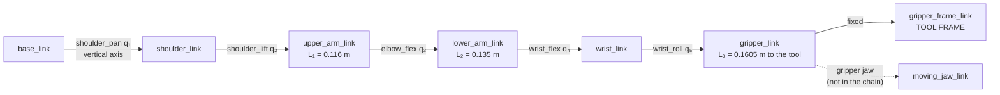

# 14.01 — Arm anatomy — joints, links, DOF, workspace, end effector

<!-- glance:start -->
<!-- generated by tools/build.py from curriculum/syllabus.yaml — edit the syllabus, not this block -->

| | |
|---|---|
| **Track** | Main path |
| **Difficulty** | Beginner |
| **Time** | 40 min |
| **Hardware** | none |
| **Software** | none |
| **Prerequisites** | [05.06 Robot frame conventions: REP-103 and REP-105 (map, odom, base_link, optical frames)](../05-frames-and-transforms/05.06-frame-conventions-rep103-rep105.md) |
| **Skip if** | You can count DOF and describe an arm's workspace. |

<!-- glance:end -->

## What you will learn

- Name every part of a serial arm (base, link, joint, wrist, end effector, tool frame) and point at each one on the SO-101.
- Count degrees of freedom, and state exactly which motions a 5-DOF arm cannot do — for the SO-101, in one sentence.
- Tell reachable, dexterous and *usable* workspace apart, and compute the SO-101's reach from its link lengths.
- Read joint limits out of a URDF and turn them into a workspace picture you can clamp a real arm against.
- Explain why the gripper's motor is not counted as an arm DOF.

## Why it matters

karmel can drive to the kitchen. It cannot pick up the mug. Module 14 adds the arm, and module 15 makes it grasp things.

Before any kinematics, you need to answer a question that has nothing to do with code: **is this task physically
possible with this arm?** "Put the mug down flat on the shelf 30 cm up" is a question about workspace and degrees of
freedom. Get it wrong and you will spend a week debugging an IK solver that is correctly telling you the target is
unreachable.

This lesson also decides something concrete and irreversible-ish: **where you clamp the arm on the desk**
([14.02](14.02-buying-and-assembling-the-arm.md)). Twenty minutes of workspace arithmetic now saves re-clamping the
arm after every failed pick.

<!-- prereqs:start -->
## Prerequisites

You need these first:

- [05.06 Robot frame conventions: REP-103 and REP-105 (map, odom, base_link, optical frames)](../05-frames-and-transforms/05.06-frame-conventions-rep103-rep105.md)

### Optional prerequisite links

None.

Check your readiness: `python course.py why 14.01`
<!-- prereqs:end -->

## Concept

A serial arm is a chain of rigid bodies. Each body is a **link**; each connection is a **joint** with exactly one
number you can control. Bolt the first link to the table, and every joint downstream carries everything beyond it.

The data structure is a linked list, and the payload of each edge is a coordinate transform:

```text
base ──T₁(q₁)──► link1 ──T₂(q₂)──► link2 ──T₃(q₃)──► … ──► tool
```

Each edge holds a fixed part (where the next joint is bolted, from the CAD) and one mutable field (the joint angle).
Computing where the gripper is, is a *fold* over that list: multiply the transforms left to right. That fold is
forward kinematics ([14.04](14.04-forward-kinematics.md)); running it backwards is inverse kinematics
([14.05](14.05-inverse-kinematics.md)). Everything in this module is that one picture.

Three vocabulary items that people mix up:

- **Joint.** One controlled number. **Revolute** joints rotate about an axis (an angle, in radians); **prismatic**
  joints slide along one (a length, in meters). A "spherical" or "ball" joint is really three revolute joints stacked,
  and that is how it appears in a URDF. The SO-101 is five revolute joints plus a gripper.
- **Link.** The rigid part between two joints. Its **length** is the distance between the two joint *axes*, not the
  length of the plastic part you can hold. On the SO-101 the upper arm's printed part runs about 14° off the line
  between its two axes, and the number that matters for kinematics is the axis-to-axis distance (0.116 m).
- **End effector.** Whatever is bolted at the end: a gripper, a suction cup, a pen. The **tool frame** (also
  "TCP", tool center point) is the frame you actually command — for the SO-101 it is `gripper_frame_link`, a point
  between the jaws whose z axis points the way the gripper approaches. The tool frame is a *choice*, expressed as one
  constant 4×4 transform from the last link. Put longer fingers on the arm and you change that constant; nothing else
  in your stack changes.

Serial arms are not the only kind. **Parallel** mechanisms (a delta 3D printer, a Stewart platform) drive the
end effector through several closed loops at once — stiffer and faster, harder kinematics, small workspace. Every arm
in this course is serial, because every cheap arm is serial: you can bolt one servo to the next and stop when it's
long enough.

> [!TIP]
> **Ask your teacher:** "Show me on the SO-101 picture where each of the five joint axes is, and which links they separate."

## Technical explanation

### Level 1 — Degrees of freedom, and what 5 costs you

A rigid body floating in 3D has **six** degrees of freedom: three of position $(x, y, z)$ and three of orientation
(roll, pitch, yaw). To put a mug anywhere in any attitude you need an arm with at least 6 DOF.

The **DOF of a serial arm is just the number of actuated joints.** There is no formula to learn — the Grübler count
that matters for closed chains collapses to "count the motors" for an open chain. So:

| Arm | Joints | DOF | Consequence |
|---|---|---|---|
| SO-101 (this course) | 5 R + gripper | **5** | One orientation freedom is missing (below) |
| Universal Robots UR5e | 6 R | 6 | Any reachable pose, in a finite number of ways |
| SCARA (pick-and-place) | R, R, P, R | 4 | Position + yaw only; the tool always points down |
| Delta (parallel) | 3 (+1) | 3–4 | Position only, very fast |
| Human shoulder→wrist | 3 + 1 + 1 + 2 | 7 | **Redundant**: infinitely many elbow positions for one hand pose |

Fewer than 6 DOF means the reachable poses form a lower-dimensional *surface* inside the 6-dimensional space of poses.
It does not mean "the arm is bad"; it means some tasks are geometrically impossible and you should know which.

**For the SO-101 the missing freedom has an exact, checkable description.** Its joints are: `shoulder_pan` about a
vertical axis, then `shoulder_lift`, `elbow_flex` and `wrist_flex` about three *parallel* horizontal axes, then
`wrist_roll` about the tool's own axis. The three parallel joints can only move the tool inside one vertical plane,
and `shoulder_pan` chooses which plane. Therefore:

> The compass direction the gripper points in is fixed by `shoulder_pan` alone. You cannot ask the SO-101 to sit at
> $(x, y)$ and approach from a *different* compass direction.

That is not hand-waving; it is exact. Over 500 random poses inside the joint limits, the azimuth of the tool's
approach axis equals $-q_1$ to within $4\times10^{-16}$ rad. `wrist_roll` spins the gripper about that approach axis
(so you *can* choose whether the jaws close left-right or up-down), and `wrist_flex` tilts it up and down within the
plane. What you cannot do is reach around the side of an object.

There is one wrinkle worth knowing before it confuses you in [14.05](14.05-inverse-kinematics.md): the wrist rides
**1.83 cm to the side** of the `shoulder_pan` plane, so the tool *position* is not in the plane even though the
approach *direction* is. Measured over 4,000 random poses, the tool sits between 0.3 mm and 18.3 mm off the plane
(mean 13.2 mm). A planar 2-link mental model is excellent for intuition and wrong by up to 2 cm in y.

### Level 2 — Practical: the SO-101's numbers

Everything below comes from the official URDF, copied verbatim into
[`code/data/so101_kinematics.yaml`](code/data/so101_kinematics.yaml).

| Joint | Axis | Limits (URDF) | What it does |
|---|---|---|---|
| `shoulder_pan` | vertical (base z) | −110° … +110° | Swings the whole arm left/right |
| `shoulder_lift` | horizontal | −100° … +100° | Raises/lowers the upper arm |
| `elbow_flex` | horizontal, ∥ lift | −96.8° … +96.8° | Bends the elbow |
| `wrist_flex` | horizontal, ∥ lift | −95° … +95° | Tilts the gripper up/down |
| `wrist_roll` | along the tool | −157.2° … +162.8° | Rotates the jaws about the approach axis |
| `gripper` (jaw) | — | −10° … +100° | Opens/closes one jaw. **Not an arm DOF** |

Link lengths, measured axis to axis (computed by `arm_kinematics.so101_link_lengths()`):

$$L_1 = 0.1160\ \text{m (shoulder\_lift} \to \text{elbow)},\quad
L_2 = 0.1350\ \text{m (elbow} \to \text{wrist\_flex)},\quad
L_3 = 0.1605\ \text{m (wrist\_flex} \to \text{tool)}$$

The `shoulder_lift` axis sits at $(0.0692, -0.0183, 0.1166)$ m in `base_link`, which is 0.1366 m from the base origin.
So the furthest the tool can possibly get from the base origin is

$$r_{\max} = 0.1366 + L_1 + L_2 + L_3 = 0.1366 + 0.4115 = 0.548\ \text{m}$$

and sampling 40,000 random poses inside the joint limits finds a maximum of **0.546 m** — the last 2 mm need the
`shoulder_lift` limit that the sampler never quite hits. That is the honest way to check a reach number: derive it,
then sample.

**Why the gripper is not an arm DOF.** It is a sixth servo, and you absolutely control it. But it moves the *jaw*
relative to the tool frame; it does not change where the tool frame is. DOF counts the freedoms of the thing you are
positioning. (Grip force and jaw geometry are module 15,
[15.01](../15-manipulation/15.01-physics-of-grasping.md)–[15.02](../15-manipulation/15.02-grippers.md).)

### Level 3 — Workspace: three different sets

**Reachable workspace** — the set of points the tool frame can reach with *at least one* orientation. Sample the joint
box, run FK on each sample, and you get a point cloud (`reach_limits_so101()`). For the SO-101:

| Quantity | Value |
|---|---|
| Max distance from base origin | 0.546 m |
| Max horizontal radius | 0.479 m |
| Max height above `base_link` | 0.527 m |
| Lowest point | −0.224 m (below the base — under the table, if the base sits on it) |
| Fraction of random poses with tool above the table (z > 0.02 m) | 72% |

**Dexterous workspace** — the points reachable with *every* orientation. For a 5-DOF arm this set is strictly empty:
there is always an approach direction you cannot produce (the one with a different azimuth). The textbook definition
is not useful here.

**Usable workspace** — the set you actually care about: reachable *with the orientation the task needs*, *without
colliding* with the table, the arm's own base, or your coffee. For "pick something off the table" that means: gripper
pointing straight down (approach pitch 90°), tool 3 cm above the table surface, and a convergent IK solution inside
the joint limits. That is a much smaller set, and it is what you should measure before you clamp the arm down
(Exercise 14.01-E2).

**The formula you will actually use**, for a planar 2-link mental model with links $l_1, l_2$: the tip can reach a
point at radius $r$ from the shoulder if

$$|l_1 - l_2| \le r \le l_1 + l_2$$

For the SO-101's upper arm and forearm, $0.019\ \text{m} \le r \le 0.251\ \text{m}$. Outside the outer circle the arm
is too short; inside the inner circle it cannot fold tightly enough. This is the reachability test that
[14.05](14.05-inverse-kinematics.md) turns into an IK solution count: 0, 1 or 2.

> [!TIP]
> **Ask your teacher:** "Give me three tasks and ask me, for each, whether the SO-101's 5 DOF are enough — before I look at the answer."

### Level 4 — Where the frames live

The kinematic model is a chain of **frames**, named the REP-103 way you met in
[05.06](../05-frames-and-transforms/05.06-frame-conventions-rep103-rep105.md): x forward, y left, z up, meters and
radians. `base_link` is at the arm's mounting plate. Each joint's child frame has its origin *on the joint axis*.

The SO-101's URDF zero pose is a mirrored "L": upper arm roughly vertical, forearm horizontal and forward, so at
$q = 0$ the tool is at

$$p_{\text{tool}}(0) = (0.3914,\ 0.0000,\ 0.2265)\ \text{m}$$

with the approach axis pointing horizontally forward (pitch 0°). Note this is a *modelling* zero, not necessarily the
zero your servos report; LeRobot's calibration defines 0° as the middle of each joint's recorded range, and matching
the two is a job for [14.03](14.03-controlling-servos.md).

## Diagram

```text
 SO-101, side view at the URDF zero pose (shoulder_pan = 0), base_link frame, x forward / z up

    z
    ▲                                    wrist_flex axis            tool frame
    │                                     (⊗ into page)          gripper_frame_link
 0.23│           ● ──────── L2 = 0.135 ──────── ● ───── L3 = 0.1605 ─────► ◫ ──► z_tool
    │           ⊗ elbow_flex                    ⊗                          (approach axis,
    │           │                                                           horizontal here)
    │        L1 = 0.116                             wrist_roll spins the jaws about z_tool
 0.12│           │
    │           ⊗ shoulder_lift axis  (0.0692, −0.0183, 0.1166)
 0.06│      ╭────┴────╮
    │      │ shoulder │  ⊙ shoulder_pan axis (vertical, out of the table)
   0└──────┴═════════┴──────────────────────────────────────────────────────────►  x
    0    0.04      table top (base plate sits here)                          0.39 m

    ⊗ = axis into the page   ⊙ = axis out of the page
    Everything below z = 0 is inside the table: reachable in the model, not in your kitchen.
```



The dashed branch is the point of "the gripper is not an arm DOF": it hangs off the chain instead of extending it.

## Code

[`code/arm_kinematics.py`](code/arm_kinematics.py) is the module's kinematics library. For this lesson you only need
three of its functions:

```python
import numpy as np
import arm_kinematics as ak

arm = ak.load_so101()                       # the chain, straight from the URDF numbers
print(arm.n_dof, arm.joint_names)           # 5 ['shoulder_pan', 'shoulder_lift', ...]
print(np.degrees(arm.lower).round(1))       # [-110. -100.  -96.8 -95.  -157.2]
print(ak.so101_link_lengths(arm))           # axis-to-axis link lengths, meters
print(arm.fk(np.zeros(5))[:3, 3])           # tool position at q = 0
cloud = ak.reach_limits_so101(arm, samples=20000)   # (20000, 3) reachable tool points
```

Run it as a script for the whole summary:

```bash
cd 14-robotic-arm/code
py arm_kinematics.py
```

```text
SO-101 joints: ['shoulder_pan', 'shoulder_lift', 'elbow_flex', 'wrist_flex', 'wrist_roll']
link lengths [m]: {'shoulder_lift_to_elbow': 0.116, 'elbow_to_wrist_flex': 0.135, 'wrist_flex_to_tool': 0.1605}
T_base_tool at q = 0:
 [[ 0.     -0.      1.      0.3914]
 [ 0.0487  0.9988  0.     -0.    ]
 [-0.9988  0.0487  0.      0.2265]
 [ 0.      0.      0.      1.    ]]
approach pitch at q = 0: -0.00 deg
```

And the pictures — [`code/arm_viz.py`](code/arm_viz.py) writes PNGs, no display needed:

```bash
py arm_viz.py so101 --q 0 -30 40 60 0      # stick figure with every joint frame
py arm_viz.py workspace                    # the reachable cloud, side and top view
```

## Exercise

### Exercise 14.01-E1 — Count the DOF, name the missing freedom `[numerical]`

Hardware: none. For each arm, state the DOF and one concrete task it **cannot** do:

1. SO-101 (this course).
2. A SCARA arm: revolute, revolute, prismatic (vertical), revolute (about the vertical).
3. A 4-DOF arm: pan, lift, elbow, wrist-flex — the SO-101 with `wrist_roll` removed.
4. A 7-DOF arm (a UR5e with one extra joint).

For (1) verify your answer with code rather than trusting the text: sample 200 random joint vectors, compute each
tool's approach azimuth $\text{atan2}(a_y, a_x)$ from `arm.fk(q)[:3, 2]`, and compare it with $-q_1$.

### Exercise 14.01-E2 — Measure the usable top-down workspace `[coding]`

Hardware: none (this is exactly why you do it before buying the arm). Write `top_down_map(chain, z_table=0.0,
clearance=0.03)` that, over a grid of $x \in [0.05, 0.45]$, $y \in [-0.30, 0.30]$ at 1 cm spacing, asks
`ak.ik_dls(chain, (x, y, z_table + clearance), q0, target_pitch=math.radians(90))` for a straight-down grasp and
records whether it converged. Print the reachable fraction, the x and y extents, and the largest axis-aligned
rectangle of fully reachable cells.

Then answer the practical question: **if your task area is a 25 cm × 20 cm tray, where do you clamp the arm?**

### Exercise 14.01-E3 — Predict the workspace shape `[predict]`

Hardware: none. Before running anything, sketch (on paper) the side view of the reachable cloud for
`shoulder_pan = 0`. **Predict:** (a) is the outer boundary a circle? (b) is there a hole near the base? (c) how far
below the table top does the cloud extend? Then run `py arm_viz.py workspace` and compare with your sketch.

### Exercise 14.01-E4 — Clamp placement `[design]`

Hardware: none (a tape measure from the `tools` catalog item helps). You have a 120 × 60 cm desk. The arm must be able
to (a) pick a 7 cm ball anywhere in a 30 × 20 cm tray, (b) drop it into a bin 10 cm tall, and (c) never sweep over
your keyboard. Write down: the clamp position, the tray position, the bin position, and the check that each is inside
the usable workspace from E2. One paragraph, with numbers.

## Expected result

- **14.01-E1:** (1) SO-101, **5 DOF** — cannot reach a fixed point from a different compass direction, e.g. it cannot
  grasp the handle of a mug that faces sideways without moving its whole body; `max |azimuth(approach) + q₁|` over the
  200 samples comes out at about $4\times10^{-16}$ rad (floating-point zero), confirming the constraint exactly.
  (2) SCARA, **4 DOF** — the tool always points straight down, so it cannot pick anything up sideways from a shelf.
  (3) **4 DOF** — the jaws are locked to one roll angle, so a pen lying across the approach direction cannot be picked
  up along its length. (4) **7 DOF, redundant** — every reachable pose has a one-parameter family of joint solutions
  ("elbow swivel"), which is used to avoid obstacles, not to reach further. Note that the task is unchanged: the
  redundant arm still cannot exceed its reach.
- **14.01-E2:** With the base at the table top ($z_{table} = 0$) and a 3 cm clearance, about 40% of the
  0.40 m × 0.60 m grid is reachable straight-down; x runs from about 0.09 m to 0.38 m, y from about −0.26 m to
  +0.26 m, and the widest band is near x ≈ 0.20–0.25 m. The largest fully-reachable rectangle is roughly
  0.17 m × 0.34 m ≈ 0.058 m². Your exact numbers depend on the IK seed and iteration budget — report them, and note
  that a failure near the boundary means "my solver gave up", not necessarily "unreachable". A 25 × 20 cm tray fits,
  but only if you center it about 22 cm in front of the arm, not at the edge of the reach.
- **14.01-E3:** (a) **Not a circle.** The outer boundary is a circle only where all three flex joints can straighten;
  the joint limits (±100°, ±96.8°, ±95°) cut the top and bottom, so the cloud looks like a lopsided kidney.
  (b) **Yes**, there is an empty region near the base: with $|L_1 - L_2| = 0.019$ m the arm cannot fold onto itself,
  and the 0.1605 m wrist-to-tool link pushes the hole much larger than that. (c) About **0.22 m below** `base_link` —
  reachable in the model, solid table in reality. This is the single most common "why did my IK return a pose that
  crashed the arm into the desk" cause.
- **14.01-E4:** Any answer with numbers is acceptable if the checks hold. A workable one: clamp the arm at the desk's
  rear edge, base at $(0, 0)$ with x pointing at you; tray centered at $x = 0.22$ m, $y = 0$, occupying
  $x \in [0.145, 0.295]$, $y \in [-0.10, +0.10]$ — fully inside the E2 rectangle; bin at $x = 0.22$ m, $y = -0.25$ m
  (a straight `shoulder_pan` swing away, within the ±110° limit, and top-down reachable); keyboard placed behind the
  arm, outside the ±110° pan sector, so the arm physically cannot sweep over it. State the worst case: a runaway to
  `shoulder_pan = ±110°` at full extension sweeps a 0.48 m radius — nothing fragile inside that circle.

## Troubleshooting

### Symptom: the reach you measure with a ruler doesn't match the model's 0.546 m

1. Measure from the right origin. The 0.546 m is from `base_link` (the mounting plate), not from the shoulder joint
   and not from the table edge. Compare against `arm.fk(q)[:3, 3]` with the same $q$ you posed the arm in.
2. Check which point you are measuring to. The model's tool frame is *between the jaws*, roughly 1 cm behind the
   fingertips. A "reach" measured to the fingertip will be longer.
3. Confirm your arm is the same variant. The kinematics file is `so101_new_calib.urdf`; older SO-ARM100 printed parts
   have slightly different link lengths. Compare `so101_link_lengths()` with a caliper on your arm — they should agree
   within a millimetre or two.

### Symptom: IK "fails" at points that look obviously reachable

1. Check the orientation you asked for, not the position. A point can be reachable head-on and unreachable
   straight-down, because the wrist runs out of `wrist_flex` range.
2. Check the azimuth constraint: if your target orientation's compass direction differs from $-q_1$ at the target
   position, no 5-DOF solution exists. This is a *geometry* answer, not a solver failure.
3. Check the seed. [14.05](14.05-inverse-kinematics.md) shows numerical IK stalling in a local minimum from a bad
   start; re-seed from a pose near the target.

### Symptom: the arm can reach the object but knocks the table on the way

The reachable workspace includes points *under the table*, and nothing in this lesson's model knows the table exists.
Add the table as a collision object before you trust a plan ([14.09](14.09-moveit2-motion-planning.md)); until then,
clamp a software z-floor into every command ([14.11](14.11-arm-safety.md)).

## Common mistakes

- **Counting the gripper as a DOF.** "My 6-DOF SO-101" — no. Five joints move the tool frame; the sixth opens a jaw.
  When you later look for a 6-DOF IK solver, this mistake costs an afternoon.
- **Using the printed part's length as the link length.** The number that matters is the distance between joint
  *axes*. On the SO-101's upper arm those differ by about 14° of direction.
- **Assuming the arm is planar.** Three parallel joints suggest a plane; the wrist is 1.83 cm off it. A planar model
  is a good *intuition* and a 2 cm error.
- **Treating the reachable workspace as usable.** It includes poses inside your desk, poses where the arm folds onto
  its own base, and poses where the gripper points uselessly upward.
- **Measuring the workspace after clamping the arm.** Do it in numpy first; clamps leave marks.
- **Forgetting that the base frame's zero is a modelling choice.** The URDF's $q = 0$ and your servo's reported 0°
  are two different things until [14.03](14.03-controlling-servos.md) ties them together.

## Knowledge check

1. An arm has joints: revolute, revolute, prismatic, revolute, revolute, revolute. How many DOF, and can it place a
   rigid body in an arbitrary pose inside its reach?
   <details><summary>Answer</summary>

   Six DOF (count the actuated joints; the prismatic one counts too). Six DOF is enough to reach an arbitrary pose
   *in principle*, but only if the axes are arranged so the Jacobian has rank 6 there — a badly arranged 6-DOF arm
   is singular over large regions. Count first, then check the Jacobian ([14.06](14.06-jacobian.md)).
   </details>

2. Why is a 7-DOF arm called redundant, and what do you buy with the extra joint?
   <details><summary>Answer</summary>

   Seven joints map onto a six-dimensional pose space, so for one tool pose there is a one-parameter family of joint
   solutions (swing the elbow around the shoulder–wrist line). You buy obstacle avoidance, singularity avoidance and
   joint-limit avoidance — not extra reach.
   </details>

3. The SO-101's tool is at $(0.25, 0.10, 0.05)$ with the gripper pointing straight down. You want to approach the same
   point from the north instead. Possible?
   <details><summary>Answer</summary>

   Pointing straight down is the one approach direction whose azimuth is undefined, so *that* case is fine. But if you
   ask for a horizontal approach from a chosen compass direction, it is possible only if that direction equals $-q_1$,
   and $q_1$ is already determined (up to the 1.83 cm wrist offset) by the target position. So in general: no.
   You must move the arm's base — which is exactly why module 15 ends with mobile manipulation
   ([15.10](../15-manipulation/15.10-mobile-manipulation.md)).
   </details>

4. A planar 2-link arm has $l_1 = 0.116$, $l_2 = 0.135$. Which of these radii are reachable: 0.010, 0.030, 0.250,
   0.260 m?
   <details><summary>Answer</summary>

   Reachable iff $|l_1 - l_2| = 0.019 \le r \le l_1 + l_2 = 0.251$. So: 0.010 no (inside the hole), 0.030 yes,
   0.250 yes, 0.260 no (too far).
   </details>

5. Predict: you double every link length of the SO-101 but keep the same servos and joint limits. What happens to
   the reach, and what happens to the payload?
   <details><summary>Answer</summary>

   Reach roughly doubles (0.55 → ~1.1 m). Payload roughly **halves at best**: the torque a joint must supply is
   force × lever arm, so double the arm and the same servo holds half the load — before you count the arm's own extra
   weight, which grows too and eats most of the remaining budget. Cheap long arms are the classic beginner trap;
   [14.06](14.06-jacobian.md) turns "lever arm" into $\tau = J^T F$.
   </details>

6. Your IK returns a joint vector whose FK lands at $z = -0.15$ m. What is wrong, and what should the code do?
   <details><summary>Answer</summary>

   Nothing is wrong with the IK — that point is inside the reachable workspace of the *model*, which has no table in
   it. The code must reject the solution: a workspace box check (z above the table plus clearance, |y| within a
   limit, x within a limit) belongs between IK and the servos, before anything moves
   ([14.11](14.11-arm-safety.md)).
   </details>

7. Why does the course model the tool frame as `gripper_frame_link` rather than "the tip of the fixed finger"?
   <details><summary>Answer</summary>

   Because a point between the jaws is what you want to place *on* the object: a grasp is "put the tool frame at the
   object's center, jaws straddling it". And because a tool frame is one constant transform from the last link, you
   can redefine it for a new fingertip without touching the kinematics, the IK or the controller.
   </details>

## Practical challenge

Write `usable_workspace(chain, z_table, pitch_rad, clearance, step=0.01)` that returns a boolean occupancy grid over
$(x, y)$ of the poses the arm can actually use, plus the largest fully-reachable axis-aligned rectangle, and render it
as a PNG with the tray and bin from Exercise E4 drawn on top.

Acceptance criteria:

- The grid marks a cell reachable only when IK converges **and** the solution is inside the joint limits **and** the
  whole wrist-to-tool link stays above `z_table + clearance` (check a few points along the link, not just the tip).
- Running it for `pitch_rad = π/2` (straight down) and for `pitch_rad = π/4` (45° approach) produces visibly different
  maps, and you can explain in one sentence which grows and why.
- It finishes in under 60 seconds for a 1 cm grid over 0.40 × 0.60 m (warm-start each IK call from the previous
  cell's solution — the naive version takes minutes).
- A pytest file asserts that a point you measured as reachable on paper is marked reachable, and that a point 0.60 m
  away is not.

## You can skip this if…

You can answer knowledge-check questions 1, 3 and 4 without looking, and you can state from memory what the SO-101's
five joints are and what its 5 DOF cannot do. Then:
`python course.py skip 14.01 --reason "fluent with DOF, workspace and serial-arm anatomy"`.

## Go deeper

- ROS REP-103, units and coordinate conventions (why every number here is meters and radians, x forward, z up):
  https://www.ros.org/reps/rep-0103.html
- Lynch & Park, *Modern Robotics*, chapter 2 "Configuration space" — the rigorous version of DOF, workspace and
  constraints, free PDF: https://hades.mech.northwestern.edu/index.php/Modern_Robotics
- Peter Corke, *Robotics, Vision and Control* (3rd ed.), chapter 7 "Robot arm kinematics" — the same material with
  MATLAB/Python toolbox examples: https://petercorke.com/rvc/
- The SO-101's source of truth, TheRobotStudio's SO-ARM100 repository (URDF, printed parts, BOM):
  https://github.com/TheRobotStudio/SO-ARM100
- Hugging Face LeRobot's SO-101 page (assembly photos that make the joint names concrete):
  https://huggingface.co/docs/lerobot/so101

## Progress checkpoint

- [ ] I can name the SO-101's five joints, its links and its tool frame, and point at each on a photo.
- [ ] I can count an arm's DOF and state one task it cannot do.
- [ ] I can state the SO-101's exact 5-DOF limitation in one sentence.
- [ ] I can compute the reach from link lengths and check it against a sampled point cloud.
- [ ] I have measured the usable top-down workspace and know where to clamp the arm.

`python course.py complete 14.01` (exercises done) · `python course.py master 14.01` (challenge done) ·
`python course.py struggle 14.01 "what was hard"`

Next: [14.02 — Buying and assembling the arm; servo setup and calibration](14.02-buying-and-assembling-the-arm.md).
