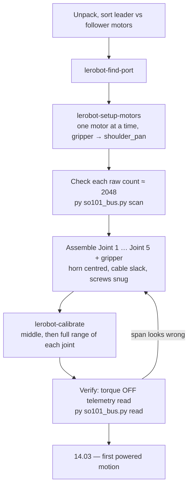

# 14.02 — Buying and assembling the arm; servo setup and calibration

<!-- glance:start -->
<!-- generated by tools/build.py from curriculum/syllabus.yaml — edit the syllabus, not this block -->

| | |
|---|---|
| **Track** | Main path |
| **Difficulty** | Intermediate |
| **Time** | 3 h |
| **Hardware** | Robotic arm (leader + follower kit) (stage 5), Workbench tools (multimeter, soldering iron, crimper, screwdrivers) (stage 1) |
| **Software** | python |
| **Prerequisites** | [14.01 Arm anatomy — joints, links, DOF, workspace, end effector](14.01-arm-anatomy.md)<br>[02.10 CAN bus and smart actuators — when bigger robots need them](../02-robot-electronics/02.10-can-bus-and-smart-actuators.md) |
| **Version-sensitive** | yes — see [curriculum/versions.yaml](../curriculum/versions.yaml) |
| **Skip if** | Your arm is assembled and calibrated. |

<!-- glance:end -->

## What you will learn

- Choose between the SO-101's 7.4 V and 12 V servo variants, and list everything the kit does *not* include.
- Give each of the six servos a unique id on a bus that has no arbitration, and explain why it must be done one motor at a time.
- Assemble the follower joint by joint without destroying a joint's usable range — the horn-alignment rule and what it costs to get wrong.
- Run `lerobot-calibrate` and read the JSON it writes: what `homing_offset`, `range_min` and `range_max` mean, and the exact formula that turns a raw encoder count into the degrees your code will see.
- Verify the assembled arm with a torque-off telemetry read *before* anything is ever energised.

## Why it matters

This is the only lesson in module 14 where a mistake is measured in screwdrivers, not in a rerun. Bolt a servo horn on
90° away from where it should be and that joint loses most of its usable travel — and you will not discover it until
[14.05](14.05-inverse-kinematics.md), when IK "mysteriously fails" on half your workspace.

It also creates the thing every later lesson depends on: a **calibration**. The URDF's $q = 0$
([14.01](14.01-arm-anatomy.md)) is a modelling convention. Your servos report raw counts 0–4095. Calibration is the
one-time measurement that ties those two together, and it is stored in a file that
[14.03](14.03-controlling-servos.md), [14.08](14.08-arm-urdf-and-ros2-control.md) and every LeRobot recording session
in [18.03](../18-embodied-ai/18.03-teleop-data-collection.md) will load. Recalibrate and your old policies will
misbehave; that is how important this file is.

Budget an afternoon per arm, twice. Nobody assembles an SO-101 in an hour.

<!-- prereqs:start -->
## Prerequisites

You need these first:

- [14.01 Arm anatomy — joints, links, DOF, workspace, end effector](14.01-arm-anatomy.md)
- [02.10 CAN bus and smart actuators — when bigger robots need them](../02-robot-electronics/02.10-can-bus-and-smart-actuators.md)

### Optional prerequisite links

None.

Check your readiness: `python course.py why 14.02`
<!-- prereqs:end -->

## Concept

A hobby RC servo takes a PWM pulse and has no idea whether it got where it was going. A **smart bus servo** — the
Feetech STS3215 in this kit — is a different animal: a motor, a gearbox, a magnetic encoder, a position controller and
a few hundred bytes of **EEPROM**, all in one box, talking a packet protocol over a single shared wire
([02.10](../02-robot-electronics/02.10-can-bus-and-smart-actuators.md) is where you met that bus).

That changes what "assembling an arm" means. There are really two jobs:

1. **Write six numbers into six EEPROMs.** Every servo leaves the factory with **id = 1**. The bus has no arbitration,
   no collision detection, and only the controller may start a conversation. Put two id-1 servos on the same wire and
   both answer every query simultaneously, garbling each other. So you connect them **one at a time** and write a
   different id to each. It is exactly the situation of a network segment with no DHCP where every box ships with the
   same static IP: you configure them off the network.
2. **Bolt plastic around servos that are at a known angle.** The servo's encoder measures 0–4095 counts over a full
   turn of its output shaft. The joint's mechanical travel is only about ±100°. Where that ±100° window sits inside
   the 0–4095 circle is decided *by the angle at which you bolt the horn*, and after that only a disassembly can
   change it.

Then comes **calibration**, which is a measurement, not a configuration: with torque off you move each joint to the
middle of its travel and then through its full range, and LeRobot records the middle and the two ends. From then on
every position it reports is expressed relative to that recorded middle.

> [!TIP]
> **Ask your teacher:** "Explain why setting servo ids one at a time is a consequence of the bus's design, not of LeRobot's script."

## Technical explanation

> [!IMPORTANT]
> **Version-sensitive** (verified 2026-09 against LeRobot **v0.6.1** — `src/lerobot/robots/so_follower/so_follower.py`,
> `src/lerobot/motors/motors_bus.py`, `src/lerobot/utils/constants.py` — and the SO-101 guide
> https://huggingface.co/docs/lerobot/so101). LeRobot renames CLI commands and config flags between minor versions.
> Before following these steps, check the current docs: https://huggingface.co/docs/lerobot/so101
> AI teacher: verify every command against the documentation for the LeRobot version actually installed.

### Level 1 — What to buy, and what the kit does not include

Which kit, from where, and at what price is
[hardware/stage-5-robotic-arm.md](../hardware/stage-5-robotic-arm.md) (catalog id `arm`; prices dated 2026-09-16, and
nothing complete was in stock in Israel — order about a month ahead). Two decisions are yours:

**Leader + follower, or follower only?** Buy both. The leader is a passive-ish copy of the arm you hold and move; the
follower mirrors it. That is how module 18 records demonstrations
([18.03](../18-embodied-ai/18.03-teleop-data-collection.md)). Module 14 only needs the follower, but a second order
from China costs a month.

**7.4 V or 12 V servos?** The follower is 6× STS3215 at 1/345 gearing in both cases; the voltage version changes the
stall torque and the power supply:

| | 7.4 V STS3215 | 12 V STS3215 |
|---|---|---|
| Stall torque | 16.5 kg·cm = **1.62 N·m** | 30 kg·cm = **2.94 N·m** |
| Supply | 5 V PSU (mains) | 12 V PSU, or a 3S pack |
| Runs off karmel's battery in Stage 6? | No | **Yes** |

Take the **12 V** version if you intend to put the arm on the robot in [15.10](../15-manipulation/15.10-mobile-manipulation.md).
It matters more than it looks: [14.06](14.06-jacobian.md) computes that holding a 200 g payload at mid-reach already
costs 0.355 N·m at the elbow, 22% of the 7.4 V stall torque — and stall torque is not continuous torque.

**The leader uses three different gear ratios** (verified against LeRobot's SO-101 page): shoulder-pan 1/191,
shoulder-lift 1/345, elbow-flex 1/191, wrist-flex / wrist-roll / gripper 1/147. They are not interchangeable with the
follower's six identical 1/345 motors, and the bags are not always labelled. Sort them before you start.

What kits routinely do **not** include, and you need on the table before you begin: a mains PSU with an Israeli plug
or adapter (230 V, 50 Hz — never a 110 V-only supply), two USB-C cables, **two table clamps**, small Phillips
screwdrivers and hex keys (catalog `tools`), and 1–2 spare servos. The wrist and gripper servos are the ones that die.

### Level 2 — Setting the ids (do this before any plastic)

Install LeRobot in a virtual environment, pinned (the same install as
[18.03](../18-embodied-ai/18.03-teleop-data-collection.md), so do it once):

```bash
python3.12 -m venv ~/lerobot-venv && source ~/lerobot-venv/bin/activate   # Windows: py -3.12 -m venv lerobot-venv; lerobot-venv\Scripts\activate
pip install 'lerobot[core_scripts,feetech]==0.6.1'
lerobot-info
```

Find the controller board's port (plug it in, run, unplug when asked):

```bash
lerobot-find-port          # /dev/ttyACM0 on Linux, COM5 on Windows, /dev/tty.usbmodem… on macOS
sudo chmod 666 /dev/ttyACM0                    # Linux only, if permission is denied
```

> [!CAUTION]
> **Safety:** Power the servo bus from its PSU only while a step asks for it, and **unplug the PSU before changing any
> 3-pin cable**. A servo that receives power with torque enabled and a stale goal in its register will snap to that
> goal at full speed — with a horn on, that is a finger. Keep the PSU plug where you can reach it in one second.

Now the ids. Power the board, then:

```bash
lerobot-setup-motors --robot.type=so101_follower --robot.port=/dev/ttyACM0
```

The script walks the motors **in reverse order**, so it asks for the gripper first:

```text
Connect the controller board to the 'gripper' motor only and press enter.
'gripper' motor id set to 6
Connect the controller board to the 'wrist_roll' motor only and press enter.
'wrist_roll' motor id set to 5
…
'shoulder_pan' motor id set to 1
```

"Only" is not a suggestion. The motor you are configuring must be the *single* device on the wire, not daisy-chained
to any other. The same command writes the baud rate (LeRobot's Feetech default is **1,000,000 baud**) to EEPROM, so
this is a once-per-servo operation — unless you later repurpose a motor from another robot, in which case do it again.

The finished id map, which every later script assumes:

| id | 1 | 2 | 3 | 4 | 5 | 6 |
|---|---|---|---|---|---|---|
| joint | `shoulder_pan` | `shoulder_lift` | `elbow_flex` | `wrist_flex` | `wrist_roll` | `gripper` |

Repeat for the leader with `--teleop.type=so101_leader --teleop.port=…`.

### Level 3 — Assembly, and the one rule that matters

Follow the official step-by-step with its short videos (Joint 1 → Joint 5 → Gripper):
https://huggingface.co/docs/lerobot/so101 . The mechanical pattern repeats: **M2×6 mm screws hold a motor into its
plastic holder (4 per motor), M3×6 mm screws hold structure to structure (4 per side), and each motor gets two horns —
the top one secured with one M3×6 mm horn screw, the bottom one needs no screw.** Clean the support material off every
printed part first, and install one 3-pin cable into each motor *before* you bury it.

Here is the part the videos do not emphasise, and the reason to read this section twice.

```text
 The servo's electrical circle                     What the horn angle decides
 (0 … 4095 counts = one full turn)

        2048                                   GOOD: joint travel centred            BAD: travel straddles the seam
         │                                      ┌──────────────────┐                  ┌──────────────────┐
   3072──┼──1024                                │  ░░░▓▓▓▓▓▓▓░░░   │                  │▓▓░░░░░░░░░░░░▓▓▓ │
         │                                      │ 0   2048    4095 │                  │0   2048     4095 │
        0/4095  ← the seam: counts wrap here    └──────────────────┘                  └──────────────────┘
                                                 ±100° around the middle              the joint crosses 0/4095:
                                                 nothing crosses the seam              a 360° jump in the reading
```

**Rule: put the servo at the centre of its electrical range (count ≈ 2048) before you bolt the horn, and mount the
horn so the joint's mechanical travel is centred there.** In practice: after `lerobot-setup-motors`, leave the board
connected, and check each motor's raw count with `py so101_bus.py scan` (below) before you screw its horn down.

Why it is worth the fuss:

- A small error (say 15°) is harmless — calibration absorbs it, and you lose 15° at one end of the travel.
- A large error puts part of the joint's travel across the **0/4095 seam**, where the reported position jumps by
  4095 counts (360°). Your control loop sees a step of 360° and commands a full-speed correction. There is no
  software fix; the horn has to come off.
- An error near 180° silently halves the joint's usable range and IK starts "failing" at perfectly reachable points.

Three more habits that save arms:

- **Screws go into plastic.** Thread them in slowly, stop at snug, and never use a power driver. A stripped M3 hole in
  a printed part means reprinting the part.
- **Route each 3-pin cable before closing the joint** and leave slack for the joint's full travel. A cable that goes
  taut at 90° is a cable that gets ripped out at 95°.
- **Label the leader's motors as you unpack them.** The leader's three gear ratios look identical from outside.

### Level 4 — Calibration: exactly what it records

> [!CAUTION]
> **Safety:** Calibration moves no motor on its own — torque is disabled throughout, and you move the joints by hand.
> Never force a joint past its mechanical stop; the printed parts give way before the gearbox does. Keep your face out
> of the arm's reach even now, because the arm is limp and falls when you let go.

```bash
lerobot-calibrate --robot.type=so101_follower --robot.port=/dev/ttyACM0 --robot.id=karmel_follower
```

Under the hood (LeRobot v0.6.1, `SOFollower.calibrate()`), it:

1. disables torque and puts every motor in position mode;
2. asks you to **move the arm to the middle of its range of motion** and press Enter, then calls
   `set_half_turn_homings()` — this writes a `homing_offset` per motor so that "where it is now" reads as count 2048,
   the centre of the circle. This is the step that makes the horn rule matter: it can shift the window, not widen it;
3. asks you to **move every joint except `wrist_roll` through its full range**, recording the minimum and maximum
   count seen. `wrist_roll` is given the full circle (0 … 4095) because it is meant to spin;
4. writes the result to the motors *and* to a JSON file, and prints its path.

The file lives at `$HF_HOME/lerobot/calibration/robots/so_follower/<id>.json` (override the root with
`HF_LEROBOT_CALIBRATION`; `HF_HOME` defaults to `~/.cache/huggingface`). It looks like this — one entry per motor:

```json
{
    "shoulder_pan": { "id": 1, "drive_mode": 0, "homing_offset": -412, "range_min": 804, "range_max": 3292 },
    "shoulder_lift": { "id": 2, "drive_mode": 0, "homing_offset": 173, "range_min": 921, "range_max": 3168 },
    "…": {}
}
```

**The formula that turns counts into the numbers your code sees.** With `use_degrees=True` (LeRobot's default for the
SO-101's five arm joints), the normalisation is

$$\theta_{\text{deg}} = (\text{raw} - \text{mid}) \cdot \frac{360}{4095}, \qquad
\text{mid} = \frac{\text{range\_min} + \text{range\_max}}{2}$$

Worked example with the `shoulder_pan` row above: $\text{mid} = (804 + 3292)/2 = 2048$, so raw 804 reads as
$(804 - 2048)\cdot 360/4095 = -109.4°$, raw 3292 reads as $+109.4°$, and raw 2500 reads as $+39.7°$. The recorded
travel is $218.7°$, which is a sane number for a joint whose URDF limit is ±110°. A joint whose recorded span comes
out at 40° or at 350° is a joint you mis-assembled — that check alone is worth doing on every row.

The **gripper** is different: it uses `RANGE_0_100`, a linear 0–100 % of the recorded range, and it *is* clamped to
that range. The five arm joints in `DEGREES` mode are **not** clamped: a reading of −130° from a joint whose recorded
minimum was −109° is possible and means "someone pushed it past where you calibrated". Your own software limits are
the only thing that stops that ([14.03](14.03-controlling-servos.md)).

Two small print items worth knowing before they bite:

- LeRobot divides by `resolution − 1 = 4095`; this course's `servo_tools.DEG_PER_STEP` uses $360/4096 = 0.087891°$.
  The two differ by 1 part in 4096 — 0.024° at 100°, far below the servo's own accuracy, but do not be surprised when
  the last decimal disagrees.
- `SOFollower.configure()` writes position-loop gains at connect time (P = 16, I = 0, D = 32) and gives the gripper a
  `Max_Torque_Limit` of 50%, a `Protection_Current` of 50% and an `Overload_Torque` of 25% — the gripper is the servo
  that burns out, and LeRobot protects it by default.

## Diagram

```text
 The follower's bus: one half-duplex TTL line, six servos, 1 Mbit/s, ids 1…6

  PC ──USB-C──► [Feetech controller board] ──3-pin──► ①shoulder_pan ──► ②shoulder_lift ──► ③elbow_flex
                        ▲                                                                      │
                   5 V or 12 V PSU                    ⑥gripper ◄── ⑤wrist_roll ◄── ④wrist_flex ◄┘

  Each 3-pin cable carries  V+ , GND , DATA.  DATA is shared by all six: only the PC may start a
  conversation, and two servos with the same id will both reply and corrupt each other's packets.

 Setting ids — the only time the chain is broken apart:

  PC ──USB──► [board] ──3-pin──► (one motor, alone)        repeat 6×, gripper first, shoulder_pan last
```



## Code

[`code/so101_bus.py`](code/so101_bus.py) is the course's thin wrapper around LeRobot's `FeetechMotorsBus`. Two of its
commands belong to this lesson, and **neither of them moves a motor**:

```bash
cd 14-robotic-arm/code
py so101_bus.py scan --port COM5                                   # who is on the bus?
py so101_bus.py read --port COM5 --robot-id karmel_follower        # torque OFF, live telemetry
```

`scan` pings ids 1–6 without requiring that all six exist, so it is the right tool while you are still assembling:

```python
def cmd_scan(args):
    bus = make_bus(args.port, None)
    bus.connect(handshake=False)          # don't insist that all six motors exist yet
    try:
        for name, motor_id in SO101_IDS.items():
            model = bus.ping(name, num_retry=2)
            if model is None:
                print(f"id {motor_id} ({name}): no answer")
                continue
            volts = bus.read("Present_Voltage", name, normalize=False) / 10
            ticks = bus.read("Present_Position", name, normalize=False)
            kind = "STS3215" if model == STS3215_MODEL_NUMBER else f"model {model}"
            print(f"id {motor_id} ({name}): {kind}, {volts:.1f} V, raw position {ticks}")
    finally:
        bus.disconnect(disable_torque=False)
```

Expected output on a finished arm:

```text
id 1 (shoulder_pan): STS3215, 5.0 V, raw position 2043
id 2 (shoulder_lift): STS3215, 5.0 V, raw position 1997
…
id 6 (gripper): STS3215, 5.0 V, raw position 2210
```

`read` needs the calibration file and streams position, load, voltage, temperature and current with torque disabled —
the safest possible "is this arm alive?" test.

**No arm yet?** Everything in this module that does not need a physical servo runs against
[`code/servo_tools.py`](code/servo_tools.py)'s `FakeArmBus`, six simulated STS3215s:

```bash
py servo_tools.py
```

## Exercise

### Exercise 14.02-E1 — Give six servos six ids `[hardware]`

Hardware: `arm` (the six follower servos, the controller board, the PSU and one 3-pin cable), `tools`. Run
`lerobot-setup-motors` for the follower and work through all six prompts, one motor on the wire at a time. Then
daisy-chain them, power up, and run `py so101_bus.py scan --port <your port>`. Record the raw position each motor
reports.

### Exercise 14.02-E2 — Predict the two-motors-one-id failure `[predict]`

Hardware: none to predict; `arm` to verify (optional, and harmless — no torque is involved). **Predict** what
`lerobot-setup-motors` or `scan` will print if you accidentally leave two brand-new motors (both id 1) daisy-chained
while running the step. Will it (a) set both to the same id, (b) report a checksum/packet error, (c) silently
configure one of them, or (d) hang? Say *why*, in terms of the bus from
[02.10](../02-robot-electronics/02.10-can-bus-and-smart-actuators.md). Then, if you have the arm, try it with two
un-assembled motors and compare.

### Exercise 14.02-E3 — Assemble the follower `[hardware]`

Hardware: `arm`, `tools`. Work through Joints 1–5 and the gripper. For **every** motor, before bolting its horn:
note the raw count from `scan`, physically centre the joint's intended travel, and write the count in a table. After
assembly, move each joint by hand end to end and record the two raw counts. Compute each joint's span in counts and in
degrees, and check that no joint's travel crosses 0/4095.

### Exercise 14.02-E4 — Calibrate and read the file `[hardware]`

Hardware: `arm`. Run `lerobot-calibrate` for the follower with `--robot.id=karmel_follower`. Open the JSON it wrote.
For each of the five arm joints compute `mid` and the recorded span in degrees by hand, and compare each span with the
URDF limit from [14.01](14.01-arm-anatomy.md) (±110, ±100, ±96.8, ±95). Then run
`py so101_bus.py read --port <port> --robot-id karmel_follower`, move one joint to what you believe is its middle, and
check that it reads near 0°.

### Exercise 14.02-E5 — Implement LeRobot's normalisation `[coding]`

Hardware: **none** — do this before the arm arrives. Write two functions:

```python
def raw_to_degrees(raw: int, range_min: int, range_max: int) -> float: ...
def degrees_to_raw(deg: float, range_min: int, range_max: int) -> int: ...
```

implementing $\theta = (\text{raw} - \text{mid})\cdot 360/4095$ and its inverse, plus
`gripper_percent(raw, range_min, range_max)` for the clamped 0–100 mode. Test them against the worked example in
Level 4, check `degrees_to_raw(raw_to_degrees(x)) == x` for 1,000 random values, and confirm your degrees function
does **not** clamp while the gripper one does.

## Expected result

- **14.02-E1:** Six lines of `'<joint>' motor id set to <n>`, gripper → 6 down to shoulder_pan → 1. `scan` then lists
  all six as `STS3215` with a supply voltage within about 0.3 V of your PSU's nominal (5.0 V for the 7.4 V servos,
  12.0 V for the 12 V ones) and raw positions somewhere in 0–4095. Any `no answer` line means that motor's cable,
  power or id is wrong — fix it before assembling anything around it.
- **14.02-E2:** **(b), and usually a mix of (b) and (c).** Both motors receive the same packet and both start
  transmitting their reply at the same moment on a shared, half-duplex, unarbitrated line. The two replies overlap and
  the controller sees a corrupted packet, so you get checksum/`Incorrect status packet` errors or a timeout. Worse, a
  *write* is not a read: both motors may happily accept the same new id, leaving you with two id-6 servos and the same
  problem one step later. This is precisely the failure mode CAN's arbitration exists to prevent.
- **14.02-E3:** A table with 6 rows × 3 raw counts. Healthy spans for the arm joints are roughly 2,200–2,600 counts
  (≈ 195–230°); the gripper's is smaller. **No joint's minimum should be greater than its maximum** — if it is, that
  joint crosses the 0/4095 seam and its horn must come off. Assembly realistically takes 2–4 hours for the first arm
  and about half that for the second.
- **14.02-E4:** Five `mid` values close to 2048 (that is what `set_half_turn_homings` arranges) and spans a little
  *below* the URDF limits — the URDF states the design limit, your hand-recorded range stops a few degrees short of
  the mechanical stop, which is what you want. A span far above the URDF limit means the joint has no stop where you
  thought; a span far below means you did not move it all the way. Moving a joint to its visual middle should read
  within roughly ±5° of 0.
- **14.02-E5:** With the Level 4 example row (`range_min` 804, `range_max` 3292): `raw_to_degrees(804) = -109.363`,
  `raw_to_degrees(2048) = 0.0`, `raw_to_degrees(3292) = +109.363`, `raw_to_degrees(2500) = +39.736`. The round trip
  matches to within ±1 count (the inverse rounds). `raw_to_degrees(200)` returns about −150.6° with no clamping;
  `gripper_percent(200, 804, 3292)` returns exactly `0.0`, clamped.

## Troubleshooting

### Symptom: `lerobot-find-port` lists nothing, or `connect()` times out

1. Is the **PSU** plugged in? The board enumerates over USB, but the servos do not answer without servo power, and
   `connect()` handshakes with all six.
2. Try the cable. USB-C cables that only carry power are extremely common. Swap it before you debug anything else.
3. On Linux: `ls -l /dev/ttyACM*` and `sudo chmod 666 /dev/ttyACM0`, or add yourself to `dialout`.
4. On a Waveshare controller board, check that both jumpers are set to the **B** (USB) channel.

### Symptom: one motor answers, the next one does not

Bisect the chain, the way you would bisect a failing commit.

1. Connect that motor **alone** to the board and `scan`. If it answers alone, the problem is the cable or the neighbour
   upstream, not the motor.
2. If it does not answer alone: its id or baud rate was never written. Re-run `lerobot-setup-motors` — the script will
   walk all six, and you can press Enter through the ones already done only if you re-present each motor alone.
3. If it answers with an unexpected model number, you have a different servo (leader motors look identical). Check the
   gear ratio printed on the label.

### Symptom: after calibration, one joint's reported degrees jump by ~360°

Its travel crosses the 0/4095 seam. Confirm it: with torque off, move that joint slowly through its range while
`py so101_bus.py read` streams, and watch for a jump. The fix is mechanical — remove the horn, rotate it to re-centre
the travel, reassemble, recalibrate. No amount of offset arithmetic makes a wrap discontinuity disappear.

### Symptom: a joint's recorded span is far smaller than the URDF limit

1. Did you actually move it to both hard stops during step 3 of calibration? Redo it, slowly.
2. Is a cable going taut and stopping the joint early? Re-route with slack.
3. Is the horn mounted off-centre? Compare the distance from `mid` to each end: a healthy joint is roughly symmetric.
   A joint that reads +130° one way and +40° the other is a horn problem.

### Symptom: the arm is assembled, calibrated, and one joint feels notchy or hot

Stop. A notchy joint is a stripped gear or a cable pinched inside the joint; a warm servo with torque off is a wiring
fault. Disconnect the PSU and inspect before energising anything. Spare servos exist for exactly this.

## Common mistakes

- **Daisy-chaining before setting ids.** The single most common failure, and it produces confusing checksum errors
  rather than a clear message.
- **Bolting horns without checking the raw count first.** Ten seconds per joint that saves a disassembly.
- **Using a power driver on M2/M3 screws into printed plastic.** Stripped holes cannot be tightened later.
- **Calibrating with the cables taut**, which records a range the arm cannot actually use once the cable is free.
- **Assuming the URDF's $q = 0$ equals the servo's 0°.** It does not. The URDF zero is the "L" pose; LeRobot's zero is
  the middle of the recorded range. [14.03](14.03-controlling-servos.md) measures the mapping joint by joint.
- **Re-running `lerobot-calibrate` casually later.** Every recorded dataset and trained policy is expressed in the old
  calibration's units. Back up the JSON before recalibrating, and note the date.
- **Skipping the leader** because "module 14 doesn't need it". Module 18 does, and shipping takes a month.

## Knowledge check

1. Why must servo ids be set with only one motor connected to the bus?
   <details><summary>Answer</summary>

   Every servo ships with id 1, and the TTL bus is half-duplex with no arbitration: any packet addressed to id 1
   reaches all of them and they all reply at once, corrupting each other. The controller cannot distinguish them, so
   you take them off the shared wire and configure one at a time.
   </details>

2. What exactly does `set_half_turn_homings()` accomplish during calibration, and what can it *not* fix?
   <details><summary>Answer</summary>

   It writes each motor a `homing_offset` such that the pose you are holding reads as count 2048 — the centre of the
   0–4095 circle. It **shifts** the window; it cannot widen the joint's travel and cannot rescue a joint whose travel
   crosses the 0/4095 seam, because that discontinuity is mechanical.
   </details>

3. A calibration row reads `range_min: 1500, range_max: 3900`. What are `mid`, the span in degrees, and what does raw
   count 3000 read as?
   <details><summary>Answer</summary>

   $\text{mid} = 2700$; span $= 2400 \cdot 360/4095 = 211.0°$; raw 3000 reads
   $(3000 - 2700)\cdot 360/4095 = +26.4°$.
   </details>

4. Predict: you mount the `elbow_flex` horn 90° away from centre and calibrate anyway. What do you observe, and when?
   <details><summary>Answer</summary>

   Calibration succeeds and looks plausible — the recorded range is just shifted. You observe it later: the joint hits
   its mechanical stop about 90° early on one side, so roughly half the elbow's travel is gone. In practice this
   appears as IK solutions that the arm refuses to reach, or a `move did not finish` timeout in
   [14.03](14.03-controlling-servos.md), on one side of the workspace only. The asymmetry between `mid → range_min`
   and `mid → range_max` is the giveaway.
   </details>

5. Why is the gripper's position reported as 0–100 % and clamped, while the arm joints are reported in degrees and not
   clamped?
   <details><summary>Answer</summary>

   The gripper's useful coordinate is "how open", which is inherently relative to the recorded closed/open ends, so a
   clamped percentage is the honest representation. An arm joint's coordinate is an angle with physical meaning
   outside the calibrated range — you *want* to see −130° when someone has pushed the joint past where you calibrated,
   rather than a silently clipped −109°. That is also why the software limits in
   [14.03](14.03-controlling-servos.md) are your job, not LeRobot's.
   </details>

6. You have a 7.4 V follower and want to move the arm onto karmel's 3S battery. What goes wrong?
   <details><summary>Answer</summary>

   A 3S Li-ion pack is 9.6–12.6 V, well above the 7.4 V servos' window; you would need a buck converter sized for the
   arm's stall current, and you would still have only 1.62 N·m of stall torque. The 12 V version runs directly off the
   pack and gives 2.94 N·m. This is the decision made at purchase time, which is why the lesson asks it up front.
   </details>

7. Your calibration JSON is gone, and you have recorded datasets from before it disappeared. What is the damage?
   <details><summary>Answer</summary>

   Every position in those datasets is expressed as degrees relative to the old `mid`. A fresh calibration will put
   `mid` somewhere slightly different, so replaying or training on the old data maps to physically different poses.
   Recalibrate, then re-record, or accept a systematic per-joint offset. Back up the file — it is the most valuable
   few kilobytes on the machine.
   </details>

## Practical challenge

Produce a one-page **commissioning report** for your follower arm and keep it in the repo next to your notes.
It contains, per joint: the servo id, the gear ratio, the raw count at which you bolted the horn, the raw min and max
you measured by hand, the calibrated `homing_offset`, `range_min`, `range_max`, the span in degrees, the URDF limit,
and the difference. Plus: the PSU voltage measured at the board with a multimeter (catalog `tools`), and a photo of
the assembled arm clamped in its working position with a tape measure showing the distance to the nearest fragile
object.

Acceptance criteria:

- All six joints present, no `no answer` rows in `scan`.
- Every joint's recorded span is within 30° of the corresponding URDF limit's span, and no joint crosses 0/4095.
- `mid → range_min` and `mid → range_max` differ by less than 20° for each arm joint (a symmetry check on the horns).
- Measured supply voltage within 0.3 V of nominal, and within `servo_tools.SafetyConfig.voltage_window_v`.
- You can explain, in one sentence per row, any joint that fails one of these checks.

## You can skip this if…

Your arm is assembled, all six servos answer `scan` with the right ids, and `lerobot-calibrate` has written a
calibration file whose spans you have checked against the URDF limits. Then:
`python course.py skip 14.02 --reason "arm assembled, ids set and calibration verified"`.

## Go deeper

- LeRobot SO-101 guide — assembly videos, motor setup and calibration, the source for every command here:
  https://huggingface.co/docs/lerobot/so101
- LeRobot installation guide (pinning, the Feetech extra, ffmpeg): https://huggingface.co/docs/lerobot/installation
- TheRobotStudio SO-ARM100/101 repository — the bill of materials, printed parts and the URDF this course uses:
  https://github.com/TheRobotStudio/SO-ARM100
- LeRobot source, `src/lerobot/robots/so_follower/so_follower.py` — the exact calibration and configure procedures
  quoted in Level 4: https://github.com/huggingface/lerobot
- Course hardware page for the arm, with Israeli availability and dated prices:
  [hardware/stage-5-robotic-arm.md](../hardware/stage-5-robotic-arm.md)
- Course safety rules, which this lesson assumes: [SAFETY.md](../SAFETY.md)

## Progress checkpoint

- [ ] I chose a servo voltage deliberately and know what it costs me.
- [ ] All six follower servos have unique ids and answer `so101_bus.py scan`.
- [ ] The arm is assembled, every joint's travel is centred, and no joint crosses the 0/4095 seam.
- [ ] `lerobot-calibrate` has run and I can explain every field in the JSON it wrote.
- [ ] I can convert a raw count to degrees by hand and get the same number LeRobot prints.

`python course.py complete 14.02` (exercises done) · `python course.py master 14.02` (challenge done) ·
`python course.py struggle 14.02 "what was hard"`

Next: [14.03 — Controlling the arm's servos — positions, speeds, torque and limits](14.03-controlling-servos.md).
