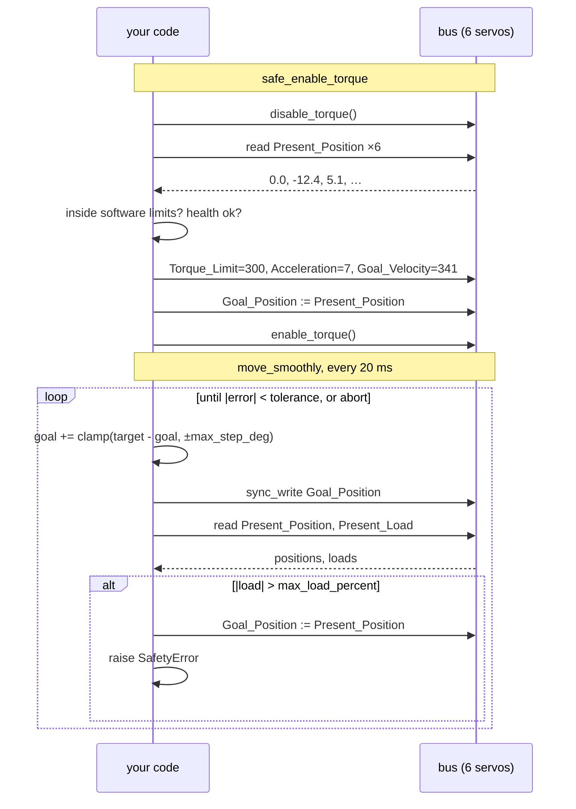

# 14.03 — Controlling the arm's servos — positions, speeds, torque and limits

<!-- glance:start -->
<!-- generated by tools/build.py from curriculum/syllabus.yaml — edit the syllabus, not this block -->

| | |
|---|---|
| **Track** | Main path |
| **Difficulty** | Intermediate |
| **Time** | 1 h |
| **Hardware** | Robotic arm (leader + follower kit) (stage 5) |
| **Software** | python |
| **Prerequisites** | [14.02 Buying and assembling the arm; servo setup and calibration](14.02-buying-and-assembling-the-arm.md) |
| **Optional prerequisites** | [FE.11 Servo motors and stepper motors](../optional-foundations/electronics/FE.11-servos-and-steppers.md) |
| **Skip if** | You command joint positions with software limits and read back positions and load. |

<!-- glance:end -->

## What you will learn

- Enable torque on six bus servos **without the arm jumping**, and explain in one sentence why the naive order throws a joint 28°.
- Convert between physical units and the STS3215's registers: degrees ↔ counts, deg/s ↔ `Goal_Velocity`, deg/s² ↔ `Acceleration`, % of stall ↔ `Torque_Limit`.
- Put four independent limits between your code and a moving joint, and say which one catches which failure.
- Read position, load, voltage, temperature and current, and turn them into a "stop now" decision.
- Test every line of the above with **no hardware**, against a simulated bus.

## Why it matters

This is the lesson where the arm becomes capable of hurting you, and where most of the habits that keep it from doing
so get established.

A bus servo is not a motor you drive; it is an independent position controller that acts on a **goal register**.
Whatever number is sitting in that register when you grant it torque is where the joint goes — immediately, at
whatever speed its velocity register allows. That single fact is responsible for most first-session accidents with
low-cost arms, and it is trivially avoidable once you know it.

Everything above this layer assumes it works. [14.07](14.07-trajectories.md) hands it smooth setpoints,
[14.08](14.08-arm-urdf-and-ros2-control.md) wraps it in `ros2_control`, [14.09](14.09-moveit2-motion-planning.md)
plans through it and module 18 replays learned policies through it. The safety logic you write here is the last thing
between all of that and your fingers, and it is the only part that never gets replaced.

> [!CAUTION]
> **Safety (standing rules for every powered step in this lesson, from [SAFETY.md](../SAFETY.md) and
> [14.11](14.11-arm-safety.md)):** the arm is clamped to the table; the PSU plug or switch is within one second's
> reach; nothing fragile and no part of you is inside the 0.48 m circle the arm can sweep; torque and speed limits are
> set in software *before* the first move; your face stays out of the workspace. Start every session with the arm's
> first move being a 10° wiggle of one joint, not a pose change.

<!-- prereqs:start -->
## Prerequisites

You need these first:

- [14.02 Buying and assembling the arm; servo setup and calibration](14.02-buying-and-assembling-the-arm.md)

### Optional prerequisite links

New to any of these? Take the foundation lesson first; skip it if you already know it.

- [FE.11 Servo motors and stepper motors](../optional-foundations/electronics/FE.11-servos-and-steppers.md)

Check your readiness: `python course.py why 14.03`
<!-- prereqs:end -->

## Concept

You have six independent controllers on one wire, and you are not the controller — you are the orchestrator. Each
servo runs its own position loop at its own rate, reconciling a stored **desired state** (`Goal_Position`, bounded by
`Goal_Velocity`, `Acceleration` and `Torque_Limit`) with its measured state. You write desired state and read
observed state; you never close the loop yourself. If you have built systems around reconciling controllers, the
mental model transfers exactly — including the failure mode.

The failure mode is this: **a reconciler acts on its stored desired state the moment it is given authority.** The
servo's `Goal_Position` survives your program exiting, and on a hobby servo it survives a power cycle of the
*controller* too. Enable torque without first overwriting it and the joint snaps to yesterday's goal at full speed.
The course's simulated bus reproduces exactly this, because it is the behaviour that hurts people:

```text
naive enable: a joint jumped 28 deg at full speed
safe enable:  largest jump 0.0 deg, holding 0.0 deg
```

There is a second asymmetry worth internalising now. karmel's wheels have a **watchdog**: the Pico stops the motors
300 ms after the last command ([labs/README.md](../labs/README.md)'s protocol, taught in
[03.03](../03-robot-software/03.03-robust-serial-communication.md)). A Feetech bus servo has **no watchdog**. If your
Python process dies mid-move, the wheels stop and the arm keeps pushing — against whatever it was pushing against —
until you cut power. Plan your `finally:` blocks accordingly.

> [!TIP]
> **Ask your teacher:** "Walk me through what each of the five steps of `safe_enable_torque` prevents, and what happens if I skip just one."

## Technical explanation

> [!IMPORTANT]
> **Version-sensitive** (verified 2026-09 against LeRobot **v0.6.1**: the Feetech control table in
> `src/lerobot/motors/feetech/`, and `SOFollower.configure()` in `src/lerobot/robots/so_follower/so_follower.py`).
> Register names below are LeRobot's control-table names. Check the current docs before trusting them:
> https://huggingface.co/docs/lerobot/so101

### Level 1 — The registers that matter

The STS3215 has a memory table split into **EEPROM** (survives power-off: id, baud rate, `homing_offset`, angle
limits) and **RAM** (volatile: goal, speed, torque enable, and everything you can read back). You met the EEPROM half
in [14.02](14.02-buying-and-assembling-the-arm.md). This lesson is the RAM half.

| Register | Direction | Unit | What it does |
|---|---|---|---|
| `Torque_Enable` | write | 0/1 | Grants the servo authority to drive the motor |
| `Goal_Position` | write | counts (0…4095) | Where the servo is trying to be |
| `Goal_Velocity` | write | counts/s | Speed cap on the way there. **0 means "no cap"** |
| `Acceleration` | write | 100 counts/s² per unit | Ramp. **0 means "maximum"** |
| `Torque_Limit` | write | 0.1% of stall (0…1000) | How hard it may push |
| `Present_Position` | read | counts | Where it actually is |
| `Present_Load` | read | 0.1% of stall, signed | How hard it is currently pushing |
| `Present_Voltage` | read | 0.1 V | Supply at the servo |
| `Present_Temperature` | read | °C | Winding temperature |
| `Present_Current` | read | 6.5 mA per unit | Motor current |

Note the two traps in that table: **`Goal_Velocity = 0` and `Acceleration = 0` do not mean "don't move"** — they mean
"unlimited". They are the factory defaults. A fresh servo with a stale goal and a fresh torque-enable is the worst
case, and it is also the default case.

### Level 2 — The arithmetic, with numbers

The encoder resolution is 4096 counts per revolution:

$$1\ \text{count} = \frac{360°}{4096} = 0.0879°$$

That is the finest command the arm can take. At the SO-101's mid-reach it is a real, physical number:

| Distance from the joint | One count at the tool |
|---|---|
| 0.15 m | 0.230 mm |
| 0.25 m | 0.383 mm |
| 0.35 m | 0.537 mm |

Sub-millimetre *resolution*. Not sub-millimetre *accuracy* — backlash in a 1/345 plastic gearbox is far larger, which
is why the SO-101's repeatability is not published and why [15.06](../15-manipulation/15.06-visual-servoing.md) closes
the loop with a camera instead of trusting the encoders.

The conversions ([`code/servo_tools.py`](code/servo_tools.py)):

$$\texttt{Goal\_Velocity} = \frac{v\ [\text{deg/s}]}{0.0879}, \qquad
\texttt{Acceleration} = \frac{a\ [\text{deg/s}^2]}{0.0879 \cdot 100}, \qquad
\texttt{Torque\_Limit} = 10 \cdot p\ [\%]$$

Worked, for the conservative first-session settings this course uses (30 deg/s, 60 deg/s², 30% of stall):

$$\texttt{Goal\_Velocity} = \frac{30}{0.0879} = 341,\qquad
\texttt{Acceleration} = \frac{60}{8.79} = 6.8 \to 7,\qquad
\texttt{Torque\_Limit} = 300$$

And what 30% of stall means in physics, for the 7.4 V servos: $0.30 \times 1.62 = 0.486$ N·m. Compare with
[14.06](14.06-jacobian.md)'s static load calculation — holding a 200 g payload at mid-reach needs 0.355 N·m at the
elbow. You are running with about 27% headroom, on *stall* torque, which a servo cannot sustain thermally. That is
the honest reason this arm's payload is small, and the reason `max_load_percent` defaults to 25%: if the servo is
pushing that hard during a slow, unloaded move, something is wrong.

`Present_Load` is signed with a **sign-magnitude** encoding — bit 10 is the sign, bits 0–9 the magnitude
(`Present_Velocity` uses bit 15). LeRobot decodes this for you; `servo_tools.decode_sign_magnitude()` exists for when
you talk to the raw SDK and see a load of 1,036%.

### Level 3 — Enabling torque without the arm jumping

The order is the whole lesson. `servo_tools.safe_enable_torque()`:

1. **Torque off first.** You may have inherited a session that left it on. Configure a limp arm.
2. **Read the present pose, and refuse to continue if any joint is outside its software limits.** A joint that a human
   pushed out of range must be pushed back by a human, not driven back by a motor that has no idea what is in the way.
   Same for the health checks: wrong supply voltage, an overheated winding, a joint already under load.
3. **Write the limits** — `Torque_Limit`, `Acceleration`, `Goal_Velocity` — while the servo still has no authority.
4. **Write `Goal_Position` = `Present_Position`.** Now the desired state equals the observed state: the reconciler has
   nothing to do.
5. **Only now enable torque.**

Skip step 4 and you get the 28° snap. Skip step 3 and the snap happens at full speed instead of 30 deg/s. Skip step 2
and you find out about the jammed joint by burning a servo. Skip step 1 and steps 3–4 may be ignored, because some
registers are only writable with torque disabled.

```python
def safe_enable_torque(bus: ArmBus, cfg: SafetyConfig) -> dict[str, float]:
    bus.disable_torque()                                         # 1
    present = bus.read_positions()                               # 2
    outside = [f"{j} at {present[j]:.1f} (limits {cfg.limits[j].lower}..{cfg.limits[j].upper})"
               for j in bus.joint_names if not cfg.limits[j].contains(present[j])]
    if outside:
        raise SafetyError("refusing to enable torque, joints outside limits: " + "; ".join(outside))
    problems = health_problems(read_telemetry(bus), cfg)
    if problems:
        raise SafetyError("refusing to enable torque: " + "; ".join(problems))
    for j in bus.joint_names:                                    # 3
        bus.write_register("Torque_Limit", j, torque_register(cfg.torque_percent))
        bus.write_register("Acceleration", j, acceleration_register(cfg.accel_deg_s2))
        bus.write_register("Goal_Velocity", j, speed_register(cfg.speed_deg_s))
    bus.write_goal_positions(present)                            # 4
    bus.enable_torque()                                          # 5
    return present
```

### Level 4 — Four limits, deliberately redundant

Every one of these can be implemented alone and every one of them fails alone. Use all four.

```text
  your code ──►  ①  software clamp        clamp_goals(): a goal outside the recorded joint range is
                     (per goal)            replaced by the range end. Catches: bad IK, a typo, a
                     │                     learned policy that drifted outside its training data.
                     ▼
                 ②  software rate limit   move_smoothly(): the commanded goal walks toward the target
                     (per 20 ms tick)      at ≤ max_step_deg per tick. Catches: a large legal goal
                     │                     that would be executed as a lunge.
                     ▼
  bus write ────►  ③  servo speed/accel    Goal_Velocity, Acceleration in the servo's own RAM.
                     (in the servo)        Catches: YOUR PROCESS DYING between ② and the servo.
                     │
                     ▼
                 ④  torque limit + load   Torque_Limit caps force; the loop aborts when |Present_Load|
                     abort                 exceeds max_load_percent. Catches: an obstacle, a jam, a
                                           hand. This is the only layer that knows about the world.
```

A fifth exists if you use LeRobot's `SOFollower` directly: `max_relative_target` clamps how far a commanded position
may differ from the present one, which is the same idea as ② implemented inside the driver. Set it.

And the gap: **none of these is a watchdog.** Layer ④ aborts a move and holds the present pose; it does not
de-energise the arm if your process vanishes. `so101_bus.py` therefore disconnects with `disable_torque=True` in a
`finally:` block — which makes the arm go limp and **fall**, so support it with a hand. A real e-stop that removes
power in hardware is [14.11](14.11-arm-safety.md) and Stage 6.

> [!TIP]
> **Ask your teacher:** "Give me four failure scenarios and make me say which of the four limits catches each one."

## Diagram



## Code

[`code/servo_tools.py`](code/servo_tools.py) holds all the logic and a `FakeArmBus` — six simulated STS3215s that
reproduce the jump-on-enable behaviour — so every line is testable without an arm. Run its demo:

```bash
cd 14-robotic-arm/code
py servo_tools.py
```

```text
naive enable: a joint jumped 28 deg at full speed
safe enable:  largest jump 0.0 deg, holding 0.0 deg
registers:    Torque_Limit=300, Acceleration=7, Goal_Velocity=341
moved wrist_flex to 19.2 deg
stopped: elbow_flex: load 30 % during move - stopped at 10.0
temperature/voltage ok: True
a 12 V servo on the 5 V profile -> shoulder_pan: supply 12.1 V outside 4.5-8.4 V (wrong PSU or servo version?)
1 step = 0.0879 deg; 30 deg/s = 341 steps/s
```

The rate-limited move, which is layer ② above:

```python
def move_smoothly(bus, goals, cfg, rate_hz=50.0, tolerance=1.0, timeout_s=20.0, sleep=time.sleep):
    target, notes = clamp_goals(goals, cfg.limits)          # layer 1
    for note in notes:
        print("limit:", note)
    command = bus.read_positions()
    dt = 1.0 / rate_hz
    for _ in range(int(timeout_s * rate_hz)):
        for j, g in target.items():
            err = g - command[j]
            command[j] += max(-cfg.max_step_deg, min(cfg.max_step_deg, err))   # layer 2
        bus.write_goal_positions({j: command[j] for j in target})
        sleep(dt)
        present = bus.read_positions()
        for j in target:
            load = bus.read_register("Present_Load", j) / 10.0
            if abs(load) > cfg.max_load_percent:                                # layer 4
                bus.write_goal_positions({k: present[k] for k in target})
                raise SafetyError(f"{j}: load {load:.0f} % during move — stopped at {present[j]:.1f}")
        if all(abs(target[j] - present[j]) <= tolerance for j in target):
            return present
    raise SafetyError(f"move did not finish within {timeout_s} s (blocked joint or limits too tight?)")
```

On the real arm, [`code/so101_bus.py`](code/so101_bus.py) provides the same logic over LeRobot's driver:

```bash
py so101_bus.py read --port COM5 --robot-id karmel_follower                  # torque OFF, telemetry
py so101_bus.py record-limits --port COM5 --robot-id karmel_follower --out limits.json
py so101_bus.py hold --port COM5 --robot-id karmel_follower --limits limits.json          # MOVES
py so101_bus.py wiggle --port COM5 --robot-id karmel_follower --limits limits.json \
                --joint wrist_flex --delta 10                                             # MOVES
```

With no `--limits` file it falls back to deliberately narrow first-run limits (±30°, gripper 5–60 %). Use those for
your very first powered session even after you have recorded real ones.

## Exercise

### Exercise 14.03-E1 — Implement the safe start-up and the rate-limited move `[coding]`

Hardware: **none** — the checker runs against the simulated bus. Implement `clamp_goals`, `safe_enable_torque`,
`move_smoothly` and `health_problems` yourself, plus the four register conversions. The tests check the *order* of bus
operations, not just the result: a solution that enables torque before writing the goal fails even if the final pose
is right.

Check it: `python course.py check 14.03` (or run `py -m pytest labs/exercises/14.03` directly).

### Exercise 14.03-E2 — Predict the jump `[predict]`

Hardware: none. A servo's `Goal_Position` register holds 25°, the joint is physically at 0°, `Goal_Velocity` is at its
factory default, and you call `enable_torque()`. **Predict:** (a) where does the joint end up, (b) how fast does it
get there, (c) what does `Present_Load` read during the move, and (d) what would change if `Goal_Velocity` had been
set to 341 first? Then verify:

```python
from servo_tools import FakeArmBus
bus = FakeArmBus(goal_register={"shoulder_lift": 25.0})
bus.enable_torque()
print(bus.max_jump_deg)
```

### Exercise 14.03-E3 — Register arithmetic `[numerical]`

Hardware: none. Compute, by hand first and then with `servo_tools`:
(a) the `Goal_Velocity` value for 12 deg/s;
(b) the physical speed of `Goal_Velocity = 1000`;
(c) the `Acceleration` value for 180 deg/s², and the time that ramp takes to reach 30 deg/s;
(d) the torque in N·m that `Torque_Limit = 450` allows on a 7.4 V STS3215 and on a 12 V one;
(e) the tool-tip displacement of one count at 0.20 m from the joint;
(f) what `Present_Load` raw value 1036 decodes to.

### Exercise 14.03-E4 — First powered session `[hardware]`

Hardware: `arm` (assembled and calibrated, [14.02](14.02-buying-and-assembling-the-arm.md)).

> [!CAUTION]
> **Safety:** Clamp the arm. Clear a 0.5 m radius. Keep the PSU switch in reach and your face out of the workspace.
> Run `record-limits` **before** anything with torque, and keep the first `--torque` at 30 and `--speed` at 30.

1. `py so101_bus.py read …` with torque off: move each joint by hand and watch the numbers follow.
2. `py so101_bus.py record-limits … --out limits.json`: move every joint slowly to both ends of the range you want to
   *allow* (not the mechanical range — leave yourself margin), for 60 s.
3. `py so101_bus.py hold … --limits limits.json --seconds 10`: the arm should hold its pose, then go limp. **Support
   it with your hand for the last step.**
4. `py so101_bus.py wiggle … --limits limits.json --joint wrist_flex --delta 10`.
5. Now cause a safe abort: with `wiggle` running on `wrist_flex`, gently block the joint with one finger on the
   *plastic*, not in a pinch point. Record what it prints.

### Exercise 14.03-E5 — Debug a jump `[debugging]`

Hardware: none. A colleague reports: "every time I start my script, `shoulder_lift` snaps down 40°, then everything
works fine." Their start-up code is:

```python
bus.enable_torque()
for j in bus.joint_names:
    bus.write_register("Goal_Velocity", j, speed_register(30.0))
bus.write_goal_positions(read_positions_from_my_yaml())
```

Name the bug, name the *second* bug hiding behind it, and write the three-line fix. Then reproduce the failure with
`FakeArmBus` and show that your fix gives `max_jump_deg == 0.0`.

## Expected result

- **14.03-E1:** `python course.py check 14.03` prints all tests passing with none skipped (about 25 tests, under a
  second). The reference solution is in `labs/exercises/14.03/solution.py` —
  `python course.py check 14.03 --solution` shows it green. The two tests people fail first are the operation-order
  test (`Goal_Position` must be written *before* `Torque_Enable`) and the one asserting that `clamp_goals` **raises**
  for a joint with no configured limits rather than passing it through.
- **14.03-E2:** (a) At 25° — the goal register wins. (b) At the servo's maximum, since `Goal_Velocity = 0` means
  unlimited; the simulated bus models roughly 300 deg/s, so the 25° takes under 0.1 s. (c) A brief spike, then the
  holding load (the fake bus reports 8% while holding against gravity). (d) It would still go to 25°, but take
  25/30 = 0.83 s — survivable rather than startling. The snippet prints `25.0`.
- **14.03-E3:** (a) $12/0.0879 = 137$. (b) $1000 \times 0.0879 = 87.9$ deg/s. (c) $180/8.79 = 20.5 \to 20$;
  reaching 30 deg/s takes $30/180 = 0.167$ s. (d) $0.45 \times 1.62 = 0.729$ N·m (7.4 V) and
  $0.45 \times 2.94 = 1.32$ N·m (12 V). (e) $0.20 \times 0.0879° \times \pi/180 = 0.307$ mm.
  (f) Bit 10 is set ($1036 = 1024 + 12$), so the magnitude is 12 → **−1.2 %**, not +103.6 %.
- **14.03-E4:** Step 1 shows positions tracking your hand, load near 0, voltage within 0.3 V of nominal, temperature
  25–35 °C. Step 2 prints a `seen … -> limits …` line per joint; the limits are each 5° inside what you swept. Step 3
  prints `torque ON, holding {…}` and the arm stays put — a joint that sags a few degrees means the torque limit is
  too low for its share of gravity; raise `--torque` in steps of 10, not to 100. Step 4 prints `asked X, reached Y`
  with |X − Y| ≤ 1°. Step 5 prints
  `SAFETY STOP: wrist_flex: load NN % during move — stopped at …` within a fraction of a second, and the joint stops
  pushing. If it does not stop, your `--max-load` is above what the joint can produce at the current `--torque`;
  that combination is checked at construction time (`max_load_percent` must be below `torque_percent`) precisely so
  the check cannot be silently dead.
- **14.03-E5:** **Bug 1:** torque is enabled before the goal register is written, so the arm snaps to whatever stale
  goal the servo held. **Bug 2 (the one that survives fixing bug 1):** `Goal_Velocity` is written *after*
  `enable_torque()`, so even the corrected order would execute the first move uncapped; and the goal comes from a
  YAML file rather than from `read_positions()`, so the arm's first act on every start is a move to a pose chosen
  hours ago — with no check that the path there is clear. Fix: disable torque, write limits, write
  `Goal_Position = Present_Position`, enable torque, and only then `move_smoothly()` to the YAML pose. With the fix,
  `FakeArmBus.max_jump_deg` is `0.0`.

## Troubleshooting

### Symptom: the arm jumps when I enable torque

1. Print `Goal_Position` and `Present_Position` for every joint immediately before `enable_torque()`. If they differ,
   your start-up order is wrong — that is the whole bug.
2. If they agree and it still jumps, check `Goal_Velocity`: a value of 0 means unlimited, and a 1° error executed at
   300 deg/s still feels like a jump.
3. If one specific joint jumps and the others do not, check whether that joint's `homing_offset` changed — a
   recalibration between sessions moves the zero.

### Symptom: a joint sags or buzzes while holding

Measure before you guess.

1. Read `Present_Load` while holding. Load near `Torque_Limit` means the servo is doing all it can: raise
   `--torque` in 10% steps, or reduce the payload / reach.
2. Load low but the joint still sags: the horn screw is loose, or the gearbox is stripped. Turn torque off and move
   the joint by hand — a healthy joint has even resistance.
3. Buzzing with the joint stationary is the position loop hunting. LeRobot writes P = 16, I = 0, D = 32 at connect;
   a joint carrying much more inertia than the others can need a lower P.

### Symptom: `move did not finish within 20 s`

1. Compare the distance with the rate limit: `max_step_deg = 1.0` at 50 Hz is 50 deg/s of *commanded* motion, but the
   servo's own `Goal_Velocity` may be lower. 90° at 30 deg/s is 3 s; 90° with `--speed 5` is 18 s and will time out.
2. Print the clamped target. If `clamp_goals` clamped it to a limit the arm is already at, the loop can never reach
   the original goal — it is already done, but `tolerance` is measured against the *clamped* target, so check the
   `limit:` lines it printed.
3. Otherwise something is blocking the joint but not hard enough to trip the load check. Lower `--max-load`.

### Symptom: `supply X V outside 4.5-8.4 V`

Your servos and your `--servo-voltage` profile disagree, or your PSU is wrong. 12 V servos on the 5 V profile produce
exactly this message. Check the label on a servo, then pass `--servo-voltage 12`. A reading *below* the window under
load is a PSU that cannot supply the current — a sagging supply browns out the servo's MCU mid-move.

### Symptom: the arm collapses when the script ends

That is by design: `so101_bus.py` disconnects with `disable_torque=True`. Support the arm with a hand, or park it in a
folded pose before exiting. An arm that holds its pose after your script exits is worse — nothing is watching it.

## Common mistakes

- **Enabling torque first.** The one mistake this lesson exists to prevent.
- **Believing `Goal_Velocity = 0` means stopped.** It means unlimited, and it is the factory default.
- **Setting `max_load_percent` above `torque_percent`.** The servo can never report more load than its torque limit
  allows, so the check silently never fires. `SafetyConfig` rejects that combination at construction.
- **Using the mechanical range as the software range.** Record limits by hand, then subtract a margin (the default is
  5°). The mechanical stop is where the plastic breaks.
- **Skipping the health check because "it was fine yesterday".** Temperature and supply voltage are the two things
  that change between sessions.
- **Assuming a watchdog exists.** It does not. Wrap every powered session in `try/finally`.
- **Testing safety code on the arm.** Every line in `servo_tools.py` runs against `FakeArmBus`. Test there, then move
  to hardware.

## Knowledge check

1. `Goal_Velocity` is 0 and `Goal_Position` is 40° away from where the joint is. You enable torque. What happens?
   <details><summary>Answer</summary>

   The joint drives to the goal at the servo's maximum speed (a few hundred deg/s) — roughly 0.15 s for 40°. This is
   the classic first-session accident.
   </details>

2. What `Torque_Limit` value corresponds to 25% of stall, and how many N·m is that on a 7.4 V STS3215?
   <details><summary>Answer</summary>

   $25 \times 10 = 250$. And $0.25 \times 1.62 = 0.405$ N·m.
   </details>

3. Which of the four limit layers catches a learned policy that outputs a joint angle 40° outside the arm's range,
   and which catches your process being killed mid-move?
   <details><summary>Answer</summary>

   Layer ① (the software clamp in `clamp_goals`) catches the out-of-range command. Layer ③ (the servo's own
   `Goal_Velocity`/`Acceleration`, written into the servo's RAM) is the only one still in force after your process
   dies — the joint finishes its last commanded move at a bounded speed and then holds. None of them de-energises the
   arm; that needs hardware.
   </details>

4. `Present_Load` reads 1036 raw. What is the load?
   <details><summary>Answer</summary>

   Sign-magnitude on bit 10: $1036 = 1024 + 12$, so the sign bit is set and the magnitude is 12 → **−1.2 %** of stall.
   Reading it as unsigned gives 103.6%, which is how people conclude their servo is stalling when it is idling.
   </details>

5. Predict: you set `max_step_deg = 1.0` at 50 Hz and ask for a 90° move with `--speed 30`. How long should it take,
   and which limit governs?
   <details><summary>Answer</summary>

   The software rate limit allows 1° per 20 ms = 50 deg/s of commanded motion; the servo allows 30 deg/s. The servo's
   limit is lower, so it governs: about 90/30 = 3 s plus the acceleration ramps. The commanded goal runs ahead of the
   actual position by up to the difference — which is exactly why the loop checks `Present_Position`, not the
   commanded value, for completion.
   </details>

6. Why does `safe_enable_torque` *refuse* rather than move when it finds a joint outside its software limits?
   <details><summary>Answer</summary>

   Because a joint outside its limits is evidence that something unexpected happened — a human pushed it, it fell, or
   the calibration changed. Driving it back means moving through a region you never checked, with an unknown obstacle
   (possibly a hand) in it. A human who can see the arm should move it back.
   </details>

7. Your arm holds a 200 g object at mid-reach with `--torque 30`. Is that safe to leave running for ten minutes?
   <details><summary>Answer</summary>

   No. Holding needs about 0.355 N·m at the elbow, against a 30%-of-stall cap of 0.486 N·m — so the joint sits near
   70% of its allowed torque continuously, with no motion to move air over the windings. Watch `Present_Temperature`;
   `SafetyConfig.max_temperature_c` defaults to 55 °C for this reason. Park the arm or release the object.
   </details>

## Practical challenge

Write `ArmSession`, a context manager that makes an unsafe arm session impossible to write by accident:

```python
with ArmSession(bus, cfg) as arm:
    arm.move({"shoulder_lift": -20.0, "elbow_flex": 30.0})
    arm.move({"gripper": 40.0})
```

Acceptance criteria:

- `__enter__` runs the full safe-enable sequence and raises `SafetyError` before energising anything if a check fails.
- `__exit__` always disables torque, including on exception and on `KeyboardInterrupt`, and prints a reminder to
  support the arm.
- A background health thread (or a check inside every `move` tick) aborts the session on over-temperature,
  out-of-window voltage or over-load, and records *why* in `arm.stop_reason`.
- `arm.move()` accepts a subset of joints, clamps to limits, rate-limits, and returns the reached pose.
- A pytest suite against `FakeArmBus` proves: no jump on enter; torque off after a raised exception; a blocked joint
  aborts within 200 simulated ms; a goal outside limits is clamped and logged; a joint with no configured limit
  raises.
- The same class drives the real arm through `LeRobotArmBus` with no changes (demonstrate with a 10° wiggle).

## You can skip this if…

You can answer knowledge-check questions 1, 3 and 4 without looking, and you have written code that reads back joint
positions and loads and enforces software limits on a real servo bus. Then:
`python course.py skip 14.03 --reason "fluent with bus-servo control, limits and torque enable"`.

## Go deeper

- LeRobot SO-101 guide — the driver and calibration this lesson's code wraps: https://huggingface.co/docs/lerobot/so101
- LeRobot source, `src/lerobot/motors/feetech/` — the control table, register names and the sync read/write
  implementation: https://github.com/huggingface/lerobot
- Feetech STS3215 product page and memory table (the register units in Level 1):
  https://www.feetechrc.com/en/2020-05-13_56655.html
- ROS 2 `ros2_control` concepts, where this layer goes next in [14.08](14.08-arm-urdf-and-ros2-control.md):
  https://control.ros.org/jazzy/index.html
- Servo and stepper fundamentals in this course, if the actuator itself is still a black box:
  [FE.11](../optional-foundations/electronics/FE.11-servos-and-steppers.md)
- The course's standing safety rules: [SAFETY.md](../SAFETY.md)

## Progress checkpoint

- [ ] I can enable torque on the arm without it jumping, and explain each step of the sequence.
- [ ] I can convert deg, deg/s, deg/s² and % of stall to and from the STS3215's registers.
- [ ] I have four independent limits between my code and a moving joint, and I know which catches what.
- [ ] I read position, load, voltage, temperature and current, and stop the arm on any of them.
- [ ] I tested all of it against the simulated bus before touching hardware.

`python course.py complete 14.03` (exercises done) · `python course.py master 14.03` (challenge done) ·
`python course.py struggle 14.03 "what was hard"`

Next: [14.04 — Forward kinematics — from joint angles to gripper pose](14.04-forward-kinematics.md).
