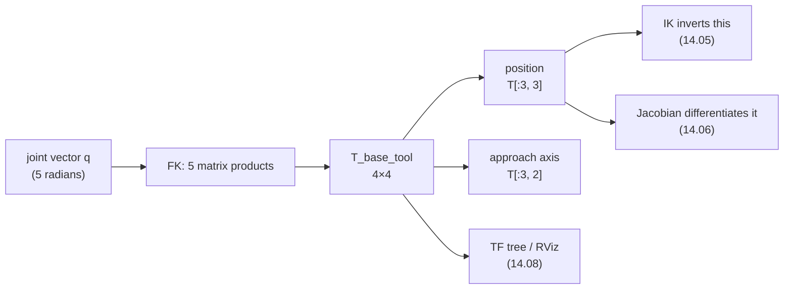

# 14.04 — Forward kinematics — from joint angles to gripper pose

<!-- glance:start -->
<!-- generated by tools/build.py from curriculum/syllabus.yaml — edit the syllabus, not this block -->

| | |
|---|---|
| **Track** | Main path |
| **Difficulty** | Intermediate |
| **Time** | 1 h 15 min |
| **Hardware** | none |
| **Software** | python, numpy |
| **Prerequisites** | [14.01 Arm anatomy — joints, links, DOF, workspace, end effector](14.01-arm-anatomy.md)<br>[05.04 Homogeneous transforms in 2D and 3D](../05-frames-and-transforms/05.04-homogeneous-transforms.md) |
| **Optional prerequisites** | [FM.09 2D/3D transformations and homogeneous coordinates](../optional-foundations/mathematics/FM.09-homogeneous-coordinates.md)<br>[FM.10 Rotation matrices](../optional-foundations/mathematics/FM.10-rotation-matrices.md) |
| **Skip if** | You compute FK for a serial arm from its URDF or DH table. |

<!-- glance:end -->

## What you will learn

- Compute the tool pose of a serial arm as a product of 4×4 transforms, by hand for a 2-link arm and in numpy for the SO-101.
- Apply URDF semantics exactly: $T_{\text{parent},\text{child}}(q) = T(\texttt{xyz},\texttt{rpy}) \cdot \text{Rot}(\texttt{axis}, q)$, and explain why the joint angle comes *after* the fixed origin.
- Read a Denavit–Hartenberg table, write one for a planar arm, and say why this course does not use DH.
- State what the product-of-exponentials formulation is and verify it against the chain product to machine precision.
- Check any FK implementation against an independent one, which is the only way to trust a kinematic model.

## Why it matters

Forward kinematics is the function every other thing in modules 14 and 15 is built on.

- [14.05](14.05-inverse-kinematics.md) inverts it; a numerical IK solver is literally a loop around FK.
- [14.06](14.06-jacobian.md) differentiates it.
- [14.08](14.08-arm-urdf-and-ros2-control.md) publishes it as a TF tree, so RViz can draw the arm and
  [15.03](../15-manipulation/15.03-hand-eye-calibration.md) can ask "where is the camera relative to the base?".
- Every grasp in module 15 is "compute where the object is, compute where the tool is, close the gap".

And it is the one piece you can get *exactly* right. FK has no tuning, no noise model, no gains. If your FK disagrees
with your arm by 2 cm, there is a bug or a mis-measured link — and this lesson's last section is how you find out
which.

<!-- prereqs:start -->
## Prerequisites

You need these first:

- [14.01 Arm anatomy — joints, links, DOF, workspace, end effector](14.01-arm-anatomy.md)
- [05.04 Homogeneous transforms in 2D and 3D](../05-frames-and-transforms/05.04-homogeneous-transforms.md)

### Optional prerequisite links

New to any of these? Take the foundation lesson first; skip it if you already know it.

- [FM.09 2D/3D transformations and homogeneous coordinates](../optional-foundations/mathematics/FM.09-homogeneous-coordinates.md)
- [FM.10 Rotation matrices](../optional-foundations/mathematics/FM.10-rotation-matrices.md)

Check your readiness: `python course.py why 14.04`
<!-- prereqs:end -->

## Concept

You already know the machinery. In [05.04](../05-frames-and-transforms/05.04-homogeneous-transforms.md) you learned
that a 4×4 homogeneous transform $T_{a,b}$ means "the pose of frame $b$ expressed in frame $a$", that it maps points
from $b$ to $a$, and that composition cancels inner indices:

$$T_{a,c} = T_{a,b} \, T_{b,c}$$

> [!NOTE]
> New to *why* a 4×4 matrix can hold a rotation and a translation at once, and what the fourth coordinate is
> for? → [FM.09 2D/3D transformations and homogeneous coordinates](../optional-foundations/mathematics/FM.09-homogeneous-coordinates.md).
> Skip it if you can already say why a point ends in 1 and a direction ends in 0, and what that does to the
> translation column.

Forward kinematics is that rule applied down a chain, with one twist: each transform has a knob on it.

$$T_{\text{base},\text{tool}}(q) = T_{\text{base},1}(q_1)\, T_{1,2}(q_2)\, \cdots \, T_{n-1,n}(q_n)\, T_{n,\text{tool}}$$

It is a left fold over a list, where the accumulator is a 4×4 matrix and each element contributes one joint angle.
That is the entire idea. Everything else in this lesson is about *where the numbers in those matrices come from* and
how to avoid getting the conventions wrong.

Two properties are worth noticing before the algebra:

- **FK is cheap and exact.** Five 4×4 multiplications. No iteration, no failure mode, no ambiguity: one joint vector
  gives exactly one tool pose. (The reverse, in [14.05](14.05-inverse-kinematics.md), has 0, 1, 2 or infinitely many
  answers — the asymmetry is the whole difficulty of arms.)
- **Errors accumulate down the chain, not up.** A 1° error at `shoulder_pan` moves the tool by the full 0.39 m lever;
  the same error at `wrist_roll` moves it by almost nothing. When your model disagrees with reality, suspect the
  joints closest to the base first.

> [!TIP]
> **Ask your teacher:** "Show me why $T_{\text{base},\text{tool}} = T_1 T_2 T_3$ and not $T_3 T_2 T_1$, using the inner-index rule."

## Technical explanation

### Level 1 — Intuition: the planar 2-link arm, by hand

Take the SO-101's upper arm and forearm as a flat 2-link arm in a vertical plane:
$l_1 = 0.116$ m, $l_2 = 0.135$ m. Measure $q_1$ from the $x$ axis and $q_2$ *relative to the previous link*. Then walk
the chain, adding one vector per link:

$$x = l_1\cos q_1 + l_2\cos(q_1 + q_2), \qquad y = l_1\sin q_1 + l_2\sin(q_1+q_2)$$

**Worked example**, $q = (30°, 60°)$. The second link points at $q_1 + q_2 = 90°$:

$$x = 0.116\cos 30° + 0.135\cos 90° = 0.116 \times 0.86603 + 0 = 0.10046\ \text{m}$$
$$y = 0.116\sin 30° + 0.135\sin 90° = 0.058 + 0.135 = 0.19300\ \text{m}$$

and the tool's direction is $\phi = q_1 + q_2 = 90°$ — straight up. `ak.planar_fk((0.116, 0.135), np.radians((30, 60)))`
returns `(0.1005, 0.1930, 1.5708)`. Two more to check yourself against: $q = (0°, 0°)$ gives $(0.2510, 0)$, the fully
stretched arm; $q = (90°, -90°)$ gives $(0.1350, 0.1160)$ — the links swapped roles.

The same computation as a matrix product, which is the form that generalises:

$$T(q) = \prod_{i} \text{Rot}_z(q_i)\, \text{Trans}_x(l_i)$$

Rotate by the joint angle, then walk along the link. `planar_fk_homogeneous()` does exactly this and agrees with the
trigonometric version to machine precision — a useful first self-check when you are learning the notation.

### Level 2 — Practical: URDF semantics, which is what you will actually use

Real arms are not planar and their joint axes are not all $z$. The description that ships with every real robot is a
**URDF**, and it says something very simple for each joint:

$$\boxed{T_{\text{parent},\text{child}}(q) = \underbrace{T(\texttt{xyz}, \texttt{rpy})}_{\text{fixed, from CAD}} \cdot \underbrace{\text{Rot}(\texttt{axis}, q)}_{\text{the joint}}}$$

with `rpy` meaning $R = R_z(\text{yaw})R_y(\text{pitch})R_x(\text{roll})$ and `axis` a unit vector **in the child
frame**. Read it as: "the child frame is bolted here relative to the parent (that's `xyz`/`rpy`), and the joint spins
the child about its own `axis`".

The order matters and is the single most common bug. The fixed origin comes **first**: the joint rotates the child
frame about an axis that has already been placed by the origin. Swap them and the axis ends up in the parent's
orientation, and your arm bends the wrong way in a manner that looks *almost* right for small angles.

Here is one real row from the SO-101, straight out of
[`code/data/so101_kinematics.yaml`](code/data/so101_kinematics.yaml):

```yaml
- name: elbow_flex
  type: revolute
  parent: upper_arm_link
  child: lower_arm_link
  xyz: [-0.11257, -0.028, 1.73763e-16]
  rpy: [-3.63608e-16, 8.74301e-16, 1.5708]
  axis: [0, 0, 1]
  lower: -1.69
  upper: 1.69
```

Note how unreadable the raw numbers are: `1.5708` instead of $\pi/2$, `1.73763e-16` instead of 0, an `xyz` that is
mostly $-x$ although the elbow is clearly "further along the arm". That is normal. A URDF is CAD output, and you never
read link lengths out of it by eye — you compute them:

```python
arm = ak.load_so101()
frames = dict(arm.frames(np.zeros(arm.n_dof)))         # {link name: T_base_link at q = 0}
p = {k: T[:3, 3] for k, T in frames.items()}
np.linalg.norm(p["lower_arm_link"] - p["upper_arm_link"])   # 0.1160 — the "upper arm"
```

The other habit worth building now: **`frames()` returns the whole chain, not just the tool.** You need the
intermediate frames for the Jacobian ([14.06](14.06-jacobian.md)), for collision checking
([14.09](14.09-moveit2-motion-planning.md)) and for drawing the arm. Compute them once.

### Level 3 — Mathematics: three ways to write the same thing

**(a) The chain product.** What everything above does, in full:

$$T_{\text{base},\text{tool}}(q) = \left[\prod_{i=1}^{n} T_i^{\text{origin}} \, \text{Rot}(\hat{a}_i, q_i)\right] T^{\text{tool}}$$

> [!NOTE]
> New to rotation matrices — why they are orthonormal, why the inverse is the transpose, and why the order of
> two rotations matters? → [FM.10 Rotation matrices](../optional-foundations/mathematics/FM.10-rotation-matrices.md).
> Skip it if you can already check that the 3×3 block printed below is a valid rotation without running code.

where $\text{Rot}(\hat a, \theta)$ is Rodrigues' formula,

$$\text{Rot}(\hat a, \theta) = I + \sin\theta\, [\hat a] + (1 - \cos\theta)\, [\hat a]^2, \qquad
[\hat a] = \begin{bmatrix} 0 & -a_z & a_y \\ a_z & 0 & -a_x \\ -a_y & a_x & 0 \end{bmatrix}$$

**Worked example** for the SO-101 at $q = (20°, -30°, 40°, 60°, 0°)$ — five matrix products give

$$T_{\text{base},\text{tool}} = \begin{bmatrix}
-0.8653 & 0.3846 & 0.3214 & 0.2072 \\
0.3667 & 0.9229 & -0.1170 & -0.0613 \\
-0.3416 & 0.0166 & -0.9397 & 0.0575 \\
0 & 0 & 0 & 1 \end{bmatrix}$$

The tool is 20.7 cm forward, 6.1 cm right, 5.75 cm up, and its third column — the approach axis — points mostly
downward ($a_z = -0.94$), i.e. 70° below horizontal. That is a plausible "reach down at the table" pose.

**(b) Denavit–Hartenberg.** The classical convention, which you will meet in every textbook and in older code. It
attaches frames to the chain under strict rules (the $x_i$ axis must be the common perpendicular between joint axes
$i$ and $i+1$), and then **four** numbers per joint suffice instead of six:

$$T_{i-1,i} = \text{Rot}_z(\theta_i)\,\text{Trans}_z(d_i)\,\text{Trans}_x(a_i)\,\text{Rot}_x(\alpha_i)$$

For the planar 2-link arm the DH table is as simple as it gets:

| $i$ | $\theta_i$ | $d_i$ | $a_i$ | $\alpha_i$ |
|---|---|---|---|---|
| 1 | $q_1$ | 0 | 0.116 | 0 |
| 2 | $q_2$ | 0 | 0.135 | 0 |

Substitute and the product collapses to $\text{Rot}_z(q_1)\text{Trans}_x(l_1)\text{Rot}_z(q_2)\text{Trans}_x(l_2)$ —
exactly Level 1.

**Why this course uses URDF instead.** DH is compact and it is what analytic IK derivations are written in. But:
the frames are forced to sit where the convention demands rather than where the CAD does; there are two incompatible
variants in wide use (standard and "modified"/Craig); it cannot express a joint whose axis is parallel and offset
without contortions; and no modern toolchain consumes it — ROS, MoveIt, Gazebo and every simulator read URDF. Learn to
*read* DH, because papers use it. Write URDF.

**(c) Product of exponentials.** The modern formulation (Lynch & Park): pick the zero pose $M = T_{\text{base,tool}}(0)$
and describe each joint by a **screw axis** $\mathcal{S}_i = (\hat\omega_i, -\hat\omega_i \times p_i)$ expressed in the
*base* frame at $q = 0$, where $\hat\omega_i$ is the joint's unit axis and $p_i$ any point on it. Then

$$T_{\text{base},\text{tool}}(q) = e^{[\mathcal{S}_1]q_1} e^{[\mathcal{S}_2]q_2} \cdots e^{[\mathcal{S}_n]q_n} M$$

No intermediate frames, no conventions to violate: you need only the axes as they sit at the zero pose. For the
SO-101 those five screw axes are

$$\mathcal{S} = \begin{bmatrix}
0 & 0 & -1 & 0 & 0.0388 & 0 \\
0 & 1 & 0 & -0.1166 & 0 & 0.0692 \\
0 & 1 & 0 & -0.2292 & 0 & 0.0972 \\
0 & 1 & 0 & -0.2344 & 0 & 0.2321 \\
-1 & 0 & 0 & 0 & -0.2344 & -0.0002 \end{bmatrix}$$

Rows 2–4 share $\hat\omega = (0,1,0)$: those are the three parallel joints from [14.01](14.01-arm-anatomy.md), and you
can read the arm's structure straight off the matrix. The PoE product agrees with the chain product to
$1.2\times10^{-15}$ over 300 random joint vectors (Exercise 14.04-E4). What PoE buys you in practice is the Jacobian
almost for free, which is why [14.06](14.06-jacobian.md) borrows its geometry.

### Level 4 — Implementation: how to know your FK is right

An FK function that is subtly wrong still returns plausible-looking numbers. Four checks, cheapest first:

1. **Zero pose.** Compute $T(0)$ and compare with a photograph of the arm at the URDF zero. For the SO-101 the tool
   must land at $(0.3914, 0.0000, 0.2265)$ m with the approach axis horizontal. A y-coordinate that is not ~0 means a
   sign error in an `rpy`.
2. **One joint at a time.** Sweep $q_1$ alone and check the tool traces a horizontal circle; sweep $q_2$ alone and
   check it traces a vertical one. A joint that moves the tool in the wrong plane has the wrong axis.
3. **An independent implementation.** [`code/urdf_chain.py`](code/urdf_chain.py) parses the original URDF XML with the
   standard library and builds the same `SerialChain`. If the hand-transcribed YAML has a typo, the two disagree.
   This is the check that catches the errors the other three miss, because it does not share your assumptions.
4. **Against the real arm.** Command a pose, measure the gripper with a tape measure or a caliper, compare. Agreement
   within a few millimetres is a good result on printed parts; a systematic 2 cm error means a wrong link length, and
   an error that grows with reach means a wrong angle offset.

Two implementation details that bite:

- **Radians, always** (REP-103). The only place degrees are allowed is a print statement and the servo API in
  [14.03](14.03-controlling-servos.md).
- **Name every matrix `T_to_from`.** `T_base_tool`, `T_parent_child`. Then `T_base_tool = T_base_wrist @ T_wrist_tool`
  type-checks by eye. Half of all kinematics bugs are an inverted transform, and naming catches them for free.

> [!TIP]
> **Ask your teacher:** "Give me a joint vector, let me compute the SO-101's tool position on paper with the planar approximation, and then show me how far off I am from the real 3D FK — and why."

## Diagram

```text
 FK as a fold: the accumulator is a 4x4 pose, each joint contributes one factor

   I ──► T_base_1(q1) ──► ·T_1_2(q2) ──► ·T_2_3(q3) ──► ·T_3_4(q4) ──► ·T_4_5(q5) ──► ·T_5_tool
   │           │               │              │               │              │            │
 base      shoulder_pan   shoulder_lift   elbow_flex      wrist_flex     wrist_roll    fixed
                                                                                          │
                                                                                          ▼
                                                                          T_base_tool(q):  position = column 4
                                                                                          approach = column 3

 One joint of the URDF, unpacked:

        parent frame                                   child frame
             │        xyz, rpy (fixed, from CAD)            │
             ●───────────────────────────────────────────►  ●  ↻ Rot(axis, q)
                                                               the joint turns the child
                                                               about ITS OWN axis
        T_parent_child(q) = T(xyz, rpy) · Rot(axis, q)     ← origin first, joint second
```



## Code

[`code/arm_kinematics.py`](code/arm_kinematics.py) — `Joint` holds one URDF row, `SerialChain` folds them:

```python
@dataclass(frozen=True)
class Joint:
    name: str
    type: str                       # "revolute" or "fixed"
    parent: str
    child: str
    xyz: tuple[float, float, float]
    rpy: tuple[float, float, float]
    axis: tuple[float, float, float] = (0.0, 0.0, 1.0)
    lower: float = -math.pi
    upper: float = math.pi

    @property
    def origin(self) -> Array:
        """T_parent_child at q = 0."""
        return se3_from_xyz_rpy(self.xyz, self.rpy)

    def transform(self, q: float = 0.0) -> Array:
        """T_parent_child(q) = origin @ Rot(axis, q)."""
        if self.type == "fixed":
            return self.origin
        return self.origin @ se3(axis_angle_to_matrix(self.axis, q))


class SerialChain:
    def frames(self, q) -> list[tuple[str, Array]]:
        """[(child link name, T_base_child)] for every joint, in chain order."""
        q = self._check(q)
        T = np.eye(4)
        out, k = [], 0
        for j in self.joints:
            if j.type == "revolute":
                T = T @ j.transform(q[k]); k += 1
            else:
                T = T @ j.transform()
            out.append((j.child, T.copy()))
        return out

    def fk(self, q) -> Array:
        """T_base_tool(q)."""
        return self.frames(q)[-1][1]
```

Run it:

```bash
cd 14-robotic-arm/code
py arm_kinematics.py                                    # the summary, including FK at two poses
py urdf_chain.py                                        # the same FK, parsed from the original URDF XML
py arm_viz.py so101 --q 20 -30 40 60 0                  # draw that pose with every joint frame
```

```text
so101_new_calib: base_link -> gripper_frame_link, 5 DOF: ['shoulder_pan', 'shoulder_lift', 'elbow_flex', 'wrist_flex', 'wrist_roll']
T_base_tool(q = 0) =
 [[ 0.     -0.      1.      0.3914]
 [ 0.0487  0.9988  0.     -0.    ]
 [-0.9988  0.0487  0.      0.2265]
 [ 0.      0.      0.      1.    ]]
```

## Exercise

### Exercise 14.04-E1 — Planar FK by hand `[numerical]`

Hardware: none. With $l_1 = 0.116$, $l_2 = 0.135$, compute $(x, y, \phi)$ on paper for
$q = (45°, -45°)$, $q = (60°, 60°)$ and $q = (-30°, 120°)$. Then check each with
`ak.planar_fk((0.116, 0.135), np.radians(q))`, and *also* with `ak.planar_fk_homogeneous`, confirming the matrix form
gives the same answer. For one of them, write out the two 3×3 matrices you multiplied.

### Exercise 14.04-E2 — Implement the chain `[coding]`

Hardware: none. Implement forward kinematics for a URDF-style chain from scratch: `rpy_to_matrix`,
`axis_angle_to_matrix` (Rodrigues), `joint_transform(joint, q)`, `chain_frames(joints, q)` and `fk(joints, q)`, plus
`approach_pitch(T)`. The tests feed you the SO-101's joint list and compare against reference poses, then check that
your `frames()` puts every joint's origin on its own axis.

Check it: `python course.py check 14.04` (or `py -m pytest labs/exercises/14.04`).

### Exercise 14.04-E3 — Trust, then verify `[coding]`

Hardware: none. The YAML in `code/data/so101_kinematics.yaml` was transcribed by hand from the URDF. Prove it is
correct: load both with `ak.load_so101()` and
`urdf_chain.chain_from_urdf("data/so101_new_calib.urdf", "base_link", "gripper_frame_link")`, and compare FK over 500
random joint vectors inside the limits. Report the maximum difference in position and in rotation. Then *introduce* a
typo (change one digit of one `xyz`), re-run, and report how big the resulting tool error is — that tells you what
your check can actually detect.

### Exercise 14.04-E4 — Product of exponentials `[numerical]`

Hardware: none. Build the five space-frame screw axes
$\mathcal{S}_i = (\hat\omega_i, -\hat\omega_i \times p_i)$ from `chain.frames(zeros)` (each joint's axis and a point on
it, both in the base frame at $q = 0$), take $M = \text{FK}(0)$, and implement
$T(q) = e^{[\mathcal{S}_1]q_1}\cdots e^{[\mathcal{S}_5]q_5} M$ with the closed-form $SE(3)$ exponential. Compare with
`chain.fk(q)` over 300 random joint vectors. Which rows of $\mathcal{S}$ are identical in their $\hat\omega$ part, and
what does that tell you about the arm?

### Exercise 14.04-E5 — Predict the planar model's error `[predict]`

Hardware: none. You model the SO-101 as a planar 3-link arm ($L_1 = 0.116$, $L_2 = 0.135$, $L_3 = 0.1605$) rotated by
`shoulder_pan`. **Predict:** at $q = (0°, -30°, 40°, 60°, 0°)$, (a) will the planar model's $x$ and $z$ be too large
or too small, (b) by roughly how much, and (c) what will it say about $y$, and how wrong is that? Then compute the
true 3D pose with `arm.fk` and compare. (Hint: [14.01](14.01-arm-anatomy.md) measured the wrist offset.)

## Expected result

- **14.04-E1:** $q = (45°, -45°)$: the second link points along 0°, so
  $x = 0.116 \cdot 0.70711 + 0.135 = 0.21702$, $y = 0.116 \cdot 0.70711 = 0.08202$, $\phi = 0°$.
  $q = (60°, 60°)$: second link at 120°, $x = 0.116 \cdot 0.5 + 0.135 \cdot (-0.5) = -0.00950$,
  $y = 0.116 \cdot 0.86603 + 0.135 \cdot 0.86603 = 0.21734$, $\phi = 120°$.
  $q = (-30°, 120°)$: second link at 90°, $x = 0.116 \cdot 0.86603 = 0.10046$,
  $y = -0.058 + 0.135 = 0.07700$, $\phi = 90°$. All three match both functions to better than $10^{-15}$.
- **14.04-E2:** `python course.py check 14.04` passes with nothing skipped (about 20 tests, under a second).
  The test people fail first is the origin-order one: building `Rot(axis, q) @ origin` instead of
  `origin @ Rot(axis, q)` still gives the right answer at $q = 0$ and drifts from there.
- **14.04-E3:** Maximum position difference **0** (the two paths are bit-identical here, because the YAML was copied
  digit for digit and both use the same `Joint` class) — anything below $10^{-12}$ m should be accepted as "same".
  After corrupting one digit: changing `elbow_flex`'s `xyz` x from `-0.11257` to `-0.11157` (1 mm) moves the tool by
  exactly 1 mm at every pose, which is detectable but easy to miss; corrupting a digit of an `rpy` value instead
  moves the tool by centimetres. Conclusion to write down: a rotation typo is loud, a translation typo is quiet, and
  neither is visible by reading the file.
- **14.04-E4:** The maximum difference over 300 random $q$ is about $1.2\times10^{-15}$ — the two formulations are the
  same function. Rows 2, 3 and 4 share $\hat\omega = (0, 1, 0)$: `shoulder_lift`, `elbow_flex` and `wrist_flex` are
  parallel, which is exactly the structure that restricts the SO-101 to one vertical plane per `shoulder_pan` angle
  ([14.01](14.01-arm-anatomy.md)) and, in [14.06](14.06-jacobian.md), the structure that makes its singularities easy
  to name.
- **14.04-E5:** The true pose is $(0.2180, 0.0000, 0.0575)$ m. (a) and (b): a planar model built from the axis-to-axis
  lengths gets $x$ and $z$ close — within a few millimetres — because those lengths *are* the real ones; the error
  comes from the fixed offsets between the axes (the shoulder is at $x = 0.0692$, $z = 0.1166$, not at the origin), so
  a model that forgets to add the shoulder offset is wrong by 13.7 cm, and one that includes it is wrong by
  millimetres. (c) The planar model says $y = 0$ exactly. Here that happens to be right to 4 decimal places — the
  wrist's $-18.3$ mm offset and the gripper's $+18.1$ mm offset cancel at `wrist_roll = 0`. Turn `wrist_roll` to 90°
  and the cancellation disappears. That is the honest summary: the planar model is excellent for intuition,
  accidentally good in $y$ at one particular wrist angle, and not a substitute for the chain.

## Troubleshooting

### Symptom: FK is right at q = 0 and wrong everywhere else

That is the signature of an origin/rotation ordering bug, because at $q = 0$ the joint contributes the identity.

1. Compute $T(0)$ — if it is right, the fixed parts are right.
2. Sweep one joint at a time from 0 and plot the tool path. The joint whose path is in the wrong plane is the one with
   the wrong axis or the wrong multiplication order.
3. Check you wrote `origin @ Rot(axis, q)`, not the reverse.

### Symptom: FK is right in simulation and 2 cm off on the real arm

1. Is the URDF zero the same as the servo zero? It is not, by default
   ([14.02](14.02-buying-and-assembling-the-arm.md)). Measure each joint's offset: pose the arm at a pose you can
   verify physically (e.g. the forearm horizontal with a spirit level) and record what the servos report.
2. Is the error constant or growing with reach? Constant → an offset. Growing → a wrong link length or a scale error
   (degrees fed to a function expecting radians is a factor of 57).
3. Is it only in one direction? Check the joint closest to the base: a 1° error at `shoulder_pan` is 6.8 mm at
   0.39 m reach.
4. Printed parts flex. A 200 g payload at full reach visibly bends this arm; FK models a rigid body.

### Symptom: a rotation matrix stops being a rotation matrix

After thousands of multiplications, $R^T R$ drifts from $I$. For a 5-joint chain recomputed from scratch each call
this never happens; it happens when you *accumulate* a pose incrementally over time. If you must, re-orthonormalise
with an SVD, or store orientation as a quaternion
([FM.12](../optional-foundations/mathematics/FM.12-quaternions.md)).

## Common mistakes

- **Multiplying the chain in the wrong order.** Base to tool, left to right. The inner-index rule
  ($T_{a,b}T_{b,c}$) makes this checkable by eye.
- **Applying the joint rotation before the fixed origin.** Correct at $q = 0$, wrong everywhere else.
- **Measuring link lengths off the printed part.** Use axis-to-axis distances, computed from `frames()`.
- **Degrees in the kinematics.** Radians everywhere; convert only for printing and for the servo API.
- **Forgetting the tool transform.** `gripper_frame_link` is a *fixed* joint at the end of the chain; drop it and
  every position is 10 cm short.
- **Trusting one implementation.** Two independent paths, or you do not know.
- **Assuming the URDF's zero is your servo's zero.** It is not.

## Knowledge check

1. Why is FK single-valued while IK is not?
   <details><summary>Answer</summary>

   FK evaluates a function: each joint vector determines one chain of transforms and therefore one tool pose. IK
   solves an equation, and equations can have zero, one, several or infinitely many solutions — the 2-link arm has two
   ("elbow up" and "elbow down") for almost every reachable point.
   </details>

2. A URDF joint has `xyz = [0.1, 0, 0]`, `rpy = [0, 0, 1.5708]`, `axis = [0, 0, 1]`. Where is the child frame's origin
   in the parent frame, and about which parent-frame direction does the joint rotate?
   <details><summary>Answer</summary>

   The origin is at $(0.1, 0, 0)$ in the parent. The axis $(0,0,1)$ is expressed in the child frame, but the `rpy`
   here is a yaw of 90° about $z$, which leaves $z$ unchanged — so the rotation is about the parent's $z$ too. Change
   the `rpy` to a roll of 90° and the same `axis` would point along the parent's $-y$.
   </details>

3. You multiply the chain as $T_5 T_4 T_3 T_2 T_1$. The tool position at $q = 0$ happens to look plausible. Why, and
   what breaks?
   <details><summary>Answer</summary>

   At $q = 0$ you are multiplying a set of fixed transforms in the wrong order, which generally gives a *different*
   pose — it only looks plausible because the numbers are the same size. Everything breaks: the pose is wrong at
   $q = 0$ too, and the joints move the tool in the wrong frames. Check $T(0)$ against a known value first; it is the
   cheapest possible test.
   </details>

4. The SO-101 at $q = 0$ has its tool at $(0.3914, 0, 0.2265)$. Predict the tool position at
   $q = (90°, 0, 0, 0, 0)$.
   <details><summary>Answer</summary>

   `shoulder_pan` rotates everything about the base's vertical axis. Its axis passes through $(0.0388, 0, 0.0624)$, so
   the tool's offset from that axis, $(0.3526, 0)$ in the $xy$ plane, rotates by 90°. Careful with the sign: the
   URDF's `shoulder_pan` axis points along **$-z$** in the base frame (the base joint has `rpy = [π, 0, -π]`), so
   $q_1 = +90°$ swings the tool toward $-y$: roughly $(0.0388, -0.3526, 0.2265)$. If you predicted $+y$ you made the
   most common sign error in this arm, and now you know to check the axis direction rather than assume it.
   </details>

5. Your FK says the tool is at $x = 0.30$ m; a tape measure says 0.28 m, at every pose you try. Name two likely
   causes and the measurement that distinguishes them.
   <details><summary>Answer</summary>

   (a) A joint-angle offset between the URDF zero and the servo zero; (b) a wrong link length or a wrong tool
   transform. Distinguish by folding the arm: with the joints near zero the two produce similar errors, but at a very
   different pose an *angle* offset changes the error's direction and size while a *length* error stays along the last
   link. Or, decisively: measure the physical distance between two joint axes with a caliper and compare with
   `so101_link_lengths()`.
   </details>

6. What does the product-of-exponentials formula need that the chain product does not, and what does it save?
   <details><summary>Answer</summary>

   It needs the zero-pose $M$ and each joint's screw axis expressed in the base frame at $q = 0$ — global information.
   It saves all the intermediate frames and all the convention rules (no DH, no per-link `rpy`), and it hands you the
   Jacobian columns almost directly.
   </details>

7. Why does this course check the YAML kinematics against the original URDF XML in a test?
   <details><summary>Answer</summary>

   Because the YAML was transcribed by hand, and a single wrong digit in a translation moves the tool silently by that
   amount with no other symptom. An independent parser that reads the original file catches it. The general rule: a
   model you cannot cross-check is a model you cannot trust.
   </details>

## Practical challenge

Write `fk_report(chain, q)` that prints everything you would want when debugging a real arm, and validate it against
the SO-101:

- the tool pose as position + roll/pitch/yaw + approach axis;
- every intermediate frame's origin, and each link's length computed from consecutive origins;
- the distance of the tool from the `shoulder_pan` plane (the 5-DOF wrinkle from [14.01](14.01-arm-anatomy.md));
- a per-joint **sensitivity** column: how far the tool moves for +1° on that joint alone, computed numerically.

Acceptance criteria:

- The sensitivity column matches the columns of `chain.geometric_jacobian(q)[:3]` scaled by $\pi/180$ to within
  $10^{-6}$ m (you will prove why in [14.06](14.06-jacobian.md); here just verify it).
- Running it at $q = 0$ reproduces the published zero-pose numbers.
- A pytest asserts that the sensitivity of `shoulder_pan` at full reach is at least 20× that of `wrist_roll`.
- The report renders a stick figure via `arm_viz.draw_so101` for the same $q$, so you can see what you just printed.

## You can skip this if…

You can answer knowledge-check questions 2, 3 and 6 without looking, and you have implemented forward kinematics for a
serial arm from a URDF or a DH table in real code and validated it against something independent. Then:
`python course.py skip 14.04 --reason "implemented and validated serial-chain FK before"`.

## Go deeper

- Lynch & Park, *Modern Robotics*, chapter 4 "Forward kinematics" — the definitive treatment of the product of
  exponentials, free PDF and lecture videos: https://hades.mech.northwestern.edu/index.php/Modern_Robotics
- ROS URDF joint specification — the exact meaning of `<origin>`, `<axis>` and `<limit>`:
  https://wiki.ros.org/urdf/XML/joint
- ROS 2 URDF tutorials for Jazzy, which [14.08](14.08-arm-urdf-and-ros2-control.md) builds on:
  https://docs.ros.org/en/jazzy/Tutorials/Intermediate/URDF/URDF-Main.html
- Peter Corke, *Robotics, Vision and Control* (3rd ed.), chapter 7 — DH parameters done carefully, including the
  standard vs modified distinction: https://petercorke.com/rvc/
- Craig, *Introduction to Robotics: Mechanics and Control* — the source of the "modified DH" convention you will meet
  in papers: https://www.pearson.com/en-us/subject-catalog/p/introduction-to-robotics-mechanics-and-control/P200000003444
- The SO-101's URDF, the source of every number in this lesson:
  https://github.com/TheRobotStudio/SO-ARM100

## Progress checkpoint

- [ ] I can compute a 2-link planar arm's tool pose by hand and with matrices, and get the same answer.
- [ ] I can write $T_{\text{parent},\text{child}}(q)$ for a URDF joint and explain the order of the two factors.
- [ ] I can read a DH table and say why this course uses URDF.
- [ ] I can state the PoE formula and have verified it against the chain product.
- [ ] I check every kinematic model against an independent implementation before trusting it.

`python course.py complete 14.04` (exercises done) · `python course.py master 14.04` (challenge done) ·
`python course.py struggle 14.04 "what was hard"`

Next: [14.05 — Inverse kinematics — analytic and numerical](14.05-inverse-kinematics.md).
